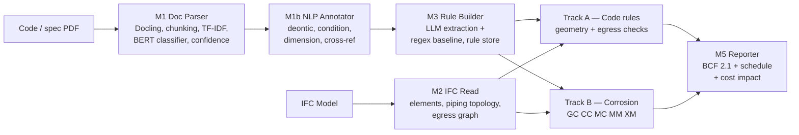

# BIMGUARD AI: NLP-Driven Rule Extraction and Deterministic Compliance Checking for Building-Code and Material-Degradation Requirements in OpenBIM Workflows

Mark Shane Haines, Osama Ata, Letícia Cristovam Clemente, Malak Yaseen, Marc Azzam
Group 5, MAICEN-1125 Module 10 — Final Master's Project

---

## 1. Introduction and Problem Statement

Compliance verification in construction is bottlenecked at the same point it has been for decades: **the requirement is locked in prose**. Building codes, standards and project specifications are written for human readers, and before any automated check can run, someone must read a clause, decide whether it is a discrete checkable requirement, identify which model elements it governs, and transcribe it into a threshold. That transcription step is manual, slow, inconsistent between reviewers, and must be repeated whenever the code or the specification changes.

Downstream of transcription, two classes of requirement must be evaluated, and practice handles them separately and unevenly.

**Prescriptive geometric requirements** — minimum stair widths, clear heights, riser and tread dimensions, guard heights, exit counts, egress travel distances — are numerically explicit and, in principle, directly checkable against model geometry. They are nonetheless commonly verified by manual drawing review, or by proprietary rule-checkers whose logic cannot be inspected, so a verdict is hard to audit and impossible to port.

**Material-degradation requirements** — whether a specified material will survive its service environment — are worse served. Review is typically **single-mechanism**: galvanic compatibility is checked because it reduces to a familiar table of electrode potentials, while crevice corrosion and microbially influenced corrosion (MIC) depend on geometry, flow regime, temperature and stagnation — inputs present in the model but rarely assembled at review time. It also happens **late**, after material selection has hardened into procurement.

Both classes share the same three unmet needs: automated extraction of the rule from its source text, deterministic and inspectable evaluation against an IFC model, and a verdict traceable to a named clause and threshold. A fourth need follows from the first three — a non-compliance is only actionable if its **programme and cost consequence** is quantified, since a finding that cannot be priced or scheduled will not change a design decision.

**The problem this project addresses** is therefore the absence of an open, end-to-end pipeline that takes regulatory and specification prose as input, extracts machine-evaluable rules from it, evaluates them against an IFC model across both prescriptive and material-degradation requirement classes, and reports each finding as a traceable BCF issue carrying its schedule and cost impact.

**Target user and use case.** The intended user is the BIM coordinator or design reviewer at RIBA Stage 3–4 / LOD 300, when changes remain cheap. The intended use is *screening* rather than certification: ranking elements by risk, surfacing the subset warranting specialist review, in a workflow where exhaustive manual checking is not economically possible.

⟦INSERT — MOTIVATING CASE⟧ *Replace with the scenario in `docs/ss316_feedback_loop_case_study.md`. State provenance in the first sentence — either "a project incident reported to the team by [source], anonymised with consent" or "an illustrative scenario constructed from typical values". Do not present modelled costs as measured costs. Any figure quoted here must match §6.*

## 2. Research and Technology Review

**Automated compliance checking (ACC).** Eastman et al. (2009) remain the standard framing, decomposing ACC into rule interpretation, model preparation, rule execution and reporting, and identifying rule *interpretation* as the step that resists automation. That diagnosis still holds and directly motivates this project's architecture. The RASE methodology (Hjelseth & Nisbet, 2011) marks up regulatory prose with Requirement, Applicability, Selection and Exception operators to produce a semi-formal intermediate representation; Beach et al. (2015) built regulatory compliance on ontologies rather than hard-coded logic. Both target prescriptive code and both still assume human markup of the source text.

**NLP for regulatory text.** The transcription bottleneck has been attacked directly. Zhang and El-Gohary (2016) developed semantic NLP-based information extraction from construction regulatory documents, recovering requirement structure through syntactic and semantic pattern matching; Zhou and El-Gohary (2017) extended ontology-based extraction to energy codes. This literature establishes the components BIMGUARD reuses — deontic operator detection (*shall* vs *should* vs *may*), quantity and unit extraction, condition scoping, cross-reference resolution — and the failure modes it inherits: coordination ambiguity, exception scoping, and table-dependent requirements that are not reducible to a fixed threshold. The release of CODE-ACCORD (Hettiarachchi et al., 2025), a corpus of building regulatory sentences labelled for rule generation, supplies for the first time a shared supervised benchmark for the sentence-level task.

**Large language models for rule extraction.** Recent practice has shifted from hand-engineered extraction patterns to prompted LLMs, which handle clause variety far better but introduce two new problems: non-determinism, and hallucination of plausible numeric rules from clauses that contain none. Neither is acceptable in a compliance setting without measurement. This project's response is architectural — LLM extraction is retained but confined behind an evaluation harness that scores it against hand-annotated ground truth for both recall *and* fabrication, and its output is a structured rule that a human can inspect before any deterministic evaluation runs.

**OpenBIM machine-checkable requirements.** buildingSMART's Information Delivery Specification (IDS; buildingSMART International, 2024) is a vendor-neutral, machine-readable format for expressing model requirements against IFC (ISO 16739-1:2024), and is the natural target for any openBIM checking tool. BIMGUARD does not currently emit IDS. The reason is scope rather than principle: IDS expresses applicability and property constraints — *this entity shall carry this property within this range* — which covers much of the prescriptive-code class well, but does not express the derived, multi-input scoring the corrosion engines perform, where a verdict depends on a weighted combination of electrode potential, wetted-area ratio, exposure class, flow velocity and geometry. Emitting IDS for the expressible subset is identified in §8 as the highest-value interoperability work remaining. Findings are exported as BCF 2.1 issues, preserving round-trip interoperability with any BCF-capable authoring tool.

**Corrosion assessment standards.** Engineering content is drawn from published standards, not learned from data: electrode-potential and area-ratio principles from ASTM G71 and Pourbaix (1974), environment-class voltage thresholds from NASA-STD-6012, PREN grade selection from IMOA, critical crevice temperature from ASTM G48, and MIC risk framing from CIBSE TM13 (2013), HSE HSG274, BS 8552 and ASTM G187.

**The gap.** ACC research targets prescriptive geometric compliance; corrosion engineering supplies validated mechanism models with no model-level integration path; IDS supplies interoperable requirement expression but not derived scoring; and none of the three closes the loop to programme and cost consequence. **The gap addressed here is the absence of an openBIM-native pipeline that spans both requirement classes from source prose to costed, scheduled, standard-traceable BCF issues**, with machine learning confined to extraction — where its error is measurable against ground truth — and excluded from adjudication, where determinism is a regulatory requirement.

## 3. Objectives and Research Questions

**Primary objective.** To design, implement and critically evaluate an openBIM-native compliance pipeline that extracts machine-evaluable rules from building-code and specification text using NLP and LLM methods, evaluates them deterministically against IFC models across both prescriptive-geometric and material-degradation requirement classes, and reports each finding as a traceable BCF issue with quantified schedule and cost impact.

This is *prototype development and pre-validation*. Field validation on live projects is out of scope and stated as future work; no claim is made of validation in production use.

- **RQ1 — Extraction.** With what precision and recall can the pipeline recover discrete, checkable rules from building-code text, and — equally important — does it correctly *decline* to extract rules from clauses that are definitional or table-dependent rather than fabricating thresholds for them?
- **RQ2 — Multi-mechanism screening.** Does simultaneous galvanic, crevice and MIC screening surface material-degradation hazards that conventional galvanic-only review misses, and at what false-positive cost?
- **RQ3 — Computational cost.** What is the wall-clock and memory cost of model-scale geometric compliance checking on federated IFC models, where is the bottleneck, and how does cost scale with element count and level of development?

RQ3 is answered with measured data (§6.4). RQ1 and RQ2 are answered against the evaluation designs in §6.1–6.3, whose result tables must be populated from the team's own harness runs before submission.

## 4. Methodological Framework

BIMGUARD is a **two-track compliance platform sharing one extraction front-end and one reporting back-end**. Track A evaluates prescriptive building-code rules against model geometry; Track B evaluates material-degradation risk. Both converge on a single canonical issue schema.

The defining design commitment is a **split between probabilistic extraction and deterministic adjudication**: machine learning is used where ground truth exists and error is measurable, and excluded where a verdict must be reproducible and defensible.

⟦FIGURE 1⟧ *Render and export as an image:*

**Stage 1 — Document parsing (`module1_doc_parser`, 2,862 LOC).** PDFs are extracted with Docling, segmented by `SectionChunker` (which recognises hierarchical code numbering such as `9.8.2.1.(1)`), and filtered for compliance relevance. Relevance fuses three independent signals — a curated keyword filter, TF-IDF salience, and a transformer sentence classifier operating zero-shot or fine-tuned against CODE-ACCORD's 862 labelled sentences. The classifier is lazily imported with graceful fallback, so the pipeline degrades to keyword-plus-TF-IDF when transformer dependencies are absent. A confidence scorer fuses the signals into a single score routing low-confidence candidates to human review. A separate `TableRuleBuilder` handles requirements expressed as table rows rather than prose.

**Stage 2 — Linguistic annotation (`module1b_nlp_annotator`, 1,179 LOC).** Retained sentences are annotated across five capabilities: deontic operator extraction, mapping modal constructions to *mandatory* (SHALL, MUST, IS REQUIRED TO), *prohibited* (SHALL NOT, NO … SHALL), *recommended* (SHOULD) and *permitted* (MAY), with ordered matching so negated forms resolve before their positive stems; dimension and unit extraction; conditional scope parsing; cross-reference resolution between clauses; and inter-clause dependency mapping. This stage is deliberately rule-based — inspectable behaviour and diagnosable errors matter more here than marginal accuracy.

**Stage 3 — Rule construction (`module3_rule_builder`, 1,121 LOC).** Annotated text is converted into structured rules by two parallel routes: a deterministic regex converter, which serves as a free baseline, and `LiteLLMRuleExtractor`, which prompts an LLM (default `gemini/gemini-2.0-flash`) through an injected `LLMClient` abstraction so providers are swappable. Extracted rules carry an IFC binding from `CODE_TO_IFC_MAP`, which maps code vocabulary to entity types — *stair, riser, tread, nosing, winder* → `IfcStairFlight`; *door, exit, egress* → `IfcDoor`; *curtain wall, glazing system* → `IfcCurtainWall`. Rules persist to a rule store with provenance to the source clause; baseline rulesets (`BUILDING-CODE-PART9`, `-EXT`) are seeded from static assets.

**Stage 4A — Prescriptive code evaluation.** `module2_ifc_read` recovers elements, properties and spatial structure via IfcOpenShell. Dimensional rules are evaluated directly against element properties using the extracted operator, value and unit. Egress compliance is handled by a dedicated engine (`ifc_egress.py`) that builds a space-connectivity graph with NetworkX from `IfcRelSpaceBoundary` door relationships, identifies exits as exterior doors, and computes travel distance from every habitable space to its nearest exit. Two checks are exposed: `check_exit_count()` and `check_egress_travel_distance()`, the latter against a configurable limit (default 25 m).

**Stage 4B — Material-degradation evaluation.** Five engines evaluate each element. Each is a published, versioned ruleset with fixed weights and band boundaries — no learned parameters, no stochastic component.

| Ruleset | Composite score | Band boundaries | Principal standards |
|---|---|---|---|
| **GC-001** Galvanic | 0.50 × voltage_risk + 0.30 × area_ratio_risk + 0.20 × environment_multiplier | Low < 0.35 · Med 0.35–0.65 · High 0.65–0.85 · Critical > 0.85 | NASA-STD-6012; ASTM G71; IMOA (PREN) |
| **CC-001** Crevice | 0.35 × geometry_risk + 0.40 × CCT_adequacy + 0.25 × environment_severity | Low < 0.30 · Med 0.30–0.55 · High 0.55–0.80 · Critical > 0.80 | ASTM G48 (CCT); IMOA |
| **MC-001** MIC | 0.35 × flow_velocity + 0.30 × temperature + 0.25 × dead_leg + 0.10 × material_susceptibility | Low < 0.25 · Med 0.25–0.50 · High 0.50–0.75 · Critical > 0.75 | CIBSE TM13; HSE HSG274; BS 8552; ASTM G187 |
| **MM-001** Material–media | JSON rule pack (`data/rulesets/`) | per rule pack | material/fluid compatibility |
| **XM-001** Cross-material | JSON rule pack (`data/rulesets/`) | per rule pack | coupled-material interaction |

Where an element triggers several mechanisms, the reported *dominant mechanism* is the highest-banded result. This is a deliberate max-selection policy, not an ensemble: the engines are independent and are not combined into a joint estimate. The policy is chosen because the mechanisms are physically independent failure paths — the governing hazard is the worst, not the average.

**Stage 5 — Reporting, schedule and cost (`module5_reporter`, 1,676 LOC).** Findings from both tracks are normalised through an adapter into one canonical `Issue` schema, each receiving a deterministic identifier `{ENGINE}-{SEQUENCE}` from a per-run `IssueIdAllocator` for stable audit numbering. Issues export as BCF 2.1 carrying rule identifier, component scores, band, threshold and clause citation. Two further modules convert findings into project consequence: `schedule_impact.py` links each issue to programme activities via an impact model keyed on risk band and mechanism, emitting delay days, cost and Gantt-ready data; `cost_model.py` supplies the rates, defaulting to built-in UK commercial MEP remediation rates but overridable by an uploaded CSV, so a practice substitutes its own commercial assumptions rather than inheriting ours.

## 5. Development Process

Development ran across three sprints with mentor checkpoints at the partial submissions.

**Sprint 1 — extraction and code track.** Document parsing, the NLP annotator, LLM and regex extraction, IFC ingestion and the prescriptive-code checks were built against a growing regression suite, with baseline rulesets seeded from static assets.

**Sprint 2 — corrosion track and Path B.** The corrosion engines were integrated, then MM-001 and XM-001 added behind independent feature flags (`FEATURE_PATH_B_MM`, `FEATURE_PATH_B_XM`) so they could ship dark while established engines ran unaffected. The adapter and canonical issue schema were introduced here to stop engine-specific result shapes leaking into the UI.

Three defects are recorded because each exposed a class of weakness rather than a one-off error.

*Band casing.* Engines emitted title-case bands (`"Medium"`) while dominant-mechanism selection compared upper case, so every element silently collapsed to the first-evaluated mechanism. No exception was raised and output stayed plausible; only a test asserting mechanism distribution caught it. **Lesson:** string-typed enumerations crossing a module boundary are an unenforced contract. Normalisation was centralised and 38 tests added; the durable fix, deferred, is a typed enumeration.

*Allocator threading.* The orchestrator invoked Path B comparison functions without the `IssueIdAllocator`, producing `AttributeError: 'NoneType' has no attribute 'next'`. **Lesson:** per-run state passed implicitly through a call chain is fragile under extension; the allocator is now constructed by the orchestrator and injected as a required argument.

*Rule-pack validation.* Loaders accepted invalid packs and failed later with misleading errors. They now validate on read and raise with the offending file path.

**Sprint 3 — evaluation infrastructure and hardening.** Three scoring harnesses replaced subjective assessment with measured accuracy: `score_module1b.py` across the annotator's five capabilities; `score_module3_extraction.py`, which runs the real PDF through the real extraction primitives and scores against hand-annotated ground truth; and `eval_harness.py`, an LLM-as-judge scoring generated rules on three dimensions with historical tracking. A nine-check pre-flight driver (`scripts/validate_repo.py`) gates the repository across tests, imports, feature flags, adapter, orchestrator, lint, wiring, known blockers and secrets. `check_flags` exercises all four flag combinations; `check_blockers` registers known defects as strict expected-failures, so fixing one turns the suite red and forces the registry to be updated. The performance benchmark harness was built here after early drafts of this memory were found to contain figures that could not be reproduced.

## 6. Results and Evaluation

A distinction is drawn throughout between **software verification** — the system does what it was built to do — and **domain validation** — its verdicts are correct.

**Software verification.** The repository comprises 45,640 lines of Python outside the virtual environment (35,991 under `app/`), with 311 test functions across 18 test modules, gated by the nine-check driver. This establishes internal consistency, clean feature-flag toggling across all four combinations, absence of circular imports, and no committed credentials. **It establishes nothing about predictive accuracy** and is reported as a hygiene precondition, not a result. ⟦ACTION — the current branch has unresolved merge-conflict markers in four files including `compliance_orchestrator.py`; resolve and re-run before making any claim in this paragraph.⟧

### 6.1 RQ1 — Rule extraction accuracy against ground truth

*Ground truth.* A hand-annotated answer key covers building code Part 9, Sections 9.8.2–9.8.4.7 (stairs, ramps, handrails and guards) — 7,909 characters of source text yielding **29 GOLD_RULES**, each specifying reference clause, IFC target class, property name, operator, value, unit and applicability condition, plus **5 EXCLUDED_CLAUSES**. The excluded set is the methodologically important half: these are clauses that are definitional, occupant-load-dependent or table-lookup-based and therefore *not* reducible to a single checkable threshold. A correct pipeline must skip them. Extracting a fabricated numeric rule from one is a hallucination, not a recall win, and is scored separately.

*Design.* `score_module3_extraction.py` runs the real PDF through the real primitives in two parts. Part A is free structural diagnostics: heading detection on the text the live upload path actually stores versus the Docling markdown path; chunk preparation replicating the production pipeline; SKIP-leakage analysis, asking whether the confidence scorer discards gold-bearing text before the LLM ever sees it; table-pipeline coverage; and a regex-baseline recall/precision figure. Part B scores `LiteLLMRuleExtractor` per field against gold. The sentence classifier is separately evaluated on a held-out CODE-ACCORD split; `score_module1b.py` scores the annotator's five capabilities.

⟦INSERT — TABLE 1⟧ *Run `uv run python score_module3_extraction.py` and `score_module1b.py` and populate:*

| Stage | Metric | Regex baseline | LLM extractor |
|---|---|---|---|
| Gold rule recall (of 29) | | | |
| Per-field precision (target / property / operator / value / unit) | | | |
| Hallucination rate on 5 EXCLUDED_CLAUSES | | | |
| SKIP leakage (gold-bearing chunks dropped pre-LLM) | | | |
| Deontic / dimension / condition accuracy (module 1b) | | | |

*Interpretation to be written against measured numbers.* The decisive question is not raw recall but whether the confidence score separates reliable from unreliable extractions well enough to make selective human review economical. Report the precision–coverage curve, and report hallucination rate as a headline figure — for a compliance tool it matters more than recall.

### 6.2 Prescriptive code checking against IFC

⟦INSERT — TABLE 2⟧ *Run the seeded Part 9 ruleset against a test model and report: rules evaluated, elements checked per rule class, pass/fail/not-applicable counts, and the proportion of extracted rules that could not be evaluated because the required IFC property was absent from the model.* That last figure is the most useful result in this section: it measures how much of code compliance is blocked by **model information quality** rather than by checking capability, which is a finding of direct relevance to ISO 19650 information-requirement practice.

⟦INSERT — EGRESS RESULTS⟧ *Report `check_exit_count()` and `check_egress_travel_distance()` on the test model — spaces analysed, graph construction time, travel distances computed, failures against the 25 m limit — and state the limitation that travel distance is computed on a door-adjacency graph rather than a true path-finding solution over floor geometry.*

### 6.3 RQ2 — Value of multi-mechanism screening

*Design.* A benchmark of ⟦INSERT n — target 40–60⟧ material/environment/geometry couples spanning the material families and exposure classes in scope, each assigned a ground-truth band by ⟦INSERT: expert assignment procedure⟧. The comparison of interest is **galvanic-only screening (the manual status quo) against full multi-mechanism screening** on identical inputs.

⟦INSERT — TABLE 3⟧ *4 × 4 confusion matrix over LOW / MEDIUM / HIGH / CRITICAL, plus:*

| Metric | Galvanic-only | Multi-mechanism |
|---|---|---|
| CRITICAL recall (hazards not missed) | | |
| CRITICAL precision (alarm burden) | | |
| Hazards found only by CC-001 / MC-001 | — | |

The design deliberately favours recall on CRITICAL over precision: for a screening tool a missed critical hazard and a false alarm are not symmetric costs. State the trade-off explicitly and quantify the alarm burden it produces.

⟦INSERT — WORKED EXAMPLE⟧ *Re-run the SS316 scenario through the current engines and report actual component scores, not previously quoted values. Give each engine's input vector, weighted terms, composite and band, so the arithmetic is reproducible from §4. Note that CC-001's dominant term is CCT adequacy, which is chloride-dependent: if the water is chloride-bearing, state the concentration; if not, expect and explain a low crevice score. Do not report a 0–1 composite as a probability or percentage.*

*Claim discipline.* The defensible finding is that **galvanic-only review does not detect crevice- or MIC-governed hazards, so a multi-mechanism screen is necessary**. Sufficiency cannot be established at this benchmark size and is not claimed.

⟦INSERT — EXPERT REVIEW⟧ *From `docs/expert_review_process.md`: panel composition and recruitment, review instrument, whether reviewers saw tool output before forming their own judgement, consent handling, and agreement as an inter-rater statistic (Cohen's or Fleiss' κ) rather than a percentage.*

### 6.4 RQ3 — Computational cost of model-scale checking

Eleven scenarios at n = 7 repeats; medians with inter-quartile range, because timing distributions are bounded below by true cost and unbounded above by scheduler interference. Host: Python 3.11.15, Linux x86-64, 4 CPU, 15.7 GB RAM, IfcOpenShell 0.8.5, NumPy 2.4.6. S-100 to S-federated are IFC-derived; S-scale rows are synthetic geometry isolating algorithmic scaling from parsing cost.

**Table 4 — End-to-end scaling (median, IQR in parentheses)**

| Scenario | Elements | LOD | Parse (s) | Triangulate (s) | Volume gen (s) | Arrays (MB) |
|---|---:|---:|---:|---:|---:|---:|
| S-100 | 100 | 300 | 1.53 (0.14) | 1.84 (0.07) | 0.038 (0.001) | 0.21 |
| S-1000 | 1,000 | 300 | 1.55 (0.09) | 30.10 (1.54) | 0.386 (0.007) | 2.13 |
| S-federated | 1,999 | 300 | 6.29 (0.62) | 53.42 (2.29) | 0.755 (0.026) | 4.23 |
| S-scale5000 | 5,000 | 300 | — | — | 1.206 (0.034) | 10.37 |
| S-scale20000 | 20,000 | 300 | — | — | 5.116 (0.169) | 41.47 |

**The bottleneck is geometry triangulation, not compliance evaluation.** At S-1000, geometric compliance processing is 0.386 s of a 31.94 s total — **1.2%** — while triangulation accounts for 30.10 s, or 94%. The cost of model-scale checking is dominated by IFC geometry processing that any IFC consumer must pay; the marginal cost of adding compliance evaluation is small. Optimisation should target caching or reusing triangulation, not the checking algorithms.

**Level of development drives cost non-linearly.** Holding element count at 1,000 with parse and triangulation constant, volume generation costs 0.020 s at LOD 200, 0.386 s at LOD 300 and 0.490 s at LOD 400 — a **19× step from LOD 200 to LOD 300**, tracking geometric amplification. Early-stage screening is close to free and can run continuously; detailed-stage screening is run on demand.

**A negative result on spatial indexing.** Broad-phase interference detection is *slower* than naive pairwise comparison below roughly 2,000 volumes (0.5–0.9×), because index construction is not amortised and dense real models generate high candidate-pair counts — 46,518 candidates at 1,000 volumes, of which 13,102 genuinely interfere. The optimisation pays only from ~5,000 volumes (5.5×), reaching 12.9× at 20,000. **Every IFC-derived scenario sits below the crossover**, so the index does not benefit the models actually tested; a size-conditional dispatch to the naive path would be faster today. The index is justified only by the federated multi-model case, where it also recovered 3,916 cross-model interfering pairs.

**Memory, determinism and measurement honesty.** Resident-set growth is negligible (median 0.0 MB to 10,000 elements; 0.29 MB at 20,000) and geometric outputs are bit-identical across all seven repeats. Two metrics exceeded 20% IQR — broad-phase timing at LOD 200 and RSS delta at 20,000 elements — but both are sub-threshold magnitudes where relative spread is noise, and no conclusion rests on either. Two run warnings are recorded: the federated scenario yielded 1,999 of a targeted 2,000 elements with usable geometry, and volume generation at 20,000 elements exceeded a 5 s budget.

⟦FIGURE 2⟧ *Log–log plot of generation time against element count, overlaid with naive and broad-phase curves, marking the ~2,000-volume crossover.*

## 7. Limitations, Ethical Considerations and Risk Analysis

**Evaluation limitations.** Extraction ground truth covers one section of one code — Part 9 §9.8 — so generalisation to other sections, codes and jurisdictions is untested. The corrosion benchmark spans tens of couples with a small expert panel. Neither constitutes validation. No field deployment has occurred and no post-commissioning outcome data exists; timings come from a single 4-core host and do not characterise production hardware or concurrency.

**Non-determinism in the extraction stage.** LLM extraction is not reproducible run-to-run. The mitigation is architectural — output is a structured, human-inspectable rule reviewed and stored before adjudication — and no claim of reproducible *extraction* is made, only of reproducible *evaluation*. Reporting extraction accuracy without a variance estimate would overstate it; repeat runs should be reported.

**Model information quality is a hard limit.** A rule can only be evaluated if the model carries the property it constrains. Where properties are absent, BIMGUARD cannot distinguish non-compliance from non-population and reports the rule as not evaluable rather than as a pass. The proportion blocked this way (§6.2) reflects industry modelling practice, not the tool.

**Calibration basis, not training data.** The corrosion engines contain no learned parameters; their weights and bands are judgement-based syntheses of standards drawn predominantly from North American and European practice, so coverage is weakest where those standards are thin — tropical marine atmospheres, reclaimed and greywater systems, additively manufactured metals. This is a coverage limitation, not a dataset bias, and the mitigation is explicit out-of-scope declaration rather than silent extrapolation. The NLP stage *is* trained, on CODE-ACCORD, and inherits that corpus's jurisdictional and linguistic distribution.

**Transparency of rules — stated plainly.** Only MM-001 and XM-001 are repo-versioned JSON rule packs. GC-001, CC-001, MC-001 and the seeded code rulesets load from database static assets, and the corrosion composite weights and band boundaries are literals in engine source. Consequently **a threshold can be changed in the database without a commit**, so "why did this rule change?" is answerable by inspection only for the two JSON-backed engines. Migrating the remainder to versioned files with a documented change procedure is the first item of remaining work.

**Cost and schedule figures are modelled, not measured.** The default impact rates are indicative UK commercial MEP remediation assumptions, not project data. They exist to make findings comparable and prioritisable, and are user-overridable by CSV precisely because they should not be trusted as absolute values. Any figure derived from them must be presented as an estimate under a stated rate basis.

**Data governance.** IFC models and specifications are commercially sensitive. Processing is local; Supabase holds configuration and review logs, not model content. No user-supplied model or document is used to train or tune any component. Third-party deployments would require access logging, encryption at rest and a retention policy — none implemented in the prototype.

**Scope of decision authority.** BIMGUARD is a screening aid. It does not certify compliance, and its outputs must not substitute for statutory approval or for site-specific corrosion engineering on high-consequence installations. The principal misuse risk is exactly that substitution — a PASS or a LOW band read as clearance rather than as an absence of screened risk. Reporting language and BCF issue text should state this on every export.

**Responsible AI.** Machine learning is confined to a stage where errors are measurable against ground truth and reviewable by a human before they affect a verdict; adjudication is deterministic, versioned and clause-cited, so a verdict can be reproduced and contested. The hallucination check against EXCLUDED_CLAUSES is the concrete expression of this commitment: the system is explicitly measured on its willingness to *not* produce an answer.

**Failure modes.** Malformed IFC terminates with a diagnostic rather than partial output; database unavailability degrades MM-001 to offline packs; an invalid rule pack raises with its file path. Silent-wrong-answer failures — of which band casing was one — are the residual risk, addressed by contract tests rather than exception handling.

## 8. Contributions to AECO Practice and Future Research

**Contributions.**

1. **A two-track, source-to-BCF compliance pipeline.** An openBIM-native path from regulatory and specification prose through NLP and LLM rule extraction to per-element verdicts across both prescriptive-geometric and material-degradation requirement classes, exported as BCF 2.1 with quantified schedule and cost impact, using only public standards and open formats.
2. **An extraction benchmark that scores restraint, not only recall.** A hand-annotated answer key of 29 gold rules plus 5 deliberately excluded clauses, with harnesses that run the real document through the real pipeline. Measuring whether an extractor fabricates thresholds from non-threshold clauses is, for compliance work, the more important half — and is rarely reported.
3. **Measured cost characterisation of model-scale checking**: compliance evaluation is ~1% of pipeline cost against 94% for triangulation; a 19× LOD 200→300 step; and the negative result that spatial indexing does not pay below ~2,000 volumes. These are reusable engineering data for anyone building IFC-based checking tools.

**Practical impact.** The realistic near-term use is continuous low-cost screening at LOD 200–300 that ranks findings for specialist review, prices and schedules them so they compete for design attention, and leaves an audit trail tying each verdict to a named clause.

**Future research.**

1. **IDS interoperability.** Map extracted rules to IDS-expressible property constraints and emit IDS for the expressible subset — most of the prescriptive-code track — retaining derived corrosion scoring outside it.
2. **Extraction breadth.** Extend ground truth beyond Part 9 §9.8 to further sections and a second jurisdiction, and report cross-code generalisation rather than in-domain accuracy.
3. **Rule governance.** Externalise database-resident rulesets to versioned files with change control, closing the auditability gap in §7.
4. **True egress path-finding.** Replace door-adjacency travel distance with geometric path-finding over floor plates, and validate against manual code review.
5. **Uncertainty quantification.** Propagate input uncertainty to a band *distribution* rather than a point band, and report the proportion of elements whose band is stable under it.
6. **Field validation and sustainability coupling.** Deploy on live projects, recalibrate against observed outcomes, and convert avoided premature replacement into embodied-carbon terms so screening feeds lifecycle assessment.

---

## References

ASTM International. (2012). *ASTM G187-12a*. ASTM International. ⟦VERIFY designation and full title⟧

ASTM International. (2019). *ASTM G71-81(2019): Standard guide for conducting and evaluating galvanic corrosion tests in electrolytes*. ASTM International.

ASTM International. (2020). *ASTM G48-11(2020): Standard test methods for pitting and crevice corrosion resistance of stainless steels and related alloys by use of ferric chloride solution*. ASTM International.

Beach, T. H., Rezgui, Y., Li, H., & Kasim, T. (2015). A rule-based semantic approach for automated regulatory compliance in the construction sector. *Expert Systems with Applications, 42*(12), 5219–5231.

British Standards Institution. (2012). *BS 8552:2012: Sampling and monitoring of water from building services closed systems*. BSI.

buildingSMART International. (2021). *BIM Collaboration Format (BCF) 2.1 specification*. buildingSMART International.

buildingSMART International. (2024). *Information Delivery Specification (IDS)*. buildingSMART International.

Chartered Institution of Building Services Engineers. (2013). *TM13:2013: Minimising the risk of Legionnaires' disease*. CIBSE.

Eastman, C., Lee, J., Jeong, Y., & Lee, J. (2009). Automatic rule-based checking of building designs. *Automation in Construction, 18*(8), 1011–1033.

Health and Safety Executive. (2014). *HSG274: Legionnaires' disease — Technical guidance, Parts 1–3*. HSE Books.

Hettiarachchi, H., et al. (2025). CODE-ACCORD: A corpus of building regulatory data for rule generation towards automatic compliance checking. *Scientific Data*. ⟦VERIFY authors, year, volume, DOI⟧

Hjelseth, E., & Nisbet, N. (2011). Capturing normative constraints by use of the semantic mark-up RASE methodology. *Proceedings of the CIB W78-W102 Conference*.

International Organization for Standardization. (2018). *ISO 19650-1:2018: Organization and digitization of information about buildings and civil engineering works, including building information modelling — Part 1: Concepts and principles*. ISO.

International Organization for Standardization. (2024). *ISO 16739-1:2024: Industry Foundation Classes (IFC) for data sharing in the construction and facility management industries — Part 1: Data schema*. ISO.

National Aeronautics and Space Administration. (2019). *NASA-STD-6012: Corrosion protection for space flight hardware*. NASA. ⟦VERIFY exact title and revision⟧

⟦INSERT⟧ *Full citation for the building code edition used as extraction ground truth — jurisdiction, edition year, publisher, and the sections covered (Part 9, 9.8.2–9.8.4.7).*

Pourbaix, M. (1974). *Atlas of electrochemical equilibria in aqueous solutions* (2nd English ed.). NACE International.

Zhang, J., & El-Gohary, N. M. (2016). Semantic NLP-based information extraction from construction regulatory documents for automated compliance checking. *Journal of Computing in Civil Engineering, 30*(2), 04015014.

Zhou, P., & El-Gohary, N. (2017). Ontology-based automated information extraction from building energy conservation codes. *Automation in Construction, 74*, 103–117.

## Appendices

**Appendix A — Repository.** `maicen/bim-guard`. 45,640 lines of Python outside the virtual environment; 311 test functions across 18 modules; nine-check pre-flight driver at `scripts/validate_repo.py`.

**Appendix B — Extraction ground truth.** `eval_gold_code_9_8_stairs.py`: source text, 29 GOLD_RULES with IFC bindings, 5 EXCLUDED_CLAUSES with exclusion rationale. Harnesses: `score_module3_extraction.py`, `score_module1b.py`, `app/modules/tests/eval_harness.py`.

**Appendix C — Ruleset specifications.** Composite formulas, band boundaries, input catalogues and standards mappings for GC-001, CC-001, MC-001, MM-001, XM-001; seeded code rulesets `BUILDING-CODE-PART9` and `BUILDING-CODE-PART9-EXT`; `CODE_TO_IFC_MAP` bindings.

**Appendix D — Benchmark data.** `docs/benchmarks/` — 11 scenarios, n = 7 repeats, host specification, determinism check.

**Appendix E — Cost and schedule impact model.** Default rate basis, CSV override schema, worked example.

**Appendix F — Expert review instrument and consent documentation.** ⟦INSERT⟧

**Appendix G — Individual contribution statement.** ⟦INSERT — per-author contribution across problem framing, extraction stack, code checks, corrosion engines, benchmark harness, evaluation and writing⟧
