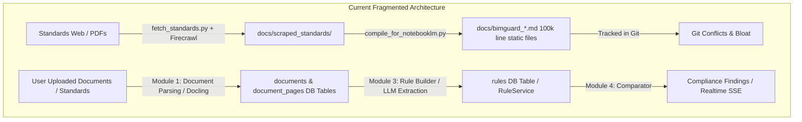
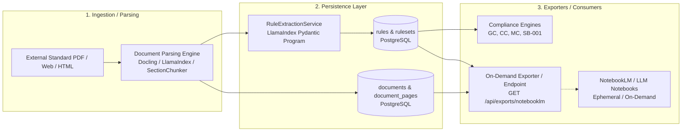

### Why the Corpora Are Not Following the Rest of the Codebase's Architecture

The rest of the BIM-Guard codebase follows a very strict, modern architectural philosophy (defined in [AGENTS.md](https://github.com/maicen/bim-guard/blob/main/AGENTS.md)):

1. **Dynamic Database-Driven Rules**: Rules, thresholds, and engine parameters are never hardcoded or static — they are persisted dynamically in Supabase (`RuleService`, `public.corrosion_rules`, etc.).
2. **API & Event-Driven Decoupling**: Frontend views consume typed REST APIs and Server-Sent Events (`/api/events/{project_id}`) rather than reading bundled static data dumps.
3. **Stateless Compute**: Compute engines are decoupled Python kernels operating on transient or DB-fetched inputs.

Yet, **the NotebookLM corpora (`docs/bimguard_seismic_rules.md` and `docs/bimguard_corrosion_rules.md`) do the exact opposite**:

| Architecture Dimension          | The Rest of the Codebase                                                          | The Corpora (`compile_for_notebooklm.py`)                                                            |
| :------------------------------ | :-------------------------------------------------------------------------------- | :--------------------------------------------------------------------------------------------------- |
| **Storage & Persistence**       | Supabase Postgres + Storage bucket (`data/cache/supabase-storage/` is gitignored) | **Two 100,000+ line static Markdown files committed directly to Git**                                |
| **Lifecycle**                   | Dynamic, ephemeral, computed at runtime or seeded once                            | Statically compiled snapshots containing dumps of Python code, JSON configs, and documentation       |
| **Git Cleanliness**             | Small, focused commits adhering strictly to linear history                        | **Massive merge conflicts and git churn** (+10,000 lines diffed whenever any unrelated file changes) |
| **Authority / Source of Truth** | Source code (`app/`, `tests/`) and PostgreSQL                                     | Stale mirror that lags behind code commits                                                           |

---

### Why Was It Done This Way Originally?

These files were created for **Google NotebookLM** (a tool that requires uploading standalone text/markdown documents to build a knowledge base for LLM questioning).

Because NotebookLM cannot directly query a live Postgres database or a Git repository, `scripts/compile_for_notebooklm.py` was written to stitch together code, docs, and rules into monolithic `.md` exports.

**The mistake was checking those generated outputs into Git.** Once a generated build artifact is checked into version control, Git treats it as source code. Whenever any service, parser, or doc file is touched, the corpora are technically "stale" until someone runs the compiler script and commits a giant diff.

---

### Can We Fix That Once and For All?

**Yes.** We can fix this permanently in two steps:

#### 1. Stop Tracking the Generated Corpora in Git

We tell Git to ignore the compiled files so they never trigger git conflicts, stale-state warnings, or merge headaches again:

1. Add them to `.gitignore`:
   ```gitignore
   # NotebookLM compiled corpora (generated by scripts/compile_for_notebooklm.py)
   docs/bimguard_seismic_rules.md
   docs/bimguard_corrosion_rules.md
   ```
2. Untrack them from the repository index:
   ```bash
   git rm --cached docs/bimguard_seismic_rules.md docs/bimguard_corrosion_rules.md
   ```

#### 2. Make Them Purely On-Demand

- Whenever a developer or researcher actually needs fresh files to upload to NotebookLM, they simply run:
  ```bash
  uv run python scripts/compile_for_notebooklm.py
  ```
  The script writes the files locally to `docs/`, they upload them, and Git completely ignores them.
- No developer will ever have to "rebuild the corpora" before pushing or rebasing again.

---

### Analysis: Can We Restructure This to Follow the Repo's Standard Pipeline?

**Yes, absolutely.** In fact, doing so aligns the NotebookLM / external knowledge workflow with the core architectural design of BIM-Guard.

Currently, we have two competing mechanisms for ingesting and processing standards:



The right branch (`Module 1 -> Module 3 -> PostgreSQL DB`) is typed, validated, and adheres to ISO 19650 and database persistence.
The left branch (`fetch_standards.py` -> `compile_for_notebooklm.py` -> `docs/bimguard_*.md`) is an isolated sidecar that dumps unstructured raw text and code into Git.

---

### Recommended Architecture: The Unified "Ingest -> Extract -> Store -> Export" Pipeline

To make this fully consistent with the rest of the codebase, we should restructure this into a proper **Parser → Extractor → Database → Dynamic Exporter** workflow:



---

### Concrete Recommendations & Implementation Steps

#### 1. Ingestion: Route Standards through the Existing Document Ingestion Service

- **Current state**: `fetch_standards.py` downloads pages and writes markdown directly to disk (`docs/scraped_standards/`).
- **Target state**: Standards (e.g., ISO 9223, EN 1998-1, NFPA 13) should be registered as first-class `DocumentItem` entities in the database.
  - They are parsed via the standard [`app/modules/document_parsing/`](https://github.com/maicen/bim-guard/tree/main/app/modules/document_parsing/) (using Docling / LlamaIndex).
  - Page-tagged and section-chunked contents land in `document_pages` and `documents` tables via [`DocumentPagesService`](https://github.com/maicen/bim-guard/tree/main/app/services/document_pages_service.py).
  - This immediately gives us bounding-box provenance, clause hierarchy, and searchability in the UI.

#### 2. Extraction: Extract Machine Rules into `RuleService`

- **Current state**: Rules in the corpus exist purely as static prose in Markdown files or scattered JSON files in `data/rulesets/`.
- **Target state**: Feed the parsed standard sections through [`RuleExtractionService`](https://github.com/maicen/bim-guard/tree/main/app/services/rule_extraction_service.py).
  - Extracted rules are stored in Supabase with explicit metadata (`source_document_id`, `source_page_number`, `source_node_id`, `operator`, `check_value`, `severity`).
  - They become live, queryable rules under [`RuleService`](https://github.com/maicen/bim-guard/tree/main/app/services/rules_service.py) that can be audited, reviewed in the UI, and executed against IFC models.

#### 3. Export: Make NotebookLM Generation a Dynamic Exporter (Read from DB, Don't Commit to Git)

- **Current state**: `compile_for_notebooklm.py` walks filesystem directories and glues Python source files together into committed Markdown files.
- **Target state**:
  - Convert the script into an exporter service (e.g. `CorpusExportService` or an endpoint `GET /api/rulesets/{id}/export-corpus`).
  - When invoked, it queries the database for:
    1. Active rules from `public.rules` (filtered by category: seismic, corrosion, etc.).
    2. Relevant standard excerpts and clause texts from `document_pages`.
    3. The engine specifications/metadata.
  - It streams or generates the Markdown bundle **on-demand** into a temporary file or download stream.

#### 4. Immediate Clean-up (Prevent Immediate Developer Blockers)

While the pipeline migration is scheduled:

1. Add `docs/bimguard_seismic_rules.md` and `docs/bimguard_corrosion_rules.md` to `.gitignore`.
2. Run `git rm --cached` on both files so they are removed from Git history tracking.
3. Update `scripts/compile_for_notebooklm.py` to write to a gitignored location (or `dist/corpora/` / `docs/.generated/`).

---

### Summary Table: Before vs. After

| Feature                 | Current Ad-Hoc Script Approach                        | Recommended Pipeline-Aligned Approach               |
| :---------------------- | :---------------------------------------------------- | :-------------------------------------------------- |
| **Ingestion**           | Firecrawl script writing to `docs/scraped_standards/` | Standard Docling / `DocumentParsing` engine         |
| **Storage**             | Git-committed `.md` files                             | PostgreSQL (`documents`, `document_pages`, `rules`) |
| **Rule Representation** | Unstructured text snippets                            | Schema-validated Pydantic `RuleContract` in DB      |
| **NotebookLM Support**  | Giant monolithic files checked into Git               | Dynamic API export or CLI script pulling from DB    |
| **Git Impact**          | Frequent merge conflicts, massive diffs               | **Zero git impact**                                 |
