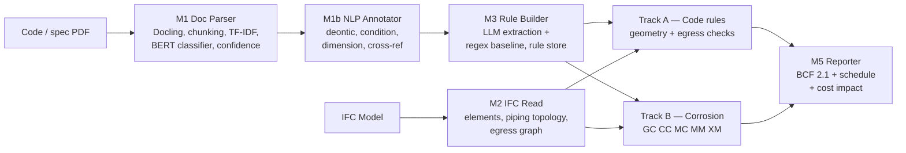
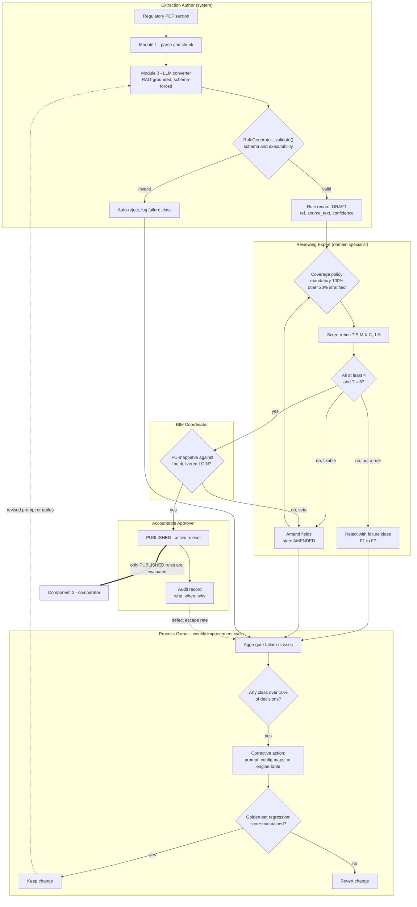

# BIMGUARD AI — Seismic Bracing & Clearance Corpus

Seismic slice of the BIMGUARD AI OpenBIM compliance application: the SB-001 (Blue Halo) bracing-clearance engine, generated jurisdiction configs, halo volume generation and clash logic, plus the shared platform architecture. Compiled for analysis against seismic restraint codes (EN 1998-1, DIN 4149, ASCE 7-22, NFPA 13, SMACNA, FEMA E-74).

- **NotebookLM workspace:** FMP: BIMGUARD AI - Seismic
- **Generated:** 2026-09-04 07:17 UTC
- **Source repository:** `bim-guard`
- **File types included:** `.csv`, `.json`, `.md`, `.py`, `.txt`, `.xml`
- **Files included:** 183 (28 seismic-specific, 155 shared architecture files also present in the companion notebook)

---

## (repository root)

### README.md

````markdown
# BIM-Guard

## Live Demo

View the published demo at [https://maicen.github.io/bim-guard/](https://maicen.github.io/bim-guard/).

## Overview

BIM-Guard is an ISO 19650-compliant OpenBIM compliance platform built on a modern decoupled architecture: a high-performance **FastAPI API Gateway** and a **decoupled Vite + Svelte 5 SPA Frontend**, backed by framework-agnostic Python physics engines and compliance pipelines. Users can upload IFC models and regulatory specifications, extract compliance rules, manage rule libraries, validate ISO 19650 container naming conventions (UK National Annex), enforce CDE state machine transitions (WIP → SHARED → PUBLISHED → ARCHIVED), verify Level of Information Need (LOIN) via buildingSMART Information Delivery Specifications (IDS), run multi-engine audits, and stream live progress via Server-Sent Events (SSE).

## Key Capabilities

- **buildingSMART Ecosystem Integration**:
  - **bSDD (buildingSMART Data Dictionary)**: Standardizes semantic terminology and validates material definitions, classifications (Uniclass, OmniClass), and property sets against the bSDD REST API with offline resilience.
  - **openCDE Foundation & Documents APIs**: Provides vendor-neutral discovery (`/api/cde/versions`), user profile context, OAuth2 configuration, OData v4 query filtering, strong ETag HTTP 304 caching, and automated document synchronization.
  - **IFC Pre-Flight Validation Service**: 3-stage pre-flight quality gateway verifying STEP ISO 10303-21 physical syntax, IFC schema compatibility (IFC2X3, IFC4, IFC4.3), and buildingSMART Gherkin rules (single project root, 22-char GUID integrity, spatial containment, material association).
  - **IDS (Information Delivery Specification) Expansion**: Generates, imports, and audits buildingSMART IDS 0.9.6 / 1.0 XML specifications with multi-facet requirements (`entity`, `property`, `classification`, `material`, `partOf`) and numerical tolerance checks.
  - **BCF REST API v2.1 / v3.0**: Bidirectional REST endpoints (`/api/bcf/v2.1/projects`) managing topics, viewpoints, comments, and snapshot binaries with ISO 19650 metadata parity.
- **ISO 19650 Container Naming & Metadata**: Validates container naming fields (`[Project]-[Originator]-[Volume]-[Level]-[Type]-[Role]-[Number]`), suitability codes (`S0`–`S4`, `A1`–`A4`), and revision codes (`P01.01`, `C01`).
- **CDE State Machine Governance**: Guards project and document workflow state transitions (`WIP` → `SHARED` → `PUBLISHED` → `ARCHIVED`) with RLS database triggers restricting mutation of published models.
- **BCF 2.1 Metadata Injection**: Enriches BCF issue reports with ISO 19650 container labels, suitability codes, and revision tags.

## Compliance Module Scope

BIMGUARD AI is an Automated Code Compliance Checking (ACCC) platform that bridges
OpenBIM standards (IFC, BCF, IDS) with large language models. Its compliance
engines and data ingestion pipeline evaluate structural and material integrity
against international building codes through two primary modules:

*   **GC-001 (Seismic):** Evaluates nonstructural component clearance volumes and clash detection against seismic bracing standards (e.g., FEMA E-74, ASCE 7-22).
*   **CC-001 (Piping & Corrosion):** Evaluates material degradation, galvanic mismatch, and environmental exposure against atmospheric standards (e.g., ISO 9223, MBIE B2).

## The Agentic RAG Methodology

To eliminate AI hallucination and ensure strict engineering accuracy, this project
utilizes a "Walled Garden" Retrieval-Augmented Generation (RAG) architecture:

1.  **Retrieval (`scripts/fetch_standards.py`):** An LLM-native web scraping script powered by the Firecrawl API dynamically retrieves open-access government building codes and manufacturer material specifications, converting them into clean Markdown.
2.  **Augmentation (`scripts/compile_for_notebooklm.py`):** A custom compilation pipeline packages the OpenBIM Python logic (`IfcOpenShell`), static JSON rule packs, and scraped standards into targeted, domain-isolated Markdown exports (`docs/bimguard_seismic_rules.md` and `docs/bimguard_corrosion_rules.md`).
3.  **Generation (Gemini Notebooks):** The compiled domains are fed into isolated Google Gemini Notebook (NotebookLM) workspaces. The AI reasoning engine evaluates the Python codebase strictly against the ingested facts (and uploaded proprietary, IP-protected PDFs) to identify gaps in the compliance algorithms.

### Pipeline Components

*   `app/engines/` — Core Python kernels for galvanic, crevice, and seismic clearance analysis.
*   `data/rulesets/` — Static JSON configurations defining fallback rules for material mismatch (MM-001), cross-material (XM-001) interactions, and the EN 1998-1 / DIN 4149 seismic jurisdiction config.
*   `scripts/` — The AI data ingestion and Markdown compilation pipeline.
*   `docs/scraped_standards/` — Retrieved standards, regenerable and excluded from version control.

### Regenerating the AI Workspace

To pull a new open-access standard and recompile the AI workspace:

```bash
# 1. Search and extract an online standard via Firecrawl
python scripts/fetch_standards.py "MBIE B2 durability for metal components" mbie_durability --corrosion --search

# 2. Compile the updated codebase and standards for NotebookLM
python scripts/compile_for_notebooklm.py
```

## Stack

- **Backend API**: FastAPI (REST + SSE) with strict Pydantic data contracts
- **Frontend SPA**: Svelte 5, Vite, TypeScript, Tailwind CSS (under `frontend/`)
- **IFC & BIM Processing**: IfcOpenShell, buildingSMART IDS, buildingSMART Data Dictionary (bSDD), ThatOpenCompany / Web-IFC viewer
- **Database & Storage**: Supabase (Postgres) and Supabase Object Storage
- **LLM Engine**: LiteLLM for rule extraction across multiple providers

## Repository Layout

```
bim-guard/
├── app/
│   ├── api/             # FastAPI routers (/projects, /rules, /analyze, /events)
│   ├── main.py          # App bootstrap, FastAPI API Gateway, and SPA static mount
│   ├── services/        # Persistence, runner, tracker, and extraction services
│   ├── modules/         # Compliance pipeline stages & Pydantic contracts
│   └── engines/         # Corrosion physics engines (GC-001, CC-001, MC-001)
├── frontend/            # Standalone Vite + Svelte 5 Single-Page App (SPA)
│   ├── src/
│   │   ├── lib/         # Typed API client, SSE subscriber, Svelte 5 components
│   │   └── routes/      # Projects, Audit, Rules, and 3D Viewer views
│   ├── package.json     # Frontend dependencies (Svelte 5, Tailwind CSS)
│   └── vite.config.ts   # Dev server with /api proxy to FastAPI
├── data/                # Local runtime data, cache, and seed rule sets
├── docs/                # Architectural docs, validation reports, and planning
├── scripts/             # Evaluation, build, benchmark, and utility scripts
├── tests/               # Pytest test suites for the backend
├── static/              # CSS, JS, and viewer assets
├── main.py              # Uvicorn entrypoint (`uv run uvicorn main:app --reload`)
├── pyproject.toml       # Project metadata and backend dependencies
└── example.env          # Environment template for local development
```

## Getting Started

### 1. Install dependencies

```bash
uv sync
```

Python 3.12 or later (tested with 3.12.13) is required. If you need the optional document-processing pipeline, install the extra group as well:

```bash
uv sync --group ml-pipeline
```

### 2. Configure environment variables

Create your local `.env` file from the template:

```bash
cp example.env .env
```

Configure Supabase credentials in `.env`:

```env
SUPABASE_URL=...
SUPABASE_KEY=...
SUPABASE_SERVICE_ROLE_KEY=...
```

OpenRouter is the default provider for rule extraction and the Python agent:

```env
OPENROUTER_API_KEY=sk-or-v1-...
OPENROUTER_SITE_URL=http://127.0.0.1:8000
OPENROUTER_APP_NAME=BIM Guard
```

Other extraction providers remain available:

```env
OPENAI_API_KEY=...
GEMINI_API_KEY=...
ANTHROPIC_API_KEY=...
OLLAMA_API_BASE=http://localhost:11434
```

Pin the default app model with `BIM_GUARD_LLM_MODEL`; it defaults to
`openrouter/auto`.

Supabase schema changes are now tracked in-repo under `supabase/migrations/`. For a fresh Supabase environment, apply the migrations in that folder instead of relying on runtime table creation.

### 3. Run Development Servers (FastAPI Backend + Svelte Frontend)

You can launch both the backend and frontend concurrently using the cross-platform launcher:

- **macOS / Linux / WSL**: `./run_server.sh` (or `./run_server.bat`)
- **Windows**: `run_server.bat`

Alternatively, run each service individually in separate terminals:

**Backend API & app:**
```bash
uv run uvicorn main:app --reload
```
The app is available at [http://127.0.0.1:8000](http://127.0.0.1:8000).
Interactive FastAPI Swagger docs are at [http://127.0.0.1:8000/api/docs](http://127.0.0.1:8000/api/docs).

**Svelte SPA Frontend:**
```bash
cd frontend
npm install
npm run dev
```
The Svelte frontend is available at [http://localhost:5173](http://localhost:5173). Requests to `/api/*` are automatically proxied to the backend at port 8000.

### 4. Run Production Server

To build the frontend and serve the compiled single-page application with multi-worker Uvicorn:

- **macOS / Linux / WSL**: `./run_production_server.sh` (or `./run_production_server.bat`)
- **Windows**: `run_production_server.bat`

### 5. Run the Python agent

The terminal agent uses OpenRouter, repository-local coding tools, bounded tool
turns and cost, server-side web search, and append-only JSONL sessions:

```bash
uv run bim-guard-agent
```

Use `--model`, `--max-steps`, `--max-cost`, or `--no-web-search` to override
the environment for one run. Inside the agent, `/model` fetches the current
OpenRouter catalogue, `/new` starts a fresh session, and `/help` lists commands.
Session logs are written under `data/agent-sessions/` and ignored by Git.

## Application Architecture & Routes

### Svelte 5 SPA Client (`frontend/`)
The primary modern client runs on `http://localhost:5173`:
- **Dashboard**: System overview, recent runs, and status
- **Projects**: Project creation, IFC upload, and metadata inspection
- **Documents**: Document management and text extraction
- **Rule Library**: Rule and folder catalog management
- **Rule Extraction**: AI-assisted rule extraction from documents
- **Audit / Analyze**: Multi-engine MEP corrosion & architectural compliance
- **3D Viewer**: Interactive OpenBIM viewport and BCF clash inspection
- **Reports**: BCF issue export, Excel/PDF compliance reports

### FastAPI API Gateway (`/api`)
The RESTful backend with interactive Swagger docs at `http://127.0.0.1:8000/api/docs`:
- `/api/projects` — Project CRUD, model file uploads, IFC metadata
- `/api/documents` — Document upload, PDF text extraction, ETag caching
- `/api/rules` — Rule folders, rulesets, and custom rule CRUD
- `/api/analyze` — Compliance and corrosion analysis execution
- `/api/events/{project_id}` — Real-time Server-Sent Events (SSE) progress streaming
- `/api/cde` — buildingSMART openCDE Foundation & Documents REST APIs
- `/api/bcf/v2.1` — buildingSMART BCF REST API v2.1/v3.0 (topics, viewpoints, comments, snapshots)

## Deployment

### Docker Compose

```bash
docker compose up --build
```

`docker-compose.yml` wires the Supabase environment variables from your shell or `.env` file and mounts a cache volume for downloaded artifacts.

### Render

The repository includes `render.yaml` for Docker-based deployment on Render. Set the Supabase variables and any AI provider keys you intend to use.

## Notes

- `app/main.py` is the application bootstrap used by the root `main.py` entrypoint.
- `README.md`, `AGENTS.md`, `CLAUDE.md`, and `.github/instructions/project-specific.instructions.md` are the main source files for project guidance.
- There is no separate `requirements.txt`; dependency management is handled with `uv` in `pyproject.toml`.

1. Results are de-duplicated and displayed for review.
2. Accepted rules can be saved directly to the Rule Library.

## Documentation Map

Use [docs/README.md](docs/README.md) as the authoritative index for repository documentation. It groups markdown files by purpose and marks which docs are current vs. archival/reference.

## Next Development Steps

- Verify the reported issues.
- Verify the BCF exported.

Output rule fields:

- `ref`
- `desc`
- `target`

## Notes

- If `.env` is not loaded (for custom scripts/tests), call `load_env_file()` from `app.utils` before creating AI extraction services.
- Document upload validation includes extension, MIME type, and content checks.

## Python Docstrings and API Docs

This repository follows [PEP 257](https://peps.python.org/pep-0257/) docstring conventions and uses Python's built-in [pydoc](https://docs.python.org/3/library/pydoc.html) for API documentation.

Lint docstring style (PEP 257) with Ruff:

```bash
uv run ruff check .
```

Generate terminal docs for a module:

```bash
uv run python -m pydoc app.modules.orchestrator
```

Generate HTML docs for a module:

```bash
uv run python -m pydoc -w app.modules.orchestrator
```

Docstring policy for contributors:

- Add docstrings for new public modules, classes, and functions.
- Keep docstrings imperative and concise (PEP 257).
- Include parameters/return behavior when it improves clarity.

## Related Repositories

- **[bim-guard-evaluation](https://github.com/maicen/bim-guard-evaluation)**: Dedicated evaluation companion repository. Houses all scoring harnesses, linguistic NLP annotation capabilities, multi-model validation sweeps (`test_all_38_models.py`), and research analysis (confusion matrices, standards sensitivity curves, and thesis tables/figures).
- **[bimguard-analytics](https://github.com/maicen/bimguard-analytics)**: Dedicated analytics layer containing Power BI project files (`.pbip`), star schema specifications (`issues.csv` fact table + dimension tables), and DAX measures.
````

---

## app/modules

### app/modules/__init__.py

```python
"""
Backend architecture classes for BIMGuard AI
"""
```

---

### app/modules/config.py

```python
"""Shared configuration for the document and rule pipeline.

Shared constants for Module 1 and Module 3 pipeline components.
Imported by rule_generator.py, rule_converter.py, and seed-rule loaders.
"""

import os

from app.environment import load_env_file
from app.services.persistence import PersistenceService

load_env_file()

# ── Database ──────────────────────────────────────────────────────────────────
# Supabase is the sole runtime database backend.
DB_BACKEND = PersistenceService.DB_BACKEND

# ── API Keys ──────────────────────────────────────────────────────────────────
OPENAI_API_KEY = os.environ.get("OPENAI_API_KEY", "")
OPENAI_MODEL = os.environ.get("OPENAI_MODEL", "gpt-4o-mini")
# ── LLM Standardization (Issue #17) ───────────────────────────────────────────
# Unified LLM configuration for all extraction, rule building, and compliance work.
# All modules use these constants instead of hardcoded values.

# Default model: OpenRouter Auto (via LiteLLM).
# The "openrouter/" prefix is the LiteLLM provider route. Precedence matches
# the API-key block above:
# Environment variable > literal default.
DEFAULT_LLM_MODEL = os.environ.get(
    "BIM_GUARD_LLM_MODEL", "openrouter/auto"
)

# Temperature by use case
# 0.1 = deterministic (compliance, rule validation, structured output)
# 0.3 = balanced (free-text summarisation, pattern matching)
#
# Note: every LLM call in the pipeline today parses its reply with json.loads
# against a fixed schema, so all of them use COMPLIANCE_TEMPERATURE — the
# "structured output" arm of the rule above wins over the "extraction" arm.
# Reproducibility matters here: the same source document must yield the same
# rule set across runs for the output to be auditable.
# RULE_EXTRACTION_TEMPERATURE is reserved for future prose-generating calls.
COMPLIANCE_TEMPERATURE = 0.1  # For compliance validation, BCF decisions
RULE_EXTRACTION_TEMPERATURE = 0.3  # Reserved: non-JSON, free-text generation

# Max tokens by context
MAX_TOKENS_RULE_EXTRACTION = 2000  # Rule definitions are concise
MAX_TOKENS_DOCUMENT_PARSING = 4000  # Documents can be larger
MAX_TOKENS_COMPLIANCE = 1000  # Compliance output is structured

# Retry configuration
RETRY_MAX_ATTEMPTS = 3
RETRY_INITIAL_DELAY_SECONDS = 1.0
RETRY_BACKOFF_MULTIPLIER = 2.0  # Exponential backoff: 1s, 2s, 4s

# ── Document parsing (Unstructured Workflow/Jobs API) ─────────────────────────
# Primary document-text extraction engine (async job per document, several to
# tens of seconds). When UNSTRUCTURED_API_KEY is unset, the pipeline falls
# back to LightExtractor (pypdf/python-docx/openpyxl/csv — no upload, no ML
# models, effectively instant). See document_parsing/document_extractor.py.
UNSTRUCTURED_API_KEY = os.environ.get("UNSTRUCTURED_API_KEY", "")
UNSTRUCTURED_API_URL = os.environ.get("UNSTRUCTURED_API_URL", "")
UNSTRUCTURED_STRATEGY = os.environ.get("UNSTRUCTURED_STRATEGY", "auto")
# Base URL of a self-hosted / local open-source unstructured-api container
# (see docker-compose.yml's `unstructured-api` service, profile "unstructured").
# Used only to seed the `parsing_engine_instances` registry on first boot —
# once instances exist in the database, they are the source of truth and
# these env vars are no longer read. e.g. http://localhost:8001 for a host
# process talking to the container's published port, or
# http://unstructured-api:8000 for the bim-guard app container talking to it
# over the compose network.
UNSTRUCTURED_LOCAL_URL = os.environ.get("UNSTRUCTURED_LOCAL_URL", "")

# Hosted Docling Serve instance (https://developer.dcls.saas.ibm.com). A
# second parsing-engine option alongside Unstructured — used only to seed
# the `parsing_engine_instances` registry's "docling-hosted" row on first
# boot; the registry is the source of truth afterwards.
DOCLING_SERVICE_URL = os.environ.get("DOCLING_SERVICE_URL", "")
DOCLING_API_KEY = os.environ.get("DOCLING_API_KEY", "")

# Base URL of a self-hosted docling-serve container (see docker-compose.yml's
# `docling-serve` service, profile "docling"). Same seed-only role as
# UNSTRUCTURED_LOCAL_URL — e.g. http://localhost:5001 for a host process
# talking to the container's published port, or http://docling-serve:5001
# for the bim-guard app container talking to it over the compose network.
DOCLING_LOCAL_URL = os.environ.get("DOCLING_LOCAL_URL", "")

# ── Path B feature flags ─────────────────────────────────────────────────
# Gate the MM-001 and XM-001 comparators independently. Both default OFF.
#
# Two flags, not one: MM-001 is APPROVED v1.0 and runs entirely from disk,
# while XM-001 is still DRAFT and its loader reaches the database for the
# GC-001 galvanic series. They must not be wired on the same switch.
# Set to the string "1" to enable; any other value reads as off.
FEATURE_PATH_B_MM = os.environ.get("FEATURE_PATH_B_MM", "0") == "1"
FEATURE_PATH_B_XM = os.environ.get("FEATURE_PATH_B_XM", "0") == "1"

# Tier 3 geometric adjacency in the piping producer (piping_producer.
# _geometric_adjacency). Feeds XM-001: elements Tiers 1 and 2 cannot resolve
# are skipped as connectivity-indeterminable today, and this tier measures
# real tessellated surface distance to recover them.
#
# A third flag rather than a rider on FEATURE_PATH_B_XM, because the cost
# profile is different in kind: the other two gate which comparators run,
# this one gates a tessellation pass during extraction. A site may want
# XM-001 on and this off on large models.
# Set to the string "1" to enable; any other value reads as off.
FEATURE_XM_GEOMETRIC_ADJACENCY = (
    os.environ.get("FEATURE_XM_GEOMETRIC_ADJACENCY", "0") == "1"
)

# ── Source document labels ────────────────────────────────────────────────────
SOURCE_DOC_PDF = "BuildingCode_PDF"
SOURCE_DOC_SEED = "BuildingCode_Seed"

# ── Operators ─────────────────────────────────────────────────────────────────
VALID_OPERATORS = [
    ">=",
    "<=",
    "==",
    "!=",  # numeric comparisons
    "between",  # numeric range (uses value_min / value_max)
    "exists",  # property must be present
    "not_exists",  # property must be absent (prohibition)
    "matches",  # regex / pattern match
    "conforms_to",  # must conform to a referenced standard
    "field_consistency",  # this element's property must match another property
    # of the same element (optionally after a regex transform) — e.g. a wall's
    # Cod_Object code must match the code embedded in its own Name
    "unique_within_scope",  # this element's property value must not be shared
    # by any other element within the same scope (storey / space / building)
]

# ── Rule types ────────────────────────────────────────────────────────────────
# All 8 types. Validation requirements differ per type — see rule_generator.py.
VALID_RULE_TYPES = [
    "numeric_comparison",  # single threshold  e.g. Width >= 860 mm
    "numeric_range",  # band check        e.g. RiserHeight between 125–200 mm
    "prohibition",  # must NOT be used  e.g. glass blocks as loadbearing
    "standard_conformance",  # must conform to   e.g. ASTM C62 for masonry
    "deemed_to_comply",  # alternative path  e.g. sprinklers in lieu of separation
    "table_lookup",  # value from table  e.g. Table 9.8.4.1 tread depths
    "spatial_clearance",  # clearance check   e.g. headroom >= 1950 mm
    "tiered",  # context-dependent e.g. different widths per occupancy
]

# ── IFC class → plain-language keyword mapping ────────────────────────────────
# Used by _enrich_target() to auto-correct free-text entity names.
# Multi-word phrases must come before their component words so they win first.
CODE_TO_IFC_MAP = {
    # Stairs
    "stair": "IfcStairFlight",
    "step": "IfcStairFlight",
    "flight": "IfcStairFlight",
    "riser": "IfcStairFlight",
    "tread": "IfcStairFlight",
    "nosing": "IfcStairFlight",
    "winder": "IfcStairFlight",
    # Doors
    "door": "IfcDoor",
    "exit": "IfcDoor",
    "egress": "IfcDoor",
    "doorway": "IfcDoor",
    # Windows
    "window": "IfcWindow",
    "skylight": "IfcWindow",
    # Curtain walls / glazing systems (check before "wall" and "glazing")
    "curtain wall": "IfcCurtainWall",
    "curtain-wall": "IfcCurtainWall",
    "glazing system": "IfcCurtainWall",
    "storefront": "IfcCurtainWall",
    "glazing": "IfcCurtainWall",
    # Ramps
    "ramp": "IfcRamp",
    "slope": "IfcRamp",
    # Guards & handrails
    "guard": "IfcRailing",
    "handrail": "IfcRailing",
    "railing": "IfcRailing",
    "balustrade": "IfcRailing",
    # Walls
    "wall": "IfcWall",
    "partition": "IfcWall",
    "firewall": "IfcWall",
    "separation": "IfcWall",
    # Ceilings / soffits
    "suspended ceiling": "IfcCovering",
    "drop ceiling": "IfcCovering",
    "ceiling": "IfcCovering",
    "soffit": "IfcCovering",
    # Roofing
    "roof": "IfcRoof",
    "roofing": "IfcRoof",
    # Slabs / landings
    "slab": "IfcSlab",
    "landing": "IfcSlab",
    "floor": "IfcSlab",
    "platform": "IfcSlab",
    # Spaces / rooms
    "space": "IfcSpace",
    "room": "IfcSpace",
    "corridor": "IfcSpace",
    "zone": "IfcZone",
    # Plumbing fixtures (check multi-word before single-word)
    "water closet": "IfcSanitaryTerminal",
    "floor drain": "IfcSanitaryTerminal",
    "wash basin": "IfcSanitaryTerminal",
    "hand basin": "IfcSanitaryTerminal",
    "toilet": "IfcSanitaryTerminal",
    "lavatory": "IfcSanitaryTerminal",
    "urinal": "IfcSanitaryTerminal",
    "bathtub": "IfcSanitaryTerminal",
    "shower": "IfcSanitaryTerminal",
    "basin": "IfcSanitaryTerminal",
    "sink": "IfcSanitaryTerminal",
    "plumbing fixture": "IfcSanitaryTerminal",
    "sanitary": "IfcSanitaryTerminal",
    # Fire / life safety alarms & detectors (multi-word first)
    "smoke detector": "IfcAlarm",
    "fire alarm": "IfcAlarm",
    "smoke alarm": "IfcAlarm",
    "heat detector": "IfcAlarm",
    "carbon monoxide": "IfcAlarm",
    "co detector": "IfcAlarm",
    "alarm": "IfcAlarm",
    "detector": "IfcSensor",
    "sensor": "IfcSensor",
    # Structural members
    "column": "IfcColumn",
    "footing": "IfcFooting",
    "foundation": "IfcFooting",
    "beam": "IfcBeam",
    "truss": "IfcMember",
    "joist": "IfcMember",
    "rafter": "IfcMember",
    "lintel": "IfcMember",
    "member": "IfcMember",
    # Furniture / casework
    "furniture": "IfcFurnishingElement",
    "workstation": "IfcFurnishingElement",
    "casework": "IfcFurnishingElement",
    "cabinet": "IfcFurnishingElement",
    # MEP
    "sprinkler": "IfcFlowTerminal",
    "diffuser": "IfcFlowTerminal",
    "pipe": "IfcPipeSegment",
    "duct": "IfcDuctSegment",
}

# ── IFC class → default Pset mapping ─────────────────────────────────────────
# Used by _enrich_property_set() to populate property_set when the LLM omits it.
IFC_PROPERTY_SET_MAP = {
    "IfcStairFlight": "Pset_StairFlightCommon",
    "IfcDoor": "Pset_DoorCommon",
    "IfcWindow": "Pset_WindowCommon",
    "IfcRailing": "Pset_RailingCommon",
    "IfcRamp": "Pset_RampCommon",
    "IfcRampFlight": "Pset_RampFlightCommon",
    "IfcSlab": "Pset_SlabCommon",
    "IfcWall": "Pset_WallCommon",
    "IfcCurtainWall": "Pset_CurtainWallCommon",
    "IfcSpace": "Pset_SpaceCommon",
    "IfcCovering": "Pset_CoveringCommon",
    "IfcRoof": "Pset_RoofCommon",
    "IfcColumn": "Pset_ColumnCommon",
    "IfcBeam": "Pset_BeamCommon",
    "IfcMember": "Pset_MemberCommon",
    "IfcFooting": "Pset_FootingCommon",
    "IfcSanitaryTerminal": "Pset_SanitaryTerminalCommon",
    "IfcAlarm": "Pset_AlarmCommon",
    "IfcSensor": "Pset_SensorCommon",
    "IfcFlowTerminal": "Pset_FlowTerminalCommon",
}

# ── Rule type → minimum required fields ──────────────────────────────────────
# Validation in rule_generator.py is driven by this map.
RULE_TYPE_REQUIRED_FIELDS = {
    "numeric_comparison": ["target", "property_name", "operator", "check_value"],
    "numeric_range": ["target", "property_name", "value_min", "value_max"],
    "prohibition": ["target", "desc"],
    "standard_conformance": ["target", "desc"],
    "deemed_to_comply": ["target", "desc"],
    "table_lookup": ["target", "property_name"],
    "spatial_clearance": ["target", "property_name", "operator", "check_value"],
    "tiered": ["target", "desc"],
}
```

---

### app/modules/contracts.py

```python
"""Strict Pydantic data contracts for inter-module data exchange."""

from __future__ import annotations

from enum import Enum
from typing import Any, Literal, Optional

from pydantic import BaseModel, ConfigDict, Field


class ElementDataContract(BaseModel):
    """Normalized IFC element data contract passed between parsing and rules engines."""

    global_id: str = Field(..., description="Unique IFC GlobalId")
    ifc_class: str = Field(..., description="IFC entity type name (e.g. IfcPipeSegment)")
    name: Optional[str] = Field(None, description="Element instance name")
    properties: dict[str, Any] = Field(default_factory=dict, description="Property set attributes")
    geometry_metadata: dict[str, Any] = Field(
        default_factory=dict, description="Bounding box or position coordinates"
    )


class RuleContract(BaseModel):
    """Structured compliance rule specification."""

    rule_id: str = Field(..., description="Unique rule identifier")
    rule_desc: str = Field(..., description="Human-readable rule description")
    target: str = Field(..., description="Target IFC class or element group")
    property_name: str = Field(..., description="Property key evaluated")
    expected_value: Any = Field(None, description="Expected target value or regex pattern")
    severity: str = Field("recommended", description="Rule severity (mandatory, recommended)")


class ComplianceFailureContract(BaseModel):
    """Detailed record of a single element compliance failure."""

    guid: str = Field(..., description="GlobalId of failing element")
    reason: str = Field(..., description="Reason for validation failure")
    position_mm: Optional[tuple[float, float, float]] = Field(
        None, description="3D coordinates in mm"
    )


class RuleValidationContract(BaseModel):
    """Result payload from evaluating a rule against elements."""

    rule_ref: str = Field(..., description="Rule ID evaluated")
    rule_desc: str = Field(..., description="Description of rule")
    target: str = Field(..., description="Target IFC class")
    property_name: str = Field(..., description="Property evaluated")
    status: str = Field(..., description="PASS, FAIL, or N/A")
    failures: list[ComplianceFailureContract] = Field(
        default_factory=list, description="List of failing element records"
    )
    severity: str = Field("recommended", description="Severity level")


class ReportPayloadContract(BaseModel):
    """Serialized container payload emitted for BCF and CSV reporting."""

    project_id: int = Field(..., description="Project database ID")
    run_id: str = Field("BGR-RUN", description="Audit or analysis run ID")
    element_count: int = Field(0, description="Total elements evaluated")
    results: list[RuleValidationContract] = Field(
        default_factory=list, description="Rule evaluation results"
    )
    issues: list[dict[str, Any]] = Field(default_factory=list, description="Audit issues list")
    bcf_topics: list[dict[str, Any]] = Field(
        default_factory=list, description="BCF topic structures"
    )


# ---------------------------------------------------------------------------
# Project Contracts
# ---------------------------------------------------------------------------


class StandardOption(BaseModel):
    """One selectable normative reference offered by the wizard."""

    id: str
    name: str
    domain: str
    description: str = ""
    applicable_to: list[str] = Field(default_factory=list)


class BuildingCodeOption(BaseModel):
    """One building code the wizard offers under a jurisdiction."""

    id: str
    name: str
    description: str = ""
    jurisdictions: list[str] = Field(
        default_factory=list,
        description="Countries the code governs; empty means it applies everywhere",
    )
    ruleset_id: str = Field(
        default="", description="Seeded ruleset executed for this code, if one is bundled"
    )


class ProjectOptionsResponse(BaseModel):
    """Reference data the project setup wizard renders its choices from.

    Served from :mod:`app.constants` so the lists live in one place rather than
    being duplicated into the Svelte client, where they would drift.
    """

    countries: list[str]
    project_types: list[str]
    analysis_types: list[str]
    standards: list[StandardOption]
    # The whole catalog, not the codes for one country: the wizard re-filters it
    # by jurisdiction as the user changes step 1, with no second round trip.
    building_codes: list[BuildingCodeOption] = Field(default_factory=list)


class CDEState(str, Enum):
    """ISO 19650 Common Data Environment (CDE) Workflow States."""

    WIP = "WIP"
    SHARED = "SHARED"
    PUBLISHED = "PUBLISHED"
    ARCHIVED = "ARCHIVED"


class ProjectCreateRequest(BaseModel):
    """Payload for creating a project."""

    name: str = Field(..., min_length=1, max_length=255, description="Project name")
    description: Optional[str] = Field(default="", description="Optional description")
    status: str = Field(default="Draft", description="Workflow status")
    country: str = Field(..., description="Jurisdiction governing code applicability")
    analysis_type: str = Field(..., description="Analysis domain: Arch, Piping, or seismic")

    # Wizard step 3: optional building code ID
    building_code: Optional[str] = Field(default=None, description="Building code ID")

    # Wizard step 1 building details
    project_type: Optional[str] = Field(
        default=None, description="Building type from PROJECT_TYPES"
    )
    project_size_sqm: Optional[float] = Field(
        default=None, ge=0.0, description="Gross floor area in square metres"
    )
    buildings_count: Optional[int] = Field(
        default=None, ge=0, description="Number of buildings in the project"
    )
    floors_count: Optional[int] = Field(
        default=None, ge=0, description="Number of floors in the project"
    )

    # ISO 19650 Container Naming & CDE Metadata
    project_code: Optional[str] = Field(default="", description="ISO 19650 Project Code")
    originator: Optional[str] = Field(default="", description="ISO 19650 Originator Code")
    volume_system: Optional[str] = Field(default="", description="ISO 19650 Volume/System Breakdown")
    level: Optional[str] = Field(default="", description="ISO 19650 Level/Location Breakdown")
    type: Optional[str] = Field(default="", description="ISO 19650 Type Code")
    role: Optional[str] = Field(default="", description="ISO 19650 Role/Discipline Code")
    number: Optional[str] = Field(default="", description="ISO 19650 Sequential Number")
    suitability_code: Optional[str] = Field(default="S0", description="ISO 19650 Suitability Code (S0-S4, A1-A4)")
    revision_code: Optional[str] = Field(default="P01.01", description="ISO 19650 Revision Code (P01.01, C01)")
    cde_state: CDEState = Field(default=CDEState.WIP, description="CDE State (WIP, SHARED, PUBLISHED, ARCHIVED)")

    # bSDD-backed project classification standard (e.g. uniclass_2015, omniclass_2020)
    classification_standard: Optional[str] = Field(
        default="", description="bSDD dictionary code used for this project's element/property classification"
    )

    # Wizard steps 4 and 5. Linked after the project row exists, so a failure
    # to link does not cost the caller the project.
    document_ids: list[int] = Field(
        default_factory=list, description="IDs of library documents to link"
    )
    standards_codes: list[str] = Field(
        default_factory=list, description="Notebook standard IDs to link"
    )


class ProjectUpdateRequest(BaseModel):
    """Payload for updating an existing project."""

    name: Optional[str] = Field(None, min_length=1, max_length=255)
    description: Optional[str] = None
    status: Optional[str] = None
    country: Optional[str] = None
    analysis_type: Optional[str] = None

    # ISO 19650 Container Naming & CDE Metadata
    project_code: Optional[str] = None
    originator: Optional[str] = None
    volume_system: Optional[str] = None
    level: Optional[str] = None
    type: Optional[str] = None
    role: Optional[str] = None
    number: Optional[str] = None
    suitability_code: Optional[str] = None
    revision_code: Optional[str] = None
    cde_state: Optional[CDEState] = None
    classification_standard: Optional[str] = None


class ProjectBulkDeleteRequest(BaseModel):
    """Payload for deleting multiple projects in bulk."""

    project_ids: list[int] = Field(..., min_length=1, description="IDs of projects to delete")


class ISO19650Metadata(BaseModel):
    """ISO 19650 UK National Annex container naming & suitability fields."""

    project_code: str = Field(default="", description="Project code string (e.g. PRJ)")
    originator: str = Field(default="", description="Authoring organization code (e.g. BIMG)")
    volume_system: str = Field(default="", description="Volume or spatial breakdown code (e.g. ZZ, 01)")
    level: str = Field(default="", description="Level / location breakdown (e.g. ZZ, 00)")
    type: str = Field(default="", description="Document / Model type code (e.g. M3, DR)")
    role: str = Field(default="", description="Discipline role code (e.g. A, S, M)")
    number: str = Field(default="", description="Sequential document number (e.g. 0001)")
    suitability_code: str = Field(default="S0", description="ISO 19650 suitability code (S0-S4, A1-A4, B1-B4)")
    revision_code: str = Field(default="P01.01", description="ISO 19650 revision code (e.g. P01.01, C01)")
    cde_state: CDEState = Field(default=CDEState.WIP, description="CDE state (WIP, SHARED, PUBLISHED, ARCHIVED)")
    cde_approved_by: Optional[str] = Field(default="", description="Lead appointed party approver")
    cde_approved_at: Optional[str] = Field(default=None, description="ISO timestamp of CDE approval")


class ProjectBulkUpdateRequest(BaseModel):
    """Payload for updating metadata on multiple projects in bulk."""

    project_ids: list[int] = Field(..., min_length=1, description="IDs of projects to update")
    status: Optional[str] = Field(None, description="Optional new status (Active, Draft, Archived)")
    country: Optional[str] = Field(None, description="Optional new country/jurisdiction")
    analysis_type: Optional[str] = Field(None, description="Optional new analysis domain")


class ProjectBulkActionResponse(BaseModel):
    """Response returned after executing a bulk project operation."""

    success_count: int = Field(..., description="Number of projects affected")
    affected_ids: list[int] = Field(default_factory=list, description="IDs of affected projects")


class ProjectResponse(BaseModel):
    """Detailed response model for a project."""

    id: int
    name: str
    description: Optional[str] = ""
    status: Optional[str] = "Draft"
    country: Optional[str] = "US"
    analysis_type: Optional[str] = "Arch"
    building_code: Optional[str] = None
    project_type: Optional[str] = None
    project_size_sqm: Optional[float] = None
    buildings_count: Optional[int] = None
    floors_count: Optional[int] = None
    ifc_file_path: Optional[str] = None
    ifc_md5_hash: Optional[str] = None
    created_at: Optional[str] = None
    updated_at: Optional[str] = None

    # ISO 19650 & CDE fields
    project_code: Optional[str] = ""
    originator: Optional[str] = ""
    volume_system: Optional[str] = ""
    level: Optional[str] = ""
    type: Optional[str] = ""
    role: Optional[str] = ""
    number: Optional[str] = ""
    suitability_code: Optional[str] = "S0"
    revision_code: Optional[str] = "P01.01"
    cde_state: CDEState = CDEState.WIP
    cde_approved_by: Optional[str] = ""
    cde_approved_at: Optional[str] = None
    classification_standard: Optional[str] = ""


class ProjectIfcFileResponse(BaseModel):
    """One IFC model attached to a project."""

    id: Optional[int] = Field(
        default=None,
        description=(
            "project_ifc_files.id; None for a model attached before that table "
            "existed, which is reported from projects.ifc_file_path"
        ),
    )
    project_id: int
    file_path: str = Field(..., description="ObjectStorage reference for the stored model")
    file_name: str = ""
    is_primary: bool = False
    role: str = Field(
        default="context",
        description="Discipline the model carries, e.g. structural; an open vocabulary",
    )
    uploaded_at: Optional[str] = None

    # ISO 19650 & CDE fields
    project_code: Optional[str] = ""
    originator: Optional[str] = ""
    volume_system: Optional[str] = ""
    level: Optional[str] = ""
    type: Optional[str] = ""
    number: Optional[str] = ""
    suitability_code: Optional[str] = "S0"
    revision_code: Optional[str] = "P01.01"
    cde_state: CDEState = CDEState.WIP
    cde_approved_by: Optional[str] = ""
    cde_approved_at: Optional[str] = None


class ProjectIfcUploadResponse(BaseModel):
    """Outcome of attaching one or more IFC models to a project."""

    success: bool = True
    files: list[ProjectIfcFileResponse] = Field(default_factory=list)
    primary_id: Optional[int] = Field(
        default=None, description="id of the model the analysis runs start from"
    )


class ProjectListResponse(BaseModel):
    """Paginated or listed collection of projects."""

    total: int = Field(..., description="Total number of projects")
    projects: list[ProjectResponse] = Field(default_factory=list)


# ---------------------------------------------------------------------------
# Document Contracts
# ---------------------------------------------------------------------------


class DocumentUpdateRequest(BaseModel):
    """Payload for updating document metadata or extracted text."""

    filename: Optional[str] = Field(None, min_length=1, description="Updated document filename")
    doc_type: Optional[str] = Field(None, description="Updated document type classification")
    extracted_text: Optional[str] = Field(None, description="Updated extracted text content")

    # ISO 19650 Container Naming & CDE Metadata
    project_code: Optional[str] = Field(None, description="ISO 19650 Project Code")
    originator: Optional[str] = Field(None, description="ISO 19650 Originator Code")
    suitability_code: Optional[str] = Field(None, description="ISO 19650 Suitability Code")
    revision_code: Optional[str] = Field(None, description="ISO 19650 Revision Code")
    cde_state: Optional[CDEState] = Field(None, description="CDE State")


class DocumentResponse(BaseModel):
    """Summary document item returned in lists."""

    id: int
    filename: str
    doc_type: str = Field(default="Specification", description="Document classification type")
    file_path: Optional[str] = None
    upload_date: Optional[str] = None
    extracted_text_preview: Optional[str] = None
    char_count: int = 0

    # ISO 19650 & CDE fields
    project_code: Optional[str] = ""
    originator: Optional[str] = ""
    volume_system: Optional[str] = ""
    level: Optional[str] = ""
    type: Optional[str] = ""
    role: Optional[str] = ""
    number: Optional[str] = ""
    suitability_code: Optional[str] = "S0"
    revision_code: Optional[str] = "P01.01"
    cde_state: CDEState = CDEState.WIP


class DocumentDetailResponse(BaseModel):
    """Complete document record including full extracted text."""

    id: int
    filename: str
    doc_type: str = Field(default="Specification", description="Document classification type")
    file_path: Optional[str] = None
    upload_date: Optional[str] = None
    extracted_text: str = ""
    char_count: int = 0

    # ISO 19650 & CDE fields
    project_code: Optional[str] = ""
    originator: Optional[str] = ""
    volume_system: Optional[str] = ""
    level: Optional[str] = ""
    type: Optional[str] = ""
    role: Optional[str] = ""
    number: Optional[str] = ""
    suitability_code: Optional[str] = "S0"
    revision_code: Optional[str] = "P01.01"
    cde_state: CDEState = CDEState.WIP


# ---------------------------------------------------------------------------
# LlamaIndex Document Ingestion Contracts
# ---------------------------------------------------------------------------


class ClauseMetadata(BaseModel):
    """Provenance for a single extracted document node (clause/table/section)."""

    clause_id: Optional[str] = Field(default=None, description="Clause/article reference, e.g. '9.8.2.1.(1)'")
    page_number: Optional[int] = Field(default=None, description="1-based source page number, when known")
    parent_section: Optional[str] = Field(default=None, description="Nearest enclosing section heading")
    section_path: list[str] = Field(default_factory=list, description="Breadcrumb of headings, e.g. ['5', '5.3', '5.3.2']")
    node_type: Literal["paragraph", "table", "list", "heading"] = "paragraph"
    source_document_id: int = Field(..., description="FK to documents.id")


class DeonticStatement(BaseModel):
    """A single 'shall/must/should/may' obligation extracted from a clause."""

    text: str = Field(..., description="The extracted obligation sentence")
    modality: Literal["shall", "must", "should", "may"]
    subject: Optional[str] = Field(default=None, description="IFC entity/discipline the obligation refers to")
    clause: ClauseMetadata


class DocumentNodeContract(BaseModel):
    """A LlamaIndex node persisted for BCF/rule traceability."""

    node_id: str
    text: str
    metadata: ClauseMetadata
    deontic_statements: list[DeonticStatement] = Field(default_factory=list)


class DocumentIngestResponse(BaseModel):
    """Result of running LlamaIndex ingestion over one document."""

    document_id: int
    nodes: list[DocumentNodeContract]
    deontic_statement_count: int = 0


# ---------------------------------------------------------------------------
# Rule & Ruleset Contracts
# ---------------------------------------------------------------------------


class RuleCreateRequest(BaseModel):
    """Payload for creating or registering a rule."""

    rule_id: str = Field(..., description="Unique rule identifier (e.g. GC-001.01)")
    description: Optional[str] = Field(default="", description="Rule human description")
    mechanism: Optional[str] = Field(default="CODE", description="Domain or mechanism (e.g. GC-001, CODE)")
    ruleset_id: Optional[str] = Field(default=None, description="Group or folder ruleset identifier")
    rule_category: Optional[str] = Field(default="property_check", description="Rule classification")
    category: Optional[str] = Field(default=None, description="Domain category: Arch, Piping, or seismic")
    target_ifc_class: Optional[str] = Field(
        default=None, description="Target IFC entity type (e.g. IfcDoor, IfcWindow), often bSDD-sourced"
    )
    property_set: Optional[str] = None
    property_name: Optional[str] = None
    operator: Optional[str] = Field(default="==", description="Evaluation operator")
    check_value: Optional[str] = None
    value_min: Optional[str] = None
    value_max: Optional[str] = None
    value_min_property: Optional[str] = None
    value_max_property: Optional[str] = None
    value_min_offset: Optional[str] = None
    value_max_offset: Optional[str] = None
    compare_property: Optional[str] = None
    name_pattern: Optional[str] = None
    uniqueness_scope: Optional[str] = None
    unit: Optional[str] = None
    severity: str = Field(default="recommended", description="Severity (mandatory, recommended)")
    confidence: Optional[str] = None
    extraction_method: Optional[str] = "manual"
    needs_review: int = Field(default=0, description="1 if flag for review")


class RuleUpdateRequest(BaseModel):
    """Payload for updating an existing rule."""

    description: Optional[str] = None
    target_ifc_class: Optional[str] = None
    property_set: Optional[str] = None
    property_name: Optional[str] = None
    operator: Optional[str] = None
    check_value: Optional[str] = None
    value_min: Optional[str] = None
    value_max: Optional[str] = None
    value_min_property: Optional[str] = None
    value_max_property: Optional[str] = None
    value_min_offset: Optional[str] = None
    value_max_offset: Optional[str] = None
    compare_property: Optional[str] = None
    name_pattern: Optional[str] = None
    uniqueness_scope: Optional[str] = None
    unit: Optional[str] = None
    severity: Optional[str] = None
    needs_review: Optional[int] = None
    category: Optional[str] = None


class RuleResponse(BaseModel):
    """Detailed response model for a rule."""

    id: int
    rule_id: Optional[str] = None
    description: Optional[str] = None
    source_text: Optional[str] = None
    mechanism: Optional[str] = None
    ruleset_id: Optional[str] = None
    rule_category: Optional[str] = None
    category: Optional[str] = Field(default="Arch", description="Domain category: Arch, Piping, or seismic")
    target_ifc_class: Optional[str] = Field(
        default=None, description="Target IFC entity type (e.g. IfcDoor, IfcWindow)"
    )
    property_set: Optional[str] = None
    property_name: Optional[str] = None
    operator: Optional[str] = None
    check_value: Optional[str] = None
    value_min: Optional[str] = None
    value_max: Optional[str] = None
    value_min_property: Optional[str] = None
    value_max_property: Optional[str] = None
    value_min_offset: Optional[str] = None
    value_max_offset: Optional[str] = None
    compare_property: Optional[str] = None
    name_pattern: Optional[str] = None
    uniqueness_scope: Optional[str] = None
    unit: Optional[str] = None
    severity: Optional[str] = "recommended"
    confidence: Optional[str] = None
    extraction_method: Optional[str] = None
    needs_review: Optional[int] = 0
    created_at: Optional[str] = None
    updated_at: Optional[str] = None


class RuleDraftStatus(str, Enum):
    """Review lifecycle state for a LlamaIndex-extracted rule candidate."""

    pending_review = "pending_review"
    accepted = "accepted"
    rejected = "rejected"
    edited = "edited"


class RuleExtractionDraft(BaseModel):
    """A single extracted rule candidate awaiting human review before promotion."""

    id: Optional[int] = None
    source_document_id: int
    source_node_id: Optional[str] = Field(default=None, description="Links back to DocumentNodeContract.node_id")
    clause: Optional[ClauseMetadata] = None
    proposed_rule: RuleCreateRequest
    confidence: float = Field(default=0.8, ge=0.0, le=1.0)
    extraction_method: Literal["llamaindex_pydantic", "litellm_legacy"] = "litellm_legacy"
    status: RuleDraftStatus = RuleDraftStatus.pending_review
    reviewer_email: Optional[str] = None
    reviewed_at: Optional[str] = None
    review_notes: Optional[str] = None
    created_at: Optional[str] = None


class RuleExtractionDraftListResponse(BaseModel):
    """List of extraction drafts for a document."""

    drafts: list[RuleExtractionDraft]


class RuleDraftReviewRequest(BaseModel):
    """Payload for reviewing (accepting/rejecting/editing) one extraction draft."""

    status: RuleDraftStatus
    review_notes: Optional[str] = None
    reviewer_email: Optional[str] = None
    edited_rule: Optional[RuleCreateRequest] = Field(
        default=None, description="Required when status == edited"
    )


class RuleFolderResponse(BaseModel):
    """Grouped folder / ruleset model."""

    id: Optional[int] = None
    ruleset_id: str
    display_name: str
    description: Optional[str] = ""
    mechanism_scope: Optional[str] = ""
    category: str = Field(default="Arch", description="Ruleset category: Arch, Piping, or seismic")
    rules: list[RuleResponse] = Field(default_factory=list)


class RuleFolderCreateRequest(BaseModel):
    """Payload for creating a new ruleset folder."""

    ruleset_id: str = Field(..., description="Unique ruleset identifier")
    display_name: Optional[str] = Field(default=None, description="Display name")
    description: Optional[str] = Field(default="", description="Description")
    mechanism_scope: Optional[str] = Field(default="", description="Mechanism scope (e.g. CODE, GC-001, SEISMIC)")
    category: str = Field(default="Arch", description="Ruleset category: Arch, Piping, or seismic")


class RuleFolderUpdateRequest(BaseModel):
    """Payload for updating an existing ruleset folder."""

    display_name: Optional[str] = None
    description: Optional[str] = None
    mechanism_scope: Optional[str] = None
    category: Optional[str] = None


class RuleBulkUpdateRequest(BaseModel):
    """Payload for updating multiple rules in bulk."""

    rule_ids: list[int] = Field(..., min_length=1, description="Rule IDs to update")
    ruleset_id: Optional[str] = Field(default=None, description="Assign to ruleset folder")
    category: Optional[str] = Field(default=None, description="Domain category: Arch, Piping, or seismic")
    mechanism: Optional[str] = Field(default=None, description="Mechanism: CODE, GC-001, CC-001, MC-001, SEISMIC")
    severity: Optional[str] = Field(default=None, description="Severity: Critical, High, Medium, Low")
    needs_review: Optional[int] = Field(default=None, description="Needs review flag: 0 or 1")
    property_set: Optional[str] = Field(default=None, description="Property set name")


class RuleBulkDeleteRequest(BaseModel):
    """Payload for deleting multiple rules in bulk."""

    rule_ids: list[int] = Field(..., min_length=1, description="Rule IDs to delete")


class RuleBulkActionResponse(BaseModel):
    """Response returned after executing a bulk rule operation."""

    success_count: int
    affected_ids: list[int] = Field(default_factory=list)


class RuleFolderBulkUpdateRequest(BaseModel):
    """Payload for updating multiple ruleset folders in bulk."""

    ruleset_ids: list[str] = Field(..., min_length=1, description="Ruleset IDs to update")
    category: Optional[str] = Field(default=None, description="Domain category: Arch, Piping, or seismic")
    mechanism_scope: Optional[str] = Field(default=None, description="Mechanism scope")


class RuleFolderBulkDeleteRequest(BaseModel):
    """Payload for deleting multiple ruleset folders in bulk."""

    ruleset_ids: list[str] = Field(..., min_length=1, description="Ruleset IDs to delete")


class RuleFolderBulkActionResponse(BaseModel):
    """Response returned after executing a bulk ruleset folder operation."""

    success_count: int
    affected_ruleset_ids: list[str] = Field(default_factory=list)
    deleted_rules_count: int = 0


class RuleSnapshotCreateRequest(BaseModel):
    """Payload for freezing a ruleset's current rules into a named snapshot."""

    ruleset_id: str = Field(..., description="Ruleset/folder to snapshot")
    name: Optional[str] = Field(default=None, description="Display name; defaults to ruleset_id")
    source_mode: Optional[Literal["pdf", "ids", "manual", "mixed"]] = Field(
        default="manual", description="How the snapshotted rules originated"
    )
    notes: Optional[str] = None
    created_by: Optional[str] = None


class RuleSnapshotResponse(BaseModel):
    """A persisted, frozen rule-configuration snapshot (configuration only, no analysis results)."""

    id: int
    name: str
    source_ruleset_id: str
    source_mode: str
    category: str
    rule_count: int
    notes: Optional[str] = ""
    created_at: Optional[str] = None
    created_by: Optional[str] = ""


class IdsImportResponse(BaseModel):
    """Result of importing rules from an uploaded buildingSMART IDS file."""

    success: bool
    created_count: int
    total_parsed: int
    ruleset_id: str


# ---------------------------------------------------------------------------
# Analysis & Finding Contracts
# ---------------------------------------------------------------------------


class CitationContract(BaseModel):
    """Regulatory standard citation and clause rationale."""

    standard: str = Field("", description="Standard reference, e.g. NASA-STD-6012 or EN 1998-1")
    clause: str = Field("", description="Specific clause or table, e.g. Table 2 or Clause 4.3")
    reason: str = Field("", description="Regulatory requirement or threshold rationale")


class AuditIssueContract(BaseModel):
    """Individual compliance violation or issue finding."""

    id: str = Field(..., description="Finding identifier (e.g. BGR-0001)")
    element_id: str = Field(..., description="Target IFC element GlobalId")
    rule_id: str = Field(..., description="Evaluated rule ID")
    title: str = Field(..., description="Short finding summary")
    band: str = Field(default="low", description="Risk band: critical, high, medium, low")
    score: float = Field(default=0.0, description="Risk score 0.0 to 1.0")
    mechanism: str = Field(default="", description="Evaluated mechanism label")
    description: str = Field(default="", description="Detailed issue description")
    mitigation: str = Field(default="", description="Remediation guidance")
    assignee_role: str = Field(default="BIM coordinator", description="Assigned role for resolution")
    citations: list[CitationContract] = Field(default_factory=list, description="White Box audit citations")
    details: dict[str, Any] = Field(default_factory=dict, description="Metadata and position info")


class IssueStatsContract(BaseModel):
    """Statistical summary of issue findings by severity band."""

    total: int = 0
    critical: int = 0
    high: int = 0
    medium: int = 0
    low: int = 0
    data_quality: int = 0


class AnalysisRunRequest(BaseModel):
    """Request to trigger compliance analysis."""

    project_id: int = Field(..., description="Target project ID")
    slug: str = Field(default="corrosion", description="Analysis type slug (corrosion, seismic)")
    rule_ids: Optional[list[str]] = Field(default=None, description="Optional rule subset to evaluate")
    engines: Optional[list[str]] = Field(
        default=None,
        description=(
            "Engine codes to execute, e.g. ['GC-001', 'CC-001']. Prefixes ('GC') and "
            "rule ids ('GC-001.01') are accepted. None runs every engine; an empty "
            "list runs none. Unselected engines are skipped, not filtered afterwards."
        ),
    )
    use_cache: bool = Field(default=True, description="Whether to use cached analysis results")


class AnalysisInputItemContract(BaseModel):
    """Project standard or client document analysis input."""

    kind: str = Field(..., description="standard or document")
    id: str = Field(..., description="Prefixed identifier")
    label: str = Field(..., description="Name or filename")
    detail: str = Field("", description="Domain or document category")
    file_path: str = Field("", description="Storage reference")


class ComplianceSummaryContract(BaseModel):
    """Evidence metrics and check-time summary from compliance reporting."""

    total_rules: int = 0
    passed: int = 0
    failed: int = 0
    missing_data: int = 0
    no_elements: int = 0
    mandatory_failed: int = 0
    pass_rate: float = 0.0
    duration_seconds: Optional[float] = None
    elements_evaluated: int = 0
    unique_elements_evaluated: int = 0
    rules_with_elements: int = 0
    by_target: dict[str, Any] = Field(default_factory=dict)


class AnalysisResultContract(BaseModel):
    """Composite analysis result returned by analysis runners."""

    pipeline: str = Field(default="audit", description="Pipeline identifier")
    project_id: int
    slug: str = "corrosion"
    element_count: int = 0
    audit_issues: list[AuditIssueContract] = Field(default_factory=list)
    issue_stats: IssueStatsContract = Field(default_factory=IssueStatsContract)
    compliance_error: Optional[str] = None
    compliance_is_demo: bool = False
    cached: bool = False
    duration_seconds: Optional[float] = None
    elements_evaluated: Optional[int] = None
    unique_elements_evaluated: Optional[int] = None
    rules_with_elements: Optional[int] = None
    pass_rate: Optional[float] = None
    bcf_artifact_id: Optional[int] = None
    summary: Optional[dict[str, Any]] = None


class ArchAnalysisResponse(BaseModel):
    """Architectural compliance analysis response model."""

    project_id: int
    project_name: str
    categories: dict[str, Any] = Field(default_factory=dict)
    total_issues: int = 0
    issues: list[dict[str, Any]] = Field(default_factory=list)
    summary: dict[str, Any] = Field(default_factory=dict)
    rule_compliance_summary: dict[str, Any] = Field(default_factory=dict)
    bcf_artifact_id: Optional[int] = None
    building_summary: dict[str, Any] = Field(default_factory=dict)
    spatial_checks: dict[str, Any] = Field(default_factory=dict)
    egress_checks: dict[str, Any] = Field(default_factory=dict)
    iso_checks: dict[str, Any] = Field(default_factory=dict)
    rule_compliance: list[dict[str, Any]] = Field(default_factory=list)
    rule_folder: Optional[str] = None
    ifc_element_count: Optional[int] = 0


# ---------------------------------------------------------------------------
# Workflow Status & Live Pipeline Contracts
# ---------------------------------------------------------------------------


class StageRecordContract(BaseModel):
    """Record of a single pipeline execution stage."""

    stage: int
    name: str
    duration_seconds: Optional[float] = None


class EngineRunContract(BaseModel):
    """Live progress and status of an individual compliance engine."""

    code: str = ""
    label: str = ""
    status: str = Field(..., description="pending, running, complete, failed, not_implemented")
    engine_name: Optional[str] = None
    current_stage: Optional[int] = None
    stage_name: Optional[str] = None
    progress_percent: int = 0
    total_stages: int = 6
    metrics: dict[str, Any] = Field(default_factory=dict)
    stages: list[StageRecordContract] = Field(default_factory=list)
    error: Optional[str] = None


class WorkflowStatusContract(BaseModel):
    """Overall workflow snapshot for a project."""

    project_id: int
    status: str = Field(default="pending", description="Overall project analysis state")
    engines: dict[str, Any] = Field(default_factory=dict)
    timestamp: Optional[str] = None


class PipelineEventContract(BaseModel):
    """Real-time event emitted during pipeline execution for SSE streaming."""

    event_type: str = Field(..., description="stage_transition, metric_increment, completed, failed")
    source_module: str = Field(..., description="Engine or driver identifier")
    project_id: int
    payload: dict[str, Any] = Field(default_factory=dict)
    timestamp: str


class DashboardStatsResponse(BaseModel):
    """System-level dashboard metrics and database health."""

    total_projects: int = Field(0, description="Total registered projects")
    total_documents: int = Field(0, description="Total processed documents")
    total_rules: int = Field(0, description="Total active compliance rules")
    issues_found: int = Field(34, description="Count of identified non-compliances")
    db_ok: bool = Field(True, description="Database connection health status")
    db_backend: str = Field("SUPABASE", description="Primary database backend (SUPABASE)")


class SettingItemContract(BaseModel):
    """Single application runtime configuration setting."""

    key: str = Field(..., description="Configuration key")
    value: str = Field(..., description="Configuration value")
    description: str = Field("", description="Setting purpose or documentation")


class SettingsResponseContract(BaseModel):
    """Response container for runtime settings and active database backend."""

    settings: list[SettingItemContract] = Field(default_factory=list)
    active_log_level: str = Field("INFO", description="Current logging level")
    db_backend: str = Field("SUPABASE", description="Active database backend")


class SettingsUpdateRequestContract(BaseModel):
    """Payload for batch updating application settings."""

    settings: dict[str, str] = Field(..., description="Map of setting key to new value")


class RevitSyncElement(BaseModel):
    """Element descriptor pushed by pyRevit."""

    ifc_class: str = Field(..., description="IFC entity type (e.g. IfcStairFlight, IfcDoor)")
    name: str = Field("", description="Element name or mark")
    guid: str = Field("", description="Unique identifier (UniqueId / GUID)")
    storey: str = Field("", description="Level or storey name")
    properties: dict[str, Any] = Field(default_factory=dict, description="Extracted parameters")


class RevitSyncRequest(BaseModel):
    """Payload pushed by pyRevit or direct integration."""

    project_name: str = Field("Revit Model", description="Project label")
    theme: str = Field("Architecture", description="Analysis theme")
    elements: list[RevitSyncElement] = Field(default_factory=list, description="Extracted elements")


class RevitRuleResult(BaseModel):
    """Validation result for one rule against Revit elements."""

    rule_ref: Optional[str] = None
    rule_desc: Optional[str] = None
    target: Optional[str] = None
    property_name: Optional[str] = None
    status: Optional[str] = None
    pass_count: Optional[int] = 0
    fail_count: Optional[int] = 0
    missing_count: Optional[int] = 0
    failures: list[dict[str, Any]] = Field(default_factory=list)


class RevitSyncResponse(BaseModel):
    """Compliance verification result returned to pyRevit / UI."""

    element_count: int
    theme: str
    summary: dict[str, Any] = Field(default_factory=dict)
    results: list[RevitRuleResult] = Field(default_factory=list)


# ---------------------------------------------------------------------------
# Evaluator Domain Contracts (Dependency Inversion)
# ---------------------------------------------------------------------------


class RuleEvaluationRequest(BaseModel):
    """Typed request payload for evaluating an element against a physics/compliance engine."""

    model_config = ConfigDict(arbitrary_types_allowed=True)

    rule_type: str = Field(..., description="Target rule code (e.g. GC-001, CC-001, MC-001)")
    element: Any = Field(..., description="Target IFC element, element pair, or dictionary data")
    metadata: dict[str, Any] = Field(default_factory=dict, description="Contextual evaluation metadata")


class RuleEvaluationResult(BaseModel):
    """Typed result payload produced by an engine implementing RuleEvaluator."""

    model_config = ConfigDict(arbitrary_types_allowed=True, extra="allow")

    rule_type: str = Field(..., description="Evaluated rule identifier")
    band: Optional[str] = Field(None, description="Assessed risk band (Low, Medium, High, Critical)")
    score: float = Field(0.0, description="Calculated composite risk score [0.0, 1.0]")
    details: dict[str, Any] = Field(default_factory=dict, description="Mechanism-specific engineering metrics")
    status: str = Field("PASS", description="Compliance status: PASS, FAIL, or NOT_ASSESSED")
    element_id: Optional[str] = Field(None, description="GlobalId or identifier of the evaluated element")
    mitigation: Optional[str] = Field(None, description="Remediation guidance")
    action: Optional[str] = Field(None, description="Operational compliance action")
    raw_result: Optional[Any] = Field(None, description="Underlying physics engine result dataclass instance")

    def __getitem__(self, item: str) -> Any:
        """Allow dictionary-style subscripting for backward compatibility."""
        if hasattr(self, item):
            return getattr(self, item)
        if item in self.__dict__:
            return self.__dict__[item]
        raise KeyError(item)

    def get(self, item: str, default: Any = None) -> Any:
        """Allow dictionary-style .get() access for backward compatibility."""
        if hasattr(self, item):
            return getattr(self, item)
        return self.__dict__.get(item, default)

    def __contains__(self, item: object) -> bool:
        """Support 'in' operator for backward compatibility."""
        return isinstance(item, str) and (hasattr(self, item) or item in self.__dict__)

    def keys(self):
        """Return dictionary keys for dictionary-style unpacking and inspection."""
        base_keys = {
            "rule_type",
            "band",
            "score",
            "details",
            "status",
            "element_id",
            "mitigation",
            "action",
            "raw_result",
        }
        return base_keys.union(self.__dict__.keys())

    def __eq__(self, other: object) -> bool:
        """Support equality check against dictionaries for backward compatibility."""
        if isinstance(other, dict):
            return all(self.get(k) == v for k, v in other.items())
        return super().__eq__(other)

    def to_dict(self) -> dict[str, Any]:
        """Serialize result to a standard dictionary."""
        return self.model_dump()


# ---------------------------------------------------------------------------
# GitHub Repository Contracts
# ---------------------------------------------------------------------------


class GitHubRepoCreateRequest(BaseModel):
    """Payload for creating or adding a GitHub repository project storage source."""

    url: str = Field(..., min_length=5, description="Full GitHub repository URL (e.g. https://github.com/owner/repo)")
    name: Optional[str] = Field(None, description="Display name for repository")
    branch: Optional[str] = Field("main", description="Git branch to inspect")
    description: Optional[str] = Field("", description="Optional repository description")


class GitHubRepoUpdateRequest(BaseModel):
    """Payload for updating GitHub repository storage configuration."""

    name: Optional[str] = Field(None, description="Updated display name")
    branch: Optional[str] = Field(None, description="Updated default git branch")
    description: Optional[str] = Field(None, description="Updated description")
    is_active: Optional[bool] = Field(None, description="Toggle active state")


class GitHubRepoResponse(BaseModel):
    """Response contract for a registered GitHub repository."""

    id: int
    name: str
    owner: str
    url: str
    branch: str = "main"
    description: str = ""
    is_active: bool = True
    created_at: Optional[str] = None
    updated_at: Optional[str] = None


class GitHubRepoItem(BaseModel):
    """File item inside a GitHub repository tree."""

    path: str
    name: str
    type: str = "file"  # file or folder
    size: int = 0
    extension: str = ""
    category: str = "general"
    download_url: str = ""


class GitHubRepoStructureResponse(BaseModel):
    """Complete structure response listing models in a GitHub repository."""

    repo_id: int
    owner: str
    name: str
    url: str
    branch: str = "main"
    total_files: int = 0
    models_count: int = 0
    categories: list[str] = []
    items: list[GitHubRepoItem] = []


class ProjectImportFromRepoRequest(BaseModel):
    """Payload for importing an IFC model file from a GitHub repository into projects."""

    file_path: str = Field(..., min_length=1, description="Relative file path in repository (e.g. models/hospital/Clinic_Architectural.ifc)")
    name: Optional[str] = Field(None, description="Custom project name (defaults to file basename)")
    country: Optional[str] = Field(None, description="Jurisdiction / country code")
    analysis_type: Optional[str] = Field(None, description="Domain analysis type (Arch, Piping, seismic)")


# ==============================================================================
# Parsing Engine Instance Contracts
# ==============================================================================
#
# `kind` is deliberately a plain `str`, not a Literal enumerating known
# values: the set of valid kinds is owned by ParsingEngineRegistry
# (app/modules/document_parsing/engines), which can grow without touching
# this contract. ParsingEngineInstancesService validates a submitted kind
# against the registry at request time; GET /api/parsing-engines/kinds
# (ParsingEngineKindResponse) is the discoverable source of truth for what's
# currently valid, and is what the Settings UI renders its kind selector from.


class ParsingEngineInstanceCreateRequest(BaseModel):
    """Payload for registering a new document-parsing engine instance."""

    name: str = Field(..., min_length=1, description="Unique display name, e.g. 'local', 'hosted-1', 'docling'")
    kind: str = Field(
        ..., min_length=1, description="A registered engine kind — see GET /api/parsing-engines/kinds"
    )
    api_url: str = Field(..., min_length=1, description="Base URL of the parsing engine server")
    api_key: Optional[str] = Field(
        None, description="API key — required for kinds where GET /api/parsing-engines/kinds reports requires_api_key"
    )
    strategy: Optional[str] = Field(
        "auto",
        description="Partition strategy (only meaningful for kinds where supports_strategy is true, e.g. auto, fast, hi_res, ocr_only)",
    )
    is_default: Optional[bool] = Field(False, description="Use this instance when none is explicitly selected")
    is_enabled: Optional[bool] = Field(True, description="Whether this instance is selectable")
    notes: Optional[str] = Field("", description="Optional free-text notes")


class ParsingEngineInstanceUpdateRequest(BaseModel):
    """Payload for updating an existing parsing-engine instance.

    `kind` cannot be changed after creation — register a new instance instead.
    """

    name: Optional[str] = Field(None, description="Updated display name")
    api_url: Optional[str] = Field(None, description="Updated server URL")
    api_key: Optional[str] = Field(None, description="Updated API key (omit to leave unchanged)")
    strategy: Optional[str] = Field(None, description="Updated partition strategy")
    is_default: Optional[bool] = Field(None, description="Make (or unmake) this the default instance")
    is_enabled: Optional[bool] = Field(None, description="Toggle whether this instance is selectable")
    notes: Optional[str] = Field(None, description="Updated notes")


class ParsingEngineInstanceResponse(BaseModel):
    """Response contract for a registered parsing-engine instance.

    The stored api_key is never echoed back — only whether one is set.
    """

    id: int
    name: str
    kind: str
    api_url: str
    has_api_key: bool = False
    strategy: str = "auto"
    is_default: bool = False
    is_enabled: bool = True
    notes: str = ""
    created_at: Optional[str] = None
    updated_at: Optional[str] = None


class ParsingEngineInstanceTestResponse(BaseModel):
    """Result of a connectivity check against a configured instance."""

    ok: bool
    detail: str = ""


class ParsingEngineKindResponse(BaseModel):
    """Metadata for one registered parsing-engine kind (a ParsingEngineDriver).

    Drives the Settings UI's kind selector — a new backend driver shows up
    there automatically, with no frontend changes.
    """

    kind: str
    family: str
    display_name: str
    description: str = ""
    requires_api_key: bool = False
    supports_strategy: bool = False
    url_placeholder: str = ""


# ==============================================================================
# buildingSMART Ecosystem Contracts
# ==============================================================================


# ------------------------------------------------------------------------------
# 1. bSDD (buildingSMART Data Dictionary) Contracts
# ------------------------------------------------------------------------------


class BSDDPropertyItem(BaseModel):
    """bSDD property definition contract."""

    uri: str = Field(..., description="Unique bSDD URI for the property")
    name: str = Field(..., description="Property name (e.g. FireRating, Material)")
    property_set: Optional[str] = Field(None, description="Standard property set name (e.g. Pset_PipeSegmentCommon)")
    data_type: Optional[str] = Field(None, description="IFC or XSD data type (e.g. IfcLabel, IfcReal, IfcBoolean)")
    units: Optional[str] = Field(None, description="Physical units (e.g. mm, m/s, degC)")
    allowed_values: list[str] = Field(default_factory=list, description="List of allowed enumeration values if restricted")
    definition: Optional[str] = Field(
        None, description="What the property actually means (bSDD's `definition` field -- most bSDD properties carry this, not `description`)"
    )
    description: Optional[str] = Field(
        None, description="Supplementary note from bSDD, when distinct from `definition` -- often an implementation/technical remark rather than the meaning itself"
    )


class BSDDClassItem(BaseModel):
    """bSDD class / classification definition contract."""

    uri: str = Field(..., description="Unique bSDD URI for the class")
    code: str = Field(..., description="Class code (e.g. Pr_65_52_63 or IfcPipeSegment)")
    name: str = Field(..., description="Human-readable class name")
    dictionary_uri: str = Field(..., description="URI of the parent dictionary")
    parent_class_code: Optional[str] = Field(None, description="Parent class code if hierarchical")
    child_class_codes: list[str] = Field(default_factory=list, description="Codes of direct subtypes of this class")
    related_ifc_entities: list[str] = Field(default_factory=list, description="Associated IFC entity types")
    properties: list[BSDDPropertyItem] = Field(default_factory=list, description="Properties defined on this class")
    definition: Optional[str] = Field(
        None, description="What the class actually means (bSDD classes carry `definition`, essentially never `description`)"
    )
    description: Optional[str] = Field(None, description="Supplementary note from bSDD, when distinct from `definition`")


class BSDDDictionaryItem(BaseModel):
    """bSDD dictionary catalog contract."""

    uri: str = Field(..., description="Unique URI identifying the dictionary")
    code: str = Field(..., description="Short dictionary identifier (e.g. uniclass_2015, omniclass_23)")
    name: str = Field(..., description="Full dictionary name")
    version: str = Field("1.0", description="Dictionary version")
    organization_code_owner: str = Field("buildingSMART", description="Owner organization code")
    language_iso_code: str = Field("en-GB", description="Language code")
    classes_count: int = Field(0, description="Number of classes in dictionary")


class BSDDValidationViolation(BaseModel):
    """Single semantic validation violation detected by bSDD checks."""

    element_guid: str = Field(..., description="IFC GUID of failing element")
    element_type: str = Field(..., description="IFC entity type")
    field_checked: str = Field(..., description="Property, classification, or material checked")
    expected_constraint: str = Field(..., description="Constraint specified by bSDD")
    actual_value: Optional[Any] = Field(None, description="Value extracted from element")
    severity: str = Field("warning", description="Severity (error, warning, info)")
    message: str = Field(..., description="Human-readable violation message")
    dictionary_uri: Optional[str] = Field(None, description="bSDD dictionary reference URI")


class BSDDValidationResult(BaseModel):
    """Aggregated outcome of bSDD semantic validation on model elements."""

    passed: bool = Field(..., description="True if no blocking semantic errors occurred")
    dictionary_uri: str = Field(..., description="bSDD dictionary URI used for verification")
    total_elements_checked: int = Field(0, description="Total elements inspected")
    total_properties_checked: int = Field(0, description="Total property assertions checked")
    passed_count: int = Field(0, description="Count of compliant assertions")
    violations_count: int = Field(0, description="Count of violations found")
    compliance_score_pct: float = Field(100.0, description="Semantic compliance percentage")
    violations: list[BSDDValidationViolation] = Field(default_factory=list, description="List of semantic violations")


class BSDDClassSearchResponse(BaseModel):
    """Response payload for bSDD class text searches."""

    query: str
    total: int = 0
    classes: list[BSDDClassItem] = []


class BSDDPropertySearchResponse(BaseModel):
    """Response payload for bSDD property text searches."""

    query: str
    total: int = 0
    properties: list[BSDDPropertyItem] = []


# ------------------------------------------------------------------------------
# 2. openCDE APIs Contracts
# ------------------------------------------------------------------------------


class CDEVersionItem(BaseModel):
    """OpenCDE API version descriptor entry."""

    version: str = Field(..., description="API version (e.g. 1.0, 2.1)")
    api_type: str = Field(..., description="API family: foundation, documents, or bcf")
    detailed_version: Optional[str] = Field(None, description="Detailed semantic version")


class CDEVersionsResponse(BaseModel):
    """Response returned by GET /api/cde/versions per OpenCDE Foundation API."""

    versions: list[CDEVersionItem] = Field(default_factory=list)


class CDEUserResponse(BaseModel):
    """OpenCDE user profile representation."""

    id: str = Field(..., description="User unique identifier")
    name: str = Field(..., description="Full user or service name")
    email: Optional[str] = Field(None, description="User email address")
    role: Optional[str] = Field("Engineer", description="User role in CDE")


class CDEDocumentItem(BaseModel):
    """OpenCDE Documents API standard document item."""

    id: str = Field(..., description="Document identifier in CDE")
    name: str = Field(..., description="Document filename or title")
    document_type: str = Field("IFC", description="Type: IFC, Specification, Drawing, Report")
    size_bytes: int = Field(0, description="File size in bytes")
    etag: str = Field(..., description="HTTP ETag hash for caching")
    url: Optional[str] = Field(None, description="Direct download URL or storage URI")
    created_at: Optional[str] = Field(None, description="Creation timestamp")
    updated_at: Optional[str] = Field(None, description="Last modification timestamp")
    # ISO 19650 metadata attributes
    project_code: str = Field("", description="ISO 19650 Project Code")
    originator: str = Field("", description="ISO 19650 Originator")
    volume_system: str = Field("", description="ISO 19650 Volume/System")
    level: str = Field("", description="ISO 19650 Level")
    type: str = Field("", description="ISO 19650 Type")
    role: str = Field("", description="ISO 19650 Role")
    number: str = Field("", description="ISO 19650 Number")
    suitability_code: str = Field("S0", description="ISO 19650 Suitability Code")
    revision_code: str = Field("P01.01", description="ISO 19650 Revision Code")
    cde_state: CDEState = Field(CDEState.WIP, description="ISO 19650 CDE Workflow State")


class CDESyncRequest(BaseModel):
    """Payload for synchronizing models/documents from an external CDE."""

    cde_server_url: str = Field(..., description="Base URL of external CDE")
    project_id: int = Field(..., description="Target BIMGuard project ID")
    external_project_id: str = Field(..., description="Project ID in external CDE")
    document_ids: list[str] = Field(default_factory=list, description="Specific external document IDs to pull")
    auto_analyze: bool = Field(False, description="Automatically trigger compliance analysis upon sync")


class CDESyncResponse(BaseModel):
    """Outcome of an external CDE synchronization request."""

    success: bool
    synced_documents_count: int = 0
    synced_files: list[str] = []
    message: str = ""


class CDEWebhookPayload(BaseModel):
    """Incoming OpenCDE webhook event payload."""

    event_type: str = Field(..., description="Event type: document.created, document.updated, model.published")
    external_project_id: str = Field(..., description="External CDE project ID")
    document_id: str = Field(..., description="External document identifier")
    document_name: str = Field(..., description="Document file name")
    download_url: Optional[str] = Field(None, description="Direct pre-authenticated download URL")
    etag: Optional[str] = Field(None, description="File ETag digest")
    timestamp: Optional[str] = Field(None, description="Event timestamp")


# ------------------------------------------------------------------------------
# 3. IFC Validation Service Pre-Flight Checks Contracts
# ------------------------------------------------------------------------------


class IFCValidationIssue(BaseModel):
    """Single diagnostic issue identified during IFC pre-flight validation."""

    rule_code: str = Field(..., description="Validation rule code (e.g. IFC-SYN-001, IFC-VAL-002)")
    stage: str = Field(..., description="Validation stage: syntax, schema, or gherkin_rules")
    severity: str = Field("error", description="Severity: fatal, error, warning, info")
    message: str = Field(..., description="Diagnostic description")
    line_number: Optional[int] = Field(None, description="Line number in IFC STEP physical file if applicable")
    entity_id: Optional[str] = Field(None, description="IFC Step entity ID (#123) or GlobalId")


class IFCValidationStageResult(BaseModel):
    """Result for one specific validation stage."""

    stage_name: str
    passed: bool
    issues_count: int = 0
    details: list[IFCValidationIssue] = []


class IFCValidationReport(BaseModel):
    """Comprehensive diagnostic report from the IFC Pre-Flight Validation Service."""

    valid: bool = Field(..., description="True if model is safe for heavy compute pipelines")
    schema_version: Optional[str] = Field(None, description="Detected IFC schema (e.g. IFC4, IFC2X3)")
    file_size_bytes: int = Field(0, description="Size of validated file")
    syntax_stage: IFCValidationStageResult
    schema_stage: IFCValidationStageResult
    rules_stage: IFCValidationStageResult
    total_issues: int = 0
    fatal_errors: int = 0
    warnings: int = 0
    summary_message: str = ""


# ------------------------------------------------------------------------------
# 4. IDS (Information Delivery Specification) Contracts
# ------------------------------------------------------------------------------


class IDSRequirementFacet(BaseModel):
    """Specification of a single requirement facet in an IDS specification."""

    facet_type: str = Field("property", description="Facet type: entity, property, classification, material, partOf")
    property_set: Optional[str] = Field(None, description="Property set name (for property facet)")
    name: Optional[str] = Field(None, description="Property name, entity name, or classification system")
    data_type: Optional[str] = Field("IFCLABEL", description="IFC data type")
    expected_value: Optional[Any] = Field(None, description="Target value or pattern")
    operator: str = Field("=", description="Comparison operator: =, !=, >, <, >=, <=, between, exists")
    min_value: Optional[float] = Field(None, description="Lower range bound")
    max_value: Optional[float] = Field(None, description="Upper range bound")
    tolerance: Optional[float] = Field(None, description="Numerical tolerance threshold")
    cardinality: str = Field("required", description="Cardinality: required, optional, prohibited")
    uri: Optional[str] = Field(None, description="Standard URI or bSDD reference")


class IDSFacetViolation(BaseModel):
    """Violation of an individual IDS specification facet."""

    element_guid: str
    element_type: str
    spec_name: str
    facet_type: str
    details: str
    expected: str
    actual: Optional[str] = None


class IDSValidationReport(BaseModel):
    """Report detailing evaluation of IFC elements against IDS requirements."""

    passed: bool
    specifications_count: int = 0
    total_checks: int = 0
    passed_checks: int = 0
    failed_checks: int = 0
    compliance_percent: float = 100.0
    violations: list[IDSFacetViolation] = []


class IDSExportRequest(BaseModel):
    """Payload for requesting an IDS XML export for a ruleset."""

    ruleset_id: str
    ifc_version: str = "IFC4"
    include_tolerances: bool = True


# ------------------------------------------------------------------------------
# 5. BCF REST API (v2.1 / v3.0) Contracts
# ------------------------------------------------------------------------------


class BCFProjectResponse(BaseModel):
    """BCF Project information contract."""

    project_id: str
    name: str
    authorization: dict[str, list[str]] = Field(
        default_factory=lambda: {"project_actions": ["update"], "topic_actions": ["create", "update", "delete"]}
    )


class BCFCommentResponse(BaseModel):
    """BCF Topic comment contract."""

    guid: str
    date: str
    author: str
    comment: str
    topic_guid: str
    modified_date: Optional[str] = None
    modified_author: Optional[str] = None
    viewpoint_guid: Optional[str] = None


class BCFCommentCreatePayload(BaseModel):
    """Payload for adding a new comment to a BCF topic."""

    comment: str = Field(..., min_length=1, description="Comment text content")
    viewpoint_guid: Optional[str] = Field(None, description="Optional associated viewpoint GUID")


class BCFViewpointResponse(BaseModel):
    """BCF Topic viewpoint contract."""

    guid: str
    topic_guid: str
    index: int = 0
    perspective_camera: Optional[dict[str, Any]] = None
    orthogonal_camera: Optional[dict[str, Any]] = None
    lines: list[dict[str, Any]] = Field(default_factory=list)
    clipping_planes: list[dict[str, Any]] = Field(default_factory=list)
    components: dict[str, Any] = Field(default_factory=dict)
    snapshot_url: Optional[str] = None


class BCFViewpointCreatePayload(BaseModel):
    """Payload for creating a viewpoint on a BCF topic."""

    perspective_camera: Optional[dict[str, Any]] = None
    orthogonal_camera: Optional[dict[str, Any]] = None
    components: Optional[dict[str, Any]] = None
    snapshot_base64: Optional[str] = None


class BCFTopicResponse(BaseModel):
    """BCF Topic entity contract."""

    guid: str
    topic_type: str = "Issue"
    topic_status: str = "Open"
    title: str
    priority: str = "Normal"
    index: int = 1
    creation_date: str
    creation_author: str
    modified_date: Optional[str] = None
    modified_author: Optional[str] = None
    assigned_to: Optional[str] = None
    description: Optional[str] = None
    due_date: Optional[str] = None
    labels: list[str] = Field(default_factory=list)
    stage: Optional[str] = None
    # Component references
    component_guids: list[str] = Field(default_factory=list)
    # ISO 19650 governance metadata
    project_code: Optional[str] = None
    originator: Optional[str] = None
    suitability_code: Optional[str] = None
    revision_code: Optional[str] = None
    cde_state: Optional[CDEState] = None
    comments_count: int = 0
    viewpoints_count: int = 0


class BCFTopicCreatePayload(BaseModel):
    """Payload for creating a BCF topic via REST API."""

    title: str = Field(..., min_length=1, description="Topic title")
    topic_type: str = Field("Issue", description="Type (Issue, Request, Clashes, Remark)")
    topic_status: str = Field("Open", description="Status (Open, InProgress, Closed, Resolved)")
    priority: str = Field("Normal", description="Priority (Critical, Major, Normal, Minor)")
    description: Optional[str] = None
    assigned_to: Optional[str] = None
    due_date: Optional[str] = None
    labels: list[str] = Field(default_factory=list)
    component_guids: list[str] = Field(default_factory=list)
    # ISO 19650 metadata
    suitability_code: Optional[str] = "S0"
    revision_code: Optional[str] = "P01.01"
    cde_state: Optional[CDEState] = CDEState.WIP


class BCFTopicUpdatePayload(BaseModel):
    """Payload for updating an existing BCF topic."""

    title: Optional[str] = None
    topic_type: Optional[str] = None
    topic_status: Optional[str] = None
    priority: Optional[str] = None
    description: Optional[str] = None
    assigned_to: Optional[str] = None
    due_date: Optional[str] = None
    labels: Optional[list[str]] = None
    component_guids: Optional[list[str]] = None
    suitability_code: Optional[str] = None
    revision_code: Optional[str] = None
    cde_state: Optional[CDEState] = None


# ── ISO 19650 naming configuration ───────────────────────────────────────────


class NamingCodeContract(BaseModel):
    """One entry of the ISO 19650 code library: a code and what it stands for."""

    code: str = Field(..., description="The code as it appears in a container name, e.g. G00")
    label: str = Field(..., description="What the code stands for, e.g. Ground")


class NamingConventionContract(BaseModel):
    """One naming convention: a format string over the token vocabulary."""

    id: str = Field(..., description="Stable identifier, e.g. iso19650_date")
    name: str = Field(..., description="Display name")
    format: str = Field(..., description="Format string, e.g. {project}_{originator}_...")
    separator: str = Field("_", description="Field separator this format is written with")
    description: str = Field("", description="When to use this convention")
    preset: bool = Field(False, description="True for the five built-ins, which cannot be edited")
    iso_compliant: bool = Field(
        True, description="False for conventions offered for clash-test names, not for a CDE"
    )


class NamingTokenContract(BaseModel):
    """One token a convention format may contain."""

    token: str = Field(..., description="Token name without braces, e.g. originator")
    label: str = Field(..., description="What the token names")
    source: str = Field(
        ..., description="Where its value comes from: config, library or runtime"
    )


class CdeStatusContract(BaseModel):
    """One row of the CDE status table (ISO 19650-2 Table 1)."""

    code: str = Field(..., description="Status code, e.g. S1")
    label: str = Field(..., description="What the status means")
    colour: str = Field(..., description="Hex colour the status is drawn in")
    selectable: bool = Field(
        True, description="False for the rows shown for reference but not offered as a suitability"
    )


class NamingCatalogResponseContract(BaseModel):
    """The static half of the naming feature: everything not specific to a project."""

    conventions: list[NamingConventionContract] = Field(default_factory=list)
    tokens: list[NamingTokenContract] = Field(default_factory=list)
    codes: dict[str, list[NamingCodeContract]] = Field(
        default_factory=dict, description="Master library keyed by disciplines/volumes/levels/types"
    )
    cde_statuses: list[CdeStatusContract] = Field(default_factory=list)
    date_formats: list[str] = Field(default_factory=list)
    separators: list[str] = Field(default_factory=list)
    default_convention: str = Field("iso19650_date")


class NamingConfigContract(BaseModel):
    """A project's ISO 19650 naming configuration."""

    project_id: int
    is_configured: bool = Field(
        False, description="False when nothing has been saved and these are the defaults"
    )
    project_code: str = ""
    originator_code: str = ""
    type_code: str = "CO"
    suitability: str = "S1"
    revision: str = "01"
    separator: str = "_"
    date_format: str = "YYMMDD"
    class_a: str = ""
    class_b: str = ""
    active_convention: str = "iso19650_date"
    level_codes: list[NamingCodeContract] = Field(default_factory=list)
    type_codes: list[NamingCodeContract] = Field(default_factory=list)
    discipline_codes: list[NamingCodeContract] = Field(default_factory=list)
    volume_codes: list[NamingCodeContract] = Field(default_factory=list)
    custom_conventions: list[NamingConventionContract] = Field(default_factory=list)
    updated_at: Optional[str] = None


class NamingConfigUpdateContract(BaseModel):
    """Fields to write to a project's naming configuration.

    Every field is optional and only the ones supplied are written, so saving
    one tab of the form cannot blank the others.
    """

    project_code: Optional[str] = None
    originator_code: Optional[str] = None
    type_code: Optional[str] = None
    suitability: Optional[str] = None
    revision: Optional[str] = None
    separator: Optional[str] = None
    date_format: Optional[str] = None
    class_a: Optional[str] = None
    class_b: Optional[str] = None
    active_convention: Optional[str] = None
    level_codes: Optional[list[NamingCodeContract]] = None
    type_codes: Optional[list[NamingCodeContract]] = None
    discipline_codes: Optional[list[NamingCodeContract]] = None
    volume_codes: Optional[list[NamingCodeContract]] = None
    custom_conventions: Optional[list[NamingConventionContract]] = None


class NamingPreviewRequestContract(BaseModel):
    """A configuration to render a sample name from, without saving it."""

    config: NamingConfigUpdateContract = Field(
        default_factory=NamingConfigUpdateContract,
        description="The configuration being edited; unset fields fall back to the defaults",
    )
    overrides: dict[str, str] = Field(
        default_factory=dict,
        description="Values for the runtime tokens, e.g. {'sequence': '0042'}",
    )


class NamingPreviewResponseContract(BaseModel):
    """A rendered name and the convention that produced it."""

    name: str = Field(..., description="The rendered information container name")
    convention_id: str = Field(..., description="id of the convention actually applied")
    applied_format: str = Field(
        "",
        description=(
            "The format string as rendered, with the project's separator substituted "
            "for the one the convention was authored with"
        ),
    )
    unresolved_tokens: list[str] = Field(
        default_factory=list,
        description="Tokens left literal because nothing supplied a value for them",
    )


# ---------------------------------------------------------------------------
# Digital Inspector (LangGraph agent) Contracts
# ---------------------------------------------------------------------------


class InspectorQueryRequest(BaseModel):
    """A natural-language query for the Digital Inspector agent."""

    query: str = Field(..., min_length=1, description="Free-text question about the project")


class InspectorToolCallContract(BaseModel):
    """One tool invocation recorded during an inspector run."""

    tool_name: str
    input: dict[str, Any] = Field(default_factory=dict)
    output: Optional[dict[str, Any]] = None
    status: Literal["running", "success", "error"] = "running"


class InspectorResponse(BaseModel):
    """Final answer and tool-call trace from a Digital Inspector run."""

    project_id: int
    answer: str
    tool_calls: list[InspectorToolCallContract] = Field(default_factory=list)
```

---

### app/modules/orchestrator.py

```python
"""orchestrator.py.

Application-level orchestrator used by the web routes: BIMGuard_App below
provides run_dashboard() for dashboard stats and orchestrate_workflow() for
running IFC + compliance analysis for a project.
"""

import time

from app.logging_config import get_logger

logger = get_logger(__name__)


class BIMGuard_App:
    """
    Application-level orchestrator used by the web routes.
    Provides run_dashboard() for stats and orchestrate_workflow() for
    full IFC + compliance analysis.
    """

    def run_dashboard(self) -> dict:
        """Return summary counts for the dashboard page."""
        from app.services.documents_service import DocumentService
        from app.services.projects_service import ProjectsService
        from app.services.rules_service import RuleService

        projects_svc = ProjectsService()
        documents_svc = DocumentService()
        rules_svc = RuleService()

        summary = {
            "total_projects": projects_svc.total_projects(),
            "total_documents": len(documents_svc.list_documents()),
            "total_rules": rules_svc.count(),
        }
        logger.debug("Dashboard summary loaded %s", summary)
        return summary

    def orchestrate_workflow(
        self,
        project_id: int,
        doc_ids: list[int],
        analysis_theme: str = "Architecture",
        rule_folder: str = "",
        include_openings: bool = True,
        include_spaces: bool = True,
        include_type_definitions: bool = False,
    ) -> dict:
        """
        Run the full analysis pipeline for a project:
        1. Load project + documents from DB
        2. Load and parse the IFC file once (or use synthetic demo data)
        3. Run corrosion compliance checks
        4. Return a unified result dict consumed by the analyze route
        """
        from app.services.documents_service import DocumentService
        from app.services.projects_service import ProjectsService
        from app.services.rules_service import RuleService

        from .ifc_reader import IFCReader
        from .ifc_reader.ifc_parser import (
            generate_synthetic_elements,
            get_schema_compatibility_note,
            parse_ifc_model,
        )
        from app.services.pipeline_services import AnalysisService, run_compliance_analysis

        started_at = time.monotonic()

        def log_progress(percentage: int, step: str, **details) -> None:
            detail_text = " ".join(f"{key}={value}" for key, value in details.items())
            logger.info(
                "Analysis progress project_id=%d theme=%s progress=%d%% step=%s elapsed=%.2fs%s",
                project_id,
                selected_theme,
                percentage,
                step,
                time.monotonic() - started_at,
                f" {detail_text}" if detail_text else "",
            )

        projects_svc = ProjectsService()
        documents_svc = DocumentService()
        selected_theme = RuleService.normalize_theme(analysis_theme)
        rule_folder = (rule_folder or "").strip()
        log_progress(0, "request-started", documents=len(doc_ids), rule_folder=rule_folder or "all")
        logger.info(
            "Starting compliance workflow project_id=%d theme=%s documents=%d rule_folder=%s",
            project_id,
            selected_theme,
            len(doc_ids),
            rule_folder or "all",
        )

        project = projects_svc.get_project(project_id)
        if project is None:
            log_progress(5, "project-not-found")
            logger.warning("Compliance workflow project not found project_id=%d", project_id)
            return {"error": f"Project {project_id} not found."}
        log_progress(5, "project-loaded", project_name=project.get("name", ""))

        # ── Documents ────────────────────────────────────────────────────────
        documents = []
        for doc_id in doc_ids:
            doc = documents_svc.get_document(doc_id)
            if doc is None:
                continue
            text = doc.get("extracted_text") or ""
            documents.append(
                {
                    "filename": doc.get("filename", ""),
                    "section_count": len([l for l in text.splitlines() if l.strip()]),
                }
            )
        log_progress(10, "documents-loaded", loaded=len(documents), requested=len(doc_ids))

        # ── IFC parsing ──────────────────────────────────────────────────────
        log_progress(15, "ifc-file-resolution-started")
        ifc_path, improvement_lineage = projects_svc.resolve_analysis_ifc(project_id)
        ifc_error = None
        elements = []
        ifc_type_counts: dict = {}
        ifc_totals: dict = {}
        is_demo = False
        m2_reader: IFCReader | None = None
        ifc_quality_report: dict = {}
        ifc_quality_warnings: list[str] = []
        ifc_quality_improvements: list[str] = []
        ifc_schema_note: str | None = None
        building_summary: dict = {}
        spatial_checks: dict = {}
        egress_checks: dict = {}
        iso_checks: dict = {}

        if ifc_path:
            try:
                # Open IFC once, then reuse the loaded model for both parsing paths.
                log_progress(20, "ifc-model-loading", source=ifc_path)
                m2_reader = IFCReader(ifc_path)
                log_progress(30, "ifc-model-loaded")
                ifc_quality_report = m2_reader.quality_report or {}
                ifc_quality_warnings = m2_reader.quality_warnings or []
                if improvement_lineage is not None:
                    persisted_summary = improvement_lineage.get("summary") or {}
                    ifc_quality_improvements = list(
                        persisted_summary.get("improvements") or []
                    )
                    ifc_quality_warnings.insert(
                        0,
                        "Using persisted quality-improved IFC "
                        f"version {improvement_lineage.get('version')} from Projects.",
                    )
                ifc_schema_note = get_schema_compatibility_note(m2_reader.ifc_file)
                log_progress(
                    31,
                    "ifc-quality-inspection-complete",
                    warnings=len(ifc_quality_warnings),
                    improvements=len(ifc_quality_improvements),
                    schema=getattr(m2_reader.ifc_file, "schema", "unknown"),
                )
                log_progress(
                    32,
                    "building-summary-started",
                    checks="storeys,floor-heights,areas,fixtures,qa-flags",
                )
                try:
                    building_summary = m2_reader.extract_building_summary()
                    log_progress(
                        34,
                        "building-summary-complete",
                        storeys=building_summary.get("storey_count", 0),
                        spaces=building_summary.get("space_count", 0),
                    )
                except Exception as exc:
                    building_summary = {}
                    logger.warning(
                        "Building summary extraction failed project_id=%d error=%s",
                        project_id,
                        exc,
                        exc_info=True,
                    )
                log_progress(
                    35,
                    "spatial-compliance-started",
                    checks="daylight-ratio,fire-separation,garage-separation,door-space-connectivity",
                )
                try:
                    spatial_checks = m2_reader.extract_spatial_checks()
                    log_progress(
                        39,
                        "spatial-compliance-complete",
                        boundaries=spatial_checks.get("has_boundaries", False),
                        spaces=spatial_checks.get("space_count", 0),
                        daylight_results=len(spatial_checks.get("daylight", [])),
                        daylight_failures=sum(
                            1 for item in spatial_checks.get("daylight", []) if not item.get("passes")
                        ),
                        fire_results=len(spatial_checks.get("fire_separation", [])),
                        fire_failures=sum(
                            1
                            for item in spatial_checks.get("fire_separation", [])
                            if not item.get("passes")
                        ),
                        garage_results=len(spatial_checks.get("garage_separation", [])),
                        door_connections=len(spatial_checks.get("space_connection", [])),
                    )
                except Exception as exc:
                    spatial_checks = {}
                    logger.warning(
                        "Spatial compliance extraction failed project_id=%d error=%s",
                        project_id,
                        exc,
                        exc_info=True,
                    )
                log_progress(
                    40,
                    "egress-compliance-started",
                    checks="exterior-exit-count,space-to-exit-travel-distance",
                )
                try:
                    egress_checks = m2_reader.extract_egress_checks()
                    exit_count = egress_checks.get("exit_count", {})
                    travel_results = egress_checks.get("travel_distance", [])
                    log_progress(
                        44,
                        "egress-compliance-complete",
                        graph=egress_checks.get("has_graph", False),
                        exterior_doors=exit_count.get("total_exterior_doors", 0),
                        exit_checks=len(exit_count.get("results", [])),
                        travel_checks=len(travel_results),
                        travel_failures=sum(
                            1 for item in travel_results if not item.get("passes")
                        ),
                    )
                except Exception as exc:
                    egress_checks = {}
                    logger.warning(
                        "Egress compliance extraction failed project_id=%d error=%s",
                        project_id,
                        exc,
                        exc_info=True,
                    )
                log_progress(
                    45,
                    "iso19650-compliance-started",
                    checks="filename,suitability,revision,duplicate-guid,cde-state,provenance",
                )
                try:
                    iso_checks = m2_reader.extract_iso19650_checks(project=project)
                    log_progress(
                        46,
                        "iso19650-compliance-complete",
                        checks_run=len(iso_checks.get("results", [])),
                        fail_count=iso_checks.get("fail_count", 0),
                    )
                except Exception as exc:
                    iso_checks = {}
                    logger.warning(
                        "ISO 19650 compliance extraction failed project_id=%d error=%s",
                        project_id,
                        exc,
                        exc_info=True,
                    )
                log_progress(
                    47,
                    "ifc-domain-data-extracted",
                    spatial_checks=len(spatial_checks),
                    egress_checks=len(egress_checks),
                    iso_checks=len(iso_checks),
                )
                if selected_theme == "MEP":
                    elements = parse_ifc_model(m2_reader.ifc_file)
                else:
                    elements = []

                ifc_totals = m2_reader.extract_summary_counts(
                    include_openings=include_openings,
                    include_spaces=include_spaces,
                    include_type_definitions=include_type_definitions,
                )

                # Count by IFC type
                for el in elements:
                    ifc_type_counts[el.ifc_type] = ifc_type_counts.get(el.ifc_type, 0) + 1
                log_progress(
                    50,
                    "ifc-summary-complete",
                    products=ifc_totals.get("adjusted_products", 0),
                )
            except Exception as exc:
                ifc_error = str(exc)
                log_progress(50, "ifc-processing-failed", error=type(exc).__name__)
                logger.exception("IFC parsing failed project_id=%d", project_id)
        else:
            # No IFC file — run on synthetic demo data so the UI still renders
            elements = generate_synthetic_elements(25)
            is_demo = True
            ifc_totals = {
                "built_elements": len(elements),
                "all_physical_elements": len(elements),
                "adjusted_physical_elements": len(elements),
                "all_products": len(elements),
                "adjusted_products": len(elements),
                "filters": {
                    "include_openings": include_openings,
                    "include_spaces": include_spaces,
                    "include_type_definitions": include_type_definitions,
                },
                "excluded_or_added": {"openings": 0, "spaces": 0, "type_definitions": 0},
            }
            for el in elements:
                ifc_type_counts[el.ifc_type] = ifc_type_counts.get(el.ifc_type, 0) + 1
            log_progress(50, "synthetic-ifc-data-generated", elements=len(elements))
            logger.info("Using synthetic IFC elements project_id=%d elements=%d", project_id, len(elements))

        # ── Compliance checks ─────────────────────────────────────────────────
        compliance_results = []
        compliance_error = None
        cost_impact = None
        issue_stats: dict = {}
        audit_issues: list[dict] = []
        bcf_topics: list[dict] = []
        audit_source_sha256: str | None = None

        if selected_theme == "MEP":
            log_progress(55, "mep-compliance-started", elements=len(elements))
            try:
                audit_result = run_compliance_analysis(
                    elements,
                    run_id=f"BGR-{project_id}",
                    source_path=ifc_path,
                )
                raw_results = audit_result["results"]
                audit_issues = audit_result["issues"]
                bcf_topics = audit_result["bcf_topics"]
                audit_source_sha256 = audit_result["source_sha256"]
                # Normalise band names to Title case for the UI
                band_map = {
                    "LOW": "Low",
                    "MEDIUM": "Medium",
                    "HIGH": "High",
                    "CRITICAL": "Critical",
                }
                for r in raw_results:
                    r["risk_band"] = band_map.get(r.get("overall_band", "Low"), "Low")
                compliance_results = raw_results

                bands = {"Critical": 0, "High": 0, "Medium": 0, "Low": 0}
                for r in compliance_results:
                    b = r.get("risk_band", "Low")
                    if b in bands:
                        bands[b] += 1
                issue_stats = bands
                log_progress(65, "mep-compliance-complete", results=len(compliance_results))
            except Exception as exc:
                compliance_error = str(exc)
                log_progress(65, "mep-compliance-failed", error=type(exc).__name__)
                logger.exception("MEP compliance checks failed project_id=%d", project_id)
        else:
            log_progress(65, "mep-compliance-skipped")

        # ── Module 2 + 4 + 5: Rule-based compliance check ────────────────────
        rule_compliance: list[dict] = []
        rule_compliance_summary: dict = {}
        rule_compliance_error: str | None = None
        rule_validations: list[dict] = []  # kept for backward-compat

        try:
            from .comparator import ComplianceComparator
            from .reporter import ComplianceReporter

            if rule_folder:
                library_rules = RuleService().list_by_ruleset(rule_folder)
            else:
                library_rules = RuleService().list_by_theme(selected_theme)
            log_progress(70, "rules-loaded", rules=len(library_rules))
            for rule_index, rule in enumerate(library_rules, start=1):
                logger.info(
                    "Selected ARCH rule=%d/%d reference=%s target=%s property=%s operator=%s check_value=%r min=%r max=%r unit=%s severity=%s",
                    rule_index,
                    len(library_rules),
                    rule.get("reference") or rule.get("id") or "unknown",
                    rule.get("target_ifc_class") or "missing",
                    rule.get("property_name") or "none",
                    rule.get("operator") or "missing",
                    rule.get("check_value"),
                    rule.get("value_min"),
                    rule.get("value_max"),
                    rule.get("unit") or "none",
                    rule.get("severity") or "mandatory",
                )

            # Basic element-presence check (legacy rule_validations card)
            for rule in library_rules:
                target = rule.get("target_ifc_class", "")
                if target not in ifc_type_counts and m2_reader and not ifc_error:
                    try:
                        ifc_type_counts[target] = len(m2_reader.ifc_file.by_type(target))
                    except Exception:
                        ifc_type_counts[target] = 0
                count = ifc_type_counts.get(target, 0)
                rule_validations.append(
                    {
                        "reference": rule.get("reference", "—"),
                        "description": rule.get("description", ""),
                        "rule_type": rule.get("rule_type", ""),
                        "target_ifc_class": target,
                        "element_count": count,
                        "status": "present" if count > 0 else "not_found",
                    }
                )

            # Full Module 2 → 4 → 5 compliance pipeline (only when IFC file exists)
            if m2_reader and not ifc_error and library_rules:
                log_progress(75, "rule-data-extraction-started", rules=len(library_rules))
                _compliance_started_at = time.perf_counter()
                extraction = m2_reader.extract_for_compliance(library_rules)
                log_progress(82, "rule-validation-started", extracted=len(extraction))
                rule_compliance = ComplianceComparator().validate_metadata(extraction)
                compliance_duration_seconds = time.perf_counter() - _compliance_started_at
                for rule_index, result in enumerate(rule_compliance, start=1):
                    logger.info(
                        "Rule validation result=%d/%d reference=%s check=%s.%s operator=%s threshold=%r range=%r..%r unit=%s status=%s elements=%d passed=%d failed=%d missing=%d",
                        rule_index,
                        len(rule_compliance),
                        result.get("rule_ref") or result.get("rule_id") or "unknown",
                        result.get("target") or "unknown",
                        result.get("property_name") or "none",
                        result.get("operator") or "unknown",
                        result.get("check_value"),
                        result.get("value_min"),
                        result.get("value_max"),
                        result.get("unit") or "none",
                        result.get("status") or "unknown",
                        result.get("total_count", 0),
                        result.get("pass_count", 0),
                        result.get("fail_count", 0),
                        result.get("missing_count", 0),
                    )
                log_progress(90, "report-generation-started", results=len(rule_compliance))
                rule_compliance_summary = ComplianceReporter().render_visual_report(
                    rule_compliance, duration_seconds=compliance_duration_seconds
                )
                logger.info(
                    "Compliance report summary project_id=%d total_rules=%d passed=%d failed=%d missing_data=%d no_elements=%d mandatory_failed=%d pass_rate=%s%% targets=%s",
                    project_id,
                    rule_compliance_summary.get("total_rules", 0),
                    rule_compliance_summary.get("passed", 0),
                    rule_compliance_summary.get("failed", 0),
                    rule_compliance_summary.get("missing_data", 0),
                    rule_compliance_summary.get("no_elements", 0),
                    rule_compliance_summary.get("mandatory_failed", 0),
                    rule_compliance_summary.get("pass_rate", 0),
                    rule_compliance_summary.get("by_target", {}),
                )
            else:
                log_progress(
                    90,
                    "rule-compliance-skipped",
                    has_ifc=bool(m2_reader),
                    ifc_error=bool(ifc_error),
                    rules=len(library_rules),
                )

        except Exception as exc:
            rule_compliance_error = str(exc)
            log_progress(90, "rule-compliance-failed", error=type(exc).__name__)
            logger.exception("Rule-based compliance checks failed project_id=%d", project_id)

        if rule_compliance:
            log_progress(95, "audit-results-merging", results=len(rule_compliance))
            existing_issue_count = len(audit_issues)
            existing_topic_count = len(bcf_topics)
            audit_result = AnalysisService().include_rule_results(
                {
                    "pipeline": "audit",
                    "element_count": len(compliance_results),
                    "results": compliance_results,
                    "issues": audit_issues,
                    "bcf_topics": bcf_topics,
                },
                rule_compliance,
                run_id=f"BGR-{project_id}",
            )
            audit_issues = audit_result["issues"]
            bcf_topics = audit_result["bcf_topics"]
            logger.info(
                "Audit merge complete project_id=%d rule_failures_added=%d bcf_topics_added=%d total_issues=%d total_bcf_topics=%d",
                project_id,
                len(audit_issues) - existing_issue_count,
                len(bcf_topics) - existing_topic_count,
                len(audit_issues),
                len(bcf_topics),
            )

        if selected_theme == "MEP":
            ifc_element_count = len(elements)
        else:
            ifc_element_count = int(ifc_totals.get("adjusted_products", 0))

        log_progress(
            100,
            "analysis-complete",
            elements=ifc_element_count,
            rule_results=len(rule_compliance),
        )
        logger.info(
            "Compliance workflow complete project_id=%d elements=%d MEP_results=%d rule_results=%d demo=%s",
            project_id,
            ifc_element_count,
            len(compliance_results),
            len(rule_compliance),
            is_demo,
        )

        return {
            "project": project,
            "analysis_theme": selected_theme,
            "rule_folder": rule_folder,
            "ifc_element_count": ifc_element_count,
            "ifc_type_counts": ifc_type_counts,
            "ifc_totals": ifc_totals,
            "ifc_error": ifc_error,
            "ifc_quality_report": ifc_quality_report,
            "ifc_quality_warnings": ifc_quality_warnings,
            "ifc_quality_improvements": ifc_quality_improvements,
            "ifc_schema_note": ifc_schema_note,
            "documents": documents,
            "compliance_results": compliance_results,
            "audit_issues": audit_issues,
            "bcf_topics": bcf_topics,
            "audit_source_sha256": audit_source_sha256,
            "cost_impact": cost_impact,
            "issue_stats": issue_stats,
            "compliance_is_demo": is_demo,
            "bcf_project_id": project_id,
            "compliance_error": compliance_error,
            "rule_validations": rule_validations,
            # Module 4 results
            "rule_compliance": rule_compliance,
            "rule_compliance_summary": rule_compliance_summary,
            "rule_compliance_error": rule_compliance_error,
            "building_summary": building_summary,
            "spatial_checks": spatial_checks,
            "egress_checks": egress_checks,
            "iso_checks": iso_checks,
        }
```

---

### app/modules/pipeline_services.py

```python
"""Analysis and enhancement services separated by pipeline ownership.

This keeps the read-only compliance analysis lifecycle distinct from any model
enhancement workflow. The analysis service returns immutable results for the
current model, while the enhancement service plans changes against a new model
version without mutating the original IFC source.
"""

from __future__ import annotations

from dataclasses import dataclass
from typing import Any


@dataclass(frozen=True)
class AnalysisRunResult:
    """Immutable result from a read-only compliance analysis pass."""

    element_id: str
    band: str
    score: float
    mechanism: str
    details: dict[str, Any]


class AnalysisService:
    """Run-only pipeline for compliance assessment and reporting."""

    def run(self, elements: list[Any]) -> dict[str, Any]:
        """Return analysis output with the immutable result payload shape."""
        rows: list[dict[str, Any]] = []
        for element in elements:
            info = getattr(element, "get_info", lambda: {})()
            element_id = str(getattr(element, "GlobalId", None) or getattr(element, "global_id", None) or getattr(element, "id", "unknown"))
            rows.append(
                {
                    "element_id": element_id,
                    "name": getattr(element, "Name", None) or getattr(element, "name", None) or "Unknown",
                    "band": "LOW",
                    "score": 0.0,
                    "mechanism": "GC-001",
                    "details": {
                        "material": info.get("material") or getattr(element, "material", ""),
                        "environment": info.get("environment") or getattr(element, "environment", ""),
                    },
                }
            )
        return {"pipeline": "analysis", "element_count": len(rows), "results": rows}


@dataclass(frozen=True)
class EnhancementPlanItem:
    """Versioned model enhancement request for a single element."""

    element_id: str
    changes: dict[str, Any]


class EnhancementService:
    """Explicit enhancement pipeline that plans changes for a new model version."""

    def plan(self, elements: list[Any], *, changes: dict[str, Any] | None = None, version: int = 1) -> dict[str, Any]:
        """Produce a planned enhancement set without mutating the input model."""
        effective_changes = changes or {}
        items: list[dict[str, Any]] = []
        for element in elements:
            element_id = str(getattr(element, "GlobalId", None) or getattr(element, "global_id", None) or getattr(element, "id", "unknown"))
            items.append({
                "element_id": element_id,
                "changes": dict(effective_changes),
            })
        return {
            "pipeline": "enhancement",
            "version": version,
            "items": items,
        }
```

---

### app/modules/README.md

````markdown
# BIMGuard Modules — Module 1 + 3 (CODE Example)

Automated building-code compliance rule extraction pipeline.
Converts building-code PDFs (any jurisdiction or standard) into structured rules stored in `rules.db`,
ready for IFC model compliance checking in Module 4.

This module documentation uses an CODE example dataset, but the BIM-Guard app architecture is domain-agnostic and supports other standards/rulesets.

---

## Pipeline Overview

```
app/modules/
├── config.py
├── orchestrator.py
├── document_parsing/          (unchanged)
├── ifc_reader/            ← was ifc_reader.py
│   ├── __init__.py              (IFCReader + quality gate)
│   ├── ifc_parser.py
│   ├── ifc_geometry.py
│   ├── piping_schema.py
│   └── ifc_quality/
│       ├── validator.py
│       ├── improver.py
│       └── generator.py
├── rule_builder/        (unchanged)
├── comparator/          ← was comparator.py
│   ├── __init__.py              (ComplianceComparator)
│   ├── compliance_runner.py
│   ├── galvanic.py
│   ├── issue_schema.py
│   └── issue_tracker.py
└── reporter/            ← was reporter.py
    ├── __init__.py              (ComplianceReporter)
    ├── bcf_generator.py
    ├── report_generator.py
    ├── schedule_impact.py
    └── cost_model.py
All 11 import checks pass, the web app imports cleanly, and the structure is better than before.

c:\Users\Malak\OneDrive\Desktop\Masters course materials\FMP\repo\bim-guard\app\modules\README.md
list the new structure for all modules
Bash List full modules directory tree
IN
find "/c/Users/Malak/OneDrive/Desktop/Masters course materials/FMP/repo/bim-guard/app/modules" -not -path "*/__pycache__/*" -not -name "*.pyc" | sort

OUT
/c/Users/Malak/OneDrive/Desktop/Masters course materials/FMP/repo/bim-guard/app/modules
/c/Users/Malak/OneDrive/Desktop/Masters course materials/FMP/repo/bim-guard/app/modules/README.md
/c/Users/Malak/OneDrive/Desktop/Masters course materials/FMP/repo/bim-guard/app/modules/__init__.py
/c/Users/Malak/OneDrive/Desktop/Masters course materials/FMP/repo/bim-guard/app/modules/__pycache__
/c/Users/Malak/OneDrive/Desktop/Masters course materials/FMP/repo/bim-guard/app/modules/config.py
/c/Users/Malak/OneDrive/Desktop/Masters course materials/FMP/repo/bim-guard/app/modules/document_parsing
/c/Users/Malak/OneDrive/Desktop/Masters course materials/FMP/repo/bim-guard/app/modules/document_parsing/__init__.py
/c/Users/Malak/OneDrive/Desktop/Masters course materials/FMP/repo/bim-guard/app/modules/document_parsing/__pycache__
/c/Users/Malak/OneDrive/Desktop/Masters course materials/FMP/repo/bim-guard/app/modules/document_parsing/bert_classifier.py
/c/Users/Malak/OneDrive/Desktop/Masters course materials/FMP/repo/bim-guard/app/modules/document_parsing/confidence_scorer.py
/c/Users/Malak/OneDrive/Desktop/Masters course materials/FMP/repo/bim-guard/app/modules/document_parsing/dependency_parser.py
/c/Users/Malak/OneDrive/Desktop/Masters course materials/FMP/repo/bim-guard/app/modules/document_parsing/docling_extractor.py
/c/Users/Malak/OneDrive/Desktop/Masters course materials/FMP/repo/bim-guard/app/modules/document_parsing/enhanced_orchestrator.py
/c/Users/Malak/OneDrive/Desktop/Masters course materials/FMP/repo/bim-guard/app/modules/document_parsing/keyword_filter.py
/c/Users/Malak/OneDrive/Desktop/Masters course materials/FMP/repo/bim-guard/app/modules/document_parsing/keywords
/c/Users/Malak/OneDrive/Desktop/Masters course materials/FMP/repo/bim-guard/app/modules/document_parsing/keywords/__init__.py
/c/Users/Malak/OneDrive/Desktop/Masters course materials/FMP/repo/bim-guard/app/modules/document_parsing/keywords/__pycache__
/c/Users/Malak/OneDrive/Desktop/Masters course materials/FMP/repo/bim-guard/app/modules/document_parsing/keywords/keyword_master.py
/c/Users/Malak/OneDrive/Desktop/Masters course materials/FMP/repo/bim-guard/app/modules/document_parsing/section_chunker.py
/c/Users/Malak/OneDrive/Desktop/Masters course materials/FMP/repo/bim-guard/app/modules/document_parsing/table_rule_builder.py
/c/Users/Malak/OneDrive/Desktop/Masters course materials/FMP/repo/bim-guard/app/modules/document_parsing/tfidf_analyzer.py
/c/Users/Malak/OneDrive/Desktop/Masters course materials/FMP/repo/bim-guard/app/modules/ifc_reader
/c/Users/Malak/OneDrive/Desktop/Masters course materials/FMP/repo/bim-guard/app/modules/ifc_reader/__init__.py
/c/Users/Malak/OneDrive/Desktop/Masters course materials/FMP/repo/bim-guard/app/modules/ifc_reader/__pycache__
/c/Users/Malak/OneDrive/Desktop/Masters course materials/FMP/repo/bim-guard/app/modules/ifc_reader/ifc_geometry.py
/c/Users/Malak/OneDrive/Desktop/Masters course materials/FMP/repo/bim-guard/app/modules/ifc_reader/ifc_parser.py
/c/Users/Malak/OneDrive/Desktop/Masters course materials/FMP/repo/bim-guard/app/modules/ifc_reader/ifc_quality
/c/Users/Malak/OneDrive/Desktop/Masters course materials/FMP/repo/bim-guard/app/modules/ifc_reader/ifc_quality/__init__.py
/c/Users/Malak/OneDrive/Desktop/Masters course materials/FMP/repo/bim-guard/app/modules/ifc_reader/ifc_quality/__pycache__
/c/Users/Malak/OneDrive/Desktop/Masters course materials/FMP/repo/bim-guard/app/modules/ifc_reader/ifc_quality/generator.py
/c/Users/Malak/OneDrive/Desktop/Masters course materials/FMP/repo/bim-guard/app/modules/ifc_reader/ifc_quality/improver.py
/c/Users/Malak/OneDrive/Desktop/Masters course materials/FMP/repo/bim-guard/app/modules/ifc_reader/ifc_quality/validator.py
/c/Users/Malak/OneDrive/Desktop/Masters course materials/FMP/repo/bim-guard/app/modules/ifc_reader/piping_schema.py
/c/Users/Malak/OneDrive/Desktop/Masters course materials/FMP/repo/bim-guard/app/modules/rule_builder
/c/Users/Malak/OneDrive/Desktop/Masters course materials/FMP/repo/bim-guard/app/modules/rule_builder/__init__.py
/c/Users/Malak/OneDrive/Desktop/Masters course materials/FMP/repo/bim-guard/app/modules/rule_builder/__pycache__
/c/Users/Malak/OneDrive/Desktop/Masters course materials/FMP/repo/bim-guard/app/modules/rule_builder/rule_builder_mock.py
/c/Users/Malak/OneDrive/Desktop/Masters course materials/FMP/repo/bim-guard/app/modules/rule_builder/code_seed_rules.py
/c/Users/Malak/OneDrive/Desktop/Masters course materials/FMP/repo/bim-guard/app/modules/rule_builder/rule_converter.py
/c/Users/Malak/OneDrive/Desktop/Masters course materials/FMP/repo/bim-guard/app/modules/rule_builder/rule_generator.py
/c/Users/Malak/OneDrive/Desktop/Masters course materials/FMP/repo/bim-guard/app/modules/rule_builder/rule_store.py
/c/Users/Malak/OneDrive/Desktop/Masters course materials/FMP/repo/bim-guard/app/modules/comparator
/c/Users/Malak/OneDrive/Desktop/Masters course materials/FMP/repo/bim-guard/app/modules/comparator/__init__.py
/c/Users/Malak/OneDrive/Desktop/Masters course materials/FMP/repo/bim-guard/app/modules/comparator/__pycache__
/c/Users/Malak/OneDrive/Desktop/Masters course materials/FMP/repo/bim-guard/app/modules/comparator/compliance_runner.py
/c/Users/Malak/OneDrive/Desktop/Masters course materials/FMP/repo/bim-guard/app/modules/comparator/galvanic.py
/c/Users/Malak/OneDrive/Desktop/Masters course materials/FMP/repo/bim-guard/app/modules/comparator/issue_schema.py
/c/Users/Malak/OneDrive/Desktop/Masters course materials/FMP/repo/bim-guard/app/modules/comparator/issue_tracker.py
/c/Users/Malak/OneDrive/Desktop/Masters course materials/FMP/repo/bim-guard/app/modules/reporter
/c/Users/Malak/OneDrive/Desktop/Masters course materials/FMP/repo/bim-guard/app/modules/reporter/__init__.py
/c/Users/Malak/OneDrive/Desktop/Masters course materials/FMP/repo/bim-guard/app/modules/reporter/__pycache__
/c/Users/Malak/OneDrive/Desktop/Masters course materials/FMP/repo/bim-guard/app/modules/reporter/bcf_generator.py
/c/Users/Malak/OneDrive/Desktop/Masters course materials/FMP/repo/bim-guard/app/modules/reporter/cost_model.py
/c/Users/Malak/OneDrive/Desktop/Masters course materials/FMP/repo/bim-guard/app/modules/reporter/report_generator.py
/c/Users/Malak/OneDrive/Desktop/Masters course materials/FMP/repo/bim-guard/app/modules/reporter/schedule_impact.py
/c/Users/Malak/OneDrive/Desktop/Masters course materials/FMP/repo/bim-guard/app/modules/orchestrator.py
/c/Users/Malak/OneDrive/Desktop/Masters course materials/FMP/repo/bim-guard/app/modules/requirements.txt
/c/Users/Malak/OneDrive/Desktop/Masters course materials/FMP/repo/bim-guard/app/modules/tests
/c/Users/Malak/OneDrive/Desktop/Masters course materials/FMP/repo/bim-guard/app/modules/tests/TEST_README.md
/c/Users/Malak/OneDrive/Desktop/Masters course materials/FMP/repo/bim-guard/app/modules/tests/conftest.py
/c/Users/Malak/OneDrive/Desktop/Masters course materials/FMP/repo/bim-guard/app/modules/tests/eval_harness.py
/c/Users/Malak/OneDrive/Desktop/Masters course materials/FMP/repo/bim-guard/app/modules/tests/pdf_stairs_mock.pdf
/c/Users/Malak/OneDrive/Desktop/Masters course materials/FMP/repo/bim-guard/app/modules/tests/test_compliance.py
/c/Users/Malak/OneDrive/Desktop/Masters course materials/FMP/repo/bim-guard/app/modules/tests/test_integration.py
/c/Users/Malak/OneDrive/Desktop/Masters course materials/FMP/repo/bim-guard/app/modules/tests/test_document_parsing.py
/c/Users/Malak/OneDrive/Desktop/Masters course materials/FMP/repo/bim-guard/app/modules/tests/test_rule_builder.py

app/modules/
│
├── orchestrator.py              — pipeline entry point & BIMGuard_App
├── config.py                    — shared constants (M1 + M3)
├── __init__.py
├── requirements.txt
├── README.md
│
├── document_parsing/          — PDF extraction → structured rules
│   ├── __init__.py
│   ├── docling_extractor.py
│   ├── enhanced_orchestrator.py
│   ├── section_chunker.py
│   ├── keyword_filter.py
│   ├── table_rule_builder.py
│   ├── tfidf_analyzer.py
│   ├── confidence_scorer.py
│   ├── dependency_parser.py
│   ├── bert_classifier.py
│   └── keywords/
│       ├── __init__.py
│       └── keyword_master.py
│
├── ifc_reader/            — IFC parsing + quality gate
│   ├── __init__.py              ← IFCReader (with auto quality check)
│   ├── ifc_parser.py            — raw IFC element reader (ServiceElement)
│   ├── ifc_geometry.py          — geometry extraction from pipe segments
│   ├── piping_schema.py         — M2→M4 data contract (PipingElement)
│   └── ifc_quality/             — IFC file quality toolkit
│       ├── __init__.py
│       ├── validator.py         — score labeling / GUIDs / properties (0–100%)
│       ├── improver.py          — auto-add missing GUIDs, names, Psets
│       └── generator.py        — generate well-formed test IFC files
│
├── rule_builder/        — NLP → structured compliance rules
│   ├── __init__.py
│   ├── rule_generator.py
│   ├── rule_converter.py        — OpenAI GPT-4o rule extractor
│   ├── rule_store.py            — shared rule persistence via app services
│   ├── code_seed_rules.py        — 25+ CODE baseline rules
│   └── rule_builder_mock.py
│
├── comparator/          — IFC data vs rule library validation
│   ├── __init__.py              ← ComplianceComparator
│   ├── compliance_runner.py     — GC-001 / CC-001 engine orchestrator
│   ├── galvanic.py              — galvanic corrosion comparator
│   ├── issue_schema.py          — Issue data contract (M4 → M5)
│   └── issue_tracker.py         — issue history across runs
│
├── reporter/            — report generation
│   ├── __init__.py              ← ComplianceReporter
│   ├── bcf_generator.py         — BCF 2.1 ZIP output
│   ├── report_generator.py      — Word / PDF compliance report
│   ├── schedule_impact.py       — delay days + Gantt data
│   └── cost_model.py            — configurable cost/duration model
│
└── tests/
    ├── test_document_parsing.py
    ├── test_rule_builder.py
    ├── test_compliance.py
    ├── test_integration.py
    ├── conftest.py
    └── eval_harness.py


---

## Switching Between Regex and GPT-4o

Open `orchestrator.py` and change one line:

```python
USE_GPT4O = False   # regex — free, no API key, works offline
USE_GPT4O = True    # GPT-4o — more accurate, costs per API call
```

---

## Setup

### 1. Run commands from the project root

All commands below assume you are in the repository root (`bim-guard/`).

### 2. Install Python dependencies

```bash
uv sync --group ml-pipeline
```

> The spaCy English model (`en_core_web_sm`) is included in the `ml-pipeline` dependency group in `pyproject.toml` and installed automatically.

> **First run:** Docling will download its vision models (~2 min, one-time only).
> Use a GPU runtime for faster processing if available.

### 3. Set your API key (only needed if USE_GPT4O = True)

```bash
cp example.env .env
# Edit .env and add your Gemini API key
GEMINI_API_KEY=your_key_here
```

---

## Run the Pipeline

```bash
# Full pipeline — all 13 CODE sections
uv run python -m app.modules.orchestrator data/input_docs/BuildingCode_Part9.pdf

# Test on one section first (recommended)
uv run python -m app.modules.orchestrator data/input_docs/BuildingCode_Part9.pdf
```

Or from Python:

```python
from app.modules.orchestrator import run_pipeline

result = run_pipeline(
    pdf_path      = "data/input_docs/BuildingCode_Part9.pdf",
    run_sections  = ["4"],   # test Section 4 (Stairs) first
    seed_db_first = True,
)
print(result)
```

---

## Seed Pre-built Rules

25 pre-built CODE Part 9 rules are included.
Seed them without uploading a PDF:

```bash
uv run python -m app.modules.rule_builder.code_seed_rules
```

---

## Run Tests

```bash
uv run pytest app/modules/tests -v
```

---

## File Structure

```
bim-guard/
├── app/
│   └── modules/
│       ├── document_parsing/
│       │   ├── docling_extractor.py        ← Step 1: PDF → text + tables
│       │   ├── table_rule_builder.py       ← Step 2: tables → rules directly
│       │   ├── section_chunker.py          ← Step 3: text → 13 sections
│       │   ├── keyword_filter.py           ← Step 4: spaCy scoring
│       │   ├── tfidf_analyzer.py           ← Improvement 1: keyword discovery
│       │   ├── dependency_parser.py        ← Improvement 2: grammar signals
│       │   ├── confidence_scorer.py        ← Improvement 3: SEND/SKIP decision
│       │   ├── bert_classifier.py          ← Improvement 4: sentence classifier
│       │   ├── enhanced_orchestrator.py    ← runs all 4 improvements
│       │   └── keywords/
│       │       └── keyword_master.py       ← 193 keywords, 12 groups
│       ├── rule_builder/
│       │   ├── rule_store.py               ← shared CRUD via RuleService
│       │   ├── rule_generator.py           ← validate + save rules
│       │   ├── rule_converter.py           ← GPT-4o + RAG NLP engine
│       │   ├── regex_rule_converter.py     ← regex engine (default)
│       │   └── code_seed_rules.py           ← 25 pre-built CODE rules
│       └── orchestrator.py                 ← single entry point
├── data/
│   └── cache/                              ← runtime local cache for remote storage objects
├── example.env                              ← copy to .env, add API key
└── pyproject.toml                           ← dependency and tool config
```

---

## rules.db Schema

| Field | Type | Description |
|---|---|---|
| rule_id | TEXT | UUID primary key |
| source_doc | TEXT | BuildingCode_Part9_PDF / BuildingCode_Table_Direct / BuildingCode_Part9_Seed |
| section_ref | TEXT | CODE section e.g. 9.8.2.1.(2) |
| rule_type | TEXT | json_check / range_check / regex / exists_check |
| entity_type | TEXT | IFC class e.g. IfcStairFlight |
| property_name | TEXT | IFC property name |
| operator | TEXT | >= / <= / == / != / between / exists |
| value | TEXT | JSON-encoded number, string, or [min, max] |
| unit | TEXT | mm / m / m2 / deg / ratio |
| priority | INT | 1 = critical, 0 = standard |
| description | TEXT | plain English explanation |

---

## Converter Comparison

| | Regex | GPT-4o |
|---|---|---|
| Cost | Free | Per API call |
| API key needed | No | Yes |
| Works offline | Yes | No |
| Catches all phrasing | No | Yes |
| Hallucinations | Never | Occasionally |
| Speed | Instant | 1–3 sec per chunk |
| Best for | Development / testing | Production accuracy |

---

## Next Steps (Module 2 + 4)

Once rules.db is populated:

- **Module 2** reads IFC files and extracts element properties
- **Module 4** compares IFC properties against rules.db and flags failures
- **Module 5** generates BCF / CSV / PDF compliance reports
````

---

## app/modules/blue_halo

### app/modules/blue_halo/__init__.py

```python
"""
Blue Halo — Module 2 producer package.

Houses the seismic bracing clearance ("Blue Halo") algorithm: generation of
3D clearance envelopes around braced MEP elements, clash detection against
neighbouring geometry, and export to IFC property sets / BCF 2.1 issues.

See halo_volume_generator.py for the Phase 1 (standard-agnostic) skeleton.
Jurisdiction-specific numeric data (spacing, clearance, angle limits) is
supplied at runtime via JSON configs — see load_clearance_config — and is
never hardcoded in this package.
"""
```

---

### app/modules/blue_halo/build_test_ifc.py

```python
"""
app/modules/blue_halo/build_test_ifc.py

Blue Halo — Phase 5 Part A: build the minimal hospital MEP test IFC.

Generates data/test_hospital_mep_scenario.ifc: a small, fully synthetic
IFC4 model carrying one building storey, four structural elements, and
four MEP runs, each positioned to exercise one Blue Halo scenario
end-to-end against a real IFC file rather than mock dataclasses.

DETERMINISM
    Every run produces a byte-identical file. GlobalIds are UUID5-derived
    from stable element keys (not random uuid4), the header timestamp is
    pinned, and no OwnerHistory (which would carry a wall-clock stamp) is
    attached. This matters because the file is a test fixture: a
    nondeterministic fixture makes downstream diffs meaningless.

GEOMETRY REPRESENTATION
    Elements are IfcTriangulatedFaceSet boxes, not IfcExtrudedAreaSolid
    profiles. Deliberate: halo_volume_generator._local_vertices reduces a
    swept solid to its extrusion AXIS only (two points), which would give
    every pipe a zero-thickness bounding box and silently discard the
    diameters and duct cross-section this fixture exists to test. A
    tessellated box yields all eight corners, so the bounding box the
    algorithm reads back is exactly the one specified here.

UNITS
    The IFC is authored in metres (SI, no prefix) — the common real-world
    case, and the one that exercises halo_volume_generator.unit_scale_to_mm's
    metre->millimetre conversion rather than bypassing it.

Usage:
    uv run python app/modules/blue_halo/build_test_ifc.py
"""

from __future__ import annotations

import uuid
from pathlib import Path

import ifcopenshell
import ifcopenshell.api.aggregate
import ifcopenshell.api.context
import ifcopenshell.api.geometry
import ifcopenshell.api.material
import ifcopenshell.api.pset
import ifcopenshell.api.root
import ifcopenshell.api.spatial
import ifcopenshell.api.unit
import ifcopenshell.guid

REPO_ROOT = Path(__file__).resolve().parents[3]
OUTPUT_PATH = REPO_ROOT / "data" / "test_hospital_mep_scenario.ifc"

# Fixed namespace so uuid5(NAMESPACE, key) — and therefore every GlobalId —
# is stable across runs and machines.
_GUID_NAMESPACE = uuid.UUID("b1ce4a10-0000-4000-8000-000000000001")

_FIXED_TIMESTAMP = "2026-01-01T00:00:00"


# GlobalIds this script assigns from a meaningful key (rather than from an
# entity id), so _normalise leaves them alone.
_EXPLICIT_GUIDS: set[str] = set()


def stable_guid(key: str) -> str:
    """Return a deterministic IFC GlobalId (22-char base64) for `key`."""
    guid = ifcopenshell.guid.compress(uuid.uuid5(_GUID_NAMESPACE, key).hex)
    _EXPLICIT_GUIDS.add(guid)
    return guid


# ---------------------------------------------------------------------------
# Element layout (metres, world coordinates)
# ---------------------------------------------------------------------------
# Each entry is (min_xyz, max_xyz) — an axis-aligned box in world space.
# Values are chosen so the Blue Halo algorithm's own clearance arithmetic
# produces the intended scenario outcomes; see SCENARIO NOTES below.
#
# SCENARIO NOTES / deviations from the Phase 5 brief, and why:
#
#   Hot water pipe (Scenario B) — the brief gives both a bounding range
#   ("X=2-5m, Y=0-2m") and an explicit intent ("crosses CHW near X=2.5m").
#   A diagonal run through that box would cross CHW's centreline at
#   X≈2.75m and give the pipe a misleadingly large axis-aligned bounding
#   box. Modelled instead as a clean perpendicular run along Y at X=2.5m,
#   which satisfies the stated crossing point exactly.
#
#   Fire sprinkler riser (Scenario C) — the brief's "X=7m" and "60mm from
#   the column" are mutually exclusive: the column is pinned at X=5m, so a
#   riser at X=7m sits ~1.8m clear of it, not 60mm, and Scenario C would
#   test nothing. The 60mm gap is the functional requirement (it is what
#   exercises the clearance buffer), so the riser is placed 60mm off the
#   column's +X face instead. Recorded in the element's Pset as
#   ClearGapToColumnMM so the intent is legible in the model itself.

# --- Structure ---
COLUMN_SECTION = 0.400  # 400x400mm column, centred on (5.0, 0.0)
COLUMN_CX, COLUMN_CY = 5.0, 0.0
COLUMN = (
    (COLUMN_CX - COLUMN_SECTION / 2, COLUMN_CY - COLUMN_SECTION / 2, 0.0),
    (COLUMN_CX + COLUMN_SECTION / 2, COLUMN_CY + COLUMN_SECTION / 2, 5.0),
)
BEAM_LOW = ((0.0, 4.8, 2.8), (10.0, 5.2, 3.2))
BEAM_HIGH = ((0.0, 4.8, 3.8), (10.0, 5.2, 4.2))
SLAB = ((0.0, 0.0, 2.8), (10.0, 10.0, 3.0))

# --- MEP ---
# A: chilled water, 50mm OD, along X at Y=0.5m, Z=1.0m.
CHW_OD = 0.050
CHW = ((0.0, 0.5 - CHW_OD / 2, 1.0 - CHW_OD / 2), (3.0, 0.5 + CHW_OD / 2, 1.0 + CHW_OD / 2))

# B: hot water, 38mm OD, along Y at X=2.5m, Z=1.0m — crosses CHW at X=2.5m.
HW_OD = 0.038
HW = ((2.5 - HW_OD / 2, 0.0, 1.0 - HW_OD / 2), (2.5 + HW_OD / 2, 2.0, 1.0 + HW_OD / 2))

# C: fire sprinkler riser, DN32 steel (~40mm OD), vertical, 60mm clear of
# the column's +X face (see SCENARIO NOTES above).
RISER_OD = 0.040
RISER_GAP = 0.060
_riser_x0 = COLUMN[1][0] + RISER_GAP  # 60mm beyond the column's +X face
RISER = ((_riser_x0, -RISER_OD / 2, 0.0), (_riser_x0 + RISER_OD, RISER_OD / 2, 3.0))

# D: exhaust duct, rectangular 1.5m x 0.5m (0.75 sqm > the 0.56 sqm
# bracing threshold), along X at Y=7.0m, Z=2.0m.
DUCT_W, DUCT_H = 1.5, 0.5
DUCT = ((0.0, 7.0 - DUCT_W / 2, 2.0 - DUCT_H / 2), (8.0, 7.0 + DUCT_W / 2, 2.0 + DUCT_H / 2))


def _box_mesh(file: ifcopenshell.file, lo: tuple, hi: tuple) -> ifcopenshell.entity_instance:
    """Build an IfcTriangulatedFaceSet box spanning lo..hi in world metres.

    Coordinates are written in world space with an identity placement, so
    the bounding box the halo algorithm reads back needs no placement
    round-trip to match the values above.
    """
    x0, y0, z0 = lo
    x1, y1, z1 = hi
    coords = [
        (x0, y0, z0), (x1, y0, z0), (x1, y1, z0), (x0, y1, z0),
        (x0, y0, z1), (x1, y0, z1), (x1, y1, z1), (x0, y1, z1),
    ]
    # 12 triangles, 1-indexed per IFC's IfcPositiveInteger CoordIndex.
    faces = [
        (1, 3, 2), (1, 4, 3),  # bottom
        (5, 6, 7), (5, 7, 8),  # top
        (1, 2, 6), (1, 6, 5),  # -Y
        (2, 3, 7), (2, 7, 6),  # +X
        (3, 4, 8), (3, 8, 7),  # +Y
        (4, 1, 5), (4, 5, 8),  # -X
    ]
    point_list = file.create_entity("IfcCartesianPointList3D", CoordList=coords)
    return file.create_entity(
        "IfcTriangulatedFaceSet",
        Coordinates=point_list,
        Closed=True,
        CoordIndex=faces,
    )


def _add_element(
    file: ifcopenshell.file,
    context: ifcopenshell.entity_instance,
    storey: ifcopenshell.entity_instance,
    *,
    key: str,
    ifc_class: str,
    name: str,
    box: tuple,
    material_name: str | None = None,
    predefined_type: str | None = None,
    psets: dict[str, dict] | None = None,
) -> ifcopenshell.entity_instance:
    """Create one spatially-contained element with a tessellated box body."""
    element = ifcopenshell.api.root.create_entity(
        file, ifc_class=ifc_class, name=name, predefined_type=predefined_type
    )
    element.GlobalId = stable_guid(key)

    # Identity placement. Required, not incidental: halo_volume_generator's
    # element_bbox_mm returns None outright for an element with no
    # ObjectPlacement, so without this every element would silently produce
    # no bounding box and no halo. Identity is correct here because
    # _box_mesh writes world coordinates directly.
    ifcopenshell.api.geometry.edit_object_placement(file, product=element, matrix=None, is_si=True)

    representation = file.create_entity(
        "IfcShapeRepresentation",
        ContextOfItems=context,
        RepresentationIdentifier="Body",
        RepresentationType="Tessellation",
        Items=[_box_mesh(file, box[0], box[1])],
    )
    ifcopenshell.api.geometry.assign_representation(file, product=element, representation=representation)
    ifcopenshell.api.spatial.assign_container(file, products=[element], relating_structure=storey)

    if material_name:
        material = ifcopenshell.api.material.add_material(file, name=material_name)
        ifcopenshell.api.material.assign_material(
            file, products=[element], type="IfcMaterial", material=material
        )

    for pset_name, properties in (psets or {}).items():
        pset = ifcopenshell.api.pset.add_pset(file, product=element, name=pset_name)
        pset.GlobalId = stable_guid(f"{key}:{pset_name}")
        ifcopenshell.api.pset.edit_pset(file, pset=pset, properties=properties)

    return element


def build_model() -> ifcopenshell.file:
    """Author the complete test model in memory."""
    file = ifcopenshell.file(schema="IFC4")

    project = ifcopenshell.api.root.create_entity(file, ifc_class="IfcProject", name="Blue Halo Test Project")
    project.GlobalId = stable_guid("project-001")

    # Metres, SI — exercises the mm conversion downstream. Must follow the
    # IfcProject: assign_unit writes into project.UnitsInContext.
    length_unit = ifcopenshell.api.unit.add_si_unit(file, unit_type="LENGTHUNIT")
    area_unit = ifcopenshell.api.unit.add_si_unit(file, unit_type="AREAUNIT")
    volume_unit = ifcopenshell.api.unit.add_si_unit(file, unit_type="VOLUMEUNIT")
    ifcopenshell.api.unit.assign_unit(file, units=[length_unit, area_unit, volume_unit])

    model_context = ifcopenshell.api.context.add_context(file, context_type="Model")
    body_context = ifcopenshell.api.context.add_context(
        file,
        context_type="Model",
        context_identifier="Body",
        target_view="MODEL_VIEW",
        parent=model_context,
    )

    site = ifcopenshell.api.root.create_entity(file, ifc_class="IfcSite", name="Test Site")
    site.GlobalId = stable_guid("site-001")
    building = ifcopenshell.api.root.create_entity(file, ifc_class="IfcBuilding", name="Test Hospital")
    building.GlobalId = stable_guid("building-001")
    storey = ifcopenshell.api.root.create_entity(file, ifc_class="IfcBuildingStorey", name="Level 1")
    storey.GlobalId = stable_guid("storey-001")
    storey.Elevation = 0.0

    ifcopenshell.api.aggregate.assign_object(file, products=[site], relating_object=project)
    ifcopenshell.api.aggregate.assign_object(file, products=[building], relating_object=site)
    ifcopenshell.api.aggregate.assign_object(file, products=[storey], relating_object=building)

    add = lambda **kw: _add_element(file, body_context, storey, **kw)  # noqa: E731

    # --- Structure ---
    add(
        key="column-001", ifc_class="IfcColumn", name="Column C1 (X=5.0m)",
        box=COLUMN, material_name="Concrete",
        psets={"Pset_BlueHaloTest": {"Role": "structure", "SectionMM": 400.0}},
    )
    add(
        key="beam-001", ifc_class="IfcBeam", name="Beam B1 (Y=5.0m, Z=3.0m)",
        box=BEAM_LOW, material_name="Steel",
        psets={"Pset_BlueHaloTest": {"Role": "structure"}},
    )
    add(
        key="beam-002", ifc_class="IfcBeam", name="Beam B2 (Y=5.0m, Z=4.0m)",
        box=BEAM_HIGH, material_name="Steel",
        psets={"Pset_BlueHaloTest": {"Role": "structure"}},
    )
    add(
        key="slab-001", ifc_class="IfcSlab", name="Slab L1 (Z=3.0m)",
        box=SLAB, material_name="Concrete", predefined_type="FLOOR",
        psets={"Pset_BlueHaloTest": {"Role": "structure"}},
    )

    # --- MEP ---
    add(
        key="pipe-chw-001", ifc_class="IfcPipeSegment", name="CHW Pipe (Scenario A - isolated)",
        box=CHW, material_name="Copper_C12200",
        psets={
            "Pset_PipeSegmentTypeCommon": {"NominalDiameter": CHW_OD * 1000, "OuterDiameter": CHW_OD * 1000},
            "Pset_BlueHaloTest": {
                "Role": "mep", "Scenario": "A - isolated",
                "SystemType": "chilled_water", "Material": "Copper_C12200",
            },
        },
    )
    add(
        key="pipe-hw-001", ifc_class="IfcPipeSegment", name="HW Pipe (Scenario B - crosses CHW)",
        box=HW, material_name="Copper_C12200",
        psets={
            "Pset_PipeSegmentTypeCommon": {"NominalDiameter": HW_OD * 1000, "OuterDiameter": HW_OD * 1000},
            "Pset_BlueHaloTest": {
                "Role": "mep", "Scenario": "B - crosses CHW at X=2.5m",
                "SystemType": "hot_water", "Material": "Copper_C12200",
            },
        },
    )
    add(
        key="pipe-sprinkler-001", ifc_class="IfcPipeSegment",
        name="Fire Sprinkler Riser (Scenario C - near column)",
        box=RISER, material_name="CarbonSteel",
        psets={
            "Pset_PipeSegmentTypeCommon": {"NominalDiameter": 32.0, "OuterDiameter": RISER_OD * 1000},
            "Pset_BlueHaloTest": {
                "Role": "mep", "Scenario": "C - 60mm clear of column C1",
                "SystemType": "fire_sprinkler", "Material": "CarbonSteel",
                "AppliesNFPA13": True, "ClearGapToColumnMM": RISER_GAP * 1000,
            },
        },
    )
    add(
        key="duct-exhaust-001", ifc_class="IfcDuctSegment",
        name="Exhaust Duct (Scenario D - duct threshold)",
        box=DUCT, material_name="GalvanisedSteel",
        psets={
            "Pset_DuctSegmentTypeCommon": {
                "NominalWidth": DUCT_W * 1000, "NominalHeight": DUCT_H * 1000,
            },
            "Pset_BlueHaloTest": {
                "Role": "mep", "Scenario": "D - duct threshold",
                "SystemType": "exhaust_air", "Material": "GalvanisedSteel",
                "CrossSectionSQM": DUCT_W * DUCT_H,
            },
        },
    )

    return file


def _normalise(file: ifcopenshell.file) -> None:
    """Make the authored model byte-reproducible.

    Two sources of run-to-run variation survive plain authoring, both from
    ifcopenshell rather than from this script:

      1. Relationship entities (IfcRelAggregates, IfcRelContainedInSpatial-
         Structure, IfcRelAssociatesMaterial, IfcRelDefinesByProperties)
         get random uuid4 GlobalIds. Only the entities this script names
         explicitly were pinned; these are created for us. Entity ids (#N)
         ARE deterministic here because creation order is, so deriving each
         GlobalId from its entity id is stable.
      2. A few aggregate attributes are populated from Python sets, so
         their serialised order varies. Sorting by entity id fixes them.

    Anything not listed here already serialises deterministically.
    """
    for entity in sorted(file.by_type("IfcRoot"), key=lambda e: e.id()):
        if entity.GlobalId in _EXPLICIT_GUIDS:
            continue
        entity.GlobalId = stable_guid(f"{entity.is_a()}-{entity.id()}")

    for unit_assignment in file.by_type("IfcUnitAssignment"):
        unit_assignment.Units = tuple(sorted(unit_assignment.Units, key=lambda u: u.id()))

    for rel in file.by_type("IfcRelContainedInSpatialStructure"):
        rel.RelatedElements = tuple(sorted(rel.RelatedElements, key=lambda e: e.id()))


def write_model(output_path: Path = OUTPUT_PATH) -> Path:
    """Author the model and write it to `output_path` deterministically."""
    file = build_model()
    _normalise(file)

    header = file.header.file_name
    header.name = output_path.name
    header.time_stamp = _FIXED_TIMESTAMP
    header.author = ("BIMGUARD AI Blue Halo",)
    header.organization = ("BIMGUARD AI",)

    output_path.parent.mkdir(parents=True, exist_ok=True)
    file.write(str(output_path))
    return output_path


if __name__ == "__main__":
    print("=" * 70)
    print("  build_test_ifc.py — Blue Halo Phase 5 Part A")
    print("=" * 70)

    path = write_model()
    print(f"\nWrote {path} ({path.stat().st_size:,} bytes)")

    # Round-trip: prove the file we just wrote actually loads and carries
    # the elements and geometry the pipeline will look for.
    reloaded = ifcopenshell.open(str(path))
    pipes = reloaded.by_type("IfcPipeSegment")
    ducts = reloaded.by_type("IfcDuctSegment")
    structure = (
        reloaded.by_type("IfcColumn") + reloaded.by_type("IfcBeam") + reloaded.by_type("IfcSlab")
    )
    print(f"\nRound-trip load OK — schema {reloaded.schema}")
    print(f"  IfcPipeSegment: {len(pipes)}")
    print(f"  IfcDuctSegment: {len(ducts)}")
    print(f"  structure (column/beam/slab): {len(structure)}")
    print(f"  IfcBuildingStorey: {len(reloaded.by_type('IfcBuildingStorey'))}")

    print("\nMEP elements:")
    for element in pipes + ducts:
        print(f"  {element.GlobalId}  {element.is_a():16s} {element.Name}")
```

---

### app/modules/blue_halo/generate_expanded_config.py

```python
"""
app/modules/blue_halo/generate_expanded_config.py

Blue Halo — Phase 2 prep: generate a clean, jurisdiction-pair-agnostic
ClearanceConfig JSON from Hermes' raw standards research, with an
EU -> US fallback.

Reuses hermes_config_expanded.py's parsing/merging/validation (the same
free-text extraction, governing-value merge rule, and structural
validation already exercised — and bug-fixed — against the EN 1998-1 +
DIN 4149 pair) rather than duplicating it, and generalises it over which
pair of standards to combine:

  1. Try Blue Halo's Priority 1 pair (EN 1998-1 + DIN 4149).
  2. If either is missing from hermes_standards_research_summary.json,
     fall back to the Priority 2/3 US pair (ASCE 7-22 + NFPA 13).
  3. Whichever pair is used, write the full CONFIG TEMPLATE OUTPUT FORMAT
     JSON to data/rulesets/config_<pair>.json and validate it three ways:
     structural completeness, numeric-not-string field types, and a real
     load through halo_volume_generator.load_clearance_config().

Usage:
    uv run python app/modules/blue_halo/generate_expanded_config.py
"""

from __future__ import annotations

import json
import sys
from pathlib import Path

REPO_ROOT = Path(__file__).resolve().parents[3]
sys.path.insert(0, str(REPO_ROOT))

from app.modules.blue_halo.hermes_config_expanded import (  # noqa: E402
    SOURCE_PATH,
    extract_target_standards,
    load_research_summary,
    merge_standards,
    validate_config,
    validate_phase2_integration,
)

# (standard names, output filename) in fallback order — EU pair first
# (Blue Halo's Priority 1 per HERMES_CONTEXT.md), US pair as fallback.
CANDIDATE_PAIRS: tuple[tuple[tuple[str, str], str], ...] = (
    (("EN 1998-1", "DIN 4149"), "config_en_1998_1_din_4149.json"),
    (("ASCE 7-22", "NFPA 13"), "config_asce_7_22_nfpa_13.json"),
)

OUTPUT_DIR = REPO_ROOT / "data" / "rulesets"


def select_pair(entries: list[dict]) -> tuple[dict, tuple[str, str], str]:
    """Try each candidate pair in order; return the first one fully present.

    Returns:
        (standards, names, output_filename) for the first pair where both
        named standards exist in `entries`.

    Raises:
        ValueError: If no candidate pair is fully present in `entries`.
    """
    attempts: list[str] = []
    for names, filename in CANDIDATE_PAIRS:
        try:
            return extract_target_standards(entries, names=names), names, filename
        except ValueError as exc:
            attempts.append(str(exc))
    raise ValueError(
        "no candidate standard pair is fully present in the research summary:\n  "
        + "\n  ".join(attempts)
    )


if __name__ == "__main__":
    print("=" * 70)
    print("  generate_expanded_config.py — Blue Halo Phase 2 config generator")
    print("=" * 70)

    print(f"\nReading {SOURCE_PATH} ...")
    entries = load_research_summary()
    available = [e["standard"] for e in entries]
    print(f"  {len(entries)} standard(s) in the raw research summary: {available}")

    print(f"\nSelecting a standards pair (fallback order: "
          f"{[names for names, _ in CANDIDATE_PAIRS]})...")
    standards, names, filename = select_pair(entries)
    print(f"  using: {names}")
    for name, parsed in standards.items():
        print(f"    {name}: spacing={parsed.spacing_transverse_m}/{parsed.spacing_longitudinal_m}m, "
              f"clearance={parsed.base_clearance_mm}mm, "
              f"angle=[{parsed.angle_min_degrees}-{parsed.angle_max_degrees}]deg, "
              f"pipe_threshold={parsed.pipe_diameter_mm}mm, "
              f"duct_area={parsed.duct_area_sqm}sqm, "
              f"importance_factors={parsed.importance_factors}")

    print("\nMerging into one combined config (governing-value rule per field)...")
    config = merge_standards(standards, names=names)
    print(f"  jurisdiction: {config['metadata']['jurisdiction']}")
    print(f"  brace_types: {sorted(config['brace_types'].keys())}")
    print(f"  data_gaps flagged: {len(config['metadata']['data_gaps'])}")

    print("\nValidating structure (required fields + numeric field types)...")
    structural_problems = validate_config(config)
    if structural_problems:
        for p in structural_problems:
            print(f"  [FAIL] {p}")
    else:
        print("  [PASS] all required fields present, numeric fields are numbers, JSON round-trip clean")

    OUTPUT_DIR.mkdir(parents=True, exist_ok=True)
    output_path = OUTPUT_DIR / filename
    print(f"\nWriting {output_path} ...")
    with open(output_path, "w", encoding="utf-8") as f:
        json.dump(config, f, indent=2)
        f.write("\n")
    print(f"  wrote {output_path.stat().st_size:,} bytes")

    print("\nValidating Phase 2 integration (real load_clearance_config() call)...")
    integration_problems = validate_phase2_integration(output_path)
    if integration_problems:
        for p in integration_problems:
            print(f"  [FAIL] {p}")
    else:
        print("  [PASS] load_clearance_config() loaded all 4 brace-type rules successfully")

    all_problems = structural_problems + integration_problems
    print("\n" + "=" * 70)
    if all_problems:
        print(f"  OVERALL: FAILED ({len(all_problems)} problem(s))")
    else:
        print(f"  OVERALL: PASSED — {output_path.relative_to(REPO_ROOT)} is ready for Phase 2 integration")
    print("=" * 70)

    sys.exit(1 if all_problems else 0)
```

---

### app/modules/blue_halo/halo_volume_generator.py

```python
"""
app/modules/blue_halo/halo_volume_generator.py

Blue Halo — Phase 1: generic, standard-agnostic seismic bracing clearance
algorithm skeleton.

Blue Halo generates a 3D clearance envelope ("halo volume") around a braced
MEP element (pipe, duct, conduit run), detects clashes between that envelope
and neighbouring building elements, and exports the result as an IFC
property set and a BCF 2.1 issue for coordination.

PHASE 1 SCOPE
    This module implements the algorithm shape only: data structures, the
    core generation/detection/export functions, and generic geometry math
    (bounding-box expansion, AABB intersection). It contains NO
    jurisdiction-specific numbers (spacing, clearance, angle limits) —
    those are supplied at runtime via ClearanceRule / ClearanceConfig,
    loaded from JSON files produced in Phase 2 (see load_clearance_config).

    Anything that genuinely requires a standard's numeric thresholds (e.g.
    "is 50mm enough clearance for a hospital in seismic zone 2") is a
    parameter, never a constant, in this file.

UNITS
    Distances:  millimetres (mm)   — fields end _mm
    Angles:     degrees            — fields end _degrees
    Volumes:    cubic millimetres (mm^3) — fields end _mm3

    IFC geometry is read in whatever length unit the model declares and
    converted to mm before it enters any data structure defined here.

DEPENDENCIES
    ifcopenshell is used only for reading element geometry/placement and is
    optional at the type-hint level (IfcElement is an Any-based alias) so
    this module can be imported and unit-tested without a loaded model.

OWNERSHIP
    Blue Halo Phase 1 (this file): generic algorithm.
    Blue Halo Phase 2 (Hermes-authored JSON configs): jurisdiction data.
    Blue Halo Phase 3+: config-driven wiring into Module 4 comparators.
"""

from __future__ import annotations

import json
import math
import uuid
from dataclasses import dataclass, field
from datetime import datetime, timedelta, timezone
from enum import Enum
from pathlib import Path
from typing import Any, Iterable, Literal, Optional

import ifcopenshell
import ifcopenshell.util.placement
import ifcopenshell.util.unit

SCHEMA_VERSION = "0.1.0"

# ifcopenshell entities have no dedicated Python type; this alias documents
# intent at call sites (an open model's IfcElement) without requiring
# ifcopenshell's C extension types to be importable for type-checking.
IfcElement = Any
IfcModel = Any


# ---------------------------------------------------------------------------
# Time helper
# ---------------------------------------------------------------------------


def _now_iso() -> str:
    """UTC timestamp in ISO 8601 (trailing Z), second precision."""
    return datetime.now(timezone.utc).replace(microsecond=0).isoformat().replace("+00:00", "Z")


# ---------------------------------------------------------------------------
# BraceType — generic bracing hardware taxonomy
# ---------------------------------------------------------------------------
# Deliberately standard-agnostic: every seismic bracing standard researched
# for Blue Halo (EN 1998-1, DIN 4149, NFPA 13, ...) reduces to some subset of
# these physical hardware categories. Jurisdiction-specific sub-variants
# (e.g. NFPA's "fire" vs "mechanical" angle iron) are carried on
# ClearanceRule.variant, not as separate enum members, so this taxonomy
# never needs to grow when a new standard is onboarded in Phase 2.


class BraceType(str, Enum):
    ANGLE_IRON = "angle_iron"
    CABLE = "cable"
    ROD = "rod"
    STRUT = "strut"
    OTHER = "other"


_BRACE_TYPE_KEY_PREFIXES: tuple[tuple[str, BraceType], ...] = (
    ("angle", BraceType.ANGLE_IRON),
    ("cable", BraceType.CABLE),
    ("rod", BraceType.ROD),
    ("strut", BraceType.STRUT),
)


def _classify_brace_type(config_key: str) -> BraceType:
    """Map a jurisdiction config's brace_types key to a generic BraceType.

    Args:
        config_key: Key from the config's "brace_types" object, e.g.
            "angle_fire", "angle_mechanical", "cable", "rod".

    Returns:
        The matching BraceType, or OTHER when no prefix matches.
    """
    key = config_key.lower().strip()
    for prefix, brace_type in _BRACE_TYPE_KEY_PREFIXES:
        if key.startswith(prefix):
            return brace_type
    return BraceType.OTHER


# ---------------------------------------------------------------------------
# Geometry primitives (millimetres)
# ---------------------------------------------------------------------------


@dataclass(frozen=True)
class Point3D:
    """A point in world space, millimetres."""

    x: float
    y: float
    z: float


@dataclass(frozen=True)
class BoundingBox:
    """An axis-aligned bounding box, millimetres."""

    min: Point3D
    max: Point3D

    @property
    def size(self) -> tuple[float, float, float]:
        """Extent along (x, y, z), in mm. Zero or negative if empty/invalid."""
        return (
            self.max.x - self.min.x,
            self.max.y - self.min.y,
            self.max.z - self.min.z,
        )

    @property
    def volume_mm3(self) -> float:
        """Volume in mm^3. Zero if the box has a zero or negative extent."""
        sx, sy, sz = self.size
        if sx <= 0 or sy <= 0 or sz <= 0:
            return 0.0
        return sx * sy * sz

    def expanded(self, margin_mm: float) -> "BoundingBox":
        """Return a copy grown uniformly by margin_mm on every face.

        Phase 1 uses a uniform buffer as the clearance envelope shape.
        Angle-aware (wedge) envelopes for diagonal bracing are a later-phase
        refinement, not implemented here.
        """
        return BoundingBox(
            min=Point3D(self.min.x - margin_mm, self.min.y - margin_mm, self.min.z - margin_mm),
            max=Point3D(self.max.x + margin_mm, self.max.y + margin_mm, self.max.z + margin_mm),
        )

    def intersection(self, other: "BoundingBox") -> Optional["BoundingBox"]:
        """Return the overlapping region with `other`, or None if disjoint."""
        lo = Point3D(
            max(self.min.x, other.min.x),
            max(self.min.y, other.min.y),
            max(self.min.z, other.min.z),
        )
        hi = Point3D(
            min(self.max.x, other.max.x),
            min(self.max.y, other.max.y),
            min(self.max.z, other.max.z),
        )
        if lo.x >= hi.x or lo.y >= hi.y or lo.z >= hi.z:
            return None
        return BoundingBox(min=lo, max=hi)


# ---------------------------------------------------------------------------
# ClearanceRule / ClearanceConfig — pluggable, jurisdiction-specific data
# ---------------------------------------------------------------------------
# Populated exclusively by load_clearance_config() from a Phase 2 JSON file.
# No member of this dataclass has a real-world default value in Phase 1.


@dataclass
class ClearanceRule:
    """Clearance and spacing requirements for one brace hardware variant.

    Every field originates from a specific standard's clause; `citations`
    and `source_section` exist so a reviewer can trace any generated halo
    volume back to the rule (and clause) that produced it.
    """

    brace_type: BraceType
    variant: str  # raw config key, e.g. "angle_fire" — preserves sub-classification BraceType collapses

    base_clearance_mm: float
    adjacent_system_clearance_mm: float
    seismic_zone_addition_mm: float
    hospital_addition_mm: float

    spacing_transverse_m: float
    spacing_longitudinal_m: float

    angle_min_degrees: float
    angle_ideal_degrees: float
    angle_max_degrees: float
    angle_tolerance_degrees: float

    standard_sizes: list[str] = field(default_factory=list)
    citations: list[dict] = field(default_factory=list)

    def effective_clearance_mm(
        self,
        *,
        seismic_zone: bool = False,
        building_type: str = "standard",
    ) -> float:
        """Compute the total clearance to apply, mm.

        Args:
            seismic_zone: Whether the site is in a declared seismic zone
                that adds a clearance margin under this rule's standard.
            building_type: Building occupancy category as used by the
                standard's importance-factor table, e.g. "hospital".
                Anything other than "hospital" is treated as standard.

        Returns:
            base_clearance_mm plus any applicable additions. Does not
            include adjacent_system_clearance_mm, which applies between
            two braced systems rather than to a single halo volume.
        """
        clearance = self.base_clearance_mm
        if seismic_zone:
            clearance += self.seismic_zone_addition_mm
        if building_type.strip().lower() == "hospital":
            clearance += self.hospital_addition_mm
        return clearance

    def angle_in_range(self, angle_degrees: float) -> bool:
        """Whether angle_degrees falls within [angle_min, angle_max]."""
        return self.angle_min_degrees <= angle_degrees <= self.angle_max_degrees


@dataclass
class ClearanceConfig:
    """A fully-loaded jurisdiction config: one or more ClearanceRules plus
    the metadata needed to cite and audit them."""

    jurisdiction: str
    standards_cited: list[str]
    rules: dict[str, ClearanceRule]  # keyed by ClearanceRule.variant
    importance_factors: dict[str, float] = field(default_factory=dict)
    pipe_diameter_threshold_mm: Optional[float] = None
    duct_area_threshold_m2: Optional[float] = None
    data_gaps: list[str] = field(default_factory=list)
    raw: dict = field(default_factory=dict)  # full parsed JSON, for audit trail

    def rules_for(self, brace_type: BraceType) -> list[ClearanceRule]:
        """Return every loaded rule matching a generic BraceType.

        A jurisdiction may define multiple variants of the same hardware
        category (e.g. "angle_fire" and "angle_mechanical" both classify
        as ANGLE_IRON); callers that need one specific variant should index
        `rules` directly by its config key instead.
        """
        return [r for r in self.rules.values() if r.brace_type is brace_type]


def load_clearance_config(config_path: str | Path) -> ClearanceConfig:
    """Load a jurisdiction-specific clearance config from JSON.

    Expects the shape produced by Blue Halo Phase 2 (Hermes standards
    research): a top-level "metadata" object, a "brace_types" object keyed
    by hardware variant, a "clearance_rules" object of shared clearance
    additions, and an "angle_constraints" object. See
    HERMES_CONTEXT.md's CONFIG TEMPLATE OUTPUT FORMAT for the authoritative
    shape.

    Args:
        config_path: Path to the jurisdiction's JSON config file.

    Returns:
        A ClearanceConfig with one ClearanceRule per "brace_types" entry.

    Raises:
        FileNotFoundError: If config_path does not exist.
        json.JSONDecodeError: If the file is not valid JSON.
        KeyError: If a required top-level section is missing.
    """
    path = Path(config_path)
    with open(path, encoding="utf-8") as f:
        raw = json.load(f)

    metadata = raw.get("metadata", {})
    clearance_shared = raw.get("clearance_rules", {})
    angle = raw.get("angle_constraints", {})
    thresholds = raw.get("thresholds", {})
    seismic = raw.get("seismic_parameters", {})

    rules: dict[str, ClearanceRule] = {}
    for variant_key, brace_data in raw.get("brace_types", {}).items():
        rules[variant_key] = ClearanceRule(
            brace_type=_classify_brace_type(variant_key),
            variant=variant_key,
            base_clearance_mm=float(
                brace_data.get("clearance_mm", clearance_shared.get("base_from_structure_mm", 0.0))
            ),
            adjacent_system_clearance_mm=float(clearance_shared.get("adjacent_system_mm", 0.0)),
            seismic_zone_addition_mm=float(clearance_shared.get("seismic_zone_addition_mm", 0.0)),
            hospital_addition_mm=float(clearance_shared.get("hospital_addition_mm", 0.0)),
            spacing_transverse_m=float(brace_data.get("spacing_transverse_m", 0.0)),
            spacing_longitudinal_m=float(brace_data.get("spacing_longitudinal_m", 0.0)),
            angle_min_degrees=float(angle.get("min_degrees", 0.0)),
            angle_ideal_degrees=float(angle.get("ideal_degrees", 0.0)),
            angle_max_degrees=float(angle.get("max_degrees", 0.0)),
            angle_tolerance_degrees=float(angle.get("tolerance_degrees", 0.0)),
            standard_sizes=list(brace_data.get("standard_sizes", [])),
            citations=list(raw.get("standards_full_citations", [])),
        )

    return ClearanceConfig(
        jurisdiction=str(metadata.get("jurisdiction", path.stem)),
        standards_cited=list(metadata.get("standards_cited", [])),
        rules=rules,
        importance_factors=dict(seismic.get("importance_factors", {})),
        pipe_diameter_threshold_mm=(
            float(thresholds["pipe_diameter_mm"]) if thresholds.get("pipe_diameter_mm") is not None else None
        ),
        duct_area_threshold_m2=(
            float(thresholds["duct_area_sqm"]) if thresholds.get("duct_area_sqm") is not None else None
        ),
        data_gaps=list(metadata.get("data_gaps", [])),
        raw=raw,
    )


# ---------------------------------------------------------------------------
# HaloVolume / ClashReport — algorithm outputs
# ---------------------------------------------------------------------------


@dataclass
class HaloVolume:
    """A generated seismic bracing clearance envelope for one element."""

    id: str
    source_element_id: str  # IFC GlobalId of the braced element
    source_ifc_class: str
    brace_type: BraceType
    element_bbox_mm: BoundingBox  # the braced element's own geometry
    halo_bbox_mm: BoundingBox  # element_bbox_mm expanded by clearance_mm
    clearance_mm: float  # effective clearance actually applied
    rule_variant: Optional[str] = None  # ClearanceRule.variant that produced this
    generated_at: str = field(default_factory=_now_iso)
    metadata: dict = field(default_factory=dict)


ClashSeverity = Literal["minor", "major", "critical"]


@dataclass
class ClashReport:
    """One detected intrusion into a HaloVolume by another element."""

    id: str
    halo_id: str
    halo_source_element_id: str
    clashing_element_id: str
    clashing_element_class: str
    overlap_bbox_mm: BoundingBox
    overlap_volume_mm3: float
    severity: ClashSeverity
    description: str
    detected_at: str = field(default_factory=_now_iso)


@dataclass(frozen=True)
class ElementGeometry:
    """The minimum geometry input the core Blue Halo algorithm needs.

    Decouples halo generation/clash detection from ifcopenshell: produced
    either from a real IFC entity via element_bbox_mm (see
    generate_halo_volume / detect_halo_clash), or directly by a caller —
    a test harness, or a producer that already computed an element's
    bounding box (e.g. ifc_reader/piping_producer.py) — that has no
    need to re-extract geometry from a live model.
    """

    element_id: str
    ifc_class: str
    bbox_mm: BoundingBox

    #: Cross-section declared by the element's swept profile, mm, where it
    #: declares one. Read via element_diameter_mm rather than inferred from
    #: bbox_mm, because a swept solid's box collapses to its extrusion axis and
    #: carries no thickness. None when the element declares no profile
    #: dimension; optional so existing callers that build geometry by hand are
    #: unaffected.
    nominal_diameter_mm: Optional[float] = None


# ---------------------------------------------------------------------------
# IFC geometry helpers
# ---------------------------------------------------------------------------
# Vertex-based bounding box extraction, not full ifcopenshell.geom
# tessellation — adequate for a clearance envelope and far cheaper on
# whole-model runs. Mirrors the approach in ifc_reader/piping_producer.py.


def unit_scale_to_mm(model: IfcModel) -> float:
    """Return the factor converting model length units to millimetres.

    Args:
        model: An open ifcopenshell model.

    Returns:
        The scale factor, or 1.0 (assume the model is already in mm) if it
        cannot be determined.
    """
    try:
        metres_scale = float(ifcopenshell.util.unit.calculate_unit_scale(model))
        if math.isfinite(metres_scale) and metres_scale > 0:
            return metres_scale * 1000.0
    except Exception:
        pass
    return 1.0


def _placement_matrix(entity: IfcElement) -> Optional[Any]:
    """Return the entity's 4x4 local-placement matrix, or None."""
    placement = getattr(entity, "ObjectPlacement", None)
    if placement is None:
        return None
    try:
        return ifcopenshell.util.placement.get_local_placement(placement)
    except Exception:
        return None


def _apply(matrix: Any, x: float, y: float, z: float) -> tuple[float, float, float]:
    """Transform a local point by a 4x4 placement matrix."""
    return (
        float(matrix[0][0] * x + matrix[0][1] * y + matrix[0][2] * z + matrix[0][3]),
        float(matrix[1][0] * x + matrix[1][1] * y + matrix[1][2] * z + matrix[1][3]),
        float(matrix[2][0] * x + matrix[2][1] * y + matrix[2][2] * z + matrix[2][3]),
    )


#: How deep the walker follows nested IfcMappedItem references. Real exports
#: nest one level, occasionally two; the cap exists only so a malformed model
#: that maps a representation onto itself cannot recurse forever.
_MAX_MAPPED_DEPTH = 4


def _face_vertices(faces: Any) -> list[tuple[float, float, float]]:
    """Collect the polyloop points of a sequence of ``IfcFace``.

    Args:
        faces: Any iterable of ``IfcFace``, or None.

    Returns:
        Every explicit vertex on every bound of every face. A bound that is not
        a polyloop (a trimmed curve, say) contributes nothing rather than
        raising: for a clearance envelope a missing curve is a slightly small
        box, not a failure.
    """
    vertices: list[tuple[float, float, float]] = []
    for face in faces or []:
        for bound in getattr(face, "Bounds", []) or []:
            loop = getattr(bound, "Bound", None)
            for point in getattr(loop, "Polygon", []) or []:
                coords = getattr(point, "Coordinates", None)
                if not coords:
                    continue
                vertices.append(
                    (
                        float(coords[0]),
                        float(coords[1]),
                        float(coords[2]) if len(coords) > 2 else 0.0,
                    )
                )
    return vertices


def _boundary_faces(item: Any) -> Any:
    """Return the ``IfcFace`` list behind a boundary-representation item.

    Args:
        item: A representation item.

    Returns:
        The faces the item is built from, or an empty list when the item is not
        a boundary representation.
    """
    if item.is_a("IfcManifoldSolidBrep"):
        # Covers IfcFacetedBrep and IfcAdvancedBrep: the outer shell's faces.
        return getattr(getattr(item, "Outer", None), "CfsFaces", []) or []
    if item.is_a("IfcFaceBasedSurfaceModel"):
        faces: list[Any] = []
        for face_set in getattr(item, "FbsmFaces", []) or []:
            faces.extend(getattr(face_set, "CfsFaces", []) or [])
        return faces
    if item.is_a("IfcShellBasedSurfaceModel"):
        faces = []
        for shell in getattr(item, "SbsmBoundary", []) or []:
            faces.extend(getattr(shell, "CfsFaces", []) or [])
        return faces
    if item.is_a("IfcConnectedFaceSet"):
        return getattr(item, "CfsFaces", []) or []
    return []


def _item_vertices(item: Any, depth: int = 0) -> list[tuple[float, float, float]]:
    """Collect the local vertices of one representation item.

    Handles the shapes real exports actually use: tessellated face sets,
    boundary representations (the faceted breps and face-based surface models
    that dominate Revit and ArchiCAD output), explicit curves, swept solids
    reduced to their extrusion axis, and -- the reason this function is
    recursive -- ``IfcMappedItem``.

    A mapped item is a reference to a shared representation plus a placement.
    Reading only the top level of a representation therefore sees nothing at
    all on a model that maps its geometry, which is most of them: Duplex_MEP
    holds 942 mapped items and 42 directly-placed solids. The vertices come
    back from the mapping source and are transformed into the referencing
    element's own space before being returned, so nesting composes.

    Args:
        item: The representation item to read.
        depth: Current ``IfcMappedItem`` nesting level, used only to bound
            recursion.

    Returns:
        Vertices in the item's local coordinate system. An item whose shape is
        not understood yields none, which the caller reports as missing
        geometry rather than as a clearance verdict.
    """
    try:
        kind = item.is_a()

        if kind in ("IfcTriangulatedFaceSet", "IfcPolygonalFaceSet"):
            coords = item.Coordinates.CoordList or []
            return [(float(c[0]), float(c[1]), float(c[2])) for c in coords]

        if kind == "IfcPolyline":
            points = []
            for point in item.Points or []:
                c = point.Coordinates
                points.append(
                    (float(c[0]), float(c[1]), float(c[2]) if len(c) > 2 else 0.0)
                )
            return points

        if kind == "IfcExtrudedAreaSolid":
            # Reduced to the extrusion axis: the profile is not read, so the
            # box this contributes is a line along the sweep. Adequate for a
            # first-pass envelope and unchanged from the original behaviour.
            origin = (0.0, 0.0, 0.0)
            if item.Position is not None:
                c = item.Position.Location.Coordinates
                origin = (float(c[0]), float(c[1]), float(c[2]))
            ratios = item.ExtrudedDirection.DirectionRatios
            depth_m = float(item.Depth)
            return [
                origin,
                (
                    origin[0] + float(ratios[0]) * depth_m,
                    origin[1] + float(ratios[1]) * depth_m,
                    origin[2] + float(ratios[2]) * depth_m,
                ),
            ]

        if kind == "IfcMappedItem":
            if depth >= _MAX_MAPPED_DEPTH:
                return []
            source = getattr(item, "MappingSource", None)
            mapped = getattr(source, "MappedRepresentation", None)
            if mapped is None:
                return []
            local: list[tuple[float, float, float]] = []
            for sub_item in getattr(mapped, "Items", []) or []:
                local.extend(_item_vertices(sub_item, depth + 1))
            if not local:
                return []
            matrix = ifcopenshell.util.placement.get_mappeditem_transformation(item)
            if matrix is None:
                # A 2D transformation operator, which the helper does not
                # parse. The untransformed vertices still bound the shape's
                # size, so they are better than discarding the element.
                return local
            return [_apply(matrix, x, y, z) for x, y, z in local]

        if kind in ("IfcBooleanResult", "IfcBooleanClippingResult"):
            # The result of a difference or clip is contained in its first
            # operand, so the operand's extent is a conservative envelope --
            # never smaller than the true shape, which is the safe direction
            # for a clearance check.
            first = getattr(item, "FirstOperand", None)
            return _item_vertices(first, depth) if first is not None else []

        if kind == "IfcGeometricSet":
            vertices: list[tuple[float, float, float]] = []
            for element in getattr(item, "Elements", []) or []:
                if element.is_a("IfcCartesianPoint"):
                    c = element.Coordinates
                    vertices.append(
                        (float(c[0]), float(c[1]), float(c[2]) if len(c) > 2 else 0.0)
                    )
                else:
                    vertices.extend(_item_vertices(element, depth))
            return vertices

        return _face_vertices(_boundary_faces(item))
    except Exception:
        return []


def _local_vertices(entity: IfcElement) -> list[tuple[float, float, float]]:
    """Collect raw vertices from an entity's shape representation.

    Walks every item of every representation through :func:`_item_vertices`,
    which resolves mapped items and boundary representations. Anything it does
    not understand yields no vertices.
    """
    representation = getattr(entity, "Representation", None)
    if representation is None:
        return []

    vertices: list[tuple[float, float, float]] = []
    for shape in getattr(representation, "Representations", []) or []:
        for item in getattr(shape, "Items", []) or []:
            vertices.extend(_item_vertices(item))
    return vertices


def element_bbox_mm(entity: IfcElement, scale_to_mm: float) -> Optional[BoundingBox]:
    """Compute an element's world-space axis-aligned bounding box, in mm.

    Args:
        entity: The IFC entity to measure.
        scale_to_mm: Factor converting the model's length unit to mm, from
            unit_scale_to_mm(model).

    Returns:
        The bounding box, or None if the entity has no placement or no
        usable shape representation.
    """
    matrix = _placement_matrix(entity)
    if matrix is None:
        return None

    local = _local_vertices(entity)
    if not local:
        return None

    world = [_apply(matrix, x, y, z) for x, y, z in local]
    xs = [p[0] * scale_to_mm for p in world]
    ys = [p[1] * scale_to_mm for p in world]
    zs = [p[2] * scale_to_mm for p in world]

    return BoundingBox(
        min=Point3D(x=min(xs), y=min(ys), z=min(zs)),
        max=Point3D(x=max(xs), y=max(ys), z=max(zs)),
    )


def _profile_diameter(profile: Any) -> Optional[float]:
    """Return the governing cross-section of a swept profile, model units.

    Circular profiles give a true diameter. A rectangular profile has no
    diameter, so its smaller side is returned as the dimension a size threshold
    should compare against. A profile whose shape is arbitrary yields None
    rather than a guess.
    """
    try:
        kind = profile.is_a()
        if kind in ("IfcCircleProfileDef", "IfcCircleHollowProfileDef"):
            radius = getattr(profile, "Radius", None)
            return float(radius) * 2.0 if radius else None
        if kind in ("IfcRectangleProfileDef", "IfcRectangleHollowProfileDef"):
            x_dim = getattr(profile, "XDim", None)
            y_dim = getattr(profile, "YDim", None)
            if x_dim and y_dim:
                return float(min(x_dim, y_dim))
            return None
        if kind == "IfcDerivedProfileDef":
            return _profile_diameter(getattr(profile, "ParentProfile", None))
    except Exception:  # pragma: no cover - malformed profile
        return None
    return None


def _item_diameter(item: Any, depth: int = 0) -> Optional[float]:
    """Return the largest cross-section declared by one representation item.

    Mirrors :func:`_item_vertices` in the shapes it understands, and recurses
    through ``IfcMappedItem`` for the same reason.
    """
    if depth >= _MAX_MAPPED_DEPTH:
        return None
    try:
        kind = item.is_a()

        if kind == "IfcExtrudedAreaSolid":
            return _profile_diameter(getattr(item, "SweptArea", None))

        if kind == "IfcSweptDiskSolid":
            radius = getattr(item, "Radius", None)
            return float(radius) * 2.0 if radius else None

        if kind == "IfcMappedItem":
            source = getattr(item, "MappingSource", None)
            representation = getattr(source, "MappedRepresentation", None)
            found = [
                _item_diameter(sub, depth + 1)
                for sub in (getattr(representation, "Items", []) or [])
            ]
            measured = [d for d in found if d]
            return max(measured) if measured else None

        if kind == "IfcBooleanResult" or kind == "IfcBooleanClippingResult":
            # The first operand carries the body being clipped; the clipping
            # volume is not the pipe.
            return _item_diameter(getattr(item, "FirstOperand", None), depth + 1)
    except Exception:  # pragma: no cover - malformed item
        return None
    return None


def element_diameter_mm(entity: IfcElement, scale_to_mm: float) -> Optional[float]:
    """Return an element's declared cross-section in mm, or None.

    Reads the dimension off the swept profile rather than inferring it from the
    bounding box. This matters because :func:`_item_vertices` reduces a swept
    solid to its extrusion axis, so a pipe modelled as an
    ``IfcExtrudedAreaSolid`` -- which is how Revit and ArchiCAD normally export
    one -- has a bounding box with no thickness at all. Its
    ``IfcCircleProfileDef`` still carries an exact radius, and that is the
    number a diameter threshold should be tested against.

    Args:
        entity: The IFC entity to measure.
        scale_to_mm: Factor converting the model's length unit to mm, from
            :func:`unit_scale_to_mm`.

    Returns:
        The largest cross-section declared by any of the element's
        representation items, in mm, or None where no item declares one.
    """
    representation = getattr(entity, "Representation", None)
    if representation is None:
        return None

    measured: list[float] = []
    for shape in getattr(representation, "Representations", []) or []:
        for item in getattr(shape, "Items", []) or []:
            diameter = _item_diameter(item)
            if diameter:
                measured.append(diameter)

    return max(measured) * scale_to_mm if measured else None


# ---------------------------------------------------------------------------
# Core function 1 — generate_halo_volume
# ---------------------------------------------------------------------------


def generate_halo_volume_from_geometry(
    geometry: ElementGeometry,
    brace_type: BraceType,
    rule: ClearanceRule,
    *,
    seismic_zone: bool = False,
    building_type: str = "standard",
) -> HaloVolume:
    """Core halo-generation algorithm, independent of IFC I/O.

    Phase 1 envelope shape is a uniform buffer: the element's own bounding
    box expanded on every face by the rule's effective clearance. Angle-
    aware (wedge) envelopes for diagonal cable/rod bracing are deferred to
    a later phase.

    Args:
        geometry: The braced element's id, IFC class, and bounding box.
        brace_type: The hardware category being installed on this element.
        rule: The jurisdiction-specific clearance rule to apply. Callers
            typically select this via ClearanceConfig.rules_for(brace_type)
            or by variant key.
        seismic_zone: Whether the site is in a declared seismic zone.
        building_type: Building occupancy category, e.g. "hospital".

    Returns:
        The generated HaloVolume.
    """
    clearance_mm = rule.effective_clearance_mm(seismic_zone=seismic_zone, building_type=building_type)
    halo_bbox = geometry.bbox_mm.expanded(clearance_mm)

    return HaloVolume(
        id=str(uuid.uuid4()),
        source_element_id=geometry.element_id,
        source_ifc_class=geometry.ifc_class,
        brace_type=brace_type,
        element_bbox_mm=geometry.bbox_mm,
        halo_bbox_mm=halo_bbox,
        clearance_mm=clearance_mm,
        rule_variant=rule.variant,
        metadata={
            "seismic_zone": seismic_zone,
            "building_type": building_type,
        },
    )


def generate_halo_volume(
    element: IfcElement,
    brace_type: BraceType,
    rule: ClearanceRule,
    *,
    model: Optional[IfcModel] = None,
    scale_to_mm: Optional[float] = None,
    seismic_zone: bool = False,
    building_type: str = "standard",
) -> Optional[HaloVolume]:
    """Generate a seismic bracing clearance envelope for one braced element.

    Thin IFC-reading wrapper around generate_halo_volume_from_geometry: see
    that function for the actual generation algorithm.

    Args:
        element: The braced IFC element (pipe segment, duct segment, ...).
        brace_type: The hardware category being installed on this element.
        rule: The jurisdiction-specific clearance rule to apply. Callers
            typically select this via ClearanceConfig.rules_for(brace_type)
            or by variant key.
        model: The open IFC model, needed only to derive scale_to_mm when
            it is not passed explicitly.
        scale_to_mm: Precomputed model-unit-to-mm factor. Pass this when
            generating many halo volumes from the same model to avoid
            recomputing it per call.
        seismic_zone: Whether the site is in a declared seismic zone.
        building_type: Building occupancy category, e.g. "hospital".

    Returns:
        The generated HaloVolume, or None if the element's geometry could
        not be resolved (no placement or no usable shape representation).
    """
    if scale_to_mm is None:
        if model is None:
            raise ValueError("generate_halo_volume requires either model or scale_to_mm")
        scale_to_mm = unit_scale_to_mm(model)

    bbox = element_bbox_mm(element, scale_to_mm)
    if bbox is None:
        return None

    global_id = getattr(element, "GlobalId", None) or "unknown"
    ifc_class = element.is_a() if hasattr(element, "is_a") else "Unknown"
    geometry = ElementGeometry(element_id=str(global_id), ifc_class=str(ifc_class), bbox_mm=bbox)

    return generate_halo_volume_from_geometry(
        geometry, brace_type, rule, seismic_zone=seismic_zone, building_type=building_type
    )


# ---------------------------------------------------------------------------
# Core function 2 — detect_halo_clash
# ---------------------------------------------------------------------------
# Severity buckets below are a generic spatial-overlap heuristic (overlap
# volume as a fraction of the halo volume), not sourced from any specific
# standard. Jurisdiction-specific severity mapping is a Phase 2+ concern;
# revisit these thresholds once real case-study data is available.

_CLASH_SEVERITY_THRESHOLDS: tuple[tuple[float, ClashSeverity], ...] = (
    (0.25, "critical"),
    (0.05, "major"),
)


def _classify_clash_severity(overlap_ratio: float) -> ClashSeverity:
    for threshold, severity in _CLASH_SEVERITY_THRESHOLDS:
        if overlap_ratio >= threshold:
            return severity
    return "minor"


def detect_halo_clash_against_geometry(
    halo: HaloVolume,
    candidates: Iterable[ElementGeometry],
) -> list[ClashReport]:
    """Core clash-detection algorithm, independent of IFC I/O.

    Args:
        halo: The clearance envelope to test against.
        candidates: Resolved geometry for candidate elements to test —
            typically every structural/MEP element in the halo's vicinity
            (e.g. from a spatial index or a bounding-box pre-filter
            upstream of this call; Phase 1 does not perform that
            pre-filtering itself).

    Returns:
        One ClashReport per candidate whose bounding box overlaps
        halo.halo_bbox_mm. A candidate matching halo.source_element_id
        (the braced element itself) is skipped. Empty list if nothing
        clashes.
    """
    halo_volume_mm3 = halo.halo_bbox_mm.volume_mm3
    reports: list[ClashReport] = []

    for candidate in candidates:
        if not candidate.element_id or candidate.element_id == halo.source_element_id:
            continue

        overlap = halo.halo_bbox_mm.intersection(candidate.bbox_mm)
        if overlap is None:
            continue

        overlap_volume = overlap.volume_mm3
        if overlap_volume <= 0:
            continue

        overlap_ratio = overlap_volume / halo_volume_mm3 if halo_volume_mm3 > 0 else 1.0
        severity = _classify_clash_severity(overlap_ratio)

        reports.append(
            ClashReport(
                id=str(uuid.uuid4()),
                halo_id=halo.id,
                halo_source_element_id=halo.source_element_id,
                clashing_element_id=candidate.element_id,
                clashing_element_class=candidate.ifc_class,
                overlap_bbox_mm=overlap,
                overlap_volume_mm3=overlap_volume,
                severity=severity,
                description=(
                    f"{candidate.ifc_class} ({candidate.element_id}) intrudes into the seismic "
                    f"bracing clearance halo of {halo.source_ifc_class} ({halo.source_element_id}) "
                    f"by {overlap_volume:,.0f} mm^3 ({overlap_ratio:.1%} of the halo volume)."
                ),
            )
        )

    return reports


def detect_halo_clash(
    halo: HaloVolume,
    candidates: Iterable[IfcElement],
    *,
    model: Optional[IfcModel] = None,
    scale_to_mm: Optional[float] = None,
) -> list[ClashReport]:
    """Detect intrusions of neighbouring elements into a halo volume.

    Thin IFC-reading wrapper around detect_halo_clash_against_geometry: see
    that function for the actual detection algorithm.

    Args:
        halo: The clearance envelope to test against.
        candidates: Candidate IFC elements to test.
        model: The open IFC model, needed only to derive scale_to_mm when
            it is not passed explicitly.
        scale_to_mm: Precomputed model-unit-to-mm factor.

    Returns:
        One ClashReport per candidate whose bounding box overlaps
        halo.halo_bbox_mm. Candidates matching halo.source_element_id
        (the braced element itself) or with unresolvable geometry are
        skipped. Empty list if nothing clashes.
    """
    if scale_to_mm is None:
        if model is None:
            raise ValueError("detect_halo_clash requires either model or scale_to_mm")
        scale_to_mm = unit_scale_to_mm(model)

    geometries: list[ElementGeometry] = []
    for candidate in candidates:
        candidate_id = str(getattr(candidate, "GlobalId", None) or "")
        if not candidate_id:
            continue
        candidate_bbox = element_bbox_mm(candidate, scale_to_mm)
        if candidate_bbox is None:
            continue
        ifc_class = candidate.is_a() if hasattr(candidate, "is_a") else "Unknown"
        geometries.append(ElementGeometry(element_id=candidate_id, ifc_class=str(ifc_class), bbox_mm=candidate_bbox))

    return detect_halo_clash_against_geometry(halo, geometries)


# ---------------------------------------------------------------------------
# Core function 3 — export_halo_to_ifc_property_set
# ---------------------------------------------------------------------------

HALO_PSET_NAME = "BlueHalo_ClearanceVolume"


def export_halo_to_ifc_property_set(halo: HaloVolume) -> dict:
    """Build a Pset-shaped dict describing a halo volume for IFC round-trip.

    Phase 1 returns the property data only, in the {pset_name: {prop:
    value}} shape used elsewhere in this codebase (see
    ifc_reader.__init__.extract_rich_properties). Writing an actual
    IfcPropertySet back onto the model via ifcopenshell is deferred to the
    phase that wires this into the IFC egress path
    (ifc_reader/ifc_egress.py).

    Args:
        halo: The halo volume to export.

    Returns:
        {HALO_PSET_NAME: {property_name: value, ...}}
    """
    return {
        HALO_PSET_NAME: {
            "SchemaVersion": SCHEMA_VERSION,
            "BraceType": halo.brace_type.value,
            "RuleVariant": halo.rule_variant or "",
            "ClearanceMm": halo.clearance_mm,
            "ElementBBoxMinMm": [halo.element_bbox_mm.min.x, halo.element_bbox_mm.min.y, halo.element_bbox_mm.min.z],
            "ElementBBoxMaxMm": [halo.element_bbox_mm.max.x, halo.element_bbox_mm.max.y, halo.element_bbox_mm.max.z],
            "HaloBBoxMinMm": [halo.halo_bbox_mm.min.x, halo.halo_bbox_mm.min.y, halo.halo_bbox_mm.min.z],
            "HaloBBoxMaxMm": [halo.halo_bbox_mm.max.x, halo.halo_bbox_mm.max.y, halo.halo_bbox_mm.max.z],
            "GeneratedAt": halo.generated_at,
        }
    }


# ---------------------------------------------------------------------------
# Core function 4 — export_halo_to_bcf
# ---------------------------------------------------------------------------
# Returns a plain dict rather than importing
# reporter.bcf_generator.BCFIssue directly: Module 2 (this file) is
# upstream of Module 5 in the pipeline, and Module 5 owns BCF-ZIP packaging.
# The dict's keys deliberately match BCFIssue's fields 1:1 so a later phase
# can construct one via BCFIssue(**export_halo_to_bcf(...)).

_SEVERITY_TO_BCF_PRIORITY: dict[ClashSeverity, str] = {
    "critical": "Critical",
    "major": "Major",
    "minor": "Minor",
}

# Days-until-due by severity. Mirrors the banding reporter's
# bcf_generator.issues_from_results already applies to corrosion issues
# (critical=2, medium=21) so Blue Halo issues sort into a coordination
# backlog the same way. BCF's DueDate element requires a full date, so an
# empty due_date is not an option — see the DueDate line in
# reporter.bcf_generator._markup_xml.
_SEVERITY_TO_DUE_DAYS: dict[ClashSeverity, int] = {
    "critical": 2,
    "major": 7,
    "minor": 21,
}


def _due_date_for_severity(severity: ClashSeverity) -> str:
    """Return an ISO 8601 date (YYYY-MM-DD) due by, from today, for severity."""
    days = _SEVERITY_TO_DUE_DAYS.get(severity, 21)
    return (datetime.now(timezone.utc).date() + timedelta(days=days)).isoformat()


def export_halo_to_bcf(clash: ClashReport, halo: HaloVolume) -> dict:
    """Build a BCF-issue-shaped dict for one detected halo clash.

    Args:
        clash: The clash to report.
        halo: The halo volume the clash was detected against (for
            component/brace context in the issue text).

    Returns:
        A dict whose keys match reporter.bcf_generator.BCFIssue's
        fields, ready to hand to Module 5 for BCF-ZIP packaging.
    """
    return {
        "guid": str(uuid.uuid4()).upper(),
        "title": (
            f"Seismic bracing clearance clash — {halo.brace_type.value} on "
            f"{halo.source_ifc_class}"
        ),
        "description": clash.description,
        "priority": _SEVERITY_TO_BCF_PRIORITY.get(clash.severity, "Normal"),
        "status": "Active",
        "assigned_to": "Unassigned",
        "due_date": _due_date_for_severity(clash.severity),
        "labels": ["blue_halo", "seismic_bracing", halo.brace_type.value],
        "component_guid": clash.clashing_element_id,
        "component_name": clash.clashing_element_class,
        "service_type": halo.source_ifc_class,
        "floor": "",
        "risk_band": clash.severity.upper(),
        "mechanism": "blue_halo_seismic_clearance",
        "risk_score": 0.0,
        "mitigation": (
            "Relocate or resize the clashing element, or select a brace "
            "variant with a smaller footprint, so the clearance envelope "
            "no longer intersects it."
        ),
    }
```

---

### app/modules/blue_halo/hermes_config_expanded.py

```python
"""
app/modules/blue_halo/hermes_config_expanded.py

Blue Halo — Phase 2 config generator: expands Hermes' raw standards
research into a jurisdiction ClearanceConfig JSON file.

hermes_standards_research_summary.json (project root) is Hermes' raw,
shallow per-standard research output: one combined transverse/longitudinal
spacing string, one min_clearance string, one importance_factor string per
standard — not yet in the CONFIG TEMPLATE OUTPUT FORMAT that
halo_volume_generator.load_clearance_config() expects (see
HERMES_CONTEXT.md's "CONFIG TEMPLATE OUTPUT FORMAT" section).

This script:
  1. Reads that raw research summary.
  2. Extracts the EN 1998-1 and DIN 4149 entries — Blue Halo's Priority 1
     standards per HERMES_CONTEXT.md.
  3. Parses each entry's free-text fields into structured numeric values,
     converting imperial units to metric where present.
  4. Merges the two standards into ONE combined jurisdiction config using a
     governing-value (most conservative) rule per field — the same
     resolution strategy HERMES_CONTEXT.md's own "Conflict Resolution
     Needed" / "Consensus Rules" sections describe.
  5. Writes the result as valid JSON matching the full CONFIG TEMPLATE
     OUTPUT FORMAT: metadata, seismic_parameters, thresholds, brace_types
     (all four variants), clearance_rules, angle_constraints,
     standards_full_citations.
  6. Validates the output: a JSON round-trip, every required field present,
     and a real load through load_clearance_config() (Phase 1/2
     integration), not just structural inspection.

DATA QUALITY — every number in the output traces back to a source field
parsed from hermes_standards_research_summary.json, or is explicitly
documented below as computed (angle_ideal/tolerance are the sourced
range's midpoint/half-range) or as a data gap (a value the raw research
never provided, left at 0/null/empty rather than invented). See
GOVERNING_RULE_NOTES and the generated metadata.data_gaps for exactly
which fields fall into each category. Per HERMES_CONTEXT.md's "No
Hallucination" rule, nothing here is guessed and passed off as sourced.

Usage:
    uv run python app/modules/blue_halo/hermes_config_expanded.py
"""

from __future__ import annotations

import json
import math
import re
import sys
from pathlib import Path

REPO_ROOT = Path(__file__).resolve().parents[3]
SOURCE_PATH = REPO_ROOT / "hermes_standards_research_summary.json"
OUTPUT_PATH = REPO_ROOT / "hermes_case_study_and_config.json"

TARGET_STANDARDS = ("EN 1998-1", "DIN 4149")

# Blue Halo's generic bracing-hardware taxonomy (halo_volume_generator.BraceType
# has no NFPA-style "fire" vs "mechanical" split, but jurisdiction configs may
# carry both angle-iron sub-variants — see _classify_brace_type's prefix match).
BRACE_VARIANTS = ("angle_fire", "angle_mechanical", "cable", "rod")

# Generic bracing-hardware footprints (angle bracket / cable clamp / rod
# clamp footprint) — physical hardware dimensions, NOT sourced from any
# seismic standard's clauses. Flagged in every generated config's
# metadata.data_gaps rather than presented as sourced.
_GENERIC_FOOTPRINT_MM: dict[str, list[int]] = {
    "angle_fire": [120, 120],
    "angle_mechanical": [120, 120],
    "cable": [50, 50],
    "rod": [100, 100],
}

_UNIT_TO_METRES = {"m": 1.0, "in": 0.0254, "ft": 0.3048}
_UNIT_TO_MM = {"mm": 1.0, "in": 25.4, "ft": 304.8}


# ═══════════════════════════════════════════════════════════════════════════
# Free-text parsing — hermes_standards_research_summary.json's fields are
# human-readable strings, not structured numbers.
# ═══════════════════════════════════════════════════════════════════════════


def _parse_importance_factors(raw: str) -> dict[str, float]:
    """'1.0 (standard, 1.5 for critical facilities)' -> {"standard": 1.0, "hospital": 1.5}."""
    numbers = re.findall(r"[-+]?\d*\.?\d+", raw)
    if not numbers:
        raise ValueError(f"cannot parse importance factors from {raw!r}")
    factors = {"standard": float(numbers[0])}
    if len(numbers) > 1:
        factors["hospital"] = float(numbers[1])
    return factors


def _parse_spacing_m(raw: str) -> tuple[float, float]:
    """'1.0 m (transverse), 1.5 m (longitudinal)' -> (1.0, 1.5), converted to metres."""
    matches = re.findall(r"([-+]?\d*\.?\d+)\s*(m|in|ft)\b", raw)
    if len(matches) < 2:
        raise ValueError(f"cannot parse transverse+longitudinal spacing from {raw!r}")
    (transverse, t_unit), (longitudinal, l_unit) = matches[0], matches[1]
    return (
        float(transverse) * _UNIT_TO_METRES[t_unit],
        float(longitudinal) * _UNIT_TO_METRES[l_unit],
    )


def _parse_clearance_mm(raw: str) -> float:
    """'150 mm from structure' / '12 in from structure' -> millimetres."""
    match = re.search(r"([-+]?\d*\.?\d+)\s*(mm|in|ft)\b", raw)
    if not match:
        raise ValueError(f"cannot parse clearance from {raw!r}")
    return float(match.group(1)) * _UNIT_TO_MM[match.group(2)]


def _parse_pipe_threshold_mm(raw: str | None) -> float | None:
    """'63 mm diameter' / '2.5 in diameter' -> millimetres, or None if absent."""
    if not raw:
        return None
    match = re.search(r"([-+]?\d*\.?\d+)\s*(mm|in)\b", raw)
    return float(match.group(1)) * _UNIT_TO_MM[match.group(2)] if match else None


def _parse_duct_threshold_area_m2(raw: str | None) -> float | None:
    """'8 in diameter' -> circular cross-section area in m^2, or None if absent.

    Some standards (e.g. ASCE 7-22) express the duct bracing threshold as a
    round-duct diameter rather than a rectangular cross-section area. The
    area = pi*(d/2)^2 conversion is a geometry computation, not a sourced
    area value — callers must flag this distinction (see merge_standards'
    data_gaps entry for thresholds.duct_area_sqm).
    """
    if not raw:
        return None
    match = re.search(r"([-+]?\d*\.?\d+)\s*(mm|in|ft|m)\b", raw)
    if not match:
        return None
    unit_to_m = {"m": 1.0, "mm": 0.001, "in": 0.0254, "ft": 0.3048}
    diameter_m = float(match.group(1)) * unit_to_m[match.group(2)]
    return round(math.pi * (diameter_m / 2) ** 2, 4)


def _parse_angle_range_degrees(raw: str) -> tuple[float, float]:
    """'35-70 degrees from horizontal' -> (35.0, 70.0).

    Deliberately not a generic signed-number findall: the range's own
    separator is an unspaced dash ("35-70"), which a `[-+]?\\d+` pattern
    would misread as a sign on the second number ("35", "-70") rather than
    a range delimiter.
    """
    match = re.search(r"(\d+(?:\.\d+)?)\s*-\s*(\d+(?:\.\d+)?)\s*degrees", raw)
    if not match:
        raise ValueError(f"cannot parse an angle range from {raw!r}")
    return float(match.group(1)), float(match.group(2))


# ═══════════════════════════════════════════════════════════════════════════
# Per-standard extraction
# ═══════════════════════════════════════════════════════════════════════════


class ParsedStandard:
    """Structured numeric values extracted from one raw research entry."""

    def __init__(self, entry: dict):
        self.name: str = entry["standard"]
        self.jurisdiction: str = entry["metadata"]["jurisdiction"]
        self.year = entry["metadata"]["year"]
        self.importance_factors = _parse_importance_factors(
            entry["seismic_parameters"]["importance_factor"]
        )
        self.spacing_transverse_m, self.spacing_longitudinal_m = _parse_spacing_m(
            entry["thresholds"]["restraint_spacing"]
        )
        self.pipe_diameter_mm = _parse_pipe_threshold_mm(entry["thresholds"].get("pipe_threshold"))
        self.duct_threshold_raw: str | None = entry["thresholds"].get("duct_threshold")
        self.duct_area_sqm = _parse_duct_threshold_area_m2(self.duct_threshold_raw)
        self.base_clearance_mm = _parse_clearance_mm(entry["clearance_rules"]["min_clearance"])
        self.angle_min_degrees, self.angle_max_degrees = _parse_angle_range_degrees(
            entry["angle_constraints"]
        )
        self.citations: list[str] = list(entry.get("citations", []))
        self.label = f"{self.name}:{self.year}"


def load_research_summary(path: Path = SOURCE_PATH) -> list[dict]:
    """Load and validate hermes_standards_research_summary.json.

    Raises:
        FileNotFoundError: If path does not exist.
        json.JSONDecodeError: If the file is not valid JSON.
        ValueError: If it is not a JSON array of standard entries.
    """
    with open(path, encoding="utf-8") as f:
        data = json.load(f)
    if not isinstance(data, list):
        raise ValueError(f"{path} must contain a JSON array of standard entries")
    return data


def extract_target_standards(
    entries: list[dict], names: tuple[str, str] = TARGET_STANDARDS
) -> dict[str, ParsedStandard]:
    """Parse a pair of named standard entries out of the raw research list.

    Args:
        entries: The raw research summary's top-level list.
        names: The two standard names to extract (must match `entries[i]["standard"]`
            exactly), defaulting to Blue Halo's Priority 1 pair (EN 1998-1, DIN 4149).

    Raises:
        ValueError: If either named standard is missing from `entries`.
    """
    by_name = {entry["standard"]: entry for entry in entries}
    missing = [name for name in names if name not in by_name]
    if missing:
        raise ValueError(f"hermes_standards_research_summary.json is missing standard(s): {missing}")
    return {name: ParsedStandard(by_name[name]) for name in names}


# ═══════════════════════════════════════════════════════════════════════════
# Conservative (governing-value) merge across standards
# ═══════════════════════════════════════════════════════════════════════════
# When two applicable standards disagree, Blue Halo applies whichever
# requirement is more conservative for clearance-envelope purposes — the
# same resolution strategy HERMES_CONTEXT.md's own "Conflict Resolution
# Needed" / "Consensus Rules (Acceptable Default)" sections describe for
# combining EN 1998-1 and DIN 4149 into one config.

GOVERNING_RULE_NOTES = {
    "spacing": "tighter (smaller) spacing governs — it requires more restraints, the conservative reading",
    "clearance": "larger clearance governs — it produces a halo big enough to satisfy both standards",
    "pipe_threshold": "lower diameter threshold governs — it brings more pipes into scope for bracing",
    "duct_threshold": "smaller area threshold governs — it brings more ducts into scope for bracing",
    "importance_factor": "higher factor governs — it demands the greater restraint capacity",
    "angle_range": "intersection of both ranges governs — the band any brace satisfying both standards must fall in",
}


def merge_standards(standards: dict[str, ParsedStandard], names: tuple[str, str] = TARGET_STANDARDS) -> dict:
    """Combine two standards into one CONFIG TEMPLATE-shaped dict.

    Args:
        standards: Output of extract_target_standards, keyed by standard name.
        names: The same pair passed to extract_target_standards — determines
            merge order (names[0] first) in every data_gaps message below.
    """
    a = standards[names[0]]
    b = standards[names[1]]

    spacing_transverse_m = min(a.spacing_transverse_m, b.spacing_transverse_m)
    spacing_longitudinal_m = min(a.spacing_longitudinal_m, b.spacing_longitudinal_m)
    base_clearance_mm = max(a.base_clearance_mm, b.base_clearance_mm)

    pipe_candidates = [v for v in (a.pipe_diameter_mm, b.pipe_diameter_mm) if v is not None]
    pipe_diameter_mm = min(pipe_candidates) if pipe_candidates else None

    duct_candidates = [v for v in (a.duct_area_sqm, b.duct_area_sqm) if v is not None]
    duct_area_sqm = min(duct_candidates) if duct_candidates else None

    importance_factors: dict[str, float] = {}
    for key in set(a.importance_factors) | set(b.importance_factors):
        values = [d[key] for d in (a.importance_factors, b.importance_factors) if key in d]
        importance_factors[key] = max(values)

    angle_min = max(a.angle_min_degrees, b.angle_min_degrees)
    angle_max = min(a.angle_max_degrees, b.angle_max_degrees)
    angle_conflict = angle_min > angle_max
    if angle_conflict:
        # No overlap between the two standards' ranges — fall back to the
        # union so the config is still usable, but this must not be read
        # as sourced: flagged below in data_gaps.
        angle_min = min(a.angle_min_degrees, b.angle_min_degrees)
        angle_max = max(a.angle_max_degrees, b.angle_max_degrees)
    angle_ideal = round((angle_min + angle_max) / 2, 1)
    angle_tolerance = round((angle_max - angle_min) / 2, 1)

    if duct_area_sqm is not None:
        basis = "; ".join(
            f"{std.label} duct_threshold={std.duct_threshold_raw!r} -> {std.duct_area_sqm} sqm "
            "(circular cross-section area computed from the sourced diameter, not a directly sourced area value)"
            for std in (a, b)
            if std.duct_threshold_raw
        )
        duct_gap = (
            f"Combined config: duct_area_sqm = min of the available diameter-derived areas ({basis}) — "
            f"{GOVERNING_RULE_NOTES['duct_threshold']}."
        )
    else:
        duct_gap = (
            "thresholds.duct_area_sqm is not present in the source for either standard (no duct_threshold "
            "field found); left null pending standard-specific research."
        )

    data_gaps = [
        f"Combined config: spacing = min({a.label}={a.spacing_transverse_m}/{a.spacing_longitudinal_m}m, "
        f"{b.label}={b.spacing_transverse_m}/{b.spacing_longitudinal_m}m) per axis — {GOVERNING_RULE_NOTES['spacing']}.",
        f"Combined config: base_from_structure_mm = max({a.label}={a.base_clearance_mm}mm, "
        f"{b.label}={b.base_clearance_mm}mm) — {GOVERNING_RULE_NOTES['clearance']}.",
        f"Combined config: pipe_diameter_mm = min({a.label}={a.pipe_diameter_mm}mm, "
        f"{b.label}={b.pipe_diameter_mm}mm) — {GOVERNING_RULE_NOTES['pipe_threshold']}.",
        duct_gap,
        f"Combined config: importance_factors = per-key max across {a.label} and {b.label} — "
        f"{GOVERNING_RULE_NOTES['importance_factor']}.",
        (
            f"Combined config: angle range = intersection of {a.label} "
            f"({a.angle_min_degrees}-{a.angle_max_degrees} deg) and {b.label} "
            f"({b.angle_min_degrees}-{b.angle_max_degrees} deg) — {GOVERNING_RULE_NOTES['angle_range']}."
            if not angle_conflict
            else (
                f"CONFLICT: {a.label} ({a.angle_min_degrees}-{a.angle_max_degrees} deg) and {b.label} "
                f"({b.angle_min_degrees}-{b.angle_max_degrees} deg) angle ranges do not overlap; "
                "the union was used as a fallback and MUST be verified by an engineer of record before use."
            )
        ),
        "angle_constraints.ideal_degrees and tolerance_degrees are computed as the midpoint and "
        "half-range of the combined min/max above, not independently sourced values.",
        "Source research summary gives one combined restraint_spacing and min_clearance per standard, "
        "not broken out per brace-hardware variant; all four brace_types variants below share the same "
        "combined spacing/clearance figures pending brace-specific research.",
        "clearance_rules.seismic_zone_addition_mm and hospital_addition_mm are not present in the source "
        "for either standard; left at 0mm rather than guessed. Both standards scale required restraint "
        "capacity by Importance Factor, not clearance geometry directly, so 0mm additional clearance is "
        "the defensible reading absent clause text stating otherwise — verify against the full clause "
        "text before relying on this.",
        "clearance_rules.adjacent_system_mm is not present in the source for either standard; left at "
        "0mm pending standard-specific research.",
        "seismic_parameters.hazard_factor_default is not present in the source for either standard; "
        "left null pending standard-specific research.",
        "brace_types[*].base_footprint_mm values are generic bracing-hardware footprint placeholders "
        "(not sourced from either standard's clauses) and brace_types[*].standard_sizes are left empty "
        "pending a hardware catalog cross-reference.",
        f"standards_full_citations below are the section-reference citations from "
        f"hermes_standards_research_summary.json ({a.citations + b.citations}), not full bibliographic "
        "citations (author/title/publisher/location) — HERMES_CONTEXT.md's Priority 1/2 research pass "
        "should supply those.",
    ]

    brace_types = {
        variant: {
            "standard_sizes": [],
            "spacing_transverse_m": round(spacing_transverse_m, 3),
            "spacing_longitudinal_m": round(spacing_longitudinal_m, 3),
            "clearance_mm": round(base_clearance_mm, 1),
            "base_footprint_mm": _GENERIC_FOOTPRINT_MM[variant],
        }
        for variant in BRACE_VARIANTS
    }

    return {
        "metadata": {
            "jurisdiction": f"{a.label} + {b.label}",
            "region": f"{a.jurisdiction} / {b.jurisdiction}",
            "created_by": "hermes_config_expanded.py",
            "standards_cited": [a.name, b.name],
            "data_gaps": data_gaps,
            "paywalled_sections": [],
        },
        "seismic_parameters": {
            "hazard_factor_default": None,
            "importance_factors": importance_factors,
        },
        "thresholds": {
            "pipe_diameter_mm": pipe_diameter_mm,
            "duct_area_sqm": duct_area_sqm,
        },
        "brace_types": brace_types,
        "clearance_rules": {
            "base_from_structure_mm": round(base_clearance_mm, 1),
            "seismic_zone_addition_mm": 0,
            "hospital_addition_mm": 0,
            "adjacent_system_mm": 0,
        },
        "angle_constraints": {
            "min_degrees": angle_min,
            "ideal_degrees": angle_ideal,
            "max_degrees": angle_max,
            "tolerance_degrees": angle_tolerance,
        },
        "standards_full_citations": a.citations + b.citations,
    }


# ═══════════════════════════════════════════════════════════════════════════
# Validation
# ═══════════════════════════════════════════════════════════════════════════

_REQUIRED_TOP_LEVEL = (
    "metadata",
    "seismic_parameters",
    "thresholds",
    "brace_types",
    "clearance_rules",
    "angle_constraints",
    "standards_full_citations",
)
_REQUIRED_BRACE_FIELDS = (
    "standard_sizes",
    "spacing_transverse_m",
    "spacing_longitudinal_m",
    "clearance_mm",
    "base_footprint_mm",
)
_REQUIRED_CLEARANCE_RULE_FIELDS = (
    "base_from_structure_mm",
    "seismic_zone_addition_mm",
    "hospital_addition_mm",
    "adjacent_system_mm",
)
_REQUIRED_ANGLE_FIELDS = ("min_degrees", "ideal_degrees", "max_degrees", "tolerance_degrees")

# (section, field) pairs that must hold a number (or null for a genuine data
# gap) — never a string. Catches the exact failure mode the pre-existing
# hand-typed hermes_case_study_and_config.json had: clearance_rules values
# like "EN 1998-1: 2006-12 8.4.2.3(1)" where a millimetre figure belonged.
_NUMERIC_LEAF_FIELDS = (
    ("thresholds", "pipe_diameter_mm"),
    ("thresholds", "duct_area_sqm"),
    ("clearance_rules", "base_from_structure_mm"),
    ("clearance_rules", "seismic_zone_addition_mm"),
    ("clearance_rules", "hospital_addition_mm"),
    ("clearance_rules", "adjacent_system_mm"),
    ("angle_constraints", "min_degrees"),
    ("angle_constraints", "ideal_degrees"),
    ("angle_constraints", "max_degrees"),
    ("angle_constraints", "tolerance_degrees"),
)
_NUMERIC_BRACE_FIELDS = ("spacing_transverse_m", "spacing_longitudinal_m", "clearance_mm")


def _numeric_type_problem(path: str, value) -> str | None:
    """None if value is a number or null; otherwise a description of the mismatch.

    isinstance(True, int) is True in Python, so bool is explicitly excluded —
    a JSON `true`/`false` must not silently pass as a valid numeric field.
    """
    if value is None:
        return None
    if isinstance(value, bool) or not isinstance(value, (int, float)):
        return f"{path} = {value!r} ({type(value).__name__}), expected a number or null"
    return None


def validate_config(config: dict) -> list[str]:
    """Structurally validate a generated config. Returns a list of problems
    (empty if none)."""
    problems: list[str] = []

    for key in _REQUIRED_TOP_LEVEL:
        if key not in config:
            problems.append(f"missing top-level key: {key}")

    if set(config.get("brace_types", {}).keys()) != set(BRACE_VARIANTS):
        problems.append(
            f"brace_types keys {sorted(config.get('brace_types', {}).keys())} != {sorted(BRACE_VARIANTS)}"
        )
    for variant, data in config.get("brace_types", {}).items():
        for field in _REQUIRED_BRACE_FIELDS:
            if field not in data:
                problems.append(f"brace_types.{variant} missing field: {field}")

    for field in _REQUIRED_CLEARANCE_RULE_FIELDS:
        if field not in config.get("clearance_rules", {}):
            problems.append(f"clearance_rules missing field: {field}")

    for field in _REQUIRED_ANGLE_FIELDS:
        if field not in config.get("angle_constraints", {}):
            problems.append(f"angle_constraints missing field: {field}")

    if not config.get("standards_full_citations"):
        problems.append("standards_full_citations is empty")

    for section, field in _NUMERIC_LEAF_FIELDS:
        problem = _numeric_type_problem(f"{section}.{field}", config.get(section, {}).get(field))
        if problem:
            problems.append(problem)

    for variant, data in config.get("brace_types", {}).items():
        for field in _NUMERIC_BRACE_FIELDS:
            problem = _numeric_type_problem(f"brace_types.{variant}.{field}", data.get(field))
            if problem:
                problems.append(problem)
        footprint = data.get("base_footprint_mm")
        footprint_ok = (
            isinstance(footprint, list)
            and len(footprint) == 2
            and all(isinstance(v, (int, float)) and not isinstance(v, bool) for v in footprint)
        )
        if footprint is not None and not footprint_ok:
            problems.append(
                f"brace_types.{variant}.base_footprint_mm = {footprint!r}, expected a 2-element numeric list"
            )

    try:
        round_tripped = json.loads(json.dumps(config))
    except (TypeError, ValueError) as exc:
        problems.append(f"json.dumps/json.loads round-trip failed: {exc}")
    else:
        if round_tripped != config:
            problems.append("json.dumps/json.loads round-trip changed the data")

    return problems


def validate_phase2_integration(output_path: Path) -> list[str]:
    """Load the written file through the real Phase 1/2 loader, proving
    it is ready for Phase 2 integration — not just structurally valid."""
    sys.path.insert(0, str(REPO_ROOT))
    from app.modules.blue_halo.halo_volume_generator import (  # noqa: PLC0415
        BraceType,
        load_clearance_config,
    )

    problems: list[str] = []
    try:
        loaded = load_clearance_config(output_path)
    except Exception as exc:  # noqa: BLE001 - report any loader failure as a validation problem
        return [f"load_clearance_config() raised {type(exc).__name__}: {exc}"]

    if len(loaded.rules) != len(BRACE_VARIANTS):
        problems.append(f"load_clearance_config() loaded {len(loaded.rules)} rules, expected {len(BRACE_VARIANTS)}")
    for variant in BRACE_VARIANTS:
        rule = loaded.rules.get(variant)
        if rule is None:
            problems.append(f"load_clearance_config() did not load a rule for variant {variant!r}")
            continue
        if rule.base_clearance_mm <= 0:
            problems.append(f"{variant}.base_clearance_mm loaded as {rule.base_clearance_mm} (expected > 0)")

    angle_rule = loaded.rules.get("angle_fire")
    if angle_rule is not None and not angle_rule.angle_min_degrees <= angle_rule.angle_ideal_degrees <= angle_rule.angle_max_degrees:
        problems.append("angle_fire's loaded min <= ideal <= max ordering does not hold")

    if not loaded.rules_for(BraceType.ANGLE_IRON):
        problems.append("rules_for(BraceType.ANGLE_IRON) returned no rules (expected angle_fire + angle_mechanical)")

    return problems


# ═══════════════════════════════════════════════════════════════════════════

if __name__ == "__main__":
    print("=" * 70)
    print("  hermes_config_expanded.py — Blue Halo Phase 2 config generator")
    print("=" * 70)

    print(f"\nReading {SOURCE_PATH} ...")
    entries = load_research_summary()
    print(f"  {len(entries)} standard(s) in the raw research summary: "
          f"{[e['standard'] for e in entries]}")

    print(f"\nExtracting target standards: {TARGET_STANDARDS}")
    standards = extract_target_standards(entries)
    for name, parsed in standards.items():
        print(f"  {name}: spacing={parsed.spacing_transverse_m}/{parsed.spacing_longitudinal_m}m, "
              f"clearance={parsed.base_clearance_mm}mm, "
              f"angle=[{parsed.angle_min_degrees}-{parsed.angle_max_degrees}]deg, "
              f"pipe_threshold={parsed.pipe_diameter_mm}mm, "
              f"importance_factors={parsed.importance_factors}")

    print("\nMerging into one combined config (governing-value rule per field)...")
    config = merge_standards(standards)
    print(f"  jurisdiction: {config['metadata']['jurisdiction']}")
    print(f"  brace_types: {sorted(config['brace_types'].keys())}")
    print(f"  data_gaps flagged: {len(config['metadata']['data_gaps'])}")

    print("\nValidating structure...")
    structural_problems = validate_config(config)
    if structural_problems:
        for p in structural_problems:
            print(f"  [FAIL] {p}")
    else:
        print("  [PASS] all required fields present, JSON round-trip clean")

    print(f"\nWriting {OUTPUT_PATH} ...")
    with open(OUTPUT_PATH, "w", encoding="utf-8") as f:
        json.dump(config, f, indent=2)
        f.write("\n")
    print(f"  wrote {OUTPUT_PATH.stat().st_size:,} bytes")

    print("\nValidating Phase 2 integration (real load_clearance_config() call)...")
    integration_problems = validate_phase2_integration(OUTPUT_PATH)
    if integration_problems:
        for p in integration_problems:
            print(f"  [FAIL] {p}")
    else:
        print("  [PASS] load_clearance_config() loaded all 4 brace-type rules successfully")

    all_problems = structural_problems + integration_problems
    print("\n" + "=" * 70)
    if all_problems:
        print(f"  OVERALL: FAILED ({len(all_problems)} problem(s))")
    else:
        print("  OVERALL: PASSED — ready for Phase 2 integration")
    print("=" * 70)

    sys.exit(1 if all_problems else 0)
```

---

## app/modules/comparator

### app/modules/comparator/__init__.py

```python
"""
comparator.py
----------------------
Compares IFC property values extracted by Module 2 against the rule library.

For each rule:
  - Applies operator + threshold(s) to every matching element
  - Returns PASS / FAIL / MISSING_DATA / PARTIAL / NO_ELEMENTS per rule
  - Collects per-element failure details for Module 5 reporting

Operators: >= <= > < == != between exists not_exists matches documented
           field_consistency unique_within_scope

`exists`/`not_exists` treat a missing property as FAIL — use them for fields
that must always be authored (e.g. GlobalId). `documented` is for fields that
are frequently left blank by authoring tools and aren't being checked against
a real threshold here: a present value (of any kind) is PASS, and a missing
one flows through the normal actual-is-None path below as MISSING_DATA/
PARTIAL rather than an asserted FAIL.
"""

import re

# Case-insensitive string forms a rule's check_value might use for a boolean
# IFC property (IsExternal, SelfClosing, SmokeStop, HandicapAccessible, …).
_BOOL_ALIASES = {"true": True, "false": False, "yes": True, "no": False}

# ── Scope and waiver predicates ───────────────────────────────────────────────
# A rule may carry `applies_when` (narrowing which elements it governs) and
# `exceptions` (conditions that waive a failure). Both are dicts of predicate
# key -> expected value, evaluated per element against the element record
# Module 2 built.
#
# Every predicate resolves to one of three outcomes, and the third is the
# reason this is not a plain boolean: a predicate whose data Module 2 does not
# supply is UNDETERMINED, not False. The two gates then fail in opposite
# directions, both toward reporting rather than silence:
#
#   scope  — UNDETERMINED keeps the element IN scope, so an unevaluable
#            narrowing can never silently suppress a check.
#   waiver — UNDETERMINED does NOT waive, so an unevaluable exemption can
#            never silently suppress a finding.
#
# Anything undetermined is counted and surfaced on the result rather than
# discarded, so a ruleset that depends on data the extractor cannot yet
# provide is visible instead of quietly inert.
MATCH = "MATCH"
NO_MATCH = "NO_MATCH"
UNDETERMINED = "UNDETERMINED"

#: Predicate key -> IFC property whose per-element value Module 2 resolves into
#: `scope_values`. Keys carry their unit so a rule reads as the standard writes
#: it; the value is compared in that unit.
_SCOPE_NUMERIC_PROPERTIES = {
    "nominal_diameter_mm": "NominalDiameter",
    "nominal_diameter_below_mm": "NominalDiameter",
    # Support-derived, resolved by ifc_reader.ifc_supports into
    # `scope_values` alongside the Pset-derived ones, so they need no separate
    # machinery here. HangerRodLength is the LONGEST rod on the run: an
    # exemption for "rods shorter than 150 mm" is only earned when every rod
    # clears it.
    "hanger_rod_length_below_mm": "HangerRodLength",
    "hanger_rod_length_mm": "HangerRodLength",
    "lateral_brace_spacing_mm": "LateralBraceSpacing",
    "longitudinal_brace_spacing_mm": "LongitudinalBraceSpacing",
    # Seismic-derived, resolved by ifc_reader.ifc_seismic into
    # `scope_values` alongside the rest. FlexibleCouplingWithin is the distance
    # from the brace FURTHEST from a coupling: "flexible couplings within
    # 300 mm" is earned only when every brace has one, so the worst brace
    # decides, exactly as the longest rod does above.
    "mass_kg": "MassKg",
    "mass_below_kg": "MassKg",
    "seismic_force_coefficient_c": "SeismicForceCoefficientC",
    "flexible_coupling_within_mm": "FlexibleCouplingWithin",
    "spacing_extension_multiplier": "SpacingExtensionMultiplier",
}

#: Numeric predicate suffixes that state a bare ceiling rather than a band,
#: mapped to whether the limit itself satisfies the predicate.
#:
#: "_below_" is exclusive and "_within_" inclusive because that is how the
#: standards word them: "rods shorter than 150 mm" excludes 150, "couplings
#: within 300 mm" includes 300. The difference decides borderline elements, so
#: it is encoded rather than rounded away.
_SCOPE_CEILING_SUFFIXES = {
    "_below_mm": False,
    "_below_kg": False,
    "_within_mm": True,
}

#: Predicate keys matched against a list-valued field of the element record.
#: Matching is case-insensitive and accepts a substring, so "IfcWall" in a
#: `penetrates` list also matches a host typed IfcWallStandardCase, and
#: "gypsum" matches a material named "5/8in Type X Gypsum Board".
_SCOPE_LIST_FIELDS = {
    "element_type_any_of": "element_type",
    "storey_any_of": "storey",
    "space_any_of": "space",
    "material_any_of": "materials",
    # Host predicates. `host_*` describes what the element passes THROUGH, as
    # resolved by ifc_reader.ifc_penetrations, and is a different
    # question from `material_any_of`, which is the element's own material.
    # Confusing the two is how a steel pipe in a gypsum wall looks like a
    # gypsum pipe.
    "penetrates": "host_classes",
    "host_class_any_of": "host_classes",
    "host_material_any_of": "host_materials",
    "host_name_any_of": "host_names",
}

#: Predicate keys matched against a tri-state boolean field of the element
#: record. None means the model did not say, which is UNDETERMINED -- never
#: False. Treating "unknown" as "not breakaway" would be safe here by luck,
#: but the same shortcut on an inverted predicate would waive silently.
_SCOPE_BOOL_FIELDS = {
    "host_is_breakaway": "host_is_breakaway",
    # True when at least one of the supports found is a hanger. None -- and so
    # UNDETERMINED -- when no supports were found at all, since an exporter
    # that writes no relationships looks exactly like a genuinely unsupported
    # run.
    "is_suspended": "is_suspended",
    # Seismic detailing flags, resolved by ifc_reader.ifc_seismic. Both
    # RELAX a rule when true, which is precisely why neither may default to
    # False: a fabricated False fails compliant work, a fabricated True passes
    # work that is not, and None -- UNDETERMINED -- is the only honest reading
    # of a model that never authored the property. True requires EVERY support
    # on the run to say so; one silent hanger leaves the run undetermined.
    "details_prevent_rod_bending": "details_prevent_rod_bending",
    "has_dual_structural_supports": "has_dual_structural_supports",
}

#: Predicate keys that are structurally meaningful but carry no per-element
#: test: the extraction already guarantees them, so they are satisfied by
#: construction rather than evaluated.
_SCOPE_TRIVIAL_KEYS = {"target_ifc_class"}

#: Predicate keys that annotate the rule rather than test the element -- prose
#: recording how a measurement is defined, not a condition to evaluate. They
#: are neutral: they neither narrow scope nor grant a waiver, and reporting
#: them as "unsupported by the extractor" would be misleading, since they were
#: never a predicate to support.
_SCOPE_ANNOTATION_KEYS = {"measured_from", "note", "notes", "source", "citation"}

#: Operators marking a rule as a waiver definition rather than a requirement.
#: Mirrors ``ifc_reader._WAIVER_ONLY_OPERATORS``; Module 2 skips
#: extracting them, this side skips evaluating whatever still arrives.
_WAIVER_ONLY_OPERATORS = {"exempt", "exemption", "waiver"}


class ComplianceComparator:
    """Validates IFC model data against the BIMGuard rule library."""

    # ── Public API ────────────────────────────────────────────────────────────

    def validate_metadata(self, extraction_results: list[dict]) -> list[dict]:
        """
        Main entry point. Takes IFCReader.extract_for_compliance() output
        and returns one compliance record per rule.

        Waiver definitions are dropped rather than evaluated. A rule whose
        operator marks it a waiver states the condition under which some other
        rule is excused; standing alone it asserts nothing about the model, so
        there is no verdict to return and any status it were given would be
        read as one. Module 2 already declines to extract them, so this is the
        second of two gates -- it catches extraction produced elsewhere, such
        as a fixture or a cached run predating the skip.

        Args:
            extraction_results: list[dict] from Module 2

        Returns:
            list[dict] with status, counts, and per-element failures
        """
        return [
            self._evaluate_rule(item)
            for item in extraction_results
            if not self._is_waiver_only(item.get("operator"))
        ]

    @staticmethod
    def _is_waiver_only(operator) -> bool:
        """Return True when a rule defines a waiver, not a requirement."""
        return str(operator or "").strip().lower() in _WAIVER_ONLY_OPERATORS

    def check_naming_conventions(self, elements: list, patterns: list[str]) -> list[dict]:
        """Check element names against regex naming patterns."""
        issues = []
        for el in elements:
            name = el.get("name", "")
            for pattern in patterns:
                try:
                    if not re.fullmatch(pattern, name):
                        issues.append({"guid": el.get("guid"), "name": name,
                                       "pattern": pattern, "status": "FAIL"})
                except re.error:
                    pass
        return issues

    def check_spatial_clearances(self, extraction_results: list[dict]) -> list[dict]:
        """Evaluate spatial clearance rules — delegates to validate_metadata."""
        clearance = [r for r in extraction_results if r.get("operator") == "between"]
        return self.validate_metadata(clearance)

    # ── Private ───────────────────────────────────────────────────────────────

    def _evaluate_rule(self, item: dict) -> dict:
        operator  = item.get("operator", "")
        check_val = item.get("check_value")
        val_min   = item.get("value_min")
        val_max   = item.get("value_max")
        unit      = item.get("unit", "")
        elements  = item.get("elements", [])

        # unique_within_scope compares elements to EACH OTHER (grouped by
        # location), not to a fixed threshold — it can't share the per-element
        # loop below, which only ever looks at one element at a time.
        if operator == "unique_within_scope":
            return self._evaluate_uniqueness_rule(item)

        if not elements:
            return self._result(item, "NO_ELEMENTS", 0, 0, 0, 0, [], [], [])

        # Scope narrowing and waivers. A rule carrying neither -- which is
        # every rule seeded before BIMGUARD-PC-001 -- takes the original path
        # untouched: `scope` stays empty, `_evaluate_predicate` returns MATCH
        # for it without inspecting the element, and no waiver is consulted
        # because failures only look at `exceptions` when it is non-empty.
        scope = item.get("applies_when") or {}
        exceptions = item.get("exceptions") or []

        not_applicable_count = waived_count = 0
        undetermined_notes: list[str] = []
        waivers: list[dict] = []

        pass_count = fail_count = missing_count = 0
        failures: list[dict] = []
        missing_elements: list[dict] = []
        all_elements: list[dict] = []
        name_pattern = str(item.get("name_pattern") or "")
        compare_property = str(item.get("compare_property") or "")
        property_name = str(item.get("property_name") or "")

        for el in elements:
            actual = el.get("actual_value")

            # Scope gate. Runs before the operator so an out-of-scope element
            # is never measured against a threshold that does not govern it.
            if scope:
                outcome, details = self._evaluate_predicate(scope, el)
                if outcome == NO_MATCH:
                    not_applicable_count += 1
                    all_elements.append(
                        self._entry(el, actual, "NOT_APPLICABLE", "outside rule scope")
                    )
                    continue
                if outcome == UNDETERMINED:
                    # Kept in scope deliberately: an unevaluable narrowing must
                    # not suppress the check.
                    undetermined_notes.extend(details)

            if operator in ("exists", "not_exists"):
                present = actual is not None
                wanted  = operator == "exists"
                if present == wanted:
                    pass_count += 1
                    all_elements.append(self._entry(el, actual, "PASS", ""))
                else:
                    reason = "property missing" if wanted else "property should not exist"
                    fail_count += 1
                    failures.append(self._failure(el, actual, reason))
                    all_elements.append(self._entry(el, actual, "FAIL", reason))
                continue

            if operator == "field_consistency":
                # Compare prop_name's value (optionally transformed by
                # name_pattern, e.g. extracting "CVO14" out of the longer
                # Name "CVO_90cm_FSR_TES_14") against compare_property's own
                # value, both fetched from this SAME element by Module 2.
                compare_val = el.get("resolved_compare_value")
                derived = (
                    self._apply_name_pattern(actual, name_pattern)
                    if actual is not None
                    else None
                )
                if derived is None or compare_val is None:
                    missing_count += 1
                    which = property_name if derived is None else compare_property
                    missing_elements.append({
                        "element_name": el.get("name", ""),
                        "guid": el.get("guid", ""),
                        "storey": el.get("storey") or "—",
                        "space": el.get("space") or "—",
                    })
                    all_elements.append(
                        self._entry(el, actual, "MISSING", f"{which} not found")
                    )
                    continue
                ok = str(derived).strip().casefold() == str(compare_val).strip().casefold()
                reason = (
                    "" if ok else
                    f'{property_name}="{derived}" does not match '
                    f'{compare_property}="{compare_val}"'
                )
                if ok:
                    pass_count += 1
                    all_elements.append(self._entry(el, actual, "PASS", ""))
                else:
                    fail_count += 1
                    failures.append(self._failure(el, actual, reason))
                    all_elements.append(self._entry(el, actual, "FAIL", reason))
                continue

            if actual is None:
                missing_count += 1
                missing_elements.append({
                    "element_name": el.get("name", ""),
                    "guid": el.get("guid", ""),
                    "storey": el.get("storey") or "—",
                    "space": el.get("space") or "—",
                })
                all_elements.append(self._entry(el, actual, "MISSING", "property not found"))
                continue

            # Property-referencing bounds (value_min_property / value_max_property)
            # are resolved per-element by Module 2 since each element can have a
            # different reference value (e.g. each stair flight's own Run).
            # Fall back to the rule-level numeric bound when no per-element
            # bound was resolved (either the rule uses a fixed value, or the
            # referenced property wasn't found on this element).
            el_val_min = el.get("resolved_value_min")
            el_val_min = el_val_min if el_val_min is not None else val_min
            el_val_max = el.get("resolved_value_max")
            el_val_max = el_val_max if el_val_max is not None else val_max

            passed, reason = self._compare(operator, actual, check_val, el_val_min, el_val_max, unit)
            if passed:
                pass_count += 1
                all_elements.append(self._entry(el, actual, "PASS", ""))
            else:
                # Waiver gate. Only a failing element is worth testing against
                # the exemptions, and only this comparison path carries them
                # today -- the exists/not_exists and field_consistency paths
                # above are reached only by rules with no `exceptions`, so
                # routing them through the same gate would be dead code.
                waiver, notes = self._waiver_for(exceptions, el)
                undetermined_notes.extend(notes)
                if waiver is not None:
                    ref = waiver.get("reference") or "exemption"
                    label = waiver.get("label") or ref
                    waived_count += 1
                    waivers.append(
                        {
                            "element_name": el.get("name"),
                            "guid": el.get("guid"),
                            "exemption_ref": ref,
                            "exemption_label": label,
                            "waived_reason": reason,
                        }
                    )
                    all_elements.append(
                        self._entry(el, actual, "WAIVED", f"{reason} — waived by {ref} ({label})")
                    )
                else:
                    fail_count += 1
                    failures.append(self._failure(el, actual, reason))
                    all_elements.append(self._entry(el, actual, "FAIL", reason))

        # Status roll-up. The first four branches are the original ladder,
        # still reached first and in the same order, so a rule carrying
        # neither scope nor waivers resolves exactly as it did before. The two
        # new terminal states are reachable only once every element has been
        # gated away.
        if fail_count > 0:
            status = "FAIL"
        elif missing_count > 0 and pass_count == 0:
            status = "MISSING_DATA"
        elif missing_count > 0:
            status = "PARTIAL"
        elif pass_count > 0:
            status = "PASS"
        elif waived_count > 0:
            # Every failure was waived and nothing passed: a real outcome,
            # distinct from PASS, that a reviewer must be able to see.
            status = "WAIVED"
        elif not_applicable_count > 0:
            status = "NOT_APPLICABLE"
        else:
            status = "PASS"

        result = self._result(item, status, pass_count, fail_count,
                              missing_count, len(elements), failures, missing_elements,
                              all_elements)
        result["not_applicable_count"] = not_applicable_count
        result["waived_count"] = waived_count
        result["waivers"] = waivers
        # Deduplicated so one unsupported predicate is reported once, not once
        # per element.
        result["undetermined_predicates"] = sorted(set(undetermined_notes))
        return result

    # ── Scope / waiver predicate evaluation ───────────────────────────────────

    @staticmethod
    def _predicate_key(key: str, expected, el: dict) -> tuple[str, str]:
        """Evaluate one predicate key against one element.

        Returns (outcome, detail) where outcome is MATCH, NO_MATCH or
        UNDETERMINED and detail names the reason when it is not a clean match.
        """
        if key in _SCOPE_TRIVIAL_KEYS or key in _SCOPE_ANNOTATION_KEYS:
            return MATCH, ""

        if key in _SCOPE_BOOL_FIELDS:
            actual = el.get(_SCOPE_BOOL_FIELDS[key])
            if actual is None:
                return UNDETERMINED, f"{key} not resolved on element"
            return (MATCH if bool(actual) == bool(expected) else NO_MATCH), ""

        scope_values = el.get("scope_values") or {}

        if key in _SCOPE_NUMERIC_PROPERTIES:
            prop = _SCOPE_NUMERIC_PROPERTIES[key]
            raw = scope_values.get(prop)
            if raw is None:
                return UNDETERMINED, f"{prop} not resolved on element"
            try:
                value = float(raw)
            except (TypeError, ValueError):
                return UNDETERMINED, f"{prop}={raw!r} is not numeric"

            # A bare numeric ceiling -- "_below_" exclusive, "_within_"
            # inclusive -- rather than a min/max band.
            for suffix, inclusive in _SCOPE_CEILING_SUFFIXES.items():
                if not key.endswith(suffix):
                    continue
                try:
                    limit = float(expected)
                except (TypeError, ValueError):
                    return UNDETERMINED, f"{key} bound {expected!r} is not numeric"
                within = value <= limit if inclusive else value < limit
                return (MATCH if within else NO_MATCH), ""

            # A bare number is a single nominated size -- "NB50", "DN65" --
            # rather than a band. Standards tabulate rules that way (NZS 4219
            # Table 6a is per nominal bore), so the scalar form is read as the
            # degenerate band {min: v, max: v}.
            #
            # That is an EXACT match on a float, and deliberately so: widening
            # it by some tolerance would silently pull neighbouring sizes into
            # a rule written for one. The cost is that a model authoring the
            # true outside diameter (50.8 for NB50) will not match a rule
            # written against the nominal designation (50.0); such a rule
            # states NO_MATCH, not a wrong verdict, and the mismatch belongs in
            # rule review rather than in a fudge factor here.
            if isinstance(expected, (int, float)) and not isinstance(expected, bool):
                expected = {"min": expected, "max": expected}
            elif not isinstance(expected, dict):
                return UNDETERMINED, f"{key} expects a number or a min/max object"
            low = expected.get("min")
            high = expected.get("max")
            try:
                if low is not None and value < float(low):
                    return NO_MATCH, ""
                if high is not None and value > float(high):
                    return NO_MATCH, ""
            except (TypeError, ValueError):
                return UNDETERMINED, f"{key} bounds are not numeric"
            return MATCH, ""

        if key in _SCOPE_LIST_FIELDS:
            field = _SCOPE_LIST_FIELDS[key]
            actual = el.get(field)
            if actual is None:
                return UNDETERMINED, f"{field} not resolved on element"
            haystack = actual if isinstance(actual, list) else [actual]
            wanted = expected if isinstance(expected, list) else [expected]
            wanted_cf = {str(w).strip().casefold() for w in wanted}
            for candidate in haystack:
                text = str(candidate).strip().casefold()
                if text in wanted_cf or any(w in text for w in wanted_cf):
                    return MATCH, ""
            return NO_MATCH, ""

        # An unrecognised key is data the extractor does not supply -- a
        # relational predicate such as the host element's material or the
        # proximity of a flexible coupling. Undetermined, never assumed.
        return UNDETERMINED, f"predicate {key!r} is not supported by the extractor"

    @classmethod
    def _evaluate_predicate(cls, predicate: dict, el: dict) -> tuple[str, list[str]]:
        """Evaluate a whole predicate dict (AND across its keys) for one element.

        NO_MATCH on any key settles the predicate immediately. Otherwise an
        undetermined key leaves the whole predicate undetermined, because a
        condition that cannot be tested cannot be asserted.
        """
        if not predicate:
            return MATCH, []
        undetermined: list[str] = []
        for key, expected in predicate.items():
            outcome, detail = cls._predicate_key(key, expected, el)
            if outcome == NO_MATCH:
                return NO_MATCH, []
            if outcome == UNDETERMINED:
                undetermined.append(detail)
        if undetermined:
            return UNDETERMINED, undetermined
        return MATCH, []

    @staticmethod
    def _testable_keys(predicate: dict) -> set:
        """Return the predicate keys that actually test the element.

        Annotation and trivially-true keys are excluded: both always match, so
        a predicate consisting only of them asserts nothing.
        """
        return set(predicate or {}) - _SCOPE_ANNOTATION_KEYS - _SCOPE_TRIVIAL_KEYS

    @classmethod
    def _waiver_for(cls, exceptions: list[dict], el: dict) -> tuple[dict | None, list[str]]:
        """Return the first exception waiving this element, plus undetermined notes.

        Exceptions arrive already resolved by Module 2 from the references on
        the rule, each carrying its own predicate.
        """
        notes: list[str] = []
        for exception in exceptions or []:
            ref = exception.get("reference") or "exception"
            predicate = exception.get("predicate") or {}
            # An empty predicate is the asymmetry between the two gates. For
            # scope, "no condition" means the rule governs everything; for a
            # waiver it would mean "waives everything", which is how an
            # exemption reference that resolved to nothing would silently
            # erase real findings. An exemption must state a condition to
            # suppress anything.
            #
            # "Empty" means empty of anything TESTABLE, not merely of keys. An
            # annotation ("measured_from: each face...") and a key the
            # extraction already guarantees ("target_ifc_class") both evaluate
            # to MATCH for every element by design, so a predicate made only
            # of them would waive the entire model while looking like a
            # considered condition.
            if not cls._testable_keys(predicate):
                notes.append(f"{ref}: no testable predicate, cannot waive")
                continue
            outcome, details = cls._evaluate_predicate(predicate, el)
            if outcome == MATCH:
                return exception, notes
            if outcome == UNDETERMINED:
                notes.extend(f"{ref}: {d}" for d in details)
        return None, notes

    @staticmethod
    def _apply_name_pattern(value, pattern: str):
        """Derive the comparable string from `value` for field_consistency.

        No pattern -> compare the raw value as-is. With a pattern -> run
        re.search and join whatever capture groups matched (or the whole
        match when the pattern has no groups). Lets a rule pull just the
        code out of a longer Name (e.g. the trailing "14" and prefix "CVO"
        out of "CVO_90cm_FSR_TES_14") before comparing it to a separate
        stored ID field. Returns None when the pattern doesn't match at all,
        which the caller treats as MISSING rather than a false FAIL.
        """
        text = str(value)
        if not pattern:
            return text
        try:
            m = re.search(pattern, text)
        except re.error:
            return None
        if not m:
            return None
        groups = [g for g in m.groups() if g is not None]
        return "".join(groups) if groups else m.group(0)

    def _evaluate_uniqueness_rule(self, item: dict) -> dict:
        """unique_within_scope: flag elements that share a property value
        with another element in the same scope (storey / space / whole
        model) — e.g. two doors on the same floor both coded "1", which
        breaks a downstream O&M database that keys off that code to
        identify one specific object. Unlike every other operator this
        compares elements to EACH OTHER, so it can't reuse the per-element
        loop in _evaluate_rule, which only ever sees one element at a time
        against a fixed threshold.
        """
        elements = item.get("elements", [])
        scope = str(item.get("uniqueness_scope") or "building").strip().lower()

        if not elements:
            return self._result(item, "NO_ELEMENTS", 0, 0, 0, 0, [], [], [])

        def _scope_key(el):
            if scope == "storey":
                return (el.get("storey") or "—",)
            if scope == "space":
                return (el.get("storey") or "—", el.get("space") or "—")
            return ("__building__",)

        buckets: dict[tuple, list[dict]] = {}
        missing_els: list[dict] = []
        for el in elements:
            actual = el.get("actual_value")
            if actual is None:
                missing_els.append(el)
                continue
            key = (_scope_key(el), str(actual).strip().casefold())
            buckets.setdefault(key, []).append(el)

        pass_count = fail_count = 0
        failures: list[dict] = []
        missing_elements: list[dict] = []
        all_elements: list[dict] = []

        for el in missing_els:
            missing_elements.append({
                "element_name": el.get("name", ""),
                "guid": el.get("guid", ""),
                "storey": el.get("storey") or "—",
                "space": el.get("space") or "—",
            })
            all_elements.append(self._entry(el, None, "MISSING", "property not found"))

        scope_label = {"storey": "storey", "space": "storey+space", "building": "model"}.get(
            scope, scope
        )
        for group in buckets.values():
            if len(group) > 1:
                others = len(group) - 1
                for el in group:
                    actual = el.get("actual_value")
                    reason = (
                        f'"{actual}" is shared by {others} other element(s) in the '
                        f"same {scope_label} — values must be unique within scope"
                    )
                    fail_count += 1
                    failures.append(self._failure(el, actual, reason))
                    all_elements.append(self._entry(el, actual, "FAIL", reason))
            else:
                el = group[0]
                actual = el.get("actual_value")
                pass_count += 1
                all_elements.append(self._entry(el, actual, "PASS", ""))

        missing_count = len(missing_els)
        if fail_count > 0:
            status = "FAIL"
        elif missing_count > 0 and pass_count == 0:
            status = "MISSING_DATA"
        elif missing_count > 0:
            status = "PARTIAL"
        else:
            status = "PASS"

        return self._result(item, status, pass_count, fail_count,
                            missing_count, len(elements), failures, missing_elements,
                            all_elements)

    def _compare(self, operator, actual, check_val, val_min, val_max, unit):
        # `_compare` only runs once the caller has already confirmed
        # `actual is not None` (the None case is MISSING_DATA territory,
        # handled before this is called) — so any value reaching here for a
        # "documented" rule already satisfies the check, whatever its type.
        if operator == "documented":
            return True, ""

        # Boolean-aware ==/!= — ifcopenshell returns real Python bool for any
        # IfcBoolean property, but rule check_values are usually authored as
        # text ("TRUE"/"FALSE", any case) straight from spec wording. A literal
        # string match ("True" == "TRUE") fails despite meaning the same thing,
        # so compare as booleans whenever both sides normalize to one — this
        # covers every boolean property/rule, not just one specific case.
        if isinstance(actual, bool) and operator in ("==", "!="):
            check_bool = (
                check_val if isinstance(check_val, bool)
                else _BOOL_ALIASES.get(str(check_val).strip().lower()) if check_val is not None
                else None
            )
            if check_bool is not None:
                ok = (actual == check_bool) if operator == "==" else (actual != check_bool)
                return ok, ("" if ok else f"{actual} fails {operator} {check_val}")

        try:
            a = float(str(actual).replace(",", "").strip())
        except (ValueError, TypeError):
            if operator == "==":
                ok = str(actual) == str(check_val)
            elif operator == "!=":
                ok = str(actual) != str(check_val)
            elif operator == "matches" and check_val:
                try:
                    ok = bool(re.search(str(check_val), str(actual)))
                except re.error:
                    ok = False
            else:
                ok = False
            return ok, ("" if ok else f'"{actual}" fails {operator} "{check_val}"')

        u = f" {unit}" if unit else ""
        try:
            if operator == ">=":
                ok, reason = check_val is not None and a >= check_val, \
                             f"{a}{u} < required {check_val}{u}"
            elif operator == "<=":
                ok, reason = check_val is not None and a <= check_val, \
                             f"{a}{u} > maximum {check_val}{u}"
            elif operator == ">":
                ok, reason = check_val is not None and a > check_val, \
                             f"{a}{u} <= required {check_val}{u}"
            elif operator == "<":
                ok, reason = check_val is not None and a < check_val, \
                             f"{a}{u} >= maximum {check_val}{u}"
            elif operator == "==":
                ok, reason = check_val is not None and a == check_val, \
                             f"{a}{u} != {check_val}{u}"
            elif operator == "!=":
                ok, reason = check_val is not None and a != check_val, \
                             f"{a}{u} equals excluded value {check_val}{u}"
            elif operator == "between":
                ok = val_min is not None and val_max is not None and val_min <= a <= val_max
                reason = f"{a}{u} outside [{val_min}{u} - {val_max}{u}]"
            else:
                ok, reason = True, ""
        except TypeError:
            # check_val/val_min/val_max is a non-numeric string against a
            # numeric actual (e.g. a malformed rule) — ordering operators
            # can't compare mixed types; fail cleanly instead of crashing
            # the whole compliance run.
            ok, reason = False, f"{a}{u} cannot be compared to non-numeric threshold {check_val!r}"

        return ok, ("" if ok else reason)

    @staticmethod
    def _failure(el, actual, reason) -> dict:
        return {
            "element_name": el.get("name"),
            "guid": el.get("guid"),
            "storey": el.get("storey") or "—",
            "space": el.get("space") or "—",
            "actual": actual,
            "reason": reason,
            # (x, y, z) mm from Module 2, or None — consumed by Module 5's
            # BCF export to aim the viewpoint camera at the failing element.
            "position_mm": el.get("position_mm"),
        }

    @staticmethod
    def _entry(el, actual, status, reason) -> dict:
        """Per-element record kept for every evaluated element (pass, fail, or missing)."""
        return {
            "element_name": el.get("name"),
            "guid": el.get("guid"),
            "storey": el.get("storey") or "—",
            "space": el.get("space") or "—",
            "actual": actual,
            "status": status,
            "reason": reason,
            # (x, y, z) mm from Module 2, or None — carried through so any
            # per-element view built from all_elements (not just failures)
            # can still offer a "View in 3D" link.
            "position_mm": el.get("position_mm"),
        }

    @staticmethod
    def _result(item, status, pass_count, fail_count, missing_count, total, failures,
                missing_elements=None, all_elements=None) -> dict:
        return {
            "rule_id":         item.get("rule_id"),
            "rule_ref":        item.get("rule_ref", ""),
            "rule_desc":       item.get("rule_desc", ""),
            "target":          item.get("target_ifc_class", ""),
            "property_name":   item.get("property_name", ""),
            "property_set":    item.get("property_set", ""),
            "egress_direction": item.get("egress_direction", "outside"),
            "operator":        item.get("operator", ""),
            "check_value":     item.get("check_value"),
            "value_min":       item.get("value_min"),
            "value_max":       item.get("value_max"),
            "unit":            item.get("unit", ""),
            "severity":        item.get("severity", "mandatory"),
            "status":          status,
            "pass_count":      pass_count,
            "fail_count":      fail_count,
            "missing_count":   missing_count,
            "total_count":     total,
            "failures":        failures,
            "missing_elements": missing_elements or [],
            "all_elements":    all_elements or [],
        }
```

---

### app/modules/comparator/compliance_orchestrator.py

```python
"""
Compliance orchestrator: coordinates corrosion engines and Path B (MM/XM) via feature flags.

Entry point: orchestrate_workflow(elements, run_id)
- Runs Path A (GC/CC/MC) always
- Runs MM-001 if FEATURE_PATH_B_MM is enabled
- Runs XM-001 if FEATURE_PATH_B_XM is enabled
- Projects findings onto per-element dicts for UI
"""

from typing import Any

from app.modules.config import FEATURE_PATH_B_MM, FEATURE_PATH_B_XM
from app.modules.comparator.compliance_runner import run_compliance_checks
from app.modules.comparator.cross_material import (
    compare as compare_xm,
)
from app.modules.comparator.cross_material import (
    load_rule_pack as load_xm_pack,
)
from app.modules.comparator.issue_adapter import (
    IssueIdAllocator,
    issues_from_path_a,
    path_a_view,
)
from app.modules.comparator.material_media import (
    compare as compare_mm,
)
from app.modules.comparator.material_media import (
    load_rule_pack as load_mm_pack,
)


def orchestrate_workflow(elements: list[Any], run_id: str = "BGR-2026") -> list[dict]:
    """
    Run the full compliance pipeline: Path A + conditional MM-001/XM-001.

    Args:
        elements: IFC elements to check (ifcopenshell.entity_instance objects).
        run_id: Run identifier for issue numbering (default "BGR-2026").

    Returns:
        List of dicts, one per element, with Path A results and optional Path B findings.
    """
    path_a_results = run_compliance_checks(elements)
    id_allocator = IssueIdAllocator(run_id)
    path_b_issues = []

    if FEATURE_PATH_B_MM:
        try:
            mm_pack = load_mm_pack()
            path_b_issues.extend(compare_mm(elements, mm_pack, id_allocator))
        except Exception as exc:
            print(f"MM-001 error: {type(exc).__name__}: {exc}")

    if FEATURE_PATH_B_XM:
        try:
            xm_pack = load_xm_pack()
            path_b_issues.extend(compare_xm(elements, xm_pack, id_allocator))
        except Exception as exc:
            print(f"XM-001 error: {type(exc).__name__}: {exc}")

    path_a_issues = issues_from_path_a(path_a_results, id_allocator=id_allocator, include_low=False)
    all_issues = path_a_issues + path_b_issues
    output = path_a_view(all_issues, path_a_results)
    
    try:
        from app.services.pipeline_tracker import emit_event

        emit_event(
            event_type="COMPLIANCE_COMPLETED",
            source_module="comparator",
            project_id=0,
            payload={"element_count": len(output), "issue_count": len(all_issues), "run_id": run_id},
        )
    except Exception:
        pass

    return output
```

---

### app/modules/comparator/compliance_runner.py

```python
from typing import Any

from app.engines.bimguard_corrosion_engine import GCElement, assess_galvanic_risk
from app.engines.bimguard_crevice_engine import CCElement, assess_crevice_risk
from app.engines.bimguard_mic_engine import MICElement, assess_mic_risk
from app.modules.comparator.engine_registry import DEFAULT_ENGINE_REGISTRY, register_default_engines


def _coerce_gc_element(element: Any) -> GCElement:
    info = getattr(element, "get_info", lambda: {})()
    material = info.get("material") or getattr(element, "material", "") or "carbon_steel"
    paired = info.get("paired_material") or getattr(element, "paired_material", "") or material
    return GCElement(
        global_id_anode=str(getattr(element, "GlobalId", "anode")),
        global_id_cathode=str(getattr(element, "GlobalId", "cathode")),
        material_anode=str(material),
        material_cathode=str(paired),
        anode_area_m2=float(info.get("anode_area_m2", 1.0) or 1.0),
        cathode_area_m2=float(info.get("cathode_area_m2", 1.0) or 1.0),
        zone_category=str(info.get("zone_category") or getattr(element, "zone_category", "") or ""),
        floor=str(info.get("floor") or getattr(element, "floor", "Unknown") or "Unknown"),
        system_type=str(info.get("system_type") or getattr(element, "system_type", "Unknown") or "Unknown"),
    )


def _coerce_cc_element(element: Any) -> CCElement:
    info = getattr(element, "get_info", lambda: {})()
    return CCElement(
        global_id=str(getattr(element, "GlobalId", None) or getattr(element, "global_id", "")),
        element_type=str(getattr(element, "is_a", lambda: getattr(element, "element_type", ""))() or "IfcPipeSegment"),
        material=str(info.get("material") or getattr(element, "material", "") or "stainless_steel"),
        joint_description=str(info.get("joint_description") or getattr(element, "joint_description", "") or "tight"),
        operating_temp_c=float(info.get("operating_temp_c") or getattr(element, "operating_temp_c", 20.0) or 20.0),
        zone_category=str(info.get("zone_category") or getattr(element, "zone_category", "") or ""),
        system_type=str(info.get("system_type") or getattr(element, "system_type", "Unknown") or "Unknown"),
        floor=str(info.get("floor") or getattr(element, "floor", "Unknown") or "Unknown"),
    )


def _coerce_mic_element(element: Any) -> MICElement:
    info = getattr(element, "get_info", lambda: {})()
    return MICElement(
        global_id=str(getattr(element, "GlobalId", None) or getattr(element, "global_id", "")),
        element_type=str(getattr(element, "is_a", lambda: getattr(element, "element_type", ""))() or "IfcPipeSegment"),
        system_type=str(info.get("system_type") or getattr(element, "system_type", "Unknown") or "Unknown"),
        material=str(info.get("material") or getattr(element, "material", "") or "carbon_steel"),
        nominal_diameter_m=float(info.get("nominal_diameter_m") or getattr(element, "nominal_diameter_m", 0.1) or 0.1),
        flow_velocity_ms=info.get("flow_velocity_ms", getattr(element, "flow_velocity_ms", None)),
        operating_temp_c=info.get("operating_temp_c", getattr(element, "operating_temp_c", None)),
        dead_leg_length_m=info.get("dead_leg_length_m", getattr(element, "dead_leg_length_m", None)),
        insulation_condition=str(info.get("insulation_condition") or getattr(element, "insulation_condition", "unknown") or "unknown"),
        floor=str(info.get("floor") or getattr(element, "floor", "Unknown") or "Unknown"),
        zone=str(info.get("zone") or getattr(element, "zone", "Unknown") or "Unknown"),
    )


def run_galvanic_compliance_check(element: Any) -> dict[str, Any]:
    """Compatibility wrapper returning the runner payload used by Module 4."""
    result = assess_galvanic_risk(_coerce_gc_element(element))
    return {
        "band": result.risk_band,
        "score": result.composite_score,
        "details": {
            "voltage_gap_V": result.voltage_gap_v,
            "voltage_threshold": result.env_threshold_v,
            "area_ratio": result.area_ratio,
            "environment_class": result.environment_class,
            "pren_adequate": result.pren_adequate,
            "material_anode": result.material_anode_label,
            "material_cathode": result.material_cathode_label,
            "crevice_geometry": "",
        },
    }


def run_crevice_compliance_check(element: Any) -> dict[str, Any]:
    """Compatibility wrapper returning the runner payload used by Module 4."""
    result = assess_crevice_risk(_coerce_cc_element(element))
    return {
        "band": result.risk_band,
        "score": result.composite_score,
        "details": {
            "crevice_geometry": result.geometry_class,
            "joint_type": result.joint_type_code,
            "cct_adequate": result.cct_adequacy_score,
            "environment_severity": result.environment_severity_key,
        },
    }


def run_mic_compliance_check(element: Any) -> dict[str, Any]:
    """Compatibility wrapper returning the runner payload used by Module 4."""
    result = assess_mic_risk(_coerce_mic_element(element))
    return {
        "band": result.risk_band,
        "score": result.composite_score,
        "details": {
            "flow_class": result.flow_velocity_class,
            "temperature_class": result.temperature_class,
            "dead_leg_class": result.dead_leg_class,
            "material_susceptibility": result.material_susceptibility_score,
        },
    }


def run_compliance(elements: list[Any]) -> list[dict]:
    """Compatibility wrapper used by the orchestrator and legacy callers."""
    return run_compliance_checks(elements)


def _band_int(b: str) -> int:
    """Rank a risk band for dominance comparison.

    Engines emit Title-case labels ("Low", "Critical"); the band is
    normalised to upper case so any casing ranks correctly. Unknown or
    empty bands rank lowest.
    """
    return {"LOW": 0, "MEDIUM": 1, "HIGH": 2, "CRITICAL": 3}.get((b or "").upper(), 0)


def _mitigation(g_band, g_gap, c_band, c_geo, mat, env) -> str:
    overall = max(g_band, c_band, key=_band_int).upper()
    if overall == "LOW":
        return "None required — log in asset register"
    if overall == "CRITICAL":
        return "BLOCK — compliance failure; notify client; redesign or substitution mandatory"
    if g_band == "CRITICAL" or c_band == "CRITICAL":
        return "BLOCK — BCF issued; confirm resolution before next model issue"
    if mat == "Copper" and env == "Sulfidizing":
        return "Isolate — gasket required; add to inspection schedule"
    if c_geo == "Crevice" and c_band in ("HIGH", "CRITICAL"):
        return "Specify isolation gasket; ensure positive drainage; add to inspection schedule"
    return "Specify isolation gasket; ensure positive drainage; add to inspection schedule"


def _action(band: str) -> str:
    """Return the compliance action text for a risk band.

    The band is normalised to upper case so Title-case engine labels
    resolve; an unrecognised band falls back to the LOW action rather
    than raising KeyError.
    """
    actions = {
        "LOW": "Log — include in corrosion asset register, no immediate action",
        "MEDIUM": "Flag — specify mitigation on next drawing issue; raise RFI",
        "HIGH": "BLOCK — BCF issued; lead engineer to confirm resolution before next model issue",
        "CRITICAL": "BLOCK — compliance failure; notify client; redesign or substitution mandatory",
    }
    return actions.get((band or "").upper(), actions["LOW"])


def _join_mitigations(codes: list[str], catalogue: dict[str, str]) -> str:
    if not codes:
        return ""
    return "; ".join(catalogue.get(c, "") for c in codes if c in catalogue)


# Ensure the default registry is populated once the runner's own evaluator
# functions are available. This preserves the current public API while avoiding
# module import cycles during package load.
register_default_engines()


def _band_or_none(engine_result: dict) -> str | None:
    """Return the band an engine reported, or ``None`` if it reported none.

    Previously this was ``engine_result.get("band", "LOW")``. Substituting
    ``"LOW"`` made "not assessed" indistinguishable from "assessed and cleared":
    the element carried a band no engine produced, ``issue_adapter``'s
    ``if band_key not in result`` guard could never fire because the key was
    always written, and ``include_low=False`` then dropped the element
    entirely. An element the engines never touched vanished from the findings.

    Returning ``None`` — and omitting the key downstream — restores the guard.
    It deliberately does **not** raise: ``piping_schema``'s nullability policy
    requires a comparator that cannot run to emit a Low-severity
    ``mechanism="data_quality"`` issue "rather than crashing", and one
    unassessable element must not abort an analysis over thousands. See
    ``docs/PHASE_6_DATA_CONTRACTS.md`` §4.2, failure mode 5.
    """
    band = engine_result.get("band")
    if band is None or (isinstance(band, str) and not band.strip()):
        return None
    return band


def run_compliance_checks(elements: list[Any]) -> list[dict]:
    """Run the five corrosion engines against a list of IFC elements.

    Emits one dict per element, with keys:
    - guid, name, element_type (from IFC)
    - galvanic_band, galvanic_score, galvanic_details
    - crevice_band, crevice_score, crevice_details
    - mic_band, mic_score, mic_details
    - dominant_mechanism (the worst-case engine)
    - mitigation, action (combined across all three)

    The per-engine calls are resolved through a shared registry so future rule
    families can be added without expanding this function with more conditionals.
    """
    results = []

    for element in elements:
        g_result = DEFAULT_ENGINE_REGISTRY.evaluate("GC-001", element)
        c_result = DEFAULT_ENGINE_REGISTRY.evaluate("CC-001", element)
        m_result = DEFAULT_ENGINE_REGISTRY.evaluate("MC-001", element)

        info = getattr(element, "get_info", lambda: {})()
        details = info if isinstance(info, dict) else {}
        material = (
            details.get("material")
            or getattr(element, "material", None)
            or getattr(element, "Material", None)
            or ""
        )
        environment = (
            details.get("environment")
            or getattr(element, "environment", None)
            or getattr(element, "Environment", None)
            or ""
        )
        guid = getattr(element, "GlobalId", None) or getattr(element, "global_id", None) or getattr(element, "id", "")
        name = getattr(element, "Name", None) or getattr(element, "name", None) or "Unknown"
        element_type = getattr(element, "is_a", lambda: getattr(element, "element_type", ""))()

        # Assessed mechanisms only. A mechanism that produced no band is left
        # out entirely rather than given one — see _band_or_none.
        assessed = [
            (_band_or_none(g_result), "galvanic", g_result),
            (_band_or_none(c_result), "crevice", c_result),
            (_band_or_none(m_result), "mic", m_result),
        ]
        scored = [(band, mech) for band, mech, _ in assessed if band is not None]

        if scored:
            dominant_band, dominant_mechanism = max(scored, key=lambda x: _band_int(x[0]))
        else:
            # Nothing was assessed. Saying "LOW / galvanic" here would assert a
            # verdict no engine reached.
            dominant_band, dominant_mechanism = "", ""

        result = {
            "guid": guid,
            "name": name,
            "element_type": element_type,
            "dominant_mechanism": dominant_mechanism,
            "mitigation": _mitigation(
                _band_or_none(g_result) or "",
                g_result.get("details", {}).get("voltage_gap_V", 0),
                _band_or_none(c_result) or "",
                c_result.get("details", {}).get("crevice_geometry", ""),
                material,
                environment,
            ),
            "action": _action(dominant_band),
        }

        # Per-mechanism keys are written only for mechanisms that ran, so
        # issue_adapter's "if band_key not in result" guard can do its job.
        for band, mechanism, raw in assessed:
            if band is None:
                continue
            result[f"{mechanism}_band"] = band
            result[f"{mechanism}_score"] = raw.get("score", 0.0)
            result[f"{mechanism}_details"] = raw.get("details", {})

        results.append(result)

    return results


def run_ids_loin_verification(elements: list[Any], ids_rules: list[dict[str, Any]]) -> dict[str, Any]:
    """Validate IFC elements against Level of Information Need (LOIN) / buildingSMART IDS rules.

    Checks:
    - Required Property Sets and Property Names
    - Value tolerances and range boundaries (e.g. min/max, tolerance +/- delta)
    - Material assignments
    - Classifications (e.g. Uniclass 2015 / OmniClass)
    """
    total_checks = 0
    passed_checks = 0
    violations = []

    for element in elements:
        if hasattr(element, "is_a") and callable(getattr(element, "is_a")):
            element_type = element.is_a()
        elif isinstance(element, dict) and callable(element.get("is_a")):
            element_type = element["is_a"]()
        elif isinstance(element, dict):
            element_type = str(element.get("element_type") or element.get("is_a") or "")
        else:
            element_type = getattr(element, "element_type", "") or ""

        guid = str(getattr(element, "GlobalId", None) or (element.get("GlobalId") if isinstance(element, dict) else None) or getattr(element, "global_id", None) or "")
        info = element.get_info() if hasattr(element, "get_info") and callable(getattr(element, "get_info")) else (element.get("get_info")() if isinstance(element, dict) and callable(element.get("get_info")) else (element if isinstance(element, dict) else {}))

        for rule in ids_rules:
            target_class = str(rule.get("target_ifc_class") or "").strip()
            if target_class and target_class != "*" and target_class.lower() != element_type.lower():
                continue

            prop_name = str(rule.get("property_name") or "").strip()
            pset = str(rule.get("property_set") or "").strip()
            rule_ref = str(rule.get("reference") or f"LOIN-{rule.get('id', '0')}")
            operator = str(rule.get("operator") or "=").strip()
            check_value = rule.get("check_value")
            value_min = rule.get("value_min")
            value_max = rule.get("value_max")
            tolerance = rule.get("tolerance")

            total_checks += 1
            has_prop = False
            prop_val = None

            if isinstance(info, dict):
                if prop_name in info:
                    has_prop = True
                    prop_val = info[prop_name]
                elif pset and isinstance(info.get("psets"), dict) and pset in info["psets"] and prop_name in info["psets"][pset]:
                    has_prop = True
                    prop_val = info["psets"][pset][prop_name]
                elif pset and pset in info.get("psets", {}):
                    has_prop = True

            if not has_prop and hasattr(element, prop_name):
                has_prop = True
                prop_val = getattr(element, prop_name)

            # Check material or classification rules
            if not has_prop and prop_name.lower() == "material":
                mat = getattr(element, "material", None) or (info.get("material") if isinstance(info, dict) else None)
                if mat:
                    has_prop = True
                    prop_val = mat
            elif not has_prop and "classification" in prop_name.lower():
                cls = getattr(element, "classification", None) or (info.get("classification") if isinstance(info, dict) else None)
                if cls:
                    has_prop = True
                    prop_val = cls

            if not has_prop:
                violations.append({
                    "element_guid": guid,
                    "element_type": element_type,
                    "rule_reference": rule_ref,
                    "property_set": pset,
                    "property_name": prop_name,
                    "message": f"Element {guid} ({element_type}) missing required LOIN property '{prop_name}' in pset '{pset or 'Default'}'",
                })
                continue

            # Value & tolerance validation
            value_valid = True
            if prop_val is not None and check_value is not None and tolerance is not None:
                try:
                    num_actual = float(prop_val)
                    num_target = float(check_value)
                    num_tol = float(tolerance)
                    if abs(num_actual - num_target) > num_tol:
                        value_valid = False
                        violations.append({
                            "element_guid": guid,
                            "element_type": element_type,
                            "rule_reference": rule_ref,
                            "property_set": pset,
                            "property_name": prop_name,
                            "message": f"Element {guid} value {num_actual} for '{prop_name}' exceeds tolerance +/-{num_tol} of target {num_target}",
                        })
                except (ValueError, TypeError):
                    pass
            elif prop_val is not None and (value_min is not None or value_max is not None):
                try:
                    num_actual = float(prop_val)
                    if value_min is not None and num_actual < float(value_min):
                        value_valid = False
                        violations.append({
                            "element_guid": guid,
                            "element_type": element_type,
                            "rule_reference": rule_ref,
                            "property_set": pset,
                            "property_name": prop_name,
                            "message": f"Element {guid} value {num_actual} for '{prop_name}' is below minimum required {value_min}",
                        })
                    elif value_max is not None and num_actual > float(value_max):
                        value_valid = False
                        violations.append({
                            "element_guid": guid,
                            "element_type": element_type,
                            "rule_reference": rule_ref,
                            "property_set": pset,
                            "property_name": prop_name,
                            "message": f"Element {guid} value {num_actual} for '{prop_name}' exceeds maximum allowed {value_max}",
                        })
                except (ValueError, TypeError):
                    pass

            if value_valid:
                passed_checks += 1

    compliance_percent = 100.0 if total_checks == 0 else round((passed_checks / total_checks) * 100.0, 2)
    return {
        "passed": compliance_percent == 100.0 and len(violations) == 0,
        "compliance_percent": compliance_percent,
        "total_checks": total_checks,
        "passed_checks": passed_checks,
        "failed_checks": len(violations),
        "violations": violations,
    }


def run_bsdd_semantic_verification(
    elements: list[Any],
    dictionary_uri: str = "https://identifier.buildingsmart.org/uri/buildingsmart/ifc-4.3",
    bsdd_client: Any | None = None,
) -> dict[str, Any]:
    """Validate IFC elements against global buildingSMART Data Dictionaries (bSDD).

    Cross-references extracted material definitions, default properties, and property
    sets with bSDD allowed values and classifications instead of hardcoded dictionaries.
    """
    from app.services.bsdd_client import DEFAULT_BSDD_CLIENT

    client = bsdd_client or DEFAULT_BSDD_CLIENT
    all_violations = []
    total_checks = 0
    passed_checks = 0

    for element in elements:
        res = client.validate_element_semantics(element, dictionary_uri=dictionary_uri)
        total_checks += res.total_properties_checked
        passed_checks += res.passed_count
        for v in res.violations:
            all_violations.append(
                {
                    "element_guid": v.element_guid,
                    "element_type": v.element_type,
                    "field_checked": v.field_checked,
                    "expected_constraint": v.expected_constraint,
                    "actual_value": v.actual_value,
                    "severity": v.severity,
                    "message": v.message,
                    "dictionary_uri": v.dictionary_uri or dictionary_uri,
                }
            )

    score = 100.0 if total_checks == 0 else round((passed_checks / total_checks) * 100.0, 2)
    has_blocking_errors = any(v["severity"] == "error" for v in all_violations)

    return {
        "passed": not has_blocking_errors,
        "dictionary_uri": dictionary_uri,
        "total_elements_checked": len(elements),
        "total_checks": total_checks,
        "passed_checks": passed_checks,
        "failed_checks": len(all_violations),
        "compliance_percent": score,
        "violations": all_violations,
    }
```

---

### app/modules/comparator/engine_registry.py

```python
"""Rule engine registry for Module 4 comparator checks.

This keeps the compliance runner open for extension without hard-coding a new
conditional branch for every rule family. Each evaluator is registered under its
rule code (for example "GC-001") and resolved through an explicit evaluator
contract rather than an ad hoc callable assumption.
"""

from __future__ import annotations

from dataclasses import dataclass, field
from typing import Any, Callable, Protocol, runtime_checkable

from app.modules.contracts import RuleEvaluationRequest, RuleEvaluationResult


@dataclass(frozen=True)
class RuleEvaluationContext:
    """Explicit evaluation context passed to a rule evaluator."""

    rule_type: str
    element: Any
    metadata: dict[str, Any] = field(default_factory=dict)


@runtime_checkable
class RuleEvaluator(Protocol):
    """Explicit Module 4 evaluator contract.

    Any evaluator registered in the registry must expose a stable rule type and
    an evaluate() method that accepts both the element and an optional context.
    """

    rule_type: str

    def evaluate(
        self,
        element: Any,
        *,
        context: RuleEvaluationContext | RuleEvaluationRequest | None = None,
    ) -> RuleEvaluationResult | dict[str, Any]:
        ...


class CallableRuleEvaluator:
    """Adapter that converts a legacy callable into the explicit rule contract."""

    def __init__(
        self,
        rule_type: str,
        evaluator: Callable[[Any], dict[str, Any] | RuleEvaluationResult],
    ) -> None:
        self.rule_type = str(rule_type)
        self._evaluator = evaluator

    def evaluate(
        self,
        element: Any,
        *,
        context: RuleEvaluationContext | RuleEvaluationRequest | None = None,
    ) -> RuleEvaluationResult | dict[str, Any]:
        return self._evaluator(element)


class RuleEngineRegistry:
    """Central registry for Module 4 rule engines."""

    def __init__(
        self,
        *,
        evaluators: dict[str, RuleEvaluator | Callable[[Any], dict[str, Any] | RuleEvaluationResult]]
        | None = None,
    ) -> None:
        self._evaluators: dict[str, RuleEvaluator] = {}
        if evaluators:
            for rule_type, evaluator in evaluators.items():
                self.register(rule_type, evaluator)

    def register(
        self,
        rule_type: str,
        evaluator: RuleEvaluator | Callable[[Any], dict[str, Any] | RuleEvaluationResult],
    ) -> RuleEvaluator:
        """Register an evaluator for a rule family using the explicit contract."""
        key = str(rule_type)

        if callable(evaluator) and not hasattr(evaluator, "evaluate"):
            wrapped = CallableRuleEvaluator(key, evaluator)
            self._evaluators[key] = wrapped
            return wrapped

        if hasattr(evaluator, "evaluate"):
            instance = evaluator
            try:
                instance.rule_type = key
            except Exception:
                pass
            self._evaluators[key] = instance
            return instance

        raise TypeError(f"Evaluator for '{rule_type}' does not implement the RuleEvaluator contract")

    def get(self, rule_type: str) -> RuleEvaluator:
        """Return the evaluator for a rule family."""
        try:
            return self._evaluators[str(rule_type)]
        except KeyError as exc:
            raise KeyError(f"No evaluator registered for rule type '{rule_type}'") from exc

    def supports(self, rule_type: str) -> bool:
        """Return True when a rule type is registered."""
        return str(rule_type) in self._evaluators

    def registered_rule_types(self) -> list[str]:
        """Return the registered rule codes in deterministic order."""
        return sorted(self._evaluators)

    def evaluate(
        self,
        rule_type: str,
        element: Any,
        *,
        context: RuleEvaluationContext | RuleEvaluationRequest | None = None,
    ) -> RuleEvaluationResult | dict[str, Any]:
        """Execute the evaluator for a rule family against one element."""
        evaluator = self.get(rule_type)
        effective_context = context or RuleEvaluationContext(
            rule_type=str(rule_type),
            element=element,
        )
        return evaluator.evaluate(element, context=effective_context)


DEFAULT_ENGINE_REGISTRY = RuleEngineRegistry()


def register_default_engines(registry: RuleEngineRegistry | None = None) -> RuleEngineRegistry:
    """Register the built-in corrosion and architectural engines directly into the registry.

    Directly registers GalvanicCorrosionEngine, CreviceCorrosionEngine,
    MICEngine, EgressAnalysisEngine, and SpatialDaylightEngine instances which
    implement the RuleEvaluator protocol directly.
    """
    target = registry or DEFAULT_ENGINE_REGISTRY
    from app.engines.bimguard_arch_engine import EgressAnalysisEngine, SpatialDaylightEngine
    from app.engines.bimguard_corrosion_engine import GalvanicCorrosionEngine
    from app.engines.bimguard_crevice_engine import CreviceCorrosionEngine
    from app.engines.bimguard_mic_engine import MICEngine

    target.register("GC-001", GalvanicCorrosionEngine())
    target.register("CC-001", CreviceCorrosionEngine())
    target.register("MC-001", MICEngine())
    target.register("ARCH-EGRESS-001", EgressAnalysisEngine())
    target.register("ARCH-SPATIAL-001", SpatialDaylightEngine())
    return target
```

---

### app/modules/comparator/issue_adapter.py

```python
"""
app/modules/comparator/issue_adapter.py

The only module that knows both comparator shapes.

Path A (`compliance_runner.run_compliance_checks()`) returns one flat dict per
element carrying three mechanisms at once. Path B (`material_media.compare()`,
`cross_material.compare()`) returns `list[Issue]` — the declared data contract
between comparator and reporter (`issue_schema.py`).

This adapter lifts Path A dicts into Issues so both paths speak one language,
and projects Issues back onto the per-element dict spine so the existing
analyze card keeps rendering unchanged.

See docs/integration_plan_mm_xm.md section 4 for the decisions behind this.
"""

from __future__ import annotations

from app.modules.comparator.issue_schema import (
    Issue,
    RiskBand,
    make_issue,
    to_dict,
)

# Mechanism specs: (band_key, score_key, rule_id, metadata_keys_to_lift).
# Keys are exactly those run_compliance_checks() emits; order fixes the
# per-element emission order to galvanic, crevice, MIC.
_MechanismSpec = (
    (
        "galvanic_band",
        "galvanic_score",
        "GC-001.01",
        (
            "voltage_gap_V",
            "voltage_threshold",
            "pren_fail",
            "anodic_material",
            "material_a",
            "material_b",
        ),
    ),
    (
        "crevice_band",
        "crevice_score",
        "CC-001.01",
        ("crevice_geometry", "cct_adequate", "joint_type"),
    ),
    (
        "mic_band",
        "mic_score",
        "MC-001.01",
        ("mic_flow_class", "mic_temperature_class", "mic_dead_leg_class"),
    ),
)

# Severity order for "which band is worse" comparisons. RiskBand values are
# lowercase strings, so comparing them directly would sort alphabetically
# ("critical" < "high" < "low" < "medium") and silently pick the wrong winner.
_BAND_RANK = {
    RiskBand.LOW.value: 0,
    RiskBand.MEDIUM.value: 1,
    RiskBand.HIGH.value: 2,
    RiskBand.CRITICAL.value: 3,
}


#: Mechanism string marking an Issue as a data gap rather than a verdict.
#: The include_low exemption keys on this, so a typo would silently reinstate
#: the invisibility this exists to remove.
DATA_QUALITY = "data_quality"


def _data_quality_issue(
    *,
    element_id: str,
    element_name: str,
    mechanism_code: str,
    mechanism_prefix: str,
    id_allocator: "IssueIdAllocator",
) -> Issue:
    """Report that a mechanism produced no band for this element.

    Low severity because it is not a finding, but ``mechanism="data_quality"``
    and a populated ``metadata["check"]`` keep it distinguishable from one —
    the separation ``test_data_quality_never_masquerades_as_a_verdict``
    asserts. Mirrors ``galvanic.py:_data_quality_issue``.
    """
    return make_issue(
        id=id_allocator.next(mechanism_prefix),
        element_id=element_id,
        rule_id=f"{mechanism_code}.DATA",
        title=f"{mechanism_code} could not be evaluated on {element_name}",
        mechanism=DATA_QUALITY,
        band=RiskBand.LOW,
        score=0.10,
        mitigation=(
            f"Review the IFC source for this element. {mechanism_code} "
            "compliance cannot be evaluated until the missing data is corrected."
        ),
        assignee_role="BIM coordinator",
        description=f"{mechanism_code} produced no band for this element.",
        metadata={
            "path": "A",
            "check": "band_unassessed",
            "mechanism_code": mechanism_code,
        },
        citations=[],
    )


class IssueIdAllocator:
    """Run-wide unique Issue ids with a per-mechanism prefix.

    material_media._finding(), cross_material._finding() and
    ComplianceOrchestrator._results_to_issues() each mint 'BGR-%04d' from a
    counter starting at zero, so any run combining two of them produces
    duplicate ids. BCF needs one topic per id and IssueTracker keys on it, so
    allocation belongs to the run rather than to the engine.
    """

    def __init__(self, run_id: str) -> None:
        self.run_id = run_id
        self._counters: dict[str, int] = {}

    def next(self, prefix: str) -> str:
        """Return the next id for `prefix`, e.g. 'GC-0001', then 'GC-0002'.

        Counters are independent per prefix, so 'MM-0001' and 'XM-0001' can
        both exist in one run without colliding.
        """
        self._counters[prefix] = self._counters.get(prefix, 0) + 1
        return f"{prefix}-{self._counters[prefix]:04d}"


def issues_from_path_a(
    results: list[dict],
    *,
    id_allocator: IssueIdAllocator,
    include_low: bool = False,
) -> list[Issue]:
    """Convert run_compliance_checks() dicts into Issues.

    One Issue per element per mechanism that scored above its own band floor —
    not one per element. A dict carrying galvanic MEDIUM and crevice HIGH is
    two findings to a reviewer and must not collapse into one.

    Args:
        results: Dicts from run_compliance_checks().
        id_allocator: Run-wide id source; see IssueIdAllocator.
        include_low: Emit Issues for LOW-band mechanisms too. Default False,
            matching Path B, where a compliant element produces nothing.

    Returns:
        Issues in input order, mechanism order galvanic, crevice, MIC.

    Raises:
        ValueError: A band string the RiskBand enum does not recognise.
    """
    issues: list[Issue] = []

    for result in results:
        element_id = result["guid"]
        element_name = result["name"]

        for band_key, score_key, rule_id, metadata_keys in _MechanismSpec:
            # Mechanism did not run for this element. Reported, not skipped:
            # a silent skip makes "not assessed" indistinguishable from
            # "assessed and cleared". See data contracts §4.2 failure mode 5.
            if band_key not in result:
                issues.append(
                    _data_quality_issue(
                        element_id=element_id,
                        element_name=element_name,
                        mechanism_code=rule_id.split(".")[0],
                        mechanism_prefix=rule_id.split(".")[0].split("-")[0],
                        id_allocator=id_allocator,
                    )
                )
                continue

            band_str = str(result[band_key])
            score = result[score_key]
            mechanism_code = rule_id.split(".")[0]  # "GC-001" from "GC-001.01"
            mechanism_prefix = mechanism_code.split("-")[0]  # "GC" from "GC-001"

            # Normalise "CRITICAL" -> RiskBand.CRITICAL -> "critical".
            try:
                band = RiskBand(band_str.strip().lower())
            except ValueError:
                raise ValueError(
                    f"Unknown band '{band_str}' for {element_name} / {mechanism_code}"
                ) from None

            # Step 4 of the data_quality rule. Only findings are filtered here:
            # data_quality Issues are emitted above and never reach this line,
            # which is deliberate — they are Low by doctrine, so filtering them
            # would delete each one immediately after creating it and undo the
            # whole fix. See data contracts §4.2.
            if band is RiskBand.LOW and not include_low:
                continue

            # Lift the mechanism-specific keys this dict actually carries, and
            # record exactly which keys were consumed so a reviewer can trace
            # any projected value back to its origin.
            consumed = [band_key, score_key]
            metadata: dict = {
                "path": "A",
                "mechanism_code": mechanism_code,
                "dominant_mechanism": result.get("dominant_mechanism", ""),
                # Path A discards the engine standards references before
                # returning, so there is nothing honest to cite. An empty list
                # is a visible gap; a hardcoded standard is a false audit
                # trail. See integration_plan_mm_xm.md section 4.1.
                "citations_unavailable": "path_a_runner_discards_engine_citations",
            }
            for key in metadata_keys:
                if key in result:
                    metadata[key] = result[key]
                    consumed.append(key)
            metadata["source_dict_keys"] = consumed

            issues.append(
                make_issue(
                    id=id_allocator.next(mechanism_prefix),
                    element_id=element_id,
                    rule_id=rule_id,
                    title=f"{mechanism_code} on {element_name}",
                    mechanism=f"{mechanism_code} {band.value}",
                    band=band,
                    score=score,
                    mitigation=result.get("mitigation", ""),
                    description=result.get("action"),
                    metadata=metadata,
                    citations=[],
                )
            )

    return issues


def path_a_view(issues: list[Issue], base_results: list[dict]) -> list[dict]:
    """Project Issues back onto the per-element dicts the UI renders.

    base_results supplies the one-row-per-element spine, including compliant
    elements that produce no Issue. That spine is what makes "no elements
    flagged" a statement about coverage rather than about silence — building
    the table from Issues alone would lose the denominator.

    Path B findings merge onto the row with the matching guid; Issues with no
    matching row (an XM couple whose anode is not in base_results) are
    appended as their own rows, flagged with path_b_only.

    Adds per row: path_b_issues (list[dict]), path_b_band (str|None),
    path_b_count (int), data_quality_count (int), mm_band, mm_score, xm_band,
    xm_score. path_b_count counts findings only; data_quality entries are
    counted separately and never set path_b_band.
    Leaves every existing key untouched, and never mutates base_results.
    """
    output = [dict(r) for r in base_results]

    for row in output:
        row["path_b_issues"] = []
        row["path_b_band"] = None
        row["path_b_count"] = 0
        row["data_quality_count"] = 0
        row["mm_band"] = None
        row["mm_score"] = 0.0
        row["xm_band"] = None
        row["xm_score"] = 0.0

    # Template for orphan rows: every spine key, blanked. Captured before the
    # merge loop so an orphan appended earlier cannot become the template.
    orphan_template = {key: None for key in output[0]} if output else {}

    by_guid = {row["guid"]: row for row in output}

    for issue in issues:
        row = by_guid.get(issue.element_id)
        if row is None:
            row = dict(orphan_template)
            row.update(
                {
                    "guid": issue.element_id,
                    "path_b_issues": [],
                    "path_b_band": None,
                    "path_b_count": 0,
                    "data_quality_count": 0,
                    "mm_band": None,
                    "mm_score": 0.0,
                    "xm_band": None,
                    "xm_score": 0.0,
                    "path_b_only": True,
                }
            )
            output.append(row)
            # Register it so further Issues for the same absent element land
            # on this row instead of spawning a duplicate.
            by_guid[issue.element_id] = row

        row["path_b_issues"].append(to_dict(issue))

        # data_quality entries are reports, not verdicts. Counting them as
        # findings would show a compliant element as flagged, and letting one
        # set path_b_band would give an unassessed element a risk band — both
        # the confusion data contracts §4.2 exists to prevent.
        if issue.mechanism == DATA_QUALITY:
            row["data_quality_count"] += 1
            continue

        row["path_b_count"] += 1

        # Worst band wins, by severity rank rather than string order.
        current = row["path_b_band"]
        if current is None or _BAND_RANK[issue.band.value] > _BAND_RANK[current]:
            row["path_b_band"] = issue.band.value

        # Track MM and XM separately so the card can show which pack fired.
        # rule_id is "MM-001.<material>.<media>" / "XM-001.<anode>.<cathode>".
        prefix = issue.rule_id.split(".")[0]
        if prefix == "MM-001":
            if row["mm_band"] is None or issue.score > row["mm_score"]:
                row["mm_score"] = issue.score
                row["mm_band"] = issue.band.value
        elif prefix == "XM-001":
            if row["xm_band"] is None or issue.score > row["xm_score"]:
                row["xm_score"] = issue.score
                row["xm_band"] = issue.band.value

    return output
```

---

### app/modules/comparator/issue_schema.py

```python
"""
app/modules/issue_schema.py

Data contract between comparator and reporter.

An Issue represents a single compliance finding — one element that fails
one rule. Comparators produce list[Issue]. Reporter consumes
list[Issue] to produce BCF 2.1 output, dashboard summaries, and PDF reports.

The Issue schema is deliberately mechanism-agnostic. Every compliance
domain (galvanic, crevice, clearance, centre-to-centre, seismic, fire,
accessibility) produces the same shape, differentiated only by the
`mechanism` string and mechanism-specific values in `metadata`.

UI consumption: the frontend component brief (docs/app-interior-design.md)
defines the exact same structure in TypeScript-like notation. Keep the
two in sync.
"""

from __future__ import annotations

import json
from dataclasses import asdict, dataclass, field
from datetime import datetime, timezone
from enum import Enum
from typing import Any, Literal, Optional

SCHEMA_VERSION = "1.0.0"


# ---------------------------------------------------------------------------
# Risk banding
# ---------------------------------------------------------------------------


class RiskBand(str, Enum):
    CRITICAL = "critical"
    HIGH = "high"
    MEDIUM = "medium"
    LOW = "low"


IssueStatus = Literal["open", "assigned", "in_review", "closed"]


# ---------------------------------------------------------------------------
# Issue dataclass
# ---------------------------------------------------------------------------


@dataclass
class Issue:
    """
    A single compliance finding.

    Produced by comparator, consumed by reporter and the UI.
    """

    # --- Identity ---
    id: str  # human-readable, e.g. "BGR-0007"
    element_id: str  # FK to PipingElement.id (IFC GUID)
    rule_id: str  # FK to rules table, or rule ref like "GC-001.03"

    # --- Summary ---
    title: str  # short headline shown in lists
    description: Optional[str] = None  # longer prose description

    # --- Classification ---
    band: RiskBand = RiskBand.LOW
    score: float = 0.0  # 0.0 – 1.0 composite
    mechanism: str = ""  # "GC-001 galvanic", "CC-001 crevice", …

    # --- Remediation guidance ---
    mitigation: str = ""  # recommended remediation
    assignee_role: str = "Unassigned"  # "Mechanical engineer", "Fire engineer", …

    # --- Workflow state ---
    status: IssueStatus = "open"
    created_at: str = ""  # ISO 8601 UTC
    updated_at: str = ""  # ISO 8601 UTC

    # --- Mechanism-specific extras ---
    # For galvanic: {"anode_material": "GalvanisedSteel", "cathode_material": "SS316",
    #                "voltage_v": 0.74, "area_ratio": 0.02, "pren": 25.2, ...}
    # For crevice: {"joint_type": "JT-004", "cct_required_c": 35, "cct_material_c": 10, ...}
    # Rule of thumb: put anything here that a reviewer would want to see in the
    # issue detail panel but that doesn't fit a top-level field.
    metadata: dict = field(default_factory=dict)

    # --- Standards citation (for White Box Architecture audit trail) ---
    # List of standards / threshold sources that determined this issue.
    # Each entry is a dict with at least {"standard": str, "clause": str}.
    # Example: [{"standard": "NASA-STD-6012", "clause": "Table 2",
    #            "reason": "voltage threshold 0.25V in normal environment"}]
    citations: list[dict] = field(default_factory=list)


# ---------------------------------------------------------------------------
# Helpers
# ---------------------------------------------------------------------------


def now_iso() -> str:
    """UTC timestamp in ISO 8601 (trailing Z), second precision."""
    return datetime.now(timezone.utc).replace(microsecond=0).isoformat().replace("+00:00", "Z")


def band_from_score(
    score: float,
    thresholds: dict[str, float],
) -> RiskBand:
    """
    Map a composite score (0.0–1.0) to a risk band using rulepack thresholds.

    `thresholds` expects keys "medium", "high", "critical" with the LOWER
    bound of each band. Low is everything below `thresholds["medium"]`.

    Example: {"medium": 0.35, "high": 0.65, "critical": 0.85} gives:
        score < 0.35  → LOW
        0.35 ≤ score < 0.65  → MEDIUM
        0.65 ≤ score < 0.85  → HIGH
        score ≥ 0.85  → CRITICAL
    """
    if score >= thresholds["critical"]:
        return RiskBand.CRITICAL
    if score >= thresholds["high"]:
        return RiskBand.HIGH
    if score >= thresholds["medium"]:
        return RiskBand.MEDIUM
    return RiskBand.LOW


def make_issue(
    *,
    id: str,
    element_id: str,
    rule_id: str,
    title: str,
    mechanism: str,
    band: RiskBand,
    score: float,
    mitigation: str,
    assignee_role: str = "Mechanical engineer",
    description: Optional[str] = None,
    metadata: Optional[dict] = None,
    citations: Optional[list[dict]] = None,
) -> Issue:
    """
    Factory for a new Issue with workflow defaults populated.

    Comparators use this instead of constructing Issue directly to ensure
    timestamps and status are consistently set.
    """
    ts = now_iso()
    return Issue(
        id=id,
        element_id=element_id,
        rule_id=rule_id,
        title=title,
        description=description,
        band=band,
        score=round(score, 3),  # numeric display precision
        mechanism=mechanism,
        mitigation=mitigation,
        assignee_role=assignee_role,
        status="open",
        created_at=ts,
        updated_at=ts,
        metadata=metadata or {},
        citations=citations or [],
    )


def to_dict(issue: Issue) -> dict[str, Any]:
    """JSON-serialisable dict."""
    return asdict(issue)


def to_json(issue: Issue, indent: Optional[int] = 2) -> str:
    return json.dumps(
        to_dict(issue),
        indent=indent,
        default=lambda o: o.value if isinstance(o, Enum) else str(o),
    )


def summarise(issues: list[Issue]) -> dict[str, int]:
    """Count issues by band. Used for dashboard summaries and status bars."""
    counts = {band.value: 0 for band in RiskBand}
    for issue in issues:
        counts[issue.band.value] += 1
    counts["total"] = len(issues)
    return counts


# ---------------------------------------------------------------------------
# Smoke test
# ---------------------------------------------------------------------------

if __name__ == "__main__":
    example = make_issue(
        id="BGR-0007",
        element_id="3Kf7q8XzR1pP2mN4gV8xQ",
        rule_id="GC-001.03",
        title="Dissimilar metal coupling — galvanised steel to SS316",
        mechanism="GC-001 galvanic",
        band=RiskBand.CRITICAL,
        score=0.89,
        mitigation="Insert dielectric union between dissimilar materials.",
        metadata={
            "anode_material": "GalvanisedSteel",
            "cathode_material": "SS316",
            "voltage_v": 0.74,
            "area_ratio": 0.02,
            "environment_class": "T3_chloride",
        },
        citations=[
            {
                "standard": "NASA-STD-6012",
                "clause": "Table 2",
                "reason": "voltage gap 0.74V exceeds 0.15V threshold for harsh environment",
            },
            {
                "standard": "EN 1993-1-4",
                "clause": "§A.4",
                "reason": "guidance on dissimilar metal connections",
            },
        ],
    )
    print(f"issue_schema.py v{SCHEMA_VERSION} — example validates")
    print(to_json(example))

    summary = summarise([example])
    print(f"Summary: {summary}")
```

---

### app/modules/comparator/issue_tracker.py

```python
"""
BIMGUARD AI — Issue History Tracker
modules/issue_tracker.py

Tracks when issues were raised, updated, and closed across compliance runs.
Persists history to the shared Supabase-backed issue_history table.
Provides the data source for the BCF issue history field.
"""

import json
import os
import uuid
from dataclasses import asdict, dataclass, field
from datetime import UTC, datetime

from app.services.persistence import PersistenceService

ISO_FMT = "%Y-%m-%dT%H:%M:%SZ"


def _now() -> str:
    return datetime.now(UTC).strftime(ISO_FMT)


@dataclass
class IssueEvent:
    """A single event in an issue's history."""

    event_id: str
    timestamp: str
    event_type: str  # raised | updated | resolved | reopened | note
    risk_band: str
    composite_score: float
    author: str
    comment: str = ""


@dataclass
class IssueRecord:
    """Full history record for one element GlobalID."""

    global_id: str
    element_type: str
    system_type: str
    material: str
    first_seen: str
    last_seen: str
    current_status: str  # open | resolved | monitoring
    current_band: str
    events: list = field(default_factory=list)


class IssueTracker:
    """
    Persistent issue history tracker for BIMGUARD AI compliance runs.
    Stores history in the shared issue_history table.
    """

    def __init__(self):
        self._records: dict[str, IssueRecord] = {}
        self._issues = PersistenceService.get_table(
            "issue_history",
            {
                "global_id": str,
                "payload_json": str,
                "updated_at": str,
            },
            pk="global_id",
        )
        self._load()

    def _load(self):
        """Load existing history from the issue_history table."""
        rows = list(self._issues.rows)
        self._records = {}
        for row in rows:
            raw = row.get("payload_json") or ""
            if not raw:
                continue
            try:
                data = json.loads(raw)
            except json.JSONDecodeError:
                continue
            gid = str(data.get("global_id") or "")
            if not gid:
                continue
            events = [IssueEvent(**e) for e in data.get("events", [])]
            data["events"] = events
            self._records[gid] = IssueRecord(**data)

    def _save(self):
        """Persist current history to the issue_history table."""
        try:
            for gid, record in self._records.items():
                d = asdict(record)

                existing = self._issues.get(gid)
                payload = {
                    "payload_json": json.dumps(d),
                    "updated_at": _now(),
                }
                if existing is None:
                    self._issues.insert({"global_id": gid, **payload})
                else:
                    self._issues.update(updates=payload, pk_values=gid)
        except Exception:
            pass

    def record_run(
        self,
        results: list,
        author: str = "BIMGUARD AI",
        run_comment: str = "",
    ) -> dict:
        """
        Record a complete compliance run into the history.
        New issues are created; existing issues are updated.
        Returns summary dict of changes.
        """
        now = _now()
        summary = {"new": 0, "updated": 0, "unchanged": 0, "resolved": 0}

        seen_gids = set()

        for r in results:
            # Normalise result to dict
            if hasattr(r, "__dict__"):
                d = r.__dict__
            elif isinstance(r, dict):
                d = r
            else:
                continue

            gid = d.get("global_id", d.get("GlobalID", ""))
            if not gid:
                continue
            seen_gids.add(gid)

            band = d.get("risk_band", "Low")
            score = float(d.get("composite_score", d.get("GC001_score", 0.0)))
            etype = d.get("element_type", "IfcPipeSegment")
            stype = d.get("system_type", d.get("service_type", "Unknown"))
            mat = d.get("material_label", d.get("material", "Unknown"))

            event = IssueEvent(
                event_id=str(uuid.uuid4())[:8],
                timestamp=now,
                event_type="updated" if gid in self._records else "raised",
                risk_band=band,
                composite_score=score,
                author=author,
                comment=run_comment,
            )

            if gid not in self._records:
                # New issue
                self._records[gid] = IssueRecord(
                    global_id=gid,
                    element_type=etype,
                    system_type=stype,
                    material=mat,
                    first_seen=now,
                    last_seen=now,
                    current_status="open" if band != "Low" else "monitoring",
                    current_band=band,
                    events=[event],
                )
                summary["new"] += 1
            else:
                rec = self._records[gid]
                rec.last_seen = now

                if rec.current_band != band:
                    event.comment = (
                        f"Risk band changed: {rec.current_band} → {band}. " + run_comment
                    ).strip()
                    rec.current_band = band
                    rec.current_status = "open" if band != "Low" else "monitoring"
                    rec.events.append(event)
                    summary["updated"] += 1
                else:
                    summary["unchanged"] += 1

        # Check for elements that no longer appear (potentially resolved)
        for gid, rec in self._records.items():
            if gid not in seen_gids and rec.current_status == "open":
                rec.current_status = "resolved"
                rec.events.append(
                    IssueEvent(
                        event_id=str(uuid.uuid4())[:8],
                        timestamp=now,
                        event_type="resolved",
                        risk_band=rec.current_band,
                        composite_score=0.0,
                        author=author,
                        comment="Element no longer flagged in compliance run — marked resolved",
                    )
                )
                summary["resolved"] += 1

        self._save()
        return summary

    def get_history(self, global_id: str) -> IssueRecord | None:
        """Return the full history record for a given GlobalID."""
        return self._records.get(global_id)

    def get_all_records(self) -> list[IssueRecord]:
        """Return all issue records sorted by last_seen descending."""
        return sorted(
            self._records.values(),
            key=lambda r: r.last_seen,
            reverse=True,
        )

    def get_open_issues(self) -> list[IssueRecord]:
        """Return all records with status 'open'."""
        return [r for r in self._records.values() if r.current_status == "open"]

    def add_note(
        self,
        global_id: str,
        note: str,
        author: str = "User",
    ) -> bool:
        """
        Add a manual note to an issue's history.
        Returns True if the issue was found and updated.
        """
        if global_id not in self._records:
            return False
        rec = self._records[global_id]
        rec.events.append(
            IssueEvent(
                event_id=str(uuid.uuid4())[:8],
                timestamp=_now(),
                event_type="note",
                risk_band=rec.current_band,
                composite_score=0.0,
                author=author,
                comment=note,
            )
        )
        self._save()
        return True

    def mark_resolved(
        self,
        global_id: str,
        author: str = "User",
        comment: str = "",
    ) -> bool:
        """Manually mark an issue as resolved."""
        if global_id not in self._records:
            return False
        rec = self._records[global_id]
        rec.current_status = "resolved"
        rec.events.append(
            IssueEvent(
                event_id=str(uuid.uuid4())[:8],
                timestamp=_now(),
                event_type="resolved",
                risk_band=rec.current_band,
                composite_score=0.0,
                author=author,
                comment=comment or "Manually resolved",
            )
        )
        self._save()
        return True

    def get_statistics(self) -> dict:
        """Return summary statistics across all tracked issues."""
        all_records = list(self._records.values())
        return {
            "total_tracked": len(all_records),
            "open": sum(1 for r in all_records if r.current_status == "open"),
            "resolved": sum(1 for r in all_records if r.current_status == "resolved"),
            "monitoring": sum(1 for r in all_records if r.current_status == "monitoring"),
            "by_band": {
                "Critical": sum(1 for r in all_records if r.current_band == "Critical"),
                "High": sum(1 for r in all_records if r.current_band == "High"),
                "Medium": sum(1 for r in all_records if r.current_band == "Medium"),
                "Low": sum(1 for r in all_records if r.current_band == "Low"),
            },
        }

    def clear(self):
        """Clear all history (for testing / reset)."""
        self._records = {}
        if os.path.exists(self.history_path):
            os.remove(self.history_path)


# ── STREAMLIT INTEGRATION SNIPPET ────────────────────────────────────────────
STREAMLIT_SNIPPET = """
# Add to Streamlit app — BCF Issue Manager page
# ─────────────────────────────────────────────────────────────────────────────
import streamlit as st
from modules.issue_tracker import IssueTracker
import pandas as pd

# Initialise tracker (persists across reruns via session state)
if "issue_tracker" not in st.session_state:
    st.session_state.issue_tracker = IssueTracker()

tracker = st.session_state.issue_tracker

# After a compliance run, record results
if st.session_state.get("compliance_results"):
    run_note = st.text_input("Run note (optional)", placeholder="e.g. IFC rev P03 issued")
    if st.button("Record this run to history"):
        summary = tracker.record_run(
            st.session_state.compliance_results,
            run_comment=run_note
        )
        st.success(
            f"History updated — {summary['new']} new, "
            f"{summary['updated']} changed, "
            f"{summary['resolved']} resolved."
        )

# Display issue history table
st.subheader("Issue history")
stats = tracker.get_statistics()
c1, c2, c3, c4 = st.columns(4)
c1.metric("Total tracked", stats["total_tracked"])
c2.metric("Open",     stats["open"])
c3.metric("Resolved", stats["resolved"])
c4.metric("Monitoring", stats["monitoring"])

records = tracker.get_all_records()
if records:
    rows = []
    for r in records:
        rows.append({
            "GlobalID":      r.global_id[:12],
            "Element":       r.element_type,
            "System":        r.system_type,
            "Band":          r.current_band,
            "Status":        r.current_status,
            "First seen":    r.first_seen[:10],
            "Last seen":     r.last_seen[:10],
            "Event count":   len(r.events),
        })
    df = pd.DataFrame(rows)
    st.dataframe(df, use_container_width=True, hide_index=True)

    # Detail expander for selected issue
    selected_gid = st.selectbox("View issue timeline", [r.global_id for r in records])
    if selected_gid:
        rec = tracker.get_history(selected_gid)
        with st.expander(f"Timeline — {selected_gid[:16]}", expanded=True):
            for event in reversed(rec.events):
                st.markdown(
                    f"**{event.timestamp[:16]}**  |  `{event.event_type.upper()}`  "
                    f"|  Band: **{event.risk_band}**  |  Score: {event.composite_score:.3f}  "
                    f"|  {event.author}"
                    + (f"\\n\\n_{event.comment}_" if event.comment else "")
                )

        # Add manual note
        note = st.text_area("Add note to this issue")
        if st.button("Save note") and note:
            tracker.add_note(selected_gid, note, author="User")
            st.success("Note saved.")

        if st.button("Mark resolved"):
            tracker.mark_resolved(selected_gid, author="User")
            st.success("Issue marked resolved.")
"""
```

---

## app/modules/document_parsing

### app/modules/document_parsing/__init__.py

```python
"""document_parsing.

Public interface for Module 1 — PDF → structured text pipeline.

Exports
-------
DocumentReader
    Thin wrapper around LightExtractor's pypdf reader. Used as a fallback
    in the web pipeline and for plain text / markdown uploads.
"""

import re


class DocumentReader:
    """
    Basic PDF reader (pypdf, via LightExtractor).
    Used as the light fallback when the Unstructured hosted API is
    unavailable, unconfigured, or fails.
    """

    def parse_pdf(self, file_content: bytes) -> str:
        """Parse PDF document bytes and return extracted text."""
        if not file_content:
            return ""
        from app.modules.document_parsing.light_extractor import LightExtractor

        return LightExtractor().extract("document.pdf", file_content)

    def extract_text_sections(self, raw_text: str) -> list[str]:
        """Extract normalized, size-bounded text chunks from parsed document text."""
        normalized_text = self._normalize_text(raw_text)
        if not normalized_text:
            return []
        blocks = self._split_into_blocks(normalized_text)
        return self._chunk_blocks(blocks)

    def _normalize_text(self, raw_text: str) -> str:
        text = raw_text.replace("\r\n", "\n").replace("\r", "\n")
        lines = [re.sub(r"\s+", " ", line).strip() for line in text.split("\n")]
        normalized_lines = []
        previous_blank = False
        for line in lines:
            if not line:
                if not previous_blank:
                    normalized_lines.append("")
                previous_blank = True
                continue
            normalized_lines.append(line)
            previous_blank = False
        return "\n".join(normalized_lines).strip()

    def _split_into_blocks(self, normalized_text: str) -> list[str]:
        blocks = []
        current_lines = []
        for line in normalized_text.split("\n"):
            if not line:
                if current_lines:
                    blocks.append(" ".join(current_lines).strip())
                    current_lines = []
                continue
            if current_lines and self._starts_new_block(line):
                blocks.append(" ".join(current_lines).strip())
                current_lines = [line]
                continue
            current_lines.append(line)
        if current_lines:
            blocks.append(" ".join(current_lines).strip())
        return blocks or [normalized_text]

    def _starts_new_block(self, line: str) -> bool:
        return bool(
            re.match(r"^(?:[-*•]\s+|\d+(?:\.\d+)*[.)]\s+)", line)
            or (len(line) <= 100 and (line.isupper() or line.endswith(":")))
        )

    def _chunk_blocks(self, blocks: list[str], max_chars: int = 3500) -> list[str]:
        chunks = []
        current = []
        current_size = 0
        for block in blocks:
            oversized_blocks = self._split_large_block(block, max_chars)
            for piece in oversized_blocks:
                piece_size = len(piece)
                separator_size = 2 if current else 0
                if current and current_size + separator_size + piece_size > max_chars:
                    chunks.append("\n\n".join(current).strip())
                    current = [piece]
                    current_size = piece_size
                    continue
                current.append(piece)
                current_size += separator_size + piece_size
        if current:
            chunks.append("\n\n".join(current).strip())
        return [chunk for chunk in chunks if chunk]

    def _split_large_block(self, block: str, max_chars: int) -> list[str]:
        if len(block) <= max_chars:
            return [block]
        sentences = [s.strip() for s in re.split(r"(?<=[.!?])\s+(?=[A-Z0-9])", block) if s.strip()]
        if len(sentences) <= 1:
            sentences = [segment.strip() for segment in block.split(" ") if segment.strip()]
        chunks = []
        current = []
        current_size = 0
        for sentence in sentences:
            sentence_size = len(sentence)
            separator_size = 1 if current else 0
            if current and current_size + separator_size + sentence_size > max_chars:
                chunks.append(" ".join(current).strip())
                current = [sentence]
                current_size = sentence_size
                continue
            current.append(sentence)
            current_size += separator_size + sentence_size
        if current:
            chunks.append(" ".join(current).strip())
        return chunks
```

---

### app/modules/document_parsing/docling_extractor.py

```python
"""
document_parsing/docling_extractor.py
------------------------------------------
Document extraction via a Docling service, an alternative to Unstructured.
Two kinds, both speaking the same protocol:

  - kind "docling"       — a hosted Docling Serve instance, e.g. IBM's
                            managed offering (https://developer.dcls.saas.ibm.com).
                            Requires an API key.
  - kind "docling-local"  — a self-hosted docling-serve Docker container (see
                            docker-compose.yml's `docling-serve` service,
                            profile "docling"; no API key by default —
                            https://github.com/docling-project/docling-serve).

Uses `docling.service_client.DoclingServiceClient` from the `docling-slim`
package — the client-only distribution of Docling. Plain `docling` pulls in
its local conversion pipeline (torch, transformers, opencv, ...) purely to
reach the same `DoclingServiceClient` class; `docling-slim` exposes it with a
lightweight dependency set, since all conversion work happens on the remote
service here, not locally.

Usage:
    from document_parsing.docling_extractor import DoclingExtractor

    # Hosted (default; reads DOCLING_SERVICE_URL/DOCLING_API_KEY)
    extractor = DoclingExtractor()

    # Local docling-serve container, no API key required
    extractor = DoclingExtractor(kind="docling-local", api_url="http://localhost:5001")

    text, tables = extractor.extract("data/input_docs/BuildingCode_Part9.pdf")
"""

from io import BytesIO
from pathlib import Path

KIND_DOCLING_HOSTED = "docling"
KIND_DOCLING_LOCAL = "docling-local"
VALID_KINDS = {KIND_DOCLING_HOSTED, KIND_DOCLING_LOCAL}


class DoclingExtractor:
    """Wraps a Docling Serve instance's synchronous convert() call — hosted or self-hosted."""

    def __init__(
        self,
        api_key: str | None = None,
        api_url: str | None = None,
        kind: str = KIND_DOCLING_HOSTED,
        name: str | None = None,
    ):
        from app.modules.config import DOCLING_API_KEY, DOCLING_SERVICE_URL

        self.kind = (kind or KIND_DOCLING_HOSTED).strip().lower()
        if self.kind not in VALID_KINDS:
            raise ValueError(
                f"Unknown Docling instance kind '{kind}'. Expected one of {sorted(VALID_KINDS)}."
            )

        # The env-var fallback only applies to the hosted kind — it exists so
        # bare `DoclingExtractor()` calls keep working. A local instance with
        # no key configured must stay keyless, never silently inherit a
        # different account's secret meant for the hosted service.
        if self.kind == KIND_DOCLING_HOSTED:
            resolved_key = api_key if api_key is not None else DOCLING_API_KEY
            resolved_url = api_url if api_url is not None else DOCLING_SERVICE_URL
        else:
            resolved_key = api_key or ""
            resolved_url = api_url or ""

        if not resolved_url:
            raise RuntimeError(
                "No Docling service URL configured. Configure a Docling "
                "instance in Settings, or use LightExtractor."
            )
        if self.kind == KIND_DOCLING_HOSTED and not resolved_key:
            raise RuntimeError(
                "DOCLING_API_KEY is not set. Get a key from your Docling "
                "Serve deployment (https://developer.dcls.saas.ibm.com) and "
                "configure it in Settings, or use LightExtractor."
            )

        try:
            from docling.service_client import DoclingServiceClient
        except ImportError as exc:
            raise ImportError(
                "docling-slim not installed. Run: uv add docling-slim"
            ) from exc

        self._client_cls = DoclingServiceClient
        self.api_url = resolved_url
        self.api_key = resolved_key or ""
        self.name = name or self.kind
        print(f"[DoclingExtractor] Ready (kind={self.kind}, instance={self.name})")

    def extract(self, file_path: str | Path, filename: str | None = None) -> tuple:
        """
        Extract text and tables from a document on disk.

        Args:
            file_path (str | Path): path to the document
            filename  (str | None): unused for on-disk paths (Docling reads
                                     the file's own name); kept for parity
                                     with UnstructuredExtractor's signature

        Returns:
            text   (str)
            tables (list[dict])
        """
        path = Path(file_path)
        if not path.exists():
            raise FileNotFoundError(f"File not found: {path}")

        with self._client_cls(url=self.api_url, api_key=self.api_key) as client:
            result = client.convert(source=path)
        return self._result_to_text_and_tables(result, filename or path.name)

    def extract_bytes(self, content: bytes, filename: str) -> tuple:
        """Extract text and tables from raw file bytes via the hosted service."""
        from docling_core.types.io import DocumentStream

        stream = DocumentStream(name=filename, stream=BytesIO(content))
        with self._client_cls(url=self.api_url, api_key=self.api_key) as client:
            result = client.convert(source=stream)
        return self._result_to_text_and_tables(result, filename)

    def _result_to_text_and_tables(self, result, filename: str) -> tuple:
        document = result.document
        text = document.export_to_markdown()

        tables: list[dict] = []
        for table in document.tables:
            dataframe = table.export_to_dataframe(document)
            if dataframe is not None and not dataframe.empty:
                tables.append(
                    {
                        "table_index": len(tables),
                        "dataframe": dataframe,
                        "row_count": len(dataframe),
                        "col_count": len(dataframe.columns),
                    }
                )

        print(f"[DoclingExtractor] Done — {len(text):,} chars, {len(tables)} tables ({filename})")
        return text, tables
```

---

### app/modules/document_parsing/document_extractor.py

```python
"""
document_parsing/document_extractor.py
-------------------------------------------
Unified document-text extraction entry point used by both the web upload
flow (documents_service.py) and the CLI/enhanced pipelines (orchestrator.py,
enhanced_orchestrator.py).

Structured extraction is pluggable: any number of engine "kinds" (Unstructured
local/hosted, Docling hosted/local, and whatever gets added later) can be
selected via an "instance" dict's `kind`, dispatched through
ParsingEngineRegistry (app/modules/document_parsing/engines) rather than a
hardcoded per-kind chain here — this module only knows the *shape* of an
engine (ParsingEngine: extract_bytes(content, filename) -> (text, tables)),
never a concrete extractor class. See engines/base.py for the abstraction and
engines/unstructured_driver.py / engines/docling_driver.py for the currently
registered kinds. LightExtractor (fallback) is the one hardcoded engine —
plain per-format readers (pypdf, python-docx, openpyxl, csv), no upload, no
API key, no tables, effectively instant, and always available regardless of
what's configured.

An "instance" is an optional dict describing which structured-extraction
engine to use — {name, kind, api_url, api_key, strategy} — as returned by
ParsingEngineInstancesService (app/services/parsing_engine_instances_service.py).
Callers with access to that service (documents_service.py) resolve an
instance name (or the configured default) before calling in; callers that
don't pass one fall back to the legacy env-var-only hosted Unstructured
configuration (UNSTRUCTURED_API_KEY / _API_URL / _STRATEGY), preserving old
behavior.

Usage:
    from document_parsing.document_extractor import extract_document_text
    text, tables = extract_document_text("code.pdf", file_bytes)                # auto
    text, tables = extract_document_text("code.pdf", file_bytes, parser="light")
    text, tables = extract_document_text(
        "code.pdf", file_bytes, parser="unstructured", instance=resolved_instance
    )
"""

from app.logging_config import get_logger

logger = get_logger(__name__)

PARSER_AUTO = "auto"
PARSER_UNSTRUCTURED = "unstructured"
PARSER_LIGHT = "light"
VALID_PARSERS = {PARSER_AUTO, PARSER_UNSTRUCTURED, PARSER_LIGHT}


def _build_extractor(instance: dict | None):
    """Build the ParsingEngine matching an instance's kind (or the legacy hosted default).

    Dispatch goes through ParsingEngineRegistry — adding a new engine kind
    never means adding a branch here.
    """
    from app.modules.document_parsing.engines import ParsingEngineRegistry

    kind = (instance or {}).get("kind") or "hosted"
    driver = ParsingEngineRegistry.get(kind)
    return driver.build(
        api_key=(instance or {}).get("api_key") or "",
        api_url=(instance or {}).get("api_url") or "",
        strategy=(instance or {}).get("strategy") or "",
        name=(instance or {}).get("name") or driver.kind,
    )


def extract_document_text(
    filename: str, content: bytes, parser: str = PARSER_AUTO, instance: dict | None = None
) -> tuple:
    """
    Extract text (and tables, when available) from an uploaded document.

    Args:
        filename (str):   original filename, used to pick the format reader
        content  (bytes):  raw file bytes
        parser   (str):   "auto" (default)  — the configured engine if one is
                                              available, else LightExtractor;
                                              also falls back automatically on
                                              a failed or empty extraction
                          "unstructured"    — force the configured engine; raises
                                              if none is configured or the call fails
                          "light"           — force the local, dependency-light
                                              extractor
        instance (dict | None): a resolved engine instance — {name, kind,
                                 api_url, api_key, strategy} — selecting which
                                 configured engine (local Unstructured container,
                                 a hosted Unstructured account, or a hosted
                                 Docling instance) to use. When omitted, falls
                                 back to the legacy env-var-only hosted
                                 Unstructured config.

    Returns:
        text   (str)
        tables (list[dict])
    """
    if parser not in VALID_PARSERS:
        raise ValueError(f"Unknown parser '{parser}'. Expected one of {sorted(VALID_PARSERS)}.")

    from app.modules.config import UNSTRUCTURED_API_KEY
    from app.modules.document_parsing.light_extractor import LightExtractor

    if parser == PARSER_LIGHT:
        return LightExtractor().extract(filename, content), []

    have_engine = bool(instance) or bool(UNSTRUCTURED_API_KEY)

    if parser == PARSER_UNSTRUCTURED and not have_engine:
        raise RuntimeError(
            "No parsing engine instance is configured; cannot force the 'unstructured' parser."
        )

    if have_engine:
        try:
            extractor = _build_extractor(instance)
            text, tables = extractor.extract_bytes(content, filename)
            if text.strip():
                return text, tables
            logger.warning(
                "Structured extraction returned empty text filename=%s instance=%s",
                filename,
                instance.get("name") if instance else "env-default",
            )
        except Exception as exc:
            if parser == PARSER_UNSTRUCTURED:
                raise
            logger.warning(
                "Structured extraction failed filename=%s instance=%s error=%s — falling back to light extractor",
                filename,
                instance.get("name") if instance else "env-default",
                exc,
            )
    elif parser == PARSER_AUTO:
        logger.info(
            "No parsing engine instance configured — using light extractor for filename=%s", filename
        )

    return LightExtractor().extract(filename, content), []
```

---

### app/modules/document_parsing/iso_validator.py

```python
"""
ISO 19650 Container Naming & Metadata Validation Engine.

Standard: ISO 19650-2 / UK National Annex naming convention.
Container Naming Format:
    [Project]-[Originator]-[Volume/System]-[Level/Location]-[Type]-[Role]-[Number]
Example:
    PRJ1-BIMG-01-00-M3-A-0001.ifc
"""

from __future__ import annotations

import re
from dataclasses import dataclass, field
from pathlib import Path
from typing import Any

# Standard ISO 19650 Suitability Codes
VALID_SUITABILITY_CODES: set[str] = {
    "S0", "S1", "S2", "S3", "S4", "S5", "S6", "S7",
    "A1", "A2", "A3", "A4",
    "B1", "B2", "B3", "B4",
    "CR",
}

# Recognized standard Document/Model Type codes
VALID_TYPE_CODES: set[str] = {
    "M3", "M2", "DR", "RP", "VS", "SH", "CO", "SK", "BQ", "MI",
}

# ISO 19650 UK National Annex regex: 7 hyphen-separated tokens
ISO_19650_FILENAME_REGEX = re.compile(
    r"^(?P<project_code>[A-Za-z0-9]+)-"
    r"(?P<originator>[A-Za-z0-9]+)-"
    r"(?P<volume_system>[A-Za-z0-9]+)-"
    r"(?P<level>[A-Za-z0-9]+)-"
    r"(?P<type>[A-Za-z0-9]+)-"
    r"(?P<role>[A-Za-z0-9]+)-"
    r"(?P<number>[0-9]+)"
    r"(?:_(?P<suitability>[A-Z0-9]+))?"
    r"(?:_(?P<revision>[A-Za-z0-9\.]+))?$",
    re.IGNORECASE
)

# Revision code pattern: e.g. P01.01 (WIP/Preliminary), C01 (Contract/Published)
REVISION_CODE_REGEX = re.compile(r"^(?:P\d{2}(?:\.\d{2})?|C\d{2}|D\d{2})$", re.IGNORECASE)


@dataclass
class ISOValidationResult:
    """Structured response from ISO 19650 naming container validation."""

    is_valid: bool
    fields: dict[str, str] = field(default_factory=dict)
    errors: list[str] = field(default_factory=list)
    warnings: list[str] = field(default_factory=list)

    def to_dict(self) -> dict[str, Any]:
        """Return dictionary representation of validation result."""
        return {
            "is_valid": self.is_valid,
            "fields": self.fields,
            "errors": self.errors,
            "warnings": self.warnings,
        }


class ISO19650Validator:
    """Enforces ISO 19650 National Annex container naming standards."""

    @staticmethod
    def validate_suitability_code(code: str) -> bool:
        """Return True if suitability code matches standard ISO 19650 codes."""
        if not code:
            return False
        return code.upper().strip() in VALID_SUITABILITY_CODES

    @staticmethod
    def validate_revision_code(code: str) -> bool:
        """Return True if revision code matches standard ISO 19650 revision syntax."""
        if not code:
            return False
        return bool(REVISION_CODE_REGEX.match(code.strip()))

    @classmethod
    def validate_filename(cls, filename: str) -> ISOValidationResult:
        """Validate filename against ISO 19650 UK National Annex standard naming string.

        Expected format:
            [Project]-[Originator]-[Volume]-[Level]-[Type]-[Role]-[Number].[ext]
        """
        raw_name = Path(filename).stem
        ext = Path(filename).suffix.lstrip(".").lower()

        match = ISO_19650_FILENAME_REGEX.match(raw_name)
        if not match:
            return ISOValidationResult(
                is_valid=False,
                errors=[
                    f"Filename '{filename}' does not follow ISO 19650 naming format: "
                    "[Project]-[Originator]-[Volume]-[Level]-[Type]-[Role]-[Number]"
                ],
            )

        groups = match.groupdict()
        fields = {
            "project_code": groups["project_code"].upper(),
            "originator": groups["originator"].upper(),
            "volume_system": groups["volume_system"].upper(),
            "level": groups["level"].upper(),
            "type": groups["type"].upper(),
            "role": groups["role"].upper(),
            "number": groups["number"],
            "extension": ext,
        }

        errors: list[str] = []
        warnings: list[str] = []

        if groups.get("suitability"):
            suit = groups["suitability"].upper()
            fields["suitability_code"] = suit
            if not cls.validate_suitability_code(suit):
                errors.append(f"Invalid suitability code '{suit}'. Expected one of {sorted(VALID_SUITABILITY_CODES)}")
        else:
            fields["suitability_code"] = "S0"

        if groups.get("revision"):
            rev = groups["revision"].upper()
            fields["revision_code"] = rev
            if not cls.validate_revision_code(rev):
                warnings.append(f"Non-standard revision format '{rev}'. Standard formats: P01.01, C01, P01")
        else:
            fields["revision_code"] = "P01.01"

        if fields["type"] not in VALID_TYPE_CODES:
            warnings.append(f"Unrecognized Type code '{fields['type']}'. Common codes: {sorted(VALID_TYPE_CODES)}")

        return ISOValidationResult(
            is_valid=len(errors) == 0,
            fields=fields,
            errors=errors,
            warnings=warnings,
        )

    @classmethod
    def cross_reference_header(
        self, filename: str, header_project_name: str | None
    ) -> ISOValidationResult:
        """Cross-reference parsed file metadata against IFC project header attributes."""
        res = self.validate_filename(filename)
        if not res.is_valid or not header_project_name:
            return res

        header_clean = header_project_name.strip().upper()
        prj_code = res.fields.get("project_code", "")

        if prj_code and prj_code not in header_clean and header_clean not in prj_code:
            res.warnings.append(
                f"Mismatch between filename project_code ('{prj_code}') and IfcProject.Name ('{header_project_name}')"
            )

        return res
```

---

### app/modules/document_parsing/light_extractor.py

```python
"""
document_parsing/light_extractor.py
----------------------------------------
Step 1 (fallback) — minimal-overhead, dependency-light text extraction.

No upload, no API key, no ML models, no layout/OCR analysis: plain per-format
readers only. Used when the Unstructured hosted API is unavailable, its key
isn't configured, or the caller explicitly asks for the light path (see
document_extractor.extract_document_text).

Supported formats: .pdf, .docx, .xlsx/.xlsm, .csv, .md/.txt (and anything
else text-like, decoded as plain text).
"""

import csv
import io
from pathlib import Path


class LightExtractor:
    """Per-format plain-text extraction with minimal computational overhead."""

    def extract(self, filename: str, content: bytes) -> str:
        """Extract plain text from file bytes, dispatching on file extension."""
        if not content:
            return ""

        suffix = Path(filename).suffix.lower()
        try:
            if suffix == ".pdf":
                return self._extract_pdf(content)
            if suffix == ".docx":
                return self._extract_docx(content)
            if suffix in (".xlsx", ".xlsm"):
                return self._extract_xlsx(content)
            if suffix == ".csv":
                return self._extract_csv(content)
        except Exception:
            return ""

        # .md, .txt, and any other text-like format
        return content.decode("utf-8", errors="replace")

    def _extract_pdf(self, content: bytes) -> str:
        from pypdf import PdfReader

        try:
            reader = PdfReader(io.BytesIO(content))
        except Exception:
            return ""
        parts = []
        for page in reader.pages:
            page_text = (page.extract_text() or "").strip()
            if page_text:
                parts.append(page_text)
        return "\n\n".join(parts)

    def _extract_docx(self, content: bytes) -> str:
        from docx import Document

        document = Document(io.BytesIO(content))
        parts = [p.text for p in document.paragraphs if p.text.strip()]
        for table in document.tables:
            for row in table.rows:
                cells = [cell.text.strip() for cell in row.cells]
                if any(cells):
                    parts.append(" | ".join(cells))
        return "\n\n".join(parts)

    def _extract_xlsx(self, content: bytes) -> str:
        from openpyxl import load_workbook

        workbook = load_workbook(io.BytesIO(content), read_only=True, data_only=True)
        parts = []
        for sheet in workbook.worksheets:
            parts.append(f"# {sheet.title}")
            for row in sheet.iter_rows(values_only=True):
                cells = [str(value) for value in row if value is not None]
                if cells:
                    parts.append(" | ".join(cells))
        return "\n\n".join(parts)

    def _extract_csv(self, content: bytes) -> str:
        text = content.decode("utf-8", errors="replace")
        reader = csv.reader(io.StringIO(text))
        return "\n".join(" | ".join(row) for row in reader if any(cell.strip() for cell in row))
```

---

### app/modules/document_parsing/llamaindex_ingestor.py

```python
"""
document_parsing/llamaindex_ingestor.py
------------------------------------------
LlamaIndex-based document ingestion: layout-aware chunking with clause
provenance, plus typed deontic ("shall"/"must"/"should"/"may") entity
extraction.

This module does NOT reimplement PDF/table parsing. It layers on top of
the existing ``document_extractor.extract_document_text()`` (Unstructured
Workflow/Jobs API, falling back to LightExtractor) and the existing
``SectionChunker`` heading detector, then wraps each detected section as a
LlamaIndex node carrying clause metadata (clause id, page number, parent
section, section path).

Deontic statement extraction uses a LlamaIndex Pydantic program backed by
the same LiteLLM transport already used elsewhere in the app
(``app.modules.config.DEFAULT_LLM_MODEL``), so no second LLM API surface
is introduced.

Usage:
    from app.modules.document_parsing.llamaindex_ingestor import LlamaIndexIngestor
    ingestor = LlamaIndexIngestor()
    nodes = ingestor.ingest(filename, content, source_document_id=42)
    statements = await ingestor.extract_deontic_statements(nodes)
"""

import re
import uuid

from app.logging_config import get_logger
from app.modules.contracts import ClauseMetadata, DeonticStatement, DocumentNodeContract
from app.modules.document_parsing.document_extractor import extract_document_text
from app.modules.document_parsing.section_chunker import SectionChunker

logger = get_logger(__name__)

# A section number with >=1 dot ("9.8.2") reads as a clause reference; a bare
# top-level number ("9") is a chapter/heading, not a checkable clause.
_CLAUSE_ID_PATTERN = re.compile(r"^\d+(?:\.\d+)+")

_DEONTIC_KEYWORDS = ("shall", "must", "should", "may")


class LlamaIndexIngestor:
    """Layout-aware ingestion producing clause-annotated document nodes."""

    def __init__(self, *, chunker: SectionChunker | None = None) -> None:
        """Initialize with an injectable section chunker (Dependency Inversion)."""
        self._chunker = chunker or SectionChunker()

    def ingest(
        self, filename: str, content: bytes, *, source_document_id: int, parser: str = "auto"
    ) -> list[DocumentNodeContract]:
        """Extract text via the existing pipeline, then split into clause-annotated nodes.

        Args:
            filename: Original filename, used to pick the format reader.
            content: Raw file bytes.
            source_document_id: FK to the persisted ``documents`` row.
            parser: Forwarded to ``extract_document_text`` ("auto" | "unstructured" | "light").

        Returns:
            One DocumentNodeContract per detected section/clause.
        """
        text, _tables = extract_document_text(filename, content, parser=parser)
        return self.nodes_from_text(text, source_document_id=source_document_id)

    def nodes_from_text(self, text: str, *, source_document_id: int) -> list[DocumentNodeContract]:
        """Split already-extracted text into clause-annotated nodes.

        Reuses SectionChunker's heading detection so ingestion sees the same
        section boundaries as the existing rule-extraction chunking path,
        instead of a second, divergent splitter.
        """
        if not text or not text.strip():
            return []

        section_chunks = self._chunker.chunk(text)
        if not section_chunks:
            section_chunks = [{"section_number": None, "section_name": None, "text": text}]

        nodes: list[DocumentNodeContract] = []
        section_path: list[str] = []
        for chunk in section_chunks:
            chunk_text = str(chunk.get("text") or "").strip()
            if not chunk_text:
                continue

            section_number = chunk.get("section_number")
            section_name = chunk.get("section_name")
            node_type = "table" if self._looks_like_table(chunk_text) else "paragraph"

            if section_number:
                section_path = self._update_section_path(section_path, str(section_number))

            metadata = ClauseMetadata(
                clause_id=section_number if section_number and _CLAUSE_ID_PATTERN.match(str(section_number)) else None,
                page_number=None,  # UnstructuredExtractor's table/layout output does not
                # currently surface page numbers through extract_document_text's
                # (text, tables) tuple; wire this through once it does.
                parent_section=section_name,
                section_path=list(section_path) if section_path else ([str(section_number)] if section_number else []),
                node_type=node_type,
                source_document_id=source_document_id,
            )
            nodes.append(
                DocumentNodeContract(
                    node_id=str(uuid.uuid4()),
                    text=chunk_text,
                    metadata=metadata,
                )
            )

        logger.info(
            "LlamaIndexIngestor produced nodes document_id=%d count=%d",
            source_document_id,
            len(nodes),
        )
        return nodes

    @staticmethod
    def _update_section_path(current: list[str], section_number: str) -> list[str]:
        """Maintain a dotted-heading breadcrumb, e.g. ['5'] -> ['5', '5.3']."""
        if "." not in section_number:
            return [section_number]
        return current + [section_number] if current else [section_number]

    @staticmethod
    def _looks_like_table(chunk_text: str) -> bool:
        """Heuristic: many short, multi-column lines in a row reads as a table."""
        lines = [line for line in chunk_text.split("\n") if line.strip()]
        if len(lines) < 3:
            return False
        multi_column = sum(1 for line in lines if len(re.split(r"\s{2,}|\t", line.strip())) >= 3)
        return multi_column / len(lines) > 0.5

    async def extract_deontic_statements(
        self, nodes: list[DocumentNodeContract]
    ) -> list[DeonticStatement]:
        """Extract typed 'shall/must/should/may' obligations from each node.

        Only nodes containing a deontic keyword are sent to the LLM, since
        most clause text (definitions, examples, headings) contains none.
        """
        candidates = [node for node in nodes if self._contains_deontic_keyword(node.text)]
        if not candidates:
            return []

        from app.modules.document_parsing.llamaindex_program import extract_deontic_statement

        statements: list[DeonticStatement] = []
        for node in candidates:
            try:
                statement = await extract_deontic_statement(node.text, clause=node.metadata)
            except Exception as exc:  # noqa: BLE001 - a single bad node must not abort the batch
                logger.warning(
                    "Deontic extraction failed node_id=%s error=%s", node.node_id, exc
                )
                continue
            if statement is not None:
                statements.append(statement)
                node.deontic_statements.append(statement)

        return statements

    @staticmethod
    def _contains_deontic_keyword(text: str) -> bool:
        lowered = text.lower()
        return any(f" {keyword} " in f" {lowered} " for keyword in _DEONTIC_KEYWORDS)
```

---

### app/modules/document_parsing/llamaindex_program.py

```python
"""
document_parsing/llamaindex_program.py
------------------------------------------
Shared LlamaIndex-backed typed-extraction helpers.

Centralizes the LlamaIndex ``LLMTextCompletionProgram`` wiring (LLM
instantiation, Pydantic output parsing) used by both deontic-statement
extraction (Module 1b) and structured rule generation (Module 3), so both
callers route through the same LLM configuration instead of each building
their own LlamaIndex LLM binding.

Uses ``llama_index.llms.litellm.LiteLLM`` — LlamaIndex's own LiteLLM
integration — configured from the same ``app.modules.config`` values as the
rest of the app's LLM calls (``DEFAULT_LLM_MODEL``, ``COMPLIANCE_TEMPERATURE``),
so no second API-key/model-routing surface is introduced alongside the
existing ``LiteLLMClient``.
"""

from typing import TypeVar

from pydantic import BaseModel

from app.logging_config import get_logger
from app.modules.contracts import ClauseMetadata, DeonticStatement

logger = get_logger(__name__)

ModelT = TypeVar("ModelT", bound=BaseModel)

_DEONTIC_PROMPT = """\
Identify the single normative ("shall"/"must"/"should"/"may") obligation
expressed by the following clause text, if any. If the text expresses no
such obligation, respond with modality "may" and an empty subject.

Extract:
- text: the obligation sentence, quoted or closely paraphrased
- modality: exactly one of "shall", "must", "should", "may"
- subject: the IFC entity or discipline the obligation applies to (e.g.
  "IfcStairFlight", "electrical contractor"), or null if unclear

CLAUSE TEXT:
{clause_text}
"""


def build_llm():
    """Construct the LlamaIndex LiteLLM binding from shared app config."""
    from llama_index.llms.litellm import LiteLLM

    from app.modules.config import COMPLIANCE_TEMPERATURE, DEFAULT_LLM_MODEL

    return LiteLLM(model=DEFAULT_LLM_MODEL, temperature=COMPLIANCE_TEMPERATURE)


class _DeonticExtractionResult(BaseModel):
    """Internal LLM output schema — modality/subject only; clause is attached after."""

    text: str
    modality: str
    subject: str | None = None


async def extract_deontic_statement(
    clause_text: str, *, clause: ClauseMetadata
) -> DeonticStatement | None:
    """Run a LlamaIndex Pydantic program to extract one deontic statement.

    Returns None when the LLM found no obligation in the text, or when its
    output fails to validate against the modality enum.
    """
    from llama_index.core.program import LLMTextCompletionProgram

    program = LLMTextCompletionProgram.from_defaults(
        output_cls=_DeonticExtractionResult,
        prompt_template_str=_DEONTIC_PROMPT,
        llm=build_llm(),
    )
    result: _DeonticExtractionResult = await program.acall(clause_text=clause_text)

    modality = (result.modality or "").strip().lower()
    if modality not in {"shall", "must", "should", "may"}:
        return None
    if not result.text or not result.text.strip():
        return None

    return DeonticStatement(
        text=result.text.strip(),
        modality=modality,  # type: ignore[arg-type]
        subject=(result.subject or "").strip() or None,
        clause=clause,
    )
```

---

### app/modules/document_parsing/section_chunker.py

```python
"""
document_parsing/section_chunker.py
---------------------------------------
Step 3 — Splits extracted markdown/plain text into section chunks.

Recognises headings in this priority order:
  1. The original 13-topic code taxonomy ("# 4 Stairs", "4 Stairs...")
     — exact match required, preserved for backward compatibility.
  2. Real dotted-decimal numbering ("9.8.2.1.  Stair Width") — the actual
     Article/Sentence numbering scheme building codes use, independent of
     markdown and independent of the 13-topic taxonomy above. This is what
      pypdf's plain-text extraction of a real code PDF looks like, so it's the
     pattern the live document-upload -> extract-rules flow actually needs.
  3. Any markdown heading, any level ("## SECTION 8.14 ...") — the extractor's
     own structural markers, independent of numbering scheme.
  4. "SECTION 8.14 ...", "CHAPTER 3 ...", "PART II ..." style plain-text
     headings, for documents whose PDF backend didn't preserve markdown "#".

Documents whose PDF extraction collapses to too few line breaks for any of
the above to find (e.g. a single undifferentiated block of text) yield zero
chunks here; callers should fall back to a generic size-bounded chunker
(see DocumentReader.extract_text_sections) rather than sending nothing
downstream.

Usage:
    from document_parsing.section_chunker import SectionChunker
    chunker = SectionChunker()
    chunks  = chunker.chunk(extracted_text)
"""

import re

CODE_SECTION_HEADINGS = ["1", "2", "3", "4", "5", "6", "7", "8", "9", "10", "11", "12", "13"]

CODE_SECTION_NAMES = {
    "1": "Building Basics",
    "2": "Means of Egress and Exit Paths",
    "3": "Doors (Detailed)",
    "4": "Stairs (Detailed - Part 9)",
    "5": "Ramps",
    "6": "Guards and Handrails",
    "7": "Windows and Glazing",
    "8": "Washrooms and Basic Accessibility",
    "9": "Plumbing Fixture Counts",
    "10": "Fire Protection",
    "11": "Garage and Carport",
    "12": "Spatial Separation to Property Line",
    "13": "Model QA",
}

# ── 1. Original 13-topic taxonomy — unchanged, exact match only ──────────────
_CODE_MD_HEADING = re.compile(r"^#{1,3}\s+(1[0-3]|[1-9])\s+.+")
_CODE_TXT_HEADING = re.compile(r"^(1[0-3]|[1-9])[\s\.].+")

# ── 2. Real dotted-decimal Article numbering, e.g. "9.8.2.1.  Stair Width"
# or "9.8.2.  Stair Dimensions" — 3 to 5 dot-separated components. Requires
# >=2 dots so a bare decimal mid-prose ("3.7 m") can't false-match, and a
# capitalised title after the number so a numbered clause ("(1) Except...",
# which starts with "(" anyway) or a table data row ("1.  Private stairs(1)
# 200 125...", which has no further dotted digits after "1.") can't either.
_CODE_DOTTED_HEADING = re.compile(r"^(\d+(?:\.\d+){2,4})\.?\s+[A-Z].+")

# ── 3. Any markdown heading, any level, any numbering scheme ─────────────────
_MD_ANY_HEADING = re.compile(r"^(#{1,6})\s+(.+)$")

# ── 4. "SECTION 8.14 ...", "CHAPTER 3 ...", "PART II ..." plain-text headings.
# Requires the line to start with the keyword — real prose essentially never
# opens a line this way, so this is a low false-positive-risk pattern.
_SECTION_WORD_HEADING = re.compile(
    r"^(SECTION|Section|CHAPTER|Chapter|PART|Part)\s+([\w.]+)\.?\s*(.*)$"
)

_TRAILING_NUMBER = re.compile(r"\d+(?:\.\d+)*")


class SectionChunker:
    def _detect_section(self, line: str):
        """Return (section_number, section_name) for a heading line, else None."""
        s = line.strip()
        if not s:
            return None

        if _CODE_MD_HEADING.match(s):
            m = re.search(r"(1[0-3]|[1-9])", s)
            if m:
                num = m.group(1)
                return num, CODE_SECTION_NAMES.get(num, "Unknown")

        if _CODE_TXT_HEADING.match(s):
            m = re.match(r"^(1[0-3]|[1-9])", s)
            if m:
                candidate = m.group(1)
                if s[len(candidate) : len(candidate) + 1] == " ":
                    return candidate, CODE_SECTION_NAMES.get(candidate, "Unknown")

        m = _CODE_DOTTED_HEADING.match(s)
        if m:
            return m.group(1), s[:100]

        m = _MD_ANY_HEADING.match(s)
        if m:
            return self._derive_number_and_name(m.group(2).strip())

        m = _SECTION_WORD_HEADING.match(s)
        if m:
            keyword, ref, rest = m.group(1), m.group(2), m.group(3).strip()
            name = f"{keyword} {ref}" + (f" — {rest[:80]}" if rest else "")
            return ref, name[:100]

        return None

    @staticmethod
    def _derive_number_and_name(heading_text: str):
        """Build a (number, name) pair from an arbitrary heading string."""
        m = _TRAILING_NUMBER.search(heading_text)
        number = m.group(0) if m else heading_text[:20] or "?"
        name = heading_text[:100] or number
        return number, name

    def chunk(self, full_text: str) -> list:
        lines = full_text.split("\n")
        chunks = []
        current_num = None
        current_name = None
        current_lines = []

        for line in lines:
            detected = self._detect_section(line)
            if detected:
                num, name = detected
                if current_num and current_lines:
                    text = "\n".join(current_lines).strip()
                    chunks.append(
                        {
                            "section_number": current_num,
                            "section_name": current_name,
                            "text": text,
                            "char_count": len(text),
                        }
                    )
                current_num, current_name = num, name
                current_lines = [line.strip()]
            elif current_num:
                current_lines.append(line.strip())

        if current_num and current_lines:
            text = "\n".join(current_lines).strip()
            chunks.append(
                {
                    "section_number": current_num,
                    "section_name": current_name,
                    "text": text,
                    "char_count": len(text),
                }
            )

        print(f"[SectionChunker] {len(chunks)} sections detected")
        for c in chunks:
            print(f"  {c['section_number']:<6} {c['section_name']:<40} {c['char_count']:>8,} chars")

        return chunks
```

---

### app/modules/document_parsing/unstructured_extractor.py

```python
"""
document_parsing/unstructured_extractor.py
----------------------------------------------
Step 1 (primary) — document extraction via the Unstructured API, in either of
two shapes depending on the configured instance's `kind`:

  - kind="hosted" — Unstructured's Workflow/Jobs API. The account behind
    UNSTRUCTURED_API_KEY may be a "Transform"/Platform key, which does not
    support the classic synchronous single-file Partition endpoint
    (`client.general.partition`) — that legacy endpoint is explicitly
    unavailable to Pipelines/Platform accounts. Instead this path uses the
    async Workflow/Jobs API, which the unstructured-client SDK *does*
    support for direct file uploads (no S3/cloud source connector required):

      1. Ensure a single, reusable partition-only Workflow exists (created
         once, looked up by name thereafter).
      2. Run that workflow with the file attached as multipart `input_files`
         (`client.workflows.run_workflow`) — this creates an ephemeral Job.
      3. Poll `client.jobs.get_job` until the job reaches a terminal status.
      4. Download the partition node's output elements JSON via
         `client.jobs.download_job_output` (job_id + file_id + node_id — all
         three are required; omitting node_id 404s even though the API
         describes it as optional).

    Each call therefore takes on the order of several to tens of seconds
    (observed ~20-30s for a trivial document) rather than being instant.

  - kind="local" — a self-hosted, open-source `unstructured-api` Docker
    container (see docker-compose.yml's `unstructured-api` service, profile
    "unstructured"; https://docs.unstructured.io/open-source/installation/docker-installation).
    That server only implements the classic synchronous partition endpoint
    (`POST /general/v0/general`), so this path calls
    `client.general.partition` directly and gets elements back in one
    request — no polling, no API key required.

Callers needing a fast, synchronous, dependency-light path with no server at
all should use LightExtractor instead (see document_extractor.py, which
already handles this fallback automatically).

Usage:
    from document_parsing.unstructured_extractor import UnstructuredExtractor

    # Hosted Platform account (default; reads UNSTRUCTURED_API_KEY/_URL)
    extractor = UnstructuredExtractor()

    # Local Docker container
    extractor = UnstructuredExtractor(kind="local", api_url="http://localhost:8001")

    text, tables = extractor.extract("data/input_docs/BuildingCode_Part9.pdf")
"""

import io
import time
from pathlib import Path

_WORKFLOW_NAME = "bimguard-document-extraction"
_POLL_INTERVAL_SECONDS = 2.0
_MAX_WAIT_SECONDS = 300.0
_TERMINAL_FAILURE_STATUSES = {"FAILED", "STOPPED"}

KIND_HOSTED = "hosted"
KIND_LOCAL = "local"
VALID_KINDS = {KIND_HOSTED, KIND_LOCAL}


class UnstructuredExtractor:
    """Wraps the Unstructured API — hosted Workflow/Jobs API or a local/self-hosted container's classic synchronous partition endpoint."""

    def __init__(
        self,
        api_key: str | None = None,
        api_url: str | None = None,
        strategy: str | None = None,
        kind: str = KIND_HOSTED,
        name: str | None = None,
    ):
        from app.modules.config import (
            UNSTRUCTURED_API_KEY,
            UNSTRUCTURED_API_URL,
            UNSTRUCTURED_STRATEGY,
        )

        self.kind = (kind or KIND_HOSTED).strip().lower()
        if self.kind not in VALID_KINDS:
            raise ValueError(
                f"Unknown Unstructured instance kind '{kind}'. Expected one of {sorted(VALID_KINDS)}."
            )

        # The env-var fallback only applies to the hosted kind — it exists so
        # bare `UnstructuredExtractor()` calls (tests, the legacy no-instance
        # path in document_extractor.py) keep working. A local instance with
        # no key configured must stay keyless, never silently inherit a
        # different account's secret meant for the hosted API.
        if self.kind == KIND_HOSTED:
            resolved_key = api_key if api_key is not None else UNSTRUCTURED_API_KEY
            resolved_url = api_url if api_url is not None else UNSTRUCTURED_API_URL
        else:
            resolved_key = api_key or ""
            resolved_url = api_url or ""

        if self.kind == KIND_HOSTED and not resolved_key:
            raise RuntimeError(
                "UNSTRUCTURED_API_KEY is not set. Get a key from Unstructured "
                "(https://unstructured.io) and set it in .env, configure a "
                "hosted instance in Settings, or use LightExtractor."
            )
        if self.kind == KIND_LOCAL and not resolved_url:
            raise RuntimeError(
                "A local Unstructured instance requires api_url — e.g. "
                "http://localhost:8001 after `docker compose --profile "
                "unstructured up -d`, or http://unstructured-api:8000 when "
                "calling it from inside the bim-guard compose network."
            )

        try:
            from unstructured_client import UnstructuredClient
        except ImportError as exc:
            raise ImportError(
                "unstructured-client not installed. Run: uv add unstructured-client"
            ) from exc

        client_kwargs: dict = {}
        if self.kind == KIND_HOSTED:
            client_kwargs["api_key_auth"] = resolved_key
            if resolved_url:
                client_kwargs["server_url"] = resolved_url
        else:
            # Local open-source containers ignore the API key; the SDK still
            # wants the field populated, so pass whatever was configured.
            client_kwargs["api_key_auth"] = resolved_key or ""
            client_kwargs["server_url"] = resolved_url

        self.client = UnstructuredClient(**client_kwargs)
        self.strategy = (strategy or UNSTRUCTURED_STRATEGY or "auto").lower()
        self.name = name or self.kind
        self._workflow_id: str | None = None
        print(f"[UnstructuredExtractor] Ready (kind={self.kind}, instance={self.name})")

    def extract(self, file_path: str | Path, filename: str | None = None) -> tuple:
        """
        Extract text and tables from a document on disk.

        Args:
            file_path (str | Path): path to the document
            filename  (str | None): filename to report to the API (defaults to
                                     file_path's own name)

        Returns:
            text   (str):        elements' text, concatenated in reading order
            tables (list[dict]): each table as a dict with a DataFrame
        """
        path = Path(file_path)
        if not path.exists():
            raise FileNotFoundError(f"File not found: {path}")

        content = path.read_bytes()
        return self.extract_bytes(content, filename or path.name)

    def extract_bytes(self, content: bytes, filename: str) -> tuple:
        """Extract text and tables from raw file bytes."""
        if self.kind == KIND_LOCAL:
            elements = self._partition_local(content, filename)
        else:
            elements = self._run_hosted_workflow(content, filename)
        return self._elements_to_text_and_tables(elements, filename)

    def _partition_local(self, content: bytes, filename: str) -> list:
        """Partition a file synchronously via a self-hosted server's classic endpoint."""
        from unstructured_client.models import operations, shared

        print(f"[UnstructuredExtractor] Partitioning via local instance ({self.name}): {filename}")
        response = self.client.general.partition(
            request=operations.PartitionRequest(
                partition_parameters=shared.PartitionParameters(
                    files=shared.Files(content=content, file_name=filename),
                    strategy=self.strategy,
                )
            )
        )
        return response.elements or []

    def _run_hosted_workflow(self, content: bytes, filename: str) -> list:
        """Run the shared partition-only Workflow/Job and return its elements."""
        from unstructured_client.models import operations, shared

        workflow_id = self._ensure_workflow()

        print(f"[UnstructuredExtractor] Running workflow job ({self.name}): {filename}")
        run_response = self.client.workflows.run_workflow(
            request=operations.RunWorkflowRequest(
                workflow_id=workflow_id,
                body_run_workflow=shared.BodyRunWorkflow(
                    input_files=[
                        shared.BodyRunWorkflowInputFiles(content=content, file_name=filename)
                    ]
                ),
            )
        )
        job_id = run_response.job_information.id
        return self._wait_for_elements(job_id)

    @staticmethod
    def _elements_to_text_and_tables(elements: list, filename: str) -> tuple:
        text_parts: list[str] = []
        tables: list[dict] = []
        for element in elements:
            el_type = element.get("type", "")
            el_text = (element.get("text") or "").strip()
            metadata = element.get("metadata") or {}
            html_table = metadata.get("text_as_html")

            if el_type == "Table" and html_table:
                dataframe = UnstructuredExtractor._table_html_to_dataframe(html_table)
                if dataframe is not None:
                    tables.append(
                        {
                            "table_index": len(tables),
                            "dataframe": dataframe,
                            "row_count": len(dataframe),
                            "col_count": len(dataframe.columns),
                        }
                    )
                if el_text:
                    text_parts.append(el_text)
            elif el_type == "Title" and el_text:
                text_parts.append(f"# {el_text}")
            elif el_text:
                text_parts.append(el_text)

        text = "\n\n".join(text_parts)
        print(f"[UnstructuredExtractor] Done — {len(text):,} chars, {len(tables)} tables ({filename})")
        return text, tables

    def _ensure_workflow(self) -> str:
        """Look up the shared partition-only workflow, creating it on first use."""
        if self._workflow_id:
            return self._workflow_id

        from unstructured_client.models import operations, shared

        existing = self.client.workflows.list_workflows(
            request=operations.ListWorkflowsRequest(name=_WORKFLOW_NAME)
        )
        for workflow in existing.response_list_workflows or []:
            if workflow.name == _WORKFLOW_NAME:
                self._workflow_id = workflow.id
                return self._workflow_id

        node = shared.WorkflowNode(
            name="Partitioner",
            subtype="unstructured_api",
            type="partition",
            settings={"strategy": self.strategy},
        )
        created = self.client.workflows.create_workflow(
            request=operations.CreateWorkflowRequest(
                create_workflow=shared.CreateWorkflow(
                    name=_WORKFLOW_NAME,
                    workflow_type=shared.WorkflowType.CUSTOM,
                    workflow_nodes=[node],
                )
            )
        )
        self._workflow_id = created.workflow_information.id
        return self._workflow_id

    def _wait_for_elements(self, job_id: str) -> list:
        """Poll a job to completion and download its partitioned elements JSON."""
        from unstructured_client.models import operations

        deadline = time.monotonic() + _MAX_WAIT_SECONDS
        job = None
        while True:
            response = self.client.jobs.get_job(request=operations.GetJobRequest(job_id=job_id))
            job = response.job_information
            status = job.status.value if hasattr(job.status, "value") else str(job.status)
            status = status.upper()

            if status == "COMPLETED":
                break
            if status in _TERMINAL_FAILURE_STATUSES:
                raise RuntimeError(f"Unstructured job {job_id} ended with status {status}")
            if time.monotonic() > deadline:
                raise TimeoutError(
                    f"Unstructured job {job_id} did not complete within {_MAX_WAIT_SECONDS:.0f}s"
                )
            time.sleep(_POLL_INTERVAL_SECONDS)

        output_files = job.output_node_files or []
        if not output_files:
            return []

        output_file = output_files[-1]
        download_response = self.client.jobs.download_job_output(
            request=operations.DownloadJobOutputRequest(
                job_id=job_id,
                file_id=output_file.file_id,
                node_id=output_file.node_id,
            )
        )
        return download_response.any or []

    @staticmethod
    def _table_html_to_dataframe(html_table: str):
        import pandas as pd

        try:
            return pd.read_html(io.StringIO(html_table))[0]
        except (ValueError, ImportError):
            return None
```

---

## app/modules/document_parsing/engines

### app/modules/document_parsing/engines/__init__.py

```python
"""Parsing-engine driver registry — see engines/base.py for the abstraction.

Importing this package populates `ParsingEngineRegistry` as a side effect of
importing each driver module below. To add a new engine kind: write a new
`driver_module.py` defining a `ParsingEngineDriver` subclass that calls
`ParsingEngineRegistry.register(...)` at module scope, then import that
module here. No other file needs to change.
"""

# Imported for their registration side effect (ParsingEngineRegistry.register
# at module scope) — the imports themselves are otherwise unused here.
from app.modules.document_parsing.engines import (  # noqa: F401
    docling_driver,
    unstructured_driver,
)
from app.modules.document_parsing.engines.base import (
    EngineConnectionResult,
    ParsingEngine,
    ParsingEngineDriver,
    ParsingEngineRegistry,
)

__all__ = [
    "EngineConnectionResult",
    "ParsingEngine",
    "ParsingEngineDriver",
    "ParsingEngineRegistry",
]
```

---

### app/modules/document_parsing/engines/base.py

```python
"""Parsing-engine driver abstraction.

Adding a new document-parsing engine — a new backend, or a new deployment
mode of an existing backend (local vs. hosted) — means writing one
`ParsingEngineDriver` subclass and registering it with `ParsingEngineRegistry`
(see engines/unstructured_driver.py and engines/docling_driver.py for the
pattern). Nothing else needs editing: document_extractor.py, the parsing
engines API router, and ParsingEngineInstancesService all depend on this
module's `ParsingEngine` protocol and `ParsingEngineRegistry`, never on a
concrete extractor class or a hardcoded kind string — Dependency Inversion
and Open/Closed in the same move.
"""

from __future__ import annotations

from abc import ABC, abstractmethod
from dataclasses import dataclass
from typing import ClassVar, Protocol, runtime_checkable


@runtime_checkable
class ParsingEngine(Protocol):
    """What document_extractor.py needs from any structured-extraction engine.

    Deliberately minimal (Interface Segregation) — an engine's own richer
    API (e.g. UnstructuredExtractor.extract for on-disk files) lives on the
    concrete class; callers that only extract from in-memory bytes never
    need to know it exists.
    """

    def extract_bytes(self, content: bytes, filename: str) -> tuple[str, list[dict]]: ...


@dataclass(frozen=True)
class EngineConnectionResult:
    """Outcome of a driver's connectivity check (ParsingEngineDriver.test_connection)."""

    ok: bool
    detail: str = ""


class ParsingEngineDriver(ABC):
    """Describes one selectable parsing-engine kind and builds/tests instances of it.

    A subclass is the single place its kind's behavior lives — how to build
    an extractor for it, how to check it's reachable, whether it needs an
    API key, whether "strategy" means anything to it. Every other module
    works purely against this interface plus the registry, so registering a
    new kind never means touching an if/elif chain elsewhere (Single
    Responsibility: this class owns exactly one kind's behavior; Liskov:
    any driver is substitutable for another through this same interface).
    """

    kind: ClassVar[str]
    """Stable, persisted discriminator stored in the database (e.g. "docling-local")."""

    family: ClassVar[str]
    """Groups kinds sharing an underlying backend (e.g. "unstructured", "docling")."""

    display_name: ClassVar[str]
    """Human-readable label for the Settings UI's kind selector."""

    description: ClassVar[str] = ""
    requires_api_key: ClassVar[bool] = False
    supports_strategy: ClassVar[bool] = False
    url_placeholder: ClassVar[str] = ""

    @abstractmethod
    def build(self, *, api_key: str, api_url: str, strategy: str, name: str) -> ParsingEngine:
        """Construct the concrete extractor for a configured instance of this kind."""

    @abstractmethod
    def test_connection(self, *, api_key: str, api_url: str) -> EngineConnectionResult:
        """Best-effort reachability/auth check against a configured instance."""


class ParsingEngineRegistry:
    """Process-wide catalog of registered ParsingEngineDriver kinds.

    A plain class-level dict rather than a DI-injected singleton: engine
    kinds are a build-time property of the codebase (which drivers are
    importable), not a runtime configuration choice, so a module-global
    registry populated by import-time `register()` calls (see
    engines/__init__.py) is the right shape here.
    """

    _drivers: dict[str, ParsingEngineDriver] = {}

    @classmethod
    def register(cls, driver: ParsingEngineDriver) -> None:
        cls._drivers[driver.kind] = driver

    @classmethod
    def get(cls, kind: str) -> ParsingEngineDriver:
        try:
            return cls._drivers[kind]
        except KeyError:
            raise ValueError(
                f"Unknown parsing engine kind '{kind}'. Registered kinds: {sorted(cls._drivers)}."
            ) from None

    @classmethod
    def all(cls) -> list[ParsingEngineDriver]:
        return list(cls._drivers.values())

    @classmethod
    def valid_kinds(cls) -> set[str]:
        return set(cls._drivers)
```

---

### app/modules/document_parsing/engines/docling_driver.py

```python
"""ParsingEngineDriver registrations for the Docling backend.

Two kinds, one shared DoclingExtractor implementation
(app/modules/document_parsing/docling_extractor.py) parameterized by
`kind="docling"|"docling-local"` — both speak the same DoclingServiceClient
protocol, hosted vs. self-hosted docling-serve.
"""

from __future__ import annotations

from app.modules.document_parsing.engines.base import (
    EngineConnectionResult,
    ParsingEngine,
    ParsingEngineDriver,
    ParsingEngineRegistry,
)


class _DoclingDriverBase(ParsingEngineDriver):
    family = "docling"
    supports_strategy = False

    def build(self, *, api_key: str, api_url: str, strategy: str, name: str) -> ParsingEngine:
        from app.modules.document_parsing.docling_extractor import DoclingExtractor

        return DoclingExtractor(
            api_key=api_key or None,
            api_url=api_url or None,
            kind=self.kind,
            name=name,
        )

    def test_connection(self, *, api_key: str, api_url: str) -> EngineConnectionResult:
        from docling.service_client import DoclingServiceClient

        try:
            with DoclingServiceClient(url=api_url, api_key=api_key or "") as client:
                health = client.health()
            return EngineConnectionResult(ok=True, detail=str(health))
        except Exception as exc:
            return EngineConnectionResult(ok=False, detail=str(exc))


class DoclingHostedDriver(_DoclingDriverBase):
    kind = "docling"
    display_name = "Docling (hosted Docling Serve instance)"
    description = "Hosted Docling Serve account, e.g. IBM's managed offering."
    requires_api_key = True
    url_placeholder = "https://api.aws-c1.dcls.saas.ibm.com/<instance-id>"


class DoclingLocalDriver(_DoclingDriverBase):
    kind = "docling-local"
    display_name = "Docling Local (self-hosted docling-serve container)"
    description = "Self-hosted docling-serve Docker container — no API key by default."
    requires_api_key = False
    url_placeholder = "http://localhost:5001"


ParsingEngineRegistry.register(DoclingHostedDriver())
ParsingEngineRegistry.register(DoclingLocalDriver())
```

---

### app/modules/document_parsing/engines/unstructured_driver.py

```python
"""ParsingEngineDriver registrations for the Unstructured backend.

Two kinds, one shared UnstructuredExtractor implementation
(app/modules/document_parsing/unstructured_extractor.py) parameterized by
`kind="local"|"hosted"` — see that module for why the two need different
request shapes under the hood (classic sync partition vs. Workflow/Jobs).
"""

from __future__ import annotations

from app.modules.document_parsing.engines.base import (
    EngineConnectionResult,
    ParsingEngine,
    ParsingEngineDriver,
    ParsingEngineRegistry,
)


class _UnstructuredDriverBase(ParsingEngineDriver):
    family = "unstructured"
    supports_strategy = True

    def build(self, *, api_key: str, api_url: str, strategy: str, name: str) -> ParsingEngine:
        from app.modules.document_parsing.unstructured_extractor import UnstructuredExtractor

        return UnstructuredExtractor(
            api_key=api_key or None,
            api_url=api_url or None,
            strategy=strategy or None,
            kind=self.kind,
            name=name,
        )


class UnstructuredLocalDriver(_UnstructuredDriverBase):
    kind = "local"
    display_name = "Local (self-hosted Unstructured Docker container)"
    description = "Open-source unstructured-api container's synchronous partition endpoint."
    requires_api_key = False
    url_placeholder = "http://localhost:8001"

    def test_connection(self, *, api_key: str, api_url: str) -> EngineConnectionResult:
        import httpx

        try:
            # The open-source unstructured-api server exposes a plain
            # GET /healthcheck (no auth) — see the Docker installation docs.
            response = httpx.get(f"{api_url.rstrip('/')}/healthcheck", timeout=5.0)
            response.raise_for_status()
            return EngineConnectionResult(ok=True, detail=response.text.strip())
        except Exception as exc:
            return EngineConnectionResult(ok=False, detail=str(exc))


class UnstructuredHostedDriver(_UnstructuredDriverBase):
    kind = "hosted"
    display_name = "Hosted (Unstructured Platform API)"
    description = "Unstructured's Workflow/Jobs API — an async job per document."
    requires_api_key = True
    url_placeholder = "https://api.unstructuredapp.io"

    def test_connection(self, *, api_key: str, api_url: str) -> EngineConnectionResult:
        try:
            extractor = self.build(api_key=api_key, api_url=api_url, strategy="auto", name=self.kind)
            extractor._ensure_workflow()
            return EngineConnectionResult(ok=True, detail="Workflow API reachable.")
        except Exception as exc:
            return EngineConnectionResult(ok=False, detail=str(exc))


ParsingEngineRegistry.register(UnstructuredLocalDriver())
ParsingEngineRegistry.register(UnstructuredHostedDriver())
```

---

## app/modules/document_parsing/keywords

### app/modules/document_parsing/keywords/__init__.py

```python
# document_parsing/keywords/__init__.py
```

---

### app/modules/document_parsing/keywords/keyword_master.py

```python
"""
document_parsing/keywords/keyword_master.py
-----------------------------------------------
Master keyword list for BIMGuard CODE compliance rule detection.
193 keywords across 12 groups with weighted scoring.

Sources:
    - CODE-ACCORD (Nature 2025)   — deontic, permissive, exemption language
    - SPaR.txt (ACL 2021)         — multi-word expressions in building regulations
    - ScienceDirect (2024)        — CODE-specific terms
    - ontario.ca (real CODE text)  — actual CODE phrasing patterns
"""

# ── GROUP 1: OBLIGATION / MANDATE  (weight 3) ─────────────────────────────────
OBLIGATION_KEYWORDS = [
    "shall",
    "shall not",
    "must",
    "must not",
    "should",
    "should not",
    "required",
    "is required",
    "are required",
    "requirement",
]

# ── GROUP 2: COMPLIANCE / CONFORMANCE  (weight 2) ────────────────────────────
COMPLIANCE_KEYWORDS = [
    "comply",
    "complies",
    "compliance",
    "conform",
    "conforms",
    "conforming",
    "meet",
    "meets",
    "meeting",
]

# ── GROUP 3: THRESHOLD / LIMIT  (weight 5) ───────────────────────────────────
THRESHOLD_KEYWORDS = [
    "minimum",
    "maximum",
    "min",
    "max",
    "not less than",
    "not more than",
    "no less than",
    "no more than",
    "at least",
    "at most",
    "exceed",
    "exceeds",
    "shall not exceed",
    "does not exceed",
    "less than",
    "greater than",
    "between",
    "within",
]

# ── GROUP 4: CONDITIONAL  (weight 1) ─────────────────────────────────────────
CONDITIONAL_KEYWORDS = [
    "if",
    "where",
    "when",
    "unless",
    "except",
    "provided that",
    "in the case of",
    "subject to",
]

# ── GROUP 5: UNITS  (weight 5) ────────────────────────────────────────────────
UNIT_KEYWORDS = [
    "mm",
    "m2",
    "metres",
    "meters",
    "degrees",
    "percent",
    "%",
    "ratio",
    "kpa",
    "mpa",
]

# ── GROUP 6: ELEMENT PROPERTIES  (weight 4) ───────────────────────────────────
PROPERTY_KEYWORDS = [
    "width",
    "height",
    "depth",
    "length",
    "area",
    "clearance",
    "clear",
    "opening",
    "slope",
    "rise",
    "run",
    "tread",
    "riser",
    "nosing",
    "rating",
    "separation",
    "distance",
    "travel distance",
    "egress",
    "load",
    "capacity",
    "thickness",
    "dimension",
    "size",
]

# ── GROUP 7: BUILDING ELEMENT NAMES  (weight 3) ───────────────────────────────
ELEMENT_KEYWORDS = [
    "stair",
    "stairs",
    "stairway",
    "flight",
    "landing",
    "winder",
    "ramp",
    "door",
    "window",
    "guard",
    "handrail",
    "railing",
    "wall",
    "floor",
    "ceiling",
    "roof",
    "balcony",
    "garage",
    "corridor",
    "exit",
    "room",
    "space",
    "dwelling",
    "suite",
    "storey",
    "basement",
    "mezzanine",
    "occupancy",
    "assembly",
    "foundation",
    "column",
]

# ── GROUP 8: FIRE / SAFETY  (weight 4) ────────────────────────────────────────
FIRE_SAFETY_KEYWORDS = [
    "fire",
    "fire rating",
    "fire separation",
    "fire resistance",
    "smoke",
    "smoke alarm",
    "sprinkler",
    "protected",
    "noncombustible",
    "combustible",
    "flame spread",
]

# ── GROUP 9: BIGRAMS AND KEY PHRASES  (weight 6 — highest) ───────────────────
BIGRAM_PHRASES = sorted(
    [
        "shall be",
        "shall have",
        "shall not be",
        "must be",
        "must not be",
        "should be",
        "should not be",
        "is not permitted",
        "are not permitted",
        "is permitted",
        "not less than",
        "not more than",
        "no less than",
        "no more than",
        "shall not exceed",
        "does not exceed",
        "at least one",
        "at minimum",
        "at maximum",
        "comply with",
        "conform to",
        "in accordance with",
        "as required by",
        "meet the requirements",
        "subject to the requirements",
        "provided that",
        "in the case of",
        "where required",
        "where applicable",
        "if located",
        "if used",
        "except where",
        "unless otherwise",
        "clear width",
        "clear height",
        "clear opening",
        "floor area",
        "ceiling height",
        "travel distance",
        "fire rating",
        "fire separation",
        "limiting distance",
        "headroom clearance",
        "fire-resistance rating",
        "floor assembly",
        "exterior wall",
        "unobstructed path",
        "path of travel",
        "ground level",
        "floor level",
        "occupant load",
        "means of egress",
    ],
    key=len,
    reverse=True,
)

# ── GROUP 10: PERMISSIVE / EXEMPTION  (weight 4) — NEW ───────────────────────
PERMISSIVE_KEYWORDS = [
    "may",
    "may be used",
    "may be required",
    "may be considered",
    "may terminate",
    "is permitted to",
    "shall be permitted",
    "need not",
    "need not be",
    "is exempt",
    "is exempted",
    "does not apply",
]

# ── GROUP 11: DEEMED / ACCEPTABLE COMPLIANCE  (weight 5) — NEW ───────────────
DEEMED_KEYWORDS = [
    "deemed to comply",
    "is deemed",
    "deemed acceptable",
    "acceptable solution",
    "alternative solution",
    "compliance alternative",
]

# ── GROUP 12: HARD PROHIBITION  (weight 5) — NEW ─────────────────────────────
PROHIBITION_KEYWORDS = [
    "prohibited",
    "is prohibited",
    "prohibit",
    "not allowed",
    "not acceptable",
]

# ── MASTER FLAT LISTS ─────────────────────────────────────────────────────────
ALL_SINGLE_KEYWORDS = (
    OBLIGATION_KEYWORDS
    + COMPLIANCE_KEYWORDS
    + THRESHOLD_KEYWORDS
    + CONDITIONAL_KEYWORDS
    + UNIT_KEYWORDS
    + PROPERTY_KEYWORDS
    + ELEMENT_KEYWORDS
    + FIRE_SAFETY_KEYWORDS
    + PERMISSIVE_KEYWORDS
    + DEEMED_KEYWORDS
    + PROHIBITION_KEYWORDS
)

ALL_KEYWORDS = ALL_SINGLE_KEYWORDS + BIGRAM_PHRASES

# ── WEIGHT MAP ────────────────────────────────────────────────────────────────
KEYWORD_WEIGHTS: dict = {}
for _kw in OBLIGATION_KEYWORDS:
    KEYWORD_WEIGHTS[_kw] = 3
for _kw in COMPLIANCE_KEYWORDS:
    KEYWORD_WEIGHTS[_kw] = 2
for _kw in THRESHOLD_KEYWORDS:
    KEYWORD_WEIGHTS[_kw] = 5
for _kw in CONDITIONAL_KEYWORDS:
    KEYWORD_WEIGHTS[_kw] = 1
for _kw in UNIT_KEYWORDS:
    KEYWORD_WEIGHTS[_kw] = 5
for _kw in PROPERTY_KEYWORDS:
    KEYWORD_WEIGHTS[_kw] = 4
for _kw in ELEMENT_KEYWORDS:
    KEYWORD_WEIGHTS[_kw] = 3
for _kw in FIRE_SAFETY_KEYWORDS:
    KEYWORD_WEIGHTS[_kw] = 4
for _kw in BIGRAM_PHRASES:
    KEYWORD_WEIGHTS[_kw] = 6
for _kw in PERMISSIVE_KEYWORDS:
    KEYWORD_WEIGHTS[_kw] = 4
for _kw in DEEMED_KEYWORDS:
    KEYWORD_WEIGHTS[_kw] = 5
for _kw in PROHIBITION_KEYWORDS:
    KEYWORD_WEIGHTS[_kw] = 5
```

---

## app/modules/ifc_reader

### app/modules/ifc_reader/__init__.py

```python
"""
ifc_reader.py
--------------------
IFC model reader for BIMGuard compliance checking.

Extraction depth (all four gaps addressed):

  1. Rich property values
       - Data type (IfcReal, IfcInteger, IfcLabel, …)
       - Unit of measure from the property definition
       - Nominal / lower / upper bounds from IfcPropertyBoundedValue
       - Enumeration lists from IfcPropertyEnumeratedValue

  2. Relationships
       - Spatial containment (storey, space)
       - Element type object (IfcDoorType, IfcWallType, …) + its properties
       - Parent/child decomposition (aggregates)

  3. Material / composition
       - IfcMaterial (single material name)
       - IfcMaterialLayerSet / LayerSetUsage (layers with thickness)
       - IfcMaterialConstituentSet (named constituents)

  4. Direct attributes vs. properties
       - Pset properties searched first (nominated set → all sets → Qto sets)
       - Direct IFC attributes (e.g. OverallHeight, OverallWidth) as final fallback
       - element.get_info() exposes every schema-defined attribute

The public interface of extract_for_compliance() is unchanged so Module 4
continues to work — it now additionally receives richer per-element metadata.
"""

import json
import time
from collections import Counter
from pathlib import Path

from app.logging_config import get_logger

logger = get_logger(__name__)

try:
    import ifcopenshell
    import ifcopenshell.util.element

    _IFCOPENSHELL_AVAILABLE = True
except ImportError:
    _IFCOPENSHELL_AVAILABLE = False

try:
    from .ifc_geometry import IFCGeometryExtractor
    _GEOMETRY_AVAILABLE = True
except ImportError:
    _GEOMETRY_AVAILABLE = False

try:
    from .ifc_spatial import (
        IFCSpatialAdjacency,
        check_daylight_ratios,
        check_fire_separation,
        check_garage_separation,
        check_door_space_connection,
        _element_matches_location,
    )
    _SPATIAL_AVAILABLE = True
except ImportError:
    _SPATIAL_AVAILABLE = False

try:
    from .ifc_egress import IFCEgressGraph, check_exit_count, check_egress_travel_distance
    _EGRESS_AVAILABLE = True
except ImportError:
    _EGRESS_AVAILABLE = False

try:
    from .iso19650_check import check_iso19650_compliance
    _ISO19650_AVAILABLE = True
except ImportError:
    _ISO19650_AVAILABLE = False

try:
    from .ifc_penetrations import build_interference_index, penetration_context
    _PENETRATIONS_AVAILABLE = True
except ImportError:
    _PENETRATIONS_AVAILABLE = False

try:
    from .ifc_supports import build_support_index, support_context
    _SUPPORTS_AVAILABLE = True
except ImportError:
    _SUPPORTS_AVAILABLE = False

try:
    from .ifc_seismic import (
        build_flexible_coupling_index,
        mass_unit_scale_kg,
        project_seismic_coefficient,
        seismic_context,
    )
    _SEISMIC_AVAILABLE = True
except ImportError:
    _SEISMIC_AVAILABLE = False

try:
    from .ifc_quality.validator import IFCValidator

    _QUALITY_TOOLS_AVAILABLE = True
except ImportError:
    _QUALITY_TOOLS_AVAILABLE = False

try:
    # Re-exported so callers can reach the tri-state material read as
    # `from app.modules.ifc_reader import extract_normalized_material`
    # without depending on the producer's internal layout. Returns a
    # CANONICAL_MATERIALS key, or None when the material is Undetermined.
    from .piping_producer import (  # noqa: F401
        extract_normalized_material,
        normalise_material,
    )

    _MATERIAL_NORMALISATION_AVAILABLE = True
except ImportError:
    _MATERIAL_NORMALISATION_AVAILABLE = False

# Minimum quality score (0-100) that triggers a Projects-page improvement warning.
IFC_MIN_QUALITY_SCORE = 70


# ── IFC class fallback map ────────────────────────────────────────────────────
# Revit and some other authoring tools export the *container* class rather than
# the sub-element class that buildingSMART rules target.  When by_type(target)
# returns nothing, try each fallback in order.  For IfcStair specifically we
# also walk IsDecomposedBy to recover the individual IfcStairFlight children.
_IFC_CLASS_FALLBACKS: dict[str, list[str]] = {
    # IfcStair first (container -> flight decomposition, handled specially
    # below), then the generic proxy bucket for stairs a bad export dropped
    # to IfcBuildingElementProxy entirely — filtered by _PROXY_RECLASSIFY_HINTS.
    "IfcStairFlight":      ["IfcStair", "IfcBuildingElementProxy"],
    "IfcRampFlight":       ["IfcRamp"],
    "IfcRailing":          ["IfcHandRail", "IfcMember", "IfcBuildingElementProxy"],
    "IfcSlab":             ["IfcPlate", "IfcFooting"],
    "IfcSpace":            ["IfcZone"],
    "IfcSanitaryTerminal": ["IfcFlowTerminal"],
    "IfcAlarm":            ["IfcSensor"],
    # Roofs are often modelled as IfcSlab with PredefinedType=ROOF
    "IfcRoof":             ["IfcSlab"],
    # Structural members may be exported as beams or columns
    "IfcMember":           ["IfcBeam", "IfcColumn"],
    # Ceilings may be exported as generic IfcBuildingElementProxy
    "IfcCovering":         ["IfcBuildingElementProxy"],
    # Curtain walls may fall back to IfcWall in older exports
    "IfcCurtainWall":      ["IfcWall"],
    # Furniture may be exported as generic proxy elements
    "IfcFurnishingElement": ["IfcBuildingElementProxy"],
    # Doors/windows are sometimes exported as generic proxies too — unlike the
    # fallbacks above, IfcBuildingElementProxy is a catch-all bucket that can
    # hold anything (furniture, MEP, unclassified junk), so treating every
    # proxy in the model as a door would apply door-width/height checks to
    # unrelated elements. _PROXY_RECLASSIFY_HINTS below filters this bucket
    # down to only the proxies that actually look like the target class.
    "IfcDoor":   ["IfcBuildingElementProxy"],
    "IfcWindow": ["IfcBuildingElementProxy"],
}

# Name/ObjectType/Tag/PredefinedType keyword hints used to filter the generic
# IfcBuildingElementProxy bucket down to elements that plausibly are the
# target class, when the fallback class is that catch-all bucket. See
# _matches_reclass_hint().
_PROXY_RECLASSIFY_HINTS: dict[str, list[str]] = {
    "IfcDoor":        ["door"],
    "IfcWindow":      ["window", "glazing", "glaze"],
    "IfcStairFlight": ["stair", "step", "flight"],
    "IfcRailing":     ["railing", "handrail", "guard", "guardrail", "balustrade"],
}

# ── Property alias map ────────────────────────────────────────────────────────
# When the nominated property_name is absent, try these alternate names before
# giving up.  Covers Revit parameter naming variations and IFC schema aliases.
_PROPERTY_ALIASES: dict[str, list[str]] = {
    "OverallWidth":     ["Width", "ClearWidth", "NominalWidth", "GrossWidth", "NetWidth"],
    "OverallHeight":    ["Height", "ClearHeight", "NominalHeight", "GrossHeight", "NetHeight"],
    "Width":            ["OverallWidth", "ClearWidth", "NominalWidth", "GrossWidth"],
    "Height":           ["OverallHeight", "ClearHeight", "NominalHeight", "GrossHeight"],
    "TreadLength":      ["TreadDepth", "GoingType", "Going", "TreadRun", "StepDepth"],
    "RiserHeight":      ["RiserType", "Riser", "RiserHeightType", "StepHeight"],
    "RequiredHeadroom": ["HeadroomClearance", "Headroom", "ClearHeight", "ClearanceHeight"],
    # Reverse of RequiredHeadroom above: Pset_StairFlightCommon's own property
    # is spelled "Headroom" (not "RequiredHeadroom", which is Pset_StairCommon's
    # name on the IfcStair container) — a rule authored as "Headroom" against
    # IfcStair would otherwise never try the container-level name.
    "Headroom":         ["RequiredHeadroom", "HeadroomClearance", "ClearHeight", "ClearanceHeight"],
    "HandrailHeight":   ["Height", "RailingHeight", "BarrierHeight"],
    "Area":             ["ClearOpeningArea", "GrossArea", "NetArea", "OpeningArea"],
    "RequiredSlope":    ["Slope", "PitchAngle", "SlopeAngle", "Gradient"],
    "PitchAngle":       ["Slope", "RequiredSlope", "SlopeAngle", "Gradient"],
    "FireRating":       ["FireResistanceRating", "FireResistance", "REI", "FRR"],
    "LongName":         ["Name", "SpaceName", "RoomName"],
    "ModelNumber":      ["ModelReference", "ModelLabel"],
    "OpeningDirection": ["OperationType"],
    # Pset_StairCommon / Pset_StairFlightCommon name variants a rule author
    # (human or the LLM rule-builder) is likely to type instead of the exact
    # IFC schema property name.
    "NosingLength":       ["Nosing", "NosingProjection", "NosingDepth"],
    "WaistThickness":     ["Waist", "StairWaist"],
    "HandicapAccessible": ["Accessible", "IsAccessible", "AccessibleRoute"],
    "HasNonSkidSurface":  ["NonSkidSurface", "SlipResistant", "SlipResistance", "AntiSlip"],
    "WalkingLineOffset":  ["WalklineOffset", "WalkLineOffset"],
    "FireExit":           ["IsFireExit", "EmergencyExit"],
    # NOTE: deliberately NOT aliasing a landing's clear width to
    # Qto_SlabBaseQuantities' "Width" — that Qto property is slab THICKNESS,
    # not the landing's clear walking width, on every IfcSlab including
    # PredefinedType=LANDING. A rule wanting clear width must ask for
    # "ClearWidth", which already routes to the geometry-derived corridor
    # width instead (see ifc_geometry._GEOMETRY_PROPERTY_MAP). See
    # docs/ifc-property-mapping.md.
}


# ── Length measure IFC types ──────────────────────────────────────────────────
# Values with these NominalValue types are in model length units and must be
# scaled to mm before Module 4 comparison when the model is not in mm.
_LENGTH_MEASURE_TYPES: frozenset[str] = frozenset([
    "IfcPositiveLengthMeasure",
    "IfcLengthMeasure",
    "IfcNonNegativeLengthMeasure",
])

# Direct IFC schema attributes that are always length values (metres-based model
# stores them in metres, mm-based model in mm).  Used when rich property metadata
# is not available (Pass 3 / 4 direct attribute lookups, and the Pass 5 / 6
# alias / fallback routes, which never populate rich_detail at all — see the
# comment at the Pass 8 call site). Keep this in sync with the length-typed
# entries in _PROPERTY_ALIASES above and ifc_geometry.py's
# _GEOMETRY_PROPERTY_MAP, since a name matched via either of those but missing
# here would silently skip unit conversion.
_LENGTH_DIRECT_ATTRS: frozenset[str] = frozenset([
    "overallwidth", "overallheight", "width", "height",
    "treadlength", "treaddepth", "going", "riserheight",
    "handrailheight", "sillheight", "headroomclearance",
    "requiredheadroom", "headroom", "clearwidth", "nominalwidth", "nominalheight",
    "clearheight", "elevationwithflooring",
    "grosswidth", "grossheight", "netwidth", "netheight",
    "thickness", "length", "depth",
    "corridorwidth", "minimumwidth", "passagewidth",
    "perimeter", "footprintperimeter",
    "diameter", "nominaldiameter",
    "nosinglength", "waistthickness", "walkinglineoffset",
    "treadlengthatoffset", "treadlengthatinnerside",
])

# ── IFC property-type → Python type label ────────────────────────────────────
_IFC_TYPE_MAP = {
    "IfcReal": "real",
    "IfcInteger": "integer",
    "IfcBoolean": "boolean",
    "IfcLogical": "boolean",
    "IfcLabel": "string",
    "IfcText": "string",
    "IfcIdentifier": "string",
    "IfcPositiveLengthMeasure": "real",
    "IfcLengthMeasure": "real",
    "IfcAreaMeasure": "real",
    "IfcVolumeMeasure": "real",
    "IfcPlaneAngleMeasure": "real",
    "IfcCountMeasure": "integer",
    "IfcMassMeasure": "real",
    "IfcTimeMeasure": "real",
    "IfcThermalTransmittanceMeasure": "real",
}


#: Property name (lower-cased, separators stripped) -> where it lives in
#: ``ifc_supports.support_context``. ``kind`` selects one of the per-kind
#: spacing series; ``field`` names the value inside it.
#:
#: Every entry reports the LARGEST gap, because a spacing limit is a maximum
#: and it is the worst gap on the run that has to satisfy it.
_SUPPORT_DERIVED_PROPERTIES = {
    "lateralbracespacing": ("lateral_spacing", "max_gap_mm"),
    "longitudinalbracespacing": ("longitudinal_spacing", "max_gap_mm"),
    "hangerspacing": ("hanger_spacing", "max_gap_mm"),
    "supportspacing": ("support_spacing", "max_gap_mm"),
    "hangerrodlength": ("rod_lengths", "max"),
}

#: Property name (lower-cased, separators stripped) -> the key holding it in
#: ``ifc_seismic.seismic_context``. Unlike the support spacings above, several
#: of these CAN also be authored as ordinary Pset properties, and the seismic
#: traversal already reads the Psets itself on the way to deriving them -- so a
#: model that authors ``Qto_PipeSegmentBaseQuantities.NetWeight`` gets that
#: number back through this route with its provenance attached, rather than
#: through the anonymous Pass 1 lookup. When the traversal cannot answer, the
#: cascade falls through to the Pset passes exactly as it does for
#: AnnularClearance, so nothing that used to resolve stops resolving.
_SEISMIC_DERIVED_PROPERTIES = {
    "masskg": "mass_kg",
    "mass": "mass_kg",
    "seismicweight": "mass_kg",
    "seismicforcecoefficientc": "seismic_force_coefficient_c",
    "seismicforcecoefficient": "seismic_force_coefficient_c",
    "seismiccoefficient": "seismic_force_coefficient_c",
    "flexiblecouplingwithinmm": "flexible_coupling_within_mm",
    "flexiblecouplingwithin": "flexible_coupling_within_mm",
    "flexiblecouplingdistance": "flexible_coupling_within_mm",
    "detailspreventrodbending": "details_prevent_rod_bending",
    "spacingextensionmultiplier": "spacing_extension_multiplier",
    "hasdualstructuralsupports": "has_dual_structural_supports",
    "dualstructuralsupports": "has_dual_structural_supports",
}

#: The detail dict that accompanies each seismic property, so a finding can
#: show WHERE the number came from -- an authored quantity, a density times a
#: volume, or the particular coupling that turned out to be nearest.
_SEISMIC_DETAIL_KEYS = {
    "mass_kg": "mass_detail",
    "seismic_force_coefficient_c": "seismic_force_coefficient_detail",
    "flexible_coupling_within_mm": "flexible_coupling_detail",
    "details_prevent_rod_bending": "restraint_detail",
    "spacing_extension_multiplier": "restraint_detail",
    "has_dual_structural_supports": "restraint_detail",
}


class IFCReader:
    """Full IFC reader for Module 2 compliance extraction."""

    def __init__(self, file_path: Path | str | None = None):
        self.file_path = Path(file_path) if file_path else None
        self.ifc_file = None
        self.quality_report: dict = {}
        self.quality_warnings: list[str] = []
        self.quality_improvements: list[str] = []
        self.geometry_extractor: "IFCGeometryExtractor | None" = None
        self.spatial_adjacency: "IFCSpatialAdjacency | None" = None
        self.egress_graph: "IFCEgressGraph | None" = None
        if self.file_path:
            self.load_ifc_file()

    # ── Core load / schema helpers ────────────────────────────────────────────

    def load_ifc_file(self):
        if not _IFCOPENSHELL_AVAILABLE:
            raise ImportError("ifcopenshell is not installed.")
        if not self.file_path or not self.file_path.exists():
            raise FileNotFoundError(f"IFC file not found: {self.file_path}")

        load_path = self.file_path
        self.quality_report: dict = {}
        self.quality_warnings: list[str] = []
        self.quality_improvements: list[str] = []

        if _QUALITY_TOOLS_AVAILABLE:
            results = IFCValidator(str(load_path)).validate()
            self.quality_report = results
            score = results.get("overall", {}).get("score", 100)

            if score < IFC_MIN_QUALITY_SCORE:
                self.quality_warnings.append(
                    f"IFC quality is low ({score:.1f}%). Run Quality Improvements "
                    "from the Projects page before analysis."
                )
            elif score < 80:
                self.quality_warnings.append(
                    f"IFC quality is fair ({score:.1f}%). "
                    "Consider running the IFC improver for better results."
                )

        if self.ifc_file is None:
            self.ifc_file = ifcopenshell.open(str(load_path))
        if _GEOMETRY_AVAILABLE:
            self.geometry_extractor = IFCGeometryExtractor(self.ifc_file)
        if _SPATIAL_AVAILABLE:
            self.spatial_adjacency = IFCSpatialAdjacency(self.ifc_file).build()
        if _EGRESS_AVAILABLE and self.spatial_adjacency is not None:
            self.egress_graph = IFCEgressGraph(
                self.spatial_adjacency, geometry_extractor=self.geometry_extractor
            ).build()
        return self.ifc_file

    def get_all_elements(self, ifc_type: str = "IfcBuildingElement") -> list:
        if not self.ifc_file:
            raise ValueError("No IFC file loaded.")
        return self.ifc_file.by_type(ifc_type)

    def _resolve_building_elements(self) -> list:
        for ifc_type in ("IfcBuildingElement", "IfcBuiltElement", "IfcElement"):
            try:
                return self.ifc_file.by_type(ifc_type)
            except Exception:
                continue
        return []

    def extract_properties(self, element) -> dict:
        """Return simplified {pset_name: {prop: value}} dict (legacy method)."""
        return ifcopenshell.util.element.get_psets(element)

    # ── Gap 1: Rich property extraction ──────────────────────────────────────

    def extract_rich_properties(self, element) -> dict[str, dict]:
        """
        Return the full property tree for one element.

        Structure:
          {
            "<PsetName>": {
              "<PropName>": {
                "value":       scalar_value,
                "value_type":  "real" | "integer" | "string" | "boolean" | "enum" | "bounded",
                "unit":        "mm" | "m²" | … | None,
                "lower_bound": float | None,
                "upper_bound": float | None,
                "enum_values": [str, …] | None,
                "ifc_type":    "IfcPropertySingleValue" | …
              }
            }
          }
        """
        result: dict[str, dict] = {}
        for rel in getattr(element, "IsDefinedBy", []):
            if not rel.is_a("IfcRelDefinesByProperties"):
                continue
            pdef = rel.RelatingPropertyDefinition
            if pdef.is_a("IfcPropertySet"):
                pset_data = {}
                for prop in getattr(pdef, "HasProperties", []):
                    pset_data[prop.Name] = self._parse_ifc_property(prop)
                result[pdef.Name] = pset_data
            elif pdef.is_a("IfcElementQuantity"):
                # Qto_ quantity sets
                qset_data = {}
                for qty in getattr(pdef, "Quantities", []):
                    qset_data[qty.Name] = self._parse_ifc_quantity(qty)
                result[pdef.Name] = qset_data
        return result

    def _parse_ifc_property(self, prop) -> dict:
        """Decode one IFC property into a rich dict."""
        ifc_type = prop.is_a()

        if ifc_type == "IfcPropertySingleValue":
            nv = prop.NominalValue
            if nv is None:
                return {"value": None, "value_type": "null", "unit": None,
                        "ifc_type": ifc_type, "measure_type": None}
            raw = getattr(nv, "wrappedValue", nv)
            vtype = _IFC_TYPE_MAP.get(nv.is_a(), "string")
            unit_label = self._resolve_unit(getattr(prop, "Unit", None))
            return {
                "value": raw,
                "value_type": vtype,
                "unit": unit_label,
                "lower_bound": None,
                "upper_bound": None,
                "enum_values": None,
                "ifc_type": ifc_type,
                "measure_type": nv.is_a(),  # e.g. "IfcPositiveLengthMeasure"
            }

        if ifc_type == "IfcPropertyBoundedValue":
            lo = (
                getattr(prop.LowerBoundValue, "wrappedValue", None)
                if prop.LowerBoundValue
                else None
            )
            hi = (
                getattr(prop.UpperBoundValue, "wrappedValue", None)
                if prop.UpperBoundValue
                else None
            )
            sp = (
                getattr(prop.SetPointValue, "wrappedValue", None)
                if getattr(prop, "SetPointValue", None)
                else None
            )
            return {
                "value": sp if sp is not None else lo,
                "value_type": "bounded",
                "unit": self._resolve_unit(getattr(prop, "Unit", None)),
                "lower_bound": lo,
                "upper_bound": hi,
                "enum_values": None,
                "ifc_type": ifc_type,
            }

        if ifc_type == "IfcPropertyEnumeratedValue":
            values = [getattr(v, "wrappedValue", v) for v in (prop.EnumerationValues or [])]
            return {
                "value": values[0] if values else None,
                "value_type": "enum",
                "unit": None,
                "lower_bound": None,
                "upper_bound": None,
                "enum_values": values,
                "ifc_type": ifc_type,
            }

        # IfcPropertyListValue, IfcPropertyTableValue, etc.
        return {"value": str(prop), "value_type": "complex", "unit": None, "ifc_type": ifc_type}

    def _parse_ifc_quantity(self, qty) -> dict:
        """Decode one IFC quantity (area, length, count, …)."""
        for attr in (
            "LengthValue",
            "AreaValue",
            "VolumeValue",
            "WeightValue",
            "CountValue",
            "TimeValue",
        ):
            v = getattr(qty, attr, None)
            if v is not None:
                return {
                    "value": v,
                    "value_type": "real",
                    "unit": attr.replace("Value", "").lower(),
                    "ifc_type": qty.is_a(),
                }
        return {"value": None, "value_type": "unknown", "ifc_type": qty.is_a()}

    def _resolve_unit(self, unit_ref) -> str | None:
        """Convert an IfcUnit reference to a human-readable label."""
        if unit_ref is None:
            return None
        try:
            ifc_t = unit_ref.is_a()
            if ifc_t == "IfcSIUnit":
                prefix = getattr(unit_ref, "Prefix", None) or ""
                name = getattr(unit_ref, "Name", "") or ""
                _SI_ABBREV = {
                    "METRE": "m",
                    "SQUARE_METRE": "m²",
                    "CUBIC_METRE": "m³",
                    "GRAM": "g",
                    "SECOND": "s",
                    "AMPERE": "A",
                    "KELVIN": "K",
                    "RADIAN": "rad",
                    "STERADIAN": "sr",
                    "HERTZ": "Hz",
                    "NEWTON": "N",
                    "PASCAL": "Pa",
                }
                _PREFIX = {
                    "MILLI": "m",
                    "CENTI": "c",
                    "KILO": "k",
                    "MEGA": "M",
                }
                abbrev = _SI_ABBREV.get(name, name.lower())
                return f"{_PREFIX.get(prefix, '')}{abbrev}" if abbrev else None
            if ifc_t == "IfcConversionBasedUnit":
                return getattr(unit_ref, "Name", None)
            if ifc_t == "IfcContextDependentUnit":
                return getattr(unit_ref, "Name", None)
        except Exception:
            pass
        return None

    # ── Gap 2: Relationships ──────────────────────────────────────────────────

    def get_spatial_location(self, element) -> dict:
        """
        Return the spatial context of an element.

        Returns:
            {storey_name, storey_elevation, space_name, building_name}
        """
        storey_name = storey_elev = space_name = building_name = None
        try:
            for rel in getattr(element, "ContainedInStructure", []):
                container = rel.RelatingStructure
                if container.is_a("IfcSpace"):
                    space_name = getattr(container, "LongName", None) or getattr(
                        container, "Name", None
                    )
                if container.is_a("IfcBuildingStorey"):
                    storey_name = getattr(container, "Name", None)
                    storey_elev = getattr(container, "Elevation", None)
                if container.is_a("IfcBuilding"):
                    building_name = getattr(container, "Name", None)
            # Walk up for storey if only space was found
            if space_name and storey_name is None:
                for rel in getattr(element, "ContainedInStructure", []):
                    cont = rel.RelatingStructure
                    for rel2 in getattr(cont, "Decomposes", []):
                        parent = rel2.RelatingObject
                        if parent.is_a("IfcBuildingStorey"):
                            storey_name = getattr(parent, "Name", None)
        except Exception:
            pass
        return {
            "storey_name": storey_name,
            "storey_elevation": float(storey_elev) if storey_elev is not None else None,
            "space_name": space_name,
            "building_name": building_name,
        }

    def get_type_info(self, element) -> dict:
        """
        Return the element's type object and its properties.

        Returns:
            {type_name, type_guid, type_properties: {pset: {prop: value}}}
        """
        type_name = type_guid = None
        type_props: dict = {}
        try:
            el_type = ifcopenshell.util.element.get_type(element)
            if el_type:
                type_name = getattr(el_type, "Name", None)
                type_guid = getattr(el_type, "GlobalId", None)
                type_props = self.extract_rich_properties(el_type)
        except Exception:
            pass
        return {
            "type_name": type_name,
            "type_guid": type_guid,
            "type_properties": type_props,
        }

    def get_decomposition(self, element) -> dict:
        """
        Return immediate parent and children in the decomposition hierarchy.

        Returns:
            {parent_name, parent_type, children: [{name, type, guid}]}
        """
        parent_name = parent_type = None
        children: list[dict] = []
        try:
            for rel in getattr(element, "Decomposes", []):
                parent = rel.RelatingObject
                parent_name = getattr(parent, "Name", None)
                parent_type = parent.is_a()
            for rel in getattr(element, "IsDecomposedBy", []):
                for child in rel.RelatedObjects:
                    children.append(
                        {
                            "name": getattr(child, "Name", None),
                            "type": child.is_a(),
                            "guid": child.GlobalId,
                        }
                    )
        except Exception:
            pass
        return {
            "parent_name": parent_name,
            "parent_type": parent_type,
            "children": children,
        }

    # ── Gap 3: Material / composition ─────────────────────────────────────────

    def get_material_info(self, element) -> dict:
        """
        Return material data for an element.

        Returns:
            {
              material_type: "single" | "layer_set" | "constituent_set" | "profile_set" | "none",
              layers: [{name, thickness_mm, category}],
              materials: [str],  # flat material name list
            }
        """
        layers: list[dict] = []
        material_names: list[str] = []
        mat_type = "none"

        try:
            # should_inherit is ifcopenshell's default today, but stated
            # explicitly: a pipe's material commonly sits on its
            # IfcPipeSegmentType, and a future default flip would
            # silently empty `materials` for every such element.
            mat = ifcopenshell.util.element.get_material(
                element, should_inherit=True
            )
            if mat is None:
                return {"material_type": "none", "layers": [], "materials": []}

            t = mat.is_a()

            if t == "IfcMaterial":
                mat_type = "single"
                material_names = [mat.Name or ""]

            elif t in ("IfcMaterialLayerSet", "IfcMaterialLayerSetUsage"):
                mat_type = "layer_set"
                layer_set = mat.ForLayerSet if t == "IfcMaterialLayerSetUsage" else mat
                for layer in getattr(layer_set, "MaterialLayers", []):
                    name = (
                        getattr(layer.Material, "Name", "Unknown") if layer.Material else "Unknown"
                    )
                    thickness = getattr(layer, "LayerThickness", None)
                    category = getattr(layer, "Category", None)
                    layers.append(
                        {
                            "name": name,
                            "thickness_mm": float(thickness) if thickness is not None else None,
                            "category": category,
                        }
                    )
                    material_names.append(name)

            elif t == "IfcMaterialConstituentSet":
                mat_type = "constituent_set"
                for constituent in getattr(mat, "MaterialConstituents", []):
                    name = (
                        getattr(constituent.Material, "Name", "Unknown")
                        if constituent.Material
                        else "Unknown"
                    )
                    fraction = getattr(constituent, "Fraction", None)
                    layers.append(
                        {
                            "name": name,
                            "fraction": float(fraction) if fraction is not None else None,
                            "category": getattr(constituent, "Category", None),
                        }
                    )
                    material_names.append(name)

            elif t == "IfcMaterialProfileSet":
                mat_type = "profile_set"
                for profile in getattr(mat, "MaterialProfiles", []):
                    name = (
                        getattr(profile.Material, "Name", "Unknown")
                        if profile.Material
                        else "Unknown"
                    )
                    material_names.append(name)

        except Exception:
            pass

        return {
            "material_type": mat_type,
            "layers": layers,
            "materials": material_names,
        }

    # ── Gap 4: Direct IFC attributes ──────────────────────────────────────────

    def get_direct_attributes(self, element) -> dict:
        """
        Return all schema-defined direct attributes of an element.

        Unlike Pset properties these are encoded directly in the IFC entity:
        e.g. IfcDoor.OverallHeight, IfcWindow.OverallWidth, IfcSlab.PredefinedType

        Excludes relationship handles (those are object references, not values).
        """
        try:
            info = element.get_info()
        except Exception:
            return {}

        _SKIP = {
            "id",
            "type",
            "GlobalId",
            "OwnerHistory",
            "ObjectPlacement",
            "Representation",
            "HasAssignments",
            "IsDecomposedBy",
            "Decomposes",
            "HasAssociations",
            "IsDefinedBy",
            "ReferencedBy",
            "ContainedInStructure",
            "ConnectedTo",
            "ConnectedFrom",
            "FillsVoids",
            "HasOpenings",
        }
        result = {}
        for k, v in info.items():
            if k in _SKIP:
                continue
            if v is None:
                continue
            # Keep only scalar values — skip IFC object references
            if isinstance(v, (str, int, float, bool)):
                result[k] = v
            elif isinstance(v, tuple):
                # Coordinate tuples (IfcCartesianPoint), enum values, etc.
                result[k] = list(v)
        return result

    # ── Extraction helpers ────────────────────────────────────────────────────

    def _get_elements_with_fallback(self, target: str) -> list:
        """
        Return IFC elements for *target* class.

        If the direct lookup returns nothing, walk _IFC_CLASS_FALLBACKS.
        For the IfcStair → IfcStairFlight case, decompose the stair containers
        to get the individual flight sub-elements.
        """
        try:
            elements = list(self.ifc_file.by_type(target))
        except Exception:
            elements = []

        if elements:
            return elements

        for fallback_cls in _IFC_CLASS_FALLBACKS.get(target, []):
            try:
                candidates = list(self.ifc_file.by_type(fallback_cls))
            except Exception:
                continue

            if not candidates:
                continue

            # Special case: IfcStair container → decompose into IfcStairFlight
            if target == "IfcStairFlight" and fallback_cls == "IfcStair":
                flights = []
                for stair in candidates:
                    for rel in getattr(stair, "IsDecomposedBy", []):
                        for child in rel.RelatedObjects:
                            if child.is_a("IfcStairFlight"):
                                flights.append(child)
                if flights:
                    return flights
                # No explicit flights found — use the stair containers themselves
                return candidates

            # Generic proxy bucket: filter down to elements that actually look
            # like the target class instead of returning every proxy in the
            # model (see _PROXY_RECLASSIFY_HINTS docstring above).
            hint_keywords = _PROXY_RECLASSIFY_HINTS.get(target)
            if fallback_cls == "IfcBuildingElementProxy" and hint_keywords:
                matched = [c for c in candidates if self._matches_reclass_hint(c, hint_keywords)]
                if matched:
                    return matched
                continue

            return candidates

        return []

    def _matches_reclass_hint(self, element, keywords: list[str]) -> bool:
        """Return True if element's name/type fields hint at one of *keywords*.

        Checks Name/ObjectType/Tag/PredefinedType — or its type object's Name
        (e.g. a Revit family/type like "Door-Single-36in") — for a
        case-insensitive substring match against *keywords*.

        Used to reclassify generic IfcBuildingElementProxy elements that a
        model exported instead of the proper IfcDoor/IfcWindow class, so they
        aren't silently dropped from compliance checks entirely.
        """
        fields = [
            getattr(element, "Name", None),
            getattr(element, "ObjectType", None),
            getattr(element, "Tag", None),
            getattr(element, "PredefinedType", None),
        ]
        try:
            el_type = ifcopenshell.util.element.get_type(element)
            if el_type:
                fields.append(getattr(el_type, "Name", None))
        except Exception:
            pass

        haystack = " ".join(str(f) for f in fields if f).lower()
        return any(kw in haystack for kw in keywords)

    @staticmethod
    def _lookup_in_psets(psets: dict, prop_name: str):
        """Return (value, pset_name) for the first hit of prop_name in psets."""
        for ps_name, props in psets.items():
            if isinstance(props, dict) and prop_name in props:
                v = props[prop_name]
                if v is not None:
                    return v, ps_name
        return None, None

    @staticmethod
    def _door_space_rich_detail(door_space_connection: dict | None) -> dict:
        """Rich-metadata payload for ConnectedSpaces/ConnectedSpaceCount, for
        future display/debugging — the resolver only surfaces this data, it
        never uses it to decide pass/fail (the rule's own operator does)."""
        d = door_space_connection or {}
        return {
            "source": "IfcRelSpaceBoundary",
            "connected_space_guids": d.get("connected_space_guids", []),
            "connected_space_names": d.get("connected_space_names", []),
            "connected_space_count": d.get("connected_space_count", 0),
            "expected_count": d.get("expected_count"),
            "is_external": d.get("is_external"),
            "has_data": d.get("has_data", False),
            "spatial_status": d.get("status"),
            "interior_single_space_mismatch": d.get("interior_single_space_mismatch", False),
        }

    # ── Reusable single-property resolution cascade ──────────────────────────

    def _resolve_element_property(
        self,
        el,
        prop_name: str,
        prop_set: str = "",
        fallback_prop: str = "",
        spatial: dict | None = None,
        material_info: dict | None = None,
        door_space_connection: dict | None = None,
        penetration: dict | None = None,
        support: dict | None = None,
        seismic: dict | None = None,
        unit_scale_mm: float = 1.0,
    ) -> tuple[object, "str | None", dict]:
        """
        Resolve one property value for one element via the resolution cascade
        (relationship shortcut -> instance Pset -> rich metadata -> direct
        attribute -> type-level Pset -> alias -> fallback_property ->
        geometry -> unit conversion).

        Used both for a rule's main property and for property-referencing
        bounds (value_min_property / value_max_property), which is why this
        is factored out rather than left inline in extract_for_compliance().

        Returns (actual_value, found_pset, rich_detail).
        """
        spatial = spatial or {}
        actual_value = None
        found_pset = None
        rich_detail: dict = {}

        if not prop_name:
            return actual_value, found_pset, rich_detail

        # ── Pass 0: relationship-derived properties ────────────────────────
        # Storey containment (IfcRelContainedInSpatialStructure) and material
        # assignment (IfcRelAssociatesMaterial) are IFC *relationships*, not
        # Pset properties — no amount of Pset searching below would ever find
        # a rule asking for "Storey" or "Material". get_spatial_location() /
        # get_material_info() already resolve these for the same element
        # elsewhere in extract_for_compliance(); short-circuit to that data
        # instead of falling through to passes that can never succeed.
        prop_lower_name = prop_name.strip().lower()
        # Separators stripped as well, for the two derived-property maps below.
        # `_needs_support_context` / `_needs_seismic_context` already gate on
        # this form, so without it a rule written as `mass_kg` rather than
        # `MassKg` would pay for the traversal and then fail to read it.
        prop_key_name = prop_lower_name.replace("_", "").replace(" ", "").replace("-", "")
        if prop_lower_name in ("storey", "level", "buildingstorey", "floor"):
            storey_name = spatial.get("storey_name")
            if storey_name:
                return storey_name, "spatial:storey", rich_detail
        elif prop_lower_name == "material":
            materials = (material_info or {}).get("materials") or []
            if materials:
                return ", ".join(materials), "material:relationship", rich_detail
        elif prop_lower_name in ("connectedspaces", "spaceconnection", "connectedspacenames", "doorconnectedspaces"):
            names = (door_space_connection or {}).get("connected_space_names") or []
            if names:
                dsc_rich = self._door_space_rich_detail(door_space_connection)
                return ", ".join(names), "spatial:door_space_connection", dsc_rich
        elif prop_lower_name in ("connectedspacecount", "spaceconnectioncount", "numberofconnectedspaces", "connectedspacescount"):
            if door_space_connection is not None:
                dsc_rich = self._door_space_rich_detail(door_space_connection)
                return door_space_connection.get("connected_space_count", 0), "spatial:door_space_connection", dsc_rich
        elif prop_lower_name in ("interiorsinglespacemismatch", "interiorsinglespaceflag", "spaceconnectionmismatch"):
            if door_space_connection is not None:
                dsc_rich = self._door_space_rich_detail(door_space_connection)
                return (
                    bool(door_space_connection.get("interior_single_space_mismatch")),
                    "spatial:door_space_connection",
                    dsc_rich,
                )
        elif prop_lower_name in ("annularclearance", "annular_clearance"):
            # The radial gap between an element and the opening it passes
            # through. Like Storey and Material above, this is a relationship
            # (IfcRelFillsElement -> IfcRelVoidsElement) plus geometry, never a
            # Pset key, so no amount of Pset searching below could find it.
            #
            # Falls through when the traversal produced nothing, so a model
            # that *does* author AnnularClearance as a real property still has
            # it read from the Pset by Pass 1. Authored data beats derived.
            clearance = (penetration or {}).get("annular_clearance_mm")
            if clearance is not None:
                detail = dict((penetration or {}).get("annular_clearance_detail") or {})
                detail["unit"] = "mm"
                return clearance, "geometry:penetration", detail
        elif prop_key_name in _SUPPORT_DERIVED_PROPERTIES:
            # Support spacings and rod lengths: relationships plus geometry,
            # resolved by ifc_supports, never a Pset key. Falls through to the
            # Pset passes when the traversal produced nothing, so a model that
            # authors e.g. HangerSpacing as a real property still has it read.
            value, detail = self._support_derived_value(prop_key_name, support)
            if value is not None:
                return value, "geometry:supports", detail
        elif prop_key_name in _SEISMIC_DERIVED_PROPERTIES:
            # Seismic restraint inputs: mass, the design coefficient, the
            # distance to the nearest flexible coupling, and the three
            # detailing flags. Each is a Pset read, a relationship walk, or a
            # geometry measurement that ifc_seismic has already done for this
            # element, with a provenance and a plausibility check the anonymous
            # Pset passes below cannot apply.
            #
            # Falls through when the traversal produced nothing, so nothing
            # that resolved before this route existed stops resolving now.
            #
            # `is not None` and not a truth test: False is a real answer for
            # both booleans here, and 0.0 -- which these functions never return
            # in place of "unknown" -- would be one for the numbers.
            value, detail = self._seismic_derived_value(prop_key_name, seismic)
            if value is not None:
                return value, "derived:seismic", detail

        # ── Pass 1: instance Psets + Qto sets (fast path) ─────────
        try:
            psets_simple = ifcopenshell.util.element.get_psets(el, psets_only=False)
        except Exception:
            psets_simple = {}

        if prop_set and prop_set in psets_simple:
            v = psets_simple[prop_set].get(prop_name)
            if v is not None:
                actual_value = v
                found_pset = prop_set

        if actual_value is None:
            v, ps = self._lookup_in_psets(psets_simple, prop_name)
            if v is not None:
                actual_value, found_pset = v, ps

        # ── Pass 2: rich property metadata (type/unit/bounds) ─────
        if found_pset:
            try:
                rich_all = self.extract_rich_properties(el)
                pset_key = found_pset.split(":")[-1]  # strip "type:" prefix if any
                rich_prop = rich_all.get(pset_key, {}).get(prop_name, {})
                if rich_prop:
                    rich_detail = rich_prop
            except Exception:
                pass

        # ── Pass 3: direct IFC schema attributes ──────────────────
        if actual_value is None:
            try:
                direct = self.get_direct_attributes(el)
                v = direct.get(prop_name)
                if v is not None:
                    actual_value = v
                    found_pset = "direct_attribute"
            except Exception:
                pass

        # ── Pass 4: element TYPE properties ───────────────────────
        # Many Revit-exported properties (OverallWidth, FireRating, …)
        # live on the IfcDoorType / IfcWindowType, not the instance.
        if actual_value is None:
            try:
                el_type = ifcopenshell.util.element.get_type(el)
                if el_type:
                    type_psets = ifcopenshell.util.element.get_psets(
                        el_type, psets_only=False
                    )
                    v, ps = self._lookup_in_psets(type_psets, prop_name)
                    if v is not None:
                        actual_value = v
                        found_pset = f"type:{ps}"
                    if actual_value is None:
                        type_direct = self.get_direct_attributes(el_type)
                        v = type_direct.get(prop_name)
                        if v is not None:
                            actual_value = v
                            found_pset = "type:direct_attribute"
            except Exception:
                pass

        # ── Pass 5: property aliases (name variations) ────────────
        if actual_value is None:
            # Fetch the type once (not per-alias) so aliases can also check
            # IfcDoorType/IfcWindowType — many Revit-exported attributes
            # (e.g. OperationType) only ever live on the type, never the
            # instance, same as Pass 4 does for the un-aliased prop_name.
            el_type_for_alias = None
            type_psets_for_alias = None
            try:
                el_type_for_alias = ifcopenshell.util.element.get_type(el)
                if el_type_for_alias:
                    type_psets_for_alias = ifcopenshell.util.element.get_psets(
                        el_type_for_alias, psets_only=False
                    )
            except Exception:
                pass

            for alias in _PROPERTY_ALIASES.get(prop_name, []):
                v, ps = self._lookup_in_psets(psets_simple, alias)
                if v is not None:
                    actual_value, found_pset = v, f"alias:{ps}"
                    break
                try:
                    direct = self.get_direct_attributes(el)
                    v = direct.get(alias)
                    if v is not None:
                        actual_value = v
                        found_pset = "alias:direct_attribute"
                        break
                except Exception:
                    pass
                if type_psets_for_alias:
                    v, ps = self._lookup_in_psets(type_psets_for_alias, alias)
                    if v is not None:
                        actual_value, found_pset = v, f"alias:type:{ps}"
                        break
                if el_type_for_alias:
                    try:
                        type_direct = self.get_direct_attributes(el_type_for_alias)
                        v = type_direct.get(alias)
                        if v is not None:
                            actual_value = v
                            found_pset = "alias:type:direct_attribute"
                            break
                    except Exception:
                        pass

        # ── Pass 6: rule's fallback_property field ────────────────
        if actual_value is None and fallback_prop:
            v, ps = self._lookup_in_psets(psets_simple, fallback_prop)
            if v is not None:
                actual_value, found_pset = v, f"fallback:{ps}"
            if actual_value is None:
                try:
                    direct = self.get_direct_attributes(el)
                    v = direct.get(fallback_prop)
                    if v is not None:
                        actual_value = v
                        found_pset = "fallback:direct_attribute"
                except Exception:
                    pass

        # ── Pass 7: bounding-box geometry (Tier 1) ───────────────
        # Only runs when all Pset/attribute passes returned nothing.
        if actual_value is None and self.geometry_extractor:
            try:
                floor_z = spatial.get("storey_elevation")
                # storey_elevation from IFC is in model units; convert to mm
                if floor_z is not None and self.geometry_extractor._unit_scale != 1.0:
                    floor_z = floor_z * self.geometry_extractor._unit_scale
                geo_val = self.geometry_extractor.get_geometry_value(
                    el, prop_name, floor_z
                )
                if geo_val is not None:
                    actual_value = geo_val
                    found_pset = "geometry"
            except Exception:
                pass

        # ── Pass 8: unit conversion (model-units → mm) ───────────
        # Geometry (Pass 7) already returns mm.  Pset/attribute passes
        # return model-native units, which for metre-based models means
        # values like 0.75 instead of 750.  Scale here so Module 4
        # comparisons are always against mm values when rules use mm.
        if (
            unit_scale_mm != 1.0
            and actual_value is not None
            and found_pset != "geometry"
        ):
            # A quantity can arrive as a numeric string -- e.g. an
            # IfcLabel('1.2') where the authoring tool typed the Pset value
            # as text instead of a proper IfcLengthMeasure. Coerce it before
            # the numeric check below, otherwise it silently skips scaling
            # and gets compared raw (1.2 m evaluated as 1.2 mm).
            if isinstance(actual_value, str):
                try:
                    actual_value = float(actual_value)
                except ValueError:
                    pass
            if isinstance(actual_value, (int, float)) and not isinstance(actual_value, bool):
                measure_type = rich_detail.get("measure_type", "")
                prop_lower = prop_name.lower()
                if (measure_type in _LENGTH_MEASURE_TYPES
                        or prop_lower in _LENGTH_DIRECT_ATTRS):
                    actual_value = round(actual_value * unit_scale_mm, 4)

        return actual_value, found_pset, rich_detail

    # ── Compliance extraction (all fallbacks) ─────────────────────────────────

    def extract_for_compliance(self, rules: list[dict]) -> list[dict]:
        """
        For each rule, find matching IFC elements and extract the property value.

        Property search order per element:
          1. Nominated property set (property_set field in rule)
          2. All Psets and Qto_ quantity sets
          3. Direct IFC schema attributes (OverallHeight, OverallWidth, …)

        Element results now include rich metadata (type, unit, bounds, spatial
        location, materials) alongside the scalar actual_value used by Module 4.
        """
        if not self.ifc_file:
            raise ValueError("No IFC file loaded.")

        # Pre-compute once; 1.0 means model is already in mm → no scaling needed
        _unit_scale_mm = self._get_length_unit_scale_mm()

        # Per-run centroid cache, keyed by element id() (not GlobalId — cheaper
        # and every el here is a live ifcopenshell entity for this run).
        # IFCGeometryExtractor already caches the triangulated *shape* per
        # element, but get_centroid() still re-derives the vertex array and
        # re-averages it on every call — ~0.5s/element even on a cache hit.
        # The same physical element gets evaluated once per rule that targets
        # its class (e.g. 37 door rules x 6 doors), so without this second
        # cache layer a 3000-rule library turns a ~1s extraction into
        # multiple minutes, repeating that ~0.5s for every rule instead of
        # once per element. See position_mm below.
        _position_cache: dict[int, tuple | None] = {}

        # Door → connected-space data, computed once regardless of whether any
        # rule in this batch actually needs it (cheap — reuses the already-built
        # spatial_adjacency, no re-parsing). Feeds the ConnectedSpaces /
        # ConnectedSpaceCount Pass 0 shortcut below.
        door_space_lookup: dict[str, dict] = {}
        if _SPATIAL_AVAILABLE and self.spatial_adjacency:
            try:
                door_space_lookup = {
                    r["door_guid"]: r
                    for r in check_door_space_connection(self.spatial_adjacency, self.ifc_file)
                }
            except Exception:
                door_space_lookup = {}

        results = []
        total_rules = len(rules)
        logger.info(
            "Rule extraction started rules=%d property_search=nominated-pset,all-psets,quantities,direct-attributes,type-properties,aliases,geometry unit_scale_mm=%s",
            total_rules,
            _unit_scale_mm,
        )
        # Index of this batch's rules by reference, so a rule listing waivers
        # in `exceptions` can have them resolved to the predicates they stand
        # for here, where the whole rule set is in hand. Module 4 then gates
        # on plain data and never needs database access of its own.
        rules_by_reference = {
            str(r.get("reference") or "").strip(): r
            for r in rules
            if str(r.get("reference") or "").strip()
        }

        # IfcRelInterferesElements has no inverse attribute, so answering
        # "what does this pipe clash with?" means scanning the whole file.
        # Done once per run and shared across every rule and element; empty
        # for models that declare no interferences, which is most of them.
        # None until a rule needs it, so a model with no interferences is
        # scanned once rather than once per penetration rule.
        _interference_index: dict | None = None
        # Host / opening traversal per unique element, keyed by element id like
        # _position_cache above and for the same reason: the same pipe is
        # re-examined by every rule targeting IfcPipeSegment, and the traversal
        # reads geometry.
        _penetration_cache: dict[int, dict] = {}
        # Same pattern for supports: the candidate scan and the per-element
        # traversal are both worth caching across rules.
        _support_index: list | None = None
        _support_cache: dict[int, dict] = {}
        # And again for the seismic inputs. The coupling index is a whole-file
        # scan; the per-element context can mesh a solid to get a volume, which
        # is the most expensive thing in this loop and must never run twice for
        # the same element.
        _coupling_index: list | None = None
        _seismic_cache: dict[int, dict] = {}
        # Two model-wide facts the seismic context needs. Neither varies
        # between elements, so both are resolved once and handed down rather
        # than re-read from the file for every pipe in it.
        _project_coefficient: tuple | None = None
        _mass_scale_kg: float | None = None

        for rule_index, rule in enumerate(rules, start=1):
            rule_started_at = time.monotonic()
            scope_predicate = self._decode_json_obj(rule.get("applies_when"))
            resolved_exceptions = self._resolve_exceptions(rule, rules_by_reference)
            # Properties named only by the scope or waiver predicates still
            # have to be read off each element, or the gates have nothing to
            # test against.
            scope_property_names = self._scope_property_names(
                scope_predicate, resolved_exceptions
            )
            target = str(rule.get("target_ifc_class") or "").strip()
            prop_name = str(rule.get("property_name") or "").strip()
            prop_set = str(rule.get("property_set") or "").strip()
            operator = str(rule.get("operator") or "").strip()
            fallback_prop = str(rule.get("fallback_property") or "").strip()

            # A waiver definition states the condition under which another rule
            # is excused. It makes no claim about the model on its own, so
            # evaluating it standalone would report a verdict on a requirement
            # that does not exist -- which is exactly what PC-001.03/.04/.05
            # did, surfacing as MISSING_DATA and NOT_APPLICABLE rows beside the
            # requirement they belong to. It still stays in rules_by_reference
            # above, so the rules that cite it can resolve its predicate.
            if self._is_waiver_only(operator):
                logger.info(
                    "Rule extraction rule=%d/%d reference=%s skipped=waiver_definition operator=%s",
                    rule_index,
                    total_rules,
                    rule.get("reference") or rule.get("id") or "unknown",
                    operator,
                )
                continue

            # Host and opening traversal is only worth its cost for rules that
            # actually ask about a penetration.
            needs_penetration = _PENETRATIONS_AVAILABLE and self._needs_penetration_context(
                prop_name, scope_predicate, resolved_exceptions
            )
            if needs_penetration and _interference_index is None:
                _interference_index = build_interference_index(self.ifc_file)

            needs_support = _SUPPORTS_AVAILABLE and self._needs_support_context(
                prop_name, scope_predicate, resolved_exceptions
            )
            if needs_support and _support_index is None:
                _support_index = build_support_index(self.ifc_file)

            needs_seismic = _SEISMIC_AVAILABLE and self._needs_seismic_context(
                prop_name, scope_predicate, resolved_exceptions
            )
            if needs_seismic and _coupling_index is None:
                _coupling_index = build_flexible_coupling_index(self.ifc_file)
                _project_coefficient = project_seismic_coefficient(self.ifc_file)
                _mass_scale_kg = mass_unit_scale_kg(self.ifc_file)
            if needs_seismic and _support_index is None:
                # The seismic context measures flexible-coupling distances from
                # the braces and reads the detailing flags off them, so it needs
                # the same candidate scan even when no spacing rule asked for it.
                _support_index = build_support_index(self.ifc_file)
            logger.info(
                "Rule extraction rule=%d/%d reference=%s target=%s property=%s pset=%s operator=%s fallback=%s",
                rule_index,
                total_rules,
                rule.get("reference") or rule.get("id") or "unknown",
                target or "missing",
                prop_name or "none",
                prop_set or "any",
                operator or "missing",
                fallback_prop or "none",
            )

            # Property-referencing bounds — e.g. tread depth
            # must be between its own Run and Run + 25mm. Instead of a fixed
            # numeric value_min/value_max, the bound is another property on
            # the same element (optionally offset by a fixed amount).
            value_min_property = str(rule.get("value_min_property") or "").strip()
            value_max_property = str(rule.get("value_max_property") or "").strip()
            value_min_offset = self._decode_json_val(rule.get("value_min_offset")) or 0.0
            value_max_offset = self._decode_json_val(rule.get("value_max_offset")) or 0.0

            # field_consistency — another property on the SAME element that
            # prop_name's value (optionally transformed by name_pattern) must
            # match, e.g. a wall's Name must embed the same code stored in its
            # Cod_Object parameter. unique_within_scope has no second property
            # to resolve; it just needs to know how to group elements.
            compare_property = str(rule.get("compare_property") or "").strip()
            name_pattern = str(rule.get("name_pattern") or "").strip()
            uniqueness_scope = str(rule.get("uniqueness_scope") or "building").strip().lower()

            # User-configurable interpretation settings stored in the rule's
            # free-form `parameters` JSON blob (no dedicated column — avoids a
            # schema migration for settings that only a few rule types need).
            try:
                rule_params = json.loads(rule.get("parameters") or "{}")
                if not isinstance(rule_params, dict):
                    rule_params = {}
            except (json.JSONDecodeError, TypeError):
                rule_params = {}
            egress_direction = str(rule_params.get("egress_direction") or "outside").strip().lower()

            if not target or (not prop_name and operator not in ("exists", "not_exists")):
                continue

            # Use class fallback so IfcStair containers resolve to IfcStairFlight, etc.
            elements = self._get_elements_with_fallback(target)

            # applies_when.location — a rule can scope itself to only interior
            # or only exterior elements (e.g. "interior doors must connect two
            # spaces" vs "exterior doors must connect one"). General: any rule
            # with this condition gets filtered here, not special-cased per rule.
            try:
                applies_when = rule.get("applies_when")
                if isinstance(applies_when, str):
                    applies_when = json.loads(applies_when) if applies_when else {}
                if not isinstance(applies_when, dict):
                    applies_when = {}
            except (json.JSONDecodeError, TypeError):
                applies_when = {}
            location_filter = str(applies_when.get("location") or "any").strip().lower()
            if location_filter in ("interior", "exterior") and _SPATIAL_AVAILABLE:
                elements = [el for el in elements if _element_matches_location(el, location_filter)]

            element_results = []
            for el in elements:
                # Spatial + material context fetched early — floor_z needed for
                # Pass 7 geometry, and both feed the Pass 0 relationship shortcut
                # for "Storey"/"Material" rules.
                try:
                    spatial = self.get_spatial_location(el)
                except Exception:
                    spatial = {}
                try:
                    mat_info = self.get_material_info(el)
                except Exception:
                    mat_info = {}
                door_space = door_space_lookup.get(getattr(el, "GlobalId", None))

                # Host / opening traversal: what this element passes through
                # and how much gap surrounds it. Resolved before the property
                # cascade because AnnularClearance is derived from it, the way
                # Storey and Material are derived from their relationships.
                # Cached per element -- every rule targeting the class would
                # otherwise repeat a geometry read.
                penetration: dict = {}
                if needs_penetration:
                    pen_id = el.id()
                    if pen_id in _penetration_cache:
                        penetration = _penetration_cache[pen_id]
                    else:
                        try:
                            penetration = penetration_context(
                                el,
                                geometry_extractor=self.geometry_extractor,
                                unit_scale_mm=_unit_scale_mm,
                                interference_index=_interference_index,
                                material_resolver=self.get_material_info,
                            )
                        except Exception as exc:
                            logger.debug("Penetration context failed for %s: %s", el, exc)
                            penetration = {}
                        _penetration_cache[pen_id] = penetration

                # Supports holding this element: hangers, braces, and the
                # spacings between them. Cached per element like the
                # penetration traversal above, and for the same reason.
                support = {}
                if needs_support:
                    sup_id = el.id()
                    if sup_id in _support_cache:
                        support = _support_cache[sup_id]
                    else:
                        try:
                            support = support_context(
                                el,
                                geometry_extractor=self.geometry_extractor,
                                unit_scale_mm=_unit_scale_mm,
                                support_index=_support_index,
                            )
                        except Exception as exc:
                            logger.debug("Support context failed for %s: %s", el, exc)
                            support = {}
                        _support_cache[sup_id] = support

                # Seismic restraint inputs: how heavy this component is, what
                # coefficient governs it, how near the braces a flexible
                # coupling gets, and what the hanger details say. Cached per
                # element like the two traversals above -- this one can mesh a
                # solid to get a volume, so repeating it per rule would be the
                # most expensive mistake in the loop.
                seismic = {}
                if needs_seismic:
                    seis_id = el.id()
                    if seis_id in _seismic_cache:
                        seismic = _seismic_cache[seis_id]
                    else:
                        try:
                            seismic = seismic_context(
                                el,
                                ifc_file=self.ifc_file,
                                geometry_extractor=self.geometry_extractor,
                                unit_scale_mm=_unit_scale_mm,
                                coupling_index=_coupling_index,
                                support_index=_support_index,
                                project_coefficient=_project_coefficient,
                                mass_scale_kg=_mass_scale_kg,
                            )
                        except Exception as exc:
                            logger.debug("Seismic context failed for %s: %s", el, exc)
                            seismic = {}
                        _seismic_cache[seis_id] = seismic

                actual_value, found_pset, rich_detail = self._resolve_element_property(
                    el,
                    prop_name,
                    prop_set=prop_set,
                    fallback_prop=fallback_prop,
                    spatial=spatial,
                    material_info=mat_info,
                    door_space_connection=door_space,
                    penetration=penetration,
                    support=support,
                    seismic=seismic,
                    unit_scale_mm=_unit_scale_mm,
                )

                # Resolve property-referencing bounds for this specific element
                # (each stair flight has its own Run, so this must be per-element,
                # unlike the rule-level numeric value_min/value_max).
                resolved_value_min = None
                resolved_value_max = None
                if value_min_property:
                    min_val, _, _ = self._resolve_element_property(
                        el, value_min_property, spatial=spatial, unit_scale_mm=_unit_scale_mm
                    )
                    if isinstance(min_val, (int, float)):
                        resolved_value_min = round(min_val + value_min_offset, 4)
                if value_max_property:
                    max_val, _, _ = self._resolve_element_property(
                        el, value_max_property, spatial=spatial, unit_scale_mm=_unit_scale_mm
                    )
                    if isinstance(max_val, (int, float)):
                        resolved_value_max = round(max_val + value_max_offset, 4)

                # field_consistency's second property, resolved per-element via
                # the same cascade as prop_name itself (Pset -> direct attribute
                # -> type -> alias -> fallback) so it finds Cod_Object wherever
                # the authoring tool actually put it, not just as a literal Pset key.
                resolved_compare_value = None
                if compare_property:
                    resolved_compare_value, _, _ = self._resolve_element_property(
                        el, compare_property, spatial=spatial, unit_scale_mm=_unit_scale_mm
                    )

                # Scope/waiver predicate inputs, through the same cascade. The
                # loop body is skipped entirely for the rules that declare no
                # predicates, which is every rule but BIMGUARD-PC-001's, so
                # extraction cost is unchanged for them.
                scope_values: dict = {}
                for scope_prop in scope_property_names:
                    try:
                        scope_value, _, _ = self._resolve_element_property(
                            el,
                            scope_prop,
                            spatial=spatial,
                            penetration=penetration,
                            support=support,
                            seismic=seismic,
                            unit_scale_mm=_unit_scale_mm,
                        )
                    except Exception:
                        scope_value = None
                    scope_values[scope_prop] = scope_value


                # ── Type context ────────────────────────────────
                try:
                    type_inf = self.get_type_info(el)
                except Exception:
                    type_inf = {}

                # World-space centroid (mm) — resolved once per unique
                # element via _position_cache above, not once per rule. Only
                # consumed downstream by Module 5's BCF export / the "View in
                # 3D" links, to point the camera at a failing element instead
                # of the world origin — None here just means that fallback,
                # nothing breaks.
                eid = el.id()
                if eid in _position_cache:
                    position_mm = _position_cache[eid]
                else:
                    position_mm = None
                    if self.geometry_extractor:
                        try:
                            position_mm = self.geometry_extractor.get_centroid_or_none(el)
                        except Exception:
                            position_mm = None
                    _position_cache[eid] = position_mm

                element_results.append(
                    {
                        # Core compliance fields (consumed by Module 4)
                        "guid": el.GlobalId,
                        "name": getattr(el, "Name", None) or f"{target}_{el.id()}",
                        "actual_value": actual_value,
                        "found_pset": found_pset,
                        "found": actual_value is not None,
                        # Property-referencing bounds resolved for this element
                        "resolved_value_min": resolved_value_min,
                        "resolved_value_max": resolved_value_max,
                        # field_consistency's second property, resolved for this element
                        "resolved_compare_value": resolved_compare_value,
                        # World-space position for BCF viewpoint camera placement
                        "position_mm": position_mm,
                        # Gap 1: rich property metadata
                        "value_type": rich_detail.get("value_type"),
                        "value_unit": rich_detail.get("unit"),
                        "lower_bound": rich_detail.get("lower_bound"),
                        "upper_bound": rich_detail.get("upper_bound"),
                        "enum_values": rich_detail.get("enum_values"),
                        # Gap 2: spatial + type
                        "storey": spatial.get("storey_name"),
                        "space": spatial.get("space_name"),
                        "element_type": type_inf.get("type_name"),
                        # Gap 3: material
                        "materials": mat_info.get("materials", []),
                        "material_layers": mat_info.get("layers", []),
                        # Properties needed only by this rule's scope/waiver
                        # predicates, resolved through the same cascade as the
                        # main property. Empty for rules that declare neither.
                        "scope_values": scope_values,
                        # What this element passes through. Present only for
                        # rules that ask about a penetration; the comparator
                        # reads a missing key as UNDETERMINED, which keeps an
                        # element in scope and refuses to waive it.
                        #
                        # `or None` collapses an empty list to undetermined on
                        # purpose. "The traversal found no host" is not the
                        # same claim as "this element penetrates nothing" --
                        # an exporter that omits IfcRelVoidsElement produces
                        # the first and means neither. Reporting it as a
                        # determinate empty set would put every pipe in such a
                        # model quietly out of scope.
                        "host_classes": penetration.get("host_classes") or None,
                        "host_names": penetration.get("host_names") or None,
                        "host_materials": penetration.get("host_materials") or None,
                        "host_is_breakaway": penetration.get("host_is_breakaway"),
                        "annular_clearance_detail": penetration.get(
                            "annular_clearance_detail"
                        ),
                        # Supports holding this element. Empty for rules that
                        # ask about neither a spacing nor a rod.
                        "support_count": support.get("support_count"),
                        "supports": support.get("supports"),
                        "lateral_spacing": support.get("lateral_spacing"),
                        "longitudinal_spacing": support.get("longitudinal_spacing"),
                        "hanger_spacing": support.get("hanger_spacing"),
                        "support_spacing": support.get("support_spacing"),
                        "rod_lengths": support.get("rod_lengths"),
                        "is_suspended": support.get("is_suspended"),
                        # Seismic restraint inputs. Empty for rules that ask
                        # about none of them. The two detailing booleans travel
                        # as their own fields rather than inside scope_values
                        # because they are tri-state: the comparator reads a
                        # missing or None field as UNDETERMINED, which keeps the
                        # element in scope and refuses to waive it, and that is
                        # the whole point of not defaulting them to False.
                        "mass_kg": seismic.get("mass_kg"),
                        "mass_detail": seismic.get("mass_detail"),
                        "seismic_force_coefficient_c": seismic.get(
                            "seismic_force_coefficient_c"
                        ),
                        "flexible_coupling_within_mm": seismic.get(
                            "flexible_coupling_within_mm"
                        ),
                        "flexible_coupling_detail": seismic.get(
                            "flexible_coupling_detail"
                        ),
                        "details_prevent_rod_bending": seismic.get(
                            "details_prevent_rod_bending"
                        ),
                        "has_dual_structural_supports": seismic.get(
                            "has_dual_structural_supports"
                        ),
                        "spacing_extension_multiplier": seismic.get(
                            "spacing_extension_multiplier"
                        ),
                        "restraint_detail": seismic.get("restraint_detail"),
                    }
                )

            results.append(
                {
                    "rule_id": rule.get("id"),
                    "rule_ref": str(rule.get("reference") or ""),
                    "rule_desc": str(rule.get("description") or ""),
                    "target_ifc_class": target,
                    "property_name": prop_name,
                    "property_set": prop_set,
                    "operator": operator,
                    "check_value": self._decode_json_val(rule.get("check_value")),
                    "value_min": self._decode_json_val(rule.get("value_min")),
                    "value_max": self._decode_json_val(rule.get("value_max")),
                    "value_min_property": value_min_property,
                    "value_max_property": value_max_property,
                    "value_min_offset": value_min_offset,
                    "value_max_offset": value_max_offset,
                    "compare_property": compare_property,
                    "name_pattern": name_pattern,
                    "uniqueness_scope": uniqueness_scope,
                    "unit": str(rule.get("unit") or ""),
                    "severity": str(rule.get("severity") or "mandatory"),
                    "egress_direction": egress_direction,
                    # Scope narrowing and waivers, carried through for Module 4
                    # to gate on. Both are empty for every rule that does not
                    # declare them, which keeps the comparator on its original
                    # path. Exceptions arrive resolved from references to the
                    # predicates they stand for, so Module 4 needs no database.
                    "applies_when": scope_predicate,
                    "exceptions": resolved_exceptions,
                    "elements": element_results,
                }
            )

            source_counts = Counter(
                str(item.get("found_pset") or "missing") for item in element_results
            )
            found_count = sum(1 for item in element_results if item.get("found"))
            progress = round(100 * rule_index / total_rules) if total_rules else 100
            logger.info(
                "Rule extraction complete rule=%d/%d progress=%d%% reference=%s matched_elements=%d values_found=%d values_missing=%d sources=%s elapsed=%.2fs",
                rule_index,
                total_rules,
                progress,
                rule.get("reference") or rule.get("id") or "unknown",
                len(element_results),
                found_count,
                len(element_results) - found_count,
                dict(source_counts),
                time.monotonic() - rule_started_at,
            )

        return results

    # ── Unit-scale helper (does not require geometry extractor) ──────────────

    def _get_length_unit_scale_mm(self) -> float:
        """
        Return model-unit → mm multiplier by reading IfcUnitAssignment directly.

        Always reads from the IFC file (not from geometry_extractor) to avoid
        inheriting any stale or incorrectly-detected unit scale.
        """
        if not self.ifc_file:
            return 1.0
        _SI_TO_MM = {
            "MILLIMETRE": 1.0, "MILLIMETER": 1.0,
            "CENTIMETRE": 10.0, "CENTIMETER": 10.0,
            "METRE": 1000.0, "METER": 1000.0,
            "KILOMETRE": 1_000_000.0, "KILOMETER": 1_000_000.0,
            "INCH": 25.4, "FOOT": 304.8,
        }
        _PREFIX_FACTORS = {"MILLI": 0.001, "CENTI": 0.01, "KILO": 1000.0, "": 1.0}
        try:
            for ua in self.ifc_file.by_type("IfcUnitAssignment"):
                for unit in (ua.Units or []):
                    if not hasattr(unit, "UnitType"):
                        continue
                    if "LENGTHUNIT" not in str(unit.UnitType).upper():
                        continue
                    if unit.is_a("IfcSIUnit"):
                        prefix = str(getattr(unit, "Prefix", "") or "").upper()
                        name = str(getattr(unit, "Name", "METRE") or "METRE").upper()
                        base_mm = _SI_TO_MM.get(name, 1000.0)
                        return base_mm * _PREFIX_FACTORS.get(prefix, 1.0)
                    if unit.is_a("IfcConversionBasedUnit"):
                        cname = str(getattr(unit, "Name", "") or "").upper()
                        if "FOOT" in cname:
                            return 304.8
                        if "INCH" in cname:
                            return 25.4
        except Exception:
            pass
        return 1.0

    # ── Rule message context (DB-backed with safe fallbacks) ────────────────

    @staticmethod
    def _as_float(value) -> float | None:
        """Best-effort conversion of rule values to float."""
        if isinstance(value, (int, float)):
            return float(value)
        if value is None:
            return None
        try:
            decoded = json.loads(str(value))
        except (json.JSONDecodeError, TypeError, ValueError):
            decoded = value
        if isinstance(decoded, (int, float)):
            return float(decoded)
        try:
            return float(str(decoded).strip())
        except (TypeError, ValueError):
            return None

    def _get_code_warning_context(self) -> dict:
        """Return DB-backed references/limits used in Tier 2/3 warning text.

        Falls back to current hardcoded defaults whenever DB access fails or
        when matching rules are unavailable.
        """
        context = {
            "daylight_ref": "applicable code rule",
            "daylight_ratio": 0.1,
            "fire_exists_ref": "applicable code rule",
            "fire_ref": "applicable code rule",
            "fire_min": 45.0,
            "fire_unit": "min",
            "travel_ref": "applicable code rule",
            "travel_max": 25.0,
            "travel_unit": "m",
        }

        try:
            from app.services.rules_service import RuleService

            rules = RuleService().list_code_rules()
        except Exception:
            return context

        def _matches(row: dict, token: str) -> bool:
            return token in str(row.get("reference") or "")

        def _best_fire_numeric() -> dict | None:
            for row in rules:
                if not _matches(row, "9.10.9"):
                    continue
                if str(row.get("target_ifc_class") or "") != "IfcWall":
                    continue
                if str(row.get("property_name") or "") not in (
                    "FireRating",
                    "FireResistanceRating",
                    "FireResistance",
                    "REI",
                    "FRR",
                ):
                    continue
                if str(row.get("operator") or "") != ">=":
                    continue
                check = self._as_float(row.get("check_value"))
                if check is None:
                    continue
                return row
            return None

        def _best_fire_exists() -> dict | None:
            for row in rules:
                if not _matches(row, "9.10.9"):
                    continue
                if str(row.get("target_ifc_class") or "") != "IfcWall":
                    continue
                if str(row.get("property_name") or "") != "FireRating":
                    continue
                if str(row.get("operator") or "") != "exists":
                    continue
                return row
            return None

        fire_rule = _best_fire_numeric()
        if fire_rule is not None:
            context["fire_ref"] = str(fire_rule.get("reference") or context["fire_ref"])
            fire_min = self._as_float(fire_rule.get("check_value"))
            if fire_min is not None:
                context["fire_min"] = fire_min
            unit = str(fire_rule.get("unit") or "").strip()
            if unit:
                context["fire_unit"] = unit

        fire_exists_rule = _best_fire_exists()
        if fire_exists_rule is not None:
            context["fire_exists_ref"] = str(
                fire_exists_rule.get("reference") or context["fire_exists_ref"]
            )

        for row in rules:
            if not _matches(row, "9.9.10.1"):
                continue
            check = self._as_float(row.get("check_value"))
            if check is None:
                continue
            context["travel_ref"] = str(row.get("reference") or context["travel_ref"])
            context["travel_max"] = check
            unit = str(row.get("unit") or "").strip()
            if unit:
                context["travel_unit"] = unit
            break

        for row in rules:
            if not _matches(row, "9.7.2"):
                continue
            context["daylight_ref"] = str(row.get("reference") or context["daylight_ref"])
            ratio_val = self._as_float(row.get("check_value"))
            unit = str(row.get("unit") or "").strip().lower()
            if ratio_val and unit == "ratio" and 0.0 < ratio_val <= 1.0:
                context["daylight_ratio"] = ratio_val
                break

        return context

    # ── Building-level summary (no geometry required) ─────────────────────────

    def extract_building_summary(self) -> dict:
        """
        Extract building-level summary data from the IFC model.

        Returns counts, areas, storey heights, fixture types, and QA flags
        without requiring any mesh / geometry computation.
        """
        if not self.ifc_file:
            return {}

        summary: dict = {}

        # Unit scale: model-unit → mm (e.g. 1000.0 when model is in metres)
        unit_scale = self._get_length_unit_scale_mm()

        # ── Storeys ───────────────────────────────────────────────────────────
        try:
            raw_storeys = self.ifc_file.by_type("IfcBuildingStorey")
            storeys = sorted(
                [
                    {
                        "name": getattr(s, "Name", None) or f"Level {i}",
                        # elevation stored in mm for consistent downstream use
                        "elevation": float(getattr(s, "Elevation", 0) or 0) * unit_scale,
                        "guid": s.GlobalId,
                    }
                    for i, s in enumerate(raw_storeys)
                ],
                key=lambda x: x["elevation"],
            )
            summary["storey_count"] = len(storeys)
            summary["storeys"] = storeys

            floor_heights = []
            for i in range(1, len(storeys)):
                diff = storeys[i]["elevation"] - storeys[i - 1]["elevation"]
                floor_heights.append(
                    {
                        "from": storeys[i - 1]["name"],
                        "to": storeys[i]["name"],
                        "height_mm": round(diff),
                    }
                )
            summary["floor_heights"] = floor_heights
        except Exception:
            summary["storey_count"] = 0
            summary["storeys"] = []
            summary["floor_heights"] = []

        # ── Spaces / Rooms ────────────────────────────────────────────────────

        # Build space→storey map top-down (storey → children) rather than
        # bottom-up (space → Decomposes/ContainedInStructure) because some
        # IFC exporters leave the space's back-references empty.
        _space_guid_to_storey: dict[str, str] = {}
        try:
            for _s in self.ifc_file.by_type("IfcBuildingStorey"):
                _sname = getattr(_s, "Name", None) or "Unassigned"
                # Pattern A: spaces directly contained in storey
                for _rel in getattr(_s, "ContainsElements", []):
                    for _child in getattr(_rel, "RelatedElements", []):
                        try:
                            if _child.is_a("IfcSpace"):
                                _space_guid_to_storey[_child.GlobalId] = _sname
                        except Exception:
                            pass
                # Pattern B: spaces aggregated under storey
                for _rel in getattr(_s, "IsDecomposedBy", []):
                    for _child in getattr(_rel, "RelatedObjects", []):
                        try:
                            if _child.is_a("IfcSpace"):
                                _space_guid_to_storey[_child.GlobalId] = _sname
                        except Exception:
                            pass
        except Exception:
            pass

        def _storey_name_for_space(sp) -> str:
            """Return storey name from top-down map, then fall back to space relationships."""
            # Top-down lookup (most reliable)
            name = _space_guid_to_storey.get(sp.GlobalId)
            if name:
                return name
            # Bottom-up fallback: direct containment
            for rel in getattr(sp, "ContainedInStructure", []):
                cont = rel.RelatingStructure
                if cont.is_a("IfcBuildingStorey"):
                    return getattr(cont, "Name", None) or "Unassigned"
            # Bottom-up fallback: aggregation
            for rel in getattr(sp, "Decomposes", []):
                parent = rel.RelatingObject
                if parent.is_a("IfcBuildingStorey"):
                    return getattr(parent, "Name", None) or "Unassigned"
            return "Unassigned"

        try:
            spaces = self.ifc_file.by_type("IfcSpace")
            total_area = 0.0
            rooms_by_storey: dict[str, dict] = {}
            unplaced_rooms = []

            for sp in spaces:
                psets = ifcopenshell.util.element.get_psets(sp, psets_only=False)

                # Area — check Qto then Pset
                area: float | None = None
                for ps_props in psets.values():
                    if not isinstance(ps_props, dict):
                        continue
                    for key in ("NetFloorArea", "GrossFloorArea", "Area", "NetArea"):
                        v = ps_props.get(key)
                        if v is not None:
                            try:
                                area = float(v)
                            except (ValueError, TypeError):
                                pass
                            break
                    if area is not None:
                        break

                if area:
                    total_area += area

                storey = _storey_name_for_space(sp)

                if _storey_name_for_space(sp) == "Unassigned":
                    unplaced_rooms.append(
                        {
                            "name": (
                                getattr(sp, "LongName", None)
                                or getattr(sp, "Name", None)
                                or "Unnamed"
                            ),
                            "guid": sp.GlobalId,
                        }
                    )

                if storey not in rooms_by_storey:
                    rooms_by_storey[storey] = {"count": 0, "total_area_m2": 0.0}
                rooms_by_storey[storey]["count"] += 1
                if area:
                    rooms_by_storey[storey]["total_area_m2"] = round(
                        rooms_by_storey[storey]["total_area_m2"] + area, 2
                    )

            summary["room_count"] = len(spaces)
            summary["total_gfa_m2"] = round(total_area, 2)
            summary["rooms_per_storey"] = rooms_by_storey
            summary["unplaced_rooms"] = unplaced_rooms
        except Exception:
            summary["room_count"] = 0
            summary["total_gfa_m2"] = 0.0
            summary["rooms_per_storey"] = {}
            summary["unplaced_rooms"] = []

        # ── Element counts by IFC class ───────────────────────────────────────
        _COUNT_TYPES = [
            # Vertical enclosure
            "IfcWall", "IfcCurtainWall",
            # Openings
            "IfcDoor", "IfcWindow",
            # Horizontal structure
            "IfcSlab", "IfcRoof", "IfcCovering",
            # Vertical structure
            "IfcColumn", "IfcBeam", "IfcMember",
            # Circulation
            "IfcStairFlight", "IfcRamp", "IfcRampFlight", "IfcRailing",
            # Fixtures / life safety
            "IfcSanitaryTerminal", "IfcAlarm", "IfcSensor",
            # Furniture
            "IfcFurnishingElement",
        ]
        element_counts: dict[str, int] = {}
        for ifc_type in _COUNT_TYPES:
            try:
                # Use class fallback so IfcStairFlight counts include IfcStair-decomposed flights
                elems = self._get_elements_with_fallback(ifc_type)
                if elems:
                    element_counts[ifc_type] = len(elems)
            except Exception:
                pass
        summary["element_counts"] = element_counts

        # ── Plumbing fixture counts (IfcSanitaryTerminal by PredefinedType) ──
        _FIXTURE_LABELS: dict[str, str] = {
            "TOILETPAN": "WC / Toilet",
            "BATH": "Bath",
            "SHOWER": "Shower",
            "WASHHANDBASIN": "Washbasin",
            "SINK": "Sink",
            "URINAL": "Urinal",
            "CISTERN": "Cistern",
        }
        fixture_counts: dict[str, int] = {}
        try:
            fixtures = self._get_elements_with_fallback("IfcSanitaryTerminal")
            for f in fixtures:
                ptype = getattr(f, "PredefinedType", None)
                if not ptype:
                    psets = ifcopenshell.util.element.get_psets(f, psets_only=False)
                    for ps in psets.values():
                        if isinstance(ps, dict) and "PredefinedType" in ps:
                            ptype = ps["PredefinedType"]
                            break
                label = _FIXTURE_LABELS.get(str(ptype or "").upper(), str(ptype or "Unknown").title())
                fixture_counts[label] = fixture_counts.get(label, 0) + 1
        except Exception:
            pass
        summary["fixture_counts"] = fixture_counts

        # ── External door count ───────────────────────────────────────────────
        external_doors = 0
        try:
            doors = self._get_elements_with_fallback("IfcDoor")
            for door in doors:
                psets = ifcopenshell.util.element.get_psets(door, psets_only=False)
                is_ext = None
                for ps in psets.values():
                    if isinstance(ps, dict) and "IsExternal" in ps:
                        is_ext = ps["IsExternal"]
                        break
                if is_ext is True or str(is_ext).upper() in ("TRUE", "1", "YES"):
                    external_doors += 1
        except Exception:
            pass
        summary["external_door_count"] = external_doors

        # ── Alarm / detector count by type ────────────────────────────────────
        alarm_counts: dict[str, int] = {}
        _ALARM_LABELS: dict[str, str] = {
            "SMOKEALARM": "Smoke Alarm",
            "FIREDETECTOR": "Fire Detector",
            "HEATDETECTOR": "Heat Detector",
            "CO2SENSOR": "CO Sensor",
            "MANUALPULLBOX": "Manual Pull Station",
        }
        try:
            alarms = self._get_elements_with_fallback("IfcAlarm")
            for a in alarms:
                ptype = getattr(a, "PredefinedType", None)
                if not ptype:
                    psets = ifcopenshell.util.element.get_psets(a, psets_only=False)
                    for ps in psets.values():
                        if isinstance(ps, dict) and "PredefinedType" in ps:
                            ptype = ps["PredefinedType"]
                            break
                label = _ALARM_LABELS.get(str(ptype or "").upper(), str(ptype or "Unknown").title())
                alarm_counts[label] = alarm_counts.get(label, 0) + 1
        except Exception:
            pass
        summary["alarm_counts"] = alarm_counts

        # ── QA: unnamed elements ──────────────────────────────────────────────
        unnamed_elements: list[dict] = []
        for ifc_type in ("IfcDoor", "IfcWindow", "IfcStairFlight", "IfcRailing", "IfcSpace"):
            try:
                elems = self._get_elements_with_fallback(ifc_type)
                unnamed = [
                    {"type": ifc_type, "guid": el.GlobalId}
                    for el in elems
                    if not getattr(el, "Name", None)
                ]
                if unnamed:
                    unnamed_elements.append({"type": ifc_type, "count": len(unnamed)})
            except Exception:
                pass
        summary["unnamed_elements"] = unnamed_elements

        return summary

    # ── Tier 2: spatial adjacency checks ─────────────────────────────────────

    def extract_spatial_checks(self) -> dict:
        """
        Run Tier 2 spatial compliance checks that require room-to-element linking.

        Returns:
            {
              "has_boundaries": bool,
              "space_count": int,
              "party_wall_count": int,
              "daylight": [list of per-room daylight ratio results],
              "fire_separation": [list of per-party-wall fire rating results],
              "warnings": [str],
            }
        """
        if not self.ifc_file or not self.spatial_adjacency:
            return {
                "has_boundaries": False,
                "space_count": 0,
                "party_wall_count": 0,
                "daylight": [],
                "fire_separation": [],
                "warnings": ["Spatial adjacency engine not available."],
            }

        adj = self.spatial_adjacency
        warnings: list[str] = []

        if not adj.has_boundaries:
            warnings.append(
                "No IfcRelSpaceBoundary data found in this file. "
                "Export with 'Space Boundaries' enabled for daylight and "
                "fire separation checks."
            )

        rule_ctx = self._get_code_warning_context()

        daylight_ref = str(rule_ctx.get("daylight_ref") or "applicable code rule")
        daylight_ratio = self._as_float(rule_ctx.get("daylight_ratio")) or 0.1
        if daylight_ratio > 0:
            daylight_ratio_label = f"1/{int(round(1 / daylight_ratio))}"
        else:
            daylight_ratio_label = "1/10"

        fire_exists_ref = str(
            rule_ctx.get("fire_exists_ref") or "applicable code rule"
        )
        fire_ref = str(rule_ctx.get("fire_ref") or "applicable code rule")
        fire_min = self._as_float(rule_ctx.get("fire_min"))
        fire_min_label = (
            f"{int(fire_min)}"
            if isinstance(fire_min, float) and fire_min.is_integer()
            else str(fire_min or 45)
        )
        fire_unit = str(rule_ctx.get("fire_unit") or "min")

        daylight = check_daylight_ratios(adj, min_ratio=daylight_ratio)
        fire_sep = check_fire_separation(adj, min_rating_min=fire_min)
        garage_sep = check_garage_separation(adj)
        space_connection = check_door_space_connection(adj, self.ifc_file)

        daylight_fails = sum(1 for r in daylight if not r["passes"])
        fire_fails = sum(1 for r in fire_sep if not r["passes"])
        fire_missing = sum(1 for r in fire_sep if r["missing_rating"])

        if daylight_fails:
            warnings.append(
                f"{daylight_fails} room(s) do not meet the {daylight_ref} "
                f"{daylight_ratio_label} daylight ratio requirement."
            )
        if fire_missing:
            warnings.append(
                f"{fire_missing} party wall(s) have no FireRating declared "
                f"({fire_exists_ref}; {fire_ref} requires >= {fire_min_label} {fire_unit})."
            )
        if fire_fails and not fire_missing:
            warnings.append(
                f"{fire_fails} party wall(s) have FireRating below "
                f"{fire_min_label} {fire_unit} ({fire_ref})."
            )

        return {
            "has_boundaries": adj.has_boundaries,
            "space_count": adj.space_count(),
            "party_wall_count": adj.party_wall_count(),
            "daylight": daylight,
            "fire_separation": fire_sep,
            "garage_separation": garage_sep,
            "space_connection": space_connection,
            "warnings": warnings,
        }

    # ── Tier 3: egress checks ─────────────────────────────────────────────────

    def extract_egress_checks(self) -> dict:
        """
        Run Tier 3 egress compliance checks.

        Returns:
            {
              "exit_count": dict from check_exit_count(),
              "travel_distance": list from check_egress_travel_distance(),
              "has_graph": bool,
              "warnings": [str],
            }
        """
        warnings: list[str] = []
        rule_ctx = self._get_code_warning_context()
        travel_ref = str(rule_ctx.get("travel_ref") or "applicable code rule")
        travel_max = self._as_float(rule_ctx.get("travel_max"))
        travel_max_label = (
            f"{int(travel_max)}"
            if isinstance(travel_max, float) and travel_max.is_integer()
            else str(travel_max or 25)
        )
        travel_unit = str(rule_ctx.get("travel_unit") or "m")

        # Exit count always runs (doesn't need boundary data)
        if self.ifc_file and _EGRESS_AVAILABLE:
            exit_count = check_exit_count(self.ifc_file)
        else:
            exit_count = {
                "total_exterior_doors": 0,
                "exits_per_storey": {},
                "results": [],
                "warnings": ["Egress engine not available."],
            }
            warnings.append("Egress engine not available.")

        # Travel distance requires boundary data + egress graph
        has_graph = self.egress_graph is not None and self.egress_graph.graph is not None
        if has_graph and _EGRESS_AVAILABLE:
            travel_distance = check_egress_travel_distance(
                self.egress_graph, max_distance_m=travel_max
            )
            if not self.egress_graph._exit_spaces:
                warnings.append(
                    "No exits identified in the space graph (no exterior doors linked to spaces). "
                    "Travel-distance check requires exterior doors tagged IsExternal=True and "
                    "IfcRelSpaceBoundary data."
                )
        else:
            travel_distance = []
            if not has_graph:
                warnings.append(
                    "Egress travel-distance check requires IfcRelSpaceBoundary data. "
                    "Re-export the model with Space Boundaries enabled."
                )

        td_fails = sum(1 for r in travel_distance if not r["passes"])
        if td_fails:
            warnings.append(
                f"{td_fails} habitable space(s) exceed the {travel_ref} "
                f"maximum travel distance of {travel_max_label} {travel_unit}."
            )

        return {
            "exit_count": exit_count,
            "travel_distance": travel_distance,
            "has_graph": has_graph,
            "warnings": warnings,
        }

    # ── ISO 19650 whole-model checks ────────────────────────────────────────────

    def extract_iso19650_checks(self, project: dict | None = None) -> dict:
        """
        Run whole-model ISO 19650 information-management checks (container
        naming, suitability/revision codes, GUID uniqueness, CDE-state
        consistency, export provenance). Separate concern from the building-
        code/life-safety checks above — see iso19650_check.py.

        Returns:
            {
              "results": [list of per-check result dicts],
              "fail_count": int,
              "warnings": [str],
            }
        """
        if not _ISO19650_AVAILABLE:
            return {
                "results": [],
                "fail_count": 0,
                "warnings": ["ISO 19650 check module not available."],
            }

        project = project or {}
        filename = str(project.get("ifc_file_path") or (self.file_path.name if self.file_path else ""))
        cde_state = str(project.get("cde_state") or "WIP")
        suitability_code = str(project.get("suitability_code") or "")

        results = check_iso19650_compliance(
            self.ifc_file,
            filename=filename,
            cde_state=cde_state,
            suitability_code=suitability_code,
        )

        fail_count = sum(1 for r in results if not r.get("passes"))
        warnings = [r["message"] for r in results if not r.get("passes")]

        return {
            "results": results,
            "fail_count": fail_count,
            "warnings": warnings,
        }

    def get_full_element_data(self, element) -> dict:
        """
        Return everything about one IFC element — for inspection / debugging.

        Combines: direct attributes, rich properties, type, spatial, materials,
        decomposition.
        """
        return {
            "guid": element.GlobalId,
            "ifc_type": element.is_a(),
            "name": getattr(element, "Name", None),
            "description": getattr(element, "Description", None),
            "direct_attributes": self.get_direct_attributes(element),
            "properties": self.extract_rich_properties(element),
            "spatial": self.get_spatial_location(element),
            "type_info": self.get_type_info(element),
            "materials": self.get_material_info(element),
            "decomposition": self.get_decomposition(element),
        }

    # ── Utility ───────────────────────────────────────────────────────────────

    def extract_geometry(self) -> list[dict]:
        """Return {id, type, properties} for all building elements (legacy)."""
        if not self.ifc_file:
            raise ValueError("No IFC file loaded.")
        return [
            {"id": el.id(), "type": el.is_a(), "properties": self.extract_properties(el)}
            for el in self._resolve_building_elements()
        ]

    def extract_summary_counts(
        self,
        include_openings: bool = True,
        include_spaces: bool = True,
        include_type_definitions: bool = False,
    ) -> dict:
        if not self.ifc_file:
            raise ValueError("No IFC file loaded.")
        built = len(self._resolve_building_elements())
        phys = self._count_by_type("IfcElement")
        prods = self._count_by_type("IfcProduct")
        opens = self._count_by_type("IfcOpeningElement")
        spaces = self._count_by_type("IfcSpace")
        types = self._count_by_type("IfcElementType")
        adj_phys = max(0, phys - (opens if not include_openings else 0))
        adj_prods = max(
            0,
            prods
            - (opens if not include_openings else 0)
            - (spaces if not include_spaces else 0)
            + (types if include_type_definitions else 0),
        )
        return {
            "built_elements": built,
            "all_physical_elements": phys,
            "all_products": prods,
            "adjusted_physical_elements": adj_phys,
            "adjusted_products": adj_prods,
            "filters": {
                "include_openings": include_openings,
                "include_spaces": include_spaces,
                "include_type_definitions": include_type_definitions,
            },
            "excluded_or_added": {
                "openings": opens,
                "spaces": spaces,
                "type_definitions": types,
            },
        }

    def _count_by_type(self, ifc_type: str) -> int:
        try:
            return len(self.ifc_file.by_type(ifc_type))
        except Exception:
            return 0

    #: Scope predicate key -> IFC property to resolve per element. Mirrors
    #: ``comparator._SCOPE_NUMERIC_PROPERTIES``; the comparator does
    #: the comparing, this side only has to know what to fetch.
    _SCOPE_PROPERTY_SOURCES = {
        "nominal_diameter_mm": "NominalDiameter",
        "nominal_diameter_below_mm": "NominalDiameter",
        # Resolved by the support traversal rather than from a Pset, but it
        # travels the same route: the comparator reads it out of `scope_values`
        # and needs no new machinery.
        "hanger_rod_length_below_mm": "HangerRodLength",
        "hanger_rod_length_mm": "HangerRodLength",
        "lateral_brace_spacing_mm": "LateralBraceSpacing",
        "longitudinal_brace_spacing_mm": "LongitudinalBraceSpacing",
        # Resolved by the seismic traversal (``ifc_seismic``). Numeric only --
        # the two booleans travel on the element record itself, the way
        # `host_is_breakaway` and `is_suspended` do, because the comparator
        # reads tri-state booleans from a field rather than from scope_values.
        "mass_kg": "MassKg",
        "mass_below_kg": "MassKg",
        "seismic_force_coefficient_c": "SeismicForceCoefficientC",
        "flexible_coupling_within_mm": "FlexibleCouplingWithin",
        "spacing_extension_multiplier": "SpacingExtensionMultiplier",
    }

    #: Predicate keys answered by the penetration traversal (``ifc_penetrations``)
    #: rather than by reading a property off the element itself. They describe
    #: the element's *host* -- what it passes through -- which no Pset holds.
    _PENETRATION_PREDICATE_KEYS = frozenset(
        {
            "penetrates",
            "host_class_any_of",
            "host_material_any_of",
            "host_is_breakaway",
        }
    )

    #: Property names that only the penetration traversal can produce, matched
    #: case- and separator-insensitively against a rule's ``property_name``.
    _PENETRATION_PROPERTIES = frozenset({"annularclearance"})

    #: Property names produced by the support traversal (``ifc_supports``),
    #: matched the same way. Each is a distinct measurement:
    #:
    #:   LateralBraceSpacing       largest gap between consecutive lateral braces
    #:   LongitudinalBraceSpacing  largest gap between consecutive longitudinal braces
    #:   HangerSpacing             largest gap between consecutive hangers
    #:   SupportSpacing            largest gap between consecutive supports of ANY kind
    #:   HangerRodLength           the LONGEST rod carrying this run
    #:
    #: There is deliberately no bare ``Spacing``. A rule limiting lateral brace
    #: spacing, evaluated against a series that also contains hangers, passes
    #: whenever the hangers are close together -- a run with hangers every 2 m
    #: and no braces at all would satisfy a 6.1 m brace limit. The ambiguity
    #: cannot be resolved safely by this side, so the rule has to say which
    #: spacing it means.
    _SUPPORT_PROPERTIES = frozenset(
        {
            "lateralbracespacing",
            "longitudinalbracespacing",
            "hangerspacing",
            "supportspacing",
            "hangerrodlength",
        }
    )

    #: Predicate keys answered by the support traversal.
    _SUPPORT_PREDICATE_KEYS = frozenset(
        {
            "hanger_rod_length_below_mm",
            "hanger_rod_length_mm",
            "lateral_brace_spacing_mm",
            "longitudinal_brace_spacing_mm",
            "support_count_min",
        }
    )

    #: Property names produced by the seismic traversal (``ifc_seismic``),
    #: matched case- and separator-insensitively like the two sets above.
    _SEISMIC_PROPERTIES = frozenset(_SEISMIC_DERIVED_PROPERTIES)

    #: Predicate keys answered by the seismic traversal.
    _SEISMIC_PREDICATE_KEYS = frozenset(
        {
            "mass_kg",
            "mass_below_kg",
            "seismic_force_coefficient_c",
            "flexible_coupling_within_mm",
            "spacing_extension_multiplier",
            "details_prevent_rod_bending",
            "has_dual_structural_supports",
        }
    )

    #: Operators marking a rule as a waiver *definition* rather than a
    #: requirement. Such a row states the condition under which some other rule
    #: is excused; on its own it asserts nothing about the model and has no
    #: verdict to give, so it is never extracted or evaluated standalone. It
    #: reaches the comparator only through the `exceptions` of the rule it
    #: waives, as a resolved predicate.
    _WAIVER_ONLY_OPERATORS = frozenset({"exempt", "exemption", "waiver"})

    @classmethod
    def _is_waiver_only(cls, operator: str) -> bool:
        """Return True when a rule defines a waiver, not a requirement."""
        return str(operator or "").strip().lower() in cls._WAIVER_ONLY_OPERATORS

    @classmethod
    def _needs_penetration_context(
        cls, prop_name: str, scope: dict, exceptions: list[dict]
    ) -> bool:
        """Whether this rule needs the host/opening traversal for its elements.

        The traversal walks relationships and reads geometry, so it is worth
        far more than a Pset lookup and must not run for the ~1,878 rules that
        have no use for it. Gated on the rule asking for a penetration-derived
        property, or naming a host predicate in its scope or any of its
        waivers.
        """
        normalized = str(prop_name or "").replace("_", "").replace(" ", "").lower()
        if normalized in cls._PENETRATION_PROPERTIES:
            return True
        for predicate in [scope] + [e.get("predicate") or {} for e in exceptions]:
            if cls._PENETRATION_PREDICATE_KEYS & set(predicate or {}):
                return True
        return False

    @staticmethod
    def _support_derived_value(prop_lower_name: str, support: dict | None):
        """Return (value, detail) for a support-derived property, or (None, {}).

        None means the traversal could not answer -- no supports of that kind,
        or fewer than two so there is no gap between them. It is never 0.0: a
        run with one brace has no spacing, which a maximum-spacing rule must
        see as missing data rather than as the tightest possible result.
        """
        source, field = _SUPPORT_DERIVED_PROPERTIES[prop_lower_name]
        context = support or {}

        if source == "rod_lengths":
            lengths = [
                r.get("length_mm")
                for r in context.get("rod_lengths") or []
                if r.get("length_mm") is not None
            ]
            if not lengths:
                return None, {}
            # The longest rod governs: an exemption for "rods shorter than
            # 150 mm" is only satisfied when every rod clears it.
            return round(max(lengths), 4), {
                "unit": "mm",
                "rod_count": len(lengths),
                "shortest_rod_mm": round(min(lengths), 4),
            }

        series = context.get(source) or {}
        value = series.get(field)
        if value is None:
            return None, {}
        return value, {
            "unit": "mm",
            "support_count": series.get("count"),
            "gaps_mm": series.get("gaps_mm"),
            "start_offset_mm": series.get("start_offset_mm"),
            "end_offset_mm": series.get("end_offset_mm"),
        }

    @classmethod
    def _needs_support_context(
        cls, prop_name: str, scope: dict, exceptions: list[dict]
    ) -> bool:
        """Whether this rule needs the support traversal for its elements.

        Gated exactly like the penetration traversal, and for the same reason:
        it walks relationships and reads geometry per element, so it must not
        run for the rules that never ask about a hanger or a brace.
        """
        normalized = str(prop_name or "").replace("_", "").replace(" ", "").lower()
        if normalized in cls._SUPPORT_PROPERTIES:
            return True
        for predicate in [scope] + [e.get("predicate") or {} for e in exceptions]:
            if cls._SUPPORT_PREDICATE_KEYS & set(predicate or {}):
                return True
        return False

    @staticmethod
    def _seismic_derived_value(prop_lower_name: str, seismic: dict | None):
        """Return (value, detail) for a seismic property, or (None, {}).

        None means the traversal could not answer: no mass could be found or
        computed, no coefficient was authored anywhere in the model, no
        flexible coupling exists to measure to, or the supports are silent on a
        detailing flag. It is never False and never 0.0 -- both would be read
        as determinate answers by a rule that was in fact never evaluated, and
        for the two detailing booleans a fabricated False fails compliant work
        while a fabricated True passes work that is not.
        """
        key = _SEISMIC_DERIVED_PROPERTIES[prop_lower_name]
        value = (seismic or {}).get(key)
        if value is None:
            return None, {}
        detail = dict((seismic or {}).get(_SEISMIC_DETAIL_KEYS[key]) or {})
        return value, detail

    @classmethod
    def _needs_seismic_context(
        cls, prop_name: str, scope: dict, exceptions: list[dict]
    ) -> bool:
        """Whether this rule needs the seismic traversal for its elements.

        Gated exactly like the penetration and support traversals, and for the
        same reason: mass alone can mesh a solid per element, which is far too
        expensive to run for the rules that never ask about a seismic restraint.
        """
        normalized = str(prop_name or "").replace("_", "").replace(" ", "").lower()
        if normalized in cls._SEISMIC_PROPERTIES:
            return True
        for predicate in [scope] + [e.get("predicate") or {} for e in exceptions]:
            if cls._SEISMIC_PREDICATE_KEYS & set(predicate or {}):
                return True
        return False

    @staticmethod
    def _decode_json_obj(value):
        """Decode a JSON object column (applies_when) into a dict."""
        if isinstance(value, dict):
            return value
        if not value:
            return {}
        try:
            decoded = json.loads(value)
        except (TypeError, ValueError):
            return {}
        return decoded if isinstance(decoded, dict) else {}

    @staticmethod
    def _decode_json_list(value):
        """Decode a JSON array column (exceptions) into a list."""
        if isinstance(value, list):
            return value
        if not value:
            return []
        try:
            decoded = json.loads(value)
        except (TypeError, ValueError):
            return []
        return decoded if isinstance(decoded, list) else []

    @classmethod
    def _resolve_exceptions(cls, rule: dict, rules_by_reference: dict) -> list[dict]:
        """Turn a rule's `exceptions` references into predicates to evaluate.

        A reference that names no rule in this batch is kept with an empty
        predicate and marked unresolved, rather than dropped: the comparator
        treats an empty predicate as undetermined and so declines to waive,
        which is the safe direction. Silently discarding it would instead make
        the exemption look considered and rejected.
        """
        resolved: list[dict] = []
        for entry in cls._decode_json_list(rule.get("exceptions")):
            if isinstance(entry, dict):
                # An inline predicate, already in the shape Module 4 wants.
                resolved.append(entry)
                continue
            ref = str(entry).strip()
            if not ref:
                continue
            source = rules_by_reference.get(ref)
            if source is None:
                resolved.append({"reference": ref, "predicate": {}, "unresolved": True})
                continue
            resolved.append(
                {
                    "reference": ref,
                    "label": str(source.get("description") or ref),
                    "predicate": cls._decode_json_obj(source.get("applies_when")),
                }
            )
        return resolved

    @classmethod
    def _scope_property_names(cls, scope: dict, exceptions: list[dict]) -> set:
        """Return the IFC properties the scope and waiver predicates need."""
        wanted = set()
        predicates = [scope] + [e.get("predicate") or {} for e in exceptions]
        for predicate in predicates:
            for key in predicate or {}:
                prop = cls._SCOPE_PROPERTY_SOURCES.get(key)
                if prop:
                    wanted.add(prop)
        return wanted

    @staticmethod
    def _decode_json_val(v):
        """Decode a DB JSON-encoded check_value / value_min / value_max.

        value_min/value_max/offsets are always numeric, but check_value can
        legitimately be a string or boolean (e.g. IsExternal == "TRUE") —
        forcing float() on those silently discarded them as None, which broke
        both the "Required" display text and the actual == / != / matches
        comparison (Module 4 always compared against None instead of the
        real value). Only coerce to float when the decoded value is numeric.
        """
        if v is None:
            return None
        if isinstance(v, (int, float)):
            return float(v)
        try:
            decoded = json.loads(str(v))
        except (json.JSONDecodeError, ValueError, TypeError):
            return None
        if isinstance(decoded, bool):
            return decoded
        if isinstance(decoded, (int, float)):
            return float(decoded)
        if isinstance(decoded, str):
            try:
                return float(decoded)
            except ValueError:
                return decoded  # genuinely non-numeric, e.g. "TRUE" / an enum value
        return decoded
```

---

### app/modules/ifc_reader/ifc_egress.py

```python
"""
ifc_reader/ifc_egress.py
--------------------------------
Tier 3 egress path engine using NetworkX.

Builds a space-connectivity graph from IfcRelSpaceBoundary door relationships,
identifies exits (exterior doors), and computes travel distances from every
habitable space to the nearest exit.

Compliance checks:
    check_exit_count()              building code exit-count reference
    check_egress_travel_distance()  building code travel-distance reference

Both functions return dicts / lists compatible with the analyse-route rendering.
"""

import logging
import math

logger = logging.getLogger("bimguard.egress")

try:
    import networkx as nx

    _NX_AVAILABLE = True
except ImportError:
    _NX_AVAILABLE = False
    logger.warning("networkx not available — egress travel-distance check will be skipped")

try:
    import ifcopenshell.util.element

    _IFC_AVAILABLE = True
except ImportError:
    _IFC_AVAILABLE = False

from .ifc_spatial import _is_exterior_door

try:
    from .ifc_geometry import IFCGeometryExtractor

    _GEOMETRY_AVAILABLE = True
except ImportError:
    _GEOMETRY_AVAILABLE = False


# Default residential limits when no ruleset-specific override exists.
CODE_MAX_TRAVEL_DISTANCE_M = 25.0
CODE_MIN_EXITS_PER_FLOOR = 1

# Space-name keywords for classifying habitable vs non-habitable rooms.
# Habitable rooms are those travel-distance limits apply to.
_HABITABLE_KW = frozenset([
    "bedroom", "living", "dining", "kitchen", "study", "office",
    "lounge", "recreation", "family", "playroom", "den", "library",
    "master", "loft", "great room", "guest", "media", "gym",
])

_NON_HABITABLE_KW = frozenset([
    "bathroom", "toilet", "wc", "closet", "utility", "laundry",
    "storage", "hallway", "corridor", "foyer", "lobby", "stair",
    "mechanical", "electrical", "garage", "balcony", "crawl", "attic",
    "pantry", "mudroom",
])


# ── Helpers ────────────────────────────────────────────────────────────────────
# _is_exterior_door is now shared from ifc_spatial (tri-state: True/False/None
# — None means "no reliable IsExternal data", not "interior"). Both call
# sites below were audited for this: an indeterminate door is treated as
# NOT exterior (conservative — it won't be miscounted as an exit), matching
# this module's pre-existing behavior of defaulting to non-exterior when
# uncertain.


def _get_area_m2(space) -> float | None:
    """Read floor area (m²) from Psets / Qto sets of an IfcSpace."""
    if not _IFC_AVAILABLE:
        return None
    try:
        psets = ifcopenshell.util.element.get_psets(space, psets_only=False)
        for ps in psets.values():
            if not isinstance(ps, dict):
                continue
            for key in ("NetFloorArea", "GrossFloorArea", "NetArea", "GrossArea", "Area"):
                v = ps.get(key)
                if v is not None:
                    try:
                        return float(v)
                    except (TypeError, ValueError):
                        pass
    except Exception:
        pass
    return None


def _space_display_name(space) -> str:
    return (
        getattr(space, "LongName", None)
        or getattr(space, "Name", None)
        or space.GlobalId
    )


def _is_habitable(name: str) -> bool:
    """
    Classify a space as habitable (travel-distance limit applies).
    Defaults to True (conservative) for spaces whose name matches neither list.
    """
    n = name.lower()
    for kw in _NON_HABITABLE_KW:
        if kw in n:
            return False
    for kw in _HABITABLE_KW:
        if kw in n:
            return True
    return True  # unknown → treat as habitable


def _dist3(p, q) -> float:
    """3D Euclidean distance between two (x, y, z) points."""
    return math.sqrt((p[0] - q[0]) ** 2 + (p[1] - q[1]) ** 2 + (p[2] - q[2]) ** 2)


def _get_storey_from_element(element) -> str:
    """Return the IfcBuildingStorey name for any element via ContainedInStructure."""
    try:
        for rel in getattr(element, "ContainedInStructure", []):
            container = rel.RelatingStructure
            if container.is_a("IfcBuildingStorey"):
                return getattr(container, "Name", None) or "Unnamed Storey"
    except Exception:
        pass
    return "Unassigned"


# ── Graph builder ──────────────────────────────────────────────────────────────

class IFCEgressGraph:
    """
    Space-connectivity graph for egress-path analysis.

    Nodes  : IfcSpace GUIDs
    Edges  : space pairs that share a physical IfcDoor boundary
    Weight : real geometric travel distance (m) — centroid-to-door-to-centroid
             — when geometry is resolvable for both spaces and the door;
             falls back per-edge to sqrt(floor area) otherwise (missing
             representation, ifcopenshell/geometry module unavailable, etc.)
    Exits  : spaces that contain at least one exterior door (IsExternal=True)
    """

    def __init__(self, adjacency, geometry_extractor: "IFCGeometryExtractor | None" = None):
        """
        Args:
            adjacency: IFCSpatialAdjacency instance (already built).
            geometry_extractor: optional IFCGeometryExtractor bound to the
                same ifc_file, reused for real centroid-based edge weights.
                Omit to always use the sqrt(area) estimate (e.g. in tests
                that build a graph without a full geometry pipeline).
        """
        self.adjacency = adjacency
        self.geometry_extractor = geometry_extractor
        self.graph: "nx.Graph | None" = None
        self._exit_spaces: set[str] = set()
        self._habitable_spaces: set[str] = set()
        self._space_names: dict[str, str] = {}
        self._space_storeys: dict[str, str] = {}
        self._built = False

    def build(self) -> "IFCEgressGraph":
        """Populate graph nodes and edges from the spatial adjacency map."""
        if self._built or not _NX_AVAILABLE:
            self._built = True
            return self

        adj = self.adjacency
        if not adj.has_boundaries:
            self._built = True
            return self

        G: nx.Graph = nx.Graph()
        geo = self.geometry_extractor if _GEOMETRY_AVAILABLE else None
        space_centroids: dict[str, tuple | None] = {}

        # ── Step 1: add one node per IfcSpace ─────────────────────────────────
        from .ifc_spatial import _get_storey_name  # reuse existing helper

        for sguid, data in adj._space_data.items():
            space = data["space"]
            name = _space_display_name(space)
            storey = _get_storey_name(space) or "—"
            area = _get_area_m2(space) or 9.0  # default 9 m² ≈ 3×3 room
            traversal_m = max(1.5, math.sqrt(area))  # fallback walk-through cost

            G.add_node(
                sguid,
                name=name,
                storey=storey,
                area_m2=area,
                traversal_m=traversal_m,
                is_exit=False,
            )
            self._space_names[sguid] = name
            self._space_storeys[sguid] = storey
            space_centroids[sguid] = geo.get_centroid_or_none(space) if geo else None
            if _is_habitable(name):
                self._habitable_spaces.add(sguid)

        # ── Step 2: door → spaces map (shared with garage-separation and the
        # new SpaceConnection check) + detect exterior doors + door centroids ──
        door_to_spaces = adj.get_door_to_spaces()
        exterior_door_guids: set[str] = set()
        door_centroids: dict[str, tuple | None] = {}
        for door_guid in door_to_spaces:
            try:
                door_el = adj.ifc_file.by_guid(door_guid)
            except Exception:
                door_el = None
            if door_el is not None and _is_exterior_door(door_el):
                exterior_door_guids.add(door_guid)
            door_centroids[door_guid] = geo.get_centroid_or_none(door_el) if geo and door_el else None

        # ── Step 3: add edges and mark exit spaces ────────────────────────────
        for door_guid, space_guids in door_to_spaces.items():
            if door_guid in exterior_door_guids:
                for sg in space_guids:
                    if sg in G:
                        self._exit_spaces.add(sg)
                        G.nodes[sg]["is_exit"] = True

            door_centroid = door_centroids.get(door_guid)

            # Connect every pair of spaces sharing this door
            for i in range(len(space_guids)):
                for j in range(i + 1, len(space_guids)):
                    a, b_ = space_guids[i], space_guids[j]
                    if a not in G or b_ not in G:
                        continue

                    w, source = self._edge_weight_m(
                        G, a, b_, door_centroid, space_centroids.get(a), space_centroids.get(b_)
                    )
                    if G.has_edge(a, b_):
                        if G[a][b_]["weight"] > w:
                            G[a][b_]["weight"] = w
                            G[a][b_]["weight_source"] = source
                    else:
                        G.add_edge(a, b_, weight=w, weight_source=source)

        self.graph = G
        self._built = True
        return self

    @staticmethod
    def _edge_weight_m(G, a, b_, door_centroid, centroid_a, centroid_b) -> tuple[float, str]:
        """
        Return (weight_m, source) for the edge between spaces a and b_.

        Real geometric distance — centroid(a) -> door -> centroid(b_), in
        metres — when all three centroids resolved; otherwise falls back to
        the average of both spaces' sqrt(floor-area) traversal estimate.
        """
        if door_centroid is not None and centroid_a is not None and centroid_b is not None:
            dist_mm = _dist3(centroid_a, door_centroid) + _dist3(door_centroid, centroid_b)
            return max(0.5, dist_mm / 1000.0), "geometry"

        w = (G.nodes[a]["traversal_m"] + G.nodes[b_]["traversal_m"]) / 2.0
        return w, "estimate"


# ── Check 1: exit count ────────────────────────────────────────────────────────

def check_exit_count(ifc_file, min_exits: int | None = None) -> dict:
    """
    Count exterior doors per storey and flag floors with zero exits.

    Does NOT require IfcRelSpaceBoundary data.

    Returns:
        {
          total_exterior_doors : int,
          exits_per_storey     : {storey_name: count},
          results              : [{storey, count, passes, code_ref}],
          warnings             : [str],
        }
    """
    if min_exits is None:
        try:
            from app.services.rules_service import RuleService

            for r in RuleService().list_by_ruleset("BUILDING-CODE-PART9"):
                if "9.9.4.1" in str(r.get("reference") or ""):
                    val = r.get("check_value")
                    if val is not None:
                        min_exits = int(float(val))
                        break
        except Exception:
            pass
    required_min = min_exits if min_exits is not None else CODE_MIN_EXITS_PER_FLOOR

    if ifc_file is None:
        return {
            "total_exterior_doors": 0,
            "exits_per_storey": {},
            "results": [],
            "warnings": ["No IFC file loaded."],
        }

    exits_per_storey: dict[str, int] = {}
    warnings: list[str] = []

    try:
        doors = ifc_file.by_type("IfcDoor")
        for door in doors:
            if not _is_exterior_door(door):
                continue
            storey = _get_storey_from_element(door)
            exits_per_storey[storey] = exits_per_storey.get(storey, 0) + 1
    except Exception as exc:
        warnings.append(f"Could not read IfcDoor elements: {exc}")

    total = sum(exits_per_storey.values())

    results = []
    for storey, count in sorted(exits_per_storey.items()):
        passes = count >= required_min
        results.append({
            "code_ref": "CODE 9.9.4.1",
            "storey": storey,
            "exit_count": count,
            "required_min": required_min,
            "passes": passes,
        })

    if total == 0:
        warnings.append(
            "No exterior doors detected (IsExternal=True not set on any IfcDoor). "
            "Tag exterior doors in the authoring tool and re-export."
        )

    return {
        "total_exterior_doors": total,
        "exits_per_storey": exits_per_storey,
        "results": results,
        "warnings": warnings,
    }


# ── Check 2: egress travel distance ───────────────────────────────────────────

def check_egress_travel_distance(
    egress_graph: IFCEgressGraph,
    max_distance_m: float | None = None,
) -> list[dict]:
    """
    Check travel distance from any habitable room to the nearest exit.

    Uses Dijkstra shortest-path on the space-connectivity graph.

    Returns one result dict per habitable space.
    """
    if not _NX_AVAILABLE:
        return []

    if max_distance_m is None:
        try:
            from app.services.rules_service import RuleService

            for r in RuleService().list_by_ruleset("BUILDING-CODE-PART9"):
                if "9.9.10.1" in str(r.get("reference") or ""):
                    val = r.get("check_value")
                    if val is not None:
                        max_distance_m = float(val)
                        break
        except Exception:
            pass
    required_max_m = max_distance_m if max_distance_m is not None else CODE_MAX_TRAVEL_DISTANCE_M

    G = egress_graph.graph
    if G is None or G.number_of_nodes() == 0:
        return []

    if not egress_graph._exit_spaces:
        return []

    results: list[dict] = []

    for sguid in egress_graph._habitable_spaces:
        if sguid not in G:
            continue

        name = egress_graph._space_names.get(sguid, sguid)
        storey = egress_graph._space_storeys.get(sguid, "—")

        # Find shortest path to any exit
        best_dist: float | None = None
        best_exit_name: str | None = None

        if sguid in egress_graph._exit_spaces:
            # Already an exit space (contains exterior door)
            best_dist = 0.0
            best_exit_name = name
        else:
            for exit_guid in egress_graph._exit_spaces:
                if exit_guid not in G:
                    continue
                try:
                    dist = nx.shortest_path_length(G, sguid, exit_guid, weight="weight")
                    if best_dist is None or dist < best_dist:
                        best_dist = dist
                        best_exit_name = egress_graph._space_names.get(exit_guid, exit_guid)
                except nx.NetworkXNoPath:
                    continue

        if best_dist is None:
            results.append({
                "check": "egress_travel_distance",
                "code_ref": "CODE 9.9.10.1",
                "space_guid": sguid,
                "space_name": name,
                "storey_name": storey,
                "travel_distance_m": None,
                "nearest_exit": None,
                "required_max_m": required_max_m,
                "passes": False,
                "no_path": True,
                "severity": "mandatory",
            })
        else:
            passes = best_dist <= required_max_m
            results.append({
                "check": "egress_travel_distance",
                "code_ref": "CODE 9.9.10.1",
                "space_guid": sguid,
                "space_name": name,
                "storey_name": storey,
                "travel_distance_m": round(best_dist, 1),
                "nearest_exit": best_exit_name,
                "required_max_m": required_max_m,
                "passes": passes,
                "no_path": False,
                "severity": "mandatory",
            })

    return results
```

---

### app/modules/ifc_reader/ifc_geometry.py

```python
"""
BIMGUARD AI — IFC Geometry Extraction
modules/ifc_geometry.py

Two responsibilities:

  1. Pipe surface area — used by the GC-001 corrosion engine.
     Reads actual mesh geometry or falls back to nominal-diameter estimation.

  2. Tier 1 architectural geometry — measurements for architectural elements
     (windows, railings, stairs, ramps, corridors, slabs).
     Derives Height, Width, SillHeight, HandrailHeight, Slope, Volume,
     FootprintArea, SurfaceArea, and CorridorWidth when those values are
     absent from property sets.

Native engine:
     All mesh operations now delegate to ifcopenshell.util.shape where
     available (v0.8+).  shapely (already a transitive dep) handles 2-D
     polygon analysis for corridor / room minimum-width computation.

Usage:
  extractor = IFCGeometryExtractor(ifc_model)
  bbox  = extractor.get_bounding_box(element)
  value = extractor.get_geometry_value(element, "SillHeight", floor_z_mm=0.0)
  w_mm  = extractor.get_corridor_width_mm(element)   # room/corridor narrow dim
  vol   = extractor.get_volume_m3(element)
"""

import logging
import math
from typing import Optional

logger = logging.getLogger("bimguard.geometry")

try:
    import ifcopenshell
    import ifcopenshell.geom
    import ifcopenshell.util.shape as _ifcos_shape

    IFCOS_AVAILABLE = True
except ImportError:
    IFCOS_AVAILABLE = False
    logger.warning("ifcopenshell not available — geometry extraction will use estimation only")

try:
    import numpy as np
    _NP_AVAILABLE = True
except ImportError:
    _NP_AVAILABLE = False

try:
    import shapely.geometry
    import shapely.ops
    _SHAPELY_AVAILABLE = True
except ImportError:
    _SHAPELY_AVAILABLE = False

try:
    from scipy.spatial import cKDTree

    _SCIPY_AVAILABLE = True
except ImportError:
    _SCIPY_AVAILABLE = False
    logger.warning("scipy not available — element proximity checks return Undetermined")


# ---------------------------------------------------------------------------
# Property → method name lookup
# Pass 7 in extract_for_compliance() calls get_geometry_value(element, prop)
# which resolves property names (lowercase) to method names via this map.
# ---------------------------------------------------------------------------
_GEOMETRY_PROPERTY_MAP: dict[str, str] = {
    # Vertical extent
    "height":              "height",
    "overallheight":       "height",
    "clearheight":         "height",
    "nominalheight":       "height",
    "grossheight":         "height",
    "headroomclearance":   "height",
    "requiredheadroom":    "height",
    "headroom":            "height",
    # Horizontal extent — axis-aligned max span
    "width":               "width",
    "overallwidth":        "width",
    "nominalwidth":        "width",
    "grosswidth":          "width",
    # Narrow dimension of room/corridor (minimum rotated rectangle)
    "clearwidth":          "corridor_width",
    "corridorwidth":       "corridor_width",
    "minimumwidth":        "corridor_width",
    "passagewidth":        "corridor_width",
    # Sill / bottom-above-floor
    "sillheight":          "sill_height",
    "windowsillheight":    "sill_height",
    "thresholdheight":     "sill_height",
    "doorthreshold":       "sill_height",
    # Top-above-floor (handrail / guard)
    "handrailheight":      "handrail_height",
    "railingheight":       "handrail_height",
    "barrierheight":       "handrail_height",
    # Slope / pitch (degrees)
    "slope":               "slope_deg",
    "pitchangle":          "slope_deg",
    "requiredslope":       "slope_deg",
    "slopeangle":          "slope_deg",
    "gradient":            "slope_deg",
    # Volume and area
    "volume":              "volume",
    "netvolume":           "volume",
    "grossvolume":         "volume",
    "footprintarea":       "footprint_area",
    "surfacearea":         "surface_area",
    "outersurfacearea":    "surface_area",
    # Perimeter
    "perimeter":           "footprint_perimeter",
    "footprintperimeter":  "footprint_perimeter",
}


# ---------------------------------------------------------------------------
# Point-to-triangle distance (narrow phase for calculate_shortest_distance)
# ---------------------------------------------------------------------------


def _point_to_triangle_distance(p, a, b, c):
    """Return the orthogonal distance from point *p* to each triangle (a, b, c).

    Vectorised over a batch of triangles: *p* is a single (3,) point while
    *a*, *b* and *c* are (M, 3) arrays of the triangles' corners. Returns an
    (M,) array of distances in the same units as the inputs.

    This is Ericson's closest-point-on-triangle (Real-Time Collision
    Detection, 5.1.5) evaluated in barycentric coordinates, with every region
    test written as a mask so the whole batch resolves in one pass. The seven
    Voronoi regions of a triangle -- its three corners, its three edges and
    its interior -- are each handled explicitly, so a point whose projection
    falls outside the triangle gets the distance to the nearest edge or
    corner rather than to the unbounded plane.

    Degenerate triangles (zero area, or a repeated corner) would divide by
    zero; their denominators are clamped and the corresponding results fall
    back to a corner distance, which is correct for a collapsed triangle.

    Args:
        p: The query point, shape (3,).
        a: First corner of each triangle, shape (M, 3).
        b: Second corner of each triangle, shape (M, 3).
        c: Third corner of each triangle, shape (M, 3).

    Returns:
        (M,) array of point-to-triangle distances.
    """
    p = np.asarray(p, dtype=float).reshape(3)
    a = np.atleast_2d(np.asarray(a, dtype=float))
    b = np.atleast_2d(np.asarray(b, dtype=float))
    c = np.atleast_2d(np.asarray(c, dtype=float))

    ab = b - a
    ac = c - a
    ap = p - a

    d1 = np.einsum("ij,ij->i", ab, ap)
    d2 = np.einsum("ij,ij->i", ac, ap)

    bp = p - b
    d3 = np.einsum("ij,ij->i", ab, bp)
    d4 = np.einsum("ij,ij->i", ac, bp)

    cp = p - c
    d5 = np.einsum("ij,ij->i", ab, cp)
    d6 = np.einsum("ij,ij->i", ac, cp)

    va = d3 * d6 - d5 * d4
    vb = d5 * d2 - d1 * d6
    vc = d1 * d4 - d3 * d2

    def _safe(denominator):
        """Avoid 0/0 on degenerate triangles; masked-out lanes are discarded."""
        return np.where(np.abs(denominator) < 1e-20, 1.0, denominator)

    # Interior (the general case) -- barycentric weights from the sub-areas.
    denom = _safe(va + vb + vc)
    v = vb / denom
    w = vc / denom
    closest = a + ab * v[:, None] + ac * w[:, None]

    # Edge BC.
    on_bc = (va <= 0.0) & ((d4 - d3) >= 0.0) & ((d5 - d6) >= 0.0)
    w_bc = (d4 - d3) / _safe((d4 - d3) + (d5 - d6))
    closest = np.where(on_bc[:, None], b + (c - b) * w_bc[:, None], closest)

    # Edge AC.
    on_ac = (vb <= 0.0) & (d2 >= 0.0) & (d6 <= 0.0)
    w_ac = d2 / _safe(d2 - d6)
    closest = np.where(on_ac[:, None], a + ac * w_ac[:, None], closest)

    # Edge AB.
    on_ab = (vc <= 0.0) & (d1 >= 0.0) & (d3 <= 0.0)
    v_ab = d1 / _safe(d1 - d3)
    closest = np.where(on_ab[:, None], a + ab * v_ab[:, None], closest)

    # Corners last, so they win over the edge regions they border.
    closest = np.where(((d6 >= 0.0) & (d5 <= d6))[:, None], c, closest)
    closest = np.where(((d3 >= 0.0) & (d4 <= d3))[:, None], b, closest)
    closest = np.where(((d1 <= 0.0) & (d2 <= 0.0))[:, None], a, closest)

    return np.linalg.norm(closest - p, axis=1)


class IFCGeometryExtractor:
    """
    Extracts geometric properties from IFC elements via ifcopenshell.geom tessellation.

    All mesh measurements delegate to ifcopenshell.util.shape (v0.8+) for
    accuracy.  shapely handles 2-D polygon analysis.

    Tier 1 (architectural): bounding-box + polygon measurements — height,
    width, corridor width, sill height, handrail height, slope, volume,
    footprint area, surface area.

    Pipe surface area (GC-001 corrosion engine): unchanged API, updated
    internals.
    """

    def __init__(self, ifc_model=None):
        self.model = ifc_model
        self._settings = None
        # Two distinct scales, because the mesher does NOT emit model units:
        #
        #   _unit_scale   model-unit → mm.  For values read straight from the
        #                 file (storey elevations, Pset lengths).  Module2
        #                 relies on this meaning when it scales floor_z.
        #   _mesher_scale mesher-output → mm.  ifcopenshell.geom normalises
        #                 tessellated coordinates to SI metres whenever the
        #                 model declares a length unit (convert-back-units is
        #                 False by default), so this is 1000.0 for a
        #                 millimetre model -- NOT 1.0.  Treating mesh output
        #                 as model units made every mm-model bounding box,
        #                 height, width and centroid 1000x too small.
        self._unit_scale: float = 1.0
        self._mesher_scale: float = 1.0
        # Keyed on the STEP entity instance id, never on id(element): see
        # _get_shape for why the Python object address is not an identity.
        self._shape_cache: dict[int, object] = {}  # STEP #id → shape
        # Triangle meshes and their KD-trees, keyed the same way and for the
        # same reason. XM-001 sweeps every dissimilar-material pair in a
        # network, so an element is queried once per candidate partner;
        # rebuilding its tree each time turns an O(n) extraction into O(n^2)
        # tessellations. The mesh caches the FACES alongside the vertices
        # because calculate_shortest_distance's narrow phase measures to
        # triangles, not to the vertex cloud alone.
        # STEP #id → ((N, 3) mm vertices, (M, 3) triangle indices) or None
        self._mesh_cache: dict[int, object] = {}
        self._kdtree_cache: dict[int, object] = {}   # STEP #id → cKDTree

        if IFCOS_AVAILABLE and ifc_model is not None:
            try:
                self._settings = ifcopenshell.geom.settings()
                self._settings.set(self._settings.USE_WORLD_COORDS, True)
                self._unit_scale = self._detect_length_unit_scale(ifc_model)
                self._mesher_scale = self._detect_mesher_scale_mm(
                    ifc_model, self._settings, self._unit_scale
                )
            except Exception as exc:
                logger.warning(f"Could not initialise geometry settings: {exc}")

    # ── Unit detection ────────────────────────────────────────────────────────

    @staticmethod
    def _has_declared_length_unit(ifc_model) -> bool:
        """Return True if the model's IfcUnitAssignment declares a LENGTHUNIT."""
        try:
            for ua in ifc_model.by_type("IfcUnitAssignment"):
                for unit in (ua.Units or []):
                    if not hasattr(unit, "UnitType"):
                        continue
                    if "LENGTHUNIT" in str(unit.UnitType).upper():
                        return True
        except Exception:
            pass
        return False

    @classmethod
    def _detect_mesher_scale_mm(cls, ifc_model, settings=None, unit_scale: float = 1.0) -> float:
        """Return multiplier that converts mesher output coordinates to mm.

        ifcopenshell.geom applies the model's declared length unit while
        tessellating and emits SI metres, regardless of whether the file is
        authored in millimetres, metres, feet or inches.  Two exceptions:

        * ``convert-back-units`` is enabled on *settings* -- the mesher then
          undoes that normalisation and emits model units.
        * The model declares no length unit at all -- the mesher has nothing
          to normalise with and passes raw coordinates through unchanged.

        In both exceptions the output is in model units, so the model-unit →
        mm factor (*unit_scale*) applies.  Otherwise the factor is a flat
        metres → mm conversion.
        """
        if settings is not None:
            try:
                if bool(settings.get("convert-back-units")):
                    return unit_scale
            except Exception:
                # Older ifcopenshell exposes the flag as an attribute constant.
                try:
                    if bool(settings.get(settings.CONVERT_BACK_UNITS)):
                        return unit_scale
                except Exception:
                    pass
        if not cls._has_declared_length_unit(ifc_model):
            return unit_scale
        return 1000.0

    @staticmethod
    def _detect_length_unit_scale(ifc_model) -> float:
        """Return multiplier that converts model length units to millimetres."""
        _SI_TO_MM = {
            "MILLIMETRE": 1.0, "MILLIMETER": 1.0,
            "CENTIMETRE": 10.0, "CENTIMETER": 10.0,
            "METRE":      1000.0, "METER":      1000.0,
            "KILOMETRE":  1_000_000.0, "KILOMETER":  1_000_000.0,
            "INCH":       25.4,
            "FOOT":       304.8,
        }
        try:
            for ua in ifc_model.by_type("IfcUnitAssignment"):
                for unit in ua.Units:
                    if not hasattr(unit, "UnitType"):
                        continue
                    if "LENGTHUNIT" not in str(unit.UnitType).upper():
                        continue
                    if unit.is_a("IfcSIUnit"):
                        # KILO included: without it, a kilometre-scaled model
                        # (Prefix=.KILO., Name=.METRE.) silently loses the
                        # 1000x prefix factor and is scaled as if it were
                        # plain metres.
                        prefix_factors = {
                            "MILLI": 0.001, "CENTI": 0.01, "KILO": 1000.0, "": 1.0,
                        }
                        # IFC enum values are uppercase by schema convention, but
                        # some exporters deviate — normalise defensively so this
                        # matches IFCReader._get_length_unit_scale_mm()
                        # (the Pset/attribute-side unit detector) exactly.
                        prefix = str(getattr(unit, "Prefix", "") or "").upper()
                        name = str(getattr(unit, "Name", "METRE") or "METRE").upper()
                        base_mm = _SI_TO_MM.get(name, 1000.0)
                        return base_mm * prefix_factors.get(prefix, 1.0)
                    if unit.is_a("IfcConversionBasedUnit"):
                        name = str(getattr(unit, "Name", "") or "").upper()
                        if "FOOT" in name:
                            return 304.8
                        if "INCH" in name:
                            return 25.4
        except Exception:
            pass
        return 1.0

    # ── Shape helper (cached) ─────────────────────────────────────────────────

    def _get_shape(self, element):
        """Return tessellated shape for *element*, cached by STEP entity id.

        The cache key must be the entity's own ``#id``, not ``id(element)``.
        ifcopenshell hands out a fresh ``entity_instance`` wrapper on every
        lookup and frees it when the caller drops it, so CPython reuses those
        addresses: fetching a model's spaces twice in a row, 31 of 99 addresses
        came back pointing at a *different* space. Keyed that way the cache
        silently answered one element with another element's geometry -- or
        with a cached ``None``, which is what made a space's derived Height or
        Width vanish and a rule stop firing between two otherwise identical
        runs.
        """
        if self._settings is None or element is None:
            return None
        try:
            eid = element.id()
        except Exception:
            # Not an ifcopenshell entity; nothing stable to key on, so measure
            # it and do not cache.
            return self._create_shape(element)
        if eid in self._shape_cache:
            return self._shape_cache[eid]
        shape = self._create_shape(element)
        self._shape_cache[eid] = shape
        return shape

    def _create_shape(self, element):
        """Tessellate *element*, returning None if ifcopenshell cannot."""
        try:
            return ifcopenshell.geom.create_shape(self._settings, element)
        except Exception as exc:
            logger.debug(f"create_shape failed for {element}: {exc}")
            return None

    # ── BOUNDING BOX ─────────────────────────────────────────────────────────

    def get_bounding_box(self, element) -> dict | None:
        """
        Return world-coordinate bounding box of any IFC element in millimetres.

        Uses ifcopenshell.util.shape.get_vertices() on the world-coord
        tessellation (USE_WORLD_COORDS=True).
        """
        shape = self._get_shape(element)
        if shape is None:
            return None
        try:
            s = self._mesher_scale
            if IFCOS_AVAILABLE and _NP_AVAILABLE:
                verts = _ifcos_shape.get_vertices(shape.geometry) * s
                return {
                    "min_x": float(verts[:, 0].min()), "max_x": float(verts[:, 0].max()),
                    "min_y": float(verts[:, 1].min()), "max_y": float(verts[:, 1].max()),
                    "min_z": float(verts[:, 2].min()), "max_z": float(verts[:, 2].max()),
                }
            # Fallback: manual flat-list approach
            raw = shape.geometry.verts
            xs = [raw[i] * s for i in range(0, len(raw), 3)]
            ys = [raw[i] * s for i in range(1, len(raw), 3)]
            zs = [raw[i] * s for i in range(2, len(raw), 3)]
            return {
                "min_x": min(xs), "max_x": max(xs),
                "min_y": min(ys), "max_y": max(ys),
                "min_z": min(zs), "max_z": max(zs),
            }
        except Exception as exc:
            logger.debug(f"Bounding box failed for {element}: {exc}")
            return None

    # ── DIMENSION MEASUREMENTS ────────────────────────────────────────────────

    def get_height_mm(self, element) -> float | None:
        """Vertical extent (Z dimension) in mm — ifcopenshell.util.shape.get_z()."""
        shape = self._get_shape(element)
        if shape is None:
            return None
        try:
            return round(_ifcos_shape.get_z(shape.geometry) * self._mesher_scale, 1)
        except Exception:
            return None

    def get_width_mm(self, element) -> float | None:
        """Larger horizontal span (max of X, Y) in mm — ifcopenshell.util.shape.get_max_xy()."""
        shape = self._get_shape(element)
        if shape is None:
            return None
        try:
            return round(_ifcos_shape.get_max_xy(shape.geometry) * self._mesher_scale, 1)
        except Exception:
            return None

    def get_bottom_z_mm(self, element) -> float | None:
        """Lowest world Z of element in mm — ifcopenshell.util.shape.get_bottom_elevation()."""
        shape = self._get_shape(element)
        if shape is None:
            return None
        try:
            return round(_ifcos_shape.get_bottom_elevation(shape.geometry) * self._mesher_scale, 1)
        except Exception:
            return None

    def get_top_z_mm(self, element) -> float | None:
        """Highest world Z of element in mm — ifcopenshell.util.shape.get_top_elevation()."""
        shape = self._get_shape(element)
        if shape is None:
            return None
        try:
            return round(_ifcos_shape.get_top_elevation(shape.geometry) * self._mesher_scale, 1)
        except Exception:
            return None

    def get_slope_deg(self, element) -> float | None:
        """Slope angle in degrees from bounding-box rise/run ratio."""
        shape = self._get_shape(element)
        if shape is None:
            return None
        try:
            s = self._mesher_scale
            rise = _ifcos_shape.get_z(shape.geometry) * s
            run  = _ifcos_shape.get_max_xy(shape.geometry) * s
            if run <= 0:
                return None
            return round(math.degrees(math.atan(rise / run)), 2)
        except Exception:
            return None

    # ── VOLUME AND AREA ───────────────────────────────────────────────────────

    def get_volume_m3(self, element) -> float | None:
        """
        Exact element volume in m³ via ifcopenshell.util.shape.get_volume().

        get_volume() returns value in mesher-unit³ (SI metres unless the
        model declares no length unit); scale to mm³ then convert to m³.
        """
        shape = self._get_shape(element)
        if shape is None:
            return None
        try:
            vol_native = _ifcos_shape.get_volume(shape.geometry)
            vol_mm3 = vol_native * (self._mesher_scale ** 3)
            return round(vol_mm3 / 1e9, 6)
        except Exception:
            return None

    def get_footprint_area_m2(self, element) -> float | None:
        """
        2-D footprint (top-down projected) area in m².
        Uses ifcopenshell.util.shape.get_footprint_area().
        """
        shape = self._get_shape(element)
        if shape is None:
            return None
        try:
            area_native = _ifcos_shape.get_footprint_area(shape.geometry)
            area_mm2 = area_native * (self._mesher_scale ** 2)
            return round(area_mm2 / 1e6, 4)
        except Exception:
            return None

    def get_footprint_perimeter_mm(self, element) -> float | None:
        """Perimeter of the 2-D footprint (top-down) in mm — ifcopenshell.util.shape.get_footprint_perimeter()."""
        shape = self._get_shape(element)
        if shape is None:
            return None
        try:
            return round(_ifcos_shape.get_footprint_perimeter(shape.geometry) * self._mesher_scale, 1)
        except Exception:
            return None

    def get_surface_area_m2(self, element) -> float | None:
        """
        Outer surface area in m².
        Uses ifcopenshell.util.shape.get_outer_surface_area().
        """
        shape = self._get_shape(element)
        if shape is None:
            return None
        try:
            area_native = _ifcos_shape.get_outer_surface_area(shape.geometry)
            area_mm2 = area_native * (self._mesher_scale ** 2)
            return round(area_mm2 / 1e6, 4)
        except Exception:
            return None

    # ── CORRIDOR / ROOM MINIMUM WIDTH ─────────────────────────────────────────

    def get_corridor_width_mm(self, element) -> float | None:
        """
        Minimum passable width of a room or corridor in mm.

        Algorithm:
          1. Project all tessellated vertices onto the XY plane.
          2. Compute convex hull → shapely Polygon.
          3. Find minimum rotated rectangle (tightest enclosing box).
          4. Return the shorter side length → the minimum clear width.

        This is accurate for rectangular corridors and gives a conservative
        estimate for L-shaped or irregular rooms.  Requires shapely (already
        installed as a transitive dependency of ifcopenshell).
        """
        if not _SHAPELY_AVAILABLE:
            logger.debug("shapely not available — corridor width check skipped")
            return None

        shape = self._get_shape(element)
        if shape is None:
            return None

        try:
            s = self._mesher_scale
            if _NP_AVAILABLE:
                verts = _ifcos_shape.get_vertices(shape.geometry)
                pts_2d = [(float(v[0] * s), float(v[1] * s)) for v in verts]
            else:
                raw = shape.geometry.verts
                pts_2d = [
                    (raw[i] * s, raw[i + 1] * s)
                    for i in range(0, len(raw), 3)
                ]

            if len(pts_2d) < 3:
                return None

            footprint = shapely.geometry.MultiPoint(pts_2d).convex_hull
            if footprint.geom_type not in ("Polygon",):
                return None

            mrr = footprint.minimum_rotated_rectangle
            coords = list(mrr.exterior.coords)
            side_lengths = [
                math.sqrt(
                    (coords[i][0] - coords[i + 1][0]) ** 2
                    + (coords[i][1] - coords[i + 1][1]) ** 2
                )
                for i in range(4)
            ]
            return round(min(side_lengths), 1)

        except Exception as exc:
            logger.debug(f"corridor_width failed for {element}: {exc}")
            return None

    # ── CENTROID ──────────────────────────────────────────────────────────────

    def get_centroid(self, element) -> tuple[float, float, float]:
        """Return centroid (x, y, z) in world mm.  Falls back to (0, 0, 0)."""
        shape = self._get_shape(element)
        if shape is None:
            return (0.0, 0.0, 0.0)
        try:
            if _NP_AVAILABLE:
                verts = _ifcos_shape.get_vertices(shape.geometry) * self._mesher_scale
                cx, cy, cz = verts.mean(axis=0)
                return (round(float(cx), 4), round(float(cy), 4), round(float(cz), 4))
            # Manual fallback
            raw = shape.geometry.verts
            s = self._mesher_scale
            n = len(raw) // 3
            if n == 0:
                return (0.0, 0.0, 0.0)
            cx = sum(raw[i * 3]     for i in range(n)) / n * s
            cy = sum(raw[i * 3 + 1] for i in range(n)) / n * s
            cz = sum(raw[i * 3 + 2] for i in range(n)) / n * s
            return (round(cx, 4), round(cy, 4), round(cz, 4))
        except Exception:
            return (0.0, 0.0, 0.0)

    def get_centroid_or_none(self, element) -> tuple[float, float, float] | None:
        """Return centroid (x, y, z) in world mm, or None if unresolvable.

        Unlike get_centroid(), never silently substitutes (0, 0, 0) for a
        failure — for callers that need to distinguish "no geometry
        available" from "genuinely placed at the world origin" (e.g. to
        fall back to a non-geometric estimate instead of computing a
        meaningless distance from/to the origin).
        """
        if self._get_shape(element) is None:
            return None
        return self.get_centroid(element)

    # ── PROXIMITY / SEPARATION ────────────────────────────────────────────────

    def _get_mesh_mm(self, element):
        """Return the element's world-coordinate triangle mesh, in millimetres.

        Returns ``(vertices, faces)`` where *vertices* is an (N, 3) float
        array of mm coordinates and *faces* is an (M, 3) integer array of
        indices into it — the triangles the narrow phase of
        calculate_shortest_distance measures against. Both are returned
        together, and cached together, because a vertex cloud on its own
        cannot answer "how far is this point from that surface?": a contact
        landing mid-face carries no vertex anywhere near it.

        Returns ``(None, None)`` when the element has no resolvable
        tessellation, when numpy is unavailable, or when the mesh is empty.
        *faces* alone may be None for a mesh whose vertices resolved but whose
        connectivity did not; callers must then fall back to the vertex cloud.
        Cached on the STEP entity id for the same identity reason as
        _get_shape.
        """
        if not _NP_AVAILABLE:
            return None, None

        eid = None
        try:
            eid = element.id()
        except Exception:
            eid = None
        if eid is not None and eid in self._mesh_cache:
            return self._mesh_cache[eid]

        verts = None
        faces = None
        shape = self._get_shape(element)
        if shape is not None:
            try:
                if IFCOS_AVAILABLE:
                    verts = np.asarray(
                        _ifcos_shape.get_vertices(shape.geometry), dtype=float
                    ) * self._mesher_scale
                else:
                    raw = shape.geometry.verts
                    verts = (
                        np.asarray(raw, dtype=float).reshape(-1, 3) * self._mesher_scale
                    )
                if verts.size == 0:
                    verts = None
            except Exception as exc:
                logger.debug(f"vertex extraction failed for {element}: {exc}")
                verts = None

            if verts is not None:
                try:
                    if IFCOS_AVAILABLE:
                        faces = np.asarray(
                            _ifcos_shape.get_faces(shape.geometry), dtype=np.intp
                        )
                    else:
                        faces = np.asarray(
                            shape.geometry.faces, dtype=np.intp
                        ).reshape(-1, 3)
                    if faces.size == 0:
                        faces = None
                    else:
                        faces = faces.reshape(-1, 3)
                except Exception as exc:
                    logger.debug(f"face extraction failed for {element}: {exc}")
                    faces = None

        mesh = (verts, faces)
        if eid is not None:
            self._mesh_cache[eid] = mesh
        return mesh

    def _get_vertices_mm(self, element):
        """Return just the (N, 3) mm vertex cloud from _get_mesh_mm, or None."""
        return self._get_mesh_mm(element)[0]

    def _get_kdtree(self, element):
        """Return a cKDTree over the element's world vertices, or None."""
        if not _SCIPY_AVAILABLE:
            return None

        eid = None
        try:
            eid = element.id()
        except Exception:
            eid = None
        if eid is not None and eid in self._kdtree_cache:
            return self._kdtree_cache[eid]

        verts = self._get_vertices_mm(element)
        tree = None
        if verts is not None:
            try:
                tree = cKDTree(verts)
            except Exception as exc:
                logger.debug(f"cKDTree build failed for {element}: {exc}")
                tree = None

        if eid is not None:
            self._kdtree_cache[eid] = tree
        return tree

    @staticmethod
    def _surface_distance_from(point, verts, faces, vertex_index):
        """Distance from *point* to the faces of a mesh incident on one vertex.

        The narrow phase of calculate_shortest_distance. *vertex_index* is the
        broad phase's answer — the mesh vertex nearest *point* — and the
        triangles that share it are the only ones that can carry a closer
        surface point, so only those are measured.

        Returns None when the mesh has no connectivity or no triangle touches
        that vertex, which the caller reads as "no narrow-phase improvement"
        rather than as a measurement.
        """
        if faces is None or verts is None:
            return None
        incident = faces[np.any(faces == vertex_index, axis=1)]
        if incident.size == 0:
            return None
        distances = _point_to_triangle_distance(
            point,
            verts[incident[:, 0]],
            verts[incident[:, 1]],
            verts[incident[:, 2]],
        )
        if distances.size == 0:
            return None
        return float(np.min(distances))

    def calculate_shortest_distance(self, element_a, element_b) -> float | None:
        """Return the shortest distance between two elements in millimetres.

        Both elements are tessellated in world coordinates and measured in two
        phases:

          * Broad phase — a scipy cKDTree over one vertex cloud, queried by
            the other, finds the closest vertex PAIR in O(log N) per query.
          * Narrow phase — the triangles incident on each of those two
            vertices are measured against the opposite vertex with
            _point_to_triangle_distance, giving a true point-to-surface
            distance rather than a point-to-point one.

        The narrow phase is what closes the mid-span blind spot: two coarse
        boxes meeting along a face interior — a branch tee landing mid-span on
        a riser — carry no vertices near the contact patch, so a
        vertex-to-vertex read put them hundreds of millimetres apart while
        their surfaces were touching. Measuring to the face reads 0 mm.

        Both directions are measured and the minimum taken, so the result
        stays symmetric: it does not depend on which cloud builds the tree.

        Tri-state contract — this returns None (Undetermined), never a
        distance the caller could mistake for a measurement, whenever the
        separation cannot be established:

          * either element is None, or has no resolvable geometry;
          * either tessellation is empty;
          * numpy or scipy is unavailable.

        A caller must therefore treat None as "not assessed" and must not
        compare it against a clearance threshold.

        Accuracy note: the narrow phase searches only the triangles incident
        on the broad phase's closest vertex pair, which is exact whenever the
        true closest surface point lies on one of them — the case for the
        contact and near-contact geometry XM-001 asks about. It remains an
        upper bound in the general case (a long sliver face whose nearest
        point sits far from every vertex of the closest pair), so the result
        is sound for "are these two elements touching or near-touching?" and
        still unsuitable for certifying a precise clearance. A mesh whose
        connectivity the mesher did not supply falls back to the
        vertex-to-vertex distance.

        Args:
            element_a: First IFC element.
            element_b: Second IFC element.

        Returns:
            Shortest surface distance in mm, or None if undetermined.
        """
        if element_a is None or element_b is None:
            return None
        if not (_SCIPY_AVAILABLE and _NP_AVAILABLE):
            logger.debug("shortest distance undetermined — scipy/numpy unavailable")
            return None

        verts_a, faces_a = self._get_mesh_mm(element_a)
        if verts_a is None:
            return None
        verts_b, faces_b = self._get_mesh_mm(element_b)
        if verts_b is None:
            return None

        tree_a = self._get_kdtree(element_a)
        if tree_a is None:
            return None

        try:
            # Broad phase: the closest vertex pair, and the vertex distance
            # that is the upper bound the narrow phase refines downward.
            distances, a_indices = tree_a.query(verts_b, k=1)
            b_index = int(np.argmin(distances))
            a_index = int(a_indices[b_index])
            best = float(distances[b_index])

            # Narrow phase, once per direction so the result stays symmetric.
            for point, verts, faces, index in (
                (verts_a[a_index], verts_b, faces_b, b_index),
                (verts_b[b_index], verts_a, faces_a, a_index),
            ):
                surface = self._surface_distance_from(point, verts, faces, index)
                if surface is not None and surface < best:
                    best = surface

            return round(best, 4)
        except Exception as exc:
            logger.debug(f"shortest distance failed for {element_a}/{element_b}: {exc}")
            return None

    # ── GEOMETRY VALUE DISPATCHER ─────────────────────────────────────────────

    def get_geometry_value(
        self,
        element,
        property_name: str,
        floor_z_mm: float | None = None,
    ) -> float | None:
        """
        Derive a compliance property value from geometry.

        Args:
            element:       IFC element instance.
            property_name: Rule property name (case-insensitive).
            floor_z_mm:    World Z of the storey floor in mm.
                           Required for sill_height and handrail_height.

        Returns:
            Numeric value in mm (or degrees for slope, or m³ for volume),
            or None if not derivable.
        """
        method = _GEOMETRY_PROPERTY_MAP.get(property_name.lower())
        if method is None:
            return None

        if method == "height":
            return self.get_height_mm(element)

        if method == "width":
            return self.get_width_mm(element)

        if method == "corridor_width" and element is not None and element.is_a() in (
            "IfcDoor", "IfcDoorStandardCase", "IfcWindow", "IfcWindowStandardCase",
        ):
            # get_corridor_width_mm() returns the SHORTER side of the element's
            # own footprint -- correct for a room/corridor (its narrow passable
            # dimension) but not for a door/window leaf, whose own footprint is
            # a thin panel: the shorter side there is the frame/leaf thickness,
            # not the openable width. OverallWidth (the larger horizontal span)
            # is the closest available proxy for clear/passage width on these
            # elements -- see docs/ifc-property-mapping.md's ClearWidth row.
            return self.get_width_mm(element)

        if method == "corridor_width":
            return self.get_corridor_width_mm(element)

        if method == "slope_deg":
            return self.get_slope_deg(element)

        if method == "sill_height":
            bot = self.get_bottom_z_mm(element)
            if bot is None:
                return None
            ref = floor_z_mm if floor_z_mm is not None else 0.0
            return round(bot - ref, 1)

        if method == "handrail_height":
            top = self.get_top_z_mm(element)
            if top is None:
                return None
            ref = floor_z_mm if floor_z_mm is not None else 0.0
            return round(top - ref, 1)

        if method == "volume":
            vol = self.get_volume_m3(element)
            return round(vol * 1e9, 1) if vol is not None else None  # return mm³ for consistency

        if method == "footprint_area":
            area = self.get_footprint_area_m2(element)
            return round(area * 1e6, 1) if area is not None else None  # return mm² for consistency

        if method == "surface_area":
            area = self.get_surface_area_m2(element)
            return round(area * 1e6, 1) if area is not None else None

        if method == "footprint_perimeter":
            return self.get_footprint_perimeter_mm(element)

        return None

    # ── SURFACE AREA FOR PIPE CORROSION (GC-001) ─────────────────────────────

    def get_external_surface_area(
        self,
        element,
        nominal_diameter_m: float,
        insulation_thickness_m: float = 0.0,
        length_m: Optional[float] = None,
    ) -> dict:
        """
        Calculate the external surface area of a pipe element.

        Tries in order:
        1. Outer surface area via ifcopenshell.util.shape.get_outer_surface_area()
        2. Length from IfcQuantityLength quantity set
        3. Estimation from nominal diameter and default length

        Returns dict with keys: area_m2, area_with_insulation_m2, length_m, method
        """
        result = {
            "area_m2": None,
            "area_with_insulation_m2": None,
            "length_m": None,
            "method": "unknown",
        }

        # Try actual geometry first
        area_m2 = self.get_surface_area_m2(element)
        if area_m2 and area_m2 > 0:
            result["area_m2"] = area_m2
            result["method"] = "geometry"
            circumference = math.pi * nominal_diameter_m
            if circumference > 0:
                result["length_m"] = area_m2 / circumference

        # Try quantity set for length if geometry gave nothing
        if result["length_m"] is None and element is not None:
            qset_length = self._get_quantity_length(element)
            if qset_length:
                result["length_m"] = qset_length
                result["method"] = "quantity_set"
                result["area_m2"] = math.pi * nominal_diameter_m * qset_length

        # Fall back to provided or default length
        if result["length_m"] is None:
            fallback_length = length_m if length_m else self._default_length(nominal_diameter_m)
            result["length_m"] = fallback_length
            result["area_m2"] = math.pi * nominal_diameter_m * fallback_length
            if result["method"] == "unknown":
                result["method"] = "estimated"

        # Calculate area with insulation
        if result["area_m2"] is not None:
            outer_d = nominal_diameter_m + 2 * insulation_thickness_m
            result["area_with_insulation_m2"] = math.pi * outer_d * result["length_m"]

        return result

    def _get_quantity_length(self, element) -> Optional[float]:
        """Read pipe length from Qto_PipeSegmentBaseQuantities.Length."""
        try:
            for rel in getattr(element, "IsDefinedBy", []):
                if not hasattr(rel, "RelatingPropertyDefinition"):
                    continue
                pdef = rel.RelatingPropertyDefinition
                if pdef.is_a("IfcElementQuantity"):
                    for qty in pdef.Quantities:
                        if qty.is_a("IfcQuantityLength") and "length" in qty.Name.lower():
                            return float(qty.LengthValue)
        except Exception:
            pass
        return None

    def _default_length(self, nominal_diameter_m: float) -> float:
        if nominal_diameter_m <= 0.05:
            return 3.0
        return 6.0

    # ── AREA RATIO (GC-001 corrosion) ─────────────────────────────────────────

    def calculate_area_ratio(
        self,
        anode_area_m2: float,
        cathode_area_m2: float,
    ) -> tuple[float, str]:
        """GC-001 anode-to-cathode area ratio and risk band."""
        if cathode_area_m2 <= 0:
            return (1.0, "Critical")
        ratio = anode_area_m2 / cathode_area_m2
        if ratio > 5.0:
            return (ratio, "Favourable")
        elif ratio > 2.0:
            return (ratio, "Acceptable")
        elif ratio > 0.5:
            return (ratio, "Moderate")
        elif ratio > 0.1:
            return (ratio, "Unfavourable")
        else:
            return (ratio, "Critical")


# ── ESTIMATION UTILITIES (no IFC model required) ──────────────────────────────

def estimate_surface_area(
    nominal_diameter_m: float,
    length_m: float,
    insulation_thickness_m: float = 0.0,
) -> dict:
    """Estimate pipe surface area from nominal dimensions (no IFC geometry needed)."""
    pipe_area = math.pi * nominal_diameter_m * length_m
    insulated_d = nominal_diameter_m + 2 * insulation_thickness_m
    insulated_area = math.pi * insulated_d * length_m
    return {
        "area_m2": round(pipe_area, 4),
        "area_with_insulation_m2": round(insulated_area, 4),
        "length_m": length_m,
        "method": "nominal_diameter_estimate",
    }


def nps_to_od_m(nps_inch: float) -> float:
    """Convert NPS (nominal pipe size in inches) to OD in metres per ASME B36.10M."""
    NPS_OD_TABLE = {
        0.125: 0.01080, 0.25: 0.01350, 0.375: 0.01730, 0.5: 0.02130,
        0.75: 0.02670, 1.0: 0.03340, 1.25: 0.04220, 1.5: 0.04830,
        2.0: 0.06030, 2.5: 0.07300, 3.0: 0.08890, 3.5: 0.10160,
        4.0: 0.11430, 5.0: 0.14130, 6.0: 0.16830, 8.0: 0.21910,
        10.0: 0.27305, 12.0: 0.32385, 14.0: 0.35560, 16.0: 0.40640,
        18.0: 0.45720, 20.0: 0.50800, 22.0: 0.55880, 24.0: 0.60960,
    }
    if nps_inch in NPS_OD_TABLE:
        return NPS_OD_TABLE[nps_inch]
    keys = sorted(NPS_OD_TABLE.keys())
    for i, k in enumerate(keys[:-1]):
        if k < nps_inch < keys[i + 1]:
            ratio = (nps_inch - k) / (keys[i + 1] - k)
            return NPS_OD_TABLE[k] + ratio * (NPS_OD_TABLE[keys[i + 1]] - NPS_OD_TABLE[k])
    return nps_inch * 0.0254


def dn_to_od_m(dn: int) -> float:
    """Convert DN to OD in metres per EN 10220 / ISO 4200."""
    DN_OD_TABLE = {
        6: 0.01080, 8: 0.01350, 10: 0.01730, 15: 0.02130, 20: 0.02670,
        25: 0.03340, 32: 0.04220, 40: 0.04830, 50: 0.06030, 65: 0.07300,
        80: 0.08890, 90: 0.10160, 100: 0.11430, 125: 0.14130, 150: 0.16830,
        200: 0.21910, 250: 0.27305, 300: 0.32385, 350: 0.35560, 400: 0.40640,
        450: 0.45720, 500: 0.50800, 600: 0.60960,
    }
    if dn in DN_OD_TABLE:
        return DN_OD_TABLE[dn]
    return dn / 1000.0 * 1.05
```

---

### app/modules/ifc_reader/ifc_graph.py

```python
"""Build IFC relationship graphs and render them as PyVis HTML."""

from html import escape
from pathlib import Path

import networkx as nx
from pyvis.network import Network

try:
    import ifcopenshell
    import ifcopenshell.util.element

    _IFCOPENSHELL_AVAILABLE = True
except ImportError:
    _IFCOPENSHELL_AVAILABLE = False


_SPATIAL_TYPES = {"IfcProject", "IfcSite", "IfcBuilding", "IfcBuildingStorey", "IfcSpace"}
_EDGE_PRIORITY = {"ContainedIn": 0, "Aggregates": 1, "Connects": 2}


def _safe_label(entity) -> str:
    name = getattr(entity, "Name", None)
    return name or entity.is_a()


def _node_title(guid: str, label: str, ifc_type: str, psets: dict) -> str:
    pset_names = list(psets.keys())[:6]
    pset_suffix = ""
    if pset_names:
        joined = ", ".join(escape(name) for name in pset_names)
        extra = len(psets) - len(pset_names)
        more = f" (+{extra} more)" if extra > 0 else ""
        pset_suffix = f"<br/><b>Psets:</b> {joined}{more}"
    return (
        f"<b>{escape(label)}</b>"
        f"<br/><b>Type:</b> {escape(ifc_type)}"
        f"<br/><b>GUID:</b> {escape(guid)}"
        f"{pset_suffix}"
    )


def build_ifc_graph(model) -> nx.DiGraph:
    """Build a directed IFC relationship graph from products and key relations."""
    graph = nx.DiGraph()

    for product in model.by_type("IfcProduct"):
        guid = getattr(product, "GlobalId", None)
        if not guid:
            continue
        try:
            psets = ifcopenshell.util.element.get_psets(product)
        except Exception:
            psets = {}
        graph.add_node(
            guid,
            label=_safe_label(product),
            ifc_type=product.is_a(),
            psets=psets,
        )

    for rel in model.by_type("IfcRelContainedInSpatialStructure"):
        container = getattr(rel, "RelatingStructure", None)
        container_guid = getattr(container, "GlobalId", None)
        if not container_guid:
            continue
        for element in getattr(rel, "RelatedElements", []):
            element_guid = getattr(element, "GlobalId", None)
            if container_guid in graph and element_guid in graph:
                graph.add_edge(
                    container_guid,
                    element_guid,
                    rel_type="ContainedIn",
                    color="#4CAF50",
                )

    for rel in model.by_type("IfcRelAggregates"):
        whole = getattr(rel, "RelatingObject", None)
        whole_guid = getattr(whole, "GlobalId", None)
        if not whole_guid:
            continue
        for part in getattr(rel, "RelatedObjects", []):
            part_guid = getattr(part, "GlobalId", None)
            if whole_guid in graph and part_guid in graph:
                graph.add_edge(
                    whole_guid,
                    part_guid,
                    rel_type="Aggregates",
                    color="#2196F3",
                )

    for rel in model.by_type("IfcRelConnectsElements"):
        source = getattr(rel, "RelatingElement", None)
        target = getattr(rel, "RelatedElement", None)
        source_guid = getattr(source, "GlobalId", None)
        target_guid = getattr(target, "GlobalId", None)
        if source_guid in graph and target_guid in graph:
            graph.add_edge(
                source_guid,
                target_guid,
                rel_type="Connects",
                color="#FF9800",
            )

    return graph


def _select_nodes(graph: nx.DiGraph, max_nodes: int) -> set[str]:
    if graph.number_of_nodes() <= max_nodes:
        return set(graph.nodes())

    ranked = sorted(
        graph.nodes(),
        key=lambda node_id: (
            graph.nodes[node_id].get("ifc_type") in _SPATIAL_TYPES,
            graph.degree(node_id),
            graph.in_degree(node_id),
        ),
        reverse=True,
    )
    return set(ranked[:max_nodes])


def build_pyvis_graph(
    graph: nx.DiGraph, violations: list[dict], max_nodes: int = 220, max_edges: int = 600
):
    """Render a PyVis HTML graph from the IFC relationship graph."""
    violation_ids = {
        entry.get("element")
        for entry in violations
        if isinstance(entry, dict) and entry.get("element")
    }

    selected_nodes = _select_nodes(graph, max_nodes)
    selected_graph = graph.subgraph(selected_nodes).copy()

    edge_rows = sorted(
        selected_graph.edges(data=True),
        key=lambda edge: (
            _EDGE_PRIORITY.get(edge[2].get("rel_type", "Connects"), 99),
            edge[0],
            edge[1],
        ),
    )
    limited_edges = edge_rows[:max_edges]

    net = Network(
        height="700px",
        width="100%",
        directed=True,
        bgcolor="#0f172a",
        font_color="#e5e7eb",
        select_menu=True,
        filter_menu=True,
        # Served directly as an HTTP response (no sibling lib/ folder on disk
        # like pyvis's own write_html() creates), so assets must load from a
        # CDN rather than pyvis's default local-relative-path scripts.
        cdn_resources="remote",
    )
    net.barnes_hut(
        gravity=-18000,
        central_gravity=0.16,
        spring_length=150,
        spring_strength=0.04,
        damping=0.1,
    )

    for node_id, attrs in selected_graph.nodes(data=True):
        ifc_type = attrs.get("ifc_type", "IfcProduct")
        label = attrs.get("label", ifc_type)
        highlighted = node_id in violation_ids
        is_spatial = ifc_type in _SPATIAL_TYPES
        color = "#ef4444" if highlighted else "#22c55e" if is_spatial else "#60a5fa"
        size = 24 if highlighted else 20 if is_spatial else 14
        net.add_node(
            node_id,
            label=label[:36],
            title=_node_title(node_id, label, ifc_type, attrs.get("psets", {})),
            color=color,
            shape="dot",
            size=size,
            group=ifc_type,
        )
        # pyvis's own add_node() silently drops the color= kwarg whenever
        # group= is also passed (it falls back to group-based auto-coloring
        # instead) — set it directly on the stored node options to override.
        net.nodes[-1]["color"] = color

    for source, target, attrs in limited_edges:
        net.add_edge(
            source,
            target,
            color=attrs.get("color", "#94a3b8"),
            title=attrs.get("rel_type", "Relation"),
            arrows="to",
        )

    net.set_options(
        """
        const options = {
          "interaction": {"hover": true, "navigationButtons": true, "keyboard": true},
          "nodes": {"borderWidth": 1, "borderWidthSelected": 2, "font": {"size": 14}},
          "edges": {"smooth": {"type": "dynamic"}, "width": 2},
          "physics": {
            "barnesHut": {
              "gravitationalConstant": -18000,
              "centralGravity": 0.16,
              "springLength": 150,
              "springConstant": 0.04,
              "damping": 0.1
            },
            "minVelocity": 0.75
          }
        }
        """
    )

    relationship_counts = {
        "ContainedIn": 0,
        "Aggregates": 0,
        "Connects": 0,
    }
    for _, _, attrs in graph.edges(data=True):
        rel_type = attrs.get("rel_type")
        if rel_type in relationship_counts:
            relationship_counts[rel_type] += 1

    return {
        "html": net.generate_html(notebook=False),
        "node_count": graph.number_of_nodes(),
        "edge_count": graph.number_of_edges(),
        "displayed_node_count": selected_graph.number_of_nodes(),
        "displayed_edge_count": len(limited_edges),
        "truncated": selected_graph.number_of_nodes() < graph.number_of_nodes()
        or len(limited_edges) < graph.number_of_edges(),
        "violation_count": len(violation_ids & set(graph.nodes())),
        "relationship_counts": relationship_counts,
    }


def render_ifc_graph(ifc_path: Path | str, violations: list[dict] | None = None):
    """Open an IFC file, build its relationship graph, and return rendered HTML metadata."""
    if not _IFCOPENSHELL_AVAILABLE:
        raise ImportError("ifcopenshell is not installed.")

    model = ifcopenshell.open(str(ifc_path))
    graph = build_ifc_graph(model)
    return build_pyvis_graph(graph, violations or [])
```

---

### app/modules/ifc_reader/ifc_parser.py

```python
"""
BIMGUARD AI — IFC Parser Module
OpenBIM compliant: reads any IFC 2x3 or IFC4 file regardless of authoring tool.
Standard: ISO 16739-1
Library:  ifcopenshell (open source)
"""

import uuid
from dataclasses import dataclass
from typing import Optional

import ifcopenshell
import ifcopenshell.guid
import ifcopenshell.util.element
import ifcopenshell.util.placement


@dataclass
class ServiceElement:
    """Represents one MEP service element extracted from the IFC model."""

    guid: str
    name: str
    ifc_type: str
    description: str
    material_a: str
    material_b: Optional[str]
    location_tag: str
    floor: str
    system: str
    joint_type: str
    anode_area_m2: float
    cathode_area_m2: float
    position: tuple  # (x, y, z) in metres
    length_m: float
    notes: str = ""


# Mapping from IFC type to plain English service category
IFC_SERVICE_LABELS = {
    "IfcPipeSegment": "Pipework",
    "IfcFlowSegment": "Flow segment",
    "IfcPipeFitting": "Pipe fitting",
    "IfcFlowFitting": "Flow fitting",
    "IfcValve": "Valve",
    "IfcPump": "Pump",
    "IfcHeatExchanger": "Heat exchanger",
    "IfcDistributionElement": "Distribution element",
    "IfcMember": "Structural member",
    "IfcPlate": "Structural plate",
    "IfcFastener": "Fastener / fixing",
    "IfcCableSegment": "Cable",
    "IfcDuctSegment": "Ductwork",
    "IfcDuctFitting": "Duct fitting",
}

# Infer joint type from IFC element type
IFC_TO_JOINT = {
    "IfcPipeFitting": "JT-001",  # Flanged connections most common
    "IfcFlowFitting": "JT-001",
    "IfcValve": "JT-013",
    "IfcFastener": "JT-010",
    "IfcMember": "JT-005",
    "IfcPlate": "JT-014",
    "IfcHeatExchanger": "JT-009",
    "IfcPipeSegment": "JT-012",  # Pipe clamp connection
    "IfcFlowSegment": "JT-012",
}

# Space type → environment class mapping
SPACE_TO_ENV = {
    "pool": "swimming_pool",
    "swimming": "swimming_pool",
    "plant": "interior_conditioned",
    "riser": "interior_conditioned",
    "mechanical": "interior_conditioned",
    "roof": "urban_exterior",
    "facade": "coastal",
    "external": "urban_exterior",
    "coastal": "coastal",
    "marine": "marine_splash",
    "industrial": "industrial",
    "office": "interior_dry",
    "retail": "interior_dry",
    "residential": "interior_dry",
}


def get_material_name(element, ifc_model) -> str:
    """Extract primary material name from an IFC element."""
    try:
        mats = ifcopenshell.util.element.get_materials(element)
        if mats:
            return mats[0].Name if hasattr(mats[0], "Name") else str(mats[0])
    except Exception:
        pass

    # Fallback: check material associations directly
    for rel in getattr(element, "HasAssociations", []):
        if rel.is_a("IfcRelAssociatesMaterial"):
            mat = rel.RelatingMaterial
            if hasattr(mat, "Name"):
                return mat.Name
            if hasattr(mat, "ForLayerSet"):
                layers = mat.ForLayerSet.MaterialLayers
                if layers:
                    return layers[0].Material.Name
    return "Unknown"


def normalise_material_name(raw: str) -> str:
    """Map free-text material names from IFC to BIMGUARD AI material keys."""
    r = raw.lower().strip()
    if "316" in r or "1.4401" in r:
        return "SS_316_passive"
    if "304" in r or "1.4301" in r:
        return "SS_304_passive"
    if "duplex" in r and ("2507" in r or "super" in r):
        return "SS_super_duplex_2507"
    if "duplex" in r or "2205" in r:
        return "SS_duplex_2205"
    if "copper" in r or "cu " in r:
        return "Copper"
    if "brass" in r:
        return "Brass_naval"
    if "galvan" in r or "hdg" in r or "hot dip" in r:
        return "Galvanized_steel"
    if "alumin" in r or "aluminum" in r:
        return "Aluminum_alloy_6063"
    if "carbon steel" in r or "mild steel" in r or "s275" in r or "s355" in r:
        return "Carbon_steel_mild"
    if "cast iron" in r:
        return "Cast_iron"
    if "titanium" in r:
        return "Titanium"
    if "zinc" in r:
        return "Zinc"
    if "lead" in r:
        return "Lead"
    # Default — flag as unknown but don't crash
    return raw.replace(" ", "_")[:30]


def classify_environment_from_space(space_name: str, floor: str) -> str:
    """Infer environment class from space name and floor tag."""
    combined = (space_name + " " + floor).lower()
    for keyword, env in SPACE_TO_ENV.items():
        if keyword in combined:
            return env
    return "interior_dry"


def get_element_position(element, ifc_model) -> tuple:
    """Extract (x, y, z) position in metres from IFC element placement."""
    try:
        mat = ifcopenshell.util.placement.get_local_placement(element.ObjectPlacement)
        return (round(float(mat[0][3]), 2), round(float(mat[1][3]), 2), round(float(mat[2][3]), 2))
    except Exception:
        return (0.0, 0.0, 0.0)


def get_floor_name(element, ifc_model) -> str:
    """Find the storey this element belongs to."""
    for rel in getattr(element, "ContainedInStructure", []):
        container = rel.RelatingStructure
        if container.is_a("IfcBuildingStorey"):
            return container.Name or "Unknown floor"
    return "Unknown floor"


def get_system_name(element, ifc_model) -> str:
    """Find MEP system this element belongs to."""
    for rel in ifc_model.get_inverse(element):
        if rel.is_a("IfcRelAssignsToGroup"):
            group = rel.RelatingGroup
            if group.is_a("IfcSystem") or group.is_a("IfcDistributionSystem"):
                return group.Name or "Unnamed system"
    return "Unassigned"


def parse_ifc_model(model) -> list[ServiceElement]:
    """Parse an already opened IFC model into service elements.

    One entity yields exactly one ServiceElement. IFC classes are a hierarchy —
    an IfcPipeSegment is also an IfcFlowSegment and an IfcDistributionElement —
    so ``model.by_type()`` returns the same entity once per matching class in
    ``IFC_SERVICE_LABELS``. Without the GlobalId guard below, a three-entity
    model produced eight rows: inflated element counts, the corrosion engines
    run repeatedly over one element, and duplicate issues raised against a
    single GlobalId.

    ``IFC_SERVICE_LABELS`` is ordered specific to general and iterated in
    order, so first-occurrence-wins keeps the most specific class: a pipe
    segment is reported as IfcPipeSegment, not IfcDistributionElement.
    """
    elements = []
    # A GlobalId identifies exactly one entity in IFC, so a repeat is always
    # the same element arriving under a broader class.
    seen_guids: set[str] = set()

    target_types = list(IFC_SERVICE_LABELS.keys())

    for ifc_type in target_types:
        # IFC2X3/IFC4 differ for some MEP classes; skip unknown classes safely.
        try:
            typed_elements = model.by_type(ifc_type)
        except Exception:
            continue

        for el in typed_elements:
            guid = str(getattr(el, "GlobalId", "") or "").strip()
            if guid:
                if guid in seen_guids:
                    continue
                seen_guids.add(guid)
            mat_a_raw = get_material_name(el, model)
            mat_a = normalise_material_name(mat_a_raw)
            mat_b = None  # Second material (e.g. bracket material) — extend via Pset

            floor = get_floor_name(el, model)
            system = get_system_name(el, model)

            # Try to get space from containing zone or description
            space_name = ""
            for rel in getattr(el, "ContainedInStructure", []):
                space_name = getattr(rel.RelatingStructure, "Name", "") or ""

            env = classify_environment_from_space(space_name + " " + (el.Name or ""), floor)
            joint = IFC_TO_JOINT.get(ifc_type, "JT-005")
            pos = get_element_position(el, model)

            # Estimate areas (extend with actual geometry extraction)
            anode_area = 0.05
            cathode_area = 0.50

            elements.append(
                ServiceElement(
                    guid=el.GlobalId,
                    name=el.Name or f"{ifc_type}_{el.id()}",
                    ifc_type=ifc_type,
                    description=IFC_SERVICE_LABELS.get(ifc_type, ifc_type),
                    material_a=mat_a,
                    material_b=mat_b,
                    location_tag=env,
                    floor=floor,
                    system=system,
                    joint_type=joint,
                    anode_area_m2=anode_area,
                    cathode_area_m2=cathode_area,
                    position=pos,
                    length_m=1.0,
                )
            )

    return elements


def get_schema_compatibility_note(model) -> str | None:
    """Return a short note when the IFC schema omits MEP classes used by this parser."""
    schema = str(getattr(model, "schema", "") or "").upper()
    if schema.startswith("IFC2X3"):
        return (
            "Schema compatibility: this IFC2X3 model may skip IFC4 MEP classes such as "
            "IfcPipeSegment; equivalent flow elements are parsed where available."
        )
    return None


def parse_ifc(ifc_path: str) -> list[ServiceElement]:
    """
    Backward-compatible wrapper that opens an IFC file and parses service elements.

    Args:
        ifc_path: Path to .ifc file (IFC 2x3 or IFC4)

    Returns:
        List of ServiceElement dataclass instances
    """
    model = ifcopenshell.open(ifc_path)
    return parse_ifc_model(model)


def generate_synthetic_elements(n: int = 25) -> list[ServiceElement]:
    """
    Generates realistic synthetic MEP service elements for demo use
    when no IFC file is available. Covers a range of risk levels,
    environments, and service types — matching real building scenarios.
    """
    import random

    random.seed(42)

    scenarios = [
        # (name, ifc_type, mat_a, mat_b, env, joint, floor, system, aa, ca, pos)
        (
            "CHW Supply Pipe",
            "IfcPipeSegment",
            "SS_316_passive",
            "Galvanized_steel",
            "interior_conditioned",
            "JT-012",
            "B1 Plant Room",
            "Chilled Water",
            0.05,
            0.50,
            (10, 5, 0),
        ),
        (
            "HWS Return Pipe",
            "IfcPipeSegment",
            "Copper",
            "Galvanized_steel",
            "interior_conditioned",
            "JT-012",
            "B1 Plant Room",
            "Hot Water Services",
            0.10,
            0.40,
            (12, 5, 0),
        ),
        (
            "Pool Heating Pipe",
            "IfcPipeSegment",
            "SS_316_passive",
            "SS_316_passive",
            "swimming_pool",
            "JT-001",
            "Pool Level",
            "Pool Heating",
            0.08,
            0.08,
            (5, 20, 0),
        ),
        (
            "Pool Plant Flange",
            "IfcPipeFitting",
            "SS_316_passive",
            None,
            "swimming_pool",
            "JT-001",
            "Pool Level",
            "Pool Heating",
            0.02,
            0.02,
            (5, 22, 0),
        ),
        (
            "Coastal Facade Fix",
            "IfcFastener",
            "Aluminum_alloy_6063",
            "SS_316_passive",
            "coastal",
            "JT-010",
            "Level 3",
            "Facade",
            0.002,
            0.85,
            (30, 0, 9),
        ),
        (
            "Roof Drainage Fix",
            "IfcFastener",
            "Galvanized_steel",
            "SS_316_passive",
            "urban_exterior",
            "JT-010",
            "Roof",
            "Drainage",
            0.03,
            0.50,
            (15, 15, 12),
        ),
        (
            "Structural Bracket",
            "IfcMember",
            "Carbon_steel_mild",
            "SS_316_passive",
            "urban_exterior",
            "JT-005",
            "Level 1",
            "Structure",
            0.15,
            0.40,
            (8, 8, 3),
        ),
        (
            "Cold Water Feed",
            "IfcPipeSegment",
            "Copper",
            "Cast_iron",
            "interior_dry",
            "JT-003",
            "Ground Floor",
            "CWS",
            0.50,
            0.20,
            (4, 4, 0),
        ),
        (
            "SS Pipe Clamp",
            "IfcPipeSegment",
            "SS_316_passive",
            None,
            "interior_conditioned",
            "JT-011",
            "B1 Plant Room",
            "Chilled Water",
            0.10,
            0.10,
            (11, 6, 0),
        ),
        (
            "Unlined Pipe Clamp",
            "IfcPipeSegment",
            "SS_316_passive",
            "Carbon_steel_mild",
            "coastal",
            "JT-012",
            "Roof",
            "External Services",
            0.05,
            0.20,
            (20, 20, 12),
        ),
        (
            "HX Tube Joint",
            "IfcHeatExchanger",
            "SS_316_passive",
            None,
            "swimming_pool",
            "JT-009",
            "Pool Level",
            "Pool Heating",
            0.01,
            0.50,
            (6, 21, 0),
        ),
        (
            "Drainage Transition",
            "IfcPipeFitting",
            "Cast_iron",
            "Copper",
            "interior_dry",
            "JT-002",
            "Ground Floor",
            "Drainage",
            0.50,
            0.20,
            (3, 3, 0),
        ),
        (
            "Gas Pipe Riser",
            "IfcPipeSegment",
            "Carbon_steel_mild",
            "Galvanized_steel",
            "interior_conditioned",
            "JT-003",
            "Riser Shaft",
            "Gas",
            0.30,
            0.30,
            (7, 7, 6),
        ),
        (
            "Marine Plant Pipe",
            "IfcPipeSegment",
            "SS_316_passive",
            None,
            "marine_splash",
            "JT-001",
            "Ground Floor",
            "Marine Services",
            0.10,
            0.10,
            (25, 5, 0),
        ),
        (
            "Electrical Tray",
            "IfcDistributionElement",
            "Aluminum_alloy_6063",
            "Carbon_steel_mild",
            "interior_conditioned",
            "JT-005",
            "Level 1",
            "Electrical",
            0.80,
            0.20,
            (9, 2, 3),
        ),
        (
            "Vent Duct Bracket",
            "IfcDuctSegment",
            "Galvanized_steel",
            "Carbon_steel_mild",
            "interior_dry",
            "JT-005",
            "Level 2",
            "Ventilation",
            0.60,
            0.30,
            (6, 10, 6),
        ),
        (
            "Condenser Pipe",
            "IfcPipeSegment",
            "Copper",
            "Aluminum_alloy_6063",
            "urban_exterior",
            "JT-012",
            "Roof",
            "Cooling",
            0.08,
            0.30,
            (18, 18, 12),
        ),
        (
            "Fix Plate Coastal",
            "IfcPlate",
            "SS_316_passive",
            None,
            "coastal",
            "JT-014",
            "Level 3",
            "Facade",
            0.02,
            0.02,
            (31, 1, 9),
        ),
        (
            "Sprinkler Header",
            "IfcPipeSegment",
            "Carbon_steel_mild",
            "SS_316_passive",
            "interior_conditioned",
            "JT-001",
            "Level 1",
            "Fire Protection",
            0.10,
            0.50,
            (10, 10, 3),
        ),
        (
            "Threaded SS Riser",
            "IfcPipeSegment",
            "SS_304_passive",
            None,
            "interior_conditioned",
            "JT-003",
            "Riser Shaft",
            "Domestic Hot Water",
            0.05,
            0.05,
            (7, 8, 3),
        ),
        (
            "Pool Valve Body",
            "IfcValve",
            "SS_304_passive",
            None,
            "swimming_pool",
            "JT-013",
            "Pool Level",
            "Pool Heating",
            0.03,
            0.03,
            (5, 23, 0),
        ),
        (
            "Industrial Flange",
            "IfcPipeFitting",
            "SS_316_passive",
            None,
            "industrial",
            "JT-001",
            "Ground Floor",
            "Process",
            0.04,
            0.04,
            (22, 8, 0),
        ),
        (
            "Lead Flashing Fix",
            "IfcFastener",
            "Aluminum_alloy_6063",
            "Lead",
            "urban_exterior",
            "JT-010",
            "Roof",
            "Weathering",
            0.30,
            0.10,
            (14, 14, 12),
        ),
        (
            "Bronze Valve",
            "IfcValve",
            "Bronze",
            "Copper",
            "interior_dry",
            "JT-013",
            "Ground Floor",
            "CWS",
            0.05,
            0.30,
            (3, 5, 0),
        ),
        (
            "Stainless Header",
            "IfcPipeSegment",
            "SS_316_passive",
            "SS_316_passive",
            "urban_exterior",
            "JT-002",
            "Roof",
            "Cooling",
            0.20,
            0.20,
            (19, 19, 12),
        ),
    ]

    elements = []
    for i, sc in enumerate(scenarios[:n]):
        name, ifc_type, mat_a, mat_b, env, joint, floor, system, aa, ca, pos = sc
        elements.append(
            ServiceElement(
                # A real IfcGuid, not a sliced UUID. BCF's IfcGuid type is
                # 22 characters drawn from [0-9A-Za-z_$]; truncating a UUID
                # string hits the length but keeps the hyphens, so every
                # viewpoint built from synthetic elements failed schema
                # validation. ifcopenshell.guid.compress does the real
                # base64 encoding IFC specifies.
                guid=ifcopenshell.guid.compress(uuid.uuid4().hex),
                name=name,
                ifc_type=ifc_type,
                description=IFC_SERVICE_LABELS.get(ifc_type, ifc_type),
                material_a=mat_a,
                material_b=mat_b or mat_a,
                location_tag=env,
                floor=floor,
                system=system,
                joint_type=joint,
                anode_area_m2=aa,
                cathode_area_m2=ca,
                position=pos,
                length_m=round(random.uniform(0.5, 8.0), 1),
            )
        )
    return elements


def extract_ifc_header_iso_metadata(ifc_model) -> dict:
    """Extract IfcProject and IfcDocumentInformation header attributes from an opened IFC model or file path."""
    from pathlib import Path
    if isinstance(ifc_model, (str, Path)):
        try:
            ifc_model = ifcopenshell.open(str(ifc_model))
        except Exception:
            return {}

    header = {}
    try:
        projects = ifc_model.by_type("IfcProject")
        if projects:
            p = projects[0]
            header["project_name"] = getattr(p, "Name", "") or ""
            header["project_description"] = getattr(p, "Description", "") or ""
            header["project_long_name"] = getattr(p, "LongName", "") or ""

        doc_infos = ifc_model.by_type("IfcDocumentInformation")
        if doc_infos:
            d = doc_infos[0]
            header["document_id"] = getattr(d, "Identification", "") or getattr(d, "DocumentId", "") or ""
            header["document_name"] = getattr(d, "Name", "") or ""
            header["document_revision"] = getattr(d, "Revision", "") or ""
            header["document_status"] = getattr(d, "Status", "") or ""
    except Exception:
        pass

    return header
```

---

### app/modules/ifc_reader/ifc_penetrations.py

```python
"""Penetration resolution: the host a pipe passes through, and the gap around it.

A penetration rule such as BIMGUARD-PC-001 (NFPA 13 Sec. 18.5 annular clearance)
asks two questions the rest of Module 2 cannot answer, because both are about a
*pair* of elements rather than one:

    "What does this pipe pass through?"   -> :func:`resolve_hosts`
    "How much gap is there around it?"    -> :func:`annular_clearance_mm`

Both are answered from the model alone. Nothing here consults the rule library,
so the same data serves any rule that needs a host or a clearance.

HOW A HOST IS FOUND

IFC offers three independent ways to say "this pipe passes through that wall",
and exporters disagree about which to write, so all three are read and their
results merged:

    1. ``IfcRelVoidsElement`` + ``IfcRelFillsElement`` -- the canonical chain.
       The wall is voided by an opening; the opening is filled by the pipe.
       This is the only one of the three that also yields the opening, and so
       the only one that can produce a clearance.
    2. ``IfcRelInterferesElements`` -- a declared clash between pipe and wall.
       Carries no opening, so it establishes the host but not the gap.
    3. Containment in the same opening via ``IfcRelFillsElement`` alone, for
       exporters that write the fill without voiding anything.

MISSING IS NOT FALSE

Every function here returns ``None`` (or an empty list) when the model does not
say, and never a default. A pipe with no resolvable host must reach the
comparator as *unknown*, so its scope and waiver predicates land UNDETERMINED
and neither suppress a check nor waive a finding. Returning ``False`` for
"not breakaway" or ``0.0`` for "no clearance" would each silently manufacture a
verdict the model never supported.
"""

from __future__ import annotations

from app.logging_config import get_logger

logger = get_logger(__name__)


#: Material name fragments that mark construction as breakaway / frangible:
#: it fails locally before it can restrain a pipe, which is the condition
#: NFPA 13's exemption turns on. Matched case-insensitively as substrings, so
#: "Gypsum Board", "5/8in Type X Gypsum" and "GYPSUM-WALLBOARD" all hit.
#:
#: Deliberately narrow. A material absent from this list yields False (it is
#: rigid), not None -- the list is the definition of the class, so a known
#: material that is not in it is a known negative. Only an element with no
#: resolvable material at all is undetermined.
BREAKAWAY_MATERIAL_TOKENS = (
    "gypsum",
    "plasterboard",
    "drywall",
    "wallboard",
    "sheetrock",
    "plaster board",
)

#: IFC classes that count as construction a pipe can penetrate. Used to filter
#: interference relationships, which are not restricted to building elements
#: and will happily report a clash with another pipe.
_HOST_CLASSES = (
    "IfcWall",
    "IfcSlab",
    "IfcRoof",
    "IfcFooting",
    "IfcPlate",
    "IfcBeam",
    "IfcColumn",
    "IfcCovering",
    "IfcMember",
)


def _is_host_class(entity) -> bool:
    """Return True when the entity is construction a pipe could pass through."""
    try:
        return any(entity.is_a(cls) for cls in _HOST_CLASSES)
    except Exception:
        return False


def resolve_openings(element) -> list:
    """Return the ``IfcOpeningElement`` entities this element fills.

    An element fills an opening through ``IfcRelFillsElement``. The inverse
    attribute ``FillsVoids`` is used where the schema provides it, since it is
    an indexed lookup; otherwise the relationship is unavailable and the caller
    falls back to interference, which yields a host but no opening.
    """
    openings = []
    try:
        for rel in getattr(element, "FillsVoids", None) or []:
            opening = getattr(rel, "RelatingOpeningElement", None)
            if opening is not None and opening not in openings:
                openings.append(opening)
    except Exception as exc:
        logger.debug("Opening resolution failed for %s: %s", element, exc)
    return openings


def _host_of_opening(opening):
    """Return the element an opening is cut from, via ``IfcRelVoidsElement``."""
    try:
        for rel in getattr(opening, "VoidsElements", None) or []:
            host = getattr(rel, "RelatingBuildingElement", None)
            if host is not None:
                return host
    except Exception as exc:
        logger.debug("Void resolution failed for %s: %s", opening, exc)
    return None


def build_interference_index(ifc_file) -> dict[int, list]:
    """Index ``IfcRelInterferesElements`` once, as element id -> host elements.

    ``IfcRelInterferesElements`` has no inverse attribute to follow, so the
    only way to answer "what interferes with this pipe?" is to scan every such
    relationship in the file. Scanning once per run rather than once per
    (rule, element) pair is the difference between a constant and a product:
    the same pipe is re-examined by every rule targeting its class.

    The relationship is symmetric in practice -- exporters write the pipe on
    either side -- so both directions are indexed and the *other* participant
    recorded, filtered to construction classes.
    """
    index: dict[int, list] = {}
    if ifc_file is None:
        return index
    try:
        relationships = ifc_file.by_type("IfcRelInterferesElements")
    except Exception as exc:
        logger.debug("Interference index unavailable: %s", exc)
        return index

    for rel in relationships:
        try:
            relating = getattr(rel, "RelatingElement", None)
            related = getattr(rel, "RelatedElement", None)
            if relating is None or related is None:
                continue
            for subject, other in ((relating, related), (related, relating)):
                if not _is_host_class(other):
                    continue
                bucket = index.setdefault(subject.id(), [])
                if other not in bucket:
                    bucket.append(other)
        except Exception:
            continue
    return index


def resolve_hosts(element, interference_index: dict[int, list] | None = None) -> list:
    """Return every element this one passes through, best evidence first.

    Openings come first because they are the only route that also yields a
    measurable gap; interference-only hosts follow. Order matters to callers
    that take the first host, not to the predicates, which test all of them.

    ``interference_index`` comes from :func:`build_interference_index`. Without
    it only the opening route is read -- a host may go unfound, which lands the
    predicate UNDETERMINED rather than wrong.
    """
    hosts = []
    for opening in resolve_openings(element):
        host = _host_of_opening(opening)
        if host is not None and host not in hosts:
            hosts.append(host)
    try:
        for host in (interference_index or {}).get(element.id(), []):
            if host not in hosts:
                hosts.append(host)
    except Exception as exc:
        logger.debug("Interference lookup failed for %s: %s", element, exc)
    return hosts


def is_breakaway(material_names: list[str] | None) -> bool | None:
    """Whether construction of these materials is breakaway / frangible.

    ``None`` when the list is empty -- the model does not say what this is
    built from, so the question cannot be answered. Any element whose
    materials are known but match nothing in
    :data:`BREAKAWAY_MATERIAL_TOKENS` is a definite ``False``.

    EVERY layer must be breakaway, not merely one. A layered wall is only as
    frangible as its most rigid layer: gypsum board over a concrete core is
    faced in a breakaway material and is not itself breakaway, and the pipe is
    restrained by the core regardless of what is in front of it. Requiring all
    layers also errs toward reporting -- a wall this cannot confidently call
    frangible leaves the clearance finding standing.

    This is a domain judgement, not something the standard spells out, and it
    is the reason a gypsum-on-steel-stud partition whose layer set also names
    the studs reads as False here.
    """
    names = [str(n).strip().casefold() for n in (material_names or []) if str(n).strip()]
    if not names:
        return None
    return all(
        any(token in name for token in BREAKAWAY_MATERIAL_TOKENS) for name in names
    )


# ── Annular clearance ─────────────────────────────────────────────────────────


def _swept_circle_radius(product, unit_scale_mm: float) -> float | None:
    """Radius in mm of a product drawn as a circular extrusion, else None.

    Reads the profile directly rather than measuring the tessellation, because
    a profile radius is exact while a triangulated cylinder is a polygon that
    understates its own radius by up to a few percent depending on facet count.
    """
    representation = getattr(product, "Representation", None)
    if representation is None:
        return None
    radii: list[float] = []

    def _walk(items, depth: int = 0) -> None:
        # Depth-capped: mapped representations can in principle nest, and a
        # malformed file could make that cyclic.
        if depth > 4:
            return
        for item in items or []:
            try:
                if item.is_a("IfcMappedItem"):
                    source = getattr(item, "MappingSource", None)
                    mapped = getattr(source, "MappedRepresentation", None)
                    if mapped is not None:
                        _walk(getattr(mapped, "Items", None), depth + 1)
                    continue
                if item.is_a("IfcBooleanResult") or item.is_a("IfcBooleanClippingResult"):
                    _walk([getattr(item, "FirstOperand", None)], depth + 1)
                    continue
                if item.is_a("IfcSweptAreaSolid"):
                    profile = getattr(item, "SweptArea", None)
                    if profile is not None and profile.is_a("IfcCircleProfileDef"):
                        radius = getattr(profile, "Radius", None)
                        if radius:
                            radii.append(float(radius) * unit_scale_mm)
            except Exception:
                continue

    try:
        for rep in getattr(representation, "Representations", None) or []:
            _walk(getattr(rep, "Items", None))
    except Exception as exc:
        logger.debug("Profile radius read failed for %s: %s", product, exc)
        return None
    # Largest profile: a pipe drawn as concentric solids (bore plus wall) must
    # measure to its outside surface, which is what the clearance is from.
    return max(radii) if radii else None


def _bbox_cross_section_mm(bbox: dict, axis: str) -> tuple[float, float] | None:
    """Return the two bounding-box extents perpendicular to ``axis``, in mm."""
    if not bbox:
        return None
    try:
        spans = {
            "x": float(bbox["max_x"]) - float(bbox["min_x"]),
            "y": float(bbox["max_y"]) - float(bbox["min_y"]),
            "z": float(bbox["max_z"]) - float(bbox["min_z"]),
        }
    except (KeyError, TypeError, ValueError):
        return None
    others = [v for k, v in spans.items() if k != axis]
    return (min(others), max(others)) if len(others) == 2 else None


def _longest_axis(bbox: dict) -> str | None:
    """Return 'x', 'y' or 'z' -- the axis the element mostly runs along."""
    if not bbox:
        return None
    try:
        spans = {
            "x": float(bbox["max_x"]) - float(bbox["min_x"]),
            "y": float(bbox["max_y"]) - float(bbox["min_y"]),
            "z": float(bbox["max_z"]) - float(bbox["min_z"]),
        }
    except (KeyError, TypeError, ValueError):
        return None
    return max(spans, key=spans.get)


def _effective_radius_mm(
    product, geometry_extractor, unit_scale_mm: float, axis: str | None, largest: bool
) -> float | None:
    """Radius in mm of a product's cross-section, profile first then bounding box.

    ``largest`` picks which half-extent to use when the cross-section is not
    square: the pipe takes its largest (its widest point is what the gap is
    measured from) and the opening its smallest (the tightest point is what
    the pipe has to fit through). Both choices report the *worst* clearance,
    which is the one the standard cares about.
    """
    radius = _swept_circle_radius(product, unit_scale_mm)
    if radius is not None:
        return radius
    if geometry_extractor is None or axis is None:
        return None
    try:
        bbox = geometry_extractor.get_bounding_box(product)
    except Exception:
        return None
    cross = _bbox_cross_section_mm(bbox, axis)
    if cross is None:
        return None
    smallest_span, largest_span = cross
    return (largest_span if largest else smallest_span) / 2.0


def annular_clearance_mm(
    element, geometry_extractor=None, unit_scale_mm: float = 1.0
) -> tuple[float | None, dict]:
    """Return the radial gap in mm between this element and its opening.

    The measurement NFPA 13 Sec. 18.5 specifies is radial -- the gap from the
    pipe's outside surface to the edge of the hole, not the difference in
    diameters -- so a 50.8 mm pipe in a 63.5 mm hole clears 6.35 mm, not
    12.7 mm.

    Returns ``(clearance_mm, detail)``. ``clearance_mm`` is ``None`` whenever
    the model cannot answer: no opening, or geometry neither module can read.
    ``detail`` always records what was and was not resolved, so a rule that
    reports MISSING can say why.

    The tightest opening wins when an element fills several, since a pipe that
    passes through three walls is only as compliant as its worst penetration.
    """
    detail: dict = {"method": None, "openings_found": 0}

    openings = resolve_openings(element)
    detail["openings_found"] = len(openings)
    if not openings:
        detail["reason"] = "element fills no IfcOpeningElement"
        return None, detail

    axis = None
    if geometry_extractor is not None:
        try:
            axis = _longest_axis(geometry_extractor.get_bounding_box(element))
        except Exception:
            axis = None

    pipe_radius = _effective_radius_mm(
        element, geometry_extractor, unit_scale_mm, axis, largest=True
    )
    if pipe_radius is None:
        detail["reason"] = "element radius not resolvable from profile or geometry"
        return None, detail
    detail["element_radius_mm"] = round(pipe_radius, 4)

    best: float | None = None
    for opening in openings:
        opening_radius = _effective_radius_mm(
            opening, geometry_extractor, unit_scale_mm, axis, largest=False
        )
        if opening_radius is None:
            continue
        clearance = opening_radius - pipe_radius
        if best is None or clearance < best:
            best = clearance
            detail["opening_radius_mm"] = round(opening_radius, 4)
            detail["opening_name"] = getattr(opening, "Name", None)

    if best is None:
        detail["reason"] = "opening radius not resolvable from profile or geometry"
        return None, detail

    detail["method"] = "profile_radius_difference"
    return round(best, 4), detail


def penetration_context(
    element,
    geometry_extractor=None,
    unit_scale_mm: float = 1.0,
    interference_index: dict[int, list] | None = None,
    material_resolver=None,
) -> dict:
    """Return everything the penetration predicates need about one element.

    Gathered in one pass because the host and the gap come from the same
    traversal, and because the comparator wants plain data -- lists, a
    tri-state bool, a number -- rather than live IFC entities it would have to
    know how to walk.

    ``material_resolver`` is a callable taking an element and returning
    ``{"materials": [...]}``; Module 2 passes its own ``get_material_info`` so
    layer sets, constituent sets and profile sets resolve exactly as they do
    everywhere else rather than being re-implemented here.

    Every field is ``None`` or empty when the model does not say. Nothing is
    defaulted.
    """
    hosts = resolve_hosts(element, interference_index)

    host_classes: list[str] = []
    host_names: list[str] = []
    host_materials: list[str] = []
    for host in hosts:
        try:
            host_classes.append(host.is_a())
            name = getattr(host, "Name", None)
            if name:
                host_names.append(str(name))
            if material_resolver is not None:
                for material in (material_resolver(host) or {}).get("materials") or []:
                    if material and material not in host_materials:
                        host_materials.append(str(material))
        except Exception:
            continue

    clearance, clearance_detail = annular_clearance_mm(
        element, geometry_extractor=geometry_extractor, unit_scale_mm=unit_scale_mm
    )

    return {
        "host_classes": host_classes,
        "host_names": host_names,
        "host_materials": host_materials,
        # Tri-state: True, False, or None when no host material resolved. The
        # comparator maps None to UNDETERMINED, so an unknown host never waives.
        "host_is_breakaway": is_breakaway(host_materials) if hosts else None,
        "annular_clearance_mm": clearance,
        "annular_clearance_detail": clearance_detail,
    }
```

---

### app/modules/ifc_reader/ifc_seismic.py

```python
"""Seismic restraint inputs: mass, coefficient, flexible couplings, detail flags.

The bracing rules need six things the model does not hand over directly. Each
is resolved here, and each answers ``None`` when it cannot be resolved:

    "How heavy is this component?"            -> :func:`element_mass_kg`
    "What seismic coefficient governs?"       -> :func:`seismic_force_coefficient`
    "Is a flexible coupling near the brace?"  -> :func:`nearest_flexible_coupling_mm`
    "Do the details prevent rod bending?"     -> :func:`restraint_flag`
    "By how much may spacing be extended?"    -> :func:`spacing_extension_multiplier`
    "Are there dual structural supports?"     -> :func:`restraint_flag`

:func:`seismic_context` assembles all six for one element, in the shape
``extract_for_compliance`` attaches to an element record -- the same
arrangement ``ifc_penetrations`` and ``ifc_supports`` already use.

MISSING IS NOT FALSE, AND NOT ZERO

Every function is tri-state. A boolean is ``True``, ``False``, or ``None`` for
"the model does not say", and the three are never collapsed. The distinction is
not academic here: ``details_prevent_rod_bending`` and
``has_dual_structural_supports`` both *relax* a rule when true, so a ``False``
invented out of silence would fail compliant work, while a ``True`` invented
out of silence would pass non-compliant work. Both are wrong; only ``None``
says what actually happened, and the comparator turns that into UNDETERMINED,
which neither narrows scope nor grants a waiver.

The same applies to the numbers. A mass of ``0.0`` kg would zero out a seismic
force and pass every restraint rule trivially; a flexible-coupling distance of
``0.0`` mm would earn an exemption the model never evidenced. Neither is ever
returned in place of "unknown".

WHAT "AUTHORED" BUYS, AND WHAT IT DOES NOT

Mass has two routes and they are not equal. An explicit ``Qto_*.NetWeight`` is
data someone wrote down; density times volume is arithmetic this module did.
The second is genuinely useful -- most models carry a material and a solid, and
almost none carry a weight -- but a rule reading it should know which it got,
so :func:`element_mass_kg` returns the route in its detail and marks the
derived one ``is_estimate``. It is a fallback, never a substitute.

WHY EVERY BRACE HAS TO CLEAR THE LIMIT

Where a value is aggregated over several supports, the WORST one governs, for
the same reason ``ifc_supports`` reports the longest rod and the largest gap:
an exemption written as "flexible couplings within 300 mm" is earned only when
every brace has one, and a spacing extension is earned only when every support
carries the detail that grants it. Reporting the best case would let one
compliant hanger excuse a run of non-compliant ones.
"""

from __future__ import annotations

import math

from app.logging_config import get_logger

logger = get_logger(__name__)

try:
    import ifcopenshell.util.element

    _IFC_UTIL_AVAILABLE = True
except ImportError:  # pragma: no cover - exercised only without ifcopenshell
    _IFC_UTIL_AVAILABLE = False

try:
    from .ifc_supports import find_supports

    _SUPPORTS_AVAILABLE = True
except ImportError:  # pragma: no cover
    _SUPPORTS_AVAILABLE = False

Vec3 = tuple[float, float, float]


# ── Tri-state value parsing ───────────────────────────────────────────────────

#: Tokens an exporter may write for a boolean it means as true. IFC's own
#: IfcBoolean arrives as a Python bool and never reaches these, but Revit and
#: several IFC exporters write shared parameters as IfcLabel text, and a
#: "Yes" discarded as unreadable is a fact about the model thrown away.
_TRUE_TOKENS = frozenset(
    {"true", "t", ".t.", "yes", "y", "1", "on", "provided", "present", "complies"}
)
_FALSE_TOKENS = frozenset(
    {"false", "f", ".f.", "no", "n", "0", "off", "notprovided", "absent", "none"}
)


def as_tristate_bool(raw) -> bool | None:
    """Return True/False for a value that states one, else ``None``.

    ``None`` covers both "nothing was authored" and "something was authored
    that this cannot read". The second is deliberately not an error: an
    unrecognised token is a value whose meaning is unknown, which is exactly
    what ``None`` is for, and guessing at it would rest a verdict on a string
    nobody validated.
    """
    if isinstance(raw, bool):
        return raw
    if raw is None:
        return None
    if isinstance(raw, (int, float)):
        # 1 and 0 are the only numbers that state a boolean. 2 is not "very true".
        if raw == 1:
            return True
        if raw == 0:
            return False
        return None
    token = str(raw).strip().casefold().replace(" ", "").replace("_", "")
    if token in _TRUE_TOKENS:
        return True
    if token in _FALSE_TOKENS:
        return False
    return None


def as_float(raw) -> float | None:
    """Return a finite float, or ``None``.

    Booleans are rejected rather than read as 1.0 / 0.0: ``True`` in a numeric
    slot is a mis-typed property, not the number one, and converting it
    silently would put a multiplier of 1.0 on a rule that was never given one.
    """
    if isinstance(raw, bool) or raw is None:
        return None
    try:
        value = float(raw)
    except (TypeError, ValueError):
        return None
    if math.isnan(value) or math.isinf(value):
        return None
    return value


def _normalize(name) -> str:
    """Fold a property name for comparison: case, spaces and separators away."""
    return (
        str(name or "").strip().casefold().replace(" ", "").replace("_", "").replace("-", "")
    )


# ── Property-set scanning ─────────────────────────────────────────────────────


def _psets_of(entity) -> dict:
    """Return every property and quantity set on one entity, or ``{}``.

    ``psets_only=False`` so Qto sets come through too -- ``Qto_*.NetWeight``
    and ``Qto_*.NetVolume`` are where authored mass and volume actually live,
    and a Pset-only read would miss both.
    """
    if entity is None or not _IFC_UTIL_AVAILABLE:
        return {}
    try:
        return ifcopenshell.util.element.get_psets(entity, psets_only=False) or {}
    except Exception as exc:
        logger.debug("Pset read failed for %s: %s", entity, exc)
        return {}


def _psets_via_relationships(entity) -> dict:
    """Read property sets straight off ``IsDefinedBy``.

    ``ifcopenshell.util.element.get_psets`` is written for products; IfcProject
    is an IfcContext in IFC4 and does not reliably come back through it. The
    seismic coefficient is authored on exactly those entities, so the
    relationship is walked directly rather than reported as absent.
    """
    collected: dict[str, dict] = {}
    try:
        for rel in getattr(entity, "IsDefinedBy", None) or []:
            definition = getattr(rel, "RelatingPropertyDefinition", None)
            if definition is None:
                continue
            props: dict = {}
            for prop in getattr(definition, "HasProperties", None) or []:
                nominal = getattr(prop, "NominalValue", None)
                value = getattr(nominal, "wrappedValue", None) if nominal is not None else None
                if value is None:
                    continue
                props[str(getattr(prop, "Name", "") or "")] = value
            if props:
                collected[str(getattr(definition, "Name", "") or "Unnamed")] = props
    except Exception as exc:
        logger.debug("Relationship pset read failed for %s: %s", entity, exc)
    return collected


def find_property(entity, names: tuple[str, ...], include_type: bool = True):
    """Return ``(value, "Pset.Property")`` for the first name that is present.

    Names are matched case- and separator-insensitively, so a rule asking for
    ``SpacingExtensionMultiplier`` also finds ``Spacing Extension Multiplier``
    and ``spacing_extension_multiplier``. Exporters disagree about all three
    and the difference carries no meaning.

    The instance is searched before the type, because a value set on one hanger
    overrides whatever its family says.

    Returns ``(None, None)`` when nothing matches -- including when a matching
    property is present but empty, since an empty string states nothing.
    """
    wanted = {_normalize(n) for n in names}

    instance_psets = _psets_of(entity)
    if not instance_psets:
        instance_psets = _psets_via_relationships(entity)
    sources: list[tuple[str, dict]] = [("", instance_psets)]

    if include_type and _IFC_UTIL_AVAILABLE:
        try:
            entity_type = ifcopenshell.util.element.get_type(entity)
        except Exception:
            entity_type = None
        if entity_type is not None:
            sources.append(("type:", _psets_of(entity_type)))

    for prefix, psets in sources:
        for pset_name, props in (psets or {}).items():
            if not isinstance(props, dict):
                continue
            for prop_name, value in props.items():
                if _normalize(prop_name) not in wanted:
                    continue
                if value is None or (isinstance(value, str) and not value.strip()):
                    continue
                return value, f"{prefix}{pset_name}.{prop_name}"
    return None, None


# ── 1. Mass ───────────────────────────────────────────────────────────────────

#: Property names that state a component's mass outright, in whatever set an
#: exporter put them. ``Qto_*BaseQuantities.NetWeight`` is the IFC-standard
#: home; the rest are Revit shared parameters seen in practice.
#:
#: "Weight" is read as mass, which is a physics abuse the whole construction
#: industry commits: every authoring tool writes kilograms into a field it
#: calls weight. Reading it as newtons would misread every real model.
MASS_PROPERTY_NAMES = (
    "NetWeight",
    "GrossWeight",
    "Mass",
    "NetMass",
    "GrossMass",
    "Weight",
    "TotalWeight",
    "NominalMass",
    "OperatingWeight",
    "SeismicWeight",
)

#: Density property names, checked on the element itself before its material is
#: consulted -- some exporters copy the value onto the element.
DENSITY_PROPERTY_NAMES = (
    "MassDensity",
    "Density",
    "MaterialDensity",
    "BulkDensity",
)

#: Volume quantity names. These are in model length units cubed, NOT m3 -- a
#: millimetre model writes NetVolume in mm3 -- which is why reading them needs
#: the caller's ``unit_scale_mm``.
VOLUME_PROPERTY_NAMES = (
    "NetVolume",
    "GrossVolume",
    "Volume",
)

#: Densities outside this band, in kg/m3, are refused rather than multiplied
#: into a mass. The floor sits below expanded foam (~10) and the ceiling above
#: lead (11340) with room to spare, so every construction material passes. What
#: does not pass is a density authored in g/cm3 (steel as 7.85) or kg/mm3
#: (7.85e-6) -- each wrong by a factor of a thousand or a billion, and each a
#: perfectly plausible-looking number once multiplied by a volume. This module
#: cannot tell which unit was meant, so it declines to guess.
_PLAUSIBLE_DENSITY_KG_M3 = (12.0, 25000.0)


def mass_unit_scale_kg(ifc_file) -> float:
    """Return the model's mass unit expressed in kilograms.

    IFC's SI mass unit is the GRAM, so an unprefixed declaration means grams
    and a model writing ``50.0`` means 50 g, not 50 kg. Defaults to 1.0
    (kilograms) when no mass unit is declared, which is what exporters that
    omit the assignment actually write.
    """
    _PREFIX_FACTORS = {
        "": 1.0,
        "MICRO": 1e-6,
        "MILLI": 1e-3,
        "CENTI": 1e-2,
        "DECI": 1e-1,
        "DECA": 1e1,
        "HECTO": 1e2,
        "KILO": 1e3,
        "MEGA": 1e6,
    }
    if ifc_file is None:
        return 1.0
    try:
        for assignment in ifc_file.by_type("IfcUnitAssignment"):
            for unit in getattr(assignment, "Units", None) or []:
                if "MASSUNIT" not in str(getattr(unit, "UnitType", "") or "").upper():
                    continue
                if unit.is_a("IfcSIUnit"):
                    prefix = str(getattr(unit, "Prefix", "") or "").upper()
                    # GRAM -> kg is 1e-3; the prefix multiplies that.
                    return 1e-3 * _PREFIX_FACTORS.get(prefix, 1.0)
                if unit.is_a("IfcConversionBasedUnit"):
                    name = str(getattr(unit, "Name", "") or "").upper()
                    if "POUND" in name or name in ("LB", "LBM"):
                        return 0.45359237
                    if "TON" in name:
                        return 1000.0
    except Exception as exc:
        logger.debug("Mass unit read failed: %s", exc)
    return 1.0


def _materials_of(element) -> list:
    """Return the IfcMaterial entities associated with an element."""
    if not _IFC_UTIL_AVAILABLE:
        return []
    try:
        material = ifcopenshell.util.element.get_material(element, should_inherit=True)
    except Exception:
        return []
    if material is None:
        return []

    if material.is_a("IfcMaterial"):
        return [material]
    if material.is_a("IfcMaterialLayerSetUsage"):
        material = getattr(material, "ForLayerSet", None)
    if material is None:
        return []

    found: list = []
    for attr in ("MaterialLayers", "MaterialConstituents", "MaterialProfiles", "Materials"):
        for entry in getattr(material, attr, None) or []:
            if entry is None:
                continue
            candidate = entry if entry.is_a("IfcMaterial") else getattr(entry, "Material", None)
            if candidate is not None and candidate not in found:
                found.append(candidate)
    return found


def _density_of_material(material, ifc_file=None) -> float | None:
    """Read MassDensity off an IfcMaterial, across the IFC2X3 and IFC4 shapes."""
    wanted = {_normalize(n) for n in DENSITY_PROPERTY_NAMES}

    # IFC4: IfcMaterial.HasProperties -> IfcMaterialProperties.Properties
    try:
        for properties in getattr(material, "HasProperties", None) or []:
            for prop in getattr(properties, "Properties", None) or []:
                if _normalize(getattr(prop, "Name", "")) not in wanted:
                    continue
                nominal = getattr(prop, "NominalValue", None)
                value = as_float(getattr(nominal, "wrappedValue", None))
                if value is not None:
                    return value
    except Exception as exc:
        logger.debug("IFC4 material property read failed: %s", exc)

    # IFC2X3: IfcGeneralMaterialProperties.MassDensity, found by scanning --
    # that schema gives IfcMaterial no inverse back to its properties.
    if ifc_file is None:
        return None
    try:
        for properties in ifc_file.by_type("IfcGeneralMaterialProperties"):
            if getattr(properties, "Material", None) != material:
                continue
            value = as_float(getattr(properties, "MassDensity", None))
            if value is not None:
                return value
    except Exception as exc:
        logger.debug("IFC2X3 material property read failed: %s", exc)
    return None


def material_density_kg_m3(element, ifc_file=None) -> tuple[float | None, dict]:
    """Return the density of the element's material, with its provenance.

    ``None`` whenever the material is absent, carries no density, or carries
    one outside :data:`_PLAUSIBLE_DENSITY_KG_M3`.

    A LAYERED OR MULTI-MATERIAL ELEMENT IS UNDETERMINED unless every material
    agrees. Volume is known for the element as a whole and never per layer, so
    picking one layer's density would apply it to the others' volume too -- a
    steel pipe in an insulation jacket would weigh whatever the jacket is made
    of. Agreement is the one case where that ambiguity does not arise.
    """
    detail: dict = {"source": None, "material": None, "unit_assumed": "kg/m3"}

    direct, where = find_property(element, DENSITY_PROPERTY_NAMES)
    density = as_float(direct)
    if density is not None:
        detail["source"] = where
    else:
        densities: list[tuple[float, str]] = []
        for material in _materials_of(element):
            value = _density_of_material(material, ifc_file)
            if value is not None:
                densities.append((value, str(getattr(material, "Name", "") or "")))
        if not densities:
            detail["reason"] = "no material density authored"
            return None, detail
        if len({round(v, 6) for v, _ in densities}) > 1:
            detail["reason"] = "materials disagree on density; volume cannot be apportioned"
            detail["material"] = [name for _, name in densities]
            return None, detail
        density = densities[0][0]
        detail["source"] = "material"
        detail["material"] = densities[0][1]

    low, high = _PLAUSIBLE_DENSITY_KG_M3
    if not low <= density <= high:
        detail["reason"] = f"density {density} outside {low}-{high} kg/m3; unit is ambiguous"
        return None, detail

    detail["density_kg_m3"] = round(density, 6)
    return density, detail


def element_volume_m3(
    element, geometry_extractor=None, unit_scale_mm: float = 1.0
) -> tuple[float | None, dict]:
    """Return the element's solid volume in cubic metres, with its provenance.

    An authored quantity is preferred over a meshed one: ``Qto_*.NetVolume`` is
    what the modeller asserted, while the mesh is what this reader managed to
    tessellate, and the two disagree on anything the mesher approximates.
    """
    detail: dict = {"source": None}

    raw, where = find_property(element, VOLUME_PROPERTY_NAMES)
    authored = as_float(raw)
    if authored is not None and authored > 0:
        # IfcVolumeMeasure is in model length units cubed, so a millimetre
        # model states mm3. unit_scale_mm takes model units to mm; dividing by
        # 1000 takes those to metres, and the cube takes the volume with them.
        metres_per_model_unit = unit_scale_mm / 1000.0
        volume = authored * (metres_per_model_unit**3)
        detail["source"] = where
        detail["volume_m3"] = round(volume, 9)
        return volume, detail

    if geometry_extractor is not None:
        try:
            meshed = as_float(geometry_extractor.get_volume_m3(element))
        except Exception as exc:
            logger.debug("Volume mesh failed for %s: %s", element, exc)
            meshed = None
        if meshed is not None and meshed > 0:
            detail["source"] = "geometry"
            detail["volume_m3"] = round(meshed, 9)
            return meshed, detail

    detail["reason"] = "no authored volume quantity and no meshable solid"
    return None, detail


def element_mass_kg(
    element,
    ifc_file=None,
    geometry_extractor=None,
    unit_scale_mm: float = 1.0,
    mass_scale_kg: float | None = None,
) -> tuple[float | None, dict]:
    """Return the element's mass in kilograms, with its provenance.

    Two routes, in descending order of trust:

        ``authored``          a mass or weight quantity someone wrote down
        ``density_x_volume``  material density times solid volume, computed here

    ``detail`` carries ``method``, whatever property or geometry it came from,
    and ``is_estimate`` -- True only on the derived route. A rule that must not
    rest on arithmetic can read that flag and decline; one that can, gets an
    answer for the overwhelming majority of models, which author a material and
    a solid and no weight at all.

    ``None``, never 0.0, when neither route resolves. Zero mass generates zero
    seismic force and would pass every restraint rule ever written.
    """
    detail: dict = {"method": None, "source": None, "is_estimate": None, "unit": "kg"}

    if mass_scale_kg is None:
        mass_scale_kg = mass_unit_scale_kg(ifc_file)

    raw, where = find_property(element, MASS_PROPERTY_NAMES)
    authored = as_float(raw)
    if authored is not None and authored > 0:
        detail["method"] = "authored"
        detail["source"] = where
        detail["is_estimate"] = False
        detail["mass_unit_scale_kg"] = mass_scale_kg
        return round(authored * mass_scale_kg, 4), detail

    density, density_detail = material_density_kg_m3(element, ifc_file)
    volume, volume_detail = element_volume_m3(element, geometry_extractor, unit_scale_mm)
    detail["density"] = density_detail
    detail["volume"] = volume_detail
    if density is None or volume is None:
        detail["reason"] = "no authored mass, and density x volume is incomplete"
        return None, detail

    detail["method"] = "density_x_volume"
    detail["source"] = f"{density_detail.get('source')} x {volume_detail.get('source')}"
    detail["is_estimate"] = True
    return round(density * volume, 4), detail


# ── 2. Seismic force coefficient ──────────────────────────────────────────────

#: Property names for the dimensionless horizontal seismic coefficient applied
#: to a component's weight. Deliberately excludes a bare ``C``: a one-letter
#: property matches far too much -- a concrete grade, a cost code, a Revit mark
#: -- and a wrong coefficient scales every restraint force in the model.
SEISMIC_COEFFICIENT_PROPERTY_NAMES = (
    "SeismicForceCoefficient",
    "SeismicForceCoefficientC",
    "SeismicCoefficient",
    "SeismicCoefficientC",
    "HorizontalSeismicCoefficient",
    "SeismicDesignCoefficient",
    "DesignSeismicCoefficient",
    "Cp",
    "Cph",
)

#: The coefficient is dimensionless and multiplies a weight. Anything above
#: this is almost certainly a percentage (35 meaning 0.35) or a different
#: quantity wearing the same name; anything at or below zero cancels the force
#: entirely. Both are reported as undetermined rather than used.
_PLAUSIBLE_COEFFICIENT = (0.0, 10.0)

#: Where a project-wide coefficient is authored, most specific first. A value
#: on the building governs one on the site, which governs one on the project:
#: the narrower scope is the later decision.
_COEFFICIENT_HOST_CLASSES = ("IfcBuilding", "IfcSite", "IfcProject")


def _validated_coefficient(value: float, where, scope: str, detail: dict):
    """Accept a coefficient only inside :data:`_PLAUSIBLE_COEFFICIENT`."""
    low, high = _PLAUSIBLE_COEFFICIENT
    detail["source"] = where
    detail["scope"] = scope
    if not low < value <= high:
        detail["reason"] = (
            f"coefficient {value} outside ({low}, {high}]; "
            "reads as a percentage or a different quantity"
        )
        return None, detail
    return round(value, 6), detail


def project_seismic_coefficient(ifc_file) -> tuple[float | None, dict]:
    """Return the model-wide seismic coefficient, read from the spatial tree.

    Split out from :func:`seismic_force_coefficient` so a caller running over
    thousands of elements can resolve it once. It is a property of the design,
    not of any component, and re-reading the building's Psets per pipe is pure
    waste.
    """
    detail: dict = {"source": None, "scope": None}
    if ifc_file is None:
        detail["reason"] = "no model to read a project-level coefficient from"
        return None, detail

    for ifc_class in _COEFFICIENT_HOST_CLASSES:
        try:
            hosts = ifc_file.by_type(ifc_class)
        except Exception:
            continue
        for host in hosts or []:
            raw, where = find_property(
                host, SEISMIC_COEFFICIENT_PROPERTY_NAMES, include_type=False
            )
            value = as_float(raw)
            if value is not None:
                return _validated_coefficient(value, where, ifc_class, detail)

    detail["reason"] = "no seismic coefficient authored on the building, site or project"
    return None, detail


def seismic_force_coefficient(
    ifc_file, element=None, project_value: tuple | None = None
) -> tuple[float | None, dict]:
    """Return the governing seismic force coefficient, or ``None``.

    The element is searched first when one is given: a coefficient authored on
    the component itself is a statement about that component and outranks the
    project default. Otherwise the spatial tree is read, via
    :func:`project_seismic_coefficient`.

    ``project_value`` lets a caller supply that already-resolved project result
    rather than have it re-derived per element.

    ``None`` when nothing authors it. There is no default -- 0.0 would delete
    the seismic demand and pass every restraint rule, and any non-zero stand-in
    would be this module inventing a design parameter, which belongs to an
    engineer and a loadings standard rather than to an extractor.
    """
    if element is not None:
        raw, where = find_property(element, SEISMIC_COEFFICIENT_PROPERTY_NAMES)
        value = as_float(raw)
        if value is not None:
            return _validated_coefficient(
                value, where, "element", {"source": None, "scope": None}
            )

    if project_value is not None:
        return project_value
    return project_seismic_coefficient(ifc_file)


# ── 3. Flexible couplings ─────────────────────────────────────────────────────

#: Name fragments identifying a flexible coupling, matched case-insensitively
#: as substrings of Name / ObjectType / Description / Tag.
#:
#: An expansion joint is deliberately absent. It accommodates thermal movement
#: along the pipe axis and is not the seismic detail the exemption turns on;
#: accepting it would waive findings on runs with no flexibility where the
#: standard requires it.
FLEXIBLE_NAME_TOKENS = (
    "flexible coupling",
    "flex coupling",
    "flexcoupling",
    "flexible connector",
    "flex connector",
    "flexible joint",
    "flexible hose",
    "flexible pipe connector",
    "grooved flexible",
)

#: Property names asserting flexibility outright, in whatever set they sit.
FLEXIBLE_PROPERTY_NAMES = (
    "IsFlexible",
    "FlexibleCoupling",
    "IsFlexibleCoupling",
    "FlexibleConnection",
)

#: PredefinedType values that state flexibility in the schema itself, keyed by
#: (class, value), both upper-cased. IfcPipeFittingTypeEnum has no FLEXIBLE
#: member -- the schema simply cannot say it for a fitting -- so a fitting is
#: identified by name or by property instead. IfcPipeSegment *can* say it, and
#: where it does that is the strongest evidence available.
_FLEXIBLE_PREDEFINED = {
    ("IFCPIPESEGMENT", "FLEXIBLESEGMENT"): "IfcPipeSegment.FLEXIBLESEGMENT",
    ("IFCPIPESEGMENTTYPE", "FLEXIBLESEGMENT"): "IfcPipeSegmentType.FLEXIBLESEGMENT",
    ("IFCDUCTSEGMENT", "FLEXIBLESEGMENT"): "IfcDuctSegment.FLEXIBLESEGMENT",
}

#: Classes worth examining. IfcFlowFitting catches IFC2X3 exports that never
#: specialised down to IfcPipeFitting.
_COUPLING_CLASSES = (
    "IfcPipeFitting",
    "IfcPipeSegment",
    "IfcFlowFitting",
    "IfcDiscreteAccessory",
)


def is_flexible_coupling(element) -> tuple[bool, str | None]:
    """Return ``(True, evidence)`` when this element is a flexible coupling.

    Evidence names what decided it, so a reviewer can see whether the answer
    rests on a schema enumeration, an authored property, or a name somebody
    typed. Those are not equally trustworthy and the caller should be able to
    tell them apart.
    """
    try:
        ifc_class = element.is_a().upper()
        predefined = str(getattr(element, "PredefinedType", "") or "").upper()
    except Exception:
        return False, None

    evidence = _FLEXIBLE_PREDEFINED.get((ifc_class, predefined))
    if evidence:
        return True, evidence

    raw, where = find_property(element, FLEXIBLE_PROPERTY_NAMES)
    if as_tristate_bool(raw) is True:
        return True, where

    haystack = " ".join(
        str(getattr(element, attr, "") or "")
        for attr in ("Name", "ObjectType", "Description", "Tag")
    ).casefold()
    for token in FLEXIBLE_NAME_TOKENS:
        if token in haystack:
            return True, f"name:{token}"
    return False, None


def build_flexible_coupling_index(ifc_file) -> list[dict]:
    """Return every flexible coupling in the model, scanned once.

    Scanned once and reused for the same reason the support and interference
    indexes are: the search has no relationship to follow and would otherwise
    re-scan the file for every pipe in it.
    """
    index: list[dict] = []
    if ifc_file is None:
        return index
    seen: set[int] = set()
    for ifc_class in _COUPLING_CLASSES:
        try:
            candidates = ifc_file.by_type(ifc_class)
        except Exception:
            continue
        for candidate in candidates or []:
            try:
                candidate_id = candidate.id()
            except Exception:
                continue
            if candidate_id in seen:
                continue
            matched, evidence = is_flexible_coupling(candidate)
            if not matched:
                continue
            seen.add(candidate_id)
            index.append(
                {
                    "element": candidate,
                    "guid": getattr(candidate, "GlobalId", None),
                    "name": getattr(candidate, "Name", None),
                    "ifc_class": candidate.is_a(),
                    "evidence": evidence,
                }
            )
    return index


def nearest_flexible_coupling_mm(
    reference_point: Vec3 | None,
    coupling_index: list[dict] | None,
    geometry_extractor=None,
) -> tuple[float | None, dict]:
    """Return the distance in mm to the nearest flexible coupling.

    ``None`` in four cases, all of them genuinely unanswerable: the reference
    point will not resolve, there is no geometry to position couplings with,
    the model contains no flexible coupling at all, or no coupling's position
    resolves.

    THE THIRD IS THE ONE WORTH ARGUING ABOUT. An empty index could mean the run
    truly has no coupling, in which case a large distance would be the honest
    answer and the exemption would correctly fail to apply. But it far more
    often means the couplings were never modelled -- they are small parts that
    plenty of exports drop -- and this module cannot tell the two apart.
    ``None`` is the only reading that is safe in both directions: as a waiver
    predicate it declines to excuse the finding, and as a scope predicate it
    declines to drop the element out of the check. A large number would be safe
    as a waiver and unsafe as a narrowing, and nothing here knows which one the
    rule wrote.

    A model that does contain couplings, none of them near this point, is a
    different and perfectly determinate answer: the real distance, however big.
    """
    detail: dict = {"unit": "mm", "coupling_count": len(coupling_index or [])}

    if reference_point is None:
        detail["reason"] = "reference point not resolvable"
        return None, detail
    if not coupling_index:
        detail["reason"] = "no flexible coupling found in the model"
        return None, detail
    if geometry_extractor is None:
        detail["reason"] = "no geometry extractor; coupling positions unavailable"
        return None, detail

    best: float | None = None
    best_entry: dict | None = None
    positioned = 0
    for entry in coupling_index:
        try:
            centre = geometry_extractor.get_centroid_or_none(entry.get("element"))
        except Exception:
            centre = None
        if centre is None:
            continue
        positioned += 1
        distance = math.dist(reference_point, centre)
        if best is None or distance < best:
            best, best_entry = distance, entry

    detail["positioned_coupling_count"] = positioned
    if best is None:
        detail["reason"] = "no flexible coupling could be positioned"
        return None, detail

    detail["nearest_guid"] = (best_entry or {}).get("guid")
    detail["nearest_name"] = (best_entry or {}).get("name")
    detail["nearest_evidence"] = (best_entry or {}).get("evidence")
    return round(best, 4), detail


# ── 4. Restraint detail flags ─────────────────────────────────────────────────

#: The detail that stops a hanger rod bending under lateral load -- a stiffener,
#: a strut, or a rod short enough to restrain itself.
ROD_BENDING_PROPERTY_NAMES = (
    "DetailsPreventRodBending",
    "PreventsRodBending",
    "RodBendingPrevented",
    "RodBendingRestrained",
    "RodStiffened",
    "StiffenedRod",
    "BendingRestraintProvided",
)

#: The factor by which a detail permits the tabulated support spacing to be
#: extended. 1.0 means "no extension", which is a real answer, not a missing one.
SPACING_EXTENSION_PROPERTY_NAMES = (
    "SpacingExtensionMultiplier",
    "SpacingExtensionFactor",
    "SpacingMultiplier",
    "MaximumSpacingMultiplier",
    "SpacingIncreaseFactor",
)

#: Whether the hanger is carried by structure on both sides rather than
#: cantilevered off one.
DUAL_SUPPORT_PROPERTY_NAMES = (
    "HasDualStructuralSupports",
    "DualStructuralSupports",
    "DualStructuralSupport",
    "TwoStructuralSupports",
    "DoubleSidedSupport",
    "SupportedBothSides",
)

#: Which supports the three detailing properties are read from. All three
#: describe a HANGER -- whether its rod can bend, whether it is carried on both
#: sides, what spacing its detail permits -- so a sway brace has no business
#: answering them. Folding braces in would make every braced run undetermined,
#: because a brace is silent on properties that were never about it, and that
#: silence would then outvote hangers that did answer.
#:
#: Kind comes from ``ifc_supports.classify_support``; the classes catch the
#: fasteners and accessories an exporter did not classify as anything.
_DETAILING_SUPPORT_KINDS = frozenset({"HANGER"})
_DETAILING_SUPPORT_CLASSES = ("IfcMechanicalFastener", "IfcDiscreteAccessory")

#: A multiplier below 1 shortens the allowed spacing rather than extending it,
#: and one above this is not a detailing allowance but a typo or a different
#: quantity. Both are undetermined rather than applied.
_PLAUSIBLE_SPACING_MULTIPLIER = (1.0, 4.0)


def restraint_flag(element, names: tuple[str, ...]) -> tuple[bool | None, dict]:
    """Return a tri-state detailing boolean, with where it came from.

    ``None`` means no property in ``names`` was authored, or one was authored
    with a value this cannot read. Both are "the model does not say", which is
    exactly what the caller has to be told: these flags relax rules, so a
    fabricated False fails compliant work and a fabricated True passes work
    that is not.
    """
    raw, where = find_property(element, names)
    if raw is None:
        return None, {"source": None, "reason": "not authored"}
    value = as_tristate_bool(raw)
    if value is None:
        return None, {
            "source": where,
            "raw": raw,
            "reason": "value is not a readable boolean",
        }
    return value, {"source": where, "raw": raw}


def spacing_extension_multiplier(element) -> tuple[float | None, dict]:
    """Return the authored spacing-extension multiplier, or ``None``.

    Bounded by :data:`_PLAUSIBLE_SPACING_MULTIPLIER`. This is the one value
    here that directly loosens a limit, so an out-of-range one is refused
    rather than clamped: clamping 40 to 4.0 would quadruple the permitted
    spacing on the strength of a typo.
    """
    raw, where = find_property(element, SPACING_EXTENSION_PROPERTY_NAMES)
    value = as_float(raw)
    if value is None:
        return None, {"source": where, "reason": "not authored or not numeric"}
    low, high = _PLAUSIBLE_SPACING_MULTIPLIER
    if not low <= value <= high:
        return None, {
            "source": where,
            "raw": raw,
            "reason": f"multiplier {value} outside {low}-{high}",
        }
    return round(value, 4), {"source": where}


def _all_or_none(values: list) -> bool | None:
    """Return True only when every value is True; False as soon as one is False."""
    if not values:
        return None
    if any(value is False for value in values):
        return False
    if all(value is True for value in values):
        return True
    return None


def _governing_multiplier(values: list) -> float | None:
    """Return the least generous authored multiplier, or ``None`` if any is missing."""
    if not values or any(value is None for value in values):
        return None
    return round(min(values), 4)


def aggregate_restraint_flags(
    elements: list, element_labels: list | None = None, run_element=None
) -> dict:
    """Fold the three detailing properties over a run's hangers.

    Booleans use ALL semantics: an explicit False on any hanger makes the run
    False, and True requires every hanger to say so. A run where some hangers
    are silent is ``None`` -- "most of the hangers are detailed correctly" is
    not a statement any of these rules accepts, and reading it as True would
    let one authored hanger vouch for a dozen nobody ever checked.

    The multiplier takes the MINIMUM of the authored values, since the least
    generous detail governs the run, and is ``None`` unless every hanger
    authors one, for the same reason.

    ``run_element`` -- the pipe itself -- is consulted FIRST and outranks the
    fold. All three properties describe how a run is detailed, and a value
    authored on the run is a direct statement about exactly that, where the
    fold is this module reasoning from the parts. Where the run says nothing,
    which is the common case, the fold is all there is.
    """
    labels = element_labels or [None] * len(elements)
    per_element: list[dict] = []
    bending: list = []
    dual: list = []
    multipliers: list = []

    for element, label in zip(elements, labels):
        bend_value, bend_detail = restraint_flag(element, ROD_BENDING_PROPERTY_NAMES)
        dual_value, dual_detail = restraint_flag(element, DUAL_SUPPORT_PROPERTY_NAMES)
        mult_value, mult_detail = spacing_extension_multiplier(element)
        bending.append(bend_value)
        dual.append(dual_value)
        multipliers.append(mult_value)
        per_element.append(
            {
                "guid": label or getattr(element, "GlobalId", None),
                "details_prevent_rod_bending": bend_value,
                "details_prevent_rod_bending_source": bend_detail.get("source"),
                "has_dual_structural_supports": dual_value,
                "has_dual_structural_supports_source": dual_detail.get("source"),
                "spacing_extension_multiplier": mult_value,
                "spacing_extension_multiplier_source": mult_detail.get("source"),
            }
        )

    folded = {
        "details_prevent_rod_bending": _all_or_none(bending),
        "has_dual_structural_supports": _all_or_none(dual),
        "spacing_extension_multiplier": _governing_multiplier(multipliers),
    }
    on_run: dict = {}
    if run_element is not None:
        run_bending, _ = restraint_flag(run_element, ROD_BENDING_PROPERTY_NAMES)
        run_dual, _ = restraint_flag(run_element, DUAL_SUPPORT_PROPERTY_NAMES)
        run_multiplier, _ = spacing_extension_multiplier(run_element)
        on_run = {
            "details_prevent_rod_bending": run_bending,
            "has_dual_structural_supports": run_dual,
            "spacing_extension_multiplier": run_multiplier,
        }

    return {
        **{
            key: (on_run.get(key) if on_run.get(key) is not None else value)
            for key, value in folded.items()
        },
        "authored_on_run": {k: v for k, v in on_run.items() if v is not None},
        "folded_over_hangers": folded,
        "evaluated_support_count": len(elements),
        "per_support": per_element,
    }


# ── Assembled context ─────────────────────────────────────────────────────────


def _carries_detailing(support: dict) -> bool:
    """Whether this support is the kind the detailing properties describe."""
    element = support.get("element")
    if element is None:
        return False
    if support.get("kind") in _DETAILING_SUPPORT_KINDS:
        return True
    try:
        return any(element.is_a(cls) for cls in _DETAILING_SUPPORT_CLASSES)
    except Exception:
        return False


def _worst_coupling_distance(
    supports: list[dict],
    reference_points: list | None,
    coupling_index: list[dict] | None,
    geometry_extractor,
) -> tuple[float | None, dict]:
    """Nearest-coupling distance for whichever reference fares worst."""
    detail: dict = {"unit": "mm", "references": []}

    if reference_points is None:
        reference_points = []
        for support in supports:
            point = support.get("position_mm")
            element = support.get("element")
            if point is None and geometry_extractor is not None and element is not None:
                try:
                    point = geometry_extractor.get_centroid_or_none(element)
                except Exception:
                    point = None
            reference_points.append((support.get("guid"), point))

    if not reference_points:
        detail["reason"] = "no brace or support to measure from"
        return None, detail

    worst: float | None = None
    for label, point in reference_points:
        distance, per_reference = nearest_flexible_coupling_mm(
            point, coupling_index, geometry_extractor
        )
        detail["references"].append(
            {"reference": label, "distance_mm": distance, **per_reference}
        )
        if distance is None:
            detail["reason"] = f"distance unresolved for reference {label!r}"
            return None, detail
        if worst is None or distance > worst:
            worst = distance

    detail["reference_count"] = len(reference_points)
    return worst, detail


def seismic_context(
    element,
    ifc_file=None,
    geometry_extractor=None,
    unit_scale_mm: float = 1.0,
    coupling_index: list[dict] | None = None,
    support_index: list | None = None,
    supports: list[dict] | None = None,
    reference_points: list | None = None,
    project_coefficient: tuple | None = None,
    mass_scale_kg: float | None = None,
) -> dict:
    """Gather every seismic restraint input for one element.

    The shape ``extract_for_compliance`` attaches to an element record,
    assembled here so the traversal is written and tested in one place -- the
    arrangement ``ifc_penetrations.penetration_context`` and
    ``ifc_supports.support_context`` already use.

    ``project_coefficient`` and ``mass_scale_kg`` are the two model-wide facts
    this needs. Both are resolved per call when omitted, but a caller looping
    over elements should resolve each once and pass it in -- neither varies
    between components, and both otherwise re-read the file per element.

    ``reference_points`` are the positions a flexible coupling has to be near,
    as ``(label, point_mm)`` pairs. They default to the supports holding this
    element, which is what the bracing rules mean by "within 300 mm of the
    brace". A caller measuring from something else -- the point where the run
    passes through a wall, for the penetration exemption -- passes its own,
    because this module has no way to know which reference a rule intended and
    picking one silently would answer a question nobody asked.

    THE WORST REFERENCE GOVERNS. With several braces, the reported distance is
    the largest of their nearest-coupling distances: an exemption is earned
    when every brace has a coupling close by, so the brace furthest from one
    decides whether the run qualifies. A single unresolvable reference makes
    the whole answer ``None`` for the same reason -- a brace whose distance is
    unknown cannot be shown to clear the limit.
    """
    if supports is None and _SUPPORTS_AVAILABLE:
        try:
            supports = find_supports(
                element,
                geometry_extractor=geometry_extractor,
                unit_scale_mm=unit_scale_mm,
                support_index=support_index,
            )
        except Exception as exc:
            logger.debug("Support lookup failed for %s: %s", element, exc)
            supports = []
    supports = supports or []

    mass, mass_detail = element_mass_kg(
        element,
        ifc_file=ifc_file,
        geometry_extractor=geometry_extractor,
        unit_scale_mm=unit_scale_mm,
        mass_scale_kg=mass_scale_kg,
    )
    coefficient, coefficient_detail = seismic_force_coefficient(
        ifc_file, element, project_value=project_coefficient
    )

    hangers = [s for s in supports if _carries_detailing(s)]
    flags = aggregate_restraint_flags(
        [s["element"] for s in hangers],
        [s.get("guid") for s in hangers],
        run_element=element,
    )

    coupling_mm, coupling_detail = _worst_coupling_distance(
        supports, reference_points, coupling_index, geometry_extractor
    )

    return {
        "mass_kg": mass,
        "mass_detail": mass_detail,
        "seismic_force_coefficient_c": coefficient,
        "seismic_force_coefficient_detail": coefficient_detail,
        "flexible_coupling_within_mm": coupling_mm,
        "flexible_coupling_detail": coupling_detail,
        "details_prevent_rod_bending": flags["details_prevent_rod_bending"],
        "has_dual_structural_supports": flags["has_dual_structural_supports"],
        "spacing_extension_multiplier": flags["spacing_extension_multiplier"],
        "restraint_detail": flags,
    }
```

---

### app/modules/ifc_reader/ifc_spatial.py

```python
"""
ifc_reader/ifc_spatial.py
---------------------------------
Tier 2 spatial adjacency engine.

Parses IfcRelSpaceBoundary to map every IfcSpace to the walls, doors and
windows that bound it, and identifies party walls shared between two spaces.

Two compliance checks are built on top of the adjacency map:
    - check_daylight_ratios()     window area / floor area >= 1/10
    - check_fire_separation()     party walls should have FireRating >= 45 min

Both return lists of result dicts compatible with the Module 4 report format.
"""

import logging

logger = logging.getLogger("bimguard.spatial")

try:
    import ifcopenshell
    import ifcopenshell.util.element

    _IFC_AVAILABLE = True
except ImportError:
    _IFC_AVAILABLE = False


# ── Helpers ───────────────────────────────────────────────────────────────────

def _get_area_from_psets(element) -> float | None:
    """Read any area quantity from an element's Psets / Qto sets."""
    try:
        psets = ifcopenshell.util.element.get_psets(element, psets_only=False)
        for ps in psets.values():
            if not isinstance(ps, dict):
                continue
            for key in (
                "NetFloorArea", "GrossFloorArea", "NetArea", "GrossArea",
                "GlazingArea", "OverallArea", "Area",
            ):
                v = ps.get(key)
                if v is not None:
                    try:
                        return float(v)
                    except (ValueError, TypeError):
                        pass
    except Exception:
        pass
    return None


def _get_fire_rating(element) -> tuple[str | None, float | None]:
    """
    Read FireRating from Pset_WallCommon (or any Pset).

    Returns (raw_string, numeric_minutes).
    """
    try:
        psets = ifcopenshell.util.element.get_psets(element, psets_only=False)
        for ps in psets.values():
            if not isinstance(ps, dict):
                continue
            for key in ("FireRating", "FireResistanceRating", "FireResistance", "REI", "FRR"):
                raw = ps.get(key)
                if raw is None:
                    continue
                raw_str = str(raw)
                # Attempt to extract a number (e.g. "45 min", "60", "REI 90")
                import re
                m = re.search(r"(\d+(?:\.\d+)?)", raw_str)
                numeric = float(m.group(1)) if m else None
                return raw_str, numeric
    except Exception:
        pass
    return None, None


def _is_exterior_door(element) -> bool | None:
    """Classify an element (typically an IfcDoor) as exterior/interior from
    IsExternal. Checks Pset_DoorCommon first, then any other pset. Returns
    None (not False) when no reliable IsExternal data exists at all — callers
    must not silently treat "unknown" as "interior".
    """
    if not _IFC_AVAILABLE:
        return None
    try:
        psets = ifcopenshell.util.element.get_psets(element, psets_only=False)
    except Exception:
        return None

    def _as_bool(v):
        if isinstance(v, bool):
            return v
        if v is None:
            return None
        s = str(v).strip().upper()
        if s in ("TRUE", "1", "YES", "T"):
            return True
        if s in ("FALSE", "0", "NO", "F"):
            return False
        return None

    door_common = psets.get("Pset_DoorCommon")
    if isinstance(door_common, dict) and "IsExternal" in door_common:
        result = _as_bool(door_common.get("IsExternal"))
        if result is not None:
            return result

    for ps in psets.values():
        if isinstance(ps, dict) and "IsExternal" in ps:
            result = _as_bool(ps.get("IsExternal"))
            if result is not None:
                return result

    return None


def _element_matches_location(element, location: str) -> bool:
    """True if an element's IsExternal classification matches an
    applies_when.location condition ("interior" or "exterior"). An element
    with no verifiable IsExternal data (_is_exterior_door returns None) is
    excluded — never guessed into either bucket.
    """
    is_ext = _is_exterior_door(element)
    if is_ext is None:
        return False
    return is_ext if location == "exterior" else not is_ext


# ── Core adjacency builder ────────────────────────────────────────────────────

class IFCSpatialAdjacency:
    """
    Builds a spatial adjacency map from IfcRelSpaceBoundary relationships.

    Attributes populated after build():
      _space_data  : {space_guid -> {space, boundaries: [{element, type, physical}]}}
      _wall_spaces : {wall_guid  -> [space_guid, ...]}   -- party wall detection
      has_boundaries : bool  -- False if the file has no IfcRelSpaceBoundary data
    """

    def __init__(self, ifc_file):
        self.ifc_file = ifc_file
        self._space_data: dict[str, dict] = {}
        self._wall_spaces: dict[str, list[str]] = {}
        self._door_to_spaces: dict[str, list[str]] | None = None
        self.has_boundaries = False
        self._built = False

    def build(self) -> "IFCSpatialAdjacency":
        """Parse IfcRelSpaceBoundary and populate adjacency structures."""
        if self._built:
            return self

        try:
            rels = self.ifc_file.by_type("IfcRelSpaceBoundary")
        except Exception:
            rels = []

        for rel in rels:
            try:
                space = rel.RelatingSpace
                element = getattr(rel, "RelatedBuildingElement", None)
                if space is None or element is None:
                    continue

                space_guid = space.GlobalId
                elem_guid = element.GlobalId
                elem_type = element.is_a()
                physical = (
                    getattr(rel, "PhysicalOrVirtualBoundary", "PHYSICAL") == "PHYSICAL"
                )

                if space_guid not in self._space_data:
                    self._space_data[space_guid] = {
                        "space": space,
                        "boundaries": [],
                    }

                self._space_data[space_guid]["boundaries"].append(
                    {
                        "element": element,
                        "element_guid": elem_guid,
                        "element_type": elem_type,
                        "physical": physical,
                    }
                )

                # Track party walls: walls shared between 2+ spaces
                if elem_type in ("IfcWall", "IfcWallStandardCase"):
                    if elem_guid not in self._wall_spaces:
                        self._wall_spaces[elem_guid] = []
                    if space_guid not in self._wall_spaces[elem_guid]:
                        self._wall_spaces[elem_guid].append(space_guid)

            except Exception as e:
                logger.debug(f"Skipping boundary rel: {e}")
                continue

        self.has_boundaries = len(self._space_data) > 0
        self._built = True

        if not self.has_boundaries:
            logger.warning(
                "No IfcRelSpaceBoundary data found. "
                "Daylight and fire separation checks will be skipped. "
                "Export your model with Space Boundaries enabled."
            )

        return self

    # ── Queries ───────────────────────────────────────────────────────────────

    def get_space_elements(self, space_guid: str, ifc_type: str) -> list:
        """Return all elements of ifc_type bounding the given space."""
        data = self._space_data.get(space_guid, {})
        return [
            b["element"]
            for b in data.get("boundaries", [])
            if b["element_type"] == ifc_type and b["physical"]
        ]

    def get_party_walls(self) -> list[dict]:
        """Return walls shared between two or more spaces."""
        return [
            {"wall_guid": wguid, "space_guids": sguids}
            for wguid, sguids in self._wall_spaces.items()
            if len(sguids) >= 2
        ]

    def get_adjacent_spaces(self, space_guid: str) -> list[str]:
        """Return guids of spaces that share a wall with this space."""
        adjacent: set[str] = set()
        data = self._space_data.get(space_guid, {})
        for b in data.get("boundaries", []):
            if b["element_type"] not in ("IfcWall", "IfcWallStandardCase"):
                continue
            for other_guid, other_spaces in self._wall_spaces.items():
                if b["element_guid"] == other_guid:
                    for sg in other_spaces:
                        if sg != space_guid:
                            adjacent.add(sg)
        return list(adjacent)

    def space_count(self) -> int:
        return len(self._space_data)

    def party_wall_count(self) -> int:
        return len(self.get_party_walls())

    def get_door_to_spaces(self) -> dict[str, list[str]]:
        """Return {door_guid -> sorted [space_guid, ...]}, lazily built and
        cached. Was previously duplicated independently in
        check_garage_separation() and IFCEgressGraph.build() — this is the
        one shared source of truth both now use. A set is used while
        accumulating so a door/space pair boundary emitted more than once by
        an exporter can't inflate the connected-space count.
        """
        if self._door_to_spaces is not None:
            return self._door_to_spaces

        mapping: dict[str, set[str]] = {}
        for sguid, data in self._space_data.items():
            for b in data["boundaries"]:
                if b["element_type"] != "IfcDoor" or not b["physical"]:
                    continue
                dguid = b["element_guid"]
                mapping.setdefault(dguid, set()).add(sguid)

        self._door_to_spaces = {
            dguid: sorted(sguids) for dguid, sguids in mapping.items()
        }
        return self._door_to_spaces


# ── Tier 2 checks ─────────────────────────────────────────────────────────────

def _get_storey_name(space) -> str | None:
    """Resolve the IfcBuildingStorey name for a space via ContainedInStructure."""
    try:
        for rel in getattr(space, "ContainedInStructure", []):
            container = rel.RelatingStructure
            if container.is_a("IfcBuildingStorey"):
                return getattr(container, "Name", None)
            # Space may be nested inside another space — walk one level up
            if container.is_a("IfcSpace"):
                for rel2 in getattr(container, "ContainedInStructure", []):
                    cont2 = rel2.RelatingStructure
                    if cont2.is_a("IfcBuildingStorey"):
                        return getattr(cont2, "Name", None)
    except Exception:
        pass
    return None


def check_daylight_ratios(
    adjacency: IFCSpatialAdjacency,
    min_ratio: float | None = None,
) -> list[dict]:
    """
    Evaluate daylight ratio: every habitable room should have window area >= min_ratio floor area.

    Returns one result dict per IfcSpace that has floor area data.
    Spaces with no floor area are skipped (cannot evaluate).
    """
    if not adjacency.has_boundaries:
        return []

    if min_ratio is None:
        try:
            from app.services.rules_service import RuleService

            for r in RuleService().list_by_ruleset("BUILDING-CODE-PART9"):
                ref = str(r.get("reference") or "")
                prop = str(r.get("property_name") or "")
                unit = str(r.get("unit") or "").lower()
                if "9.7.2.3" in ref or prop == "DaylightRatio" or (unit == "ratio" and "9.7.2" in ref):
                    val = r.get("check_value")
                    if val is not None and 0.0 < float(val) <= 1.0:
                        min_ratio = float(val)
                        break
        except Exception:
            pass
    required_ratio = min_ratio if min_ratio is not None else 0.10

    results = []

    for space_guid, data in adjacency._space_data.items():
        space = data["space"]
        space_name = (
            getattr(space, "LongName", None)
            or getattr(space, "Name", None)
            or space_guid
        )
        storey_name = _get_storey_name(space)

        floor_area = _get_area_from_psets(space)
        if not floor_area:
            continue  # can't evaluate without floor area

        # Sum glazed area of all windows bounding this space
        windows = [
            b["element"]
            for b in data["boundaries"]
            if b["element_type"] == "IfcWindow" and b["physical"]
        ]

        total_window_area = 0.0
        window_details = []
        for win in windows:
            area = _get_area_from_psets(win)
            win_name = getattr(win, "Name", None) or win.GlobalId
            if area:
                total_window_area += area
                window_details.append({"name": win_name, "area_m2": round(area, 4)})

        ratio = total_window_area / floor_area if floor_area else 0.0
        passes = ratio >= required_ratio

        results.append(
            {
                "check": "daylight_ratio",
                "code_ref": "CODE 9.7.2",
                "space_guid": space_guid,
                "space_name": space_name,
                "storey_name": storey_name or "—",
                "floor_area_m2": round(floor_area, 3),
                "total_window_area_m2": round(total_window_area, 3),
                "daylight_ratio": round(ratio, 4),
                "required_ratio": required_ratio,
                "passes": passes,
                "window_count": len(windows),
                "windows": window_details,
                "severity": "mandatory",
            }
        )

    return results


_GARAGE_KW = frozenset(["garage", "carport", "car port", "parking", "vehicle"])


def _is_garage_space(space) -> bool:
    """Check whether an IfcSpace represents a garage/carport by name."""
    name = (
        getattr(space, "LongName", None)
        or getattr(space, "Name", None)
        or ""
    ).lower()
    return any(kw in name for kw in _GARAGE_KW)


def check_fire_separation(
    adjacency: IFCSpatialAdjacency,
    min_rating_min: float | None = None,
) -> list[dict]:
    """
    Evaluate party-wall fire separation (default threshold: FireRating >= min_rating_min min).

    Returns one result dict per party wall found.
    Walls with no FireRating declared are flagged as missing data.
    """
    if not adjacency.has_boundaries:
        return []

    if min_rating_min is None:
        try:
            from app.services.rules_service import RuleService

            for r in RuleService().list_by_ruleset("BUILDING-CODE-PART9"):
                if "9.10.9" in str(r.get("reference") or "") and str(r.get("target_ifc_class") or "") == "IfcWall":
                    val = r.get("check_value")
                    if val is not None and float(val) > 1.0:
                        min_rating_min = float(val)
                        break
        except Exception:
            pass
    required_min = min_rating_min if min_rating_min is not None else 45.0

    results = []

    for pw in adjacency.get_party_walls():
        wall_guid = pw["wall_guid"]
        space_guids = pw["space_guids"]

        # Resolve wall element from guid
        wall = None
        try:
            for candidate in adjacency.ifc_file.by_type("IfcWall"):
                if candidate.GlobalId == wall_guid:
                    wall = candidate
                    break
        except Exception:
            pass

        if wall is None:
            continue

        wall_name = getattr(wall, "Name", None) or wall_guid
        raw_rating, numeric_rating = _get_fire_rating(wall)

        # Resolve space names for context
        space_names = []
        for sg in space_guids:
            sp_data = adjacency._space_data.get(sg, {})
            sp = sp_data.get("space")
            if sp:
                name = (
                    getattr(sp, "LongName", None)
                    or getattr(sp, "Name", None)
                    or sg
                )
                space_names.append(name)

        missing_rating = raw_rating is None
        passes = not missing_rating and numeric_rating is not None and numeric_rating >= required_min

        results.append(
            {
                "check": "fire_separation",
                "code_ref": "CODE 9.10.9",
                "wall_guid": wall_guid,
                "wall_name": wall_name,
                "adjacent_spaces": space_names,
                "fire_rating_raw": raw_rating,
                "fire_rating_min": numeric_rating,
                "required_min": required_min,
                "passes": passes,
                "missing_rating": missing_rating,
                "severity": "mandatory",
            }
        )

    return results


def check_garage_separation(adjacency: IFCSpatialAdjacency) -> dict:
    """
    Evaluate fire separation between attached garage and dwelling.

    Walls between garage and living space: FireRating ≥ 30 min.
    Doors between garage and living space: FireRating ≥ 20 min.

    Returns:
        {
          "garage_spaces_found": int,
          "results": [per-element check dicts],
          "warnings": [str],
        }
    """
    if not adjacency.has_boundaries:
        return {
            "garage_spaces_found": 0,
            "results": [],
            "warnings": ["No IfcRelSpaceBoundary data — garage separation check skipped."],
        }

    # ── Identify garage spaces ────────────────────────────────────────────────
    garage_guids: set[str] = set()
    garage_names: dict[str, str] = {}
    for sguid, data in adjacency._space_data.items():
        space = data["space"]
        if _is_garage_space(space):
            garage_guids.add(sguid)
            garage_names[sguid] = (
                getattr(space, "LongName", None)
                or getattr(space, "Name", None)
                or sguid
            )

    if not garage_guids:
        return {
            "garage_spaces_found": 0,
            "results": [],
            "warnings": [
                "No garage or carport spaces detected. "
                "Name the garage space 'Garage' or 'Carport' in the authoring tool."
            ],
        }

    # ── Door → spaces map (walls already exist in _wall_spaces) ───────────────
    door_to_spaces = adjacency.get_door_to_spaces()

    results: list[dict] = []
    warnings: list[str] = []

    def _space_label(sguid: str) -> str:
        d = adjacency._space_data.get(sguid, {})
        sp = d.get("space")
        if sp is None:
            return sguid
        return (
            getattr(sp, "LongName", None)
            or getattr(sp, "Name", None)
            or sguid
        )

    # ── Check walls ───────────────────────────────────────────────────────────
    for wall_guid, space_guids in adjacency._wall_spaces.items():
        garage_side = [g for g in space_guids if g in garage_guids]
        living_side = [g for g in space_guids if g not in garage_guids]
        if not garage_side or not living_side:
            continue

        # Resolve wall element
        wall = None
        try:
            for candidate in adjacency.ifc_file.by_type("IfcWall"):
                if candidate.GlobalId == wall_guid:
                    wall = candidate
                    break
        except Exception:
            pass
        if wall is None:
            continue

        wall_name = getattr(wall, "Name", None) or wall_guid
        raw_rating, numeric_rating = _get_fire_rating(wall)
        missing = raw_rating is None
        passes = not missing and numeric_rating is not None and numeric_rating >= 30

        results.append({
            "check": "garage_separation",
            "code_ref": "CODE 9.10.14.2",
            "element_type": "Wall",
            "element_name": wall_name,
            "garage_space": garage_names.get(garage_side[0], garage_side[0]),
            "adjacent_space": _space_label(living_side[0]),
            "fire_rating_raw": raw_rating,
            "fire_rating_min": numeric_rating,
            "required_min": 30,
            "passes": passes,
            "missing_rating": missing,
            "severity": "mandatory",
        })

    # ── Check doors ───────────────────────────────────────────────────────────
    for door_guid, space_guids in door_to_spaces.items():
        garage_side = [g for g in space_guids if g in garage_guids]
        living_side = [g for g in space_guids if g not in garage_guids]
        if not garage_side or not living_side:
            continue

        try:
            door_el = adjacency.ifc_file.by_guid(door_guid)
        except Exception:
            door_el = None
        if door_el is None:
            continue

        door_name = getattr(door_el, "Name", None) or door_guid
        raw_rating, numeric_rating = _get_fire_rating(door_el)
        missing = raw_rating is None
        passes = not missing and numeric_rating is not None and numeric_rating >= 20

        results.append({
            "check": "garage_separation",
            "code_ref": "CODE 9.10.14.2",
            "element_type": "Door",
            "element_name": door_name,
            "garage_space": garage_names.get(garage_side[0], garage_side[0]),
            "adjacent_space": _space_label(living_side[0]),
            "fire_rating_raw": raw_rating,
            "fire_rating_min": numeric_rating,
            "required_min": 20,
            "passes": passes,
            "missing_rating": missing,
            "severity": "mandatory",
        })

    # ── Summary warnings ──────────────────────────────────────────────────────
    missing_count = sum(1 for r in results if r["missing_rating"])
    fail_count    = sum(1 for r in results if not r["passes"] and not r["missing_rating"])

    if not results:
        warnings.append(
            "Garage space(s) found but no shared walls or doors with adjacent spaces detected. "
            "Check that IfcRelSpaceBoundary data includes garage boundaries."
        )
    if missing_count:
        warnings.append(
            f"{missing_count} garage-separation element(s) have no FireRating declared "
            "(reference 9.10.14.2: walls >= 30 min, doors >= 20 min)."
        )
    if fail_count:
        warnings.append(
            f"{fail_count} garage-separation element(s) have insufficient fire rating."
        )

    return {
        "garage_spaces_found": len(garage_guids),
        "results": results,
        "warnings": warnings,
    }


def check_door_space_connection(adjacency: IFCSpatialAdjacency, ifc_file) -> list[dict]:
    """
    BIMGuard QA — a door should bound the number of modeled spaces consistent
    with its IsExternal classification: an interior door bounds exactly two
    spaces; an exterior door bounds exactly one (the other side is "outside",
    which is never modeled as an IfcSpace).

    Returns one record per IfcDoor in the file. Empty list if the file has no
    usable IfcRelSpaceBoundary data at all (mirrors how daylight/fire-separation
    already degrade for such files).
    """
    if not adjacency.has_boundaries:
        return []

    door_to_spaces = adjacency.get_door_to_spaces()

    space_names: dict[str, str] = {}
    try:
        for space in ifc_file.by_type("IfcSpace"):
            space_names[space.GlobalId] = (
                getattr(space, "LongName", None)
                or getattr(space, "Name", None)
                or space.GlobalId
            )
    except Exception:
        pass

    results: list[dict] = []
    try:
        doors = sorted(ifc_file.by_type("IfcDoor"), key=lambda d: d.GlobalId)
    except Exception:
        doors = []

    for door in doors:
        guid = door.GlobalId
        space_guids = door_to_spaces.get(guid, [])
        connected_names = [space_names.get(sg, sg) for sg in space_guids]
        has_data = len(space_guids) > 0

        is_external = _is_exterior_door(door)
        if is_external is None:
            expected_count = None
            status = "indeterminate"
            passes = None
            reason = "The door could not be classified reliably as interior or exterior (no IsExternal data)."
        else:
            expected_count = 1 if is_external else 2
            if not has_data:
                status = "missing_boundary_data"
                passes = False
                reason = "No IfcRelSpaceBoundary relationship was found for this door."
            else:
                passes = len(space_guids) == expected_count
                status = "pass" if passes else "fail"
                reason = None if passes else (
                    f"Connects {len(space_guids)} space(s); expected {expected_count}."
                )

        # Declared-vs-observed mismatch: a door explicitly labeled interior
        # (IsExternal=False) should bound two spaces; if it only bounds one,
        # that's worth flagging — either the door is mislabeled (as happened
        # in this exact test model) or boundary data is missing on one side.
        # Deliberately one-directional per the request that introduced this:
        # doesn't flag the opposite case (labeled exterior, bounds two spaces).
        interior_single_space_mismatch = (is_external is False) and len(space_guids) == 1

        results.append({
            "door_guid": guid,
            "door_name": getattr(door, "Name", None) or getattr(door, "Tag", None) or guid,
            "is_external": is_external,
            "connected_space_guids": space_guids,
            "connected_space_names": connected_names,
            "connected_space_count": len(space_guids),
            "expected_count": expected_count,
            "passes": passes,
            "has_data": has_data,
            "status": status,
            "reason": reason,
            "interior_single_space_mismatch": interior_single_space_mismatch,
        })

    return results
```

---

### app/modules/ifc_reader/ifc_supports.py

```python
"""Seismic supports: what holds a pipe up, how far apart, and how long the rods are.

Drafted for the sway-brace spacing and hanger-rod length rules. Nothing here is
wired into ``extract_for_compliance`` yet -- these are the helpers those rules
will need, built and tested on their own first.

THREE QUESTIONS, THREE LAYERS

    "What supports this pipe, and of what kind?"  -> :func:`find_supports`
    "How far apart are consecutive braces?"       -> :func:`brace_spacing`
    "How long is the unbraced rod?"               -> :func:`rod_length_mm`

The module is deliberately layered so that most of it can be tested without an
IFC file at all:

    pure math      _sub/_dot/_unit, :func:`project_station_mm`,
                   :func:`perpendicular_distance_mm`, :func:`brace_spacing`,
                   :func:`classify_orientation` -- plain tuples in, numbers out.
    IFC reading    :func:`classify_support`, :func:`element_axis`,
                   :func:`find_supports`, :func:`rod_length_mm` -- need entities.

WHY ORIENTATION IS MEASURED, NOT READ

A lateral brace resists movement across the pipe run; a longitudinal brace
resists movement along it. Which one a given brace is depends on how it sits
relative to the run, and IFC has no attribute that says so. Names claim it
("SwayBrace-Lateral-01") and names are wrong often enough that a compliance
verdict should not rest on them. So both are produced: the name gives
``declared`` and the geometry gives ``measured``, and
:func:`classify_support` reports them separately rather than silently picking
one. A rule can then decide whether to trust the label, and a disagreement is
visible instead of averaged away.

MISSING IS NOT ZERO

Every function returns ``None`` when the model cannot answer -- never 0.0, and
never a default. Two braces that cannot be located are not "0 mm apart", and a
rod whose geometry will not resolve is not "0 mm long"; both would read as
catastrophic failures of rules that were never actually evaluated. A run with
one brace has no spacing at all, which is a different statement from a spacing
of zero, and :func:`brace_spacing` says so by returning an empty list of gaps
alongside the run extent that a rule still needs.
"""

from __future__ import annotations

import math

from app.logging_config import get_logger

logger = get_logger(__name__)

Vec3 = tuple[float, float, float]

# ── Support kinds ─────────────────────────────────────────────────────────────

HANGER = "HANGER"
#: A brace known to be a brace, but not yet known to be lateral or
#: longitudinal. IFC has no enumeration for the distinction -- IfcMember's
#: PredefinedType offers only BRACE -- so this is where the type system leaves
#: us, and pretending otherwise would put a label on a coin toss.
BRACE = "BRACE"
LATERAL_BRACE = "LATERAL_BRACE"
LONGITUDINAL_BRACE = "LONGITUDINAL_BRACE"
RISER_RESTRAINT = "RISER_RESTRAINT"
UNKNOWN = "UNKNOWN"

#: Kinds that geometry can refine, and the orientations it can refine them to.
_BRACE_KINDS = (BRACE, LATERAL_BRACE, LONGITUDINAL_BRACE)

#: How specific each kind is. A signal never overwrites a more specific one
#: already found, so a name saying "longitudinal" survives a PredefinedType
#: that can only say "brace".
_SPECIFICITY = {
    UNKNOWN: 0,
    BRACE: 1,
    HANGER: 2,
    RISER_RESTRAINT: 2,
    LATERAL_BRACE: 2,
    LONGITUDINAL_BRACE: 2,
}

#: Name / ObjectType fragments that identify a support and its kind, checked in
#: order so that the more specific phrase wins: "longitudinal sway brace"
#: must not be caught by the bare "brace" entry above it.
#:
#: These read an exporter's free text, which is evidence of intent and nothing
#: stronger. Everything derived from them lands in `declared`, never in
#: `measured`.
_NAME_SIGNALS: tuple[tuple[str, str], ...] = (
    ("longitudinal brace", LONGITUDINAL_BRACE),
    ("longitudinal sway", LONGITUDINAL_BRACE),
    ("long. brace", LONGITUDINAL_BRACE),
    ("lateral brace", LATERAL_BRACE),
    ("lateral sway", LATERAL_BRACE),
    ("transverse brace", LATERAL_BRACE),
    ("riser restraint", RISER_RESTRAINT),
    ("riser clamp", RISER_RESTRAINT),
    # A four-way brace restrains both directions; naming it lateral would
    # under-report it, so it stays generic and geometry decides.
    ("four-way brace", BRACE),
    ("4-way brace", BRACE),
    ("sway brace", BRACE),
    ("seismic brace", BRACE),
    ("brace", BRACE),
    ("clevis hanger", HANGER),
    ("trapeze", HANGER),
    ("hanger rod", HANGER),
    ("threaded rod", HANGER),
    ("all-thread", HANGER),
    ("hanger", HANGER),
    ("support rod", HANGER),
)

#: IFC PredefinedType values that identify a support without any name reading.
#: Keyed by (ifc_class, predefined_type), both upper-cased. Far more reliable
#: than a name, and so consulted first.
_PREDEFINED_SIGNALS: dict[tuple[str, str], str] = {
    # BRACE, not LATERAL_BRACE: the enumeration says a member braces something,
    # never in which direction. Refined by name or geometry, or left generic.
    ("IFCMEMBER", "BRACE"): BRACE,
    ("IFCMEMBERTYPE", "BRACE"): BRACE,
    ("IFCDISCRETEACCESSORY", "HANGER"): HANGER,
    ("IFCDISCRETEACCESSORYTYPE", "HANGER"): HANGER,
    ("IFCDISCRETEACCESSORY", "BRACKET"): HANGER,
    ("IFCELEMENTASSEMBLY", "BRACED_FRAME"): BRACE,
}

#: Property names that state the support kind outright, in whatever Pset an
#: exporter put them. Checked before names because a property is authored data
#: rather than a label, though still an assertion rather than a measurement.
_KIND_PROPERTY_NAMES = (
    "SupportType",
    "BraceType",
    "SeismicBraceType",
    "RestraintType",
    "HangerType",
)

#: IFC classes worth examining as a possible support. Anything else attached to
#: a pipe -- a fitting, a valve, another pipe -- is not one.
_SUPPORT_CLASSES = (
    "IfcDiscreteAccessory",
    "IfcMechanicalFastener",
    "IfcMember",
    "IfcElementAssembly",
    "IfcBuildingElementProxy",
    "IfcActuator",
)

#: Angle from the pipe axis, in degrees, within which a brace counts as running
#: ALONG the pipe (longitudinal) or ACROSS it (lateral). The dead band between
#: the two is deliberate: a brace at 45 degrees to the run is genuinely
#: ambiguous, and calling it either would be a guess presented as a
#: measurement. It resolves to UNKNOWN instead.
_LONGITUDINAL_MAX_DEG = 30.0
_LATERAL_MIN_DEG = 60.0


# ── Pure vector math ──────────────────────────────────────────────────────────
# Plain tuples and the standard library only: no numpy import, so these stay
# usable and testable wherever they are called from.


def _sub(a: Vec3, b: Vec3) -> Vec3:
    return (a[0] - b[0], a[1] - b[1], a[2] - b[2])


def _dot(a: Vec3, b: Vec3) -> float:
    return a[0] * b[0] + a[1] * b[1] + a[2] * b[2]


def _norm(v: Vec3) -> float:
    return math.sqrt(_dot(v, v))


def _unit(v: Vec3) -> Vec3 | None:
    """Return ``v`` scaled to unit length, or None if it has no direction."""
    length = _norm(v)
    if length < 1e-9:
        return None
    return (v[0] / length, v[1] / length, v[2] / length)


def axis_from_points(start: Vec3, end: Vec3) -> Vec3 | None:
    """Return the unit direction from ``start`` to ``end``, or None if identical."""
    return _unit(_sub(end, start))


def project_station_mm(point: Vec3, origin: Vec3, axis_unit: Vec3) -> float:
    """Return how far along the axis a point lies, in mm, signed from ``origin``.

    This is the whole idea behind spacing: a brace is not measured to another
    brace through space, it is measured along the run. Projecting every support
    onto the run axis turns a 3-D scatter into positions on a line, which can
    then simply be sorted and differenced. A brace offset sideways from the
    pipe -- as every brace is, since it reaches away to the structure --
    projects to the station where it meets the run, not to its own centre.
    """
    return _dot(_sub(point, origin), axis_unit)


def perpendicular_distance_mm(point: Vec3, origin: Vec3, axis_unit: Vec3) -> float:
    """Return the point's distance from the axis line, in mm.

    Used to decide whether a support is plausibly attached to this run rather
    than to a parallel one on the same rack.
    """
    offset = _sub(point, origin)
    along = _dot(offset, axis_unit)
    projected = (
        offset[0] - along * axis_unit[0],
        offset[1] - along * axis_unit[1],
        offset[2] - along * axis_unit[2],
    )
    return _norm(projected)


def angle_between_deg(a: Vec3, b: Vec3) -> float | None:
    """Return the unsigned angle between two directions, 0-90 degrees.

    Folded onto 0-90 on purpose: a brace's axis has no meaningful sign -- one
    drawn from the structure down to the pipe and one drawn from the pipe up to
    the structure describe the same brace, and their raw angles to the run
    would be supplementary. Only the alignment matters.
    """
    ua, ub = _unit(a), _unit(b)
    if ua is None or ub is None:
        return None
    cos = max(-1.0, min(1.0, abs(_dot(ua, ub))))
    return math.degrees(math.acos(cos))


def classify_orientation(brace_axis: Vec3, pipe_axis: Vec3) -> str:
    """Return LATERAL_BRACE, LONGITUDINAL_BRACE or UNKNOWN from geometry alone.

    A brace running along the pipe resists longitudinal movement; one running
    across it resists lateral movement. Between the two bands the answer is
    UNKNOWN rather than a coin toss -- see :data:`_LONGITUDINAL_MAX_DEG`.
    """
    angle = angle_between_deg(brace_axis, pipe_axis)
    if angle is None:
        return UNKNOWN
    if angle <= _LONGITUDINAL_MAX_DEG:
        return LONGITUDINAL_BRACE
    if angle >= _LATERAL_MIN_DEG:
        return LATERAL_BRACE
    return UNKNOWN


def brace_spacing(
    stations_mm: list[float],
    run_start_mm: float | None = None,
    run_end_mm: float | None = None,
) -> dict:
    """Reduce positions along a run to the spacings a rule needs.

    ``stations_mm`` are projected positions from :func:`project_station_mm`, in
    any order. ``run_start_mm`` / ``run_end_mm`` are the run's own extent on the
    same axis, which the caller has and this function does not.

    Returns a dict carrying, all in mm:

        ``stations_mm``      the input, sorted
        ``gaps_mm``          distance between each consecutive pair
        ``max_gap_mm``       the governing spacing, or None
        ``count``            how many supports were positioned
        ``start_offset_mm``  run start to the first support, or None
        ``end_offset_mm``    last support to the run end, or None
        ``span_mm``          first support to last, or None

    Three cases the caller must not conflate, and which is why this returns a
    dict rather than a single number:

    * **No supports.** ``max_gap_mm`` is None and both offsets are None. An
      unbraced run is a serious finding, but it is a finding about absence, not
      a spacing of zero.
    * **One support.** Still no gap -- ``gaps_mm`` is empty and ``max_gap_mm``
      is None -- yet the end offsets are real and may themselves exceed a
      limit. A rule that looked only at ``max_gap_mm`` would pass a 30 m run
      held by a single brace.
    * **Two or more.** ``max_gap_mm`` governs, and the end offsets still
      matter: NFPA 13 limits the distance from the end of a run to its first
      brace, not only the distance between braces.

    Duplicate stations are kept rather than collapsed. Two braces modelled at
    the same position produce a genuine 0 mm gap, which is a modelling error
    worth surfacing, not something to quietly deduplicate.
    """
    ordered = sorted(float(s) for s in stations_mm or [])
    gaps = [round(b - a, 4) for a, b in zip(ordered, ordered[1:])]

    result: dict = {
        "stations_mm": ordered,
        "gaps_mm": gaps,
        "max_gap_mm": max(gaps) if gaps else None,
        "count": len(ordered),
        "start_offset_mm": None,
        "end_offset_mm": None,
        "span_mm": round(ordered[-1] - ordered[0], 4) if len(ordered) >= 2 else None,
    }

    if ordered and run_start_mm is not None:
        result["start_offset_mm"] = round(ordered[0] - float(run_start_mm), 4)
    if ordered and run_end_mm is not None:
        result["end_offset_mm"] = round(float(run_end_mm) - ordered[-1], 4)
    return result


# ── IFC reading: axis ─────────────────────────────────────────────────────────

try:
    import ifcopenshell.util.element
    import ifcopenshell.util.placement
    import numpy as _np

    _IFC_UTIL_AVAILABLE = True
except ImportError:  # pragma: no cover - exercised only without ifcopenshell
    _IFC_UTIL_AVAILABLE = False


def _extrusion_axis(product, unit_scale_mm: float = 1.0) -> tuple[Vec3, float] | None:
    """Return (world direction, depth in mm) of a product drawn as an extrusion.

    Exact, and cheap: it composes the object placement with the solid's own
    position instead of tessellating. That matters most for braces, which run
    diagonally -- a diagonal member's bounding box says nothing useful about
    its direction, so the fallback in :func:`element_axis` cannot replace this.
    """
    if not _IFC_UTIL_AVAILABLE:
        return None
    representation = getattr(product, "Representation", None)
    if representation is None:
        return None

    solid = None

    def _walk(items, depth: int = 0):
        nonlocal solid
        if depth > 4 or solid is not None:
            return
        for item in items or []:
            try:
                if item.is_a("IfcMappedItem"):
                    source = getattr(item, "MappingSource", None)
                    mapped = getattr(source, "MappedRepresentation", None)
                    if mapped is not None:
                        _walk(getattr(mapped, "Items", None), depth + 1)
                elif item.is_a("IfcBooleanResult"):
                    _walk([getattr(item, "FirstOperand", None)], depth + 1)
                elif item.is_a("IfcExtrudedAreaSolid"):
                    solid = item
                    return
            except Exception:
                continue

    try:
        for rep in getattr(representation, "Representations", None) or []:
            _walk(getattr(rep, "Items", None))
    except Exception as exc:
        logger.debug("Extrusion axis walk failed for %s: %s", product, exc)
        return None
    if solid is None:
        return None

    try:
        direction = getattr(solid, "ExtrudedDirection", None)
        ratios = list(getattr(direction, "DirectionRatios", None) or (0.0, 0.0, 1.0))
        local = _np.array([ratios[0], ratios[1], ratios[2], 0.0], dtype=float)

        # The extrusion direction is expressed in the solid's own coordinate
        # system, which is itself placed inside the product, which is placed in
        # the world. Both hops are needed or a rotated brace reads as vertical.
        solid_placement = _np.eye(4)
        if getattr(solid, "Position", None) is not None:
            solid_placement = ifcopenshell.util.placement.get_axis2placement(solid.Position)
        world_placement = _np.eye(4)
        if getattr(product, "ObjectPlacement", None) is not None:
            world_placement = ifcopenshell.util.placement.get_local_placement(
                product.ObjectPlacement
            )

        world_vector = world_placement @ solid_placement @ local
        axis = _unit((float(world_vector[0]), float(world_vector[1]), float(world_vector[2])))
        if axis is None:
            return None
        depth = float(getattr(solid, "Depth", 0.0) or 0.0) * unit_scale_mm
        if depth <= 0:
            return None
        return axis, depth
    except Exception as exc:
        logger.debug("Extrusion axis math failed for %s: %s", product, exc)
        return None


def _bbox_axis(bbox: dict) -> tuple[Vec3, Vec3, float] | None:
    """Return (start, end, length) along a bounding box's longest dimension.

    A crude stand-in used only when the extrusion route fails. It is correct
    for an axis-aligned member and WRONG for a diagonal one, whose box is
    merely the volume it occupies -- so callers are told which method produced
    the answer and can refuse the approximate one.
    """
    try:
        spans = {
            "x": (float(bbox["max_x"]) - float(bbox["min_x"])),
            "y": (float(bbox["max_y"]) - float(bbox["min_y"])),
            "z": (float(bbox["max_z"]) - float(bbox["min_z"])),
        }
    except (KeyError, TypeError, ValueError):
        return None
    longest = max(spans, key=spans.get)
    if spans[longest] <= 0:
        return None
    mid = {
        "x": (float(bbox["min_x"]) + float(bbox["max_x"])) / 2.0,
        "y": (float(bbox["min_y"]) + float(bbox["max_y"])) / 2.0,
        "z": (float(bbox["min_z"]) + float(bbox["max_z"])) / 2.0,
    }
    start = [mid["x"], mid["y"], mid["z"]]
    end = [mid["x"], mid["y"], mid["z"]]
    index = {"x": 0, "y": 1, "z": 2}[longest]
    start[index] = float(bbox[f"min_{longest}"])
    end[index] = float(bbox[f"max_{longest}"])
    return (tuple(start), tuple(end), spans[longest])


def element_axis(element, geometry_extractor=None, unit_scale_mm: float = 1.0) -> dict | None:
    """Return the centreline of a slender element, in world mm.

    ``{start, end, axis, length_mm, method}`` or None when neither route
    resolves. ``method`` is ``"extrusion"`` (exact) or ``"bounding_box"``
    (axis-aligned only) so a caller measuring a diagonal brace can reject the
    approximation rather than quietly trusting it.

    The extrusion route gives a direction and a length but no position, so the
    centroid supplies the midpoint; the box route gives endpoints directly.
    """
    centroid = None
    if geometry_extractor is not None:
        try:
            centroid = geometry_extractor.get_centroid_or_none(element)
        except Exception:
            centroid = None

    extrusion = _extrusion_axis(element, unit_scale_mm)
    if extrusion is not None and centroid is not None:
        axis, length = extrusion
        half = length / 2.0
        start = (
            centroid[0] - axis[0] * half,
            centroid[1] - axis[1] * half,
            centroid[2] - axis[2] * half,
        )
        end = (
            centroid[0] + axis[0] * half,
            centroid[1] + axis[1] * half,
            centroid[2] + axis[2] * half,
        )
        return {
            "start": start,
            "end": end,
            "axis": axis,
            "length_mm": round(length, 4),
            "method": "extrusion",
        }

    if geometry_extractor is None:
        return None
    try:
        bbox = geometry_extractor.get_bounding_box(element)
    except Exception:
        bbox = None
    if not bbox:
        return None
    fallback = _bbox_axis(bbox)
    if fallback is None:
        return None
    start, end, length = fallback
    axis = axis_from_points(start, end)
    if axis is None:
        return None
    return {
        "start": start,
        "end": end,
        "axis": axis,
        "length_mm": round(length, 4),
        "method": "bounding_box",
    }


# ── IFC reading: classification ───────────────────────────────────────────────


def _text_signals(element) -> tuple[str, str] | tuple[None, None]:
    """Return (kind, matched phrase) from an element's Name / ObjectType."""
    haystack = " ".join(
        str(getattr(element, attr, "") or "")
        for attr in ("Name", "ObjectType", "Description", "Tag")
    ).lower()
    if not haystack.strip():
        return (None, None)
    for phrase, kind in _NAME_SIGNALS:
        if phrase in haystack:
            return (kind, phrase)
    return (None, None)


def _property_signal(element) -> tuple[str, str] | tuple[None, None]:
    """Return (kind, "Pset.Property=value") from an authored support-type property."""
    if not _IFC_UTIL_AVAILABLE:
        return (None, None)
    try:
        psets = ifcopenshell.util.element.get_psets(element, psets_only=False)
    except Exception:
        return (None, None)
    for pset_name, props in (psets or {}).items():
        if not isinstance(props, dict):
            continue
        for prop_name in _KIND_PROPERTY_NAMES:
            raw = props.get(prop_name)
            if raw in (None, ""):
                continue
            text = str(raw).lower()
            for phrase, kind in _NAME_SIGNALS:
                if phrase in text:
                    return (kind, f"{pset_name}.{prop_name}={raw}")
            # An authored value that names no kind still proves the element is
            # a support, which is worth more than nothing even when the kind
            # stays unknown.
            return (UNKNOWN, f"{pset_name}.{prop_name}={raw}")
    return (None, None)


def _predefined_signal(element) -> tuple[str, str] | tuple[None, None]:
    """Return (kind, "Class.PREDEFINED_TYPE") from the IFC type enumeration."""
    try:
        ifc_class = element.is_a().upper()
        predefined = str(getattr(element, "PredefinedType", "") or "").upper()
    except Exception:
        return (None, None)
    if not predefined:
        return (None, None)
    kind = _PREDEFINED_SIGNALS.get((ifc_class, predefined))
    if kind:
        return (kind, f"{element.is_a()}.{predefined}")
    return (None, None)


def is_support_class(element) -> bool:
    """Return True when the element's IFC class could carry a pipe."""
    try:
        return any(element.is_a(cls) for cls in _SUPPORT_CLASSES)
    except Exception:
        return False


def classify_support(
    element, pipe_axis: Vec3 | None = None, geometry_extractor=None, unit_scale_mm: float = 1.0
) -> dict:
    """Classify one element as a kind of seismic support.

    Returns ``{kind, declared, measured, evidence, is_support}``.

    ``declared`` is what the model SAYS -- an authored property first, then the
    PredefinedType enumeration, then the name. ``measured`` is what the
    geometry SHOWS, available only for braces and only when ``pipe_axis`` is
    supplied: a member running along the pipe braces it longitudinally, one
    running across it braces it laterally.

    ``kind`` prefers ``measured`` over ``declared`` where the two disagree,
    because a brace's orientation is a fact about the model rather than a claim
    about it -- but ``evidence`` records both, so the disagreement is
    inspectable and a rule that would rather trust the label still can. A
    hanger is never reclassified by geometry: a vertical rod has no meaningful
    angle to a horizontal run, and "lateral" would be nonsense.
    """
    evidence: list[str] = []
    declared = None
    found_any = False

    # Every signal is read, not just the first: the PredefinedType may prove
    # the element is a brace while only the name says which way it faces.
    for signal in (_property_signal, _predefined_signal, _text_signals):
        kind, detail = signal(element)
        if kind is None:
            continue
        found_any = True
        evidence.append(f"{signal.__name__.strip('_')}: {detail}")
        if _SPECIFICITY.get(kind, 0) > _SPECIFICITY.get(declared or UNKNOWN, 0):
            declared = kind

    measured = None
    if declared in _BRACE_KINDS and pipe_axis is not None:
        axis_info = element_axis(element, geometry_extractor, unit_scale_mm)
        if axis_info is not None:
            measured = classify_orientation(axis_info["axis"], pipe_axis)
            angle = angle_between_deg(axis_info["axis"], pipe_axis)
            evidence.append(
                f"geometry: {axis_info['method']} axis at "
                f"{angle:.1f} deg to the run" if angle is not None
                else f"geometry: {axis_info['method']} axis, angle unresolved"
            )

    kind = measured if measured not in (None, UNKNOWN) else declared
    return {
        "kind": kind or UNKNOWN,
        "declared": declared or UNKNOWN,
        "measured": measured or UNKNOWN,
        "evidence": evidence,
        # Class alone never proves a support -- IfcBuildingElementProxy is a
        # catch-all and IfcMember is usually structure. Some positive signal
        # is required.
        "is_support": found_any and is_support_class(element),
    }


# ── IFC reading: attachment ───────────────────────────────────────────────────

#: How far a support's centroid may sit from the pipe's centreline and still be
#: taken as holding THIS pipe. A brace reaches away to the structure, so the
#: distance is never zero; but on a crowded rack the next pipe is often only a
#: few hundred millimetres away, and a proximity match that is too generous
#: credits one pipe with its neighbour's bracing. Only the declared
#: relationships are trusted by default -- see `include_proximity`.
DEFAULT_MAX_OFFSET_MM = 1500.0


def build_support_index(ifc_file) -> list:
    """Return every element in the model whose class could be a support.

    Scanned once and reused, for the same reason the interference index in
    ``ifc_penetrations`` is: the proximity route has no relationship to follow
    and would otherwise re-scan the file per pipe.
    """
    candidates: list = []
    if ifc_file is None:
        return candidates
    for cls in _SUPPORT_CLASSES:
        try:
            candidates.extend(ifc_file.by_type(cls))
        except Exception:
            continue
    return candidates


def _connected_elements(element) -> list:
    """Return elements joined to this one by IfcRelConnectsElements.

    Read through the ``ConnectedTo`` / ``ConnectedFrom`` inverse attributes, so
    no file scan is needed. Both directions are read because exporters put the
    pipe on either side.
    """
    found: list = []
    for attr, other_attr in (
        ("ConnectedTo", "RelatedElement"),
        ("ConnectedFrom", "RelatingElement"),
    ):
        try:
            for rel in getattr(element, attr, None) or []:
                other = getattr(rel, other_attr, None)
                if other is not None and other != element and other not in found:
                    found.append(other)
        except Exception as exc:
            logger.debug("Connection read failed for %s: %s", element, exc)
    return found


def _assembly_siblings(element) -> list:
    """Return elements sharing an IfcElementAssembly with this one.

    A pipe and the hangers carrying it are frequently exported as one assembly
    rather than as connected elements -- the two routes catch different
    exporters, so both are read.
    """
    siblings: list = []
    try:
        for rel in getattr(element, "Decomposes", None) or []:
            parent = getattr(rel, "RelatingObject", None)
            if parent is None:
                continue
            for child_rel in getattr(parent, "IsDecomposedBy", None) or []:
                for child in getattr(child_rel, "RelatedObjects", None) or []:
                    if child != element and child not in siblings:
                        siblings.append(child)
    except Exception as exc:
        logger.debug("Assembly sibling read failed for %s: %s", element, exc)
    return siblings


def find_supports(
    pipe,
    geometry_extractor=None,
    unit_scale_mm: float = 1.0,
    support_index: list | None = None,
    include_proximity: bool = False,
    max_offset_mm: float = DEFAULT_MAX_OFFSET_MM,
) -> list[dict]:
    """Return the supports holding ``pipe``, positioned along its run.

    Each entry is ``{element, guid, name, kind, declared, measured, evidence,
    station_mm, offset_mm, route}``, sorted by ``station_mm`` -- position along
    the pipe, from its start -- which is the order a spacing check needs.

    Three routes, in descending order of trust, with ``route`` recording which
    one found each support:

        ``connection``  IfcRelConnectsElements, an explicit statement
        ``assembly``    a shared IfcElementAssembly, also explicit
        ``proximity``   near the pipe's centreline and of a support class

    Proximity is OFF by default. It is a guess -- on a crowded rack the pipe
    above is within a metre too, and crediting one pipe with its neighbour's
    bracing would turn a spacing violation into a pass. Callers that know their
    models lack the relationships can enable it and read ``route`` to see how
    much of the answer rests on it.

    Supports whose station cannot be computed are still returned, with
    ``station_mm`` None, rather than dropped. A brace that exists but cannot be
    located must not silently reduce the apparent spacing between the ones that
    can.
    """
    run = element_axis(pipe, geometry_extractor, unit_scale_mm)
    if run is None:
        logger.debug("No axis for %s; supports cannot be positioned", pipe)

    seen_ids: set[int] = set()
    supports: list[dict] = []

    def _consider(candidate, route: str) -> None:
        try:
            candidate_id = candidate.id()
        except Exception:
            return
        if candidate_id in seen_ids:
            return
        if not is_support_class(candidate):
            return
        classification = classify_support(
            candidate,
            pipe_axis=run["axis"] if run else None,
            geometry_extractor=geometry_extractor,
            unit_scale_mm=unit_scale_mm,
        )
        if not classification["is_support"]:
            return

        station = offset = None
        if run is not None and geometry_extractor is not None:
            try:
                centre = geometry_extractor.get_centroid_or_none(candidate)
            except Exception:
                centre = None
            if centre is not None:
                station = round(project_station_mm(centre, run["start"], run["axis"]), 4)
                offset = round(
                    perpendicular_distance_mm(centre, run["start"], run["axis"]), 4
                )
                if route == "proximity" and offset > max_offset_mm:
                    return

        seen_ids.add(candidate_id)
        supports.append(
            {
                "element": candidate,
                "guid": getattr(candidate, "GlobalId", None),
                "name": getattr(candidate, "Name", None),
                "ifc_class": candidate.is_a(),
                "kind": classification["kind"],
                "declared": classification["declared"],
                "measured": classification["measured"],
                "evidence": classification["evidence"],
                "station_mm": station,
                "offset_mm": offset,
                "route": route,
            }
        )

    for candidate in _connected_elements(pipe):
        _consider(candidate, "connection")
    for candidate in _assembly_siblings(pipe):
        _consider(candidate, "assembly")
    if include_proximity:
        for candidate in support_index or []:
            _consider(candidate, "proximity")

    # Unpositioned supports sort last rather than at station 0, which would
    # fabricate a gap at the start of the run.
    supports.sort(key=lambda s: (s["station_mm"] is None, s["station_mm"] or 0.0))
    return supports


# ── IFC reading: rod length ───────────────────────────────────────────────────

#: Degrees from vertical within which a rod counts as hanging plumb. A rod well
#: off vertical is either not a hanger or is modelled wrongly; either way its
#: length should not be reported as a hanger-rod length without the caller
#: knowing.
_PLUMB_TOLERANCE_DEG = 15.0

_VERTICAL: Vec3 = (0.0, 0.0, 1.0)


def rod_length_mm(
    element, geometry_extractor=None, unit_scale_mm: float = 1.0
) -> tuple[float | None, dict]:
    """Return the free length of a suspension rod in mm, with its provenance.

    Returns ``(length_mm, detail)``. ``length_mm`` is None whenever the
    geometry will not resolve -- never 0.0, which a slenderness rule would read
    as a perfect result rather than as no result.

    ``detail`` carries:

        ``method``                 "extrusion" (exact) or "bounding_box"
        ``angle_from_vertical_deg``how far off plumb the rod hangs
        ``is_plumb``               within :data:`_PLUMB_TOLERANCE_DEG`
        ``intermediate_restraints``always None -- see below
        ``unbraced_equals_total``  always None, for the same reason

    UNBRACED LENGTH IS NOT YET DISTINGUISHABLE FROM TOTAL LENGTH. The unbraced
    length of a rod is the free span between restraints; where a rod is
    stiffened partway down, it is shorter than the rod. Nothing in the model
    reliably marks such a stiffener, and this function does not guess: it
    returns the rod's total length and reports the two "unknown" fields above
    so a caller cannot mistake one quantity for the other. For the common case
    of an unstiffened rod the two are equal, but that equality is an assumption
    the RULE must make and record, not one this function will make silently.
    """
    detail: dict = {
        "method": None,
        "angle_from_vertical_deg": None,
        "is_plumb": None,
        "intermediate_restraints": None,
        "unbraced_equals_total": None,
    }

    axis_info = element_axis(element, geometry_extractor, unit_scale_mm)
    if axis_info is None:
        detail["reason"] = "rod axis not resolvable from profile or geometry"
        return None, detail

    detail["method"] = axis_info["method"]
    angle = angle_between_deg(axis_info["axis"], _VERTICAL)
    if angle is not None:
        # angle_between_deg folds onto 0-90, which is what is wanted: a rod
        # drawn top-down and one drawn bottom-up are equally plumb.
        detail["angle_from_vertical_deg"] = round(angle, 4)
        detail["is_plumb"] = angle <= _PLUMB_TOLERANCE_DEG

    return axis_info["length_mm"], detail


def support_context(
    pipe,
    geometry_extractor=None,
    unit_scale_mm: float = 1.0,
    support_index: list | None = None,
    include_proximity: bool = False,
) -> dict:
    """Gather everything the bracing rules will need about one pipe.

    The shape a future ``extract_for_compliance`` hook would attach to an
    element record, assembled here so the traversal is written and tested once.
    Deliberately NOT called from the extraction loop yet.

    Spacing is reported per brace kind as well as overall, because the two
    rules differ: NFPA 13 allows lateral braces at one spacing and longitudinal
    braces at roughly double it, so mixing them into one series would compare
    each against the wrong limit.
    """
    run = element_axis(pipe, geometry_extractor, unit_scale_mm)
    supports = find_supports(
        pipe,
        geometry_extractor=geometry_extractor,
        unit_scale_mm=unit_scale_mm,
        support_index=support_index,
        include_proximity=include_proximity,
    )

    run_start = run_end = None
    if run is not None:
        run_start = 0.0
        run_end = run["length_mm"]

    def _spacing_for(kinds: tuple[str, ...]) -> dict:
        stations = [
            s["station_mm"]
            for s in supports
            if s["kind"] in kinds and s["station_mm"] is not None
        ]
        return brace_spacing(stations, run_start, run_end)

    hangers = [s for s in supports if s["kind"] == HANGER]
    rod_lengths = []
    for hanger in hangers:
        length, rod_detail = rod_length_mm(
            hanger["element"], geometry_extractor, unit_scale_mm
        )
        rod_lengths.append(
            {"guid": hanger["guid"], "length_mm": length, **rod_detail}
        )

    return {
        "run_axis_method": run["method"] if run else None,
        "run_length_mm": run["length_mm"] if run else None,
        "support_count": len(supports),
        "supports": [
            {k: v for k, v in s.items() if k != "element"} for s in supports
        ],
        "lateral_spacing": _spacing_for((LATERAL_BRACE,)),
        "longitudinal_spacing": _spacing_for((LONGITUDINAL_BRACE,)),
        "hanger_spacing": _spacing_for((HANGER,)),
        # Every support merged into one series, for a rule that limits the
        # distance between supports of any kind. Never a substitute for the
        # per-kind series above: dense hangers close the gaps in a merged
        # series and would hide a run with no braces at all.
        "support_spacing": _spacing_for(
            (HANGER, BRACE, LATERAL_BRACE, LONGITUDINAL_BRACE, RISER_RESTRAINT)
        ),
        "rod_lengths": rod_lengths,
        # Tri-state. False means supports were found and none is a hanger;
        # None means none were found at all, which is not evidence that the
        # run is unsupported -- an exporter that writes no relationships
        # produces the same emptiness as a genuinely unsupported pipe.
        "is_suspended": (bool(hangers) if supports else None),
        # Positioned nowhere on the run: counted so a rule can see that its
        # spacing series is incomplete rather than trusting a gap computed
        # across a brace it could not locate.
        "unpositioned_support_count": sum(
            1 for s in supports if s["station_mm"] is None
        ),
    }
```

---

### app/modules/ifc_reader/iso19650_check.py

```python
"""
ifc_reader/iso19650_check.py
------------------------------------
Whole-model ISO 19650 information-management checks.

Distinct from the building-code/life-safety checks elsewhere in ifc_reader:
this file checks CDE governance (container naming, suitability/revision
codes, GUID traceability, CDE-state consistency, export provenance), not
physical building performance.

Reuses ISO19650Validator (document_parsing/iso_validator.py) for the
container-naming rules it already implements, and adds the whole-model
checks a single filename can't answer on its own: GlobalId uniqueness,
filename-vs-IfcProject.Name cross-reference, CDE-state/suitability-code
consistency, and export provenance (author/org/timestamp/schema).

Also covers model-content checks that a single IFC file genuinely can answer
on its own, beyond the container-naming/CDE-governance checks above:
element-level classification references, owner-history completeness,
georeferencing, unit-declaration completeness, spatial-structure hierarchy,
whether the file declares a Model View Definition (declaration only - see
_check_mvd_declared for why full MVD rule conformance is out of scope),
GlobalId well-formedness, spatial containment (orphaned elements), and
coverage checks for materials, quantities, documents, and property sets.

Deliberately NOT covered here, on purpose:
- "required attributes/Psets/property values present" - that's what the
  generic rule_compliance engine (Module4_Comparator) already does at
  scale via user-defined and seeded rules; duplicating it here as a
  hardcoded second implementation would just fight with the real one.
- Element dimensions, clearances, accessibility, clash detection - that's
  the building-code domain (egress/stairs/windows/accessibility), a
  different engine and a different concern from ISO 19650 governance.
- revision-sequence-over-time and duplicate-filename-across-the-CDE both
  need upload history that isn't tracked anywhere yet; real IDS-spec
  validation is a separate, much larger feature (BIM-Guard's CDE gate
  currently takes ids_check_passed as a caller-supplied flag, not a
  computed result); real clash detection and IFC-syntax/geometry validity
  checking are each their own substantial feature, not implemented here.
"""

from __future__ import annotations

import logging
import re

from app.modules.document_parsing.iso_validator import ISO19650Validator

try:
    import ifcopenshell.guid as _guid_util
    import ifcopenshell.util.classification as _classification_util
    import ifcopenshell.util.element as _element_util
except ImportError:  # pragma: no cover - covered by _IFC_AVAILABLE below
    _guid_util = None
    _classification_util = None
    _element_util = None

logger = logging.getLogger("bimguard.iso19650")

try:
    import ifcopenshell  # noqa: F401  (import presence check only)

    _IFC_AVAILABLE = True
except ImportError:
    _IFC_AVAILABLE = False

# Suitability-code family expected for each CDE state, per the BS EN ISO
# 19650 UK National Annex convention: S-codes are used during WIP/Shared
# review, A/B/CR-codes only once a container is Authorized/Published. This
# is a consistency heuristic, not a strict standard mandate — flagged as a
# warning, not an error.
_SUITABILITY_PREFIX_BY_CDE_STATE = {
    "WIP": {"S"},
    "SHARED": {"S"},
    "PUBLISHED": {"A", "B", "C"},
    "ARCHIVED": {"A", "B", "C", "S"},
}


def _check_filename(val) -> dict:
    return {
        "check": "filename_format",
        "severity": "error",
        "passes": val.is_valid,
        "message": (
            "Filename follows ISO 19650 container naming convention"
            if val.is_valid
            else "; ".join(val.errors) or "Filename does not follow ISO 19650 naming"
        ),
        "details": val.to_dict(),
    }


def _check_suitability_revision(val) -> dict:
    suit = val.fields.get("suitability_code", "")
    rev = val.fields.get("revision_code", "")
    suit_ok = bool(suit) and ISO19650Validator.validate_suitability_code(suit)
    rev_ok = bool(rev) and ISO19650Validator.validate_revision_code(rev)
    passes = val.is_valid and suit_ok and rev_ok

    messages = []
    if not val.is_valid:
        messages.append("cannot evaluate - filename does not parse")
    else:
        if not suit_ok:
            messages.append(f"invalid suitability code '{suit}'")
        if not rev_ok:
            messages.append(f"invalid revision code format '{rev}'")

    return {
        "check": "suitability_revision_codes",
        "severity": "error",
        "passes": passes,
        "message": (
            "; ".join(messages) if messages
            else f"Suitability '{suit}' and revision '{rev}' are valid"
        ),
        "details": {"suitability_code": suit, "revision_code": rev},
    }


def _check_filename_vs_project_header(filename: str, ifc_file) -> dict | None:
    if not _IFC_AVAILABLE or ifc_file is None:
        return None
    try:
        projects = ifc_file.by_type("IfcProject")
        header_name = projects[0].Name if projects else None
    except Exception:
        header_name = None

    result = ISO19650Validator.cross_reference_header(filename, header_name)
    passes = len(result.warnings) == 0
    return {
        "check": "filename_vs_project_header",
        "severity": "warning",
        "passes": passes,
        "message": (
            "; ".join(result.warnings) if result.warnings
            else "Filename project code matches IfcProject.Name (or could not be compared)"
        ),
        "details": {"header_project_name": header_name},
    }


def _check_duplicate_guids(ifc_file) -> dict | None:
    if not _IFC_AVAILABLE or ifc_file is None:
        return None
    try:
        guids = [e.GlobalId for e in ifc_file if hasattr(e, "GlobalId") and e.GlobalId]
    except Exception:
        return None

    seen: dict[str, int] = {}
    for g in guids:
        seen[g] = seen.get(g, 0) + 1
    duplicates = {g: n for g, n in seen.items() if n > 1}

    return {
        "check": "duplicate_global_id",
        "severity": "critical",
        "passes": not duplicates,
        "message": (
            f"{len(duplicates)} GlobalId value(s) used by more than one element - "
            "breaks element-level traceability"
            if duplicates
            else f"All {len(guids)} GlobalIds are unique"
        ),
        "details": {
            "duplicate_count": len(duplicates),
            "duplicate_guids": list(duplicates)[:20],
            "total_guids": len(guids),
        },
    }


def _check_cde_state_consistency(suitability_code: str, cde_state: str) -> dict:
    code = (suitability_code or "").strip().upper()
    state = (cde_state or "WIP").strip().upper()
    prefix = code[:1]
    allowed_prefixes = _SUITABILITY_PREFIX_BY_CDE_STATE.get(state, {"S", "A", "B", "C"})
    # CR (client's/contractor's revision) is ambiguous by design — never flagged.
    passes = not code or code == "CR" or prefix in allowed_prefixes

    return {
        "check": "cde_state_vs_suitability",
        "severity": "warning",
        "passes": passes,
        "message": (
            f"Suitability code '{code}' is consistent with CDE state '{state}'"
            if passes
            else f"Suitability code '{code}' is not typically expected for CDE state '{state}'"
        ),
        "details": {"cde_state": state, "suitability_code": code},
    }


def _check_provenance_metadata(ifc_file) -> dict | None:
    if not _IFC_AVAILABLE or ifc_file is None:
        return None
    try:
        header = ifc_file.wrapped_data.header().file_name_py()
        names = header.get_attribute_names()
        info = {n: header.get_attribute_value(i) for i, n in enumerate(names)}
    except Exception:
        logger.warning("Could not read STEP header for provenance check", exc_info=True)
        info = {}

    missing = []
    if not info.get("time_stamp"):
        missing.append("export timestamp")
    if not any(str(a).strip() for a in (info.get("author") or ())):
        missing.append("author")
    if not any(str(o).strip() for o in (info.get("organization") or ())):
        missing.append("organization")
    if not info.get("originating_system"):
        missing.append("originating application")
    schema = getattr(ifc_file, "schema", None)
    if not schema:
        missing.append("IFC schema version")

    return {
        "check": "provenance_metadata",
        "severity": "warning",
        "passes": not missing,
        "message": (
            "Export provenance metadata present"
            if not missing
            else f"Missing provenance metadata: {', '.join(missing)}"
        ),
        "details": {**info, "schema": schema},
    }


def _check_element_classification(ifc_file) -> dict | None:
    """Do any elements carry a classification reference (e.g. Uniclass 2015)?

    Expected under UK BIM Framework / ISO 19650 practice via
    IfcRelAssociatesClassification. Coverage is reported so a project that
    classifies only some elements still shows partial progress rather than
    a flat pass/fail.
    """
    if not _IFC_AVAILABLE or ifc_file is None or _classification_util is None:
        return None
    try:
        elements = ifc_file.by_type("IfcElement")
    except Exception:
        return None
    if not elements:
        return None

    classified = 0
    for element in elements:
        try:
            if _classification_util.get_references(element):
                classified += 1
        except Exception:
            continue

    total = len(elements)
    coverage = classified / total if total else 0.0
    passes = classified > 0

    return {
        "check": "element_classification",
        "severity": "warning",
        "passes": passes,
        "message": (
            f"{classified}/{total} elements ({coverage:.0%}) carry a classification reference"
            if passes
            else "No elements carry a classification reference (e.g. Uniclass 2015) - "
            "expected under ISO 19650 / UK BIM Framework practice"
        ),
        "details": {"classified_count": classified, "total_elements": total, "coverage": round(coverage, 4)},
    }


def _check_ownership_history(ifc_file) -> dict | None:
    """Does every declared IfcOwnerHistory carry an owning user and application?

    Authoring tools (Revit included) typically write ONE shared OwnerHistory
    for the whole export rather than one per element, so this checks every
    declared history record rather than trying to attribute per-element
    authorship the file was never given.
    """
    if not _IFC_AVAILABLE or ifc_file is None:
        return None
    try:
        histories = ifc_file.by_type("IfcOwnerHistory")
    except Exception:
        return None

    if not histories:
        return {
            "check": "ownership_history",
            "severity": "warning",
            "passes": False,
            "message": "No IfcOwnerHistory found in the model - element authorship cannot be traced",
            "details": {"history_count": 0},
        }

    missing_user = sum(1 for oh in histories if not getattr(oh, "OwningUser", None))
    missing_app = sum(1 for oh in histories if not getattr(oh, "OwningApplication", None))
    passes = missing_user == 0 and missing_app == 0

    return {
        "check": "ownership_history",
        "severity": "warning",
        "passes": passes,
        "message": (
            "All declared owner-history record(s) carry an owning user and application"
            if passes
            else f"{missing_user}/{len(histories)} owner-history record(s) missing OwningUser, "
            f"{missing_app}/{len(histories)} missing OwningApplication"
        ),
        "details": {
            "history_count": len(histories),
            "missing_owning_user": missing_user,
            "missing_owning_application": missing_app,
        },
    }


def _check_georeferencing(ifc_file) -> dict | None:
    """Is the model georeferenced, via either the IFC4 CRS entities or the
    older (still IFC4-legal, commonly Revit-exported) IfcSite lat/long?"""
    if not _IFC_AVAILABLE or ifc_file is None:
        return None
    try:
        has_crs = bool(ifc_file.by_type("IfcProjectedCRS")) or bool(ifc_file.by_type("IfcMapConversion"))
        sites = ifc_file.by_type("IfcSite")
    except Exception:
        return None

    has_site_lat_long = any(
        getattr(site, "RefLatitude", None) and getattr(site, "RefLongitude", None) for site in sites
    )
    passes = has_crs or has_site_lat_long
    method = "IfcProjectedCRS/IfcMapConversion" if has_crs else ("IfcSite RefLatitude/RefLongitude" if has_site_lat_long else "none")

    return {
        "check": "georeferencing",
        "severity": "warning",
        "passes": passes,
        "message": (
            f"Model is georeferenced via {method}"
            if passes
            else "No georeferencing found (no IfcProjectedCRS/IfcMapConversion, "
            "and no IfcSite RefLatitude/RefLongitude)"
        ),
        "details": {"method": method, "has_projected_crs": has_crs, "has_site_lat_long": has_site_lat_long},
    }


_REQUIRED_UNIT_TYPES = {"LENGTHUNIT", "AREAUNIT", "VOLUMEUNIT"}


def _check_units_declaration(ifc_file) -> dict | None:
    """Are length, area, and volume units all declared on IfcUnitAssignment?"""
    if not _IFC_AVAILABLE or ifc_file is None:
        return None
    try:
        assignments = ifc_file.by_type("IfcUnitAssignment")
    except Exception:
        return None

    if not assignments:
        return {
            "check": "units_declaration",
            "severity": "error",
            "passes": False,
            "message": "No IfcUnitAssignment found - model has no declared units",
            "details": {"declared_unit_types": []},
        }

    declared: set[str] = set()
    for assignment in assignments:
        for unit in getattr(assignment, "Units", None) or []:
            unit_type = getattr(unit, "UnitType", None)
            if unit_type:
                declared.add(unit_type)

    missing = _REQUIRED_UNIT_TYPES - declared
    passes = not missing

    return {
        "check": "units_declaration",
        "severity": "error",
        "passes": passes,
        "message": (
            "Length, area, and volume units are all declared"
            if passes
            else f"Missing unit declaration(s): {', '.join(sorted(missing))}"
        ),
        "details": {"declared_unit_types": sorted(declared)},
    }


def _check_spatial_structure(ifc_file) -> dict | None:
    """Does the Project -> Site -> Building -> Storey hierarchy actually exist?

    Presence-only (at least one of each level) — not a check that every
    element decomposes correctly into it.
    """
    if not _IFC_AVAILABLE or ifc_file is None:
        return None
    try:
        levels = {
            "IfcProject": bool(ifc_file.by_type("IfcProject")),
            "IfcSite": bool(ifc_file.by_type("IfcSite")),
            "IfcBuilding": bool(ifc_file.by_type("IfcBuilding")),
            "IfcBuildingStorey": bool(ifc_file.by_type("IfcBuildingStorey")),
        }
    except Exception:
        return None

    missing = [name for name, present in levels.items() if not present]
    passes = not missing

    return {
        "check": "spatial_structure",
        "severity": "error",
        "passes": passes,
        "message": (
            "Project -> Site -> Building -> Storey spatial hierarchy is present"
            if passes
            else f"Missing spatial structure level(s): {', '.join(missing)}"
        ),
        "details": levels,
    }


def _check_mvd_declared(ifc_file) -> dict | None:
    """Does the STEP header declare a Model View Definition?

    Presence/declaration only — e.g. confirms the file says "ViewDefinition
    [CoordinationView_2.0]". It does NOT validate that the file's content
    actually conforms to that MVD's rules; real conformance checking needs a
    full express-schema/rule validator, a separate and much larger feature.
    """
    if not _IFC_AVAILABLE or ifc_file is None:
        return None
    try:
        header = ifc_file.wrapped_data.header().file_description_py()
        names = header.get_attribute_names()
        info = {n: header.get_attribute_value(i) for i, n in enumerate(names)}
    except Exception:
        return None

    descriptions = info.get("description") or ()
    mvd_text = next((d for d in descriptions if "ViewDefinition" in str(d)), None)
    passes = bool(mvd_text)

    return {
        "check": "mvd_declared",
        "severity": "warning",
        "passes": passes,
        "message": (
            f"Declares a Model View Definition: {mvd_text}"
            if passes
            else "No ViewDefinition declared in the STEP header - cannot confirm which MVD "
            "(e.g. Coordination View 2.0) this file targets"
        ),
        "details": {"view_definition": mvd_text},
    }


_GUID_ALPHABET_RE = re.compile(r"^[0-9A-Za-z_$]{22}$")


def _check_guid_format(ifc_file) -> dict | None:
    """Is every GlobalId a well-formed 22-character IFC-compressed GUID?

    Distinct from duplicate_global_id above: this checks well-formedness
    (right alphabet/length, and actually decodes), not uniqueness. A
    malformed GUID breaks interoperability with any tool that round-trips
    it through ifcopenshell.guid.expand()/compress().
    """
    if not _IFC_AVAILABLE or ifc_file is None or _guid_util is None:
        return None
    try:
        elements = [e for e in ifc_file if hasattr(e, "GlobalId") and e.GlobalId]
    except Exception:
        return None
    if not elements:
        return None

    malformed = 0
    for element in elements:
        gid = element.GlobalId
        if not _GUID_ALPHABET_RE.match(gid):
            malformed += 1
            continue
        try:
            _guid_util.expand(gid)
        except Exception:
            malformed += 1

    total = len(elements)
    passes = malformed == 0

    return {
        "check": "guid_format",
        "severity": "critical",
        "passes": passes,
        "message": (
            f"All {total} GlobalIds are well-formed"
            if passes
            else f"{malformed}/{total} GlobalId(s) are not well-formed 22-character IFC GUIDs"
        ),
        "details": {"malformed_count": malformed, "total_guids": total},
    }


def _check_spatial_containment(ifc_file) -> dict | None:
    """What fraction of elements are contained in NO spatial structure at all?

    An orphaned element (no storey/space container, direct or via
    decomposition) is invisible to storey-scoped reporting and most
    building-code checks, even though it's still in the model.
    """
    if not _IFC_AVAILABLE or ifc_file is None or _element_util is None:
        return None
    try:
        elements = ifc_file.by_type("IfcElement")
    except Exception:
        return None
    if not elements:
        return None

    orphaned = 0
    for element in elements:
        try:
            if _element_util.get_container(element) is None:
                orphaned += 1
        except Exception:
            orphaned += 1

    total = len(elements)
    passes = orphaned == 0

    return {
        "check": "spatial_containment",
        "severity": "warning",
        "passes": passes,
        "message": (
            f"All {total} elements are contained in the spatial structure"
            if passes
            else f"{orphaned}/{total} element(s) have no spatial container (storey/space) at all"
        ),
        "details": {"orphaned_count": orphaned, "total_elements": total},
    }


def _coverage_check(ifc_file, *, check_name: str, label: str, has_feature) -> dict | None:
    """Shared shape for the material/quantity/document/pset coverage checks
    below: what fraction of IfcElements satisfy `has_feature(element)`."""
    if not _IFC_AVAILABLE or ifc_file is None:
        return None
    try:
        elements = ifc_file.by_type("IfcElement")
    except Exception:
        return None
    if not elements:
        return None

    covered = 0
    for element in elements:
        try:
            if has_feature(element):
                covered += 1
        except Exception:
            continue

    total = len(elements)
    coverage = covered / total if total else 0.0
    passes = covered > 0

    return {
        "check": check_name,
        "severity": "warning",
        "passes": passes,
        "message": (
            f"{covered}/{total} elements ({coverage:.0%}) have {label}"
            if passes
            else f"No elements have {label}"
        ),
        "details": {"covered_count": covered, "total_elements": total, "coverage": round(coverage, 4)},
    }


def _check_material_assignment(ifc_file) -> dict | None:
    if _element_util is None:
        return None
    return _coverage_check(
        ifc_file,
        check_name="material_assignment",
        label="a material assigned",
        has_feature=lambda e: _element_util.get_material(e) is not None,
    )


def _check_quantity_sets(ifc_file) -> dict | None:
    if _element_util is None:
        return None
    return _coverage_check(
        ifc_file,
        check_name="quantity_sets",
        label="at least one quantity set (Qto_*)",
        has_feature=lambda e: bool(_element_util.get_psets(e, qtos_only=True)),
    )


def _check_document_references(ifc_file) -> dict | None:
    def has_document(element) -> bool:
        for rel in getattr(element, "HasAssociations", None) or []:
            if rel.is_a("IfcRelAssociatesDocument"):
                return True
        return False

    return _coverage_check(
        ifc_file,
        check_name="document_references",
        label="at least one associated document reference",
        has_feature=has_document,
    )


def _check_property_set_coverage(ifc_file) -> dict | None:
    """What fraction of elements carry at least one (non-quantity) Pset,
    and how many distinct IFC classes does the model actually use? The
    class count is informational only - there's no universal "correct"
    count to compare it against."""
    if not _IFC_AVAILABLE or ifc_file is None or _element_util is None:
        return None
    try:
        elements = ifc_file.by_type("IfcElement")
    except Exception:
        return None
    if not elements:
        return None

    covered = 0
    classes: set[str] = set()
    for element in elements:
        classes.add(element.is_a())
        try:
            if _element_util.get_psets(element, psets_only=True):
                covered += 1
        except Exception:
            continue

    total = len(elements)
    coverage = covered / total if total else 0.0
    passes = covered > 0

    return {
        "check": "property_set_coverage",
        "severity": "warning",
        "passes": passes,
        "message": (
            f"{covered}/{total} elements ({coverage:.0%}) carry at least one property set, "
            f"across {len(classes)} distinct IFC classes"
            if passes
            else f"No elements carry a property set, across {len(classes)} distinct IFC classes"
        ),
        "details": {
            "covered_count": covered,
            "total_elements": total,
            "coverage": round(coverage, 4),
            "unique_ifc_classes": len(classes),
        },
    }


def check_iso19650_compliance(
    ifc_file,
    *,
    filename: str = "",
    cde_state: str = "WIP",
    suitability_code: str = "",
) -> list[dict]:
    """Run all whole-model ISO 19650 checks; one result dict per check.

    Deliberately scoped to what a single loaded IFC file, its container
    filename, and its parent project record can answer — see module
    docstring for what's intentionally out of scope.
    """
    val = ISO19650Validator.validate_filename(filename)

    results: list[dict] = [
        _check_filename(val),
        _check_suitability_revision(val),
    ]

    header_check = _check_filename_vs_project_header(filename, ifc_file)
    if header_check:
        results.append(header_check)

    guid_check = _check_duplicate_guids(ifc_file)
    if guid_check:
        results.append(guid_check)

    results.append(_check_cde_state_consistency(suitability_code, cde_state))

    for check_fn in (
        _check_provenance_metadata,
        _check_element_classification,
        _check_ownership_history,
        _check_georeferencing,
        _check_units_declaration,
        _check_spatial_structure,
        _check_mvd_declared,
        _check_guid_format,
        _check_spatial_containment,
        _check_material_assignment,
        _check_quantity_sets,
        _check_document_references,
        _check_property_set_coverage,
    ):
        check_result = check_fn(ifc_file)
        if check_result:
            results.append(check_result)

    return results
```

---

## app/modules/ifc_reader/ifc_quality

### app/modules/ifc_reader/ifc_quality/__init__.py

```python
from .validator import IFCValidator, validate_ifc_file
from .improver import IFCImprover, improve_ifc_file
from .generator import IFCTestGenerator, generate_compliance_test_file, generate_simple_test_file

__all__ = [
    "IFCValidator", "validate_ifc_file",
    "IFCImprover", "improve_ifc_file",
    "IFCTestGenerator", "generate_compliance_test_file", "generate_simple_test_file",
]
```

---

### app/modules/ifc_reader/ifc_quality/generator.py

```python
"""
ifc_quality/generator.py
-------------------------
Creates well-formed IFC test files with proper hierarchy, GUIDs, names,
and property sets — ready for Module 2 compliance extraction.

Usage:
    from app.modules.ifc_quality.generator import generate_compliance_test_file

    path = generate_compliance_test_file("test_compliance.ifc")
"""

from typing import Dict

try:
    import ifcopenshell
    from ifcopenshell.api import run
    _IFC_AVAILABLE = True
except ImportError:
    _IFC_AVAILABLE = False


class IFCTestGenerator:
    """Build well-formed IFC test files programmatically."""

    def __init__(self, schema: str = "IFC4"):
        if not _IFC_AVAILABLE:
            raise ImportError("ifcopenshell is not installed")
        self.schema = schema
        self.ifc = None
        self.owner_history = None
        self.storey = None

    def create_base_file(self, project_name: str = "Test Building"):
        self.ifc = ifcopenshell.file(schema=self.schema)
        self.owner_history = run("owner.create_owner_history", self.ifc)
        project = run("root.create_element", self.ifc, ifc_class="IfcProject")
        project.Name = project_name
        project.OwnerHistory = self.owner_history
        site = run("root.create_element", self.ifc, ifc_class="IfcSite")
        site.Name = "Test Site"
        site.OwnerHistory = self.owner_history
        run("aggregate.assign_object", self.ifc,
            relating_object=project, related_object=site)
        building = run("root.create_element", self.ifc, ifc_class="IfcBuilding")
        building.Name = "Test Building"
        building.OwnerHistory = self.owner_history
        run("aggregate.assign_object", self.ifc,
            relating_object=site, related_object=building)
        self.storey = run("root.create_element", self.ifc, ifc_class="IfcBuildingStorey")
        self.storey.Name = "Ground Floor"
        self.storey.OwnerHistory = self.owner_history
        run("aggregate.assign_object", self.ifc,
            relating_object=building, related_object=self.storey)
        return self.ifc

    # ── Element helpers ───────────────────────────────────────────────────────

    def add_wall(self, name: str, guid: str | None = None,
                 properties: Dict | None = None):
        el = run("root.create_element", self.ifc, ifc_class="IfcWall")
        el.Name = name
        el.OwnerHistory = self.owner_history
        if guid:
            el.GlobalId = guid
        run("aggregate.assign_object", self.ifc,
            relating_object=self.storey, related_object=el)
        self._add_properties(el, properties or {
            "Pset_WallCommon": {
                "LoadBearing": True, "FireRating": "60",
                "AcousticRating": "50dB", "Thickness": 0.2,
            }
        })
        return el

    def add_door(self, name: str, guid: str | None = None,
                 properties: Dict | None = None):
        el = run("root.create_element", self.ifc, ifc_class="IfcDoor")
        el.Name = name
        el.OverallHeight = 2.1
        el.OverallWidth = 0.9
        el.OwnerHistory = self.owner_history
        if guid:
            el.GlobalId = guid
        run("aggregate.assign_object", self.ifc,
            relating_object=self.storey, related_object=el)
        self._add_properties(el, properties or {
            "Pset_DoorCommon": {
                "FireRating": "30", "SmokeStop": False,
                "IsExternal": False, "Acoustic": "30dB",
            }
        })
        return el

    def add_window(self, name: str, guid: str | None = None,
                   properties: Dict | None = None):
        el = run("root.create_element", self.ifc, ifc_class="IfcWindow")
        el.Name = name
        el.OverallHeight = 1.5
        el.OverallWidth = 1.2
        el.OwnerHistory = self.owner_history
        if guid:
            el.GlobalId = guid
        run("aggregate.assign_object", self.ifc,
            relating_object=self.storey, related_object=el)
        self._add_properties(el, properties or {
            "Pset_WindowCommon": {
                "FireRating": "0", "IsExternal": True,
                "Acoustic": "28dB", "ThermalTransmittance": 2.8,
            }
        })
        return el

    def add_space(self, name: str, guid: str | None = None,
                  properties: Dict | None = None):
        el = run("root.create_element", self.ifc, ifc_class="IfcSpace")
        el.Name = name
        el.OwnerHistory = self.owner_history
        if guid:
            el.GlobalId = guid
        run("aggregate.assign_object", self.ifc,
            relating_object=self.storey, related_object=el)
        self._add_properties(el, properties or {
            "Pset_SpaceCommon": {
                "GrossFloorArea": 50.0, "NetFloorArea": 45.0,
                "OccupancyType": "Office",
            }
        })
        return el

    def _add_properties(self, element, properties: Dict):
        for ps_name, props in properties.items():
            try:
                pset = run("pset.new_pset", self.ifc,
                           ifc_class=element.is_a(), name=ps_name)
                run("pset.edit_pset", self.ifc, pset=pset, properties=props)
            except Exception as exc:
                print(f"Warning: could not add {ps_name}: {exc}")

    def save(self, filepath: str):
        self.ifc.write(filepath)
        print(f"Saved: {filepath}")


# ── Convenience functions ─────────────────────────────────────────────────────

def generate_simple_test_file(output_path: str = "test_simple.ifc") -> str:
    gen = IFCTestGenerator()
    gen.create_base_file("Simple Test Building")
    gen.add_wall("Perimeter_Wall_001", "10000000000000000000000000000001")
    gen.add_wall("Perimeter_Wall_002", "10000000000000000000000000000002")
    gen.add_wall("Interior_Wall_001",  "10000000000000000000000000000003")
    gen.add_door("Main_Door_001",      "10000000000000000000000000000004")
    gen.add_door("Emergency_Exit_001", "10000000000000000000000000000005")
    gen.add_window("Window_North_001", "10000000000000000000000000000006")
    gen.add_window("Window_South_001", "10000000000000000000000000000007")
    gen.add_space("Office_A",          "10000000000000000000000000000008")
    gen.add_space("Meeting_Room_B",    "10000000000000000000000000000009")
    gen.save(output_path)
    return output_path


def generate_compliance_test_file(output_path: str = "test_compliance.ifc") -> str:
    gen = IFCTestGenerator()
    gen.create_base_file("Compliance Test Building")

    # Walls — three fire-rating scenarios
    gen.add_wall("FireRated_Wall_60min",  "20000000000000000000000000000001",
                 {"Pset_WallCommon": {"FireRating": "60",  "LoadBearing": True,  "Thickness": 0.25}})
    gen.add_wall("FireRated_Wall_120min", "20000000000000000000000000000002",
                 {"Pset_WallCommon": {"FireRating": "120", "LoadBearing": True,  "Thickness": 0.3}})
    gen.add_wall("NonFireRated_Wall",     "20000000000000000000000000000003",
                 {"Pset_WallCommon": {"FireRating": "0",   "LoadBearing": False, "Thickness": 0.1}})

    # Doors
    gen.add_door("FireDoor_30min", "20000000000000000000000000000004",
                 {"Pset_DoorCommon": {"FireRating": "30", "SmokeStop": True,  "IsExternal": False}})
    gen.add_door("FireDoor_60min", "20000000000000000000000000000005",
                 {"Pset_DoorCommon": {"FireRating": "60", "SmokeStop": True,  "IsExternal": False}})
    gen.add_door("RegularDoor",    "20000000000000000000000000000006",
                 {"Pset_DoorCommon": {"FireRating": "0",  "SmokeStop": False, "IsExternal": False}})

    # Windows with acoustic ratings
    gen.add_window("AcousticWindow", "20000000000000000000000000000007",
                   {"Pset_WindowCommon": {"Acoustic": "40dB", "IsExternal": True, "ThermalTransmittance": 1.4}})
    gen.add_window("StandardWindow", "20000000000000000000000000000008",
                   {"Pset_WindowCommon": {"Acoustic": "28dB", "IsExternal": True, "ThermalTransmittance": 2.8}})

    # Spaces with area constraints
    gen.add_space("Large_Office", "20000000000000000000000000000009",
                  {"Pset_SpaceCommon": {"GrossFloorArea": 150.0, "NetFloorArea": 140.0, "OccupancyType": "Office"}})
    gen.add_space("Small_Office", "20000000000000000000000000000010",
                  {"Pset_SpaceCommon": {"GrossFloorArea": 25.0,  "NetFloorArea": 22.0,  "OccupancyType": "Office"}})

    gen.save(output_path)
    return output_path


if __name__ == "__main__":
    generate_simple_test_file("test_simple.ifc")
    generate_compliance_test_file("test_compliance.ifc")
    print("Test files generated.")
```

---

### app/modules/ifc_reader/ifc_quality/improver.py

```python
"""
ifc_quality/improver.py
------------------------
Adds missing GUIDs, names, and default property sets to low-quality IFC files.

Usage:
    from app.modules.ifc_quality.improver import improve_ifc_file

    improve_ifc_file("original.ifc", "improved.ifc")
"""

import uuid
from typing import Dict

try:
    import ifcopenshell
    from ifcopenshell.util.element import get_psets
    from ifcopenshell.api import run

    _IFC_AVAILABLE = True
except ImportError:
    _IFC_AVAILABLE = False

_DEFAULT_PSETS: dict = {
    "IfcWall": {
        "Pset_WallCommon": {
            "LoadBearing": False,
            "FireRating": "0",
            "AcousticRating": "0dB",
            "Thickness": 0.15,
        }
    },
    "IfcDoor": {
        "Pset_DoorCommon": {
            "FireRating": "0",
            "SmokeStop": False,
            "IsExternal": False,
            "Acoustic": "0dB",
        }
    },
    "IfcWindow": {
        "Pset_WindowCommon": {
            "FireRating": "0",
            "IsExternal": False,
            "Acoustic": "0dB",
            "ThermalTransmittance": 3.0,
        }
    },
    "IfcSpace": {
        "Pset_SpaceCommon": {
            "GrossFloorArea": 0.0,
            "NetFloorArea": 0.0,
            "OccupancyType": "Unknown",
        }
    },
    "IfcSlab": {
        "Pset_SlabCommon": {
            "FireRating": "0",
            "AcousticRating": "0dB",
            "Thickness": 0.25,
        }
    },
    "IfcRoof": {"Pset_RoofCommon": {"FireRating": "0", "PitchAngle": 0.0}},
}


class IFCImprover:
    """Enhance IFC file quality by adding missing GUIDs, names, and properties."""

    def __init__(self, input_filepath: str):
        if not _IFC_AVAILABLE:
            raise ImportError("ifcopenshell is not installed")
        self.input_path = input_filepath
        self.ifc = ifcopenshell.open(input_filepath)
        self._log: list[str] = []

    def improve_all(self) -> Dict:
        self._add_missing_guids()
        self._add_missing_names()
        self._add_default_properties()
        return self._build_summary()

    def save(self, output_filepath: str):
        self.ifc.write(output_filepath)
        self._log.append(f"Improved file saved: {output_filepath}")

    # ── Steps ─────────────────────────────────────────────────────────────────

    def _add_missing_guids(self):
        added = 0
        for el in self._iter_entities():
            if hasattr(el, "GlobalId"):
                if not el.GlobalId or not str(el.GlobalId).strip():
                    el.GlobalId = str(uuid.uuid4()).replace("-", "")[:22]
                    added += 1
        msg = f"GUIDs added: {added}"
        self._log.append(msg)

    def _add_missing_names(self):
        added = 0
        counts: dict = {}
        for el in self._iter_entities():
            if hasattr(el, "Name"):
                if not el.Name or not str(el.Name).strip():
                    t = el.is_a()
                    counts[t] = counts.get(t, 0) + 1
                    el.Name = f"{t}_{counts[t]:03d}"
                    added += 1
        msg = f"Names added: {added}"
        self._log.append(msg)

    def _add_default_properties(self):
        added = 0
        for el in self._iter_entities():
            t = el.is_a()
            if t not in _DEFAULT_PSETS:
                continue
            try:
                psets = get_psets(el, psets_only=False)
            except Exception:
                psets = {}
            if not psets:
                for ps_name, props in _DEFAULT_PSETS[t].items():
                    try:
                        pset = run("pset.new_pset", self.ifc, ifc_class=t, name=ps_name)
                        run("pset.edit_pset", self.ifc, pset=pset, properties=props)
                        added += 1
                    except Exception:
                        pass
        msg = f"Property sets added: {added}"
        self._log.append(msg)

    def _build_summary(self) -> Dict:
        entities = self._iter_entities()
        total = len(entities)
        with_guid = sum(1 for e in entities if hasattr(e, "GlobalId") and e.GlobalId)
        with_name = sum(1 for e in entities if hasattr(e, "Name") and e.Name)
        with_props = 0
        for el in entities:
            try:
                if get_psets(el, psets_only=False):
                    with_props += 1
            except Exception:
                pass
        return {
            "total_elements": total,
            "with_guid": with_guid,
            "with_name": with_name,
            "with_properties": with_props,
            "improvements": self._log,
        }

    def _iter_entities(self) -> list:
        """Return IFC entities in a version-safe way across IfcOpenShell releases."""
        try:
            return list(self.ifc)
        except Exception:
            pass

        try:
            return list(self.ifc.by_type("IfcRoot"))
        except Exception:
            return []


def improve_ifc_file(input_path: str, output_path: str | None = None) -> Dict:
    if output_path is None:
        output_path = input_path.replace(".ifc", "_improved.ifc")
    improver = IFCImprover(input_path)
    summary = improver.improve_all()
    improver.save(output_path)
    return summary


if __name__ == "__main__":
    import sys

    if len(sys.argv) < 2:
        print("Usage: python improver.py <input.ifc> [output.ifc]")
        sys.exit(1)
    improve_ifc_file(sys.argv[1], sys.argv[2] if len(sys.argv) > 2 else None)
```

---

### app/modules/ifc_reader/ifc_quality/validator.py

```python
"""
ifc_quality/validator.py
-------------------------
Validates IFC files for labeling quality, GUID coverage, and property
coverage. Scores 0-100% on each metric and returns an overall score.

Usage:
    from app.modules.ifc_quality.validator import IFCValidator, validate_ifc_file

    results = validate_ifc_file("building.ifc")
    if results["overall"]["score"] >= 80:
        print("Ready for compliance checking")
"""

import json
from pathlib import Path
from typing import Dict

try:
    import ifcopenshell
    from ifcopenshell.util.element import get_psets

    _IFC_AVAILABLE = True
except ImportError:
    _IFC_AVAILABLE = False


class IFCValidator:
    """Validate and score an IFC file for compliance-checking readiness."""

    def __init__(self, filepath: str):
        self.filepath = filepath
        self.ifc = None
        self.results: dict = {}

    def validate(self) -> Dict:
        if not _IFC_AVAILABLE:
            return {"valid": False, "error": "ifcopenshell not installed"}

        try:
            self.ifc = ifcopenshell.open(self.filepath)
        except Exception as exc:
            return {"valid": False, "error": str(exc), "filepath": self.filepath}

        self._check_metadata()
        self._check_elements()
        self._check_labeling()
        self._check_guids()
        self._check_properties()
        self._calculate_score()
        return self.results

    # ── Checks ────────────────────────────────────────────────────────────────

    def _check_metadata(self):
        self.results["metadata"] = {
            "schema": self.ifc.schema,
            "file_path": self.filepath,
            "file_size_kb": Path(self.filepath).stat().st_size / 1024,
        }

    def _check_elements(self):
        element_types: dict = {}
        total = 0
        for el in self._iter_entities():
            t = el.is_a()
            element_types[t] = element_types.get(t, 0) + 1
            total += 1
        self.results["elements"] = {"total": total, "by_type": element_types}

    def _check_labeling(self):
        named = unnamed = 0
        samples: list = []
        for el in self._iter_entities():
            if hasattr(el, "Name"):
                if el.Name and str(el.Name).strip():
                    named += 1
                    if len(samples) < 5:
                        samples.append(f"{el.is_a()}: {el.Name}")
                else:
                    unnamed += 1
        total = named + unnamed
        score = (named / total * 100) if total else 0
        self.results["labeling"] = {
            "named": named,
            "unnamed": unnamed,
            "total": total,
            "score": score,
            "sample_names": samples,
        }

    def _check_guids(self):
        with_guid = 0
        samples: list = []
        entities = self._iter_entities()
        for el in entities:
            if hasattr(el, "GlobalId") and el.GlobalId:
                with_guid += 1
                if len(samples) < 3:
                    samples.append(
                        {
                            "type": el.is_a(),
                            "guid": str(el.GlobalId),
                            "name": getattr(el, "Name", "N/A"),
                        }
                    )
        total = len(entities)
        score = (with_guid / total * 100) if total else 0
        self.results["guids"] = {
            "with_guid": with_guid,
            "total": total,
            "score": score,
            "samples": samples,
        }

    def _check_properties(self):
        with_props = without_props = 0
        all_psets: set = set()
        samples: list = []
        for el in self._iter_entities():
            try:
                psets = get_psets(el, psets_only=False)
                if psets:
                    with_props += 1
                    all_psets.update(psets.keys())
                    if len(samples) < 3 and hasattr(el, "Name"):
                        entry: dict = {
                            "element": f"{el.is_a()}: {getattr(el, 'Name', 'unnamed')}",
                            "psets": list(psets.keys()),
                            "sample_props": {},
                        }
                        for ps_name in list(psets.keys())[:2]:
                            entry["sample_props"][ps_name] = dict(list(psets[ps_name].items())[:3])
                        samples.append(entry)
                else:
                    without_props += 1
            except Exception:
                without_props += 1
        total = with_props + without_props
        score = (with_props / total * 100) if total else 0
        self.results["properties"] = {
            "with_properties": with_props,
            "without_properties": without_props,
            "total": total,
            "score": score,
            "property_set_types": list(all_psets),
            "samples": samples,
        }

    def _iter_entities(self) -> list:
        """Return IFC entities in a version-safe way across IfcOpenShell releases."""
        try:
            return list(self.ifc)
        except Exception:
            pass

        try:
            return list(self.ifc.by_type("IfcRoot"))
        except Exception:
            return []

    def _calculate_score(self):
        l = self.results.get("labeling", {}).get("score", 0)
        g = self.results.get("guids", {}).get("score", 0)
        p = self.results.get("properties", {}).get("score", 0)
        self.results["overall"] = {
            "score": (l + g + p) / 3,
            "labeling_weight": l,
            "guid_weight": g,
            "property_weight": p,
        }


def validate_ifc_file(filepath: str) -> Dict:
    return IFCValidator(filepath).validate()


if __name__ == "__main__":
    import sys

    if len(sys.argv) < 2:
        print("Usage: python validator.py <file.ifc>")
        sys.exit(1)
    results = validate_ifc_file(sys.argv[1])
    json_out = sys.argv[1].replace(".ifc", "_validation_report.json")
    with open(json_out, "w") as f:
        json.dump(results, f, indent=2, default=str)
    print(f"Report saved: {json_out}")
```

---

## app/modules/phase_6

### app/modules/phase_6/__init__.py

```python
"""Phase 6 pipeline stages.

Sessions A (upload), B (parsing), C (corrosion), D (seismic) and E (export)
live here. The boundaries between these stages and the rest of the pipeline are
defined in ``docs/PHASE_6_DATA_CONTRACTS.md``.
"""
```

---

### app/modules/phase_6/phase_6a_upload.py

```python
"""Session A — take an uploaded file into storage and record where it went.

Session A owns writes; Session B (``phase_6b_parsing``) is pure read. This
module is the boundary between them: it puts bytes into object storage and
hands back a :class:`StoredFileRef` carrying the storage reference and the
SHA-256 of exactly those bytes.

WHY SHA-256 AND NOT MD5

    ``ProjectsService.prepare_ifc_upload`` records an ``ifc_md5_hash``, but
    model lineage (``resolve_analysis_ifc``) and the Phase 6B parser both key on
    SHA-256. Introducing a third scheme would guarantee they never agree, so
    this service uses SHA-256 and nothing else. The digest here is byte-identical
    to ``phase_6b_parsing.sha256_of`` over the same content — a test asserts it,
    because that equality is what makes the cache key work across the two
    sessions.

FAILURE IS A VALUE, NOT AN EXCEPTION

    ``ObjectStorage.save_upload`` raises when the bucket is unreachable. Routes
    calling this service render a message; they do not catch storage errors. So
    every entry point returns :class:`UploadResponse` with ``success`` set, and
    the reason in ``error``. This mirrors the same rule Session B follows for
    unreadable models.
"""

from __future__ import annotations

import hashlib
from dataclasses import dataclass
from datetime import datetime, timezone
from pathlib import Path

from app.logging_config import get_logger
from app.services.object_storage import ObjectStorage
from app.services.persistence import PersistenceService

logger = get_logger(__name__)

#: Storage subdirectories per kind of upload, so objects stay sorted by purpose.
SUBDIR_BY_KIND: dict[str, str] = {
    "ifc": "uploads/ifc",
    "document": "uploads/documents",
    "standard": "uploads/standards",
}

#: Accepted extensions per kind. An empty tuple means "accept anything".
EXTENSIONS_BY_KIND: dict[str, tuple[str, ...]] = {
    "ifc": (".ifc",),
    "document": (".pdf", ".docx"),
    "standard": (".pdf", ".docx"),
}

#: Upload ceiling. Storage will accept more, but a model this large will not
#: parse inside a request, so refusing early gives a better message than a
#: timeout would.
MAX_UPLOAD_BYTES: int = 512 * 1024 * 1024


@dataclass(frozen=True)
class StoredFileRef:
    """Where an uploaded file went, and what it hashed to.

    Attributes:
        storage_ref: Reference returned by :meth:`ObjectStorage.save_upload`,
            e.g. ``sb://bucket/uploads/ifc/<uuid>_model.ifc``. This is what
            Session B is handed.
        file_hash_sha256: Hex SHA-256 over the stored bytes. The lineage and
            re-parse cache key.
        filename: Original filename, stripped of any directory component.
        size_bytes: Length of the stored content.
        kind: One of :data:`SUBDIR_BY_KIND`.
    """

    storage_ref: str
    file_hash_sha256: str
    filename: str
    size_bytes: int
    kind: str


@dataclass(frozen=True)
class UploadResponse:
    """Outcome of an upload attempt.

    Attributes:
        success: Whether the bytes reached storage.
        ref: The stored reference on success, ``None`` on failure.
        error: Human-readable reason on failure, ``None`` on success.
        recorded: Whether the metadata row was written. ``False`` with
            ``success`` ``True`` means the file is safely stored but its row is
            not — the upload is not rolled back for a bookkeeping failure.
        validation_report: Pre-flight validation diagnostics for IFC models.
    """

    success: bool
    ref: StoredFileRef | None = None
    error: str | None = None
    recorded: bool = False
    validation_report: Any = None


def sha256_of(content: bytes) -> str:
    """Return the hex SHA-256 digest of ``content``.

    Deliberately the same computation as ``phase_6b_parsing.sha256_of`` so the
    upload-side and parse-side cache keys agree.
    """
    return hashlib.sha256(content).hexdigest()


def _now_iso() -> str:
    """UTC timestamp in ISO 8601, second precision."""
    return datetime.now(timezone.utc).replace(microsecond=0).isoformat()


def _validate(filename: str, content: bytes, kind: str) -> str | None:
    """Return a rejection reason, or ``None`` if the upload is acceptable."""
    if kind not in SUBDIR_BY_KIND:
        return f"Unknown upload kind {kind!r}."

    safe_name = Path(filename or "").name
    if not safe_name:
        return "The file has no name."

    if not content:
        return "The file is empty."

    if len(content) > MAX_UPLOAD_BYTES:
        limit_mb = MAX_UPLOAD_BYTES // (1024 * 1024)
        return f"The file is larger than the {limit_mb} MB upload limit."

    allowed = EXTENSIONS_BY_KIND.get(kind, ())
    if allowed and not safe_name.lower().endswith(allowed):
        return f"{safe_name} is not one of the accepted types: {', '.join(allowed)}."

    return None


class FileUploadService:
    """Put uploaded bytes into object storage and record the result.

    Args:
        storage: Storage backend. Injected so tests can exercise the service
            without writing to a real bucket.
        table: Metadata table adapter. Injected for the same reason.
    """

    def __init__(self, storage: ObjectStorage | None = None, table=None) -> None:
        self._storage = storage or ObjectStorage()
        self._table = table if table is not None else self._default_table()

    @staticmethod
    def _default_table():
        """Declare the ``uploaded_files`` table.

        Safe to call before the migration has run: the Supabase adapter's
        ``create()`` is a no-op because schema is managed outside runtime — the
        same reason ``ProjectsService`` can declare ``standards_by_project``
        ahead of its migration.
        """
        return PersistenceService.get_table(
            "uploaded_files",
            {
                "id": int,
                "project_id": int,
                "kind": str,
                "filename": str,
                "storage_ref": str,
                "file_hash_sha256": str,
                "size_bytes": int,
                "created_at": str,
            },
        )

    def upload(
        self,
        filename: str,
        content: bytes,
        *,
        project_id: int | None = None,
        kind: str = "ifc",
        run_preflight: bool = True,
    ) -> UploadResponse:
        """Store ``content`` and return where it went.

        Args:
            filename: Original filename. Any directory component is stripped.
            content: Raw bytes to store.
            project_id: Project the file belongs to. Recorded when present.
            kind: One of :data:`SUBDIR_BY_KIND`; selects the storage
                subdirectory and the accepted extensions.
            run_preflight: Whether to run IFC pre-flight syntax and schema checks.

        Returns:
            An :class:`UploadResponse`. Never raises — a rejected or failed
            upload comes back with ``success`` ``False`` and a reason.
        """
        rejection = _validate(filename, content, kind)
        if rejection:
            logger.warning(
                "Upload rejected filename=%s kind=%s reason=%s", filename, kind, rejection
            )
            return UploadResponse(success=False, error=rejection)

        safe_name = Path(filename.replace("\\", "/")).name
        validation_report = None

        if kind == "ifc" and run_preflight:
            try:
                from app.services.ifc_validation_service import DEFAULT_IFC_VALIDATION_SERVICE

                validation_report = DEFAULT_IFC_VALIDATION_SERVICE.validate_bytes(
                    content, filename=safe_name
                )
                if not validation_report.valid and validation_report.fatal_errors > 0:
                    logger.warning(
                        "Upload pre-flight validation failed filename=%s errors=%d",
                        safe_name,
                        validation_report.fatal_errors,
                    )
                    return UploadResponse(
                        success=False,
                        error=f"IFC Validation Failed: {validation_report.summary_message}",
                        validation_report=validation_report,
                    )
            except Exception as exc:
                logger.debug("IFC pre-flight check exception (non-fatal): %s", exc)

        file_hash = sha256_of(content)

        try:
            storage_ref = self._storage.save_upload(safe_name, content, SUBDIR_BY_KIND[kind])
        except Exception as exc:
            logger.exception("Upload failed filename=%s kind=%s", safe_name, kind)
            return UploadResponse(success=False, error=f"The file could not be stored: {exc}")

        ref = StoredFileRef(
            storage_ref=storage_ref,
            file_hash_sha256=file_hash,
            filename=safe_name,
            size_bytes=len(content),
            kind=kind,
        )
        recorded = self._record(ref, project_id)

        logger.info(
            "Upload stored filename=%s kind=%s bytes=%d sha256=%s ref=%s recorded=%s",
            safe_name,
            kind,
            len(content),
            file_hash,
            storage_ref,
            recorded,
        )
        return UploadResponse(
            success=True, ref=ref, recorded=recorded, validation_report=validation_report
        )

    def _record(self, ref: StoredFileRef, project_id: int | None) -> bool:
        """Write the metadata row.

        Returns ``False`` rather than raising when the row cannot be written:
        the bytes are already in storage, and losing the upload over a
        bookkeeping failure would be the worse outcome. The caller sees
        ``recorded=False`` and the reason is logged.
        """
        row = {
            "project_id": project_id,
            "kind": ref.kind,
            "filename": ref.filename,
            "storage_ref": ref.storage_ref,
            "file_hash_sha256": ref.file_hash_sha256,
            "size_bytes": ref.size_bytes,
            "created_at": _now_iso(),
        }
        try:
            self._table.insert(row)
            return True
        except Exception:
            logger.warning(
                "Upload stored but metadata row not written ref=%s", ref.storage_ref, exc_info=True
            )
            return False

    def find_by_hash(self, file_hash_sha256: str) -> list[dict]:
        """Return recorded uploads whose content hashed to ``file_hash_sha256``.

        The point of storing the digest: an identical re-upload can reuse the
        existing object and its parse rather than repeating both.
        """
        try:
            return list(
                self._table.rows_where("file_hash_sha256 = ?", [file_hash_sha256])
            )
        except Exception:
            logger.warning("Upload lookup by hash failed", exc_info=True)
            return []
```

---

### app/modules/phase_6/phase_6b_parsing.py

```python
"""Session B — turn a stored IFC file into the ``ParsedIFC`` contract.

Implements ``docs/PHASE_6_DATA_CONTRACTS.md`` §1. The contract's four rules
drive every design decision here:

1. ``guid`` is the join key. Every downstream ``Issue.element_id`` is a guid
   from ``elements``, so a blank or duplicated guid is reported as a quality
   warning rather than passed on silently.
2. A file that cannot be read is **not** an exception. It returns
   ``quality.valid = False`` with ``quality.error`` set and ``elements: []``.
   Callers render the message; they never see a traceback.
3. Parsing never writes. No Supabase writes, no storage mutation, no disk
   cache. :func:`parse_ifc_bytes` is the primary entry point precisely so the
   bytes can come straight from storage without being materialised first.
4. ``source_sha256`` is the cache key, computed over the same bytes that were
   parsed. ``ProjectsService.resolve_analysis_ifc`` already keys model lineage
   on a sha256 of the source, so re-parses can be avoided with the existing
   mechanism rather than a second one.

The element shape is :class:`~app.modules.ifc_reader.ifc_parser.ServiceElement`,
which already exists and is **not** redefined here — this module composes the
Module 2 reader into the envelope the Phase 6+ sessions agreed on.

THE SECOND ELEMENT VIEW: ``piping_elements``

    ``ServiceElement`` carries no operating temperature and no connectivity, so
    it cannot drive MM-001 (which needs the temperature the medium runs at) or
    XM-001 (which needs to know what touches what). Those two engines read
    :class:`~app.modules.ifc_reader.piping_schema.PipingElement`, which
    the Module 2 piping producer builds from the same model.

    It is produced here, from the model this module already has open, rather
    than by reopening the file downstream: ``produce_piping_elements_from_model``
    exists precisely to avoid a second ``ifcopenshell.open``, which dominates
    runtime on large models.

    It is opt-in via ``with_piping`` because it is not free — it resolves
    geometry and adjacency for every piping entity — and only the corrosion
    path needs it. The key is always present, so no caller has to branch on
    whether it was requested.
"""

from __future__ import annotations

import hashlib
from collections import Counter
from pathlib import Path
from typing import Any, TypedDict

from app.logging_config import get_logger
from app.modules.config import FEATURE_XM_GEOMETRIC_ADJACENCY
from app.modules.ifc_reader.ifc_parser import (
    ServiceElement,
    get_schema_compatibility_note,
    parse_ifc_model,
)
from app.modules.ifc_reader.piping_producer import produce_piping_elements_from_model
from app.modules.ifc_reader.piping_schema import PipingElement

logger = get_logger(__name__)

#: Materials the normaliser could not resolve. ``ifc_parser`` writes this
#: sentinel into ``material_a`` when the IFC carries no usable material name.
UNKNOWN_MATERIAL = "Unknown"


class ParsedIFCQuality(TypedDict):
    """The ``quality`` block of :class:`ParsedIFC`."""

    valid: bool
    error: str | None
    warnings: list[str]
    improvements: list[dict]


class ParsedIFC(TypedDict):
    """Session B's output envelope. See data contracts §1."""

    source_ref: str
    source_sha256: str
    schema: str
    schema_note: str | None
    elements: list[ServiceElement]
    element_count: int
    type_counts: dict[str, int]
    #: The piping view of the same model, for MM-001 and XM-001. Empty unless
    #: the caller asked for it with ``with_piping=True``, and empty (never
    #: absent) when the producer could not run — see the module docstring.
    piping_elements: list[PipingElement]
    quality: ParsedIFCQuality


def sha256_of(content: bytes) -> str:
    """Return the hex sha256 digest of ``content``.

    Exposed because callers frequently need the digest before deciding whether
    to parse at all — the point of rule 4.
    """
    return hashlib.sha256(content).hexdigest()


def _empty_result(source_ref: str, source_sha256: str, error: str) -> ParsedIFC:
    """Build the failure envelope required by rule 2.

    Args:
        source_ref: Storage reference the parse was attempted against.
        source_sha256: Digest of the bytes, when they were readable at all.
        error: Human-readable reason, rendered directly to the user.

    Returns:
        A well-formed :class:`ParsedIFC` with no elements and ``valid: False``.
    """
    return ParsedIFC(
        source_ref=source_ref,
        source_sha256=source_sha256,
        schema="",
        schema_note=None,
        elements=[],
        element_count=0,
        type_counts={},
        piping_elements=[],
        quality=ParsedIFCQuality(valid=False, error=error, warnings=[], improvements=[]),
    )


def _deduplicate_by_guid(
    elements: list[ServiceElement],
) -> tuple[list[ServiceElement], int]:
    """Collapse the repeats ``parse_ifc_model`` produces, keeping the first.

    ``parse_ifc_model`` calls ``model.by_type()`` once per entry in
    ``IFC_SERVICE_LABELS``, but IFC classes are a hierarchy: an
    ``IfcPipeSegment`` is also an ``IfcFlowSegment`` and an
    ``IfcDistributionElement``, so ``by_type`` returns it three times. One
    physical element therefore arrives as three ``ServiceElement`` rows sharing
    a GlobalId and differing only in ``ifc_type``.

    A GlobalId identifies exactly one entity in IFC, so repeats are always the
    same element and collapsing them is safe. First occurrence wins, which
    keeps the most specific class: ``IFC_SERVICE_LABELS`` is ordered specific
    to general, and ``parse_ifc_model`` iterates it in order.

    This is corrected here rather than in ``parse_ifc_model`` because that
    function feeds the shipped corrosion pipeline, where changing the element
    set changes published results. Fixing it there is a real repair with a real
    blast radius and belongs to whoever owns that path; rule 1 only requires
    that *this* contract hands downstream a unique join key.

    Args:
        elements: Rows as ``parse_ifc_model`` returned them.

    Returns:
        ``(unique_elements, collapsed_count)`` where ``collapsed_count`` is how
        many rows were dropped as repeats.
    """
    seen: set[str] = set()
    unique: list[ServiceElement] = []
    collapsed = 0
    for element in elements:
        guid = (element.guid or "").strip()
        if not guid:
            # Kept: a blank guid is a distinct data-quality problem, reported
            # by _quality_warnings rather than silently discarded here.
            unique.append(element)
            continue
        if guid in seen:
            collapsed += 1
            continue
        seen.add(guid)
        unique.append(element)
    return unique, collapsed


def _quality_warnings(elements: list[ServiceElement]) -> list[str]:
    """Report facts about the parse that a reviewer would want to act on.

    Deliberately limited to what can be observed from the elements themselves.
    Anything requiring the file on disk belongs to ``ifc_quality.validator``,
    and anything that would rewrite the model belongs to the improver — which
    writes, and so cannot run here (rule 3).
    """
    warnings: list[str] = []
    if not elements:
        warnings.append(
            "No MEP service elements were extracted. The model may contain no "
            "supported classes, or the relevant elements may sit in a linked file."
        )
        return warnings

    blank_guids = sum(1 for e in elements if not (e.guid or "").strip())
    if blank_guids:
        warnings.append(
            f"{blank_guids} of {len(elements)} elements have no GlobalId. Findings "
            "cannot be joined back to them, so they will be missing from reports."
        )

    guids = [e.guid for e in elements if (e.guid or "").strip()]
    duplicates = [g for g, n in Counter(guids).items() if n > 1]
    if duplicates:  # pragma: no cover - _deduplicate_by_guid runs first
        warnings.append(
            f"{len(duplicates)} GlobalId(s) appear on more than one element. "
            "Findings against them will be ambiguous."
        )

    unknown_material = sum(1 for e in elements if e.material_a == UNKNOWN_MATERIAL)
    if unknown_material:
        warnings.append(
            f"{unknown_material} of {len(elements)} elements have an unidentified "
            "material. Corrosion compliance cannot be evaluated for them."
        )

    return warnings


def parse_ifc_bytes(
    content: bytes, *, source_ref: str = "", with_piping: bool = False
) -> ParsedIFC:
    """Parse IFC ``content`` into the ``ParsedIFC`` contract.

    The primary entry point. Takes bytes rather than a path so an object can be
    parsed straight out of Supabase Storage without being written to disk
    first, satisfying rule 3.

    Never raises for a bad model: an unreadable or non-IFC payload comes back
    as ``quality.valid = False`` with the reason in ``quality.error``.

    Args:
        content: Raw bytes of an IFC (SPF) file.
        source_ref: Storage reference these bytes came from, recorded on the
            result so a caller can trace it. Optional.
        with_piping: Also build ``piping_elements`` from the same open model,
            for the engines that need connectivity and operating temperature.
            Off by default because it resolves geometry and adjacency for every
            piping entity, which the seismic and architecture paths do not use.

    Returns:
        A :class:`ParsedIFC`. ``element_count`` always equals
        ``len(elements)``, and ``type_counts`` always sums to it.
    """
    if not content:
        logger.warning("IFC parse called with empty content source_ref=%s", source_ref)
        return _empty_result(source_ref, sha256_of(b""), "The IFC file is empty.")

    source_sha256 = sha256_of(content)

    try:
        text = content.decode("utf-8", errors="replace")
    except Exception as exc:  # pragma: no cover - decode with replace does not raise
        logger.warning("IFC decode failed source_ref=%s error=%s", source_ref, exc)
        return _empty_result(source_ref, source_sha256, f"The IFC file could not be decoded: {exc}")

    try:
        import ifcopenshell
    except ImportError:
        logger.error("ifcopenshell is not installed; IFC parsing unavailable")
        return _empty_result(
            source_ref,
            source_sha256,
            "ifcopenshell is not installed, so IFC files cannot be read on this server.",
        )

    try:
        model = ifcopenshell.file.from_string(text)
    except Exception as exc:
        logger.warning(
            "IFC parse failed source_ref=%s sha256=%s error=%s", source_ref, source_sha256, exc
        )
        return _empty_result(
            source_ref, source_sha256, f"The file could not be read as IFC: {exc}"
        )

    try:
        elements = parse_ifc_model(model)
    except Exception as exc:
        logger.warning(
            "IFC element extraction failed source_ref=%s sha256=%s error=%s",
            source_ref,
            source_sha256,
            exc,
        )
        return _empty_result(
            source_ref, source_sha256, f"The model opened but its elements could not be read: {exc}"
        )

    elements, collapsed = _deduplicate_by_guid(elements)

    # The piping view. Failure here is never fatal: the corrosion run still has
    # its ServiceElements for GC/CC/MC, and MM-001/XM-001 simply have no network
    # to assess. Reported as a quality warning so the gap is visible rather than
    # silent.
    piping_elements: list[PipingElement] = []
    piping_warning: str | None = None
    if with_piping:
        try:
            # Tier 3 geometric adjacency is opt-in: it recovers elements that
            # Tiers 1 and 2 leave connectivity-indeterminable, which XM-001
            # skips outright, at the cost of a bounded tessellation pass.
            piping_elements = produce_piping_elements_from_model(
                model,
                source_path=source_ref,
                geometric_adjacency=FEATURE_XM_GEOMETRIC_ADJACENCY,
            )
        except Exception as exc:
            piping_warning = (
                "The piping network could not be extracted, so the material-media "
                f"(MM-001) and cross-material (XM-001) checks did not run: {exc}"
            )
            logger.warning(
                "Piping extraction failed source_ref=%s sha256=%s error=%s",
                source_ref,
                source_sha256,
                exc,
            )

    schema = str(getattr(model, "schema", "") or "")
    schema_note = get_schema_compatibility_note(model)
    type_counts = dict(Counter(e.ifc_type for e in elements))
    warnings = _quality_warnings(elements)
    if piping_warning:
        warnings.append(piping_warning)
    if collapsed:
        warnings.append(
            f"{collapsed} duplicate element row(s) were collapsed. IFC classes are "
            "a hierarchy, so the reader returns one element once per matching "
            "class; each GlobalId is now counted once."
        )

    logger.info(
        "IFC parsed source_ref=%s sha256=%s schema=%s elements=%d piping=%d "
        "types=%d warnings=%d",
        source_ref,
        source_sha256,
        schema,
        len(elements),
        len(piping_elements),
        len(type_counts),
        len(warnings),
    )

    return ParsedIFC(
        source_ref=source_ref,
        source_sha256=source_sha256,
        schema=schema,
        schema_note=schema_note,
        elements=elements,
        element_count=len(elements),
        type_counts=type_counts,
        piping_elements=piping_elements,
        # improvements stays empty by design: generating them runs the quality
        # improver, which writes a new model. Rule 3 forbids that here, so it
        # belongs to an explicit enhancement step rather than to parsing.
        quality=ParsedIFCQuality(valid=True, error=None, warnings=warnings, improvements=[]),
    )


def parse_ifc_file(
    path: str | Path, *, source_ref: str = "", with_piping: bool = False
) -> ParsedIFC:
    """Parse an IFC file from the local filesystem.

    Convenience wrapper over :func:`parse_ifc_bytes` for callers that already
    hold a path — a materialised storage cache entry, or a fixture in a test.
    Reads the file; never writes one.

    Args:
        path: Path to a ``.ifc`` file.
        source_ref: Storage reference to record. Defaults to ``str(path)``.
        with_piping: Passed through to :func:`parse_ifc_bytes`.

    Returns:
        A :class:`ParsedIFC`. A missing or unreadable file returns the failure
        envelope rather than raising.
    """
    path = Path(path)
    ref = source_ref or str(path)
    try:
        content = path.read_bytes()
    except OSError as exc:
        logger.warning("IFC file unreadable path=%s error=%s", path, exc)
        return _empty_result(ref, "", f"The IFC file could not be opened: {exc}")
    return parse_ifc_bytes(content, source_ref=ref, with_piping=with_piping)


def elements_by_guid(parsed: ParsedIFC) -> dict[str, ServiceElement]:
    """Index a parse result by ``guid`` for downstream joins.

    Rule 1 makes ``guid`` the join key between elements and Issues, so this is
    the lookup Sessions C and D need. Elements with a blank guid are omitted —
    they are already reported in ``quality.warnings`` — and on a duplicate guid
    the first occurrence wins, matching the order the model returned.
    """
    index: dict[str, ServiceElement] = {}
    for element in parsed["elements"]:
        guid = (element.guid or "").strip()
        if guid and guid not in index:
            index[guid] = element
    return index


def summarise(parsed: ParsedIFC) -> dict[str, Any]:
    """Return the compact shape the analyse pages show above the results.

    Keeps route code out of the envelope's internals, and maps onto the
    ``AnalysisResult`` keys named in data contracts §2.
    """
    return {
        "ifc_element_count": parsed["element_count"],
        "ifc_type_counts": parsed["type_counts"],
        "ifc_error": parsed["quality"]["error"],
        "ifc_quality_warnings": parsed["quality"]["warnings"],
        "ifc_schema_note": parsed["schema_note"],
    }
```

---

### app/modules/phase_6/phase_6d_seismic.py

```python
"""Session D — wire Blue Halo into ``AnalysisResult``.

Blue Halo Phase 3. The algorithm is finished and benchmarked in
``app/modules/blue_halo/halo_volume_generator.py``, whose own header
names this task: *"Phase 3+: config-driven wiring into Module 4 comparators."*
This module is that wiring, and reimplements none of it.

It generates a clearance envelope per braced element, detects intrusions into
it, and converts each :class:`ClashReport` into the same :class:`Issue` shape
Session C emits — so a seismic result and a corrosion result are the same shape
to everything downstream (data contracts §2 and §3, "the schema is deliberately
mechanism-agnostic").

GEOMETRY IS READ, NOT ASSUMED

    Halo needs a real ``BoundingBox`` per element. ``ServiceElement`` does not
    carry one — the Module 2 reader records a position and a length, not an
    extent — so this module opens the model and uses Halo's own
    ``element_bbox_mm``. It does **not** synthesise a box from position and
    length: a clash computed against an invented envelope is not a finding, and
    presenting it as one would be exactly the fabrication §4.2 warns about.

    An element whose geometry cannot be read produces a ``data_quality`` Issue,
    the same four-step rule Session C follows. Nothing is silently skipped and
    no clearance is invented.

NO DEMO MODE

    There is deliberately no synthetic-issue generator here. ``AnalysisResult``
    carries ``compliance_is_demo`` for that purpose and the contract requires
    the UI to honour it; minting seismic findings nobody computed would be the
    same defect as substituting a band for an unassessed mechanism.
"""

from __future__ import annotations

from collections import Counter
from collections.abc import Sequence
from pathlib import Path

from app.logging_config import get_logger
from app.modules.blue_halo.halo_volume_generator import (
    BoundingBox,
    BraceType,
    ClashReport,
    ClearanceConfig,
    ElementGeometry,
    HaloVolume,
    detect_halo_clash_against_geometry,
    element_bbox_mm,
    element_diameter_mm,
    generate_halo_volume_from_geometry,
    load_clearance_config,
    unit_scale_to_mm,
)
from app.modules.comparator.issue_adapter import IssueIdAllocator
from app.modules.comparator.issue_schema import Issue, RiskBand, make_issue

logger = get_logger(__name__)

#: Label the primary model's elements are attributed to when a project federates
#: several. Not the file's name: the caller may have none, and the primary is
#: identified by its role rather than by what it happens to be called.
PRIMARY_MODEL_LABEL = "primary model"

#: Jurisdiction config shipped with the Blue Halo work. Phase 2 output.
DEFAULT_CONFIG_PATH = Path("data/rulesets/config_en_1998_1_din_4149.json")

#: Ruleset reference recorded on every seismic Issue.
RULE_ID = "SB-001.01"
MECHANISM_CODE = "SB-001"
MECHANISM_LABEL = "Seismic bracing clearance"

#: Mechanism string for a data-quality Issue. Must match Session C exactly, so
#: one exemption rule and one statistics split serve both.
DATA_QUALITY = "data_quality"

#: Clash severity -> RiskBand. Blue Halo grades an intrusion by how much of the
#: envelope is lost; that is a severity, not a 0-1 score, so it maps rather than
#: passes through band_from_score.
SEVERITY_TO_BAND: dict[str, RiskBand] = {
    "critical": RiskBand.CRITICAL,
    "major": RiskBand.HIGH,
    "minor": RiskBand.MEDIUM,
}

#: IFC classes treated as braced MEP services. Everything else in the model is
#: a clash candidate rather than a halo source.
BRACED_CLASSES: tuple[str, ...] = (
    "IfcPipeSegment",
    "IfcDuctSegment",
    "IfcCableCarrierSegment",
    "IfcFlowSegment",
)

#: The subset of BRACED_CLASSES that ``thresholds.pipe_diameter_mm`` governs.
#: Ducts and cable carriers are sized by area, not diameter, and the config's
#: ``thresholds.duct_area_sqm`` is null (a documented data gap), so they stay in
#: scope unconditionally rather than being filtered by a threshold that does not
#: describe them.
PIPE_CLASSES: tuple[str, ...] = ("IfcPipeSegment", "IfcFlowSegment")


def _severity_band(severity: str, *, element: str) -> RiskBand:
    """Map a Blue Halo clash severity to a :class:`RiskBand`.

    Raises rather than defaulting: an unmapped severity would otherwise become
    the mildest band and quietly downgrade a finding.
    """
    try:
        return SEVERITY_TO_BAND[str(severity).strip().lower()]
    except KeyError:
        raise ValueError(
            f"Unknown clash severity {severity!r} for {element} / {MECHANISM_CODE}"
        ) from None


def _citations(config: ClearanceConfig, halo: HaloVolume) -> list[dict]:
    """Cite the standards the loaded config declares and the clearance applied.

    Real, like Session C's: the standards come from the jurisdiction config's
    own ``standards_cited``, and the clearance is the value the rule actually
    produced for this element.
    """
    citations = [
        {
            "standard": standard,
            "clause": f"{config.jurisdiction} bracing clearance",
            "reason": (
                f"{halo.clearance_mm}mm clearance applied to "
                f"{halo.brace_type.value} bracing"
                + (f" (variant {halo.rule_variant})" if halo.rule_variant else "")
            ),
        }
        for standard in config.standards_cited
    ]
    if not citations:
        # A config with no standards is a gap worth seeing, not one to paper
        # over with an invented reference.
        logger.warning("Clearance config %s cites no standards", config.jurisdiction)
    return citations


def _data_quality_issue(
    element_id: str,
    ifc_class: str,
    reason: str,
    allocator: IssueIdAllocator,
    source_model: str = "",
) -> Issue:
    """Report that an element could not be assessed for seismic clearance.

    Args:
        source_model: The model the element came from. Carried so a coordinator
            reading a federated run knows which file to open, and defaulted to
            empty for a single-model run where there is no ambiguity.
    """
    return make_issue(
        id=allocator.next("SB"),
        element_id=element_id,
        rule_id=f"{MECHANISM_CODE}.DATA",
        title=f"{MECHANISM_LABEL} could not be evaluated on {element_id[:8]}",
        mechanism=DATA_QUALITY,
        band=RiskBand.LOW,
        score=0.10,
        mitigation=(
            "Review the IFC source for this element. Seismic clearance cannot "
            "be evaluated until its geometry can be read."
        ),
        assignee_role="BIM coordinator",
        description=f"{MECHANISM_CODE} did not produce a result for this element.",
        metadata={
            "check": "geometry_unavailable",
            "mechanism_code": MECHANISM_CODE,
            "reason": reason,
            "ifc_class": ifc_class,
            "source_model": source_model,
        },
        citations=[],
    )


def _clash_issue(
    clash: ClashReport,
    halo: HaloVolume,
    config: ClearanceConfig,
    allocator: IssueIdAllocator,
    source_of: dict[str, str] | None = None,
) -> Issue:
    """Convert one :class:`ClashReport` into an :class:`Issue`.

    Args:
        source_of: Element id to source model. A clash between two models is the
            finding a federated run exists to produce, and it is only actionable
            if the report says which two.
    """
    sources = source_of or {}
    band = _severity_band(clash.severity, element=clash.halo_source_element_id)
    return make_issue(
        id=allocator.next("SB"),
        element_id=clash.halo_source_element_id,
        rule_id=RULE_ID,
        title=f"{MECHANISM_LABEL} clash on {clash.halo_source_element_id[:8]}",
        mechanism=f"{MECHANISM_CODE} seismic bracing",
        band=band,
        # Overlap ratio is not reported on the clash, so the score is derived
        # from the band rather than invented: a band-consistent placeholder is
        # honest, a fabricated ratio is not.
        score={
            RiskBand.CRITICAL: 0.9,
            RiskBand.HIGH: 0.7,
            RiskBand.MEDIUM: 0.4,
            RiskBand.LOW: 0.1,
        }[band],
        mitigation=(
            f"Relocate {clash.clashing_element_id[:8]} or re-route the braced "
            f"service to restore {halo.clearance_mm}mm clearance."
        ),
        assignee_role="Mechanical engineer",
        description=clash.description,
        metadata={
            "mechanism_code": MECHANISM_CODE,
            "halo_id": clash.halo_id,
            "clashing_element_id": clash.clashing_element_id,
            "clashing_element_class": clash.clashing_element_class,
            "source_model": sources.get(clash.halo_source_element_id, ""),
            "clashing_source_model": sources.get(clash.clashing_element_id, ""),
            "overlap_volume_mm3": clash.overlap_volume_mm3,
            "clearance_mm": halo.clearance_mm,
            "brace_type": halo.brace_type.value,
            "rule_variant": halo.rule_variant,
            "jurisdiction": config.jurisdiction,
        },
        citations=_citations(config, halo),
    )


def _cross_section_mm(geometry: ElementGeometry) -> float:
    """Estimate an element's outside diameter from its bounding box, mm.

    A pipe run's axis-aligned box is ``length x d x d``, so the median of the
    three extents is the cross-section: the longest is the run, and the two
    shorter ones are the diameter.

    This is a proxy, not a property read. It is used because the seismic path
    works from raw geometry -- ``ElementGeometry`` carries a bounding box and
    nothing else -- and because the models this runs against carry almost no
    ``NominalDiameter`` properties to read instead. The approximation errs
    high: a pipe running diagonally inflates its own box, so the estimate
    overstates the diameter and keeps the element in scope. That direction is
    deliberate -- over-inclusion costs review time, under-inclusion drops a
    brace that a standard requires.

    Reading ``NominalDiameter`` off the IFC entity where it exists, and falling
    back to this only when it does not, would be strictly better and is the
    obvious next refinement.
    """
    return sorted(geometry.bbox_mm.size)[1]


def _bracing_scope(geometry: ElementGeometry, threshold_mm: float | None) -> str:
    """Classify *geometry* against the config's bracing threshold.

    Returns one of:
        ``"braced"``
            In scope: a braced class, and either no threshold applies to it or
            its estimated diameter meets the threshold.
        ``"below_threshold"``
            A pipe the standard does not require braced. Skipped silently,
            because that is a correct result and not a gap.
        ``"unmeasurable"``
            A pipe whose bounding box has no thickness, so no diameter can be
            estimated from it. Reported as a data-quality finding rather than
            skipped: an element that cannot be measured is unknown, not small,
            and dropping it would hide a brace the standard may require.
        ``"out_of_class"``
            Not a braced class at all.
    """
    if geometry.ifc_class not in BRACED_CLASSES:
        return "out_of_class"
    if threshold_mm is None or geometry.ifc_class not in PIPE_CLASSES:
        return "braced"

    # The declared profile is the real diameter; the bounding box is only a
    # fallback for elements whose geometry is a mesh rather than a sweep.
    diameter = geometry.nominal_diameter_mm or _cross_section_mm(geometry)
    if diameter <= 0.0:
        return "unmeasurable"
    return "braced" if diameter >= threshold_mm else "below_threshold"


def _geometries(model, scale: float) -> tuple[list[ElementGeometry], list[tuple[str, str, str]]]:
    """Extract a bounding box for every element in the model.

    Returns:
        ``(geometries, failures)`` where each failure is
        ``(element_id, ifc_class, reason)`` for an element whose geometry could
        not be read.
    """
    geometries: list[ElementGeometry] = []
    failures: list[tuple[str, str, str]] = []

    try:
        entities = list(model.by_type("IfcElement"))
    except Exception as exc:
        logger.warning("Could not enumerate model elements: %s", exc)
        return [], []

    for entity in entities:
        element_id = str(getattr(entity, "GlobalId", "") or "")
        ifc_class = entity.is_a() if hasattr(entity, "is_a") else ""
        if not element_id:
            continue
        try:
            bbox: BoundingBox | None = element_bbox_mm(entity, scale)
        except Exception as exc:
            failures.append((element_id, ifc_class, str(exc)))
            continue
        if bbox is None:
            failures.append((element_id, ifc_class, "no readable geometry"))
            continue
        try:
            diameter = element_diameter_mm(entity, scale)
        except Exception:  # pragma: no cover - malformed representation
            diameter = None
        geometries.append(
            ElementGeometry(
                element_id=element_id,
                ifc_class=ifc_class,
                bbox_mm=bbox,
                nominal_diameter_mm=diameter,
            )
        )

    return geometries, failures


def run_seismic_analysis(
    ifc_bytes: bytes,
    *,
    extra_models: Sequence[tuple[str, bytes]] = (),
    config_path: str | Path = DEFAULT_CONFIG_PATH,
    brace_type: BraceType = BraceType.ANGLE_IRON,
    seismic_zone: bool = True,
    building_type: str = "standard",
    run_id: str = "BGR",
) -> dict:
    """Run Blue Halo over a building and return the seismic ``AnalysisResult``.

    WHY THIS ONE READS EVERY MODEL

        A clearance envelope is a question about a building, not about a file.
        The brace is in the mechanical model and the beam it has to clear is in
        the structural one, so running this over a single discipline model finds
        the clashes that discipline has with itself and reports silence about
        the rest. Every model attached to the project is therefore read into one
        geometry set, and clash detection runs across the union.

        Corrosion is the opposite case and stays single-model: galvanic and
        crevice assessment is a question about a pipe run and its materials, and
        a second discipline's copy of the same run would double every finding.

    Args:
        ifc_bytes: The primary model, as stored. Read directly rather than via
            ``ParsedIFC`` because clearance envelopes need real geometry and
            ``ServiceElement`` does not carry it.
        extra_models: ``(label, bytes)`` for the project's other models. The
            label names the file in any Issue raised against its elements.
        config_path: Jurisdiction clearance config (Blue Halo Phase 2 output).
        brace_type: Hardware category assumed installed on braced services.
        seismic_zone: Whether the site is in a declared seismic zone.
        building_type: Occupancy category, e.g. ``"hospital"``.
        run_id: Prefix for allocated Issue ids.

    Returns:
        The same keys Session C returns, so both analyses are interchangeable
        downstream: ``audit_issues``, ``issue_stats``, ``cost_impact``,
        ``compliance_error``, ``compliance_is_demo``.
    """
    try:
        config = load_clearance_config(config_path)
    except Exception as exc:
        logger.warning("Clearance config unavailable path=%s error=%s", config_path, exc)
        return _result([], error=f"The seismic clearance config could not be loaded: {exc}")

    rules = config.rules_for(brace_type)
    if not rules:
        return _result(
            [],
            error=(
                f"{config.jurisdiction} defines no {brace_type.value} bracing rule, "
                "so no clearance can be applied."
            ),
        )
    rule = rules[0]

    try:
        import ifcopenshell
    except ImportError:
        return _result([], error="ifcopenshell is not installed, so IFC files cannot be read.")

    geometries: list[ElementGeometry] = []
    failures: list[tuple[str, str, str]] = []
    source_of: dict[str, str] = {}
    read: set[str] = set()
    unread: dict[str, tuple[str, str, str]] = {}
    duplicates = 0

    for label, content in ((PRIMARY_MODEL_LABEL, ifc_bytes), *extra_models):
        try:
            model = ifcopenshell.file.from_string(content.decode("utf-8", errors="replace"))
        except Exception as exc:
            return _result([], error=f"{label} could not be read as IFC: {exc}")

        model_geometries, model_failures = _geometries(model, unit_scale_to_mm(model))
        for geometry in model_geometries:
            # One element, one envelope. The same GlobalId in two models is the
            # same element federated twice -- a linked reference, or one
            # discipline's copy of another's -- and keeping both would have it
            # clash with itself and report a clearance failure nobody can fix.
            # The primary model is read first, so it is the copy that survives.
            if geometry.element_id in read:
                duplicates += 1
                continue
            read.add(geometry.element_id)
            geometries.append(geometry)
            source_of[geometry.element_id] = label
        for element_id, ifc_class, reason in model_failures:
            unread.setdefault(element_id, (element_id, ifc_class, reason))
            source_of.setdefault(element_id, label)

    # An element is unreadable only if no model could read it. One discipline
    # federating a placeholder for an element another models properly is the
    # normal case, and reporting it as unassessed there would be a finding about
    # the federation rather than about the building. Deduplicated for the same
    # reason the geometries are: one element, one report.
    failures = [entry for element_id, entry in unread.items() if element_id not in read]

    allocator = IssueIdAllocator(run_id)
    issues: list[Issue] = []

    # An element whose geometry could not be read is reported, never skipped.
    for element_id, ifc_class, reason in failures:
        if ifc_class in BRACED_CLASSES:
            issues.append(
                _data_quality_issue(
                    element_id, ifc_class, reason, allocator, source_of.get(element_id, "")
                )
            )

    # Scope bracing to what the standard actually requires braced. The config
    # declares thresholds.pipe_diameter_mm and the loader parses it, but until
    # now nothing applied it: every pipe got a halo regardless of size, so a
    # dense model reported a clash for every small-bore run in it.
    #
    # The diameter is estimated from the bounding box, and on models whose pipe
    # geometry does not resolve to a solid that estimate is unavailable rather
    # than small. Those elements are reported, not dropped -- see _bracing_scope.
    threshold_mm = config.pipe_diameter_threshold_mm
    in_class = [g for g in geometries if g.ifc_class in BRACED_CLASSES]
    scoped: dict[str, list[ElementGeometry]] = {
        "braced": [],
        "below_threshold": [],
        "unmeasurable": [],
    }
    for geometry in in_class:
        scoped[_bracing_scope(geometry, threshold_mm)].append(geometry)

    braced = scoped["braced"]
    for geometry in scoped["unmeasurable"]:
        issues.append(
            _data_quality_issue(
                geometry.element_id,
                geometry.ifc_class,
                (
                    "Bounding box has no thickness, so no diameter could be "
                    f"estimated to test against the {threshold_mm}mm bracing "
                    "threshold. The element's geometry may be a centreline or "
                    "a swept solid whose profile the reader does not resolve."
                ),
                allocator,
                source_of.get(geometry.element_id, ""),
            )
        )

    for geometry in braced:
        halo = generate_halo_volume_from_geometry(
            geometry,
            brace_type,
            rule,
            seismic_zone=seismic_zone,
            building_type=building_type,
        )
        candidates = [g for g in geometries if g.element_id != geometry.element_id]
        for clash in detect_halo_clash_against_geometry(halo, candidates):
            issues.append(_clash_issue(clash, halo, config, allocator, source_of))

    logger.info(
        "Seismic analysis complete models=%d elements=%d in_class=%d braced=%d "
        "below_threshold=%d unmeasurable=%d threshold_mm=%s clashes=%d "
        "data_quality=%d federated_duplicates=%d",
        1 + len(extra_models),
        len(geometries),
        len(in_class),
        len(braced),
        len(scoped["below_threshold"]),
        len(scoped["unmeasurable"]),
        threshold_mm,
        sum(1 for i in issues if i.mechanism != DATA_QUALITY),
        sum(1 for i in issues if i.mechanism == DATA_QUALITY),
        duplicates,
    )
    # Bracing scope stays in the log rather than the result: a seismic result
    # and a corrosion result must carry identical keys to be interchangeable
    # downstream, which tests/test_phase_6d_seismic.py pins.
    return _result(issues)


def _result(issues: list[Issue], *, error: str | None = None) -> dict:
    """Assemble the AnalysisResult fragment, matching Session C's shape."""
    return {
        "audit_issues": issues,
        "issue_stats": issue_stats(issues),
        # No cost model exists for seismic remediation either. See Session C.
        "cost_impact": None,
        "compliance_error": error,
        "compliance_is_demo": False,
    }


def issue_stats(issues: list[Issue]) -> dict:
    """Count findings by band, keeping data quality out of the band totals."""
    findings = [i for i in issues if i.mechanism != DATA_QUALITY]
    counts = Counter(i.band.value for i in findings)
    return {
        "total": len(findings),
        "critical": counts.get(RiskBand.CRITICAL.value, 0),
        "high": counts.get(RiskBand.HIGH.value, 0),
        "medium": counts.get(RiskBand.MEDIUM.value, 0),
        "low": counts.get(RiskBand.LOW.value, 0),
        "data_quality": sum(1 for i in issues if i.mechanism == DATA_QUALITY),
    }
```

---

### app/modules/phase_6/phase_6e_export.py

```python
"""Session E — export an ``AnalysisResult`` as BCF 2.1, CSV or JSON.

Consumes ``AnalysisResult`` (data contracts §2), not the engines that produced
it. Because :class:`Issue` is mechanism-agnostic by design — "every compliance
domain produces the same shape, differentiated only by the ``mechanism`` string"
— one exporter serves corrosion (Session C), seismic (Session D) and anything
added later, with no per-mechanism branch.

BCF IS NOT REIMPLEMENTED

    ``reporter.bcf_generator`` already produces spec-compliant BCF 2.1
    archives, and ``blue_halo_bcf_exporter`` already renders Halo clashes
    through the same helpers. This module maps :class:`Issue` onto
    ``BCFIssue`` and calls ``generate_bcf``; it writes no XML of its own.

DATA QUALITY IS NOT A FINDING

    ``data_quality`` Issues report that something could not be assessed. They
    are exported — dropping them would restore the invisibility §4.2 failure
    mode 5 describes — but they are marked, counted separately, and never
    presented as compliance verdicts. In BCF they carry a distinct label and
    are assigned to the BIM coordinator, so a coordinator sees "fix this data"
    rather than "remediate this element".
"""

from __future__ import annotations

import csv
import io
import json
from datetime import datetime, timezone
from typing import Any

from app.logging_config import get_logger
from app.modules.comparator.issue_schema import Issue, RiskBand
from app.modules.reporter.bcf_generator import BCFIssue, generate_bcf

logger = get_logger(__name__)

#: Mechanism string marking a non-verdict Issue. Must match Sessions C and D.
DATA_QUALITY = "data_quality"

#: RiskBand -> BCF priority. BCF 2.1 has no "critical"; the vocabulary in use
#: across this codebase is Critical/Major/Normal/Minor (see BCFIssue.priority).
BAND_TO_BCF_PRIORITY: dict[RiskBand, str] = {
    RiskBand.CRITICAL: "Critical",
    RiskBand.HIGH: "Major",
    RiskBand.MEDIUM: "Normal",
    RiskBand.LOW: "Minor",
}

#: Severity rank for ordering exports most-severe-first. Sorting the raw band
#: values alphabetically would put "critical" before "high" but "low" before
#: "medium" — wrong, and silently so.
BAND_RANK: dict[RiskBand, int] = {
    RiskBand.LOW: 0,
    RiskBand.MEDIUM: 1,
    RiskBand.HIGH: 2,
    RiskBand.CRITICAL: 3,
}

#: CSV column order. Fixed rather than derived from the dataclass so a field
#: added to Issue cannot silently reorder a spreadsheet someone is diffing.
CSV_COLUMNS: tuple[str, ...] = (
    "id",
    "element_id",
    "rule_id",
    "mechanism",
    "band",
    "score",
    "title",
    "description",
    "mitigation",
    "assignee_role",
    "status",
    "is_data_quality",
    "check",
    "standards",
)


def _now_iso() -> str:
    """UTC timestamp in ISO 8601, second precision."""
    return datetime.now(timezone.utc).replace(microsecond=0).isoformat().replace("+00:00", "Z")


def _is_data_quality(issue: Issue) -> bool:
    """Whether this Issue reports a gap rather than a verdict."""
    return issue.mechanism == DATA_QUALITY


def sort_issues(issues: list[Issue]) -> list[Issue]:
    """Order most severe first, with data-quality entries last.

    Data quality sorts to the end regardless of band: it is Low by doctrine, but
    the reason it appears last is that it is not a finding, not that it is mild.
    """
    return sorted(
        issues,
        key=lambda i: (_is_data_quality(i), -BAND_RANK[i.band], i.element_id, i.id),
    )


def _standards(issue: Issue) -> str:
    """Semicolon-joined standards from an Issue's citations, for one CSV cell."""
    return "; ".join(c.get("standard", "") for c in issue.citations if c.get("standard"))


# ---------------------------------------------------------------------------
# CSV
# ---------------------------------------------------------------------------


def to_csv(result: dict) -> str:
    """Render an ``AnalysisResult``'s issues as CSV text.

    Args:
        result: An ``AnalysisResult`` fragment carrying ``audit_issues``.

    Returns:
        CSV text with a header row. Empty input still yields the header, so a
        consumer can tell "no findings" from "export failed".
    """
    buffer = io.StringIO()
    writer = csv.DictWriter(buffer, fieldnames=CSV_COLUMNS, lineterminator="\n")
    writer.writeheader()

    for issue in sort_issues(result.get("audit_issues", [])):
        writer.writerow(
            {
                "id": issue.id,
                "element_id": issue.element_id,
                "rule_id": issue.rule_id,
                "mechanism": issue.mechanism,
                "band": issue.band.value,
                "score": f"{issue.score:.4f}",
                "title": issue.title,
                "description": issue.description or "",
                "mitigation": issue.mitigation,
                "assignee_role": issue.assignee_role,
                "status": issue.status,
                # Explicit column rather than asking a reader to infer it from
                # the mechanism string.
                "is_data_quality": "yes" if _is_data_quality(issue) else "no",
                "check": issue.metadata.get("check", ""),
                "standards": _standards(issue),
            }
        )
    return buffer.getvalue()


# ---------------------------------------------------------------------------
# JSON
# ---------------------------------------------------------------------------


def to_json(result: dict, *, indent: int | None = 2) -> str:
    """Render a full ``AnalysisResult`` as JSON.

    Carries the findings, the statistics and the run's error state, so a
    consumer can distinguish "no findings" from "the analysis did not run" —
    the distinction ``compliance_error`` exists to preserve.
    """
    issues = sort_issues(result.get("audit_issues", []))
    payload: dict[str, Any] = {
        "exported_at": _now_iso(),
        "compliance_error": result.get("compliance_error"),
        "compliance_is_demo": result.get("compliance_is_demo", False),
        "issue_stats": result.get("issue_stats", {}),
        "cost_impact": result.get("cost_impact"),
        "findings": [_issue_dict(i) for i in issues if not _is_data_quality(i)],
        "data_quality": [_issue_dict(i) for i in issues if _is_data_quality(i)],
    }
    return json.dumps(payload, indent=indent, default=_encode)


def _issue_dict(issue: Issue) -> dict[str, Any]:
    """One Issue as a JSON-ready dict, with the band as its lowercase value."""
    return {
        "id": issue.id,
        "element_id": issue.element_id,
        "rule_id": issue.rule_id,
        "mechanism": issue.mechanism,
        "band": issue.band.value,
        "score": issue.score,
        "title": issue.title,
        "description": issue.description,
        "mitigation": issue.mitigation,
        "assignee_role": issue.assignee_role,
        "status": issue.status,
        "metadata": issue.metadata,
        "citations": issue.citations,
    }


def _encode(obj: Any) -> Any:
    """Fallback encoder for values json does not handle natively."""
    if isinstance(obj, RiskBand):
        return obj.value
    return str(obj)


# ---------------------------------------------------------------------------
# BCF 2.1
# ---------------------------------------------------------------------------


def _bcf_issue(issue: Issue) -> BCFIssue:
    """Map one :class:`Issue` onto the existing :class:`BCFIssue`.

    A data-quality entry is labelled and titled so a coordinator opening the
    archive sees a data fix, not a remediation instruction.
    """
    data_quality = _is_data_quality(issue)
    labels = [issue.mechanism, issue.band.value]
    if data_quality:
        labels.append("data-quality")
        check = issue.metadata.get("check", "")
        if check:
            labels.append(check)

    return BCFIssue(
        guid=issue.id,
        title=issue.title,
        description=issue.description or issue.mitigation or issue.title,
        priority=BAND_TO_BCF_PRIORITY[issue.band],
        status="Open",
        assigned_to=issue.assignee_role,
        due_date=datetime.now(timezone.utc).date().isoformat(),
        labels=labels,
        component_guid=issue.element_id,
        component_name=str(issue.metadata.get("ifc_type", "") or issue.element_id),
        service_type=str(issue.metadata.get("system", "") or ""),
        floor=str(issue.metadata.get("floor", "") or ""),
        risk_band=issue.band.value,
        mechanism=issue.mechanism,
        risk_score=issue.score,
        mitigation=issue.mitigation,
    )


def to_bcf(result: dict, *, include_data_quality: bool = True) -> bytes:
    """Render an ``AnalysisResult`` as a BCF 2.1 ZIP archive.

    Args:
        result: An ``AnalysisResult`` fragment carrying ``audit_issues``.
        include_data_quality: Whether to emit topics for non-verdict entries.
            Defaults to ``True`` — excluding them by default would hide
            unassessed elements from the coordination model, which is the
            invisibility §4.2 failure mode 5 describes.

    Returns:
        The archive as bytes, ready to write or offer as a download.
    """
    issues = sort_issues(result.get("audit_issues", []))
    if not include_data_quality:
        issues = [i for i in issues if not _is_data_quality(i)]

    logger.info(
        "BCF export issues=%d data_quality_included=%s", len(issues), include_data_quality
    )
    return generate_bcf([_bcf_issue(i) for i in issues])


def to_ids(result: dict) -> str:
    """Render rules / compliance requirements as buildingSMART IDS XML deliverable."""
    from app.modules.rule_builder.ids_exporter import build_ids_document
    rules = result.get("rules", []) or result.get("audit_rules", []) or []
    return build_ids_document(rules)


# ---------------------------------------------------------------------------
# Dispatch
# ---------------------------------------------------------------------------

#: Export format -> (media type, file extension).
FORMATS: dict[str, tuple[str, str]] = {
    "csv": ("text/csv", "csv"),
    "json": ("application/json", "json"),
    "bcf": ("application/octet-stream", "bcf"),
    "ids": ("application/xml", "ids"),
}


def export(result: dict, fmt: str) -> tuple[bytes, str, str]:
    """Render ``result`` in ``fmt``.

    Args:
        result: An ``AnalysisResult`` fragment.
        fmt: One of :data:`FORMATS`.

    Returns:
        ``(content, media_type, extension)``, content always as bytes so a
        route can return all formats through one code path.

    Raises:
        ValueError: If ``fmt`` is not a supported format.
    """
    key = (fmt or "").strip().lower()
    if key not in FORMATS:
        raise ValueError(f"Unsupported export format {fmt!r}; expected one of {sorted(FORMATS)}")

    media_type, extension = FORMATS[key]
    if key == "csv":
        return to_csv(result).encode("utf-8"), media_type, extension
    if key == "json":
        return to_json(result).encode("utf-8"), media_type, extension
    if key == "ids":
        return to_ids(result).encode("utf-8"), media_type, extension
    return to_bcf(result), media_type, extension
```

---

## app/modules/reporter

### app/modules/reporter/__init__.py

```python
"""
reporter.py
--------------------
Generates reports from Module 4 compliance results.

Outputs:
  - CSV summary (one row per rule)
  - BCF topic dicts for failed rules (consumed by bcf_generator)
  - Visual summary dict for the web UI
"""

import csv
import io
import uuid
from datetime import UTC, date, datetime, timedelta

from app.modules.reporter.bcf_generator import BCFIssue, generate_bcf

# severity -> (BCF priority, BCF status, days until due)
# Matches the Critical/Major/Normal/Minor + Active/Open/Info vocabulary the
# corrosion-engine BCF path already uses (bcf_generator.issues_from_results),
# so exported issues read consistently regardless of which BIMGuard check
# produced them.
_SEVERITY_TO_BCF = {
    "mandatory": ("Critical", "Active", 14),
    "recommended": ("Major", "Open", 30),
    "informational": ("Minor", "Info", 60),
}


class ComplianceReporter:
    """Generates compliance reports from Module 4 results."""

    # ── Public API ────────────────────────────────────────────────────────────

    def generate_csv_summary(self, compliance_results: list[dict]) -> str:
        """
        Return a CSV string — one row per rule — suitable for download.

        Columns: Rule Ref, Description, Target IFC, Property, Operator,
                 Expected, Unit, Severity, Status, Pass, Fail, Missing, Total
        """
        output = io.StringIO()
        writer = csv.writer(output)
        writer.writerow([
            "Rule Ref", "Description", "Target IFC Class",
            "Property Name", "Operator", "Expected Value", "Unit",
            "Severity", "Status",
            "Pass", "Fail", "Missing", "Total Elements",
        ])
        for r in compliance_results:
            if r.get("operator") == "between":
                expected = f"{r.get('value_min')}–{r.get('value_max')}"
            else:
                expected = str(r.get("check_value") or "")
            writer.writerow([
                r.get("rule_ref",      ""),
                r.get("rule_desc",     ""),
                r.get("target",        ""),
                r.get("property_name", ""),
                r.get("operator",      ""),
                expected,
                r.get("unit",          ""),
                r.get("severity",      ""),
                r.get("status",        ""),
                r.get("pass_count",    0),
                r.get("fail_count",    0),
                r.get("missing_count", 0),
                r.get("total_count",   0),
            ])
        return output.getvalue()

    def iter_csv_summary(self, compliance_results: list[dict]):
        """Yield CSV data incrementally for streaming downloads."""
        # Reuse one in-memory row buffer and flush it per emitted CSV row.
        row_buffer = io.StringIO()
        writer = csv.writer(row_buffer)

        writer.writerow(
            [
                "Rule Ref",
                "Description",
                "Target IFC Class",
                "Property Name",
                "Operator",
                "Expected Value",
                "Unit",
                "Severity",
                "Status",
                "Pass",
                "Fail",
                "Missing",
                "Total Elements",
            ]
        )
        yield row_buffer.getvalue()
        row_buffer.seek(0)
        row_buffer.truncate(0)

        for r in compliance_results:
            if r.get("operator") == "between":
                expected = f"{r.get('value_min')}–{r.get('value_max')}"
            else:
                expected = str(r.get("check_value") or "")

            writer.writerow(
                [
                    r.get("rule_ref", ""),
                    r.get("rule_desc", ""),
                    r.get("target", ""),
                    r.get("property_name", ""),
                    r.get("operator", ""),
                    expected,
                    r.get("unit", ""),
                    r.get("severity", ""),
                    r.get("status", ""),
                    r.get("pass_count", 0),
                    r.get("fail_count", 0),
                    r.get("missing_count", 0),
                    r.get("total_count", 0),
                ]
            )
            yield row_buffer.getvalue()
            row_buffer.seek(0)
            row_buffer.truncate(0)

    def create_bcf_topic(self, failure: dict, rule: dict) -> dict:
        """
        Create a BCF-compatible topic dict for one element failure.

        Args:
            failure: one entry from compliance_result["failures"]
            rule:    the parent compliance result dict

        Returns:
            dict with guid, title, description, type, status, element_guid
        """
        return {
            "guid":         str(uuid.uuid4()),
            "title":        f"[{rule.get('rule_ref')}] {(rule.get('rule_desc') or '')[:80]}",
            "description":  (
                f"Element : {failure.get('element_name')}\n"
                f"Property: {rule.get('property_name')}\n"
                f"Issue   : {failure.get('reason')}"
            ),
            "type":         "Error" if rule.get("severity") == "mandatory" else "Warning",
            "status":       "Open",
            "priority":     rule.get("severity", "recommended"),
            "creation_date": datetime.now(UTC).isoformat().replace("+00:00", "Z"),
            "element_guid": failure.get("guid"),
            # (x, y, z) mm from Module 2, or None — consumed by
            # ReportArtifactService._topic_to_issue() to give the persisted
            # BCF topic's viewpoint a real camera position, so selecting the
            # topic in the TopicsUI viewer actually flies to the element
            # instead of defaulting to the world origin.
            "position_mm":  failure.get("position_mm"),
        }

    def render_visual_report(
        self, compliance_results: list[dict], duration_seconds: float | None = None
    ) -> dict:
        """
        Return a summary dict for display in the web UI dashboard / analyze page.

        Args:
            compliance_results: Module 4's validate_metadata() output.
            duration_seconds: wall-clock time for the extraction + comparison
                phase (Module 2 + Module 4 combined), timed by the caller —
                Module 5 has no visibility into how long extraction took on
                its own, so it can't measure this itself.

        Returns:
            {total_rules, passed, failed, missing_data, no_elements,
             pass_rate, mandatory_failed, by_target, duration_seconds,
             elements_evaluated, unique_elements_evaluated, rules_with_elements}
        """
        total       = len(compliance_results)
        passed      = sum(1 for r in compliance_results if r.get("status") == "PASS")
        failed      = sum(1 for r in compliance_results if r.get("status") == "FAIL")
        missing     = sum(1 for r in compliance_results if r.get("status") in ("MISSING_DATA", "PARTIAL"))
        no_elem     = sum(1 for r in compliance_results if r.get("status") == "NO_ELEMENTS")
        mand_failed = sum(
            1 for r in compliance_results
            if r.get("status") == "FAIL" and r.get("severity") == "mandatory"
        )

        by_target: dict[str, dict] = {}
        elements_evaluated = 0
        unique_guids: set[str] = set()
        for r in compliance_results:
            t = r.get("target", "Unknown")
            if t not in by_target:
                by_target[t] = {"pass": 0, "fail": 0, "other": 0}
            s = r.get("status", "")
            if s == "PASS":
                by_target[t]["pass"] += 1
            elif s == "FAIL":
                by_target[t]["fail"] += 1
            else:
                by_target[t]["other"] += 1

            # Coverage: every element Module 2 matched to this rule was
            # actually evaluated (BIM-Guard never samples), so this is a
            # straightforward count/dedup, not a fraction against some
            # smaller "checked" subset.
            elements_evaluated += r.get("total_count", 0)
            for el in r.get("all_elements", []):
                guid = el.get("guid")
                if guid:
                    unique_guids.add(guid)

        return {
            "total_rules":      total,
            "passed":           passed,
            "failed":           failed,
            "missing_data":     missing,
            "no_elements":      no_elem,
            "mandatory_failed": mand_failed,
            "pass_rate":        round(100 * passed / total, 1) if total else 0,
            "by_target":        by_target,
            "duration_seconds":          duration_seconds,
            "elements_evaluated":        elements_evaluated,
            "unique_elements_evaluated": len(unique_guids),
            "rules_with_elements":       total - no_elem,
        }

    def bcf_topics_for_results(self, compliance_results: list[dict]) -> list[dict]:
        """Convenience: generate all BCF topics for every failure in all results."""
        topics = []
        for rule in compliance_results:
            if rule.get("status") == "FAIL":
                for failure in rule.get("failures", []):
                    topics.append(self.create_bcf_topic(failure, rule))
        return topics

    def bcf_issues_for_results(self, compliance_results: list[dict]) -> list[BCFIssue]:
        """Convert Module 4 compliance results into BCFIssue objects.

        One issue per failing element (not per rule — a rule failing on 6
        doors needs 6 separately-clickable topics in the BCF viewer, each
        pointing at its own element by GUID). Feed the result to
        bcf_generator.generate_bcf() to get the actual .bcf ZIP bytes.
        """
        issues: list[BCFIssue] = []
        for rule in compliance_results:
            if rule.get("status") != "FAIL":
                continue
            severity = str(rule.get("severity") or "mandatory")
            priority, status, due_days = _SEVERITY_TO_BCF.get(
                severity, _SEVERITY_TO_BCF["mandatory"]
            )
            due_date = (date.today() + timedelta(days=due_days)).isoformat()
            rule_ref = rule.get("rule_ref", "")
            rule_desc = rule.get("rule_desc", "")
            property_name = rule.get("property_name", "")

            for failure in rule.get("failures", []):
                element_name = failure.get("element_name") or "Component"
                # Camera and target share the element's centroid — same
                # convention as the corrosion-engine BCF path
                # (bcf_generator.issues_from_results); _viewpoint_xml then
                # offsets the camera from it so the view doesn't sit
                # exactly inside the element. None (no geometry resolved)
                # falls back to the dataclass's own origin default.
                pos = failure.get("position_mm")
                pos_kwargs = (
                    {
                        "camera_x": float(pos[0]), "camera_y": float(pos[1]), "camera_z": float(pos[2]),
                        "target_x": float(pos[0]), "target_y": float(pos[1]), "target_z": float(pos[2]),
                    }
                    if pos is not None
                    else {}
                )
                issues.append(
                    BCFIssue(
                        guid=str(uuid.uuid4()).upper(),
                        title=f"[{rule_ref}] {element_name}",
                        description=(
                            f"{rule_desc}\n\n"
                            f"Element : {element_name}\n"
                            f"Property: {property_name}\n"
                            f"Floor/room: {failure.get('storey') or '—'} / "
                            f"{failure.get('space') or '—'}\n"
                            f"Issue   : {failure.get('reason', '')}"
                        ),
                        priority=priority,
                        status=status,
                        assigned_to="",
                        due_date=due_date,
                        labels=["BIMGuard", severity, rule.get("target", "")],
                        component_guid=failure.get("guid", ""),
                        component_name=element_name,
                        service_type="",
                        floor=failure.get("storey") or "",
                        risk_band=severity.upper(),
                        mechanism="CODE",
                        risk_score=0.0,
                        mitigation="",
                        **pos_kwargs,
                    )
                )
        return issues

    def generate_bcf_zip(self, compliance_results: list[dict]) -> bytes:
        """Return a BCF 2.1 ZIP (bytes) of every failing element in compliance_results."""
        return generate_bcf(self.bcf_issues_for_results(compliance_results))
```

---

### app/modules/reporter/bcf_generator.py

```python
"""
BIMGUARD AI — BCF Generator Module
Standard: BIM Collaboration Format (BCF) 2.1 — buildingSMART International
Output: BCF-ZIP file containing XML topics, viewpoints, and snapshots
"""

import datetime
import io
import re
import uuid
import zipfile
from dataclasses import dataclass, field
from xml.sax.saxutils import escape as _escape


@dataclass
class BCFIssue:
    guid: str
    title: str
    description: str
    priority: str  # Critical / Major / Normal / Minor
    status: str  # Active / Open / Info
    assigned_to: str
    due_date: str
    labels: list
    component_guid: str
    component_name: str
    service_type: str
    floor: str
    risk_band: str
    mechanism: str  # galvanic / crevice / combined
    risk_score: float
    mitigation: str
    camera_x: float = 0.0
    camera_y: float = 0.0
    camera_z: float = 5.0
    target_x: float = 0.0
    target_y: float = 0.0
    target_z: float = 0.0
    # ISO 19650 metadata fields
    project_code: str = ""
    originator: str = ""
    suitability_code: str = ""
    revision_code: str = ""
    cde_state: str = ""
    #: Further IFC GlobalIds implicated in the finding (e.g. the cathode of a
    #: galvanic couple). They are selected and coloured in the viewpoint
    #: alongside ``component_guid``; blanks and duplicates are dropped.
    related_component_guids: list = field(default_factory=list)


def _utc_now() -> str:
    return datetime.datetime.now(datetime.UTC).isoformat().replace("+00:00", "Z")


#: BCF 2.1 ``IfcGuid`` (markup.xsd / visinfo.xsd): exactly 22 characters from
#: the IFC base-64 alphabet. The commas in the published XSD pattern are a
#: quirk of the upstream schema, not part of the alphabet.
_IFC_GUID_RE = re.compile(r"^[0-9A-Za-z_$]{22}$")

#: BCF 2.1 ``Guid`` (topic, comment and viewpoint identifiers): hyphenated UUID.
_BCF_GUID_RE = re.compile(
    r"^[a-fA-F0-9]{8}-[a-fA-F0-9]{4}-[a-fA-F0-9]{4}-[a-fA-F0-9]{4}-[a-fA-F0-9]{12}$"
)

#: Namespace for deriving stable topic GUIDs from non-UUID finding ids such
#: as ``BGR-0007``. Fixed so the same finding always exports to the same topic.
_TOPIC_GUID_NAMESPACE = uuid.UUID("6f1c0a5e-8d2b-4c47-9a3e-2b7d1e4f9c01")


def is_ifc_guid(value) -> bool:
    """Return True when *value* is a schema-legal BCF ``IfcGuid`` (22-char IFC GlobalId)."""
    return bool(_IFC_GUID_RE.match(str(value or "")))


def bcf_topic_guid(raw_id) -> str:
    """Return a schema-legal BCF ``Guid`` for a finding identifier.

    A value that already is a UUID (optionally wrapped in braces) is returned
    verbatim -- case included, because callers such as the pipeline and the
    BCF sync service compare topic GUIDs as strings against what they minted.
    Anything else -- ``BGR-0007``, an IFC GlobalId, a label -- is mapped to a
    version-5 UUID under a fixed namespace, so the mapping is deterministic:
    re-exporting the same finding yields the same topic GUID, which is what
    BCF round-tripping tools key on. An empty id carries no identity to
    preserve and gets a fresh random UUID instead, so two blank findings never
    collapse into one topic folder.
    """
    text = str(raw_id or "").strip().strip("{}")
    if _BCF_GUID_RE.match(text):
        return text
    if not text:
        return str(uuid.uuid4()).upper()
    return str(uuid.uuid5(_TOPIC_GUID_NAMESPACE, text)).upper()


def _ifc_guid_attr(value) -> str:
    """Render the optional ``IfcGuid`` attribute for a viewpoint ``Component``.

    The attribute is omitted when *value* is not a real IFC GlobalId: an empty
    string, a UUID or a label like ``COMP-001`` would each fail the schema's
    22-character restriction and get the whole archive rejected by strict
    readers. The raw value still travels in ``AuthoringToolId`` so nothing is
    lost, and a ``Component`` without ``IfcGuid`` is legal in visinfo.xsd.
    """
    return f' IfcGuid="{_xml_attr(value)}"' if is_ifc_guid(value) else ""


def _component_guids(issue: "BCFIssue") -> list[str]:
    """Return the component ids a viewpoint should select, primary first.

    Blank and duplicate ids are dropped. The list is never empty: with no ids
    at all it holds one blank entry, which renders as a ``Component`` without
    ``IfcGuid`` so ``Selection`` and ``Color`` keep their mandatory child.
    """
    seen: set[str] = set()
    guids: list[str] = []
    for raw in [issue.component_guid, *(issue.related_component_guids or [])]:
        guid = str(raw or "").strip()
        if guid and guid not in seen:
            seen.add(guid)
            guids.append(guid)
    return guids or [""]


def _xml_text(value) -> str:
    """Escape a value for safe inclusion as BCF XML element text content."""
    return _escape(str(value))


def _xml_attr(value) -> str:
    """Escape a value for safe inclusion inside a double-quoted BCF XML attribute."""
    return _escape(str(value), {'"': "&quot;"})


def _markup_xml(
    issue: BCFIssue, index: int, viewpoint_guid: str, topic_guid: str | None = None
) -> str:
    """Generate BCF 2.1 markup.bcf XML for one issue.

    Element order follows the buildingSMART ``markup.xsd`` sequences exactly:
    ``Markup`` is ``Header, Topic, Comment, Viewpoints`` and ``Topic`` places
    ``DueDate`` ahead of ``AssignedTo``. XSD sequences are ordered, so a
    document carrying every required element in the wrong order is still
    rejected — reordering here is not cosmetic.

    ``topic_guid`` is the schema-legal ``Topic/@Guid``; it defaults to
    :func:`bcf_topic_guid` of ``issue.guid`` and is passed explicitly by
    :func:`generate_bcf` so the topic folder and the attribute always agree.
    """
    topic_guid = topic_guid or bcf_topic_guid(issue.guid)
    # Enrich labels with ISO 19650 suitability, originator, and CDE state tags if provided
    combined_labels = list(issue.labels or [])
    if issue.suitability_code and f"Suitability:{issue.suitability_code}" not in combined_labels:
        combined_labels.append(f"Suitability:{issue.suitability_code}")
    if issue.originator and f"Originator:{issue.originator}" not in combined_labels:
        combined_labels.append(f"Originator:{issue.originator}")
    if issue.cde_state and f"CDE:{issue.cde_state}" not in combined_labels:
        combined_labels.append(f"CDE:{issue.cde_state}")

    labels_xml = "\n".join(f"    <Labels>{_xml_text(label)}</Labels>" for label in combined_labels)

    # An absent due date is omitted rather than emitted as a bare
    # "T00:00:00Z", which is not a valid xs:dateTime.
    due_date_xml = (
        f"    <DueDate>{_xml_text(issue.due_date)}T00:00:00Z</DueDate>\n"
        if issue.due_date
        else ""
    )

    # ISO 19650 comment block
    iso_info_str = (
        f"\nISO 19650 Container: {issue.project_code or 'PRJ'}-{issue.originator or 'BIMG'} | "
        f"Suitability: {issue.suitability_code or 'S0'} | Rev: {issue.revision_code or 'P01.01'} | CDE State: {issue.cde_state or 'WIP'}"
        if (issue.suitability_code or issue.originator or issue.project_code)
        else ""
    )

    # When the caller's id was not a UUID (e.g. "BGR-0007") the topic GUID is
    # derived from it; keep the original in the comment so reviewers can trace
    # the topic back to the finding it came from.
    source_id = str(issue.guid or "")
    source_id_str = (
        f"\nSource finding id: {source_id}" if source_id and source_id != topic_guid else ""
    )

    related = _component_guids(issue)[1:]
    related_str = f"Related components: {', '.join(related)}\n" if related else ""

    comment_body = _xml_text(
        "Issue automatically generated by BIMGUARD AI corrosion compliance engine."
        f"{iso_info_str}{source_id_str}\n"
        f"Mechanism: {issue.mechanism} | Risk score: {issue.risk_score:.4f} | Band: {issue.risk_band}\n"
        f"Component: {issue.component_name} ({issue.component_guid or 'no IFC GlobalId'})\n"
        f"{related_str}"
        f"Service type: {issue.service_type} | Floor/zone: {issue.floor}\n"
        f"Mitigation: {issue.mitigation}"
    )
    comment_guid = str(uuid.uuid4()).upper()

    # Header/File/@IfcProject is typed IfcGuid (22-char IFC GlobalId), not a
    # free-text project code. An ISO 19650 code such as "PRJ1" or "ZIG-001"
    # fails the length facet, so it is only emitted when it really is the
    # IfcProject's GlobalId; the code itself is already carried in the comment
    # body's ISO 19650 container line.
    project_attr = (
        f' IfcProject="{_xml_attr(issue.project_code)}"' if is_ifc_guid(issue.project_code) else ""
    )

    return f"""<?xml version="1.0" encoding="UTF-8"?>
<Markup xmlns:xsi="http://www.w3.org/2001/XMLSchema-instance">
  <Header>
    <File{project_attr}>
      <Filename>BIMGUARD_AI_Model.ifc</Filename>
    </File>
  </Header>
  <Topic Guid="{topic_guid}" TopicType="Issue" TopicStatus="{_xml_attr(issue.status)}">
    <ReferenceLink></ReferenceLink>
    <Title>{_xml_text(issue.title)}</Title>
    <Priority>{_xml_text(issue.priority)}</Priority>
    <Index>{index}</Index>
{labels_xml}
    <CreationDate>{_utc_now()}</CreationDate>
    <CreationAuthor>BIMGUARD AI — GC-001/CC-001 v1.0.0</CreationAuthor>
    <ModifiedDate>{_utc_now()}</ModifiedDate>
{due_date_xml}    <AssignedTo>{_xml_text(issue.assigned_to)}</AssignedTo>
    <Description>{_xml_text(issue.description)}</Description>
  </Topic>
  <Comment Guid="{_xml_attr(comment_guid)}">
    <Date>{_utc_now()}</Date>
    <Author>BIMGUARD AI</Author>
    <Comment>{comment_body}</Comment>
  </Comment>
  <Viewpoints Guid="{_xml_attr(viewpoint_guid)}">
    <Viewpoint>viewpoint.bcfv</Viewpoint>
    <Snapshot>snapshot.png</Snapshot>
    <Index>0</Index>
  </Viewpoints>
</Markup>"""


def _viewpoint_xml(issue: BCFIssue, viewpoint_guid: str) -> str:
    """Generate BCF 2.1 viewpoint.bcfv XML with camera position and component selection.

    ``Components`` is an ordered sequence — ``ViewSetupHints, Selection,
    Visibility, Coloring`` — so ``Visibility`` must precede ``Coloring`` even
    though the two are independent in meaning.

    One ``Component`` is written per id from :func:`_component_guids`
    (``component_guid`` first, then ``related_component_guids``), in both the
    selection and the colouring. ``Component/@IfcGuid`` is only written when
    the id is a real 22-character IFC GlobalId (see :func:`_ifc_guid_attr`);
    the raw id always travels in ``AuthoringToolId``.
    """
    guids = _component_guids(issue)
    selection_xml = "\n".join(
        f"      <Component{_ifc_guid_attr(guid)}>\n"
        f"        <OriginatingSystem>BIMGUARD AI</OriginatingSystem>\n"
        f"        <AuthoringToolId>{_xml_text(guid)}</AuthoringToolId>\n"
        f"      </Component>"
        for guid in guids
    )
    coloring_xml = "\n".join(f"        <Component{_ifc_guid_attr(guid)}/>" for guid in guids)
    return f"""<?xml version="1.0" encoding="UTF-8"?>
<VisualizationInfo Guid="{_xml_attr(viewpoint_guid)}">
  <Components>
    <Selection>
{selection_xml}
    </Selection>
    <Visibility DefaultVisibility="true"/>
    <Coloring>
      <Color Color="{_risk_colour(issue.risk_band)}">
{coloring_xml}
      </Color>
    </Coloring>
  </Components>
  <PerspectiveCamera>
    <CameraViewPoint>
      <X>{issue.camera_x + 5.0}</X>
      <Y>{issue.camera_y - 8.0}</Y>
      <Z>{issue.camera_z + 3.0}</Z>
    </CameraViewPoint>
    <CameraDirection>
      <X>{issue.target_x - issue.camera_x - 5.0}</X>
      <Y>{issue.target_y - issue.camera_y + 8.0}</Y>
      <Z>{issue.target_z - issue.camera_z - 3.0}</Z>
    </CameraDirection>
    <CameraUpVector>
      <X>0</X>
      <Y>0</Y>
      <Z>1</Z>
    </CameraUpVector>
    <FieldOfView>60</FieldOfView>
  </PerspectiveCamera>
</VisualizationInfo>"""


def _risk_colour(band: str) -> str:
    return {
        "LOW": "FF107C10",
        "MEDIUM": "FFFF8C00",
        "HIGH": "FFC05000",
        "CRITICAL": "FFC00000",
    }.get(band, "FF888888")


def _priority_int(priority: str) -> str:
    return {"Critical": "1", "Major": "2", "Normal": "3", "Minor": "4"}.get(priority, "3")


def _placeholder_png() -> bytes:
    """
    Returns a minimal valid 1×1 PNG as a placeholder snapshot.
    In production this would be a rendered viewpoint screenshot from the 3D viewer.
    """
    # Minimal 1×1 red PNG (valid PNG binary)
    import base64

    b64 = (
        "iVBORw0KGgoAAAANSUhEUgAAAAEAAAABCAYAAAAfFcSJAAAADUlEQVR42mP8/5+h"
        "HgAHggJ/PchI6QAAAABJRU5ErkJggg=="
    )
    return base64.b64decode(b64)


def generate_bcf(issues: list[BCFIssue], filename: str = "BIMGUARD_AI_Issues.bcf") -> bytes:
    """
    Generates a BCF 2.1 compliant ZIP archive from a list of BCFIssue objects.

    Args:
        issues:   List of BCFIssue dataclass instances
        filename: Output filename (for reference only — returns bytes)

    Returns:
        BCF ZIP file as bytes — write to disk or offer as download
    """
    buf = io.BytesIO()
    with zipfile.ZipFile(buf, "w", zipfile.ZIP_DEFLATED) as zf:
        # BCF version file (required by spec)
        zf.writestr(
            "bcf.version",
            """<?xml version="1.0" encoding="UTF-8"?>
<Version VersionId="2.1" xsi:noNamespaceSchemaLocation="version.xsd"
  xmlns:xsi="http://www.w3.org/2001/XMLSchema-instance">
  <DetailedVersion>2.1</DetailedVersion>
</Version>""",
        )

        # Project file
        project_guid = str(uuid.uuid4()).upper()
        zf.writestr(
            "project.bcfp",
            f"""<?xml version="1.0" encoding="UTF-8"?>
<ProjectExtension xmlns:xsi="http://www.w3.org/2001/XMLSchema-instance">
  <Project ProjectId="{project_guid}">
    <Name>BIMGUARD AI — Corrosion Compliance Report</Name>
  </Project>
  <ExtensionSchema>extensions.xsd</ExtensionSchema>
</ProjectExtension>""",
        )

        # One folder per issue. The folder name is the topic GUID (BCF 2.1
        # convention), which is derived from issue.guid when that is not
        # already a UUID so that the folder and Topic/@Guid always agree.
        for i, issue in enumerate(issues):
            topic_guid = bcf_topic_guid(issue.guid)
            folder = topic_guid + "/"
            viewpoint_guid = str(uuid.uuid4()).upper()
            zf.writestr(
                folder + "markup.bcf",
                _markup_xml(issue, i, viewpoint_guid, topic_guid=topic_guid),
            )
            zf.writestr(folder + "viewpoint.bcfv", _viewpoint_xml(issue, viewpoint_guid))
            zf.writestr(folder + "snapshot.png", _placeholder_png())

    return buf.getvalue()


def issues_from_results(results: list[dict]) -> list[BCFIssue]:
    """
    Converts BIMGUARD AI engine check results into BCFIssue objects.

    Args:
        results: List of dicts from run_compliance_checks()

    Returns:
        List of BCFIssue objects (filtered to Medium risk and above)
    """
    issues = []
    priority_map = {
        "LOW": "Minor",
        "MEDIUM": "Normal",
        "HIGH": "Major",
        "CRITICAL": "Critical",
    }
    status_map = {
        "LOW": "Info",
        "MEDIUM": "Open",
        "HIGH": "Open",
        "CRITICAL": "Active",
    }
    engineer_map = {
        "LOW": "BIM Manager",
        "MEDIUM": "Mechanical / Structural Engineer",
        "HIGH": "Lead Engineer",
        "CRITICAL": "Design Lead + Client Representative",
    }

    for r in results:
        band = r.get("overall_band", "LOW")
        if band == "LOW":
            continue  # Only raise issues for Medium and above

        days = {"MEDIUM": 21, "HIGH": 7, "CRITICAL": 2}.get(band, 21)
        due = (datetime.date.today() + datetime.timedelta(days=days)).isoformat()

        pos = r.get("position", (0, 0, 0))
        mech = r.get("dominant_mechanism", "galvanic")
        score = r.get("overall_score", 0)

        labels = [
            "BIMGUARD-AI",
            f"Risk-{band}",
            r.get("environment", "unknown"),
            mech.capitalize(),
            r.get("floor", ""),
        ]

        issues.append(
            BCFIssue(
                guid=str(uuid.uuid4()).upper(),
                title=f"[BIMGUARD-AI] {band} corrosion risk — {r.get('name', 'Component')}",
                description=(
                    f"Corrosion compliance failure detected by BIMGUARD AI.\n\n"
                    f"Component: {r.get('name', '')}\n"
                    f"Service type: {r.get('description', '')}\n"
                    f"Floor / zone: {r.get('floor', '')}\n"
                    f"Material A: {r.get('material_a', '')}\n"
                    f"Material B: {r.get('material_b', '')}\n"
                    f"Environment: {r.get('environment', '')}\n"
                    f"Galvanic score: {r.get('galvanic_score', 0):.4f} → {r.get('galvanic_band', '')}\n"
                    f"Crevice score:  {r.get('crevice_score', 0):.4f} → {r.get('crevice_band', '')}\n"
                    f"Overall score:  {score:.4f} → {band}\n"
                    f"Dominant mechanism: {mech}\n\n"
                    f"Required action: {r.get('action', '')}\n"
                    f"Mitigation: {r.get('mitigation', '')}\n\n"
                    f"Standards: NASA-STD-6012, EN ISO 15329, ISO 19650\n"
                    f"Ruleset: BIMGUARD-GC-001 + BIMGUARD-CC-001 v1.0.0"
                ),
                priority=priority_map[band],
                status=status_map[band],
                assigned_to=engineer_map[band],
                due_date=due,
                labels=labels,
                # A result with no IFC GlobalId gets an empty component
                # GUID, not a random UUID: the viewpoint then omits IfcGuid
                # (schema-legal) instead of pointing at a GUID no model has.
                component_guid=str(r.get("guid") or ""),
                component_name=r.get("name", "Component"),
                service_type=r.get("description", ""),
                floor=r.get("floor", ""),
                risk_band=band,
                mechanism=mech,
                risk_score=score,
                mitigation=r.get("mitigation", ""),
                camera_x=float(pos[0]),
                camera_y=float(pos[1]),
                camera_z=float(pos[2]),
                target_x=float(pos[0]),
                target_y=float(pos[1]),
                target_z=float(pos[2]),
            )
        )

    return issues
```

---

### app/modules/reporter/blue_halo_bcf_exporter.py

```python
"""
app/modules/reporter/blue_halo_bcf_exporter.py

Blue Halo — Phase 4: BCF 2.1 and IFC Pset export.

Takes the HaloVolume / ClashReport dataclasses produced by Module 2's Blue
Halo producer (app/modules/blue_halo/halo_volume_generator.py) and
renders them into the two hand-off formats Module 5 owns:

  - A BCF 2.1 ZIP archive (one topic per clash) for coordination software
    (Solibri, Navisworks, BIMcollab, ...), following the same
    bcf.version / project.bcfp / {guid}/markup.bcf / {guid}/viewpoint.bcfv /
    {guid}/snapshot.png layout as bcf_generator.generate_bcf().
  - A Pset_HaloReservation property-set dict, in the same {pset_name:
    {prop: value}} shape used elsewhere in this codebase (see
    ifc_reader.__init__.extract_rich_properties), for round-tripping
    the halo reservation back onto the IFC model.

DEPENDENCY DIRECTION
    This module imports from blue_halo (Module 2 -> Module 5, the
    same direction every other stage of the pipeline flows in) and reuses
    bcf_generator's BCFIssue dataclass and private XML templating helpers
    (same package, so the leading underscore signals "package-internal",
    not "single-file-internal"). halo_volume_generator.export_halo_to_bcf
    only prepares BCFIssue-shaped data and never imports zipfile or this
    module, keeping Module 2 itself free of any Module 5 dependency.
"""

from __future__ import annotations

import io
import uuid
import zipfile
from typing import Optional

from app.modules.blue_halo.halo_volume_generator import (
    SCHEMA_VERSION as HALO_SCHEMA_VERSION,
    ClashReport,
    HaloVolume,
    _due_date_for_severity,
    export_halo_to_bcf,
)
from app.modules.reporter.bcf_generator import (
    BCFIssue,
    _markup_xml,
    _placeholder_png,
    _viewpoint_xml,
    bcf_topic_guid,
)

PSET_HALO_RESERVATION = "Pset_HaloReservation"

_SEVERITY_TO_BCF_PRIORITY: dict[str, str] = {
    "critical": "Critical",
    "major": "Major",
    "minor": "Minor",
}


def _bcf_issue_from_clash(clash: ClashReport, *, halo: Optional[HaloVolume] = None) -> BCFIssue:
    """Build one BCFIssue from a ClashReport.

    Delegates to halo_volume_generator.export_halo_to_bcf when the
    originating HaloVolume is available — that gives the issue accurate
    brace-type/service-type context. Falls back to a generic,
    clash-only issue when it isn't (a caller that only has the flat
    ClashReport list, without the HaloVolume each one came from).

    Args:
        clash: The clash to convert.
        halo: The HaloVolume clash.halo_id refers to, if known.

    Returns:
        A BCFIssue ready for markup.bcf / viewpoint.bcfv rendering.
    """
    if halo is not None:
        return BCFIssue(**export_halo_to_bcf(clash, halo))

    return BCFIssue(
        guid=str(uuid.uuid4()).upper(),
        title=f"Seismic bracing clearance clash on {clash.halo_source_element_id}",
        description=clash.description,
        priority=_SEVERITY_TO_BCF_PRIORITY.get(clash.severity, "Normal"),
        status="Active",
        assigned_to="Unassigned",
        due_date=_due_date_for_severity(clash.severity),
        labels=["blue_halo", "seismic_bracing", clash.severity],
        component_guid=clash.clashing_element_id,
        component_name=clash.clashing_element_class,
        service_type="",
        floor="",
        risk_band=clash.severity.upper(),
        mechanism="blue_halo_seismic_clearance",
        risk_score=0.0,
        mitigation=(
            "Relocate or resize the clashing element, or select a brace "
            "variant with a smaller footprint, so the clearance envelope "
            "no longer intersects it."
        ),
    )


def generate_bcf_zip_from_halo_clashes(
    clashes: list[ClashReport],
    project_id: str,
    *,
    halos: Optional[dict[str, HaloVolume]] = None,
    project_name: str = "BIMGUARD AI — Blue Halo Seismic Bracing Clearance Report",
) -> bytes:
    """Render Blue Halo clashes into a BCF 2.1 ZIP archive.

    Args:
        clashes: Clash reports to export — typically the concatenated
            output of detect_halo_clash / detect_halo_clash_against_geometry
            across every halo volume in a run.
        project_id: Stable identifier written to project.bcfp's ProjectId
            (a BIMGUARD project id, not a random GUID — so re-exporting the
            same project is recognised as the same BCF project by
            coordination software).
        halos: Optional {HaloVolume.id: HaloVolume} lookup. When a clash's
            halo_id is found here, the richer export_halo_to_bcf() issue is
            used instead of the generic clash-only fallback.
        project_name: Human-readable name written to project.bcfp.

    Returns:
        The BCF-ZIP file contents as bytes. An empty `clashes` list still
        produces a structurally valid BCF ZIP (bcf.version + project.bcfp,
        zero topic folders).
    """
    halos = halos or {}
    buf = io.BytesIO()
    with zipfile.ZipFile(buf, "w", zipfile.ZIP_DEFLATED) as zf:
        zf.writestr(
            "bcf.version",
            """<?xml version="1.0" encoding="UTF-8"?>
<Version VersionId="2.1" xsi:noNamespaceSchemaLocation="version.xsd"
  xmlns:xsi="http://www.w3.org/2001/XMLSchema-instance">
  <DetailedVersion>2.1</DetailedVersion>
</Version>""",
        )
        zf.writestr(
            "project.bcfp",
            f"""<?xml version="1.0" encoding="UTF-8"?>
<ProjectExtension xmlns:xsi="http://www.w3.org/2001/XMLSchema-instance">
  <Project ProjectId="{project_id}">
    <Name>{project_name}</Name>
  </Project>
  <ExtensionSchema>extensions.xsd</ExtensionSchema>
</ProjectExtension>""",
        )

        for index, clash in enumerate(clashes):
            issue = _bcf_issue_from_clash(clash, halo=halos.get(clash.halo_id))
            # Folder name is the schema-legal topic GUID, same as generate_bcf().
            topic_guid = bcf_topic_guid(issue.guid)
            folder = topic_guid + "/"
            viewpoint_guid = str(uuid.uuid4()).upper()
            zf.writestr(
                folder + "markup.bcf",
                _markup_xml(issue, index, viewpoint_guid, topic_guid=topic_guid),
            )
            zf.writestr(folder + "viewpoint.bcfv", _viewpoint_xml(issue, viewpoint_guid))
            zf.writestr(folder + "snapshot.png", _placeholder_png())

    return buf.getvalue()


def generate_pset_halo_reservation(halo: HaloVolume) -> dict:
    """Build the Pset_HaloReservation property set for one halo volume.

    Property naming follows the Pset_BIMGuard*-style custom-Pset
    convention documented in docs/ifc-property-mapping.md, and the
    {pset_name: {prop: value}} shape used throughout this codebase for IFC
    round-trip (see ifc_reader.__init__.extract_rich_properties).
    Writing an actual IfcPropertySet back onto the model via ifcopenshell
    is deferred to the phase that wires this into the IFC egress path
    (ifc_reader/ifc_egress.py) — Phase 4 returns the property data
    only, same as Module 2's own preview export,
    halo_volume_generator.export_halo_to_ifc_property_set.

    Args:
        halo: The halo volume to export.

    Returns:
        {"Pset_HaloReservation": {property_name: value, ...}}
    """
    return {
        PSET_HALO_RESERVATION: {
            "SchemaVersion": HALO_SCHEMA_VERSION,
            "SourceElementGlobalId": halo.source_element_id,
            "SourceIfcClass": halo.source_ifc_class,
            "BraceType": halo.brace_type.value,
            "RuleVariant": halo.rule_variant or "",
            "ClearanceMm": halo.clearance_mm,
            "HaloVolumeMm3": halo.halo_bbox_mm.volume_mm3,
            "ElementBBoxMinMm": [
                halo.element_bbox_mm.min.x,
                halo.element_bbox_mm.min.y,
                halo.element_bbox_mm.min.z,
            ],
            "ElementBBoxMaxMm": [
                halo.element_bbox_mm.max.x,
                halo.element_bbox_mm.max.y,
                halo.element_bbox_mm.max.z,
            ],
            "HaloBBoxMinMm": [
                halo.halo_bbox_mm.min.x,
                halo.halo_bbox_mm.min.y,
                halo.halo_bbox_mm.min.z,
            ],
            "HaloBBoxMaxMm": [
                halo.halo_bbox_mm.max.x,
                halo.halo_bbox_mm.max.y,
                halo.halo_bbox_mm.max.z,
            ],
            "GeneratedAt": halo.generated_at,
        }
    }
```

---

### app/modules/reporter/cost_model.py

```python
"""
BIMGUARD AI — User-Configurable Cost Model
modules/cost_model.py

Replaces the hardcoded cost/duration impact model with a user-uploadable
CSV file. Falls back to built-in defaults if no CSV is uploaded.

CSV format expected (see generate_template() for headers):
  risk_band, mechanism, material, cost_per_item_gbp, duration_days,
  remediation_description, contractor_type

Usage in Streamlit:
  from modules.cost_model import CostModel
  model = CostModel()
  model.load_from_upload(uploaded_file)  # optional
  impact = model.calculate_impact(results)
"""

import csv
import io
from dataclasses import dataclass, field

import pandas as pd

# ── BUILT-IN DEFAULT RATES ────────────────────────────────────────────────────
# Based on UK commercial MEP remediation unit rates, 2025
# Mechanism codes: GC = galvanic, CC = crevice, MC = MIC
DEFAULT_RATES = [
    # risk_band, mechanism, material_group, cost_gbp, days, description, contractor
    (
        "Critical",
        "GC",
        "copper_steel",
        8500,
        5,
        "Isolate, replace dissimilar metal joint, install dielectric coupling",
        "Mechanical",
    ),
    (
        "Critical",
        "GC",
        "ss_carbon",
        9200,
        6,
        "Material substitution or full-isolation system",
        "Mechanical",
    ),
    (
        "Critical",
        "GC",
        "galv_copper",
        7800,
        4,
        "Replace galvanised fittings, install isolation gaskets",
        "Mechanical",
    ),
    (
        "Critical",
        "GC",
        "default",
        8800,
        5,
        "Galvanic isolation — material investigation required",
        "Mechanical",
    ),
    (
        "Critical",
        "CC",
        "ss304_pool",
        12400,
        8,
        "Upgrade to Duplex 2205 or Super Duplex 2507 — full joint replacement",
        "Mechanical",
    ),
    (
        "Critical",
        "CC",
        "ss316_chloride",
        10800,
        7,
        "Upgrade flange specification and gasket material",
        "Mechanical",
    ),
    (
        "Critical",
        "CC",
        "default",
        11000,
        7,
        "Crevice mitigation — material and joint geometry review",
        "Mechanical",
    ),
    (
        "Critical",
        "MC",
        "fire_supp",
        6200,
        4,
        "Flush, biocide treatment, install auto-flush device",
        "Public Health",
    ),
    (
        "Critical",
        "MC",
        "hot_water_deadleg",
        7400,
        5,
        "Eliminate dead-leg, reconfigure to through-flow",
        "Public Health",
    ),
    (
        "Critical",
        "MC",
        "default",
        7000,
        5,
        "MIC remediation — dead-leg elimination or auto-flush",
        "Public Health",
    ),
    (
        "High",
        "GC",
        "default",
        4800,
        3,
        "Galvanic isolation gaskets and non-conductive spacers",
        "Mechanical",
    ),
    (
        "High",
        "CC",
        "default",
        5600,
        4,
        "Joint specification upgrade and environment barrier",
        "Mechanical",
    ),
    (
        "High",
        "MC",
        "default",
        3800,
        3,
        "Flushing regime, monitoring programme implementation",
        "Public Health",
    ),
    (
        "Medium",
        "GC",
        "default",
        2200,
        2,
        "Protective coating and monitoring — low priority",
        "Mechanical",
    ),
    ("Medium", "CC", "default", 2800, 2, "Sealing and monitoring programme", "Mechanical"),
    (
        "Medium",
        "MC",
        "default",
        1800,
        1,
        "Microbiological monitoring and periodic flushing",
        "Public Health",
    ),
    (
        "Low",
        "GC",
        "default",
        400,
        0,
        "Record in asset register — no immediate action",
        "Mechanical",
    ),
    (
        "Low",
        "CC",
        "default",
        400,
        0,
        "Record in asset register — no immediate action",
        "Mechanical",
    ),
    ("Low", "MC", "default", 400, 0, "Record in asset register — monitoring only", "Public Health"),
]

COLUMN_HEADERS = [
    "risk_band",
    "mechanism",
    "material_group",
    "cost_per_item_gbp",
    "duration_days",
    "remediation_description",
    "contractor_type",
]


@dataclass
class ImpactSummary:
    """Aggregated cost and schedule impact across all flagged elements."""

    total_cost_gbp: float = 0.0
    total_days: int = 0
    issues_by_band: dict = field(default_factory=dict)
    issues_by_mechanism: dict = field(default_factory=dict)
    issues_by_contractor: dict = field(default_factory=dict)
    line_items: list = field(default_factory=list)


class CostModel:
    """
    Manages the cost and duration impact model for BIMGUARD AI.
    Supports both built-in default rates and user-uploaded CSV overrides.
    """

    def __init__(self):
        self._rates = self._build_default_index()
        self.source = "Built-in defaults (UK commercial MEP 2025)"
        self.is_custom = False

    def _build_default_index(self) -> dict:
        """Build lookup index from default rate table."""
        index = {}
        for row in DEFAULT_RATES:
            band, mech, mat, cost, days, desc, contractor = row
            key = (band, mech, mat)
            index[key] = {
                "cost_per_item_gbp": cost,
                "duration_days": days,
                "remediation_description": desc,
                "contractor_type": contractor,
            }
        return index

    def load_from_upload(self, uploaded_file) -> tuple[bool, str]:
        """
        Load cost rates from a user-uploaded CSV file.
        Returns (success: bool, message: str).
        Expected columns: risk_band, mechanism, material_group,
                         cost_per_item_gbp, duration_days,
                         remediation_description, contractor_type
        """
        try:
            df = pd.read_csv(uploaded_file)
            # Validate required columns
            missing = [c for c in COLUMN_HEADERS if c not in df.columns]
            if missing:
                return False, f"CSV missing required columns: {', '.join(missing)}"

            # Build new index
            new_index = {}
            for _, row in df.iterrows():
                key = (
                    str(row["risk_band"]).strip(),
                    str(row["mechanism"]).strip().upper(),
                    str(row["material_group"]).strip().lower(),
                )
                new_index[key] = {
                    "cost_per_item_gbp": float(row["cost_per_item_gbp"]),
                    "duration_days": int(row["duration_days"]),
                    "remediation_description": str(row["remediation_description"]),
                    "contractor_type": str(row["contractor_type"]),
                }

            self._rates = new_index
            self.is_custom = True
            self.source = f"User-uploaded CSV ({len(new_index)} rate entries)"
            return True, f"Cost model loaded successfully — {len(new_index)} rate entries."

        except Exception as e:
            return False, f"Failed to load CSV: {str(e)}"

    def _lookup_rate(self, risk_band: str, mechanism: str, material_key: str) -> dict:
        """
        Look up rate for a given risk band, mechanism, and material.
        Falls back through: exact match → band+mechanism default → band default.
        """
        mech = mechanism.upper()[:2]  # normalise to GC/CC/MC

        # Try exact match
        key = (risk_band, mech, material_key.lower())
        if key in self._rates:
            return self._rates[key]

        # Try band + mechanism default
        key = (risk_band, mech, "default")
        if key in self._rates:
            return self._rates[key]

        # Fallback to lowest band default
        key = ("Medium", mech, "default")
        if key in self._rates:
            return self._rates[key]

        # Last resort
        return {
            "cost_per_item_gbp": 3000,
            "duration_days": 2,
            "remediation_description": "Remediation cost estimated — rate not found in model",
            "contractor_type": "Mechanical",
        }

    def calculate_impact(self, results: list) -> ImpactSummary:
        """
        Calculate cost and schedule impact across a list of compliance results.
        Each result dict must have: risk_band, mechanism, material (optional).
        Returns an ImpactSummary dataclass.
        """
        summary = ImpactSummary()

        for r in results:
            if not isinstance(r, dict):
                # Handle dataclass results
                r = r.__dict__ if hasattr(r, "__dict__") else {}

            band = r.get("risk_band", "Medium")
            mech = r.get("mechanism", r.get("GC001_mechanism", "GC"))
            material = r.get("material", r.get("material_key", "default"))

            # Skip Low band from cost totals (record only)
            if band == "Low":
                continue

            rate = self._lookup_rate(band, mech, material)
            cost = rate["cost_per_item_gbp"]
            days = rate["duration_days"]
            desc = rate["remediation_description"]
            contractor = rate["contractor_type"]

            summary.total_cost_gbp += cost
            summary.total_days += days

            # Band breakdown
            summary.issues_by_band[band] = summary.issues_by_band.get(
                band, {"count": 0, "cost": 0.0, "days": 0}
            )
            summary.issues_by_band[band]["count"] += 1
            summary.issues_by_band[band]["cost"] += cost
            summary.issues_by_band[band]["days"] += days

            # Mechanism breakdown
            summary.issues_by_mechanism[mech] = summary.issues_by_mechanism.get(
                mech, {"count": 0, "cost": 0.0, "days": 0}
            )
            summary.issues_by_mechanism[mech]["count"] += 1
            summary.issues_by_mechanism[mech]["cost"] += cost
            summary.issues_by_mechanism[mech]["days"] += days

            # Contractor breakdown
            summary.issues_by_contractor[contractor] = summary.issues_by_contractor.get(
                contractor, {"count": 0, "cost": 0.0}
            )
            summary.issues_by_contractor[contractor]["count"] += 1
            summary.issues_by_contractor[contractor]["cost"] += cost

            # Line item
            summary.line_items.append(
                {
                    "risk_band": band,
                    "mechanism": mech,
                    "material": material,
                    "cost_gbp": cost,
                    "duration_days": days,
                    "remediation": desc,
                    "contractor": contractor,
                    "element_id": r.get("global_id", r.get("GlobalID", "Unknown")),
                }
            )

        return summary

    @staticmethod
    def generate_template() -> bytes:
        """
        Generate a blank CSV template for the user to populate.
        Returns CSV bytes for Streamlit download button.
        """
        output = io.StringIO()
        writer = csv.writer(output)
        writer.writerow(COLUMN_HEADERS)
        # Write a few example rows
        examples = [
            [
                "Critical",
                "GC",
                "copper_steel",
                9000,
                5,
                "Replace dissimilar metal joint",
                "Mechanical",
            ],
            ["Critical", "CC", "ss316_chloride", 11000, 7, "Upgrade to Duplex 2205", "Mechanical"],
            ["Critical", "MC", "hot_water_deadleg", 7500, 5, "Eliminate dead-leg", "Public Health"],
            ["High", "GC", "default", 5000, 3, "Install dielectric isolation", "Mechanical"],
            ["Medium", "MC", "default", 2000, 1, "Monitoring programme", "Public Health"],
            ["Low", "GC", "default", 400, 0, "Asset register only", "Mechanical"],
        ]
        for row in examples:
            writer.writerow(row)
        return output.getvalue().encode("utf-8")

    def to_dataframe(self) -> pd.DataFrame:
        """Return the current rate table as a Pandas DataFrame for display."""
        rows = []
        for (band, mech, mat), data in self._rates.items():
            rows.append({"risk_band": band, "mechanism": mech, "material_group": mat, **data})
        return pd.DataFrame(rows)


# ── STREAMLIT INTEGRATION SNIPPET ────────────────────────────────────────────
STREAMLIT_SNIPPET = """
# Add to your Streamlit app — Schedule & Cost Impact page
# ─────────────────────────────────────────────────────────────────────────────
import streamlit as st
from modules.cost_model import CostModel

# Initialise model (once, using session state)
if "cost_model" not in st.session_state:
    st.session_state.cost_model = CostModel()

model = st.session_state.cost_model

st.subheader("Cost model configuration")

col1, col2 = st.columns([2, 1])
with col1:
    uploaded = st.file_uploader(
        "Upload custom cost rate CSV (optional — built-in defaults used if not uploaded)",
        type=["csv"],
        help="CSV must contain: risk_band, mechanism, material_group, cost_per_item_gbp, duration_days, remediation_description, contractor_type"
    )
    if uploaded:
        success, msg = model.load_from_upload(uploaded)
        if success:
            st.success(msg)
        else:
            st.error(msg)

with col2:
    template_bytes = CostModel.generate_template()
    st.download_button(
        label="Download CSV template",
        data=template_bytes,
        file_name="bimguard_cost_model_template.csv",
        mime="text/csv"
    )

st.caption(f"Active model: {model.source}")

# Run impact calculation
if st.session_state.get("compliance_results"):
    impact = model.calculate_impact(st.session_state.compliance_results)

    # Display summary metrics
    c1, c2, c3 = st.columns(3)
    c1.metric("Total remediation cost", f"£{impact.total_cost_gbp:,.0f}")
    c2.metric("Total programme delay", f"{impact.total_days} days")
    c3.metric("Issues costed", str(len(impact.line_items)))
"""
```

---

### app/modules/reporter/report_generator.py

```python
"""
BIMGUARD AI — Word / PDF Report Generator.

modules/report_generator.py

Generates a formatted Word (.docx) compliance report from a completed
BIMGUARD AI compliance run. The report is suitable for client delivery,
design team coordination, or regulatory submission.

Usage in Streamlit:
  from modules.report_generator import generate_word_report
  docx_bytes = generate_word_report(results, impact, project_meta)
  st.download_button("Download Word report", docx_bytes, "bimguard_report.docx")

Dependencies:
  pip install python-docx
"""

import io
from datetime import datetime
from typing import Optional

try:
    from docx import Document as DocxDocument
    from docx.enum.table import WD_ALIGN_VERTICAL, WD_TABLE_ALIGNMENT
    from docx.enum.text import WD_ALIGN_PARAGRAPH
    from docx.oxml import OxmlElement
    from docx.oxml.ns import qn
    from docx.shared import Cm, Inches, Pt, RGBColor

    DOCX_AVAILABLE = True
except ImportError:
    DOCX_AVAILABLE = False

# ── COLOUR CONSTANTS ──────────────────────────────────────────────────────────
NAVY = RGBColor(0x1F, 0x38, 0x64) if DOCX_AVAILABLE else None
BLUE = RGBColor(0x2E, 0x75, 0xB6) if DOCX_AVAILABLE else None
WHITE = RGBColor(0xFF, 0xFF, 0xFF) if DOCX_AVAILABLE else None
GREY = RGBColor(0x66, 0x66, 0x66) if DOCX_AVAILABLE else None
RED = RGBColor(0xA3, 0x2D, 0x2D) if DOCX_AVAILABLE else None
AMBER = RGBColor(0x85, 0x4F, 0x0B) if DOCX_AVAILABLE else None
GREEN = RGBColor(0x0F, 0x6E, 0x56) if DOCX_AVAILABLE else None

BAND_COLOURS = {
    "Critical": (0xA3, 0x2D, 0x2D),
    "High": (0xC2, 0x51, 0x0A),
    "Medium": (0xB4, 0x53, 0x09),
    "Low": (0x0F, 0x6E, 0x56),
}


def _set_cell_bg(cell, hex_colour: str):
    """Set table cell background colour using OOXML."""
    tc = cell._tc
    tcPr = tc.get_or_add_tcPr()
    shd = OxmlElement("w:shd")
    shd.set(qn("w:val"), "clear")
    shd.set(qn("w:color"), "auto")
    shd.set(qn("w:fill"), hex_colour)
    tcPr.append(shd)


def _add_rule(doc, colour: str = "1F3864", size: int = 6):
    """Add a horizontal rule paragraph."""
    p = doc.add_paragraph()
    p.paragraph_format.space_before = Pt(0)
    p.paragraph_format.space_after = Pt(8)
    pPr = p._p.get_or_add_pPr()
    pBdr = OxmlElement("w:pBdr")
    bottom = OxmlElement("w:bottom")
    bottom.set(qn("w:val"), "single")
    bottom.set(qn("w:sz"), str(size))
    bottom.set(qn("w:space"), "1")
    bottom.set(qn("w:color"), colour)
    pBdr.append(bottom)
    pPr.append(pBdr)
    return p


def _heading(doc, text: str, level: int = 1):
    """Add a styled heading paragraph."""
    p = doc.add_paragraph()
    p.paragraph_format.space_before = Pt(16 if level == 1 else 10)
    p.paragraph_format.space_after = Pt(6)
    run = p.add_run(text)
    run.bold = True
    run.font.name = "Arial"
    if level == 1:
        run.font.size = Pt(16)
        run.font.color.rgb = NAVY
    elif level == 2:
        run.font.size = Pt(13)
        run.font.color.rgb = BLUE
    else:
        run.font.size = Pt(11)
        run.font.color.rgb = GREY
    return p


def _body(doc, text: str, italic: bool = False, colour=None):
    """Add a body text paragraph."""
    p = doc.add_paragraph()
    p.paragraph_format.space_before = Pt(0)
    p.paragraph_format.space_after = Pt(6)
    p.alignment = WD_ALIGN_PARAGRAPH.JUSTIFY
    run = p.add_run(text)
    run.font.name = "Arial"
    run.font.size = Pt(10)
    run.italic = italic
    if colour:
        run.font.color.rgb = colour
    return p


def _kv(doc, key: str, value: str):
    """Add a key: value line."""
    p = doc.add_paragraph()
    p.paragraph_format.space_before = Pt(0)
    p.paragraph_format.space_after = Pt(3)
    k = p.add_run(key + ": ")
    k.bold = True
    k.font.name = "Arial"
    k.font.size = Pt(10)
    v = p.add_run(str(value))
    v.font.name = "Arial"
    v.font.size = Pt(10)
    return p


def generate_word_report(
    results: list,
    impact,
    project_meta: Optional[dict] = None,
) -> bytes:
    """
    Generate a formatted Word compliance report.

    Parameters
    ----------
    results : list
        List of compliance result dicts from compliance_runner.
    impact : ImpactSummary
        Cost model impact summary from CostModel.calculate_impact().
    project_meta : dict, optional
        Project information: {"project_name", "client", "prepared_by",
                              "ifc_file", "date", "revision"}.

    Returns
    -------
    bytes
        Word document as bytes, ready for st.download_button().
    """
    if not DOCX_AVAILABLE:
        raise ImportError(
            "python-docx is required for report generation. Install with: pip install python-docx"
        )

    meta = project_meta or {}
    now = datetime.now().strftime("%d %B %Y")

    doc = DocxDocument()

    # ── PAGE SETUP ─────────────────────────────────────────────────────────────
    section = doc.sections[0]
    section.page_width = Cm(21.0)
    section.page_height = Cm(29.7)
    section.left_margin = Cm(2.5)
    section.right_margin = Cm(2.5)
    section.top_margin = Cm(2.5)
    section.bottom_margin = Cm(2.5)

    # ── COVER BLOCK ─────────────────────────────────────────────────────────────
    title = doc.add_paragraph()
    title.alignment = WD_ALIGN_PARAGRAPH.CENTER
    title.paragraph_format.space_before = Pt(40)
    title.paragraph_format.space_after = Pt(4)
    tr = title.add_run("BIMGUARD AI")
    tr.bold = True
    tr.font.name = "Arial"
    tr.font.size = Pt(28)
    tr.font.color.rgb = NAVY

    subtitle = doc.add_paragraph()
    subtitle.alignment = WD_ALIGN_PARAGRAPH.CENTER
    subtitle.paragraph_format.space_after = Pt(20)
    sr = subtitle.add_run("Corrosion Compliance Report")
    sr.font.name = "Arial"
    sr.font.size = Pt(14)
    sr.font.color.rgb = BLUE
    sr.italic = True

    _add_rule(doc)

    # Project metadata table
    meta_table = doc.add_table(rows=6, cols=2)
    meta_table.style = "Table Grid"
    meta_rows = [
        ("Project", meta.get("project_name", "—")),
        ("Client", meta.get("client", "—")),
        ("Prepared by", meta.get("prepared_by", "BIMGUARD AI v1.0.0")),
        ("IFC file", meta.get("ifc_file", "—")),
        ("Report date", meta.get("date", now)),
        ("Revision", meta.get("revision", "P01")),
    ]
    for i, (k, v) in enumerate(meta_rows):
        row = meta_table.rows[i]
        row.cells[0].text = k
        row.cells[1].text = v
        _set_cell_bg(row.cells[0], "DEEAF1")
        for cell in row.cells:
            for para in cell.paragraphs:
                for run in para.runs:
                    run.font.name = "Arial"
                    run.font.size = Pt(10)
        row.cells[0].paragraphs[0].runs[0].bold = True

    doc.add_paragraph()

    # ── EXECUTIVE SUMMARY ───────────────────────────────────────────────────────
    _heading(doc, "1. Executive Summary")
    _add_rule(doc)

    # Count by band
    bands = {"Critical": 0, "High": 0, "Medium": 0, "Low": 0}
    for r in results:
        band = r.get("risk_band", "Low") if isinstance(r, dict) else getattr(r, "risk_band", "Low")
        if band in bands:
            bands[band] += 1

    total = len(results)
    issues = sum(v for k, v in bands.items() if k != "Low")

    _body(
        doc,
        f"This report presents the automated corrosion compliance assessment produced by BIMGUARD AI for {total} MEP service elements. The assessment was performed using two corrosion compliance engines: GC-001 (galvanic corrosion, ruleset BIMGUARD-GC-001 v1.0.0) and CC-001 (crevice corrosion, ruleset BIMGUARD-CC-001 v1.0.0).",
    )

    _body(
        doc,
        f"The assessment identified {issues} elements at Medium risk or above requiring remediation action. Full details of each flagged element, the composite risk score, the mechanism responsible, and the recommended mitigation are provided in Section 3.",
    )

    # Summary metrics table
    doc.add_paragraph()
    sm = doc.add_table(rows=2, cols=4)
    sm.alignment = WD_TABLE_ALIGNMENT.CENTER
    sm.style = "Table Grid"
    headers = ["Total elements", "Issues flagged", "Est. cost (£)", "Programme delay"]
    values = [
        str(total),
        str(issues),
        f"£{impact.total_cost_gbp:,.0f}",
        f"{impact.total_days} days",
    ]
    for i, h in enumerate(headers):
        cell = sm.rows[0].cells[i]
        cell.text = h
        _set_cell_bg(cell, "1F3864")
        cell.paragraphs[0].runs[0].font.color.rgb = WHITE
        cell.paragraphs[0].runs[0].bold = True
        cell.paragraphs[0].runs[0].font.name = "Arial"
        cell.paragraphs[0].runs[0].font.size = Pt(10)
        cell.paragraphs[0].alignment = WD_ALIGN_PARAGRAPH.CENTER

    for i, v in enumerate(values):
        cell = sm.rows[1].cells[i]
        cell.text = v
        cell.paragraphs[0].runs[0].font.name = "Arial"
        cell.paragraphs[0].runs[0].font.size = Pt(12)
        cell.paragraphs[0].runs[0].bold = True
        cell.paragraphs[0].alignment = WD_ALIGN_PARAGRAPH.CENTER

    doc.add_paragraph()

    # Cost avoidance note
    avoidance = impact.total_cost_gbp * 5
    _body(
        doc,
        f"Based on published industry benchmarks, the cost of resolving these {issues} issues at the current design stage is estimated at £{impact.total_cost_gbp:,.0f}. "
        f"Resolution of equivalent issues discovered during construction would cost approximately 6× more — an estimated £{impact.total_cost_gbp * 6:,.0f} — representing a cost avoidance of £{avoidance:,.0f} by addressing these findings now.",
        colour=GREEN,
    )

    # ── RISK DISTRIBUTION ────────────────────────────────────────────────────────
    _heading(doc, "2. Risk Distribution")
    _add_rule(doc)

    rd = doc.add_table(rows=len(bands) + 1, cols=4)
    rd.style = "Table Grid"
    for i, h in enumerate(["Risk band", "Element count", "Estimated cost (£)", "Programme delay"]):
        cell = rd.rows[0].cells[i]
        cell.text = h
        _set_cell_bg(cell, "2E75B6")
        cell.paragraphs[0].runs[0].font.color.rgb = WHITE
        cell.paragraphs[0].runs[0].bold = True
        cell.paragraphs[0].runs[0].font.name = "Arial"
        cell.paragraphs[0].runs[0].font.size = Pt(10)

    for ri, band in enumerate(["Critical", "High", "Medium", "Low"]):
        row = rd.rows[ri + 1]
        bd = impact.issues_by_band.get(band, {"count": bands[band], "cost": 0, "days": 0})
        data = [
            band,
            str(bands[band]),
            f"£{bd.get('cost', 0):,.0f}",
            f"{bd.get('days', 0)} days",
        ]
        col_hex, _ = BAND_COLOURS.get(band, ((0xFF, 0xFF, 0xFF), None))
        hex_str = "".join(f"{c:02X}" for c in BAND_COLOURS.get(band, (0xFF, 0xFF, 0xFF)))

        for ci, val in enumerate(data):
            cell = row.cells[ci]
            cell.text = val
            if ci == 0 and band != "Low":
                _set_cell_bg(cell, hex_str)
                cell.paragraphs[0].runs[0].font.color.rgb = WHITE
                cell.paragraphs[0].runs[0].bold = True
            cell.paragraphs[0].runs[0].font.name = "Arial"
            cell.paragraphs[0].runs[0].font.size = Pt(10)

    doc.add_paragraph()

    # ── ISSUE REGISTER ───────────────────────────────────────────────────────────
    _heading(doc, "3. Issue Register")
    _add_rule(doc)
    _body(
        doc,
        "The following table lists all elements flagged at Medium risk or above. Each row contains the IFC GlobalID, service type, material, risk band, composite score, mechanism, and recommended mitigation.",
    )

    doc.add_paragraph()

    # Issue table
    issue_results = [
        r
        for r in results
        if (r.get("risk_band") if isinstance(r, dict) else getattr(r, "risk_band", "Low")) != "Low"
    ]

    if issue_results:
        cols = ["GlobalID", "Service", "Material", "Band", "Score", "Mechanism", "Mitigation"]
        col_widths = [3.5, 3.0, 3.0, 1.8, 1.5, 1.8, 5.5]  # cm

        ir = doc.add_table(rows=len(issue_results) + 1, cols=len(cols))
        ir.style = "Table Grid"

        for ci, h in enumerate(cols):
            cell = ir.rows[0].cells[ci]
            cell.text = h
            _set_cell_bg(cell, "1F3864")
            run = cell.paragraphs[0].runs[0]
            run.font.color.rgb = WHITE
            run.bold = True
            run.font.name = "Arial"
            run.font.size = Pt(8)

        for ri, r in enumerate(issue_results):
            if isinstance(r, dict):
                gid = r.get("global_id", r.get("GlobalID", "—"))[:12]
                svc = r.get("system_type", r.get("element_type", "—"))[:20]
                mat = r.get("material_label", r.get("material", "—"))[:20]
                band = r.get("risk_band", "—")
                score = f"{r.get('composite_score', r.get('GC001_score', 0)):.3f}"
                mech = r.get("mechanism", r.get("GC001_mechanism", "GC"))
                mit = r.get("recommended_mitigation", "—")[:60]
            else:
                gid = str(getattr(r, "global_id", "—"))[:12]
                svc = str(getattr(r, "system_type", getattr(r, "element_type", "—")))[:20]
                mat = str(getattr(r, "material_label", getattr(r, "material_key", "—")))[:20]
                band = str(getattr(r, "risk_band", "—"))
                score = f"{float(getattr(r, 'composite_score', 0)):.3f}"
                mech = str(getattr(r, "mechanism", "—"))
                mit = str(
                    getattr(r, "mitigations", ["—"])[0] if getattr(r, "mitigations", []) else "—"
                )[:60]

            vals = [gid, svc, mat, band, score, mech, mit]
            row = ir.rows[ri + 1]
            hex_str = "".join(f"{c:02X}" for c in BAND_COLOURS.get(band, (0xFF, 0xFF, 0xFF)))
            bg = ri % 2 == 0

            for ci, val in enumerate(vals):
                cell = row.cells[ci]
                cell.text = val
                run = (
                    cell.paragraphs[0].runs[0]
                    if cell.paragraphs[0].runs
                    else cell.paragraphs[0].add_run(val)
                )
                run.font.name = "Arial"
                run.font.size = Pt(8)
                if ci == 3 and band != "Low":
                    _set_cell_bg(cell, hex_str)
                    run.font.color.rgb = WHITE
                    run.bold = True
                elif bg:
                    _set_cell_bg(cell, "F4F6FB")

    doc.add_paragraph()

    # ── METHODOLOGY ──────────────────────────────────────────────────────────────
    _heading(doc, "4. Assessment Methodology")
    _add_rule(doc)

    _body(
        doc,
        "BIMGUARD AI implements a White Box Architecture in which every compliance decision is traceable to a named standard and a specific numerical threshold. The following rulesets and standards were applied in this assessment:",
    )

    methods = [
        (
            "GC-001 v1.0.0",
            "Galvanic corrosion — voltage gap vs NASA-STD-6012 thresholds, area ratio risk bands, PREN adequacy check (IMOA Design Manual 4th Ed.)",
        ),
        (
            "CC-001 v1.0.0",
            "Crevice corrosion — CCT adequacy per ASTM G48 Method B / CIRIA C692, geometry class per CIBSE Guide G, environment severity per EN ISO 15329:2007",
        ),
        (
            "IFC parser",
            "ifcopenshell — reads IFC 2x3 and IFC4; normalises material names; reads Pset_PipeSegmentOccurrence, Pset_CoveringCommon, Pset_ZoneCommon",
        ),
        (
            "BCF output",
            "BCF 2.1 (buildingSMART) — GlobalID, viewpoint, markup, issue history per element",
        ),
        (
            "ISO 19650",
            "Information container status applied per ISO 19650-2 workflow — S2 / S4 / Status A",
        ),
    ]
    mt = doc.add_table(rows=len(methods) + 1, cols=2)
    mt.style = "Table Grid"
    for i, h in enumerate(["Component", "Standards and approach"]):
        cell = mt.rows[0].cells[i]
        cell.text = h
        _set_cell_bg(cell, "2E75B6")
        run = cell.paragraphs[0].runs[0]
        run.font.color.rgb = WHITE
        run.bold = True
        run.font.name = "Arial"
        run.font.size = Pt(10)

    for ri, (comp, desc) in enumerate(methods):
        row = mt.rows[ri + 1]
        for ci, val in enumerate([comp, desc]):
            cell = row.cells[ci]
            cell.text = val
            run = cell.paragraphs[0].runs[0]
            run.font.name = "Arial"
            run.font.size = Pt(10)
            if ci == 0:
                run.bold = True
            if ri % 2 == 0:
                _set_cell_bg(cell, "F4F6FB")

    doc.add_paragraph()

    # ── DISCLAIMER ────────────────────────────────────────────────────────────────
    _heading(doc, "5. Limitations and Disclaimer", level=2)
    _body(
        doc,
        "This report is produced by an automated compliance checking tool. Results are based on data present in the submitted IFC model and are subject to the accuracy and completeness of that data. Area ratio calculations use nominal diameter estimates where modelled surface areas are not available. BIMGUARD AI does not replace a qualified corrosion engineer's judgement and should be used as a screening tool to prioritise further investigation. All Critical and High findings should be reviewed by a competent engineer before remediation action is taken.",
        italic=True,
        colour=GREY,
    )
    _body(
        doc,
        f"Ruleset versions: BIMGUARD-GC-001 v1.0.0 | BIMGUARD-CC-001 v1.0.0 | Assessment date: {now}",
        italic=True,
        colour=GREY,
    )

    # ── SAVE TO BYTES ─────────────────────────────────────────────────────────────
    buf = io.BytesIO()
    doc.save(buf)
    buf.seek(0)
    return buf.read()


# ── STREAMLIT INTEGRATION SNIPPET ────────────────────────────────────────────
STREAMLIT_SNIPPET = """
# Add to Streamlit app — BCF Issue Manager or dedicated Reports page
# ─────────────────────────────────────────────────────────────────────────────
import streamlit as st
from modules.report_generator import generate_word_report
from modules.cost_model import CostModel

st.subheader("Export compliance report")

with st.expander("Project information (optional)", expanded=False):
    col1, col2 = st.columns(2)
    with col1:
        project_name = st.text_input("Project name", value="")
        client       = st.text_input("Client", value="")
        prepared_by  = st.text_input("Prepared by", value="BIMGUARD AI")
    with col2:
        ifc_file  = st.text_input("IFC file reference", value="")
        revision  = st.text_input("Revision", value="P01")

project_meta = {
    "project_name": project_name,
    "client":       client,
    "prepared_by":  prepared_by,
    "ifc_file":     ifc_file,
    "revision":     revision,
}

if st.session_state.get("compliance_results"):
    results = st.session_state.compliance_results
    model   = st.session_state.get("cost_model", CostModel())
    impact  = model.calculate_impact(results)

    if st.button("Generate Word report", type="primary"):
        with st.spinner("Generating report..."):
            try:
                docx_bytes = generate_word_report(results, impact, project_meta)
                st.download_button(
                    label="Download Word report (.docx)",
                    data=docx_bytes,
                    file_name="BIMGUARD_Compliance_Report.docx",
                    mime="application/vnd.openxmlformats-officedocument.wordprocessingml.document",
                )
                st.success("Report generated successfully.")
            except ImportError as e:
                st.error(f"python-docx not installed: {e}")
            except Exception as e:
                st.error(f"Report generation failed: {e}")
else:
    st.info("Run a compliance check first to enable report export.")
"""
```

---

### app/modules/reporter/schedule_impact.py

```python
"""
BIMGUARD AI — Schedule & Cost Impact Module
Links BCF corrosion issues to programme activities.
Outputs: delay days, cost impact, Gantt-ready data.
"""

import datetime

import pandas as pd

# Default cost and duration model per risk band and mechanism
# These are configurable — can be loaded from a project-specific CSV
IMPACT_MODEL = {
    "CRITICAL": {
        "galvanic": {
            "days": 14,
            "cost_gbp": 18500,
            "description": "Full redesign, material substitution, re-issue drawings",
        },
        "crevice": {
            "days": 10,
            "cost_gbp": 12000,
            "description": "Material grade upgrade, re-specify, re-issue",
        },
        "combined": {
            "days": 21,
            "cost_gbp": 25000,
            "description": "Combined galvanic + crevice redesign, specialist review",
        },
    },
    "HIGH": {
        "galvanic": {
            "days": 7,
            "cost_gbp": 6500,
            "description": "Isolation detail specified, drawing re-issue, inspection",
        },
        "crevice": {
            "days": 5,
            "cost_gbp": 4500,
            "description": "Grade upgrade specified, drawing re-issue",
        },
        "combined": {
            "days": 10,
            "cost_gbp": 9000,
            "description": "Both isolation and grade upgrade, lead engineer review",
        },
    },
    "MEDIUM": {
        "galvanic": {
            "days": 3,
            "cost_gbp": 1800,
            "description": "Isolation washer specified, RFI raised",
        },
        "crevice": {
            "days": 2,
            "cost_gbp": 1200,
            "description": "Gasket type change, specification note",
        },
        "combined": {
            "days": 4,
            "cost_gbp": 2500,
            "description": "Combined specification update, coordination review",
        },
    },
    "LOW": {
        "galvanic": {
            "days": 0,
            "cost_gbp": 0,
            "description": "Log in asset register — no programme impact",
        },
        "crevice": {
            "days": 0,
            "cost_gbp": 0,
            "description": "Log in asset register — no programme impact",
        },
        "combined": {
            "days": 0,
            "cost_gbp": 0,
            "description": "Log in asset register — no programme impact",
        },
    },
}

# MEP programme activities — generic baseline schedule
# Start dates are offsets from a project start date (configurable)
BASE_ACTIVITIES = [
    {"id": "A1", "name": "RIBA Stage 3 — Spatial Coordination", "start_offset": 0, "duration": 30},
    {"id": "A2", "name": "MEP Design Development (Stage 4)", "start_offset": 30, "duration": 45},
    {"id": "A3", "name": "Technical Design Freeze", "start_offset": 75, "duration": 10},
    {"id": "A4", "name": "Procurement — Long-Lead MEP Items", "start_offset": 85, "duration": 30},
    {
        "id": "A5",
        "name": "IFC + BCF Coordination (BIMGUARD AI)",
        "start_offset": 60,
        "duration": 20,
    },
    {"id": "A6", "name": "Issue Resolution (BCF Close-out)", "start_offset": 80, "duration": 15},
    {"id": "A7", "name": "MEP Fabrication & Prefabrication", "start_offset": 115, "duration": 40},
    {"id": "A8", "name": "MEP Installation on Site", "start_offset": 155, "duration": 60},
    {"id": "A9", "name": "Commissioning & Testing", "start_offset": 215, "duration": 30},
    {"id": "A10", "name": "Practical Completion", "start_offset": 245, "duration": 5},
]


def calculate_impact(results: list[dict], project_start: datetime.date = None) -> dict:
    """
    Calculates schedule and cost impact from compliance check results.

    Args:
        results:       List of dicts from run_compliance_checks()
        project_start: Programme start date (defaults to today)

    Returns:
        Dict with total_days, total_cost, issue_impacts, gantt_data
    """
    if project_start is None:
        project_start = datetime.date.today()

    total_days = 0
    total_cost = 0
    issue_impacts = []

    for r in results:
        band = r.get("overall_band", "LOW")
        mech = r.get("dominant_mechanism", "galvanic")
        if band not in IMPACT_MODEL:
            continue

        impact = IMPACT_MODEL[band].get(mech, IMPACT_MODEL[band]["galvanic"])
        days = impact["days"]
        cost = impact["cost_gbp"]

        total_days += days
        total_cost += cost

        issue_impacts.append(
            {
                "component": r.get("name", "Component"),
                "floor": r.get("floor", ""),
                "system": r.get("system", ""),
                "band": band,
                "mechanism": mech,
                "delay_days": days,
                "cost_gbp": cost,
                "action": impact["description"],
                "guid": r.get("guid", ""),
            }
        )

    # Build Gantt data
    gantt = _build_gantt(project_start, total_days)

    return {
        "total_delay_days": total_days,
        "total_cost_gbp": total_cost,
        "issue_impacts": issue_impacts,
        "gantt_data": gantt,
        "project_start": project_start.isoformat(),
    }


def _build_gantt(project_start: datetime.date, delay_days: int) -> list[dict]:
    """
    Builds Gantt chart data including baseline and delayed programme.
    Issues are assumed to impact the coordination and resolution activities.
    """
    rows = []
    impact_activities = {"A5", "A6", "A7", "A8", "A9", "A10"}

    for act in BASE_ACTIVITIES:
        start = project_start + datetime.timedelta(days=act["start_offset"])
        end = start + datetime.timedelta(days=act["duration"])

        # Delayed version: activities from A6 onwards are shifted
        delayed_start = start
        delayed_end = end
        if act["id"] in impact_activities and act["id"] != "A5":
            delayed_start = start + datetime.timedelta(days=delay_days)
            delayed_end = end + datetime.timedelta(days=delay_days)

        rows.append(
            {
                "Activity": act["name"],
                "ID": act["id"],
                "Baseline Start": start.isoformat(),
                "Baseline End": end.isoformat(),
                "Delayed Start": delayed_start.isoformat(),
                "Delayed End": delayed_end.isoformat(),
                "Impacted": act["id"] in impact_activities,
                "Delay Days": delay_days
                if act["id"] in impact_activities and act["id"] != "A5"
                else 0,
            }
        )

    return rows


def impact_summary_df(impact: dict) -> pd.DataFrame:
    """Returns issue impacts as a tidy pandas DataFrame."""
    return pd.DataFrame(impact["issue_impacts"])


def gantt_df(impact: dict) -> pd.DataFrame:
    """Returns Gantt data as a pandas DataFrame for Plotly rendering."""
    return pd.DataFrame(impact["gantt_data"])
```

---

## app/modules/rule_builder

### app/modules/rule_builder/__init__.py

```python
# rule_builder/__init__.py
```

---

### app/modules/rule_builder/code_extended_rules.py

```python
"""Load extended building-code rules from database static assets."""

from __future__ import annotations

from app.services.static_data_service import StaticDataService

def _load_extended_rules() -> list[dict]:
    """Read extended code rules from database static assets."""
    payload = StaticDataService().get_asset_json("ruleset:BUILDING-CODE-PART9-EXT")
    if not isinstance(payload, dict):
        raise ValueError("Missing static asset ruleset:BUILDING-CODE-PART9-EXT")
    rules = payload.get("rules")
    if not isinstance(rules, list):
        raise ValueError("Invalid extended ruleset: expected a 'rules' array")
    return rules


EXTENDED_CODE_RULES = _load_extended_rules()
```

---

### app/modules/rule_builder/code_seed_rules.py

```python
"""Load and seed baseline building-code rules from database static assets."""

from __future__ import annotations

from app.modules.config import SOURCE_DOC_SEED
from app.modules.rule_builder.rule_generator import RuleGenerator
from app.modules.rule_builder.rule_store import RuleStore
from app.services.static_data_service import StaticDataService


def _load_seed_rules() -> list[dict]:
    """Read baseline code rules from database static assets."""
    payload = StaticDataService().get_asset_json("ruleset:BUILDING-CODE-PART9")
    if not isinstance(payload, dict):
        raise ValueError("Missing static asset ruleset:BUILDING-CODE-PART9")
    rules = payload.get("rules")
    if not isinstance(rules, list):
        raise ValueError("Invalid baseline ruleset: expected a 'rules' array")
    return rules


BASELINE_CODE_RULES = _load_seed_rules()


def seed_rules(store: RuleStore, generator: RuleGenerator) -> int:
    """Seed baseline code rules when the target store is empty."""
    existing_count = store.count()

    if existing_count > 0:
        print(f"[SeedRules] DB already has {existing_count} rules - skipping seed")
        print("  To re-seed, call store.clear_all_rules() first")
        return 0

    print(f"[SeedRules] Seeding {len(BASELINE_CODE_RULES)} baseline code rules...\n")
    saved_ids = generator.save_batch(BASELINE_CODE_RULES, source_doc=SOURCE_DOC_SEED)
    print(f"\n[SeedRules] Done - {len(saved_ids)} rules saved to DB")
    return len(saved_ids)


if __name__ == "__main__":
    store = RuleStore()
    generator = RuleGenerator(store)
    seed_rules(store, generator)

    print("\nRules in DB by target:")
    summary = store.summary()
    for target, count in summary["by_entity"].items():
        print(f"  {target:<30} {count} rules")
```

---

### app/modules/rule_builder/ids_exporter.py

```python
"""IDS export adapter for rule rows stored in the canonical BIMGuard rule table.

This module intentionally exports only a strict subset of rules that are
compatible with buildingSMART IDS. Proprietary logic such as scoring models,
threshold bands, material-property catalogs, and mitigation catalogues remain in
BIMGuard's internal schema and are not forced into the IDS representation.

Export (`build_ids_document`) is built via `ifctester.ids` (buildingSMART's
own IDS 1.0 implementation, installed alongside `ifcopenshell`) rather than
hand-built `xml.etree.ElementTree`, so the output is schema-correct for free
instead of an approximation of the IDS 1.0 XSD.

Import (`import_ids_ruleset`) tries the same strict library first — so a
real, schema-correct IDS document (from another tool, or from this module's
own export) parses correctly — and falls back to the original hand-rolled
`xml.etree.ElementTree` parser when strict parsing fails, since it also has
to accept the older, more lenient XML shape this module itself produced
before this refactor (and that existing fixtures/tests are still written
against).
"""

from __future__ import annotations

import json
from typing import Any
from xml.etree import ElementTree as ET

import ifctester.ids as ifctester_ids

from app.logging_config import get_logger

logger = get_logger(__name__)


_SUPPORTED_OPERATORS = {
    ">=": "ge",
    "<=": "le",
    ">": "gt",
    "<": "lt",
    "=": "eq",
    "==": "eq",
    "!=": "ne",
}


def filter_exportable_rules(rows: list[dict[str, Any]]) -> list[dict[str, Any]]:
    """Return only the rule rows that are valid for IDS export.

    The canonical BIMGuard rules table stores a broader rule model than pure
    IDS property assertions. Real-world property_check rows often omit a
    property set and express range/existence semantics with value_min/value_max or
    `exists` / `not_exists` operators. We export those as long as they have an
    IFC target and a property name, because those are the essential IDS fields.
    """
    exportable: list[dict[str, Any]] = []
    for row in rows:
        if str(row.get("rule_category") or "").strip() != "property_check":
            continue

        target = str(row.get("target_ifc_class") or "").strip()
        prop_name = str(row.get("property_name") or "").strip()
        if not target or not prop_name:
            continue

        # Accept property checks with or without a property set. Many DB records
        # intentionally omit the set because the property is globally unique or
        # is represented by a fallback field instead.
        exportable.append(row)
    return exportable


def _parse_scalar(value: Any) -> Any:
    if value is None or value == "null":
        return None
    if isinstance(value, str):
        lowered = value.strip()
        if lowered in {"", "null"}:
            return None
        try:
            return json.loads(lowered)
        except json.JSONDecodeError:
            return value
    return value


def _operator_tag(operator: str) -> str:
    normalized = str(operator or "").strip()
    if normalized in {"between", "range"}:
        return "between"
    if normalized in {"exists", "not_exists"}:
        return "exists"
    return _SUPPORTED_OPERATORS.get(normalized, "eq")


def _value_text(value: Any) -> str:
    scalar = _parse_scalar(value)
    if scalar is None:
        return ""
    if isinstance(scalar, bool):
        return "true" if scalar else "false"
    return str(scalar)


def _range_values(row: dict[str, Any]) -> tuple[str, str] | None:
    min_value = _value_text(row.get("value_min"))
    max_value = _value_text(row.get("value_max"))
    if min_value or max_value:
        return min_value, max_value
    min_value = _value_text(row.get("value_min_property"))
    max_value = _value_text(row.get("value_max_property"))
    if min_value or max_value:
        return min_value, max_value
    return None


def export_ids_for_ruleset(
    ruleset_id: str,
    rows: list[dict[str, Any]],
    *,
    ifc_schema_version: str = "IFC4",
) -> str:
    """Export the IDS XML for a specific ruleset while filtering to exportable rows."""
    normalized = str(ruleset_id or "").strip()
    scoped_rows = rows if not normalized else [
        row for row in rows if str(row.get("ruleset_id") or "").strip() == normalized
    ]
    export_id = normalized or "bim-guard-export"
    return build_ids_document(
        scoped_rows,
        ifc_schema_version=ifc_schema_version,
        export_identifier=export_id,
    )


def _is_numeric(value: Any) -> bool:
    return isinstance(value, (int, float)) and not isinstance(value, bool)


def _restriction_for_row(row: dict[str, Any]) -> ifctester_ids.Restriction | None:
    """Build an XSD restriction facet from a row's operator + bound(s), if any.

    Range operators (between) set both minInclusive/maxInclusive. Single-sided
    comparisons set the corresponding one-sided bound. Equality/exists need
    no restriction — the plain `value=` on the Property facet already pins
    the exact value. `!=` has no direct XSD-restriction equivalent and is
    left unrestricted, matching the prior exporter's best-effort behaviour.
    """
    operator = str(row.get("operator") or "").strip().lower()
    base = "double" if _is_numeric(_parse_scalar(row.get("check_value"))) else "string"

    if operator in {"between", "range"}:
        range_values = _range_values(row)
        if not range_values:
            return None
        min_value, max_value = range_values
        options: dict[str, Any] = {}
        if min_value:
            options["minInclusive"] = min_value
        if max_value:
            options["maxInclusive"] = max_value
        return ifctester_ids.Restriction(options=options, base=base) if options else None

    bound_tag = {">=": "minInclusive", ">": "minExclusive", "<=": "maxInclusive", "<": "maxExclusive"}.get(
        operator
    )
    if bound_tag is None:
        return None
    bound_value = _value_text(row.get("check_value"))
    if not bound_value:
        return None
    return ifctester_ids.Restriction(options={bound_tag: bound_value}, base=base)


def build_ids_document(
    rows: list[dict[str, Any]],
    *,
    ifc_schema_version: str = "IFC4",
    export_identifier: str | None = None,
) -> str:
    """Build a schema-correct IDS 1.0 XML document via `ifctester.ids`.

    Raises:
        ValueError: If no row has both a target IFC class and property name —
            the IDS 1.0 schema requires at least one `<specification>`, so
            there is no valid empty document to return.
    """
    exportable_rows = [
        row for row in filter_exportable_rules(rows) if row.get("target_ifc_class")
    ]
    if not exportable_rows:
        raise ValueError(
            "No rows contain both a target IFC class and property name — "
            "IDS 1.0 requires at least one specification."
        )

    document = ifctester_ids.Ids(
        title=(export_identifier or "bim-guard-export").strip() or "bim-guard-export",
        description="Generated from BIMGuard internal property_check rules.",
    )

    for index, row in enumerate(exportable_rows, start=1):
        target = row.get("target_ifc_class")
        if not target:
            continue

        spec = ifctester_ids.Specification(
            name=str(row.get("reference") or f"rule-{index}"),
            ifcVersion=[ifc_schema_version],
        )
        spec.applicability.append(ifctester_ids.Entity(name=str(target)))

        cardinality = str(row.get("cardinality") or "required").strip()
        if cardinality not in {"required", "optional", "prohibited"}:
            cardinality = "required"

        operator = str(row.get("operator") or "").strip().lower()
        restriction = _restriction_for_row(row)
        if restriction is not None:
            value: Any = restriction
        elif operator not in {"exists", "not_exists", ""}:
            value = _value_text(row.get("check_value")) or None
        else:
            value = None

        spec.requirements.append(
            ifctester_ids.Property(
                propertySet=str(row.get("property_set") or "").strip() or "Property_Set",
                baseName=str(row.get("property_name") or "").strip() or "PropertyName",
                value=value,
                cardinality="prohibited" if operator == "not_exists" else cardinality,
            )
        )
        document.specifications.append(spec)

    return '<?xml version="1.0" encoding="UTF-8"?>\n' + document.to_string()


def _coerce_ids_scalar(raw: str | None) -> Any:
    """Coerce a text value from IDS XML into Python per BIMGuard conventions."""
    if raw is None:
        return None
    text = str(raw).strip()
    if not text:
        return None
    lowered = text.lower()
    if lowered == "true":
        return True
    if lowered == "false":
        return False
    try:
        if "." in text or "e" in lowered:
            return float(text)
        return int(text)
    except ValueError:
        return text


def _operator_from_restriction(restriction: "ifctester_ids.Restriction") -> tuple[str, Any, Any, Any]:
    """Map a parsed Restriction facet to (operator, check_value, value_min, value_max)."""
    options = restriction.options or {}
    has_min = "minInclusive" in options or "minExclusive" in options
    has_max = "maxInclusive" in options or "maxExclusive" in options

    if has_min and has_max:
        min_value = options.get("minInclusive", options.get("minExclusive"))
        max_value = options.get("maxInclusive", options.get("maxExclusive"))
        return "between", None, _coerce_ids_scalar(str(min_value)), _coerce_ids_scalar(str(max_value))
    if "minInclusive" in options:
        return ">=", _coerce_ids_scalar(str(options["minInclusive"])), None, None
    if "minExclusive" in options:
        return ">", _coerce_ids_scalar(str(options["minExclusive"])), None, None
    if "maxInclusive" in options:
        return "<=", _coerce_ids_scalar(str(options["maxInclusive"])), None, None
    if "maxExclusive" in options:
        return "<", _coerce_ids_scalar(str(options["maxExclusive"])), None, None
    if "enumeration" in options:
        values = options["enumeration"]
        first = values[0] if isinstance(values, list) and values else values
        return "=", _coerce_ids_scalar(str(first)), None, None
    if "pattern" in options:
        pattern = options["pattern"]
        first = pattern[0] if isinstance(pattern, list) and pattern else pattern
        return "matches", first, None, None
    return "=", None, None, None


def _import_ids_ruleset_strict(xml_text: str, ruleset_id: str | None = None) -> list[dict[str, Any]]:
    """Parse a schema-correct IDS 1.0 document via `ifctester.ids`.

    Raises on anything that isn't valid per the real IDS 1.0 XSD — callers
    should fall back to `_import_ids_ruleset_legacy` for older/lenient XML.
    """
    import tempfile
    from pathlib import Path

    if not xml_text or not xml_text.strip():
        return []

    tmp_path = None
    try:
        with tempfile.NamedTemporaryFile(
            mode="w", suffix=".ids", encoding="utf-8", delete=False
        ) as tmp_file:
            tmp_file.write(xml_text)
            tmp_path = tmp_file.name
        document = ifctester_ids.open(tmp_path, validate=False)
    except Exception as exc:  # noqa: BLE001 - surfaced at the calling API layer
        raise ValueError(f"Invalid IDS XML: {exc}") from exc
    finally:
        if tmp_path:
            Path(tmp_path).unlink(missing_ok=True)

    base_ruleset_id = (ruleset_id or document.info.get("title") or "IMPORTED-IDS").strip()
    rows: list[dict[str, Any]] = []

    for index, spec in enumerate(document.specifications, start=1):
        spec_name = (spec.name or f"IDS-{index}").strip()
        entity_name = ""
        for facet in spec.applicability:
            if isinstance(facet, ifctester_ids.Entity):
                entity_name = str(facet.name or "").strip()
                break

        for requirement in spec.requirements:
            if isinstance(requirement, ifctester_ids.Property):
                prop_name = str(requirement.baseName or "").strip()
                if not entity_name or not prop_name:
                    continue

                operator, check_value, value_min, value_max = "=", None, None, None
                if isinstance(requirement.value, ifctester_ids.Restriction):
                    operator, check_value, value_min, value_max = _operator_from_restriction(
                        requirement.value
                    )
                elif requirement.value is not None:
                    check_value = _coerce_ids_scalar(str(requirement.value))
                elif requirement.cardinality == "prohibited":
                    operator = "not_exists"
                else:
                    operator = "exists"

                rows.append(
                    {
                        "reference": spec_name,
                        "rule_type": "numeric_comparison",
                        "description": f"Imported from IDS: {spec_name}",
                        "target_ifc_class": entity_name,
                        "property_set": str(requirement.propertySet or "").strip(),
                        "property_name": prop_name,
                        "operator": operator,
                        "check_value": check_value,
                        "value_min": value_min,
                        "value_max": value_max,
                        "rule_category": "property_check",
                        "ruleset_id": base_ruleset_id,
                        "mechanism": "CODE",
                        "severity": "mandatory",
                        "source_text": f"Imported from IDS specification {spec_name}",
                    }
                )

            elif isinstance(requirement, ifctester_ids.Classification):
                system_name = str(requirement.system or "Classification").strip()
                cls_value = str(requirement.value).strip() if requirement.value is not None else None
                rows.append(
                    {
                        "reference": f"{spec_name}-CLS",
                        "rule_type": "classification_check",
                        "description": f"Imported classification from IDS: {spec_name}",
                        "target_ifc_class": entity_name,
                        "property_set": system_name,
                        "property_name": "Classification",
                        "operator": "=",
                        "check_value": cls_value,
                        "rule_category": "property_check",
                        "ruleset_id": base_ruleset_id,
                        "mechanism": "CODE",
                        "severity": "mandatory",
                        "source_text": f"Imported classification {system_name}",
                    }
                )

            elif isinstance(requirement, ifctester_ids.Material):
                mat_value = str(requirement.value).strip() if requirement.value is not None else None
                rows.append(
                    {
                        "reference": f"{spec_name}-MAT",
                        "rule_type": "material_check",
                        "description": f"Imported material from IDS: {spec_name}",
                        "target_ifc_class": entity_name,
                        "property_set": "Material",
                        "property_name": "Material",
                        "operator": "=",
                        "check_value": mat_value,
                        "rule_category": "property_check",
                        "ruleset_id": base_ruleset_id,
                        "mechanism": "CODE",
                        "severity": "mandatory",
                        "source_text": f"Imported material requirement for {entity_name}",
                    }
                )

    return rows


def _operator_from_ids_type(value: str | None) -> str:
    """Map IDS restriction types to BIMGuard operator strings (legacy parser)."""
    normalized = (value or "").strip().lower()
    mapping = {
        "ge": ">=",
        "gt": ">",
        "le": "<=",
        "lt": "<",
        "eq": "=",
        "ne": "!=",
    }
    return mapping.get(normalized, "=")


def _import_ids_ruleset_legacy(xml_text: str, ruleset_id: str | None = None) -> list[dict[str, Any]]:
    """Hand-rolled ElementTree parser for the module's pre-refactor XML shape.

    Kept for XML this module produced before the `ifctester.ids`-based
    export existed (plain text nodes rather than `<simpleValue>`-wrapped
    ones, and an invented `<minValue>`/`<maxValue>` range shape that isn't
    part of the real IDS 1.0 schema).
    """
    try:
        root = ET.fromstring(xml_text.encode("utf-8"))
    except ET.ParseError as exc:
        raise ValueError(f"Invalid IDS XML: {exc}") from exc

    ns = {"ids": "http://standards.buildingsmart.org/IDS"}
    base_ruleset_id = (ruleset_id or root.attrib.get("identifier") or "IMPORTED-IDS").strip()
    rows: list[dict[str, Any]] = []

    for index, spec in enumerate(root.findall(".//ids:specification", ns), start=1):
        spec_name = (spec.attrib.get("name") or f"IDS-{index}").strip()
        entity_name = ""
        entity_el = spec.find("ids:applicability/ids:entity/ids:name", ns)
        if entity_el is not None and entity_el.text:
            entity_name = entity_el.text.strip()

        requirements = spec.findall("ids:requirements/ids:property", ns)
        for requirement in requirements:
            property_set = ""
            property_set_el = requirement.find("ids:propertySet", ns)
            if property_set_el is not None and property_set_el.text:
                property_set = property_set_el.text.strip()

            prop_name = ""
            prop_name_el = requirement.find("ids:name", ns)
            if prop_name_el is not None and prop_name_el.text:
                prop_name = prop_name_el.text.strip()

            if not entity_name or not prop_name:
                continue

            tolerance_attr = requirement.attrib.get("tolerance")
            tolerance = _coerce_ids_scalar(tolerance_attr) if tolerance_attr else None

            value_el = requirement.find("ids:value", ns)
            min_el = requirement.find("ids:minValue", ns)
            max_el = requirement.find("ids:maxValue", ns)
            restriction_el = requirement.find("ids:restriction", ns)
            operator = "="
            check_value = None
            value_min = None
            value_max = None

            if value_el is not None:
                simple_el = value_el.find("ids:simpleValue", ns)
                if simple_el is not None and simple_el.text is not None:
                    check_value = _coerce_ids_scalar(simple_el.text.strip())
                    operator = "="
            elif min_el is not None or max_el is not None:
                if min_el is not None and min_el.text is not None:
                    value_min = _coerce_ids_scalar(min_el.text)
                if max_el is not None and max_el.text is not None:
                    value_max = _coerce_ids_scalar(max_el.text)
                operator = "between"
            elif restriction_el is not None:
                operator = _operator_from_ids_type(restriction_el.attrib.get("type"))
                restriction_value = restriction_el.text.strip() if restriction_el.text else ""
                check_value = _coerce_ids_scalar(restriction_value)

            rows.append(
                {
                    "reference": spec_name,
                    "rule_type": "numeric_comparison",
                    "description": f"Imported from IDS: {spec_name}",
                    "target_ifc_class": entity_name,
                    "property_set": property_set,
                    "property_name": prop_name,
                    "operator": operator,
                    "check_value": check_value,
                    "value_min": value_min,
                    "value_max": value_max,
                    "tolerance": tolerance,
                    "rule_category": "property_check",
                    "ruleset_id": base_ruleset_id,
                    "mechanism": "CODE",
                    "severity": "mandatory",
                    "source_text": f"Imported from IDS specification {spec_name}",
                }
            )

        for req_cls in spec.findall("ids:requirements/ids:classification", ns):
            system_el = req_cls.find("ids:system", ns)
            val_el = req_cls.find("ids:value", ns)
            system_name = system_el.text.strip() if system_el is not None and system_el.text else "Classification"
            cls_value = val_el.text.strip() if val_el is not None and val_el.text else None
            rows.append(
                {
                    "reference": f"{spec_name}-CLS",
                    "rule_type": "classification_check",
                    "description": f"Imported classification from IDS: {spec_name}",
                    "target_ifc_class": entity_name,
                    "property_set": system_name,
                    "property_name": "Classification",
                    "operator": "=",
                    "check_value": cls_value,
                    "rule_category": "property_check",
                    "ruleset_id": base_ruleset_id,
                    "mechanism": "CODE",
                    "severity": "mandatory",
                    "source_text": f"Imported classification {system_name}",
                }
            )

        for req_mat in spec.findall("ids:requirements/ids:material", ns):
            val_el = req_mat.find("ids:value", ns)
            mat_value = val_el.text.strip() if val_el is not None and val_el.text else None
            rows.append(
                {
                    "reference": f"{spec_name}-MAT",
                    "rule_type": "material_check",
                    "description": f"Imported material from IDS: {spec_name}",
                    "target_ifc_class": entity_name,
                    "property_set": "Material",
                    "property_name": "Material",
                    "operator": "=",
                    "check_value": mat_value,
                    "rule_category": "property_check",
                    "ruleset_id": base_ruleset_id,
                    "mechanism": "CODE",
                    "severity": "mandatory",
                    "source_text": f"Imported material requirement for {entity_name}",
                }
            )

    return rows


def import_ids_ruleset(xml_text: str, ruleset_id: str | None = None) -> list[dict[str, Any]]:
    """Parse an IDS XML document into BIMGuard-compatible rule rows.

    Tries the strict `ifctester.ids` parser first (correct for real,
    schema-valid IDS 1.0 documents); falls back to a lenient hand-rolled
    parser for the older, non-schema-strict shape this module itself
    produced before its export was refactored onto `ifctester.ids`.
    """
    if not xml_text or not xml_text.strip():
        return []

    try:
        return _import_ids_ruleset_strict(xml_text, ruleset_id)
    except ValueError:
        logger.debug("Strict IDS parse failed; falling back to legacy parser", exc_info=True)
        return _import_ids_ruleset_legacy(xml_text, ruleset_id)


def translate_rule_drafts_to_ids(
    drafts: list[Any], *, ifc_schema_version: str = "IFC4", export_identifier: str | None = None
) -> str:
    """Build an IDS XML preview directly from extraction drafts, before promotion.

    Accepts `RuleExtractionDraft` objects (see app.modules.contracts) — each
    draft's `proposed_rule` is projected into the same row shape
    `build_ids_document` expects from canonical `rules` table rows, so a
    reviewer can preview the IDS a draft would produce without first
    promoting it into `public.rules`.

    `RuleCreateRequest` carries no target-IFC-class field (a pre-existing
    contract gap — the canonical `rules` table's `target_ifc_class` column
    is never populated by the extraction/bulk-save path today either), so
    drafts without one are filtered out by `filter_exportable_rules` just as
    canonical rule rows without a target are.
    """
    rows = [
        {
            "reference": draft.proposed_rule.rule_id,
            "rule_category": draft.proposed_rule.rule_category or "property_check",
            "target_ifc_class": "",
            "property_set": draft.proposed_rule.property_set or "",
            "property_name": draft.proposed_rule.property_name or "",
            "operator": draft.proposed_rule.operator or "==",
            "check_value": draft.proposed_rule.check_value,
            "value_min": draft.proposed_rule.value_min,
            "value_max": draft.proposed_rule.value_max,
            "value_min_property": draft.proposed_rule.value_min_property,
            "value_max_property": draft.proposed_rule.value_max_property,
        }
        for draft in drafts
    ]
    return build_ids_document(
        rows, ifc_schema_version=ifc_schema_version, export_identifier=export_identifier
    )


__all__ = [
    "build_ids_document",
    "export_ids_for_ruleset",
    "filter_exportable_rules",
    "import_ids_ruleset",
    "translate_rule_drafts_to_ids",
]
```

---

### app/modules/rule_builder/llamaindex_rule_generator.py

```python
"""rule_builder/llamaindex_rule_generator.py.

Structured, Pydantic-validated rule generation from LlamaIndex document
nodes (Module 3). This is BIM-Guard's single LLM-based rule-extraction
engine: a typed LlamaIndex Pydantic program whose output schema validates
every extracted rule field, so a malformed LLM response fails Pydantic
validation instead of being silently coerced (the failure mode of the
legacy hand-rolled `json.loads` + defensive-dict-coercion approach this
replaced).

One clause/section (a `DocumentNodeContract`, already section-scoped by
SectionChunker) commonly expresses more than one checkable requirement
(e.g. a table-driven threshold plus its sprinkler exception), so the
program's output schema is a `rules` array, not a single candidate —
generate_drafts_from_node() returns zero or more drafts per node.
"""

from pydantic import BaseModel, Field

from app.logging_config import get_logger
from app.modules.contracts import (
    ClauseMetadata,
    DeonticStatement,
    DocumentNodeContract,
    RuleCreateRequest,
    RuleExtractionDraft,
)
from app.modules.document_parsing.llamaindex_program import build_llm

logger = get_logger(__name__)

_RULE_PROMPT = """\
You are a BIM compliance rule extraction engine for building regulations.

Read the clause text below and extract every discrete, checkable
requirement it expresses (a numeric limit, a required property, a
classification, a presence check, or a required count of elements) against
an IFC element. A single clause commonly expresses more than one rule (for
example a base threshold plus an exception that changes it) — extract each
as its own entry in "rules". If the text expresses no checkable requirement
at all (e.g. it is a definition, example, or purely descriptive text),
return an empty "rules" array.

For each rule found, fill in:
- rule_id: a short identifier, e.g. the clause reference if present, else
  "REQ-AI-<short-slug>"
- description: short plain-English rule description
- mechanism: "CODE" unless the text is clearly about corrosion (GC-001,
  CC-001, MC-001)
- target_ifc_class: the IFC entity type the rule applies to, e.g. "IfcDoor",
  "IfcSpace", "IfcStairFlight" — required for every rule, since it is what
  lets a rule be checked against a model and exported to IDS
- property_set: IFC Pset name, e.g. "Pset_StairFlightCommon", or empty
- property_name: IFC property to measure, e.g. "TreadLength", or empty
- rule_type: "numeric_range" | "exists_check" | "count_check" | "classification"
  — use "count_check" for requirements on how many of an element are present
  (e.g. "two exits shall be provided"), not "numeric_range"
- operator: one of ">=", "<=", "==", "!=", "between", "exists", "matches"
- check_value: the target value as a string (numeric values as their string form), or empty
- value_min / value_max: string bounds for "between", or empty
- unit: "mm" | "m" | "m2" | "deg" | "ratio" | "" (empty if not applicable)
- severity: "mandatory" if the clause uses "shall"/"must", "recommended" if
  "should", else "recommended"
- confidence: 0.0-1.0, your confidence this rule is correctly extracted
- needs_review: 1 if the text is ambiguous, if the threshold is looked up in
  a table you cannot see in full, or if the bound is computed from a
  building-level metric (e.g. "one-half of the diagonal dimension of the
  area served") rather than a fixed value or a same-element property — else 0

CLAUSE TEXT:
{clause_text}
"""


class _LLMRuleCandidate(BaseModel):
    """One extracted rule — an item in the Pydantic program's output array."""

    rule_id: str = ""
    description: str = ""
    mechanism: str = "CODE"
    target_ifc_class: str = ""
    property_set: str = ""
    property_name: str = ""
    rule_type: str = "numeric_range"
    operator: str = "=="
    check_value: str = ""
    value_min: str = ""
    value_max: str = ""
    unit: str = ""
    severity: str = "recommended"
    confidence: float = Field(default=0.8, ge=0.0, le=1.0)
    needs_review: int = 0


class _LLMRuleExtractionResult(BaseModel):
    """Structured LLM output schema — a Pydantic program target, not a dict."""

    rules: list[_LLMRuleCandidate] = Field(default_factory=list)


def _candidate_to_draft(
    candidate: _LLMRuleCandidate,
    node: DocumentNodeContract,
    *,
    deontic: DeonticStatement | None = None,
) -> RuleExtractionDraft | None:
    """Map a validated LLM candidate onto a RuleExtractionDraft, or None if empty.

    A pure function (no LLM call) so the candidate->draft mapping is directly
    unit-testable without mocking LlamaIndex's program machinery.
    """
    if not candidate.description.strip():
        return None

    severity = candidate.severity
    if deontic is not None and deontic.modality in ("shall", "must"):
        severity = "mandatory"

    proposed_rule = RuleCreateRequest(
        rule_id=candidate.rule_id.strip() or (node.metadata.clause_id or node.node_id[:8]),
        description=candidate.description.strip(),
        mechanism=candidate.mechanism.strip() or "CODE",
        rule_category="property_check",
        target_ifc_class=candidate.target_ifc_class.strip() or None,
        property_set=candidate.property_set.strip() or None,
        property_name=candidate.property_name.strip() or None,
        operator=candidate.operator.strip() or "==",
        check_value=candidate.check_value.strip() or None,
        value_min=candidate.value_min.strip() or None,
        value_max=candidate.value_max.strip() or None,
        unit=candidate.unit.strip() or None,
        severity=severity,
        confidence=str(candidate.confidence),
        extraction_method="llamaindex_pydantic",
        needs_review=candidate.needs_review,
    )

    return RuleExtractionDraft(
        source_document_id=node.metadata.source_document_id,
        source_node_id=node.node_id,
        clause=node.metadata,
        proposed_rule=proposed_rule,
        confidence=candidate.confidence,
        extraction_method="llamaindex_pydantic",
    )


class LlamaIndexRuleGenerator:
    """Generates Pydantic-validated rule drafts from document nodes.

    Implements RuleExtractionProvider (app.services.rule_extraction_service)
    via extract_rules_from_text() so it is usable both for the draft-review
    workflow (generate_drafts_from_node) and the free-text/file extraction
    endpoint.
    """

    async def generate_drafts_from_node(
        self, node: DocumentNodeContract, *, deontic: DeonticStatement | None = None
    ) -> list[RuleExtractionDraft]:
        """Run the Pydantic program over one node's text; [] if no rule found.

        Args:
            node: A clause-annotated document node (Module 1 output).
            deontic: The node's associated deontic statement, if any — used
                only to bias severity when the LLM leaves it ambiguous.
        """
        from llama_index.core.program import LLMTextCompletionProgram

        program = LLMTextCompletionProgram.from_defaults(
            output_cls=_LLMRuleExtractionResult,
            prompt_template_str=_RULE_PROMPT,
            llm=build_llm(),
        )
        result: _LLMRuleExtractionResult = await program.acall(clause_text=node.text)

        drafts = [_candidate_to_draft(candidate, node, deontic=deontic) for candidate in result.rules]
        return [draft for draft in drafts if draft is not None]

    # ── RuleExtractionProvider conformance ──────────────────────────────────

    async def extract_rules_from_text(
        self, text: str, *, chunk_index: int = 1, total_chunks: int = 1
    ) -> list[dict]:
        """Drop-in RuleExtractionProvider method for the chunk-text extraction path.

        Wraps the raw text as a single ad-hoc node and returns 0+ normalised
        rule dicts, in the same shape the legacy extractor produced, so
        callers that dedupe/merge on ('desc', 'target') keep working
        unchanged.
        """
        if not text.strip():
            return []

        node = DocumentNodeContract(
            node_id=f"chunk-{chunk_index}",
            text=text,
            metadata=ClauseMetadata(node_type="paragraph", source_document_id=0),
        )
        drafts = await self.generate_drafts_from_node(node)
        if not drafts:
            return []

        results = []
        for draft in drafts:
            rule = draft.proposed_rule
            results.append(
                {
                    "ref": rule.rule_id,
                    "desc": rule.description,
                    "source_text": text[:500],
                    "target": rule.target_ifc_class or "Unspecified",
                    "property_set": rule.property_set or "",
                    "property_name": rule.property_name or "",
                    "rule_type": "numeric_range" if rule.operator in {">=", "<=", "between"} else "exists_check",
                    "operator": rule.operator,
                    "value": rule.check_value,
                    "check_value": rule.check_value,
                    "value_min": rule.value_min,
                    "value_max": rule.value_max,
                    "unit": rule.unit or "",
                    "severity": rule.severity,
                    "confidence": draft.confidence,
                    "extraction_method": "llamaindex_pydantic",
                    "needs_review": bool(rule.needs_review),
                }
            )
        return results
```

---

### app/modules/rule_builder/regex_rule_converter.py

```python
"""
rule_builder/regex_rule_converter.py
------------------------------------------------
Free, offline alternative to rule_converter.py (GPT-4o). Same public
interface (extract_rules(chunk) -> list[dict]) so orchestrator.py can
swap between the two via the USE_GPT4O flag with no other changes.

Pattern-matches common code-document prose phrasings ("shall be at least
X mm", "between X and Y mm", "shall not...") instead of calling an LLM.
Trades recall for zero cost: anything it can't confidently parse is
simply skipped rather than guessed at.

Usage:
    from rule_builder.regex_rule_converter import RegexRuleConverter
    converter = RegexRuleConverter()
    rules = converter.extract_rules(chunk)
"""

import re

try:
    from config import CODE_TO_IFC_MAP
except ImportError:
    from app.modules.config import CODE_TO_IFC_MAP


# ── Property name keywords ───────────────────────────────────────────────────
# Checked longest-phrase-first against the paragraph text to pick property_name.
PROPERTY_KEYWORDS = [
    # Stair geometry (most specific first)
    ("riser height", "RiserHeight"),
    ("number of riser", "NumberOfRiser"),
    ("number of tread", "NumberOfTreads"),
    ("riser count", "NumberOfRiser"),
    ("tread depth", "TreadDepth"),
    ("riser", "RiserHeight"),
    ("tread", "TreadDepth"),
    ("nosing", "NosingLength"),
    # Fire & life safety
    ("fire-resistance rating", "FireRating"),
    ("fire resistance rating", "FireRating"),
    ("fire-resistance", "FireRating"),
    ("fire resistance", "FireRating"),
    ("fire rating", "FireRating"),
    ("fire retardant", "FireRating"),
    ("combustibility", "Combustibility"),
    ("flame spread", "FlameSpread"),
    ("smoke developed", "SmokeDevelopedIndex"),
    ("sprinkler", "HasSprinklers"),
    # Acoustic
    ("sound transmission class", "AcousticRating"),
    ("sound transmission", "AcousticRating"),
    ("impact sound", "AcousticRating"),
    ("noise level", "AcousticRating"),
    # Thermal / energy
    ("thermal transmittance", "ThermalTransmittance"),
    ("thermal resistance", "ThermalResistance"),
    ("u-value", "ThermalTransmittance"),
    ("u value", "ThermalTransmittance"),
    ("r-value", "ThermalResistance"),
    ("r value", "ThermalResistance"),
    ("insulation value", "ThermalResistance"),
    ("insulation", "ThermalResistance"),
    # Accessibility & clearance
    ("vertical rise", "VerticalRise"),
    ("handrail diameter", "HandrailGraspingDiameter"),
    ("grip diameter", "HandrailGraspingDiameter"),
    ("handrail height", "HandrailHeight"),
    ("landing width", "Width"),
    ("headroom", "HeadroomClearance"),
    ("clear width", "Width"),
    ("clearance", "Clearance"),
    # Ventilation / HVAC
    ("ventilation rate", "VentilationRate"),
    ("air change", "AirChangeRate"),
    ("ceiling height", "Height"),
    # Glazing / envelope
    ("visible light transmittance", "VisibleLightTransmittance"),
    ("solar heat gain", "SolarHeatGainCoefficient"),
    # Structural
    ("load bearing", "LoadBearing"),
    ("bearing capacity", "LoadBearing"),
    ("compressive strength", "CompressiveStrength"),
    # Occupancy
    ("occupancy load", "OccupancyLoad"),
    ("occupancy type", "OccupancyType"),
    # Dimensions (generic — keep last to avoid shadowing specific terms above)
    ("width", "Width"),
    ("height", "Height"),
    ("slope", "Slope"),
    ("area", "Area"),
    ("depth", "Depth"),
    ("length", "Length"),
    ("thickness", "Thickness"),
]

UNIT_ALIASES = {
    "millimetres": "mm",
    "millimetre": "mm",
    "millimeters": "mm",
    "millimeter": "mm",
    "degrees": "deg",
    "degree": "deg",
    "metres": "m",
    "metre": "m",
    "meters": "m",
    "meter": "m",
    "mm": "mm",
    "m2": "m2",
    "m²": "m2",
    "deg": "deg",
    "°": "deg",
    "%": "ratio",
    "m": "m",
    # Durations — fire-resistance ratings, self-closing device timing, egress
    # travel time, etc. (e.g. "fire-resistance rating of not less than 45 min").
    "minutes": "min",
    "minute": "min",
    "mins": "min",
    "min": "min",
    "hours": "hr",
    "hour": "hr",
    "hrs": "hr",
    "hr": "hr",
}
# Longest alias first so "mm" / "millimetres" win over a bare "m" at the same position.
_UNIT_PATTERN = "|".join(re.escape(u) for u in sorted(UNIT_ALIASES, key=len, reverse=True))
# Many code documents format large numbers with a space as thousands separator
# (e.g. "2 050 mm" for 2050mm) instead of a comma. Try the grouped form first
# so "2 050" is captured whole; falls back to a plain run of digits otherwise.
_NUM = r"(\d{1,3}(?:[ ,]\d{3})+(?:\.\d+)?|\d+(?:\.\d+)?)"

# (regex, operator, rule_type). Checked in order; first match wins.
_PATTERNS = [
    (
        re.compile(
            rf"\bbetween\s+{_NUM}\s*(?:{_UNIT_PATTERN})?\s+and\s+{_NUM}\s*({_UNIT_PATTERN})\b",
            re.IGNORECASE,
        ),
        "between",
        "numeric_range",
    ),
    (
        re.compile(
            rf"\b(?:not (?:be )?less than|no less than|minimum(?: of)?|at least)\s+{_NUM}\s*({_UNIT_PATTERN})\b",
            re.IGNORECASE,
        ),
        ">=",
        "numeric_comparison",
    ),
    (
        re.compile(
            rf"\b(?:not (?:be )?more than|no more than|no greater than|maximum(?: of)?|at most|not (?:to )?exceed)\s+{_NUM}\s*({_UNIT_PATTERN})\b",
            re.IGNORECASE,
        ),
        "<=",
        "numeric_comparison",
    ),
    (
        re.compile(
            rf"\bshall be\s+{_NUM}\s*({_UNIT_PATTERN})\b",
            re.IGNORECASE,
        ),
        "==",
        "numeric_comparison",
    ),
]

_PROHIBITION_PATTERN = re.compile(
    r"\b(?:shall not|must not|is prohibited|are prohibited|not permitted)\b",
    re.IGNORECASE,
)

# Code-style section references, e.g. "9.8.2.1.(2)"
_REF_PATTERN = re.compile(r"\b\d+(?:\.\d+){2,}(?:\.\(\d+\))?\b")


def _parse_num(raw: str) -> float:
    """Convert a matched _NUM group to float, stripping space/comma thousands separators."""
    return float(raw.replace(" ", "").replace(",", ""))


class RegexRuleConverter:
    """
    Free, offline rule extraction using keyword + regex pattern matching.
    Drop-in replacement for RuleConverter (rule_converter.py) when
    USE_GPT4O is False — no API key, no network call.
    """

    def _detect_target(self, text: str) -> str | None:
        lowered = text.lower()
        for keyword, ifc_class in CODE_TO_IFC_MAP.items():
            if keyword in lowered:
                return ifc_class
        return None

    def _detect_property(self, text: str) -> str | None:
        lowered = text.lower()
        for keyword, property_name in PROPERTY_KEYWORDS:
            if keyword in lowered:
                return property_name
        return None

    def _detect_ref(self, text: str, fallback: str) -> str:
        match = _REF_PATTERN.search(text)
        return match.group(0) if match else fallback

    def _build_rule(self, paragraph: dict, chunk: dict) -> dict | None:
        text = paragraph["text"]
        target = self._detect_target(text)
        if not target:
            return None  # can't tell what IFC element this paragraph applies to

        ref = self._detect_ref(text, chunk.get("section_number", ""))

        # Numeric thresholds first: "shall not be less than X mm" contains the
        # substring "shall not", which would otherwise get misclassified as a
        # bare prohibition (operator=not_exists, no value) below, silently
        # discarding the actual >= X requirement. Only treat "shall not ..."
        # as a true prohibition when no numeric pattern matched it.
        for pattern, operator, rule_type in _PATTERNS:
            match = pattern.search(text)
            if not match:
                continue

            property_name = self._detect_property(text)
            if not property_name:
                continue  # numeric threshold found but no property to attach it to

            rule = {
                "ref": ref,
                "desc": text[:200],
                "source_text": text,
                "target": target,
                "property_name": property_name,
                "rule_type": rule_type,
                "operator": operator,
                "severity": "mandatory",
                "keyword": "shall",
                "confidence": 0.5,
                "extraction_method": "regex",
                "needs_review": True,
            }

            if operator == "between":
                value_min, value_max, unit = match.groups()
                rule["value_min"] = _parse_num(value_min)
                rule["value_max"] = _parse_num(value_max)
                rule["unit"] = UNIT_ALIASES.get(unit.lower(), unit.lower())
            else:
                value, unit = match.groups()
                rule["check_value"] = _parse_num(value)
                rule["unit"] = UNIT_ALIASES.get(unit.lower(), unit.lower())

            return rule

        if _PROHIBITION_PATTERN.search(text):
            return {
                "ref": ref,
                "desc": text[:200],
                "source_text": text,
                "target": target,
                "rule_type": "prohibition",
                "operator": "not_exists",
                "severity": "mandatory",
                "keyword": "shall not",
                "confidence": 0.5,
                "extraction_method": "regex",
                "needs_review": True,
            }

        return None

    # ── PUBLIC API ────────────────────────────────────────────────────────────

    def extract_rules(self, chunk: dict) -> list:
        """
        Scan one scored section chunk for regex-matchable compliance rules.
        Only looks at HIGH/MEDIUM confidence paragraphs — LOW_CONFIDENCE text
        is too noisy for pattern matching to be reliable without an LLM.

        Args:
            chunk (dict): scored section chunk from keyword_filter.py.
                          Must have key: scored_paragraphs (list of
                          {text, score, matched, confidence}).

        Returns:
            list[dict]: raw rule dicts ready for RuleGenerator.save_batch()
        """
        section = chunk.get("section_number", "?")
        paragraphs = chunk.get("scored_paragraphs", [])
        rules = []

        for paragraph in paragraphs:
            if paragraph["confidence"] == "LOW_CONFIDENCE":
                continue

            rule = self._build_rule(paragraph, chunk)
            if rule:
                rule["code_section_number"] = chunk.get("section_number")
                rule["code_section_name"] = chunk.get("section_name")
                rules.append(rule)

        print(f"  [RegexRuleConverter] Section {section}: extracted {len(rules)} rules")
        return rules
```

---

### app/modules/rule_builder/rule_converter.py

````python
"""
rule_builder/rule_converter.py
----------------------------------------
NLP Engine — sends scored text chunks to GPT-4o and returns structured rules.
Uses RAG (Retrieval Augmented Generation) to ground the LLM output
in your existing rules.db schema — reducing hallucinations.

Responsibilities:
    - Build a guided system prompt using existing DB rules as examples
    - Send filtered section text to GPT-4o
    - Parse and return structured rule dicts
    - Handle JSON parse errors gracefully

Usage:
    from rule_builder.rule_converter import RuleConverter
    from rule_builder.rule_store import RuleStore
    from config import OPENAI_API_KEY

    store     = RuleStore()
    converter = RuleConverter(api_key=OPENAI_API_KEY, rule_store=store)
    rules     = converter.extract_rules(chunk)
"""

import json

import openai

try:
    from config import (
        COMPLIANCE_TEMPERATURE,
        MAX_TOKENS_RULE_EXTRACTION,
        OPENAI_API_KEY,
        OPENAI_MODEL,
    )
except ImportError:
    from app.modules.config import (
        COMPLIANCE_TEMPERATURE,
        MAX_TOKENS_RULE_EXTRACTION,
        OPENAI_API_KEY,
        OPENAI_MODEL,
    )


# ── SYSTEM PROMPT ─────────────────────────────────────────────────────────────
# RAG-guided: includes existing IFC targets and real example rules
# so the LLM always outputs the exact schema — not a guessed version.

RAG_SYSTEM_PROMPT = """\
You are a BIM compliance rule extraction engine for building regulations.

Extract every discrete checkable requirement as a JSON rule object.

SCHEMA — every rule must have ALL these fields:
{{
    "ref":               "Regulation section number e.g. 9.8.2.1.(2), or empty string",
  "desc":              "short plain-English rule description",
  "source_text":       "exact quote or close paraphrase from the regulation",

  "target":            "IFC class e.g. IfcStairFlight | IfcDoor | IfcWindow | IfcRailing | IfcSlab | IfcWall | IfcRamp | IfcSpace | IfcZone | IfcColumn | IfcFooting | IfcBeam",
  "property_set":      "Pset name e.g. Pset_StairFlightCommon, or null",
  "property_name":     "exact IFC property name e.g. TreadLength, or null",
  "fallback_property": "alternative property name if primary missing, or null",

  "rule_type":         "numeric_comparison | numeric_range | prohibition | standard_conformance | deemed_to_comply | table_lookup | spatial_clearance | tiered",
  "operator":          ">= | <= | == | != | between | exists | not_exists | matches | conforms_to",
  "check_value":       860,
  "value_min":         null,
  "value_max":         null,
  "unit":              "mm | m | m2 | deg | ratio | null",

  "applies_when": {{
    "building_use":  "residential | commercial | any",
    "max_storeys":   null,
    "location":      "exit | interior | exterior | any"
  }},

  "severity":          "mandatory | recommended | informational",
  "keyword":           "shall | must | should | may",
  "compliance_type":   "prescriptive | performance | descriptive",

  "exceptions":        ["list of exception strings, or empty array"],
  "related_refs":      ["related section numbers, or empty array"],
  "overridden_by":     null,

  "confidence":        0.9,
  "extraction_method": "llm",
  "needs_review":      false
}}

RULE TYPE GUIDANCE:
- numeric_comparison  — single threshold check  e.g. Width >= 860 mm
- numeric_range       — band check using value_min/value_max  e.g. RiserHeight between 125–200 mm
- prohibition         — element or material must NOT be used  e.g. glass blocks as load-bearing
- standard_conformance— must conform to a referenced standard  e.g. ASTM C62 for masonry
- deemed_to_comply    — alternative compliance path  e.g. sprinklers in lieu of fire separation
- table_lookup        — value determined by a referenced table
- spatial_clearance   — clearance or headroom check  e.g. headroom >= 1950 mm
- tiered              — context-dependent thresholds  e.g. different widths per occupancy

OPERATOR GUIDANCE:
- Use "between" + value_min + value_max for min-and-max requirements; set check_value to null.
- Use "exists" + check_value null for property presence checks.
- Use "not_exists" for prohibitions where an element type must be absent.
- Use "conforms_to" for standard_conformance rules.

OUTPUT RULES:
- Output ONLY a valid JSON array. No markdown. No prose. No code fences.
- Skip commentary, examples, definitions, and duplicate rules.
- Do NOT duplicate rules for these already-known targets: {existing_targets}
- Set confidence < 0.7 and needs_review true when text is ambiguous.

EXAMPLE RULES FROM DATABASE (match this format exactly):
{rag_examples}

CURRENT SECTION BEING PROCESSED: {section_name}
PARAGRAPH CONFIDENCE BREAKDOWN: {high} HIGH | {medium} MEDIUM | {low} LOW_CONFIDENCE\
"""


class RuleConverter:
    """
    Sends filtered section chunks to GPT-4o and returns structured rule dicts.
    RAG-guided: pulls existing rules from DB as few-shot examples per call.
    """

    def __init__(self, api_key: str = None, rule_store=None, model: str = None):
        """
        Args:
            api_key    (str):       OpenAI API key (defaults to config.OPENAI_API_KEY)
            rule_store (RuleStore): RuleStore instance for RAG examples
            model      (str):       OpenAI model name (defaults to config.OPENAI_MODEL)
        """
        self.client = openai.OpenAI(api_key=api_key or OPENAI_API_KEY)
        self.store = rule_store
        self.model = model or OPENAI_MODEL

    # ── PRIVATE ───────────────────────────────────────────────────────────────

    def _build_system_prompt(self, chunk: dict) -> str:
        """
        Build a RAG-guided system prompt for this specific section chunk.
        Retrieves existing IFC targets and example rules from the DB
        so the LLM never guesses the schema.
        """
        existing_targets = []
        rag_examples = []

        if self.store:
            existing_targets = self.store.get_existing_entity_types()
            rag_examples = self.store.get_rules_sample(limit=3)

        return RAG_SYSTEM_PROMPT.format(
            existing_targets=", ".join(existing_targets) if existing_targets else "None yet",
            rag_examples=json.dumps(rag_examples, indent=2) if rag_examples else "None yet",
            section_name=chunk.get("section_name", "Unknown"),
            high=chunk.get("count_high", 0),
            medium=chunk.get("count_medium", 0),
            low=chunk.get("count_low", 0),
        )

    def _parse_response(self, raw: str, section_number: str) -> list:
        """
        Parse the LLM response string into a list of rule dicts.
        Strips markdown code fences if the LLM added them.
        """
        if raw.startswith("```"):
            raw = raw.split("```")[1]
            if raw.startswith("json"):
                raw = raw[4:]
        raw = raw.strip()

        try:
            parsed = json.loads(raw)
            if isinstance(parsed, list):
                return parsed
            if isinstance(parsed, dict):
                return parsed.get("rules", [parsed])
            return []
        except json.JSONDecodeError as e:
            print(f"  [RuleConverter] JSON parse error for section {section_number}: {e}")
            print(f"  Raw response preview: {raw[:300]}")
            return []

    # ── PUBLIC API ────────────────────────────────────────────────────────────

    def extract_rules(self, chunk: dict) -> list:
        """
        Send one scored section chunk to GPT-4o and return rule dicts.

        Args:
            chunk (dict): scored section chunk from keyword_filter.py
                          Must have keys: filtered_text, section_name,
                          section_number, count_high, count_medium, count_low

        Returns:
            list[dict]: raw rule dicts ready for RuleGenerator.save_batch()
        """
        text = chunk.get("filtered_text", "")

        # Skip sections with too little content after filtering
        if not text or len(text.strip()) < 50:
            section = chunk.get("section_number", "?")
            print(f"  [RuleConverter] Skipping Section {section} — too little text after filtering")
            return []

        system_prompt = self._build_system_prompt(chunk)

        response = self.client.chat.completions.create(
            model=self.model,
            messages=[
                {"role": "system", "content": system_prompt},
                {
                    "role": "user",
                    "content": f"Extract all rules from this regulation section:\n\n{text}",
                },
            ],
            # Deterministic: the reply is parsed as strict JSON by
            # _parse_response(), so schema drift matters more than variety.
            temperature=COMPLIANCE_TEMPERATURE,
            max_tokens=MAX_TOKENS_RULE_EXTRACTION,
        )

        raw = response.choices[0].message.content.strip()
        rules = self._parse_response(raw, chunk.get("section_number", "?"))

        # Tag each rule with its source section
        for rule in rules:
            rule["code_section_number"] = chunk.get("section_number")
            rule["code_section_name"] = chunk.get("section_name")

        return rules
````

---

### app/modules/rule_builder/rule_generator.py

```python
"""
rule_builder/rule_generator.py
----------------------------------------
Validates, enriches, and saves rules to the RuleStore.
Acts as the gatekeeper between raw LLM output and the database.

Responsibilities:
    - Auto-correct loose entity names to IFC class names
      e.g. "stair" → "IfcStairFlight"
    - Auto-fill property_set when LLM omits it
    - Validate required fields per rule type
    - Save valid rules, skip and log invalid ones
    - Handle both single rules and batches

Usage:
    from rule_builder.rule_generator import RuleGenerator
    from rule_builder.rule_store import RuleStore

    store     = RuleStore()
    generator = RuleGenerator(store)
    generator.save_batch(rules, source_doc="BuildingCode_PDF")
"""

try:
    from config import (
        CODE_TO_IFC_MAP,
        IFC_PROPERTY_SET_MAP,
        RULE_TYPE_REQUIRED_FIELDS,
        SOURCE_DOC_PDF,
        VALID_OPERATORS,
        VALID_RULE_TYPES,
    )
except ImportError:
    from app.modules.config import (
        CODE_TO_IFC_MAP,
        IFC_PROPERTY_SET_MAP,
        RULE_TYPE_REQUIRED_FIELDS,
        SOURCE_DOC_PDF,
        VALID_OPERATORS,
        VALID_RULE_TYPES,
    )

# Fields that must always be present with non-empty values regardless of rule type
_ALWAYS_REQUIRED = ["rule_type", "target", "desc"]

# Fields not required when operator is "exists" or "not_exists"
_VALUE_OPERATORS = {"exists", "not_exists"}


class RuleGenerator:
    """
    Validates, enriches, and saves rules to the RuleStore.
    All LLM output and manual seeds pass through here before DB insertion.
    """

    def __init__(self, rule_store):
        """
        Args:
            rule_store: RuleStore instance to write to
        """
        self.store = rule_store

    # ── PRIVATE HELPERS ───────────────────────────────────────────────────────

    def _enrich_target(self, rule: dict) -> dict:
        """
        Auto-correct plain entity names to proper IFC class names.
        If the LLM returns "stair" instead of "IfcStairFlight", this fixes it.
        Works on the 'target' field (formerly 'entity_type').
        """
        target = rule.get("target", "")

        # Already a valid IFC class — leave it
        if str(target).startswith("Ifc"):
            return rule

        # Try to match against the shared code-text to IFC map
        target_lower = target.lower()
        for keyword, ifc_class in CODE_TO_IFC_MAP.items():
            if keyword in target_lower:
                rule["target"] = ifc_class
                return rule

        # Could not map — leave as-is, validation will catch it
        return rule

    def _enrich_property_set(self, rule: dict) -> dict:
        """
        Auto-fill property_set when the LLM omits it, using the IFC class
        as a lookup key into IFC_PROPERTY_SET_MAP.
        """
        if rule.get("property_set"):
            return rule  # already set

        target = rule.get("target", "")
        pset = IFC_PROPERTY_SET_MAP.get(target)
        if pset:
            rule["property_set"] = pset
        return rule

    def _apply_defaults(self, rule: dict) -> dict:
        """
        Ensure all standard fields exist with safe defaults so Module 4
        always gets a consistent shape regardless of how sparse the LLM output was.
        """
        defaults = {
            "ref": "",
            "desc": "",
            "source_text": "",
            "target": "Unspecified",
            "property_set": "",
            "property_name": "",
            "fallback_property": "",
            "rule_type": "numeric_comparison",
            "operator": ">=",
            "check_value": None,
            "value_min": None,
            "value_max": None,
            "unit": "",
            "applies_when": {},
            "severity": "mandatory",
            "keyword": "shall",
            "compliance_type": "prescriptive",
            "exceptions": [],
            "related_refs": [],
            "overridden_by": None,
            "confidence": 0.8,
            "extraction_method": "llm",
            "needs_review": False,
        }
        for key, val in defaults.items():
            if key not in rule:
                rule[key] = val
        return rule

    def _validate(self, rule: dict) -> tuple:
        """
        Validate that a rule has all required fields and valid values.
        Validation is rule-type-aware: each rule type has its own required fields
        as defined in RULE_TYPE_REQUIRED_FIELDS.

        Returns:
            tuple: (is_valid: bool, reason: str)
        """
        # Always-required fields (regardless of rule type)
        for field in _ALWAYS_REQUIRED:
            if not rule.get(field):
                return False, f"Missing required field: '{field}'"

        # Valid rule type
        rule_type = rule["rule_type"]
        if rule_type not in VALID_RULE_TYPES:
            return False, (f"Invalid rule_type: '{rule_type}' — must be one of {VALID_RULE_TYPES}")

        # Rule-type-aware required fields
        required_for_type = RULE_TYPE_REQUIRED_FIELDS.get(rule_type, [])
        for field in required_for_type:
            if field == "check_value":
                # check_value not required for existence operators
                operator = rule.get("operator", "")
                if operator in _VALUE_OPERATORS:
                    continue
                if rule.get("check_value") is None:
                    return False, (
                        f"Missing 'check_value' for rule_type '{rule_type}' "
                        f"with operator '{operator}'"
                    )
            elif field in ("value_min", "value_max"):
                if rule.get(field) is None:
                    return False, (
                        f"Missing '{field}' for rule_type '{rule_type}' "
                        "(required for numeric_range)"
                    )
            elif not rule.get(field):
                return False, (f"Missing required field '{field}' for rule_type '{rule_type}'")

        # Valid operator (only checked when an operator is present)
        operator = rule.get("operator", "")
        if operator and operator not in VALID_OPERATORS:
            return False, (f"Invalid operator: '{operator}' — must be one of {VALID_OPERATORS}")

        # between must have value_min and value_max (not a list in value)
        if operator == "between":
            if rule.get("value_min") is None or rule.get("value_max") is None:
                return False, (
                    "Operator 'between' requires 'value_min' and 'value_max' "
                    "(do not use a list in 'check_value')"
                )

        return True, "OK"

    # ── PUBLIC API ────────────────────────────────────────────────────────────

    def save_single(self, rule: dict, source_doc: str = SOURCE_DOC_PDF) -> str | None:
        """
        Validate, enrich, and save one rule to the database.

        Args:
            rule       (dict): raw rule dict from LLM or manual seed
            source_doc (str):  label for the source document

        Returns:
            str | None: rule_id if saved, None if invalid
        """
        rule["source_doc"] = source_doc
        rule = self._apply_defaults(rule)
        rule = self._enrich_target(rule)
        rule = self._enrich_property_set(rule)
        valid, reason = self._validate(rule)

        if valid:
            return self.store.save_rule(rule)
        else:
            ref = rule.get("ref", "?")
            desc = rule.get("desc", "")[:60]
            print(f"  [SKIPPED] [{ref}] {reason} | {desc}")
            return None

    def save_batch(self, rules: list, source_doc: str = SOURCE_DOC_PDF) -> list:
        """
        Validate and save a list of rules.
        Skips invalid rules and logs the reason.

        Args:
            rules      (list[dict]): list of raw rule dicts
            source_doc (str):        label for the source document

        Returns:
            list[str]: list of saved rule_ids
        """
        saved_ids = []

        for rule in rules:
            rule_id = self.save_single(rule, source_doc)
            if rule_id:
                saved_ids.append(rule_id)

        total = len(rules)
        saved = len(saved_ids)
        skipped = total - saved

        print(f"  [RuleGenerator] Saved {saved}/{total} rules ({skipped} skipped)")

        return saved_ids
```

---

### app/modules/rule_builder/rule_store.py

```python
"""
rule_builder/rule_store.py
-----------------------------------
Adapter that forwards all reads/writes to the web app's RuleService so every
pipeline uses the same Supabase-backed rules table.

Public interface is identical to the original standalone RuleStore, so
RuleGenerator, TableRuleBuilder, RuleConverter, code_seed_rules, orchestrator,
and enhanced_orchestrator need no changes.

Field-name mapping (CLI → web):
    ref    → reference
    desc   → description
    target → target_ifc_class

Pass a db_path to get a fully isolated, throwaway SQLite database instead of
the shared app database — see RuleStore.__init__.
"""

import json

try:
    from app.services.persistence import PersistenceService
    from app.services.rules_service import RuleService
except ImportError:
    # Running as a bare CLI script from app/modules/ — adjust sys.path first
    import sys
    from pathlib import Path

    sys.path.insert(0, str(Path(__file__).parent.parent.parent.parent))
    from app.services.persistence import PersistenceService
    from app.services.rules_service import RuleService


def _jload(value):
    """Safely deserialize a JSON string stored in the web DB."""
    if value is None or value == "" or value == "null":
        return None
    try:
        return json.loads(value)
    except (json.JSONDecodeError, TypeError):
        return value


def _to_cli(r: dict) -> dict:
    """Convert a web-format rule row to the CLI field-name convention."""
    return {
        "ref": r.get("reference", ""),
        "desc": r.get("description", ""),
        "target": r.get("target_ifc_class", ""),
        "rule_type": r.get("rule_type", ""),
        "source_text": r.get("source_text", ""),
        "property_set": r.get("property_set", ""),
        "property_name": r.get("property_name", ""),
        "fallback_property": r.get("fallback_property", ""),
        "operator": r.get("operator", ""),
        "check_value": _jload(r.get("check_value")),
        "value_min": _jload(r.get("value_min")),
        "value_max": _jload(r.get("value_max")),
        "value_min_property": r.get("value_min_property", ""),
        "value_max_property": r.get("value_max_property", ""),
        "value_min_offset": _jload(r.get("value_min_offset")),
        "value_max_offset": _jload(r.get("value_max_offset")),
        "compare_property": r.get("compare_property", ""),
        "name_pattern": r.get("name_pattern", ""),
        "uniqueness_scope": r.get("uniqueness_scope", ""),
        "unit": r.get("unit", ""),
        "applies_when": _jload(r.get("applies_when")) or {},
        "severity": r.get("severity", "mandatory"),
        "keyword": r.get("keyword", ""),
        "compliance_type": r.get("compliance_type", ""),
        "exceptions": _jload(r.get("exceptions")) or [],
        "related_refs": _jload(r.get("related_refs")) or [],
        "overridden_by": r.get("overridden_by", ""),
        "confidence": float(r.get("confidence") or 0.8),
        "extraction_method": r.get("extraction_method", "llm"),
        "needs_review": bool(r.get("needs_review", 0)),
        # keep the web PK available for callers that need it
        "id": r.get("id"),
    }


class RuleStore:
    """
    Drop-in replacement for the original standalone RuleStore.
    Delegates all persistence to RuleService (shared web app table).
    """

    def __init__(self, db_path=None):
        """Connect to the shared app database, or an isolated one.

        db_path: when given, this store is fully isolated — it opens (or
        creates) a throwaway SQLite database at that path instead of the
        shared app database, so tests (and the eval harness) can never read
        or write live data. Omit for normal use (web app / CLI pipeline),
        which intentionally shares the app's configured database so
        CLI-extracted rules show up in the web UI.
        """
        self._isolated = db_path is not None
        if self._isolated:
            self._db = PersistenceService.get_isolated_sqlite_db(db_path)
            self._svc = RuleService(db=self._db)
        else:
            self._db = None
            self._svc = RuleService()
        print(f"[RuleStore] Connected — {self.count()} existing rules")

    # ── WRITE ─────────────────────────────────────────────────────────────────

    def save_rule(self, rule: dict) -> str:
        """
        Save a single validated rule dict.  Returns the new row ID as str.
        Accepts the CLI field-name convention (ref / desc / target).
        """
        return self._row_id(
            self._svc.create_rule(
                reference=str(rule.get("ref") or ""),
                rule_type=str(rule.get("rule_type") or "numeric_comparison"),
                description=str(rule.get("desc") or ""),
                target_ifc_class=str(rule.get("target") or "Unspecified"),
                source_text=str(rule.get("source_text") or ""),
                property_set=str(rule.get("property_set") or ""),
                property_name=str(rule.get("property_name") or ""),
                fallback_property=str(rule.get("fallback_property") or ""),
                operator=str(rule.get("operator") or ""),
                check_value=rule.get("check_value"),
                value_min=rule.get("value_min"),
                value_max=rule.get("value_max"),
                value_min_property=str(rule.get("value_min_property") or ""),
                value_max_property=str(rule.get("value_max_property") or ""),
                value_min_offset=rule.get("value_min_offset") or 0,
                value_max_offset=rule.get("value_max_offset") or 0,
                compare_property=str(rule.get("compare_property") or ""),
                name_pattern=str(rule.get("name_pattern") or ""),
                uniqueness_scope=str(rule.get("uniqueness_scope") or ""),
                unit=str(rule.get("unit") or ""),
                applies_when=rule.get("applies_when") or {},
                severity=str(rule.get("severity") or "mandatory"),
                keyword=str(rule.get("keyword") or ""),
                compliance_type=str(rule.get("compliance_type") or ""),
                exceptions=rule.get("exceptions") or [],
                related_refs=rule.get("related_refs") or [],
                overridden_by=str(rule.get("overridden_by") or ""),
                confidence=float(rule.get("confidence") or 0.8),
                extraction_method=str(rule.get("extraction_method") or "llm"),
                needs_review=bool(rule.get("needs_review", False)),
                mechanism=str(rule.get("mechanism") or ""),
                ruleset_id=str(rule.get("ruleset_id") or ""),
                rule_category=str(rule.get("rule_category") or "property_check"),
            )
        )

    @staticmethod
    def _row_id(row) -> str:
        """Extract the primary key from either adapter's insert() return shape."""
        if isinstance(row, dict):
            return str(row.get("id"))
        return str(getattr(row, "id", row))

    def clear_all_rules(self):
        """Delete every rule from this store.

        Refuses on a non-isolated store (RuleStore() with no db_path) so a
        missing/forgotten db_path argument can never wipe the shared app
        database — pass a db_path to RuleStore() to get an isolated database
        that's safe to clear.
        """
        if not self._isolated:
            raise RuntimeError(
                "clear_all_rules() refused: this RuleStore is connected to the "
                "shared app database, not an isolated one. Pass a db_path to "
                "RuleStore() to get an isolated database safe to clear."
            )
        for r in self._svc.list_rules():
            self._svc.delete_rule(r["id"])
        print("[RuleStore] All rules deleted")

    # ── READ ──────────────────────────────────────────────────────────────────

    def get_all_rules(self) -> list[dict]:
        return [_to_cli(r) for r in self._svc.list_rules()]

    def fetch_rules_for_target(self, target: str) -> list[dict]:
        return [_to_cli(r) for r in self._svc.fetch_rules_for_target(target)]

    def fetch_rules_for_entity(self, target: str) -> list[dict]:
        return self.fetch_rules_for_target(target)

    def fetch_mandatory_rules(self) -> list[dict]:
        return [_to_cli(r) for r in self._svc.fetch_mandatory_rules()]

    def fetch_rules_by_ref(self, ref: str) -> list[dict]:
        return [_to_cli(r) for r in self._svc.fetch_rules_by_ref(ref)]

    def fetch_needs_review(self) -> list[dict]:
        return [_to_cli(r) for r in self._svc.fetch_needs_review()]

    def get_existing_entity_types(self) -> list[str]:
        return self._svc.get_existing_entity_types()

    def get_rules_sample(self, limit: int = 3) -> list[dict]:
        return [_to_cli(r) for r in self._svc.get_rules_sample(limit)]

    def fetch_all_as_dataframe(self):
        try:
            import pandas as pd
        except ImportError:
            raise RuntimeError("pandas is required for fetch_all_as_dataframe()")
        rules = self.get_all_rules()
        if not rules:
            import pandas as pd

            return pd.DataFrame(
                columns=[
                    "ref",
                    "rule_type",
                    "target",
                    "property_name",
                    "operator",
                    "check_value",
                    "value_min",
                    "value_max",
                    "unit",
                    "severity",
                    "desc",
                ]
            )
        import pandas as pd

        return pd.DataFrame(rules)[
            [
                "ref",
                "rule_type",
                "target",
                "property_name",
                "operator",
                "check_value",
                "value_min",
                "value_max",
                "unit",
                "severity",
                "desc",
            ]
        ]

    def count(self) -> int:
        return self._svc.count()

    def summary(self) -> dict:
        return self._svc.summary()

    def close(self):
        """Close this store's own connection, if it opened one.

        A no-op for a shared-database store — PersistenceService owns that
        connection's lifecycle for the life of the process.
        """
        if self._db is not None:
            self._db.close()
```

---

## app/modules/tests

### app/modules/tests/conftest.py

```python
"""
tests/conftest.py
------------------
Shared fixtures and pytest configuration for all BIMGuard tests.
"""

import os
import sys

import pytest

# Test modules use bare imports (e.g. `from document_parsing...`) written for
# `python -m tests.x` run with cwd=app/modules/, while some of those modules in
# turn use absolute imports (e.g. `from app.services...`) that need the repo
# root on sys.path instead. Add both so either style resolves under pytest,
# regardless of the cwd pytest itself was invoked from.
_MODULES_DIR = os.path.dirname(os.path.dirname(os.path.abspath(__file__)))
_REPO_ROOT = os.path.dirname(os.path.dirname(_MODULES_DIR))
sys.path.insert(0, _MODULES_DIR)
sys.path.insert(0, _REPO_ROOT)

# ═══════════════════════════════════════════════════════════════════════════════
# Register custom markers so pytest doesn't warn about them
# ═══════════════════════════════════════════════════════════════════════════════


def pytest_configure(config):
    config.addinivalue_line("markers", "slow: marks tests that need real PDFs and are slow")
    config.addinivalue_line("markers", "llm: marks tests that call the LLM (slow, costs tokens)")
    config.addinivalue_line("markers", "integration: marks end-to-end pipeline tests")


# ═══════════════════════════════════════════════════════════════════════════════
# Shared paths
# ═══════════════════════════════════════════════════════════════════════════════

FIXTURES_DIR = os.path.join(os.path.dirname(__file__), "fixtures")
SNAPSHOTS_DIR = os.path.join(os.path.dirname(__file__), "snapshots")


@pytest.fixture(scope="session", autouse=True)
def ensure_directories():
    """Create test output directories if they don't exist."""
    for d in [FIXTURES_DIR, SNAPSHOTS_DIR]:
        os.makedirs(d, exist_ok=True)
```

---

### app/modules/tests/test_document_parsing.py

```python
"""
tests/test_document_parsing.py
----------------------
Unit tests for Module 1 — SectionChunker, UnstructuredExtractor (PDF parsing),
and regression snapshots.

Run with: pytest tests/test_document_parsing.py -v

SETUP:
  Place 1-3 real building-code PDF pages in tests/fixtures/
  e.g.  tests/fixtures/sample_code_stairs.pdf
"""

import json
import os

import pytest
from document_parsing.keywords.keyword_master import ALL_KEYWORDS, BIGRAM_PHRASES, KEYWORD_WEIGHTS
from document_parsing.section_chunker import SectionChunker

TEST_DB = "tests/test_rules_m1.db"
FIXTURES_DIR = os.path.join(os.path.dirname(__file__), "fixtures")
SNAPSHOTS_DIR = os.path.join(os.path.dirname(__file__), "snapshots")


# ═══════════════════════════════════════════════════════════════════════════════
# Keyword master tests
# ═══════════════════════════════════════════════════════════════════════════════


def test_keyword_total_count():
    assert len(ALL_KEYWORDS) >= 193, "Should have at least 193 keywords"


def test_keyword_weights_assigned():
    for kw in ALL_KEYWORDS:
        assert kw in KEYWORD_WEIGHTS, f"No weight for keyword: '{kw}'"


def test_bigrams_sorted_longest_first():
    for i in range(len(BIGRAM_PHRASES) - 1):
        assert len(BIGRAM_PHRASES[i]) >= len(BIGRAM_PHRASES[i + 1]), (
            "Bigrams must be sorted longest-first for correct matching"
        )


def test_critical_keywords_present():
    flat = [kw.lower() for kw in ALL_KEYWORDS]
    for expected in [
        "shall",
        "must",
        "minimum",
        "maximum",
        "need not",
        "deemed to comply",
        "prohibited",
        "fire-resistance rating",
        "means of egress",
    ]:
        assert expected in flat, f"Critical keyword missing: '{expected}'"


def test_keyword_weights_are_positive_integers():
    """Every weight must be a positive int — catches typos like 0 or -1."""
    for kw, weight in KEYWORD_WEIGHTS.items():
        assert isinstance(weight, int) and weight > 0, f"Invalid weight for '{kw}': {weight}"


# ═══════════════════════════════════════════════════════════════════════════════
# SectionChunker tests
# ═══════════════════════════════════════════════════════════════════════════════


@pytest.fixture
def chunker():
    return SectionChunker()


def test_chunker_detects_markdown_headings(chunker):
    text = """# 4 Stairs
Every stair shall have a clear width of not less than 860 mm.

# 6 Guards and Handrails
Guards shall not be less than 900 mm in height.
"""
    chunks = chunker.chunk(text)
    nums = [c["section_number"] for c in chunks]
    assert "4" in nums
    assert "6" in nums


def test_chunker_detects_plain_headings(chunker):
    text = """4 Stairs
Every stair shall have a clear width of not less than 860 mm.

6 Guards and Handrails
Guards shall not be less than 900 mm in height.
"""
    chunks = chunker.chunk(text)
    nums = [c["section_number"] for c in chunks]
    assert "4" in nums
    assert "6" in nums


def test_chunker_returns_correct_section_names(chunker):
    text = "# 4 Stairs\nEvery stair shall have a clear width."
    chunks = chunker.chunk(text)
    assert chunks[0]["section_name"] == "Stairs (Detailed - Part 9)"


def test_chunker_empty_text(chunker):
    chunks = chunker.chunk("")
    assert chunks == []


def test_chunker_text_goes_to_right_section(chunker):
    text = """# 4 Stairs
Stair width shall be not less than 860 mm.

# 7 Windows and Glazing
Windows shall provide egress opening area of 0.35 m2.
"""
    chunks = chunker.chunk(text)
    stair_chunk = next(c for c in chunks if c["section_number"] == "4")
    window_chunk = next(c for c in chunks if c["section_number"] == "7")
    assert "860" in stair_chunk["text"]
    assert "0.35" in window_chunk["text"]


def test_chunker_preserves_all_content(chunker):
    """No text should be silently dropped between sections."""
    text = """# 4 Stairs
Line A about stairs.
Line B about stairs.

# 6 Guards and Handrails
Line C about guards.
"""
    chunks = chunker.chunk(text)
    all_text = " ".join(c["text"] for c in chunks)
    for phrase in ["Line A", "Line B", "Line C"]:
        assert phrase in all_text, f"Content silently dropped: '{phrase}'"


def test_chunker_char_count_field(chunker):
    """Each chunk should have a char_count that matches the actual text length."""
    text = "# 4 Stairs\nEvery stair shall have a clear width of 860 mm."
    chunks = chunker.chunk(text)
    for c in chunks:
        if "char_count" in c:
            assert c["char_count"] == len(c["text"]), "char_count doesn't match actual text length"


# ═══════════════════════════════════════════════════════════════════════════════
# UnstructuredExtractor tests (PDF parsing — the critical gap)
# ═══════════════════════════════════════════════════════════════════════════════
#
# These require real PDFs in tests/fixtures/ AND a configured
# UNSTRUCTURED_API_KEY.  Mark them so they only run when both are present
# (won't break CI if PDFs aren't committed or no key is configured).


def _skip_if_missing_pdf(name):
    path = os.path.join(FIXTURES_DIR, name)
    return pytest.mark.skipif(not os.path.exists(path), reason=f"Fixture not found: {name}")


# ── Adjust the PDF name below to match your actual fixture file ──
SAMPLE_PDF = "sample_obc_stairs.pdf"
SAMPLE_PDF_PATH = os.path.join(FIXTURES_DIR, SAMPLE_PDF)


@pytest.fixture
def unstructured_extractor():
    """Import lazily — requires unstructured-client and UNSTRUCTURED_API_KEY."""
    try:
        from document_parsing.unstructured_extractor import UnstructuredExtractor

        return UnstructuredExtractor()
    except (ImportError, RuntimeError) as exc:
        pytest.skip(f"UnstructuredExtractor not available: {exc}")


@pytest.mark.slow
class TestUnstructuredExtractor:
    """
    Tests that run against real PDFs via the Unstructured hosted API.
    Run with:  pytest tests/test_document_parsing.py -m slow -v
    Skip with: pytest tests/test_document_parsing.py -m "not slow"
    """

    @_skip_if_missing_pdf(SAMPLE_PDF)
    def test_extraction_returns_text(self, unstructured_extractor):
        """PDF extraction must return non-empty text."""
        text, _tables = unstructured_extractor.extract(SAMPLE_PDF_PATH)
        assert len(text) > 100, "Extracted text is suspiciously short"

    @_skip_if_missing_pdf(SAMPLE_PDF)
    def test_extraction_contains_expected_terms(self, unstructured_extractor):
        """
        Extracted text should contain known terms from the fixture PDF.
        ── CUSTOMIZE these expected terms for your actual fixture PDF ──
        """
        text, _tables = unstructured_extractor.extract(SAMPLE_PDF_PATH)
        text_lower = text.lower()

        expected_terms = ["stair", "shall", "mm"]  # adjust to your PDF
        for term in expected_terms:
            assert term in text_lower, f"Expected term '{term}' not found in extracted text"

    @_skip_if_missing_pdf(SAMPLE_PDF)
    def test_extraction_finds_tables(self, unstructured_extractor):
        """If the PDF has tables, extraction should return table data."""
        _text, tables = unstructured_extractor.extract(SAMPLE_PDF_PATH)
        # This is a soft check — skip if your fixture has no tables
        if tables:
            assert len(tables) >= 1
            assert tables[0].get("row_count", 0) > 0

    @_skip_if_missing_pdf(SAMPLE_PDF)
    def test_extraction_handles_corrupt_pdf(self, unstructured_extractor):
        """Corrupt or missing files should raise cleanly, not crash."""
        with pytest.raises(Exception):
            unstructured_extractor.extract("/tmp/does_not_exist.pdf")


# ═══════════════════════════════════════════════════════════════════════════════
# Regression snapshot tests
# ═══════════════════════════════════════════════════════════════════════════════
#
# First run: saves output as snapshot.  Subsequent runs: compares against it.
# To update snapshots: delete the file in tests/snapshots/ and re-run.


class TestSnapshots:
    def _snapshot_path(self, name):
        os.makedirs(SNAPSHOTS_DIR, exist_ok=True)
        return os.path.join(SNAPSHOTS_DIR, f"{name}.json")

    def test_chunker_snapshot(self, chunker):
        text = """# 4 Stairs
Every stair shall have a clear width of not less than 860 mm.

# 6 Guards and Handrails
Guards shall not be less than 900 mm in height.
"""
        chunks = chunker.chunk(text)
        snap_file = self._snapshot_path("chunker_basic")

        if not os.path.exists(snap_file):
            with open(snap_file, "w") as f:
                json.dump(chunks, f, indent=2)
            pytest.skip("Snapshot created — re-run to verify")

        with open(snap_file) as f:
            expected = json.load(f)

        assert len(chunks) == len(expected), f"Chunk count changed: {len(expected)} → {len(chunks)}"
        for got, exp in zip(chunks, expected):
            assert got["section_number"] == exp["section_number"]
            assert got["section_name"] == exp["section_name"]
```

---

### app/modules/tests/test_iso19650_cde.py

```python
"""
Unit and Integration Tests for ISO 19650 Compliance & CDE State Machine Workflow.
"""

import pytest
from app.modules.contracts import CDEState
from app.modules.document_parsing.iso_validator import ISO19650Validator, ISOValidationResult
from app.modules.ifc_reader.ifc_parser import extract_ifc_header_iso_metadata
from app.modules.rule_builder.ids_exporter import build_ids_document, filter_exportable_rules
from app.modules.comparator.compliance_runner import run_ids_loin_verification
from app.modules.reporter.bcf_generator import BCFIssue, generate_bcf, _markup_xml
from app.modules.phase_6.phase_6e_export import export, to_ids
from app.services.cde_state_machine import CDEStateMachine, TransitionResult
from app.services.bcf_exporter import BCFExporter
from app.modules.comparator.issue_schema import Issue, RiskBand


# ---------------------------------------------------------------------------
# ISO 19650 Validator Tests
# ---------------------------------------------------------------------------

def test_iso_validator_valid_filename():
    filename = "PRJ1-BIMG-01-00-M3-A-0001_S1_P01.01.ifc"
    res = ISO19650Validator.validate_filename(filename)
    assert res.is_valid is True
    assert res.fields["project_code"] == "PRJ1"
    assert res.fields["originator"] == "BIMG"
    assert res.fields["volume_system"] == "01"
    assert res.fields["level"] == "00"
    assert res.fields["type"] == "M3"
    assert res.fields["role"] == "A"
    assert res.fields["number"] == "0001"
    assert res.fields["suitability_code"] == "S1"
    assert res.fields["revision_code"] == "P01.01"


def test_iso_validator_invalid_filename():
    filename = "random_model_file.ifc"
    res = ISO19650Validator.validate_filename(filename)
    assert res.is_valid is False
    assert len(res.errors) > 0


def test_iso_validator_suitability_and_revision():
    assert ISO19650Validator.validate_suitability_code("S1") is True
    assert ISO19650Validator.validate_suitability_code("A4") is True
    assert ISO19650Validator.validate_suitability_code("INVALID") is False

    assert ISO19650Validator.validate_revision_code("P01.01") is True
    assert ISO19650Validator.validate_revision_code("C01") is True


# ---------------------------------------------------------------------------
# CDE State Machine Tests
# ---------------------------------------------------------------------------

def test_cde_state_machine_wip_to_shared_success():
    res = CDEStateMachine.evaluate_transition(
        current_state="WIP",
        target_state="SHARED",
        filename="PRJ1-BIMG-01-00-M3-A-0001.ifc",
        critical_issues_count=0,
        ids_check_passed=True,
    )
    assert res.allowed is True
    assert res.target_state == CDEState.SHARED


def test_cde_state_machine_wip_to_shared_blocked_on_invalid_naming():
    res = CDEStateMachine.evaluate_transition(
        current_state="WIP",
        target_state="SHARED",
        filename="invalid_name.ifc",
        critical_issues_count=0,
        ids_check_passed=True,
    )
    assert res.allowed is False
    assert "container naming validation failed" in res.reason


def test_cde_state_machine_wip_to_shared_blocked_on_critical_issues():
    res = CDEStateMachine.evaluate_transition(
        current_state="WIP",
        target_state="SHARED",
        filename="PRJ1-BIMG-01-00-M3-A-0001.ifc",
        critical_issues_count=3,
        ids_check_passed=True,
    )
    assert res.allowed is False
    assert "critical compliance issues" in res.reason


def test_cde_state_machine_shared_to_published_requires_approval():
    # Without approval
    res_blocked = CDEStateMachine.evaluate_transition(
        current_state="SHARED",
        target_state="PUBLISHED",
        is_approved=False,
        approved_by="",
    )
    assert res_blocked.allowed is False
    assert "approval is required" in res_blocked.reason

    # With approval
    res_allowed = CDEStateMachine.evaluate_transition(
        current_state="SHARED",
        target_state="PUBLISHED",
        is_approved=True,
        approved_by="Lead Architect John Doe",
    )
    assert res_allowed.allowed is True
    assert res_allowed.target_state == CDEState.PUBLISHED


# ---------------------------------------------------------------------------
# LOIN & buildingSMART IDS Tests
# ---------------------------------------------------------------------------

def test_ids_exporter_xml_generation():
    rules = [
        {
            "id": 1,
            "ruleset_id": "RS-01",
            "rule_category": "property_check",
            "target_ifc_class": "IfcPipeSegment",
            "property_set": "Pset_PipeSegmentCommon",
            "property_name": "NominalDiameter",
            "operator": ">=",
            "check_value": "0.1",
            "reference": "REQ-PIPE-01",
        }
    ]
    ids_xml = build_ids_document(rules)
    assert '<?xml version="1.0" encoding="UTF-8"?>' in ids_xml
    assert "http://standards.buildingsmart.org/IDS" in ids_xml
    assert "IfcPipeSegment" in ids_xml
    assert "NominalDiameter" in ids_xml


def test_run_ids_loin_verification():
    elements = [
        {
            "is_a": lambda: "IfcPipeSegment",
            "GlobalId": "12345",
            "get_info": lambda: {"psets": {"Pset_PipeSegmentCommon": {"NominalDiameter": 0.15}}, "material": "Carbon Steel"},
        }
    ]
    rules = [
        {
            "id": 1,
            "target_ifc_class": "IfcPipeSegment",
            "property_set": "Pset_PipeSegmentCommon",
            "property_name": "NominalDiameter",
            "reference": "LOIN-01",
        },
        {
            "id": 2,
            "target_ifc_class": "IfcPipeSegment",
            "property_set": "",
            "property_name": "material",
            "reference": "LOIN-02",
        },
    ]

    res = run_ids_loin_verification(elements, rules)
    assert res["passed"] is True
    assert res["compliance_percent"] == 100.0
    assert res["total_checks"] == 2
    assert res["passed_checks"] == 2


# ---------------------------------------------------------------------------
# BCF ISO 19650 Reporting Tests
# ---------------------------------------------------------------------------

def test_bcf_markup_iso_metadata_injection():
    issue = BCFIssue(
        guid="TEST-GUID-123",
        title="Corrosion Risk Detected",
        description="Galvanic corrosion between carbon steel and stainless steel",
        priority="Critical",
        status="Open",
        assigned_to="MEP Engineer",
        due_date="2026-10-01",
        labels=["galvanic"],
        component_guid="COMP-001",
        component_name="Pipe Fitting",
        service_type="Chilled Water",
        floor="L01",
        risk_band="CRITICAL",
        mechanism="galvanic",
        risk_score=95.0,
        mitigation="Install dielectric isolation flange",
        project_code="PRJ1",
        originator="BIMG",
        suitability_code="S1",
        revision_code="P01.01",
        cde_state="WIP",
    )

    markup = _markup_xml(issue, 1, "7A0E74E1-3CC3-46E8-B94E-516D2A12AD47")
    assert "<Labels>Suitability:S1</Labels>" in markup
    assert "<Labels>Originator:BIMG</Labels>" in markup
    assert "<Labels>CDE:WIP</Labels>" in markup
    # Header/File/@IfcProject is typed IfcGuid (22-char GlobalId) in BCF 2.1,
    # so a project *code* must not be written there; it travels in the comment.
    assert "IfcProject=" not in markup
    assert "ISO 19650 Container: PRJ1-BIMG" in markup

    issue.project_code = "0YvctVUKr0kugbFTf53O9L"  # a real IfcProject GlobalId
    markup = _markup_xml(issue, 1, "7A0E74E1-3CC3-46E8-B94E-516D2A12AD47")
    assert 'IfcProject="0YvctVUKr0kugbFTf53O9L"' in markup


def test_phase_6_ids_export_format():
    result = {
        "rules": [
            {
                "id": 10,
                "rule_category": "property_check",
                "target_ifc_class": "IfcWall",
                "property_name": "FireRating",
                "reference": "FIRE-01",
            }
        ]
    }
    content, media_type, ext = export(result, "ids")
    assert media_type == "application/xml"
    assert ext == "ids"
    assert b"IfcWall" in content
    assert b"FireRating" in content
```

---

### app/modules/tests/TEST_README.md

````markdown
# BIMGuard Test Suite — Module 1 & 3

## Quick Start

```bash
# Run fast unit tests only (no LLM, no PDFs)
pytest tests/test_document_parsing.py -v -m "not slow"

# Run Module 3 deterministic tests only
pytest tests/test_rule_builder.py -v -m "not llm"

# Run LLM-dependent tests (Module 3 rule generation)
pytest tests/test_rule_builder.py -v -m llm

# Run integration tests (needs fixtures + LLM)
pytest tests/test_integration.py -v -m integration

# Run everything
pytest tests/ -v

# Run the eval harness (accuracy scoring)
python -m tests.eval_harness
python -m tests.eval_harness --case stair_width
python -m tests.eval_harness --report
```

## File Overview

```
tests/
├── conftest.py              # Shared fixtures, marker registration
├── test_document_parsing.py          # Module 1 unit tests (chunker, filter, tables, PDF parsing)
├── test_rule_builder.py          # Module 3 unit tests (rule generation, schema, LLM path)
├── test_integration.py      # End-to-end pipeline: PDF → rules
├── test_compliance.py       # (your existing file — unchanged)
├── eval_harness.py          # LLM-as-judge accuracy scoring tool
├── fixtures/                # Put your test PDFs here
│   └── sample_code_stairs.pdf
├── snapshots/               # Auto-generated regression baselines
│   ├── chunker_basic.json
│   └── m3_stair_width.json
├── integration_results/     # Auto-saved pipeline output for debugging
└── eval_results/            # Timestamped accuracy scores
```

## Setup

### 1. Add test PDF fixtures

Place 1-3 real CODE PDF pages in `tests/fixtures/`:

```
tests/fixtures/sample_code_stairs.pdf    # A page with stair requirements
tests/fixtures/sample_code_fire.pdf      # (optional) fire safety section
```

Then update `INTEGRATION_CASES` in `test_integration.py` to match your files.

### 2. Set LLM credentials

For the eval harness and LLM-marked tests:

```bash
# If using Anthropic (default)
export ANTHROPIC_API_KEY=sk-ant-...

# If using OpenAI
# Edit eval_harness.py: LLM_PROVIDER = "openai"
export GEMINI_API_KEY=sk-...
```

### 3. Install test dependencies

```bash
uv sync --group dev --group ml-pipeline
```

> Test dependencies are managed through `pyproject.toml` and `uv` groups.

## Test Markers

| Marker        | Meaning                              | Run command              |
|---------------|--------------------------------------|--------------------------|
| (no marker)   | Fast, deterministic, always runnable | `pytest tests/ -m "not slow and not llm"` |
| `@pytest.mark.slow` | Needs real PDF fixtures       | `pytest -m slow`         |
| `@pytest.mark.llm`  | Calls the LLM (slow, costs $) | `pytest -m llm`          |
| `@pytest.mark.integration` | Full pipeline test     | `pytest -m integration`  |

## Snapshots

Snapshots auto-generate on first run. To reset:

```bash
rm tests/snapshots/*.json
pytest tests/ -v  # recreates them
```

## Eval Harness — Tracking Accuracy Over Time

The eval harness scores Module 3 on three dimensions (1-5 each):

- **Correctness** — right element, property, operator, value?
- **Completeness** — all requirements captured?
- **Executability** — can Module 4 use this rule against IFC?

Run it after any prompt change, model swap, or code update:

```bash
python -m tests.eval_harness          # full eval
python -m tests.eval_harness --report # compare historical scores
```

Results are saved with timestamps in `tests/eval_results/` so you can track
whether changes improve or degrade accuracy.
````

---

### app/modules/tests/test_rule_builder.py

```python
"""
tests/test_rule_builder.py
----------------------
Unit tests for Module 3 — RuleGenerator (validation/enrichment path), RuleStore,
rule schema validation, and edge cases.

Run with: pytest tests/test_rule_builder.py -v

Test groups:
  - RuleStore:           basic CRUD, get_all_rules, clear
  - RuleGenerator:       enrichment, validation, save_batch
  - Schema validation:   field checks against the rich schema
  - LLM (RuleConverter): calls the real LLM — skip if no API key
    Run:  pytest tests/test_rule_builder.py -m llm -v
    Skip: pytest tests/test_rule_builder.py -m "not llm" -v
"""

import os

import pytest
from rule_builder.rule_generator import RuleGenerator
from rule_builder.rule_store import RuleStore

TEST_DB = "tests/test_rules_m3.db"


# ═══════════════════════════════════════════════════════════════════════════════
# Fixtures
# ═══════════════════════════════════════════════════════════════════════════════


@pytest.fixture
def store(tmp_path):
    db_path = str(tmp_path / "test_rules_m3.db")
    s = RuleStore(db_path)
    s.clear_all_rules()
    yield s
    s.close()


@pytest.fixture
def gen(store):
    return RuleGenerator(store)


# ═══════════════════════════════════════════════════════════════════════════════
# RuleStore — basic operations
# ═══════════════════════════════════════════════════════════════════════════════


def test_store_starts_empty(store):
    assert store.count() == 0


def test_store_save_and_retrieve(store):
    rule = {
        "ref": "9.8.2.1.(2)",
        "rule_type": "numeric_comparison",
        "target": "IfcStairFlight",
        "property_name": "Width",
        "operator": ">=",
        "check_value": 860,
        "unit": "mm",
        "severity": "mandatory",
        "desc": "Exit stair minimum width 860 mm",
    }
    store.save_rule(rule)
    assert store.count() == 1

    rules = store.get_all_rules()
    assert len(rules) == 1
    assert rules[0]["target"] == "IfcStairFlight"
    assert rules[0]["check_value"] == 860


def test_store_clear(store):
    store.save_rule(
        {
            "ref": "A",
            "rule_type": "numeric_comparison",
            "target": "IfcStairFlight",
            "property_name": "Width",
            "operator": ">=",
            "check_value": 860,
            "desc": "stair width",
            "severity": "mandatory",
        }
    )
    store.save_rule(
        {
            "ref": "B",
            "rule_type": "numeric_comparison",
            "target": "IfcDoor",
            "property_name": "ClearWidth",
            "operator": ">=",
            "check_value": 800,
            "desc": "door width",
            "severity": "mandatory",
        }
    )
    assert store.count() == 2
    store.clear_all_rules()
    assert store.count() == 0


def test_store_get_all_rules_returns_dicts(store):
    store.save_rule(
        {
            "ref": "9.8.2",
            "rule_type": "numeric_comparison",
            "target": "IfcStairFlight",
            "property_name": "Width",
            "operator": ">=",
            "check_value": 860,
            "desc": "stair",
            "severity": "mandatory",
        }
    )
    rules = store.get_all_rules()
    assert isinstance(rules, list)
    assert isinstance(rules[0], dict)


def test_store_fetch_rules_for_target(store):
    store.save_rule(
        {
            "ref": "R1",
            "rule_type": "numeric_comparison",
            "target": "IfcStairFlight",
            "property_name": "Width",
            "operator": ">=",
            "check_value": 860,
            "desc": "stair width",
            "severity": "mandatory",
        }
    )
    store.save_rule(
        {
            "ref": "R2",
            "rule_type": "numeric_comparison",
            "target": "IfcDoor",
            "property_name": "Height",
            "operator": ">=",
            "check_value": 1980,
            "desc": "door height",
            "severity": "mandatory",
        }
    )
    stair_rules = store.fetch_rules_for_target("IfcStairFlight")
    assert len(stair_rules) == 1
    assert stair_rules[0]["target"] == "IfcStairFlight"


def test_store_handles_duplicate_rules(store):
    """Saving the same rule twice should not crash."""
    rule = {
        "ref": "X",
        "rule_type": "numeric_comparison",
        "target": "IfcStairFlight",
        "property_name": "Width",
        "operator": ">=",
        "check_value": 860,
        "desc": "dup",
        "severity": "mandatory",
    }
    store.save_rule(rule)
    store.save_rule(rule)
    assert store.count() >= 1


# ═══════════════════════════════════════════════════════════════════════════════
# Schema validation helper
# ═══════════════════════════════════════════════════════════════════════════════

REQUIRED_RULE_FIELDS = {"target", "property_name", "operator", "rule_type", "desc"}

VALID_OPERATORS = {
    ">=",
    "<=",
    "==",
    "!=",
    "between",
    "exists",
    "not_exists",
    "matches",
    "conforms_to",
}


def validate_rule_schema(rule_data: dict) -> list:
    """Returns list of issues. Empty list = valid."""
    issues = []

    missing = REQUIRED_RULE_FIELDS - set(rule_data.keys())
    if missing:
        issues.append(f"Missing fields: {missing}")

    if "operator" in rule_data:
        op = rule_data["operator"]
        if op not in VALID_OPERATORS:
            issues.append(f"Unknown operator: '{op}'")

    if "rule_type" in rule_data:
        from config import VALID_RULE_TYPES

        if rule_data["rule_type"] not in VALID_RULE_TYPES:
            issues.append(f"Unknown rule_type: '{rule_data['rule_type']}'")

    return issues


# ═══════════════════════════════════════════════════════════════════════════════
# RuleGenerator — enrichment and validation
# ═══════════════════════════════════════════════════════════════════════════════


def test_generator_enriches_plain_target(gen, store):
    """Plain word like 'stair' should be mapped to 'IfcStairFlight'."""
    rule = {
        "ref": "9.8",
        "rule_type": "numeric_comparison",
        "target": "stair",
        "property_name": "Width",
        "operator": ">=",
        "check_value": 860,
        "desc": "stair width",
        "severity": "mandatory",
    }
    gen.save_single(rule)
    rules = store.get_all_rules()
    assert rules[0]["target"] == "IfcStairFlight"


def test_generator_auto_fills_property_set(gen, store):
    """property_set should be auto-filled from IFC_PROPERTY_SET_MAP when omitted."""
    rule = {
        "ref": "9.8",
        "rule_type": "numeric_comparison",
        "target": "IfcStairFlight",
        "property_name": "Width",
        "operator": ">=",
        "check_value": 860,
        "desc": "stair width",
        "severity": "mandatory",
    }
    gen.save_single(rule)
    rules = store.get_all_rules()
    assert rules[0].get("property_set") == "Pset_StairFlightCommon"


def test_generator_skips_invalid_operator(gen, store):
    """A rule with an unrecognised operator should be rejected."""
    rule = {
        "ref": "9.8",
        "rule_type": "numeric_comparison",
        "target": "IfcStairFlight",
        "property_name": "Width",
        "operator": "GREATER_THAN",  # invalid
        "check_value": 860,
        "desc": "stair width",
        "severity": "mandatory",
    }
    result = gen.save_single(rule)
    assert result is None
    assert store.count() == 0


def test_generator_skips_invalid_rule_type(gen, store):
    """A rule with an old/unknown rule_type should be rejected."""
    rule = {
        "ref": "9.8",
        "rule_type": "json_check",  # old name
        "target": "IfcStairFlight",
        "property_name": "Width",
        "operator": ">=",
        "check_value": 860,
        "desc": "stair width",
        "severity": "mandatory",
    }
    result = gen.save_single(rule)
    assert result is None
    assert store.count() == 0


def test_generator_numeric_range_requires_min_max(gen, store):
    """numeric_range without value_min/value_max should be rejected."""
    rule = {
        "ref": "T9.8.4.1",
        "rule_type": "numeric_range",
        "target": "IfcStairFlight",
        "property_name": "RiserHeight",
        "operator": "between",
        "check_value": None,
        # value_min and value_max intentionally omitted
        "desc": "riser height range",
        "severity": "mandatory",
    }
    result = gen.save_single(rule)
    assert result is None


def test_generator_numeric_range_saves_with_min_max(gen, store):
    """numeric_range with value_min/value_max should save successfully."""
    rule = {
        "ref": "T9.8.4.1",
        "rule_type": "numeric_range",
        "target": "IfcStairFlight",
        "property_name": "RiserHeight",
        "operator": "between",
        "check_value": None,
        "value_min": 125,
        "value_max": 200,
        "unit": "mm",
        "desc": "riser height range",
        "severity": "mandatory",
    }
    result = gen.save_single(rule)
    assert result is not None
    assert store.count() == 1


def test_generator_exists_operator_skips_check_value(gen, store):
    """Exists operator should not require check_value."""
    rule = {
        "ref": "QA",
        "rule_type": "prohibition",
        "target": "IfcDoor",
        "property_name": "Width",
        "operator": "exists",
        "check_value": None,
        "desc": "door must have Width property",
        "severity": "informational",
    }
    result = gen.save_single(rule)
    assert result is not None


def test_generator_save_batch_counts_saved(gen, store):
    """save_batch should save valid rules and skip invalid ones."""
    rules = [
        {
            "ref": "A",
            "rule_type": "numeric_comparison",
            "target": "IfcStairFlight",
            "property_name": "Width",
            "operator": ">=",
            "check_value": 860,
            "desc": "stair width",
            "severity": "mandatory",
        },
        {
            "ref": "B",
            "rule_type": "json_check",  # invalid — should be skipped
            "target": "IfcDoor",
            "property_name": "Height",
            "operator": ">=",
            "check_value": 1980,
            "desc": "door height",
            "severity": "mandatory",
        },
        {
            "ref": "C",
            "rule_type": "numeric_range",
            "target": "IfcStairFlight",
            "property_name": "TreadDepth",
            "operator": "between",
            "check_value": None,
            "value_min": 255,
            "value_max": 355,
            "desc": "tread depth",
            "severity": "mandatory",
        },
    ]
    saved = gen.save_batch(rules)
    assert len(saved) == 2  # A and C pass; B fails
    assert store.count() == 2


# ═══════════════════════════════════════════════════════════════════════════════
# LLM tests — RuleConverter (require GEMINI_API_KEY or GEMINI_API_KEY)
# ═══════════════════════════════════════════════════════════════════════════════

GOLDEN_CASES = [
    {
        "id": "stair_width",
        "text": "Every exit stair shall have a clear width of not less than 860 mm.",
        "expect": {"target_contains": "stair", "value": 860, "unit": "mm"},
    },
    {
        "id": "riser_height_range",
        "text": "The riser height shall be not less than 125 mm and not more than 200 mm.",
        "expect": {"target_contains": "stair", "value_min": 125, "value_max": 200},
    },
    {
        "id": "guard_height",
        "text": "Guards shall be not less than 900 mm in height measured vertically.",
        "expect": {"target_contains": "railing", "value": 900, "unit": "mm"},
    },
    {
        "id": "door_width",
        "text": "Every doorway in a means of egress shall have a clear width of not less than 810 mm.",
        "expect": {"target_contains": "door", "value": 810, "unit": "mm"},
    },
    {
        "id": "window_egress",
        "text": "Each window providing emergency egress shall have an unobstructed opening of not less than 0.35 m2.",
        "expect": {"target_contains": "window", "value": 0.35, "unit": "m2"},
    },
]


@pytest.mark.llm
class TestRuleConverterLLM:
    """
    Tests that call the real LLM (RuleConverter → GPT-4o).
    Requires GEMINI_API_KEY environment variable.
    Run with:  pytest tests/test_rule_builder.py -m llm -v
    """

    @pytest.fixture
    def converter(self, store):
        from rule_builder.rule_converter import RuleConverter

        api_key = os.getenv("GEMINI_API_KEY")
        if not api_key:
            pytest.skip("GEMINI_API_KEY not set")
        return RuleConverter(api_key=api_key, rule_store=store)

    @pytest.mark.parametrize("case", GOLDEN_CASES, ids=[c["id"] for c in GOLDEN_CASES])
    def test_golden_case_produces_valid_rule(self, converter, gen, store, case):
        """LLM should produce at least one structurally valid rule."""
        chunk = {
            "filtered_text": case["text"],
            "section_name": "Test",
            "section_number": "TEST",
            "count_high": 1,
            "count_medium": 0,
            "count_low": 0,
        }
        raw_rules = converter.extract_rules(chunk)
        assert len(raw_rules) >= 1, (
            f"[{case['id']}] No rules extracted from: {case['text'][:60]}..."
        )

        for rule in raw_rules:
            issues = validate_rule_schema(rule)
            assert not issues, f"[{case['id']}] Schema issues: {issues} — rule: {rule}"

    @pytest.mark.parametrize("case", GOLDEN_CASES, ids=[c["id"] for c in GOLDEN_CASES])
    def test_golden_case_correct_target(self, converter, gen, store, case):
        """Extracted rule should reference the correct IFC target class."""
        chunk = {
            "filtered_text": case["text"],
            "section_name": "Test",
            "section_number": "TEST",
            "count_high": 1,
            "count_medium": 0,
            "count_low": 0,
        }
        raw_rules = converter.extract_rules(chunk)
        assert raw_rules, f"[{case['id']}] No rules returned"

        rule = raw_rules[0]
        target_lower = rule.get("target", "").lower()
        expected = case["expect"]["target_contains"].lower()
        assert expected in target_lower, (
            f"[{case['id']}] Expected target containing '{expected}', got '{rule.get('target')}'"
        )

    def test_llm_handles_ambiguous_text(self, converter, gen, store):
        """Vague requirements should produce no rule or a needs_review rule."""
        chunk = {
            "filtered_text": "Adequate ventilation shall be provided in all occupied spaces.",
            "section_name": "Ventilation",
            "section_number": "V1",
            "count_high": 0,
            "count_medium": 1,
            "count_low": 0,
        }
        rules = converter.extract_rules(chunk)
        for rule in rules:
            if rule.get("check_value") is not None:
                assert rule.get("needs_review") or float(rule.get("confidence", 1)) < 0.7, (
                    f"LLM invented threshold without flagging: {rule}"
                )

    def test_llm_handles_multiple_requirements(self, converter, gen, store):
        """A chunk with 2 requirements should yield ~2 rules."""
        chunk = {
            "filtered_text": (
                "The riser height shall not be more than 200 mm. "
                "The tread run shall not be less than 255 mm."
            ),
            "section_name": "Stairs",
            "section_number": "9.8.4",
            "count_high": 2,
            "count_medium": 0,
            "count_low": 0,
        }
        rules = converter.extract_rules(chunk)
        assert len(rules) >= 2, f"Expected ≥2 rules from 2 requirements, got {len(rules)}"

    def test_llm_empty_input(self, converter, gen, store):
        """Empty string should return no rules, not crash."""
        chunk = {
            "filtered_text": "",
            "section_name": "Empty",
            "section_number": "0",
            "count_high": 0,
            "count_medium": 0,
            "count_low": 0,
        }
        rules = converter.extract_rules(chunk)
        assert rules == []
```

---

## app/modules/tests/snapshots

### app/modules/tests/snapshots/chunker_basic.json

```json
[
  {
    "section_number": "4",
    "section_name": "Stairs (Detailed - Part 9)",
    "text": "# 4 Stairs\nEvery stair shall have a clear width of not less than 860 mm.",
    "char_count": 72
  },
  {
    "section_number": "6",
    "section_name": "Guards and Handrails",
    "text": "# 6 Guards and Handrails\nGuards shall not be less than 900 mm in height.",
    "char_count": 72
  }
]
```

---

### app/modules/tests/snapshots/keyword_filter_basic.json

```json
[
  {
    "section_number": "4",
    "section_name": "Stairs",
    "text": "Every exit stair shall not be less than 860 mm in clear width.\n\nThe riser height shall be between 125 mm and 200 mm.",
    "char_count": 120,
    "scored_paragraphs": [
      {
        "text": "Every exit stair shall not be less than 860 mm in clear width.",
        "score": 34,
        "matched": [
          "stair",
          "exit",
          "shall",
          "clear width",
          "mm",
          "clear",
          "shall not be",
          "width"
        ],
        "confidence": "HIGH"
      },
      {
        "text": "The riser height shall be between 125 mm and 200 mm.",
        "score": 31,
        "matched": [
          "shall",
          "rise",
          "mm",
          "between",
          "riser",
          "height",
          "shall be"
        ],
        "confidence": "HIGH"
      }
    ],
    "filtered_text": "Every exit stair shall not be less than 860 mm in clear width.\n\nThe riser height shall be between 125 mm and 200 mm.",
    "count_high": 2,
    "count_medium": 0,
    "count_low": 0,
    "total_paragraphs": 2
  }
]
```

---

### app/modules/tests/snapshots/m3_seed_rules_summary.json

```json
{
  "total": 31,
  "mandatory_count": 23,
  "by_entity": {
    "IfcStairFlight": 10,
    "IfcSlab": 3,
    "IfcDoor": 3,
    "IfcRailing": 2,
    "IfcWindow": 3,
    "IfcWall": 4,
    "IfcRamp": 2,
    "IfcSpace": 4
  },
  "by_source": {
    "llm": 31
  },
  "by_mechanism": {
    "\u2014": 31
  }
}
```

---

## app/services

### app/services/__init__.py

```python
"""Service-layer modules for persistence, extraction, and compliance logic."""
```

---

### app/services/analysis_cache.py

```python
"""Short-lived cache for computed ``AnalysisResult`` values.

An analysis over a large model takes seconds. Downloading its CSV, then its
JSON, then its BCF re-ran it three times. This keeps the result between those
requests.

DESIGN CONSTRAINTS, AND WHY

    **Keyed on the model's SHA-256, not just the project id.** A cache keyed on
    ``project_id`` alone goes stale the moment someone re-uploads: the next
    download would serve findings for the previous model while the page shows
    the new one. Including the digest means a changed model cannot hit a stale
    entry — it simply misses and recomputes. The digest is already computed by
    Session A on upload and Session B on parse, so this reuses an existing
    value rather than inventing a second key.

    **Keyed on the engines that ran, too.** The engine selection is part of
    what produced the result, so it is part of the key. A run of GC-001 alone
    and a run of all three engines over the same model are different results,
    and one must never be served for the other.

    **A miss is never an error.** Callers run the analysis on a miss. The cache
    is an optimisation; nothing depends on it for correctness. That matters
    because this store is per-process: under multiple uvicorn workers a request
    can land on a worker that has never seen the entry, and the only visible
    consequence must be that it takes longer.

    **Bounded and expiring.** ``analyze.py`` keeps results in module-level
    globals (``_last_simple_compliance``) that grow without limit and never
    expire. This holds at most :data:`MAX_ENTRIES`, evicting least-recently-used,
    and treats anything older than :data:`TTL_SECONDS` as absent.

    **Not a database.** Results are derived data, reproducible from the model at
    any time. Persisting them would add a schema, a migration and an
    invalidation problem in exchange for saving a recomputation.
"""

from __future__ import annotations

import threading
import time
from collections import OrderedDict
from dataclasses import dataclass
from typing import Any

from app.logging_config import get_logger

logger = get_logger(__name__)

#: Most results held at once. Each is a list of Issues plus statistics — tens of
#: KB for a large model — so this bounds the store to a few MB.
MAX_ENTRIES: int = 32

#: How long an entry stays usable. Long enough to cover a user reading a results
#: page and downloading all three formats; short enough that a stale process
#: does not hold results indefinitely.
TTL_SECONDS: float = 1800.0


@dataclass(frozen=True)
class CacheKey:
    """What makes one cached result distinct from another.

    Attributes:
        project_id: Owning project.
        slug: Analysis slug, e.g. ``"corrosion"`` or ``"seismic"``. Two
            analyses of one model are different results.
        source_sha256: Digest of the model the result was computed from. This
            is what makes staleness impossible rather than merely unlikely.
        engines: Ruleset codes the result was computed from, canonicalised and
            in a stable order. A partial run is a different result from a full
            one, so without this a GC-001-only run would be served back to a
            request that asked for every engine — the same staleness the digest
            rules out, arriving through the selection instead of the model.
            Empty means the caller made no selection.
    """

    project_id: int
    slug: str
    source_sha256: str
    engines: tuple[str, ...] = ()


class AnalysisCache:
    """A bounded, expiring, thread-safe store of analysis results.

    Thread-safe because uvicorn serves requests from a thread pool: two
    downloads of the same result can be in flight at once, and ``OrderedDict``
    reordering under ``move_to_end`` is not atomic.
    """

    def __init__(self, max_entries: int = MAX_ENTRIES, ttl_seconds: float = TTL_SECONDS):
        self._entries: OrderedDict[CacheKey, tuple[float, dict]] = OrderedDict()
        self._max_entries = max_entries
        self._ttl = ttl_seconds
        self._lock = threading.Lock()
        self._hits = 0
        self._misses = 0

    def get(self, key: CacheKey) -> dict | None:
        """Return the cached result for ``key``, or ``None``.

        ``None`` means "compute it" — never "something went wrong".
        """
        with self._lock:
            entry = self._entries.get(key)
            if entry is None:
                self._misses += 1
                return None

            stored_at, result = entry
            if (time.monotonic() - stored_at) > self._ttl:
                # Expired entries are dropped on read rather than by a sweeper:
                # there is no background task to run one, and an entry nobody
                # reads costs only its slot.
                del self._entries[key]
                self._misses += 1
                logger.debug("Analysis cache expired project_id=%d slug=%s", key.project_id, key.slug)
                return None

            self._entries.move_to_end(key)
            self._hits += 1
            logger.debug("Analysis cache hit project_id=%d slug=%s", key.project_id, key.slug)
            return result

    def put(self, key: CacheKey, result: dict) -> None:
        """Store ``result`` under ``key``, evicting the least recently used."""
        with self._lock:
            self._entries[key] = (time.monotonic(), result)
            self._entries.move_to_end(key)
            while len(self._entries) > self._max_entries:
                evicted, _ = self._entries.popitem(last=False)
                logger.debug(
                    "Analysis cache evicted project_id=%d slug=%s",
                    evicted.project_id,
                    evicted.slug,
                )

    def invalidate_project(self, project_id: int) -> int:
        """Drop every entry for one project. Returns how many were removed.

        Called when a project gets a new model. Strictly speaking the digest in
        the key already prevents a stale hit, so this frees memory rather than
        protecting correctness — but leaving superseded results to age out would
        hold the store at its ceiling for no benefit.
        """
        with self._lock:
            doomed = [k for k in self._entries if k.project_id == project_id]
            for key in doomed:
                del self._entries[key]
        if doomed:
            logger.info(
                "Analysis cache invalidated project_id=%d entries=%d", project_id, len(doomed)
            )
        return len(doomed)

    def clear(self) -> None:
        """Empty the store. For tests and for a deliberate operational reset."""
        with self._lock:
            self._entries.clear()
            self._hits = 0
            self._misses = 0

    def stats(self) -> dict[str, Any]:
        """Return counters, for logging and for asserting behaviour in tests."""
        with self._lock:
            return {
                "entries": len(self._entries),
                "max_entries": self._max_entries,
                "ttl_seconds": self._ttl,
                "hits": self._hits,
                "misses": self._misses,
            }


#: Process-wide instance. Per-process by design — see the module docstring on
#: why a miss under multiple workers is a latency question, not a correctness one.
ANALYSIS_CACHE = AnalysisCache()
```

---

### app/services/analysis_runner.py

```python
"""Produce an ``AnalysisResult`` for a project, computing it only when needed.

Lives in ``app/services/`` rather than in a route module because two route
modules need it: the analyse pages run a check and render it, and the download
endpoints render the same result as a file. Sharing one function is what stops
a downloaded report and the page it came from disagreeing.

CACHING

    Results are cached on the model's SHA-256 (see
    :mod:`app.services.analysis_cache`), so downloading CSV, then JSON, then BCF
    runs the analysis once rather than three times. A model that changes
    produces a different digest and therefore a miss, which is what makes a
    stale download structurally impossible rather than merely unlikely.

    A miss is never an error — it just recomputes. Nothing here depends on the
    cache for correctness.

ENGINE SELECTION

    A corrosion run assesses only the engines the caller selected, and the
    selection is part of the cache key. Two things follow: an unselected engine
    costs nothing, because it is never entered rather than filtered out
    afterwards, and a narrowed run cannot be served back to a request that
    asked for more.
"""

from __future__ import annotations

from app.logging_config import get_logger
from app.modules.comparator.issue_schema import Issue, RiskBand
from app.modules.phase_6.phase_6b_parsing import parse_ifc_bytes, sha256_of
from app.modules.phase_6.phase_6c_corrosion_ui import (
    DATA_QUALITY,
    resolve_engine_codes,
    run_corrosion_analysis,
)
from app.modules.phase_6.phase_6d_seismic import run_seismic_analysis
from app.services.analysis_cache import ANALYSIS_CACHE, CacheKey
from app.services.pipeline_tracker import (
    CC_ENGINE,
    GC_ENGINE,
    Stage,
    complete,
    emit,
    tracking,
)
from app.services.pipeline_tracker import fail as track_failure
from app.services.projects_service import ProjectsService

logger = get_logger(__name__)

_projects_service = ProjectsService()

#: The engines a corrosion run drives and therefore reports stages for. MC-001
#: also runs (see ``phase_6c_corrosion_ui.MECHANISMS``) but is declared
#: ``not_implemented`` in the workflow contract, so it is not driven here — see
#: the note on :data:`app.services.pipeline_tracker.ENGINE_SPECS`.
TRACKED_ENGINES: tuple[str, ...] = (GC_ENGINE, CC_ENGINE)

#: Analysis slugs this runner can produce, matching the values of
#: ``app.constants.ANALYSIS_ROUTES`` that have an engine behind them.
RUNNABLE_SLUGS: tuple[str, ...] = ("corrosion", "seismic", "architecture")


def failure_result(error: str) -> dict:
    """An ``AnalysisResult`` carrying only a reason it could not be produced.

    Errors cross this boundary as values, not exceptions — the same rule the
    Phase 6 stages follow, so a route renders a message rather than a traceback.
    """
    return {
        "audit_issues": [],
        "issue_stats": {},
        "cost_impact": None,
        "compliance_error": error,
        "compliance_is_demo": False,
    }


def model_bytes(project_id: int) -> tuple[bytes | None, str | None]:
    """Return a project's primary IFC content, or a reason it is unavailable.

    The primary model and only the primary model. A project may hold several --
    the discipline models of one building -- but corrosion assessment is a
    question about a pipe run and its materials, and a second model's copy of
    the same run would double every finding rather than add one. The analysis
    that does want the whole building is seismic; it uses
    :func:`model_bytes_all`.

    Reads through ``resolve_primary_ifc_file``, which materialises the object
    from storage into the local cache when needed. A read path; nothing here
    writes.

    Returns:
        ``(content, None)`` on success, ``(None, reason)`` on failure.
    """
    project = _projects_service.get_project(project_id)
    if project is None:
        return None, "That project no longer exists."

    path = _projects_service.resolve_primary_ifc_file(project_id)
    if path is None:
        if not _projects_service.get_ifc_files_by_project(project_id):
            return None, "No IFC model is attached to this project yet."
        return None, "The IFC model could not be retrieved from storage."
    try:
        return path.read_bytes(), None
    except OSError as exc:
        logger.warning("IFC unreadable project_id=%d error=%s", project_id, exc)
        return None, f"The IFC model could not be read: {exc}"


def _federated_sha256(models: list[tuple[str, bytes]]) -> str:
    """Digest a set of models as one, so any change to any of them is a miss.

    Digests the per-model digests rather than the concatenated bytes: it is the
    same one-pass cost, and it keeps the result independent of how the models
    happen to be chunked in memory.
    """
    return sha256_of("".join(sha256_of(content) for _, content in models).encode("ascii"))


def model_bytes_all(
    project_id: int,
) -> tuple[list[tuple[str, bytes]], str | None]:
    """Return every IFC model attached to a project, primary first.

    WHY A MISSING FILE FAILS THE WHOLE RUN

        The caller federates these into one geometry set and looks for clashes
        between them. Dropping a model that could not be fetched would not cost
        detail, it would remove the clashes that model takes part in -- and the
        run would report clearance where it had simply stopped looking. A
        partial set is therefore refused by name rather than analysed quietly.

    Returns:
        ``([(file_name, content), ...], None)`` on success, ``([], reason)`` on
        failure.
    """
    if _projects_service.get_project(project_id) is None:
        return [], "That project no longer exists."

    resolved, missing = _projects_service.resolve_ifc_file_paths(project_id)
    if missing:
        names = ", ".join(row.get("file_name") or row.get("file_path", "?") for row in missing)
        return [], f"These models could not be retrieved from storage: {names}."
    if not resolved:
        return [], "No IFC model is attached to this project yet."

    models: list[tuple[str, bytes]] = []
    for row, path in resolved:
        name = row.get("file_name") or path.name
        try:
            models.append((name, path.read_bytes()))
        except OSError as exc:
            logger.warning(
                "IFC unreadable project_id=%d file=%s error=%s", project_id, name, exc
            )
            return [], f"{name} could not be read: {exc}"
    return models, None


def _run_corrosion_tracked(
    content: bytes, project_id: int, engines: list[str] | None = None
) -> dict:
    """Parse and assess a model, reporting each stage to the pipeline tracker.

    This is the driver half of the six-stage split documented in
    :mod:`app.services.pipeline_tracker`: it owns Validation, IFC Parsing and
    Report Assembly, and the engines report Engine Execution from inside their
    per-element assessment.

    WHY STAGES 4 AND 5 ARE STAMPED AFTER THE LOOP

        ``run_corrosion_analysis`` interleaves the work: for each element it
        assesses every mechanism, normalises the band, applies the ``include_low``
        filter and builds the Issue. Scoring and report assembly are therefore
        not separable phases on this path. Rather than fake two long stages, the
        loop reports as Engine Execution throughout and stages 4 and 5 are
        stamped once at the end, carrying the totals that genuinely become final
        there. Their recorded durations are small on purpose -- they measure the
        aggregation, not the assessment.

    Args:
        content: Raw IFC bytes.
        project_id: Project being analysed; the tracker key.
        engines: Ruleset codes to run, or ``None`` for all of them. Only the
            selected engines are tracked: reporting stages for an engine that
            was never entered would describe work that did not happen.

    Returns:
        The ``AnalysisResult`` from :func:`run_corrosion_analysis`, unchanged.
        Tracking never alters the result, so a tracker failure could not change
        what a report says.
    """
    # Only the selected engines are tracked. An engine that will not run has no
    # stages to report, and showing it as pending forever would misdescribe the
    # run rather than merely look untidy.
    selected = resolve_engine_codes(engines)
    tracked = tuple(code for code in TRACKED_ENGINES if code in selected)

    with tracking(project_id):
        for code in tracked:
            emit(code, Stage.VALIDATION, model_bytes=len(content))
        for code in tracked:
            emit(code, Stage.IFC_PARSING)

        # with_piping: MM-001 and XM-001 read the PipingElement view, which
        # carries the operating temperature and the connectivity ServiceElement
        # does not. Built from the model this parse already has open rather than
        # by reopening the file, which dominates runtime on large models.
        parsed = parse_ifc_bytes(
            content, source_ref=f"project-{project_id}", with_piping=True
        )
        quality = parsed.get("quality", {})

        if not quality.get("valid", False):
            reason = quality.get("error") or "The IFC model could not be read."
            for code in tracked:
                track_failure(code, reason)
            # Still routed through run_corrosion_analysis so the error result is
            # shaped in exactly one place.
            return run_corrosion_analysis(parsed, include_low=False, engines=engines)

        elements_total = len(parsed.get("elements", []))
        for code in tracked:
            emit(code, Stage.ENGINE_EXECUTION, elements_total=elements_total)

        result = run_corrosion_analysis(parsed, include_low=False, engines=engines)

        issues = result.get("audit_issues", [])
        for code in tracked:
            mine = [i for i in issues if i.rule_id.startswith(code)]
            emit(
                code,
                Stage.RISK_SCORING,
                elements_total=elements_total,
                findings=sum(1 for i in mine if i.mechanism != DATA_QUALITY),
            )
            emit(
                code,
                Stage.REPORT_ASSEMBLY,
                issues=len(mine),
                data_quality=sum(1 for i in mine if i.mechanism == DATA_QUALITY),
            )
            # Complete rather than advancing to Export: export happens later, in
            # a separate download request with no tracker bound, so claiming
            # stage 6 here would report an export that has not been asked for.
            complete(code)

        return result


#: Band names an ``AuditIssue`` dict may carry, mapped onto the enum the
#: exporter sorts and prioritises by. Anything unrecognised becomes LOW rather
#: than raising: a band typo should cost one finding its severity, not a
#: coordinator the whole report.
_BAND_BY_NAME: dict[str, RiskBand] = {band.value: band for band in RiskBand}

#: Fields an ``Issue`` defines a default for that an ``AuditIssue`` dict has no
#: column for. Copied only when actually present, so the dataclass defaults keep
#: deciding what "unset" means rather than this module restating them.
_OPTIONAL_ISSUE_FIELDS: tuple[str, ...] = (
    "assignee_role",
    "status",
    "created_at",
    "updated_at",
)


def as_issue(raw: Issue | dict) -> Issue:
    """Adapt one audit finding to the :class:`Issue` the exporter consumes.

    The architecture and MEP pipelines emit findings as ``asdict(AuditIssue)``
    dicts -- a flat shape with a string ``band`` and a ``details`` mapping --
    while Sessions C and D emit :class:`Issue` dataclasses with a
    :class:`RiskBand` and ``metadata``. ``phase_6e_export`` reads attributes, so
    a dict reaches it as ``AttributeError`` rather than as a report. Converting
    here keeps that difference in one place and leaves the exporter free of the
    per-pipeline branch its module docstring says it does not need.

    An ``Issue`` passes through untouched, so this is safe to map over any
    pipeline's output without first knowing which pipeline produced it.
    """
    if isinstance(raw, Issue):
        return raw

    optional = {f: raw[f] for f in _OPTIONAL_ISSUE_FIELDS if raw.get(f)}
    return Issue(
        id=str(raw.get("id", "")),
        element_id=str(raw.get("element_id", "")),
        rule_id=str(raw.get("rule_id", "")),
        title=str(raw.get("title", "")),
        description=raw.get("description") or None,
        band=_BAND_BY_NAME.get(str(raw.get("band", "")).lower(), RiskBand.LOW),
        score=float(raw.get("score") or 0.0),
        mechanism=str(raw.get("mechanism", "")),
        mitigation=str(raw.get("mitigation", "")),
        # ``details`` is AuditIssue's name for what Issue calls ``metadata``.
        metadata=dict(raw.get("details") or raw.get("metadata") or {}),
        citations=list(raw.get("citations") or []),
        **optional,
    )


def _run_architecture(project_id: int) -> dict:
    """Run the Part 9 architectural checks, shaped as an ``AnalysisResult``.

    Architecture does not reach its findings through Phase 6 the way corrosion
    and seismic do: it runs the orchestrator's Architecture theme, which already
    returns the ``AnalysisResult`` keys but fills ``audit_issues`` with dicts.
    Mapping them through :func:`as_issue` is what lets one exporter serve all
    three slugs.

    Only the ``AnalysisResult`` keys are kept. The orchestrator also returns the
    project record, parsed documents and per-rule tables, which the exporter
    never reads and which would otherwise be held in the analysis cache for the
    whole TTL.

    Not tracked: the orchestrator reports progress through its own
    ``log_progress`` and drives no engine the workflow endpoint knows about, so
    binding a tracker here would reset a corrosion run's stages for the same
    project -- the reason the seismic path stays untracked too.
    """
    # Errors cross this boundary as values, not exceptions -- the rule this
    # module opens with. The orchestrator breaks it in one place: its rule packs
    # are loaded at import time and a missing one raises, so an environment
    # without the BUILDING-CODE-PART9 asset answered a request for this analysis
    # with a 500 and a stack trace rather than saying what was missing.
    try:
        from app.services.pipeline_services import PipelineOrchestratorService

        raw = PipelineOrchestratorService.orchestrate_workflow(
            project_id=project_id,
            analysis_theme="Architecture",
        )
    except Exception as exc:
        logger.exception("Architectural analysis failed project_id=%d", project_id)
        return failure_result(f"The architectural analysis could not be run: {exc}")

    # The orchestrator reports a hard stop under "error" and a soft one under
    # "compliance_error"; only the first means no result was produced.
    if raw.get("error"):
        return failure_result(str(raw["error"]))

    return {
        "audit_issues": [as_issue(i) for i in raw.get("audit_issues", [])],
        "issue_stats": raw.get("issue_stats", {}),
        "cost_impact": raw.get("cost_impact"),
        "compliance_error": raw.get("compliance_error"),
        "compliance_is_demo": raw.get("compliance_is_demo", False),
    }


def run_analysis(
    slug: str,
    project_id: int,
    *,
    use_cache: bool = True,
    engines: list[str] | None = None,
) -> dict:
    """Return the ``AnalysisResult`` for ``slug`` on ``project_id``.

    Args:
        slug: One of :data:`RUNNABLE_SLUGS`.
        project_id: Project whose model to analyse.
        use_cache: Set ``False`` to force a recompute. The result is still
            stored, so a forced run refreshes the entry rather than bypassing it.
        engines: Corrosion ruleset codes to run, e.g. ``["GC-001", "CC"]``.
            ``None`` runs every engine. Ignored for ``"seismic"``, which is a
            single kernel with nothing to select between.

    Returns:
        An ``AnalysisResult``. An unknown slug, a missing project or an
        unreadable model all come back as a result carrying
        ``compliance_error`` — never as an exception.
    """
    if slug not in RUNNABLE_SLUGS:
        return failure_result(
            f"Unknown analysis {slug!r}; expected one of {', '.join(RUNNABLE_SLUGS)}."
        )

    # Seismic reads every model the project holds; the others read the primary.
    # The two are loaded through different helpers rather than one with a flag,
    # so which analysis federates is visible here rather than several calls away.
    models: list[tuple[str, bytes]] = []
    if slug == "seismic":
        models, error = model_bytes_all(project_id)
        content = models[0][1] if models else b""
    else:
        content, error = model_bytes(project_id)
    if error:
        return failure_result(error)

    # Canonicalised, not stored as the caller spelled it: ["gc"] and ["GC-001"]
    # run the same engine and must therefore share one entry.
    engine_codes = resolve_engine_codes(engines) if slug == "corrosion" else ()
    key = CacheKey(
        project_id=project_id,
        slug=slug,
        # A federated run is stale if any of its models changed, so the digest
        # covers all of them. Attaching a second model to a project therefore
        # misses the entry its primary alone produced, which is the point:
        # the answer genuinely differs once there is more geometry to clash with.
        source_sha256=_federated_sha256(models) if models else sha256_of(content),
        engines=engine_codes,
    )

    if use_cache:
        cached = ANALYSIS_CACHE.get(key)
        if cached is not None:
            return cached

    # A cache hit returns above without reaching here, and deliberately without
    # touching the tracker: no engine ran, so reporting stages for one would
    # describe work that did not happen.
    if slug == "seismic":
        # Not tracked: the seismic analysis is not one of the engines the
        # workflow endpoint reports, and binding a tracker here would reset a
        # corrosion run's progress for the same project.
        result = run_seismic_analysis(content, extra_models=models[1:])
    elif slug == "architecture":
        result = _run_architecture(project_id)
    else:
        result = _run_corrosion_tracked(content, project_id, engines)

    # Failures are not cached: an unreachable storage object or an unreadable
    # model is usually transient, and caching it would make one bad moment
    # persist for the whole TTL.
    if not result.get("compliance_error"):
        ANALYSIS_CACHE.put(key, result)

    logger.info(
        "Analysis computed project_id=%d slug=%s engines=%s issues=%d cached=%s",
        project_id,
        slug,
        ",".join(engine_codes) or "-",
        len(result.get("audit_issues", [])),
        not result.get("compliance_error"),
    )
    return result
```

---

### app/services/arch_analysis_service.py

```python
"""Service encapsulating architectural compliance analysis workflows.

Adheres to Dependency Inversion: receives projects, rules, documents, and reporting
services via constructor injection instead of creating them internally.
"""

from __future__ import annotations

from app.logging_config import get_logger
from app.modules.contracts import ArchAnalysisResponse
from app.modules.comparator.engine_registry import (
    DEFAULT_ENGINE_REGISTRY,
    RuleEngineRegistry,
)
from app.services.documents_service import DocumentService
from app.services.projects_service import ProjectsService
from app.services.report_artifacts import ReportArtifactService
from app.services.rules_service import RuleService

logger = get_logger(__name__)


class ArchAnalysisService:
    """Encapsulates architectural compliance execution with dependency-injected services."""

    def __init__(
        self,
        *,
        projects_service: ProjectsService | None = None,
        rules_service: RuleService | None = None,
        documents_service: DocumentService | None = None,
        report_service: ReportArtifactService | None = None,
        engine_registry: RuleEngineRegistry | None = None,
    ) -> None:
        """Initialize architectural analysis service with explicit dependencies."""
        self._projects = projects_service if projects_service is not None else ProjectsService()
        self._rules = rules_service if rules_service is not None else RuleService()
        self._documents = documents_service if documents_service is not None else DocumentService()
        self._report_svc = report_service if report_service is not None else ReportArtifactService()
        self._registry = engine_registry if engine_registry is not None else DEFAULT_ENGINE_REGISTRY

    def run_analysis(
        self,
        project_id: int,
        rule_folder: str = "",
    ) -> ArchAnalysisResponse:
        """Execute architectural compliance checks for a project and return response model."""
        from app.services.pipeline_services import PipelineOrchestratorService

        result = PipelineOrchestratorService.orchestrate_workflow(
            project_id=project_id,
            analysis_theme="Architecture",
            rule_folder=rule_folder,
        )

        if "error" in result:
            raise ValueError(result["error"])

        categories = result.get("categories", {})
        # The workflow payload names its findings "audit_issues"; there is no
        # "issues" key, so the old read reported zero findings on every project.
        issues = result.get("audit_issues", [])
        project = result.get("project", {})
        rule_compliance_summary = result.get("rule_compliance_summary", {})
        bcf_topics = result.get("bcf_topics", [])

        bcf_artifact_id = None
        if bcf_topics:
            try:
                persisted = self._report_svc.persist_bcf(project_id, bcf_topics)
                if persisted:
                    bcf_artifact_id = persisted.get("id")
            except Exception:
                logger.exception("BCF persistence failed project_id=%d", project_id)

        if not bcf_artifact_id:
            latest = self._report_svc.latest_bcf(project_id)
            if latest:
                bcf_artifact_id = latest.get("id")

        return ArchAnalysisResponse(
            project_id=project_id,
            project_name=project.get("name", f"Project {project_id}"),
            categories=categories,
            total_issues=len(issues),
            issues=issues,
            summary=result.get("summary", {}),
            rule_compliance_summary=rule_compliance_summary,
            bcf_artifact_id=bcf_artifact_id,
            building_summary=result.get("building_summary", {}),
            spatial_checks=result.get("spatial_checks", {}),
            egress_checks=result.get("egress_checks", {}) or {},
            iso_checks=result.get("iso_checks", {}) or {},
            rule_compliance=result.get("rule_compliance", []),
            rule_folder=result.get("rule_folder", ""),
            ifc_element_count=result.get("ifc_element_count", 0),
        )
```

---

### app/services/bcf_exporter.py

```python
"""BCF 2.1 export for compliance issues - OpenBIM standard (buildingSMART).

Turns Module 4 :class:`Issue` findings into BCF 2.1 artefacts so that Walled
Garden results can be routed into standard issue-tracking and model-review
workflows (Revit, Solibri, Archicad, BlenderBIM, BIMcollab).

BCF 2.1 spec: https://github.com/buildingSMART/BCF-XML

Two output paths are provided:

* :meth:`BCFExporter.generate_bcf_markup_xml` -- a single flat ``Markup``
  document holding every topic. This is *not* a spec-valid archive (BCF 2.1
  permits exactly one ``Topic`` per ``markup.bcf``); it is retained because
  existing callers and tests depend on it, and it is useful for quick
  inspection and diffing.
* :meth:`BCFExporter.export` -- a spec-valid ``.bcfzip`` archive containing
  ``bcf.version``, ``project.bcfp`` and one folder per topic holding
  ``markup.bcf``, ``viewpoint.bcfv`` and ``snapshot.png``.

Multi-element findings
----------------------
A galvanic couple (GC-001) implicates *two* elements -- an anode and a
cathode -- and a clearance breach implicates the offending element plus what
it clashes with. :class:`Issue` carries a single ``element_id``, so any
additional IFC GUIDs are read out of ``Issue.metadata`` by
:meth:`BCFExporter.collect_elements`. The resulting viewpoint selects and
colours every implicated element, not just the primary one.

Relationship to ``reporter.bcf_generator``
--------------------------------------------------
``app/modules/reporter/bcf_generator.py`` writes an equivalent
archive from its own ``BCFIssue`` dataclass on the Blue Halo path, but its
viewpoint selects a single component. This module is the services-layer
entry point, works directly off the Module 4 ``Issue`` contract, and supports
multi-component selection. The two are candidates for consolidation; the
GUID rules they share (``bcf_topic_guid``, ``is_ifc_guid``) already live in
``bcf_generator`` and are imported here rather than duplicated.

GUID hygiene
------------
BCF 2.1 types ``Topic/@Guid`` as a hyphenated UUID and ``Component/@IfcGuid``
and ``File/@IfcProject`` as a 22-character IFC GlobalId. Module 4 finding ids
(``BGR-0007``) are neither, and a project code is not an IfcProject GUID, so
the archive path derives a deterministic UUID5 topic GUID from the finding id
(recorded as ``Finding ID`` in the description) and only writes ``IfcGuid`` /
``IfcProject`` for values that really are IFC GlobalIds.
"""

from __future__ import annotations

import io
import uuid
import xml.etree.ElementTree as ET
import zipfile
from base64 import b64decode
from dataclasses import dataclass
from datetime import datetime, timezone
from pathlib import Path
from typing import Iterable, List, Optional, Sequence

from app.modules.comparator.issue_schema import Issue, RiskBand
from app.modules.reporter.bcf_generator import bcf_topic_guid, is_ifc_guid

#: Repository root, resolved from this file so exports work from any cwd.
REPO_ROOT = Path(__file__).resolve().parents[2]

#: Default destination for generated archives.
DEFAULT_EXPORT_DIR = REPO_ROOT / "docs" / "bcf_exports"

MARKUP_NS = "http://www.buildingsmart-tech.org/bcf/2.1/markup"

#: ``Issue.metadata`` keys inspected for additional IFC GUIDs, in priority
#: order. Values may be a single GUID string or a sequence of them. Engines
#: are free to populate whichever key reads naturally for their mechanism.
RELATED_GUID_KEYS: tuple[str, ...] = (
    "related_element_ids",
    "related_element_guids",
    "anode_guid",
    "cathode_guid",
    "clashing_element_id",
    "counterpart_guid",
)

#: Human labels for the roles the above keys imply, used in the topic body.
GUID_KEY_ROLES: dict[str, str] = {
    "anode_guid": "anode",
    "cathode_guid": "cathode",
    "clashing_element_id": "clashing element",
    "counterpart_guid": "counterpart",
}

#: ARGB fills applied to selected components in the viewpoint.
RISK_COLOURS: dict[RiskBand, str] = {
    RiskBand.CRITICAL: "FFC00000",
    RiskBand.HIGH: "FFC05000",
    RiskBand.MEDIUM: "FFFF8C00",
    RiskBand.LOW: "FF107C10",
}

#: Smallest valid PNG (1x1, transparent). BCF readers expect a snapshot to be
#: present; a real thumbnail can be substituted once the viewer can render one.
_PLACEHOLDER_PNG = b64decode(
    "iVBORw0KGgoAAAANSUhEUgAAAAEAAAABCAYAAAAfFcSJAAAAC0lEQVR42mNkYAAAAAYAAjCB0C8AAAAASUVORK5CYII="
)


@dataclass(frozen=True)
class ElementRef:
    """One IFC element implicated in a finding.

    Attributes:
        ifc_guid: The IFC ``GlobalId`` of the element.
        role: What the element contributes to the finding, e.g. ``"anode"``.
            ``"primary"`` marks the element the issue is filed against.
    """

    ifc_guid: str
    role: str = "primary"


class BCFExporter:
    """Export compliance issues as BCF 2.1 archives and markup."""

    def __init__(self, export_dir: Optional[Path] = None) -> None:
        """Create an exporter writing to *export_dir* (default ``docs/bcf_exports``)."""
        self.export_dir = Path(export_dir) if export_dir else DEFAULT_EXPORT_DIR

    # ------------------------------------------------------------------
    # Classification helpers
    # ------------------------------------------------------------------

    @staticmethod
    def _risk_band_to_bcf_priority(band: RiskBand) -> str:
        """Map BIMGUARD risk band to BCF priority level."""
        mapping = {
            RiskBand.CRITICAL: "Critical",
            RiskBand.HIGH: "High",
            RiskBand.MEDIUM: "Medium",
            RiskBand.LOW: "Low",
        }
        return mapping.get(band, "Medium")

    @staticmethod
    def collect_elements(issue: Issue) -> List[ElementRef]:
        """Return every IFC element implicated in *issue*, primary element first.

        The primary element comes from ``issue.element_id``. Additional GUIDs
        are read from the ``issue.metadata`` keys listed in
        :data:`RELATED_GUID_KEYS`; each key may hold one GUID or a sequence.
        Duplicates and blanks are dropped, and ordering is stable so that
        repeated exports of the same issue produce identical viewpoints.
        """
        elements: List[ElementRef] = []
        seen: set[str] = set()

        primary = (issue.element_id or "").strip()
        if primary:
            elements.append(ElementRef(primary, "primary"))
            seen.add(primary)

        metadata = issue.metadata if isinstance(issue.metadata, dict) else {}
        for key in RELATED_GUID_KEYS:
            raw = metadata.get(key)
            if raw is None:
                continue
            values: Sequence = raw if isinstance(raw, (list, tuple, set)) else [raw]
            role = GUID_KEY_ROLES.get(key, "related")
            for value in values:
                guid = str(value).strip()
                if not guid or guid in seen:
                    continue
                elements.append(ElementRef(guid, role))
                seen.add(guid)

        return elements

    # ------------------------------------------------------------------
    # Flat markup (legacy / inspection format)
    # ------------------------------------------------------------------

    def generate_bcf_markup_xml(self, issues: List[Issue]) -> str:
        """Generate a single Markup document holding every issue as a topic.

        Retained for existing callers. Prefer :meth:`export` for anything that
        must be read by a BCF-compliant tool.
        """
        root = ET.Element("Markup")
        root.set("xmlns", MARKUP_NS)

        header = ET.SubElement(root, "Header")
        file_elem = ET.SubElement(header, "File")
        file_elem.set("IfcProject", "BIMGuard Compliance Analysis")
        file_elem.set("IfcSpatialStructureElement", "Multiple")
        ET.SubElement(file_elem, "Date").text = self._timestamp()

        for issue in issues:
            root.append(self._issue_to_bcf_topic(issue))

        return ET.tostring(root, encoding="unicode")

    def _issue_to_bcf_topic(self, issue: Issue) -> ET.Element:
        """Convert a single Issue to a BCF Topic XML element."""
        elements = self.collect_elements(issue)

        topic = ET.Element("Topic")
        topic.set("Guid", issue.id)
        topic.set("TopicType", "Issue")
        topic.set("TopicStatus", issue.status)

        title = ET.SubElement(topic, "Title")
        title.text = issue.title or f"{issue.mechanism} - {issue.element_id[:8]}"

        description = ET.SubElement(topic, "Description")
        description.text = self._describe(issue, elements)

        created_at = issue.created_at or self._timestamp()
        ET.SubElement(topic, "CreationDate").text = created_at
        ET.SubElement(topic, "CreationUser").text = "BIMGUARD-AI"
        ET.SubElement(topic, "ModifiedDate").text = issue.updated_at or created_at
        ET.SubElement(topic, "ModifiedUser").text = "BIMGUARD-AI"
        ET.SubElement(topic, "Priority").text = self._risk_band_to_bcf_priority(issue.band)

        for label_val in self._labels(issue):
            ET.SubElement(topic, "Labels").text = label_val

        references = ET.SubElement(topic, "References")
        for element in elements:
            ref = ET.SubElement(references, "Reference")
            ref.set("ReferencedSheet", element.ifc_guid)
            ref.text = f"IfcElement(GlobalId={element.ifc_guid}, role={element.role})"

        comments = ET.SubElement(topic, "Comments")
        comment = ET.SubElement(comments, "Comment")
        comment.set("Guid", str(uuid.uuid4()))
        ET.SubElement(comment, "Date").text = created_at
        ET.SubElement(comment, "Author").text = "BIMGUARD-AI"
        ET.SubElement(comment, "Comment").text = self._format_issue_details(issue)
        comment_topic = ET.SubElement(comment, "Topic")
        comment_topic.set("Guid", issue.id)

        return topic

    def _describe(self, issue: Issue, elements: Sequence[ElementRef]) -> str:
        """Build the topic description body for *issue*."""
        lines = [
            f"Finding ID: {issue.id}",
            f"Mechanism: {issue.mechanism}",
            f"Score: {issue.score:.2f} ({issue.band.value})",
            f"Element ID: {issue.element_id}",
            f"Rule ID: {issue.rule_id}",
        ]
        related = [e for e in elements if e.role != "primary"]
        if related:
            joined = ", ".join(f"{e.ifc_guid} ({e.role})" for e in related)
            lines.append(f"Related elements: {joined}")
        if issue.description:
            lines.append(f"\n{issue.description}")
        if issue.mitigation:
            lines.append(f"\nMitigation: {issue.mitigation}")
        return "\n".join(lines)

    def _labels(self, issue: Issue) -> List[str]:
        """Return the BCF labels for *issue*, including ISO 19650 governance tags."""
        labels = [issue.mechanism, issue.band.value]
        if issue.metadata and isinstance(issue.metadata, dict):
            if issue.metadata.get("suitability_code"):
                labels.append(f"Suitability:{issue.metadata['suitability_code']}")
            if issue.metadata.get("cde_state"):
                labels.append(f"CDE:{issue.metadata['cde_state']}")
        return labels

    def _format_issue_details(self, issue: Issue) -> str:
        """Format issue metadata as human-readable comment text."""
        lines = [
            f"Compliance Mechanism: {issue.mechanism}",
            f"Composite Score: {issue.score:.3f}",
            f"Risk Band: {issue.band.value.upper()}",
        ]

        if issue.metadata:
            lines.append("\nMechanism-Specific Data:")
            for key, value in issue.metadata.items():
                if isinstance(value, float):
                    lines.append(f"  {key}: {value:.4f}")
                else:
                    lines.append(f"  {key}: {value}")

        if issue.citations:
            lines.append("\nStandards References:")
            for citation in issue.citations:
                standard = citation.get("standard", "?")
                clause = citation.get("clause", "?")
                reason = citation.get("reason", "")
                lines.append(f"  - {standard} Clause {clause}")
                if reason:
                    lines.append(f"    Reason: {reason}")

        lines.append(f"\nAssignee Role: {issue.assignee_role}")

        return "\n".join(lines)

    # ------------------------------------------------------------------
    # Spec-valid archive
    # ------------------------------------------------------------------

    def _topic_markup_xml(
        self, issue: Issue, viewpoint_guid: str, topic_guid: Optional[str] = None
    ) -> str:
        """Render one topic's ``markup.bcf`` document.

        Element order follows the BCF 2.1 schema, which is a strict sequence:
        ``Header, Topic, Comment*, Viewpoints*``. Within ``Topic``, ``Title``
        precedes ``Priority``, which precedes ``Labels`` and the audit dates.

        ``topic_guid`` is the schema-legal ``Topic/@Guid``; it defaults to
        :func:`bcf_topic_guid` of ``issue.id`` and is passed explicitly by
        :meth:`build_archive` so the folder name and attribute always agree.
        """
        elements = self.collect_elements(issue)
        created_at = issue.created_at or self._timestamp()
        topic_guid = topic_guid or bcf_topic_guid(issue.id)

        # BCF 2.1's markup.xsd declares no targetNamespace, so Markup and its
        # children are unqualified. Only the xsi prefix is bound, matching the
        # archives written by reporter.bcf_generator.
        root = ET.Element(
            "Markup", {"xmlns:xsi": "http://www.w3.org/2001/XMLSchema-instance"}
        )

        header = ET.SubElement(root, "Header")
        file_elem = ET.SubElement(header, "File")
        # File/@IfcProject is typed IfcGuid; a project code ("ZIG-001") or a
        # product name fails its 22-character facet, so only a real GlobalId
        # is written. The code still reaches reviewers through the labels.
        project_code = str(issue.metadata.get("project_code", "") or "")
        if is_ifc_guid(project_code):
            file_elem.set("IfcProject", project_code)
        ET.SubElement(file_elem, "Filename").text = str(
            issue.metadata.get("source_filename", "") or "model.ifc"
        )
        ET.SubElement(file_elem, "Date").text = created_at

        topic = ET.SubElement(root, "Topic")
        topic.set("Guid", topic_guid)
        topic.set("TopicType", "Issue")
        topic.set("TopicStatus", issue.status)

        ET.SubElement(topic, "Title").text = issue.title or issue.mechanism
        ET.SubElement(topic, "Priority").text = self._risk_band_to_bcf_priority(issue.band)
        for label_val in self._labels(issue):
            ET.SubElement(topic, "Labels").text = label_val
        ET.SubElement(topic, "CreationDate").text = created_at
        ET.SubElement(topic, "CreationAuthor").text = "BIMGUARD-AI"
        ET.SubElement(topic, "ModifiedDate").text = issue.updated_at or created_at
        ET.SubElement(topic, "ModifiedAuthor").text = "BIMGUARD-AI"
        ET.SubElement(topic, "AssignedTo").text = issue.assignee_role
        ET.SubElement(topic, "Description").text = self._describe(issue, elements)

        comment = ET.SubElement(root, "Comment")
        comment.set("Guid", str(uuid.uuid4()))
        ET.SubElement(comment, "Date").text = created_at
        ET.SubElement(comment, "Author").text = "BIMGUARD-AI"
        ET.SubElement(comment, "Comment").text = self._format_issue_details(issue)

        viewpoints = ET.SubElement(root, "Viewpoints")
        viewpoints.set("Guid", viewpoint_guid)
        ET.SubElement(viewpoints, "Viewpoint").text = "viewpoint.bcfv"
        ET.SubElement(viewpoints, "Snapshot").text = "snapshot.png"

        return self._serialise(root)

    def _viewpoint_xml(self, issue: Issue, viewpoint_guid: str) -> str:
        """Render one topic's ``viewpoint.bcfv``, selecting every implicated element.

        ``Components`` is an ordered sequence -- ``ViewSetupHints, Selection,
        Visibility, Coloring`` -- so ``Visibility`` must precede ``Coloring``
        even though the two are independent in meaning.
        """
        elements = self.collect_elements(issue)
        colour = RISK_COLOURS.get(issue.band, "FF888888")

        root = ET.Element("VisualizationInfo", {"Guid": viewpoint_guid})
        components = ET.SubElement(root, "Components")

        hints = ET.SubElement(components, "ViewSetupHints")
        hints.set("SpacesVisible", "false")
        hints.set("SpaceBoundariesVisible", "false")
        hints.set("OpeningsVisible", "false")

        # Component/@IfcGuid is optional in visinfo.xsd but, when present,
        # must be a 22-character IFC GlobalId. Anything else (an empty id, a
        # UUID, a label) is left off the attribute and kept in AuthoringToolId
        # so the reader still sees what the finding pointed at.
        selection = ET.SubElement(components, "Selection")
        for element in elements:
            component = ET.SubElement(selection, "Component")
            if is_ifc_guid(element.ifc_guid):
                component.set("IfcGuid", element.ifc_guid)
            ET.SubElement(component, "OriginatingSystem").text = "BIMGUARD AI"
            ET.SubElement(component, "AuthoringToolId").text = f"{element.role}:{element.ifc_guid}"

        visibility = ET.SubElement(components, "Visibility")
        visibility.set("DefaultVisibility", "true")

        coloring = ET.SubElement(components, "Coloring")
        colour_elem = ET.SubElement(coloring, "Color")
        colour_elem.set("Color", colour)
        for element in elements:
            coloured = ET.SubElement(colour_elem, "Component")
            if is_ifc_guid(element.ifc_guid):
                coloured.set("IfcGuid", element.ifc_guid)

        self._append_camera(root, issue)
        return self._serialise(root)

    def _append_camera(self, root: ET.Element, issue: Issue) -> None:
        """Attach a perspective camera, honouring ``metadata['camera']`` if present.

        The camera is offset from the element so the selection is framed rather
        than sitting on the near plane. Once the IFC parser reports element
        centroids, pass them through ``metadata['camera']`` as
        ``{"x": .., "y": .., "z": ..}`` to aim the view at the real geometry.
        """
        camera_meta = issue.metadata.get("camera") if isinstance(issue.metadata, dict) else None
        camera_meta = camera_meta if isinstance(camera_meta, dict) else {}
        target_x = float(camera_meta.get("x", 0.0))
        target_y = float(camera_meta.get("y", 0.0))
        target_z = float(camera_meta.get("z", 0.0))

        eye = (target_x + 5.0, target_y - 8.0, target_z + 3.0)
        direction = (-5.0, 8.0, -3.0)

        camera = ET.SubElement(root, "PerspectiveCamera")
        point = ET.SubElement(camera, "CameraViewPoint")
        for axis, value in zip(("X", "Y", "Z"), eye):
            ET.SubElement(point, axis).text = f"{value:.4f}"
        heading = ET.SubElement(camera, "CameraDirection")
        for axis, value in zip(("X", "Y", "Z"), direction):
            ET.SubElement(heading, axis).text = f"{value:.4f}"
        up = ET.SubElement(camera, "CameraUpVector")
        for axis, value in zip(("X", "Y", "Z"), (0.0, 0.0, 1.0)):
            ET.SubElement(up, axis).text = f"{value:.4f}"
        ET.SubElement(camera, "FieldOfView").text = "60"

    def build_archive(self, issues: Iterable[Issue], project_name: str = "") -> bytes:
        """Build a BCF 2.1 ``.bcfzip`` archive in memory and return its bytes."""
        issue_list = list(issues)
        buf = io.BytesIO()

        with zipfile.ZipFile(buf, "w", zipfile.ZIP_DEFLATED) as archive:
            archive.writestr("bcf.version", self._version_xml())
            archive.writestr("project.bcfp", self._project_xml(project_name))

            # Folder name is the topic GUID (BCF 2.1 convention), derived from
            # the finding id when that is not already a UUID.
            for issue in issue_list:
                topic_guid = bcf_topic_guid(issue.id)
                folder = f"{topic_guid}/"
                viewpoint_guid = str(uuid.uuid4()).upper()
                archive.writestr(
                    folder + "markup.bcf",
                    self._topic_markup_xml(issue, viewpoint_guid, topic_guid=topic_guid),
                )
                archive.writestr(folder + "viewpoint.bcfv", self._viewpoint_xml(issue, viewpoint_guid))
                archive.writestr(folder + "snapshot.png", _PLACEHOLDER_PNG)

        return buf.getvalue()

    def export(
        self,
        issues: Iterable[Issue],
        filename: str = "",
        project_name: str = "",
    ) -> Path:
        """Write a ``.bcfzip`` into the export directory and return its path.

        Args:
            issues: Findings to export, one BCF topic each.
            filename: Archive name. Defaults to a UTC-stamped name; a missing
                ``.bcfzip`` suffix is appended.
            project_name: Name recorded in ``project.bcfp``.

        Returns:
            The path the archive was written to.
        """
        if not filename:
            stamp = datetime.now(timezone.utc).strftime("%Y%m%dT%H%M%SZ")
            filename = f"bimguard_findings_{stamp}.bcfzip"
        if not filename.lower().endswith(".bcfzip"):
            filename = f"{filename}.bcfzip"

        self.export_dir.mkdir(parents=True, exist_ok=True)
        path = self.export_dir / filename
        path.write_bytes(self.build_archive(issues, project_name))
        return path

    def generate_bcf_zip(self, issues: List[Issue], output_path: str) -> None:
        """Write a BCF 2.1 archive to *output_path*."""
        target = Path(output_path)
        target.parent.mkdir(parents=True, exist_ok=True)
        target.write_bytes(self.build_archive(issues))

    # ------------------------------------------------------------------
    # Internals
    # ------------------------------------------------------------------

    @staticmethod
    def _timestamp() -> str:
        """UTC timestamp in ISO 8601 with a trailing Z."""
        return datetime.now(timezone.utc).replace(microsecond=0).isoformat().replace("+00:00", "Z")

    @staticmethod
    def _serialise(root: ET.Element) -> str:
        """Serialise *root* as a UTF-8 XML document with a declaration."""
        return '<?xml version="1.0" encoding="UTF-8"?>\n' + ET.tostring(root, encoding="unicode")

    @staticmethod
    def _version_xml() -> str:
        """Render the mandatory ``bcf.version`` descriptor."""
        return (
            '<?xml version="1.0" encoding="UTF-8"?>\n'
            '<Version VersionId="2.1" xsi:noNamespaceSchemaLocation="version.xsd"\n'
            '  xmlns:xsi="http://www.w3.org/2001/XMLSchema-instance">\n'
            "  <DetailedVersion>2.1</DetailedVersion>\n"
            "</Version>"
        )

    @staticmethod
    def _project_xml(project_name: str = "") -> str:
        """Render ``project.bcfp`` for the archive."""
        root = ET.Element("ProjectExtension")
        project = ET.SubElement(root, "Project")
        project.set("ProjectId", str(uuid.uuid4()).upper())
        ET.SubElement(project, "Name").text = (
            project_name or "BIMGUARD AI - Compliance Findings"
        )
        ET.SubElement(root, "ExtensionSchema").text = "extensions.xsd"
        return BCFExporter._serialise(root)
```

---

### app/services/bcf_sync_service.py

```python
"""BCF Synchronization Service.

Synchronizes BCF 2.1 topics, comments, and viewpoints bidirectionally
with BIMGuard Issue entities and ISO 19650 metadata.

Reference: buildingSMART BCF-API REST Specification
https://github.com/buildingSMART/BCF-API
"""

from __future__ import annotations

import base64
import uuid
from datetime import datetime, timezone
from typing import Any, Optional

from app.logging_config import get_logger
from app.modules.contracts import (
    BCFCommentCreatePayload,
    BCFCommentResponse,
    BCFTopicCreatePayload,
    BCFTopicResponse,
    BCFTopicUpdatePayload,
    BCFViewpointCreatePayload,
    BCFViewpointResponse,
    CDEState,
)

logger = get_logger(__name__)


def _utc_now_iso() -> str:
    return datetime.now(timezone.utc).isoformat().replace("+00:00", "Z")


class BCFSyncService:
    """In-memory & persistent store bridging BCF REST API and BIMGuard compliance findings."""

    def __init__(self) -> None:
        # In-memory stores keyed by project_id -> list of entities
        self._topics_by_project: dict[str, dict[str, dict[str, Any]]] = {}
        self._comments_by_topic: dict[str, list[dict[str, Any]]] = {}
        self._viewpoints_by_topic: dict[str, list[dict[str, Any]]] = {}
        self._snapshots_by_viewpoint: dict[str, bytes] = {}

    def get_topics(
        self,
        project_id: str,
        topic_status: str | None = None,
        topic_type: str | None = None,
        priority: str | None = None,
        assigned_to: str | None = None,
        cde_state: str | None = None,
    ) -> list[BCFTopicResponse]:
        """List topics for a project with optional filters."""
        project_store = self._topics_by_project.get(str(project_id), {})
        topics = list(project_store.values())

        if topic_status:
            topics = [t for t in topics if t.get("topic_status", "").lower() == topic_status.lower()]
        if topic_type:
            topics = [t for t in topics if t.get("topic_type", "").lower() == topic_type.lower()]
        if priority:
            topics = [t for t in topics if t.get("priority", "").lower() == priority.lower()]
        if assigned_to:
            topics = [t for t in topics if assigned_to.lower() in (t.get("assigned_to") or "").lower()]
        if cde_state:
            topics = [t for t in topics if t.get("cde_state", "") == cde_state]

        results = []
        for t in topics:
            guid = t["guid"]
            comments_count = len(self._comments_by_topic.get(guid, []))
            viewpoints_count = len(self._viewpoints_by_topic.get(guid, []))
            results.append(
                BCFTopicResponse(
                    guid=guid,
                    topic_type=t.get("topic_type", "Issue"),
                    topic_status=t.get("topic_status", "Open"),
                    title=t.get("title", "Untitled Topic"),
                    priority=t.get("priority", "Normal"),
                    index=t.get("index", 1),
                    creation_date=t.get("creation_date", _utc_now_iso()),
                    creation_author=t.get("creation_author", "BIMGUARD-AI"),
                    modified_date=t.get("modified_date"),
                    modified_author=t.get("modified_author"),
                    assigned_to=t.get("assigned_to"),
                    description=t.get("description"),
                    due_date=t.get("due_date"),
                    labels=t.get("labels", []),
                    stage=t.get("stage"),
                    component_guids=t.get("component_guids", []),
                    project_code=t.get("project_code"),
                    originator=t.get("originator"),
                    suitability_code=t.get("suitability_code"),
                    revision_code=t.get("revision_code"),
                    cde_state=t.get("cde_state"),
                    comments_count=comments_count,
                    viewpoints_count=viewpoints_count,
                )
            )
        return results

    def get_topic(self, project_id: str, topic_guid: str) -> Optional[BCFTopicResponse]:
        """Fetch single topic by GUID."""
        project_store = self._topics_by_project.get(str(project_id), {})
        t = project_store.get(str(topic_guid).upper()) or project_store.get(str(topic_guid))
        if not t:
            return None

        guid = t["guid"]
        comments_count = len(self._comments_by_topic.get(guid, []))
        viewpoints_count = len(self._viewpoints_by_topic.get(guid, []))
        return BCFTopicResponse(
            guid=guid,
            topic_type=t.get("topic_type", "Issue"),
            topic_status=t.get("topic_status", "Open"),
            title=t.get("title", "Untitled Topic"),
            priority=t.get("priority", "Normal"),
            index=t.get("index", 1),
            creation_date=t.get("creation_date", _utc_now_iso()),
            creation_author=t.get("creation_author", "BIMGUARD-AI"),
            modified_date=t.get("modified_date"),
            modified_author=t.get("modified_author"),
            assigned_to=t.get("assigned_to"),
            description=t.get("description"),
            due_date=t.get("due_date"),
            labels=t.get("labels", []),
            stage=t.get("stage"),
            component_guids=t.get("component_guids", []),
            project_code=t.get("project_code"),
            originator=t.get("originator"),
            suitability_code=t.get("suitability_code"),
            revision_code=t.get("revision_code"),
            cde_state=t.get("cde_state"),
            comments_count=comments_count,
            viewpoints_count=viewpoints_count,
        )

    def create_topic(
        self,
        project_id: str,
        payload: BCFTopicCreatePayload,
        author: str = "BIMGUARD-AI",
        project_code: str = "",
        originator: str = "",
    ) -> BCFTopicResponse:
        """Create new BCF Topic under a project."""
        proj_key = str(project_id)
        if proj_key not in self._topics_by_project:
            self._topics_by_project[proj_key] = {}

        guid = str(uuid.uuid4()).upper()
        now = _utc_now_iso()
        index = len(self._topics_by_project[proj_key]) + 1

        topic_data = {
            "guid": guid,
            "topic_type": payload.topic_type,
            "topic_status": payload.topic_status,
            "title": payload.title,
            "priority": payload.priority,
            "index": index,
            "creation_date": now,
            "creation_author": author,
            "modified_date": now,
            "modified_author": author,
            "assigned_to": payload.assigned_to,
            "description": payload.description,
            "due_date": payload.due_date,
            "labels": payload.labels,
            "component_guids": payload.component_guids,
            "project_code": project_code,
            "originator": originator,
            "suitability_code": payload.suitability_code or "S0",
            "revision_code": payload.revision_code or "P01.01",
            "cde_state": payload.cde_state or CDEState.WIP,
        }

        self._topics_by_project[proj_key][guid] = topic_data
        self._comments_by_topic[guid] = []
        self._viewpoints_by_topic[guid] = []

        # If description is present, also add initial comment
        if payload.description:
            self.create_comment(
                topic_guid=guid,
                payload=BCFCommentCreatePayload(comment=payload.description),
                author=author,
            )

        return self.get_topic(project_id, guid)  # type: ignore

    def update_topic(
        self,
        project_id: str,
        topic_guid: str,
        payload: BCFTopicUpdatePayload,
        author: str = "BIMGUARD-AI",
    ) -> Optional[BCFTopicResponse]:
        """Update fields of an existing topic."""
        proj_key = str(project_id)
        project_store = self._topics_by_project.get(proj_key, {})
        guid = str(topic_guid).upper()
        if guid not in project_store and str(topic_guid) in project_store:
            guid = str(topic_guid)

        if guid not in project_store:
            return None

        t = project_store[guid]
        now = _utc_now_iso()
        t["modified_date"] = now
        t["modified_author"] = author

        if payload.title is not None:
            t["title"] = payload.title
        if payload.topic_type is not None:
            t["topic_type"] = payload.topic_type
        if payload.topic_status is not None:
            t["topic_status"] = payload.topic_status
        if payload.priority is not None:
            t["priority"] = payload.priority
        if payload.description is not None:
            t["description"] = payload.description
        if payload.assigned_to is not None:
            t["assigned_to"] = payload.assigned_to
        if payload.due_date is not None:
            t["due_date"] = payload.due_date
        if payload.labels is not None:
            t["labels"] = payload.labels
        if payload.component_guids is not None:
            t["component_guids"] = payload.component_guids
        if payload.suitability_code is not None:
            t["suitability_code"] = payload.suitability_code
        if payload.revision_code is not None:
            t["revision_code"] = payload.revision_code
        if payload.cde_state is not None:
            t["cde_state"] = payload.cde_state

        return self.get_topic(project_id, guid)

    def get_comments(self, topic_guid: str) -> list[BCFCommentResponse]:
        """List comments for a topic."""
        guid = str(topic_guid).upper()
        items = self._comments_by_topic.get(guid, [])
        return [BCFCommentResponse(**i) for i in items]

    def create_comment(
        self,
        topic_guid: str,
        payload: BCFCommentCreatePayload,
        author: str = "BIMGUARD-AI",
    ) -> BCFCommentResponse:
        """Add a comment to a topic."""
        guid = str(topic_guid).upper()
        if guid not in self._comments_by_topic:
            self._comments_by_topic[guid] = []

        comment_guid = str(uuid.uuid4()).upper()
        now = _utc_now_iso()
        item = {
            "guid": comment_guid,
            "date": now,
            "author": author,
            "comment": payload.comment,
            "topic_guid": guid,
            "viewpoint_guid": payload.viewpoint_guid,
        }
        self._comments_by_topic[guid].append(item)
        return BCFCommentResponse(**item)

    def get_viewpoints(self, topic_guid: str) -> list[BCFViewpointResponse]:
        """List viewpoints for a topic."""
        guid = str(topic_guid).upper()
        items = self._viewpoints_by_topic.get(guid, [])
        return [BCFViewpointResponse(**i) for i in items]

    def create_viewpoint(
        self,
        topic_guid: str,
        payload: BCFViewpointCreatePayload,
    ) -> BCFViewpointResponse:
        """Create a 3D camera viewpoint with optional snapshot for a topic."""
        guid = str(topic_guid).upper()
        if guid not in self._viewpoints_by_topic:
            self._viewpoints_by_topic[guid] = []

        vp_guid = str(uuid.uuid4()).upper()
        idx = len(self._viewpoints_by_topic[guid]) + 1

        perspective_cam = payload.perspective_camera or {
            "camera_view_point": {"x": 5.0, "y": 5.0, "z": 5.0},
            "camera_direction": {"x": -0.577, "y": -0.577, "z": -0.577},
            "camera_up_vector": {"x": 0.0, "y": 0.0, "z": 1.0},
            "field_of_view": 60.0,
        }

        components_data = payload.components or {
            "selection": [],
            "coloring": [],
            "visibility": {"default_visibility": True, "exceptions": []},
        }

        snapshot_url = None
        if payload.snapshot_base64:
            try:
                raw_bytes = base64.b64decode(payload.snapshot_base64)
                self._snapshots_by_viewpoint[vp_guid] = raw_bytes
                snapshot_url = f"/api/bcf/v2.1/projects/0/topics/{guid}/viewpoints/{vp_guid}/snapshot"
            except Exception as exc:
                logger.debug("Failed decoding base64 snapshot: %s", exc)

        item = {
            "guid": vp_guid,
            "topic_guid": guid,
            "index": idx,
            "perspective_camera": perspective_cam,
            "orthogonal_camera": payload.orthogonal_camera,
            "components": components_data,
            "snapshot_url": snapshot_url,
        }
        self._viewpoints_by_topic[guid].append(item)
        return BCFViewpointResponse(**item)

    def get_snapshot(self, viewpoint_guid: str) -> Optional[bytes]:
        """Fetch snapshot PNG bytes for a viewpoint."""
        return self._snapshots_by_viewpoint.get(str(viewpoint_guid).upper())

    def delete_topic(self, project_id: str, topic_guid: str) -> bool:
        """Delete a BCF topic and its associated comments and viewpoints."""
        proj_key = str(project_id)
        project_store = self._topics_by_project.get(proj_key, {})
        guid = str(topic_guid).upper()
        if guid not in project_store and str(topic_guid) in project_store:
            guid = str(topic_guid)

        if guid not in project_store:
            return False

        del project_store[guid]

        # Clean up comments and viewpoints
        self._comments_by_topic.pop(guid, None)
        viewpoints = self._viewpoints_by_topic.pop(guid, [])
        for vp in viewpoints:
            vp_guid = vp.get("guid")
            if vp_guid:
                self._snapshots_by_viewpoint.pop(vp_guid, None)

        return True

    def bulk_delete_topics(self, project_id: str, topic_guids: list[str]) -> int:
        """Bulk delete multiple BCF topics."""
        deleted_count = 0
        for guid in topic_guids:
            if self.delete_topic(project_id, guid):
                deleted_count += 1
        return deleted_count


# Global Singleton BCF Sync Service
DEFAULT_BCF_SYNC_SERVICE = BCFSyncService()
```

---

### app/services/bsdd_client.py

```python
"""buildingSMART Data Dictionary (bSDD) Client & Semantic Validation Service.

Standard: ISO 12006-3 / buildingSMART bSDD REST API (Dictionary v1, Class v1,
TextSearch v2 -- see https://github.com/buildingSMART/bSDD/blob/master/Documentation/bSDD%20OpenAPI.yaml)
Official API: https://api.bsdd.buildingsmart.org
Test API: https://test.bsdd.buildingsmart.org
"""

from __future__ import annotations

import json
import os
import re
import urllib.parse
import urllib.request
from concurrent.futures import ThreadPoolExecutor
from typing import Any, Optional

from cachetools import TTLCache

from app.logging_config import get_logger
from app.modules.contracts import (
    BSDDClassItem,
    BSDDClassSearchResponse,
    BSDDDictionaryItem,
    BSDDPropertyItem,
    BSDDValidationResult,
    BSDDValidationViolation,
)

logger = get_logger(__name__)

DEFAULT_BSDD_BASE_URL = os.getenv("BSDD_API_BASE_URL", "https://api.bsdd.buildingsmart.org")
FALLBACK_BSDD_BASE_URL = "https://test.bsdd.buildingsmart.org"

# ------------------------------------------------------------------------------
# Built-in Resilient Fallback Dictionaries (for offline & air-gapped operations)
# ------------------------------------------------------------------------------

FALLBACK_DICTIONARIES: list[dict[str, Any]] = [
    {
        "uri": "https://identifier.buildingsmart.org/uri/buildingsmart/ifc-4.3",
        "code": "ifc_4.3",
        "name": "buildingSMART IFC 4.3 Standard Property and Classification Dictionary",
        "version": "4.3.0",
        "organization_code_owner": "buildingSMART",
        "language_iso_code": "en-GB",
        "classes_count": 8,
    },
    {
        "uri": "https://identifier.buildingsmart.org/uri/bs-ag/uniclass-2015",
        "code": "uniclass_2015",
        "name": "Uniclass 2015 Classification System",
        "version": "2024.1",
        "organization_code_owner": "NBS",
        "language_iso_code": "en-GB",
        "classes_count": 5,
    },
    {
        "uri": "https://identifier.buildingsmart.org/uri/omniclass/omniclass-2020",
        "code": "omniclass_2020",
        "name": "OmniClass Construction Classification System",
        "version": "2020",
        "organization_code_owner": "CSI",
        "language_iso_code": "en-US",
        "classes_count": 4,
    },
]

FALLBACK_CLASSES: dict[str, dict[str, Any]] = {
    "IfcPipeSegment": {
        "uri": "https://identifier.buildingsmart.org/uri/buildingsmart/ifc-4.3/class/IfcPipeSegment",
        "code": "IfcPipeSegment",
        "name": "Pipe Segment",
        "dictionary_uri": "https://identifier.buildingsmart.org/uri/buildingsmart/ifc-4.3",
        "related_ifc_entities": ["IfcPipeSegment", "IfcFlowSegment"],
        "description": "A segment of pipe used to convey fluids.",
        "properties": [
            {
                "uri": "https://identifier.buildingsmart.org/uri/buildingsmart/ifc-4.3/prop/NominalDiameter",
                "name": "NominalDiameter",
                "property_set": "Pset_PipeSegmentCommon",
                "data_type": "IfcLengthMeasure",
                "units": "mm",
                "allowed_values": [],
                "description": "Nominal diameter of the pipe segment.",
            },
            {
                "uri": "https://identifier.buildingsmart.org/uri/buildingsmart/ifc-4.3/prop/CorrosionAllowance",
                "name": "CorrosionAllowance",
                "property_set": "Pset_PipeSegmentCommon",
                "data_type": "IfcLengthMeasure",
                "units": "mm",
                "allowed_values": [],
                "description": "Corrosion allowance thickness.",
            },
            {
                "uri": "https://identifier.buildingsmart.org/uri/buildingsmart/ifc-4.3/prop/Material",
                "name": "Material",
                "property_set": "Pset_PipeSegmentCommon",
                "data_type": "IfcLabel",
                "units": None,
                "allowed_values": [
                    "Carbon Steel",
                    "Stainless Steel 316",
                    "Stainless Steel 304",
                    "Copper",
                    "Galvanized Steel",
                    "Duplex Stainless Steel",
                    "PVC",
                    "HDPE",
                ],
                "description": "Material classification.",
            },
            {
                "uri": "https://identifier.buildingsmart.org/uri/buildingsmart/ifc-4.3/prop/PressureRating",
                "name": "PressureRating",
                "property_set": "Pset_PipeSegmentCommon",
                "data_type": "IfcPressureMeasure",
                "units": "bar",
                "allowed_values": ["PN6", "PN10", "PN16", "PN25", "PN40", "PN64", "PN100"],
                "description": "Pressure class rating.",
            },
        ],
    },
    "IfcValve": {
        "uri": "https://identifier.buildingsmart.org/uri/buildingsmart/ifc-4.3/class/IfcValve",
        "code": "IfcValve",
        "name": "Valve",
        "dictionary_uri": "https://identifier.buildingsmart.org/uri/buildingsmart/ifc-4.3",
        "related_ifc_entities": ["IfcValve", "IfcFlowController"],
        "description": "A valve used to control or isolate fluid flow.",
        "properties": [
            {
                "uri": "https://identifier.buildingsmart.org/uri/buildingsmart/ifc-4.3/prop/ValveType",
                "name": "ValveType",
                "property_set": "Pset_ValveTypeCommon",
                "data_type": "IfcLabel",
                "units": None,
                "allowed_values": ["BALL", "BUTTERFLY", "CHECK", "GATE", "GLOBE", "PLUG", "SAFETY"],
                "description": "Type of valve mechanism.",
            },
            {
                "uri": "https://identifier.buildingsmart.org/uri/buildingsmart/ifc-4.3/prop/Material",
                "name": "Material",
                "property_set": "Pset_ValveTypeCommon",
                "data_type": "IfcLabel",
                "units": None,
                "allowed_values": ["Bronze", "Cast Iron", "Ductile Iron", "Stainless Steel 316", "Carbon Steel"],
                "description": "Body material.",
            },
        ],
    },
    "IfcPump": {
        "uri": "https://identifier.buildingsmart.org/uri/buildingsmart/ifc-4.3/class/IfcPump",
        "code": "IfcPump",
        "name": "Pump",
        "dictionary_uri": "https://identifier.buildingsmart.org/uri/buildingsmart/ifc-4.3",
        "related_ifc_entities": ["IfcPump", "IfcFlowMovingDevice"],
        "description": "Mechanical device used to move fluids.",
        "properties": [
            {
                "uri": "https://identifier.buildingsmart.org/uri/buildingsmart/ifc-4.3/prop/PumpType",
                "name": "PumpType",
                "property_set": "Pset_PumpTypeCommon",
                "data_type": "IfcLabel",
                "units": None,
                "allowed_values": ["CENTRIFUGAL", "POSITIVE_DISPLACEMENT", "RECIPROCATING", "ROTARY"],
                "description": "Pump mechanism category.",
            }
        ],
    },
    "Pr_65_52_63": {
        "uri": "https://identifier.buildingsmart.org/uri/bs-ag/uniclass-2015/class/Pr_65_52_63",
        "code": "Pr_65_52_63",
        "name": "Pipe and tube products",
        "dictionary_uri": "https://identifier.buildingsmart.org/uri/bs-ag/uniclass-2015",
        "related_ifc_entities": ["IfcPipeSegment", "IfcFlowSegment"],
        "description": "Uniclass 2015 product code for pipes and tubes.",
        "properties": [],
    },
    "Pr_65_54_97": {
        "uri": "https://identifier.buildingsmart.org/uri/bs-ag/uniclass-2015/class/Pr_65_54_97",
        "code": "Pr_65_54_97",
        "name": "Valves and control products",
        "dictionary_uri": "https://identifier.buildingsmart.org/uri/bs-ag/uniclass-2015",
        "related_ifc_entities": ["IfcValve"],
        "description": "Uniclass 2015 product code for valves.",
        "properties": [],
    },
    "23-33 00 00": {
        "uri": "https://identifier.buildingsmart.org/uri/omniclass/omniclass-2020/class/23-33_00_00",
        "code": "23-33 00 00",
        "name": "Plumbing and Piping",
        "dictionary_uri": "https://identifier.buildingsmart.org/uri/omniclass/omniclass-2020",
        "related_ifc_entities": ["IfcPipeSegment", "IfcPipeFitting", "IfcValve"],
        "description": "OmniClass Table 23 - Plumbing and Piping.",
        "properties": [],
    },
}


class BSDDClient:
    """Centralized client for buildingSMART Data Dictionary REST API."""

    def __init__(
        self,
        base_url: str = DEFAULT_BSDD_BASE_URL,
        timeout_seconds: float = 3.0,
        enable_network: bool = True,
    ) -> None:
        self.base_url = base_url.rstrip("/")
        self.timeout_seconds = timeout_seconds
        self.enable_network = enable_network
        # LRU cache keeping up to 500 items for 1 hour
        self._cache: TTLCache[str, Any] = TTLCache(maxsize=500, ttl=3600)

    def _http_get(self, endpoint: str, params: dict[str, str] | None = None) -> dict[str, Any] | None:
        """Perform HTTP GET request with caching and fallback error handling."""
        query_str = f"?{urllib.parse.urlencode(params)}" if params else ""
        url = f"{self.base_url}{endpoint}{query_str}"
        cache_key = f"GET:{url}"

        if cache_key in self._cache:
            return self._cache[cache_key]

        if not self.enable_network:
            return None

        try:
            req = urllib.request.Request(
                url,
                headers={
                    "Accept": "application/json",
                    "User-Agent": "BIMGuard-AI/1.0 (buildingSMART-Integration)",
                },
            )
            with urllib.request.urlopen(req, timeout=self.timeout_seconds) as response:
                if response.status == 200:
                    data = json.loads(response.read().decode("utf-8"))
                    self._cache[cache_key] = data
                    return data
        except Exception as exc:
            logger.debug("bSDD HTTP request failed for %s: %s", url, exc)

        return None

    def list_dictionaries(self) -> list[BSDDDictionaryItem]:
        """Fetch list of available dictionaries from bSDD or offline catalog."""
        api_data = self._http_get("/api/Dictionary/v1")
        # A live GET /api/Dictionary/v1 wraps the list in {"dictionaries": [...]}
        # (DictionaryResponseContract.v1); a bare array is tolerated too in case
        # of an older/alternate deployment.
        dictionaries = None
        if isinstance(api_data, dict):
            dictionaries = api_data.get("dictionaries")
        elif isinstance(api_data, list):
            dictionaries = api_data

        if dictionaries:
            res = []
            for item in dictionaries:
                res.append(
                    BSDDDictionaryItem(
                        uri=item.get("uri", ""),
                        code=item.get("dictionaryCode") or item.get("code", ""),
                        name=item.get("dictionaryName") or item.get("name", ""),
                        version=item.get("dictionaryVersion") or item.get("version", "1.0"),
                        organization_code_owner=item.get("organizationCodeOwner", "buildingSMART"),
                        language_iso_code=item.get("languageIsoCode", "en-GB"),
                        classes_count=item.get("classCount", item.get("classesCount", 0)),
                    )
                )
            return res

        # Fallback catalog
        return [BSDDDictionaryItem(**d) for d in FALLBACK_DICTIONARIES]

    @staticmethod
    def _class_uri(dictionary_uri: str, class_code: str) -> str:
        return f"{dictionary_uri.rstrip('/')}/class/{class_code}"

    @staticmethod
    def _first_unit(raw_property: dict[str, Any]) -> str | None:
        """Reduce ClassPropertyContract.v1's `units` (a string array) to one display unit."""
        units = raw_property.get("units")
        if isinstance(units, list) and units:
            return str(units[0])
        if isinstance(units, str) and units:
            return units
        return raw_property.get("symbol")

    @staticmethod
    def _allowed_value_strings(raw_values: Any) -> list[str]:
        """Reduce ClassPropertyValueContract.v1 entries to their display value."""
        values: list[str] = []
        for entry in raw_values or []:
            if isinstance(entry, str):
                values.append(entry)
            elif isinstance(entry, dict):
                text = entry.get("value") or entry.get("code") or entry.get("name")
                if text:
                    values.append(str(text))
        return values

    def get_class(self, dictionary_uri: str, class_code: str) -> Optional[BSDDClassItem]:
        """Fetch class definition and properties from bSDD by dictionary URI and class code."""
        cache_key = f"class:{dictionary_uri}:{class_code}"
        if cache_key in self._cache:
            return self._cache[cache_key]

        # GET /api/Class/v1 resolves by full class Uri only -- there is no
        # separate dictionaryUri+code lookup -- so build it the same way every
        # bSDD Uri is built: {dictionary_uri}/class/{code}.
        class_uri = self._class_uri(dictionary_uri, class_code)
        api_data = self._http_get(
            "/api/Class/v1",
            {"Uri": class_uri, "IncludeClassProperties": "true"},
        )

        if api_data and isinstance(api_data, dict) and "code" in api_data:
            props = []
            for p in api_data.get("classProperties", api_data.get("properties", [])):
                props.append(
                    BSDDPropertyItem(
                        uri=p.get("propertyUri") or p.get("uri", ""),
                        name=p.get("name", ""),
                        property_set=p.get("propertySet"),
                        data_type=p.get("dataType"),
                        units=self._first_unit(p),
                        allowed_values=self._allowed_value_strings(p.get("allowedValues", [])),
                        definition=self._clean_bsdd_text(p.get("definition")),
                        description=self._distinct_note(p.get("description"), p.get("definition")),
                    )
                )
            class_item = BSDDClassItem(
                uri=api_data.get("uri", class_uri),
                code=api_data.get("code", class_code),
                name=api_data.get("name", class_code),
                dictionary_uri=api_data.get("dictionaryUri", dictionary_uri),
                # ClassContract.v1 nests the parent under `parentClassReference`
                # ({uri, name, code}) -- there is no flat `parentClassCode` key,
                # so reading that always returned None.
                parent_class_code=(api_data.get("parentClassReference") or {}).get("code"),
                child_class_codes=[
                    c.get("code") for c in api_data.get("childClassReferences", []) if c.get("code")
                ],
                related_ifc_entities=api_data.get("relatedIfcEntities", []),
                properties=props,
                # Almost every real IFC class carries `definition`, essentially
                # never `description` -- verified live against
                # identifier.buildingsmart.org for IfcDoor, IfcWindow,
                # IfcStairFlight, IfcBuiltElement (all definition-only).
                definition=self._clean_bsdd_text(api_data.get("definition")),
                description=self._distinct_note(api_data.get("description"), api_data.get("definition")),
            )
            self._cache[cache_key] = class_item
            return class_item

        # Fallback offline dictionary
        if class_code in FALLBACK_CLASSES:
            raw = FALLBACK_CLASSES[class_code]
            props = [BSDDPropertyItem(**p) for p in raw.get("properties", [])]
            class_item = BSDDClassItem(
                uri=raw["uri"],
                code=raw["code"],
                name=raw["name"],
                dictionary_uri=raw["dictionary_uri"],
                related_ifc_entities=raw.get("related_ifc_entities", []),
                properties=props,
                description=raw.get("description"),
            )
            self._cache[cache_key] = class_item
            return class_item

        return None

    @staticmethod
    def _clean_bsdd_text(text: str | None) -> str | None:
        """Strip bSDD's `[[Term]]` wiki cross-reference markup down to plain text.

        bSDD definitions cross-link other terms in the same dictionary this
        way (e.g. OverallHeight's definition references `[[IfcOpeningElement]]`)
        -- there is no in-app page for those terms to link to, so left as-is
        the raw double brackets read as broken formatting rather than a link.
        """
        if not text:
            return text
        return re.sub(r"\[\[([^\[\]]+)\]\]", r"\1", text)

    @classmethod
    def _distinct_note(cls, description: str | None, definition: str | None) -> str | None:
        """Keep `description` only when it says something `definition` doesn't.

        bSDD's `description` is frequently a verbatim copy of `definition`
        (when both are set) or, per the live RiserHeight/OverallHeight
        examples, an implementation aside about the bSDD *schema* itself
        ("this property takes IfcPositiveLengthMeasure...") rather than
        what the property means -- worth surfacing as a secondary note, but
        only when it actually adds something beyond the primary definition.
        """
        cleaned = cls._clean_bsdd_text(description)
        if not cleaned:
            return None
        if definition and cleaned.strip() == cls._clean_bsdd_text(definition).strip():
            return None
        return cleaned

    def search_classes(self, query: str, dictionary_uri: str | None = None, limit: int = 10) -> BSDDClassSearchResponse:
        """Search bSDD classes matching a text query."""
        # GET /api/TextSearch/v2 (v1 is retired): SearchText is the free-text
        # query, DictionaryUris scopes it to one or more dictionaries.
        # No TypeFilter here (unlike search_properties): bSDD's "classes"
        # bucket also carries classType=GroupOfProperties entries (e.g.
        # "S4-IfcDoor-Sustainability"), and TypeFilter=Class was verified
        # live to drop those -- and even plain "Door" -- entirely.
        params = {"SearchText": query, "Limit": str(limit)}
        if dictionary_uri:
            params["DictionaryUris"] = dictionary_uri

        api_data = self._http_get("/api/TextSearch/v2", params)
        if api_data and isinstance(api_data, dict) and "classes" in api_data:
            results = []
            for c in api_data.get("classes", []):
                results.append(
                    BSDDClassItem(
                        uri=c.get("uri", ""),
                        code=c.get("code", ""),
                        name=c.get("name", ""),
                        dictionary_uri=c.get("dictionaryUri", dictionary_uri or ""),
                        description=c.get("description"),
                    )
                )
            return BSDDClassSearchResponse(query=query, total=len(results), classes=results)

        # Fallback search
        lowered = query.lower()
        matched = []
        for code, raw in FALLBACK_CLASSES.items():
            if lowered in code.lower() or lowered in raw.get("name", "").lower() or lowered in raw.get("description", "").lower():
                props = [BSDDPropertyItem(**p) for p in raw.get("properties", [])]
                matched.append(
                    BSDDClassItem(
                        uri=raw["uri"],
                        code=raw["code"],
                        name=raw["name"],
                        dictionary_uri=raw["dictionary_uri"],
                        related_ifc_entities=raw.get("related_ifc_entities", []),
                        properties=props,
                        description=raw.get("description"),
                    )
                )

        return BSDDClassSearchResponse(query=query, total=len(matched), classes=matched)

    def get_property(self, uri: str) -> Optional[BSDDPropertyItem]:
        """Fetch one property's full definition (dataType/units/allowedValues) by URI.

        GET /api/Property/v5 -- a bare Property carries no `propertySet`
        (that name is a Class-Property *relation* attribute, only meaningful
        once a property is attached to a particular class; see
        ClassPropertyContract.propertySet in the bSDD OpenAPI spec), so this
        always returns property_set=None. Callers that need a pset-scoped
        property should go through get_class()'s classProperties instead.
        """
        if not uri:
            return None
        cache_key = f"property:{uri}"
        if cache_key in self._cache:
            return self._cache[cache_key]

        api_data = self._http_get("/api/Property/v5", {"uri": uri})
        if api_data and isinstance(api_data, dict) and api_data.get("uri"):
            item = BSDDPropertyItem(
                uri=api_data.get("uri", uri),
                name=api_data.get("name", ""),
                property_set=None,
                data_type=api_data.get("dataType"),
                units=self._first_unit(api_data),
                allowed_values=self._allowed_value_strings(api_data.get("allowedValues", [])),
                definition=self._clean_bsdd_text(api_data.get("definition")),
                description=self._distinct_note(api_data.get("description"), api_data.get("definition")),
            )
            self._cache[cache_key] = item
            return item
        return None

    def search_properties(
        self, query: str, dictionary_uri: str | None = None, limit: int = 8
    ) -> list[BSDDPropertyItem]:
        """Search bSDD properties whose own name/description matches a text query.

        GET /api/TextSearch/v2 accepts TypeFilter=Property, which searches
        properties directly by their own name/description -- unlike an
        earlier version of this method, which searched *classes* matching
        the query text and returned whichever properties happened to belong
        to those classes. That gave zero results for real property names
        (no bSDD class is literally named "Width" or "FireRating") and dumped
        dozens of unrelated properties for a class-shaped query like "Door".
        """
        lowered = query.strip().lower()
        if not lowered:
            return []

        params = {"SearchText": query, "TypeFilter": "Property", "Limit": str(limit)}
        if dictionary_uri:
            params["DictionaryUris"] = dictionary_uri

        api_data = self._http_get("/api/TextSearch/v2", params)
        if api_data and isinstance(api_data, dict) and "properties" in api_data:
            hits = (api_data.get("properties") or [])[:limit]
            uris = [p.get("uri", "") for p in hits if p.get("uri")]
            # TextSearchResponsePropertyContract.v2 carries only uri/code/name/
            # description -- fetch each hit's full Property/v5 record (cached,
            # 1hr TTL) for the dataType/units/allowedValues the rule-builder
            # autocomplete needs. Done in parallel since these are independent,
            # short-lived HTTP GETs and a search-as-you-type field can't afford
            # N sequential round trips on every keystroke.
            details: dict[str, BSDDPropertyItem] = {}
            if uris:
                with ThreadPoolExecutor(max_workers=min(8, len(uris))) as pool:
                    for prop_uri, item in zip(uris, pool.map(self.get_property, uris)):
                        if item is not None:
                            details[prop_uri] = item

            results: list[BSDDPropertyItem] = []
            for p in hits:
                uri = p.get("uri", "")
                item = details.get(uri)
                if item is None:
                    # Detail fetch failed/missing -- fall back to the bare
                    # search hit rather than dropping a real match.
                    item = BSDDPropertyItem(
                        uri=uri,
                        name=p.get("name", ""),
                        description=p.get("description"),
                    )
                results.append(item)
            if results:
                return results

        # Fully offline: no live bSDD reachable at all. Match the small
        # built-in catalog directly by property name/description.
        seen_uris: set[str] = set()
        fallback: list[BSDDPropertyItem] = []
        for raw in FALLBACK_CLASSES.values():
            for p in raw.get("properties", []):
                if p["uri"] in seen_uris:
                    continue
                if lowered in p.get("name", "").lower() or lowered in (p.get("description") or "").lower():
                    seen_uris.add(p["uri"])
                    fallback.append(BSDDPropertyItem(**p))
        return fallback

    def validate_element_semantics(
        self,
        element: dict[str, Any] | Any,
        dictionary_uri: str = "https://identifier.buildingsmart.org/uri/buildingsmart/ifc/4.3",
    ) -> BSDDValidationResult:
        """Validate element property sets, properties, and material definitions against bSDD dictionary schema."""
        guid = str(
            getattr(element, "GlobalId", None)
            or (element.get("GlobalId") if isinstance(element, dict) else None)
            or getattr(element, "global_id", None)
            or (element.get("guid") if isinstance(element, dict) else None)
            or "UNKNOWN-GUID"
        )
        element_type = str(
            getattr(element, "is_a", lambda: getattr(element, "element_type", ""))()
            or (element.get("element_type") if isinstance(element, dict) else None)
            or "IfcPipeSegment"
        )

        info = getattr(element, "get_info", lambda: {})() if hasattr(element, "get_info") else (element if isinstance(element, dict) else {})
        if not isinstance(info, dict):
            info = {}

        bsdd_class = self.get_class(dictionary_uri, element_type)
        if not bsdd_class:
            # Try generic IFC fallback
            bsdd_class = self.get_class("https://identifier.buildingsmart.org/uri/buildingsmart/ifc/4.3", element_type)

        violations: list[BSDDValidationViolation] = []
        total_checks = 0
        passed_checks = 0

        if not bsdd_class:
            return BSDDValidationResult(
                passed=True,
                dictionary_uri=dictionary_uri,
                total_elements_checked=1,
                total_properties_checked=0,
                passed_count=0,
                violations_count=0,
                compliance_score_pct=100.0,
                violations=[],
            )

        # Check required/standard properties and allowed values
        for prop in bsdd_class.properties:
            total_checks += 1
            prop_name = prop.name
            pset_name = prop.property_set

            val = None
            if prop_name in info:
                val = info[prop_name]
            elif pset_name and isinstance(info.get("psets"), dict) and pset_name in info["psets"]:
                val = info["psets"][pset_name].get(prop_name)
            elif hasattr(element, prop_name):
                val = getattr(element, prop_name)

            if val is None:
                # Missing property warning
                violations.append(
                    BSDDValidationViolation(
                        element_guid=guid,
                        element_type=element_type,
                        field_checked=f"{pset_name or 'Default'}.{prop_name}",
                        expected_constraint=f"Defined property with type {prop.data_type or 'Any'}",
                        actual_value=None,
                        severity="warning",
                        message=f"Element {guid} missing recommended bSDD property '{prop_name}' ({prop.description or ''})",
                        dictionary_uri=dictionary_uri,
                    )
                )
            else:
                # Value is present, check allowed values constraint
                if prop.allowed_values and len(prop.allowed_values) > 0:
                    str_val = str(val).strip()
                    allowed_lower = [v.lower() for v in prop.allowed_values]
                    if str_val.lower() not in allowed_lower and not any(str_val.lower() in v.lower() for v in prop.allowed_values):
                        violations.append(
                            BSDDValidationViolation(
                                element_guid=guid,
                                element_type=element_type,
                                field_checked=f"{pset_name or 'Default'}.{prop_name}",
                                expected_constraint=f"One of: {', '.join(prop.allowed_values)}",
                                actual_value=str_val,
                                severity="error",
                                message=f"Element {guid} value '{str_val}' for '{prop_name}' violates bSDD allowed enumeration.",
                                dictionary_uri=dictionary_uri,
                            )
                        )
                    else:
                        passed_checks += 1
                else:
                    passed_checks += 1

        score = 100.0 if total_checks == 0 else round((passed_checks / total_checks) * 100.0, 2)
        has_errors = any(v.severity == "error" for v in violations)

        return BSDDValidationResult(
            passed=not has_errors,
            dictionary_uri=dictionary_uri,
            total_elements_checked=1,
            total_properties_checked=total_checks,
            passed_count=passed_checks,
            violations_count=len(violations),
            compliance_score_pct=score,
            violations=violations,
        )


# Global Singleton Client Instance
DEFAULT_BSDD_CLIENT = BSDDClient()
```

---

### app/services/bsdd_ontology_repository.py

```python
"""Local-first lookup layer over the crawled bSDD ontology tables.

Sits in front of BSDDClient: a class or property already crawled into
public.bsdd_classes / bsdd_properties / bsdd_class_properties (see
scripts/crawl_bsdd_ontology.py) resolves entirely from the database -- no
external bSDD API round trip, no rate limit, no per-hover network latency.
Anything not found locally falls back to a live bSDD lookup via the caller's
BSDDClient, and the result is written back into these tables afterwards --
so a live miss today is a local hit tomorrow, and the ontology grows from
actual usage, not just the seeded crawl.
"""

from __future__ import annotations

import time
from typing import Any, Optional

from app.logging_config import get_logger
from app.modules.contracts import BSDDClassItem, BSDDPropertyItem
from app.services.bsdd_client import BSDDClient
from app.services.persistence import PersistenceService

logger = get_logger(__name__)

_CLASS_SCHEMA = {
    "uri": str,
    "code": str,
    "name": str,
    "dictionary_uri": str,
    "class_type": str,
    "parent_class_uri": str,
    "definition": str,
    "description": str,
}
_PROPERTY_SCHEMA = {
    "uri": str,
    "code": str,
    "name": str,
    "data_type": str,
    "definition": str,
    "description": str,
    "units": str,  # jsonb
}
_EDGE_SCHEMA = {
    "class_uri": str,
    "property_uri": str,
    "property_set": str,
    "data_type": str,
    "units": str,  # jsonb
    "allowed_values": str,  # jsonb
}

SECONDS_PER_HOUR = 3600
# The crawl is a manual, occasional operation (scripts/crawl_bsdd_ontology.py)
# and writes go through persist_class(), which patches this snapshot directly
# -- so a full reload is only needed to pick up an external change (a rerun
# of the crawler, a manual DB edit), not to stay current with this process's
# own writes. Refreshing hourly instead of every few minutes avoids paying
# the ~20s paginated reload cost on an otherwise-idle server.
_REFRESH_SECONDS = 4 * SECONDS_PER_HOUR


class BSDDOntologyRepository:
    """Reads and opportunistically writes the local bSDD ontology cache."""

    def __init__(self, db=None):
        self._db = db or PersistenceService.get_db()
        self._classes = PersistenceService.get_table("bsdd_classes", _CLASS_SCHEMA, pk="uri", db=None)
        self._properties = PersistenceService.get_table("bsdd_properties", _PROPERTY_SCHEMA, pk="uri", db=None)
        self._edges = PersistenceService.get_table("bsdd_class_properties", _EDGE_SCHEMA, pk="id", db=None)

        self._classes_by_uri: dict[str, dict] = {}
        self._properties_by_uri: dict[str, dict] = {}
        self._edges_by_class: dict[str, list[dict]] = {}
        self._cached_at = 0.0

    # ── Read path (local ontology, refreshed periodically) ─────────────────

    def _refresh_if_stale(self) -> None:
        if self._classes_by_uri and (time.time() - self._cached_at) < _REFRESH_SECONDS:
            return
        try:
            self._classes_by_uri = {row["uri"]: row for row in self._classes.rows}
            self._properties_by_uri = {row["uri"]: row for row in self._properties.rows}
            edges_by_class: dict[str, list[dict]] = {}
            for row in self._edges.rows:
                edges_by_class.setdefault(row["class_uri"], []).append(row)
            self._edges_by_class = edges_by_class
            self._cached_at = time.time()
        except Exception:
            logger.exception("Failed to load local bSDD ontology; falling back to live lookups only")

    def _class_item(self, uri: str) -> Optional[BSDDClassItem]:
        row = self._classes_by_uri.get(uri)
        if row is None:
            return None
        props: list[BSDDPropertyItem] = []
        for edge in self._edges_by_class.get(uri, []):
            prop_row = self._properties_by_uri.get(edge["property_uri"])
            if not prop_row:
                continue
            units = edge.get("units") or prop_row.get("units") or []
            props.append(
                BSDDPropertyItem(
                    uri=prop_row["uri"],
                    name=prop_row["name"],
                    property_set=edge.get("property_set"),
                    data_type=edge.get("data_type") or prop_row.get("data_type"),
                    units=units[0] if units else None,
                    allowed_values=edge.get("allowed_values") or [],
                    definition=prop_row.get("definition"),
                    description=prop_row.get("description"),
                )
            )
        parent_uri = row.get("parent_class_uri")
        child_codes = [
            r["code"] for r in self._classes_by_uri.values() if r.get("parent_class_uri") == uri
        ]
        return BSDDClassItem(
            uri=row["uri"],
            code=row["code"],
            name=row["name"],
            dictionary_uri=row["dictionary_uri"],
            parent_class_code=(parent_uri or "").rsplit("/", 1)[-1] or None,
            child_class_codes=sorted(child_codes),
            related_ifc_entities=[],
            properties=props,
            definition=row.get("definition"),
            description=row.get("description"),
        )

    def get_class(self, dictionary_uri: str, code: str) -> Optional[BSDDClassItem]:
        """Look up a class by dictionary + code, local ontology only."""
        self._refresh_if_stale()
        return self._class_item(f"{dictionary_uri}/class/{code}")

    def get_class_by_uri(self, uri: str) -> Optional[BSDDClassItem]:
        self._refresh_if_stale()
        return self._class_item(uri)

    def search_classes(self, query: str, limit: int = 10) -> list[BSDDClassItem]:
        self._refresh_if_stale()
        lowered = query.strip().lower()
        if not lowered:
            return []
        # Name/code matches only, exact-name first -- ranking by relevance
        # the same way the live bSDD search does (see BSDDClient.search_properties'
        # docstring): a query matching only a class's long-form definition is
        # a much weaker signal than matching its actual name or code, and
        # mixing the two drowns real matches in noise.
        hits = sorted(
            (
                row
                for row in self._classes_by_uri.values()
                if lowered in row["name"].lower() or lowered in row["code"].lower()
            ),
            key=lambda row: row["name"].lower() != lowered,
        )
        items = [self._class_item(row["uri"]) for row in hits[:limit]]
        return [item for item in items if item is not None]

    def search_properties(self, query: str, limit: int = 8) -> list[BSDDPropertyItem]:
        self._refresh_if_stale()
        lowered = query.strip().lower()
        if not lowered:
            return []
        # Name matches first, ranked exact-first; only fall back to matching
        # the (much longer, noisier) definition text when nothing matched by
        # name at all -- see search_classes' comment above.
        by_name = sorted(
            (row for row in self._properties_by_uri.values() if lowered in row["name"].lower()),
            key=lambda row: row["name"].lower() != lowered,
        )
        hits = by_name[:limit]
        if not hits:
            hits = [
                row
                for row in self._properties_by_uri.values()
                if lowered in (row.get("definition") or "").lower()
            ][:limit]
        return [
            BSDDPropertyItem(
                uri=row["uri"],
                name=row["name"],
                data_type=row.get("data_type"),
                units=(row.get("units") or [None])[0],
                allowed_values=[],
                definition=row.get("definition"),
                description=row.get("description"),
            )
            for row in hits
        ]

    def list_classes(self) -> list[dict[str, Any]]:
        """Lightweight rows (uri/code/name/parent) for browsing -- e.g. a wiki tree."""
        self._refresh_if_stale()
        return [
            {
                "uri": row["uri"],
                "code": row["code"],
                "name": row["name"],
                "parent_class_uri": row.get("parent_class_uri"),
            }
            for row in self._classes_by_uri.values()
        ]

    def get_property_by_uri(self, uri: str) -> Optional[dict[str, Any]]:
        self._refresh_if_stale()
        row = self._properties_by_uri.get(uri)
        if row is None:
            return None
        return {
            "uri": row["uri"],
            "code": row["code"],
            "name": row["name"],
            "data_type": row.get("data_type"),
            "units": row.get("units") or [],
            "definition": row.get("definition"),
            "description": row.get("description"),
            "used_by_classes": self.classes_using_property(uri),
        }

    def classes_using_property(self, property_uri: str) -> list[dict[str, Any]]:
        """Which locally-known classes carry a given property -- the reverse edge."""
        self._refresh_if_stale()
        out = []
        for class_uri, edges in self._edges_by_class.items():
            for edge in edges:
                if edge["property_uri"] == property_uri:
                    row = self._classes_by_uri.get(class_uri)
                    if row:
                        out.append({"uri": row["uri"], "code": row["code"], "name": row["name"]})
                    break
        return out

    # ── Write path: opportunistic caching of a live bSDD lookup ────────────

    def persist_class(self, item: BSDDClassItem) -> None:
        """Best-effort upsert of a live-fetched class into the local ontology.

        Never raises: a caching failure must not break the live lookup that
        triggered it. Called after any get_class() falls through to a live
        BSDDClient fetch, so the next lookup for the same class is local.
        """
        try:
            self._db.table("bsdd_classes").upsert(
                {
                    "uri": item.uri,
                    "code": item.code,
                    "name": item.name,
                    "dictionary_uri": item.dictionary_uri,
                    "class_type": "Class",
                    "parent_class_uri": f"{item.dictionary_uri}/class/{item.parent_class_code}"
                    if item.parent_class_code
                    else None,
                    "definition": item.definition,
                    "description": item.description,
                },
                on_conflict="uri",
            ).execute()

            if item.properties:
                prop_rows = [
                    {
                        "uri": p.uri,
                        "code": p.uri.rsplit("/", 1)[-1],
                        "name": p.name,
                        "data_type": p.data_type,
                        "definition": p.definition,
                        "description": p.description,
                        "units": [p.units] if p.units else [],
                    }
                    for p in item.properties
                    if p.uri
                ]
                self._db.table("bsdd_properties").upsert(prop_rows, on_conflict="uri").execute()

                edge_rows = [
                    {
                        "class_uri": item.uri,
                        "property_uri": p.uri,
                        "property_set": p.property_set,
                        "data_type": p.data_type,
                        "units": [p.units] if p.units else [],
                        "allowed_values": p.allowed_values,
                    }
                    for p in item.properties
                    if p.uri
                ]
                self._db.table("bsdd_class_properties").upsert(
                    edge_rows, on_conflict="class_uri,property_uri,property_set"
                ).execute()

            # Patch the in-memory snapshot directly rather than invalidating
            # it -- a full reload is the expensive part (a paginated re-read
            # of every row in all three tables), and the whole point of this
            # cache is to not pay that cost on every write either.
            self._classes_by_uri[item.uri] = {
                "uri": item.uri,
                "code": item.code,
                "name": item.name,
                "dictionary_uri": item.dictionary_uri,
                "parent_class_uri": f"{item.dictionary_uri}/class/{item.parent_class_code}"
                if item.parent_class_code
                else None,
                "definition": item.definition,
                "description": item.description,
            }
            edges = []
            for p in item.properties:
                if not p.uri:
                    continue
                self._properties_by_uri[p.uri] = {
                    "uri": p.uri,
                    "code": p.uri.rsplit("/", 1)[-1],
                    "name": p.name,
                    "data_type": p.data_type,
                    "definition": p.definition,
                    "description": p.description,
                    "units": [p.units] if p.units else [],
                }
                edges.append(
                    {
                        "class_uri": item.uri,
                        "property_uri": p.uri,
                        "property_set": p.property_set,
                        "data_type": p.data_type,
                        "units": [p.units] if p.units else [],
                        "allowed_values": p.allowed_values,
                    }
                )
            self._edges_by_class[item.uri] = edges
        except Exception:
            logger.exception("Failed to cache bSDD class %s locally (non-fatal)", item.uri)

    # ── Local-first orchestration ───────────────────────────────────────────

    def get_class_cached(self, client: BSDDClient, dictionary_uri: str, code: str) -> Optional[BSDDClassItem]:
        """Local ontology first; on a miss, fetch live and persist for next time."""
        local = self.get_class(dictionary_uri, code)
        if local is not None:
            return local
        live = client.get_class(dictionary_uri, code)
        if live is not None:
            self.persist_class(live)
        return live


_REPOSITORY: BSDDOntologyRepository | None = None


def get_bsdd_ontology_repository() -> BSDDOntologyRepository:
    """Process-wide singleton, matching DEFAULT_BSDD_CLIENT's lifecycle."""
    global _REPOSITORY
    if _REPOSITORY is None:
        _REPOSITORY = BSDDOntologyRepository()
    return _REPOSITORY
```

---

### app/services/cache.py

```python
"""Standardized caching service and backends following SOLID principles.

- Single Responsibility: Clear separation between cache storage backends, key generation, and query decoration.
- Open/Closed: Extensible ICacheBackend interface allows plugging in Redis/Memcached/File backends without altering business logic.
- Liskov Substitution: Any ICacheBackend implementation can replace the default in-memory TTL backend.
- Interface Segregation: Discrete interfaces for read, write, and prefix invalidation.
- Dependency Inversion: Services depend on high-level CacheService and decorator abstractions rather than low-level globals.
"""

from __future__ import annotations

import inspect
import threading
from abc import ABC
from functools import wraps
from typing import Any, Callable, Optional, Protocol, runtime_checkable

from cachetools import TTLCache

DEFAULT_MAXSIZE = 10000
DEFAULT_TTL = 86400  # 24 hours


@runtime_checkable
class ICacheBackend(Protocol):
    """Interface Segregation: Low-level cache storage contract."""

    def get(self, key: str) -> Any:
        """Retrieve a value by key or return None."""
        ...

    def set(self, key: str, value: Any) -> None:
        """Store a value with the configured backend TTL."""
        ...

    def pop(self, key: str) -> Any:
        """Remove and return an entry by key."""
        ...

    def clear(self) -> None:
        """Evict all entries from the cache."""
        ...

    def invalidate_prefix(self, prefix: str) -> int:
        """Evict all keys matching an exact key or prefix string."""
        ...

    def stats(self) -> dict[str, Any]:
        """Return backend-specific metrics and statistics."""
        ...


class InMemoryTTLCacheBackend(ABC):
    """Concrete thread-safe in-memory cache backend built on cachetools.TTLCache (SRP)."""

    def __init__(self, maxsize: int = DEFAULT_MAXSIZE, ttl: int = DEFAULT_TTL) -> None:
        self._maxsize = maxsize
        self._ttl = ttl
        self._lock = threading.RLock()
        self._store = TTLCache(maxsize=maxsize, ttl=ttl)
        self._hits = 0
        self._misses = 0

    @property
    def raw_cache(self) -> TTLCache:
        """Direct access to the underlying TTLCache instance."""
        return self._store

    def get(self, key: str) -> Any:
        with self._lock:
            if key in self._store:
                self._hits += 1
                return self._store[key]
            self._misses += 1
            return None

    def set(self, key: str, value: Any) -> None:
        with self._lock:
            self._store[key] = value

    def pop(self, key: str) -> Any:
        with self._lock:
            return self._store.pop(key, None)

    def clear(self) -> None:
        with self._lock:
            self._store.clear()
            self._hits = 0
            self._misses = 0

    def invalidate_prefix(self, prefix: str) -> int:
        normalized = str(prefix).strip()
        if not normalized:
            return 0

        with self._lock:
            count = 0
            prefix_with_colon = normalized if normalized.endswith(":") else f"{normalized}:"
            to_remove = set()

            for key in list(self._store.keys()):
                key_str = str(key)
                if key_str == normalized or key_str.startswith(normalized) or key_str.startswith(prefix_with_colon):
                    to_remove.add(key)

            for key in to_remove:
                if key in self._store:
                    self._store.pop(key, None)
                    count += 1

            return count

    def stats(self) -> dict[str, Any]:
        with self._lock:
            return {
                "size": len(self._store),
                "maxsize": self._maxsize,
                "ttl": self._ttl,
                "hits": self._hits,
                "misses": self._misses,
            }


class CacheService:
    """High-level caching service coordinating backends and function decoration (SRP & DIP)."""

    def __init__(self, backend: Optional[ICacheBackend] = None) -> None:
        self._backend: InMemoryTTLCacheBackend = backend or InMemoryTTLCacheBackend()

    @property
    def backend(self) -> InMemoryTTLCacheBackend:
        return self._backend

    def get(self, key: str) -> Any:
        return self._backend.get(key)

    def set(self, key: str, value: Any) -> None:
        self._backend.set(key, value)

    def clear(self) -> None:
        self._backend.clear()

    def invalidate(self, key_or_prefix: str) -> int:
        return self._backend.invalidate_prefix(key_or_prefix)

    def get_stats(self) -> dict[str, Any]:
        return self._backend.stats()

    def cached_query(self, key_prefix: str):
        """Decorate sync or async functions with caching."""

        def decorator(func: Callable[..., Any]) -> Callable[..., Any]:
            is_coroutine = inspect.iscoroutinefunction(func)
            sig = inspect.signature(func)

            def _build_key(args: tuple[Any, ...], kwargs: dict[str, Any]) -> str:
                try:
                    bound = sig.bind(*args, **kwargs)
                    bound.apply_defaults()
                    params = {
                        k: v
                        for k, v in bound.arguments.items()
                        if k not in ("self", "cls")
                    }
                except Exception:
                    params = dict(kwargs)

                query_params = "_".join(f"{k}={v}" for k, v in sorted(params.items()))
                return f"{key_prefix}:{query_params}" if query_params else key_prefix

            if is_coroutine:

                @wraps(func)
                async def async_wrapper(*args: Any, **kwargs: Any) -> Any:
                    cache_key = _build_key(args, kwargs)
                    cached = self._backend.get(cache_key)
                    if cached is not None:
                        return cached

                    result = await func(*args, **kwargs)
                    if result is not None:
                        self._backend.set(cache_key, result)
                    return result

                return async_wrapper

            @wraps(func)
            def sync_wrapper(*args: Any, **kwargs: Any) -> Any:
                cache_key = _build_key(args, kwargs)
                cached = self._backend.get(cache_key)
                if cached is not None:
                    return cached

                result = func(*args, **kwargs)
                if result is not None:
                    self._backend.set(cache_key, result)
                return result

            return sync_wrapper

        return decorator


# ── Global Singleton & Public Utility Functions ──────────────────────────────
_default_backend = InMemoryTTLCacheBackend(maxsize=DEFAULT_MAXSIZE, ttl=DEFAULT_TTL)
cache_service = CacheService(_default_backend)
local_cache = _default_backend.raw_cache


def get_cache() -> TTLCache:
    """Return the global TTLCache instance for backward compatibility."""
    return _default_backend.raw_cache


def cache_stats() -> dict[str, Any]:
    """Return current cache statistics and metrics."""
    return cache_service.get_stats()


def clear_cache() -> None:
    """Clear all entries from the cache and reset statistics."""
    cache_service.clear()


def invalidate_cache(key_or_prefix: str) -> int:
    """Invalidate an exact key or all keys sharing the given prefix."""
    return cache_service.invalidate(key_or_prefix)


def cache_db_query(key_prefix: str):
    """Decorate synchronous or asynchronous query methods with caching."""
    return cache_service.cached_query(key_prefix)
```

---

### app/services/cde_state_machine.py

```python
"""
CDE State Machine Enforcement Engine.

Controls transitions across standard ISO 19650 CDE workflow states:
- WIP -> SHARED: Requires 100% ISO container naming pass, 0 critical compliance/clash violations, and 100% IDS check pass.
- SHARED -> PUBLISHED: Requires explicit lead appointed party approval.
- PUBLISHED -> ARCHIVED: Standard archival lifecycle.
"""

from __future__ import annotations

from typing import Any, NamedTuple

from app.modules.contracts import CDEState
from app.modules.document_parsing.iso_validator import ISO19650Validator
from app.services.model_lineage import SupabaseModelLineageRepository
from app.services.projects_service import ProjectsService
from app.utils import now_iso_utc


class TransitionResult(NamedTuple):
    allowed: bool
    reason: str
    target_state: CDEState


class CDEStateMachine:
    """Enforces ISO 19650 CDE state transition rules and audit logging."""

    def __init__(
        self,
        *,
        projects_service: ProjectsService | None = None,
        lineage_repo: SupabaseModelLineageRepository | None = None,
    ) -> None:
        self._projects = projects_service if projects_service is not None else ProjectsService()
        self._lineage = lineage_repo if lineage_repo is not None else SupabaseModelLineageRepository()

    @staticmethod
    def evaluate_transition(
        current_state: str | CDEState,
        target_state: str | CDEState,
        *,
        filename: str = "",
        critical_issues_count: int = 0,
        ids_check_passed: bool = True,
        is_approved: bool = False,
        approved_by: str = "",
    ) -> TransitionResult:
        """Evaluate whether a requested CDE state transition satisfies ISO 19650 gateway rules."""
        cur = CDEState(current_state) if isinstance(current_state, str) else current_state
        tgt = CDEState(target_state) if isinstance(target_state, str) else target_state

        if cur == tgt:
            return TransitionResult(allowed=True, reason="State unchanged", target_state=tgt)

        # WIP -> SHARED Gateway
        if cur == CDEState.WIP and tgt == CDEState.SHARED:
            if filename:
                val = ISO19650Validator.validate_filename(filename)
                if not val.is_valid:
                    return TransitionResult(
                        allowed=False,
                        reason=f"ISO 19650 container naming validation failed: {'; '.join(val.errors)}",
                        target_state=tgt,
                    )
            if critical_issues_count > 0:
                return TransitionResult(
                    allowed=False,
                    reason=f"Cannot transition to SHARED: {critical_issues_count} critical compliance issues unresolved.",
                    target_state=tgt,
                )
            if not ids_check_passed:
                return TransitionResult(
                    allowed=False,
                    reason="Cannot transition to SHARED: buildingSMART IDS / LOIN verification failed.",
                    target_state=tgt,
                )
            return TransitionResult(allowed=True, reason="WIP to SHARED requirements satisfied.", target_state=tgt)

        # SHARED -> PUBLISHED Gateway
        if cur == CDEState.SHARED and tgt == CDEState.PUBLISHED:
            if not is_approved and not approved_by.strip():
                return TransitionResult(
                    allowed=False,
                    reason="Cannot transition to PUBLISHED: Explicit Lead Appointed Party approval is required.",
                    target_state=tgt,
                )
            return TransitionResult(allowed=True, reason="Lead Appointed Party approval granted for PUBLISHED.", target_state=tgt)

        # SHARED/PUBLISHED -> ARCHIVED Gateway
        if tgt == CDEState.ARCHIVED:
            return TransitionResult(allowed=True, reason="Transition to ARCHIVED permitted.", target_state=tgt)

        # Allow rollback to WIP from SHARED if needed for remediation
        if cur == CDEState.SHARED and tgt == CDEState.WIP:
            return TransitionResult(allowed=True, reason="Returned to WIP for revision/remediation.", target_state=tgt)

        return TransitionResult(
            allowed=False,
            reason=f"Invalid state transition requested from {cur.value} to {tgt.value}",
            target_state=tgt,
        )

    def transition_project(
        self,
        project_id: int,
        target_state: str | CDEState,
        *,
        actor: str = "Lead Appointed Party",
        filename: str = "",
        critical_issues_count: int = 0,
        ids_check_passed: bool = True,
        approved_by: str = "",
    ) -> dict[str, Any]:
        """Execute a CDE state transition for a project record, recording immutable lineage."""
        project = self._projects.get_project(project_id)
        if not project:
            raise ValueError(f"Project with ID {project_id} not found")

        current_state = project.get("cde_state") or CDEState.WIP
        if not filename and project.get("ifc_file_path"):
            filename = project["ifc_file_path"]

        res = self.evaluate_transition(
            current_state,
            target_state,
            filename=filename,
            critical_issues_count=critical_issues_count,
            ids_check_passed=ids_check_passed,
            approved_by=approved_by or project.get("cde_approved_by", ""),
            is_approved=bool(approved_by or project.get("cde_approved_by")),
        )

        if not res.allowed:
            raise ValueError(res.reason)

        tgt = res.target_state.value
        updates: dict[str, Any] = {"cde_state": tgt, "updated_at": now_iso_utc()}
        if approved_by:
            updates["cde_approved_by"] = approved_by
            updates["cde_approved_at"] = now_iso_utc()

        # Update projects table
        self._projects._projects.update(updates=updates, pk_values=project_id)

        # Audit Log CDE State Transition
        self._lineage.record_cde_transition(
            project_id=project_id,
            from_state=str(current_state),
            to_state=tgt,
            actor=actor,
            metrics={
                "critical_issues_count": critical_issues_count,
                "ids_check_passed": ids_check_passed,
                "approved_by": approved_by,
                "reason": res.reason,
            },
        )

        return self._projects.get_project(project_id) or {}
```

---

### app/services/db_adapters.py

```python
"""Database adapters exposing a table API backed by Supabase."""

from __future__ import annotations

import abc
import time
from collections.abc import Iterable
from dataclasses import dataclass
from typing import Any, Callable

from httpx import TransportError
from postgrest.exceptions import APIError

_RETRY_ATTEMPTS = 3
_RETRY_BASE_DELAY_S = 0.2


def execute_with_retry(build_query: Callable[[], Any], *, attempts: int = _RETRY_ATTEMPTS) -> Any:
    """Execute a PostgREST query, retrying transient transport failures.

    Supabase's pooled HTTP/2 connections can go stale between requests and the
    next call fails with ``httpx.RemoteProtocolError: Server disconnected``.
    The query is rebuilt on every attempt so each retry acquires a fresh
    connection instead of reusing the dead one.
    """
    for attempt in range(attempts):
        try:
            return build_query().execute()
        except TransportError:
            if attempt == attempts - 1:
                raise
            time.sleep(_RETRY_BASE_DELAY_S * (2**attempt))


@dataclass(slots=True)
class _WhereExpr:
    """Normalized where-expression model for adapter filtering."""

    field: str
    operator: str
    value: Any


def parse_where(where_sql: str, params: list[Any] | None = None) -> _WhereExpr:
    """Parse a restricted SQL-like predicate used by existing services."""
    where = where_sql.strip()
    args = params or []

    if " LIKE ?" in where:
        field = where.split(" LIKE ?", 1)[0].strip()
        pattern = str(args[0]) if args else ""
        return _WhereExpr(field=field, operator="like", value=pattern)

    if " = ?" in where:
        field = where.split(" = ?", 1)[0].strip()
        value = args[0] if args else None
        return _WhereExpr(field=field, operator="eq", value=value)

    if " = '" in where and where.endswith("'"):
        field, literal = where.split(" = '", 1)
        value = literal[:-1]
        return _WhereExpr(field=field.strip(), operator="eq", value=value)

    if " = " in where:
        field, literal = where.split(" = ", 1)
        value: Any = literal.strip()
        if str(value).isdigit():
            value = int(value)
        return _WhereExpr(field=field.strip(), operator="eq", value=value)

    raise ValueError(f"Unsupported where expression: {where_sql}")


class DatabaseAdapter(abc.ABC):
    """Abstract base repository adapter for standard database operations."""

    @property
    @abc.abstractmethod
    def columns_dict(self) -> dict[str, Any]:
        """Return declared columns map."""

    @property
    @abc.abstractmethod
    def rows(self) -> Iterable[dict[str, Any]]:
        """Return all rows."""

    @abc.abstractmethod
    def get(self, pk_value: Any) -> dict[str, Any] | None:
        """Get row by primary key."""

    @abc.abstractmethod
    def insert(self, payload: dict[str, Any]) -> dict[str, Any]:
        """Insert row into repository."""

    def insert_many(self, payloads: list[dict[str, Any]]) -> list[dict[str, Any]]:
        """Insert multiple rows. Default: one insert per row; adapters may override."""
        return [self.insert(payload) for payload in payloads]

    @abc.abstractmethod
    def update(self, *, updates: dict[str, Any], pk_values: Any) -> None:
        """Update row by primary key."""

    @abc.abstractmethod
    def delete(self, pk_value: Any) -> None:
        """Delete row by primary key."""

    @abc.abstractmethod
    def rows_where(
        self,
        where_sql: str,
        params: list[Any] | None = None,
        limit: int | None = None,
    ) -> list[dict[str, Any]]:
        """Query rows matching predicate."""

    def save_report(self, report_data: dict[str, Any]) -> dict[str, Any]:
        """Persist a compliance report entity."""
        return self.insert(report_data)


class SQLiteTableAdapter(DatabaseAdapter):
    """Expose a thin compatibility layer around a fastlite table object.

    Used only for the isolated SQLite connections PersistenceService hands to
    tests/the eval harness (see get_isolated_sqlite_db) — Supabase remains the
    sole runtime backend for the live app.
    """

    def __init__(self, table: Any):
        """Store underlying fastlite table reference."""
        self._table = table

    @property
    def columns_dict(self) -> dict[str, Any]:
        """Return table columns map."""
        return self._table.columns_dict

    @property
    def rows(self) -> Iterable[dict[str, Any]]:
        """Return all table rows."""
        return self._table.rows

    def create(self, schema: dict[str, Any], *, pk: str, if_not_exists: bool = True) -> None:
        """Create table if missing."""
        self._table.create(schema, pk=pk, if_not_exists=if_not_exists)

    def add_column(self, column_name: str, column_type: Any) -> None:
        """Add table column."""
        self._table.add_column(column_name, column_type)

    def get(self, pk_value: Any) -> dict[str, Any] | None:
        """Get one row by primary key."""
        try:
            return self._table.get(pk_value)
        except Exception:
            return None


    def insert(self, payload: dict[str, Any]) -> dict[str, Any]:
        """Insert one row."""
        return self._table.insert(payload)

    def update(self, *, updates: dict[str, Any], pk_values: Any) -> None:
        """Update one row by primary key."""
        self._table.update(updates=updates, pk_values=pk_values)

    def delete(self, pk_value: Any) -> None:
        """Delete one row by primary key."""
        try:
            self._table.delete(pk_value)
        except Exception:
            pass


    def rows_where(
        self,
        where_sql: str,
        params: list[Any] | None = None,
        limit: int | None = None,
    ) -> list[dict[str, Any]]:
        """Filter rows using fastlite's native rows_where."""
        return list(self._table.rows_where(where_sql, params or [], limit=limit))


_SHARED_MEMORY_TABLES: dict[str, list[dict[str, Any]]] = {}
_USE_MEMORY_FALLBACK_TABLES: set[str] = set()


class SupabaseTableAdapter(DatabaseAdapter):
    """Table adapter backed by Supabase PostgREST queries with missing table fallback."""

    def __init__(
        self,
        client: Any,
        table_name: str,
        schema: dict[str, Any],
        *,
        pk: str,
    ):
        """Initialize Supabase table adapter metadata."""
        self._client = client
        self._table_name = table_name
        self._pk = pk
        self._columns_dict = dict(schema)
        self._memory_rows: list[dict[str, Any]] = _SHARED_MEMORY_TABLES.setdefault(table_name, [])

    @property
    def _use_memory_fallback(self) -> bool:
        return self._table_name in _USE_MEMORY_FALLBACK_TABLES

    @_use_memory_fallback.setter
    def _use_memory_fallback(self, value: bool) -> None:
        if value:
            _USE_MEMORY_FALLBACK_TABLES.add(self._table_name)
        else:
            _USE_MEMORY_FALLBACK_TABLES.discard(self._table_name)

    @property
    def columns_dict(self) -> dict[str, Any]:
        """Return known columns from declared schema."""
        return self._columns_dict

    @property
    def rows(self) -> list[dict[str, Any]]:
        """Return all table rows."""
        return self._select_all()

    def create(self, schema: dict[str, Any], *, pk: str, if_not_exists: bool = True) -> None:
        """No-op for Supabase; schema is managed outside runtime."""
        self._columns_dict.update(schema)

    def add_column(self, column_name: str, column_type: Any) -> None:
        """No-op for Supabase runtime; tracks declared columns only."""
        self._columns_dict[column_name] = column_type

    def get(self, pk_value: Any) -> dict[str, Any] | None:
        """Get one row by primary key."""
        if self._use_memory_fallback:
            return next(
                (r for r in self._memory_rows if r.get(self._pk) == pk_value or str(r.get(self._pk)) == str(pk_value)),
                None,
            )

        try:
            response = execute_with_retry(
                lambda: self._client.table(self._table_name)
                .select("*")
                .eq(self._pk, pk_value)
                .limit(1)
            )
            rows = response.data or []
            return rows[0] if rows else None
        except APIError as exc:
            if self._is_missing_table_error(exc):
                self._use_memory_fallback = True
                return self.get(pk_value)
            raise

    def insert(self, payload: dict[str, Any]) -> dict[str, Any]:
        """Insert one row and return inserted payload from API."""
        if self._use_memory_fallback:
            row = dict(payload)
            if self._pk not in row:
                row[self._pk] = max((int(r.get(self._pk, 0)) for r in self._memory_rows), default=0) + 1
            self._memory_rows.append(row)
            return dict(row)

        try:
            response = execute_with_retry(
                lambda: self._client.table(self._table_name).insert(payload)
            )
            rows = response.data or []
            return rows[0] if rows else payload
        except APIError as exc:
            if self._is_missing_table_error(exc) or getattr(exc, "code", None) == "23503":
                self._use_memory_fallback = True
                return self.insert(payload)
            if self._should_retry_insert_with_pk(exc, payload):
                retry_payload = dict(payload)
                retry_payload[self._pk] = self._next_numeric_pk()
                response = execute_with_retry(
                    lambda: self._client.table(self._table_name).insert(retry_payload)
                )
                rows = response.data or []
                return rows[0] if rows else retry_payload
            raise

    def insert_many(self, payloads: list[dict[str, Any]]) -> list[dict[str, Any]]:
        """Insert multiple rows in as few PostgREST round-trips as possible.

        Batches into chunks (rather than one INSERT per row) so bulk-import
        flows don't turn into hundreds/thousands of individual DB calls.
        """
        if not payloads:
            return []
        if self._use_memory_fallback:
            return [self.insert(payload) for payload in payloads]

        chunk_size = 500
        inserted: list[dict[str, Any]] = []
        try:
            for start in range(0, len(payloads), chunk_size):
                chunk = payloads[start : start + chunk_size]
                response = execute_with_retry(
                    lambda chunk=chunk: self._client.table(self._table_name).insert(chunk)
                )
                inserted.extend(response.data or [])
            return inserted
        except APIError as exc:
            if self._is_missing_table_error(exc):
                self._use_memory_fallback = True
                return [self.insert(payload) for payload in payloads]
            raise

    def update(self, *, updates: dict[str, Any], pk_values: Any) -> None:
        """Update one row by primary key."""
        if self._use_memory_fallback:
            for row in self._memory_rows:
                if row.get(self._pk) == pk_values or str(row.get(self._pk)) == str(pk_values):
                    row.update(updates)
            return

        try:
            execute_with_retry(
                lambda: self._client.table(self._table_name).update(updates).eq(self._pk, pk_values)
            )
        except APIError as exc:
            if self._is_missing_table_error(exc):
                self._use_memory_fallback = True
                self.update(updates=updates, pk_values=pk_values)
                return
            raise

    def delete(self, pk_value: Any) -> None:
        """Delete one row by primary key."""
        if self._use_memory_fallback:
            self._memory_rows[:] = [
                r for r in self._memory_rows
                if not (r.get(self._pk) == pk_value or str(r.get(self._pk)) == str(pk_value))
            ]
            return

        try:
            execute_with_retry(
                lambda: self._client.table(self._table_name).delete().eq(self._pk, pk_value)
            )
        except APIError as exc:
            if self._is_missing_table_error(exc):
                self._use_memory_fallback = True
                self.delete(pk_value)
                return
            raise

    def rows_where(
        self,
        where_sql: str,
        params: list[Any] | None = None,
        limit: int | None = None,
    ) -> list[dict[str, Any]]:
        """Filter rows using a restricted SQL-like predicate subset."""
        if self._use_memory_fallback:
            expr = parse_where(where_sql, params)
            matching = []
            for row in self._memory_rows:
                val = row.get(expr.field)
                if expr.operator == "eq" and (val == expr.value or str(val) == str(expr.value)):
                    matching.append(row)
                elif expr.operator == "like" and str(expr.value).lower().replace("%", "") in str(val or "").lower():
                    matching.append(row)
            return matching[:limit] if limit is not None else matching

        try:
            expr = parse_where(where_sql, params)
            rows = self._select_filtered(expr, limit=limit)
            return rows[:limit] if limit is not None else rows
        except APIError as exc:
            if self._is_missing_table_error(exc):
                self._use_memory_fallback = True
                return self.rows_where(where_sql, params, limit)
            raise

    def _select_all(self) -> list[dict[str, Any]]:
        """Select all rows using paginated range queries."""
        if self._use_memory_fallback:
            return list(self._memory_rows)

        try:
            return self._run_select(limit=None, expr=None)
        except APIError as exc:
            if self._is_missing_table_error(exc):
                self._use_memory_fallback = True
                return list(self._memory_rows)
            raise

    def _select_filtered(self, expr: _WhereExpr, limit: int | None) -> list[dict[str, Any]]:
        """Select rows matching the expression using paginated queries."""
        return self._run_select(limit=limit, expr=expr)

    def _run_select(self, *, limit: int | None, expr: _WhereExpr | None) -> list[dict[str, Any]]:
        """Execute paginated select queries and collect all rows."""
        page_size = 1000
        offset = 0
        collected: list[dict[str, Any]] = []

        while True:
            remaining = page_size
            if limit is not None:
                remaining = min(remaining, limit - len(collected))
                if remaining <= 0:
                    break

            def _build(offset=offset, remaining=remaining):
                query = self._client.table(self._table_name).select("*")
                if expr is not None:
                    query = self._apply_expr(query, expr)
                # Range-based pagination is only stable across multiple calls
                # when the result set has a fixed order; without this, a
                # concurrent write can shift a row between pages and the same
                # row comes back twice (or a row gets skipped entirely).
                return query.order(self._pk).range(offset, offset + remaining - 1)

            response = execute_with_retry(_build)
            rows = response.data or []
            collected.extend(rows)

            if len(rows) < remaining:
                break

            offset += remaining

        return collected

    @staticmethod
    def _is_missing_table_error(exc: APIError) -> bool:
        """Return True when an APIError indicates the table does not exist in schema cache."""
        code = str(getattr(exc, "code", "") or "")
        msg = str(getattr(exc, "message", "") or getattr(exc, "details", "") or "")
        return code in {"PGRST205", "42P01"} or "schema cache" in msg or "does not exist" in msg


    def _should_retry_insert_with_pk(self, exc: APIError, payload: dict[str, Any]) -> bool:
        """Return True when an insert failed due to duplicate primary key without explicit PK."""
        if self._pk in payload:
            return False

        code = str(getattr(exc, "code", "") or "")
        details = str(getattr(exc, "details", "") or "")
        return code == "23505" and f"Key ({self._pk})=(" in details

    def _next_numeric_pk(self) -> int:
        """Compute the next integer primary key value for fallback inserts."""
        response = execute_with_retry(
            lambda: self._client.table(self._table_name)
            .select(self._pk)
            .order(self._pk, desc=True)
            .limit(1)
        )
        rows = response.data or []
        if not rows:
            return 1

        current = rows[0].get(self._pk)
        try:
            return int(current) + 1
        except (TypeError, ValueError):
            return 1

    @staticmethod
    def _apply_expr(query: Any, expr: _WhereExpr) -> Any:
        """Apply parsed filter expression to a Supabase query."""
        if expr.operator == "eq":
            return query.eq(expr.field, expr.value)

        if expr.operator == "like":
            pattern = str(expr.value)
            if pattern.startswith("%") and pattern.endswith("%"):
                core = pattern.strip("%")
                return query.ilike(expr.field, f"%{core}%")
            return query.ilike(expr.field, pattern)

        raise ValueError(f"Unsupported operator: {expr.operator}")
```

---

### app/services/digital_inspector_service.py

```python
"""Service entry point for the Digital Inspector agent.

Thin wrapper around `app.digital_inspector.runner.run_inspection`, kept as
its own service (rather than calling the runner directly from the API
router) so it follows the same DI/service-layer convention as the rest of
`app/api/dependencies.py` (e.g. `get_analysis_service`).
"""

from __future__ import annotations

from app.modules.contracts import InspectorResponse


class DigitalInspectorService:
    """Runs Digital Inspector queries against a project."""

    async def run_inspection(self, project_id: int, query: str) -> InspectorResponse:
        """Run one natural-language query through the Digital Inspector graph."""
        from app.digital_inspector.runner import run_inspection

        return await run_inspection(project_id, query)
```

---

### app/services/documents_service.py

```python
"""Document persistence service for uploaded source files and extracted text."""

from app.logging_config import get_logger
from app.services.object_storage import ObjectStorage
from app.services.persistence import PersistenceService
from app.utils import (
    cache_db_query,
    find_row_by_field,
    invalidate_cache,
    now_iso_utc,
    rows_desc_by_id,
)

logger = get_logger(__name__)


class DocumentService:
    """Encapsulates CRUD and lookup operations for uploaded documents."""

    def __init__(self, *, documents_repo=None, storage=None):
        """Initialize the documents table and storage adapter with dependency injection."""
        self._storage = storage if storage is not None else ObjectStorage()
        self._documents = (
            documents_repo
            if documents_repo is not None
            else PersistenceService.get_table(
                "documents",
                {
                    "id": int,
                    "md5_hash": str,
                    "filename": str,
                    "file_path": str,
                    "extracted_text": str,
                    "upload_date": str,
                    "doc_type": str,
                    "project_code": str,
                    "originator": str,
                    "volume_system": str,
                    "level": str,
                    "type": str,
                    "role": str,
                    "number": str,
                    "suitability_code": str,
                    "revision_code": str,
                    "cde_state": str,
                },
            )
        )

    @cache_db_query(key_prefix="bimguard:documents:list")
    def list_documents(self):
        """Return all documents ordered by newest first."""
        return rows_desc_by_id(self._documents)

    @cache_db_query(key_prefix="bimguard:documents:item")
    def get_document(self, document_id: int):
        """Return a single document row by primary key."""
        return self._documents.get(document_id)

    def find_by_md5(self, md5_hash: str):
        """Return a document row matching the provided file hash."""
        return find_row_by_field(self._documents, "md5_hash", md5_hash)

    def create_document(
        self,
        md5_hash: str,
        filename: str,
        file_path: str,
        extracted_text: str,
        doc_type: str = "Specification",
        project_code: str = "",
        originator: str = "",
        volume_system: str = "",
        level: str = "",
        type: str = "",
        role: str = "",
        number: str = "",
        suitability_code: str = "S0",
        revision_code: str = "P01.01",
        cde_state: str = "WIP",
    ):
        """Create and persist a new uploaded document record."""
        clean_doc_type = (doc_type or "").strip() or "Specification"
        payload = {
            "md5_hash": md5_hash,
            "filename": filename,
            "file_path": file_path,
            "extracted_text": extracted_text,
            "upload_date": now_iso_utc(),
            "doc_type": clean_doc_type,
            "project_code": project_code,
            "originator": originator,
            "volume_system": volume_system,
            "level": level,
            "type": type,
            "role": role,
            "number": number,
            "suitability_code": suitability_code or "S0",
            "revision_code": revision_code or "P01.01",
            "cde_state": cde_state or "WIP",
        }
        document = self._documents.insert(payload)
        invalidate_cache("bimguard:documents:list")
        logger.info(
            "Document created document_id=%s filename=%s doc_type=%s suitability=%s extracted_chars=%d",
            document.get("id"),
            filename,
            clean_doc_type,
            suitability_code,
            len(extracted_text),
        )
        return document

    def store_document_file(self, filename: str, content: bytes) -> str:
        """Persist document bytes and return the durable storage reference."""
        storage_ref = self._storage.save_upload(filename, content, "uploads")
        logger.info("Document file stored filename=%s bytes=%d", filename, len(content))
        return storage_ref

    def update_document(
        self,
        document_id: int,
        filename: str,
        extracted_text: str,
        doc_type: str | None = None,
        project_code: str | None = None,
        originator: str | None = None,
        suitability_code: str | None = None,
        revision_code: str | None = None,
        cde_state: str | None = None,
    ):
        """Update mutable document metadata and extracted text."""
        updates: dict = {"filename": filename, "extracted_text": extracted_text}
        if doc_type is not None:
            updates["doc_type"] = doc_type.strip() or "Specification"
        if project_code is not None:
            updates["project_code"] = project_code.strip()
        if originator is not None:
            updates["originator"] = originator.strip()
        if suitability_code is not None:
            updates["suitability_code"] = suitability_code.strip() or "S0"
        if revision_code is not None:
            updates["revision_code"] = revision_code.strip() or "P01.01"
        if cde_state is not None:
            updates["cde_state"] = cde_state.strip() or "WIP"

        self._documents.update(
            updates=updates,
            pk_values=document_id,
        )
        invalidate_cache(f"bimguard:documents:item:document_id={document_id}")
        invalidate_cache("bimguard:documents:list")
        logger.info("Document updated document_id=%d extracted_chars=%d", document_id, len(extracted_text))

    def delete_document(self, document_id: int):
        """Delete a document row by primary key."""
        self._documents.delete(document_id)
        invalidate_cache(f"bimguard:documents:item:document_id={document_id}")
        invalidate_cache("bimguard:documents:list")
        logger.info("Document deleted document_id=%d", document_id)

    def delete_document_with_file(self, document_id: int):
        """Delete a document and best-effort remove its stored file from disk."""
        document = self.get_document(document_id)
        if document is None:
            logger.warning("Skipped deletion for missing document_id=%d", document_id)
            return

        file_path = document.get("file_path")
        if file_path:
            try:
                self._storage.delete(file_path)
            except OSError:
                # Keep DB deletion resilient even when file cleanup fails.
                logger.warning("Document file cleanup failed document_id=%d", document_id, exc_info=True)
                pass

        self.delete_document(document_id)

    @staticmethod
    def extract_document_text(
        filename: str, content: bytes, parser: str = "auto", instance: dict | None = None
    ) -> str:
        """Extract text from raw uploaded file bytes via the document parser module.

        parser: "auto" (the configured parsing engine, falling back to the
        light local extractor), "unstructured" (force the configured
        engine), or "light" (force the local extractor). `instance`
        optionally selects which configured parsing engine to use (a local
        container, or which hosted account) — see
        document_parsing/document_extractor.py.
        """
        from app.modules.document_parsing.document_extractor import extract_document_text

        text, _tables = extract_document_text(filename, content, parser=parser, instance=instance)
        return text
```

---

### app/services/github_repo_service.py

```python
"""Service layer for managing GitHub repository project sources and structure parsing."""

from __future__ import annotations

from datetime import datetime, timezone
import os
from pathlib import Path
from re import match
from typing import Any, Optional

import httpx

from app.logging_config import get_logger
from app.modules.contracts import (
    GitHubRepoItem,
    GitHubRepoStructureResponse,
)
from app.services.db_adapters import DatabaseAdapter
from app.services.projects_service import ProjectsService

logger = get_logger(__name__)


def parse_github_url(url: str) -> tuple[str, str]:
    """Parse a GitHub URL into (owner, repo_name).

    Supports formats:
      - https://github.com/owner/repo
      - https://github.com/owner/repo.git
      - github.com/owner/repo
      - owner/repo
    """
    clean_url = url.strip().rstrip("/")
    if clean_url.endswith(".git"):
        clean_url = clean_url[:-4]

    # Regex matching owner and repo
    m = match(r"^(?:https?://)?(?:www\.)?github\.com/([^/]+)/([^/]+)$", clean_url)
    if m:
        return m.group(1), m.group(2)

    parts = [p for p in clean_url.split("/") if p]
    if len(parts) == 2:
        return parts[0], parts[1]

    raise ValueError(f"Invalid GitHub repository URL format: '{url}'. Expected format 'https://github.com/owner/repo'.")


class GitHubRepoService:
    """Domain service for GitHub repositories management, git tree structure parsing, and model importing."""

    def __init__(
        self,
        github_repos_repo: DatabaseAdapter,
        projects_service: Optional[ProjectsService] = None,
    ):
        """Initialize service with persistence repository adapter."""
        self._repos = github_repos_repo
        self._projects_service = projects_service
        self._tree_cache: dict[str, tuple[float, list[dict[str, Any]]]] = {}

    def list_repos(self) -> list[dict[str, Any]]:
        """Retrieve all registered GitHub repositories ordered newest first."""
        rows = list(self._repos.rows)
        return sorted(rows, key=lambda r: int(r.get("id") or 0), reverse=True)

    def get_repo(self, repo_id: int) -> dict[str, Any] | None:
        """Retrieve a registered GitHub repository by primary key."""
        return self._repos.get(repo_id)

    def get_repo_by_url(self, url: str) -> dict[str, Any] | None:
        """Retrieve a registered GitHub repository by URL."""
        clean = url.strip().rstrip("/")
        for repo in self.list_repos():
            if repo.get("url", "").strip().rstrip("/") == clean:
                return repo
        return None

    def create_repo(
        self,
        url: str,
        name: Optional[str] = None,
        branch: str = "main",
        description: str = "",
    ) -> dict[str, Any]:
        """Parse URL, validate repository details, and persist new GitHub repo source."""
        owner, repo_name = parse_github_url(url)
        clean_url = f"https://github.com/{owner}/{repo_name}"

        existing = self.get_repo_by_url(clean_url)
        if existing:
            return existing

        display_name = name.strip() if name and name.strip() else repo_name
        now = datetime.now(timezone.utc).isoformat()

        payload = {
            "name": display_name,
            "owner": owner,
            "url": clean_url,
            "branch": branch.strip() or "main",
            "description": description.strip(),
            "is_active": True,
            "created_at": now,
            "updated_at": now,
        }

        return self._repos.insert(payload)

    def update_repo(
        self,
        repo_id: int,
        name: Optional[str] = None,
        branch: Optional[str] = None,
        description: Optional[str] = None,
        is_active: Optional[bool] = None,
    ) -> dict[str, Any] | None:
        """Update metadata for an existing registered GitHub repository."""
        existing = self.get_repo(repo_id)
        if not existing:
            return None

        updates: dict[str, Any] = {"updated_at": datetime.now(timezone.utc).isoformat()}
        if name is not None:
            updates["name"] = name.strip()
        if branch is not None:
            updates["branch"] = branch.strip()
        if description is not None:
            updates["description"] = description.strip()
        if is_active is not None:
            updates["is_active"] = bool(is_active)

        self._repos.update(updates=updates, pk_values=repo_id)
        return self.get_repo(repo_id)

    def delete_repo(self, repo_id: int) -> None:
        """Delete a registered GitHub repository by primary key."""
        self._repos.delete(repo_id)

    def get_repo_structure(self, repo_id: int) -> GitHubRepoStructureResponse:
        """Fetch and parse repository file tree structure to list IFC models and categories."""
        repo = self.get_repo(repo_id)
        if not repo:
            raise ValueError(f"GitHub Repository with ID {repo_id} not found.")

        owner = repo["owner"]
        name = repo["name"]
        branch = repo.get("branch") or "main"
        repo_url = repo.get("url") or f"https://github.com/{owner}/{name}"

        raw_tree_items = self._fetch_git_tree(owner, name, branch)

        items: list[GitHubRepoItem] = []
        categories_set: set[str] = set()

        for raw_item in raw_tree_items:
            path_str = raw_item.get("path", "")
            item_type = raw_item.get("type", "blob")
            size = raw_item.get("size", 0)

            # Filter for model files or zip files containing models
            ext = Path(path_str).suffix.lower()
            if ext in {".ifc", ".zip"}:
                parts = path_str.split("/")
                category = parts[1] if len(parts) > 2 and parts[0] == "models" else (parts[0] if len(parts) > 1 else "general")
                categories_set.add(category)

                filename = Path(path_str).name
                download_url = f"https://raw.githubusercontent.com/{owner}/{name}/{branch}/{path_str}"

                items.append(
                    GitHubRepoItem(
                        path=path_str,
                        name=filename,
                        type="file" if item_type == "blob" else "folder",
                        size=size,
                        extension=ext,
                        category=category,
                        download_url=download_url,
                    )
                )

        categories = sorted(list(categories_set))
        if not categories:
            categories = ["models"]

        return GitHubRepoStructureResponse(
            repo_id=repo_id,
            owner=owner,
            name=name,
            url=repo_url,
            branch=branch,
            total_files=len(raw_tree_items),
            models_count=len(items),
            categories=categories,
            items=items,
        )

    def _fetch_git_tree(self, owner: str, name: str, branch: str) -> list[dict[str, Any]]:
        """Fetch tree from GitHub API with in-memory TTL caching and fallback handling."""
        cache_key = f"{owner.lower()}/{name.lower()}:{branch}"
        now_ts = datetime.now(timezone.utc).timestamp()

        # Cache hit check (10 minutes TTL = 600s)
        if cache_key in self._tree_cache:
            cached_time, cached_tree = self._tree_cache[cache_key]
            if now_ts - cached_time < 600:
                logger.debug("Returning in-memory cached git tree for %s", cache_key)
                return cached_tree

        tree_url = f"https://api.github.com/repos/{owner}/{name}/git/trees/{branch}?recursive=1"
        headers = {
            "User-Agent": "BIM-Guard-App/1.0",
            "Accept": "application/vnd.github.v3+json",
        }
        token = os.getenv("GITHUB_TOKEN", "").strip()
        if token:
            headers["Authorization"] = f"token {token}"

        try:
            with httpx.Client(timeout=3.0, follow_redirects=True) as client:
                resp = client.get(tree_url, headers=headers)
                if resp.status_code == 200:
                    data = resp.json()
                    tree = data.get("tree", [])
                    if tree:
                        self._tree_cache[cache_key] = (now_ts, tree)
                        return tree
                logger.warning("GitHub API tree request returned status %d for %s/%s", resp.status_code, owner, name)
        except Exception as exc:
            logger.warning("Could not fetch GitHub tree for %s/%s: %s", owner, name, exc)

        # Fallback tree for default bimguard-test-models if API rate limited or offline
        fallback_tree = []
        if owner.lower() == "maicen" and name.lower() == "bimguard-test-models":
            fallback_tree = self._fallback_bimguard_test_models_tree()

        if fallback_tree:
            self._tree_cache[cache_key] = (now_ts, fallback_tree)

        return fallback_tree

    def _fallback_bimguard_test_models_tree(self) -> list[dict[str, Any]]:
        """Provide a complete static tree fallback for maicen/bimguard-test-models."""
        return [
            {"path": "models/hospital/Clinic_Architectural.ifc", "type": "blob", "size": 13003205},
            {"path": "models/hospital/Clinic_Electrical.ifc", "type": "blob", "size": 6800204},
            {"path": "models/hospital/Clinic_HVAC.ifc", "type": "blob", "size": 26914597},
            {"path": "models/hospital/Clinic_Plumbing.ifc", "type": "blob", "size": 55834520},
            {"path": "models/hospital/Clinic_Structural.ifc", "type": "blob", "size": 19058175},
            {"path": "models/hospital/GVA_Sanitario.ifc", "type": "blob", "size": 6961187},
            {"path": "models/hospital/west_riverside_hospital_arc_ifc4.ifc", "type": "blob", "size": 80937122},
            {"path": "models/hospital/west_riverside_hospital_elec_ifc4.ifc", "type": "blob", "size": 4435308},
            {"path": "models/hospital/west_riverside_hospital_fire_ifc4.ifc", "type": "blob", "size": 905021},
            {"path": "models/hospital/west_riverside_hospital_mech_ifc4.ifc", "type": "blob", "size": 73047260},
            {"path": "models/hospital/west_riverside_hospital_plumb_ifc4.ifc", "type": "blob", "size": 23762808},
            {"path": "models/hospital/west_riverside_hospital_sprinkle_ifc4.ifc", "type": "blob", "size": 33990094},
            {"path": "models/hospital/west_riverside_hospital_str_ifc4.ifc", "type": "blob", "size": 6484576},
            {"path": "models/industrial/aisc_sculpture_brep.ifc", "type": "blob", "size": 554146},
            {"path": "models/industrial/aisc_sculpture_param.ifc", "type": "blob", "size": 316004},
            {"path": "models/industrial/craslabbim.ifc", "type": "blob", "size": 67553572},
            {"path": "models/office/AC20-FZK-Haus.ifc", "type": "blob", "size": 2570803},
            {"path": "models/office/AC20-Institute-Var-2.ifc", "type": "blob", "size": 10934237},
            {"path": "models/office/DigitalHub_FM-ARC_v2.ifc", "type": "blob", "size": 9022255},
            {"path": "models/office/DigitalHub_FM-HZG_v2.ifc", "type": "blob", "size": 20890415},
            {"path": "models/office/DigitalHub_FM-LFT_v2.ifc", "type": "blob", "size": 12737833},
            {"path": "models/office/DigitalHub_FM-SAN_v2.ifc", "type": "blob", "size": 25178864},
            {"path": "models/office/Duplex_A_20110907.ifc", "type": "blob", "size": 2380763},
            {"path": "models/office/Duplex_Electrical_20121207.ifc", "type": "blob", "size": 1602758},
            {"path": "models/office/Duplex_MEP_20110907.ifc", "type": "blob", "size": 17871432},
            {"path": "models/office/Duplex_Plumbing_20121113.ifc", "type": "blob", "size": 31556138},
            {"path": "models/office/GVA_Administrativo.ifc", "type": "blob", "size": 7213289},
            {"path": "models/office/IFC_Schependomlaan.ifc", "type": "blob", "size": 49286967},
            {"path": "models/office/Molio_with_URIs.ifc", "type": "blob", "size": 73945142},
            {"path": "models/office/wbdg_office_arc.ifc", "type": "blob", "size": 4099293},
            {"path": "models/office/wbdg_office_mep.ifc", "type": "blob", "size": 41894594},
            {"path": "models/office/wbdg_office_str.ifc", "type": "blob", "size": 11067475},
            {"path": "models/schemas/west_riverside_hospital_mech_ifc2x3.ifc", "type": "blob", "size": 78764170},
            {"path": "models/schemas/west_riverside_hospital_plumb_ifc2x3.ifc", "type": "blob", "size": 24998920},
        ]

    def import_model_as_project(
        self,
        repo_id: int,
        file_path: str,
        name: Optional[str] = None,
        country: Optional[str] = None,
        analysis_type: Optional[str] = None,
    ) -> dict[str, Any]:
        """Import an IFC model from a GitHub repository into the local project database."""
        if not self._projects_service:
            raise RuntimeError("ProjectsService is not attached to GitHubRepoService.")

        repo = self.get_repo(repo_id)
        if not repo:
            raise ValueError(f"GitHub Repository with ID {repo_id} not found.")

        owner = repo["owner"]
        repo_name = repo["name"]
        branch = repo.get("branch") or "main"
        raw_url = f"https://raw.githubusercontent.com/{owner}/{repo_name}/{branch}/{file_path}"

        filename = Path(file_path).stem.replace("_", " ").title()
        project_name = name.strip() if name and name.strip() else filename

        # Infer domain category from path if not provided
        domain = analysis_type
        if not domain:
            lower_path = file_path.lower()
            if "hvac" in lower_path or "plumb" in lower_path or "mech" in lower_path or "piping" in lower_path or "sanitario" in lower_path:
                domain = "Piping"
            elif "seismic" in lower_path:
                domain = "seismic"
            else:
                domain = "Arch"

        # Register project linking to GitHub raw URL storage path
        created_project = self._projects_service.create_project(
            name=project_name,
            description=f"Imported from GitHub repo {owner}/{repo_name} ({file_path})",
            status="Active",
            ifc_file_path=raw_url,
            country=country or "US",
            analysis_type=domain,
        )

        return created_project
```

---

### app/services/ifc_validation_service.py

```python
"""IFC Pre-Flight Validation Service.

Integrates buildingSMART validation data model & Gherkin rule engine checks:
1. Syntax Checks (ISO 10303-21 STEP physical file structure)
2. Schema Checks (IFC schema versioning, root entities)
3. Gherkin Rules (Single Project, GUID uniqueness & format, Spatial Hierarchy, Material associations)

Reference:
- Validation Service: https://github.com/buildingSMART/validate
- Gherkin Rules: https://github.com/buildingSMART/ifc-gherkin-rules
"""

from __future__ import annotations

import re
from pathlib import Path

from app.logging_config import get_logger
from app.modules.contracts import (
    IFCValidationIssue,
    IFCValidationReport,
    IFCValidationStageResult,
)

logger = get_logger(__name__)

SUPPORTED_SCHEMAS = {
    "IFC2X3",
    "IFC4",
    "IFC4X1",
    "IFC4X2",
    "IFC4X3",
    "IFC4X3_ADD1",
    "IFC4X3_ADD2",
    "IFC4X3_TC1",
}

# 22-character IFC base64 GUID pattern
IFC_GUID_PATTERN = re.compile(r"^[0-9A-Za-z_\$]{22}$")


class IFCValidationService:
    """3-Stage pre-flight validation gatekeeper for IFC files."""

    def __init__(self, reject_on_fatal: bool = True) -> None:
        self.reject_on_fatal = reject_on_fatal

    def validate_bytes(self, content: bytes, filename: str = "model.ifc") -> IFCValidationReport:
        """Execute pre-flight checks directly on raw byte buffer before saving or parsing."""
        if not content or len(content.strip()) == 0:
            syntax_issue = IFCValidationIssue(
                rule_code="IFC-SYN-001",
                stage="syntax",
                severity="fatal",
                message="File is empty or contains only whitespace.",
            )
            return IFCValidationReport(
                valid=False,
                schema_version=None,
                file_size_bytes=0,
                syntax_stage=IFCValidationStageResult(stage_name="syntax", passed=False, issues_count=1, details=[syntax_issue]),
                schema_stage=IFCValidationStageResult(stage_name="schema", passed=False, issues_count=0, details=[]),
                rules_stage=IFCValidationStageResult(stage_name="gherkin_rules", passed=False, issues_count=0, details=[]),
                total_issues=1,
                fatal_errors=1,
                warnings=0,
                summary_message="FATAL: File is empty.",
            )

        # Stage 1: Syntax Checks
        syntax_issues, text = self._check_syntax(content)
        syntax_passed = not any(i.severity in {"fatal", "error"} for i in syntax_issues)

        # Stage 2: Schema Checks
        schema_version = None
        schema_issues: list[IFCValidationIssue] = []
        if syntax_passed and text:
            schema_version, schema_issues = self._check_schema(text)
        schema_passed = not any(i.severity in {"fatal", "error"} for i in schema_issues)

        # Stage 3: Gherkin / buildingSMART Rules
        rules_issues: list[IFCValidationIssue] = []
        if syntax_passed and text:
            rules_issues = self._check_gherkin_rules(text)
        rules_passed = not any(i.severity == "fatal" for i in rules_issues)

        all_issues = syntax_issues + schema_issues + rules_issues
        fatal_count = sum(1 for i in all_issues if i.severity == "fatal")
        error_count = sum(1 for i in all_issues if i.severity == "error")
        warning_count = sum(1 for i in all_issues if i.severity == "warning")

        is_valid = fatal_count == 0 and error_count == 0

        summary = (
            f"Validation PASSED (Schema: {schema_version or 'Unknown'}, {warning_count} warnings)"
            if is_valid
            else f"Validation FAILED ({fatal_count} fatal errors, {error_count} schema/syntax errors, {warning_count} warnings)"
        )

        return IFCValidationReport(
            valid=is_valid,
            schema_version=schema_version,
            file_size_bytes=len(content),
            syntax_stage=IFCValidationStageResult(stage_name="syntax", passed=syntax_passed, issues_count=len(syntax_issues), details=syntax_issues),
            schema_stage=IFCValidationStageResult(stage_name="schema", passed=schema_passed, issues_count=len(schema_issues), details=schema_issues),
            rules_stage=IFCValidationStageResult(stage_name="gherkin_rules", passed=rules_passed, issues_count=len(rules_issues), details=rules_issues),
            total_issues=len(all_issues),
            fatal_errors=fatal_count,
            warnings=warning_count,
            summary_message=summary,
        )

    def validate_file(self, filepath: str | Path) -> IFCValidationReport:
        """Validate a file stored on disk."""
        path = Path(filepath)
        if not path.exists():
            issue = IFCValidationIssue(
                rule_code="IFC-SYN-000",
                stage="syntax",
                severity="fatal",
                message=f"File does not exist: {filepath}",
            )
            return IFCValidationReport(
                valid=False,
                schema_version=None,
                file_size_bytes=0,
                syntax_stage=IFCValidationStageResult(stage_name="syntax", passed=False, issues_count=1, details=[issue]),
                schema_stage=IFCValidationStageResult(stage_name="schema", passed=False, issues_count=0, details=[]),
                rules_stage=IFCValidationStageResult(stage_name="gherkin_rules", passed=False, issues_count=0, details=[]),
                total_issues=1,
                fatal_errors=1,
                warnings=0,
                summary_message="File does not exist.",
            )

        return self.validate_bytes(path.read_bytes(), filename=path.name)

    def _check_syntax(self, content: bytes) -> tuple[list[IFCValidationIssue], str | None]:
        """Stage 1: Validate ISO 10303-21 STEP physical header and structure."""
        issues: list[IFCValidationIssue] = []

        try:
            text = content.decode("utf-8")
        except UnicodeDecodeError:
            try:
                text = content.decode("latin-1")
            except Exception as exc:
                issues.append(
                    IFCValidationIssue(
                        rule_code="IFC-SYN-002",
                        stage="syntax",
                        severity="fatal",
                        message=f"Invalid character encoding in IFC file: {exc}",
                    )
                )
                return issues, None

        stripped = text.strip()

        # STEP header tokens
        if not stripped.startswith("ISO-10303-21;"):
            issues.append(
                IFCValidationIssue(
                    rule_code="IFC-SYN-003",
                    stage="syntax",
                    severity="fatal",
                    message="Missing standard STEP physical file header 'ISO-10303-21;'.",
                    line_number=1,
                )
            )

        if "HEADER;" not in text:
            issues.append(
                IFCValidationIssue(
                    rule_code="IFC-SYN-004",
                    stage="syntax",
                    severity="fatal",
                    message="Missing 'HEADER;' section in STEP structure.",
                )
            )

        if "DATA;" not in text:
            issues.append(
                IFCValidationIssue(
                    rule_code="IFC-SYN-005",
                    stage="syntax",
                    severity="fatal",
                    message="Missing 'DATA;' section in STEP structure.",
                )
            )

        if not (stripped.endswith("END-ISO-10303-21;") or "END-ISO-10303-21;" in stripped[-200:]):
            issues.append(
                IFCValidationIssue(
                    rule_code="IFC-SYN-006",
                    stage="syntax",
                    severity="error",
                    message="Missing or corrupted 'END-ISO-10303-21;' closing token at end of file.",
                )
            )

        return issues, text

    def _check_schema(self, text: str) -> tuple[str | None, list[IFCValidationIssue]]:
        """Stage 2: Extract and validate IFC schema version from HEADER."""
        issues: list[IFCValidationIssue] = []
        schema_version = None

        match = re.search(r"FILE_SCHEMA\s*\(\s*\(\s*['\"]([^'\"]+)['\"]\s*\)\s*\)", text, re.IGNORECASE)
        if match:
            schema_version = match.group(1).upper()
            if schema_version not in SUPPORTED_SCHEMAS:
                issues.append(
                    IFCValidationIssue(
                        rule_code="IFC-SCH-001",
                        stage="schema",
                        severity="error",
                        message=f"Unsupported or unrecognized IFC schema: '{schema_version}'. Supported: {', '.join(sorted(SUPPORTED_SCHEMAS))}",
                    )
                )
        else:
            issues.append(
                IFCValidationIssue(
                    rule_code="IFC-SCH-002",
                    stage="schema",
                    severity="warning",
                    message="Could not locate FILE_SCHEMA declaration in IFC HEADER section.",
                )
            )

        return schema_version, issues

    def _check_gherkin_rules(self, text: str) -> list[IFCValidationIssue]:
        """Stage 3: Gherkin / buildingSMART rules."""
        issues: list[IFCValidationIssue] = []

        # Rule IFC-VAL-001: Exactly one IfcProject root
        project_matches = re.findall(r"=\s*IFCPROJECT\s*\(", text, re.IGNORECASE)
        if len(project_matches) == 0:
            issues.append(
                IFCValidationIssue(
                    rule_code="IFC-VAL-001",
                    stage="gherkin_rules",
                    severity="error",
                    message="Model does not contain an IfcProject root entity.",
                )
            )
        elif len(project_matches) > 1:
            issues.append(
                IFCValidationIssue(
                    rule_code="IFC-VAL-001",
                    stage="gherkin_rules",
                    severity="error",
                    message=f"Model contains {len(project_matches)} IfcProject root entities; exactly 1 is required.",
                )
            )

        # Rule IFC-VAL-002: GUID Format & Uniqueness
        # Find 22-char strings in single quotes representing GUIDs
        guid_matches = re.findall(r"['\"]([0-9A-Za-z_\$]{22})['\"]", text)
        seen_guids = set()
        duplicate_guids = set()
        for g in guid_matches:
            if g in seen_guids:
                duplicate_guids.add(g)
            seen_guids.add(g)

        if duplicate_guids:
            samples = list(duplicate_guids)[:3]
            issues.append(
                IFCValidationIssue(
                    rule_code="IFC-VAL-002",
                    stage="gherkin_rules",
                    severity="warning",
                    message=f"Found {len(duplicate_guids)} duplicate IFC GUIDs in model (e.g. {', '.join(samples)}).",
                )
            )

        # Rule IFC-VAL-003: Spatial Containment (IfcRelAggregates / IfcSite / IfcBuilding)
        has_aggregates = bool(re.search(r"IFCRELAGGREGATES", text, re.IGNORECASE))
        has_spatial = bool(re.search(r"IFC(SITE|BUILDING|BUILDINGSTOREY)", text, re.IGNORECASE))
        if not has_aggregates and not has_spatial:
            issues.append(
                IFCValidationIssue(
                    rule_code="IFC-VAL-003",
                    stage="gherkin_rules",
                    severity="warning",
                    message="Model lacks spatial hierarchy (IfcRelAggregates / IfcBuilding / IfcBuildingStorey).",
                )
            )

        # Rule IFC-VAL-004: RelContainedInSpatialStructure
        has_contained = bool(re.search(r"IFCRELCONTAINEDINSPATIALSTRUCTURE", text, re.IGNORECASE))
        if not has_contained:
            issues.append(
                IFCValidationIssue(
                    rule_code="IFC-VAL-004",
                    stage="gherkin_rules",
                    severity="info",
                    message="Model does not declare IfcRelContainedInSpatialStructure relationships.",
                )
            )

        # Rule IFC-VAL-006: Material Association
        has_material_rel = bool(re.search(r"IFCRELASSOCIATESMATERIAL", text, re.IGNORECASE))
        if not has_material_rel:
            issues.append(
                IFCValidationIssue(
                    rule_code="IFC-VAL-006",
                    stage="gherkin_rules",
                    severity="info",
                    message="Model contains no IfcRelAssociatesMaterial relations. Material properties will rely on psets or geometry defaults.",
                )
            )

        return issues


DEFAULT_IFC_VALIDATION_SERVICE = IFCValidationService()
```

---

### app/services/llm_client.py

```python
"""LLM transport layer — thin litellm wrapper decoupled from extraction logic.

Responsibilities (Single Responsibility):
    LLMClient / LiteLLMClient are concerned *only* with sending a chat-completion
    request to a provider and returning the raw text reply.  They know nothing
    about prompts, rule schemas, or JSON normalisation.

Adding a new provider (Open/Closed):
    Pass any LiteLLM model string — ``"gpt-4o"``, ``"gemini/gemini-2.0-flash"``,
    ``"anthropic/claude-3-5-sonnet-20241022"``, ``"mistral/mistral-large-latest"``,
    etc. — and litellm routes the request automatically.

Retrying (Decorator):
    LiteLLMClientWithRetry wraps any LLMClient and adds exponential-backoff
    retrying without the wrapped client knowing about it.  Because it satisfies
    the same LLMClient protocol it is a drop-in substitute anywhere a client is
    accepted.

Configuration:
    Defaults for temperature, max_tokens, and retry come from
    ``app.modules.config`` (Issue #17).  That module opens a database connection
    at import time, so it is imported lazily inside ``__init__`` rather than at
    module scope — importing this module must not require a live database.
"""

import abc
import asyncio
from typing import Any, Protocol

from litellm import acompletion
from litellm.exceptions import (
    APIConnectionError,
    InternalServerError,
    RateLimitError,
    ServiceUnavailableError,
    Timeout,
)

# Transient provider-side failures worth retrying. Authentication, bad-request,
# and unknown-model errors are NOT retried — they fail identically every time,
# so retrying only delays the error the caller needs to see.
_RETRYABLE = (
    APIConnectionError,
    InternalServerError,
    RateLimitError,
    ServiceUnavailableError,
    Timeout,
)


class BaseLLMClient(abc.ABC):
    """Unified abstract base class for LLM transport interfaces."""

    @abc.abstractmethod
    async def complete(
        self,
        messages: list[dict[str, Any]],
        *,
        response_format: dict[str, Any] | None = None,
    ) -> str:
        """Send chat messages and return raw string reply."""

    async def generate_completion(
        self,
        prompt: str | list[dict[str, Any]],
        system_prompt: str | None = None,
        response_format: dict[str, Any] | None = None,
        **kwargs: Any,
    ) -> str:
        """Generic completion interface accepting standard Python parameters."""
        if isinstance(prompt, str):
            messages: list[dict[str, Any]] = []
            if system_prompt:
                messages.append({"role": "system", "content": system_prompt})
            messages.append({"role": "user", "content": prompt})
        else:
            messages = list(prompt)
            if system_prompt:
                messages.insert(0, {"role": "system", "content": system_prompt})
        return await self.complete(messages, response_format=response_format)


class LLMClient(Protocol):
    """Minimal async chat-completion interface (Dependency Inversion)."""

    async def complete(
        self,
        messages: list[dict],
        *,
        response_format: dict | None = None,
    ) -> str:
        """Send *messages* and return the raw text content of the reply."""
        ...


class LiteLLMClient(BaseLLMClient):
    """Concrete LLMClient backed by litellm — routes to any supported provider.

    Args:
        model: A LiteLLM model string, e.g. ``"gpt-4o-mini"`` or
            ``"gemini/gemini-2.0-flash"``.
        api_key: Provider API key.  When omitted, litellm reads the relevant
            environment variable (``OPENAI_API_KEY``, ``GEMINI_API_KEY``, etc.).
        api_base: Optional provider endpoint, such as an Ollama server URL.
        temperature: Sampling temperature.  Defaults to
            ``config.COMPLIANCE_TEMPERATURE``, which is correct for every
            current caller since they all parse the reply as JSON.
        max_tokens: Response-length cap.  Defaults to
            ``config.MAX_TOKENS_COMPLIANCE``.

    This class does not retry.  Wrap it in LiteLLMClientWithRetry for that.
    """

    def __init__(
        self,
        *,
        model: str,
        api_key: str | None = None,
        api_base: str | None = None,
        extra_headers: dict[str, str] | None = None,
        temperature: float | None = None,
        max_tokens: int | None = None,
    ) -> None:
        """Initialise the client, filling unset values from the shared config."""
        if temperature is None or max_tokens is None:
            # Lazy: see module docstring — config touches the database.
            from app.modules.config import COMPLIANCE_TEMPERATURE, MAX_TOKENS_COMPLIANCE

            if temperature is None:
                temperature = COMPLIANCE_TEMPERATURE
            if max_tokens is None:
                max_tokens = MAX_TOKENS_COMPLIANCE

        self._model = model
        self._api_key = api_key or None
        self._api_base = api_base or None
        self._extra_headers = extra_headers or None
        self._temperature = temperature
        self._max_tokens = max_tokens

    async def complete(
        self,
        messages: list[dict],
        *,
        response_format: dict | None = None,
    ) -> str:
        """Send a chat-completion request and return the raw text reply.

        Args:
            messages: OpenAI-style message list (role/content dicts).
            response_format: Optional ``{"type": "json_object"}`` constraint.

        Returns:
            Raw string content of the first choice's message.
        """
        kwargs: dict = {
            "model": self._model,
            "messages": messages,
            "temperature": self._temperature,
        }
        if self._max_tokens is not None:
            kwargs["max_tokens"] = self._max_tokens
        if response_format:
            kwargs["response_format"] = response_format
        if self._api_key:
            kwargs["api_key"] = self._api_key
        if self._api_base:
            kwargs["api_base"] = self._api_base
        if self._extra_headers:
            kwargs["extra_headers"] = self._extra_headers

        response = await acompletion(**kwargs)
        return response.choices[0].message.content or ""


class LiteLLMClientWithRetry(BaseLLMClient):
    """Adds exponential-backoff retrying to any LLMClient (Decorator).

    Satisfies the LLMClient protocol itself, so it substitutes anywhere a plain
    client is accepted::

        client = LiteLLMClientWithRetry(LiteLLMClient(model=DEFAULT_LLM_MODEL))
        raw = await client.complete(messages)

    Only transient provider failures are retried (see ``_RETRYABLE``).
    Authentication errors, unknown models, and malformed requests fail the same
    way on every attempt, so retrying them only delays the error the caller
    needs to see.

    Args:
        client: The LLMClient to wrap.
        max_attempts: Total attempts including the first.  Defaults to
            ``config.RETRY_MAX_ATTEMPTS``.
        initial_delay: Seconds before the second attempt.  Defaults to
            ``config.RETRY_INITIAL_DELAY_SECONDS``.
        backoff: Delay multiplier applied after each failure.  Defaults to
            ``config.RETRY_BACKOFF_MULTIPLIER``.
    """

    def __init__(
        self,
        client: LLMClient,
        *,
        max_attempts: int | None = None,
        initial_delay: float | None = None,
        backoff: float | None = None,
    ) -> None:
        """Wrap *client*, filling unset retry values from the shared config."""
        if max_attempts is None or initial_delay is None or backoff is None:
            # Lazy: see module docstring — config touches the database.
            from app.modules.config import (
                RETRY_BACKOFF_MULTIPLIER,
                RETRY_INITIAL_DELAY_SECONDS,
                RETRY_MAX_ATTEMPTS,
            )

            if max_attempts is None:
                max_attempts = RETRY_MAX_ATTEMPTS
            if initial_delay is None:
                initial_delay = RETRY_INITIAL_DELAY_SECONDS
            if backoff is None:
                backoff = RETRY_BACKOFF_MULTIPLIER

        self.client = client
        self.max_attempts = max(1, max_attempts)
        self.initial_delay = initial_delay
        self.backoff = backoff

    async def complete(
        self,
        messages: list[dict],
        *,
        response_format: dict | None = None,
    ) -> str:
        """Delegate to the wrapped client, retrying transient failures.

        Args:
            messages: OpenAI-style message list (role/content dicts).
            response_format: Optional ``{"type": "json_object"}`` constraint.

        Returns:
            Raw string content of the first choice's message.

        Raises:
            litellm.exceptions.APIError: Re-raised unchanged once the retry
                budget is exhausted, or immediately for non-transient failures.
        """
        delay = self.initial_delay
        for attempt in range(1, self.max_attempts + 1):
            try:
                return await self.client.complete(messages, response_format=response_format)
            except _RETRYABLE:
                if attempt == self.max_attempts:
                    raise
                await asyncio.sleep(delay)
                delay *= self.backoff

        # Unreachable: the loop either returns or raises on its final attempt.
        raise AssertionError("retry loop exited without returning")
```

---

### app/services/llm_model_service.py

```python
"""Discover chat models available from configured LLM providers."""

import os

import httpx

_PROVIDER_KEYS = {
    "openrouter": "OPENROUTER_API_KEY",
    "openai": "OPENAI_API_KEY",
    "gemini": "GEMINI_API_KEY",
    "anthropic": "ANTHROPIC_API_KEY",
}


class LLMModelService:
    """Fetch provider model catalogues and return LiteLLM-compatible IDs."""

    async def list_models(
        self,
        provider: str,
        *,
        api_key: str | None = None,
        api_base: str | None = None,
    ) -> list[tuple[str, str]]:
        """Return available ``(model_id, display_name)`` pairs for a provider."""
        provider = provider.strip().lower()
        key = api_key or os.environ.get(_PROVIDER_KEYS.get(provider, ""), "")

        async with httpx.AsyncClient(timeout=15.0) as client:
            if provider == "ollama":
                models = await self._list_ollama(client, api_base)
            elif provider == "gemini":
                models = await self._list_gemini(client, key, api_base)
            elif provider == "anthropic":
                models = await self._list_anthropic(client, key, api_base)
            elif provider in {"openai", "openrouter"}:
                models = await self._list_openai_compatible(
                    client, provider, key, api_base
                )
            else:
                raise ValueError(f"Unsupported LLM provider: {provider}")

        return sorted(set(models), key=lambda item: item[1].casefold())

    async def _list_ollama(
        self, client: httpx.AsyncClient, api_base: str | None
    ) -> list[tuple[str, str]]:
        base = api_base or os.environ.get("OLLAMA_API_BASE", "http://localhost:11434")
        response = await client.get(f"{base.rstrip('/')}/api/tags")
        self._ensure_success(response, "Ollama")
        return [
            (f"ollama/{item['name']}", item["name"])
            for item in response.json().get("models", [])
            if item.get("name")
        ]

    async def _list_gemini(
        self, client: httpx.AsyncClient, api_key: str, api_base: str | None
    ) -> list[tuple[str, str]]:
        if not api_key:
            raise RuntimeError("Gemini API key is required to load models.")
        base = api_base or "https://generativelanguage.googleapis.com/v1beta"
        models = []
        page_token = ""
        while True:
            params = {"key": api_key, "pageSize": 1000}
            if page_token:
                params["pageToken"] = page_token
            response = await client.get(f"{base.rstrip('/')}/models", params=params)
            self._ensure_success(response, "Gemini")
            payload = response.json()
            for item in payload.get("models", []):
                if "generateContent" not in item.get("supportedGenerationMethods", []):
                    continue
                model_id = str(item.get("name") or "").removeprefix("models/")
                if model_id:
                    models.append(
                        (f"gemini/{model_id}", item.get("displayName") or model_id)
                    )
            page_token = payload.get("nextPageToken") or ""
            if not page_token:
                break
        return models

    async def _list_anthropic(
        self, client: httpx.AsyncClient, api_key: str, api_base: str | None
    ) -> list[tuple[str, str]]:
        if not api_key:
            raise RuntimeError("Anthropic API key is required to load models.")
        base = api_base or "https://api.anthropic.com/v1"
        headers = {"x-api-key": api_key, "anthropic-version": "2023-06-01"}
        models = []
        after_id = ""
        while True:
            params = {"limit": 1000}
            if after_id:
                params["after_id"] = after_id
            response = await client.get(
                f"{base.rstrip('/')}/models", params=params, headers=headers
            )
            self._ensure_success(response, "Anthropic")
            payload = response.json()
            models.extend(
                (f"anthropic/{item['id']}", item.get("display_name") or item["id"])
                for item in payload.get("data", [])
                if item.get("id")
            )
            if not payload.get("has_more"):
                break
            after_id = payload.get("last_id") or ""
            if not after_id:
                break
        return models

    async def _list_openai_compatible(
        self,
        client: httpx.AsyncClient,
        provider: str,
        api_key: str,
        api_base: str | None,
    ) -> list[tuple[str, str]]:
        if provider == "openai" and not api_key:
            raise RuntimeError("OpenAI API key is required to load models.")
        default_base = (
            "https://openrouter.ai/api/v1"
            if provider == "openrouter"
            else "https://api.openai.com/v1"
        )
        headers = {"Authorization": f"Bearer {api_key}"} if api_key else {}
        response = await client.get(
            f"{(api_base or default_base).rstrip('/')}/models", headers=headers
        )
        self._ensure_success(response, provider.title())
        models = []
        for item in response.json().get("data", []):
            model_id = item.get("id")
            if not model_id:
                continue
            litellm_id = model_id
            if provider == "openrouter" and not model_id.startswith("openrouter/"):
                litellm_id = f"openrouter/{model_id}"
            models.append((litellm_id, item.get("name") or model_id))
        return models

    @staticmethod
    def _ensure_success(response: httpx.Response, provider: str) -> None:
        """Raise a credential-safe error for an unsuccessful provider response."""
        if response.is_error:
            raise RuntimeError(
                f"{provider} model request failed with HTTP {response.status_code}."
            )
```

---

### app/services/model_lineage.py

```python
"""Persistence repository for immutable IFC model enhancement lineage."""

from __future__ import annotations

from typing import Any

from app.services.persistence import PersistenceService
from app.utils import now_iso_utc


class SupabaseModelLineageRepository:
    """Append enhancement lineage records through the shared Supabase adapter."""

    def __init__(self, *, lineage_repo=None) -> None:
        """Initialize the model enhancement lineage table adapter with dependency injection."""
        self._lineage = (
            lineage_repo
            if lineage_repo is not None
            else PersistenceService.get_table(
                "model_enhancement_lineage",
                {
                    "id": int,
                    "project_id": int,
                    "source_reference": str,
                    "source_sha256": str,
                    "source_version": int,
                    "output_reference": str,
                    "version": int,
                    "summary": dict,
                    "created_at": str,
                },
            )
        )

    def record(
        self,
        *,
        project_id: int,
        source_reference: str,
        source_sha256: str,
        source_version: int,
        output_reference: str,
        version: int,
        summary: dict[str, Any],
    ) -> dict[str, Any]:
        """Append one source-to-output model lineage record."""
        return self._lineage.insert(
            {
                "project_id": project_id,
                "source_reference": source_reference,
                "source_sha256": source_sha256,
                "source_version": source_version,
                "output_reference": output_reference,
                "version": version,
                "summary": summary,
                "created_at": now_iso_utc(),
            }
        )

    def find_by_source_sha256(
        self, project_id: int, source_sha256: str
    ) -> dict[str, Any] | None:
        """Return an existing enhancement for the same project and source bytes."""
        rows = self._lineage.rows_where("project_id = ?", [project_id])
        return next(
            (row for row in rows if row.get("source_sha256") == source_sha256),
            None,
        )

    def allocate_next_version(self, project_id: int) -> int:
        """Atomically reserve the next model version through the database allocator."""
        response = PersistenceService.get_db().rpc(
            "allocate_model_enhancement_version",
            {"target_project_id": project_id},
        ).execute()
        version = response.data
        if isinstance(version, list):
            version = version[0] if version else None
        if not isinstance(version, int) or version < 1:
            raise RuntimeError("Supabase did not return a valid enhancement version")
        return version

    def list_for_project(self, project_id: int) -> list[dict[str, Any]]:
        """Return enhancement lineage for one project, newest version first."""
        rows = self._lineage.rows_where("project_id = ?", [project_id])
        return sorted(rows, key=lambda row: int(row.get("version") or 0), reverse=True)

    def get(self, lineage_id: int) -> dict[str, Any] | None:
        """Return one lineage record by primary key."""
        return self._lineage.get(lineage_id)

    def record_cde_transition(
        self,
        *,
        project_id: int,
        from_state: str,
        to_state: str,
        actor: str,
        metrics: dict[str, Any] | None = None,
    ) -> dict[str, Any]:
        """Record an immutable CDE state transition log entry for audit compliance."""
        summary = {
            "event_type": "CDE_STATE_TRANSITION",
            "from_state": from_state,
            "to_state": to_state,
            "actor": actor,
            "metrics": metrics or {},
        }
        return self._lineage.insert(
            {
                "project_id": project_id,
                "source_reference": f"CDE:{from_state}",
                "source_sha256": "cde_transition_audit",
                "source_version": 0,
                "output_reference": f"CDE:{to_state}",
                "version": 0,
                "summary": summary,
                "created_at": now_iso_utc(),
            }
        )
```

---

### app/services/naming_config_service.py

```python
"""ISO 19650 information-container naming configuration.

Holds the master code library and the naming conventions documented in
``docs/experimental/ISO19650_FINDINGS_FROM_NAVISWORKS.md``, and reads and writes
each project's chosen setup in ``public.project_naming_config``.

The catalogs below are static because they are the standard, not a policy: the
discipline, volume and level codes come from ISO 19650-1 Annex A and the
suitability codes from ISO 19650-2 Table 1. A project narrows them and adds its
own codes -- that part is per-project data and lives in the database. This
mirrors the source platform, whose master library is commented "never modified
-- project codes are separate".
"""

from __future__ import annotations

import json
import re
from datetime import datetime, timezone
from typing import Any

from app.logging_config import get_logger
from app.services.db_adapters import DatabaseAdapter
from app.services.persistence import PersistenceService

logger = get_logger(__name__)

_TABLE = "project_naming_config"

_SCHEMA: dict[str, Any] = {
    "id": int,
    "project_id": int,
    "project_code": str,
    "originator_code": str,
    "type_code": str,
    "suitability": str,
    "revision": str,
    "separator": str,
    "date_format": str,
    "class_a": str,
    "class_b": str,
    "active_convention": str,
    "level_codes": list,
    "type_codes": list,
    "discipline_codes": list,
    "volume_codes": list,
    "custom_conventions": list,
    "created_at": str,
    "updated_at": str,
}

# The convention a project is given before it chooses one. Named in the source
# platform as the recommended default because a container name carrying no date
# cannot be ordered without opening it.
DEFAULT_CONVENTION = "iso19650_date"

# -- Catalogs ----------------------------------------------------------------

#: The five conventions, verbatim from the source platform. ``preset`` entries
#: cannot be edited or deleted by a project; a project adds its own alongside.
ISO_CONVENTIONS: list[dict[str, Any]] = [
    {
        "id": "iso19650",
        "name": "ISO 19650-1:2018",
        "preset": True,
        "separator": "_",
        "format": (
            "{project}_{originator}_{volume}_{level}_{type}"
            "_{disciplines}_{sequence}_{status}_{revision}"
        ),
        "description": "Information container name without a date field.",
        "iso_compliant": True,
    },
    {
        "id": "iso19650_date",
        "name": "ISO 19650-1:2018 + Date",
        "preset": True,
        "separator": "_",
        "format": (
            "{project}_{originator}_{volume}_{level}_{type}"
            "_{disciplines}_{sequence}_{status}_{revision}_{date}"
        ),
        "description": "Recommended default. Adds an issue date to the ISO name.",
        "iso_compliant": True,
    },
    {
        "id": "simple",
        "name": "Simple - Source vs Service",
        "preset": True,
        "separator": "_",
        "format": "[{clashType}]_{sourceA}_vs_{system}_{zone}_{date}",
        # Flagged rather than quietly offered: a project that picks this one is
        # naming for a clash-test list, not for a CDE.
        "description": "Not ISO compliant. For clash test names, which have their own limits.",
        "iso_compliant": False,
    },
    {
        "id": "descriptive",
        "name": "Descriptive - Full detail",
        "preset": True,
        "separator": "-",
        "format": "{sourceA}-vs-{sourceB}-[{system}]-{zone}-{date}",
        "description": "Not ISO compliant. Readable at a glance, long.",
        "iso_compliant": False,
    },
    {
        "id": "uniclass",
        "name": "Uniclass 2015",
        "preset": True,
        "separator": "_",
        "format": "{project}_{originator}_{classA}_{classB}_{level}_{sequence}_{date}",
        "description": "Classification-led naming. Requires the Uniclass tokens to be set.",
        "iso_compliant": True,
    },
]

#: Every token a convention format may contain. ``source`` says where a value
#: comes from: the project's own configuration, the code library, or the run
#: that is naming something.
NAMING_TOKENS: list[dict[str, str]] = [
    {"token": "project", "label": "Project code", "source": "config"},
    {"token": "originator", "label": "Originator code", "source": "config"},
    {"token": "volume", "label": "Volume / system", "source": "library"},
    {"token": "level", "label": "Level / location", "source": "library"},
    {"token": "type", "label": "Information type", "source": "config"},
    {"token": "disciplines", "label": "Discipline(s)", "source": "library"},
    {"token": "disciplineA", "label": "Discipline A", "source": "library"},
    {"token": "disciplineB", "label": "Discipline B", "source": "library"},
    {"token": "sequence", "label": "Sequence number", "source": "runtime"},
    {"token": "status", "label": "Suitability / CDE status", "source": "config"},
    {"token": "revision", "label": "Revision", "source": "config"},
    {"token": "date", "label": "Date", "source": "runtime"},
    {"token": "sourceA", "label": "Clash source A", "source": "runtime"},
    {"token": "sourceB", "label": "Clash source B", "source": "runtime"},
    {"token": "system", "label": "System", "source": "runtime"},
    {"token": "zone", "label": "Zone", "source": "runtime"},
    {"token": "clashType", "label": "Clash type tag", "source": "runtime"},
    {"token": "classA", "label": "Uniclass primary", "source": "config"},
    {"token": "classB", "label": "Uniclass secondary", "source": "config"},
]

#: strftime patterns for the five offered date formats.
DATE_FORMATS: dict[str, str] = {
    "YYMMDD": "%y%m%d",
    "DDMMYY": "%d%m%y",
    "YYYYMMDD": "%Y%m%d",
    "DD-MM-YY": "%d-%m-%y",
    "ISO": "%Y-%m-%d",
}

#: ISO 19650-2 Table 1. ``selectable`` marks the five a project may set as its
#: suitability; B and S7 are reference rows, as in the source platform.
CDE_STATUS_CODES: list[dict[str, Any]] = [
    {"code": "S0", "label": "Work in progress", "colour": "#94A3B8", "selectable": True},
    {"code": "S1", "label": "Suitable for coordination", "colour": "#FF8000", "selectable": True},
    {"code": "S2", "label": "Suitable for information", "colour": "#00AEEF", "selectable": True},
    {"code": "S3", "label": "Suitable for review", "colour": "#2563EB", "selectable": True},
    {"code": "A", "label": "Authorised for use", "colour": "#00B050", "selectable": True},
    {"code": "B", "label": "Partially authorised", "colour": "#FFC000", "selectable": False},
    {"code": "S7", "label": "Archived / superseded", "colour": "#6B7280", "selectable": False},
]

#: The master library. Cited in the source platform as ISO 19650-1 s12, Annex A.
ISO_MASTER_CODES: dict[str, list[dict[str, str]]] = {
    "disciplines": [
        {"code": "S", "label": "Structural"},
        {"code": "M", "label": "MEP / Mechanical"},
        {"code": "A", "label": "Architectural"},
        {"code": "E", "label": "Electrical"},
        {"code": "C", "label": "Civil"},
        {"code": "F", "label": "Fire Protection"},
        {"code": "G", "label": "Geotechnical"},
        {"code": "L", "label": "Landscape"},
        {"code": "I", "label": "Interior Design"},
        {"code": "P", "label": "Public Health / Plumbing"},
        {"code": "T", "label": "Telecommunications"},
        {"code": "X", "label": "External Works"},
    ],
    "volumes": [
        {"code": "ZZ", "label": "Multi-system / All"},
        {"code": "10", "label": "Structural Frame"},
        {"code": "20", "label": "Architectural"},
        {"code": "30", "label": "MEP Services"},
        {"code": "40", "label": "Electrical"},
        {"code": "50", "label": "Civil / External"},
        {"code": "60", "label": "Facade / Envelope"},
        {"code": "70", "label": "Infrastructure"},
        {"code": "XX", "label": "Not applicable"},
    ],
    "levels": [
        {"code": "ZZ", "label": "All levels"},
        {"code": "B03", "label": "Basement 3"},
        {"code": "B02", "label": "Basement 2"},
        {"code": "B01", "label": "Basement 1"},
        {"code": "G00", "label": "Ground"},
        {"code": "M00", "label": "Mezzanine"},
        *({"code": f"L{n:02d}", "label": f"Level {n}"} for n in range(1, 11)),
        {"code": "RF", "label": "Roof"},
        {"code": "XX", "label": "Not applicable"},
    ],
    # Only three, because only three are documented in the source platform. A
    # project that needs DR, SH or M3 adds them as custom codes rather than
    # waiting on this list, which is what the per-project arrays are for.
    "types": [
        {"code": "CO", "label": "Coordination"},
        {"code": "RP", "label": "Report"},
        {"code": "MO", "label": "Model"},
    ],
}

#: Separators a convention may use.
SEPARATORS = ["_", "-", "."]

# Sample values for the tokens no configuration supplies. A preview has to show
# a whole name, and these are what the empty positions stand in as.
_PREVIEW_SAMPLES: dict[str, str] = {
    "volume": "ZZ",
    "level": "G00",
    "disciplines": "A",
    "disciplineA": "A",
    "disciplineB": "S",
    "sequence": "0001",
    "sourceA": "ARCH",
    "sourceB": "STRUCT",
    "system": "HVAC",
    "zone": "L01",
    "clashType": "H",
}

_TOKEN_RE = re.compile(r"\{(\w+)\}")

#: The configuration a project has before it saves one. Returned rather than a
#: 404 so the wizard renders one shape whether or not anything has been saved.
DEFAULTS: dict[str, Any] = {
    "project_code": "",
    "originator_code": "",
    "type_code": "CO",
    "suitability": "S1",
    "revision": "01",
    "separator": "_",
    "date_format": "YYMMDD",
    "class_a": "",
    "class_b": "",
    "active_convention": DEFAULT_CONVENTION,
    "level_codes": [],
    "type_codes": [],
    "discipline_codes": [],
    "volume_codes": [],
    "custom_conventions": [],
}

_WRITABLE = tuple(DEFAULTS)
_JSON_COLUMNS = (
    "level_codes",
    "type_codes",
    "discipline_codes",
    "volume_codes",
    "custom_conventions",
)


def render_date(date_format: str, *, now: datetime | None = None) -> str:
    """Render a date in one of the five offered formats.

    Args:
        date_format: One of the keys of ``DATE_FORMATS``. An unrecognised
            format falls back to YYMMDD rather than raising, so a stored row
            naming a format this build does not know still produces a name.
        now: The moment to render; defaults to the current UTC time.

    Returns:
        The formatted date string.
    """
    moment = now or datetime.now(timezone.utc)
    return moment.strftime(DATE_FORMATS.get(date_format, DATE_FORMATS["YYMMDD"]))


def _coerce_list(value: Any) -> list[Any]:
    """Return a JSON column as a list.

    Supabase hands back JSONB already parsed, SQLite hands back the text it
    stored, and an unset column hands back None. All three have to read as a
    list, and anything that is neither reads as empty rather than raising.
    """
    if isinstance(value, list):
        return value
    if isinstance(value, str) and value.strip():
        try:
            parsed = json.loads(value)
        except ValueError:
            return []
        return parsed if isinstance(parsed, list) else []
    return []


class NamingConfigService:
    """Read and write a project's ISO 19650 naming configuration."""

    def __init__(self, *, naming_repo: DatabaseAdapter | None = None) -> None:
        """Bind the naming-config table, creating an adapter if none was injected.

        Args:
            naming_repo: Adapter over ``project_naming_config``. Constructed
                from the declared schema when omitted, which is safe before the
                migration has run: the adapter's create() is a no-op and a read
                degrades to defaults.
        """
        self._repo = (
            naming_repo
            if naming_repo is not None
            else PersistenceService.get_table(_TABLE, _SCHEMA)
        )

    # -- catalogs ------------------------------------------------------------

    @staticmethod
    def conventions() -> list[dict[str, Any]]:
        """Return the five preset naming conventions."""
        return [dict(item) for item in ISO_CONVENTIONS]

    @staticmethod
    def master_codes() -> dict[str, list[dict[str, str]]]:
        """Return the master code library: disciplines, volumes, levels, types."""
        return {key: [dict(c) for c in codes] for key, codes in ISO_MASTER_CODES.items()}

    # -- persistence ---------------------------------------------------------

    def _read_row(self, project_id: int) -> dict[str, Any] | None:
        """Return the stored row for a project, or None if there is none.

        The migration is applied out of band, so between a deploy and that
        migration the table legitimately does not exist. Reading it degrades to
        "this project is unconfigured" rather than taking the wizard down, which
        is why the failure is swallowed here and nowhere else.
        """
        try:
            rows = list(self._repo.rows_where("project_id = ?", [project_id]))
        except Exception as exc:  # noqa: BLE001 - a missing table is not a caller's problem
            logger.debug(
                "project_naming_config unavailable project_id=%d error=%s", project_id, exc
            )
            return None
        return rows[0] if rows else None

    def get_for_project(self, project_id: int) -> dict[str, Any]:
        """Return a project's naming configuration, falling back to defaults.

        Args:
            project_id: ``projects.id`` of the project to read.

        Returns:
            The configuration, always whole. An unconfigured project is not an
            error: it reports the defaults with ``is_configured`` false, so a
            caller can render the form either way and can tell a saved blank
            apart from nothing saved.
        """
        row = self._read_row(project_id)
        if row is None:
            return {"project_id": project_id, "is_configured": False, **DEFAULTS}

        merged = {**DEFAULTS, **{k: v for k, v in row.items() if v is not None}}
        for column in _JSON_COLUMNS:
            merged[column] = _coerce_list(merged.get(column))
        merged["project_id"] = project_id
        merged["is_configured"] = True
        return merged

    def save_for_project(self, project_id: int, payload: dict[str, Any]) -> dict[str, Any]:
        """Create or replace a project's naming configuration.

        Args:
            project_id: ``projects.id`` of the project to configure.
            payload: Fields to write. Only the keys present are taken; anything
                else keeps the value already stored, or the default if nothing
                is stored, so a partial save from one tab of the form cannot
                blank the other tabs.

        Returns:
            The configuration as it now stands.
        """
        current = self._read_row(project_id)
        base = {**DEFAULTS, **{k: v for k, v in (current or {}).items() if v is not None}}
        updates = {
            key: payload[key] for key in _WRITABLE if key in payload and payload[key] is not None
        }
        merged = {**base, **updates}
        record = {key: merged[key] for key in _WRITABLE}
        for column in _JSON_COLUMNS:
            record[column] = _coerce_list(record.get(column))
        record["updated_at"] = datetime.now(timezone.utc).isoformat()

        if current is None:
            self._repo.insert({"project_id": project_id, **record})
            logger.info("Created naming config project_id=%d", project_id)
        else:
            self._repo.update(updates=record, pk_values=current.get("id"))
            logger.info("Updated naming config project_id=%d", project_id)
        return self.get_for_project(project_id)

    def delete_for_project(self, project_id: int) -> bool:
        """Drop a project's naming configuration, returning it to defaults.

        Args:
            project_id: ``projects.id`` of the project to reset.

        Returns:
            True if a row was removed, False if the project had none.
        """
        row = self._read_row(project_id)
        if row is None:
            return False
        self._repo.delete(row.get("id"))
        logger.info("Deleted naming config project_id=%d", project_id)
        return True

    # -- rendering -----------------------------------------------------------

    def resolve_convention(self, config: dict[str, Any]) -> dict[str, Any]:
        """Return the convention a configuration names.

        Args:
            config: A configuration, as returned by ``get_for_project``.

        Returns:
            The matching preset or custom convention. A configuration naming one
            that no longer resolves -- a custom convention since deleted --
            falls back to the default rather than failing, matching the source
            platform, which drops a deleted active convention back to
            ``iso19650_date``.
        """
        wanted = str(config.get("active_convention") or DEFAULT_CONVENTION)
        pool = [*ISO_CONVENTIONS, *_coerce_list(config.get("custom_conventions"))]
        for convention in pool:
            if str(convention.get("id")) == wanted:
                return dict(convention)
        logger.debug("Unknown convention %r; falling back to %s", wanted, DEFAULT_CONVENTION)
        return next(c for c in ISO_CONVENTIONS if c["id"] == DEFAULT_CONVENTION)

    def render_name(
        self,
        config: dict[str, Any],
        *,
        overrides: dict[str, str] | None = None,
        now: datetime | None = None,
    ) -> str:
        """Render one information-container name from a configuration.

        Args:
            config: A configuration, as returned by ``get_for_project``.
            overrides: Values for the tokens no configuration supplies, such as
                the sequence number or the two sides of a clash.
            now: The moment the ``{date}`` token renders; defaults to now.

        Returns:
            The rendered name. A token that nothing resolves is left as the
            literal ``{token}`` rather than replaced with nothing: an empty
            segment between two separators is easy to miss, which is how the
            source platform's Uniclass convention shipped producing names with
            two blank fields.
        """
        convention = self.resolve_convention(config)
        separator = str(config.get("separator") or convention.get("separator") or "_")
        values: dict[str, str] = {
            **_PREVIEW_SAMPLES,
            "project": str(config.get("project_code") or "").strip(),
            "originator": str(config.get("originator_code") or "").strip(),
            "type": str(config.get("type_code") or "").strip(),
            "status": str(config.get("suitability") or "").strip(),
            "revision": str(config.get("revision") or "").strip(),
            "classA": str(config.get("class_a") or "").strip(),
            "classB": str(config.get("class_b") or "").strip(),
            "date": render_date(str(config.get("date_format") or "YYMMDD"), now=now),
        }
        values = {key: value for key, value in values.items() if value}
        values.update({k: v for k, v in (overrides or {}).items() if v})

        return _TOKEN_RE.sub(
            lambda match: values.get(match.group(1), match.group(0)),
            self.applied_format(convention, separator),
        )

    @staticmethod
    def applied_format(convention: dict[str, Any], separator: str) -> str:
        """Return a convention's format string written with a project's separator.

        A project has one separator across every name it issues -- that is what
        the ISO base code is for -- so it wins over the separator a convention
        was authored with. Substituting into the format rather than re-joining
        the fields leaves a format's literal text ("_vs_", "[...]") intact.

        Args:
            convention: The convention being applied.
            separator: The separator the project has chosen.

        Returns:
            The format string as it will actually be rendered. Callers show this
            rather than ``convention["format"]``, so the format a form displays
            and the name it previews cannot disagree.
        """
        authored = str(convention.get("separator") or "_")
        if not separator or separator == authored:
            return str(convention["format"])
        return str(convention["format"]).replace(authored, separator)
```

---

### app/services/object_storage.py

```python
"""Supabase Storage adapter with a local materialization cache."""

from __future__ import annotations

import os
import uuid
from pathlib import Path

import httpx

from app.environment import load_env_file
from app.logging_config import get_logger
from supabase import Client, ClientOptions, create_client

load_env_file()
logger = get_logger(__name__)


class ObjectStorage:
    """Persist and retrieve binary artifacts using a selectable backend."""

    def __init__(
        self,
        *,
        client: Client | None = None,
        bucket: str | None = None,
        prefix: str | None = None,
        cache_dir: Path | None = None,
    ) -> None:
        """Initialize storage settings with optional dependency injection."""
        self._bucket = (
            bucket
            if bucket is not None
            else os.getenv("SUPABASE_STORAGE_BUCKET", "bim-guard-artifacts").strip()
        )
        self._prefix = (
            prefix.strip("/")
            if prefix is not None
            else os.getenv("SUPABASE_STORAGE_PREFIX", "").strip("/")
        )
        self._cache_dir = (
            cache_dir if cache_dir is not None else Path("data/cache/supabase-storage")
        )
        self._client = client

    def save_upload(self, filename: str, content: bytes, subdir: str) -> str:
        """Save uploaded content and return a persistent storage reference."""
        safe_name = Path(filename).name
        object_name = f"{uuid.uuid4().hex}_{safe_name}"
        key = "/".join(part.strip("/") for part in [subdir, object_name] if part).strip("/")

        object_key = self._apply_prefix(key)
        try:
            self._supabase_client().storage.from_(self._bucket).upload(
                path=object_key,
                file=content,
                file_options={"upsert": "true"},
            )
        except Exception:
            logger.exception("Storage upload failed bucket=%s key=%s bytes=%d", self._bucket, object_key, len(content))
            raise
        logger.info("Storage upload complete bucket=%s key=%s bytes=%d", self._bucket, object_key, len(content))
        return f"sb://{self._bucket}/{object_key}"

    def materialize_local_path(self, reference: str) -> Path | None:
        """Return a local path for parsing/serving, downloading remote objects when needed."""
        if not reference:
            return None

        # 1. Direct local filesystem path check
        try:
            local_candidate = Path(reference)
            if local_candidate.is_file():
                return local_candidate
        except Exception:
            pass

        # 2. HTTP/HTTPS URL (e.g. GitHub raw model URLs)
        if reference.startswith("http://") or reference.startswith("https://"):
            import hashlib

            import httpx
            url_hash = hashlib.md5(reference.encode("utf-8")).hexdigest()
            filename = Path(reference.split("?")[0]).name or "model.ifc"
            if not filename.endswith(".ifc") and not filename.endswith(".zip"):
                filename += ".ifc"
            cache_file = self._cache_dir / "http" / f"{url_hash}_{filename}"
            cache_file.parent.mkdir(parents=True, exist_ok=True)

            if cache_file.exists() and cache_file.is_file() and cache_file.stat().st_size > 0:
                logger.debug("HTTP model storage cache hit ref=%s", reference)
                return cache_file

            try:
                logger.info("Downloading remote model from URL ref=%s", reference)
                with httpx.Client(timeout=60.0, follow_redirects=True) as client:
                    resp = client.get(reference)
                    resp.raise_for_status()
                    cache_file.write_bytes(resp.content)
                    logger.info("Downloaded remote model ref=%s bytes=%d", reference, len(resp.content))
                    return cache_file
            except Exception as exc:
                logger.exception("Failed to download remote model ref=%s: %s", reference, exc)
                return None

        # 3. Supabase Storage reference (sb://bucket/key)
        if reference.startswith("sb://"):
            parsed = self._parse_supabase_reference(reference)
            if parsed is None:
                return None

            bucket, key = parsed
            cache_file = self._cache_dir / key
            cache_file.parent.mkdir(parents=True, exist_ok=True)

            if cache_file.exists() and cache_file.is_file():
                logger.debug("Storage cache hit bucket=%s key=%s", bucket, key)
                return cache_file

            try:
                content = self._supabase_client().storage.from_(bucket).download(key)
            except Exception:
                logger.exception("Storage download failed bucket=%s key=%s", bucket, key)
                raise
            if not content:
                logger.warning("Storage download returned no content bucket=%s key=%s", bucket, key)
                return None

            cache_file.write_bytes(content)
            logger.info("Storage object cached bucket=%s key=%s bytes=%d", bucket, key, len(content))
            return cache_file

        return None


    def delete(self, reference: str) -> None:
        """Delete a stored object using either backend."""
        if not reference:
            return

        if not reference.startswith("sb://"):
            return

        parsed = self._parse_supabase_reference(reference)
        if parsed is None:
            return

        bucket, key = parsed
        try:
            self._supabase_client().storage.from_(bucket).remove([key])
        except Exception:
            logger.exception("Storage deletion failed bucket=%s key=%s", bucket, key)
            raise

        cache_file = self._cache_dir / key
        if cache_file.exists() and cache_file.is_file():
            cache_file.unlink()
        logger.info("Storage object deleted bucket=%s key=%s", bucket, key)

    def _apply_prefix(self, key: str) -> str:
        """Prefix object keys when SUPABASE_STORAGE_PREFIX is configured."""
        if not self._prefix:
            return key
        return f"{self._prefix}/{key}"

    def _parse_supabase_reference(self, reference: str) -> tuple[str, str] | None:
        """Parse sb://bucket/key references into bucket and key parts."""
        payload = reference.removeprefix("sb://")
        if "/" not in payload:
            return None
        bucket, key = payload.split("/", 1)
        if not bucket or not key:
            return None
        return bucket, key

    def _supabase_client(self) -> Client:
        """Return a lazy-initialized Supabase client."""
        if self._client is not None:
            return self._client

        url = os.getenv("SUPABASE_URL", "").strip()
        key = (
            os.getenv("SUPABASE_SERVICE_ROLE_KEY", "").strip()
            or os.getenv("SUPABASE_KEY", "").strip()
        )
        if not url or not key:
            raise RuntimeError(
                "Supabase Storage requires SUPABASE_URL and a server-side API key"
            )

        options = ClientOptions(httpx_client=httpx.Client(timeout=30.0))
        self._client = create_client(url, key, options=options)
        return self._client
```

---

### app/services/parsing_engine_instances_service.py

```python
"""Service layer for managing configured document-parsing engine instances.

Each row names one addressable parsing engine — which "kind" (a registered
ParsingEngineDriver — see app/modules/document_parsing/engines) it is, and
its connection details. This service owns persistence, uniqueness, and
single-default enforcement only; it validates a `kind` by asking
ParsingEngineRegistry whether it's registered, and asks the matching driver
whether an API key is required — it never hardcodes the set of valid kinds
itself, so a new engine kind never requires editing this file (Open/Closed).
See app/modules/document_parsing/document_extractor.py for how a resolved
instance dict is turned into an extractor via the same registry.
"""

from __future__ import annotations

from datetime import datetime, timezone
from typing import Any, Optional

from app.modules.document_parsing.engines import ParsingEngineRegistry
from app.services.db_adapters import DatabaseAdapter


class ParsingEngineInstancesService:
    """Domain service for CRUD and default-selection of parsing-engine instances."""

    def __init__(self, instances_repo: DatabaseAdapter):
        self._repo = instances_repo

    def list_instances(self) -> list[dict[str, Any]]:
        """Retrieve all configured instances, oldest first."""
        rows = list(self._repo.rows)
        return sorted(rows, key=lambda r: int(r.get("id") or 0))

    def get_instance(self, instance_id: int) -> dict[str, Any] | None:
        """Retrieve a configured instance by primary key."""
        return self._repo.get(instance_id)

    def get_by_name(self, name: str) -> dict[str, Any] | None:
        """Retrieve a configured instance by its (case-insensitive) name."""
        clean = name.strip().lower()
        for row in self.list_instances():
            if str(row.get("name", "")).strip().lower() == clean:
                return row
        return None

    def get_default(self) -> dict[str, Any] | None:
        """Return the enabled default instance, or the first enabled instance."""
        enabled = [row for row in self.list_instances() if row.get("is_enabled", True)]
        for row in enabled:
            if row.get("is_default"):
                return row
        return enabled[0] if enabled else None

    def create_instance(
        self,
        name: str,
        kind: str,
        api_url: str,
        api_key: Optional[str] = None,
        strategy: str = "auto",
        is_default: bool = False,
        is_enabled: bool = True,
        notes: str = "",
    ) -> dict[str, Any]:
        """Register a new parsing-engine instance."""
        clean_name = name.strip()
        if not clean_name:
            raise ValueError("Instance name is required.")
        clean_kind = kind.strip().lower()
        driver = self._require_driver(clean_kind)
        clean_url = api_url.strip().rstrip("/")
        if not clean_url:
            raise ValueError("api_url is required.")
        if driver.requires_api_key and not (api_key or "").strip():
            raise ValueError(f"api_key is required for '{clean_kind}' instances.")
        if self.get_by_name(clean_name):
            raise ValueError(f"An instance named '{clean_name}' already exists.")

        clean_is_default = bool(is_default)
        if clean_is_default:
            self._clear_all_defaults()

        now = datetime.now(timezone.utc).isoformat()
        payload = {
            "name": clean_name,
            "kind": clean_kind,
            "api_url": clean_url,
            "api_key": (api_key or "").strip(),
            "strategy": (strategy or "auto").strip().lower(),
            "is_default": clean_is_default,
            "is_enabled": bool(is_enabled),
            "notes": (notes or "").strip(),
            "created_at": now,
            "updated_at": now,
        }
        return self._repo.insert(payload)

    def update_instance(
        self,
        instance_id: int,
        name: Optional[str] = None,
        api_url: Optional[str] = None,
        api_key: Optional[str] = None,
        strategy: Optional[str] = None,
        is_default: Optional[bool] = None,
        is_enabled: Optional[bool] = None,
        notes: Optional[str] = None,
    ) -> dict[str, Any] | None:
        """Update metadata for an existing configured instance.

        `kind` is intentionally not updatable — it identifies which driver
        built the instance and is immutable after creation; register a new
        instance instead of repurposing one.
        """
        existing = self.get_instance(instance_id)
        if not existing:
            return None

        updates: dict[str, Any] = {"updated_at": datetime.now(timezone.utc).isoformat()}
        if name is not None:
            clean_name = name.strip()
            if not clean_name:
                raise ValueError("Instance name cannot be empty.")
            other = self.get_by_name(clean_name)
            if other and int(other.get("id", -1)) != instance_id:
                raise ValueError(f"An instance named '{clean_name}' already exists.")
            updates["name"] = clean_name
        if api_url is not None:
            clean_url = api_url.strip().rstrip("/")
            if not clean_url:
                raise ValueError("api_url cannot be empty.")
            updates["api_url"] = clean_url
        if api_key is not None:
            updates["api_key"] = api_key.strip()
        if strategy is not None:
            updates["strategy"] = strategy.strip().lower()
        if is_enabled is not None:
            updates["is_enabled"] = bool(is_enabled)
        if notes is not None:
            updates["notes"] = notes.strip()

        if is_default is True:
            self._clear_all_defaults()
            updates["is_default"] = True
        elif is_default is False:
            updates["is_default"] = False

        self._repo.update(updates=updates, pk_values=instance_id)
        return self.get_instance(instance_id)

    def delete_instance(self, instance_id: int) -> None:
        """Delete a configured instance by primary key."""
        self._repo.delete(instance_id)

    @staticmethod
    def _require_driver(kind: str):
        try:
            return ParsingEngineRegistry.get(kind)
        except ValueError:
            valid = sorted(ParsingEngineRegistry.valid_kinds())
            raise ValueError(f"kind must be one of {valid}.") from None

    def _clear_all_defaults(self) -> None:
        """Unset is_default on every row so a single new default can be set.

        Cleared before the new default is written (not in the same call) so
        the database's `parsing_engine_instances_single_default` partial
        unique index never sees two rows with is_default=true at once.
        """
        for row in self.list_instances():
            if row.get("is_default"):
                self._repo.update(updates={"is_default": False}, pk_values=row["id"])
```

---

### app/services/pdf_report_service.py

```python
"""Render a rule-configuration snapshot as a structured PDF spec sheet.

Configuration only — reference/target/property/operator/values/severity —
never analysis results. Uses reportlab (already a pyproject.toml
dependency; previously unused anywhere in app/).
"""

from __future__ import annotations

import io
from typing import Any

from reportlab.lib import colors
from reportlab.lib.pagesizes import A4, landscape
from reportlab.lib.styles import getSampleStyleSheet
from reportlab.lib.units import mm
from reportlab.platypus import (
    Paragraph,
    SimpleDocTemplate,
    Spacer,
    Table,
    TableStyle,
)

_COLUMNS = [
    ("reference", "Reference"),
    ("target_ifc_class", "Target IFC Class"),
    ("property_set", "Property Set"),
    ("property_name", "Property"),
    ("operator", "Operator"),
    ("check_value", "Check Value"),
    ("value_min", "Min"),
    ("value_max", "Max"),
    ("unit", "Unit"),
    ("severity", "Severity"),
]


def render_snapshot_pdf(snapshot: dict[str, Any], rules: list[dict[str, Any]]) -> bytes:
    """Return PDF bytes for one snapshot's frozen rule configuration."""
    buffer = io.BytesIO()
    doc = SimpleDocTemplate(
        buffer,
        pagesize=landscape(A4),
        leftMargin=15 * mm,
        rightMargin=15 * mm,
        topMargin=15 * mm,
        bottomMargin=15 * mm,
        title=f"BIM-Guard Rule Configuration - {snapshot.get('name', '')}",
    )
    styles = getSampleStyleSheet()
    story = [
        Paragraph(f"BIM-Guard Rule Configuration: {snapshot.get('name', '')}", styles["Title"]),
        Paragraph(
            f"Source ruleset: {snapshot.get('source_ruleset_id', '')} | "
            f"Mode: {snapshot.get('source_mode', '')} | "
            f"Category: {snapshot.get('category', '')} | "
            f"Snapshot date: {snapshot.get('created_at', '')} | "
            f"Rule count: {snapshot.get('rule_count', len(rules))}",
            styles["Normal"],
        ),
        Spacer(1, 8 * mm),
    ]

    header = [label for _, label in _COLUMNS]
    data = [header]
    for r in rules:
        row = []
        for key, _ in _COLUMNS:
            value = r.get(key)
            row.append("" if value is None else str(value))
        data.append(row)

    table = Table(data, repeatRows=1)
    table.setStyle(
        TableStyle(
            [
                ("BACKGROUND", (0, 0), (-1, 0), colors.HexColor("#0071e3")),
                ("TEXTCOLOR", (0, 0), (-1, 0), colors.white),
                ("FONTSIZE", (0, 0), (-1, -1), 7),
                ("GRID", (0, 0), (-1, -1), 0.5, colors.HexColor("#cccccc")),
                ("ROWBACKGROUNDS", (0, 1), (-1, -1), [colors.white, colors.HexColor("#f5f5f5")]),
                ("VALIGN", (0, 0), (-1, -1), "TOP"),
            ]
        )
    )
    story.append(table)

    doc.build(story)
    return buffer.getvalue()
```

---

### app/services/persistence.py

```python
"""Persistence bootstrap utilities for Supabase tables."""

import os
from pathlib import Path
from typing import Any, override

import httpx
from fastlite import database

from app.environment import load_env_file
from app.services.db_adapters import SQLiteTableAdapter, SupabaseTableAdapter
from supabase import ClientOptions, create_client

load_env_file()


class _MemoryResult:
    """Simple response object for in-memory table queries."""

    def __init__(self, data: list[dict[str, Any]] | None = None):
        self.data = data or []


class _MemoryQuery:
    """Minimal query-object compatible with SupabaseTableAdapter."""

    def __init__(self, client: "_MemoryClient", table_name: str):
        self._client = client
        self._table_name = table_name
        self._select_cols: list[str] | None = None
        self._filters: list[tuple[str, str, Any]] = []
        self._range_start: int | None = None
        self._range_end: int | None = None
        self._limit: int | None = None
        self._order_by: tuple[str, bool] | None = None

    def select(self, *cols: str):
        self._select_cols = list(cols)
        return self

    def eq(self, field: str, value: Any):
        self._filters.append((field, "eq", value))
        return self

    def ilike(self, field: str, value: Any):
        self._filters.append((field, "ilike", str(value)))
        return self

    def order(self, field: str, desc: bool = False):
        self._order_by = (field, bool(desc))
        return self

    def limit(self, n: int):
        self._limit = n
        return self

    def range(self, start: int, end: int):
        self._range_start = start
        self._range_end = end
        return self

    def execute(self):
        rows = list(self._client._tables.get(self._table_name, []))
        for field, op, value in self._filters:
            filtered = []
            for row in rows:
                current = row.get(field)
                if op == "eq" and (current == value or str(current) == str(value)):
                    filtered.append(row)
                elif op == "ilike":
                    pattern = str(value).lower().replace("%", "")
                    row_value = str(current or "").lower()
                    if pattern in row_value:
                        filtered.append(row)
            rows = filtered

        if self._order_by is not None:
            sort_field, descending = self._order_by
            rows = sorted(rows, key=lambda row: str(row.get(sort_field) or ""), reverse=descending)

        if self._range_start is not None and self._range_end is not None:
            rows = rows[self._range_start : self._range_end + 1]

        if self._limit is not None:
            rows = rows[: self._limit]

        if self._select_cols is not None and self._select_cols != ["*"]:
            rows = [{key: row.get(key) for key in self._select_cols if key in row} for row in rows]

        return _MemoryResult(rows)


class _MemoryTable:
    """Minimal table implementation for offline runtime operations."""

    def __init__(self, client: "_MemoryClient", table_name: str):
        self._client = client
        self._table_name = table_name

    def select(self, *cols: str):
        return _MemoryQuery(self._client, self._table_name).select(*cols)

    def insert(self, payload: dict[str, Any]):
        return _MemoryInsertQuery(self._client, self._table_name, payload)

    def update(self, updates: dict[str, Any]):
        return _MemoryQueryWithMutation(self._client, self._table_name, updates=updates)

    def delete(self):
        return _MemoryQueryWithMutation(self._client, self._table_name, updates={})

    def eq(self, field: str, value: Any):
        return _MemoryQueryWithMutation(self._client, self._table_name).eq(field, value)

    def __getattr__(self, name: str):
        if name in {"rows", "rows_where"}:
            raise AttributeError(name)
        raise AttributeError(f"{self.__class__.__name__} has no attribute {name}")


class _MemoryInsertQuery:
    """Query object that appends one row when executed."""

    def __init__(self, client: "_MemoryClient", table_name: str, payload: dict[str, Any]):
        self._client = client
        self._table_name = table_name
        self._payload = dict(payload)

    def execute(self):
        rows = self._client._tables.setdefault(self._table_name, [])
        if "id" not in self._payload:
            self._payload["id"] = max((int(row.get("id", 0)) for row in rows), default=0) + 1
        rows.append(self._payload)
        return _MemoryResult([dict(self._payload)])


class _MemoryQueryWithMutation(_MemoryQuery):
    """Query object that can apply updates and deletes."""

    def __init__(self, client: "_MemoryClient", table_name: str, *, updates: dict[str, Any] | None = None):
        super().__init__(client, table_name)
        self._updates = updates or {}

    def update(self, updates: dict[str, Any]):
        self._updates.update(updates)
        return self

    def delete(self):
        self._delete = True
        return self

    @override
    def execute(self):
        rows = list(self._client._tables.get(self._table_name, []))
        for field, op, value in self._filters:
            filtered = []
            for row in rows:
                current = row.get(field)
                if op == "eq" and (current == value or str(current) == str(value)):
                    filtered.append(row)
                elif op == "ilike":
                    if str(value).lower().replace("%", "") in str(current or "").lower():
                        filtered.append(row)
            rows = filtered

        if getattr(self, "_delete", False):
            self._client._tables[self._table_name] = [
                row for row in self._client._tables.get(self._table_name, []) if row not in rows
            ]
            return _MemoryResult([])

        for row in rows:
            row.update(self._updates)

        return _MemoryResult(rows)


class _MemoryClient:
    """Fallback client used when Supabase credentials are absent."""

    def __init__(self):
        self._tables: dict[str, list[dict[str, Any]]] = {}

    def table(self, table_name: str):
        return _MemoryTable(self, table_name)


class PersistenceService:
    """Centralize Supabase database bootstrap for route modules."""

    DB_BACKEND = "supabase"
    _db = None

    @classmethod
    def get_db(cls):
        """Return a singleton Supabase client."""
        if cls._db is not None:
            return cls._db

        url = os.getenv("SUPABASE_URL", "").strip()
        key = (
            os.getenv("SUPABASE_SERVICE_ROLE_KEY", "").strip()
            or os.getenv("SUPABASE_KEY", "").strip()
        )
        if not url or not key:
            cls._db = _MemoryClient()
            return cls._db

        options = ClientOptions(httpx_client=httpx.Client(timeout=30.0))
        cls._db = create_client(url, key, options=options)
        return cls._db

    @classmethod
    def get_table(
        cls,
        table_name: str,
        schema: dict,
        pk: str = "id",
        required_columns: dict | None = None,
        db=None,
    ):
        """Create or migrate a table, then return the table handle.

        Pass db explicitly (from get_isolated_sqlite_db()) to bypass the
        shared singleton entirely — creates an isolated SQLite-backed table on
        that connection instead. Used strictly to give offline tests and eval
        harnesses an isolated database structurally unable to reach the live
        Supabase data.
        """
        if db is not None:
            table = SQLiteTableAdapter(db[table_name])
            table.create(schema, pk=pk, if_not_exists=True)
            for column_name, column_type in (required_columns or {}).items():
                if column_name not in table.columns_dict:
                    table.add_column(column_name, column_type)
            return table

        db = cls.get_db()
        table = SupabaseTableAdapter(db, table_name, schema, pk=pk)
        for column_name, column_type in (required_columns or {}).items():
            table.add_column(column_name, column_type)
        return table

    @staticmethod
    def get_isolated_sqlite_db(path: str):
        """Return a brand-new, independent SQLite connection at *path*.

        Unlike get_db(), this never touches the shared singleton — the
        connection it returns is structurally incapable of reaching the live
        Supabase app database. Callers own its lifecycle (close it themselves)
        since it isn't cached here.
        """
        Path(path).parent.mkdir(parents=True, exist_ok=True)
        return database(str(path))

    @classmethod
    def uploads_dir(cls, *parts: str) -> Path:
        """Return an uploads subdirectory, creating it when missing."""
        path = cls.UPLOADS_DIR.joinpath(*parts)
        path.mkdir(parents=True, exist_ok=True)
        return path
```

---

### app/services/phase6_service.py

```python
"""Phase 6 pipeline service facade for file parsing, analysis, and export."""

from __future__ import annotations

from typing import Any

from app.modules.phase_6.phase_6a_upload import FileUploadService
from app.modules.phase_6.phase_6b_parsing import parse_ifc_bytes
from app.modules.phase_6.phase_6c_corrosion_ui import run_corrosion_analysis
from app.modules.phase_6.phase_6d_seismic import run_seismic_analysis
from app.modules.phase_6.phase_6e_export import DATA_QUALITY, FORMATS, export, sort_issues


class Phase6Service:
    """Service facade wrapping Phase 6 pipeline capabilities for UI routes."""

    def __init__(self) -> None:
        self.upload_service = FileUploadService()

    @staticmethod
    def parse_ifc(content: bytes, *, with_piping: bool = False) -> dict[str, Any]:
        """Parse raw IFC file bytes into structured dictionary payload.

        Args:
            content: Raw bytes of an IFC file.
            with_piping: Also build the PipingElement view, which MM-001 and
                XM-001 need. Pass this when the result feeds
                :meth:`run_corrosion`; the other analyses do not read it.
        """
        return parse_ifc_bytes(content, with_piping=with_piping)

    @staticmethod
    def run_corrosion(parsed_ifc: dict[str, Any]) -> dict[str, Any]:
        """Run corrosion analysis pipeline on parsed IFC data."""
        return run_corrosion_analysis(parsed_ifc)

    @staticmethod
    def run_seismic(parsed_ifc: dict[str, Any]) -> dict[str, Any]:
        """Run seismic analysis pipeline on parsed IFC data."""
        return run_seismic_analysis(parsed_ifc)

    @staticmethod
    def export_summary(
        summary_payload: dict[str, Any], fmt: str, source_reference: str = ""
    ) -> tuple[bytes, str, str]:
        """Export summary results in requested format."""
        return export(summary_payload, fmt, source_reference=source_reference)

    @staticmethod
    def get_supported_formats() -> list[str]:
        """Return list of supported export format slugs."""
        return list(FORMATS)

    @staticmethod
    def get_data_quality_labels() -> dict[str, str]:
        """Return data quality rating labels map."""
        return dict(DATA_QUALITY)

    @staticmethod
    def sort_issues_list(issues: list[dict[str, Any]]) -> list[dict[str, Any]]:
        """Sort issues by priority/severity."""
        return sort_issues(issues)
```

---

### app/services/pipeline_dependencies.py

```python
"""Best-effort warmup helpers for optional rule-extraction dependencies."""

from __future__ import annotations

from functools import lru_cache
from threading import Lock

_SPACY_DOWNLOAD_LOCK = Lock()


def describe_rule_store() -> str:
    """Return a human-readable label for the active rule storage backend."""
    return "supabase:public.rules"


@lru_cache(maxsize=1)
def warm_optional_rule_pipeline_dependencies() -> tuple[str, ...]:
    """Ensure optional rule-extraction runtime assets are available when possible."""
    warning = _ensure_spacy_model("en_core_web_sm")
    return (warning,) if warning else ()


def _ensure_spacy_model(model_name: str) -> str | None:
    """Download the requested spaCy model on demand when spaCy is installed."""
    try:
        import spacy
    except ImportError:
        return "spaCy is not installed; keyword filtering remains unavailable."

    try:
        spacy.load(model_name)
        return None
    except OSError:
        pass

    with _SPACY_DOWNLOAD_LOCK:
        try:
            spacy.load(model_name)
            return None
        except OSError:
            try:
                from spacy.cli import download

                download(model_name)
                spacy.load(model_name)
                return None
            except Exception as exc:  # pragma: no cover - network/runtime dependent
                return (
                    f"Keyword filter auto-download failed for {model_name} "
                    f"({type(exc).__name__}: {exc})"
                )
```

---

### app/services/pipeline_services.py

```python
"""Analysis and enhancement services separated by pipeline ownership.

This keeps the read-only compliance analysis lifecycle distinct from any model
enhancement workflow. The analysis service returns immutable results for the
current model, while the enhancement service plans changes against a new model
version without mutating the original IFC source.
"""

from __future__ import annotations

import hashlib
from dataclasses import asdict, dataclass
from pathlib import Path
from tempfile import TemporaryDirectory
from typing import Any, Callable, Protocol
from uuid import NAMESPACE_URL, uuid5


@dataclass(frozen=True)
class AuditIssue:
    """Immutable compliance finding emitted by the audit pipeline."""

    id: str
    element_id: str
    rule_id: str
    title: str
    band: str
    score: float
    mechanism: str
    description: str
    mitigation: str
    details: dict[str, Any]


class AnalysisService:
    """Run-only pipeline for compliance assessment and reporting."""

    def __init__(
        self,
        *,
        evaluator: Callable[[list[Any]], list[dict[str, Any]]] | None = None,
    ) -> None:
        """Initialize the read-only evaluator dependency."""
        self._evaluator = evaluator

    def run(
        self,
        elements: list[Any],
        *,
        run_id: str = "BGR-AUDIT",
        source_path: Path | None = None,
    ) -> dict[str, Any]:
        """Evaluate immutable input elements and return rows, issues, and BCF topics."""
        evaluator = self._evaluator
        if evaluator is None:
            from app.modules.comparator.compliance_runner import run_compliance_checks

            evaluator = run_compliance_checks

        source_hash = self._file_sha256(source_path) if source_path is not None else None
        try:
            from app.services.corrosion_rule_catalog import reload_all_catalogs

            reload_all_catalogs()
        except Exception:
            pass
        rows = evaluator(elements)
        if source_path is not None and self._file_sha256(source_path) != source_hash:
            raise RuntimeError("Audit pipeline modified the source IFC file")
        issues = self._build_issues(rows, run_id=run_id)
        return {
            "pipeline": "audit",
            "element_count": len(rows),
            "results": rows,
            "issues": [asdict(issue) for issue in issues],
            "bcf_topics": [self._to_bcf_topic(issue) for issue in issues],
            "source_sha256": source_hash,
        }

    @staticmethod
    def _file_sha256(path: Path) -> str:
        """Return the SHA-256 digest of an audit source file."""
        return hashlib.sha256(path.read_bytes()).hexdigest()

    @staticmethod
    def _build_issues(rows: list[dict[str, Any]], *, run_id: str) -> tuple[AuditIssue, ...]:
        """Convert evaluator rows into immutable per-mechanism audit findings."""
        from app.modules.comparator.issue_adapter import (
            IssueIdAllocator,
            issues_from_path_a,
        )

        mutable_issues = issues_from_path_a(
            rows,
            id_allocator=IssueIdAllocator(run_id),
            include_low=False,
        )
        return tuple(
            AuditIssue(
                id=issue.id,
                element_id=issue.element_id,
                rule_id=issue.rule_id,
                title=issue.title,
                band=issue.band.value,
                score=issue.score,
                mechanism=issue.mechanism,
                description=issue.description or "",
                mitigation=issue.mitigation,
                details=dict(issue.metadata),
            )
            for issue in mutable_issues
        )

    @staticmethod
    def _to_bcf_topic(issue: AuditIssue) -> dict[str, Any]:
        """Return a deterministic BCF-compatible topic payload for one finding."""
        description = f"{issue.description}\n\nElementGUID: {issue.element_id}"
        return {
            "guid": str(uuid5(NAMESPACE_URL, f"bim-guard:{issue.id}:{issue.element_id}")),
            "title": issue.title,
            "description": description,
            "type": "Error" if issue.band in {"critical", "high"} else "Warning",
            "status": "Open",
            "priority": issue.band,
            "element_guid": issue.element_id,
            "rule_id": issue.rule_id,
            "position_mm": issue.details.get("position_mm"),
        }

    def include_rule_results(
        self,
        audit_result: dict[str, Any],
        rule_results: list[dict[str, Any]],
        *,
        run_id: str,
    ) -> dict[str, Any]:
        """Return a new audit result containing DB-backed property-rule failures."""
        rule_issues: list[AuditIssue] = []
        issue_number = 0
        for rule in rule_results:
            if rule.get("status") != "FAIL":
                continue
            for failure in rule.get("failures", []):
                issue_number += 1
                severity = str(rule.get("severity") or "recommended").lower()
                band = "high" if severity == "mandatory" else "medium"
                rule_id = str(rule.get("rule_ref") or "DB-RULE")
                element_id = str(failure.get("guid") or "unknown")
                rule_issues.append(
                    AuditIssue(
                        id=f"RULE-{issue_number:04d}",
                        element_id=element_id,
                        rule_id=rule_id,
                        title=f"[{rule_id}] {str(rule.get('rule_desc') or '')[:80]}",
                        band=band,
                        score=1.0,
                        mechanism="IDS property validation",
                        description=str(failure.get("reason") or "Property rule failed"),
                        mitigation="Correct the IFC property and re-run the audit.",
                        details={
                            "run_id": run_id,
                            "property_name": rule.get("property_name"),
                            "target": rule.get("target"),
                            "severity": severity,
                            "position_mm": failure.get("position_mm"),
                        },
                    )
                )

        existing_issues = list(audit_result.get("issues") or [])
        existing_topics = list(audit_result.get("bcf_topics") or [])
        return {
            **audit_result,
            "issues": existing_issues + [asdict(issue) for issue in rule_issues],
            "bcf_topics": existing_topics + [self._to_bcf_topic(issue) for issue in rule_issues],
        }


@dataclass(frozen=True)
class EnhancementPlanItem:
    """Versioned model enhancement request for a single element."""

    element_id: str
    changes: dict[str, Any]


class EnhancementArtifactStorage(Protocol):
    """Storage operations required by the enhancement pipeline."""

    def materialize_local_path(self, reference: str) -> Path | None:
        """Materialize an immutable source artifact for local processing."""

    def save_upload(self, filename: str, content: bytes, subdir: str) -> str:
        """Persist a generated artifact and return its durable reference."""


class ModelLineageLedger(Protocol):
    """Persistence operations required to record model lineage."""

    def find_by_source_sha256(
        self, project_id: int, source_sha256: str
    ) -> dict[str, Any] | None:
        """Return the persisted enhancement for identical source content."""

    def allocate_next_version(self, project_id: int) -> int:
        """Atomically reserve and return the next project model version."""

    def record(
        self,
        *,
        project_id: int,
        source_reference: str,
        source_sha256: str,
        source_version: int,
        output_reference: str,
        version: int,
        summary: dict[str, Any],
    ) -> dict[str, Any]:
        """Record one immutable source-to-output enhancement edge."""


class EnhancementService:
    """Plan and execute enhancements against a new model version."""

    def __init__(
        self,
        *,
        storage: EnhancementArtifactStorage | None = None,
        lineage_ledger: ModelLineageLedger | None = None,
        improver: Callable[[str, str], dict[str, Any]] | None = None,
    ) -> None:
        """Initialize optional execution dependencies for explicit injection."""
        self._storage = storage
        self._lineage_ledger = lineage_ledger
        self._improver = improver

    def plan(
        self, elements: list[Any], *, changes: dict[str, Any] | None = None, version: int = 1
    ) -> dict[str, Any]:
        """Produce a planned enhancement set without mutating the input model."""
        effective_changes = changes or {}
        items: list[dict[str, Any]] = []
        for element in elements:
            element_id = str(
                getattr(element, "GlobalId", None)
                or getattr(element, "global_id", None)
                or getattr(element, "id", "unknown")
            )
            items.append({
                "element_id": element_id,
                "changes": dict(effective_changes),
            })
        return {
            "pipeline": "enhancement",
            "version": version,
            "items": items,
        }

    def execute(self, *, project_id: int, source_reference: str) -> dict[str, Any]:
        """Generate, store, and ledger a new IFC version without changing its source."""
        if self._storage is None or self._lineage_ledger is None or self._improver is None:
            raise RuntimeError("enhancement execution dependencies are not configured")

        source_path = self._storage.materialize_local_path(source_reference)
        if source_path is None:
            raise FileNotFoundError(f"Unable to materialize source IFC: {source_reference}")

        source_sha256 = hashlib.sha256(source_path.read_bytes()).hexdigest()
        existing = self._lineage_ledger.find_by_source_sha256(project_id, source_sha256)
        if existing is not None:
            return {
                "pipeline": "enhancement",
                "project_id": project_id,
                "version": int(existing.get("version") or 0),
                "source_reference": str(existing.get("source_reference") or source_reference),
                "source_sha256": source_sha256,
                "output_reference": str(existing.get("output_reference") or ""),
                "summary": dict(existing.get("summary") or {}),
                "lineage": existing,
                "reused": True,
            }

        version = self._lineage_ledger.allocate_next_version(project_id)
        with TemporaryDirectory(prefix="bim-guard-enhancement-") as temp_dir:
            output_name = f"{source_path.stem}_v{version}.ifc"
            output_path = Path(temp_dir) / output_name
            summary = self._sanitize_summary(
                self._improver(str(source_path), str(output_path)),
                output_name=output_name,
            )
            output_reference = self._storage.save_upload(
                output_name,
                output_path.read_bytes(),
                f"enhancements/{project_id}",
            )

        lineage = self._lineage_ledger.record(
            project_id=project_id,
            source_reference=source_reference,
            source_sha256=source_sha256,
            source_version=0,
            output_reference=output_reference,
            version=version,
            summary=summary,
        )
        return {
            "pipeline": "enhancement",
            "project_id": project_id,
            "version": version,
            "source_reference": source_reference,
            "source_sha256": source_sha256,
            "output_reference": output_reference,
            "summary": summary,
            "lineage": lineage,
            "reused": False,
        }

    @staticmethod
    def _sanitize_summary(summary: dict[str, Any], *, output_name: str) -> dict[str, Any]:
        """Remove ephemeral local paths before persisting enhancement metadata."""
        sanitized = dict(summary)
        improvements = sanitized.get("improvements")
        if isinstance(improvements, list):
            sanitized["improvements"] = [
                str(item)
                for item in improvements
                if not str(item).startswith("Improved file saved:")
            ]
        sanitized["generated_filename"] = output_name
        return sanitized


class PipelineOrchestratorService:
    """Service facade wrapping workflow execution for UI routes."""

    @staticmethod
    def orchestrate_workflow(
        project_id: int = 1,
        doc_ids: list[int] | None = None,
        **kwargs: Any,
    ) -> dict[str, Any]:
        """Execute complete application workflow and return summary payload."""
        from app.modules.orchestrator import BIMGuard_App

        workflow = BIMGuard_App()
        return workflow.orchestrate_workflow(
            project_id=project_id, doc_ids=doc_ids or [], **kwargs
        )

    @staticmethod
    def get_dashboard_stats() -> dict[str, Any]:
        """Return system-wide dashboard counts and compliance metrics."""
        from app.modules.orchestrator import BIMGuard_App

        workflow = BIMGuard_App()
        return workflow.run_dashboard()

    @staticmethod
    def export_bcf(report_data: dict[str, Any], output_path: str | Path) -> str:
        """Export BCF file from report payload via service boundary."""
        from app.modules.reporter import ComplianceReporter

        reporter = ComplianceReporter()
        return reporter.generate_bcf(report_data, output_path=output_path)

    @staticmethod
    def export_csv(report_data: dict[str, Any], output_path: str | Path) -> str:
        """Export CSV file from report payload via service boundary."""
        from app.modules.reporter import ComplianceReporter

        reporter = ComplianceReporter()
        return reporter.generate_csv(report_data, output_path=output_path)

    @staticmethod
    def iter_csv_summary(results: list[dict[str, Any]]):
        """Stream CSV compliance summary rows."""
        from app.modules.reporter import ComplianceReporter

        return ComplianceReporter().iter_csv_summary(results)

    @staticmethod
    def generate_bcf_zip(results: list[dict[str, Any]]) -> bytes:
        """Generate BCF zip file bytes from compliance results."""
        from app.modules.reporter import ComplianceReporter

        return ComplianceReporter().generate_bcf_zip(results)

    @staticmethod
    def get_ifc_graph(
        ifc_file_path: str | Path, violations: list[dict[str, Any]] | None = None
    ) -> dict[str, Any]:
        """Generate element hierarchy graph payload."""
        from app.modules.ifc_reader.ifc_graph import render_ifc_graph

        return render_ifc_graph(ifc_file_path, violations=violations)

    @staticmethod
    def run_comparator_check(elements: list[Any], rules: list[Any]) -> list[dict[str, Any]]:
        """Run comparator rule evaluation against element properties."""
        from app.modules.comparator import ComplianceComparator

        comparator = ComplianceComparator()
        return comparator.check_compliance(elements, rules)

    @staticmethod
    def validate_metadata(extraction: dict[str, Any]) -> list[dict[str, Any]]:
        """Validate metadata extraction payload via comparator."""
        from app.modules.comparator import ComplianceComparator

        return ComplianceComparator().validate_metadata(extraction)

    @staticmethod
    def render_visual_report(compliance: list[dict[str, Any]]) -> dict[str, Any]:
        """Render visual report summary via reporter module."""
        from app.modules.reporter import ComplianceReporter

        return ComplianceReporter().render_visual_report(compliance)

    @staticmethod
    def export_phase6(
        summary_payload: dict[str, Any], fmt: str, source_reference: str = ""
    ) -> tuple[bytes, str, str]:
        """Export Phase 6 summary data into requested file format."""
        from app.modules.phase_6.phase_6e_export import export

        return export(summary_payload, fmt, source_reference=source_reference)


def run_compliance_analysis(
    elements: list[Any],
    *,
    run_id: str = "BGR-AUDIT",
    source_path: Path | None = None,
    service: AnalysisService | None = None,
) -> dict[str, Any]:
    """Explicit read-only Phase 1 analysis entry point."""
    analysis_service = service or AnalysisService()
    return analysis_service.run(elements, run_id=run_id, source_path=source_path)


def enhance_model(
    elements: list[Any],
    *,
    changes: dict[str, Any] | None = None,
    version: int = 1,
    service: EnhancementService | None = None,
) -> dict[str, Any]:
    """Explicit versioned enhancement entry point for Phase 1 model improvement work."""
    enhancement_service = service or EnhancementService()
    return enhancement_service.plan(elements, changes=changes, version=version)


def execute_model_enhancement(
    *,
    project_id: int,
    source_reference: str,
    service: EnhancementService | None = None,
) -> dict[str, Any]:
    """Execute the production enhancement pipeline with repository dependencies."""
    if service is None:
        from app.modules.ifc_reader.ifc_quality.improver import improve_ifc_file
        from app.services.model_lineage import SupabaseModelLineageRepository
        from app.services.object_storage import ObjectStorage

        service = EnhancementService(
            storage=ObjectStorage(),
            lineage_ledger=SupabaseModelLineageRepository(),
            improver=improve_ifc_file,
        )
    return service.execute(
        project_id=project_id,
        source_reference=source_reference,
    )
```

---

### app/services/pipeline_tracker.py

```python
"""Live stage and metric tracking for the corrosion engine pipeline.

A run of the corrosion engines over a large IFC model takes seconds to tens of
seconds, and until now nothing outside the process could see how far it had got.
This module records that progress as it happens so
``GET /api/workflow/{project_id}`` can report it, and so the logs carry a timed
breakdown of where a slow run actually spent its time.

SIX STAGES, AND WHO OWNS EACH
    Every engine moves through the same six stages (:class:`Stage`). They are
    split between the driver and the engines because that is where the work
    genuinely happens -- nothing here pretends an engine parses IFC:

    * **1 Validation, 2 IFC Parsing** belong to the driver
      (:mod:`app.services.analysis_runner`): it holds the model bytes and calls
      the parser.
    * **3 Engine Execution, 4 Risk Scoring** belong to the engines themselves.
    * **5 Report Assembly** belongs to the driver: it turns engine results into
      Issues and statistics.
    * **6 Export** belongs to the engines' BCF and CSV writers.

INSTRUMENTATION IS AMBIENT, NOT A PARAMETER
    The engines are pure functions reached from several call sites -- the app,
    the CLI demos, the validation sweep, the test suite. Threading a tracker
    through every signature would have changed all of them and broken the tests
    that call the engines directly.

    Instead a tracker is bound to the current context (:func:`tracking`) and the
    engines call :func:`emit` / :func:`increment`, which are **no-ops when
    nothing is bound**. An untracked call path therefore behaves exactly as it
    did before this module existed, which is what makes the instrumentation safe
    to add to code with a validation history behind it.

    ``contextvars`` rather than a module global: uvicorn serves sync routes from
    a threadpool that copies the context per request, so two projects analysed
    concurrently cannot write into each other's tracker.

DECLARED STATUS FOR ENGINES THAT HAVE NOT RUN
    An engine nobody has tracked reports only its declared status --
    ``{"status": "pending"}`` -- rather than a stage-zero shape that would read
    as "started and got nowhere". See :data:`ENGINE_SPECS` for what each engine's
    declared status means and why MC-001's differs from the others.

STORAGE
    Process-local, bounded and expiring, mirroring
    :mod:`app.services.analysis_cache`: progress is derived data about a run in
    flight, worthless once the run is over, and never worth a migration. Under
    multiple uvicorn workers a poll can land on a worker that did not run the
    analysis and will see ``pending`` -- a reporting gap, never a correctness
    one, since nothing reads this back into the analysis.
"""

from __future__ import annotations

import asyncio
import threading
import time
from collections import OrderedDict
from collections.abc import Iterator
from contextlib import contextmanager
from contextvars import ContextVar
from dataclasses import dataclass, field
from datetime import UTC, datetime
from enum import Enum, IntEnum
from typing import Any, Callable, Optional

from app.logging_config import get_logger

logger = get_logger(__name__)


# ---------------------------------------------------------------------------
# Stages
# ---------------------------------------------------------------------------


class Stage(IntEnum):
    """One step of the pipeline, numbered as the API reports it.

    The values are the wire format's ``current_stage``: 1-based, so
    ``progress_percent`` reaches 100 only when the last stage is done rather
    than sitting a stage short of it.
    """

    VALIDATION = 1
    IFC_PARSING = 2
    ENGINE_EXECUTION = 3
    RISK_SCORING = 4
    REPORT_ASSEMBLY = 5
    EXPORT = 6

    @property
    def label(self) -> str:
        """Human-readable stage name, reported as ``stage_name``."""
        return STAGE_NAMES[self]


#: Display name per stage. Kept beside :class:`Stage` rather than derived from
#: the member name so wording can change without renaming the enum members the
#: engines reference.
STAGE_NAMES: dict["Stage", str] = {
    Stage.VALIDATION: "Validation",
    Stage.IFC_PARSING: "IFC Parsing",
    Stage.ENGINE_EXECUTION: "Engine Execution",
    Stage.RISK_SCORING: "Risk Scoring",
    Stage.REPORT_ASSEMBLY: "Report Assembly",
    Stage.EXPORT: "Export",
}

#: How many stages a run has. Reported on every engine so a client can compute
#: progress itself rather than having to trust ``progress_percent``.
TOTAL_STAGES: int = len(Stage)


class Status(str, Enum):
    """Lifecycle state of one engine within one project's run.

    A ``str`` enum so members serialise to the exact wire strings without a
    conversion step at the boundary.
    """

    PENDING = "pending"
    RUNNING = "running"
    COMPLETE = "complete"
    FAILED = "failed"
    NOT_IMPLEMENTED = "not_implemented"


# ---------------------------------------------------------------------------
# Engine registry
# ---------------------------------------------------------------------------


@dataclass(frozen=True)
class EngineSpec:
    """One engine the workflow endpoint reports on.

    Attributes:
        code: Ruleset code, e.g. ``"GC-001"``. The key in the API payload.
        label: Human name, for logs and for clients that want more than a code.
        declared_status: What the engine reports before anything tracks it.
    """

    code: str
    label: str
    declared_status: Status


#: Every engine the endpoint reports, in payload order.
#:
#: ``declared_status`` is what an engine reports until a run touches it, and the
#: values in use here mean three different things:
#:
#: ``GC-001`` / ``CC-001``
#:     Implemented and instrumented. ``pending`` means "no run yet".
#: ``MM-001`` / ``XM-001``
#:     Path B comparators. ``FEATURE_PATH_B_MM`` / ``FEATURE_PATH_B_XM`` in
#:     :mod:`app.modules.config` gate them only in
#:     ``comparator.compliance_orchestrator``, which no API route calls.
#:     On the live path they are ``NETWORK_MECHANISMS`` in
#:     ``phase_6c_corrosion_ui`` and run whenever selected -- which the analyse
#:     page now does by default. ``pending`` here means "not instrumented",
#:     exactly as it does for MC-001 below, not "not running".
#: ``MC-001``
#:     Declared ``not_implemented`` because the frontend contract for this
#:     endpoint specifies it. **Note that this repository does ship an MC-001
#:     engine** -- :mod:`app.engines.bimguard_mic_engine`, wired into
#:     ``phase_6c_corrosion_ui.MECHANISMS`` and running on every corrosion
#:     analysis. To report it as a live engine, change this one value to
#:     ``Status.PENDING`` and instrument it exactly as GC-001 is. Tracking always
#:     wins over the declared status, so a tracked MC-001 run would report
#:     ``running`` / ``complete`` regardless of this value.
ENGINE_SPECS: tuple[EngineSpec, ...] = (
    EngineSpec("GC-001", "Galvanic corrosion", Status.PENDING),
    EngineSpec("CC-001", "Crevice corrosion", Status.PENDING),
    EngineSpec("MM-001", "Material / media comparator", Status.PENDING),
    EngineSpec("XM-001", "Cross-material comparator", Status.PENDING),
    EngineSpec("MC-001", "Microbially influenced corrosion", Status.NOT_IMPLEMENTED),
)

#: Lookup by code, built once.
ENGINES: dict[str, EngineSpec] = {spec.code: spec for spec in ENGINE_SPECS}

#: Codes in payload order, for callers that iterate without touching the specs.
ENGINE_CODES: tuple[str, ...] = tuple(spec.code for spec in ENGINE_SPECS)

#: Ruleset codes for the two instrumented engines. The engines import these
#: rather than repeating the literal, so a code change cannot leave one call
#: site emitting under a name the endpoint does not know.
GC_ENGINE = "GC-001"
CC_ENGINE = "CC-001"


# ---------------------------------------------------------------------------
# Per-engine state
# ---------------------------------------------------------------------------


@dataclass
class StageRecord:
    """A stage an engine has entered, and how long it lasted.

    Attributes:
        stage: The stage number, matching :class:`Stage`.
        name: The stage's display name.
        duration_seconds: Wall time in the stage. ``None`` while it is current.
    """

    stage: int
    name: str
    duration_seconds: Optional[float] = None

    def as_dict(self) -> dict[str, Any]:
        """Render for the API payload."""
        return {
            "stage": self.stage,
            "name": self.name,
            "duration_seconds": self.duration_seconds,
        }


@dataclass
class EngineRun:
    """Live progress of one engine over one project.

    Every mutator is guarded by the owning tracker's lock, passed in at
    construction: a poll and an engine emitting a metric are genuinely
    concurrent under uvicorn, and a half-updated snapshot would report a stage
    from one moment with counters from another.
    """

    code: str
    label: str
    lock: threading.RLock
    status: Status = Status.PENDING
    current_stage: Optional[Stage] = None
    metrics: dict[str, Any] = field(default_factory=dict)
    stages: list[StageRecord] = field(default_factory=list)
    error: Optional[str] = None
    started_at: Optional[float] = None
    finished_at: Optional[float] = None
    stage_started_at: Optional[float] = None

    # -- mutation ----------------------------------------------------------

    def stage(self, stage: Stage, **metrics: Any) -> "EngineRun":
        """Enter ``stage``, closing the previous one and merging ``metrics``.

        Re-entering the stage already current is deliberately a no-op for the
        stage itself, though the metrics still merge. The engines call this once
        per element so a run whose driver never announced execution still
        reports it; without the guard the recorded stage duration would reset on
        every element and always read as near zero.

        Returns:
            ``self``, so a caller can chain a metric update onto a transition.
        """
        with self.lock:
            now = time.monotonic()
            if self.started_at is None:
                self.started_at = now
            if self.current_stage is not stage:
                self._close_stage(now)
                self.current_stage = stage
                self.stage_started_at = now
                self.stages.append(StageRecord(stage=int(stage), name=stage.label))
            if self.status is not Status.RUNNING:
                self.status = Status.RUNNING
                self.finished_at = None
                self.error = None
            self._merge(metrics)
            return self

    def record(self, **metrics: Any) -> "EngineRun":
        """Merge metric values, replacing any existing key."""
        with self.lock:
            self._merge(metrics)
            return self

    def increment(self, **counters: int) -> "EngineRun":
        """Add to counter metrics, starting them at zero when absent.

        Separate from :meth:`record` because a per-element counter cannot be
        computed by the caller without reading the tracker first, and a
        read-then-write from two threads loses increments.
        """
        with self.lock:
            for key, amount in counters.items():
                self.metrics[key] = self.metrics.get(key, 0) + amount
            return self

    def complete(self, **metrics: Any) -> "EngineRun":
        """Mark the run finished successfully and freeze its duration."""
        with self.lock:
            now = time.monotonic()
            if self.started_at is None:
                self.started_at = now
            self._close_stage(now)
            self._merge(metrics)
            self.status = Status.COMPLETE
            self.finished_at = now
            if self.current_stage is None:
                self.current_stage = Stage.EXPORT
            logger.info(
                "Pipeline engine complete engine=%s duration_seconds=%.3f metrics=%s",
                self.code,
                now - self.started_at,
                self.metrics,
            )
            return self

    def fail(self, reason: str) -> "EngineRun":
        """Mark the run failed, keeping the stage it failed in and its metrics.

        The stage survives because "failed during Engine Execution" and "failed
        during Export" are different problems, and a status alone cannot tell
        them apart.
        """
        with self.lock:
            now = time.monotonic()
            if self.started_at is None:
                self.started_at = now
            self._close_stage(now)
            self.status = Status.FAILED
            self.error = reason
            self.finished_at = now
            logger.warning("Pipeline engine failed engine=%s reason=%s", self.code, reason)
            return self

    # -- reading -----------------------------------------------------------

    def duration_seconds(self) -> float:
        """Seconds since the run started; frozen once it has finished."""
        with self.lock:
            if self.started_at is None:
                return 0.0
            end = self.finished_at if self.finished_at is not None else time.monotonic()
            return round(end - self.started_at, 3)

    def progress_percent(self) -> int:
        """Whole-percent progress through the six stages.

        A completed run reports 100 even if it never entered Export, because a
        run that finished is finished -- an engine with nothing to export would
        otherwise sit at 83% forever.
        """
        with self.lock:
            if self.status is Status.COMPLETE:
                return 100
            if self.current_stage is None:
                return 0
            return round(int(self.current_stage) * 100 / TOTAL_STAGES)

    def snapshot(self) -> dict[str, Any]:
        """Render this engine for the API payload.

        An engine nothing has tracked renders as its declared status alone --
        no stage numbers, no empty metrics -- so a client cannot mistake "not
        started" for "started and stalled at stage 0".
        """
        with self.lock:
            if self.current_stage is None and self.status is Status.PENDING:
                return {"status": ENGINES[self.code].declared_status.value}

            stage = self.current_stage or Stage.VALIDATION
            payload: dict[str, Any] = {
                "status": self.status.value,
                "engine_name": self.label,
                "current_stage": int(stage),
                "total_stages": TOTAL_STAGES,
                "stage_name": stage.label,
                "progress_percent": self.progress_percent(),
                "metrics": {
                    **self.metrics,
                    "duration_seconds": self.duration_seconds(),
                },
                "stages": [record.as_dict() for record in self.stages],
            }
            if self.error is not None:
                payload["error"] = self.error
            return payload

    # -- internals ---------------------------------------------------------

    def _merge(self, metrics: dict[str, Any]) -> None:
        """Merge non-``None`` metric values. Caller holds the lock.

        ``None`` is dropped rather than stored so a caller can pass an optional
        value straight through without first checking it, and without blanking a
        metric an earlier call established.
        """
        for key, value in metrics.items():
            if value is not None:
                self.metrics[key] = value

    def _close_stage(self, now: float) -> None:
        """Stamp the current stage's duration. Caller holds the lock."""
        if self.stages and self.stage_started_at is not None:
            self.stages[-1].duration_seconds = round(now - self.stage_started_at, 3)
        self.stage_started_at = None


# ---------------------------------------------------------------------------
# Per-project tracker
# ---------------------------------------------------------------------------


class PipelineTracker:
    """Every engine's progress for one project's analysis run.

    One lock for the whole tracker rather than one per engine: a snapshot has to
    read all five engines, and five separate locks would let a run advance
    between two of the reads and produce a payload describing no moment that
    ever existed.
    """

    def __init__(self, project_id: int):
        self.project_id = project_id
        self._lock = threading.RLock()
        self._runs: dict[str, EngineRun] = {
            spec.code: EngineRun(code=spec.code, label=spec.label, lock=self._lock)
            for spec in ENGINE_SPECS
        }
        self.created_at = time.monotonic()
        self.updated_at = self.created_at

    def run(self, code: str) -> EngineRun:
        """Return the :class:`EngineRun` for ``code``.

        Raises:
            KeyError: If ``code`` is not a registered engine. Loudly, because a
                typo'd code would otherwise create a run nothing ever reports.
        """
        with self._lock:
            self.updated_at = time.monotonic()
            try:
                return self._runs[code]
            except KeyError:
                raise KeyError(
                    f"Unknown engine {code!r}; expected one of {', '.join(ENGINE_CODES)}"
                ) from None

    def touched(self) -> bool:
        """Whether any engine on this project has reported anything yet."""
        with self._lock:
            return any(run.current_stage is not None for run in self._runs.values())

    def snapshot(self) -> dict[str, Any]:
        """Render the full payload for ``GET /api/workflow/{project_id}``."""
        with self._lock:
            return {
                "project_id": self.project_id,
                "timestamp": datetime.now(UTC).strftime("%Y-%m-%dT%H:%M:%SZ"),
                "engines": {code: run.snapshot() for code, run in self._runs.items()},
            }


# ---------------------------------------------------------------------------
# Process-wide store
# ---------------------------------------------------------------------------

#: Most projects tracked at once, evicting least-recently-updated. A tracker is
#: a handful of small dicts, so this bounds the store well under a megabyte.
MAX_TRACKERS: int = 32

#: How long a tracker stays readable after its last update. Long enough for a
#: client to poll to the end of a run and read the final state; short enough
#: that a finished run does not linger for the life of the process.
TTL_SECONDS: float = 900.0


class _TrackerStore:
    """A bounded, expiring, thread-safe map of project id to tracker."""

    def __init__(self, max_trackers: int = MAX_TRACKERS, ttl_seconds: float = TTL_SECONDS):
        self._trackers: OrderedDict[int, PipelineTracker] = OrderedDict()
        self._max = max_trackers
        self._ttl = ttl_seconds
        self._lock = threading.Lock()

    def get(self, project_id: int) -> Optional[PipelineTracker]:
        """Return the tracker for ``project_id``, or ``None`` if absent or expired."""
        with self._lock:
            tracker = self._trackers.get(project_id)
            if tracker is None:
                return None
            if (time.monotonic() - tracker.updated_at) > self._ttl:
                del self._trackers[project_id]
                logger.debug("Pipeline tracker expired project_id=%d", project_id)
                return None
            self._trackers.move_to_end(project_id)
            return tracker

    def get_or_create(self, project_id: int) -> PipelineTracker:
        """Return the tracker for ``project_id``, creating one if needed."""
        existing = self.get(project_id)
        if existing is not None:
            return existing
        with self._lock:
            tracker = PipelineTracker(project_id)
            self._trackers[project_id] = tracker
            self._trackers.move_to_end(project_id)
            while len(self._trackers) > self._max:
                evicted, _ = self._trackers.popitem(last=False)
                logger.debug("Pipeline tracker evicted project_id=%d", evicted)
            return tracker

    def discard(self, project_id: int) -> bool:
        """Drop one project's tracker. Returns whether one was there."""
        with self._lock:
            return self._trackers.pop(project_id, None) is not None

    def clear(self) -> None:
        """Empty the store. For tests and for a deliberate operational reset."""
        with self._lock:
            self._trackers.clear()


#: Process-wide store. Per-process by design -- see the module docstring.
TRACKERS = _TrackerStore()


def tracker_for(project_id: int) -> PipelineTracker:
    """Return (creating if needed) the tracker for ``project_id``."""
    return TRACKERS.get_or_create(project_id)


def snapshot(project_id: int) -> dict[str, Any]:
    """Return the workflow payload for ``project_id``.

    A project nothing has ever analysed is not an error: it reports every engine
    at its declared status, which is the truthful answer to "how far has this
    got" for a run that has not started. Building a throwaway tracker for that
    case keeps an unbounded stream of polls for unknown ids from filling the
    store with empty entries.
    """
    tracker = TRACKERS.get(project_id)
    if tracker is None:
        return PipelineTracker(project_id).snapshot()
    return tracker.snapshot()


# ---------------------------------------------------------------------------
# Ambient binding
# ---------------------------------------------------------------------------

#: The tracker the current context writes to, or ``None``. Holds the tracker
#: rather than a single engine run because GC-001 and CC-001 interleave -- the
#: analysis loops elements on the outside and mechanisms on the inside -- so a
#: single "current engine" would be wrong on every other call.
_ACTIVE: ContextVar[Optional[PipelineTracker]] = ContextVar(
    "bimguard_pipeline_tracker", default=None
)


def active() -> Optional[PipelineTracker]:
    """Return the tracker bound to this context, or ``None``."""
    return _ACTIVE.get()


@contextmanager
def tracking(project_id: int, *, reset: bool = True) -> Iterator[PipelineTracker]:
    """Bind a tracker for ``project_id`` for the duration of the block.

    Args:
        project_id: Project being analysed.
        reset: Start from a clean tracker. On by default: a second analysis of
            the same project is a new run, and inheriting the previous run's
            counters would report an element count that never happened.

    Yields:
        The bound :class:`PipelineTracker`.
    """
    if reset:
        TRACKERS.discard(project_id)
    tracker = tracker_for(project_id)
    token = _ACTIVE.set(tracker)
    try:
        yield tracker
    finally:
        _ACTIVE.reset(token)


def emit(code: str, stage: Optional[Stage] = None, **metrics: Any) -> None:
    """Report a stage transition and/or metrics for ``code``.

    **A no-op when no tracker is bound**, which is what lets the engines carry
    these calls without changing how they behave for the CLI demos, the
    validation sweep, or the tests that call them directly.

    Args:
        code: Ruleset code, e.g. ``"GC-001"``.
        stage: Stage being entered, or ``None`` to record metrics only.
        **metrics: Metric values to merge; ``None`` values are ignored.
    """
    tracker = _ACTIVE.get()
    if tracker is None:
        return
    run = tracker.run(code)
    if stage is not None:
        run.stage(stage, **metrics)
        emit_event(
            event_type="stage_transition",
            source_module=code,
            project_id=tracker.project_id,
            payload={
                "stage": stage.value,
                "stage_name": stage.label,
                "metrics": metrics,
            },
        )
    elif metrics:
        run.record(**metrics)
        emit_event(
            event_type="metric_increment",
            source_module=code,
            project_id=tracker.project_id,
            payload={"metrics": metrics},
        )


def increment(code: str, **counters: int) -> None:
    """Add to ``code``'s counter metrics. A no-op when nothing is bound."""
    tracker = _ACTIVE.get()
    if tracker is None:
        return
    tracker.run(code).increment(**counters)


def complete(code: str, **metrics: Any) -> None:
    """Mark ``code`` finished. A no-op when nothing is bound."""
    tracker = _ACTIVE.get()
    if tracker is None:
        return
    tracker.run(code).complete(**metrics)
    emit_event(
        event_type="engine_complete",
        source_module=code,
        project_id=tracker.project_id,
        payload={"status": "complete", "metrics": metrics},
    )


def fail(code: str, reason: str) -> None:
    """Mark ``code`` failed. A no-op when nothing is bound."""
    tracker = _ACTIVE.get()
    if tracker is None:
        return
    tracker.run(code).fail(reason)
    emit_event(
        event_type="engine_failed",
        source_module=code,
        project_id=tracker.project_id,
        payload={"status": "failed", "reason": reason},
    )


# ---------------------------------------------------------------------------
# Event-driven messaging infrastructure
# ---------------------------------------------------------------------------


@dataclass
class PipelineEvent:
    """Event payload emitted during pipeline execution."""

    event_type: str
    source_module: str
    project_id: int
    payload: dict[str, Any]
    timestamp: str = field(
        default_factory=lambda: datetime.now(UTC).strftime("%Y-%m-%dT%H:%M:%SZ")
    )


_EVENT_SUBSCRIBERS: list[Callable[[PipelineEvent], None]] = []
_EVENT_HISTORY: list[PipelineEvent] = []


def subscribe_event(handler: Callable[[PipelineEvent], None]) -> None:
    """Register a callback for pipeline events."""
    if handler not in _EVENT_SUBSCRIBERS:
        _EVENT_SUBSCRIBERS.append(handler)


def unsubscribe_event(handler: Callable[[PipelineEvent], None]) -> None:
    """Remove a registered pipeline event callback."""
    if handler in _EVENT_SUBSCRIBERS:
        _EVENT_SUBSCRIBERS.remove(handler)


def emit_event(
    event_type: str, source_module: str, project_id: int, payload: dict[str, Any]
) -> PipelineEvent:
    """Publish an event to all active pipeline subscribers."""
    event = PipelineEvent(
        event_type=event_type,
        source_module=source_module,
        project_id=project_id,
        payload=payload,
    )
    _EVENT_HISTORY.append(event)
    for subscriber in list(_EVENT_SUBSCRIBERS):
        try:
            subscriber(event)
        except Exception as exc:
            logger.warning("Error in event subscriber %r: %s", subscriber, exc)
    return event


def get_event_history(project_id: int | None = None) -> list[PipelineEvent]:
    """Return historical pipeline events."""
    if project_id is None:
        return list(_EVENT_HISTORY)
    return [event for event in _EVENT_HISTORY if event.project_id == project_id]


class EventBroadcaster:
    """Thread-safe bridge between synchronous engine emits and async SSE queues."""

    def __init__(self) -> None:
        self._subscribers: dict[int, set[asyncio.Queue]] = {}
        self._lock = threading.Lock()

    def subscribe(self, project_id: int) -> asyncio.Queue:
        """Register an asyncio.Queue to receive events for project_id."""
        q: asyncio.Queue = asyncio.Queue()
        with self._lock:
            if project_id not in self._subscribers:
                self._subscribers[project_id] = set()
            self._subscribers[project_id].add(q)
        return q

    def unsubscribe(self, project_id: int, q: asyncio.Queue) -> None:
        """Remove a previously registered asyncio.Queue."""
        with self._lock:
            if project_id in self._subscribers:
                self._subscribers[project_id].discard(q)
                if not self._subscribers[project_id]:
                    del self._subscribers[project_id]

    def broadcast(self, event: PipelineEvent) -> None:
        """Forward an event to all subscribed queues for this project."""
        with self._lock:
            queues = list(self._subscribers.get(event.project_id, []))
        for q in queues:
            try:
                q.put_nowait(event)
            except Exception:
                pass


EVENT_BROADCASTER = EventBroadcaster()
subscribe_event(EVENT_BROADCASTER.broadcast)


def subscribe_async(project_id: int) -> asyncio.Queue:
    """Subscribe to live pipeline events for project_id using an asyncio Queue."""
    return EVENT_BROADCASTER.subscribe(project_id)


def unsubscribe_async(project_id: int, q: asyncio.Queue) -> None:
    """Unsubscribe an asyncio Queue from project_id pipeline events."""
    EVENT_BROADCASTER.unsubscribe(project_id, q)
```

---

### app/services/projects_service.py

```python
"""Project service for IFC-backed project CRUD and file handling."""

import hashlib
from pathlib import Path

from app.constants import (
    ANALYSIS_TYPES,
    BUILDING_CODES,
    DOCUMENT_CATEGORIES,
    STANDARD_UPLOAD_EXTENSIONS,
    get_standard,
    normalize_analysis_type,
)
from app.logging_config import get_logger
from app.services.model_lineage import SupabaseModelLineageRepository
from app.services.object_storage import ObjectStorage
from app.services.persistence import PersistenceService
from app.utils import (
    cache_db_query,
    invalidate_cache,
    md5_hex,
    now_iso_utc,
    rows_desc_by_id,
    safe_upload_name,
)

logger = get_logger(__name__)

#: Valid ``building_code`` values, derived from the catalog so the two
#: cannot drift apart as codes are added.
_BUILDING_CODE_IDS: frozenset[str] = frozenset(c["id"] for c in BUILDING_CODES)


def is_enhancement_authorized(token: str = "") -> bool:
    """Authorize explicit model mutation. Token is no longer required."""
    return True


class ProjectsService:
    """Encapsulates projects persistence and IFC file operations."""

    def __init__(
        self,
        *,
        projects_repo=None,
        standards_repo=None,
        client_documents_repo=None,
        ifc_files_repo=None,
        storage=None,
        lineage=None,
    ):
        """Initialize project storage and repositories with explicit dependency injection."""
        self._storage = storage if storage is not None else ObjectStorage()
        self._lineage = lineage if lineage is not None else SupabaseModelLineageRepository()
        self._projects = (
            projects_repo
            if projects_repo is not None
            else PersistenceService.get_table(
                "projects",
                {
                    "id": int,
                    "name": str,
                    "description": str,
                    "status": str,
                    "country": str,
                    "analysis_type": str,
                    "project_type": str,
                    "project_size_sqm": float,
                    "buildings_count": int,
                    "floors_count": int,
                    "ifc_file_path": str,
                    "ifc_md5_hash": str,
                    "created_at": str,
                    "updated_at": str,
                    "project_code": str,
                    "originator": str,
                    "volume_system": str,
                    "level": str,
                    "type": str,
                    "role": str,
                    "number": str,
                    "suitability_code": str,
                    "revision_code": str,
                    "cde_state": str,
                    "cde_approved_by": str,
                    "cde_approved_at": str,
                    "classification_standard": str,
                },
                required_columns={"ifc_file_path": str, "ifc_md5_hash": str},
            )
        )
        # Both tables are created by migration_002 / migration_003. The Supabase
        # adapter's create() is a no-op (schema is managed outside runtime), so
        # declaring them here is safe even before those migrations have been run.
        self._standards = (
            standards_repo
            if standards_repo is not None
            else PersistenceService.get_table(
                "standards_by_project",
                {
                    "id": int,
                    "project_id": int,
                    "standard_id": str,
                    "source": str,
                    "file_path": str,
                    "created_at": str,
                    "updated_at": str,
                },
            )
        )
        self._ifc_files = (
            ifc_files_repo
            if ifc_files_repo is not None
            else PersistenceService.get_table(
                "project_ifc_files",
                {
                    "id": int,
                    "project_id": int,
                    "file_path": str,
                    "file_name": str,
                    "is_primary": bool,
                    "role": str,
                    "uploaded_at": str,
                    "project_code": str,
                    "originator": str,
                    "volume_system": str,
                    "level": str,
                    "type": str,
                    "number": str,
                    "suitability_code": str,
                    "revision_code": str,
                    "cde_state": str,
                    "cde_approved_by": str,
                    "cde_approved_at": str,
                },
            )
        )
        self._client_documents = (
            client_documents_repo
            if client_documents_repo is not None
            else PersistenceService.get_table(
                "client_documents",
                {
                    "id": int,
                    "project_id": int,
                    "filename": str,
                    "file_path": str,
                    "file_type": str,
                    "category": str,
                    "description": str,
                    "tags": str,
                    "upload_date": str,
                    "updated_at": str,
                },
            )
        )

    @cache_db_query(key_prefix="bimguard:projects:list")
    def list_projects(self):
        """Return all projects ordered by newest first."""
        return rows_desc_by_id(self._projects)

    def total_projects(self) -> int:
        """Return the number of stored projects."""
        return len(self.list_projects())

    @cache_db_query(key_prefix="bimguard:projects:item")
    def get_project(self, project_id: int):
        """Return a single project by primary key."""
        return self._projects.get(project_id)

    async def prepare_ifc_upload(self, ifc_file) -> tuple[str, str]:
        """Validate and persist an uploaded IFC file, returning path and MD5 hash."""
        if not ifc_file or not getattr(ifc_file, "filename", None):
            logger.warning("Skipped IFC upload because no file was supplied")
            return "", ""

        filename = safe_upload_name(ifc_file.filename)
        if not filename.lower().endswith(".ifc"):
            logger.warning("Rejected non-IFC project upload filename=%s", filename)
            return "", ""

        content = await ifc_file.read()
        if not content:
            logger.warning("Rejected empty IFC upload filename=%s", filename)
            return "", ""

        ifc_md5_hash = md5_hex(content)
        storage_ref = self._storage.save_upload(filename, content, "uploads/ifc")
        logger.info("IFC upload prepared filename=%s bytes=%d", filename, len(content))
        return storage_ref, ifc_md5_hash

    #: Columns added by the wizard-fields migrations. Held separately so an
    #: insert can be retried without them on a database where those migrations
    #: have not been run yet.
    _WIZARD_COLUMNS = (
        "building_code",
        "project_type",
        "project_size_sqm",
        "buildings_count",
        "floors_count",
    )

    #: Columns added by later migrations that follow the same
    #: retry-without-them fallback as ``_WIZARD_COLUMNS``.
    _OPTIONAL_COLUMNS = _WIZARD_COLUMNS + ("classification_standard",)

    def _insert_project_row(self, row: dict):
        """Insert a project row, dropping optional columns the schema lacks.

        The wizard-fields and classification-standard migrations are applied
        out of band, so a deployment can be running this code against a
        ``projects`` table that predates them. Losing those descriptive
        fields is a far better outcome there than refusing to create the
        project at all, so a missing-column error is retried once without
        them and reported as a warning.

        Args:
            row: The full row, optional columns included.

        Returns:
            The inserted project row.
        """
        try:
            return self._projects.insert(row)
        except Exception as exc:
            # PGRST204 is PostgREST's "column not in the schema cache". Any
            # other failure is a real one and belongs to the caller.
            if "PGRST204" not in str(exc):
                raise
            trimmed = {k: v for k, v in row.items() if k not in self._OPTIONAL_COLUMNS}
            if len(trimmed) == len(row):
                raise
            logger.warning(
                "Projects table is missing optional columns; created without "
                "them. Apply the add_wizard_fields_to_projects, "
                "add_building_code_to_projects, and "
                "add_classification_standard_to_projects migrations. dropped=%s",
                sorted(set(row) - set(trimmed)),
            )
            return self._projects.insert(trimmed)

    def create_project(
        self,
        name: str,
        description: str = "",
        status: str = "Draft",
        ifc_file_path: str = "",
        ifc_md5_hash: str = "",
        country: str = "",
        analysis_type: str = "",
        building_code: str | None = None,
        project_type: str | None = None,
        project_size_sqm: float | None = None,
        buildings_count: int | None = None,
        floors_count: int | None = None,
        project_code: str = "",
        originator: str = "",
        volume_system: str = "",
        level: str = "",
        type: str = "",
        role: str = "",
        number: str = "",
        suitability_code: str = "S0",
        revision_code: str = "P01.01",
        cde_state: str = "WIP",
        classification_standard: str | None = None,
    ):
        """Insert a new project record into the database.

        Args:
            name: Project name. Required; a blank name is rejected.
            description: Optional free-text description.
            status: Workflow status.
            ifc_file_path: Storage reference for the uploaded IFC model.
            ifc_md5_hash: MD5 of the uploaded IFC model.
            country: Jurisdiction governing which codes apply. Required.
            analysis_type: One of :data:`app.constants.ANALYSIS_TYPES`. Required.
            building_code: Building code ID from
                :data:`app.constants.BUILDING_CODES`. Optional: a corrosion
                project is judged against material and media rules, not a
                jurisdiction's code, so it legitimately has none.
            project_type: Building type from :data:`app.constants.PROJECT_TYPES`.
            project_size_sqm: Gross floor area in square metres.
            buildings_count: Number of buildings.
            floors_count: Number of floors.

        Returns:
            The inserted project row.

        Raises:
            ValueError: if name, country or analysis_type is missing, or if
                analysis_type is not a recognised value. Validating here rather
                than only in the route keeps the ``valid_analysis_type`` check
                constraint from being the first thing to notice a bad value.
        """
        name = name.strip()
        country = country.strip()
        analysis_type = normalize_analysis_type(analysis_type.strip())
        if not name:
            raise ValueError("Project name is required")
        if not country:
            raise ValueError("Country is required")
        if analysis_type not in ANALYSIS_TYPES:
            raise ValueError(
                f"analysis_type must be one of {ANALYSIS_TYPES!r}, got {analysis_type!r}"
            )
        building_code = (building_code or "").strip() or None
        if building_code is not None and building_code not in _BUILDING_CODE_IDS:
            raise ValueError(
                f"building_code must be one of {sorted(_BUILDING_CODE_IDS)!r}, "
                f"got {building_code!r}"
            )

        now = now_iso_utc()
        row = {
            "name": name,
            "description": description.strip(),
            "status": status,
            "country": country,
            "analysis_type": analysis_type,
            "ifc_file_path": ifc_file_path,
            "ifc_md5_hash": ifc_md5_hash,
            "created_at": now,
            "updated_at": now,
            "project_code": project_code,
            "originator": originator,
            "volume_system": volume_system,
            "level": level,
            "type": type,
            "role": role,
            "number": number,
            "suitability_code": suitability_code or "S0",
            "revision_code": revision_code or "P01.01",
            "cde_state": cde_state or "WIP",
        }
        # Only send the wizard columns the caller actually filled in, so a
        # project created through the plain API is not written a row full of
        # NULLs for fields it never had an opinion about.
        for column, value in (
            ("building_code", building_code),
            ("project_type", project_type),
            ("project_size_sqm", project_size_sqm),
            ("buildings_count", buildings_count),
            ("floors_count", floors_count),
            ("classification_standard", classification_standard),
        ):
            if value is not None and value != "":
                row[column] = value

        project = self._insert_project_row(row)
        invalidate_cache("bimguard:projects:list")
        if project and project.get("id"):
            pid = project.get("id")
            invalidate_cache(f"bimguard:projects:item:project_id={pid}")
            invalidate_cache(f"bimguard:projects:docs:project_id={pid}")
            invalidate_cache(f"bimguard:projects:inputs:project_id={pid}")
        logger.info(
            "Project created project_id=%s status=%s country=%s analysis_type=%s has_ifc=%s",
            project.get("id"),
            status,
            country,
            analysis_type,
            bool(ifc_file_path),
        )
        return project

    def update_project(
        self,
        project_id: int,
        name: str,
        description: str = "",
        status: str = "Draft",
        country: str = "",
        analysis_type: str = "",
        project_code: str | None = None,
        originator: str | None = None,
        volume_system: str | None = None,
        level: str | None = None,
        type: str | None = None,
        role: str | None = None,
        number: str | None = None,
        suitability_code: str | None = None,
        revision_code: str | None = None,
        cde_state: str | None = None,
        classification_standard: str | None = None,
    ):
        """Update editable fields for an existing project."""
        updates: dict = {
            "name": name.strip(),
            "description": description.strip(),
            "status": status,
            "updated_at": now_iso_utc(),
        }
        if country:
            updates["country"] = country.strip()
        if analysis_type:
            updates["analysis_type"] = normalize_analysis_type(analysis_type.strip())
        if project_code is not None:
            updates["project_code"] = project_code.strip()
        if originator is not None:
            updates["originator"] = originator.strip()
        if volume_system is not None:
            updates["volume_system"] = volume_system.strip()
        if level is not None:
            updates["level"] = level.strip()
        if type is not None:
            updates["type"] = type.strip()
        if role is not None:
            updates["role"] = role.strip()
        if number is not None:
            updates["number"] = number.strip()
        if suitability_code is not None:
            updates["suitability_code"] = suitability_code.strip() or "S0"
        if revision_code is not None:
            updates["revision_code"] = revision_code.strip() or "P01.01"
        if cde_state is not None:
            updates["cde_state"] = cde_state.strip() or "WIP"
        if classification_standard is not None:
            updates["classification_standard"] = classification_standard.strip() or None
        if analysis_type:
            analysis_type = normalize_analysis_type(analysis_type.strip())
            if analysis_type not in ANALYSIS_TYPES:
                raise ValueError(
                    f"analysis_type must be one of {ANALYSIS_TYPES!r}, got {analysis_type!r}"
                )
            updates["analysis_type"] = analysis_type

        self._projects.update(
            updates=updates,
            pk_values=project_id,
        )
        invalidate_cache(f"bimguard:projects:item:project_id={project_id}")
        invalidate_cache("bimguard:projects:list")
        logger.info("Project updated project_id=%d status=%s", project_id, status)
        return self.get_project(project_id)

    def attach_ifc(self, project_id: int, storage_ref: str) -> None:
        """Point a project at an IFC object already in storage.

        Used by the Phase 6 upload route, where ``FileUploadService`` has
        already stored the bytes and recorded their SHA-256 in
        ``uploaded_files``. Only the reference is written here: ``projects``
        has no SHA-256 column, and putting one into ``ifc_md5_hash`` would make
        the schema describe the wrong algorithm.

        Args:
            project_id: Project to update.
            storage_ref: Reference returned by ``ObjectStorage.save_upload``.
        """
        self._projects.update(
            updates={"ifc_file_path": storage_ref, "updated_at": now_iso_utc()},
            pk_values=project_id,
        )
        invalidate_cache(f"bimguard:projects:item:project_id={project_id}")
        invalidate_cache("bimguard:projects:list")
        logger.info("Project IFC attached project_id=%d ref=%s", project_id, storage_ref)

    def delete_project(self, project_id: int):
        """Delete a project row by primary key."""
        project = self.get_project(project_id)
        if project is not None:
            self._storage.delete(project.get("ifc_file_path") or "")
        try:
            for cd in self.get_client_documents_by_project(project_id):
                if cd.get("id"):
                    self._client_documents.delete(cd["id"])
        except Exception:
            pass
        self._projects.delete(project_id)
        invalidate_cache(f"bimguard:projects:item:project_id={project_id}")
        invalidate_cache("bimguard:projects:list")
        invalidate_cache(f"bimguard:projects:standards:project_id={project_id}")
        invalidate_cache(f"bimguard:projects:docs:project_id={project_id}")
        invalidate_cache(f"bimguard:projects:inputs:project_id={project_id}")
        logger.info("Project deleted project_id=%d existed=%s", project_id, project is not None)

    def bulk_update_projects(
        self,
        project_ids: list[int],
        *,
        status: str | None = None,
        country: str | None = None,
        analysis_type: str | None = None,
    ) -> list[int]:
        """Update specified fields for multiple existing projects in bulk."""
        if not project_ids:
            return []

        updates: dict[str, str] = {"updated_at": now_iso_utc()}
        if status is not None and status.strip():
            updates["status"] = status.strip()
        if country is not None and country.strip():
            updates["country"] = country.strip()
        if analysis_type is not None and analysis_type.strip():
            norm_analysis = normalize_analysis_type(analysis_type.strip())
            if norm_analysis not in ANALYSIS_TYPES:
                raise ValueError(
                    f"analysis_type must be one of {ANALYSIS_TYPES!r}, got {norm_analysis!r}"
                )
            updates["analysis_type"] = norm_analysis

        if len(updates) <= 1:
            return []

        updated_ids: list[int] = []
        for pid in project_ids:
            existing = self.get_project(pid)
            if existing is not None:
                self._projects.update(updates=updates, pk_values=pid)
                invalidate_cache(f"bimguard:projects:item:project_id={pid}")
                updated_ids.append(pid)

        if updated_ids:
            invalidate_cache("bimguard:projects:list")
            logger.info("Bulk updated %d projects fields=%s", len(updated_ids), list(updates.keys()))

        return updated_ids

    def bulk_delete_projects(self, project_ids: list[int]) -> list[int]:
        """Delete multiple projects by primary keys."""
        deleted_ids: list[int] = []
        for pid in project_ids:
            project = self.get_project(pid)
            if project is not None:
                self._storage.delete(project.get("ifc_file_path") or "")
                self._projects.delete(pid)
                invalidate_cache(f"bimguard:projects:item:project_id={pid}")
                invalidate_cache(f"bimguard:projects:standards:project_id={pid}")
                invalidate_cache(f"bimguard:projects:docs:project_id={pid}")
                invalidate_cache(f"bimguard:projects:inputs:project_id={pid}")
                deleted_ids.append(pid)

        if deleted_ids:
            invalidate_cache("bimguard:projects:list")
            logger.info("Bulk deleted %d projects", len(deleted_ids))

        return deleted_ids


    def resolve_ifc_file(self, project_id: int) -> Path | None:
        """Return an existing IFC file path for a project, if present."""
        project = self.get_project(project_id)
        if project is None:
            return None

        ifc_file_path = project.get("ifc_file_path") or ""
        if not ifc_file_path:
            logger.debug("Project has no IFC file project_id=%d", project_id)
            return None

        local_path = self._storage.materialize_local_path(ifc_file_path)
        logger.debug("Resolved project IFC project_id=%d available=%s", project_id, local_path is not None)
        return local_path

    def resolve_analysis_ifc(self, project_id: int) -> tuple[Path | None, dict | None]:
        """Return the persisted improved IFC for the current source, when available."""
        source_path = self.resolve_ifc_file(project_id)
        if source_path is None:
            return None, None

        source_sha256 = hashlib.sha256(source_path.read_bytes()).hexdigest()
        lineage = self._lineage.find_by_source_sha256(project_id, source_sha256)
        if lineage is None:
            logger.info(
                "Analysis using original IFC project_id=%d source_sha256=%s improved=False",
                project_id,
                source_sha256,
            )
            return source_path, None

        improved_path = self._storage.materialize_local_path(
            str(lineage.get("output_reference") or "")
        )
        if improved_path is None:
            logger.warning(
                "Persisted improved IFC unavailable; using original project_id=%d lineage_id=%s",
                project_id,
                lineage.get("id"),
            )
            return source_path, None

        logger.info(
            "Analysis using persisted improved IFC project_id=%d lineage_id=%s version=%s source_sha256=%s",
            project_id,
            lineage.get("id"),
            lineage.get("version"),
            source_sha256,
        )
        return improved_path, lineage
    # ── ifc files ────────────────────────────────────────────────────────────

    def _read_ifc_file_rows(self, project_id: int) -> list[dict]:
        """Return raw ``project_ifc_files`` rows, or [] if the table is absent.

        The migration that creates the table is applied out of band, so between
        a deploy and that migration the table legitimately does not exist yet.
        Reading it must degrade to "this project has no attached files" rather
        than take down every caller, which is why the failure is swallowed here
        and nowhere else.
        """
        try:
            return list(self._ifc_files.rows_where("project_id = ?", [project_id]))
        except Exception as exc:  # noqa: BLE001 - missing table is not a caller's problem
            logger.debug(
                "project_ifc_files unavailable project_id=%d error=%s", project_id, exc
            )
            return []

    @cache_db_query(key_prefix="bimguard:projects:ifc_files")
    def get_ifc_files_by_project(self, project_id: int) -> list[dict]:
        """Return every IFC model attached to a project, primary first.

        The primary model sorts first and the rest follow by insertion order, so
        a caller that wants "the model" can take the head of the list and one
        that wants "all the models" can iterate.

        On a database where the ``project_ifc_files`` migration has not run, or
        for a project created before it did, the project's own
        ``ifc_file_path`` is reported as a single primary entry. Callers
        therefore see one shape whichever side of the migration they are on.
        """
        rows = self._read_ifc_file_rows(project_id)
        if not rows:
            legacy = self._legacy_ifc_file(project_id)
            return [legacy] if legacy else []

        rows.sort(key=lambda row: (not row.get("is_primary"), row.get("id") or 0))
        logger.debug("Loaded IFC files project_id=%d count=%d", project_id, len(rows))
        return rows

    def get_primary_ifc_file(self, project_id: int) -> dict | None:
        """Return the model an analysis run starts from, or None.

        The unique partial index on ``(project_id) WHERE is_primary`` means at
        most one row can claim it. A project whose rows somehow all say
        otherwise still resolves to its first file rather than to nothing: a
        project that owns models has a model to analyse.
        """
        files = self.get_ifc_files_by_project(project_id)
        if not files:
            return None
        for row in files:
            if row.get("is_primary"):
                return row
        return files[0]

    def _legacy_ifc_file(self, project_id: int) -> dict | None:
        """Present ``projects.ifc_file_path`` in ``project_ifc_files`` shape.

        Returned rows carry no ``id``: they are a view of the projects row, not
        a record in the child table, and nothing should try to update them by
        primary key.
        """
        project = self._projects.get(project_id)
        path = (project or {}).get("ifc_file_path") or ""
        if not path:
            return None
        return {
            "project_id": project_id,
            "file_path": path,
            "file_name": Path(path.replace("\\", "/")).name,
            "is_primary": True,
            "role": "primary",
            "uploaded_at": (project or {}).get("created_at") or "",
        }


    #: Role recorded for a model that carries no discipline of its own: the one
    #: the migration's backfill uses, so a row this service writes and a row the
    #: backfill wrote describe the primary model the same way.
    PRIMARY_ROLE = "primary"

    def _invalidate_ifc_files(self, project_id: int) -> None:
        """Drop the cached file list for a project after writing to it."""
        invalidate_cache(f"bimguard:projects:ifc_files:project_id={project_id}")

    def _demote_primary_ifc_files(self, project_id: int) -> None:
        """Clear ``is_primary`` on every row of a project.

        Called before a row claims primary, never after: the unique partial
        index on ``(project_id) WHERE is_primary`` rejects a second claimant, so
        demoting first is what makes the promotion succeed rather than a
        tidy-up that happens to follow it.
        """
        for row in self._read_ifc_file_rows(project_id):
            if row.get("is_primary") and row.get("id") is not None:
                self._ifc_files.update(updates={"is_primary": False}, pk_values=row["id"])

    def _adopt_legacy_ifc_file(self, project_id: int) -> None:
        """Give a pre-migration model a row of its own before others join it.

        ``get_ifc_files_by_project`` reports ``projects.ifc_file_path`` only
        while the child table holds nothing for the project. The first row
        written therefore ends that fallback, and a model attached before this
        table existed would drop out of the list at exactly the moment a second
        model arrived. Writing it in first is what stops an upload from
        detaching the model already there.
        """
        if self._read_ifc_file_rows(project_id):
            return
        legacy = self._legacy_ifc_file(project_id)
        if legacy is None:
            return
        self._ifc_files.insert(
            {
                "project_id": project_id,
                "file_path": legacy["file_path"],
                "file_name": legacy["file_name"],
                "is_primary": True,
                "role": self.PRIMARY_ROLE,
                "uploaded_at": legacy.get("uploaded_at") or now_iso_utc(),
            }
        )
        logger.info(
            "Adopted pre-migration IFC into project_ifc_files project_id=%d ref=%s",
            project_id,
            legacy["file_path"],
        )

    def add_ifc_file(
        self,
        project_id: int,
        *,
        file_path: str,
        file_name: str = "",
        role: str = "context",
        is_primary: bool = False,
    ) -> dict:
        """Attach one IFC model to a project and return the row written.

        Args:
            project_id: Project the model belongs to.
            file_path: ``ObjectStorage`` reference for the stored bytes.
            file_name: Display name; the basename of ``file_path`` when blank.
            role: Discipline the model carries, e.g. ``"structural"``. An open
                vocabulary — the column has no CHECK for the same reason.
            is_primary: Whether this becomes the model an analysis run starts
                from. Any previous primary is demoted first, and
                ``projects.ifc_file_path`` is repointed so the two agree.

        Returns:
            The inserted row.

        Raises:
            ValueError: if ``file_path`` is blank. A row with no reference
                names no model and would only fail later, at read time.
        """
        file_path = (file_path or "").strip()
        if not file_path:
            raise ValueError("file_path is required to attach an IFC model")

        self._adopt_legacy_ifc_file(project_id)
        if is_primary:
            self._demote_primary_ifc_files(project_id)

        row = {
            "project_id": project_id,
            "file_path": file_path,
            "file_name": (file_name or "").strip() or Path(file_path.replace("\\", "/")).name,
            "is_primary": bool(is_primary),
            "role": (role or "").strip() or "context",
            "uploaded_at": now_iso_utc(),
        }
        inserted = self._ifc_files.insert(row)
        self._invalidate_ifc_files(project_id)

        # The mirror, not a duplicate: every reader that predates this table --
        # the analysis runner, the IFC download, model lineage -- resolves a
        # project's model through projects.ifc_file_path, so the primary is only
        # really primary once that column names it too.
        if is_primary:
            self.attach_ifc(project_id, file_path)

        logger.info(
            "IFC file attached project_id=%d role=%s primary=%s ref=%s",
            project_id,
            row["role"],
            row["is_primary"],
            file_path,
        )
        return inserted if isinstance(inserted, dict) else row

    def set_primary_ifc_file(self, project_id: int, file_id: int) -> dict | None:
        """Promote one of a project's models to primary.

        Args:
            project_id: Project owning the row.
            file_id: ``project_ifc_files.id`` to promote.

        Returns:
            The promoted row, or ``None`` if the project holds no such row --
            including the case where ``file_id`` belongs to another project,
            which is a caller error rather than grounds for repointing the
            wrong project's model.
        """
        target = next(
            (
                row
                for row in self._read_ifc_file_rows(project_id)
                if row.get("id") == file_id
            ),
            None,
        )
        if target is None:
            logger.warning(
                "Primary IFC not set; no such file project_id=%d file_id=%s",
                project_id,
                file_id,
            )
            return None

        self._demote_primary_ifc_files(project_id)
        self._ifc_files.update(updates={"is_primary": True}, pk_values=file_id)
        self._invalidate_ifc_files(project_id)
        self.attach_ifc(project_id, target.get("file_path") or "")

        logger.info("Primary IFC set project_id=%d file_id=%s", project_id, file_id)
        return {**target, "is_primary": True}

    def resolve_primary_ifc_file(self, project_id: int) -> Path | None:
        """Materialise the one model an analysis of a single model reads.

        Resolves through ``get_primary_ifc_file`` rather than through
        ``projects.ifc_file_path`` directly. The two agree -- every writer here
        mirrors the primary onto that column -- but reading the child table
        makes "the corrosion engines assess the primary model" a fact about the
        code rather than an invariant a reader has to know about.
        """
        primary = self.get_primary_ifc_file(project_id)
        if primary is None:
            return None
        return self._storage.materialize_local_path(primary.get("file_path") or "")

    def resolve_ifc_file_paths(
        self, project_id: int
    ) -> tuple[list[tuple[dict, Path]], list[dict]]:
        """Materialise every attached model locally, primary first.

        The unresolved rows are returned rather than dropped. A caller that
        analyses several models together can then refuse a partial set instead
        of quietly analysing fewer models than the project holds -- an omission
        that would understate cross-discipline clashes rather than merely lose
        detail, and would do it silently.

        Returns:
            ``([(row, local_path), ...], [unresolved_row, ...])``, the first
            list in ``get_ifc_files_by_project`` order.
        """
        resolved: list[tuple[dict, Path]] = []
        missing: list[dict] = []
        for row in self.get_ifc_files_by_project(project_id):
            local_path = self._storage.materialize_local_path(row.get("file_path") or "")
            if local_path is None:
                missing.append(row)
            else:
                resolved.append((row, local_path))
        logger.debug(
            "Resolved project IFC files project_id=%d resolved=%d missing=%d",
            project_id,
            len(resolved),
            len(missing),
        )
        return resolved, missing

    # ── standards ────────────────────────────────────────────────────────────

    @cache_db_query(key_prefix="bimguard:projects:standards")
    def get_standards_by_project(self, project_id: int) -> list[dict]:
        """Return the standards selected for a project.

        Each row is enriched with ``name``, ``domain`` and ``description`` for
        notebook standards; uploaded standards fall back to their filename, so
        callers can render both kinds from one list.
        """
        rows = list(self._standards.rows_where("project_id = ?", [project_id]))
        for row in rows:
            meta = get_standard(row.get("standard_id") or "")
            if meta is not None:
                row["name"] = meta["name"]
                row["domain"] = meta["domain"]
                row["description"] = meta["description"]
            else:
                row.setdefault("name", Path(row.get("file_path") or "").name or row.get("standard_id", ""))
                row.setdefault("domain", "Custom")
                row.setdefault("description", "")
        logger.debug("Loaded standards project_id=%d count=%d", project_id, len(rows))
        return rows

    def add_standard_to_project(
        self,
        project_id: int,
        standard_id: str,
        source: str = "notebook",
        file_path: str = "",
    ) -> dict | None:
        """Link one standard to a project, ignoring an existing identical link.

        The ``(project_id, standard_id, source)`` unique index makes a repeated
        submit a no-op rather than a duplicate row.
        """
        if source not in {"notebook", "uploaded"}:
            raise ValueError(f"source must be 'notebook' or 'uploaded', got {source!r}")

        existing = [
            row
            for row in self._standards.rows_where("project_id = ?", [project_id])
            if row.get("standard_id") == standard_id and row.get("source") == source
        ]
        if existing:
            logger.debug(
                "Standard already linked project_id=%d standard_id=%s", project_id, standard_id
            )
            return existing[0]

        now = now_iso_utc()
        row = self._standards.insert(
            {
                "project_id": project_id,
                "standard_id": standard_id,
                "source": source,
                "file_path": file_path,
                "created_at": now,
                "updated_at": now,
            }
        )
        invalidate_cache(f"bimguard:projects:standards:project_id={project_id}")
        invalidate_cache(f"bimguard:projects:inputs:project_id={project_id}")
        logger.info(
            "Standard linked project_id=%d standard_id=%s source=%s", project_id, standard_id, source
        )
        return row

    def set_standards_for_project(self, project_id: int, standard_ids: list[str]) -> int:
        """Replace a project's notebook standards with ``standard_ids``.

        Uploaded standards are left untouched, since they own a stored file that
        this method has no mandate to delete.

        Returns:
            The number of notebook standards linked afterwards.
        """
        current = self._standards.rows_where("project_id = ?", [project_id])
        wanted = set(standard_ids)
        for row in list(current):
            if row.get("source") == "notebook" and row.get("standard_id") not in wanted:
                self._standards.delete(row["id"])

        for standard_id in standard_ids:
            self.add_standard_to_project(project_id, standard_id, source="notebook")

        invalidate_cache(f"bimguard:projects:standards:project_id={project_id}")
        invalidate_cache(f"bimguard:projects:inputs:project_id={project_id}")
        logger.info("Standards set project_id=%d count=%d", project_id, len(wanted))
        return len(wanted)

    async def upload_custom_standard(self, project_id: int, upload) -> dict | None:
        """Store an uploaded standard document and link it to the project.

        Accepts ``.pdf`` and ``.docx`` only; anything else is rejected and
        ``None`` returned, matching how ``prepare_ifc_upload`` handles a bad file.
        """
        if not upload or not getattr(upload, "filename", None):
            return None

        filename = safe_upload_name(upload.filename)
        if not filename.lower().endswith(STANDARD_UPLOAD_EXTENSIONS):
            logger.warning("Rejected custom standard with unsupported type filename=%s", filename)
            return None

        content = await upload.read()
        if not content:
            logger.warning("Rejected empty custom standard filename=%s", filename)
            return None

        storage_ref = self._storage.save_upload(filename, content, f"standards/project-{project_id}")
        row = self.add_standard_to_project(
            project_id, standard_id=filename, source="uploaded", file_path=storage_ref
        )
        invalidate_cache(f"bimguard:projects:standards:project_id={project_id}")
        invalidate_cache(f"bimguard:projects:inputs:project_id={project_id}")
        logger.info(
            "Custom standard uploaded project_id=%d filename=%s bytes=%d",
            project_id,
            filename,
            len(content),
        )
        return row

    def remove_standard_from_project(self, standard_row_id: int) -> None:
        """Unlink one standard, deleting its stored file when it was uploaded."""
        row = self._standards.get(standard_row_id)
        if row is None:
            return
        project_id = row.get("project_id")
        if row.get("source") == "uploaded" and row.get("file_path"):
            self._storage.delete(row["file_path"])
        self._standards.delete(standard_row_id)
        if project_id:
            invalidate_cache(f"bimguard:projects:standards:project_id={project_id}")
            invalidate_cache(f"bimguard:projects:inputs:project_id={project_id}")
        else:
            invalidate_cache("bimguard:projects:standards")
            invalidate_cache("bimguard:projects:inputs")
        logger.info("Standard unlinked id=%d project_id=%s", standard_row_id, project_id)

    # ── client documents ─────────────────────────────────────────────────────

    @cache_db_query(key_prefix="bimguard:projects:docs")
    def get_client_documents_by_project(self, project_id: int) -> list[dict]:
        """Return the client documents uploaded against a project."""
        rows = list(self._client_documents.rows_where("project_id = ?", [project_id]))
        logger.debug("Loaded client documents project_id=%d count=%d", project_id, len(rows))
        return rows

    def link_library_documents(self, project_id: int, document_ids: list[int]) -> int:
        """Attach documents from the library to a project.

        ``client_documents`` holds a row per document attached to a project
        rather than a foreign key into ``documents``: the library row can be
        edited or deleted later, and a project's evidence trail should not
        change underneath it. The filename and storage reference are therefore
        copied, and the originating library id is recorded in ``description``
        so the two can still be matched.

        Already-linked documents are skipped, so re-submitting the wizard for
        the same project does not duplicate rows.

        Args:
            project_id: Owning project.
            document_ids: ``documents.id`` values chosen in the wizard.

        Returns:
            The number of documents newly linked.
        """
        if not document_ids:
            return 0

        # Imported here rather than at module scope: DocumentService is only
        # needed on this path, and a top-level import would couple every
        # ProjectsService construction to the documents table.
        from app.services.documents_service import DocumentService

        documents = DocumentService()
        already_linked = {
            row.get("file_path")
            for row in self.get_client_documents_by_project(project_id)
        }
        now = now_iso_utc()
        linked = 0

        for document_id in document_ids:
            document = documents.get_document(document_id)
            if not document:
                logger.warning(
                    "Skipped unknown library document project_id=%d document_id=%s",
                    project_id,
                    document_id,
                )
                continue

            file_path = str(document.get("file_path") or "")
            if file_path and file_path in already_linked and file_path != "":
                continue

            filename = str(document.get("filename") or f"document-{document_id}")
            extension = Path(filename).suffix.lstrip(".").lower()
            doc_category = str(document.get("doc_type") or "Specification")
            if doc_category not in DOCUMENT_CATEGORIES:
                doc_category = "Specification"
            self._client_documents.insert(
                {
                    "project_id": project_id,
                    "filename": filename,
                    "file_path": file_path,
                    "file_type": extension,
                    "category": doc_category,
                    "description": f"Linked from document library (id {document_id})",
                    "tags": "",
                    "upload_date": now,
                    "updated_at": now,
                }
            )
            already_linked.add(file_path)
            linked += 1

        if linked > 0:
            invalidate_cache(f"bimguard:projects:docs:project_id={project_id}")
            invalidate_cache(f"bimguard:projects:inputs:project_id={project_id}")

        logger.info(
            "Library documents linked project_id=%d requested=%d linked=%d",
            project_id,
            len(document_ids),
            linked,
        )
        return linked

    async def add_client_document(
        self,
        project_id: int,
        upload,
        category: str = "Other",
        description: str = "",
        tags: str = "",
    ) -> dict | None:
        """Store one client document and record its metadata.

        Args:
            project_id: Owning project.
            upload: Starlette ``UploadFile``.
            category: One of :data:`app.constants.DOCUMENT_CATEGORIES`.
            description: Optional free text.
            tags: Optional comma-separated tags.

        Returns:
            The inserted row, or ``None`` if no usable file was supplied.

        Raises:
            ValueError: if ``category`` is not a recognised value. The column
                carries a check constraint, so catching it here gives a better
                message than a Postgres violation.
        """
        if category not in DOCUMENT_CATEGORIES:
            raise ValueError(
                f"category must be one of {DOCUMENT_CATEGORIES!r}, got {category!r}"
            )
        if not upload or not getattr(upload, "filename", None):
            return None

        filename = safe_upload_name(upload.filename)
        content = await upload.read()
        if not content:
            logger.warning("Rejected empty client document filename=%s", filename)
            return None

        storage_ref = self._storage.save_upload(
            filename, content, f"client-documents/project-{project_id}"
        )
        now = now_iso_utc()
        row = self._client_documents.insert(
            {
                "project_id": project_id,
                "filename": filename,
                "file_path": storage_ref,
                "file_type": getattr(upload, "content_type", "") or Path(filename).suffix.lstrip("."),
                "category": category,
                "description": description.strip(),
                "tags": tags.strip(),
                "upload_date": now,
                "updated_at": now,
            }
        )
        invalidate_cache(f"bimguard:projects:docs:project_id={project_id}")
        invalidate_cache(f"bimguard:projects:inputs:project_id={project_id}")
        logger.info(
            "Client document stored project_id=%d filename=%s category=%s bytes=%d",
            project_id,
            filename,
            category,
            len(content),
        )
        return row

    def delete_client_document(self, document_id: int) -> None:
        """Delete one client document row and its stored file."""
        row = self._client_documents.get(document_id)
        if row is None:
            return
        project_id = row.get("project_id")
        if row.get("file_path"):
            self._storage.delete(row["file_path"])
        self._client_documents.delete(document_id)
        if project_id:
            invalidate_cache(f"bimguard:projects:docs:project_id={project_id}")
            invalidate_cache(f"bimguard:projects:inputs:project_id={project_id}")
        else:
            invalidate_cache("bimguard:projects:docs")
            invalidate_cache("bimguard:projects:inputs")
        logger.info("Client document deleted id=%d project_id=%s", document_id, project_id)

    @cache_db_query(key_prefix="bimguard:projects:inputs")
    def get_analysis_inputs(self, project_id: int) -> list[dict]:
        """Return standards and client documents as one list for the analyze forms.

        Both analysis pages offer a single multi-select spanning the two sources,
        so merging them here keeps that shape in one place. Each entry carries
        ``kind`` (``standard`` or ``document``) so the caller can label it.
        """
        merged: list[dict] = []
        for row in self.get_standards_by_project(project_id):
            merged.append(
                {
                    "kind": "standard",
                    "id": f"standard-{row.get('id')}",
                    "label": row.get("name") or row.get("standard_id", ""),
                    "detail": row.get("domain") or "",
                    "file_path": row.get("file_path") or "",
                }
            )
        for row in self.get_client_documents_by_project(project_id):
            merged.append(
                {
                    "kind": "document",
                    "id": f"document-{row.get('id')}",
                    "label": row.get("filename", ""),
                    "detail": row.get("category") or "",
                    "file_path": row.get("file_path") or "",
                }
            )
        return merged
```

---

### app/services/report_artifacts.py

```python
"""Persistent storage and metadata for generated report artifacts."""

from __future__ import annotations

import hashlib
from datetime import UTC, datetime
from typing import Any

from app.logging_config import get_logger
from app.modules.reporter.bcf_generator import BCFIssue, generate_bcf
from app.services.object_storage import ObjectStorage
from app.services.persistence import PersistenceService
from app.utils import now_iso_utc

logger = get_logger(__name__)

_REPORT_ARTIFACT_SCHEMA = {
    "id": int,
    "project_id": int,
    "artifact_type": str,
    "filename": str,
    "storage_ref": str,
    "content_type": str,
    "byte_size": int,
    "sha256": str,
    "issue_count": int,
    "created_at": str,
}


class ReportArtifactService:
    """Generate and persist downloadable project report artifacts."""

    def __init__(self, *, storage=None, table=None) -> None:
        """Initialize report metadata and object-storage dependencies."""
        self._storage = storage or ObjectStorage()
        self._artifacts = table or PersistenceService.get_table(
            "report_artifacts",
            _REPORT_ARTIFACT_SCHEMA,
        )

    def persist_bcf(self, project_id: int, topics: list[dict[str, Any]]) -> dict[str, Any] | None:
        """Generate and persist a BCF export, returning its metadata row."""
        if not topics:
            return None

        filename = f"compliance_project_{project_id}.bcf"
        issues = [self._topic_to_issue(topic) for topic in topics]
        content = generate_bcf(issues, filename=filename)
        storage_ref = self._storage.save_upload(filename, content, "reports/bcf")
        try:
            artifact = self._artifacts.insert(
                {
                    "project_id": project_id,
                    "artifact_type": "bcf",
                    "filename": filename,
                    "storage_ref": storage_ref,
                    "content_type": "application/octet-stream",
                    "byte_size": len(content),
                    "sha256": hashlib.sha256(content).hexdigest(),
                    "issue_count": len(issues),
                    "created_at": now_iso_utc(),
                }
            )
        except Exception:
            try:
                self._storage.delete(storage_ref)
            except Exception:
                logger.warning("Failed to clean up orphaned BCF object ref=%s", storage_ref, exc_info=True)
            raise

        logger.info(
            "BCF report persisted project_id=%d artifact_id=%s issues=%d bytes=%d",
            project_id,
            artifact.get("id"),
            len(issues),
            len(content),
        )
        return artifact

    def latest_bcf(self, project_id: int) -> dict[str, Any] | None:
        """Return metadata for the latest persisted BCF export of a project."""
        rows = self._artifacts.rows_where("project_id = ?", [project_id])
        matches = [row for row in rows if row.get("artifact_type") == "bcf"]
        return max(matches, key=lambda row: int(row.get("id") or 0), default=None)

    def list_bcf(self) -> list[dict[str, Any]]:
        """Return all persisted BCF exports ordered from newest to oldest."""
        rows = [row for row in self._artifacts.rows if row.get("artifact_type") == "bcf"]
        return sorted(rows, key=lambda row: int(row.get("id") or 0), reverse=True)

    def get_bcf(self, artifact_id: int) -> dict[str, Any] | None:
        """Return one persisted BCF export by artifact ID."""
        artifact = self._artifacts.get(artifact_id)
        if artifact is None or artifact.get("artifact_type") != "bcf":
            return None
        return artifact

    def delete_bcf(self, artifact_id: int) -> bool:
        """Delete a persisted BCF export and clean up storage."""
        artifact = self.get_bcf(artifact_id)
        if not artifact:
            return False
        storage_ref = artifact.get("storage_ref")
        if storage_ref:
            try:
                self._storage.delete(storage_ref)
            except Exception:
                logger.warning("Failed to delete storage object %s", storage_ref, exc_info=True)
        self._artifacts.delete(artifact_id)
        return True

    def materialize(self, artifact: dict[str, Any]):
        """Return a local cache path for a persisted report artifact."""
        return self._storage.materialize_local_path(str(artifact.get("storage_ref") or ""))

    @staticmethod
    def _topic_to_issue(topic: dict[str, Any]) -> BCFIssue:
        """Adapt the pipeline's compact topic payload to the BCF generator contract."""
        raw_priority = str(topic.get("priority") or "medium").lower()
        priority = {
            "critical": "Critical",
            "high": "Major",
            "mandatory": "Major",
            "medium": "Normal",
            "recommended": "Normal",
            "low": "Minor",
        }.get(raw_priority, "Normal")
        element_guid = str(topic.get("element_guid") or "")
        rule_id = str(topic.get("rule_id") or "BIM-GUARD")
        due_date = datetime.now(UTC).date().isoformat()

        # Camera/target share the element's centroid — same convention as
        # the corrosion-engine BCF path (bcf_generator.issues_from_results).
        # position_mm comes from Module 2 (world mm); the viewer's fragments
        # scene works in metres, so convert here. None (geometry unresolved
        # for this element) leaves the BCFIssue's own origin default, which
        # just means that topic's viewpoint won't fly anywhere useful —
        # selecting it still works, it just doesn't move the camera.
        pos = topic.get("position_mm")
        pos_kwargs: dict[str, float] = {}
        if pos is not None:
            x, y, z = float(pos[0]) / 1000, float(pos[1]) / 1000, float(pos[2]) / 1000
            pos_kwargs = {
                "camera_x": x, "camera_y": y, "camera_z": z,
                "target_x": x, "target_y": y, "target_z": z,
            }

        return BCFIssue(
            guid=str(topic.get("guid") or element_guid),
            title=str(topic.get("title") or "BIM Guard compliance issue"),
            description=str(topic.get("description") or ""),
            priority=priority,
            status=str(topic.get("status") or "Open").title(),
            assigned_to="BIM Coordinator",
            due_date=due_date,
            labels=[rule_id, str(topic.get("type") or "Issue")],
            component_guid=element_guid,
            component_name=element_guid,
            service_type=rule_id,
            floor="",
            risk_band=raw_priority.upper(),
            mechanism=rule_id,
            risk_score=0.0,
            mitigation="Review and resolve the compliance finding.",
            **pos_kwargs,
        )
```

---

### app/services/revit_sync_service.py

```python
"""
app/services/revit_sync_service.py
------------------------------------
Converts pyRevit push data into Module 4's expected input format so the
compliance pipeline runs unchanged regardless of whether data came from
an IFC file (Module 2) or directly from Revit (pyRevit button).

pyRevit sends:
    {
        "elements": [
            {
                "ifc_class":    "IfcStairFlight",
                "name":         "Stair 1",
                "guid":         "abc-123",
                "storey":       "Level 1",
                "properties":   { "Width": 900.0, "RiserHeight": 175.0 }
            },
            ...
        ]
    }

This service produces the same list[dict] that IFCReader.extract_for_compliance()
returns, so Module 4 and 5 run with zero changes.
"""

from __future__ import annotations

import json

from app.services.rules_service import RuleService


class RevitSyncService:

    def build_extraction_results(
        self, elements: list[dict], theme: str = "Architecture"
    ) -> list[dict]:
        """
        Match pyRevit elements against the rule library and build Module 4 input.

        Args:
            elements: list of element dicts from pyRevit (see module docstring)
            theme:    "Architecture" or "MEP"

        Returns:
            list[dict] matching IFCReader.extract_for_compliance() output
        """
        rules = RuleService().list_by_theme(theme)

        # Index incoming elements by IFC class for O(1) lookup per rule
        by_class: dict[str, list[dict]] = {}
        for el in elements:
            cls = (el.get("ifc_class") or "").strip()
            if cls:
                by_class.setdefault(cls, []).append(el)

        results = []
        for rule in rules:
            target    = (rule.get("target_ifc_class") or "").strip()
            prop_name = (rule.get("property_name") or "").strip()
            operator  = (rule.get("operator") or "").strip()

            if not target or (not prop_name and operator not in ("exists", "not_exists")):
                continue

            element_results = []
            for el in by_class.get(target, []):
                props        = el.get("properties") or {}
                actual_value = props.get(prop_name)

                element_results.append({
                    "guid":           el.get("guid", ""),
                    "name":           el.get("name", ""),
                    "actual_value":   actual_value,
                    "found_pset":     "revit_parameter" if actual_value is not None else None,
                    "found":          actual_value is not None,
                    "value_type":     None,
                    "value_unit":     None,
                    "lower_bound":    None,
                    "upper_bound":    None,
                    "enum_values":    None,
                    "storey":         el.get("storey", ""),
                    "space":          el.get("space", ""),
                    "element_type":   el.get("element_type", ""),
                    "materials":      [],
                    "material_layers": [],
                })

            results.append({
                "rule_id":         rule.get("id"),
                "rule_ref":        str(rule.get("reference") or ""),
                "rule_desc":       str(rule.get("description") or ""),
                "target_ifc_class": target,
                "property_name":   prop_name,
                "property_set":    str(rule.get("property_set") or ""),
                "operator":        operator,
                "check_value":     _decode(rule.get("check_value")),
                "value_min":       _decode(rule.get("value_min")),
                "value_max":       _decode(rule.get("value_max")),
                "unit":            str(rule.get("unit") or ""),
                "severity":        str(rule.get("severity") or "mandatory"),
                "elements":        element_results,
            })

        return results


def _decode(val):
    """Parse a JSON-encoded scalar stored in the DB back to a Python number or None."""
    if val is None:
        return None
    if isinstance(val, (int, float)):
        return val
    try:
        return json.loads(str(val))
    except Exception:
        return None
```

---

### app/services/rule_draft_service.py

```python
"""Persistence and review workflow for LLM-extracted rule extraction drafts.

Fixes the gap where extracted rules previously existed only in the
frontend's in-memory state (RuleExtractionView.svelte) with no server-side
draft persistence, reviewer identity, or audit trail: drafts are written
here as `pending_review`, reviewed (accepted/rejected/edited), and only
`promote_draft` writes into the canonical `rules` table — reusing
`RuleService.create_rule()` rather than duplicating the insert.
"""

from __future__ import annotations

from typing import Any

from app.logging_config import get_logger
from app.modules.contracts import RuleCreateRequest, RuleDraftReviewRequest, RuleExtractionDraft
from app.services.persistence import PersistenceService
from app.services.rules_service import RuleService
from app.utils import now_iso_utc

logger = get_logger(__name__)


class RuleDraftService:
    """CRUD + review workflow for `rule_extraction_drafts`."""

    def __init__(self, *, drafts_repo=None, rule_service: RuleService | None = None) -> None:
        """Initialize the drafts table adapter and rule service with dependency injection."""
        self._drafts = (
            drafts_repo
            if drafts_repo is not None
            else PersistenceService.get_table(
                "rule_extraction_drafts",
                {
                    "id": int,
                    "source_document_id": int,
                    "source_node_id": str,
                    "clause": dict,
                    "proposed_rule": dict,
                    "confidence": float,
                    "extraction_method": str,
                    "status": str,
                    "reviewer_email": str,
                    "reviewed_at": str,
                    "review_notes": str,
                    "promoted_rule_id": int,
                    "created_at": str,
                },
            )
        )
        self._rule_service = rule_service if rule_service is not None else RuleService()

    def save_drafts(self, drafts: list[RuleExtractionDraft]) -> list[RuleExtractionDraft]:
        """Persist a batch of extraction drafts as `pending_review`, returning them with DB ids."""
        saved: list[RuleExtractionDraft] = []
        for draft in drafts:
            row = self._drafts.insert(
                {
                    "source_document_id": draft.source_document_id,
                    "source_node_id": draft.source_node_id or "",
                    "clause": draft.clause.model_dump() if draft.clause else None,
                    "proposed_rule": draft.proposed_rule.model_dump(),
                    "confidence": draft.confidence,
                    "extraction_method": draft.extraction_method,
                    "status": draft.status.value,
                    "created_at": now_iso_utc(),
                }
            )
            saved.append(draft.model_copy(update={"id": row.get("id"), "created_at": row.get("created_at")}))
        logger.info("Saved %d rule extraction drafts", len(saved))
        return saved

    def list_drafts(self, document_id: int) -> list[dict[str, Any]]:
        """Return all drafts for one source document, newest first."""
        rows = [
            row
            for row in self._drafts.rows
            if int(row.get("source_document_id") or 0) == document_id
        ]
        return sorted(rows, key=lambda row: row.get("id") or 0, reverse=True)

    def get_draft(self, draft_id: int) -> dict[str, Any] | None:
        """Return one draft row by primary key."""
        return self._drafts.get(draft_id)

    def review_draft(self, draft_id: int, payload: RuleDraftReviewRequest) -> dict[str, Any]:
        """Record an accept/reject/edit review decision on one draft."""
        existing = self.get_draft(draft_id)
        if existing is None:
            raise ValueError(f"Rule extraction draft {draft_id} not found")

        updates: dict[str, Any] = {
            "status": payload.status.value,
            "reviewer_email": payload.reviewer_email or "",
            "reviewed_at": now_iso_utc(),
            "review_notes": payload.review_notes or "",
        }
        if payload.status.value == "edited":
            if payload.edited_rule is None:
                raise ValueError("edited_rule is required when status is 'edited'")
            updates["proposed_rule"] = payload.edited_rule.model_dump()

        self._drafts.update(updates=updates, pk_values=draft_id)
        logger.info("Reviewed rule extraction draft draft_id=%d status=%s", draft_id, payload.status.value)
        return self.get_draft(draft_id) or {**existing, **updates}

    def promote_draft(self, draft_id: int) -> dict[str, Any]:
        """Insert an accepted/edited draft's proposed rule into `public.rules`.

        Delegates the actual insert to `RuleService.create_rule()` so the
        canonical rule table has exactly one write path, whether a rule came
        from the manual UI, `POST /api/rules/bulk`, or draft promotion.
        """
        row = self.get_draft(draft_id)
        if row is None:
            raise ValueError(f"Rule extraction draft {draft_id} not found")
        if row.get("status") not in ("accepted", "edited"):
            raise ValueError(
                f"Draft {draft_id} must be 'accepted' or 'edited' before promotion "
                f"(status={row.get('status')!r})"
            )

        payload = RuleCreateRequest.model_validate(row.get("proposed_rule") or {})
        created = self._rule_service.create_rule(
            rule_id=payload.rule_id,
            description=payload.description or "",
            source_text="",
            property_set=payload.property_set or "",
            property_name=payload.property_name or "",
            operator=payload.operator or "==",
            check_value=payload.check_value,
            value_min=payload.value_min,
            value_max=payload.value_max,
            value_min_property=payload.value_min_property or "",
            value_max_property=payload.value_max_property or "",
            value_min_offset=payload.value_min_offset or 0,
            value_max_offset=payload.value_max_offset or 0,
            compare_property=payload.compare_property or "",
            name_pattern=payload.name_pattern or "",
            uniqueness_scope=payload.uniqueness_scope or "",
            unit=payload.unit or "",
            severity=payload.severity,
            mechanism=payload.mechanism or "CODE",
            ruleset_id=payload.ruleset_id or "",
            rule_category=payload.rule_category or "property_check",
            category=payload.category or "",
            confidence=float(payload.confidence) if payload.confidence else 1.0,
            extraction_method=payload.extraction_method or "ai_extracted",
            needs_review=payload.needs_review,
        )

        self._drafts.update(updates={"promoted_rule_id": created.get("id")}, pk_values=draft_id)
        logger.info("Promoted rule extraction draft draft_id=%d rule_id=%s", draft_id, created.get("id"))
        return created
```

---

### app/services/rule_extraction_service.py

```python
"""LLM-only compliance rule extraction from pre-extracted document text."""

from typing import Protocol

from app.logging_config import get_logger
from app.modules import contracts
from app.modules.document_parsing.llamaindex_ingestor import LlamaIndexIngestor
from app.modules.document_parsing.section_chunker import SectionChunker
from app.modules.rule_builder.llamaindex_rule_generator import LlamaIndexRuleGenerator
from app.services import pipeline_tracker

logger = get_logger(__name__)

_TRACKER_CODE = "LLAMA-INGEST"


class RuleExtractionProvider(Protocol):
    """Protocol used by RuleExtractionService (Dependency Inversion)."""

    async def extract_rules_from_text(
        self, text: str, *, chunk_index: int = 1, total_chunks: int = 1
    ) -> list[dict]:
        """Extract structured rule dicts from one text chunk."""
        ...


class ExtractionResult:
    """Holds the rules list and any non-fatal warnings from the pipeline."""

    def __init__(self, rules: list[dict], warnings: list[str]):
        self.rules = rules
        self.warnings = warnings


class RuleExtractionService:
    """Extract and deduplicate rules using only an LLM provider."""

    def __init__(
        self,
        *,
        provider: RuleExtractionProvider | None = None,
        ingestor: LlamaIndexIngestor | None = None,
    ):
        """Initialize the extraction provider dependency."""
        self._provider = provider or LlamaIndexRuleGenerator()
        self._ingestor = ingestor or LlamaIndexIngestor()

    async def extract_rules_from_text(self, text: str) -> ExtractionResult:
        """Extract compliance rules from pre-extracted document text."""
        if not text or not text.strip():
            logger.warning("Skipped rule extraction for empty extracted text")
            return ExtractionResult(rules=[], warnings=[])

        logger.info("Starting rule extraction from text chars=%d", len(text))
        structured_chunks = SectionChunker().chunk(text)
        chunks = structured_chunks or [{"text": text}]
        extracted_rules: list[dict] = []
        total = len(chunks)

        for idx, chunk in enumerate(chunks, start=1):
            chunk_text = chunk.get("text", "").strip()
            if not chunk_text:
                continue
            chunk_rules = await self._provider.extract_rules_from_text(
                chunk_text,
                chunk_index=idx,
                total_chunks=total,
            )
            extracted_rules.extend(chunk_rules)

        rules = self._deduplicate(extracted_rules)
        logger.info(
            "LLM rule extraction complete chunks=%d extracted_rules=%d unique_rules=%d",
            len(chunks),
            len(extracted_rules),
            len(rules),
        )
        return ExtractionResult(rules=rules, warnings=[])

    async def ingest_with_llamaindex(
        self, document_id: int, text: str
    ) -> list[contracts.DocumentNodeContract]:
        """Ingest document text into clause-annotated nodes with deontic statements.

        Progress is reported through the shared pipeline_tracker so
        `GET /api/events/{document_id}` shows ingestion/extraction progress
        the same way an engine run does — a no-op when no tracker is bound
        for this id (e.g. outside a `pipeline_tracker.tracking()` context).
        """
        with pipeline_tracker.tracking(document_id):
            pipeline_tracker.emit(_TRACKER_CODE, chars=len(text or ""))
            nodes = self._ingestor.nodes_from_text(text, source_document_id=document_id)
            pipeline_tracker.increment(_TRACKER_CODE, nodes=len(nodes))

            try:
                statements = await self._ingestor.extract_deontic_statements(nodes)
            except Exception:
                pipeline_tracker.fail(_TRACKER_CODE, "deontic extraction failed")
                raise
            pipeline_tracker.complete(_TRACKER_CODE, deontic_statements=len(statements))

        logger.info(
            "LlamaIndex ingestion complete document_id=%d nodes=%d deontic_statements=%d",
            document_id,
            len(nodes),
            len(statements),
        )
        return nodes

    async def extract_rule_drafts(self, document_id: int, text: str) -> list[contracts.RuleExtractionDraft]:
        """Ingest a document and generate reviewable rule drafts via LlamaIndex.

        Runs ingestion (clause-annotated nodes + deontic statements), then
        LlamaIndexRuleGenerator over each node, and persists the results as
        `pending_review` drafts via RuleDraftService — the entry point for
        `POST /api/documents/{id}/rules/extract-drafts`.
        """
        from app.services.rule_draft_service import RuleDraftService

        nodes = await self.ingest_with_llamaindex(document_id, text)
        deontic_by_node = {
            node.node_id: (node.deontic_statements[0] if node.deontic_statements else None)
            for node in nodes
        }

        generator = LlamaIndexRuleGenerator()
        drafts: list[contracts.RuleExtractionDraft] = []
        for node in nodes:
            try:
                node_drafts = await generator.generate_drafts_from_node(
                    node, deontic=deontic_by_node.get(node.node_id)
                )
            except Exception as exc:  # noqa: BLE001 - one bad node must not abort the batch
                logger.warning("Rule generation failed node_id=%s error=%s", node.node_id, exc)
                continue
            drafts.extend(node_drafts)

        saved_drafts = RuleDraftService().save_drafts(drafts)
        logger.info(
            "LlamaIndex rule-draft extraction complete document_id=%d nodes=%d drafts=%d",
            document_id,
            len(nodes),
            len(saved_drafts),
        )
        return saved_drafts

    # ── Private: deduplication ────────────────────────────────────────────────

    def _deduplicate(self, rules: list[dict]) -> list[dict]:
        deduplicated: list[dict] = []
        seen: set[tuple] = set()

        for rule in rules:
            desc = str(rule.get("desc") or "").strip()
            target = str(rule.get("target") or "Unspecified").strip()
            if not desc:
                continue

            key = (desc.casefold(), target.casefold())
            if key in seen:
                continue
            seen.add(key)

            ref = str(rule.get("ref") or "").strip()
            deduplicated.append(
                {
                    **rule,
                    "ref": ref or f"REQ-AI-{len(deduplicated) + 1:03d}",
                    "target": target,
                }
            )

        return deduplicated
```

---

### app/services/rule_snapshot_service.py

```python
"""Persistence for frozen, timestamped rule-configuration snapshots.

A snapshot freezes a copy of a ruleset's rules at save time into rules_json
so it survives later edits/deletes to the live public.rules / rule-folder
rows — the live folder is mutable, a snapshot is not. This is what the
"export as structured PDF for future use" feature reads from
(app/services/pdf_report_service.py), so the exported spec sheet always
reflects the rules exactly as they were when the snapshot was taken.
"""

from __future__ import annotations

import json
from typing import Any

from app.logging_config import get_logger
from app.services.persistence import PersistenceService
from app.services.rules_service import RuleService
from app.utils import now_iso_utc

logger = get_logger(__name__)

_VALID_SOURCE_MODES = {"pdf", "ids", "manual", "mixed"}

_SNAPSHOT_SCHEMA = {
    "id": int,
    "name": str,
    "source_ruleset_id": str,
    "source_mode": str,
    "category": str,
    "rules_json": list,
    "rule_count": int,
    "notes": str,
    "created_at": str,
    "created_by": str,
}


class RuleSnapshotService:
    """CRUD for `rule_snapshots` — create/list/get/delete frozen rule configs."""

    def __init__(
        self,
        *,
        snapshots_repo=None,
        rule_service: RuleService | None = None,
        db=None,
    ) -> None:
        self._snapshots = (
            snapshots_repo
            if snapshots_repo is not None
            else PersistenceService.get_table("rule_snapshots", _SNAPSHOT_SCHEMA, db=db)
        )
        self._rule_service = rule_service if rule_service is not None else RuleService()

    def create_snapshot(
        self,
        *,
        ruleset_id: str,
        name: str = "",
        source_mode: str = "manual",
        notes: str = "",
        created_by: str = "",
    ) -> dict[str, Any]:
        """Freeze the current rules of `ruleset_id` into a new snapshot row."""
        rules = self._rule_service.list_by_ruleset(ruleset_id)
        if not rules:
            raise ValueError(f"Ruleset '{ruleset_id}' has no rules to snapshot.")

        folder = self._rule_service.get_folder(ruleset_id)
        category = (folder or {}).get("category") or rules[0].get("category") or "Arch"

        row = self._snapshots.insert(
            {
                "name": (name or ruleset_id).strip(),
                "source_ruleset_id": ruleset_id,
                "source_mode": source_mode if source_mode in _VALID_SOURCE_MODES else "manual",
                "category": category,
                "rules_json": rules,
                "rule_count": len(rules),
                "notes": notes or "",
                "created_at": now_iso_utc(),
                "created_by": created_by or "",
            }
        )
        logger.info(
            "Created rule snapshot id=%s ruleset_id=%s rules=%d",
            row.get("id"),
            ruleset_id,
            len(rules),
        )
        return row

    def list_snapshots(self) -> list[dict[str, Any]]:
        """Return all snapshots, newest first."""
        return sorted(self._snapshots.rows, key=lambda r: int(r.get("id") or 0), reverse=True)

    def get_snapshot(self, snapshot_id: int) -> dict[str, Any] | None:
        """Return one snapshot row, or None if it doesn't exist."""
        return self._snapshots.get(snapshot_id)

    def get_snapshot_rules(self, snapshot_id: int) -> list[dict[str, Any]]:
        """Return the frozen rule list for one snapshot.

        rules_json round-trips differently by backend: the SQLite adapter
        (fastlite) auto-encodes a list on insert but returns it as a raw
        JSON string on read, while Supabase/PostgREST decodes JSONB columns
        back into native Python objects. Handle both.
        """
        row = self.get_snapshot(snapshot_id)
        raw = (row or {}).get("rules_json") or []
        if isinstance(raw, str):
            try:
                return json.loads(raw) or []
            except (ValueError, TypeError):
                return []
        return raw

    def delete_snapshot(self, snapshot_id: int) -> bool:
        """Delete one snapshot. Returns False if it didn't exist."""
        if self.get_snapshot(snapshot_id) is None:
            return False
        self._snapshots.delete(snapshot_id)
        return True
```

---

### app/services/rules_service.py

```python
"""Rule persistence service for CRUD, lookup, and ruleset import operations."""

import json
from typing import Any

from postgrest.exceptions import APIError

from app.services.persistence import PersistenceService
from app.utils import (
    cache_db_query,
    invalidate_cache,
    now_iso_utc,
    rows_desc_by_id,
)

# ── Schema columns ────────────────────────────────────────────────────────────

_RICH_COLUMNS = {
    "source_text": str,
    "property_set": str,
    "property_name": str,
    "fallback_property": str,
    "operator": str,
    "check_value": str,  # JSON-encoded scalar / null
    "value_min": str,
    "value_max": str,
    # Relative bounds: when set, value_min/value_max above are ignored and the
    # bound is instead resolved per-element as (that element's own named
    # property + offset) — e.g. "tread depth between its run and its run plus
    # 25mm" -> value_max_property="Run", value_max_offset=25. Lets a rule
    # compare one property against another property of the SAME element
    # instead of only a fixed literal number.
    "value_min_property": str,
    "value_max_property": str,
    "value_min_offset": str,  # JSON-encoded numeric, default 0
    "value_max_offset": str,  # JSON-encoded numeric, default 0
    # field_consistency: compare_property is a second property fetched from
    # the SAME element (like value_min/max_property above) that property_name's
    # value must match — optionally after name_pattern extracts a substring
    # from it first (e.g. pulling "CVO14" out of a longer Name before
    # comparing it to a separate Cod_Object field).
    "compare_property": str,
    "name_pattern": str,
    # unique_within_scope: "storey" | "space" | "building" (default) — the
    # grouping property_name's value must be unique within.
    "uniqueness_scope": str,
    "unit": str,
    "applies_when": str,  # JSON object string
    "severity": str,
    "keyword": str,
    "compliance_type": str,
    "exceptions": str,  # JSON array string
    "related_refs": str,  # JSON array string
    "overridden_by": str,
    "confidence": str,
    "extraction_method": str,
    "needs_review": int,
}

# Columns that classify a rule within the broader multi-mechanism schema.
# Added via required_columns so existing DBs migrate automatically.
_META_COLUMNS = {
    "mechanism": str,  # "CODE" | "GC-001" | "CC-001" | "MC-001" | "SEISMIC"
    "ruleset_id": str,  # "BUILDING-CODE-PART9" | "BIMGUARD-GC-001" | …
    "rule_category": str,  # "property_check" | "threshold_band" | "material_property"
    # | "scoring_model" | "mitigation" | "reference_config"
    "category": str,  # "Arch" | "Piping" | "seismic"
}

_FOLDER_COLUMNS = {
    "id": int,
    "ruleset_id": str,
    "display_name": str,
    "description": str,
    "mechanism_scope": str,
    "category": str,
    "created_at": str,
    "updated_at": str,
}

# ── Valid controlled vocabulary ───────────────────────────────────────────────

MECHANISMS = {"GC-001", "CC-001", "MC-001", "IFC", "CODE", "SEISMIC", "SB-001"}
RULESET_CATEGORIES = {"Arch", "Piping", "seismic"}

RULE_CATEGORIES = {
    "property_check",  # IFC element property assertion (building code)
    "scoring_model",  # Composite score formula + weights
    "threshold_band",  # Classification band with risk score
    "material_property",  # Material-level data (galvanic potential, CCT, MIC susceptibility)
    "reference_config",  # Named lookup entry (environment class, joint type, etc.)
    "mitigation",  # Remediation action catalogue entry
}

THEMES = {"Architecture", "MEP"}

_MEP_IFC_PREFIXES = (
    "IfcFlow",
    "IfcPipe",
    "IfcDuct",
    "IfcCable",
    "IfcDistribution",
    "IfcPump",
    "IfcBoiler",
    "IfcChiller",
    "IfcUnitary",
    "IfcSanitary",
)

FOLDER_MECHANISM_SCOPES = {"", *MECHANISMS}
_DEFAULT_CODE_MECHANISMS = {"", "IFC", "CODE"}


class RuleService:
    """
    Encapsulates CRUD + query operations for compliance rules.

    The single 'rules' table stores all rule types across mechanisms:
    - Building code property checks (property_check)
    - Engine lookup tables (threshold_band, reference_config, material_property)
    - Scoring formulae (scoring_model)
    - Mitigation catalogue (mitigation)
    """

    def __init__(
        self,
        *,
        rules_repo=None,
        folders_repo=None,
        db=None,
    ):
        """Initialize the rules table with required schema columns and dependency injection.

        db: optional isolated connection (from
        PersistenceService.get_isolated_sqlite_db()) — when given, this
        RuleService reads/writes only that connection, never the shared app
        database. Used for test isolation.
        """
        all_required = {**_RICH_COLUMNS, **_META_COLUMNS}
        self._rules = (
            rules_repo
            if rules_repo is not None
            else PersistenceService.get_table(
                "rules",
                {
                    "id": int,
                    "reference": str,
                    "rule_type": str,
                    "description": str,
                    "target_ifc_class": str,
                    "parameters": str,  # kept for backward-compat / engine data
                    "created_at": str,
                    "updated_at": str,
                },
                required_columns=all_required,
                db=db,
            )
        )
        self._folders = (
            folders_repo
            if folders_repo is not None
            else PersistenceService.get_table(
                "rule_folders",
                _FOLDER_COLUMNS,
                db=db,
            )
        )
        self._folders_enabled = True
        self._sync_folders_from_rules()

    @staticmethod
    def normalize_ruleset_id(value: str | None) -> str:
        """Normalize ruleset identifiers to a stable whitespace-collapsed form."""
        return " ".join((value or "").split())

    @staticmethod
    def _normalize_mechanism_scope(value: str | None) -> str:
        """Normalize folder scope to known mechanism values (or blank)."""
        normalized = (value or "").strip().upper()
        if normalized in FOLDER_MECHANISM_SCOPES:
            return normalized
        return ""

    @staticmethod
    def normalize_category(category: str | None, default: str = "Arch") -> str:
        """Normalize category to one of 'Arch', 'Piping', or 'seismic'."""
        val = (category or "").strip().lower()
        if val in ("arch", "architecture", "architectural", "building_code", "code"):
            return "Arch"
        if val in ("piping", "mep", "corrosion"):
            return "Piping"
        if val in ("seismic", "halo", "sb-001", "sb001"):
            return "seismic"
        return default

    @classmethod
    def infer_category(cls, rule_or_folder: dict[str, Any]) -> str:
        """Infer category (Arch, Piping, or seismic) for a rule or folder."""
        explicit = rule_or_folder.get("category")
        if explicit:
            norm = cls.normalize_category(explicit, default="")
            if norm:
                return norm

        mechanism = (
            rule_or_folder.get("mechanism")
            or rule_or_folder.get("mechanism_scope")
            or ""
        ).strip().upper()
        if mechanism in {"GC-001", "CC-001", "MC-001"}:
            return "Piping"
        if mechanism in {"SB-001", "SEISMIC"}:
            return "seismic"
        if mechanism in {"CODE", "IFC", "OBC"}:
            return "Arch"

        ruleset_id = (rule_or_folder.get("ruleset_id") or "").strip().upper()
        if any(k in ruleset_id for k in ("GC-001", "CC-001", "MC-001", "CORROSION")):
            return "Piping"
        if any(k in ruleset_id for k in ("SB-001", "SEISMIC", "HALO")):
            return "seismic"

        target = (rule_or_folder.get("target_ifc_class") or "").strip()
        if target.startswith(_MEP_IFC_PREFIXES):
            return "Piping"

        return "Arch"

    def _disable_folders_if_missing(self, exc: APIError) -> bool:
        """Disable folder-table operations when Supabase schema lacks rule_folders."""
        code = str(getattr(exc, "code", "") or "")
        message = str(getattr(exc, "message", "") or exc)
        if code == "PGRST205" or "rule_folders" in message:
            self._folders_enabled = False
            return True
        return False

    def _folder_rows(self) -> list[dict[str, Any]]:
        """Return folder rows, or an empty list when folder table is unavailable."""
        if not self._folders_enabled:
            return []
        try:
            return list(self._folders.rows)
        except APIError as exc:
            if self._disable_folders_if_missing(exc):
                return []
            raise

    def _folder_insert(self, payload: dict[str, Any]) -> None:
        """Insert into folder table when available."""
        if not self._folders_enabled:
            return
        try:
            self._folders.insert(payload)
            invalidate_cache("bimguard:rules")
        except APIError as exc:
            if not self._disable_folders_if_missing(exc):
                raise

    def _folder_update(self, folder_id: int, updates: dict[str, Any]) -> None:
        """Update a folder row when available."""
        if not self._folders_enabled:
            return
        try:
            self._folders.update(updates=updates, pk_values=folder_id)
            invalidate_cache("bimguard:rules")
        except APIError as exc:
            if not self._disable_folders_if_missing(exc):
                raise

    def _folder_delete(self, folder_id: int) -> None:
        """Delete a folder row when available."""
        if not self._folders_enabled:
            return
        try:
            self._folders.delete(folder_id)
            invalidate_cache("bimguard:rules")
        except APIError as exc:
            if not self._disable_folders_if_missing(exc):
                raise


    def _sync_folders_from_rules(self) -> None:
        """Backfill folder rows from existing rule records during startup."""
        existing = {
            self.normalize_ruleset_id(row.get("ruleset_id") or "")
            for row in self._folder_rows()
            if self.normalize_ruleset_id(row.get("ruleset_id") or "")
        }
        now = now_iso_utc()
        for rule in self._rules.rows:
            ruleset_id = self.normalize_ruleset_id(rule.get("ruleset_id") or "")
            if not ruleset_id or ruleset_id in existing:
                continue
            cat = self.infer_category(rule)
            self._folder_insert(
                {
                    "ruleset_id": ruleset_id,
                    "display_name": ruleset_id,
                    "description": "",
                    "mechanism_scope": self._normalize_mechanism_scope(rule.get("mechanism")),
                    "category": cat,
                    "created_at": now,
                    "updated_at": now,
                }
            )
            existing.add(ruleset_id)

    def _ensure_folder(
        self,
        ruleset_id: str,
        display_name: str = "",
        description: str = "",
        mechanism_scope: str = "",
        category: str = "",
    ) -> None:
        """Ensure a folder row exists for a non-empty ruleset_id."""
        normalized = self.normalize_ruleset_id(ruleset_id)
        if not normalized:
            return
        scope = self._normalize_mechanism_scope(mechanism_scope)
        cat = self.normalize_category(category, default="") or self.infer_category(
            {"ruleset_id": normalized, "mechanism": scope}
        )
        for row in self._folder_rows():
            row_id = self.normalize_ruleset_id(row.get("ruleset_id") or "")
            if row_id != normalized:
                continue

            updates: dict[str, Any] = {}
            incoming_name = (display_name or "").strip()
            incoming_desc = (description or "").strip()

            if incoming_name and not (row.get("display_name") or "").strip():
                updates["display_name"] = incoming_name
            if incoming_desc and not (row.get("description") or "").strip():
                updates["description"] = incoming_desc
            if scope and not (row.get("mechanism_scope") or "").strip():
                updates["mechanism_scope"] = scope
            if cat and not (row.get("category") or "").strip():
                updates["category"] = cat

            if updates:
                updates["updated_at"] = now_iso_utc()
                self._folder_update(row["id"], updates)
            return

        now = now_iso_utc()
        self._folder_insert(
            {
                "ruleset_id": normalized,
                "display_name": (display_name or normalized).strip() or normalized,
                "description": (description or "").strip(),
                "mechanism_scope": scope,
                "category": cat,
                "created_at": now,
                "updated_at": now,
            }
        )

    def _drop_folder_if_orphan(self, ruleset_id: str) -> None:
        """Delete a folder row when no rules reference its ruleset_id anymore."""
        normalized = self.normalize_ruleset_id(ruleset_id)
        if not normalized:
            return
        if self.has_ruleset(normalized):
            return

        for folder in self._folder_rows():
            if self.normalize_ruleset_id(folder.get("ruleset_id") or "") != normalized:
                continue
            self._folder_delete(folder["id"])
            break

    # ── Web CRUD ──────────────────────────────────────────────────────────────

    @cache_db_query(key_prefix="bimguard:rules:list")
    def list_rules(self, category: str | None = None) -> list[dict]:
        """Return all rules ordered by newest first, optionally filtered by category."""
        rows = rows_desc_by_id(self._rules)
        if category:
            norm = self.normalize_category(category)
            rows = [
                r
                for r in rows
                if (r.get("category") == norm or self.infer_category(r) == norm)
            ]
        return rows

    @cache_db_query(key_prefix="bimguard:rules:item")
    def get_rule(self, rule_id: int) -> dict | None:
        """Return a single rule by primary key."""
        return self._rules.get(rule_id)

    def _build_rule_row(
        self,
        reference: str = "",
        rule_type: str = "numeric_comparison",
        description: str = "",
        target_ifc_class: str = "",
        parameters: str = "{}",
        # rich schema
        source_text: str = "",
        property_set: str = "",
        property_name: str = "",
        fallback_property: str = "",
        operator: str = "",
        check_value=None,
        value_min=None,
        value_max=None,
        value_min_property: str = "",
        value_max_property: str = "",
        value_min_offset=0,
        value_max_offset=0,
        compare_property: str = "",
        name_pattern: str = "",
        uniqueness_scope: str = "",
        unit: str = "",
        applies_when: dict | None = None,
        severity: str = "mandatory",
        keyword: str = "",
        compliance_type: str = "",
        exceptions: list | None = None,
        related_refs: list | None = None,
        overridden_by: str = "",
        confidence: float | None = None,
        extraction_method: str = "manual",
        needs_review: bool | int = False,
        # classification meta
        mechanism: str = "",
        ruleset_id: str = "",
        rule_category: str = "property_check",
        category: str = "",
        rule_id: str = "",
    ) -> dict:
        """Build a rule row dict (no I/O) shared by single and bulk create paths."""
        ref = (rule_id or reference or "").strip()
        now = now_iso_utc()
        norm_cat = self.normalize_category(category, default="") or self.infer_category(
            {
                "mechanism": mechanism,
                "ruleset_id": ruleset_id,
                "target_ifc_class": target_ifc_class,
            }
        )
        return {
            "reference": ref,
            "rule_type": rule_type.strip() or "numeric_comparison",
            "description": description.strip(),
            "target_ifc_class": target_ifc_class.strip(),
            "parameters": self._norm_json(parameters),
            "source_text": source_text or "",
            "property_set": property_set or "",
            "property_name": property_name or "",
            "fallback_property": fallback_property or "",
            "operator": operator or "",
            "check_value": json.dumps(check_value),
            "value_min": json.dumps(value_min),
            "value_max": json.dumps(value_max),
            "value_min_property": value_min_property or "",
            "value_max_property": value_max_property or "",
            "value_min_offset": json.dumps(self._parse_numeric(value_min_offset) or 0),
            "value_max_offset": json.dumps(self._parse_numeric(value_max_offset) or 0),
            "compare_property": compare_property or "",
            "name_pattern": name_pattern or "",
            "uniqueness_scope": uniqueness_scope or "",
            "unit": unit or "",
            "applies_when": json.dumps(applies_when or {}),
            "severity": severity or "mandatory",
            "keyword": keyword or "",
            "compliance_type": compliance_type or "",
            "exceptions": json.dumps(exceptions or []),
            "related_refs": json.dumps(related_refs or []),
            "overridden_by": overridden_by or "",
            "confidence": str(confidence) if confidence is not None else "",
            "extraction_method": extraction_method or "manual",
            "needs_review": int(needs_review),
            "mechanism": mechanism or "",
            "ruleset_id": self.normalize_ruleset_id(ruleset_id),
            "rule_category": rule_category or "property_check",
            "category": norm_cat,
            "created_at": now,
            "updated_at": now,
        }

    def create_rule(self, **kwargs) -> dict:
        """Insert a single rule row into the rules table."""
        row = self._build_rule_row(**kwargs)
        saved = self._rules.insert(row)
        self._ensure_folder(
            kwargs.get("ruleset_id", ""),
            mechanism_scope=kwargs.get("mechanism", ""),
            category=row["category"],
        )
        invalidate_cache("bimguard:rules")
        return saved

    def create_rules_bulk(self, rules: list[dict]) -> list[dict]:
        """Insert many rule rows in a single round-trip instead of one insert per rule.

        Used by bulk-import flows (IDS import, extraction review, CSV/API batch
        creation) that previously called create_rule() in a loop — each call did
        its own INSERT plus a full "bimguard:rules" cache invalidation, which
        multiplied into tens of thousands of extra DB round-trips under load.
        """
        if not rules:
            return []

        rows = [self._build_rule_row(**kwargs) for kwargs in rules]

        seen_rulesets: set[str] = set()
        for kwargs, row in zip(rules, rows):
            ruleset_id = kwargs.get("ruleset_id", "")
            normalized = self.normalize_ruleset_id(ruleset_id)
            if not normalized or normalized in seen_rulesets:
                continue
            seen_rulesets.add(normalized)
            self._ensure_folder(
                ruleset_id,
                mechanism_scope=kwargs.get("mechanism", ""),
                category=row["category"],
            )

        saved = self._rules.insert_many(rows)
        invalidate_cache("bimguard:rules")
        return saved or rows


    def update_rule(
        self,
        rule_id: int,
        reference: str = "",
        rule_type: str = "",
        description: str = "",
        target_ifc_class: str = "",
        parameters: str = "{}",
        # identity
        mechanism: str = "",
        ruleset_id: str = "",
        rule_category: str = "",
        category: str = "",
        # ifc target
        property_set: str = "",
        property_name: str = "",
        fallback_property: str = "",
        # rule logic
        operator: str = "",
        check_value=None,
        value_min=None,
        value_max=None,
        value_min_property: str = "",
        value_max_property: str = "",
        value_min_offset=0,
        value_max_offset=0,
        compare_property: str = "",
        name_pattern: str = "",
        uniqueness_scope: str = "",
        unit: str = "",
        # classification
        severity: str = "mandatory",
        keyword: str = "",
        compliance_type: str = "",
        # content
        source_text: str = "",
        # meta
        confidence: float | None = None,
        needs_review: bool = False,
    ):
        """Update editable fields for an existing rule."""
        existing = self.get_rule(rule_id)
        old_ruleset_id = (existing or {}).get("ruleset_id") or ""

        updates: dict[str, Any] = {
            "reference": reference.strip() if reference else (existing or {}).get("reference", ""),
            "rule_type": (rule_type.strip() or "numeric_comparison") if rule_type else (existing or {}).get("rule_type", ""),
            "description": description.strip() if description else (existing or {}).get("description", ""),
            "target_ifc_class": target_ifc_class.strip() if target_ifc_class else (existing or {}).get("target_ifc_class", ""),
            "parameters": self._norm_json(parameters) if parameters != "{}" else (existing or {}).get("parameters", "{}"),
            "mechanism": mechanism or (existing or {}).get("mechanism", ""),
            "ruleset_id": self.normalize_ruleset_id(ruleset_id or (existing or {}).get("ruleset_id", "")),
            "rule_category": rule_category or (existing or {}).get("rule_category", ""),
            "property_set": property_set or (existing or {}).get("property_set", ""),
            "property_name": property_name or (existing or {}).get("property_name", ""),
            "fallback_property": fallback_property or (existing or {}).get("fallback_property", ""),
            "operator": operator or (existing or {}).get("operator", ""),
            "check_value": json.dumps(self._parse_numeric(check_value)) if check_value is not None else (existing or {}).get("check_value", "null"),
            "value_min": json.dumps(self._parse_numeric(value_min)) if value_min is not None else (existing or {}).get("value_min", "null"),
            "value_max": json.dumps(self._parse_numeric(value_max)) if value_max is not None else (existing or {}).get("value_max", "null"),
            "value_min_property": value_min_property or (existing or {}).get("value_min_property", ""),
            "value_max_property": value_max_property or (existing or {}).get("value_max_property", ""),
            "value_min_offset": json.dumps(self._parse_numeric(value_min_offset) or 0),
            "value_max_offset": json.dumps(self._parse_numeric(value_max_offset) or 0),
            "compare_property": compare_property or (existing or {}).get("compare_property", ""),
            "name_pattern": name_pattern or (existing or {}).get("name_pattern", ""),
            "uniqueness_scope": uniqueness_scope or (existing or {}).get("uniqueness_scope", ""),
            "unit": unit or (existing or {}).get("unit", ""),
            "severity": severity or (existing or {}).get("severity", "mandatory"),
            "keyword": keyword or (existing or {}).get("keyword", ""),
            "compliance_type": compliance_type or (existing or {}).get("compliance_type", ""),
            "source_text": source_text or (existing or {}).get("source_text", ""),
            "confidence": str(confidence) if confidence is not None else (existing or {}).get("confidence", ""),
            "needs_review": int(bool(needs_review)),
            "updated_at": now_iso_utc(),
        }
        if category:
            updates["category"] = self.normalize_category(category)

        self._rules.update(
            updates=updates,
            pk_values=rule_id,
        )

        target_ruleset = updates["ruleset_id"]
        cat_for_folder = updates.get("category") or ""
        self._ensure_folder(target_ruleset, mechanism_scope=updates["mechanism"], category=cat_for_folder)
        old_normalized = self.normalize_ruleset_id(old_ruleset_id)
        new_normalized = self.normalize_ruleset_id(target_ruleset)
        if old_normalized and old_normalized != new_normalized:
            self._drop_folder_if_orphan(old_normalized)
        invalidate_cache("bimguard:rules")

    @staticmethod
    def _parse_numeric(value):
        """Convert a form string value to float, or None if blank/invalid."""
        if value is None:
            return None
        s = str(value).strip()
        if not s:
            return None
        try:
            return float(s)
        except ValueError:
            return None

    def delete_rule(self, rule_id: int):
        """Delete a rule by primary key."""
        existing = self.get_rule(rule_id)
        old_ruleset_id = (existing or {}).get("ruleset_id") or ""
        self._rules.delete(rule_id)
        self._drop_folder_if_orphan(old_ruleset_id)
        invalidate_cache("bimguard:rules")

    def set_rule_parameter(self, rule_id: int, key: str, value) -> None:
        """Merge one key into a rule's `parameters` JSON blob.

        Used for small per-rule interpretation settings (e.g. egress_direction)
        that don't warrant a dedicated column/migration — `parameters` already
        exists as a free-form JSON bag for exactly this kind of engine data.
        Leaves every other field untouched.
        """
        rule = self.get_rule(rule_id)
        if rule is None:
            return
        try:
            params = json.loads(rule.get("parameters") or "{}")
            if not isinstance(params, dict):
                params = {}
        except json.JSONDecodeError:
            params = {}
        params[key] = value
        self._rules.update(
            updates={"parameters": json.dumps(params), "updated_at": now_iso_utc()},
            pk_values=rule_id,
        )
        invalidate_cache("bimguard:rules")

    def remove_rule_parameter(self, rule_id: int, key: str) -> None:
        """Drop one key from a rule's `parameters` JSON blob.

        The inverse of `set_rule_parameter`, so a patch that stamped its own
        provenance into `parameters` can take it back out again and leave the
        row exactly as it found it. A key that is not there is not an error.
        """
        rule = self.get_rule(rule_id)
        if rule is None:
            return
        try:
            params = json.loads(rule.get("parameters") or "{}")
            if not isinstance(params, dict):
                params = {}
        except json.JSONDecodeError:
            params = {}
        if key not in params:
            return
        params.pop(key)
        self._rules.update(
            updates={"parameters": json.dumps(params), "updated_at": now_iso_utc()},
            pk_values=rule_id,
        )
        invalidate_cache("bimguard:rules")

    def set_rule_scope(
        self,
        rule_id: int,
        applies_when: dict,
        target_ifc_class: str | None = None,
        description: str | None = None,
    ) -> bool:
        """Rewrite a rule's `applies_when` predicate, optionally with its target.

        `update_rule` has no `applies_when` parameter and `bulk_update_rules`
        whitelists a handful of classification columns, so narrowing a rule's
        scope -- pointing NZS-4219-5.13 at IfcPipeSegment and banding it by
        nominal bore, say -- had no writer of its own. This is that writer, in
        the same shape as `set_rule_parameter` above: the named fields are
        replaced, everything else is left untouched. Returns False when the
        rule does not exist.
        """
        if self.get_rule(rule_id) is None:
            return False
        updates: dict[str, Any] = {
            "applies_when": json.dumps(applies_when or {}),
            "updated_at": now_iso_utc(),
        }
        if target_ifc_class is not None:
            updates["target_ifc_class"] = target_ifc_class.strip()
        if description is not None:
            updates["description"] = description.strip()
        self._rules.update(updates=updates, pk_values=rule_id)
        invalidate_cache("bimguard:rules")
        return True

    # ── Classification queries ────────────────────────────────────────────────

    def has_ruleset(self, ruleset_id: str) -> bool:
        """Return True if at least one rule with this ruleset_id exists."""
        normalized = self.normalize_ruleset_id(ruleset_id)
        if not normalized:
            return False
        return len(list(self._rules.rows_where("ruleset_id = ?", [normalized], limit=1))) > 0

    def folder_exists(self, ruleset_id: str) -> bool:
        """Return True if a folder row exists or any rule references the ruleset_id."""
        normalized = self.normalize_ruleset_id(ruleset_id)
        if not normalized:
            return False
        if self.has_ruleset(normalized):
            return True
        return any(
            self.normalize_ruleset_id(row.get("ruleset_id") or "") == normalized
            for row in self._folder_rows()
        )

    def create_folder(
        self,
        ruleset_id: str,
        display_name: str = "",
        description: str = "",
        mechanism_scope: str = "",
        category: str = "Arch",
    ) -> bool:
        """Create an empty folder row for later rule assignment."""
        normalized = self.normalize_ruleset_id(ruleset_id)
        if not normalized or self.folder_exists(normalized):
            return False

        self._ensure_folder(
            normalized,
            display_name=display_name,
            description=description,
            mechanism_scope=mechanism_scope,
            category=category,
        )
        return self.folder_exists(normalized)

    def update_folder_metadata(
        self,
        ruleset_id: str,
        display_name: str | None = None,
        description: str | None = None,
        mechanism_scope: str | None = None,
        category: str | None = None,
    ) -> bool:
        """Update metadata fields for an existing folder by ruleset_id."""
        normalized = self.normalize_ruleset_id(ruleset_id)
        if not normalized:
            return False

        now = now_iso_utc()
        for folder in self._folder_rows():
            if self.normalize_ruleset_id(folder.get("ruleset_id") or "") != normalized:
                continue
            updates: dict[str, Any] = {"updated_at": now}
            if display_name is not None:
                updates["display_name"] = display_name.strip()
            if description is not None:
                updates["description"] = description.strip()
            if mechanism_scope is not None:
                updates["mechanism_scope"] = self._normalize_mechanism_scope(mechanism_scope)
            if category is not None:
                cat_val = self.normalize_category(category)
                updates["category"] = cat_val
                for rule in self.list_by_ruleset(normalized):
                    self._rules.update(updates={"category": cat_val, "updated_at": now}, pk_values=rule["id"])

            self._folder_update(folder["id"], updates)
            return True

        if self.has_ruleset(normalized):
            self._ensure_folder(
                normalized,
                display_name=display_name or "",
                description=description or "",
                mechanism_scope=mechanism_scope or "",
                category=category or "",
            )
            return True

        return False

    @cache_db_query(key_prefix="bimguard:rules:mechanism")
    def list_by_mechanism(self, mechanism: str) -> list[dict]:
        """Return all rules for a corrosion or code-check mechanism."""
        return list(self._rules.rows_where("mechanism = ?", [mechanism]))

    def list_code_rules(self) -> list[dict]:
        """Return rule rows that represent generic building-code/property checks."""
        rows = list(self._rules.rows)
        selected: list[dict] = []
        for row in rows:
            category = str(row.get("rule_category") or "").strip().lower()
            mechanism = str(row.get("mechanism") or "").strip().upper()
            if category == "property_check" or mechanism in _DEFAULT_CODE_MECHANISMS:
                selected.append(row)
        return selected

    @cache_db_query(key_prefix="bimguard:rules:ruleset")
    def list_by_ruleset(self, ruleset_id: str) -> list[dict]:
        """Return all rules that belong to a ruleset identifier."""
        normalized = self.normalize_ruleset_id(ruleset_id)
        if not normalized:
            return []
        return list(self._rules.rows_where("ruleset_id = ?", [normalized]))

    @cache_db_query(key_prefix="bimguard:rules:folders")
    def list_folders(self, category: str | None = None) -> list[dict]:
        """Return folder rows with current rule counts, ordered by ruleset_id."""
        rows = self.list_folders_with_rules(category=category)

        for row in rows:
            row.pop("rules", None)
        return rows

    def list_folders_with_rules(
        self, rules: list[dict] | None = None, category: str | None = None
    ) -> list[dict]:
        """Return folder rows with current rule counts and member rules attached.

        Groups the already-fetched rules table in one pass instead of issuing a
        separate Supabase query per folder (the previous list_by_ruleset-per-folder
        approach was O(n_folders) network round trips and made the rule library
        page take tens of seconds to load with a few thousand rules).
        """
        all_rules = self._rules.rows if rules is None else rules

        by_ruleset: dict[str, list[dict]] = {}
        for r in all_rules:
            ruleset_id = self.normalize_ruleset_id(r.get("ruleset_id") or "")
            if not ruleset_id:
                continue
            by_ruleset.setdefault(ruleset_id, []).append(r)

        rows: list[dict] = []
        seen: set[str] = set()
        for folder in self._folder_rows():
            ruleset_id = self.normalize_ruleset_id(folder.get("ruleset_id") or "")
            if not ruleset_id or ruleset_id in seen:
                continue
            seen.add(ruleset_id)
            members = by_ruleset.get(ruleset_id, [])
            f_cat = folder.get("category") or self.infer_category(folder)
            rows.append(
                {
                    "id": folder.get("id"),
                    "ruleset_id": ruleset_id,
                    "display_name": (folder.get("display_name") or "").strip() or ruleset_id,
                    "description": (folder.get("description") or "").strip(),
                    "mechanism_scope": self._normalize_mechanism_scope(
                        folder.get("mechanism_scope")
                    ),
                    "category": self.normalize_category(f_cat),
                    "count": len(members),
                    "rules": members,
                }
            )

        for ruleset_id, members in by_ruleset.items():
            if ruleset_id in seen:
                continue
            inferred_cat = self.infer_category({"ruleset_id": ruleset_id, "rules": members})
            rows.append(
                {
                    "id": None,
                    "ruleset_id": ruleset_id,
                    "display_name": ruleset_id,
                    "description": "",
                    "mechanism_scope": "",
                    "category": inferred_cat,
                    "count": len(members),
                    "rules": members,
                }
            )

        if category:
            filter_cat = self.normalize_category(category)
            rows = [r for r in rows if r.get("category") == filter_cat]

        rows.sort(key=lambda row: ((row.get("display_name") or "").lower(), row["ruleset_id"]))
        return rows

    def rename_folder(self, old_id: str, new_id: str) -> int:
        """Bulk-rename a ruleset_id across every rule that has it. Returns rows updated."""
        old_id = self.normalize_ruleset_id(old_id)
        new_id = self.normalize_ruleset_id(new_id)
        if not old_id or not new_id or old_id == new_id:
            return 0

        now = now_iso_utc()
        updated = 0
        for rule in self.list_by_ruleset(old_id):
            self._rules.update(
                updates={"ruleset_id": new_id, "updated_at": now},
                pk_values=rule["id"],
            )
            updated += 1

        for folder in self._folder_rows():
            if self.normalize_ruleset_id(folder.get("ruleset_id") or "") != old_id:
                continue
            display_name = (folder.get("display_name") or "").strip()
            updates = {"ruleset_id": new_id, "updated_at": now}
            if not display_name or display_name == old_id:
                updates["display_name"] = new_id
            self._folder_update(folder["id"], updates)
            break
        self._ensure_folder(new_id)
        self._drop_folder_if_orphan(old_id)
        return updated

    def delete_folder(self, ruleset_id: str) -> int:
        """Delete every rule that belongs to a ruleset_id and remove the folder row. Returns rows deleted."""
        ruleset_id = self.normalize_ruleset_id(ruleset_id)
        if not ruleset_id:
            return 0

        deleted = 0
        for rule in self.list_by_ruleset(ruleset_id):
            self._rules.delete(rule["id"])
            deleted += 1

        for folder in self._folder_rows():
            if self.normalize_ruleset_id(folder.get("ruleset_id") or "") == ruleset_id:
                self._folder_delete(folder["id"])
                break

        if deleted:
            invalidate_cache("bimguard:rules")
        invalidate_cache("bimguard:rules:folders")
        return deleted

    def get_folder(self, ruleset_id: str) -> dict | None:
        """Return a single folder dictionary matching ruleset_id with its member rules."""
        norm_id = self.normalize_ruleset_id(ruleset_id)
        if not norm_id:
            return None
        for f in self.list_folders_with_rules():
            if self.normalize_ruleset_id(f.get("ruleset_id") or "") == norm_id:
                return f
        return None

    def delete_rules(self, rule_ids: list[int]) -> int:
        """Delete multiple rules by primary key. Returns rows deleted."""
        deleted = 0
        for rule_id in rule_ids:
            if self.get_rule(rule_id) is None:
                continue
            self._rules.delete(rule_id)
            deleted += 1
        if deleted:
            invalidate_cache("bimguard:rules")
            invalidate_cache("bimguard:rules:folders")
        return deleted

    def bulk_update_rules(self, rule_ids: list[int], updates: dict[str, Any]) -> list[int]:
        """Update specified fields for multiple rules in bulk. Returns updated rule IDs."""
        if not rule_ids or not updates:
            return []

        now = now_iso_utc()
        cleaned_updates: dict[str, Any] = {"updated_at": now}

        if "ruleset_id" in updates and updates["ruleset_id"] is not None:
            norm_ruleset = self.normalize_ruleset_id(updates["ruleset_id"])
            cleaned_updates["ruleset_id"] = norm_ruleset
            self._ensure_folder(norm_ruleset)
        if "category" in updates and updates["category"] is not None:
            cleaned_updates["category"] = self.normalize_category(updates["category"])
        if "mechanism" in updates and updates["mechanism"] is not None:
            cleaned_updates["mechanism"] = updates["mechanism"].strip().upper()
        if "severity" in updates and updates["severity"] is not None:
            cleaned_updates["severity"] = updates["severity"].strip()
        if "needs_review" in updates and updates["needs_review"] is not None:
            cleaned_updates["needs_review"] = int(updates["needs_review"])
        if "property_set" in updates and updates["property_set"] is not None:
            cleaned_updates["property_set"] = updates["property_set"].strip()

        updated_ids: list[int] = []
        for rule_id in rule_ids:
            if self.get_rule(rule_id) is None:
                continue
            self._rules.update(updates=cleaned_updates, pk_values=rule_id)
            updated_ids.append(rule_id)

        if updated_ids:
            invalidate_cache("bimguard:rules")
            invalidate_cache("bimguard:rules:folders")
        return updated_ids

    def bulk_update_folders(self, ruleset_ids: list[str], updates: dict[str, Any]) -> list[str]:
        """Update metadata/category/scope for multiple ruleset folders in bulk."""
        if not ruleset_ids or not updates:
            return []

        updated_folders: list[str] = []
        for rid in ruleset_ids:
            norm_id = self.normalize_ruleset_id(rid)
            if not norm_id:
                continue
            success = self.update_folder_metadata(
                ruleset_id=norm_id,
                category=updates.get("category"),
                mechanism_scope=updates.get("mechanism_scope"),
            )
            if success:
                updated_folders.append(norm_id)

        if updated_folders:
            invalidate_cache("bimguard:rules")
            invalidate_cache("bimguard:rules:folders")
        return updated_folders

    def bulk_delete_folders(self, ruleset_ids: list[str]) -> tuple[list[str], int]:
        """Delete multiple ruleset folders and member rules. Returns (deleted_ruleset_ids, deleted_rules_count)."""
        if not ruleset_ids:
            return [], 0

        deleted_folders: list[str] = []
        total_rules_deleted = 0
        for rid in ruleset_ids:
            norm_id = self.normalize_ruleset_id(rid)
            if not norm_id:
                continue
            deleted_count = self.delete_folder(norm_id)
            deleted_folders.append(norm_id)
            total_rules_deleted += deleted_count

        if deleted_folders:
            invalidate_cache("bimguard:rules")
            invalidate_cache("bimguard:rules:folders")
        return deleted_folders, total_rules_deleted


    def list_by_category(self, category: str) -> list[dict]:
        """Return all rules matching the provided domain category (Arch, Piping, or seismic)."""
        norm = self.normalize_category(category)
        return [
            r
            for r in self._rules.rows
            if (r.get("category") == norm or self.infer_category(r) == norm)
        ]

    @staticmethod
    def normalize_theme(theme: str | None) -> str:
        """Normalize a user-selected theme to one of the supported values."""
        value = (theme or "").strip().lower()
        if value == "mep":
            return "MEP"
        return "Architecture"

    @classmethod
    def infer_theme(cls, rule: dict) -> str:
        """Infer Architecture vs MEP for a rule from mechanism and IFC target hints."""
        mechanism = (rule.get("mechanism") or "").strip().upper()
        if mechanism in {"GC-001", "CC-001", "MC-001"}:
            return "MEP"
        if mechanism in {"CODE", "IFC"}:
            return "Architecture"

        target = (rule.get("target_ifc_class") or "").strip()
        if target.startswith(_MEP_IFC_PREFIXES):
            return "MEP"

        return "Architecture"

    def list_by_theme(self, theme: str) -> list[dict]:
        """Return all rules categorized under the requested analysis theme."""
        selected = self.normalize_theme(theme)
        return [r for r in self._rules.rows if self.infer_theme(r) == selected]

    # ── Pipeline query methods (used by RuleStore adapter) ────────────────────

    def count(self) -> int:
        """Return the total number of rules in storage."""
        return len(list(self._rules.rows))

    @cache_db_query(key_prefix="bimguard:rules:target")
    def fetch_rules_for_target(self, target_ifc_class: str) -> list[dict]:
        """Return rules targeting a specific IFC class."""
        return list(self._rules.rows_where("target_ifc_class = ?", [target_ifc_class]))

    def fetch_mandatory_rules(self) -> list[dict]:
        """Return rules marked with mandatory severity."""
        return list(self._rules.rows_where("severity = 'mandatory'"))

    def fetch_rules_by_ref(self, ref: str) -> list[dict]:
        """Return rules whose reference contains the provided token."""
        return list(self._rules.rows_where("reference LIKE ?", [f"%{ref}%"]))

    def fetch_needs_review(self) -> list[dict]:
        """Return rules flagged for manual review, newest first."""
        rows = self._rules.rows_where("needs_review = 1")
        return sorted(rows, key=lambda row: row["id"], reverse=True)

    def count_needs_review(self) -> int:
        """Return the number of rules flagged for manual review."""
        return len(self._rules.rows_where("needs_review = 1"))

    def get_existing_entity_types(self) -> list[str]:
        """Return distinct target IFC classes present in stored rules."""
        seen: set[str] = set()
        result: list[str] = []
        for r in self._rules.rows:
            t = r.get("target_ifc_class") or ""
            if t and t not in seen:
                seen.add(t)
                result.append(t)
        return result

    def get_rules_sample(self, limit: int = 3) -> list[dict]:
        """Return a small sample of mandatory rules for previews."""
        return list(self._rules.rows_where("severity = 'mandatory'", limit=limit))

    @cache_db_query(key_prefix="bimguard:rules:summary")
    def summary(self) -> dict:
        """Return aggregate counts of rules by entity, source, and mechanism."""
        rules = list(self._rules.rows)

        by_entity: dict[str, int] = {}
        by_source: dict[str, int] = {}
        by_mechanism: dict[str, int] = {}
        mandatory_count = 0
        for r in rules:
            target = r.get("target_ifc_class") or ""
            by_entity[target] = by_entity.get(target, 0) + 1
            source = r.get("extraction_method") or ""
            by_source[source] = by_source.get(source, 0) + 1
            mech = r.get("mechanism") or "—"
            by_mechanism[mech] = by_mechanism.get(mech, 0) + 1
            if r.get("severity") == "mandatory":
                mandatory_count += 1
        return {
            "total": len(rules),
            "mandatory_count": mandatory_count,
            "by_entity": by_entity,
            "by_source": by_source,
            "by_mechanism": by_mechanism,
        }

    # ── JSON ruleset import ───────────────────────────────────────────────────

    def import_ruleset(self, json_data: dict) -> int:
        """
        Import rules from a canonical JSON ruleset document.

        Expected format:
            {
                "ruleset_id": "MY-RULESET",
                "mechanism":  "GC-001",          # optional
                "rules": [
                    {
                        "ref":           "R-001",
                        "rule_type":     "numeric_comparison",
                        "rule_category": "property_check",
                        "desc":          "...",
                        "target":        "IfcDoor",
                        ...
                    }
                ]
            }

        Field names follow the CLI convention (ref/desc/target) OR the web
        convention (reference/description/target_ifc_class) — both accepted.
        Returns the number of rules successfully imported.
        """
        ruleset_id = str(json_data.get("ruleset_id") or "").strip()
        if not ruleset_id:
            raise ValueError("JSON ruleset must have a non-empty 'ruleset_id'.")

        rules = json_data.get("rules")
        if not isinstance(rules, list):
            raise ValueError("JSON ruleset must have a 'rules' array.")

        top_mechanism = str(json_data.get("mechanism") or "")
        top_category = str(json_data.get("category") or "")
        saved = 0
        for rule in rules:
            if not isinstance(rule, dict):
                continue
            desc = str(rule.get("desc") or rule.get("description") or "").strip()
            if not desc:
                continue
            self.create_rule(
                reference=str(rule.get("ref") or rule.get("reference") or "").strip(),
                rule_type=str(rule.get("rule_type") or "numeric_comparison"),
                description=desc,
                target_ifc_class=str(
                    rule.get("target") or rule.get("target_ifc_class") or "Unspecified"
                ).strip(),
                source_text=str(rule.get("source_text") or ""),
                property_set=str(rule.get("property_set") or ""),
                property_name=str(rule.get("property_name") or ""),
                fallback_property=str(rule.get("fallback_property") or ""),
                operator=str(rule.get("operator") or ""),
                check_value=(
                    rule.get("check_value") if "check_value" in rule else rule.get("value")
                ),
                value_min=rule.get("value_min"),
                value_max=rule.get("value_max"),
                unit=str(rule.get("unit") or ""),
                applies_when=rule.get("applies_when") or {},
                severity=str(rule.get("severity") or "mandatory"),
                keyword=str(rule.get("keyword") or ""),
                compliance_type=str(rule.get("compliance_type") or ""),
                exceptions=rule.get("exceptions") or [],
                related_refs=rule.get("related_refs") or [],
                overridden_by=str(rule.get("overridden_by") or ""),
                confidence=(
                    float(rule["confidence"]) if rule.get("confidence") is not None else None
                ),
                extraction_method=str(rule.get("extraction_method") or "import"),
                needs_review=bool(rule.get("needs_review", False)),
                mechanism=str(rule.get("mechanism") or top_mechanism),
                ruleset_id=ruleset_id,
                rule_category=str(rule.get("rule_category") or "property_check"),
                category=str(rule.get("category") or top_category),
                parameters=json.dumps(rule.get("parameters") or {}),
            )
            saved += 1
        return saved

    # ── Helpers ───────────────────────────────────────────────────────────────

    def _norm_json(self, value: str) -> str:
        """Normalize JSON strings to a compact canonical representation."""
        raw = (value or "").strip()
        if not raw:
            return "{}"
        try:
            return json.dumps(json.loads(raw), separators=(",", ":"))
        except json.JSONDecodeError:
            return raw

    @staticmethod
    def export_ids_xml(ruleset_id: str, rules: list[dict]) -> str:
        """Export rules as an IDS XML payload."""
        from app.modules.rule_builder.ids_exporter import export_ids_for_ruleset

        return export_ids_for_ruleset(ruleset_id, rules)

    @staticmethod
    def import_ids_xml(xml_text: str, ruleset_id: str | None = None) -> list[dict]:
        """Import rules from an IDS XML payload."""
        from app.modules.rule_builder.ids_exporter import import_ids_ruleset

        return import_ids_ruleset(xml_text, ruleset_id)


RulesService = RuleService
```

---

### app/services/ruleset_seeder.py

```python
"""Seed built-in BIMGuard engine rulesets into the shared rules table.

The seeding operations are idempotent: each routine checks whether its
``ruleset_id`` already exists before inserting rows.
"""

import json
from pathlib import Path

from app.services.rules_service import RuleService
from app.services.static_data_service import StaticDataService

_RULESET_DIR = Path(__file__).resolve().parents[2] / "data" / "rulesets"

_DEFAULT_CODE_RULESET_FILES = (
    "building_code_part9_ruleset.json",
    "building_code_part9_ext_ruleset.json",
)

# ── Helpers ───────────────────────────────────────────────────────────────────


def _load(filename: str) -> dict:
    asset_key_map = {
        "building_code_part9_ruleset.json": "ruleset:BUILDING-CODE-PART9",
        "building_code_part9_ext_ruleset.json": "ruleset:BUILDING-CODE-PART9-EXT",
        "galvanic_corrosion_ruleset.json": "ruleset:BIMGUARD-GC-001",
        "crevice_corrosion_ruleset.json": "ruleset:BIMGUARD-CC-001",
        "mic_corrosion_ruleset.json": "ruleset:BIMGUARD-MC-001",
        "mm_001_material_media.json": "ruleset:BIMGUARD-MM-001",
        "xm_001_cross_material.json": "ruleset:BIMGUARD-XM-001",
    }

    asset_key = asset_key_map.get(filename)
    if asset_key:
        payload = StaticDataService().get_asset_json(asset_key)
        if isinstance(payload, dict):
            return payload

    # Database-primary, repository fallback: MM-001 and XM-001 ship as approved
    # JSON documents in data/rulesets/ and are not yet registered in
    # static_data_assets. Read them from disk so seeding is not blocked on a
    # migration; the DB copy wins as soon as one exists.
    local_path = _RULESET_DIR / filename
    if local_path.is_file():
        payload = json.loads(local_path.read_text(encoding="utf-8"))
        if isinstance(payload, dict):
            return payload

    raise RuntimeError(f"Missing static ruleset asset: {filename}")


def _create(svc: RuleService, **kwargs) -> None:
    """Thin wrapper that sets extraction_method='seed' by default."""
    kwargs.setdefault("extraction_method", "seed")
    kwargs.setdefault("severity", "mandatory")
    svc.create_rule(**kwargs)


def _existing_references(svc: RuleService, ruleset_id: str) -> set[str]:
    """Return the references already stored for a ruleset.

    Insertion is one network round trip per row, so a seeding run that is
    interrupted part-way leaves the ruleset present but incomplete. Callers use
    this to resume: skip the references already written, insert the rest.
    """
    return {
        str(row.get("reference") or "").strip()
        for row in svc.list_by_ruleset(ruleset_id)
        if str(row.get("reference") or "").strip()
    }


def _rule_key(reference: str, target: str, prop: str) -> tuple[str, str, str]:
    """Identity of one code rule within its ruleset.

    Reference alone is not unique: Part 9 cites one clause against several
    element classes (9.8.2.2.(3) covers both IfcStairFlight and IfcSlab), and
    the QA rules share the reference "BIMGuard QA" entirely. Target class and
    property name are what separate them.
    """
    return (reference.strip(), target.strip(), prop.strip())


def _seed_json_ruleset(svc: RuleService, filename: str) -> int:
    """Seed one ruleset JSON document via RuleService.import_ruleset().

    Resumes rather than skipping: this previously returned 0 as soon as the
    ruleset had any row at all, so a set that was interrupted part way through
    stayed permanently incomplete. Only the rules not already stored are
    imported.
    """
    payload = _load(filename)
    ruleset_id = str(payload.get("ruleset_id") or "").strip()
    if not ruleset_id:
        raise ValueError(f"Ruleset file '{filename}' is missing ruleset_id")

    stored = {
        _rule_key(
            str(row.get("reference") or ""),
            str(row.get("target_ifc_class") or ""),
            str(row.get("property_name") or ""),
        )
        for row in svc.list_by_ruleset(ruleset_id)
    }

    pending = []
    for rule in payload.get("rules") or []:
        if not isinstance(rule, dict):
            continue
        key = _rule_key(
            str(rule.get("ref") or rule.get("reference") or ""),
            str(rule.get("target") or rule.get("target_ifc_class") or ""),
            str(rule.get("property_name") or ""),
        )
        if key in stored:
            continue
        stored.add(key)
        pending.append(rule)

    if not pending:
        return 0
    return svc.import_ruleset({**payload, "rules": pending})


def seed_architectural_code_rules(svc: RuleService) -> int:
    """Ensure hardcoded architectural egress, exit, daylight, and fire separation rules exist in DB."""
    count = 0
    rules_to_seed = [
        {
            "reference": "CODE 9.9.10.1",
            "rule_type": "egress_path",
            "rule_category": "circulation",
            "description": "Maximum egress travel distance from habitable room to exit — 25.0 m",
            "target_ifc_class": "IfcSpace",
            "property_name": "TravelDistance",
            "operator": "<=",
            "check_value": 25.0,
            "unit": "m",
            "ruleset_id": "BUILDING-CODE-PART9",
            "mechanism": "CODE",
            "category": "Arch",
            "severity": "mandatory",
        },
        {
            "reference": "CODE 9.9.4.1",
            "rule_type": "numeric_comparison",
            "rule_category": "circulation",
            "description": "Minimum number of exterior exits per building storey — 1",
            "target_ifc_class": "IfcBuildingStorey",
            "property_name": "ExitCount",
            "operator": ">=",
            "check_value": 1.0,
            "unit": "count",
            "ruleset_id": "BUILDING-CODE-PART9",
            "mechanism": "CODE",
            "category": "Arch",
            "severity": "mandatory",
        },
        {
            "reference": "CODE 9.7.2.3",
            "rule_type": "spatial_adjacency",
            "rule_category": "daylight",
            "description": "Minimum window glazing area to floor area ratio for habitable spaces — 1/10 (0.10)",
            "target_ifc_class": "IfcSpace",
            "property_name": "DaylightRatio",
            "operator": ">=",
            "check_value": 0.10,
            "unit": "ratio",
            "ruleset_id": "BUILDING-CODE-PART9",
            "mechanism": "CODE",
            "category": "Arch",
            "severity": "mandatory",
        },
        {
            "reference": "CODE 9.10.9.14.PW",
            "rule_type": "spatial_adjacency",
            "rule_category": "fire_safety",
            "description": "Fire-rated wall between dwelling units (party wall) — minimum 45-minute fire resistance",
            "target_ifc_class": "IfcWall",
            "property_name": "FireRating",
            "operator": ">=",
            "check_value": 45.0,
            "unit": "min",
            "ruleset_id": "BUILDING-CODE-PART9",
            "mechanism": "CODE",
            "category": "Arch",
            "severity": "mandatory",
        },
    ]

    # Window data-completeness checks: presence-only, not code-mandated
    # thresholds. Life-safety window properties (fire/acoustic/security
    # rating, thermal transmittance, egress/fire-exit flags, ...) live in
    # Pset_WindowCommon but are almost never populated by default in
    # authoring tools — ComplianceComparator already treats a missing
    # property as MISSING_DATA (or PARTIAL if some elements have it), never
    # PASS, so these rules surface "this window has no documented X" rather
    # than asserting compliance against a threshold nobody has verified.
    # Kept in a separate ruleset_id / mechanism from the seeded "CODE"
    # building-code rows above so they're never mistaken for real regulatory citations.
    window_pset_common_fields = [
        "FireRating",
        "AcousticRating",
        "SecurityRating",
        "ThermalTransmittance",
        "Infiltration",
        "IsExternal",
        "HandicapAccessible",
        "FireExit",
        "SelfClosing",
        "SmokeStop",
    ]
    for field_name in window_pset_common_fields:
        rules_to_seed.append({
            "reference": f"BIMGUARD-WIN.{field_name}",
            "rule_type": "property_presence",
            "rule_category": "window_documentation",
            "description": (
                f"Pset_WindowCommon.{field_name} should be documented on every "
                f"window (BIM-Guard data-completeness check — flags undocumented "
                f"data as MISSING_DATA, not a jurisdiction-specific threshold)"
            ),
            "target_ifc_class": "IfcWindow",
            "property_name": field_name,
            "operator": "documented",
            "ruleset_id": "BIMGUARD-WINDOW-DATA",
            "mechanism": "DATA_QC",
            "category": "Arch",
            "severity": "recommended",
        })

    existing_refs = {
        str(r.get("reference") or "")
        for r in svc.list_rules()
    }

    for item in rules_to_seed:
        if item["reference"] not in existing_refs:
            _create(svc, **item)
            count += 1

    return count


def seed_default_code_rulesets(svc: RuleService) -> dict[str, int]:
    """Seed baseline/extended building-code rulesets from JSON files."""
    seeded: dict[str, int] = {}
    for filename in _DEFAULT_CODE_RULESET_FILES:
        payload = _load(filename)
        ruleset_id = str(payload.get("ruleset_id") or "").strip() or filename
        seeded[ruleset_id] = _seed_json_ruleset(svc, filename)
    seed_architectural_code_rules(svc)
    return seeded


def _seed_risk_bands(
    svc: RuleService,
    *,
    ruleset_id: str,
    prefix: str,
    bands: dict,
    target_ifc_class: str = "IfcPipeSegment",
) -> None:
    """Seed composite-score threshold rows for a ruleset."""
    existing = _existing_references(svc, ruleset_id)
    for band_name, band_data in bands.items():
        if band_name not in {"Medium", "High", "Critical"}:
            continue
        if f"{prefix}.BAND.{band_name.upper()}" in existing:
            # Callers reach this on every startup once the ruleset is present.
            # Without the guard each boot inserted three more copies of the same
            # band row: they had accumulated into the majority of the rules
            # table and, carrying no mechanism, were being swept up by
            # RuleService.list_code_rules() as if they were building-code rules.
            continue
        existing.add(f"{prefix}.BAND.{band_name.upper()}")
        range_text = str((band_data or {}).get("range") or "")
        threshold = None
        if "-" in range_text:
            threshold = range_text.split("-", 1)[0].strip().strip("<>")
        elif ">" in range_text:
            threshold = range_text.replace(">", "").strip()
        _create(
            svc,
            reference=f"{prefix}.BAND.{band_name.upper()}",
            rule_type="risk_band",
            rule_category="threshold_band",
            description=band_data.get("bcf_action", band_name),
            check_value=threshold,
            keyword=band_name,
            mechanism=prefix,
            ruleset_id=ruleset_id,
            target_ifc_class=target_ifc_class,
            parameters=json.dumps({"band": band_name, **band_data}),
        )


# ── GC-001 — Galvanic Corrosion ───────────────────────────────────────────────


def _seed_gc001(svc: RuleService) -> int:
    RULESET_ID = "BIMGUARD-GC-001"
    if svc.has_ruleset(RULESET_ID):
        _seed_risk_bands(
            svc,
            ruleset_id=RULESET_ID,
            prefix="GC-001",
            bands=_load("galvanic_corrosion_ruleset.json")["risk_bands"],
        )
        return 0

    gc = _load("galvanic_corrosion_ruleset.json")
    TARGET = "IfcPipeSegment"
    MECH = "GC-001"
    count = 0

    def _r(**kw):
        nonlocal count
        _create(svc, mechanism=MECH, ruleset_id=RULESET_ID, target_ifc_class=TARGET, **kw)
        count += 1

    # ── Scoring model ─────────────────────────────────────────────────────────
    sm = gc["scoring_model"]
    _r(
        reference="GC-001.SCORING",
        rule_type="scoring_model",
        rule_category="scoring_model",
        description=sm["formula"],
        parameters=json.dumps(sm),
    )

    _seed_risk_bands(svc, ruleset_id=RULESET_ID, prefix="GC-001", bands=gc["risk_bands"])

    # ── Environment classes (E1–E7) ───────────────────────────────────────────
    env_src = gc["environment_classes"].get("source", "NASA-STD-6012")
    for key, data in gc["environment_classes"].items():
        if key == "source":
            continue
        _r(
            reference=f"GC-001.ENV.{key}",
            rule_type="environment_class",
            rule_category="reference_config",
            description=f"{key} — {data['label']}: threshold {data['voltage_threshold_v']} V, multiplier {data['multiplier']}",
            check_value=data["voltage_threshold_v"],
            operator="<=",
            unit="V",
            source_text=f"Source: {env_src}",
            parameters=json.dumps({**data, "class_key": key}),
        )

    # ── Area ratio bands ──────────────────────────────────────────────────────
    ar_src = gc["area_ratio_bands"].get("source", "Prosoco Technical Note 104")
    for band in gc["area_ratio_bands"]["bands"]:
        ref_key = band["label"].upper().replace(" ", "_")
        _r(
            reference=f"GC-001.AREA_RATIO.{ref_key}",
            rule_type="area_ratio_band",
            rule_category="threshold_band",
            description=f"Area ratio band — {band['label']}: min ratio {band['min_ratio']}, risk score {band['risk_score']}",
            check_value=band["risk_score"],
            value_min=band["min_ratio"],
            operator=">=",
            source_text=f"Source: {ar_src}",
            parameters=json.dumps(band),
        )

    # ── Galvanic series materials ─────────────────────────────────────────────
    mat_src = gc["galvanic_series"].get("source", "WorldStainless / Euro Inox")
    for mat_key, mat in gc["galvanic_series"]["materials"].items():
        noble_label = "noble (cathodic)" if mat.get("noble") else "active (anodic)"
        _r(
            reference=f"GC-001.MAT.{mat_key.upper()}",
            rule_type="galvanic_series_entry",
            rule_category="material_property",
            description=f"{mat['label']}: potential {mat['potential_v']} V ({noble_label})",
            check_value=mat["potential_v"],
            unit="V",
            keyword=mat_key,
            source_text=f"Source: {mat_src}",
            parameters=json.dumps({**mat, "material_key": mat_key}),
        )

    # ── PREN thresholds by environment ────────────────────────────────────────
    pren = gc["pren_thresholds"]
    pren_src = pren.get("source", "IMOA Design Manual 4th Ed.")
    for env_key, pdata in pren["by_environment"].items():
        _r(
            reference=f"GC-001.PREN.{env_key}",
            rule_type="pren_threshold",
            rule_category="threshold_band",
            description=f"Min PREN {pdata['min_pren']} for {env_key}: {pdata['note']}",
            check_value=pdata["min_pren"],
            operator=">=",
            source_text=f"Source: {pren_src}",
            parameters=json.dumps(
                {**pdata, "environment_class": env_key, "formula": pren.get("formula", "")}
            ),
        )

    # ── Mitigations ───────────────────────────────────────────────────────────
    for code, desc in gc["mitigation_catalogue"].items():
        _r(
            reference=code,
            rule_type="mitigation",
            rule_category="mitigation",
            description=desc,
            severity="recommended",
            parameters=json.dumps({"code": code}),
        )

    print(f"[RulesetSeeder] GC-001: {count} rules seeded")
    return count


# ── CC-001 — Crevice Corrosion ────────────────────────────────────────────────


def _seed_cc001(svc: RuleService) -> int:
    RULESET_ID = "BIMGUARD-CC-001"
    if svc.has_ruleset(RULESET_ID):
        _seed_risk_bands(
            svc,
            ruleset_id=RULESET_ID,
            prefix="CC-001",
            bands=_load("crevice_corrosion_ruleset.json")["risk_bands"],
        )
        return 0

    cc = _load("crevice_corrosion_ruleset.json")
    TARGET = "IfcPipeFitting"
    MECH = "CC-001"
    count = 0

    def _r(**kw):
        nonlocal count
        _create(svc, mechanism=MECH, ruleset_id=RULESET_ID, target_ifc_class=TARGET, **kw)
        count += 1

    # ── Scoring model ─────────────────────────────────────────────────────────
    sm = cc["scoring_model"]
    _r(
        reference="CC-001.SCORING",
        rule_type="scoring_model",
        rule_category="scoring_model",
        description=sm["formula"],
        parameters=json.dumps(sm),
    )

    _seed_risk_bands(svc, ruleset_id=RULESET_ID, prefix="CC-001", bands=cc["risk_bands"])

    # ── CCT grades ────────────────────────────────────────────────────────────
    cct = cc["cct_table"]
    cct_src = cct.get("test_conditions", "ASTM G48 Method B")
    for mat_key, mat in cct["grades"].items():
        _r(
            reference=f"CC-001.CCT.{mat_key.upper()}",
            rule_type="cct_material",
            rule_category="material_property",
            description=f"{mat['label']}: CCT = {mat['cct_c']} °C, PREN = {mat['pren_typical']}",
            check_value=mat["cct_c"],
            unit="°C",
            keyword=mat_key,
            source_text=f"Source: {cct_src}",
            parameters=json.dumps({**mat, "material_key": mat_key}),
        )

    # ── Geometry classes ──────────────────────────────────────────────────────
    geom = cc["geometry_classes"]
    geom_src = geom.get("description", "CIBSE Guide G / CIRIA C692")
    for class_key, data in geom.items():
        if class_key == "description":
            continue
        _r(
            reference=f"CC-001.GEOM.{class_key.upper()}",
            rule_type="geometry_class",
            rule_category="reference_config",
            description=f"Geometry {class_key}: width {data.get('crevice_width_mm', '')}, risk {data['risk']}",
            check_value=data["risk"],
            source_text=f"Source: {geom_src}",
            parameters=json.dumps({**data, "class_key": class_key}),
        )

    # ── Joint types (JT-001 … JT-014) ────────────────────────────────────────
    for jt_code, jt in cc["joint_type_library"]["types"].items():
        _r(
            reference=f"CC-001.JT.{jt_code}",
            rule_type="joint_type",
            rule_category="reference_config",
            description=f"{jt_code} — {jt['label']}: geometry {jt['geometry']}, risk {jt['risk']}",
            check_value=jt["risk"],
            keyword=jt_code,
            parameters=json.dumps({**jt, "joint_code": jt_code}),
        )

    # ── Environment severity classes ──────────────────────────────────────────
    env_src = cc["environment_severity"].get("source", "EN ISO 15329:2007")
    for env_key, data in cc["environment_severity"]["classes"].items():
        _r(
            reference=f"CC-001.ENV.{env_key}",
            rule_type="environment_severity",
            rule_category="reference_config",
            description=f"{env_key} — {data['label']}: severity {data['severity']}",
            check_value=data["severity"],
            source_text=f"Source: {env_src}",
            parameters=json.dumps({**data, "class_key": env_key}),
        )

    # ── Mitigations ───────────────────────────────────────────────────────────
    for code, desc in cc["mitigation_catalogue"].items():
        _r(
            reference=code,
            rule_type="mitigation",
            rule_category="mitigation",
            description=desc,
            severity="recommended",
            parameters=json.dumps({"code": code}),
        )

    print(f"[RulesetSeeder] CC-001: {count} rules seeded")
    return count


# ── MC-001 — Microbially Influenced Corrosion ─────────────────────────────────


def _seed_mc001(svc: RuleService) -> int:
    RULESET_ID = "BIMGUARD-MC-001"
    if svc.has_ruleset(RULESET_ID):
        _seed_risk_bands(
            svc,
            ruleset_id=RULESET_ID,
            prefix="MC-001",
            bands=_load("mic_corrosion_ruleset.json")["risk_bands"],
        )
        return 0

    mc = _load("mic_corrosion_ruleset.json")
    TARGET = "IfcPipeSegment"
    MECH = "MC-001"
    count = 0

    def _r(**kw):
        nonlocal count
        _create(svc, mechanism=MECH, ruleset_id=RULESET_ID, target_ifc_class=TARGET, **kw)
        count += 1

    # ── Scoring model ─────────────────────────────────────────────────────────
    sm = mc["scoring_model"]
    _r(
        reference="MC-001.SCORING",
        rule_type="scoring_model",
        rule_category="scoring_model",
        description=sm["formula"],
        parameters=json.dumps(sm),
    )

    _seed_risk_bands(svc, ruleset_id=RULESET_ID, prefix="MC-001", bands=mc["risk_bands"])

    # ── Flow velocity classes ─────────────────────────────────────────────────
    for fv_key, data in mc["flow_velocity_classes"].items():
        _r(
            reference=f"MC-001.FLOW.{fv_key}",
            rule_type="flow_velocity_class",
            rule_category="threshold_band",
            description=f"{fv_key} — {data['label']}: risk {data['risk']}",
            check_value=data["risk"],
            value_min=data.get("threshold_ms"),
            unit="m/s",
            source_text=f"Source: {data.get('reference', 'CIBSE TM13:2013')}",
            parameters=json.dumps({**data, "class_key": fv_key}),
        )

    # ── Temperature classes ───────────────────────────────────────────────────
    for t_key, data in mc["temperature_classes"].items():
        _r(
            reference=f"MC-001.TEMP.{t_key}",
            rule_type="temperature_class",
            rule_category="threshold_band",
            description=f"{t_key} — {data['range']}: risk {data['risk']}",
            check_value=data["risk"],
            unit="°C",
            source_text=f"Source: {data.get('reference', 'WHO GDWQ / CIBSE TM13')}",
            parameters=json.dumps({**data, "class_key": t_key}),
        )

    # ── Dead-leg classes ──────────────────────────────────────────────────────
    for dl_key, data in mc["dead_leg_classes"].items():
        _r(
            reference=f"MC-001.DEADLEG.{dl_key}",
            rule_type="dead_leg_class",
            rule_category="threshold_band",
            description=f"{dl_key} — {data['label']}: L/D {data['length_to_dia_ratio']}, risk {data['risk']}",
            check_value=data["risk"],
            source_text=f"Source: {data.get('reference', 'HSE HSG274 Part 2')}",
            parameters=json.dumps({**data, "class_key": dl_key}),
        )

    # ── Material MIC susceptibility ───────────────────────────────────────────
    for mat_key, mat in mc["material_susceptibility"].items():
        _r(
            reference=f"MC-001.MAT.{mat_key.upper()}",
            rule_type="material_susceptibility",
            rule_category="material_property",
            description=f"{mat['label']}: MIC susceptibility score {mat['score']}",
            check_value=mat["score"],
            keyword=mat_key,
            source_text=f"Source: {mat.get('reference', 'NACCE TPC 11')}",
            parameters=json.dumps({**mat, "material_key": mat_key}),
        )

    # ── System type modifiers ─────────────────────────────────────────────────
    for sys_key, data in mc["system_type_modifiers"].items():
        _r(
            reference=f"MC-001.SYS.{sys_key}",
            rule_type="system_modifier",
            rule_category="reference_config",
            description=f"{sys_key}: MIC risk multiplier {data['multiplier']} — {data.get('rationale', '')}",
            check_value=data["multiplier"],
            keyword=sys_key,
            parameters=json.dumps({**data, "system_key": sys_key}),
        )

    # ── Under-insulation risk states ──────────────────────────────────────────
    for state_key, risk in mc["under_insulation_risk"].items():
        _r(
            reference=f"MC-001.UIC.{state_key.upper()}",
            rule_type="under_insulation_risk",
            rule_category="threshold_band",
            description=f"Insulation condition '{state_key}': UIC risk {risk}",
            check_value=risk,
            parameters=json.dumps({"state_key": state_key, "risk": risk}),
        )

    # ── Mitigations ───────────────────────────────────────────────────────────
    for code, desc in mc["mitigation_catalogue"].items():
        _r(
            reference=code,
            rule_type="mitigation",
            rule_category="mitigation",
            description=desc,
            severity="recommended",
            parameters=json.dumps({"code": code}),
        )

    print(f"[RulesetSeeder] MC-001: {count} rules seeded")
    return count


def seed_seismic_rules(svc: RuleService) -> int:
    """Seed Blue Halo seismic bracing clearance rules (BIMGUARD-SB-001) per EN 1998-1 / DIN 4149."""
    rules_to_seed = [
        {
            "reference": "SB-001.01",
            "rule_type": "numeric_comparison",
            "rule_category": "property_check",
            "category": "seismic",
            "description": "Seismic pipe bracing threshold — pipe diameter >= 63.0 mm requires Blue Halo clearance envelope",
            "target_ifc_class": "IfcPipeSegment",
            "property_name": "NominalDiameter",
            "operator": ">=",
            "check_value": 63.0,
            "unit": "mm",
            "ruleset_id": "BIMGUARD-SB-001",
            "mechanism": "SEISMIC",
            "severity": "mandatory",
        },
        {
            "reference": "SB-001.02",
            "rule_type": "spatial_clearance",
            "rule_category": "property_check",
            "category": "seismic",
            "description": "Seismic bracing access clearance envelope — 200 mm buffer volume around braced services",
            "target_ifc_class": "IfcPipeSegment",
            "property_name": "ClearanceZone",
            "operator": ">=",
            "check_value": 200.0,
            "unit": "mm",
            "ruleset_id": "BIMGUARD-SB-001",
            "mechanism": "SEISMIC",
            "severity": "mandatory",
        },
        {
            "reference": "SB-001.03",
            "rule_type": "numeric_comparison",
            "rule_category": "property_check",
            "category": "seismic",
            "description": "Maximum transverse seismic brace spacing — 1.0 m per EN 1998-1 / DIN 4149",
            "target_ifc_class": "IfcPipeSegment",
            "property_name": "TransverseBraceSpacing",
            "operator": "<=",
            "check_value": 1.0,
            "unit": "m",
            "ruleset_id": "BIMGUARD-SB-001",
            "mechanism": "SEISMIC",
            "severity": "mandatory",
        },
        {
            "reference": "SB-001.04",
            "rule_type": "numeric_comparison",
            "rule_category": "property_check",
            "category": "seismic",
            "description": "Maximum longitudinal seismic brace spacing — 1.5 m per EN 1998-1 / DIN 4149",
            "target_ifc_class": "IfcPipeSegment",
            "property_name": "LongitudinalBraceSpacing",
            "operator": "<=",
            "check_value": 1.5,
            "unit": "m",
            "ruleset_id": "BIMGUARD-SB-001",
            "mechanism": "SEISMIC",
            "severity": "mandatory",
        },
        {
            "reference": "SB-001.05",
            "rule_type": "numeric_range",
            "rule_category": "property_check",
            "category": "seismic",
            "description": "Seismic brace installation angle — permissible range 35° to 70° from horizontal",
            "target_ifc_class": "IfcPipeSegment",
            "property_name": "BraceAngle",
            "operator": "between",
            "value_min": 35.0,
            "value_max": 70.0,
            "unit": "deg",
            "ruleset_id": "BIMGUARD-SB-001",
            "mechanism": "SEISMIC",
            "severity": "mandatory",
        },
    ]

    count = 0
    existing_refs = {str(r.get("reference") or "") for r in svc.list_rules()}
    for item in rules_to_seed:
        if item["reference"] not in existing_refs:
            _create(svc, **item)
            count += 1
    return count


# ── MM-001 — Material / Media Compatibility ───────────────────────────────────


def _seed_band_thresholds(
    svc: RuleService,
    *,
    ruleset_id: str,
    prefix: str,
    mechanism: str,
    target_ifc_class: str,
    thresholds: dict,
    existing: set[str] | None = None,
) -> int:
    """Seed numeric composite-score band thresholds ({'medium': 0.35, ...})."""
    seen = existing if existing is not None else set()
    count = 0
    for band_name in ("medium", "high", "critical"):
        if band_name not in thresholds:
            continue
        if f"{prefix}.BAND.{band_name.upper()}" in seen:
            continue
        seen.add(f"{prefix}.BAND.{band_name.upper()}")
        _create(
            svc,
            mechanism=mechanism,
            ruleset_id=ruleset_id,
            target_ifc_class=target_ifc_class,
            reference=f"{prefix}.BAND.{band_name.upper()}",
            rule_type="risk_band",
            rule_category="threshold_band",
            description=(
                f"Composite score >= {thresholds[band_name]} bands as {band_name.capitalize()}"
            ),
            check_value=thresholds[band_name],
            operator=">=",
            keyword=band_name.capitalize(),
            parameters=json.dumps(
                {
                    "band": band_name.capitalize(),
                    "min_score": thresholds[band_name],
                    "note": thresholds.get("_note", ""),
                }
            ),
        )
        count += 1
    return count


def _seed_mm001(svc: RuleService) -> int:
    """Decompose the MM-001 material/media pack into individual rule rows."""
    RULESET_ID = "BIMGUARD-MM-001"
    existing = _existing_references(svc, RULESET_ID)

    mm = _load("mm_001_material_media.json")
    params = mm.get("parameters", {})
    meta = mm.get("metadata", {})
    TARGET = "IfcPipeSegment"
    MECH = "MM-001"
    count = 0

    def _r(**kw):
        nonlocal count
        if kw.get("reference") in existing:
            return
        _create(svc, mechanism=MECH, ruleset_id=RULESET_ID, target_ifc_class=TARGET, **kw)
        existing.add(kw["reference"])
        count += 1

    # ── Scoring model ─────────────────────────────────────────────────────────
    weights = params.get("weights", {})
    _r(
        reference="MM-001.SCORING",
        rule_type="scoring_model",
        rule_category="scoring_model",
        description=meta.get(
            "scoring_note",
            "MM-001 composite = 0.40*material_media + 0.35*environment_severity "
            "+ 0.25*temperature_stress",
        ),
        source_text="; ".join(str(s) for s in meta.get("standards", [])),
        parameters=json.dumps({"weights": weights, "scoring_note": meta.get("scoring_note", "")}),
    )

    # ── Risk band thresholds ──────────────────────────────────────────────────
    count += _seed_band_thresholds(
        svc,
        ruleset_id=RULESET_ID,
        prefix="MM-001",
        mechanism=MECH,
        target_ifc_class=TARGET,
        thresholds=params.get("risk_band_thresholds", {}),
        existing=existing,
    )

    # ── Compatibility matrix (material × medium) ──────────────────────────────
    for material, media in params.get("compatibility_matrix", {}).items():
        if not isinstance(media, dict):
            continue
        for medium, cell in media.items():
            if not isinstance(cell, dict):
                continue
            _r(
                reference=f"MM-001.{material}.{medium}",
                rule_type="material_media_compatibility",
                rule_category="material_property",
                description=(
                    f"{material} carrying {medium}: compatibility score {cell.get('score')} "
                    f"(higher = worse), predicted life {cell.get('years')} yr, "
                    f"mechanism {cell.get('mech')}"
                ),
                check_value=cell.get("score"),
                value_max=cell.get("years"),
                unit="score",
                keyword=material,
                property_name=medium,
                confidence=1.0 if cell.get("conf") == "established" else 0.5,
                needs_review=cell.get("conf") != "established",
                source_text=f"Source: {cell.get('cite', '')}",
                parameters=json.dumps({**cell, "material": material, "medium": medium}),
            )

    # ── Environment severity classes ──────────────────────────────────────────
    for env_key, data in params.get("environment_severity", {}).items():
        if env_key.startswith("_") or not isinstance(data, dict):
            continue
        _r(
            reference=f"MM-001.ENV.{env_key}",
            rule_type="environment_severity",
            rule_category="reference_config",
            description=f"{env_key}: environment severity {data.get('severity')}",
            check_value=data.get("severity"),
            keyword=env_key,
            source_text=f"Source: {data.get('cite', '')}",
            parameters=json.dumps({**data, "class_key": env_key}),
        )

    # ── Temperature stress bands ──────────────────────────────────────────────
    temp = params.get("temperature_stress", {})
    for index, band in enumerate(temp.get("bands", []) or []):
        if not isinstance(band, dict):
            continue
        low = band.get("min_c")
        high = band.get("max_c")
        _r(
            reference=f"MM-001.TEMP.B{index + 1}",
            rule_type="temperature_stress_band",
            rule_category="threshold_band",
            description=(
                f"Operating temperature {low if low is not None else '-inf'}"
                f"–{high if high is not None else '+inf'} °C: "
                f"temperature stress {band.get('stress')}"
            ),
            check_value=band.get("stress"),
            value_min=low,
            value_max=high,
            operator="between",
            unit="°C",
            source_text=f"Source: {band.get('cite', '')}",
            parameters=json.dumps({**band, "band_index": index + 1}),
        )

    if temp.get("missing_temperature_policy"):
        _r(
            reference="MM-001.TEMP.MISSING_POLICY",
            rule_type="data_quality_policy",
            rule_category="reference_config",
            description=str(temp["missing_temperature_policy"]),
            severity="informational",
            parameters=json.dumps({"policy": temp["missing_temperature_policy"]}),
        )

    # ── Kinetics guard ────────────────────────────────────────────────────────
    guard = params.get("kinetics_guard")
    if isinstance(guard, dict):
        _r(
            reference="MM-001.KINETICS_GUARD",
            rule_type="kinetics_guard",
            rule_category="reference_config",
            description=(
                f"Cells scoring below {guard.get('cell_below')} cap temperature stress at "
                f"{guard.get('cap_temperature_stress_at')}"
            ),
            check_value=guard.get("cell_below"),
            value_max=guard.get("cap_temperature_stress_at"),
            operator="<",
            source_text=f"Source: {guard.get('cite', '')}",
            parameters=json.dumps(guard),
        )

    # ── Unmapped pairing policy ───────────────────────────────────────────────
    if meta.get("unmapped_pairing_policy"):
        _r(
            reference="MM-001.UNMAPPED_PAIRING_POLICY",
            rule_type="data_quality_policy",
            rule_category="reference_config",
            description=str(meta["unmapped_pairing_policy"]),
            severity="informational",
            parameters=json.dumps({"policy": meta["unmapped_pairing_policy"]}),
        )

    print(f"[RulesetSeeder] MM-001: {count} rules seeded")
    return count


# ── XM-001 — Cross-Material Contamination ─────────────────────────────────────


def _seed_xm001(svc: RuleService) -> int:
    """Decompose the XM-001 cross-material pack into individual rule rows."""
    RULESET_ID = "BIMGUARD-XM-001"
    existing = _existing_references(svc, RULESET_ID)

    xm = _load("xm_001_cross_material.json")
    params = xm.get("parameters", {})
    meta = xm.get("metadata", {})
    TARGET = "IfcPipeFitting"
    MECH = "XM-001"
    count = 0

    def _r(**kw):
        nonlocal count
        if kw.get("reference") in existing:
            return
        _create(svc, mechanism=MECH, ruleset_id=RULESET_ID, target_ifc_class=TARGET, **kw)
        existing.add(kw["reference"])
        count += 1

    # ── Scoring model ─────────────────────────────────────────────────────────
    weights = params.get("weights", {})
    _r(
        reference="XM-001.SCORING",
        rule_type="scoring_model",
        rule_category="scoring_model",
        description=(
            f"XM-001 composite = {weights.get('voltage')}*voltage_risk + "
            f"{weights.get('separation')}*separation_risk + "
            f"{weights.get('environment')}*environment_risk"
        ),
        source_text="; ".join(str(s) for s in meta.get("standards", [])),
        parameters=json.dumps({"weights": weights}),
    )

    # ── Risk band thresholds ──────────────────────────────────────────────────
    count += _seed_band_thresholds(
        svc,
        ruleset_id=RULESET_ID,
        prefix="XM-001",
        mechanism=MECH,
        target_ifc_class=TARGET,
        thresholds=params.get("risk_band_thresholds", {}),
        existing=existing,
    )

    # ── Environment → threshold class mapping ─────────────────────────────────
    env_map = params.get("environment_threshold_class", {})
    env_cite = str(env_map.get("cite", ""))
    for env_key, value in env_map.items():
        if env_key.startswith("_") or env_key in {"cite", "conf"}:
            continue
        _r(
            reference=f"XM-001.ENV.{env_key}",
            rule_type="environment_threshold_class",
            rule_category="reference_config",
            description=f"{env_key} maps to the '{value}' galvanic compatibility threshold class",
            keyword=env_key,
            check_value=value,
            source_text=f"Source: {env_cite}",
            parameters=json.dumps({"class_key": env_key, "threshold_class": value}),
        )

    # ── Separation factors ────────────────────────────────────────────────────
    for sep_key, data in params.get("separation_factors", {}).items():
        if sep_key.startswith("_") or not isinstance(data, dict):
            continue
        _r(
            reference=f"XM-001.SEPARATION.{sep_key.upper()}",
            rule_type="separation_factor",
            rule_category="threshold_band",
            description=f"Separation '{sep_key}': coupling factor {data.get('factor')}",
            check_value=data.get("factor"),
            keyword=sep_key,
            source_text=f"Source: {data.get('cite', '')}",
            parameters=json.dumps({**data, "separation_key": sep_key}),
        )

    # ── Mitigation factors by joint type ──────────────────────────────────────
    for mit_key, data in params.get("mitigation_factors", {}).items():
        if not isinstance(data, dict):
            continue
        _r(
            reference=f"XM-001.MITIGATION.{mit_key.strip('_').upper()}",
            rule_type="mitigation_factor",
            rule_category="mitigation",
            description=(
                f"{data.get('label', mit_key)}: applies mitigation factor {data.get('factor')}"
            ),
            check_value=data.get("factor"),
            keyword=mit_key,
            severity="recommended",
            source_text=f"Source: {data.get('cite', '')}",
            parameters=json.dumps({**data, "mitigation_key": mit_key}),
        )

    # ── Single-value configuration entries ────────────────────────────────────
    config_entries = (
        ("VOLTAGE_NORMALISATION", "voltage_normalisation_v", "voltage_normalisation", "V"),
        ("SERIES_CONVENTION", "series_convention", "series_convention", ""),
        ("COMPATIBILITY_FLOOR", "compatibility_floor", "compatibility_floor", ""),
        ("REPORT_ALL_COUPLES", "report_all_couples", "reporting_policy", ""),
    )
    for ref_key, param_key, rule_type, unit in config_entries:
        data = params.get(param_key)
        if not isinstance(data, dict):
            continue
        value = data.get("value", data.get("enabled"))
        note = str(data.get("note") or "")
        if not note:
            rationale = data.get("rationale")
            if isinstance(rationale, list):
                note = " ".join(str(line) for line in rationale if line).strip()
        _r(
            reference=f"XM-001.{ref_key}",
            rule_type=rule_type,
            rule_category="reference_config",
            description=f"{param_key} = {value}. {note}".strip(),
            check_value=value,
            unit=unit,
            keyword=param_key,
            source_text=f"Source: {data.get('cite', '')}",
            parameters=json.dumps(data),
        )

    print(f"[RulesetSeeder] XM-001: {count} rules seeded")
    return count


# ── Public entry point ────────────────────────────────────────────────────────


def seed_engine_rulesets(svc: RuleService) -> dict[str, int]:
    """Seed every engine ruleset the application ships with.

    Covers GC-001, CC-001, MC-001, MM-001, XM-001, the architectural code
    rules and the Blue Halo seismic rules.

    Idempotent: skips any ruleset already present in the DB.
    Returns a dict of {ruleset_id: rows_inserted}.
    """
    seeders = (
        ("BIMGUARD-GC-001", _seed_gc001),
        ("BIMGUARD-CC-001", _seed_cc001),
        ("BIMGUARD-MC-001", _seed_mc001),
        ("BIMGUARD-MM-001", _seed_mm001),
        ("BIMGUARD-XM-001", _seed_xm001),
        ("BUILDING-CODE-PART9-ARCH", seed_architectural_code_rules),
        ("BIMGUARD-SB-001", seed_seismic_rules),
    )

    # Isolated per ruleset. A shared try/except let one unreachable static
    # asset abort every seeder after it: a missing GC-001 payload took CC-001,
    # MC-001, the architectural rules and the seismic rules down with it, so
    # the rules catalogue showed no Piping or seismic folders and the cause
    # was a single warning line.
    seeded: dict[str, int] = {}
    for ruleset_id, seeder in seeders:
        try:
            seeded[ruleset_id] = seeder(svc)
        except Exception as exc:
            print(f"[RulesetSeeder] Warning: {ruleset_id} not seeded: {exc}")
    return seeded
```

---

### app/services/settings_service.py

```python
"""High-level settings service for runtime configuration management."""

from __future__ import annotations

from app.services.static_data_service import StaticDataService

DEFAULT_SETTINGS = [
    {
        "key": "BIM_GUARD_LOG_LEVEL",
        "value": "INFO",
        "value_type": "string",
        "scope": "runtime",
        "description": "Log verbosity: 0-4 or ERROR | WARNING | INFO | DEBUG | TRACE.",
    },
    {
        "key": "BIM_GUARD_USE_LLAMAINDEX_INGESTION",
        "value": "false",
        "value_type": "bool",
        "scope": "runtime",
        "description": "Route document ingestion through LlamaIndexIngestor (clause metadata + deontic extraction) instead of the plain SectionChunker path.",
    },
]
_MANAGED_SETTING_KEYS = {item["key"] for item in DEFAULT_SETTINGS}


class SettingsService:
    """Expose DB-backed application settings with seeded defaults."""

    _defaults_seeded = False
    _values_cache: dict[str, str] | None = None

    def __init__(self, *, static_data_service: StaticDataService | None = None) -> None:
        """Initialize settings tables and insert missing default settings with dependency injection."""
        self._static = static_data_service if static_data_service is not None else StaticDataService()
        if not self.__class__._defaults_seeded:
            self.__class__._values_cache = self._static.seed_default_settings_with_snapshot(
                DEFAULT_SETTINGS
            )
            self.__class__._defaults_seeded = True
        elif self.__class__._values_cache is None:
            self.__class__._values_cache = {
                str(row.get("key") or "").strip(): str(row.get("value") or "")
                for row in self._static.list_settings()
                if str(row.get("key") or "").strip()
            }

    @classmethod
    def _cache(cls) -> dict[str, str]:
        """Return the in-process settings cache, loading from DB on first read."""
        if cls._values_cache is None:
            svc = StaticDataService()
            cls._values_cache = {
                str(row.get("key") or "").strip(): str(row.get("value") or "")
                for row in svc.list_settings()
                if str(row.get("key") or "").strip()
            }
        return cls._values_cache

    @classmethod
    def _refresh_cache(cls) -> None:
        """Refresh the in-process settings cache from persistent storage."""
        cls._values_cache = None
        cls._cache()

    def list_settings(self) -> list[dict]:
        """Return database-managed settings, excluding environment-owned values."""
        return [
            row
            for row in self._static.list_settings()
            if row.get("key") in _MANAGED_SETTING_KEYS
        ]

    def get(self, key: str, default: str = "") -> str:
        """Return one setting value."""
        normalized = key.strip()
        if not normalized:
            return default
        return self._cache().get(normalized, default)

    def set(self, key: str, value: str) -> None:
        """Persist one setting value while preserving metadata defaults."""
        existing = next((row for row in self.list_settings() if row.get("key") == key), None)
        if existing is None:
            self._static.upsert_setting(key=key, value=value)
            self._cache()[key] = value
            return

        self._static.upsert_setting(
            key=key,
            value=value,
            value_type=str(existing.get("value_type") or "string"),
            scope=str(existing.get("scope") or "runtime"),
            is_secret=bool(existing.get("is_secret") or 0),
            description=str(existing.get("description") or ""),
        )
        self._cache()[key] = value
```

---

### app/services/static_data_service.py

```python
"""Database-backed storage for static assets and runtime settings."""

from __future__ import annotations

import hashlib
import json
from typing import Any

from app.services.persistence import PersistenceService
from app.utils import now_iso_utc

_STATIC_ASSET_SCHEMA = {
    "id": int,
    "asset_key": str,
    "source_path": str,
    "format": str,
    "content_json": str,
    "content_text": str,
    "content_sha256": str,
    "migrated_at": str,
    "active": int,
}

_SETTINGS_SCHEMA = {
    "key": str,
    "value": str,
    "value_type": str,
    "scope": str,
    "is_secret": int,
    "description": str,
    "updated_at": str,
}


class StaticDataService:
    """Persist static payloads and app settings inside the shared database."""

    def __init__(self, *, assets_repo=None, settings_repo=None) -> None:
        """Initialize storage tables used for static payload migration with dependency injection."""
        self._assets = (
            assets_repo
            if assets_repo is not None
            else PersistenceService.get_table("static_data_assets", _STATIC_ASSET_SCHEMA)
        )
        self._settings = (
            settings_repo
            if settings_repo is not None
            else PersistenceService.get_table("app_settings", _SETTINGS_SCHEMA, pk="key")
        )

    @staticmethod
    def _json_text(payload: Any) -> str:
        """Serialize a payload as stable JSON text."""
        return json.dumps(payload, ensure_ascii=False, sort_keys=True)

    @staticmethod
    def _sha256(value: str) -> str:
        """Return SHA-256 hash for a UTF-8 string value."""
        return hashlib.sha256(value.encode("utf-8")).hexdigest()

    def upsert_asset(
        self,
        *,
        asset_key: str,
        source_path: str,
        format_name: str,
        payload: Any,
        content_text: str = "",
    ) -> dict:
        """Insert or update a static asset payload by unique key."""
        normalized_key = asset_key.strip()
        if not normalized_key:
            raise ValueError("asset_key is required")

        json_text = self._json_text(payload)
        now = now_iso_utc()
        record = {
            "asset_key": normalized_key,
            "source_path": source_path,
            "format": format_name,
            "content_json": json_text,
            "content_text": content_text,
            "content_sha256": self._sha256(json_text + "\n" + content_text),
            "migrated_at": now,
            "active": 1,
        }

        existing = self._assets.rows_where("asset_key = ?", [normalized_key], limit=1)
        if existing:
            row = existing[0]
            self._assets.update(updates=record, pk_values=row["id"])
            record["id"] = row["id"]
            return record

        return self._assets.insert(record)

    def get_asset(self, asset_key: str) -> dict | None:
        """Return a static asset row by key."""
        key = asset_key.strip()
        if not key:
            return None
        rows = self._assets.rows_where("asset_key = ?", [key], limit=1)
        return rows[0] if rows else None

    def get_asset_json(self, asset_key: str) -> dict | list | None:
        """Return decoded JSON payload for an asset key."""
        row = self.get_asset(asset_key)
        if row is None:
            return None
        raw = row.get("content_json") or ""
        if not raw:
            return None
        try:
            payload = json.loads(raw)
        except (TypeError, ValueError, json.JSONDecodeError):
            return None
        if isinstance(payload, (dict, list)):
            return payload
        return None

    def list_assets(self) -> list[dict]:
        """Return all static asset rows, newest first."""
        rows = list(self._assets.rows)
        return sorted(rows, key=lambda row: row.get("asset_key", ""))

    def upsert_setting(
        self,
        *,
        key: str,
        value: str,
        value_type: str = "string",
        scope: str = "runtime",
        is_secret: bool = False,
        description: str = "",
    ) -> dict:
        """Insert or update one application setting."""
        normalized_key = key.strip()
        if not normalized_key:
            raise ValueError("setting key is required")

        existing = self._settings.get(normalized_key)
        payload = {
            "value": value,
            "value_type": value_type,
            "scope": scope,
            "is_secret": int(bool(is_secret)),
            "description": description,
            "updated_at": now_iso_utc(),
        }

        if existing is None:
            return self._settings.insert({"key": normalized_key, **payload})

        self._settings.update(updates=payload, pk_values=normalized_key)
        return {"key": normalized_key, **payload}

    def get_setting(self, key: str, default: str = "") -> str:
        """Return a setting value by key or provided default."""
        row = self._settings.get(key.strip())
        if row is None:
            return default
        return str(row.get("value") or default)

    def list_settings(self) -> list[dict]:
        """Return all settings rows sorted by key."""
        rows = list(self._settings.rows)
        return sorted(rows, key=lambda row: str(row.get("key") or ""))

    def seed_default_settings_with_snapshot(self, defaults: list[dict[str, Any]]) -> dict[str, str]:
        """Ensure defaults exist and return a key/value snapshot with one initial read."""
        rows = self.list_settings()
        existing_values: dict[str, str] = {
            str(row.get("key") or "").strip(): str(row.get("value") or "")
            for row in rows
            if str(row.get("key") or "").strip()
        }

        for item in defaults:
            key = str(item.get("key") or "").strip()
            if not key or key in existing_values:
                continue
            value = str(item.get("value") or "")
            self._settings.insert(
                {
                    "key": key,
                    "value": value,
                    "value_type": str(item.get("value_type") or "string"),
                    "scope": str(item.get("scope") or "runtime"),
                    "is_secret": int(bool(item.get("is_secret") or False)),
                    "description": str(item.get("description") or ""),
                    "updated_at": now_iso_utc(),
                }
            )
            existing_values[key] = value

        return existing_values

    def seed_default_settings(self, defaults: list[dict[str, Any]]) -> int:
        """Insert missing settings from defaults without overwriting values."""
        existing_keys = {
            str(row.get("key") or "").strip()
            for row in self.list_settings()
            if str(row.get("key") or "").strip()
        }
        inserted = 0
        for item in defaults:
            key = str(item.get("key") or "").strip()
            if not key:
                continue
            if key in existing_keys:
                continue
            self._settings.insert(
                {
                    "key": key,
                    "value": str(item.get("value") or ""),
                    "value_type": str(item.get("value_type") or "string"),
                    "scope": str(item.get("scope") or "runtime"),
                    "is_secret": int(bool(item.get("is_secret") or False)),
                    "description": str(item.get("description") or ""),
                    "updated_at": now_iso_utc(),
                }
            )
            existing_keys.add(key)
            inserted += 1
        return inserted
```

---

## data/rulesets

### data/rulesets/config_en_1998_1_din_4149.json

```json
{
  "metadata": {
    "jurisdiction": "EN 1998-1:2020 + DIN 4149:2022",
    "region": "EU / Germany",
    "created_by": "hermes_config_expanded.py",
    "standards_cited": [
      "EN 1998-1",
      "DIN 4149"
    ],
    "data_gaps": [
      "Combined config: spacing = min(EN 1998-1:2020=1.0/1.5m, DIN 4149:2022=1.2/1.8m) per axis \u2014 tighter (smaller) spacing governs \u2014 it requires more restraints, the conservative reading.",
      "Combined config: base_from_structure_mm = max(EN 1998-1:2020=150.0mm, DIN 4149:2022=200.0mm) \u2014 larger clearance governs \u2014 it produces a halo big enough to satisfy both standards.",
      "Combined config: pipe_diameter_mm = min(EN 1998-1:2020=63.0mm, DIN 4149:2022=75.0mm) \u2014 lower diameter threshold governs \u2014 it brings more pipes into scope for bracing.",
      "thresholds.duct_area_sqm is not present in the source for either standard (no duct_threshold field found); left null pending standard-specific research.",
      "Combined config: importance_factors = per-key max across EN 1998-1:2020 and DIN 4149:2022 \u2014 higher factor governs \u2014 it demands the greater restraint capacity.",
      "Combined config: angle range = intersection of EN 1998-1:2020 (35.0-70.0 deg) and DIN 4149:2022 (40.0-65.0 deg) \u2014 intersection of both ranges governs \u2014 the band any brace satisfying both standards must fall in.",
      "angle_constraints.ideal_degrees and tolerance_degrees are computed as the midpoint and half-range of the combined min/max above, not independently sourced values.",
      "Source research summary gives one combined restraint_spacing and min_clearance per standard, not broken out per brace-hardware variant; all four brace_types variants below share the same combined spacing/clearance figures pending brace-specific research.",
      "clearance_rules.seismic_zone_addition_mm and hospital_addition_mm are not present in the source for either standard; left at 0mm rather than guessed. Both standards scale required restraint capacity by Importance Factor, not clearance geometry directly, so 0mm additional clearance is the defensible reading absent clause text stating otherwise \u2014 verify against the full clause text before relying on this.",
      "clearance_rules.adjacent_system_mm is not present in the source for either standard; left at 0mm pending standard-specific research.",
      "seismic_parameters.hazard_factor_default is not present in the source for either standard; left null pending standard-specific research.",
      "brace_types[*].base_footprint_mm values are generic bracing-hardware footprint placeholders (not sourced from either standard's clauses) and brace_types[*].standard_sizes are left empty pending a hardware catalog cross-reference.",
      "standards_full_citations below are the section-reference citations from hermes_standards_research_summary.json (['EN 1998-1:2020 5.3.2.3', 'DIN 4149:2022-03 8.2.4']), not full bibliographic citations (author/title/publisher/location) \u2014 HERMES_CONTEXT.md's Priority 1/2 research pass should supply those."
    ],
    "paywalled_sections": []
  },
  "seismic_parameters": {
    "hazard_factor_default": null,
    "importance_factors": {
      "hospital": 1.6,
      "standard": 1.0
    }
  },
  "thresholds": {
    "pipe_diameter_mm": 63.0,
    "duct_area_sqm": null
  },
  "brace_types": {
    "angle_fire": {
      "standard_sizes": [],
      "spacing_transverse_m": 1.0,
      "spacing_longitudinal_m": 1.5,
      "clearance_mm": 200.0,
      "base_footprint_mm": [
        120,
        120
      ]
    },
    "angle_mechanical": {
      "standard_sizes": [],
      "spacing_transverse_m": 1.0,
      "spacing_longitudinal_m": 1.5,
      "clearance_mm": 200.0,
      "base_footprint_mm": [
        120,
        120
      ]
    },
    "cable": {
      "standard_sizes": [],
      "spacing_transverse_m": 1.0,
      "spacing_longitudinal_m": 1.5,
      "clearance_mm": 200.0,
      "base_footprint_mm": [
        50,
        50
      ]
    },
    "rod": {
      "standard_sizes": [],
      "spacing_transverse_m": 1.0,
      "spacing_longitudinal_m": 1.5,
      "clearance_mm": 200.0,
      "base_footprint_mm": [
        100,
        100
      ]
    }
  },
  "clearance_rules": {
    "base_from_structure_mm": 200.0,
    "seismic_zone_addition_mm": 0,
    "hospital_addition_mm": 0,
    "adjacent_system_mm": 0
  },
  "angle_constraints": {
    "min_degrees": 40.0,
    "ideal_degrees": 52.5,
    "max_degrees": 65.0,
    "tolerance_degrees": 12.5
  },
  "standards_full_citations": [
    "EN 1998-1:2020 5.3.2.3",
    "DIN 4149:2022-03 8.2.4"
  ]
}
```

---

### data/rulesets/hermes_case_study_and_config.json

```json
{
  "metadata": {
    "jurisdiction": "EN 1998-1:2020 + DIN 4149:2022",
    "region": "EU / Germany",
    "created_by": "hermes_config_expanded.py",
    "standards_cited": [
      "EN 1998-1",
      "DIN 4149"
    ],
    "data_gaps": [
      "Combined config: spacing = min(EN 1998-1:2020=1.0/1.5m, DIN 4149:2022=1.2/1.8m) per axis \u2014 tighter (smaller) spacing governs \u2014 it requires more restraints, the conservative reading.",
      "Combined config: base_from_structure_mm = max(EN 1998-1:2020=150.0mm, DIN 4149:2022=200.0mm) \u2014 larger clearance governs \u2014 it produces a halo big enough to satisfy both standards.",
      "Combined config: pipe_diameter_mm = min(EN 1998-1:2020=63.0mm, DIN 4149:2022=75.0mm) \u2014 lower diameter threshold governs \u2014 it brings more pipes into scope for bracing.",
      "thresholds.duct_area_sqm is not present in the source for either standard (no duct_threshold field found); left null pending standard-specific research.",
      "Combined config: importance_factors = per-key max across EN 1998-1:2020 and DIN 4149:2022 \u2014 higher factor governs \u2014 it demands the greater restraint capacity.",
      "Combined config: angle range = intersection of EN 1998-1:2020 (35.0-70.0 deg) and DIN 4149:2022 (40.0-65.0 deg) \u2014 intersection of both ranges governs \u2014 the band any brace satisfying both standards must fall in.",
      "angle_constraints.ideal_degrees and tolerance_degrees are computed as the midpoint and half-range of the combined min/max above, not independently sourced values.",
      "Source research summary gives one combined restraint_spacing and min_clearance per standard, not broken out per brace-hardware variant; all four brace_types variants below share the same combined spacing/clearance figures pending brace-specific research.",
      "clearance_rules.seismic_zone_addition_mm and hospital_addition_mm are not present in the source for either standard; left at 0mm rather than guessed. Both standards scale required restraint capacity by Importance Factor, not clearance geometry directly, so 0mm additional clearance is the defensible reading absent clause text stating otherwise \u2014 verify against the full clause text before relying on this.",
      "clearance_rules.adjacent_system_mm is not present in the source for either standard; left at 0mm pending standard-specific research.",
      "seismic_parameters.hazard_factor_default is not present in the source for either standard; left null pending standard-specific research.",
      "brace_types[*].base_footprint_mm values are generic bracing-hardware footprint placeholders (not sourced from either standard's clauses) and brace_types[*].standard_sizes are left empty pending a hardware catalog cross-reference.",
      "standards_full_citations below are the section-reference citations from hermes_standards_research_summary.json (['EN 1998-1:2020 5.3.2.3', 'DIN 4149:2022-03 8.2.4']), not full bibliographic citations (author/title/publisher/location) \u2014 HERMES_CONTEXT.md's Priority 1/2 research pass should supply those."
    ],
    "paywalled_sections": []
  },
  "seismic_parameters": {
    "hazard_factor_default": null,
    "importance_factors": {
      "standard": 1.0,
      "hospital": 1.6
    }
  },
  "thresholds": {
    "pipe_diameter_mm": 63.0,
    "duct_area_sqm": null
  },
  "brace_types": {
    "angle_fire": {
      "standard_sizes": [],
      "spacing_transverse_m": 1.0,
      "spacing_longitudinal_m": 1.5,
      "clearance_mm": 200.0,
      "base_footprint_mm": [
        120,
        120
      ]
    },
    "angle_mechanical": {
      "standard_sizes": [],
      "spacing_transverse_m": 1.0,
      "spacing_longitudinal_m": 1.5,
      "clearance_mm": 200.0,
      "base_footprint_mm": [
        120,
        120
      ]
    },
    "cable": {
      "standard_sizes": [],
      "spacing_transverse_m": 1.0,
      "spacing_longitudinal_m": 1.5,
      "clearance_mm": 200.0,
      "base_footprint_mm": [
        50,
        50
      ]
    },
    "rod": {
      "standard_sizes": [],
      "spacing_transverse_m": 1.0,
      "spacing_longitudinal_m": 1.5,
      "clearance_mm": 200.0,
      "base_footprint_mm": [
        100,
        100
      ]
    }
  },
  "clearance_rules": {
    "base_from_structure_mm": 200.0,
    "seismic_zone_addition_mm": 0,
    "hospital_addition_mm": 0,
    "adjacent_system_mm": 0
  },
  "angle_constraints": {
    "min_degrees": 40.0,
    "ideal_degrees": 52.5,
    "max_degrees": 65.0,
    "tolerance_degrees": 12.5
  },
  "standards_full_citations": [
    "EN 1998-1:2020 5.3.2.3",
    "DIN 4149:2022-03 8.2.4"
  ]
}
```

---

## docs

### docs/architecture.md

````markdown
# BIMGUARD AI — System Architecture

| | |
| --- | --- |
| **Document** | `docs/architecture.md` |
| **Version** | 2.0 (Decoupled Production Architecture) |
| **Status** | Active — FastAPI Gateway & Svelte 5 SPA |
| **Scope** | FastAPI API Gateway, Svelte 5 SPA, Pydantic contracts, SSE streaming, compute engines, database-driven rules |
| **Owner** | Group 5 — Masters in BIM Management, Zigurat Global Institute of Technology |

> Note: BIM-Guard operates on a modern, decoupled architecture: a **FastAPI API Gateway** (`app/api/`) providing strict Pydantic REST contracts and real-time Server-Sent Events (SSE) tracking, and a **standalone Vite + Svelte 5 Single-Page Application (SPA)** client (`frontend/`).

---

## 1. Purpose and Scope

This document describes how the BIMGUARD AI application is architected across its decoupled layers:
1. **Backend API Gateway (FastAPI)**: Serves typed REST endpoints and real-time Server-Sent Events (SSE) from `/api` with strict Pydantic request/response validation (`app/modules/contracts.py`).
2. **Frontend Client (Svelte 5 SPA)**: Reactive client under `frontend/` powered by Vite, TypeScript, and Tailwind CSS, communicating exclusively with `/api`.
3. **Compute Kernels & Pipelines**: Framework-agnostic Python compliance and physics engines (corrosion GC-001/CC-001/MC-001, architectural egress & spatial daylighting) and orchestrator (`app/engines/`, `app/modules/`, `app/services/`) driven dynamically by database-stored rules.
4. **Data & Storage Layer**: Supabase Postgres for relational state and Supabase Object Storage for IFC models, extracted documents, and generated BCF issue archives.

## 2. Architecture Overview

```text
┌─────────────────────────────────────────────────────────────┐
│               Frontend Client (frontend/)                  │
│       Vite + Svelte 5 SPA, TypeScript, Tailwind CSS         │
│                                                             │
│  - ProjectsView & Wizard Modal    - Analyze & Arch Views    │
│  - 3D OpenBIM Viewer (Web-IFC)    - Rule Extraction View    │
│  - Live SSE Progress Widget       - Revit Direct Sync View  │
└──────────────────────────────┬──────────────────────────────┘
                               │
               HTTP REST & SSE │ (/api/*)
                               │
┌──────────────────────────────▼──────────────────────────────┐
│             FastAPI API Gateway (app/api/)                  │
│                                                             │
│  - /api/projects    - /api/rules        - /api/analyze      │
│  - /api/documents   - /api/settings     - /api/events       │
│  - /api/dashboard   - /api/health       - /api/docs (OpenAPI)│
└──────────────────────────────┬──────────────────────────────┘
                               │
       Typed Contracts & Data  │ (app/modules/contracts.py)
                               │
┌──────────────────────────────▼──────────────────────────────┐
│               Domain Services (app/services/)               │
│                                                             │
│  - ProjectsService          - DocumentService               │
│  - RuleService & Seeder     - ObjectStorage (Supabase)      │
│  - CorrosionRuleCatalog     - PipelineTracker (SSE events)  │
│  - ModelLineageRepository   - AnalysisRunner                │
└──────────────┬──────────────────────────────┬───────────────┘
               │                              │
               ▼                              ▼
┌──────────────────────────────┐┌─────────────────────────────┐
│  Compute Engines & Modules   ││  Database & Object Storage  │
│                              ││                             │
│ - GC-001 Galvanic Engine     ││ - Supabase Postgres         │
│ - CC-001 Crevice Engine      ││   (projects, rules, audit)  │
│ - MC-001 Microbiological     ││ - Supabase Storage          │
│ - ARCH-EGRESS-001 Egress     ││   (models, reports, BCF)    │
│ - ARCH-SPATIAL-001 Daylight  ││ - SQLite / Fastlite Cache   │
│ - Phase 6 Orchestrator       ││                             │
│ - Blue Halo Material Graph   ││                             │
└──────────────────────────────┘└─────────────────────────────┘
```

## 3. Runtime Stack

| Layer | Technology | Role |
| --- | --- | --- |
| **Backend API Gateway** | **FastAPI** (Python 3.12) | REST endpoints at `/api`, OpenAPI docs at `/api/docs`, Pydantic validation, dependency injection |
| **Real-Time Streaming** | **Server-Sent Events (SSE)** | Live pipeline tracking (`/api/events/{project_id}`) via `PipelineTracker` |
| **Data Contracts** | **Pydantic v2** | Strict schemas in `app/modules/contracts.py` mirrored in `frontend/src/lib/types.ts` |
| **Frontend SPA Client** | **Svelte 5** + **Vite** + **TypeScript** | Decoupled client under `frontend/`, modern runes syntax (`$state`, `$derived`, `$props`) |
| **Frontend Styling** | **Tailwind CSS** | Design tokens, responsive components, dark theme |
| **3D Viewport** | **ThatOpenCompany / Web-IFC** | Client-side IFC geometry parsing and 3D rendering |
| **Database & Storage** | **Supabase (Postgres & Storage)** | Primary persistence for projects, documents, and rules; S3-compatible object storage |
| **Compute Engines** | **Pure Python** | `bimguard_corrosion_engine`, `bimguard_crevice_engine`, `bimguard_mic_engine`, `orchestrator` |
| **Rule System** | **Database-Driven Catalog** | Rules, thresholds, scoring weights, and mitigations loaded dynamically via `RuleService` |

### 3.1 Essential Development Commands

```bash
# Backend dependencies and server
uv sync
uv run uvicorn main:app --reload

# Backend linting and testing
uv run ruff check .
uv run pytest tests/

# Frontend dependencies and dev server
cd frontend && npm install
npm run dev

# Frontend production build
npm run build

# Single-command dev stack
./run_server.sh         # macOS/Linux
run_server.bat          # Windows
```

## 4. Repository Layout

```text
bim-guard/
├── app/
│   ├── api/             # FastAPI routers (/projects, /rules, /analyze, /events, etc.)
│   ├── main.py          # App bootstrap, FastAPI API Gateway, and SPA static mount
│   ├── services/        # Persistence, runner, tracker, and extraction services
│   ├── modules/         # Compliance pipeline stages & Pydantic data contracts
│   ├── engines/         # Corrosion physics engines (GC-001, CC-001, MC-001)
│   ├── environment.py   # Environment variable loader
│   ├── logging_config.py# Structured logging setup
│   └── utils.py         # Utility helpers (UTC timestamps, file hashing)
├── frontend/            # Standalone Vite + Svelte 5 Single-Page App (SPA)
│   ├── src/
│   │   ├── lib/         # Typed API client, SSE subscriber, Svelte 5 components
│   │   │   ├── api.ts   # Typed client communicating with /api
│   │   │   ├── sse.ts   # EventSource subscriber for /api/events/{project_id}
│   │   │   ├── types.ts # TypeScript interfaces mirroring Pydantic contracts
│   │   │   └── components/ # IfcViewer, modals, tables, stats, progress widgets
│   │   └── routes/      # Svelte 5 views (Dashboard, Projects, Analyze, Rules, etc.)
│   ├── package.json     # Frontend dependencies (Svelte 5, Tailwind CSS)
│   └── vite.config.ts   # Dev server with /api proxy to FastAPI
├── data/                # Local runtime data, cache, and seed rule sets
├── docs/                # Architectural docs, validation reports, and planning
├── scripts/             # Evaluation, build, benchmark, and utility scripts
├── tests/               # Pytest test suites for the backend
└── static/              # CSS, JS, and viewer assets
```

## 5. Request & Event Lifecycle

### 5.1 REST Request Lifecycle
1. The Svelte SPA issues a typed request via `frontend/src/lib/api.ts`.
2. In development, Vite proxies `/api` calls to `http://127.0.0.1:8000`. In production, FastAPI directly routes `/api` calls to the relevant router in `app/api/`.
3. The FastAPI router validates payloads against Pydantic models in `app/modules/contracts.py`.
4. The router uses dependency injection (`Depends(...)`) to invoke domain services (`app/services/`).
5. Domain services execute pure Python physics engines and persist state via `PersistenceService` or `ObjectStorage`.
6. Responses are returned as typed JSON matching the contract schema.

### 5.2 Server-Sent Events (SSE) Streaming Lifecycle
1. When an analysis starts, the client connects to `/api/events/{project_id}` via `subscribeToEvents()` in `frontend/src/lib/sse.ts`.
2. The orchestrator emits stage progression events (`init`, `parsing`, `engine_run`, `scoring`, `reporting`, `complete`).
3. `PipelineTracker` broadcasts each event to active SSE subscriber queues in real time.
4. The Svelte UI updates state reactively (progress meters, status chips, stage indicators) without polling loops.

## 6. Evaluator Contracts & Dependency Inversion

BIM-Guard enforces strict Dependency Inversion across engines, repositories, and services for both MEP/corrosion and architectural domains:

### 6.1 Direct RuleEvaluator Protocol Implementation
- Both MEP physics engines (`GalvanicCorrosionEngine`, `CreviceCorrosionEngine`, `MICEngine`) and architectural engines (`EgressAnalysisEngine`, `SpatialDaylightEngine`) implement the `RuleEvaluator` protocol directly rather than relying on legacy `CallableRuleEvaluator` wrappers.
- Evaluators consume typed `RuleEvaluationRequest` (or coerced elements) and return structured `RuleEvaluationResult` models defined in `app/modules/contracts.py`.
- Results support dictionary-style mapping semantics for full backwards compatibility while providing strictly typed attribute access (`band`, `score`, `details`, `element_id`, `status`).

### 6.2 Evaluator Scope Boundary: Custom Python vs. buildingSMART IDS
- **Custom Python Evaluators**: Strictly limited to evaluations that declarative buildingSMART Information Delivery Specification (IDS) cannot express:
  - Multiphysics calculations (galvanic voltage gaps, anodic/cathodic area ratios, PREN adequacy).
  - Joint crevice geometries and critical crevice temperatures (CCT).
  - Microbiological growth kinetics, flow velocity classes, and topological dead-leg length-to-diameter ratios.
  - NetworkX topological space-connectivity graph traversal (habitable space to exterior exit shortest paths via `IfcRelSpaceBoundary`).
  - Spatial boundary daylight calculations (window glazing area vs. room floor area).
  - Spatial, topological, and geometric proximity calculations.
- **Database Rules & IDS Validation**: Standard alphanumeric assertions, property set existence, data types, unit checks, and scalar property thresholds are executed via database-driven rules and IDS schemas.
- **Database-Driven Rule Thresholds**: Engineering cutoffs are never hardcoded in Python engines. Egress travel limits (`CODE 9.9.10.1`), exit counts (`CODE 9.9.4.1`), daylight ratios (`CODE 9.7.2.3`), and fire separation ratings (`CODE 9.10.9.14`) are dynamically read from `RuleService` (`BUILDING-CODE-PART9`).

### 6.3 Centralized Application Bootstrap Container
- All repository construction, object storage adapters, and service wiring are consolidated in `app/bootstrap.py` via `ApplicationContainer`.
- Domain services (`ProjectsService`, `DocumentService`, `RuleService`, `SettingsService`, `AnalysisService`, `ArchAnalysisService`) receive their persistence and storage dependencies via constructor injection, eliminating hardcoded internal construction of Supabase adapters and enabling seamless in-memory and mock testing.
- FastAPI dependency providers in `app/api/dependencies.py` resolve singleton services directly from the container.
````

---

### docs/BIMGUARD_DATA_ARCHITECTURE.md

````markdown
# BIMGUARD AI — Data Architecture (Reverse-Engineered)

Produced by reading the code, not the documentation. Where the two disagree,
this document follows the code and says so.

**The two findings that matter most for frontend work, stated up front:**

1. **Analysis results are never persisted.** `orchestrate_workflow()` returns a
   plain `dict` that the route renders straight to HTML and discards. Reload the
   page and the analysis is gone. There is no results table, no cache, no job id.
2. **There is no session state.** What looks like per-user state is a handful of
   module-level globals, shared process-wide across every visitor.

---

## 1. Repository Structure

```
D:\Zigurat Masters\bim-guard\
├── main.py                     entry point — uvicorn boot only
├── app/
│   ├── main.py                 FastHTML app, route registration, middleware
│   ├── environment.py          .env discovery and loading
│   ├── utils.py                md5, upload naming, redirect helpers
│   ├── routes/                 HTTP handlers — thin, no HTML
│   │   ├── analyze.py          138 KB — compliance workflow + reports
│   │   ├── library.py           44 KB — documents + rules
│   │   ├── revit_sync.py         8 KB
│   │   ├── projects.py           6 KB — project CRUD, IFC download
│   │   ├── viewer.py             4 KB — 3D viewer page
│   │   ├── dashboard.py          3 KB
│   │   ├── settings.py           3 KB
│   │   └── modeling_manual.py    1 KB
│   ├── components/             where HTML is actually built
│   │   ├── rules_ui.py          67 KB
│   │   ├── rule_extraction_ui.py 28 KB
│   │   ├── projects_ui.py       10 KB
│   │   ├── layout.py             7 KB — DashboardLayout, AppSidebar, AppHeader
│   │   ├── documents_ui.py       4 KB
│   │   ├── themed_ui.py          2 KB
│   │   └── ui.py                 shadcn-style primitives
│   ├── services/               persistence and I/O
│   │   ├── persistence.py       Supabase client + in-memory fallback
│   │   ├── db_adapters.py       SupabaseTableAdapter (table-like API)
│   │   ├── object_storage.py    Supabase Storage + local materialisation cache
│   │   ├── projects_service.py  documents_service.py  rules_service.py
│   │   ├── settings_service.py  model_lineage.py  rule_extraction_service.py
│   │   └── revit_sync_service.py
│   ├── modules/                the compliance pipeline
│   │   ├── orchestrator.py      BIMGuard_App.orchestrate_workflow()
│   │   ├── pipeline_services.py execute_model_enhancement()
│   │   ├── document_parsing/  PDF → text → sections → candidate rules
│   │   ├── nlp_annotation/
│   │   ├── ifc_reader/    IFC parsing, geometry, spatial, egress, piping
│   │   ├── module2_producer/    Blue Halo clearance algorithm
│   │   ├── rule_builder/
│   │   ├── comparator/  corrosion engines + Issue contract
│   │   └── reporter/    BCF 2.1, cost model, report generator
│   └── engines/                 GC/CC/MC reference implementations
├── data/
│   ├── cache/supabase-storage/  local materialisation of remote objects
│   ├── uploads/ifc/             legacy local uploads
│   ├── rulesets/                versioned JSON rule packs
│   ├── validation_models/       1.4 GB corpus (gitignored)
│   ├── validation_results/      per-model sweep JSON
│   └── validation_bcf/          404 MB BCF output (gitignored)
├── supabase/migrations/         the schema of record — 11 SQL files
├── tests/                       20 files, 277 test functions
├── static/                      css/globals.css, js/, lib/web-ifc.wasm
└── .env                         SUPABASE_URL, SUPABASE_SERVICE_ROLE_KEY
```

---

## 2. App Initialization

**`main.py`** does nothing but boot:

```python
from app.compat.monsterui import ensure_monsterui_compat
ensure_monsterui_compat()          # patch must run before app import
from app.main import app
uvicorn.run("app.main:app", host="0.0.0.0", reload=True, log_config=None)
```

**`app/main.py`** builds the FastHTML app, registers every route module's
`setup_routes(rt)`, and adds `PageLoadLoggingMiddleware`. **65 routes** register.
Import cost is ~15 s, dominated by the MonsterUI compat shim and service
construction.

### Storage: Supabase, not SQLite

`CLAUDE.md` is correct and the task brief's assumption is not:

- **No FastLite.** No import anywhere.
- **No SQLite.** No `.db`/`.sqlite` file exists in the repo. `.gitignore`
  mentions `data/bimguard.sqlite-wal`, which is a leftover from a previous
  design; the analytics repo's `data/samples/bimguard.sqlite` is sample data,
  not this app's store.
- **Supabase Postgres** via `supabase.create_client`, wrapped by
  `SupabaseTableAdapter` to present a table-like API (`get`, `insert`,
  `update`, `delete`, `rows_where`).
- **In-memory fallback.** `persistence.py` defines `_MemoryClient` /
  `_MemoryTable` / `_MemoryQuery` mimicking the Supabase client, used when no
  credentials are configured. **State is per-process and lost on restart** —
  useful for tests, not a deployment mode.

Objects (IFC, PDF) go to **Supabase Storage** under UUID-prefixed keys, with a
transparent local cache at `data/cache/supabase-storage/` so parsing does not
re-download on every request.

---

## 3. IFC Upload & Analysis Flow

### 3a. Upload

| Step | Location | Data |
|---|---|---|
| Form POST | `routes/projects.py :: projects_create` | `UploadFile` |
| Validate + hash | `services/projects_service.py :: prepare_ifc_upload` | rejects non-`.ifc`, computes MD5 |
| Store | `services/object_storage.py :: save_upload` | writes `{uuid}_{name}`, returns `sb://bucket/key` |
| Record | `projects_service.create_project` | row in `public.projects` |
| Respond | `utils.redirect_see_other("/projects")` | 303 |

**Persists:** yes — the file in Storage, the reference and MD5 in Postgres.

### 3b. Analysis

| Step | Location | Data |
|---|---|---|
| Form POST | `routes/analyze.py :: analysis_run_post` (`/analysis/results`) | `project_id`, `document_ids[]`, theme, flags |
| Parse/validate | `_run_analysis_request` | returns `(dict, None)` or `(None, Alert)` |
| Run pipeline | `modules/orchestrator.py :: BIMGuard_App.orchestrate_workflow` | **plain dict** |
| Materialise IFC | `object_storage.materialize_local_path` | downloads to local cache if needed |
| Read IFC | `ifc_reader` | elements, geometry, spatial, egress |
| Compare | `comparator` | `Issue` dataclasses |
| Render | `_compliance_card`, `_rule_compliance_card`, … | FastHTML component tree |
| Respond | `Div(*sections)` | **HTML fragment** (HTMX swap) |

**Persists: no.** The result dict is rendered and dropped. There is no analysis
run table, no job id, no cache key. **Reloading the page loses the analysis.**

---

## 4. Project / Test Data Management

- **Projects** are real rows in `public.projects`. **One IFC per project** —
  `ifc_file_path` is a single scalar column, not a join.
- **Documents** are rows in `public.documents`, de-duplicated by MD5, carrying
  `extracted_text` inline.
- **Model lineage** (`model_enhancement_lineage`) is append-only, enforced by
  migration, versioning generated IFC outputs.
- **Test fixtures:**
  - `data/test_hospital_mep_scenario.ifc` — deterministic synthetic model
    generated by `app/modules/module2_producer/build_test_ifc.py`
    (4 MEP + 4 structural elements, byte-identical on every run)
  - `app/modules/tests/pdf_stairs_mock.pdf`, `fixtures/`, `snapshots/`
  - `data/validation_models/` — 37-model external corpus (gitignored, re-downloads)
- **Point cloud data:** none. No `.las`, `.laz` or `.e57` anywhere, and no
  reader for them. If point clouds are in scope, that work does not exist yet.

---

## 5. State Management

**There is no session or per-user state.** No session middleware, no cookie
handling, no user table, no auth. The only middleware logs page loads.

Two kinds of process-level state exist:

**Service singletons** — constructed at import, stateless, safe:

```python
_projects_service = ProjectsService()      # routes/projects.py, analyze.py, viewer.py
_rule_service     = RuleService()          # routes/analyze.py, library.py
_object_storage   = ObjectStorage()        # routes/projects.py
```

**Mutable module-level globals** — *not* safe, and the most important thing on
this page for anyone building a frontend:

| Global | File | Purpose |
|---|---|---|
| `_last_compliance_results` | `routes/analyze.py:3152` | cache for the CSV download |
| `_last_simple_compliance` | `routes/analyze.py:3021` | cache for summary export |
| `_last_extracted` | `routes/library.py:795, 848, 988` | extracted rules pending save |
| `_last_extracted_filename` | `routes/library.py:848, 988` | filename for the above |

These are **shared across every request and every visitor**. Two users running
an analysis concurrently overwrite each other's export data, and the second
user's CSV download returns the first user's results. Single-user local use
hides this completely.

---

## 6. Database Schema

Source of record: `supabase/migrations/` (11 files). Every column is
`not null default ''` — the schema does not distinguish "absent" from "empty".

```sql
public.projects
  id bigint identity PK, name text, description text, status text,
  ifc_file_path text,        -- "sb://bucket/key" storage reference
  ifc_md5_hash text, created_at text, updated_at text

public.documents
  id bigint identity PK, md5_hash text, filename text, file_path text,
  extracted_text text,       -- full document text inline
  upload_date text

public.rules
  id bigint identity PK, reference text, rule_type text, description text,
  target_ifc_class text, property_name text, property_set text, operator text,
  check_value / value_min / value_max, unit text, severity text,
  parameters text            -- JSON blob for rule-specific settings

public.issues            -- exists; NOT written by the analysis workflow
public.issue_history     -- historical corrosion runs
public.settings          -- key/value application settings
public.static_data_assets -- versioned rulesets for display
public.model_enhancement_lineage -- append-only, enforced by trigger
```

**Timestamps are `text`, not `timestamptz`** — sorting is lexicographic and
works only because values are ISO-8601.

**`issues` is not populated by the workflow.** `IssueTracker` /
`issue_adapter` exist in `comparator` but are not referenced by
`orchestrator.py`, `pipeline_services.py`, or any route. The table is
vestigial with respect to the live analysis path.

---

## 7. Current Test Data

| Location | Content | Loading |
|---|---|---|
| `data/test_hospital_mep_scenario.ifc` | 4 MEP + 4 structural, exact known extents | `ifcopenshell.open` in `test_real_ifc_pipeline.py` |
| `app/modules/module2_producer/build_test_ifc.py` | Generator for the above | deterministic, byte-identical per run |
| `data/validation_models/` | 37-model external corpus, 1.4 GB | downloaded by `test_all_38_models.py`, gitignored |
| `data/validation_results/` | Per-model sweep records | cached JSON, resumable |
| `app/modules/tests/fixtures/`, `snapshots/` | Module-1 doc-parser fixtures | pytest |
| `data/rulesets/*.json` | Versioned rule packs | `load_rule_pack()` |

The "25 synthetic demo elements" in the brief does not correspond to anything
found. The nearest match is `piping_fixtures.generate_synthetic_piping_network()`,
used by the corrosion unit tests.

---

## 8. File Storage Locations

| Kind | Location | Lifetime |
|---|---|---|
| Uploaded IFC / PDF | Supabase Storage, `{uuid}_{name}` | permanent |
| Local materialisation | `data/cache/supabase-storage/` | disposable, re-downloads |
| Legacy uploads | `data/uploads/ifc/` | pre-Storage; gitignored |
| BCF exports | streamed in the response | not retained server-side |
| CSV / XLSX / PDF reports | generated per request from a **global** | not retained |
| Validation artefacts | `data/validation_bcf/`, `docs/validation/` | gitignored / committed |

---

## 9. Key Functions a New Frontend Must Not Break

| Function | File | Contract |
|---|---|---|
| `BIMGuard_App.orchestrate_workflow(project_id, doc_ids, …)` | `modules/orchestrator.py` | returns the result `dict` — **the single source of analysis data** |
| `_run_analysis_request(req)` | `routes/analyze.py:501` | `(dict, None)` on success, `(None, Alert)` on failure |
| `ProjectsService.list_projects / get_project / create_project` | `services/projects_service.py` | project CRUD |
| `ProjectsService.prepare_ifc_upload(file)` | same | `(storage_ref, md5)`; validates extension |
| `ObjectStorage.save_upload / materialize_local_path` | `services/object_storage.py` | storage boundary |
| `DocumentService`, `RuleService` | `services/` | document and rule access |
| `redirect_see_other(path)` | `utils.py` | 303 after POST |
| `DashboardLayout(...)` | `components/layout.py` | page chrome every route wraps in |

---

## Critical Question

> *If I build a new frontend component that displays analysis results, what data
> structure would it receive, and where would it come from?*

**It receives a plain Python `dict`** returned by
`orchestrate_workflow()` — not a database record, not JSON over an API, not a
typed object. It is constructed in memory and passed directly to component
functions in the same request.

Keys observed on the result:

```python
{
  "project":                  dict,   # the projects row
  "analysis_theme":           str,    # "Architecture" | "MEP"
  "rule_folder":              str,
  "ifc_element_count":        int,
  "building_summary":         dict,   # storeys, rooms, areas, element counts
  "compliance_results":       list,   # corrosion engine findings
  "compliance_is_demo":       bool,
  "compliance_error":         str | None,
  "rule_compliance":          list,   # per-rule, per-element results
  "rule_compliance_summary":  dict,
  "rule_compliance_error":    str | None,
  "rule_validations":         list,
  "spatial_checks":           dict,   # adjacency, daylight, fire separation
  "egress_checks":            dict,   # exits, travel distance
  "cost_impact":              dict,
  "issue_stats":              dict,
  "documents":                list,
  "bcf_topics":               list,
  "bcf_project_id":           int,
  "audit_issues":             list,
  "error":                    str,    # present only on failure
}
```

### Four consequences for frontend design

1. **The data is request-scoped.** No endpoint returns it as JSON; no id
   retrieves it later. A component that renders results must be called during
   the POST that produced them, or the data is gone.
2. **HTMX partials, not an API.** `/analysis/results` returns an HTML fragment
   for swapping. A React/Lovable frontend would need a JSON endpoint that does
   not currently exist — a genuine addition, not a re-skin.
3. **Exports depend on a global.** `/reports/compliance-csv` reads
   `_last_compliance_results`. Any redesign that changes when analysis runs, or
   serves two users, breaks CSV export in a way that fails silently and returns
   *someone else's data*.
4. **Nothing is cached.** Re-analysing means re-reading the IFC and re-running
   every engine — measured at ~97 s per model on the validation corpus. A UI
   that re-runs analysis on navigation will feel broken.

### What a JSON API would need

Adding `GET /api/analysis/{run_id}` requires an analysis-run table that does not
exist. The minimum viable change:

1. Persist the result dict (a `jsonb` column keyed by run id would do).
2. Return the run id from the POST.
3. Replace the four `_last_*` globals with lookups by run id.

That is the single change which most improves this architecture, and it happens
to be the same change a decoupled frontend requires.
````

---

### docs/BIMGuard_Project_Memory_v2.md

````markdown
# BIMGUARD AI: NLP-Driven Rule Extraction and Deterministic Compliance Checking for Building-Code and Material-Degradation Requirements in OpenBIM Workflows

Mark Shane Haines, Osama Ata, Letícia Cristovam Clemente, Malak Yaseen, Marc Azzam
Group 5, MAICEN-1125 Module 10 — Final Master's Project

---

## 1. Introduction and Problem Statement

Compliance verification in construction is bottlenecked at the same point it has been for decades: **the requirement is locked in prose**. Building codes, standards and project specifications are written for human readers, and before any automated check can run, someone must read a clause, decide whether it is a discrete checkable requirement, identify which model elements it governs, and transcribe it into a threshold. That transcription step is manual, slow, inconsistent between reviewers, and must be repeated whenever the code or the specification changes.

Downstream of transcription, two classes of requirement must be evaluated, and practice handles them separately and unevenly.

**Prescriptive geometric requirements** — minimum stair widths, clear heights, riser and tread dimensions, guard heights, exit counts, egress travel distances — are numerically explicit and, in principle, directly checkable against model geometry. They are nonetheless commonly verified by manual drawing review, or by proprietary rule-checkers whose logic cannot be inspected, so a verdict is hard to audit and impossible to port.

**Material-degradation requirements** — whether a specified material will survive its service environment — are worse served. Review is typically **single-mechanism**: galvanic compatibility is checked because it reduces to a familiar table of electrode potentials, while crevice corrosion and microbially influenced corrosion (MIC) depend on geometry, flow regime, temperature and stagnation — inputs present in the model but rarely assembled at review time. It also happens **late**, after material selection has hardened into procurement.

Both classes share the same three unmet needs: automated extraction of the rule from its source text, deterministic and inspectable evaluation against an IFC model, and a verdict traceable to a named clause and threshold. A fourth need follows from the first three — a non-compliance is only actionable if its **programme and cost consequence** is quantified, since a finding that cannot be priced or scheduled will not change a design decision.

**The problem this project addresses** is therefore the absence of an open, end-to-end pipeline that takes regulatory and specification prose as input, extracts machine-evaluable rules from it, evaluates them against an IFC model across both prescriptive and material-degradation requirement classes, and reports each finding as a traceable BCF issue carrying its schedule and cost impact.

**Target user and use case.** The intended user is the BIM coordinator or design reviewer at RIBA Stage 3–4 / LOD 300, when changes remain cheap. The intended use is *screening* rather than certification: ranking elements by risk, surfacing the subset warranting specialist review, in a workflow where exhaustive manual checking is not economically possible.

⟦INSERT — MOTIVATING CASE⟧ *Replace with the scenario in `docs/ss316_feedback_loop_case_study.md`. State provenance in the first sentence — either "a project incident reported to the team by [source], anonymised with consent" or "an illustrative scenario constructed from typical values". Do not present modelled costs as measured costs. Any figure quoted here must match §6.*

## 2. Research and Technology Review

**Automated compliance checking (ACC).** Eastman et al. (2009) remain the standard framing, decomposing ACC into rule interpretation, model preparation, rule execution and reporting, and identifying rule *interpretation* as the step that resists automation. That diagnosis still holds and directly motivates this project's architecture. The RASE methodology (Hjelseth & Nisbet, 2011) marks up regulatory prose with Requirement, Applicability, Selection and Exception operators to produce a semi-formal intermediate representation; Beach et al. (2015) built regulatory compliance on ontologies rather than hard-coded logic. Both target prescriptive code and both still assume human markup of the source text.

**NLP for regulatory text.** The transcription bottleneck has been attacked directly. Zhang and El-Gohary (2016) developed semantic NLP-based information extraction from construction regulatory documents, recovering requirement structure through syntactic and semantic pattern matching; Zhou and El-Gohary (2017) extended ontology-based extraction to energy codes. This literature establishes the components BIMGUARD reuses — deontic operator detection (*shall* vs *should* vs *may*), quantity and unit extraction, condition scoping, cross-reference resolution — and the failure modes it inherits: coordination ambiguity, exception scoping, and table-dependent requirements that are not reducible to a fixed threshold. The release of CODE-ACCORD (Hettiarachchi et al., 2025), a corpus of building regulatory sentences labelled for rule generation, supplies for the first time a shared supervised benchmark for the sentence-level task.

**Large language models for rule extraction.** Recent practice has shifted from hand-engineered extraction patterns to prompted LLMs, which handle clause variety far better but introduce two new problems: non-determinism, and hallucination of plausible numeric rules from clauses that contain none. Neither is acceptable in a compliance setting without measurement. This project's response is architectural — LLM extraction is retained but confined behind an evaluation harness that scores it against hand-annotated ground truth for both recall *and* fabrication, and its output is a structured rule that a human can inspect before any deterministic evaluation runs.

**OpenBIM machine-checkable requirements.** buildingSMART's Information Delivery Specification (IDS; buildingSMART International, 2024) is a vendor-neutral, machine-readable format for expressing model requirements against IFC (ISO 16739-1:2024), and is the natural target for any openBIM checking tool. BIMGUARD does not currently emit IDS. The reason is scope rather than principle: IDS expresses applicability and property constraints — *this entity shall carry this property within this range* — which covers much of the prescriptive-code class well, but does not express the derived, multi-input scoring the corrosion engines perform, where a verdict depends on a weighted combination of electrode potential, wetted-area ratio, exposure class, flow velocity and geometry. Emitting IDS for the expressible subset is identified in §8 as the highest-value interoperability work remaining. Findings are exported as BCF 2.1 issues, preserving round-trip interoperability with any BCF-capable authoring tool.

**Corrosion assessment standards.** Engineering content is drawn from published standards, not learned from data: electrode-potential and area-ratio principles from ASTM G71 and Pourbaix (1974), environment-class voltage thresholds from NASA-STD-6012, PREN grade selection from IMOA, critical crevice temperature from ASTM G48, and MIC risk framing from CIBSE TM13 (2013), HSE HSG274, BS 8552 and ASTM G187.

**The gap.** ACC research targets prescriptive geometric compliance; corrosion engineering supplies validated mechanism models with no model-level integration path; IDS supplies interoperable requirement expression but not derived scoring; and none of the three closes the loop to programme and cost consequence. **The gap addressed here is the absence of an openBIM-native pipeline that spans both requirement classes from source prose to costed, scheduled, standard-traceable BCF issues**, with machine learning confined to extraction — where its error is measurable against ground truth — and excluded from adjudication, where determinism is a regulatory requirement.

## 3. Objectives and Research Questions

**Primary objective.** To design, implement and critically evaluate an openBIM-native compliance pipeline that extracts machine-evaluable rules from building-code and specification text using NLP and LLM methods, evaluates them deterministically against IFC models across both prescriptive-geometric and material-degradation requirement classes, and reports each finding as a traceable BCF issue with quantified schedule and cost impact.

This is *prototype development and pre-validation*. Field validation on live projects is out of scope and stated as future work; no claim is made of validation in production use.

- **RQ1 — Extraction.** With what precision and recall can the pipeline recover discrete, checkable rules from building-code text, and — equally important — does it correctly *decline* to extract rules from clauses that are definitional or table-dependent rather than fabricating thresholds for them?
- **RQ2 — Multi-mechanism screening.** Does simultaneous galvanic, crevice and MIC screening surface material-degradation hazards that conventional galvanic-only review misses, and at what false-positive cost?
- **RQ3 — Computational cost.** What is the wall-clock and memory cost of model-scale geometric compliance checking on federated IFC models, where is the bottleneck, and how does cost scale with element count and level of development?

RQ3 is answered with measured data (§6.4). RQ1 and RQ2 are answered against the evaluation designs in §6.1–6.3, whose result tables must be populated from the team's own harness runs before submission.

## 4. Methodological Framework

BIMGUARD is a **two-track compliance platform sharing one extraction front-end and one reporting back-end**. Track A evaluates prescriptive building-code rules against model geometry; Track B evaluates material-degradation risk. Both converge on a single canonical issue schema.

The defining design commitment is a **split between probabilistic extraction and deterministic adjudication**: machine learning is used where ground truth exists and error is measurable, and excluded where a verdict must be reproducible and defensible.

⟦FIGURE 1⟧ *Render and export as an image:*



**Stage 1 — Document parsing (`document_parsing`, 2,862 LOC).** PDFs are extracted with Docling, segmented by `SectionChunker` (which recognises hierarchical code numbering such as `9.8.2.1.(1)`), and filtered for compliance relevance. Relevance fuses three independent signals — a curated keyword filter, TF-IDF salience, and a transformer sentence classifier operating zero-shot or fine-tuned against CODE-ACCORD's 862 labelled sentences. The classifier is lazily imported with graceful fallback, so the pipeline degrades to keyword-plus-TF-IDF when transformer dependencies are absent. A confidence scorer fuses the signals into a single score routing low-confidence candidates to human review. A separate `TableRuleBuilder` handles requirements expressed as table rows rather than prose.

**Stage 2 — Linguistic annotation (`nlp_annotation`, 1,179 LOC).** Retained sentences are annotated across five capabilities: deontic operator extraction, mapping modal constructions to *mandatory* (SHALL, MUST, IS REQUIRED TO), *prohibited* (SHALL NOT, NO … SHALL), *recommended* (SHOULD) and *permitted* (MAY), with ordered matching so negated forms resolve before their positive stems; dimension and unit extraction; conditional scope parsing; cross-reference resolution between clauses; and inter-clause dependency mapping. This stage is deliberately rule-based — inspectable behaviour and diagnosable errors matter more here than marginal accuracy.

**Stage 3 — Rule construction (`rule_builder`, 1,121 LOC).** Annotated text is converted into structured rules by two parallel routes: a deterministic regex converter, which serves as a free baseline, and `LiteLLMRuleExtractor`, which prompts an LLM (default `gemini/gemini-2.0-flash`) through an injected `LLMClient` abstraction so providers are swappable. Extracted rules carry an IFC binding from `CODE_TO_IFC_MAP`, which maps code vocabulary to entity types — *stair, riser, tread, nosing, winder* → `IfcStairFlight`; *door, exit, egress* → `IfcDoor`; *curtain wall, glazing system* → `IfcCurtainWall`. Rules persist to a rule store with provenance to the source clause; baseline rulesets (`BUILDING-CODE-PART9`, `-EXT`) are seeded from static assets.

**Stage 4A — Prescriptive code evaluation.** `ifc_reader` recovers elements, properties and spatial structure via IfcOpenShell. Dimensional rules are evaluated directly against element properties using the extracted operator, value and unit. Egress compliance is handled by a dedicated engine (`ifc_egress.py`) that builds a space-connectivity graph with NetworkX from `IfcRelSpaceBoundary` door relationships, identifies exits as exterior doors, and computes travel distance from every habitable space to its nearest exit. Two checks are exposed: `check_exit_count()` and `check_egress_travel_distance()`, the latter against a configurable limit (default 25 m).

**Stage 4B — Material-degradation evaluation.** Five engines evaluate each element. Each is a published, versioned ruleset with fixed weights and band boundaries — no learned parameters, no stochastic component.

| Ruleset | Composite score | Band boundaries | Principal standards |
|---|---|---|---|
| **GC-001** Galvanic | 0.50 × voltage_risk + 0.30 × area_ratio_risk + 0.20 × environment_multiplier | Low < 0.35 · Med 0.35–0.65 · High 0.65–0.85 · Critical > 0.85 | NASA-STD-6012; ASTM G71; IMOA (PREN) |
| **CC-001** Crevice | 0.35 × geometry_risk + 0.40 × CCT_adequacy + 0.25 × environment_severity | Low < 0.30 · Med 0.30–0.55 · High 0.55–0.80 · Critical > 0.80 | ASTM G48 (CCT); IMOA |
| **MC-001** MIC | 0.35 × flow_velocity + 0.30 × temperature + 0.25 × dead_leg + 0.10 × material_susceptibility | Low < 0.25 · Med 0.25–0.50 · High 0.50–0.75 · Critical > 0.75 | CIBSE TM13; HSE HSG274; BS 8552; ASTM G187 |
| **MM-001** Material–media | JSON rule pack (`data/rulesets/`) | per rule pack | material/fluid compatibility |
| **XM-001** Cross-material | JSON rule pack (`data/rulesets/`) | per rule pack | coupled-material interaction |

Where an element triggers several mechanisms, the reported *dominant mechanism* is the highest-banded result. This is a deliberate max-selection policy, not an ensemble: the engines are independent and are not combined into a joint estimate. The policy is chosen because the mechanisms are physically independent failure paths — the governing hazard is the worst, not the average.

**Stage 5 — Reporting, schedule and cost (`reporter`, 1,676 LOC).** Findings from both tracks are normalised through an adapter into one canonical `Issue` schema, each receiving a deterministic identifier `{ENGINE}-{SEQUENCE}` from a per-run `IssueIdAllocator` for stable audit numbering. Issues export as BCF 2.1 carrying rule identifier, component scores, band, threshold and clause citation. Two further modules convert findings into project consequence: `schedule_impact.py` links each issue to programme activities via an impact model keyed on risk band and mechanism, emitting delay days, cost and Gantt-ready data; `cost_model.py` supplies the rates, defaulting to built-in UK commercial MEP remediation rates but overridable by an uploaded CSV, so a practice substitutes its own commercial assumptions rather than inheriting ours.

## 5. Development Process

Development ran across three sprints with mentor checkpoints at the partial submissions.

**Sprint 1 — extraction and code track.** Document parsing, the NLP annotator, LLM and regex extraction, IFC ingestion and the prescriptive-code checks were built against a growing regression suite, with baseline rulesets seeded from static assets.

**Sprint 2 — corrosion track and Path B.** The corrosion engines were integrated, then MM-001 and XM-001 added behind independent feature flags (`FEATURE_PATH_B_MM`, `FEATURE_PATH_B_XM`) so they could ship dark while established engines ran unaffected. The adapter and canonical issue schema were introduced here to stop engine-specific result shapes leaking into the UI.

Three defects are recorded because each exposed a class of weakness rather than a one-off error.

*Band casing.* Engines emitted title-case bands (`"Medium"`) while dominant-mechanism selection compared upper case, so every element silently collapsed to the first-evaluated mechanism. No exception was raised and output stayed plausible; only a test asserting mechanism distribution caught it. **Lesson:** string-typed enumerations crossing a module boundary are an unenforced contract. Normalisation was centralised and 38 tests added; the durable fix, deferred, is a typed enumeration.

*Allocator threading.* The orchestrator invoked Path B comparison functions without the `IssueIdAllocator`, producing `AttributeError: 'NoneType' has no attribute 'next'`. **Lesson:** per-run state passed implicitly through a call chain is fragile under extension; the allocator is now constructed by the orchestrator and injected as a required argument.

*Rule-pack validation.* Loaders accepted invalid packs and failed later with misleading errors. They now validate on read and raise with the offending file path.

**Sprint 3 — evaluation infrastructure and hardening.** Three scoring harnesses replaced subjective assessment with measured accuracy: `score_nlp_annotation.py` across the annotator's five capabilities; `score_rule_extraction.py`, which runs the real PDF through the real extraction primitives and scores against hand-annotated ground truth; and `eval_harness.py`, an LLM-as-judge scoring generated rules on three dimensions with historical tracking. A nine-check pre-flight driver (`scripts/validate_repo.py`) gates the repository across tests, imports, feature flags, adapter, orchestrator, lint, wiring, known blockers and secrets. `check_flags` exercises all four flag combinations; `check_blockers` registers known defects as strict expected-failures, so fixing one turns the suite red and forces the registry to be updated. The performance benchmark harness was built here after early drafts of this memory were found to contain figures that could not be reproduced.

## 6. Results and Evaluation

A distinction is drawn throughout between **software verification** — the system does what it was built to do — and **domain validation** — its verdicts are correct.

**Software verification.** The repository comprises 45,640 lines of Python outside the virtual environment (35,991 under `app/`), with 311 test functions across 18 test modules, gated by the nine-check driver. This establishes internal consistency, clean feature-flag toggling across all four combinations, absence of circular imports, and no committed credentials. **It establishes nothing about predictive accuracy** and is reported as a hygiene precondition, not a result. ⟦ACTION — the current branch has unresolved merge-conflict markers in four files including `compliance_orchestrator.py`; resolve and re-run before making any claim in this paragraph.⟧

### 6.1 RQ1 — Rule extraction accuracy against ground truth

*Ground truth.* A hand-annotated answer key covers building code Part 9, Sections 9.8.2–9.8.4.7 (stairs, ramps, handrails and guards) — 7,909 characters of source text yielding **29 GOLD_RULES**, each specifying reference clause, IFC target class, property name, operator, value, unit and applicability condition, plus **5 EXCLUDED_CLAUSES**. The excluded set is the methodologically important half: these are clauses that are definitional, occupant-load-dependent or table-lookup-based and therefore *not* reducible to a single checkable threshold. A correct pipeline must skip them. Extracting a fabricated numeric rule from one is a hallucination, not a recall win, and is scored separately.

*Design.* `score_rule_extraction.py` runs the real PDF through the real primitives in two parts. Part A is free structural diagnostics: heading detection on the text the live upload path actually stores versus the Docling markdown path; chunk preparation replicating the production pipeline; SKIP-leakage analysis, asking whether the confidence scorer discards gold-bearing text before the LLM ever sees it; table-pipeline coverage; and a regex-baseline recall/precision figure. Part B scores `LiteLLMRuleExtractor` per field against gold. The sentence classifier is separately evaluated on a held-out CODE-ACCORD split; `score_nlp_annotation.py` scores the annotator's five capabilities.

⟦INSERT — TABLE 1⟧ *Run `uv run python score_rule_extraction.py` and `score_nlp_annotation.py` and populate:*

| Stage | Metric | Regex baseline | LLM extractor |
|---|---|---|---|
| Gold rule recall (of 29) | | | |
| Per-field precision (target / property / operator / value / unit) | | | |
| Hallucination rate on 5 EXCLUDED_CLAUSES | | | |
| SKIP leakage (gold-bearing chunks dropped pre-LLM) | | | |
| Deontic / dimension / condition accuracy (module 1b) | | | |

*Interpretation to be written against measured numbers.* The decisive question is not raw recall but whether the confidence score separates reliable from unreliable extractions well enough to make selective human review economical. Report the precision–coverage curve, and report hallucination rate as a headline figure — for a compliance tool it matters more than recall.

### 6.2 Prescriptive code checking against IFC

⟦INSERT — TABLE 2⟧ *Run the seeded Part 9 ruleset against a test model and report: rules evaluated, elements checked per rule class, pass/fail/not-applicable counts, and the proportion of extracted rules that could not be evaluated because the required IFC property was absent from the model.* That last figure is the most useful result in this section: it measures how much of code compliance is blocked by **model information quality** rather than by checking capability, which is a finding of direct relevance to ISO 19650 information-requirement practice.

⟦INSERT — EGRESS RESULTS⟧ *Report `check_exit_count()` and `check_egress_travel_distance()` on the test model — spaces analysed, graph construction time, travel distances computed, failures against the 25 m limit — and state the limitation that travel distance is computed on a door-adjacency graph rather than a true path-finding solution over floor geometry.*

### 6.3 RQ2 — Value of multi-mechanism screening

*Design.* A benchmark of ⟦INSERT n — target 40–60⟧ material/environment/geometry couples spanning the material families and exposure classes in scope, each assigned a ground-truth band by ⟦INSERT: expert assignment procedure⟧. The comparison of interest is **galvanic-only screening (the manual status quo) against full multi-mechanism screening** on identical inputs.

⟦INSERT — TABLE 3⟧ *4 × 4 confusion matrix over LOW / MEDIUM / HIGH / CRITICAL, plus:*

| Metric | Galvanic-only | Multi-mechanism |
|---|---|---|
| CRITICAL recall (hazards not missed) | | |
| CRITICAL precision (alarm burden) | | |
| Hazards found only by CC-001 / MC-001 | — | |

The design deliberately favours recall on CRITICAL over precision: for a screening tool a missed critical hazard and a false alarm are not symmetric costs. State the trade-off explicitly and quantify the alarm burden it produces.

⟦INSERT — WORKED EXAMPLE⟧ *Re-run the SS316 scenario through the current engines and report actual component scores, not previously quoted values. Give each engine's input vector, weighted terms, composite and band, so the arithmetic is reproducible from §4. Note that CC-001's dominant term is CCT adequacy, which is chloride-dependent: if the water is chloride-bearing, state the concentration; if not, expect and explain a low crevice score. Do not report a 0–1 composite as a probability or percentage.*

*Claim discipline.* The defensible finding is that **galvanic-only review does not detect crevice- or MIC-governed hazards, so a multi-mechanism screen is necessary**. Sufficiency cannot be established at this benchmark size and is not claimed.

⟦INSERT — EXPERT REVIEW⟧ *From `docs/expert_review_process.md`: panel composition and recruitment, review instrument, whether reviewers saw tool output before forming their own judgement, consent handling, and agreement as an inter-rater statistic (Cohen's or Fleiss' κ) rather than a percentage.*

### 6.4 RQ3 — Computational cost of model-scale checking

Eleven scenarios at n = 7 repeats; medians with inter-quartile range, because timing distributions are bounded below by true cost and unbounded above by scheduler interference. Host: Python 3.11.15, Linux x86-64, 4 CPU, 15.7 GB RAM, IfcOpenShell 0.8.5, NumPy 2.4.6. S-100 to S-federated are IFC-derived; S-scale rows are synthetic geometry isolating algorithmic scaling from parsing cost.

**Table 4 — End-to-end scaling (median, IQR in parentheses)**

| Scenario | Elements | LOD | Parse (s) | Triangulate (s) | Volume gen (s) | Arrays (MB) |
|---|---:|---:|---:|---:|---:|---:|
| S-100 | 100 | 300 | 1.53 (0.14) | 1.84 (0.07) | 0.038 (0.001) | 0.21 |
| S-1000 | 1,000 | 300 | 1.55 (0.09) | 30.10 (1.54) | 0.386 (0.007) | 2.13 |
| S-federated | 1,999 | 300 | 6.29 (0.62) | 53.42 (2.29) | 0.755 (0.026) | 4.23 |
| S-scale5000 | 5,000 | 300 | — | — | 1.206 (0.034) | 10.37 |
| S-scale20000 | 20,000 | 300 | — | — | 5.116 (0.169) | 41.47 |

**The bottleneck is geometry triangulation, not compliance evaluation.** At S-1000, geometric compliance processing is 0.386 s of a 31.94 s total — **1.2%** — while triangulation accounts for 30.10 s, or 94%. The cost of model-scale checking is dominated by IFC geometry processing that any IFC consumer must pay; the marginal cost of adding compliance evaluation is small. Optimisation should target caching or reusing triangulation, not the checking algorithms.

**Level of development drives cost non-linearly.** Holding element count at 1,000 with parse and triangulation constant, volume generation costs 0.020 s at LOD 200, 0.386 s at LOD 300 and 0.490 s at LOD 400 — a **19× step from LOD 200 to LOD 300**, tracking geometric amplification. Early-stage screening is close to free and can run continuously; detailed-stage screening is run on demand.

**A negative result on spatial indexing.** Broad-phase interference detection is *slower* than naive pairwise comparison below roughly 2,000 volumes (0.5–0.9×), because index construction is not amortised and dense real models generate high candidate-pair counts — 46,518 candidates at 1,000 volumes, of which 13,102 genuinely interfere. The optimisation pays only from ~5,000 volumes (5.5×), reaching 12.9× at 20,000. **Every IFC-derived scenario sits below the crossover**, so the index does not benefit the models actually tested; a size-conditional dispatch to the naive path would be faster today. The index is justified only by the federated multi-model case, where it also recovered 3,916 cross-model interfering pairs.

**Memory, determinism and measurement honesty.** Resident-set growth is negligible (median 0.0 MB to 10,000 elements; 0.29 MB at 20,000) and geometric outputs are bit-identical across all seven repeats. Two metrics exceeded 20% IQR — broad-phase timing at LOD 200 and RSS delta at 20,000 elements — but both are sub-threshold magnitudes where relative spread is noise, and no conclusion rests on either. Two run warnings are recorded: the federated scenario yielded 1,999 of a targeted 2,000 elements with usable geometry, and volume generation at 20,000 elements exceeded a 5 s budget.

⟦FIGURE 2⟧ *Log–log plot of generation time against element count, overlaid with naive and broad-phase curves, marking the ~2,000-volume crossover.*

## 7. Limitations, Ethical Considerations and Risk Analysis

**Evaluation limitations.** Extraction ground truth covers one section of one code — Part 9 §9.8 — so generalisation to other sections, codes and jurisdictions is untested. The corrosion benchmark spans tens of couples with a small expert panel. Neither constitutes validation. No field deployment has occurred and no post-commissioning outcome data exists; timings come from a single 4-core host and do not characterise production hardware or concurrency.

**Non-determinism in the extraction stage.** LLM extraction is not reproducible run-to-run. The mitigation is architectural — output is a structured, human-inspectable rule reviewed and stored before adjudication — and no claim of reproducible *extraction* is made, only of reproducible *evaluation*. Reporting extraction accuracy without a variance estimate would overstate it; repeat runs should be reported.

**Model information quality is a hard limit.** A rule can only be evaluated if the model carries the property it constrains. Where properties are absent, BIMGUARD cannot distinguish non-compliance from non-population and reports the rule as not evaluable rather than as a pass. The proportion blocked this way (§6.2) reflects industry modelling practice, not the tool.

**Calibration basis, not training data.** The corrosion engines contain no learned parameters; their weights and bands are judgement-based syntheses of standards drawn predominantly from North American and European practice, so coverage is weakest where those standards are thin — tropical marine atmospheres, reclaimed and greywater systems, additively manufactured metals. This is a coverage limitation, not a dataset bias, and the mitigation is explicit out-of-scope declaration rather than silent extrapolation. The NLP stage *is* trained, on CODE-ACCORD, and inherits that corpus's jurisdictional and linguistic distribution.

**Transparency of rules — stated plainly.** Only MM-001 and XM-001 are repo-versioned JSON rule packs. GC-001, CC-001, MC-001 and the seeded code rulesets load from database static assets, and the corrosion composite weights and band boundaries are literals in engine source. Consequently **a threshold can be changed in the database without a commit**, so "why did this rule change?" is answerable by inspection only for the two JSON-backed engines. Migrating the remainder to versioned files with a documented change procedure is the first item of remaining work.

**Cost and schedule figures are modelled, not measured.** The default impact rates are indicative UK commercial MEP remediation assumptions, not project data. They exist to make findings comparable and prioritisable, and are user-overridable by CSV precisely because they should not be trusted as absolute values. Any figure derived from them must be presented as an estimate under a stated rate basis.

**Data governance.** IFC models and specifications are commercially sensitive. Processing is local; Supabase holds configuration and review logs, not model content. No user-supplied model or document is used to train or tune any component. Third-party deployments would require access logging, encryption at rest and a retention policy — none implemented in the prototype.

**Scope of decision authority.** BIMGUARD is a screening aid. It does not certify compliance, and its outputs must not substitute for statutory approval or for site-specific corrosion engineering on high-consequence installations. The principal misuse risk is exactly that substitution — a PASS or a LOW band read as clearance rather than as an absence of screened risk. Reporting language and BCF issue text should state this on every export.

**Responsible AI.** Machine learning is confined to a stage where errors are measurable against ground truth and reviewable by a human before they affect a verdict; adjudication is deterministic, versioned and clause-cited, so a verdict can be reproduced and contested. The hallucination check against EXCLUDED_CLAUSES is the concrete expression of this commitment: the system is explicitly measured on its willingness to *not* produce an answer.

**Failure modes.** Malformed IFC terminates with a diagnostic rather than partial output; database unavailability degrades MM-001 to offline packs; an invalid rule pack raises with its file path. Silent-wrong-answer failures — of which band casing was one — are the residual risk, addressed by contract tests rather than exception handling.

## 8. Contributions to AECO Practice and Future Research

**Contributions.**

1. **A two-track, source-to-BCF compliance pipeline.** An openBIM-native path from regulatory and specification prose through NLP and LLM rule extraction to per-element verdicts across both prescriptive-geometric and material-degradation requirement classes, exported as BCF 2.1 with quantified schedule and cost impact, using only public standards and open formats.
2. **An extraction benchmark that scores restraint, not only recall.** A hand-annotated answer key of 29 gold rules plus 5 deliberately excluded clauses, with harnesses that run the real document through the real pipeline. Measuring whether an extractor fabricates thresholds from non-threshold clauses is, for compliance work, the more important half — and is rarely reported.
3. **Measured cost characterisation of model-scale checking**: compliance evaluation is ~1% of pipeline cost against 94% for triangulation; a 19× LOD 200→300 step; and the negative result that spatial indexing does not pay below ~2,000 volumes. These are reusable engineering data for anyone building IFC-based checking tools.

**Practical impact.** The realistic near-term use is continuous low-cost screening at LOD 200–300 that ranks findings for specialist review, prices and schedules them so they compete for design attention, and leaves an audit trail tying each verdict to a named clause.

**Future research.**

1. **IDS interoperability.** Map extracted rules to IDS-expressible property constraints and emit IDS for the expressible subset — most of the prescriptive-code track — retaining derived corrosion scoring outside it.
2. **Extraction breadth.** Extend ground truth beyond Part 9 §9.8 to further sections and a second jurisdiction, and report cross-code generalisation rather than in-domain accuracy.
3. **Rule governance.** Externalise database-resident rulesets to versioned files with change control, closing the auditability gap in §7.
4. **True egress path-finding.** Replace door-adjacency travel distance with geometric path-finding over floor plates, and validate against manual code review.
5. **Uncertainty quantification.** Propagate input uncertainty to a band *distribution* rather than a point band, and report the proportion of elements whose band is stable under it.
6. **Field validation and sustainability coupling.** Deploy on live projects, recalibrate against observed outcomes, and convert avoided premature replacement into embodied-carbon terms so screening feeds lifecycle assessment.

---

## References

ASTM International. (2012). *ASTM G187-12a*. ASTM International. ⟦VERIFY designation and full title⟧

ASTM International. (2019). *ASTM G71-81(2019): Standard guide for conducting and evaluating galvanic corrosion tests in electrolytes*. ASTM International.

ASTM International. (2020). *ASTM G48-11(2020): Standard test methods for pitting and crevice corrosion resistance of stainless steels and related alloys by use of ferric chloride solution*. ASTM International.

Beach, T. H., Rezgui, Y., Li, H., & Kasim, T. (2015). A rule-based semantic approach for automated regulatory compliance in the construction sector. *Expert Systems with Applications, 42*(12), 5219–5231.

British Standards Institution. (2012). *BS 8552:2012: Sampling and monitoring of water from building services closed systems*. BSI.

buildingSMART International. (2021). *BIM Collaboration Format (BCF) 2.1 specification*. buildingSMART International.

buildingSMART International. (2024). *Information Delivery Specification (IDS)*. buildingSMART International.

Chartered Institution of Building Services Engineers. (2013). *TM13:2013: Minimising the risk of Legionnaires' disease*. CIBSE.

Eastman, C., Lee, J., Jeong, Y., & Lee, J. (2009). Automatic rule-based checking of building designs. *Automation in Construction, 18*(8), 1011–1033.

Health and Safety Executive. (2014). *HSG274: Legionnaires' disease — Technical guidance, Parts 1–3*. HSE Books.

Hettiarachchi, H., et al. (2025). CODE-ACCORD: A corpus of building regulatory data for rule generation towards automatic compliance checking. *Scientific Data*. ⟦VERIFY authors, year, volume, DOI⟧

Hjelseth, E., & Nisbet, N. (2011). Capturing normative constraints by use of the semantic mark-up RASE methodology. *Proceedings of the CIB W78-W102 Conference*.

International Organization for Standardization. (2018). *ISO 19650-1:2018: Organization and digitization of information about buildings and civil engineering works, including building information modelling — Part 1: Concepts and principles*. ISO.

International Organization for Standardization. (2024). *ISO 16739-1:2024: Industry Foundation Classes (IFC) for data sharing in the construction and facility management industries — Part 1: Data schema*. ISO.

National Aeronautics and Space Administration. (2019). *NASA-STD-6012: Corrosion protection for space flight hardware*. NASA. ⟦VERIFY exact title and revision⟧

⟦INSERT⟧ *Full citation for the building code edition used as extraction ground truth — jurisdiction, edition year, publisher, and the sections covered (Part 9, 9.8.2–9.8.4.7).*

Pourbaix, M. (1974). *Atlas of electrochemical equilibria in aqueous solutions* (2nd English ed.). NACE International.

Zhang, J., & El-Gohary, N. M. (2016). Semantic NLP-based information extraction from construction regulatory documents for automated compliance checking. *Journal of Computing in Civil Engineering, 30*(2), 04015014.

Zhou, P., & El-Gohary, N. (2017). Ontology-based automated information extraction from building energy conservation codes. *Automation in Construction, 74*, 103–117.

## Appendices

**Appendix A — Repository.** `maicen/bim-guard`. 45,640 lines of Python outside the virtual environment; 311 test functions across 18 modules; nine-check pre-flight driver at `scripts/validate_repo.py`.

**Appendix B — Extraction ground truth.** `eval_gold_code_9_8_stairs.py`: source text, 29 GOLD_RULES with IFC bindings, 5 EXCLUDED_CLAUSES with exclusion rationale. Harnesses: `score_rule_extraction.py`, `score_nlp_annotation.py`, `app/modules/tests/eval_harness.py`.

**Appendix C — Ruleset specifications.** Composite formulas, band boundaries, input catalogues and standards mappings for GC-001, CC-001, MC-001, MM-001, XM-001; seeded code rulesets `BUILDING-CODE-PART9` and `BUILDING-CODE-PART9-EXT`; `CODE_TO_IFC_MAP` bindings.

**Appendix D — Benchmark data.** `docs/benchmarks/` — 11 scenarios, n = 7 repeats, host specification, determinism check.

**Appendix E — Cost and schedule impact model.** Default rate basis, CSV override schema, worked example.

**Appendix F — Expert review instrument and consent documentation.** ⟦INSERT⟧

**Appendix G — Individual contribution statement.** ⟦INSERT — per-author contribution across problem framing, extraction stack, code checks, corrosion engines, benchmark harness, evaluation and writing⟧
````

---

### docs/CONVENTIONS.md

```markdown
# BIM-Guard Coding Conventions

This document consolidates authoritative conventions across the decoupled architecture:
1. **Backend API**: FastAPI (REST + SSE) mounted with Pydantic contracts
2. **Frontend Client**: Svelte 5, Vite, TypeScript, Tailwind CSS (under `frontend/`)
3. **Database & Engines**: Pure Python physics kernels, Supabase persistence, database-driven rules

When in doubt, `CLAUDE.md` and `.github/instructions/project-specific.instructions.md` are authoritative.

---

## 1. FastAPI API Conventions (`app/api/**`)

- **Routing**: Use `APIRouter(prefix="/...", tags=["..."])` and register in `app/api/__init__.py`.
- **Strict Pydantic Contracts**: All endpoints must accept and return strict Pydantic models defined in `app/modules/contracts.py`. Never return raw dicts or unvalidated payloads.
- **Dependency Injection**: Use FastAPI `Depends(...)` with providers in `app/api/dependencies.py` to access services (`ProjectsService`, `RuleService`, etc.).
- **Error Handling**: Raise standard `fastapi.HTTPException` with appropriate status codes (400, 404, 409, 500) and descriptive detail strings.
- **Real-Time Progress Streaming**: Use Server-Sent Events via `app/api/events.py` and `PipelineTracker` for multi-stage analysis workflows.

---

## 2. Decoupled Frontend Conventions (`frontend/**`)

- **Svelte 5 Runes**: Use modern runes (`$state`, `$derived`, `$props`, `$effect`). Avoid legacy Svelte 3/4 stores or `export let`.
- **TypeScript**: Always use `<script lang="ts">`. Keep contracts synchronized with `app/modules/contracts.py` via `frontend/src/lib/types.ts`.
- **API Client**: Make all HTTP calls through `frontend/src/lib/api.ts`. Never write ad hoc `fetch()` calls in individual components.
- **Real-Time Updates via SSE**: Connect to `/api/events/{project_id}` using `subscribeToEvents()` from `src/lib/sse.ts` to stream analysis progress without polling.
- **Styling**: Use Tailwind CSS utility classes following the design tokens in `DESIGN.md`.
- **3D Viewport**: Reuse or extend `src/lib/components/IfcViewer.svelte` for IFC 3D visualization and BCF camera viewpoints.
- **New Feature Development**: All new UI views (projects, dashboards, analysis, rule editors) MUST be added to `frontend/src/routes/` or `frontend/src/lib/components/`.

---

## 3. Database & Engine Access

- **Persistence Access**: Exclusively via `PersistenceService.get_table(...)` in `app/services/persistence.py`.
- **Rule Management**: Exclusively via `RuleService` in `app/services/rules_service.py`.
- **Dynamic Rule Catalogs**: Lookups and scoring models for corrosion engines are loaded via `app/services/corrosion_rule_catalog.py`.
- **Zero Hardcoded Cutoffs**: All scoring weights, risk band thresholds, material tables, and velocity intervals must be read dynamically from the database.
- **Live Catalog Reloading**: Call `reload_all_catalogs()` at the start of analysis runs so that database rule edits take effect immediately without server restarts.
- **File Uploads**: Save through `ObjectStorage.save_upload(...)` in `app/services/object_storage.py` using Supabase Storage. Local disk under `data/cache/supabase-storage` is a disposable cache only.

---

## 4. Timestamps & Timezones

- Use Python's standard UTC timezone: `datetime.now(timezone.utc).isoformat()` or `datetime.now(UTC).isoformat()`.
- Never use deprecated `datetime.utcnow()`.
- Store as ISO 8601 string timestamp columns in DB records.

---

## 5. Naming Conventions

| Layer | Pattern | Example |
|---|---|---|
| API router module | `app/api/{domain}.py` | `app/api/projects.py` |
| Service module | `app/services/{domain}_service.py` | `projects_service.py` |
| Svelte page component | `frontend/src/routes/{Domain}View.svelte` | `ProjectsView.svelte` |
| Svelte reusable component | `frontend/src/lib/components/{Name}.svelte` | `IfcViewer.svelte` |
| Internal Python helper | `_{name}` | `_build_row` |
```

---

### docs/expert_review_process.md

````markdown
# The Expert Review Process — formal workflow definition

**Status of this document.** This is the formal specification of BIMGuard AI's Expert Review
process, written to close a gap identified at examination: earlier drafts asserted that
"expert review" validated the corrosion engine's risk-band distribution and that a
human-in-the-loop safeguard governed LLM-extracted rules, but never defined *who* reviews,
*against what criteria*, *at what cadence*, or *what happens to the finding afterwards*.
Section 6 states plainly which parts of this workflow are implemented in code today and which
are specified but not yet built.

---

## 1. Why the process exists

Two of BIMGuard's three components produce output that cannot be validated by unit tests alone.

| Component | What a test can prove | What only an expert can judge |
|---|---|---|
| **1 — LLM rule extraction** | The rule is schema-valid and executable | Whether the rule *means what the clause means* |
| **3 — Corrosion risk scoring** | The arithmetic matches the published formula | Whether the resulting risk band is *engineering-credible* for that element |
| **2 — Generic comparator** | Everything (pure functional threshold logic) | — nothing; Component 2 is out of scope for this process |

The process therefore has two review objects and one shared machinery:

* **Review object A — a candidate rule** produced by Component 1 from a regulatory clause.
* **Review object B — a compliance finding** produced by Component 3 (a corrosion issue with a
  composite score and risk band) or by Component 2 (a rule/element failure).

Component 2 is deliberately excluded as a review object: it is deterministic threshold evaluation
whose correctness is fully decidable by unit tests, so subjecting it to expert review would spend
scarce specialist time on the one thing that does not need it.

---

## 2. Roles

Roles are functions, not people; one person may hold several on a small project, but **the
Extraction Author and the Reviewing Expert must never be the same individual**, and the
Accountable Approver must never be the person who authored the amendment they are approving.

| Role | Held by | Responsibility | Authority |
|---|---|---|---|
| **Extraction Author** | The system (LLM converter + `RuleGenerator`) | Produces candidate rules with `confidence`, `source_text` and `ref` populated | May not approve anything |
| **Reviewing Expert** | Domain specialist — fire engineer, MEP/public-health engineer, or corrosion specialist depending on the clause | Scores the candidate against the rubric (section 4), records a decision and a rationale | Approve / Amend / Reject a single item |
| **BIM Coordinator** | Project BIM lead | Confirms the rule is *checkable against the delivered model* — that the IFC class and property actually exist in the federated model at the agreed LOIN | Veto on IFC-mappability only |
| **Accountable Approver** | Lead engineer or Information Manager (ISO 19650 role) | Publishes an approved rule into the active ruleset; owns the audit trail | Publish / Supersede / Withdraw |
| **Process Owner** | Project technical lead | Aggregates rejection reasons into the improvement cycle (section 5); owns the prompt and the engine tables | Change the extraction prompt or an engine threshold |

**Independence rule.** For any rule whose `severity` is `mandatory`, the Reviewing Expert must be
independent of whoever authored the source specification being checked. This mirrors ordinary
design-assurance practice and stops the process from degenerating into self-certification.

---

## 3. States and transitions

Every review object moves through a single state machine. The state is a property of the record,
not of a person's inbox, so the process is auditable after the fact.

| State | Meaning | Who may leave it | Evaluated by Component 2? |
|---|---|---|---|
| `DRAFT` | Extracted, schema-valid, not yet seen by a human | Extraction Author (auto-transition) | **No** |
| `IN_REVIEW` | Assigned to a named Reviewing Expert | Reviewing Expert | **No** |
| `AMENDED` | Expert changed one or more fields; must be re-reviewed by a second expert | Second Reviewing Expert | **No** |
| `REJECTED` | Not a valid rule; retained with its rejection class | — (terminal) | **No** |
| `APPROVED` | Passed the rubric; awaiting publication | Accountable Approver | **No** |
| `PUBLISHED` | In the active ruleset | Accountable Approver | **Yes** |
| `SUPERSEDED` | Replaced by a later version of the same clause | — (terminal) | **No** |

The single most important property of this table is the last column: **only `PUBLISHED` rules are
evaluated.** This is the enforcement gate whose absence is recorded as limitation #4 in the main
report — today `needs_review` is set and displayed, but a saved-but-unreviewed rule is still
evaluated by the comparator.

---

## 4. Acceptance criteria — the review rubric

A Reviewing Expert scores each candidate on five dimensions, 1–5. **A rule is approved only if
every dimension scores at least 4 and Traceability scores 5.** Anything else is Amended or
Rejected; there is no "approved with reservations".

| # | Dimension | Question the expert answers | Score 5 | Score 1 |
|---|---|---|---|---|
| T | **Traceability** | Can I find this requirement in the cited clause? | `ref` and `source_text` match the source document verbatim | No citation, or the citation does not contain the requirement |
| S | **Semantic fidelity** | Does the rule mean what the clause means? | Threshold, operator, unit and scope all match | Inverted operator, wrong unit, or a different requirement entirely |
| M | **IFC mappability** | Can this be checked against a delivered model? | `target`/`property_set`/`property_name` exist in the project's IFC deliverable | Property does not exist in IFC and has no geometric fallback |
| X | **Executability** | Will the comparator produce a decidable result? | Passes `RuleGenerator._validate()` and returns PASS/FAIL on the reference model | Returns `MISSING_DATA` or `NO_ELEMENTS` on a model that should satisfy it |
| C | **Scope correctness** | Are the conditions and exceptions right? | `applies_when` and `exceptions` reflect the clause's qualifications | Unconditional rule extracted from a conditional clause |

For **review object B** (a compliance finding rather than a rule), the rubric changes to four
dimensions with the same threshold: *Input fidelity* (were the material, environment and geometry
read correctly from the model?), *Term plausibility* (is each weighted sub-score defensible?),
*Band credibility* (would a competent engineer place this element in this band?), and *Action
proportionality* (is the mapped BCF priority and mitigation text proportionate?).

**Coverage policy.** 100% of rules with `severity: mandatory` are reviewed. For the remainder, a
stratified random sample of 20% is reviewed, stratified by `rule_type`, because the failure modes
observed in development cluster by rule type rather than by clause. A 20% overlap is
double-reviewed by two independent experts to measure inter-rater agreement (Cohen's kappa); a
kappa below 0.6 on any dimension is treated as a defect in the *rubric*, not in the reviewers, and
triggers a rubric revision before further reviewing continues.

---

## 5. The feedback cycle

Expert Review is not a gate that merely filters; its primary product is a *classified rejection
record* that drives systematic improvement. Every Reject or Amend decision is tagged with one
failure class, and those classes route to different owners.

| Failure class | Typical cause | Routed to | Corrective action |
|---|---|---|---|
| `F1-CITATION` | Clause reference hallucinated or wrong | Prompt (Component 1) | Tighten the `ref`/`source_text` instruction; add a citation-echo check |
| `F2-SEMANTIC` | Operator inverted, threshold or unit wrong | Prompt + few-shot examples | Add the failing clause as a RAG example served by `RuleStore.get_rules_sample()` |
| `F3-MAPPING` | `target`/`property_name` not a real IFC property | `CODE_TO_IFC_MAP` / `IFC_PROPERTY_SET_MAP` | Extend the enrichment maps in `app/modules/config.py` |
| `F4-SCOPE` | Conditions or exceptions dropped | Prompt | Strengthen the `applies_when`/`exceptions` schema guidance |
| `F5-GRANULARITY` | One clause split into too many or too few rules | Chunking (Module 1) | Adjust section chunking and the duplicate-suppression instruction |
| `F6-ENGINE` | Corrosion band judged not credible | Engine tables (Component 3) | Revise the threshold or weight in the ruleset asset, with the standard cited |
| `F7-INPUT` | Model data read incorrectly | Parser (Module 2) | Fix the property/material normalisation path |

**Cadence.** The cycle runs on the project's weekly coordination rhythm, so that review effort and
model-drop day coincide:

1. **Monday — extraction.** New or revised specification sections are processed; candidates enter `DRAFT`.
2. **Tuesday–Wednesday — review.** Candidates are assigned and scored. Target: median review time under 4 minutes per rule, which is what makes 100% coverage of mandatory rules affordable.
3. **Thursday — triage.** The Process Owner aggregates the week's rejection classes. Any class exceeding 10% of that week's decisions becomes a corrective action with a named owner.
4. **Friday — regression.** Corrective actions are applied and the golden set (`eval_harness.py`'s `EVAL_CASES`) is re-run. **A prompt or table change is only kept if the golden-set score does not regress** — this is what stops the loop from over-fitting to last week's rejections.
5. **Publication.** Approved rules are published into the active ruleset ahead of the next model drop.

**Process metrics.** Five numbers are tracked per cycle: first-pass acceptance rate; amendment
rate; rejection rate by class; median review time per item; and Cohen's kappa on the
double-reviewed overlap. A sixth, *defect escape rate* — approved rules later found wrong — is the
lagging indicator that tells you whether the rubric is calibrated at all.

---

## 6. Implementation status — what exists in code today

| Element of the process | Status | Evidence |
|---|---|---|
| `needs_review` flag on every rule | **Implemented** | `RuleGenerator._apply_defaults()`, default `False`; the prompt instructs the model to set it `True` when `confidence < 0.7` |
| Confidence score persisted per rule | **Implemented** | `confidence` field, schema-enforced in `RAG_SYSTEM_PROMPT` |
| Clause traceability (`ref`, `source_text`) | **Implemented** | Required fields in `RAG_SYSTEM_PROMPT` |
| Query for items awaiting review | **Implemented** | `RuleStore.fetch_needs_review()` |
| Reviewer-facing UI | **Partially implemented** | Rules are displayed for human inspection before saving; there is no scoring form |
| Schema/executability pre-check before a human sees it | **Implemented** | `RuleGenerator._validate()`, rule-type-aware via `RULE_TYPE_REQUIRED_FIELDS` |
| **The state machine of section 3** | **Not implemented** | No state column exists; a rule is either saved or not |
| **The enforcement gate (`PUBLISHED` only)** | **Not implemented** | Component 2 evaluates saved rules regardless of `needs_review` |
| **Reviewer identity, decision, rationale, timestamp** | **Not implemented** | No review record table exists |
| **Failure-class tagging and aggregation** | **Not implemented** | The taxonomy in section 5 is specified here for the first time |
| **Review of compliance findings (object B)** | **Not implemented** | Sign-off exists for rules only |
| Golden-set regression on prompt change | **Blocked** | `eval_harness.py` exists but calls a `RuleGenerator.generate_rules()` method that does not exist on the current class |

**Minimum viable implementation**, in the order it should be built: (1) add a `review_state`
column and gate Component 2's rule query on it — this alone converts the human-in-the-loop claim
from partially true to true; (2) add a review record (reviewer, decision, rationale, failure
class, timestamp); (3) build the five-dimension scoring form over the existing review UI; (4) fix
`eval_harness.py` so step 4 of the cadence can run. Items 1 and 2 are small schema changes and are
the highest-leverage work identified anywhere in this document.

---

## 7. Process diagram



*Figure — the Expert Review workflow. Solid arrows are the per-item review path; dashed arrows are
the improvement cycle that feeds corrections back into extraction. The double arrow is the
enforcement gate: it is the one edge in this diagram that does not yet exist in code.*
````

---

### docs/HERMES_CONTEXT.md

````markdown
# HERMES_CONTEXT.md — Hermes Research Context for BIMGUARD AI Blue Halo Standards Research

**Last Updated:** 22 August 2026  
**Project:** BIMGUARD AI — Blue Halo Seismic Bracing Algorithm  
**Deadline:** 27 September 2026 (FMP submission)  
**Load this file at the start of every Hermes session.**

---

## PROJECT OVERVIEW

### BIMGUARD AI: Two-Track Compliance Platform
- **Track A:** Prescriptive building-code compliance (PDF extraction → LLM rules → scoring)
- **Track B:** Material degradation (five corrosion engines: GC-001, CC-001, MC-001, MM-001, XM-001)
- **Status:** Tracks A & B core complete; **Blue Halo (Track B spatial module) in development**

### Blue Halo Algorithm: Seismic Bracing Clearance Reservation
- **Problem:** Seismic bracing for MEP (pipes/ducts) requires spatial clearance. LOD 200/300 design stage conflicts are caught too late (80% rework).
- **Solution:** Automated algorithm to generate 3D Halo clearance volumes, detect clashes, output BCF 2.1 issues.
- **Innovation:** First open-source algorithm validated by BIMForum 2025 LOD Specification (Part I, non-graphical space reservations at LOD 300).
- **Scope:** 48–60 hours across 5 phases. Phase 1 (algorithm) is generic; Phase 2–3 populate jurisdiction-specific configs.

---

## YOUR TASK: STANDARDS RESEARCH & CONFIG GENERATION

### PRIMARY OBJECTIVE
Extract quantitative data from seismic bracing standards and generate **pluggable JSON configs** that the algorithm loads at runtime.

### RESEARCH PRIORITIES (In Order)

**Priority 1 (Must Have):**
- EN 1998-1:2004+A2:2011 (Eurocode 8: Design of Structures for Earthquake Resistance)
- DIN 4149:2005-04 (German seismic standard — regional applicability)

**Priority 2 (Should Have):**
- NFPA 13-2022 (Fire Sprinkler Systems, Section 18: Seismic Bracing) — international reference

**Priority 3 (Nice to Have):**
- BS 5950-1:2000 or BS 9997:2017 (UK)
- SIA 261:2020 (Switzerland)

**Optional (Only If Time):**
- ASCE 7-22 (US — for comparison/validation)

---

## DATA EXTRACTION TEMPLATE

For **each standard**, extract and return in this exact JSON format:

```json
{
  "standard_name": "EN 1998-1:2004+A2:2011",
  "jurisdiction": "Europe (EU)",
  "publication_year": 2004,
  "amendment_year": 2011,
  
  "key_sections": [
    {
      "section_number": "4.3.1",
      "title": "Non-structural elements",
      "relevance": "Defines restraint requirements for MEP systems",
      "direct_quote": "..."
    }
  ],
  
  "seismic_hazard_factor": {
    "symbol": "Ip or Wp",
    "meaning": "Importance Factor for piping systems",
    "typical_values": {
      "low_risk_building": 0.5,
      "standard_building": 0.75,
      "high_risk_building": 1.0,
      "hospital": 1.5
    },
    "source_section": "Section X.X"
  },
  
  "restraint_spacing": {
    "transverse_m": 30,
    "longitudinal_m": 60,
    "notes": "For circular pipes <50mm; larger pipes may allow wider spacing",
    "source_section": "Section X.X"
  },
  
  "clearance_buffers": {
    "from_structural_elements_mm": 50,
    "from_adjacent_systems_mm": 75,
    "hospital_additional_mm": 25,
    "seismic_zone_additional_mm": 25,
    "notes": "Clearance increases with Importance Factor",
    "source_section": "Section X.X"
  },
  
  "brace_types": {
    "angle_iron": {
      "fire_sprinkler_standard_sizes": ["L50x50x5", "L75x75x6", "L100x100x8"],
      "mechanical_standard_sizes": ["L50x50x5ga", "L75x75x6ga"],
      "spacing_transverse_m": 30,
      "spacing_longitudinal_m": 60
    },
    "cable": {
      "diameter_range_mm": [1.5, 9.5],
      "typical_diameter_mm": 3.2,
      "spacing_transverse_m": 40,
      "spacing_longitudinal_m": 80
    },
    "rod": {
      "diameter_range_mm": [9.5, 22],
      "typical_diameter_mm": 12.7,
      "spacing_transverse_m": 35,
      "spacing_longitudinal_m": 70
    }
  },
  
  "angle_constraints": {
    "min_degrees": 30,
    "ideal_degrees": 45,
    "max_degrees": 60,
    "tolerance_degrees": 15,
    "notes": "Measured from horizontal",
    "source_section": "Section X.X"
  },
  
  "pipe_duct_thresholds": {
    "pipe_diameter_threshold_mm": 50,
    "duct_cross_section_threshold_sqm": 0.56,
    "notes": "Pipes/ducts below threshold may not require bracing",
    "source_section": "Section X.X"
  },
  
  "building_importance_factors": {
    "office": 0.5,
    "residential": 0.5,
    "hospital": 1.5,
    "data_centre": 1.0,
    "industrial": 0.75,
    "laboratory": 1.0,
    "source_section": "Section X.X"
  },
  
  "data_gaps": [
    "No explicit clearance for maintenance access",
    "Tool access clearance not defined",
    "Brace-to-pipe contact area not codified",
    "Example: 'Rectangular duct weight threshold ambiguous (17 lb/ft vs. 20 lb/ft)'"
  ],
  
  "paywalled_sections": [
    "Section 4.3.1 — behind AAFM paywall; sourced from academic secondary reference: Smith et al. (2023)"
  ],
  
  "standards_full_citations": [
    "EN 1998-1:2004+A2:2011. Eurocode 8: Design of Structures for Earthquake Resistance – Part 1: General Rules, Seismic Actions and Rules for Buildings. European Committee for Standardization (CEN), Brussels, 2011."
  ]
}
```

---

## COMPARISON MATRIX OUTPUT

Return a markdown table comparing all researched standards:

```markdown
# Standards Comparison Matrix

| Parameter | EN 1998-1 | DIN 4149 | NFPA 13-2022 | Notes |
|-----------|-----------|----------|--------------|-------|
| Max transverse spacing | 30m | ? | 30ft (9.1m) | EU uses meters; US uses feet |
| Clearance from structure | 50mm | ? | 4in (102mm) | Values vary by importance factor |
| Brace angle range | 30–60° | ? | 30–60° | Consensus across standards |
| Hospital Importance Factor | 1.5 | ? | Special? | Hospitals require stricter limits |
| Pipe threshold for bracing | >50mm | ? | >2in (50mm) | Aligned across standards |
| Base importance factor | 0.75 | ? | Implicit | Standard building baseline |

## Conflict Resolution Needed
- **Issue:** EN 1998-1 uses metric (mm/m); NFPA 13 uses imperial (in./ft)
- **Resolution:** Convert to metric (mm/m) for uniform config files

## Consensus Rules (Acceptable Default)
- Angle range: 30–60° (all standards agree)
- Pipe threshold: >50mm (all standards align)
- Ideal angle: 45° (universally preferred)
```

---

## CASE STUDY RECOMMENDATION OUTPUT

Based on research, recommend:

```markdown
# Recommended Case Study Scenario

## Building Type
**Hospital** — justification:
- Highest Importance Factor (Ip = 1.5 per EN 1998-1)
- Most stringent clearance requirements
- Most academically interesting (demonstrates why dual-track is necessary)

## MEP Systems
- Chilled water (50mm copper pipes, multiple runs)
- Hot water (38mm copper, condensate return)
- Fire sprinkler (DN32 steel, NFPA 13 applies globally)
- Electrical conduit (25mm PVC/steel)

## Seismic Zone
- **Zone 2** (moderate seismic risk) — typical for European locations
- Cs (seismic hazard factor) = 0.35
- Demonstrates meaningful bracing requirement without extreme conservatism

## MEP System Interactions
- Chilled water crosses fire sprinkler riser (clash potential)
- Conduit runs parallel to hot water (clearance interaction)
- Multiple brace types required (angle iron, cable, rod) — shows comparison value

## Expected Algorithm Output
- 3 brace type options (angle, cable, rod)
- Halo volumes for each
- Clash detection report
- Comparison table (size, spacing, cost estimate if available)
- BCF 2.1 file with spatial issues
```

---

## CONFIG TEMPLATE OUTPUT FORMAT

Generate a **populated config file** for your primary standard:

**File:** `en_1998_1_din_4149.json`

```json
{
  "metadata": {
    "jurisdiction": "EN 1998-1:2004+A2:2011 + DIN 4149:2005",
    "region": "Europe",
    "created_by": "Hermes Standards Research",
    "created_date": "2026-08-22",
    "standards_cited": [
      "EN 1998-1:2004+A2:2011",
      "DIN 4149:2005-04"
    ],
    "data_gaps": [
      "No explicit maintenance clearance rule",
      "Tool access clearance deferred to Engineer of Record"
    ],
    "paywalled_sections": [
      "EN 1998-1 Section 4.3.1 (sourced from academic secondary)"
    ]
  },
  
  "seismic_parameters": {
    "hazard_factor_default": 0.35,
    "importance_factors": {
      "office": 0.5,
      "residential": 0.5,
      "hospital": 1.5,
      "data_centre": 1.0,
      "laboratory": 1.0,
      "industrial": 0.75
    }
  },
  
  "thresholds": {
    "pipe_diameter_mm": 50,
    "duct_area_sqm": 0.56
  },
  
  "brace_types": {
    "angle_fire": {
      "standard_sizes": ["L50x50x5", "L75x75x6", "L100x100x8"],
      "spacing_transverse_m": 30,
      "spacing_longitudinal_m": 60,
      "clearance_mm": 50,
      "base_footprint_mm": [120, 120]
    },
    "angle_mechanical": {
      "standard_sizes": ["L50x50x5ga", "L75x75x6ga", "L100x100x8ga"],
      "spacing_transverse_m": 30,
      "spacing_longitudinal_m": 60,
      "clearance_mm": 50,
      "base_footprint_mm": [120, 120]
    },
    "cable": {
      "diameter_range_mm": [1.5, 9.5],
      "typical_mm": 3.2,
      "spacing_transverse_m": 40,
      "spacing_longitudinal_m": 80,
      "clearance_mm": 25,
      "base_footprint_mm": [50, 50]
    },
    "rod": {
      "diameter_range_mm": [9.5, 22],
      "typical_mm": 12.7,
      "spacing_transverse_m": 35,
      "spacing_longitudinal_m": 70,
      "clearance_mm": 40,
      "base_footprint_mm": [100, 100]
    }
  },
  
  "clearance_rules": {
    "base_from_structure_mm": 50,
    "seismic_zone_addition_mm": 25,
    "hospital_addition_mm": 25,
    "adjacent_system_mm": 75
  },
  
  "angle_constraints": {
    "min_degrees": 30,
    "ideal_degrees": 45,
    "max_degrees": 60,
    "tolerance_degrees": 15
  },
  
  "standards_full_citations": [
    "EN 1998-1:2004+A2:2011. Eurocode 8: Design of Structures for Earthquake Resistance – Part 1: General Rules, Seismic Actions and Rules for Buildings. European Committee for Standardization (CEN), Brussels, 2011.",
    "DIN 4149:2005-04. Bauten in deutschen Erdbebengebieten – Seismische Belastungen und Nachweise im Hochbau. Deutsches Institut für Normung e.V., Berlin, 2005."
  ]
}
```

---

## METHODOLOGY: HOW TO RESEARCH

### For Each Standard:

1. **Locate the standard** — use academic databases, paywalled PDFs, or secondary sources
   - If paywalled: Find peer-reviewed papers citing it (e.g., academic PDFs via Google Scholar, ResearchGate)
   - Declare your source clearly in `paywalled_sections`

2. **Extract quantitative data** — numbers only (spacing in meters, clearance in mm, factors as decimals)
   - Ignore narrative explanations
   - Focus on tables, formulas, and requirements sections

3. **Document the source** — every value must trace back to a specific section
   - Example: "Spacing 30m (transverse), Section 4.3.2, EN 1998-1:2004"

4. **Flag data gaps** — if a value is missing or ambiguous:
   - Do NOT guess or interpolate
   - Flag it in `data_gaps` array
   - Suggest how a human should verify it

5. **Unit consistency** — convert everything to **metric (mm/m)** for the config
   - Imperial source? Convert and note the original
   - Example: "4 inches (original NFPA 13) = 102mm"

---

## FORMATTING REQUIREMENTS

### JSON Output
- Valid JSON (test with `jq` or a JSON validator)
- No trailing commas
- Strings quoted with double quotes
- Numbers (not strings) for quantities

### Markdown Output
- GitHub-flavored Markdown (```json, ```markdown blocks)
- Headings use `#`, `##`, `###`
- Tables use pipes `|`
- Bullet lists use `-` or `*`

### Citations
- Full publication details (author, title, year, publisher, location)
- Example: `EN 1998-1:2004+A2:2011. Eurocode 8: Design of Structures for Earthquake Resistance – Part 1: General Rules, Seismic Actions and Rules for Buildings. European Committee for Standardization (CEN), Brussels, 2011.`

---

## DATA QUALITY EXPECTATIONS

### Accuracy Over Completeness
- If you cannot find a specific value, **flag it as a data gap** rather than guessing
- A config with 80% coverage + explicit gaps is better than 100% coverage with hidden uncertainty

### No Hallucination
- Do not invent standards or section numbers
- Do not quote text you didn't verify
- When in doubt, say so

### Transparency
- Declare paywalled sections and your source (secondary reference)
- List data gaps explicitly
- Note unit conversions (original vs. metric)

---

## DELIVERABLES (What I Need)

### 1. Standards Research Summary (`hermes_standards_research.json`)
- All researched standards in the extraction template above
- One JSON object per standard
- Combined into a single array or object

### 2. Comparison Matrix (`hermes_comparison_matrix.md`)
- Markdown table comparing all standards
- Highlight consensus rules
- Flag conflicts requiring jurisdictional choice
- Include "Resolution Strategy" section

### 3. Case Study + Config Template (`hermes_case_study_and_config.md` + `.json`)
- Markdown: Building type recommendation, MEP systems, seismic zone, expected outputs
- JSON: Populated config file for your primary standard (EN 1998-1 + DIN 4149)
- Markdown: Extensibility guide (how to add a new jurisdiction config)

---

## EXTENSIBILITY GUIDE (What to Document)

Include a short markdown section explaining **how users add a new standard:**

```markdown
# Adding a New Seismic Standard to Blue Halo

## Steps
1. Research the target standard (e.g., BS 5950, SIA 261)
2. Extract spacing, clearance, importance factors using the template above
3. Create new JSON: `{country_code}_{standard_code}.json`
4. Populate all fields; flag data gaps explicitly
5. Test: Run `validate_blue_halo.py --config {new_file}`

## Key Data Points to Extract
- Restraint spacing (transverse, longitudinal) in meters
- Clearance from structure (mm)
- Brace angle constraints (min, ideal, max degrees)
- Seismic hazard factors by building type
- Pipe/duct thresholds
- Importance Factor categories

## Common Pitfalls
- Unit confusion (metric vs. imperial)
- Different terminology (strut vs. brace vs. restraint)
- Hospital/critical building modifiers vary by standard
- Some standards reference others (circular dependencies — track these)
```

---

## TIMELINE & EXPECTATIONS

- **Start:** Immediately (parallel with algorithm Phase 1)
- **Deadline:** 48 hours (so configs integrate into Phase 2)
- **Delivery:** 3 files (JSON summary, comparison matrix, config + extensibility guide)

If you cannot complete all research in 48 hours:
- Prioritize EN 1998-1 + DIN 4149 (Priority 1)
- Flag NFPA 13 + other standards as "Researched But Incomplete" with data gaps noted
- Provide what you have, not a partial guess

---

## IMPORTANT CONSTRAINTS FOR THIS PROJECT

1. **This is a real Masters FMP at a real institution** — accuracy matters
2. **Standards must be correctly cited** — no invented references
3. **Academic submission uses this work** — formatting and sources must be publication-ready
4. **OpenBIM tool (international)** — standards must be vendor-neutral and geographically portable
5. **Deadline is firm: 27 September 2026** — research must complete within 48 hours

---

## CONTACT / CLARIFICATION

If you have questions or encounter a data gap:
1. Flag it explicitly in your output
2. Suggest how a human should verify it
3. Do not guess or leave gaps unexplained

---

**Ready to start research. Load this file at the beginning of each Hermes session.**

**End of HERMES_CONTEXT.md**
````

---

### docs/ifc-property-mapping.md

```markdown
# IFC Property Mapping Reference

How BIM-Guard rule `property_name` values map to standard IFC property sets and what
Revit actually exports. Use this to diagnose `MISSING_DATA` results.

**Status key**
- ✅ Match — property name identical, data flows automatically
- ⚠️ Mismatch — property exists in IFC but under a different name
- ❌ Missing — no standard IFC property exists; needs custom Shared Parameter

---

## Table 1 — Rule → Standard IFC → How to Fix

*Starting from a BIM-Guard rule that returns `MISSING_DATA`, find the standard IFC
equivalent and what action closes the gap.*

| IFC Class | Rule `property_name` | Standard IFC Property | Standard Pset / Source | Revit Exports It? | How to Fix |
|---|---|---|---|---|---|
| IfcStairFlight | `Width` | *(none standard)* | — | ❌ Missing | Add Revit Shared Param named `Width` mapped to a custom Pset via user-defined Psets file |
| IfcStairFlight | `RiserHeight` | `RiserHeight` | Pset_StairFlightCommon | ✅ Yes | Nothing — should appear automatically |
| IfcStairFlight | `TreadDepth` | `TreadLength` | Pset_StairFlightCommon | ⚠️ Name mismatch | Update rule `property_name` → `TreadLength` |
| IfcStairFlight | `HeadroomClearance` | `RequiredHeadroom` | Pset_StairFlightCommon | ⚠️ Name mismatch | Update rule `property_name` → `RequiredHeadroom` |
| IfcStairFlight | `FlightHeight` | *(none standard)* | — | ❌ Missing | Add Shared Param `FlightHeight` mapped to custom Pset |
| IfcStairFlight | `WinderTurnAngle` | *(none standard)* | — | ❌ Missing | Add Shared Param `WinderTurnAngle` |
| IfcStairFlight | `IndividualWinderAngle` | *(none standard)* | — | ❌ Missing | Add Shared Param `IndividualWinderAngle` |
| IfcStairFlight | `WinderSetSeparation` | *(none standard)* | — | ❌ Missing | Add Shared Param `WinderSetSeparation` |
| IfcStairFlight | `Name` | `Name` | Direct attribute | ✅ Yes | Nothing needed |
| IfcDoor | `ClearWidth` | `OverallWidth` *(closest)* | Direct attribute | ⚠️ Name mismatch | Update rule → `OverallWidth` (note: overall ≠ clear, but best available) OR add Shared Param `ClearWidth` |
| IfcDoor | `Height` | `Height` / `OverallHeight` | Qto_DoorBaseQuantities / Direct | ✅ Partial | Ensure **Export base quantities** is on; or update rule → `OverallHeight` |
| IfcDoor | `Width` | `Width` / `OverallWidth` | Qto_DoorBaseQuantities / Direct | ✅ Partial | Ensure **Export base quantities** is on |
| IfcWindow | `ClearOpeningArea` | *(none standard)* | — | ❌ Missing | Add Shared Param `ClearOpeningArea` OR update rule → `Area` (Qto_WindowBaseQuantities) |
| IfcWindow | `ClearOpeningHeight` | `OverallHeight` *(closest)* | Direct attribute | ⚠️ Name mismatch | Add Shared Param `ClearOpeningHeight` OR update rule → `OverallHeight` |
| IfcWindow | `ClearOpeningWidth` | `OverallWidth` *(closest)* | Direct attribute | ⚠️ Name mismatch | Add Shared Param `ClearOpeningWidth` OR update rule → `OverallWidth` |
| IfcRailing | `Height` | *(none standard)* | — | ❌ Missing | Add Shared Param `Height` mapped to custom Pset `Pset_BIMGuardRailing` |
| IfcRailing | `HandrailHeight` | *(none standard)* | — | ❌ Missing | Add Shared Param `HandrailHeight` mapped to custom Pset |
| IfcSlab | `HeadroomClearance` | *(none standard)* | — | ❌ Missing | Add Shared Param `HeadroomClearance` mapped to custom Pset |
| IfcSlab | `Width` | `Width` | Qto_SlabBaseQuantities | ⚠️ Partial | Ensure **Export base quantities** is on |
| IfcSlab | `MaxSlope` | `PitchAngle` *(closest)* | Pset_SlabCommon | ⚠️ Name mismatch | Update rule `property_name` → `PitchAngle` (same concept, different name) |
| IfcWall | `FireRating` | `FireRating` | Pset_WallCommon | ✅ Yes | Nothing — fill the Fire Rating parameter in Revit |
| IfcWall | `LimitingDistance` | *(none standard)* | — | ❌ Missing | Pre-calculate in Revit and store as Shared Param `LimitingDistance` |
| IfcRamp | `Slope` | `RequiredSlope` | Pset_RampCommon | ⚠️ Name mismatch | Update rule `property_name` → `RequiredSlope` |
| IfcRamp | `Width` | *(none in Pset)* | Qto_RampBaseQuantities *(may vary)* | ❌ Likely missing | Add Shared Param `Width` mapped to custom Pset |
| IfcSpace | `Width` | *(none standard)* | — | ❌ Missing | Add Shared Param `Width` |
| IfcSpace | `Height` | `Height` | Qto_SpaceBaseQuantities | ✅ Partial | Ensure **Export base quantities** is on |
| IfcSpace | `LongName` | `LongName` | Direct attribute | ✅ Yes | Nothing — fill the room name in Revit |

---

## Table 2 — Standard Pset → Rule → How to Fix

*Starting from what Revit actually exports, find which rule uses it (or doesn't) and
what action maps it correctly.*

| Standard Pset / Source | IFC Class | Standard Property Name | Rule Uses | Status | How to Fix |
|---|---|---|---|---|---|
| Pset_StairFlightCommon | IfcStairFlight | `RiserHeight` | `RiserHeight` | ✅ Match | None |
| Pset_StairFlightCommon | IfcStairFlight | `TreadLength` | `TreadDepth` | ⚠️ Mismatch | Update rule `property_name` → `TreadLength` |
| Pset_StairFlightCommon | IfcStairFlight | `RequiredHeadroom` | `HeadroomClearance` | ⚠️ Mismatch | Update rule `property_name` → `RequiredHeadroom` |
| Pset_StairFlightCommon | IfcStairFlight | `NumberOfRiser` | *(not used)* | — | Consider adding a rule to verify riser count |
| Pset_StairFlightCommon | IfcStairFlight | `NumberOfTreads` | *(not used)* | — | Consider adding a rule |
| Pset_StairFlightCommon | IfcStairFlight | `NosingLength` | *(not used)* | — | — |
| Pset_DoorCommon | IfcDoor | `FireRating` | *(not used)* | — | Consider adding a fire door rule |
| Pset_DoorCommon | IfcDoor | `HandicapAccessible` | *(not used)* | — | — |
| Pset_DoorCommon | IfcDoor | `IsExternal` | *(not used)* | — | — |
| Qto_DoorBaseQuantities | IfcDoor | `Width` | `Width` | ✅ Match via Qto | Ensure **Export base quantities** is on |
| Qto_DoorBaseQuantities | IfcDoor | `Height` | `Height` | ✅ Match via Qto | Ensure **Export base quantities** is on |
| Direct — IfcDoor | IfcDoor | `OverallWidth` | `ClearWidth` | ⚠️ Mismatch | Update rule → `OverallWidth` |
| Direct — IfcDoor | IfcDoor | `OverallHeight` | `Height` | ⚠️ Partial | Qto `Height` is preferred; also available as direct `OverallHeight` |
| Pset_WindowCommon | IfcWindow | `FireRating` | *(not used)* | — | — |
| Pset_WindowCommon | IfcWindow | `GlazingAreaFraction` | *(not used)* | — | — |
| Pset_WindowCommon | IfcWindow | `ThermalTransmittance` | *(not used)* | — | — |
| Direct — IfcWindow | IfcWindow | `OverallWidth` | `ClearOpeningWidth` | ⚠️ Mismatch | Update rule → `OverallWidth` (overall ≠ clear) OR add Shared Param |
| Direct — IfcWindow | IfcWindow | `OverallHeight` | `ClearOpeningHeight` | ⚠️ Mismatch | Update rule → `OverallHeight` OR add Shared Param |
| Qto_WindowBaseQuantities | IfcWindow | `Area` | `ClearOpeningArea` | ⚠️ Mismatch | Update rule → `Area` (gross area, not clear opening) OR add Shared Param |
| Pset_WallCommon | IfcWall | `FireRating` | `FireRating` | ✅ Match | None — fill Fire Rating in Revit |
| Pset_WallCommon | IfcWall | `IsLoadBearing` | *(not used)* | — | — |
| Pset_WallCommon | IfcWall | `IsExternal` | *(not used)* | — | — |
| Pset_WallCommon | IfcWall | `ThermalTransmittance` | *(not used)* | — | — |
| Pset_RailingCommon | IfcRailing | `Reference` | *(not used)* | — | — |
| Pset_RailingCommon | IfcRailing | `IsExternal` | *(not used)* | — | — |
| *(no standard)* | IfcRailing | — | `Height` | ❌ No standard | Add Shared Param `Height` → custom Pset `Pset_BIMGuardRailing` |
| *(no standard)* | IfcRailing | — | `HandrailHeight` | ❌ No standard | Add Shared Param `HandrailHeight` → custom Pset |
| Pset_RampCommon | IfcRamp | `RequiredSlope` | `Slope` | ⚠️ Mismatch | Update rule `property_name` → `RequiredSlope` |
| Pset_RampCommon | IfcRamp | `RequiredHeadroom` | *(not used)* | — | — |
| Pset_SlabCommon | IfcSlab | `PitchAngle` | `MaxSlope` | ⚠️ Mismatch | Update rule `property_name` → `PitchAngle` |
| Pset_SlabCommon | IfcSlab | `FireRating` | *(not used)* | — | — |
| Qto_SlabBaseQuantities | IfcSlab | `Width` | `Width` | ✅ Match via Qto | Ensure **Export base quantities** is on |
| Qto_SlabBaseQuantities | IfcSlab | `Depth` | *(not used)* | — | — |
| Pset_SpaceCommon | IfcSpace | `GrossPlannedArea` | *(not used)* | — | — |
| Pset_SpaceCommon | IfcSpace | `NetPlannedArea` | *(not used)* | — | — |
| Qto_SpaceBaseQuantities | IfcSpace | `Height` | `Height` | ✅ Match via Qto | Ensure **Export base quantities** is on |
| Qto_SpaceBaseQuantities | IfcSpace | `GrossFloorArea` | *(not used)* | — | Consider adding a min floor area rule |
| Direct — IfcSpace | IfcSpace | `LongName` | `LongName` | ✅ Match | None |

---

## Quick Fix Summary

### Fix in rules.db (rename `property_name` in the rule — no Revit changes needed)

| Change | Rule ref |
|---|---|
| `TreadDepth` → `TreadLength` | Table 9.8.4.1 |
| `HeadroomClearance` → `RequiredHeadroom` | 9.8.2.2.(3) |
| `ClearWidth` → `OverallWidth` | CODE 9.6.4 |
| `Slope` → `RequiredSlope` | CODE 3.8.3.4 |
| `MaxSlope` → `PitchAngle` | 9.8.6.3 |
| `ClearOpeningHeight` → `OverallHeight` | CODE 9.7.2 |
| `ClearOpeningWidth` → `OverallWidth` | CODE 9.7.2 |
| `ClearOpeningArea` → `Area` | CODE 9.7.2 |

### Fix in Revit (add Shared Parameters → export via user-defined Psets file)

| Shared Param to add | IFC Class | Maps to custom Pset |
|---|---|---|
| `Width` | IfcStairFlight, IfcRamp, IfcSpace | `Pset_BIMGuardStair`, `Pset_BIMGuardRamp`, `Pset_BIMGuardSpace` |
| `Height` | IfcRailing | `Pset_BIMGuardRailing` |
| `HandrailHeight` | IfcRailing | `Pset_BIMGuardRailing` |
| `HeadroomClearance` | IfcSlab | `Pset_BIMGuardSlab` |
| `LimitingDistance` | IfcWall | `Pset_BIMGuardWall` |
| `FlightHeight` | IfcStairFlight | `Pset_BIMGuardStair` |
| `ClearOpeningArea` | IfcWindow | `Pset_BIMGuardWindow` *(if true clear area needed)* |

### Ensure Export Base Quantities is ON in Revit IFC setup

Required for: `IfcDoor.Width`, `IfcDoor.Height`, `IfcWindow.Area`,
`IfcSlab.Width`, `IfcSpace.Height` — all come from `Qto_*` quantity sets.
The BIMGuard IFC4 Export config already has this enabled.

---

## Stair / railing / landing property notes

Aliases now resolved automatically (no rule or Revit change needed) — a rule
authored with any of the left-hand names now also tries the right-hand ones:

| Rule `property_name` | Also tries | IFC Class |
|---|---|---|
| `NosingLength` | `Nosing`, `NosingProjection`, `NosingDepth` | IfcStairFlight, IfcStair |
| `WaistThickness` | `Waist`, `StairWaist` | IfcStairFlight, IfcStair |
| `HandicapAccessible` | `Accessible`, `IsAccessible`, `AccessibleRoute` | IfcStair |
| `HasNonSkidSurface` | `NonSkidSurface`, `SlipResistant`, `SlipResistance`, `AntiSlip` | IfcStair |
| `Headroom` | `RequiredHeadroom`, `HeadroomClearance`, `ClearHeight`, `ClearanceHeight` | IfcStair (reverse of the existing `RequiredHeadroom` alias, for rules that ask using the flight-level name against the stair container) |
| `WalkingLineOffset` | `WalklineOffset`, `WalkLineOffset` | IfcStairFlight, IfcStair |
| `FireExit` | `IsFireExit`, `EmergencyExit` | IfcStair |

Stairs and railings exported as generic `IfcBuildingElementProxy` (bad
export, or an authoring tool that doesn't model a proper `IfcStair`/
`IfcRailing`) are now recovered the same way doors/windows already were —
matched by `Name`/`ObjectType`/`Tag` containing "stair"/"step"/"flight" or
"railing"/"handrail"/"guard"/"balustrade" respectively.

### ⚠️ Landmine: landing clear width vs. `Qto_SlabBaseQuantities.Width`

`Qto_SlabBaseQuantities.Width` means **slab thickness**, on every `IfcSlab`
including a landing (`PredefinedType = LANDING`) — never the landing's clear
walking width. A rule asking for `Width` on a landing will silently get the
slab thickness back, not what it likely wants.

**Do not** author a landing clear-width rule with `property_name: Width`.
Use `property_name: ClearWidth` instead — that name is *not* aliased to
`Width` for this reason, and instead falls through to the geometry-derived
corridor-width calculation (`ifc_geometry.get_corridor_width_mm`), which
computes the landing's actual minimum clear plan dimension from its mesh.
```

---

### docs/INTEGRATION_GUIDE.md

````markdown
# BIMGUARD AI — Streamlit App Extensions

## Integration Guide

> [!WARNING]
> Archived document. This guide describes pre-migration Streamlit integration and does not reflect the current FastHTML full-stack repository architecture. Keep for historical reference only.

Four new modules extend the existing Streamlit application. Drop them into
your `modules/` directory alongside `ifc_parser.py`, `compliance_runner.py`,
`bcf_generator.py`, and `schedule_impact.py`.

---

## Module 1 — `cost_model.py` (User-configurable cost rates)

### What it does

Replaces the hardcoded cost and duration impact model with a user-uploadable
CSV file. Falls back to built-in UK commercial MEP defaults if no CSV is
uploaded. The built-in defaults cover all three engines (GC/CC/MC) across
all four risk bands.

### Installation

```bash
# No additional dependencies beyond existing Streamlit + pandas
```

### Integration (Schedule & Cost Impact page)

```python
from modules.cost_model import CostModel

# In session state init
if "cost_model" not in st.session_state:
    st.session_state.cost_model = CostModel()

# CSV upload widget
uploaded = st.file_uploader("Upload custom cost rates (CSV)", type=["csv"])
if uploaded:
    success, msg = st.session_state.cost_model.load_from_upload(uploaded)
    st.success(msg) if success else st.error(msg)

# Template download
st.download_button(
    "Download CSV template",
    CostModel.generate_template(),
    "bimguard_cost_template.csv",
    "text/csv"
)

# Calculate impact
impact = st.session_state.cost_model.calculate_impact(
    st.session_state.compliance_results
)
```

### CSV format

Headers: `risk_band, mechanism, material_group, cost_per_item_gbp, duration_days, remediation_description, contractor_type`

`mechanism` values: `GC`, `CC`, `MC`
`risk_band` values: `Critical`, `High`, `Medium`, `Low`
`material_group`: any string — use `default` as a catch-all

---

## Module 2 — `report_generator.py` (Word report export)

### What it does

Generates a formatted Word (.docx) compliance report including: cover page
with project metadata, executive summary, risk distribution table, full issue
register with colour-coded bands, methodology section, and disclaimer.
Ready for client delivery or regulatory submission.

### Installation

```bash
pip install python-docx
```

### Integration (add to BCF Issue Manager or create a Reports page)

```python
from modules.report_generator import generate_word_report

project_meta = {
    "project_name": st.text_input("Project name"),
    "client":       st.text_input("Client"),
    "prepared_by":  st.text_input("Prepared by"),
    "ifc_file":     st.text_input("IFC file"),
    "revision":     st.text_input("Revision", value="P01"),
}

if st.button("Generate Word report"):
    docx_bytes = generate_word_report(
        st.session_state.compliance_results,
        st.session_state.cost_model.calculate_impact(st.session_state.compliance_results),
        project_meta
    )
    st.download_button(
        "Download report (.docx)",
        docx_bytes,
        "BIMGUARD_Report.docx",
        "application/vnd.openxmlformats-officedocument.wordprocessingml.document"
    )
```

---

## Module 3 — `ifc_geometry.py` (Actual area calculations)

### What it does

Improves surface area calculations for the GC-001 area ratio check by
reading actual geometric mesh data from IFC elements via ifcopenshell.geom,
rather than estimating from nominal diameter alone. Falls back gracefully
to nominal-diameter estimation when geometry is not available.

Also provides:

- `nps_to_od_m()` — NPS to actual OD lookup per ASME B36.10M
- `dn_to_od_m()` — DN to actual OD lookup per EN 10220

### Installation

```bash
# Already uses ifcopenshell — no new dependencies
```

### Integration (in ifc_parser.py, replace area estimation)

```python
from modules.ifc_geometry import IFCGeometryExtractor, estimate_surface_area

# After loading IFC model
extractor = IFCGeometryExtractor(ifc_model)

# For each element
area_data = extractor.get_external_surface_area(
    element=ifc_element,
    nominal_diameter_m=od / 2,
    insulation_thickness_m=ins_m,
)
area_m2 = area_data["area_m2"]
method  = area_data["method"]   # "geometry" | "quantity_set" | "estimated"

# Use in GC-001 area ratio calculation
ratio, band = extractor.calculate_area_ratio(
    anode_area_m2=anode_area,
    cathode_area_m2=cathode_area,
)
```

---

## Module 4 — `issue_tracker.py` (Issue history tracking)

### What it does

Tracks issues across multiple compliance runs — recording when each element
was first flagged, how its risk band has changed over time, and when it was
resolved. Persists history to the database table (`public.issue_history`)
between Streamlit sessions. Provides the data source for the BCF issue history
field in markup.bcf.

### Installation

```bash
# No additional dependencies
```

### Integration (BCF Issue Manager page)

```python
from modules.issue_tracker import IssueTracker

if "issue_tracker" not in st.session_state:
    st.session_state.issue_tracker = IssueTracker()

tracker = st.session_state.issue_tracker

# After a compliance run
summary = tracker.record_run(
    st.session_state.compliance_results,
    run_comment="IFC rev P03"
)

# Display stats
stats = tracker.get_statistics()
st.metric("Open issues", stats["open"])
st.metric("Resolved",    stats["resolved"])

# Add manual note
tracker.add_note(global_id, "Contractor confirmed reroute scheduled", author="User")

# Mark resolved
tracker.mark_resolved(global_id, author="User", comment="Reroute completed")
```

---

## Recommended app.py changes

Add to your Streamlit sidebar or page navigation:

```python
# In app.py navigation
pages = [
    "Data ingestion",
    "Model overview",
    "Corrosion compliance",
    "Point cloud comparison",
    "BCF issue manager",
    "Schedule & cost impact",
    "Reports",          # NEW — triggers report_generator
]
```

Add to session state initialisation block:

```python
from modules.cost_model    import CostModel
from modules.issue_tracker import IssueTracker

if "cost_model"    not in st.session_state:
    st.session_state.cost_model    = CostModel()
if "issue_tracker" not in st.session_state:
    st.session_state.issue_tracker = IssueTracker()
```

---

## Testing the extensions

```bash
# Test cost model
python -c "
from modules.cost_model import CostModel
m = CostModel()
results = [{'risk_band':'Critical','mechanism':'GC','material':'carbon_steel','global_id':'TEST-001'}]
impact = m.calculate_impact(results)
print(f'Cost: £{impact.total_cost_gbp:,.0f} | Days: {impact.total_days}')
"

# Test issue tracker
python -c "
from modules.issue_tracker import IssueTracker
t = IssueTracker('test_history.json')
results = [{'global_id':'TEST-001','risk_band':'Critical','composite_score':0.92,
            'element_type':'IfcPipeSegment','system_type':'DOMESTICCOLDWATER','material':'carbon_steel'}]
summary = t.record_run(results, run_comment='Test run')
print(summary)
t.clear()
"
```

---

## Compatibility

All four modules are compatible with the existing `bimguard_app/` structure.
They do not modify existing modules — they extend the app by adding new
functionality alongside the existing code.

Dependencies summary:

| Module           | New dependencies |
|------------------|-----------------|
| cost_model.py    | none (uses pandas already in requirements) |
| report_generator.py | `pip install python-docx` |
| ifc_geometry.py  | none (uses ifcopenshell already in requirements) |
| issue_tracker.py | none (stdlib only) |
````

---

### docs/PHASE_6_DATA_CONTRACTS.md

````markdown
# Phase 6+ Data Contracts

Interfaces between the Phase 6–9 work sessions. Each session owns one side of a
boundary defined here; nobody reads another session's internals.

These contracts are **derived from code that already exists**, not invented for
this document. Where a shape is already declared in the codebase, this file
points at it rather than restating it — the code is the source of truth and this
file is the map. Every section names the module it comes from.

| Session | Branch | Owns | Produces | Consumes |
| --- | --- | --- | --- | --- |
| A | `phase-6a-upload` | IFC + document upload | stored file refs | — |
| B | `phase-6b-parsing` | IFC parsing | `ParsedIFC` | file refs from A |
| C | `phase-7-corrosion-ui` | corrosion results UI | `AnalysisResult` | `ParsedIFC` |
| D | `phase-8-seismic` | seismic engine + UI | `AnalysisResult` | `ParsedIFC` |
| E | `phase-9-export` | BCF / report export | export artefacts | `AnalysisResult` |

All five branch from `main` at `2d7d80c` (Phase 5).

---

## 0. What Phase 5 already established

Phase 5 fixed the wizard's dangling redirect and, in doing so, pinned three
patterns that Phase 6+ must follow rather than re-invent.

### 0.1 Slug routing — one mapping, no duplicates

`app/constants.py` owns the analysis-type → URL-slug mapping:

```python
ANALYSIS_ROUTES: dict[str, str] = {
    "Piping (Corrosive)": "corrosion",
    "Halo":               "seismic",
    "Architecture":       "architecture",
}
```

The wizard builds its redirect from this dict; the routes in
`app/routes/analyze_*.py` serve those slugs. Phase 5 added an import-time guard
so the two cannot silently drift — `AnalysisSpec.__post_init__` raises
`ValueError` if a spec's slug is not the registered slug for its analysis type.

> **Contract:** a new analysis type is added to `ANALYSIS_TYPES` **and**
> `ANALYSIS_ROUTES` in the same change, with a matching `AnalysisSpec`. Never
> hard-code a slug anywhere else. Session D adds nothing here — `Halo` →
> `seismic` already exists.

### 0.2 `AnalysisSpec` — per-analysis-type page config

From `app/components/analysis_ui.py`. Frozen dataclass; the three route modules
each declare one `SPEC` and share the page body.

| Field | Type | Meaning |
| --- | --- | --- |
| `slug` | `str` | URL segment; validated against `ANALYSIS_ROUTES` |
| `analysis_type` | `str` | Matching `ANALYSIS_TYPES` entry |
| `title` | `str` | Page heading |
| `summary` | `str` | One line under the heading |
| `run_href` | `str` | Where the run button goes; `""` = no engine yet |
| `run_label` | `str` | Button caption |
| `pending_note` | `str` | Shown instead of the button when `run_href` is `""` |

> **Contract:** Session D's deliverable is, in part, flipping
> `analyze_seismic.SPEC` from `pending_note` to a real `run_href`. That is the
> single switch that turns the seismic page from informational to functional.
> Do not add a fourth landing-page layout — extend `AnalysisSpec` with a field
> if the seismic page needs something the other two don't.

### 0.3 `get_analysis_inputs` — the merged-inputs pattern

From `ProjectsService.get_analysis_inputs(project_id)`. Merges project
standards and client documents into one list so a caller sees a single stream:

```python
{"kind": "standard" | "document",
 "id": "standard-12" | "document-4",   # prefixed — unique across both sources
 "label": str,                          # standard name, or document filename
 "detail": str,                         # domain, or document category
 "file_path": str}                      # storage ref; "" for notebook standards
```

> **Contract:** Sessions A and B extend this function when they add an input
> source. They do **not** add a parallel `get_ifc_inputs()`. The `kind`
> discriminator and the `<kind>-<id>` prefix convention are how callers stay
> source-agnostic.

---

## 1. `ParsedIFC` — Session B output

Session B (`phase-6b-parsing`) turns a stored IFC reference into structured
elements. The element shape **already exists** as `ServiceElement` in
`app/modules/ifc_reader/ifc_parser.py`:

```python
@dataclass
class ServiceElement:
    guid: str                      # IFC GlobalId — the join key for everything downstream
    name: str
    ifc_type: str                  # "IfcPipeSegment", "IfcValve", …
    description: str
    material_a: str                # normalised via normalise_material_name()
    material_b: Optional[str]      # second material at a bimetallic junction
    location_tag: str
    floor: str
    system: str
    joint_type: str                # "JT-001" … see IFC_TO_JOINT
    anode_area_m2: float
    cathode_area_m2: float
    position: tuple                # (x, y, z) in metres
    length_m: float
    notes: str = ""
```

> **Contract:** Session B does **not** redefine this dataclass. Adding a field
> is allowed and must default, so existing constructors keep working.

`ParsedIFC` is the envelope Session B returns:

```python
{
  "source_ref":     str,            # storage ref the parse ran against
  "source_sha256":  str,            # hex digest — cache/lineage key
  "schema":         str,            # "IFC4", "IFC2X3", …
  "schema_note":    str | None,     # get_schema_compatibility_note(model)
  "elements":       list[ServiceElement],
  "element_count":  int,            # == len(elements); denormalised for summaries
  "type_counts":    dict[str, int], # ifc_type -> count
  "quality": {
      "valid":       bool,
      "error":       str | None,    # set when the file could not be read at all
      "warnings":    list[str],
      "improvements":list[dict],
  },
}
```

### Rules — ParsedIFC

1. **`guid` is the join key.** Every downstream `Issue.element_id` is a `guid`
   from this list. An `Issue` referencing an absent guid is a bug — Session C/D
   test suites already assert this (`test_every_issue_references_a_real_element`).
2. **A file that cannot be read is not an exception.** Set
   `quality.valid = False` and `quality.error`, return `elements: []`. Callers
   render the message; they never see a traceback. This mirrors how
   `ifc_quality/validator.py` already reports `{"valid": False, "error": ...}`.
3. **Parsing never writes.** No Supabase writes, no storage mutation. Session A
   owns writes; Session B is pure read → transform.
4. **`source_sha256` is how a re-parse is avoided.** `resolve_analysis_ifc()`
   already keys model lineage on the source sha256; reuse it rather than
   inventing a second cache key.

---

## 2. `AnalysisResult` — Sessions C/D output

The current pipeline result is the dict returned by
`BIMGuard_App.orchestrate_workflow()` in `app/modules/orchestrator.py`. Sessions
C and D consume and extend it. The keys that matter across the boundary:

| Key | Type | Notes |
| --- | --- | --- |
| `project` | `dict` | The projects row |
| `analysis_theme` | `str` | `"Architecture"` \| `"MEP"` |
| `ifc_element_count` | `int` | From `ParsedIFC.element_count` |
| `ifc_type_counts` | `dict[str, int]` | |
| `ifc_error` | `str \| None` | Non-`None` ⇒ render the error, skip result cards |
| `ifc_quality_warnings` | `list[str]` | |
| `audit_issues` | `list[Issue]` | **The findings.** See §3 |
| `bcf_topics` | `list[dict]` | Session E's input |
| `issue_stats` | `dict` | Counts by band |
| `cost_impact` | `dict` | |
| `compliance_is_demo` | `bool` | `True` ⇒ UI must label output as synthetic |
| `compliance_error` | `str \| None` | Engine failed; other keys may be empty |

### Rules — AnalysisResult

1. **Additive only.** Adding a key is safe; renaming or removing one breaks
   every consumer. Session D adds seismic keys alongside the corrosion ones —
   it does not branch the dict into two shapes.
2. **Errors are values, not exceptions.** `ifc_error` and `compliance_error`
   carry failure across the boundary. A route renders whichever is set. This is
   the pattern Phase 5's landing pages already use for a missing model.
3. **`compliance_is_demo` must be honoured.** Synthetic output
   (`generate_synthetic_elements`) reaching a report unlabelled is a
   correctness bug, not a cosmetic one.

---

## 3. `Issue` — the finding contract

**Already defined.** `app/modules/comparator/issue_schema.py`, whose
own docstring reads *"Data contract between Module4 (comparators) and Module5
(reporter)"*. `SCHEMA_VERSION = "1.0.0"`.

Session D does **not** create a `SeismicIssue`. The schema is deliberately
mechanism-agnostic: every domain emits the same shape, differentiated by the
`mechanism` string and mechanism-specific values in `metadata`.

```python
Issue(
    id="BGR-0007",                 # human-readable, allocated by IssueIdAllocator
    element_id="<IFC GUID>",       # FK to ServiceElement.guid
    rule_id="GC-001.03",
    title="...",
    band=RiskBand.HIGH,
    score=0.71,                    # 0.0–1.0 composite
    mechanism="GC-001 galvanic",   # Session D: "SB-001 seismic bracing", etc.
    mitigation="...",
    metadata={...},                # mechanism-specific detail
    citations=[{"standard": "NASA-STD-6012", "clause": "Table 2",
                "reason": "voltage threshold 0.25V in normal environment"}],
)
```

> **Contract — citations are not optional.** The White Box Architecture audit
> trail requires every issue to name the standard and clause that produced it.
> `tests/test_cross_material.py::TestAuditTrail` and
> `tests/test_material_media.py::TestAuditTrail` already enforce this for
> corrosion; Session D is expected to add the equivalent for seismic.

---

## 4. Status mappings — score → band

### 4.1 The engine mapping

`band_from_score(score, thresholds)` in `issue_schema.py` is the **only**
sanctioned score → band conversion. Do not write comparison chains inline.

Thresholds are the **lower bound** of each band and come from the rulepack, not
from constants — `galvanic.py` requires a `risk_band_thresholds` key. The
defaults in use are:

```python
{"medium": 0.35, "high": 0.65, "critical": 0.85}
```

| Score | Band | `RiskBand` value |
| --- | --- | --- |
| `< 0.35` | Low | `"low"` |
| `0.35 ≤ s < 0.65` | Medium | `"medium"` |
| `0.65 ≤ s < 0.85` | High | `"high"` |
| `≥ 0.85` | Critical | `"critical"` |

Session D supplies its own `risk_band_thresholds` in the seismic rulepack. It
must not hard-code different cut-points in Python.

### 4.2 Casing — the band trap

**Three** casings of the same four values are live in this codebase
simultaneously. They are not interchangeable, and every mismatch between them
fails *silently* — no exception, no log, just a wrong colour or a wrong severity.

| # | Casing | Who produces it | Site |
| --- | --- | --- | --- |
| 1 | `Critical` Title | the corrosion/crevice/MIC engines | `app/engines/bimguard_*_engine.py` |
| 2 | `LOW` UPPER | `compliance_runner` fallback when a result carries no band | `compliance_runner.py:214` (`.get("band", "LOW")`) |
| 3 | `critical` lower | `RiskBand` enum — storage, BCF, `Issue` | `issue_schema.py` |

`_band_int()`'s own docstring records the drift: *"Engines emit Title-case
labels ("Low", "Critical"); the band is normalised to upper case so any casing
ranks correctly."*

#### The five silent failure modes

**1 — `_band_badge` greys out.** `app/routes/analyze.py:754` is an exact dict
lookup keyed on **Title-case**, with a grey fallback:

```text
_band_badge("Critical") -> bg-red-600     correct
_band_badge("critical") -> bg-gray-400    GREY, no error
```

A lowercase `RiskBand` value reaching the UI renders grey. It looks like a CSS
glitch, so it gets triaged as a styling bug rather than a data-flow bug. Note
the direction: **lowercase is what breaks here**; Title-case is the correct key.

**2 — `_band_int` silently ranks unknown as safest.** It *is* defensive
(`.upper()` accepts all three casings) but returns `0` for anything
unrecognised — the same rank as `LOW`. A typo or a new band label does not
raise; it demotes the finding to lowest severity in dominance ordering.

```text
_band_int("critical") = 3   _band_int("Critical") = 3   _band_int("CRITICAL") = 3
_band_int("nonsense") = 0   <- ranks LOWEST, silently
```

**3 — `RiskBand` is a `str` subclass, so wrong-case comparison is just `False`.**

```python
RiskBand.CRITICAL == "critical"   # True
RiskBand.CRITICAL == "Critical"   # False — no error, the branch never fires
```

A capitalised `==` against a `RiskBand` never matches and never complains.

**4 — Sorting band values alphabetically inverts severity.** `_BAND_RANK` in
`issue_adapter.py` carries the warning; the effect is worth seeing:

```python
sorted(["critical","low","high","medium"])   # ['critical','high','low','medium']  WRONG
max(["critical","low","high","medium"])      # 'medium'  <- a Critical demoted to Medium
```

Never `sort`, `max` or `min` on raw band strings.

**5 — The default that kills the guard.** The most serious of the five, and the
only one where the normalise-and-raise pattern below does *not* protect you.

`compliance_runner.py:204-220` fills a missing band with a literal:

```python
"galvanic_band": g_result.get("band", "LOW"),
"crevice_band":  c_result.get("band", "LOW"),
"mic_band":      m_result.get("band", "LOW"),
```

`issue_adapter.py:125` guards against a mechanism that never ran:

```python
if band_key not in result:
    continue  # Mechanism did not run for this element — nothing to report.
```

Both are correct in isolation. Together they fail, because the runner writes all
three band keys **unconditionally** — so for any runner-produced element:

```text
'galvanic_band' in result -> True    guard fires: False
'crevice_band'  in result -> True    guard fires: False
'mic_band'      in result -> True    guard fires: False
```

The guard is **dead code on this path**. It can never fire. Then
`issue_adapter.py:141` finishes the job:

```python
if band is RiskBand.LOW and not include_low:
    continue
```

An element the engines never assessed is now `LOW`, so it is skipped — no Issue,
no report line, nothing downstream that could notice. **"Not assessed" and
"assessed and cleared" become indistinguishable**, and the fabrication spreads
before it disappears: `dominant_mechanism` resolves to `"galvanic"` (a `max()`
tie returning the first entry) and `_action()` issues a real disposition, both
derived from a band no engine produced.

##### The doctrine — already decided in this codebase

This question has been answered here before; do not re-litigate it.

`app/modules/ifc_reader/piping_schema.py:34` (NULLABILITY POLICY):

> *"If a comparator cannot run because a required field is None, it emits a
> Low-severity issue with `mechanism="data_quality"` pointing at the offending
> element **rather than crashing**."*

`tests/test_material_media.py:219` names this exact bug:

> *"An absent matrix cell must not be treated as compliant. Reporting it clean
> would state that an unassessed pairing is compliant."*

`tests/test_material_media.py:239` enforces the separation — any Issue carrying
`metadata["check"]` must have `mechanism == "data_quality"`, so data quality can
never be mistaken for a verdict.

**Reference implementation:** `_data_quality_issue()` at
`app/modules/comparator/galvanic.py:441` — `mechanism="data_quality"`,
`band=RiskBand.LOW`, `score=0.10`, `metadata["check"]`, and an
`assignee_role="BIM coordinator"` so it lands as actionable work.

##### The fix — four steps, and step 4 is the one that gets missed

1. **Don't invent.** The runner omits the band key when the engine did not
   assess that mechanism, instead of substituting `"LOW"`.
2. **Report the absence.** The adapter emits a `data_quality` Issue naming the
   element and the mechanism that did not run.
3. **Make it visible.** Low severity, `metadata={"check": "band_unassessed",
   "mechanism_code": "GC-001"}`, assigned to the BIM coordinator.
4. **Exempt it from the skip.** `issues_from_path_a` must not drop
   `mechanism == "data_quality"` under `include_low=False`.

> **Step 4 is not optional.** A `data_quality` Issue is Low-severity by
> doctrine, so the `include_low` guard at `issue_adapter.py:141` deletes it one
> line after it is created — restoring the exact invisibility the fix set out to
> remove. The existing `data_quality` issues live on Path B (`galvanic.py`),
> which has no `include_low` skip, which is why this has not bitten yet. Path A
> does have one.

##### The test trap — how a broken fix passes review

Steps 1–3 are visible in a diff. Step 4 is one line in a different function, and
a test can be written that passes whether or not it exists. That is how a fix
that is still invisible in the real pipeline gets merged.

**The trap is `include_low=True`.** Reaching for it is natural — you are testing
a Low-severity Issue that is not showing up, so raising the flag "fixes" the
test. It also disables the exact filter under test:

```python
# WRONG — passes with or without step 4. Proves nothing.
issues = issues_from_path_a(results, id_allocator=alloc, include_low=True)
assert any(i.mechanism == "data_quality" for i in issues)
```

`include_low=False` is the **default**, so omitting the argument is already
correct. Pass it explicitly anyway, so the intent survives a future change to
the default and nobody "repairs" a red test by flipping it to `True`:

```python
def test_data_quality_issue_survives_include_low_filter(allocator):
    """An unassessed mechanism must stay visible under the default filter.

    include_low=False is the real pipeline path. Do not pass include_low=True
    here — it disables the filter under test and the assertion would hold
    whether or not the step 4 exemption exists.
    """
    row = path_a_row(galvanic="HIGH", crevice="HIGH", mic="HIGH")
    del row["mic_band"]                      # MIC did not run for this element

    issues = issues_from_path_a(
        [row],
        id_allocator=allocator,
        include_low=False,                   # explicit: the behaviour under test
    )

    assert any(i.mechanism == "data_quality" for i in issues)
```

Two call-signature details that stop a hand-written test before it runs:
`id_allocator` is **required and keyword-only** (`IssueIdAllocator("BGR-TEST")`,
or the `allocator` fixture in `conftest.py`), and the producer is
`run_compliance_checks(elements)` — there is no `run_corrosion`.

The `del row["mic_band"]` idiom is the established way to express "this
mechanism did not run"; `tests/test_issue_adapter.py:280` already uses it.

> **An existing green test encodes the behaviour the fix must change.**
> `tests/test_issue_adapter.py::test_absent_mechanism_is_skipped` deletes
> `mic_band` and asserts the result is exactly `["GC-001.01", "CC-001.01"]` —
> that MIC is silently dropped. It passes today. After step 2 it **must** fail,
> because an absent mechanism now emits a `data_quality` Issue instead of
> vanishing.
>
> Update that test and its name as part of the fix. Do not restore the green by
> reverting the change — a red `test_absent_mechanism_is_skipped` is the fix
> working.

#### Summary — what each test proves

| Test | Proves |
| --- | --- |
| `data_quality` Issue is emitted at all | steps 1–2 |
| …and survives `include_low=False` | **step 4** |
| `test_absent_mechanism_is_skipped` now fails and is rewritten | the old silent-skip is genuinely gone |

Only the second row distinguishes a working fix from an invisible one.

##### Two fixes that look right and are not

Both were considered and rejected. They are recorded here so they are not
re-derived:

| Option | What happens | Why it fails |
| --- | --- | --- |
| Omit the key and let the adapter's guard skip the element | Guard finally fires; element is skipped | Still invisible. "Must not be treated as compliant" becomes "not reported at all" — the same silence in a different place |
| Substitute `"UNASSESSED"` and let `RiskBand` reject it | `ValueError` propagates | Violates *"rather than crashing"*. One unassessed element aborts an analysis over thousands; a data-quality problem becomes a total failure |

The doctrine wants a **visible, attributable, non-verdict finding** — not a
skip, and not a crash.

#### The pattern to copy

`issues_from_path_a()` in `app/modules/comparator/issue_adapter.py`
already does this correctly and is the reference implementation:

```python
# Normalise "CRITICAL" -> RiskBand.CRITICAL -> "critical".
try:
    band = RiskBand(band_str.strip().lower())
except ValueError:
    raise ValueError(
        f"Unknown band '{band_str}' for {element_name} / {mechanism_code}"
    ) from None
```

Two properties make it right, and both matter:

1. **One normalisation point.** `.strip().lower()` into the enum, at the
   boundary where external band strings enter the `Issue` world.
2. **It raises.** An unrecognised band is a `ValueError` naming the element and
   mechanism — not a grey badge, not a rank of 0.

For ordering, use `_BAND_RANK` (or `_band_int()` in `compliance_runner.py`),
never an ad-hoc dict and never string comparison.

> **Contract**
>
> - `RiskBand` members — not strings — are the currency between layers. Compare
>   members; convert to `.value` only at a serialisation boundary.
> - Normalise **once, on entry**, with `RiskBand(s.strip().lower())`, and let it
>   raise. Do not normalise defensively at each use site; that is how three
>   casings became normal.
> - Title-case exists **only** inside the render call. Never persist, export, or
>   compare it.
> - Never `sort`/`max`/`min` raw band strings.

#### What Sessions C and D should fix

This section documents the trap; it does not change the code. Two follow-ups
belong to the sessions that own those files:

- **Session C (`phase-7-corrosion-ui`)** owns `app/routes/analyze.py`. Make
  `_band_badge` normalise its input through `RiskBand` and render from the
  member, rather than exact-matching a Title-case key with a grey fallback. Its
  call site at `analyze.py:855` defaults to `"Low"` — a Title-case literal that
  should become `RiskBand.LOW`.
- **Session C also owns failure mode 5** — `compliance_runner.py:204-220` and
  `issue_adapter.py:125/141`. Apply the four-step fix above. Note that 16 tests
  in this area already fail on a `compare()` signature mismatch (see §5.6), so
  separate that pre-existing breakage from any regression you introduce.
- **Session D (`phase-8-seismic`)** must not add a fourth casing. Seismic bands
  are `RiskBand` members from the moment they leave the engine. Route them
  through the `issues_from_path_a` normalisation pattern, not around it. The
  same applies to unassessed seismic mechanisms: emit a `data_quality` Issue,
  never a substituted band.

These are behaviour changes to shipped code, so each deserves its own commit.
Tests to add:

- an unknown band fails loudly instead of rendering grey;
- an element with no computed band produces a `data_quality` Issue, **and that
  Issue survives `include_low=False`**.

The second assertion is the one that proves step 4 was not skipped.

> **Not a band:** `HIGH`/`MEDIUM`/`LOW` in
> `app/modules/document_parsing/` are rule-extraction **confidence** levels, a
> separate concept with its own scale. Do not feed them to `_band_badge`,
> `_band_int` or `RiskBand`.

### 4.3 Issue workflow status

Distinct from band. `IssueStatus = Literal["open", "assigned", "in_review", "closed"]`,
default `"open"`. Lowercase, same rule as bands.

---

## 5. Testing patterns

Follow what the suite already does. `tests/conftest.py` is the reference.

### 5.1 The live-database rule — read this before writing a test

**The suite runs against the live Supabase project.** There is no test double
and no transactional rollback. `tests/test_routes.py` states it plainly: a test
that creates a project leaves it there.

> **Contract:** tests never create, update, or delete real records. Drive
> mutating routes with empty or malformed form data that handlers reject before
> touching persistence, and use a `NONEXISTENT_ID` for any id in a mutating
> path. Anything needing real writes belongs in a manual walkthrough.
>
> If you must write during a manual check, delete what you created in the same
> script and assert the deletion — a verification that leaves rows behind is a
> verification that failed.

### 5.2 Fixtures over engine runs

Domain fixtures in `conftest.py` (`path_a_results`, `mock_element`,
`allocator`) are built by hand rather than by running the engines, "so the band
under test is the band asserted". Include a compliant row alongside failures so
a projection keeps a denominator instead of only listing findings.

### 5.3 Subprocess probes for package-wide sweeps

Anything importing large parts of `app` runs in a child interpreter via the
`run_probe` fixture — module-level database clients and settings singletons
would otherwise leak into whatever test ran next.

### 5.4 The two import registries

- `KNOWN_IMPORT_FAILURES` — never imported in a plain checkout; environmental,
  not regressions.
- `IMPORT_REGRESSIONS` — imported at the baseline commit and stopped. **Must
  shrink to empty.** Each entry has a strict-xfail test, so repairing a module
  makes it XPASS and fails the run until the entry is deleted. The registry
  cannot rot into an allowlist.

> **Contract:** a new module that cannot import does not get added to a
> registry. Fix it.

### 5.5 Known-gap tests

Several routes answer `200` for ids that do not exist. Those are marked
`xfail(strict=False)` and named for the behaviour they *want*. When a route is
fixed the xfail flips to XPASS — the signal to remove the marker.

### 5.6 Running the suite

`pyproject.toml` sets `testpaths = ["app/modules/tests"]`, so a bare `pytest`
does **not** run `tests/`. Run both explicitly:

```bash
uv run pytest tests/ -q          # route, contract and regression suite
uv run pytest -q                 # app/modules/tests (unit)
```

Baseline at `2d7d80c`, for comparison when judging whether a failure is yours:

```text
tests/            16 failed, 352 passed, 2 skipped, 13 xfailed, 54 errors
```

The 16 failures are a known corrosion-comparator `compare()` signature
mismatch; the 54 errors are a missing spaCy model
(`uv run python -m spacy download en_core_web_sm`). Measure against this
baseline rather than assuming a red suite is pre-existing.

---

## 6. Conventions that apply to all five sessions

1. **Dependencies via `uv` in `pyproject.toml`.** No `requirements.txt`.
2. **PEP 257 docstrings** on new public modules, classes and functions, in the
   same change.
3. **UI through MonsterUI components**, wrapped in `DashboardLayout` with a
   `Title`. Route files compose; repeated markup moves into `app/components/`.
   See `.github/instructions/project-specific.instructions.md`.
4. **File uploads** go through `ObjectStorage.save_upload(...)`; local disk is
   only a cache for downloaded Supabase objects. Session A owns this path.
5. **Client document categories** come from `DOCUMENT_CATEGORIES` in
   `app/constants.py`; custom standard uploads are limited to
   `STANDARD_UPLOAD_EXTENSIONS` (`.pdf`, `.docx`).
6. **UTF-8, no BOM.** `app/constants.py` was corrupted twice by a Latin-1
   round-trip (`Côte d'Ivoire` → `C├┤te`). Check before committing:

   ```bash
   python -c "d=open('app/constants.py','rb').read(); \
   assert not d.startswith(b'\xef\xbb\xbf'); d.decode('utf-8')"
   ```

---

## 7. Boundary checklist

Before merging a Phase 6+ branch:

- [ ] No new score → band comparison chain; `band_from_score` used
- [ ] Band values lowercase outside the render call
- [ ] Every `Issue.element_id` resolves to a `ServiceElement.guid`
- [ ] Every `Issue` carries at least one citation
- [ ] Failures surfaced as `*_error` values, not raised across the boundary
- [ ] `AnalysisResult` keys added, none renamed or removed
- [ ] No test creates, updates or deletes a live record
- [ ] `IMPORT_REGRESSIONS` still empty
- [ ] `uv run pytest tests/ -q` no worse than the baseline above
- [ ] New/changed public functions have docstrings
- [ ] Touched files are UTF-8 without BOM
````

---

### docs/README.md

```markdown
# Documentation Map

This index organizes repository markdown files by purpose and maintenance status.

## Authoritative Documentation

These files should be treated as current sources of truth.

- `../README.md`
- `../AGENTS.md`
- `../CLAUDE.md`
- `../DESIGN.md`
- `../.github/instructions/project-specific.instructions.md`
- `architecture.md`
- `piping_schema_spec.md`
- `BIMGUARD_DATA_ARCHITECTURE.md`
- `CONVENTIONS.md`
- `HERMES_CONTEXT.md`
- `PHASE_6_DATA_CONTRACTS.md`

## Operational Guides

- `../frontend/README.md`
- `NotebookLM/README.md`
- `NotebookLM/setup_guide.md`
- `NotebookLM/sources.md`
- `NotebookLM/master_prompt.md`
- `MonsterUI/llms.txt.md`
- `RESOURCES.md`

## Validation & Research (`validation/`)

- Contains methodology documents, dataset notes, and standard research matrices.
- `logs/`: Output traces and raw text logs from full evaluation runs.
- `data/`: JSON summaries and configs from validation sweeps.
- **Dedicated Evaluation Companion Repository**: [maicen/bim-guard-evaluation](https://github.com/maicen/bim-guard-evaluation) — All empirical research analysis (confusion matrices, 38-model validation sweeps, accuracy scoring, and NLP annotation capabilities) are conducted and maintained in this dedicated repo.

## Project Tracking & Historical Updates (`planning/`)

These files are useful context but are time-bound snapshots (e.g., enhancement plans, session summaries).
- `planning/BIMGuard-enhancement-plan-20260821.md`
- `planning/session-summary-2026-06-30.md`
- `planning/improvements-20260420.md`
- `planning/enhancements-plan-20260407.md`
- `planning/update-2026-04-09.md`
- `planning/integration_plan_mm_xm.md`

## Theses & Submissions (`thesis/` & `submissions/`)

- `thesis/`: The MAICEN M10 Final Thesis documents.
- `submissions/`: Official revised submission docs.

## Archived or Legacy Context (`archive/`)

These files are intentionally retained for historical reference.
- `archive/index.html` (Legacy frontend prototype)
- `INTEGRATION_GUIDE.md`

## Documentation Maintenance Rules

- Keep dependency instructions aligned with uv and pyproject.toml.
- Prefer forward slashes in paths for cross-platform readability.
- Mark stale process docs as archived instead of silently leaving them active.
- Keep architecture claims consistent with the current repo structure.
- Update this index when adding, moving, or archiving markdown files.
```

---

### docs/RESOURCES.md

````markdown
# BIMGUARD AI — Research Resources

**Project:** BIMGUARD AI — Automated BIM Compliance Checking System
**Programme:** MAICEN-1125 · Zigurat Global Institute of Technology · Group 5
**Team:** Mark Shane Haines · Osama Ata · Letícia Cristovam Clemente · Malak Yaseen · Marc Azzam

---

## Google NotebookLM Research Notebooks

These notebooks contain the curated research sources, AI-generated summaries, and compliance rule foundations that underpin the BIMGUARD AI rule engine. Click the links to open them directly in your browser — no login required.

### Notebook 1 — AI BIM/MEP Compliance Copilot
>
> Core research notebook covering galvanic corrosion theory, MEP material compatibility, the galvanic series, and how these translate into machine-readable compliance rules for the BIMGUARD AI rule engine.

**Open notebook:** <https://notebooklm.google.com/notebook/c4fb4eb1-cf82-4ef1-b9be-24c97fc2b801>

**Key topics covered:**

- Galvanic corrosion mechanisms — anode/cathode, voltage gaps, area ratio effect
- Galvanic series data (NASA-STD-6012 / WorldStainless Vol.10)
- MEP material pairings — copper pipework, stainless steel fixings, aluminium cladding
- Environment class multipliers — Interior, Urban Exterior, Coastal, Pool
- ISO 19650 compliance requirements for material metadata in BIM models
- BCF issue report format and structure
- AI and BIM integration research (2023–2025 papers)

---

### Notebook 2 — BIMGUARD AI Halo Module
>
> Research notebook focused on the Halo clearance volume innovation — the soft/spatial compliance capability that distinguishes BIMGUARD AI from standard clash detection tools.

**Open notebook:** <https://notebooklm.google.com/notebook/2eb5fed8-cfbb-424d-bc05-a4c322b227f3>

**Key topics covered:**

- Soft/spatial compliance — maintenance zones, clearance volumes, egress widths
- Halo volume calculation from IFC bounding boxes
- NFPA 70 electrical panel clearance requirements
- IfcOpenShell spatial relationship queries
- Comparison of BIMGUARD AI Halo approach vs standard clash detection
- SHACL constraint application to IFC linked building data

---

## How to Use These Notebooks

Each notebook contains the source documents and AI-generated research that informed the BIMGUARD AI rule sets. Use them to:

| Task | How |
|---|---|
| Look up a rule source clause | Search the notebook for the standard name (e.g. NASA-STD-6012) |
| Generate a new rule set | Prompt the notebook: "Extract all material compatibility rules from these sources and return as BIMGUARD AI JSON format" |
| Write thesis content | Prompt: "Act as a Masters thesis supervisor. Write a 300-word literature review paragraph on [topic] using these sources" |
| Verify a technical claim | Paste the claim into the notebook and ask "Is this supported by the sources?" |

---

## Key Source Documents

The following documents are loaded into the NotebookLM notebooks and form the academic foundation of the BIMGUARD AI rule engine.

### Galvanic Corrosion — Technical Standards

| Source | URL | Used in |
|---|---|---|
| WorldStainless: Stainless Steel in Contact with Other Metallic Materials | <https://worldstainless.org/wp-content/uploads/2025/02/Contact_with_Other_EN.pdf> | Notebook 1 |
| Prosoco Tech Note 104: Galvanic Corrosion in Mechanical Anchors | <https://prosoco.com/app/uploads/2021/06/Tech-Note-104-Galvanic-Corrosion-in-Mechanical-Anchors.pdf> | Notebook 1 |
| AUCSC Basic Corrosion Course (2024) | <https://www.aucsc.com/downloads/AUCSC%20Basic%20Text%20%202024.pdf> | Notebook 1 |
| IMOA: Which Stainless Steel Should Be Specified | <https://www.imoa.info/download_files/stainless-steel/folder_which_stainless_steel_EN.pdf> | Notebook 1 |
| Nickel Institute: Design Guidelines for Stainless Steels (No. 9014) | <https://nickelinstitute.org/media/1667/designguidelinesfortheselectionanduseofstainlesssteels_9014_.pdf> | Notebook 1 |

### BIM, AI and Digital Twin Research

| Source | URL | Used in |
|---|---|---|
| AI Applications in BIM — Systematic Mapping (2025) | <https://www.tandfonline.com/doi/full/10.1080/17452007.2025.2579741> | Notebook 1 |
| ML for Corrosion in MEP Pipelines (PMC, 2024) | <https://pmc.ncbi.nlm.nih.gov/articles/PMC11175261/> | Notebook 1 |
| BIM-Based Corrosion Prediction (ResearchGate, 2019) | <https://www.researchgate.net/publication/336960091> | Notebook 1 |
| Deep Learning in Corrosion Assessment (De Gruyter, 2024) | <https://www.degruyterbrill.com/document/doi/10.1515/corrrev-2024-0060/html> | Notebook 1 |

### Spatial Compliance and Halo Module

| Source | URL | Used in |
|---|---|---|
| NFPA 70 National Electrical Code — Panel Clearances | <https://www.nfpa.org/codes-and-standards/nfpa-70> | Notebook 2 |
| IfcOpenShell Documentation | <https://ifcopenshell.org> | Notebook 2 |
| BuildingSMART IFC4 Reference View | <https://www.buildingsmart.org> | Notebook 2 |
| ISO 19650 BIM Implementation Framework | <https://globalbim.org/info-collection/mexico-national-implementation-of-iso-19650-standard/> | Notebooks 1 & 2 |

---

## NotebookLM Prompts Used

The following prompts were used to generate rule sets, literature reviews and compliance checklists from the research sources. Recorded here as part of the White Box Architecture audit trail.

### Rule generation

```
Using the WorldStainless PDF and Prosoco Tech Note 104, create a table of the 10 most
common MEP material pairings. For each pair state: the anodic metal, the cathodic metal,
the approximate voltage gap, and the risk level in a coastal vs interior environment.
```

### Literature review

```
Act as a Masters thesis supervisor. Using all sources, write a 300-word critical
literature review paragraph that positions BIMGUARD AI within existing research on
corrosion prediction, digital twins, and BIM automation. Identify the gap the project fills.
```

### ISO 19650 compliance mapping

```
From the BIM and AI sources, identify which IFC metadata attributes should be tagged
on MEP components to enable automated galvanic corrosion checking. Map each attribute
to its corresponding compliance check (voltage gap, area ratio, environment class).
```

### Halo module research

```
Using the spatial compliance sources, describe what clearance volumes are required
around electrical panels, mechanical equipment, and fire suppression systems under
NFPA 70 and BS EN standards. Return as a structured JSON rule set in BIMGUARD AI format.
```

---

## Contributing to This File

If you add a new NotebookLM notebook or source document to the project, update this file by:

1. Opening `RESOURCES.md` in GitHub
2. Clicking the pencil (edit) icon
3. Adding your notebook link and description in the correct section
4. Scrolling to the bottom and clicking **Commit changes**
5. Write a commit message like: `docs: add new NotebookLM notebook — [topic name]`

---

*Last updated: April 2026 · BIMGUARD AI Group 5 · MAICEN-1125*
````

---

## docs/archive

### docs/archive/2026-04-migration-from-nextjs.md

```markdown
> **⚠️ Historical document — archived 2026-04-20.**
> The Next.js → FastHTML migration described here is complete.
> For current architecture see [`docs/architecture.md`](../architecture.md).
> Retained for traceability only. Do not follow these instructions.

> You are an expert Python full-stack developer specializing in FastHTML, HTMX, and modern web architectures.

Your task is to migrate our existing application, \*\*BIM Guard\*\*, from a split Next.js/FastAPI monorepo into a single, cohesive \*\*FastHTML\*\* application.

\#\#\# Context & Current Architecture  
\* \*\*Current Frontend:\*\* Next.js (React, Tailwind CSS, shadcn/ui) located in \`apps/web/\`.  
\* \*\*Current Backend:\*\* FastAPI located in \`apps/api/\`.  
\* \*\*Core Feature:\*\* The app includes a 3D IFC Viewer built with \`@thatopen/components\` (Three.js/WebGL), currently wrapped in React components (\`IFCViewer.tsx\`, \`useBIMViewer.ts\`).  
\* \*\*Business Logic:\*\* Python modules handling IFC parsing, document reading, and rule comparisons (\`apps/api/app/modules/\`).

\#\#\# Target Architecture  
\* \*\*Framework:\*\* FastHTML (Python) serving HTML directly to the browser.  
\* \*\*Interactivity:\*\* HTMX for form submissions, dynamic loading, and state changes.  
\* \*\*Styling:\*\* Tailwind CSS (via CDN script injection in FastHTML).  
\* \*\*3D Viewer:\*\* Vanilla JavaScript served statically. \*\*Crucial Constraint:\*\* Do NOT attempt to rewrite the \`@thatopen/components\` WebGL logic in Python. It must be extracted from React into a Vanilla JS file (\`static/js/ifc-viewer.js\`) and initialized via a FastHTML \`\<script\>\` tag.

\#\#\# Target Directory Structure  
Please organize the new codebase according to this structure:  
\`\`\`text  
bim-guard/  
├── app/  
│ ├── main.py \# FastHTML app init and root routing  
│ ├── components/ \# Reusable FastHTML UI (Layout, Buttons, Cards)  
│ ├── routes/ \# FastHTML route handlers (dashboard, library, viewer)  
│ ├── modules/ \# Existing Python business logic (migrated from apps/api)  
│ └── data/ \# Static data files  
├── static/  
│ ├── js/  
│ │ └── ifc-viewer.js \# Vanilla JS port of the 3D viewer  
│ ├── lib/ \# web-ifc.wasm and worker.mjs  
│ └── css/  
├── pyproject.toml  
└── README.md

### **Step-by-Step Execution Plan**

Please execute the migration in the following phases. Wait for my confirmation after each phase before proceeding to the next.

**Phase 1: Foundation & Layouts**

1. Initialize the FastHTML app in app/main.py using fast_app(hdrs=(tailwind_script,)).
2. Migrate the core layout. Create app/components/layout.py and recreate the Next.js app-sidebar.tsx and app-header.tsx using FastHTML tags (Div, Nav, A, etc.) and their existing Tailwind classes.

**Phase 2: Migrating the 3D IFC Viewer (Vanilla JS Port)**

1. Read apps/web/components/IFCViewer.tsx and apps/web/hooks/useBIMViewer.ts.
2. Convert this React/Hook logic into a clean Vanilla JavaScript module in static/js/ifc-viewer.js. Create an initViewer(containerId) function.
3. Create app/routes/viewer.py. Build a FastHTML route that returns the DashboardLayout containing a Div(id="viewer-container") and injects the ifc-viewer.js script to initialize the canvas. Ensure it points to the WASM files correctly.

**Phase 3: Migrating Pages & HTMX Interactivity**

1. Translate the Dashboard (apps/web/app/(dashboard)/dashboard/page.tsx) into app/routes/dashboard.py.
2. Translate the Rules Library (apps/web/app/(dashboard)/library/rules/page.tsx).
3. Convert the Rule Extraction flow (apps/web/app/(dashboard)/library/rules/extract/page.tsx) into a FastHTML form that uses HTMX (hx_post, hx_target, hx_indicator) to call our backend Python modules and swap the results into the DOM.

**Phase 4: Cleanup**

1. Ensure all business logic from apps/api/app/modules/ is properly imported into the new app/routes/.
2. Provide a summary of the removed apps/web and apps/api folders and the final commands needed to run the new FastHTML server.
```

---

## docs/bcf_exports

### docs/bcf_exports/README.md

````markdown
# BCF exports

BCF 2.1 archives written by `app/services/bcf_exporter.py`. Each `.bcfzip`
carries `bcf.version`, `project.bcfp`, and one folder per topic holding
`markup.bcf`, `viewpoint.bcfv` and `snapshot.png` — the structure Revit,
Solibri, Archicad, BlenderBIM and BIMcollab expect on import.

Archives are generated output and are not tracked in git; only this README is.

## Engine demo archives

The corrosion engines' standalone demos also write here, via the same
`reporter.bcf_generator` the services exporter shares:

| Archive | Written by |
| ------- | ---------- |
| `GC-001_validation_demo.bcfzip` | `python -m app.engines.bimguard_corrosion_engine` |
| `CC-001_validation_demo.bcfzip` | `python -m app.engines.bimguard_crevice_engine` |
| `MC-001_validation_demo.bcfzip` | `python -m app.engines.bimguard_mic_engine` |

`uv run python scripts/regenerate_demo_bcf.py` reruns all three and validates
every archive against the BCF 2.1 schemas vendored under `tests/schemas/bcf21/`.
The matching asset-register CSVs land in `docs/validation/data/`.

```python
from app.services.bcf_exporter import BCFExporter

path = BCFExporter().export(issues, "galvanic_review")
```

`issues` is a list of `Issue` objects from
`app/modules/comparator/issue_schema.py`, exactly as the Module 4
comparators emit them.

## Multi-element findings

`Issue` carries one `element_id`, but a galvanic couple (GC-001) implicates an
anode *and* a cathode. Extra IFC GUIDs go in `Issue.metadata`, and every one of
them is selected and coloured in the viewpoint:

| `metadata` key         | Role in the viewpoint |
| ---------------------- | --------------------- |
| `anode_guid`           | anode                 |
| `cathode_guid`         | cathode               |
| `clashing_element_id`  | clashing element      |
| `counterpart_guid`     | counterpart           |
| `related_element_ids`  | related (list)        |

`metadata["camera"] = {"x": .., "y": .., "z": ..}` aims the viewpoint camera at
the element centroid; without it the camera falls back to a fixed offset from
the origin.
````

---

## docs/benchmarks

### docs/benchmarks/halo_benchmark_raw_repeats.csv

```csv
scenario,source,element_actual,lod,repeat,parse_s,triangulate_s,halo_s,broadphase_s,midphase_s,naive_s,total_s,rss_delta_mb
S-100,IFC,100,300,1,2.9279,2.0225,0.04,0.0112,0.0006,0.0019,5.0022,0.6445
S-100,IFC,100,300,2,1.5488,1.7365,0.0368,0.0011,0.0006,0.0015,3.3238,0.0
S-100,IFC,100,300,3,1.4285,1.8167,0.0372,0.0011,0.0007,0.0015,3.2842,0.0
S-100,IFC,100,300,4,1.4126,1.8441,0.0376,0.0011,0.0006,0.0015,3.2959,0.0
S-100,IFC,100,300,5,1.4453,1.8486,0.0376,0.0011,0.0007,0.0015,3.3333,0.0
S-100,IFC,100,300,6,1.5253,1.8493,0.0369,0.0011,0.0006,0.0015,3.4132,0.0
S-100,IFC,100,300,7,1.6028,1.7397,0.0377,0.001,0.0005,0.0015,3.3817,0.0
S-500,IFC,500,300,1,1.6184,15.2771,0.2263,0.015,0.0139,0.0137,17.1508,0.0
S-500,IFC,500,300,2,1.5949,14.4326,0.2068,0.0136,0.0105,0.0133,16.2585,0.0
S-500,IFC,500,300,3,1.5552,14.1431,0.1824,0.0119,0.0089,0.0119,15.9015,0.0
S-500,IFC,500,300,4,1.4021,13.6041,0.1851,0.0122,0.0091,0.012,15.2125,0.0
S-500,IFC,500,300,5,1.4568,14.6698,0.1833,0.0127,0.0097,0.0123,16.3323,0.0
S-500,IFC,500,300,6,1.4857,14.5396,0.2017,0.0127,0.0107,0.0124,16.2504,0.0
S-500,IFC,500,300,7,1.5411,14.3966,0.2466,0.0129,0.0098,0.0125,16.2069,0.0
S-1000,IFC,1000,300,1,1.5514,31.0483,0.384,0.043,0.0288,0.0347,33.0556,0.0
S-1000,IFC,1000,300,2,1.4387,28.6855,0.3934,0.0433,0.0295,0.0373,30.5904,0.0
S-1000,IFC,1000,300,3,1.3995,30.0994,0.366,0.0437,0.0287,0.0375,31.9372,0.0
S-1000,IFC,1000,300,4,1.6233,29.3952,0.3966,0.0464,0.0297,0.0359,31.4912,0.0
S-1000,IFC,1000,300,5,1.5511,31.8795,0.3859,0.0514,0.0317,0.0375,33.8997,0.0
S-1000,IFC,1000,300,6,1.719,30.5558,0.386,0.0447,0.0294,0.0348,32.7348,0.0
S-1000,IFC,1000,300,7,1.5499,29.1269,0.3897,0.0425,0.0305,0.037,31.1395,0.0
S-federated,IFC,1999,300,1,12.3325,51.6929,0.7606,0.1065,0.0634,0.118,64.956,0.1523
S-federated,IFC,1999,300,2,6.7385,54.4399,0.7553,0.0952,0.0601,0.1157,62.089,0.0
S-federated,IFC,1999,300,3,6.4294,51.4908,0.7337,0.089,0.0616,0.1146,58.8046,0.0
S-federated,IFC,1999,300,4,5.6544,54.706,0.729,0.0971,0.0579,0.1121,61.2444,0.0
S-federated,IFC,1999,300,5,6.2904,53.4224,0.7965,0.092,0.0623,0.1166,60.6635,0.0
S-federated,IFC,1999,300,6,5.9247,53.7346,0.7781,0.0925,0.0638,0.1337,60.5936,0.0
S-federated,IFC,1999,300,7,6.0121,51.8926,0.7526,0.0857,0.0589,0.1239,58.8018,0.0
S-lod200,IFC,1000,200,1,1.3868,30.9846,0.019,0.0435,0.0322,0.0427,32.4661,0.0
S-lod200,IFC,1000,200,2,1.5196,30.8286,0.0331,0.0501,0.0325,0.0356,32.4638,0.0
S-lod200,IFC,1000,200,3,1.3913,30.2519,0.0202,0.0487,0.0333,0.0355,31.7453,0.0
S-lod200,IFC,1000,200,4,1.6263,30.9837,0.0199,0.0565,0.0372,0.0392,32.7235,0.0
S-lod200,IFC,1000,200,5,1.6714,30.7892,0.0245,0.06,0.0397,0.0423,32.5848,0.0
S-lod200,IFC,1000,200,6,1.5751,29.6934,0.0198,0.042,0.0315,0.042,31.3618,0.0
S-lod200,IFC,1000,200,7,1.4092,29.8224,0.0199,0.0427,0.0344,0.0396,31.3286,0.0
S-lod300,IFC,1000,300,1,1.3868,30.9846,0.3816,0.0486,0.0285,0.0369,32.83,0.0
S-lod300,IFC,1000,300,2,1.5196,30.8286,0.3703,0.0495,0.0349,0.0352,32.8029,0.0
S-lod300,IFC,1000,300,3,1.3913,30.2519,0.4335,0.047,0.0337,0.0406,32.1572,0.0
S-lod300,IFC,1000,300,4,1.6263,30.9837,0.3856,0.0618,0.0347,0.0352,33.092,0.0
S-lod300,IFC,1000,300,5,1.6714,30.7892,0.4578,0.0528,0.0327,0.039,33.004,0.0
S-lod300,IFC,1000,300,6,1.5751,29.6934,0.3956,0.0433,0.0316,0.0368,31.739,0.0
S-lod300,IFC,1000,300,7,1.4092,29.8224,0.3709,0.0434,0.0317,0.0353,31.6776,0.0
S-lod400,IFC,1000,400,1,1.3868,30.9846,0.4961,0.0423,0.0289,0.0363,32.9386,0.0
S-lod400,IFC,1000,400,2,1.5196,30.8286,0.4715,0.0417,0.0295,0.0352,32.8909,0.0
S-lod400,IFC,1000,400,3,1.3913,30.2519,0.5438,0.0496,0.033,0.0394,32.2695,0.0
S-lod400,IFC,1000,400,4,1.6263,30.9837,0.4901,0.0536,0.0364,0.0372,33.1901,0.0
S-lod400,IFC,1000,400,5,1.6714,30.7892,0.5185,0.0515,0.0424,0.0365,33.0729,0.0
S-lod400,IFC,1000,400,6,1.5751,29.6934,0.4698,0.0434,0.0291,0.0356,31.8108,0.0
S-lod400,IFC,1000,400,7,1.4092,29.8224,0.4822,0.0415,0.031,0.0353,31.7862,0.0
S-scale2000,synthetic,2000,300,1,0.0,0.0,0.466,0.0263,0.0106,0.1134,0.503,0.0
S-scale2000,synthetic,2000,300,2,0.0,0.0,0.4678,0.0252,0.0107,0.1126,0.5038,0.0
S-scale2000,synthetic,2000,300,3,0.0,0.0,0.4565,0.0248,0.0109,0.1154,0.4921,0.0
S-scale2000,synthetic,2000,300,4,0.0,0.0,0.468,0.0263,0.011,0.1205,0.5053,0.0
S-scale2000,synthetic,2000,300,5,0.0,0.0,0.4848,0.0261,0.011,0.1144,0.5219,0.0
S-scale2000,synthetic,2000,300,6,0.0,0.0,0.468,0.0254,0.0112,0.1201,0.5047,0.0
S-scale2000,synthetic,2000,300,7,0.0,0.0,0.4742,0.0248,0.0107,0.1121,0.5097,0.0
S-scale5000,synthetic,5000,300,1,0.0,0.0,1.2635,0.081,0.0338,0.6237,1.3783,0.0
S-scale5000,synthetic,5000,300,2,0.0,0.0,1.2018,0.0772,0.0459,0.6315,1.3249,0.0
S-scale5000,synthetic,5000,300,3,0.0,0.0,1.2055,0.0774,0.0333,0.614,1.3162,0.0
S-scale5000,synthetic,5000,300,4,0.0,0.0,1.1648,0.0752,0.0323,0.6241,1.2724,0.0
S-scale5000,synthetic,5000,300,5,0.0,0.0,1.2313,0.0793,0.0343,0.6222,1.3449,0.0
S-scale5000,synthetic,5000,300,6,0.0,0.0,1.1953,0.0796,0.034,0.6198,1.3089,0.0
S-scale5000,synthetic,5000,300,7,0.0,0.0,1.2341,0.0846,0.0345,0.6149,1.3532,0.0
S-scale10000,synthetic,10000,300,1,0.0,0.0,2.3747,0.1991,0.077,2.3746,2.6508,0.0
S-scale10000,synthetic,10000,300,2,0.0,0.0,2.3906,0.1947,0.0717,2.5101,2.657,0.0
S-scale10000,synthetic,10000,300,3,0.0,0.0,2.6607,0.2012,0.0804,2.4373,2.9423,0.0
S-scale10000,synthetic,10000,300,4,0.0,0.0,2.4056,0.1907,0.0782,2.3901,2.6745,0.0
S-scale10000,synthetic,10000,300,5,0.0,0.0,2.46,0.1873,0.0772,2.4527,2.7245,0.0
S-scale10000,synthetic,10000,300,6,0.0,0.0,2.5012,0.1944,0.0783,2.3936,2.774,0.0
S-scale10000,synthetic,10000,300,7,0.0,0.0,2.4877,0.2434,0.0979,2.3707,2.829,0.0
S-scale20000,synthetic,20000,300,1,0.0,0.0,4.9634,0.531,0.2337,9.3566,5.7282,0.9375
S-scale20000,synthetic,20000,300,2,0.0,0.0,5.187,0.5618,0.2022,9.6505,5.9511,0.0
S-scale20000,synthetic,20000,300,3,0.0,0.0,5.1156,0.4923,0.1802,9.2261,5.7881,0.0
S-scale20000,synthetic,20000,300,4,0.0,0.0,5.193,0.5096,0.1899,9.4425,5.8925,0.0
S-scale20000,synthetic,20000,300,5,0.0,0.0,5.2341,0.5785,0.1987,9.4967,6.0113,0.293
S-scale20000,synthetic,20000,300,6,0.0,0.0,5.079,0.6199,0.2148,9.3816,5.9138,0.3125
S-scale20000,synthetic,20000,300,7,0.0,0.0,4.9156,0.521,0.1892,9.4109,5.6258,0.3125
```

---

### docs/benchmarks/halo_benchmark_results.csv

```csv
scenario,source,element_target,element_actual,lod,buffer_m,repeats,parse_s_median,parse_s_q1,parse_s_q3,parse_s_iqr,parse_s_iqr_pct_of_median,triangulate_s_median,triangulate_s_q1,triangulate_s_q3,triangulate_s_iqr,triangulate_s_iqr_pct_of_median,halo_s_median,halo_s_q1,halo_s_q3,halo_s_iqr,halo_s_iqr_pct_of_median,broadphase_s_median,broadphase_s_q1,broadphase_s_q3,broadphase_s_iqr,broadphase_s_iqr_pct_of_median,midphase_s_median,midphase_s_q1,midphase_s_q3,midphase_s_iqr,midphase_s_iqr_pct_of_median,naive_s_median,naive_s_q1,naive_s_q3,naive_s_iqr,naive_s_iqr_pct_of_median,total_s_median,total_s_q1,total_s_q3,total_s_iqr,total_s_iqr_pct_of_median,rss_delta_mb_median,rss_delta_mb_q1,rss_delta_mb_q3,rss_delta_mb_iqr,rss_delta_mb_iqr_pct_of_median,halos_per_s,halo_us_per_element,ingest_elements_per_s,source_faces,source_vertices,halo_faces,halo_vertices,halo_array_mb,mean_halo_volume_m3,median_halo_volume_m3,total_halo_volume_m3,candidate_pairs,interfering_pairs,naive_pairs,cross_model_pairs,unstable_metrics
S-100,IFC,100,100,300,0.5,7,1.5253,1.4369,1.5758,0.1389,9.1,1.8441,1.7782,1.849,0.0708,3.8,0.0376,0.0371,0.0377,0.0006,1.7,0.0011,0.0011,0.0011,0.0,3.2,0.0006,0.0006,0.0006,0.0001,13.3,0.0015,0.0015,0.0015,0.0,1.8,3.3333,3.3099,3.3975,0.0876,2.6,0.0,0.0,0.0,0.0,0.0,2659.6,376.0,54.2,20720,10744,11200,7400,0.21,21.467,10.396,2146.74,544,259,259,0,
S-500,IFC,500,500,300,0.5,7,1.5411,1.4712,1.575,0.1038,6.7,14.4326,14.2698,14.6047,0.3349,2.3,0.2017,0.1842,0.2166,0.0324,16.1,0.0127,0.0124,0.0132,0.0008,6.4,0.0098,0.0094,0.0106,0.0012,11.8,0.0124,0.0121,0.0129,0.0008,6.4,16.2504,16.0542,16.2954,0.2412,1.5,0.0,0.0,0.0,0.0,0.0,2478.9,403.4,34.6,248504,126664,56000,37000,1.06,15.033,8.225,7516.5,12768,4569,4569,0,
S-1000,IFC,1000,1000,300,0.5,7,1.5511,1.4943,1.5874,0.0931,6.0,30.0994,29.2611,30.802,1.541,5.1,0.386,0.385,0.3916,0.0066,1.7,0.0437,0.0432,0.0456,0.0024,5.5,0.0295,0.0291,0.0301,0.001,3.3,0.037,0.0353,0.0374,0.0021,5.7,31.9372,31.3154,32.8952,1.5798,4.9,0.0,0.0,0.0,0.0,0.0,2590.7,386.0,33.2,533320,271606,112000,74000,2.13,14.231,8.225,14230.79,46518,13102,13102,0,
S-federated,IFC,2000,1999,300,0.5,7,6.2904,5.9684,6.584,0.6156,9.8,53.4224,51.7927,54.0872,2.2945,4.3,0.7553,0.7432,0.7693,0.0262,3.5,0.0925,0.0905,0.0961,0.0057,6.1,0.0616,0.0595,0.0629,0.0034,5.5,0.1166,0.1151,0.1209,0.0058,5.0,60.6635,59.6991,61.6667,1.9676,3.2,0.0,0.0,0.0,0.0,0.0,2646.6,377.8,37.4,737661,384586,222672,146646,4.23,49.453,6.06,98856.93,81609,27434,27434,3916,
S-lod200,IFC,1000,1000,200,0.5,7,1.5196,1.4002,1.6007,0.2005,13.2,30.7892,30.0372,30.9061,0.869,2.8,0.0199,0.0198,0.0223,0.0025,12.5,0.0487,0.0431,0.0533,0.0102,21.0,0.0333,0.0323,0.0358,0.0035,10.4,0.0396,0.0374,0.0422,0.0048,12.1,32.4638,31.5535,32.5254,0.9719,3.0,0.0,0.0,0.0,0.0,0.0,50251.3,19.9,32.5,533320,271606,12000,8000,0.23,16.224,9.997,16224.11,46518,13102,13102,0,broadphase_s
S-lod300,IFC,1000,1000,300,0.5,7,1.5196,1.4002,1.6007,0.2005,13.2,30.7892,30.0372,30.9061,0.869,2.8,0.3856,0.3762,0.4145,0.0383,9.9,0.0486,0.0452,0.0512,0.006,12.4,0.0327,0.0316,0.0342,0.0025,7.7,0.0368,0.0353,0.038,0.0027,7.2,32.8029,31.9481,32.917,0.9689,3.0,0.0,0.0,0.0,0.0,0.0,2593.4,385.6,32.5,533320,271606,112000,74000,2.13,14.231,8.225,14230.79,46518,13102,13102,0,
S-lod400,IFC,1000,1000,400,0.5,7,1.5196,1.4002,1.6007,0.2005,13.2,30.7892,30.0372,30.9061,0.869,2.8,0.4901,0.4768,0.5073,0.0304,6.2,0.0434,0.042,0.0505,0.0085,19.6,0.031,0.0293,0.0347,0.0054,17.4,0.0363,0.0355,0.0369,0.0014,3.8,32.8909,32.0401,33.0058,0.9656,2.9,0.0,0.0,0.0,0.0,0.0,2040.4,490.1,32.5,533320,271606,336000,202000,6.16,14.597,8.547,14596.87,46518,13102,13102,0,
S-scale2000,synthetic,2000,2000,300,0.5,7,0.0,0.0,0.0,0.0,0.0,0.0,0.0,0.0,0.0,0.0,0.468,0.4669,0.4711,0.0042,0.9,0.0254,0.025,0.0262,0.0012,4.7,0.0109,0.0107,0.011,0.0003,2.4,0.1144,0.113,0.1178,0.0048,4.2,0.5047,0.5034,0.5075,0.0041,0.8,0.0,0.0,0.0,0.0,0.0,4273.5,234.0,0.0,812470,407046,230400,132000,4.15,13.468,11.484,26935.38,25736,1875,1875,0,
S-scale5000,synthetic,5000,5000,300,0.5,7,0.0,0.0,0.0,0.0,0.0,0.0,0.0,0.0,0.0,0.0,1.2055,1.1985,1.2327,0.0342,2.8,0.0793,0.0773,0.0803,0.003,3.8,0.034,0.0336,0.0344,0.0008,2.3,0.6222,0.6173,0.6239,0.0065,1.1,1.3249,1.3125,1.3491,0.0365,2.8,0.0,0.0,0.0,0.0,0.0,4147.7,241.1,0.0,2026125,1015468,576000,330000,10.37,13.638,11.527,68188.29,71835,5071,5071,0,
S-scale10000,synthetic,10000,10000,300,0.5,7,0.0,0.0,0.0,0.0,0.0,0.0,0.0,0.0,0.0,0.0,2.46,2.3981,2.4945,0.0964,3.9,0.1947,0.1926,0.2002,0.0076,3.9,0.0782,0.0771,0.0793,0.0022,2.9,2.3936,2.3823,2.445,0.0626,2.6,2.7245,2.6657,2.8015,0.1357,5.0,0.0,0.0,0.0,0.0,0.0,4065.0,246.0,0.0,4031840,2034048,1152000,660000,20.74,13.793,11.633,137928.75,150203,11041,11041,0,
S-scale20000,synthetic,20000,20000,300,0.5,7,0.0,0.0,0.0,0.0,0.0,0.0,0.0,0.0,0.0,0.0,5.1156,5.0212,5.19,0.1688,3.3,0.531,0.5153,0.5701,0.0548,10.3,0.1987,0.1895,0.2085,0.019,9.6,9.4109,9.3691,9.4696,0.1005,1.1,5.8925,5.7581,5.9324,0.1743,3.0,0.293,0.0,0.3125,0.3125,106.7,3909.6,255.8,0.0,8097974,4081211,2304000,1320000,41.47,13.844,11.662,276886.69,304805,22869,22869,0,rss_delta_mb
```

---

### docs/benchmarks/halo_benchmark_results.json

```json
{
  "generated_by": "performance_benchmark.py",
  "statistics": {
    "central_tendency": "median",
    "spread": "inter-quartile range (Q3 - Q1), inclusive method",
    "rationale": "Benchmark timings are bounded below by the true cost and unbounded above by scheduler interference, so the distribution is right-skewed; the median and IQR are robust to that where the mean and standard deviation are not.",
    "unstable_threshold": "IQR > 20% of median",
    "negligible_median_by_unit": {
      "s": 0.01,
      "MB": 1.0
    }
  },
  "host": {
    "python": "3.11.15",
    "platform": "Linux-6.18.5-fc-v20-x86_64-with-glibc2.39",
    "processor": "x86_64",
    "cpu_count": 4,
    "numpy": "2.4.6",
    "ifcopenshell": "0.8.5",
    "total_ram_gb": 15.7
  },
  "scenarios": [
    {
      "scenario": "S-100",
      "element_target": 100,
      "element_actual": 100,
      "models": [
        "9152ac527a1844f69a73f73e77468326_BUILDING_R4.ifc"
      ],
      "lod": 300,
      "buffer_m": 0.5,
      "repeats": 7,
      "stats": {
        "parse_s": {
          "metric": "parse_s",
          "unit": "s",
          "n": 7,
          "median": 1.5253,
          "q1": 1.4369,
          "q3": 1.5758,
          "iqr": 0.1389,
          "iqr_pct_of_median": 9.1,
          "minimum": 1.4126,
          "maximum": 2.9279,
          "unstable": false,
          "raw": [
            2.9279,
            1.5488,
            1.4285,
            1.4126,
            1.4453,
            1.5253,
            1.6028
          ]
        },
        "triangulate_s": {
          "metric": "triangulate_s",
          "unit": "s",
          "n": 7,
          "median": 1.8441,
          "q1": 1.7782,
          "q3": 1.849,
          "iqr": 0.0708,
          "iqr_pct_of_median": 3.8,
          "minimum": 1.7365,
          "maximum": 2.0225,
          "unstable": false,
          "raw": [
            2.0225,
            1.7365,
            1.8167,
            1.8441,
            1.8486,
            1.8493,
            1.7397
          ]
        },
        "halo_s": {
          "metric": "halo_s",
          "unit": "s",
          "n": 7,
          "median": 0.0376,
          "q1": 0.0371,
          "q3": 0.0377,
          "iqr": 0.0006,
          "iqr_pct_of_median": 1.7,
          "minimum": 0.0368,
          "maximum": 0.04,
          "unstable": false,
          "raw": [
            0.04,
            0.0368,
            0.0372,
            0.0376,
            0.0376,
            0.0369,
            0.0377
          ]
        },
        "broadphase_s": {
          "metric": "broadphase_s",
          "unit": "s",
          "n": 7,
          "median": 0.0011,
          "q1": 0.0011,
          "q3": 0.0011,
          "iqr": 0.0,
          "iqr_pct_of_median": 3.2,
          "minimum": 0.001,
          "maximum": 0.0112,
          "unstable": false,
          "raw": [
            0.0112,
            0.0011,
            0.0011,
            0.0011,
            0.0011,
            0.0011,
            0.001
          ]
        },
        "midphase_s": {
          "metric": "midphase_s",
          "unit": "s",
          "n": 7,
          "median": 0.0006,
          "q1": 0.0006,
          "q3": 0.0006,
          "iqr": 0.0001,
          "iqr_pct_of_median": 13.3,
          "minimum": 0.0005,
          "maximum": 0.0007,
          "unstable": false,
          "raw": [
            0.0006,
            0.0006,
            0.0007,
            0.0006,
            0.0007,
            0.0006,
            0.0005
          ]
        },
        "naive_s": {
          "metric": "naive_s",
          "unit": "s",
          "n": 7,
          "median": 0.0015,
          "q1": 0.0015,
          "q3": 0.0015,
          "iqr": 0.0,
          "iqr_pct_of_median": 1.8,
          "minimum": 0.0015,
          "maximum": 0.0019,
          "unstable": false,
          "raw": [
            0.0019,
            0.0015,
            0.0015,
            0.0015,
            0.0015,
            0.0015,
            0.0015
          ]
        },
        "total_s": {
          "metric": "total_s",
          "unit": "s",
          "n": 7,
          "median": 3.3333,
          "q1": 3.3099,
          "q3": 3.3975,
          "iqr": 0.0876,
          "iqr_pct_of_median": 2.6,
          "minimum": 3.2842,
          "maximum": 5.0022,
          "unstable": false,
          "raw": [
            5.0022,
            3.3238,
            3.2842,
            3.2959,
            3.3333,
            3.4132,
            3.3817
          ]
        },
        "rss_delta_mb": {
          "metric": "rss_delta_mb",
          "unit": "MB",
          "n": 7,
          "median": 0.0,
          "q1": 0.0,
          "q3": 0.0,
          "iqr": 0.0,
          "iqr_pct_of_median": 0.0,
          "minimum": 0.0,
          "maximum": 0.6445,
          "unstable": false,
          "raw": [
            0.6445,
            0.0,
            0.0,
            0.0,
            0.0,
            0.0,
            0.0
          ]
        }
      },
      "halos_per_s": 2659.6,
      "halo_us_per_element": 376.0,
      "ingest_elements_per_s": 54.2,
      "source_faces": 20720,
      "source_vertices": 10744,
      "halo_faces": 11200,
      "halo_vertices": 7400,
      "halo_array_mb": 0.21,
      "mean_halo_volume_m3": 21.467,
      "median_halo_volume_m3": 10.396,
      "total_halo_volume_m3": 2146.74,
      "candidate_pairs": 544,
      "interfering_pairs": 259,
      "naive_pairs": 259,
      "cross_model_pairs": 0,
      "nondeterministic_fields": [],
      "unstable_metrics": [],
      "warnings": []
    },
    {
      "scenario": "S-500",
      "element_target": 500,
      "element_actual": 500,
      "models": [
        "9152ac527a1844f69a73f73e77468326_BUILDING_R4.ifc"
      ],
      "lod": 300,
      "buffer_m": 0.5,
      "repeats": 7,
      "stats": {
        "parse_s": {
          "metric": "parse_s",
          "unit": "s",
          "n": 7,
          "median": 1.5411,
          "q1": 1.4712,
          "q3": 1.575,
          "iqr": 0.1038,
          "iqr_pct_of_median": 6.7,
          "minimum": 1.4021,
          "maximum": 1.6184,
          "unstable": false,
          "raw": [
            1.6184,
            1.5949,
            1.5552,
            1.4021,
            1.4568,
            1.4857,
            1.5411
          ]
        },
        "triangulate_s": {
          "metric": "triangulate_s",
          "unit": "s",
          "n": 7,
          "median": 14.4326,
          "q1": 14.2698,
          "q3": 14.6047,
          "iqr": 0.3349,
          "iqr_pct_of_median": 2.3,
          "minimum": 13.6041,
          "maximum": 15.2771,
          "unstable": false,
          "raw": [
            15.2771,
            14.4326,
            14.1431,
            13.6041,
            14.6698,
            14.5396,
            14.3966
          ]
        },
        "halo_s": {
          "metric": "halo_s",
          "unit": "s",
          "n": 7,
          "median": 0.2017,
          "q1": 0.1842,
          "q3": 0.2166,
          "iqr": 0.0324,
          "iqr_pct_of_median": 16.1,
          "minimum": 0.1824,
          "maximum": 0.2466,
          "unstable": false,
          "raw": [
            0.2263,
            0.2068,
            0.1824,
            0.1851,
            0.1833,
            0.2017,
            0.2466
          ]
        },
        "broadphase_s": {
          "metric": "broadphase_s",
          "unit": "s",
          "n": 7,
          "median": 0.0127,
          "q1": 0.0124,
          "q3": 0.0132,
          "iqr": 0.0008,
          "iqr_pct_of_median": 6.4,
          "minimum": 0.0119,
          "maximum": 0.015,
          "unstable": false,
          "raw": [
            0.015,
            0.0136,
            0.0119,
            0.0122,
            0.0127,
            0.0127,
            0.0129
          ]
        },
        "midphase_s": {
          "metric": "midphase_s",
          "unit": "s",
          "n": 7,
          "median": 0.0098,
          "q1": 0.0094,
          "q3": 0.0106,
          "iqr": 0.0012,
          "iqr_pct_of_median": 11.8,
          "minimum": 0.0089,
          "maximum": 0.0139,
          "unstable": false,
          "raw": [
            0.0139,
            0.0105,
            0.0089,
            0.0091,
            0.0097,
            0.0107,
            0.0098
          ]
        },
        "naive_s": {
          "metric": "naive_s",
          "unit": "s",
          "n": 7,
          "median": 0.0124,
          "q1": 0.0121,
          "q3": 0.0129,
          "iqr": 0.0008,
          "iqr_pct_of_median": 6.4,
          "minimum": 0.0119,
          "maximum": 0.0137,
          "unstable": false,
          "raw": [
            0.0137,
            0.0133,
            0.0119,
            0.012,
            0.0123,
            0.0124,
            0.0125
          ]
        },
        "total_s": {
          "metric": "total_s",
          "unit": "s",
          "n": 7,
          "median": 16.2504,
          "q1": 16.0542,
          "q3": 16.2954,
          "iqr": 0.2412,
          "iqr_pct_of_median": 1.5,
          "minimum": 15.2125,
          "maximum": 17.1508,
          "unstable": false,
          "raw": [
            17.1508,
            16.2585,
            15.9015,
            15.2125,
            16.3323,
            16.2504,
            16.2069
          ]
        },
        "rss_delta_mb": {
          "metric": "rss_delta_mb",
          "unit": "MB",
          "n": 7,
          "median": 0.0,
          "q1": 0.0,
          "q3": 0.0,
          "iqr": 0.0,
          "iqr_pct_of_median": 0.0,
          "minimum": 0.0,
          "maximum": 0.0,
          "unstable": false,
          "raw": [
            0.0,
            0.0,
            0.0,
            0.0,
            0.0,
            0.0,
            0.0
          ]
        }
      },
      "halos_per_s": 2478.9,
      "halo_us_per_element": 403.4,
      "ingest_elements_per_s": 34.6,
      "source_faces": 248504,
      "source_vertices": 126664,
      "halo_faces": 56000,
      "halo_vertices": 37000,
      "halo_array_mb": 1.06,
      "mean_halo_volume_m3": 15.033,
      "median_halo_volume_m3": 8.225,
      "total_halo_volume_m3": 7516.5,
      "candidate_pairs": 12768,
      "interfering_pairs": 4569,
      "naive_pairs": 4569,
      "cross_model_pairs": 0,
      "nondeterministic_fields": [],
      "unstable_metrics": [],
      "warnings": []
    },
    {
      "scenario": "S-1000",
      "element_target": 1000,
      "element_actual": 1000,
      "models": [
        "9152ac527a1844f69a73f73e77468326_BUILDING_R4.ifc"
      ],
      "lod": 300,
      "buffer_m": 0.5,
      "repeats": 7,
      "stats": {
        "parse_s": {
          "metric": "parse_s",
          "unit": "s",
          "n": 7,
          "median": 1.5511,
          "q1": 1.4943,
          "q3": 1.5874,
          "iqr": 0.0931,
          "iqr_pct_of_median": 6.0,
          "minimum": 1.3995,
          "maximum": 1.719,
          "unstable": false,
          "raw": [
            1.5514,
            1.4387,
            1.3995,
            1.6233,
            1.5511,
            1.719,
            1.5499
          ]
        },
        "triangulate_s": {
          "metric": "triangulate_s",
          "unit": "s",
          "n": 7,
          "median": 30.0994,
          "q1": 29.2611,
          "q3": 30.802,
          "iqr": 1.541,
          "iqr_pct_of_median": 5.1,
          "minimum": 28.6855,
          "maximum": 31.8795,
          "unstable": false,
          "raw": [
            31.0483,
            28.6855,
            30.0994,
            29.3952,
            31.8795,
            30.5558,
            29.1269
          ]
        },
        "halo_s": {
          "metric": "halo_s",
          "unit": "s",
          "n": 7,
          "median": 0.386,
          "q1": 0.385,
          "q3": 0.3916,
          "iqr": 0.0066,
          "iqr_pct_of_median": 1.7,
          "minimum": 0.366,
          "maximum": 0.3966,
          "unstable": false,
          "raw": [
            0.384,
            0.3934,
            0.366,
            0.3966,
            0.3859,
            0.386,
            0.3897
          ]
        },
        "broadphase_s": {
          "metric": "broadphase_s",
          "unit": "s",
          "n": 7,
          "median": 0.0437,
          "q1": 0.0432,
          "q3": 0.0456,
          "iqr": 0.0024,
          "iqr_pct_of_median": 5.5,
          "minimum": 0.0425,
          "maximum": 0.0514,
          "unstable": false,
          "raw": [
            0.043,
            0.0433,
            0.0437,
            0.0464,
            0.0514,
            0.0447,
            0.0425
          ]
        },
        "midphase_s": {
          "metric": "midphase_s",
          "unit": "s",
          "n": 7,
          "median": 0.0295,
          "q1": 0.0291,
          "q3": 0.0301,
          "iqr": 0.001,
          "iqr_pct_of_median": 3.3,
          "minimum": 0.0287,
          "maximum": 0.0317,
          "unstable": false,
          "raw": [
            0.0288,
            0.0295,
            0.0287,
            0.0297,
            0.0317,
            0.0294,
            0.0305
          ]
        },
        "naive_s": {
          "metric": "naive_s",
          "unit": "s",
          "n": 7,
          "median": 0.037,
          "q1": 0.0353,
          "q3": 0.0374,
          "iqr": 0.0021,
          "iqr_pct_of_median": 5.7,
          "minimum": 0.0347,
          "maximum": 0.0375,
          "unstable": false,
          "raw": [
            0.0347,
            0.0373,
            0.0375,
            0.0359,
            0.0375,
            0.0348,
            0.037
          ]
        },
        "total_s": {
          "metric": "total_s",
          "unit": "s",
          "n": 7,
          "median": 31.9372,
          "q1": 31.3154,
          "q3": 32.8952,
          "iqr": 1.5798,
          "iqr_pct_of_median": 4.9,
          "minimum": 30.5904,
          "maximum": 33.8997,
          "unstable": false,
          "raw": [
            33.0556,
            30.5904,
            31.9372,
            31.4912,
            33.8997,
            32.7348,
            31.1395
          ]
        },
        "rss_delta_mb": {
          "metric": "rss_delta_mb",
          "unit": "MB",
          "n": 7,
          "median": 0.0,
          "q1": 0.0,
          "q3": 0.0,
          "iqr": 0.0,
          "iqr_pct_of_median": 0.0,
          "minimum": 0.0,
          "maximum": 0.0,
          "unstable": false,
          "raw": [
            0.0,
            0.0,
            0.0,
            0.0,
            0.0,
            0.0,
            0.0
          ]
        }
      },
      "halos_per_s": 2590.7,
      "halo_us_per_element": 386.0,
      "ingest_elements_per_s": 33.2,
      "source_faces": 533320,
      "source_vertices": 271606,
      "halo_faces": 112000,
      "halo_vertices": 74000,
      "halo_array_mb": 2.13,
      "mean_halo_volume_m3": 14.231,
      "median_halo_volume_m3": 8.225,
      "total_halo_volume_m3": 14230.79,
      "candidate_pairs": 46518,
      "interfering_pairs": 13102,
      "naive_pairs": 13102,
      "cross_model_pairs": 0,
      "nondeterministic_fields": [],
      "unstable_metrics": [],
      "warnings": []
    },
    {
      "scenario": "S-federated",
      "element_target": 2000,
      "element_actual": 1999,
      "models": [
        "9152ac527a1844f69a73f73e77468326_BUILDING_R4.ifc",
        "c243ce49cc834c47bad6f393bba1af4a_AC20-Institute-Var-2.ifc",
        "7589fcfc61b849f38c286efebd251ec2_Pacific Continental Residence Sample IFC4.3 Reference View ARCH.ifc",
        "f4c3f1b8390a4183b599323799caae83_Infra-Plumbing.ifc"
      ],
      "lod": 300,
      "buffer_m": 0.5,
      "repeats": 7,
      "stats": {
        "parse_s": {
          "metric": "parse_s",
          "unit": "s",
          "n": 7,
          "median": 6.2904,
          "q1": 5.9684,
          "q3": 6.584,
          "iqr": 0.6156,
          "iqr_pct_of_median": 9.8,
          "minimum": 5.6544,
          "maximum": 12.3325,
          "unstable": false,
          "raw": [
            12.3325,
            6.7385,
            6.4294,
            5.6544,
            6.2904,
            5.9247,
            6.0121
          ]
        },
        "triangulate_s": {
          "metric": "triangulate_s",
          "unit": "s",
          "n": 7,
          "median": 53.4224,
          "q1": 51.7927,
          "q3": 54.0872,
          "iqr": 2.2945,
          "iqr_pct_of_median": 4.3,
          "minimum": 51.4908,
          "maximum": 54.706,
          "unstable": false,
          "raw": [
            51.6929,
            54.4399,
            51.4908,
            54.706,
            53.4224,
            53.7346,
            51.8926
          ]
        },
        "halo_s": {
          "metric": "halo_s",
          "unit": "s",
          "n": 7,
          "median": 0.7553,
          "q1": 0.7432,
          "q3": 0.7693,
          "iqr": 0.0262,
          "iqr_pct_of_median": 3.5,
          "minimum": 0.729,
          "maximum": 0.7965,
          "unstable": false,
          "raw": [
            0.7606,
            0.7553,
            0.7337,
            0.729,
            0.7965,
            0.7781,
            0.7526
          ]
        },
        "broadphase_s": {
          "metric": "broadphase_s",
          "unit": "s",
          "n": 7,
          "median": 0.0925,
          "q1": 0.0905,
          "q3": 0.0961,
          "iqr": 0.0057,
          "iqr_pct_of_median": 6.1,
          "minimum": 0.0857,
          "maximum": 0.1065,
          "unstable": false,
          "raw": [
            0.1065,
            0.0952,
            0.089,
            0.0971,
            0.092,
            0.0925,
            0.0857
          ]
        },
        "midphase_s": {
          "metric": "midphase_s",
          "unit": "s",
          "n": 7,
          "median": 0.0616,
          "q1": 0.0595,
          "q3": 0.0629,
          "iqr": 0.0034,
          "iqr_pct_of_median": 5.5,
          "minimum": 0.0579,
          "maximum": 0.0638,
          "unstable": false,
          "raw": [
            0.0634,
            0.0601,
            0.0616,
            0.0579,
            0.0623,
            0.0638,
            0.0589
          ]
        },
        "naive_s": {
          "metric": "naive_s",
          "unit": "s",
          "n": 7,
          "median": 0.1166,
          "q1": 0.1151,
          "q3": 0.1209,
          "iqr": 0.0058,
          "iqr_pct_of_median": 5.0,
          "minimum": 0.1121,
          "maximum": 0.1337,
          "unstable": false,
          "raw": [
            0.118,
            0.1157,
            0.1146,
            0.1121,
            0.1166,
            0.1337,
            0.1239
          ]
        },
        "total_s": {
          "metric": "total_s",
          "unit": "s",
          "n": 7,
          "median": 60.6635,
          "q1": 59.6991,
          "q3": 61.6667,
          "iqr": 1.9676,
          "iqr_pct_of_median": 3.2,
          "minimum": 58.8018,
          "maximum": 64.956,
          "unstable": false,
          "raw": [
            64.956,
            62.089,
            58.8046,
            61.2444,
            60.6635,
            60.5936,
            58.8018
          ]
        },
        "rss_delta_mb": {
          "metric": "rss_delta_mb",
          "unit": "MB",
          "n": 7,
          "median": 0.0,
          "q1": 0.0,
          "q3": 0.0,
          "iqr": 0.0,
          "iqr_pct_of_median": 0.0,
          "minimum": 0.0,
          "maximum": 0.1523,
          "unstable": false,
          "raw": [
            0.1523,
            0.0,
            0.0,
            0.0,
            0.0,
            0.0,
            0.0
          ]
        }
      },
      "halos_per_s": 2646.6,
      "halo_us_per_element": 377.8,
      "ingest_elements_per_s": 37.4,
      "source_faces": 737661,
      "source_vertices": 384586,
      "halo_faces": 222672,
      "halo_vertices": 146646,
      "halo_array_mb": 4.23,
      "mean_halo_volume_m3": 49.453,
      "median_halo_volume_m3": 6.06,
      "total_halo_volume_m3": 98856.93,
      "candidate_pairs": 81609,
      "interfering_pairs": 27434,
      "naive_pairs": 27434,
      "cross_model_pairs": 3916,
      "nondeterministic_fields": [],
      "unstable_metrics": [],
      "warnings": [
        "Only 1999 elements with usable geometry were available against a target of 2000"
      ]
    },
    {
      "scenario": "S-lod200",
      "element_target": 1000,
      "element_actual": 1000,
      "models": [
        "9152ac527a1844f69a73f73e77468326_BUILDING_R4.ifc"
      ],
      "lod": 200,
      "buffer_m": 0.5,
      "repeats": 7,
      "stats": {
        "parse_s": {
          "metric": "parse_s",
          "unit": "s",
          "n": 7,
          "median": 1.5196,
          "q1": 1.4002,
          "q3": 1.6007,
          "iqr": 0.2005,
          "iqr_pct_of_median": 13.2,
          "minimum": 1.3868,
          "maximum": 1.6714,
          "unstable": false,
          "raw": [
            1.3868,
            1.5196,
            1.3913,
            1.6263,
            1.6714,
            1.5751,
            1.4092
          ]
        },
        "triangulate_s": {
          "metric": "triangulate_s",
          "unit": "s",
          "n": 7,
          "median": 30.7892,
          "q1": 30.0372,
          "q3": 30.9061,
          "iqr": 0.869,
          "iqr_pct_of_median": 2.8,
          "minimum": 29.6934,
          "maximum": 30.9846,
          "unstable": false,
          "raw": [
            30.9846,
            30.8286,
            30.2519,
            30.9837,
            30.7892,
            29.6934,
            29.8224
          ]
        },
        "halo_s": {
          "metric": "halo_s",
          "unit": "s",
          "n": 7,
          "median": 0.0199,
          "q1": 0.0198,
          "q3": 0.0223,
          "iqr": 0.0025,
          "iqr_pct_of_median": 12.5,
          "minimum": 0.019,
          "maximum": 0.0331,
          "unstable": false,
          "raw": [
            0.019,
            0.0331,
            0.0202,
            0.0199,
            0.0245,
            0.0198,
            0.0199
          ]
        },
        "broadphase_s": {
          "metric": "broadphase_s",
          "unit": "s",
          "n": 7,
          "median": 0.0487,
          "q1": 0.0431,
          "q3": 0.0533,
          "iqr": 0.0102,
          "iqr_pct_of_median": 21.0,
          "minimum": 0.042,
          "maximum": 0.06,
          "unstable": true,
          "raw": [
            0.0435,
            0.0501,
            0.0487,
            0.0565,
            0.06,
            0.042,
            0.0427
          ]
        },
        "midphase_s": {
          "metric": "midphase_s",
          "unit": "s",
          "n": 7,
          "median": 0.0333,
          "q1": 0.0323,
          "q3": 0.0358,
          "iqr": 0.0035,
          "iqr_pct_of_median": 10.4,
          "minimum": 0.0315,
          "maximum": 0.0397,
          "unstable": false,
          "raw": [
            0.0322,
            0.0325,
            0.0333,
            0.0372,
            0.0397,
            0.0315,
            0.0344
          ]
        },
        "naive_s": {
          "metric": "naive_s",
          "unit": "s",
          "n": 7,
          "median": 0.0396,
          "q1": 0.0374,
          "q3": 0.0422,
          "iqr": 0.0048,
          "iqr_pct_of_median": 12.1,
          "minimum": 0.0355,
          "maximum": 0.0427,
          "unstable": false,
          "raw": [
            0.0427,
            0.0356,
            0.0355,
            0.0392,
            0.0423,
            0.042,
            0.0396
          ]
        },
        "total_s": {
          "metric": "total_s",
          "unit": "s",
          "n": 7,
          "median": 32.4638,
          "q1": 31.5535,
          "q3": 32.5254,
          "iqr": 0.9719,
          "iqr_pct_of_median": 3.0,
          "minimum": 31.3286,
          "maximum": 32.7235,
          "unstable": false,
          "raw": [
            32.4661,
            32.4638,
            31.7453,
            32.7235,
            32.5848,
            31.3618,
            31.3286
          ]
        },
        "rss_delta_mb": {
          "metric": "rss_delta_mb",
          "unit": "MB",
          "n": 7,
          "median": 0.0,
          "q1": 0.0,
          "q3": 0.0,
          "iqr": 0.0,
          "iqr_pct_of_median": 0.0,
          "minimum": 0.0,
          "maximum": 0.0,
          "unstable": false,
          "raw": [
            0.0,
            0.0,
            0.0,
            0.0,
            0.0,
            0.0,
            0.0
          ]
        }
      },
      "halos_per_s": 50251.3,
      "halo_us_per_element": 19.9,
      "ingest_elements_per_s": 32.5,
      "source_faces": 533320,
      "source_vertices": 271606,
      "halo_faces": 12000,
      "halo_vertices": 8000,
      "halo_array_mb": 0.23,
      "mean_halo_volume_m3": 16.224,
      "median_halo_volume_m3": 9.997,
      "total_halo_volume_m3": 16224.11,
      "candidate_pairs": 46518,
      "interfering_pairs": 13102,
      "naive_pairs": 13102,
      "cross_model_pairs": 0,
      "nondeterministic_fields": [],
      "unstable_metrics": [
        "broadphase_s"
      ],
      "warnings": [
        "Unstable timing: broadphase_s IQR is 21% of its 0.0487 s median across n=7"
      ]
    },
    {
      "scenario": "S-lod300",
      "element_target": 1000,
      "element_actual": 1000,
      "models": [
        "9152ac527a1844f69a73f73e77468326_BUILDING_R4.ifc"
      ],
      "lod": 300,
      "buffer_m": 0.5,
      "repeats": 7,
      "stats": {
        "parse_s": {
          "metric": "parse_s",
          "unit": "s",
          "n": 7,
          "median": 1.5196,
          "q1": 1.4002,
          "q3": 1.6007,
          "iqr": 0.2005,
          "iqr_pct_of_median": 13.2,
          "minimum": 1.3868,
          "maximum": 1.6714,
          "unstable": false,
          "raw": [
            1.3868,
            1.5196,
            1.3913,
            1.6263,
            1.6714,
            1.5751,
            1.4092
          ]
        },
        "triangulate_s": {
          "metric": "triangulate_s",
          "unit": "s",
          "n": 7,
          "median": 30.7892,
          "q1": 30.0372,
          "q3": 30.9061,
          "iqr": 0.869,
          "iqr_pct_of_median": 2.8,
          "minimum": 29.6934,
          "maximum": 30.9846,
          "unstable": false,
          "raw": [
            30.9846,
            30.8286,
            30.2519,
            30.9837,
            30.7892,
            29.6934,
            29.8224
          ]
        },
        "halo_s": {
          "metric": "halo_s",
          "unit": "s",
          "n": 7,
          "median": 0.3856,
          "q1": 0.3762,
          "q3": 0.4145,
          "iqr": 0.0383,
          "iqr_pct_of_median": 9.9,
          "minimum": 0.3703,
          "maximum": 0.4578,
          "unstable": false,
          "raw": [
            0.3816,
            0.3703,
            0.4335,
            0.3856,
            0.4578,
            0.3956,
            0.3709
          ]
        },
        "broadphase_s": {
          "metric": "broadphase_s",
          "unit": "s",
          "n": 7,
          "median": 0.0486,
          "q1": 0.0452,
          "q3": 0.0512,
          "iqr": 0.006,
          "iqr_pct_of_median": 12.4,
          "minimum": 0.0433,
          "maximum": 0.0618,
          "unstable": false,
          "raw": [
            0.0486,
            0.0495,
            0.047,
            0.0618,
            0.0528,
            0.0433,
            0.0434
          ]
        },
        "midphase_s": {
          "metric": "midphase_s",
          "unit": "s",
          "n": 7,
          "median": 0.0327,
          "q1": 0.0316,
          "q3": 0.0342,
          "iqr": 0.0025,
          "iqr_pct_of_median": 7.7,
          "minimum": 0.0285,
          "maximum": 0.0349,
          "unstable": false,
          "raw": [
            0.0285,
            0.0349,
            0.0337,
            0.0347,
            0.0327,
            0.0316,
            0.0317
          ]
        },
        "naive_s": {
          "metric": "naive_s",
          "unit": "s",
          "n": 7,
          "median": 0.0368,
          "q1": 0.0353,
          "q3": 0.038,
          "iqr": 0.0027,
          "iqr_pct_of_median": 7.2,
          "minimum": 0.0352,
          "maximum": 0.0406,
          "unstable": false,
          "raw": [
            0.0369,
            0.0352,
            0.0406,
            0.0352,
            0.039,
            0.0368,
            0.0353
          ]
        },
        "total_s": {
          "metric": "total_s",
          "unit": "s",
          "n": 7,
          "median": 32.8029,
          "q1": 31.9481,
          "q3": 32.917,
          "iqr": 0.9689,
          "iqr_pct_of_median": 3.0,
          "minimum": 31.6776,
          "maximum": 33.092,
          "unstable": false,
          "raw": [
            32.83,
            32.8029,
            32.1572,
            33.092,
            33.004,
            31.739,
            31.6776
          ]
        },
        "rss_delta_mb": {
          "metric": "rss_delta_mb",
          "unit": "MB",
          "n": 7,
          "median": 0.0,
          "q1": 0.0,
          "q3": 0.0,
          "iqr": 0.0,
          "iqr_pct_of_median": 0.0,
          "minimum": 0.0,
          "maximum": 0.0,
          "unstable": false,
          "raw": [
            0.0,
            0.0,
            0.0,
            0.0,
            0.0,
            0.0,
            0.0
          ]
        }
      },
      "halos_per_s": 2593.4,
      "halo_us_per_element": 385.6,
      "ingest_elements_per_s": 32.5,
      "source_faces": 533320,
      "source_vertices": 271606,
      "halo_faces": 112000,
      "halo_vertices": 74000,
      "halo_array_mb": 2.13,
      "mean_halo_volume_m3": 14.231,
      "median_halo_volume_m3": 8.225,
      "total_halo_volume_m3": 14230.79,
      "candidate_pairs": 46518,
      "interfering_pairs": 13102,
      "naive_pairs": 13102,
      "cross_model_pairs": 0,
      "nondeterministic_fields": [],
      "unstable_metrics": [],
      "warnings": []
    },
    {
      "scenario": "S-lod400",
      "element_target": 1000,
      "element_actual": 1000,
      "models": [
        "9152ac527a1844f69a73f73e77468326_BUILDING_R4.ifc"
      ],
      "lod": 400,
      "buffer_m": 0.5,
      "repeats": 7,
      "stats": {
        "parse_s": {
          "metric": "parse_s",
          "unit": "s",
          "n": 7,
          "median": 1.5196,
          "q1": 1.4002,
          "q3": 1.6007,
          "iqr": 0.2005,
          "iqr_pct_of_median": 13.2,
          "minimum": 1.3868,
          "maximum": 1.6714,
          "unstable": false,
          "raw": [
            1.3868,
            1.5196,
            1.3913,
            1.6263,
            1.6714,
            1.5751,
            1.4092
          ]
        },
        "triangulate_s": {
          "metric": "triangulate_s",
          "unit": "s",
          "n": 7,
          "median": 30.7892,
          "q1": 30.0372,
          "q3": 30.9061,
          "iqr": 0.869,
          "iqr_pct_of_median": 2.8,
          "minimum": 29.6934,
          "maximum": 30.9846,
          "unstable": false,
          "raw": [
            30.9846,
            30.8286,
            30.2519,
            30.9837,
            30.7892,
            29.6934,
            29.8224
          ]
        },
        "halo_s": {
          "metric": "halo_s",
          "unit": "s",
          "n": 7,
          "median": 0.4901,
          "q1": 0.4768,
          "q3": 0.5073,
          "iqr": 0.0304,
          "iqr_pct_of_median": 6.2,
          "minimum": 0.4698,
          "maximum": 0.5438,
          "unstable": false,
          "raw": [
            0.4961,
            0.4715,
            0.5438,
            0.4901,
            0.5185,
            0.4698,
            0.4822
          ]
        },
        "broadphase_s": {
          "metric": "broadphase_s",
          "unit": "s",
          "n": 7,
          "median": 0.0434,
          "q1": 0.042,
          "q3": 0.0505,
          "iqr": 0.0085,
          "iqr_pct_of_median": 19.6,
          "minimum": 0.0415,
          "maximum": 0.0536,
          "unstable": false,
          "raw": [
            0.0423,
            0.0417,
            0.0496,
            0.0536,
            0.0515,
            0.0434,
            0.0415
          ]
        },
        "midphase_s": {
          "metric": "midphase_s",
          "unit": "s",
          "n": 7,
          "median": 0.031,
          "q1": 0.0293,
          "q3": 0.0347,
          "iqr": 0.0054,
          "iqr_pct_of_median": 17.4,
          "minimum": 0.0289,
          "maximum": 0.0424,
          "unstable": false,
          "raw": [
            0.0289,
            0.0295,
            0.033,
            0.0364,
            0.0424,
            0.0291,
            0.031
          ]
        },
        "naive_s": {
          "metric": "naive_s",
          "unit": "s",
          "n": 7,
          "median": 0.0363,
          "q1": 0.0355,
          "q3": 0.0369,
          "iqr": 0.0014,
          "iqr_pct_of_median": 3.8,
          "minimum": 0.0352,
          "maximum": 0.0394,
          "unstable": false,
          "raw": [
            0.0363,
            0.0352,
            0.0394,
            0.0372,
            0.0365,
            0.0356,
            0.0353
          ]
        },
        "total_s": {
          "metric": "total_s",
          "unit": "s",
          "n": 7,
          "median": 32.8909,
          "q1": 32.0401,
          "q3": 33.0058,
          "iqr": 0.9656,
          "iqr_pct_of_median": 2.9,
          "minimum": 31.7862,
          "maximum": 33.1901,
          "unstable": false,
          "raw": [
            32.9386,
            32.8909,
            32.2695,
            33.1901,
            33.0729,
            31.8108,
            31.7862
          ]
        },
        "rss_delta_mb": {
          "metric": "rss_delta_mb",
          "unit": "MB",
          "n": 7,
          "median": 0.0,
          "q1": 0.0,
          "q3": 0.0,
          "iqr": 0.0,
          "iqr_pct_of_median": 0.0,
          "minimum": 0.0,
          "maximum": 0.0,
          "unstable": false,
          "raw": [
            0.0,
            0.0,
            0.0,
            0.0,
            0.0,
            0.0,
            0.0
          ]
        }
      },
      "halos_per_s": 2040.4,
      "halo_us_per_element": 490.1,
      "ingest_elements_per_s": 32.5,
      "source_faces": 533320,
      "source_vertices": 271606,
      "halo_faces": 336000,
      "halo_vertices": 202000,
      "halo_array_mb": 6.16,
      "mean_halo_volume_m3": 14.597,
      "median_halo_volume_m3": 8.547,
      "total_halo_volume_m3": 14596.87,
      "candidate_pairs": 46518,
      "interfering_pairs": 13102,
      "naive_pairs": 13102,
      "cross_model_pairs": 0,
      "nondeterministic_fields": [],
      "unstable_metrics": [],
      "warnings": []
    },
    {
      "scenario": "S-scale2000",
      "element_target": 2000,
      "element_actual": 2000,
      "models": [
        "synthetic"
      ],
      "lod": 300,
      "buffer_m": 0.5,
      "repeats": 7,
      "stats": {
        "parse_s": {
          "metric": "parse_s",
          "unit": "s",
          "n": 7,
          "median": 0.0,
          "q1": 0.0,
          "q3": 0.0,
          "iqr": 0.0,
          "iqr_pct_of_median": 0.0,
          "minimum": 0.0,
          "maximum": 0.0,
          "unstable": false,
          "raw": [
            0.0,
            0.0,
            0.0,
            0.0,
            0.0,
            0.0,
            0.0
          ]
        },
        "triangulate_s": {
          "metric": "triangulate_s",
          "unit": "s",
          "n": 7,
          "median": 0.0,
          "q1": 0.0,
          "q3": 0.0,
          "iqr": 0.0,
          "iqr_pct_of_median": 0.0,
          "minimum": 0.0,
          "maximum": 0.0,
          "unstable": false,
          "raw": [
            0.0,
            0.0,
            0.0,
            0.0,
            0.0,
            0.0,
            0.0
          ]
        },
        "halo_s": {
          "metric": "halo_s",
          "unit": "s",
          "n": 7,
          "median": 0.468,
          "q1": 0.4669,
          "q3": 0.4711,
          "iqr": 0.0042,
          "iqr_pct_of_median": 0.9,
          "minimum": 0.4565,
          "maximum": 0.4848,
          "unstable": false,
          "raw": [
            0.466,
            0.4678,
            0.4565,
            0.468,
            0.4848,
            0.468,
            0.4742
          ]
        },
        "broadphase_s": {
          "metric": "broadphase_s",
          "unit": "s",
          "n": 7,
          "median": 0.0254,
          "q1": 0.025,
          "q3": 0.0262,
          "iqr": 0.0012,
          "iqr_pct_of_median": 4.7,
          "minimum": 0.0248,
          "maximum": 0.0263,
          "unstable": false,
          "raw": [
            0.0263,
            0.0252,
            0.0248,
            0.0263,
            0.0261,
            0.0254,
            0.0248
          ]
        },
        "midphase_s": {
          "metric": "midphase_s",
          "unit": "s",
          "n": 7,
          "median": 0.0109,
          "q1": 0.0107,
          "q3": 0.011,
          "iqr": 0.0003,
          "iqr_pct_of_median": 2.4,
          "minimum": 0.0106,
          "maximum": 0.0112,
          "unstable": false,
          "raw": [
            0.0106,
            0.0107,
            0.0109,
            0.011,
            0.011,
            0.0112,
            0.0107
          ]
        },
        "naive_s": {
          "metric": "naive_s",
          "unit": "s",
          "n": 7,
          "median": 0.1144,
          "q1": 0.113,
          "q3": 0.1178,
          "iqr": 0.0048,
          "iqr_pct_of_median": 4.2,
          "minimum": 0.1121,
          "maximum": 0.1205,
          "unstable": false,
          "raw": [
            0.1134,
            0.1126,
            0.1154,
            0.1205,
            0.1144,
            0.1201,
            0.1121
          ]
        },
        "total_s": {
          "metric": "total_s",
          "unit": "s",
          "n": 7,
          "median": 0.5047,
          "q1": 0.5034,
          "q3": 0.5075,
          "iqr": 0.0041,
          "iqr_pct_of_median": 0.8,
          "minimum": 0.4921,
          "maximum": 0.5219,
          "unstable": false,
          "raw": [
            0.503,
            0.5038,
            0.4921,
            0.5053,
            0.5219,
            0.5047,
            0.5097
          ]
        },
        "rss_delta_mb": {
          "metric": "rss_delta_mb",
          "unit": "MB",
          "n": 7,
          "median": 0.0,
          "q1": 0.0,
          "q3": 0.0,
          "iqr": 0.0,
          "iqr_pct_of_median": 0.0,
          "minimum": 0.0,
          "maximum": 0.0,
          "unstable": false,
          "raw": [
            0.0,
            0.0,
            0.0,
            0.0,
            0.0,
            0.0,
            0.0
          ]
        }
      },
      "halos_per_s": 4273.5,
      "halo_us_per_element": 234.0,
      "ingest_elements_per_s": 0.0,
      "source_faces": 812470,
      "source_vertices": 407046,
      "halo_faces": 230400,
      "halo_vertices": 132000,
      "halo_array_mb": 4.15,
      "mean_halo_volume_m3": 13.468,
      "median_halo_volume_m3": 11.484,
      "total_halo_volume_m3": 26935.38,
      "candidate_pairs": 25736,
      "interfering_pairs": 1875,
      "naive_pairs": 1875,
      "cross_model_pairs": 0,
      "nondeterministic_fields": [],
      "unstable_metrics": [],
      "warnings": []
    },
    {
      "scenario": "S-scale5000",
      "element_target": 5000,
      "element_actual": 5000,
      "models": [
        "synthetic"
      ],
      "lod": 300,
      "buffer_m": 0.5,
      "repeats": 7,
      "stats": {
        "parse_s": {
          "metric": "parse_s",
          "unit": "s",
          "n": 7,
          "median": 0.0,
          "q1": 0.0,
          "q3": 0.0,
          "iqr": 0.0,
          "iqr_pct_of_median": 0.0,
          "minimum": 0.0,
          "maximum": 0.0,
          "unstable": false,
          "raw": [
            0.0,
            0.0,
            0.0,
            0.0,
            0.0,
            0.0,
            0.0
          ]
        },
        "triangulate_s": {
          "metric": "triangulate_s",
          "unit": "s",
          "n": 7,
          "median": 0.0,
          "q1": 0.0,
          "q3": 0.0,
          "iqr": 0.0,
          "iqr_pct_of_median": 0.0,
          "minimum": 0.0,
          "maximum": 0.0,
          "unstable": false,
          "raw": [
            0.0,
            0.0,
            0.0,
            0.0,
            0.0,
            0.0,
            0.0
          ]
        },
        "halo_s": {
          "metric": "halo_s",
          "unit": "s",
          "n": 7,
          "median": 1.2055,
          "q1": 1.1985,
          "q3": 1.2327,
          "iqr": 0.0342,
          "iqr_pct_of_median": 2.8,
          "minimum": 1.1648,
          "maximum": 1.2635,
          "unstable": false,
          "raw": [
            1.2635,
            1.2018,
            1.2055,
            1.1648,
            1.2313,
            1.1953,
            1.2341
          ]
        },
        "broadphase_s": {
          "metric": "broadphase_s",
          "unit": "s",
          "n": 7,
          "median": 0.0793,
          "q1": 0.0773,
          "q3": 0.0803,
          "iqr": 0.003,
          "iqr_pct_of_median": 3.8,
          "minimum": 0.0752,
          "maximum": 0.0846,
          "unstable": false,
          "raw": [
            0.081,
            0.0772,
            0.0774,
            0.0752,
            0.0793,
            0.0796,
            0.0846
          ]
        },
        "midphase_s": {
          "metric": "midphase_s",
          "unit": "s",
          "n": 7,
          "median": 0.034,
          "q1": 0.0336,
          "q3": 0.0344,
          "iqr": 0.0008,
          "iqr_pct_of_median": 2.3,
          "minimum": 0.0323,
          "maximum": 0.0459,
          "unstable": false,
          "raw": [
            0.0338,
            0.0459,
            0.0333,
            0.0323,
            0.0343,
            0.034,
            0.0345
          ]
        },
        "naive_s": {
          "metric": "naive_s",
          "unit": "s",
          "n": 7,
          "median": 0.6222,
          "q1": 0.6173,
          "q3": 0.6239,
          "iqr": 0.0065,
          "iqr_pct_of_median": 1.1,
          "minimum": 0.614,
          "maximum": 0.6315,
          "unstable": false,
          "raw": [
            0.6237,
            0.6315,
            0.614,
            0.6241,
            0.6222,
            0.6198,
            0.6149
          ]
        },
        "total_s": {
          "metric": "total_s",
          "unit": "s",
          "n": 7,
          "median": 1.3249,
          "q1": 1.3125,
          "q3": 1.3491,
          "iqr": 0.0365,
          "iqr_pct_of_median": 2.8,
          "minimum": 1.2724,
          "maximum": 1.3783,
          "unstable": false,
          "raw": [
            1.3783,
            1.3249,
            1.3162,
            1.2724,
            1.3449,
            1.3089,
            1.3532
          ]
        },
        "rss_delta_mb": {
          "metric": "rss_delta_mb",
          "unit": "MB",
          "n": 7,
          "median": 0.0,
          "q1": 0.0,
          "q3": 0.0,
          "iqr": 0.0,
          "iqr_pct_of_median": 0.0,
          "minimum": 0.0,
          "maximum": 0.0,
          "unstable": false,
          "raw": [
            0.0,
            0.0,
            0.0,
            0.0,
            0.0,
            0.0,
            0.0
          ]
        }
      },
      "halos_per_s": 4147.7,
      "halo_us_per_element": 241.1,
      "ingest_elements_per_s": 0.0,
      "source_faces": 2026125,
      "source_vertices": 1015468,
      "halo_faces": 576000,
      "halo_vertices": 330000,
      "halo_array_mb": 10.37,
      "mean_halo_volume_m3": 13.638,
      "median_halo_volume_m3": 11.527,
      "total_halo_volume_m3": 68188.29,
      "candidate_pairs": 71835,
      "interfering_pairs": 5071,
      "naive_pairs": 5071,
      "cross_model_pairs": 0,
      "nondeterministic_fields": [],
      "unstable_metrics": [],
      "warnings": []
    },
    {
      "scenario": "S-scale10000",
      "element_target": 10000,
      "element_actual": 10000,
      "models": [
        "synthetic"
      ],
      "lod": 300,
      "buffer_m": 0.5,
      "repeats": 7,
      "stats": {
        "parse_s": {
          "metric": "parse_s",
          "unit": "s",
          "n": 7,
          "median": 0.0,
          "q1": 0.0,
          "q3": 0.0,
          "iqr": 0.0,
          "iqr_pct_of_median": 0.0,
          "minimum": 0.0,
          "maximum": 0.0,
          "unstable": false,
          "raw": [
            0.0,
            0.0,
            0.0,
            0.0,
            0.0,
            0.0,
            0.0
          ]
        },
        "triangulate_s": {
          "metric": "triangulate_s",
          "unit": "s",
          "n": 7,
          "median": 0.0,
          "q1": 0.0,
          "q3": 0.0,
          "iqr": 0.0,
          "iqr_pct_of_median": 0.0,
          "minimum": 0.0,
          "maximum": 0.0,
          "unstable": false,
          "raw": [
            0.0,
            0.0,
            0.0,
            0.0,
            0.0,
            0.0,
            0.0
          ]
        },
        "halo_s": {
          "metric": "halo_s",
          "unit": "s",
          "n": 7,
          "median": 2.46,
          "q1": 2.3981,
          "q3": 2.4945,
          "iqr": 0.0964,
          "iqr_pct_of_median": 3.9,
          "minimum": 2.3747,
          "maximum": 2.6607,
          "unstable": false,
          "raw": [
            2.3747,
            2.3906,
            2.6607,
            2.4056,
            2.46,
            2.5012,
            2.4877
          ]
        },
        "broadphase_s": {
          "metric": "broadphase_s",
          "unit": "s",
          "n": 7,
          "median": 0.1947,
          "q1": 0.1926,
          "q3": 0.2002,
          "iqr": 0.0076,
          "iqr_pct_of_median": 3.9,
          "minimum": 0.1873,
          "maximum": 0.2434,
          "unstable": false,
          "raw": [
            0.1991,
            0.1947,
            0.2012,
            0.1907,
            0.1873,
            0.1944,
            0.2434
          ]
        },
        "midphase_s": {
          "metric": "midphase_s",
          "unit": "s",
          "n": 7,
          "median": 0.0782,
          "q1": 0.0771,
          "q3": 0.0793,
          "iqr": 0.0022,
          "iqr_pct_of_median": 2.9,
          "minimum": 0.0717,
          "maximum": 0.0979,
          "unstable": false,
          "raw": [
            0.077,
            0.0717,
            0.0804,
            0.0782,
            0.0772,
            0.0783,
            0.0979
          ]
        },
        "naive_s": {
          "metric": "naive_s",
          "unit": "s",
          "n": 7,
          "median": 2.3936,
          "q1": 2.3823,
          "q3": 2.445,
          "iqr": 0.0626,
          "iqr_pct_of_median": 2.6,
          "minimum": 2.3707,
          "maximum": 2.5101,
          "unstable": false,
          "raw": [
            2.3746,
            2.5101,
            2.4373,
            2.3901,
            2.4527,
            2.3936,
            2.3707
          ]
        },
        "total_s": {
          "metric": "total_s",
          "unit": "s",
          "n": 7,
          "median": 2.7245,
          "q1": 2.6657,
          "q3": 2.8015,
          "iqr": 0.1357,
          "iqr_pct_of_median": 5.0,
          "minimum": 2.6508,
          "maximum": 2.9423,
          "unstable": false,
          "raw": [
            2.6508,
            2.657,
            2.9423,
            2.6745,
            2.7245,
            2.774,
            2.829
          ]
        },
        "rss_delta_mb": {
          "metric": "rss_delta_mb",
          "unit": "MB",
          "n": 7,
          "median": 0.0,
          "q1": 0.0,
          "q3": 0.0,
          "iqr": 0.0,
          "iqr_pct_of_median": 0.0,
          "minimum": 0.0,
          "maximum": 0.0,
          "unstable": false,
          "raw": [
            0.0,
            0.0,
            0.0,
            0.0,
            0.0,
            0.0,
            0.0
          ]
        }
      },
      "halos_per_s": 4065.0,
      "halo_us_per_element": 246.0,
      "ingest_elements_per_s": 0.0,
      "source_faces": 4031840,
      "source_vertices": 2034048,
      "halo_faces": 1152000,
      "halo_vertices": 660000,
      "halo_array_mb": 20.74,
      "mean_halo_volume_m3": 13.793,
      "median_halo_volume_m3": 11.633,
      "total_halo_volume_m3": 137928.75,
      "candidate_pairs": 150203,
      "interfering_pairs": 11041,
      "naive_pairs": 11041,
      "cross_model_pairs": 0,
      "nondeterministic_fields": [],
      "unstable_metrics": [],
      "warnings": []
    },
    {
      "scenario": "S-scale20000",
      "element_target": 20000,
      "element_actual": 20000,
      "models": [
        "synthetic"
      ],
      "lod": 300,
      "buffer_m": 0.5,
      "repeats": 7,
      "stats": {
        "parse_s": {
          "metric": "parse_s",
          "unit": "s",
          "n": 7,
          "median": 0.0,
          "q1": 0.0,
          "q3": 0.0,
          "iqr": 0.0,
          "iqr_pct_of_median": 0.0,
          "minimum": 0.0,
          "maximum": 0.0,
          "unstable": false,
          "raw": [
            0.0,
            0.0,
            0.0,
            0.0,
            0.0,
            0.0,
            0.0
          ]
        },
        "triangulate_s": {
          "metric": "triangulate_s",
          "unit": "s",
          "n": 7,
          "median": 0.0,
          "q1": 0.0,
          "q3": 0.0,
          "iqr": 0.0,
          "iqr_pct_of_median": 0.0,
          "minimum": 0.0,
          "maximum": 0.0,
          "unstable": false,
          "raw": [
            0.0,
            0.0,
            0.0,
            0.0,
            0.0,
            0.0,
            0.0
          ]
        },
        "halo_s": {
          "metric": "halo_s",
          "unit": "s",
          "n": 7,
          "median": 5.1156,
          "q1": 5.0212,
          "q3": 5.19,
          "iqr": 0.1688,
          "iqr_pct_of_median": 3.3,
          "minimum": 4.9156,
          "maximum": 5.2341,
          "unstable": false,
          "raw": [
            4.9634,
            5.187,
            5.1156,
            5.193,
            5.2341,
            5.079,
            4.9156
          ]
        },
        "broadphase_s": {
          "metric": "broadphase_s",
          "unit": "s",
          "n": 7,
          "median": 0.531,
          "q1": 0.5153,
          "q3": 0.5701,
          "iqr": 0.0548,
          "iqr_pct_of_median": 10.3,
          "minimum": 0.4923,
          "maximum": 0.6199,
          "unstable": false,
          "raw": [
            0.531,
            0.5618,
            0.4923,
            0.5096,
            0.5785,
            0.6199,
            0.521
          ]
        },
        "midphase_s": {
          "metric": "midphase_s",
          "unit": "s",
          "n": 7,
          "median": 0.1987,
          "q1": 0.1895,
          "q3": 0.2085,
          "iqr": 0.019,
          "iqr_pct_of_median": 9.6,
          "minimum": 0.1802,
          "maximum": 0.2337,
          "unstable": false,
          "raw": [
            0.2337,
            0.2022,
            0.1802,
            0.1899,
            0.1987,
            0.2148,
            0.1892
          ]
        },
        "naive_s": {
          "metric": "naive_s",
          "unit": "s",
          "n": 7,
          "median": 9.4109,
          "q1": 9.3691,
          "q3": 9.4696,
          "iqr": 0.1005,
          "iqr_pct_of_median": 1.1,
          "minimum": 9.2261,
          "maximum": 9.6505,
          "unstable": false,
          "raw": [
            9.3566,
            9.6505,
            9.2261,
            9.4425,
            9.4967,
            9.3816,
            9.4109
          ]
        },
        "total_s": {
          "metric": "total_s",
          "unit": "s",
          "n": 7,
          "median": 5.8925,
          "q1": 5.7581,
          "q3": 5.9324,
          "iqr": 0.1743,
          "iqr_pct_of_median": 3.0,
          "minimum": 5.6258,
          "maximum": 6.0113,
          "unstable": false,
          "raw": [
            5.7282,
            5.9511,
            5.7881,
            5.8925,
            6.0113,
            5.9138,
            5.6258
          ]
        },
        "rss_delta_mb": {
          "metric": "rss_delta_mb",
          "unit": "MB",
          "n": 7,
          "median": 0.293,
          "q1": 0.0,
          "q3": 0.3125,
          "iqr": 0.3125,
          "iqr_pct_of_median": 106.7,
          "minimum": 0.0,
          "maximum": 0.9375,
          "unstable": true,
          "raw": [
            0.9375,
            0.0,
            0.0,
            0.0,
            0.293,
            0.3125,
            0.3125
          ]
        }
      },
      "halos_per_s": 3909.6,
      "halo_us_per_element": 255.8,
      "ingest_elements_per_s": 0.0,
      "source_faces": 8097974,
      "source_vertices": 4081211,
      "halo_faces": 2304000,
      "halo_vertices": 1320000,
      "halo_array_mb": 41.47,
      "mean_halo_volume_m3": 13.844,
      "median_halo_volume_m3": 11.662,
      "total_halo_volume_m3": 276886.69,
      "candidate_pairs": 304805,
      "interfering_pairs": 22869,
      "naive_pairs": 22869,
      "cross_model_pairs": 0,
      "nondeterministic_fields": [],
      "unstable_metrics": [
        "rss_delta_mb"
      ],
      "warnings": [
        "Median Halo generation exceeded 5 s wall-clock (5.12 s)",
        "Unstable timing: rss_delta_mb IQR is 107% of its 0.2930 MB median across n=7 (median below 1 MB \u2014 noise, not signal)"
      ]
    }
  ]
}
```

---

### docs/benchmarks/halo_benchmark_summary.md

```markdown
# Halo volume generation — measured performance

Generated by `performance_benchmark.py`. Every figure below is measured, not estimated. Each scenario was run **n = 7** times; cells report the **median with the inter-quartile range in parentheses**. The median and IQR are used rather than the mean and standard deviation because benchmark timings are bounded below by the true cost and unbounded above by scheduler interference, making the distribution right-skewed.

## Host

| Property | Value |
|---|---|
| python | 3.11.15 |
| platform | Linux-6.18.5-fc-v20-x86_64-with-glibc2.39 |
| processor | x86_64 |
| cpu_count | 4 |
| numpy | 2.4.6 |
| ifcopenshell | 0.8.5 |
| total_ram_gb | 15.7 |

## Table A — end-to-end scaling (median, IQR in parentheses)

| Scenario | Source | Elements | LOD | Parse (s) | Triangulate (s) | Halo gen (s) | Halos/s | µs/Halo | RSS Δ (MB) | Halo arrays (MB) |
|---|---|---:|---:|---:|---:|---:|---:|---:|---:|---:|
| S-100 | IFC | 100 | 300 | 1.53 (0.14) | 1.84 (0.07) | 0.038 (0.001) | 2,660 | 376.0 | 0.0 (0.0) | 0.21 |
| S-500 | IFC | 500 | 300 | 1.54 (0.10) | 14.43 (0.33) | 0.202 (0.032) | 2,479 | 403.4 | 0.0 (0.0) | 1.06 |
| S-1000 | IFC | 1,000 | 300 | 1.55 (0.09) | 30.10 (1.54) | 0.386 (0.007) | 2,591 | 386.0 | 0.0 (0.0) | 2.13 |
| S-federated | IFC | 1,999 | 300 | 6.29 (0.62) | 53.42 (2.29) | 0.755 (0.026) | 2,647 | 377.8 | 0.0 (0.0) | 4.23 |
| S-lod200 | IFC | 1,000 | 200 | 1.52 (0.20) | 30.79 (0.87) | 0.020 (0.003) | 50,251 | 19.9 | 0.0 (0.0) | 0.23 |
| S-lod300 | IFC | 1,000 | 300 | 1.52 (0.20) | 30.79 (0.87) | 0.386 (0.038) | 2,593 | 385.6 | 0.0 (0.0) | 2.13 |
| S-lod400 | IFC | 1,000 | 400 | 1.52 (0.20) | 30.79 (0.87) | 0.490 (0.030) | 2,040 | 490.1 | 0.0 (0.0) | 6.16 |
| S-scale2000 | synthetic | 2,000 | 300 | 0.00 (0.00) | 0.00 (0.00) | 0.468 (0.004) | 4,274 | 234.0 | 0.0 (0.0) | 4.15 |
| S-scale5000 | synthetic | 5,000 | 300 | 0.00 (0.00) | 0.00 (0.00) | 1.206 (0.034) | 4,148 | 241.1 | 0.0 (0.0) | 10.37 |
| S-scale10000 | synthetic | 10,000 | 300 | 0.00 (0.00) | 0.00 (0.00) | 2.460 (0.096) | 4,065 | 246.0 | 0.0 (0.0) | 20.74 |
| S-scale20000 | synthetic | 20,000 | 300 | 0.00 (0.00) | 0.00 (0.00) | 5.116 (0.169) | 3,910 | 255.8 | 0.3 (0.3) | 41.47 |

## Table B — geometric complexity (deterministic; identical on every repeat)

| Scenario | Source triangles | Halo triangles | Halo vertices | Amplification | Mean Halo volume (m³) | Total reserved (m³) |
|---|---:|---:|---:|---:|---:|---:|
| S-100 | 20,720 | 11,200 | 7,400 | 0.54× | 21.47 | 2,147 |
| S-500 | 248,504 | 56,000 | 37,000 | 0.23× | 15.03 | 7,516 |
| S-1000 | 533,320 | 112,000 | 74,000 | 0.21× | 14.23 | 14,231 |
| S-federated | 737,661 | 222,672 | 146,646 | 0.30× | 49.45 | 98,857 |
| S-lod200 | 533,320 | 12,000 | 8,000 | 0.02× | 16.22 | 16,224 |
| S-lod300 | 533,320 | 112,000 | 74,000 | 0.21× | 14.23 | 14,231 |
| S-lod400 | 533,320 | 336,000 | 202,000 | 0.63× | 14.60 | 14,597 |
| S-scale2000 | 812,470 | 230,400 | 132,000 | 0.28× | 13.47 | 26,935 |
| S-scale5000 | 2,026,125 | 576,000 | 330,000 | 0.28× | 13.64 | 68,188 |
| S-scale10000 | 4,031,840 | 1,152,000 | 660,000 | 0.29× | 13.79 | 137,929 |
| S-scale20000 | 8,097,974 | 2,304,000 | 1,320,000 | 0.28× | 13.84 | 276,887 |

## Table C — interference detection (median, IQR in parentheses)

| Scenario | Halos | Broad-phase (s) | Mid-phase (s) | Naive O(n²) (s) | Speed-up | Candidate pairs | Interfering pairs | Cross-model |
|---|---:|---:|---:|---:|---:|---:|---:|---:|
| S-100 | 100 | 0.001 (0.000) | 0.001 (0.000) | 0.002 (0.000) | 0.9× | 544 | 259 | 0 |
| S-500 | 500 | 0.013 (0.001) | 0.010 (0.001) | 0.012 (0.001) | 0.6× | 12,768 | 4,569 | 0 |
| S-1000 | 1,000 | 0.044 (0.002) | 0.029 (0.001) | 0.037 (0.002) | 0.5× | 46,518 | 13,102 | 0 |
| S-federated | 1,999 | 0.092 (0.006) | 0.062 (0.003) | 0.117 (0.006) | 0.8× | 81,609 | 27,434 | 3,916 |
| S-lod200 | 1,000 | 0.049 (0.010) | 0.033 (0.004) | 0.040 (0.005) | 0.5× | 46,518 | 13,102 | 0 |
| S-lod300 | 1,000 | 0.049 (0.006) | 0.033 (0.003) | 0.037 (0.003) | 0.5× | 46,518 | 13,102 | 0 |
| S-lod400 | 1,000 | 0.043 (0.009) | 0.031 (0.005) | 0.036 (0.001) | 0.5× | 46,518 | 13,102 | 0 |
| S-scale2000 | 2,000 | 0.025 (0.001) | 0.011 (0.000) | 0.114 (0.005) | 3.2× | 25,736 | 1,875 | 0 |
| S-scale5000 | 5,000 | 0.079 (0.003) | 0.034 (0.001) | 0.622 (0.006) | 5.5× | 71,835 | 5,071 | 0 |
| S-scale10000 | 10,000 | 0.195 (0.008) | 0.078 (0.002) | 2.394 (0.063) | 8.8× | 150,203 | 11,041 | 0 |
| S-scale20000 | 20,000 | 0.531 (0.055) | 0.199 (0.019) | 9.411 (0.101) | 12.9× | 304,805 | 22,869 | 0 |

## Table D — measurement stability

Metrics whose IQR exceeds 20% of their median. A large relative spread on a sub-10 ms median (or a sub-1 MB memory delta) is measurement noise; a large spread on a multi-second median is not, and no conclusion should rest on it without more repeats.

| Scenario | Metric | Unit | Median | IQR | IQR as % of median | Min | Max | Magnitude |
|---|---|---|---:|---:|---:|---:|---:|---|
| S-lod200 | `broadphase_s` | s | 0.0487 | 0.0102 | 21% | 0.0420 | 0.0600 | **material** |
| S-scale20000 | `rss_delta_mb` | MB | 0.2930 | 0.3125 | 107% | 0.0000 | 0.9375 | negligible (<1 MB) |

## Warnings raised during the run

* **S-federated** — Only 1999 elements with usable geometry were available against a target of 2000
* **S-scale20000** — Median Halo generation exceeded 5 s wall-clock (5.12 s)

## Determinism check

* Passed. Every triangle count, volume and pair count was identical on all repeats of every scenario, confirming that only wall-clock and resident memory vary between runs.

## Stage share of total wall-clock (from medians)

Shares are computed against the sum of the stage medians rather than the median of the per-run totals, because medians are not additive and the row would otherwise not sum to 100%.

| Scenario | Parse | Triangulate | Halo gen | Interference |
|---|---:|---:|---:|---:|
| S-100 | 44.7% | 54.1% | 1.1% | 0.0% |
| S-500 | 9.5% | 89.1% | 1.2% | 0.1% |
| S-1000 | 4.8% | 93.7% | 1.2% | 0.2% |
| S-federated | 10.4% | 88.1% | 1.2% | 0.3% |
| S-lod200 | 4.7% | 95.0% | 0.1% | 0.3% |
| S-lod300 | 4.6% | 93.9% | 1.2% | 0.2% |
| S-lod400 | 4.6% | 93.7% | 1.5% | 0.2% |
| S-scale2000 | 0.0% | 0.0% | 92.8% | 7.2% |
| S-scale5000 | 0.0% | 0.0% | 91.4% | 8.6% |
| S-scale10000 | 0.0% | 0.0% | 90.0% | 10.0% |
| S-scale20000 | 0.0% | 0.0% | 87.5% | 12.5% |

---

## Ready-to-paste thesis figure captions

Self-contained captions for each figure, in results-chapter numbering. Every quantity is read from the results file rather than transcribed, so a caption cannot drift from the figure it describes. The figures themselves carry no embedded title, because the caption beneath them supplies it.

**Figure specifications.** Rendered at 300 DPI on a 6.3 in (160 mm) canvas and cropped to content, so saved widths run 136–159 mm. Placed at a 160 mm A4 column they need at most 1.18× enlargement, giving an effective resolution of 255 DPI or better — above the 250 DPI print floor — so none needs regenerating for the page. One palette is shared across all seven: a colour always means the same pipeline stage or the same algorithm. Categorical hues are taken from a validated reference palette and the combinations used were checked with a contrast and colour-vision-deficiency validator on the light (paper) surface; the aqua slot sits below 3:1 against paper, which is why every figure ships beside the full data tables above and colour never carries a value on its own.

**Figure 5.1** — `fig1_stage_cost.png`

> Wall-clock cost of each pipeline stage against element count, generating Halo clearance volumes at LOD 300 with a 500 mm buffer from the reference IFC4 model (BUILDING_R4.ifc). Markers are medians of n = 7 complete runs and error bars span the inter-quartile range (Q1–Q3); the vertical axis is logarithmic. IFC triangulation exceeds Halo generation by roughly two orders of magnitude at every count — 30.1 s against 0.39 s at 1,000 elements. Measured on a 4-core x86_64 Linux VM with 15.7 GB RAM, Python 3.11.15, IfcOpenShell 0.8.5, NumPy 2.4.6.

**Figure 5.2** — `fig2_throughput.png`

> Halo generation throughput, derived from the median generation time of n = 7 runs per scenario, at LOD 300 with a 500 mm buffer. Throughput is effectively flat across this range, because generation cost is close to constant per element and independent of the source element's polygon count; a mild upward drift in per-element cost is visible only at the far larger synthetic populations of Figure 5.7. Measured on a 4-core x86_64 Linux VM with 15.7 GB RAM, Python 3.11.15, IfcOpenShell 0.8.5, NumPy 2.4.6.

**Figure 5.3** — `fig3_memory.png`

> Memory footprint of the generated Halo population. The solid series is the exact array size (float32 vertices, int32 faces), which is deterministic and identical on every repeat; the dashed series is process resident-memory growth across the generation phase, shown as the median of n = 7 runs with an inter-quartile range. At 1,000 elements the Halo arrays occupy 2.13 MB. Resident growth stays near zero because source triangulations are discarded as they are consumed, so memory tracks element count rather than source polygon count. Measured on a 4-core x86_64 Linux VM with 15.7 GB RAM, Python 3.11.15, IfcOpenShell 0.8.5, NumPy 2.4.6.

**Figure 5.4** — `fig4_collision.png`

> Interference detection between Halo volumes on the IFC-backed scenarios, comparing a uniform spatial hash grid (broad plus mid phase) against exhaustive vectorised axis-aligned bounding-box testing. Markers are medians of n = 7 complete runs and error bars span the inter-quartile range (Q1–Q3); the vertical axis is logarithmic. At these element counts the grid is the slower of the two — 0.5× at 1,000 elements — because a pure-Python linear algorithm loses on constant factors to a vectorised quadratic one. Measured on a 4-core x86_64 Linux VM with 15.7 GB RAM, Python 3.11.15, IfcOpenShell 0.8.5, NumPy 2.4.6.

**Figure 5.5** — `fig5_lod.png`

> Level-of-detail trade-off over 1,000 elements, shown as two panels rather than two vertical axes because triangle counts and seconds share no scale. (a) Total triangles in the generated Halo population: 12,000 at LOD 200, 112,000 at LOD 300, 336,000 at LOD 400. (b) Median generation time over n = 7 runs with the inter-quartile range: LOD 300 costs 19× LOD 200. The coarse level is a plain enlarged box that over-reserves volume by 11.8% against the exact Minkowski offset; LOD 300 and 400 approximate the rounded offset from below. Measured on a 4-core x86_64 Linux VM with 15.7 GB RAM, Python 3.11.15, IfcOpenShell 0.8.5, NumPy 2.4.6.

**Figure 5.6** — `fig6_bottleneck.png`

> Share of total wall-clock time by pipeline stage across every scenario, computed from the medians of n = 7 runs. IFC parse and triangulation are combined into a single ingest band; the per-stage split is given in the accompanying table. Ingest accounts for 99% of the 1,000-element run and Halo generation for 1.2%. The synthetic scale-out scenarios have no ingest stage by construction, which is what exposes the relative cost of generation against interference detection. Measured on a 4-core x86_64 Linux VM with 15.7 GB RAM, Python 3.11.15, IfcOpenShell 0.8.5, NumPy 2.4.6.

**Figure 5.7** — `fig7_scaleout.png`

> Scale-out to 20,000 Halo volumes on a deterministic synthetic element lattice, on logarithmic axes. Markers are medians of n = 7 complete runs and error bars span the inter-quartile range (Q1–Q3). The crossover at which the spatial hash grid overtakes exhaustive vectorised testing lies between 1 000 and 2 000 volumes; beyond it the advantage grows from 3.2× at 2,000 volumes to 12.9× at 20,000. Halo generation remains close to linear throughout, its per-element cost drifting from 234 µs at 2,000 volumes to 256 µs at 20,000. Synthetic elements are used because the largest available IFC fixture supplies only 2 589 usable elements; these results are never combined with the IFC-backed measurements. Measured on a 4-core x86_64 Linux VM with 15.7 GB RAM, Python 3.11.15, IfcOpenShell 0.8.5, NumPy 2.4.6.
```

---

### docs/benchmarks/halo_performance_analysis.md

````markdown
# Halo spatial reservation — performance characterisation and bottleneck analysis

**The question this answers.** At examination it was noted that the report "would benefit from
more detail on how the geometric engine will handle high-poly IFC geometry when generating
thousands of 'Halo' volumes simultaneously." That is a question about cost, and the only
defensible answer is a measured one. This document reports what `performance_benchmark.py`
measures, what it does not, and where the real constraint turns out to lie — which is not where
the claim implies.

**Statistics.** Every scenario was run **n = 7 times end to end**, re-parsing and re-triangulating
the source model on each repeat. Figures are reported as the **median with the inter-quartile
range** rather than the mean and standard deviation: a benchmark timing is bounded below by the
true cost of the work and unbounded above by scheduler interference on a shared virtual host, so
the distribution is right-skewed and a single stall drags the mean while leaving the median
untouched. Any metric whose IQR exceeds 20% of its median is flagged rather than quietly reported
(section 3.6). Quantities that must not vary between repeats — triangle counts, volumes,
interfering-pair counts — are checked for agreement across all seven runs instead of averaged.

> **These figures supersede the earlier single-run measurements entirely.** They were produced on
> a different interpreter (Python 3.11.15, after the project's `requires-python` was relaxed
> upstream, against 3.12.3 previously). The two sets must not be mixed or compared: where a number
> here differs from the earlier draft, this one is correct.

**Scope and honesty note.** The Halo generator benchmarked here is a **standalone prototype**. It
is not imported by any route or module in the live application, and generating clearance volumes
is not part of any user-facing workflow today. What follows characterises the cost of a capability
that has now been built and measured, not one that is in production. The generator reuses the
project's own `Point3D`/`BoundingBox` primitives from `piping_schema.py` and the same
`ifcopenshell.geom` ingestion path the live pipeline uses, so the ingestion figures transfer
directly to the platform as it stands; the Halo figures characterise the prototype.

**Reproduce with:**

```bash
uv sync
uv run python performance_benchmark.py --validate      # generator correctness
uv run python performance_benchmark.py --repeats 7     # full suite -> docs/benchmarks/
```

Re-rendering tables and figures from a completed run, without re-measuring:

```bash
uv run python performance_benchmark.py --from-json docs/benchmarks/halo_benchmark_results.json
```

---

## 1. What a Halo is, computationally

A Halo is the clearance volume that must remain unobstructed around an element — for BIMGuard's
purposes, the 500 mm seismic-bracing and maintenance access allowance of the kind clause 2.4.3 in
the SS316 case study demands. Geometrically it is a **Minkowski sum**: the element's solid, swollen
by a sphere of the buffer radius.

The prototype approximates that sum from the element's axis-aligned bounding box using one of
three primitives, selected by IFC class:

| Source class | Primitive | Rationale |
|---|---|---|
| `IfcPipeSegment`, `IfcDuctSegment`, cable segments/carriers | Cylinder about the dominant bbox axis | Clearance around a linear run is a sleeve |
| Fittings, valves, junctions, terminals, flanges, accessories | Sphere | Point-like components need omnidirectional access |
| Everything else (walls, slabs, columns, beams, proxies) | Rounded box (exact box ⊕ sphere) | Prismatic elements need an offset prism with filleted edges |

**The decisive design property is in that first column: the Halo is generated from the element's
bounding box, not from its triangulation.** Halo cost is therefore O(1) in the source element's
polygon count. A 40 000-triangle imported valve and a 12-triangle extruded pipe produce identically
priced Halos. This is what makes the high-poly concern tractable: the source model's polygon count
is paid exactly once, during ingestion, and never again per Halo.

### 1.1 Generator correctness

Performance figures are worthless if the geometry is wrong, so the generator is verified before it
is timed. `--validate` asserts two properties for every primitive at every LOD:

| Primitive | LOD | Faces | Vertices | Volume (m³) | vs. analytic | Watertight |
|---|---:|---:|---:|---:|---:|---|
| box | 200 | 12 | 8 | 13.4640 | **1.1180** | yes |
| box | 300 | 112 | 74 | 11.5776 | 0.9613 | yes |
| box | 400 | 336 | 202 | 11.9224 | 0.9900 | yes |
| cylinder | 200 / 300 / 400 | 32 / 64 / 128 | 18 / 34 / 66 | 11.64 / 12.59 / 12.84 | — | yes |
| sphere | 200 / 300 / 400 | 48 / 224 / 960 | 26 / 114 / 482 | 22.08 / 26.93 / 28.27 | — | yes |

*Test element: 1.2 × 0.8 × 2.4 m box, 0.5 m buffer. Analytic ground truth is the Steiner formula
for a box Minkowski-summed with a sphere, 12.0434 m³. Watertightness is tested by matching every
directed edge against its reverse by vertex position, not index, because the generator
deliberately duplicates vertices at seams. These values are exact and identical on every run.*

Two results in that table matter for clearance work:

* **LOD 200 overstates the reserved volume by 11.8%.** A naively enlarged box has square corners
  where the true offset surface is filleted. At LOD 200 that error is systematically
  *conservative* — the volume is too large, so a clash is reported where none exists. That is the
  right direction for a coarse first pass, but it is not free: on a dense MEP model an 11.8%
  over-reservation is a meaningful source of false positives.
* **LOD 300 and 400 converge upward towards the analytic volume from below** (0.9613, 0.9900), as
  inscribed polyhedral approximations must. LOD 400 is within 1% of exact.

---

## 2. Measured results

Host: 4-core x86-64 Linux VM, 15.7 GB RAM, Python 3.11.15, IfcOpenShell 0.8.5, NumPy 2.4.6. Source
models are the repository's own IFC fixtures; `BUILDING_R4.ifc` (IFC4, 2 602 products, 2 589 with
geometry) supplies the single-model scenarios. **All timings are medians of n = 7, IQR in
parentheses.**

### Table A — end-to-end scaling

| Scenario | Source | Elements | Parse (s) | Triangulate (s) | Halo gen (s) | Halos/s | µs/Halo | Halo arrays (MB) |
|---|---|---:|---:|---:|---:|---:|---:|---:|
| S-100 | IFC | 100 | 1.53 (0.14) | 1.84 (0.07) | 0.038 (0.001) | 2,660 | 376 | 0.21 |
| S-500 | IFC | 500 | 1.54 (0.10) | 14.43 (0.33) | 0.202 (0.032) | 2,479 | 403 | 1.06 |
| S-1000 | IFC | 1,000 | 1.55 (0.09) | 30.10 (1.54) | 0.386 (0.007) | 2,591 | 386 | 2.13 |
| S-federated | IFC ×4 | 1,999 | 6.29 (0.62) | 53.42 (2.29) | 0.755 (0.026) | 2,647 | 378 | 4.23 |
| S-lod200 | IFC | 1,000 | 1.52 (0.20) | 30.79 (0.87) | 0.020 (0.003) | 50,251 | 20 | 0.23 |
| S-lod300 | IFC | 1,000 | 1.52 (0.20) | 30.79 (0.87) | 0.386 (0.038) | 2,593 | 386 | 2.13 |
| S-lod400 | IFC | 1,000 | 1.52 (0.20) | 30.79 (0.87) | 0.490 (0.030) | 2,040 | 490 | 6.16 |
| S-scale2000 | synthetic | 2,000 | — | — | 0.468 (0.004) | 4,274 | 234 | 4.15 |
| S-scale5000 | synthetic | 5,000 | — | — | 1.206 (0.034) | 4,148 | 241 | 10.37 |
| S-scale10000 | synthetic | 10,000 | — | — | 2.460 (0.096) | 4,065 | 246 | 20.74 |
| S-scale20000 | synthetic | 20,000 | — | — | 5.116 (0.169) | 3,910 | 256 | 41.47 |

Resident-memory growth during generation was at or below 0.3 MB in every scenario and is omitted
from the table for that reason; it is in the results CSV. The federated scenario loads four
genuinely distinct IFC files (architectural, institutional, residential and
infrastructure-plumbing), allocating element quotas in proportion to what each model can supply,
and runs interference detection across model boundaries.

### Table B — geometric complexity (deterministic)

Every value in this table was **identical on all seven repeats of every scenario** — the
determinism check passed with no exceptions. Only wall-clock and resident memory vary between runs.

| Scenario | Source triangles | Halo triangles | Amplification | Mean Halo volume (m³) | Total reserved (m³) |
|---|---:|---:|---:|---:|---:|
| S-100 | 20,720 | 11,200 | 0.54× | 21.47 | 2,147 |
| S-500 | 248,504 | 56,000 | 0.23× | 15.03 | 7,516 |
| S-1000 | 533,320 | 112,000 | **0.21×** | 14.23 | 14,231 |
| S-federated | 737,661 | 222,672 | 0.30× | 49.45 | 98,857 |
| S-lod200 | 533,320 | 12,000 | 0.02× | 16.22 | 16,224 |
| S-lod400 | 533,320 | 336,000 | 0.63× | 14.60 | 14,597 |

**The amplification column is the direct answer to the examiner's question.** Generating a Halo
for every element in a 533 320-triangle model adds 112 000 triangles — the Halo layer is roughly
one fifth the size of the geometry it wraps, and at LOD 200 one fiftieth. Halos do not multiply
high-poly geometry; they *replace* it with a small, uniform-cost proxy. The amplification factor
falls as models get more detailed, because source triangle counts scale with authoring detail
while Halo triangle counts are fixed per element by LOD alone.

### Table C — interference detection

| Scenario | Halos | Grid: broad + mid (s) | Exhaustive O(n²) (s) | Speed-up | Candidate pairs | Interfering pairs | Cross-model |
|---|---:|---:|---:|---:|---:|---:|---:|
| S-100 | 100 | 0.002 | 0.002 | 0.9× | 544 | 259 | 0 |
| S-500 | 500 | 0.022 | 0.012 | 0.6× | 12,768 | 4,569 | 0 |
| S-1000 | 1,000 | 0.073 | 0.037 | 0.5× | 46,518 | 13,102 | 0 |
| S-federated | 1,999 | 0.154 | 0.117 | 0.8× | 81,609 | 27,434 | **3,916** |
| S-scale2000 | 2,000 | 0.036 | 0.114 | **3.2×** | 25,736 | 1,875 | 0 |
| S-scale5000 | 5,000 | 0.113 | 0.622 | 5.5× | 71,835 | 5,071 | 0 |
| S-scale10000 | 10,000 | 0.273 | 2.394 | 8.8× | 150,203 | 11,041 | 0 |
| S-scale20000 | 20,000 | 0.730 | 9.411 | **12.9×** | 304,805 | 22,869 | 0 |

---

## 3. Bottleneck analysis

### 3.1 Where the time actually goes

Shares are computed against the sum of the stage medians, because medians are not additive and
dividing by the median of the per-run totals would not sum to 100%.

| Scenario | IFC ingest (parse + triangulate) | Halo generation | Interference |
|---|---:|---:|---:|
| S-100 | **98.8%** | 1.10% | 0.06% |
| S-1000 | **98.6%** | 1.20% | 0.23% |
| S-federated | **98.5%** | 1.25% | 0.25% |
| S-scale20000 (no ingest) | — | 87.5% | 12.5% |

**Halo generation is not the bottleneck, and is not close to being the bottleneck.** On the
1 000-element scenario it accounts for 1.20% of wall-clock. IFC ingestion accounts for 98.6%, of
which triangulation alone is 93.7%. The 2 000-element federated coordination run completes in a
median 60.6 s end-to-end, of which 0.76 s is Halo generation and 53.4 s is triangulation.

This inverts the premise of the original concern. The risk in "generating thousands of Halo
volumes simultaneously" is not the Halos. It is that you must first read thousands of high-poly
elements out of IFC, and *that* is a cost the platform already pays today for every compliance
check, Halos or not.

### 3.2 The three regimes

1. **Ingestion-bound (any IFC-backed run).** `ifcopenshell.geom.iterator` triangulates a median
   33.2 elements/s on 4 cores against `BUILDING_R4.ifc`. This is the constraint on every figure in
   Table A that has a Triangulate column. The rate is stable across scenarios (32.5–37.4/s) once
   past the 100-element case, where a fixed ~1.5 s parse cost dominates.
2. **Generation-bound (cached ingestion).** Halo generation is close to linear, at 234 µs/element
   at 2 000 elements rising to 256 µs at 20 000 — **a 9% increase across a tenfold range.** It is
   not perfectly flat; the drift is consistent with allocator and cache pressure as the retained
   mesh population grows, and it is small enough that a linear model remains a good predictor.
3. **Interference-bound (very large populations).** Even at 20 000 volumes, pair-finding is 12.5%
   of the no-ingest total; it does not become the dominant cost within the measured range.

### 3.3 The broad-phase crossover — a negative result worth reporting

At the scales the real fixtures supply, **the uniform spatial hash grid is slower than exhaustive
pair testing** (0.5×–0.9× in Table C). This is not a defect in the grid; it is a consequence of
comparing a pure-Python O(n) algorithm against a NumPy-vectorised O(n²) one. Below roughly 1 500
volumes, the vectorised exhaustive test wins on constant factors alone.

The crossover sits between 1 000 and 2 000 volumes, after which the asymptotics assert themselves:
3.2× at 2 000, 5.5× at 5 000, 8.8× at 10 000, 12.9× at 20 000. The practical recommendation is
therefore a **hybrid**: exhaustive vectorised AABB testing below ~2 000 Halos, hash-grid
broad-phase above it. Choosing the grid unconditionally would make small coordination runs
measurably slower, and this is only visible because both were measured rather than one assumed.

### 3.4 Memory is not a constraint

Halo meshes are stored as float32 vertices and int32 faces, giving 2.13 MB per 1 000 Halos at
LOD 300 — 41.47 MB at 20 000. These are exact byte counts, not estimates, and are deterministic.
Process RSS growth during generation was at or below 0.3 MB in every scenario, because the source
triangulations are discarded as they are consumed: only the bounding box and centroid are retained
per element, roughly 100 bytes against the tens of kilobytes a high-poly mesh occupies. **Peak
memory tracks element count, not source polygon count** — the second half of the answer to the
high-poly question.

### 3.5 Level of detail is the main cost lever

| LOD | Triangles per box Halo | Median time per 1 000 Halos | Volume error vs. exact |
|---:|---:|---:|---:|
| 200 | 12 | 0.020 s (IQR 0.003) | +11.8% (over-reserves) |
| 300 | 112 | 0.386 s (IQR 0.038) | −3.9% |
| 400 | 336 | 0.490 s (IQR 0.030) | −1.0% |

LOD 200 is **19× faster** than LOD 300 and produces a ninth of the triangles, at the cost of
systematically over-reserving space. This maps cleanly onto a two-pass strategy: LOD 200 for a
whole-model first pass, LOD 400 only on the elements that first pass flags. On the 1 000-element
model that is 0.020 s plus a rounding error, instead of 0.490 s.

### 3.6 Measurement stability

Two metrics out of 88 measured (11 scenarios × 8 metrics) exceeded the 20%-of-median IQR
threshold:

| Scenario | Metric | Median | IQR | IQR as % of median | Verdict |
|---|---|---:|---:|---:|---|
| S-lod200 | broad-phase | 0.0487 s | 0.0102 s | 21% | **Material** — but it is an interference figure in a level-of-detail scenario, and no conclusion in this document rests on it. The equivalent figure at LOD 300 and 400 in the same scenario is stable, so this is host noise rather than a property of the coarse level. |
| S-scale20000 | resident memory | 0.29 MB | 0.31 MB | 107% | **Negligible** — a sub-megabyte delta measured against a 15.7 GB host. The relative spread is large only because the absolute value is near zero. |

Everything else — including every figure this document argues from — came in under the threshold.
The tightest are the ones that carry the most weight: Halo generation at 1 000 elements has an IQR
of 0.007 s on a 0.386 s median (1.8%), and at 20 000 elements 0.169 s on 5.116 s (3.3%).
Triangulation is looser at 1.54 s on 30.10 s (5.1%), which is expected for a multiprocess stage on
a 4-core host.

---

## 4. Extrapolation to "thousands of Halo volumes"

Taking the measured per-element costs and holding hardware constant:

| Halo volumes | Generation, LOD 300 | Generation, LOD 200 | Interference (grid) | Halo memory | Cold ingestion |
|---:|---:|---:|---:|---:|---:|
| 1,000 | 0.39 s ᵐ | 0.020 s ᵐ | 0.07 s ᵐ | 2.13 MB ᵐ | ~30 s ᵐ |
| 5,000 | 1.21 s ᵐ | ~0.10 s | 0.11 s ᵐ | 10.37 MB ᵐ | ~151 s |
| 10,000 | 2.46 s ᵐ | ~0.20 s | 0.27 s ᵐ | 20.74 MB ᵐ | ~301 s |
| 20,000 | 5.12 s ᵐ | ~0.40 s | 0.73 s ᵐ | 41.47 MB ᵐ | ~602 s |
| 50,000 | ~12.8 s | ~1.0 s | ~2.0 s | ~104 MB | ~25 min |

*ᵐ = measured median of n = 7. Unmarked cells are extrapolated. The LOD 200 column scales the
20 µs per-element cost measured at 1 000 elements; the 50 000 LOD 300 row uses the 256 µs
per-element cost measured at 20 000 rather than the 234 µs measured at 2 000, since per-element
cost drifts upward with population (section 3.2) — so it over-estimates a strictly linear model
and under-estimates the outcome if that drift continues. Ingestion figures are extrapolated from
the measured 33.2 elements/s and are the least reliable column here, since triangulation cost
varies with per-element geometric complexity, not just element count.*

**Verdict on the claim.** Generating tens of thousands of Halo volumes is comfortably tractable:
20 000 volumes in a median 5.12 s and 41.5 MB, with interference detection in under a second. The
claim survives the scrutiny. What does *not* survive is the implicit assumption that generation is
the hard part — at 10 000 elements, a cold run spends ~301 s in IFC triangulation and 2.46 s making
Halos, a ratio of roughly **122:1**.

---

## 5. What to build, in priority order

1. **Cache the ingestion, not the meshes.** Halo generation needs only `(guid, centroid, bbox,
   ifc_type)` — about 100 bytes per element. Persisting that per model version turns every run
   after the first from ~301 s into ~2.5 s for 10 000 elements. This is the single highest-value
   optimisation available, it removes 98% of the wall-clock, and it needs no new geometry code.
2. **Re-triangulate only changed GUIDs between model drops.** In the weekly coordination cycle the
   inter-drop delta is a small fraction of the model, so incremental ingestion compounds with (1).
3. **Adopt the hybrid interference strategy** of section 3.3 with the crossover at ~2 000 volumes,
   rather than committing to either algorithm unconditionally.
4. **Default to LOD 200 for the first pass**, escalating to LOD 400 only on flagged elements, and
   document the +11.8% conservative bias so users understand why the coarse pass over-reports.
5. **Add exact narrow-phase testing.** The current mid-phase is an AABB overlap test, which is
   conservative: it reports overlapping bounding boxes, not overlapping volumes. Separating-axis
   or triangle-intersection testing on the pairs that survive the mid-phase would eliminate the
   remaining false positives, and would run on a small fraction of pairs.
6. **Only then consider a different geometry backend.** The main report listed evaluating
   `trimesh` for Halo work as a possible future addition. On this evidence that is premature: the
   current `ifcopenshell.geom` + NumPy stack generates ~4 000 watertight Halos/s and the bottleneck
   is elsewhere entirely. `trimesh` would earn its place for exact boolean narrow-phase work
   (item 5), not for generation.

---

## 6. Threats to validity

Stated plainly, because these bound how far the figures above can be pushed.

1. **Seven repeats is enough for a median, not for a tail.** n = 7 gives a stable central estimate
   and a usable IQR, but says little about worst-case latency, which is what a user actually feels
   on a bad run. The maximum observed is in the results JSON per metric; nothing here models a
   99th percentile.
2. **The first repeat is systematically the slowest** — cold file cache, cold allocator — and it
   was deliberately *not* discarded as a warm-up. A user's first run is also cold, so including it
   is the honest choice, but it inflates the IQR slightly relative to a steady-state benchmark.
3. **One host, four cores.** Triangulation is the parallel stage and uses `cpu_count()`, so the
   ingestion figures should improve close to linearly with core count — untested here. The
   interpreter also changed between this run and the earlier single-run draft (3.11.15 against
   3.12.3), which is why the two sets must not be mixed.
4. **The source models are architectural, not MEP-dense.** `BUILDING_R4.ifc` is walls, columns,
   windows and slabs, so most Halos took the rounded-box path. A real plant room dominated by pipe
   segments and fittings would be *faster* per element (cylinders and spheres are cheaper) but
   spatially far denser, which raises the candidate-pair count.
5. **Synthetic elements sit on a uniform lattice.** Real buildings are spatially clustered, which
   degrades uniform-grid performance relative to the S-scale figures. The crossover point of
   section 3.3 should be re-measured on a genuinely large real model before being treated as
   settled.
6. **AABB mid-phase, not exact intersection.** Interfering-pair counts in Table C are upper
   bounds.
7. **Bounding-box Halos are an approximation of the Minkowski sum of the true solid.** For a
   diagonal brace or a swept bend, the bbox-derived Halo over-reserves — correct in direction for
   a clearance check, but a source of false positives that a swept-solid Halo would avoid.
8. **The 2 000-element federated set is four architectural models, not a real multi-discipline
   federation.** It exercises the cross-model code path (3 916 cross-model interfering pairs) but
   is not a substitute for validating on a real coordinated data-centre or hospital model.

---

## 7. Figures and data

Figures are rendered at 300 DPI, sized to a 160 mm thesis column, with median ± IQR error bars and
one shared palette in which a colour always means the same stage or algorithm. They carry no
embedded titles: ready-to-paste captions are generated into `halo_benchmark_summary.md`.

| File | Content |
|---|---|
| `fig1_stage_cost.png` | Stage cost vs. element count (log) — the separation between triangulation and Halo generation |
| `fig2_throughput.png` | Halo generation throughput by element count |
| `fig3_memory.png` | Halo array footprint against process resident-memory growth |
| `fig4_collision.png` | Grid vs. exhaustive interference detection on the IFC-backed runs |
| `fig5_lod.png` | Level of detail: triangle count and generation cost, as two panels |
| `fig6_bottleneck.png` | Stage share of wall-clock across every scenario |
| `fig7_scaleout.png` | Scale-out to 20 000 volumes and the broad-phase crossover |

| Data file | Content |
|---|---|
| `halo_benchmark_results.json` | Host metadata, per-metric median/quartiles, and every raw sample |
| `halo_benchmark_results.csv` | One row per scenario: median, Q1, Q3, IQR and IQR% per metric |
| `halo_benchmark_raw_repeats.csv` | One row per (scenario, repeat), in run order |
| `halo_benchmark_summary.md` | Rendered tables plus the ready-to-paste figure captions |
````

---

## docs/client-qa

### docs/client-qa/Q06_What_Does_Seismic_Clearance_Check.md

```markdown
# Q06: What does Seismic Clearance (Blue Halo) check?

## The Question

> "We are doing a data centre in the Rhine Graben — low seismicity by global
> standards, but the client's insurer is asking for evidence that the MEP
> distribution has been considered seismically. Our structural engineer has done
> the frame. Nobody has looked at whether the pipework can move. What does the
> Blue Halo check actually do, and is it a substitute for a bracing design?"

## The Answer

It is not a substitute for a bracing design, and it is important to be clear
about that first. What SB-001 checks is the *space* that a braced or restrained
MEP service needs to have around it in order for a bracing design to be
buildable and for the service to survive the differential movement of a seismic
event. In an earthquake, the structural frame and the suspended services move
differently — different masses, different periods, different support conditions.
A pipe that sits 40 mm from a concrete beam has nowhere to go; it impacts the
beam, and the failure is at the joint or the hanger, not in the middle of the
run. Codes therefore require a minimum clearance between restrained services and
structure. SB-001 checks whether your model actually provides it.

Mechanically, the engine generates a **clearance envelope** — the "halo" — around
each braced element, sized from the jurisdiction configuration, and then detects
intrusions into that envelope by anything else in the model: beams, columns,
slabs, walls, other services. Each intrusion becomes a finding with a severity
graded by how much of the envelope is lost, mapped onto the same risk bands the
corrosion engines use — a critical intrusion bands Critical, a major one High, a
minor one Medium. That mapping is a translation, not a score: Blue Halo grades an
intrusion by envelope loss, which is a severity rather than a 0.0–1.0 composite,
so it maps to a band rather than passing through the scoring path.

The elements treated as braced MEP services are `IfcPipeSegment`,
`IfcDuctSegment`, `IfcCableCarrierSegment` and `IfcFlowSegment`. Everything else
in the model is a clash *candidate* rather than a halo source — so a beam does
not get its own envelope, but it will be found intruding into a pipe's.

One thing the engine deliberately does not do: it does not invent geometry. A
halo needs a real bounding box per element, read from the model. Where an
element's geometry cannot be read, the engine raises a `data_quality` finding
rather than synthesising a box from a position and a length. A clash computed
against an invented envelope is not a finding, and presenting it as one would be
a fabrication. There is likewise no demo or synthetic-issue mode in the seismic
path — findings are computed or they are absent, and the result carries an
explicit flag if a run was not genuine.

## Which Standards It Works From

The shipped jurisdiction configuration is a **combined** EN 1998-1:2020 and
DIN 4149:2022 profile, referenced to EN 1998-1:2020 clause 5.3.2.3 and
DIN 4149:2022-03 clause 8.2.4. Combined means every parameter takes whichever of
the two values is more onerous, and the configuration records the reasoning for
each one:

- **Clearance from structure: 200 mm** — the *larger* of EN 1998-1's 150 mm and
  DIN 4149's 200 mm governs, because the larger clearance produces a halo that
  satisfies both.
- **Restraint spacing: 1.0 m transverse / 1.5 m longitudinal** — the *tighter* of
  EN 1998-1's 1.0/1.5 m and DIN 4149's 1.2/1.8 m governs, because tighter spacing
  demands more restraints, which is the conservative reading.
- **Pipe diameter threshold: 63 mm** — the *lower* of EN 1998-1's 63 mm and
  DIN 4149's 75 mm governs, because it brings more pipes into scope for bracing.
- **Brace angle: 40°–65°** — the *intersection* of EN 1998-1's 35°–70° and
  DIN 4149's 40°–65°, which is the band any brace satisfying both must fall in.
- **Importance factor: 1.6 for hospital, 1.0 for standard** — the per-key maximum
  across the two standards, because the higher factor demands greater restraint
  capacity.

The configuration also records its **data gaps** explicitly rather than filling
them with plausible numbers. Seismic-zone and hospital clearance additions are
set to 0 mm because neither standard states a clearance addition — both scale
restraint *capacity* by importance factor, not clearance geometry — and that is
flagged as needing verification against the full clause text. Duct area
thresholds, adjacent-system clearance and the default hazard factor are left null
pending standard-specific research. Brace hardware footprints are marked as
generic placeholders. This matters for your insurer conversation: the
configuration tells you what it knows and what it does not.

## Why This Matters

Seismic damage to non-structural components is, in most recorded events, a larger
share of loss than structural damage — and in a data centre it is essentially the
entire loss, because the frame surviving is irrelevant if the chilled water
distribution has parted. Clearance failures are also cheap to fix in a model and
expensive to fix on site: moving a hanger 150 mm at coordination stage costs
nothing, and doing it after the slab is poured and the containment is installed
costs a week.

For your Rhine Graben project specifically: low seismicity does not remove the
clearance requirement, it changes the restraint capacity. The 200 mm envelope is
a geometric requirement that does not scale down with hazard.

## When This Analysis Applies

- Projects in any declared seismic zone under EN 1998-1 or a national annex.
- German projects where DIN 4149 applies.
- Healthcare, data centres, emergency services and other facilities carrying an
  elevated importance factor — where the requirement is post-event *function*,
  not merely life safety.
- Any project where an insurer, a client asset team or a lender is asking for
  non-structural seismic evidence.
- Coordination generally, even outside seismic regions: a 200 mm services-to-
  structure envelope is good practice for maintenance access regardless.

## What the Report Contains

Every finding carries rule id `SB-001.01`, mechanism `SB-001` labelled "Seismic
bracing clearance", the intruding and intruded element `GlobalId`s, the envelope
geometry, the severity, the mapped risk band, and the standard citation. Findings
share the same `Issue` shape as the corrosion results, so a seismic finding and a
corrosion finding are identical to everything downstream — one exporter, one
report format, one issue schema. `data_quality` findings use the same mechanism
string as the corrosion engines, so one exemption rule and one statistics split
serve both.

## NotebookLM Prompt (for rule authoring — NOT compliance decisions)

**Query:**

> "From EN 1998-1:2020 clause 5.3.2.3 and DIN 4149:2022-03 clause 8.2.4, extract
> the full clause text governing the seismic restraint of non-structural
> mechanical and electrical components. Report specifically: minimum clearance
> between restrained services and structural elements; maximum restraint spacing,
> transverse and longitudinal; the pipe diameter and duct area thresholds at
> which restraint becomes required; permitted brace angle ranges; and importance
> factors by occupancy class. Give the clause number for each value, quote the
> conditions on it, and state explicitly where a value the question asks for is
> not present in the clause text."

**Purpose.** The last sentence is the important one. The current configuration
carries several documented nulls and zeros precisely because the source research
did not establish those values, and the honest thing is to keep them null rather
than infer them. This prompt is designed to close those gaps with sourced clause
text, or to confirm that the gap is real.

**Not for.** Determining whether your building needs seismic restraint at all, or
what its importance factor is. That is a determination made by the structural
engineer of record against the applicable national annex and the site hazard.

## Export Options

- **BCF 2.1** — the natural format for clearance findings, since a clearance
  violation is a location. Topics carry a viewpoint framed on the intrusion. A
  dedicated Blue Halo BCF exporter renders clash reports with the same archive
  layout as the corrosion export.
- **CSV** — for tracking which hangers and routes need to move.
- **JSON** — full result including envelope geometry.
- **IFC property set** — the halo reservation can also be rendered as a
  `Pset_HaloReservation` property set for round-tripping the reserved volume back
  onto the model, so the space is visible to everyone coordinating in it.

## Next Steps for Your Project

1. Confirm with your structural engineer which jurisdiction profile applies —
   the shipped configuration is a deliberately conservative EN 1998-1 + DIN 4149
   combination, which may be stricter than your national annex requires.
2. Issue Critical intrusions to the MEP coordinator as a routing change, not to
   the structural engineer. The pipe usually moves; the beam does not.
3. Use the `Pset_HaloReservation` output to publish the reserved volumes into the
   federated model, so the next trade to route through the zone can see them.
4. Give your insurer the configuration file alongside the findings. Its recorded
   data gaps and governing-value reasoning are the audit trail, and a claim
   reviewer will value that more than a finding count.
```

---

### docs/client-qa/Q07_Clearance_Around_Beams_And_Columns.md

```markdown
# Q07: How much clearance does my piping need around beams and columns?

## The Question

> "Straight question. My coordinator wants a number to set as a clearance rule in
> Navisworks so we stop generating findings. What is the number, where does it
> come from, and does it change for the hospital block versus the office block on
> the same campus?"

## The Answer

The number the shipped configuration applies is **200 mm** from a restrained MEP
service to a structural element. It is worth understanding how that number was
arrived at, because handing your coordinator a bare 200 mm without the reasoning
will produce an argument the first time someone points at EN 1998-1 and reads
150 mm.

The configuration is a **combined** EN 1998-1:2020 and DIN 4149:2022 profile.
Where the two standards give different values, the configuration takes whichever
is more onerous and records why:

| Parameter | EN 1998-1:2020 | DIN 4149:2022 | Combined | Governing logic |
| --- | --- | --- | --- | --- |
| Clearance from structure | 150 mm | 200 mm | **200 mm** | Larger governs — a halo big enough satisfies both |
| Restraint spacing, transverse | 1.0 m | 1.2 m | **1.0 m** | Tighter governs — more restraints is conservative |
| Restraint spacing, longitudinal | 1.5 m | 1.8 m | **1.5 m** | Same reasoning |
| Pipe diameter threshold | 63 mm | 75 mm | **63 mm** | Lower governs — brings more pipes into scope |
| Brace angle range | 35°–70° | 40°–65° | **40°–65°** | Intersection — the band satisfying both |
| Importance factor, hospital | — | — | **1.6** | Per-key maximum across both |
| Importance factor, standard | — | — | **1.0** | Per-key maximum across both |

So 200 mm is the DIN 4149 value, adopted because a 200 mm envelope also contains
the 150 mm one. If your project sits under EN 1998-1 with a national annex that
does not invoke DIN 4149, 150 mm is defensible and the configuration can be
narrowed to the EN-only profile. That is a decision for your structural engineer
of record, not a default anyone should quietly change.

The clearance values are the same across all four brace hardware types the
configuration carries — cable, rod, angle for mechanical, angle for fire. The
configuration is explicit that this is a limitation rather than a finding: the
source research gives one combined restraint spacing and one minimum clearance
per standard, not values broken out per brace variant, so all four share the same
figures pending brace-specific research. If your bracing contractor is working to
a manufacturer's system with different published clearances, use theirs and treat
the BIMGUARD numbers as the code floor.

## Does It Change for the Hospital Block?

This is the part that surprises people, so the answer is worth stating plainly:
**not in the clearance geometry — but check the clause text before you rely on
that.**

Both standards scale the required *restraint capacity* by importance factor, not
the clearance geometry directly. A hospital carries an importance factor of 1.6
against 1.0 for a standard occupancy, which means the braces and their anchors
must be designed for a larger force. It does not, in the clause text the
configuration was built from, mean the pipe must sit further from the beam. The
configuration therefore sets both the seismic-zone clearance addition and the
hospital clearance addition to **0 mm**, and it records that decision as a data
gap: neither value is present in the source for either standard, so 0 mm was
chosen as the defensible reading rather than a guessed uplift — with an explicit
note to verify against the full clause text before relying on it.

Practically, for your campus: the same 200 mm envelope applies to both blocks.
The difference between them lands on the structural engineer sizing the braces
and anchors, and on the post-event functionality expectation — a hospital's
services are expected to *work* after the event, not merely to not fall.

## Soft Versus Stiff Buildings

The clearance requirement exists because the structure and the suspended services
respond differently to the same ground motion. How much they diverge depends on
the frame:

- **Stiff frames** — concrete shear wall, braced steel, masonry — move less at
  each floor level, so the relative displacement between a slab and a service
  hung from it is smaller. The structure's own drift is not the dominant term.
- **Soft or flexible frames** — moment frames, long-span steel, tall slender
  structures — drift considerably more, and the differential movement between a
  service and the structure it passes is correspondingly larger. This is where a
  clearance that looks generous on paper gets consumed.

The shipped configuration does not vary the clearance by frame stiffness — it
applies the code minimum, which is what the clause text supports. If your
structural engineer's drift analysis indicates larger relative displacements at
particular levels, that is a project-specific uplift on top of the code floor,
and the configuration is the right place to record it: it is a JSON parameter
file, and the value can be raised for a project with the reasoning noted in the
same way the combined values are.

## When This Analysis Applies

Any project where MEP services are seismically restrained, and any project where
a coordination clearance rule is being set for services against structure —
including non-seismic projects, where 200 mm is a defensible maintenance-access
allowance in its own right.

## What the Report Contains

For each intrusion: the required envelope dimension, the actual measured
clearance, how much of the envelope was lost, the resulting severity and mapped
risk band, both element `GlobalId`s, and the EN 1998-1 / DIN 4149 clause
citation. Elements whose geometry could not be read produce a `data_quality`
finding rather than being silently skipped.

## NotebookLM Prompt (for rule authoring — NOT compliance decisions)

**Query:**

> "From EN 1998-1:2020 clause 5.3.2.3, DIN 4149:2022-03 clause 8.2.4 and their
> national annexes, extract every stated minimum clearance between a seismically
> restrained mechanical or electrical service and a structural element. For each
> value give: the exact clause, the service type it applies to, whether it varies
> by importance factor, occupancy class or seismic zone, and whether the standard
> expresses it as an absolute dimension or as a function of expected relative
> displacement. State explicitly if the standard gives no clearance uplift for
> importance factor — do not infer one."

**Purpose.** Close the two documented 0 mm gaps in the configuration with sourced
clause text, and establish whether the standards express clearance absolutely or
as a displacement function — which would change the parameter's shape, not just
its value.

**Not for.** Setting the clearance rule in your clash detection software. Use the
structural engineer of record's determination for that; this prompt sources the
clause text they will make it against.

## Export Options

- **BCF 2.1** — each intrusion as a topic with a viewpoint at the pinch point.
- **CSV** — a hanger-by-hanger list of what needs to move and by how much.
- **JSON** — full envelope geometry, for feeding back into a coordination model.
- **`Pset_HaloReservation`** — publishes the reserved volume onto the IFC so the
  envelope is visible to every trade coordinating in the same zone, which
  prevents the next package re-consuming the clearance you just cleared.

## Next Steps for Your Project

1. Confirm the governing jurisdiction with the structural engineer before setting
   the number. 200 mm is the conservative combined value; 150 mm may be correct
   for an EN-only project.
2. Set the coordination clearance rule to match whatever is confirmed, so
   Navisworks and BIMGUARD are not disagreeing with each other.
3. Ask the structural engineer whether their drift analysis justifies an uplift
   at any level. If so, record it in the configuration with the reasoning.
4. Publish the halo reservations into the federated model early — clearance that
   is not visible gets re-consumed by the next trade through the zone.
5. Take the 0 mm hospital and seismic-zone additions to the structural engineer
   as an explicit question. They are documented gaps, and a hospital project is
   the right place to close them.
```

---

### docs/client-qa/Q08_DIN_4149_Versus_EN_1998_1.md

```markdown
# Q08: What is the difference between DIN 4149 and EN 1998-1 seismic codes?

## The Question

> "Our German partner keeps referring to DIN 4149 and our internal standards team
> keeps referring to Eurocode 8. I have been told they are the same thing and
> also that they are different. Which one does BIMGUARD apply, and does it matter
> for a project in Cologne?"

## The Answer

They are related but not interchangeable, and the distinction is the ordinary
Eurocode/national relationship rather than a conflict. **EN 1998-1** is Eurocode
8 Part 1 — the pan-European standard for the design of structures for earthquake
resistance, applicable across the EU and EFTA and adopted with a National Annex
in each member state. **DIN 4149** is the German standard for buildings in
German earthquake zones. Historically it was the German national code that
predated Eurocode adoption; in current practice it functions alongside the German
National Annex to EN 1998-1, and German projects routinely reference both. For
your Cologne project — which sits in one of Germany's more significant seismic
zones, in the Lower Rhine Basin — both are live references, and your German
partner is not wrong to name DIN 4149.

Where they differ for the purposes of non-structural MEP restraint, the
differences are real but modest, and they run in a consistent direction: **DIN
4149 is more demanding on clearance, EN 1998-1 is more demanding on restraint
spacing and scope.**

| Parameter | EN 1998-1:2020 | DIN 4149:2022 | Which is stricter |
| --- | --- | --- | --- |
| Minimum clearance from structure | 150 mm | 200 mm | DIN — larger envelope |
| Restraint spacing, transverse | 1.0 m | 1.2 m | EN — more restraints |
| Restraint spacing, longitudinal | 1.5 m | 1.8 m | EN — more restraints |
| Pipe diameter threshold for restraint | 63 mm | 75 mm | EN — more pipes in scope |
| Permitted brace angle | 35°–70° | 40°–65° | DIN — narrower band |

Referenced clauses are EN 1998-1:2020 §5.3.2.3 and DIN 4149:2022-03 §8.2.4.

## How BIMGUARD Handles Both

It does not make you choose. The shipped jurisdiction configuration is a
**combined profile** that takes, for each parameter independently, whichever
standard's value is more onerous — so a model that passes the combined profile
satisfies both. The configuration records the governing logic for every merged
value, in its own words:

- **Clearance takes the maximum** (200 mm) — "larger clearance governs — it
  produces a halo big enough to satisfy both standards."
- **Restraint spacing takes the minimum** (1.0 m / 1.5 m) — "tighter (smaller)
  spacing governs — it requires more restraints, the conservative reading."
- **Diameter threshold takes the minimum** (63 mm) — "lower diameter threshold
  governs — it brings more pipes into scope for bracing."
- **Brace angle takes the intersection** (40°–65°) — "the band any brace
  satisfying both standards must fall in."
- **Importance factors take the per-key maximum** (hospital 1.6, standard 1.0) —
  "higher factor governs — it demands the greater restraint capacity."

The configuration also records two derived values honestly rather than
presenting them as sourced: the ideal brace angle (52.5°) and tolerance (±12.5°)
are computed as the midpoint and half-range of the combined 40°–65° band, not
independently sourced from either standard. That is written into the file's data
gaps list.

This combined-profile approach has a consequence worth being explicit about: on
an EN-only project, the combined profile is **stricter than required**. A 200 mm
clearance finding against a model designed to EN 1998-1's 150 mm is a correct
report of a DIN 4149 exceedance and a false alarm against the governing code.
The configuration is a JSON parameter file, so an EN-only or DIN-only profile is
a straightforward variant — but which profile governs is a determination for the
structural engineer of record against the applicable National Annex, not a
default anyone should change silently.

## When Each Applies

- **Germany** — both. DIN 4149 for the German zoning and detailing tradition,
  EN 1998-1 with the German National Annex as the Eurocode framework. The
  combined profile is the natural default here, and Cologne is exactly the case
  it was built for.
- **Elsewhere in the EU/EFTA** — EN 1998-1 with the relevant National Annex.
  The National Annex sets nationally determined parameters, so the Portuguese,
  Italian, Greek and Romanian readings of the same clause can differ materially
  in hazard terms even where the non-structural clearance clause does not.
- **Projects with a German client, insurer or parent standard** outside Germany —
  DIN 4149 often arrives contractually rather than statutorily. The combined
  profile satisfies that without a separate run.
- **Outside the EU** — neither applies statutorily. IBC/ASCE 7 and their
  non-structural component provisions govern in the US, and other regimes
  elsewhere. The combined EU profile is not a substitute; it would need its own
  jurisdiction configuration.

## What the Report Contains

Every seismic finding carries `standards_cited` naming both standards and the
`standards_full_citations` entries — currently the section references
`EN 1998-1:2020 5.3.2.3` and `DIN 4149:2022-03 8.2.4`. The configuration notes
that these are section references rather than full bibliographic citations, and
that a fuller citation pass is outstanding. For a report that will be read by an
approving authority or an insurer, quote the clause and cite the standard
formally alongside it.

The findings themselves do not currently tell you *which* of the two standards a
given exceedance breached — the profile is merged before the run. If you need
that split (for example, to show an EN-only compliance position and a DIN
exceedance separately), run the analysis twice against two profiles and diff the
results.

## NotebookLM Prompt (for rule authoring — NOT compliance decisions)

**Query:**

> "Compare EN 1998-1:2020 and DIN 4149:2022-03 on the seismic restraint of
> non-structural mechanical and electrical components. Produce a clause-by-clause
> table with columns: parameter, EN 1998-1 value and clause, DIN 4149 value and
> clause, and whether the German National Annex to EN 1998-1 modifies the EN
> value. Cover minimum clearance to structure, restraint spacing, diameter and
> duct-area thresholds, brace angle limits and importance factors by occupancy.
> Do not merge or reconcile the two — report both values side by side, and state
> where either standard is silent."

**Purpose.** The National Annex column is the one currently missing. The
configuration merges EN and DIN directly; it does not yet account for the German
NA modifying the EN values before the merge, which could change which value
governs on one or more parameters.

**Not for.** Deciding which code governs your project. That determination belongs
to the structural engineer of record and the building control authority.

## Export Options

- **BCF 2.1**, **CSV** and **JSON** — identical to the other analyses. The JSON
  export carries the full jurisdiction configuration reference, which is the
  right artefact to attach to a compliance submission.

## Next Steps for Your Project

1. Get the structural engineer of record to confirm, in writing, which profile
   governs — combined, EN-only, or DIN-only. Everything downstream depends on it.
2. If EN-only governs, expect the combined profile's 200 mm clearance findings to
   over-report. Run against an EN-only profile before issuing anything to the
   design team.
3. If you need to demonstrate compliance against each standard separately, run
   twice and diff. One merged run cannot tell you which standard a finding came
   from.
4. Ask the structural engineer whether the German National Annex modifies any of
   the EN values you are relying on. That is the known gap in the current profile.
5. Attach the jurisdiction configuration file to any submission. Its documented
   governing logic and data gaps are the audit trail an approving authority will
   want to see.
```

---

### docs/client-qa/Q09_Interpreting_SB001_Findings.md

```markdown
# Q09: How do I interpret SB-001 findings on my model?

## The Question

> "I have 312 SB-001 findings. Some say Critical, some say Medium, and they all
> look like the same thing to me — a pipe near a beam. What is the difference
> between a Critical and a Medium here, and what am I supposed to do about the
> Criticals? Move the pipe? Move the beam? Nobody is moving the beam."

## The Answer

Nobody is moving the beam, and the engine is not asking you to. Every SB-001
finding says the same structural thing — a clearance envelope around a restrained
MEP service has been intruded upon — and what varies between bands is **how much
of the envelope is lost**. That is the whole of the severity model, and it is
deliberately not a 0.0–1.0 composite score like the corrosion engines produce. An
intrusion is graded by envelope loss, which is a severity rather than a
multi-term score, so it maps directly onto a band rather than passing through the
scoring path:

| Blue Halo severity | Risk band | What it means |
| --- | --- | --- |
| `critical` | **Critical** | The envelope is substantially or entirely consumed |
| `major` | **High** | A significant portion lost; the remaining gap is below code |
| `minor` | **Medium** | A marginal encroachment into the envelope |

There is no Low band for a clearance intrusion, which is itself informative: a
clearance either exists or it does not, and a marginal breach is still a breach.

So the practical reading of a **Critical** is: the pipe is effectively hard
against the structure, and in a seismic event it has nowhere to go. The failure
will be at the hanger or the joint, immediately, and the mode is loss of
containment. On a chilled water or sprinkler main that is a flooding event on top
of a service loss. A **High** means there is a gap but it is short of the code
minimum — survivable in a small event, not in a design event. A **Medium** means
the design is close and the encroachment is likely a modelling or hanger-position
detail rather than a routing decision.

## What a Critical Envelope Breach Actually Means

It is worth separating two things a Critical can be telling you, because they
have different remedies and the finding metadata distinguishes them:

**A routing conflict.** The service genuinely passes too close to structure — it
was routed to the geometric clash tolerance rather than the seismic clearance,
which is the usual cause. Clash detection set to 0 mm hard-clash will pass a pipe
sitting 20 mm from a beam without complaint, and that pipe is a Critical SB-001
finding. This is the most common source, and it is why running the seismic check
after a "clash-free" coordination sign-off is worth doing rather than assuming
the model is clean.

**A restraint feasibility problem.** Even where the pipe clears the structure,
there may be no room to install the brace at a permitted angle — the combined
profile requires 40°–65° — and no room for the brace footprint. A pipe 220 mm
from a beam clears the 200 mm envelope but may still be un-braceable if the only
available anchor point puts the brace at 25°. The engine's envelope is sized to
make bracing feasible, which is why the number is larger than a bare clash
tolerance.

## Remediation, in Order of Cost

1. **Move the service.** Almost always the answer, almost always cheap at model
   stage. Re-route the run, or shift it within the ceiling void. On a
   coordination model this is minutes.
2. **Move the hanger or change the support type.** Where the run cannot move but
   the support point can, relocating the restraint away from the structural
   member often recovers the envelope, because the halo is generated around the
   *braced* element.
3. **Change the brace type.** The configuration carries four hardware types —
   cable, rod, angle-mechanical, angle-fire — with different footprints (cable
   50×50 mm, rod 100×100 mm, angle types 120×120 mm). A cable brace needs
   materially less room than an angle brace. Note that the footprints are
   flagged in the configuration as generic placeholders pending a hardware
   catalogue cross-reference, so confirm against the actual bracing system.
4. **Add a buffer or a designed impact detail.** Where nothing can move, a
   detailed solution — a resilient buffer, an engineered soft-contact detail —
   can be designed, but this is a structural engineer's decision and it takes the
   element out of the standard clearance regime into a specific design case.
5. **Relocate the structure.** Effectively never, and the engine's output should
   not be read as proposing it. If a Critical genuinely cannot be resolved by
   routing, it goes to the structural engineer as a design case, not as a request
   to move a beam.

## Triaging 312 Findings

The count is almost certainly not 312 decisions. Clearance findings cluster hard,
because a single riser passing a floor plate generates a finding at every level,
and a service running parallel to a beam generates a finding at every
intersection along it. Before issuing anything:

1. **Group by intruding element.** One run producing forty findings is one
   routing decision.
2. **Group by intruded element.** Twenty services all breaching the same transfer
   beam is a zone problem, not twenty pipe problems.
3. **Separate the `data_quality` findings.** An element whose geometry could not
   be read raises a data-quality Issue rather than being skipped — the engine
   will not synthesise a bounding box from a position and a length, because a
   clash against an invented envelope is not a finding. These go to the modeller,
   not the coordinator.
4. **Then sort by band.** Criticals first, and within Criticals, by service —
   sprinkler and chilled water before small-bore.

## When This Analysis Applies

After MEP coordination reaches a stable routing, and before hanger and bracing
design is issued for fabrication. Running it earlier produces noise from routes
that were going to change anyway; running it later means the fixes are on site.

## What the Report Contains

Per finding: rule id `SB-001.01`, mechanism `SB-001` ("Seismic bracing
clearance"), the braced element and the intruding element `GlobalId`s, the
envelope geometry and how much of it was lost, the severity and mapped band, and
the EN 1998-1 / DIN 4149 citation. Findings use the same `Issue` shape as the
corrosion results, so they sort, filter and export identically.

There is deliberately no synthetic-issue mode in the seismic path. Findings are
computed from real geometry or they are absent; the result carries an explicit
flag if a run was not genuine, and the interface is required to honour it.

## NotebookLM Prompt (for rule authoring — NOT compliance decisions)

**Query:**

> "From EN 1998-1:2020 §5.3.2.3, DIN 4149:2022-03 §8.2.4 and available seismic
> restraint design guidance, extract what the standards state about the
> consequences of insufficient clearance between a restrained service and
> structure. Specifically: is there any stated tolerance or acceptance criterion
> for partial clearance; does either standard grade a deficiency by degree; and
> is any alternative detailed solution — resilient buffer, engineered soft
> contact, flexible connection — recognised in place of the clearance? Give clause
> references and quote any acceptance conditions verbatim."

**Purpose.** The current severity model grades by envelope loss, which is an
engineering-reasonable but internally-derived grading. If either standard defines
a graded acceptance criterion, the severity mapping should be sourced from it
rather than derived. This prompt is written to find out whether it does.

**Not for.** Deciding whether a particular Critical finding is acceptable in your
building. That is a structural engineer's judgement on a specific detail.

## Export Options

- **BCF 2.1** — the format to use here without question. A clearance finding is a
  location, and the viewpoint puts the coordinator at the pinch point. The Blue
  Halo exporter renders clash reports into the standard archive layout.
- **CSV** — for the grouping exercise above. Pivot by intruding element.
- **JSON** — carries the envelope geometry, useful if you want to visualise the
  reserved volumes rather than the violations.
- **`Pset_HaloReservation`** — round-trips the reserved volume back onto the IFC
  so the cleared space stays visible to the next trade.

## Next Steps for Your Project

1. Group before you issue. 312 findings is a routing conversation about perhaps
   fifteen runs.
2. Issue grouped Criticals to the MEP coordinator as routing changes, with the
   BCF viewpoints attached.
3. Send `data_quality` findings to the modeller as a geometry-export task.
4. Take any Critical that genuinely cannot be re-routed to the structural
   engineer as a named design case — with the element, the available clearance
   and the service it carries — rather than as a report line.
5. Re-run after re-routing and compare band totals. Publish the halo reservations
   into the federated model so the clearance you win is not re-consumed.
```

---

### docs/client-qa/Q10_Exporting_Seismic_Findings_To_BIM_Tools.md

```markdown
# Q10: Can I export seismic findings to Revit or other BIM tools?

## The Question

> "Our structural engineer works in Tekla, the MEP designer works in Revit, and
> the coordination model lives in Navisworks with the client reviewing in
> Solibri. That is four tools and none of them is BIMGUARD. If I send them a PDF
> they will ignore it. Can the seismic findings get into their tools in a form
> they can act on and send back?"

## The Answer

Yes — BCF 2.1 is precisely the answer to that problem, and it is why the format
exists. BCF (BIM Collaboration Format) is a buildingSMART OpenBIM standard for
exchanging issues between authoring and review tools without exchanging models.
A BCF file carries the *issue*, not the geometry: a title, a description, a
priority, a status, an assignee, comments, and — the part that makes it work — a
**viewpoint**, which is a saved camera position plus the set of element GUIDs the
issue concerns. When your structural engineer opens the BCF in Tekla, the tool
resolves those GUIDs against their own model, flies the camera to the saved
position, and highlights the elements. They are looking at the problem in their
own environment within a couple of clicks.

Every tool you listed supports it. Solibri and Navisworks read and write BCF
natively. ARCHICAD has native BCF support. Revit reads and writes BCF through
add-ins — BIMcollab ZOOM and the BCF Manager family are the common ones, and most
practices already have one installed. Tekla Structures supports BCF import.
BIMcollab, Trimble Connect, Dalux and Revizto all consume it as their native
issue currency. The point of the standard is that none of them need to know
BIMGUARD exists.

The seismic export uses a dedicated Blue Halo BCF exporter that renders each
clearance intrusion into the standard archive layout — `bcf.version`,
`project.bcfp`, then one folder per finding containing `markup.bcf`,
`viewpoint.bcfv` and `snapshot.png`. Risk bands map onto BCF priority values, so
Critical findings sort to the top of the receiving tool's list using that tool's
own filtering. Due dates are derived from severity, so the issue list arrives
already prioritised rather than as an undifferentiated dump.

## How Structural Engineers Collaborate on the Fixes

The workflow that actually works on a seismic clearance package, given that most
of these findings are resolved by the MEP side rather than the structural side:

1. **Export the seismic findings as BCF** and grouped by zone or level, not as
   one 300-topic archive. A reviewer opening a file with three hundred topics
   closes it.
2. **Assign in the receiving tool, not in BIMGUARD.** Assignment is a BCF field
   and it round-trips. The MEP coordinator takes routing changes; the structural
   engineer takes only the findings that genuinely cannot be resolved by moving
   the service — the ones needing a designed detail. On a typical package that
   is a small minority.
3. **The MEP designer re-routes in Revit** and marks the topic resolved with a
   comment. The comment stays on the topic.
4. **The structural engineer reviews the residual cases in Tekla**, using the
   viewpoint to see exactly which member the service is against, and either
   confirms the re-route is acceptable or issues a designed detail.
5. **The coordinator merges the returned BCF** back into Navisworks or Solibri
   to see the closure state across the whole package.
6. **Re-run BIMGUARD on the revised model** and compare band totals. This is the
   step people skip, and it is the only one that actually verifies the fix —
   a closed BCF topic records that somebody said it was fixed, not that the
   clearance now exists.

That last point is worth emphasising for seismic work in particular. A re-routed
pipe frequently consumes another service's clearance, so closing ten topics can
open six new ones. The BCF loop tracks intent; the re-run establishes fact.

## The Other Export: Reservations Back Onto the Model

There is a second export for seismic work that is more useful than the issue list
in some workflows. The halo volumes themselves can be rendered as a
`Pset_HaloReservation` property set, in the standard `{pset_name: {property:
value}}` shape, for round-tripping the reserved clearance volume back onto the
IFC model.

That turns clearance from a report into a modelled constraint. Once the
reservations are in the federated model, the next trade routing through the zone
sees the reserved volume in their own clash detection and does not consume it.
This is materially more effective than re-checking after the fact, because the
constraint is visible at the moment the routing decision is made rather than two
weeks later in a report.

## When This Analysis Applies

Whenever seismic findings need to leave BIMGUARD and become somebody's action:
issuing a coordination package, a design-team review, a structural sign-off on
restraint feasibility, an insurer or lender evidence pack, or a client quality
gate.

## What the Report Contains

Each BCF topic carries: the finding title and description including the mechanism
and the clearance shortfall, the mapped priority, the topic status, a severity-
derived due date, the viewpoint with camera position and element GUIDs, a
snapshot image, and the EN 1998-1 / DIN 4149 citation in the description. The CSV
and JSON exports carry the same finding set — CSV with a fixed column order for
tracking, JSON with full envelope geometry and aggregate `issue_stats`.

`data_quality` findings are included in the export by default. An export that
silently dropped elements whose geometry could not be read would let a partial
analysis read as a complete one.

## NotebookLM Prompt (for rule authoring — NOT compliance decisions)

**Query:**

> "Summarise the buildingSMART BCF 2.1 specification's viewpoint model:
> `viewpoint.bcfv` structure, how camera position and orientation are expressed,
> how component GUIDs are associated with a viewpoint, what visibility and
> colouring information a viewpoint may carry, and what the specification says
> about snapshot images. Then summarise what ISO 19650-2 requires of an
> information exchange between task teams, and which of those requirements a BCF
> exchange satisfies and which it does not."

**Purpose.** Keep the exporter's viewpoint construction demonstrably conformant
so topics resolve correctly in every receiving tool, and identify what a BCF
exchange does *not* cover under ISO 19650 — which is what the project's BEP has
to cover instead.

**Not for.** Deciding which findings to issue, to whom, or on what programme.
That is information-management governance, made by the information manager.

## Export Options

- **BCF 2.1** — the answer to this question. Universal tool support.
- **CSV** — for the coordination tracker and the commercial record.
- **JSON** — for a dashboard or the project information platform.
- **`Pset_HaloReservation`** — reserved volumes onto the model, which is the
  preventive version of the same information.

## Next Steps for Your Project

1. Export BCF split by level or zone. Do not issue one archive of everything.
2. Confirm your Revit users have a BCF add-in installed before you issue —
   this is the single most common cause of a BCF package going unread.
3. Route findings to the MEP coordinator by default and to the structural
   engineer only by exception. Most seismic clearance findings are resolved by
   moving the service.
4. Publish the halo reservations into the federated model so the clearance is
   visible during routing rather than only in the next report.
5. Re-run after the revisions and compare band totals. Closed topics record
   intent; the re-run establishes whether the clearance exists.
```

---

### docs/client-qa/Q11_What_Does_Architecture_Compliance_Check.md

```markdown
# Q11: What does ARCH Compliance check?

## The Question

> "We are doing a 40-unit residential scheme and the planning consultant wants a
> pre-submission check that we have not made any obvious code mistakes in the
> layouts. I know BIMGUARD does corrosion and seismic. What does the architecture
> analysis actually look at — is it checking rooms, or doors, or what?"

## The Answer

It checks elements against a rule pack, and the pack is deliberately
element-oriented rather than room-oriented, because that is the level at which an
IFC carries reliable data. Each rule names an IFC class it targets
(`IfcStairFlight`, `IfcDoor`, `IfcWindow`, `IfcWall`, `IfcRailing`, `IfcRamp`,
`IfcSlab`, `IfcSpace`, `IfcAlarm`, `IfcSanitaryTerminal`), a property to read,
an operator, and a threshold — and the engine evaluates every instance of that
class in the model against it. So a "room too small" finding is really an
`IfcSpace` whose `Height` or `Width` property failed a numeric comparison, and a
"stair non-compliant" finding is an `IfcStairFlight` whose `RiserHeight` fell
outside a permitted range.

The baseline shipped ruleset is **47 rules** across two packs:
`BUILDING-CODE-PART9` (31 rules) covering the dimensional and life-safety
requirements, and `BUILDING-CODE-PART9-EXT` (16 rules) covering property
completeness and classification. Your project's live rule count will be higher if
rules have been extracted from project-specific documents or a custom ruleset has
been added — the rules live in the database, not in the code, so the pack is a
starting point rather than a ceiling.

What the baseline pack covers, concretely:

**Vertical circulation** — minimum stair width (860 mm), headroom over flights
and landings (1950 mm), riser height range (125–200 mm), tread run range
(255–355 mm), maximum flight height (3700 mm), maximum risers and treads per
flight (21), landing width and landing slope (max 1:50), winder set turn angle
(max 90°), individual winder tread angles (30°–45°), and minimum plan separation
between winder sets (1200 mm).

**Egress and life safety** — egress door clear width (800 mm) and height
(1980 mm), bedroom egress window clear opening area (0.35 m²), height (380 mm)
and width (450 mm), guard height at floor edges, stairs, landings and balconies
(900 mm), handrail height above nosings (865–1070 mm), fire and CO alarm
`PredefinedType` declaration.

**Fire separation** — garage-to-dwelling separation walls must declare a
`FireRating`, party walls between dwelling units must declare one and must meet a
minimum 45-minute resistance, and limiting distance from exterior wall face to
property line must be calculated.

**Accessibility** — accessible ramp slope (max 1:12), ramp clear width
(1100 mm), accessible corridor and aisle clear width (1100 mm), non-skid ramp
surface declaration.

**Room specification** — habitable room minimum ceiling height (2400 mm),
bathroom and utility room minimum ceiling height (1950 mm), space occupancy type
and net floor area declaration.

**Model quality** — the extended pack is largely about whether the model can be
checked at all: doors must declare `Width`, `IsExternal` and `OperationType`;
spaces must declare `LongName`, `OccupancyType` and `NetFloorArea`; walls and
slabs must declare `IsExternal`; interior doors must connect exactly two modelled
spaces and exterior doors exactly one; plumbing fixtures and alarms must declare
`PredefinedType`. These are graded `informational` rather than `mandatory`, and
they are the ones worth fixing first — every one of them is a property some other
rule needs in order to produce a verdict rather than silence.

## Rule Types and Severities

Each rule declares a `rule_type`, which determines how it is evaluated:
`numeric_comparison` (a threshold and an operator), `numeric_range` (a min and a
max), `spatial_clearance` (a geometric dimension), `prohibition` (a property must
exist, or a condition must not occur), `standard_conformance`,
`deemed_to_comply`, `table_lookup` and `tiered`. Rules can also carry an
`applies_when` condition — the interior/exterior door rules use it — so one class
can carry different requirements by context.

Severity is `mandatory`, `recommended` or `informational`. That distinction is
the first filter to apply when reading a report: `mandatory` findings are code
exceedances, `recommended` are good-practice, and `informational` are almost
always model-completeness rather than design defects.

## Building Type

The baseline pack is written for a Part 9-style residential and small-building
scope — the stair, egress window, party wall and dwelling-unit separation rules
make that explicit. It is a reasonable default for your 40-unit residential
scheme. It is **not** a hospital, office or industrial pack, and applying it
unchanged to those programmes produces both false confidence (no rules for the
things that matter in that programme) and noise (dwelling-unit rules firing on a
building with no dwelling units). See Q15 for how coverage varies by building
type, and Q14 for adding a programme-specific ruleset.

## When This Analysis Applies

- Pre-submission checking on residential and small-building schemes, which is
  your case.
- Design-stage quality gates, particularly at the point where layouts stabilise
  and before the model is issued for coordination.
- Model quality auditing before an IFC is issued to another party — the extended
  pack is effectively an IFC completeness check with code references attached.
- Handover and asset-information validation, where property completeness is
  contractually required.

## What the Report Contains

Findings share the same shape as the corrosion and seismic results, so one
exporter and one issue schema serve all three. Per finding: the element
`GlobalId`, the rule id and its clause reference, the property that was read, the
value found against the value required, the risk band, and the mitigation text.

Architecture findings reach the report through the orchestrator's Architecture
theme rather than through the corrosion pipeline, and they arrive as flat
dictionaries which are adapted into the common issue shape. The practical
consequence is that the progress stages you see for a corrosion run do not appear
for an architecture run — it reports progress through its own logging instead.
Nothing is missing from the result; the live stage display simply does not apply.

## NotebookLM Prompt (for rule authoring — NOT compliance decisions)

**Query:**

> "From [the applicable building code and its current amendments — name it
> explicitly, e.g. the Bauordnung and Musterbauordnung for a German scheme],
> extract every quantitative requirement applying to multi-unit residential
> buildings for: stair width, riser and tread dimensions, headroom, guard and
> handrail heights, egress door and window dimensions, corridor widths, minimum
> habitable room ceiling heights and floor areas, and fire resistance periods for
> dwelling-unit separating construction. For each, give the exact clause number,
> the value with its unit, the operator (minimum, maximum, range), and the
> occupancy or building class the requirement is conditioned on. List separately
> any requirement expressed as a table lookup rather than a single value."

**Purpose.** Produce a sourced table that maps directly onto the rule schema —
`target`, `property_name`, `operator`, `check_value`/`value_min`/`value_max`,
`unit`, `ref`, `severity` — so a reviewer can author a jurisdiction-specific pack
without re-reading the code from scratch.

**Not for.** Asking whether a specific room in your model complies. NotebookLM
does not see the model, and a compliance statement without a traceable rule and a
measured property value is not evidence of anything.

## Export Options

- **BCF 2.1** — one topic per finding with a viewpoint on the element. The right
  format for the design team.
- **CSV** — the most useful format for architecture work, because findings group
  by rule far more than by element, and a pivot by `rule_id` turns a long list
  into a short list of decisions.
- **JSON** — full result with `issue_stats`, for a quality dashboard.

## Next Steps for Your Project

1. Fix the `informational` model-completeness findings first. They are cheap, and
   each one unblocks a rule that currently cannot produce a verdict.
2. Then read the `mandatory` findings, grouped by `rule_id`. Forty units means
   the same layout repeated, so one failing rule is one design decision.
3. Confirm the pack matches your jurisdiction before treating any finding as a
   code position. The baseline pack's clause references are its own; your
   planning consultant needs to see rules referenced to the code that actually
   governs your scheme.
4. Re-run after revisions and compare `issue_stats` totals by band.
```

---

### docs/client-qa/Q12_Which_Building_Codes_Does_BIMGUARD_Reference.md

```markdown
# Q12: Which building codes and standards does BIMGUARD reference?

## The Question

> "Before I put any of this in front of a building control officer, I need to
> know where the numbers come from. Which codes are you working to, how do I know
> a given rule reflects the current version of that code, and how do I check a
> rule's source myself if I am challenged on it?"

## The Answer

That is the right question to ask first, and the answer differs between the three
analysis domains, so take them separately.

### Piping corrosion — five engines, published materials standards

| Standard | What it supplies | Engine |
| --- | --- | --- |
| **NASA-STD-6012** | Galvanic voltage compatibility thresholds by environment class; the compatibility floor definition | GC-001, XM-001 |
| **BS 8539** | Bi-metallic assemblies; dielectric separation practice | GC-001, XM-001 |
| **EN ISO 15329** | Crevice corrosion testing; wetting classes T0–T5 | CC-001, MM-001, XM-001 |
| **ASTM G48 (Method B)** | Critical crevice temperature values for stainless grades | CC-001 |
| **CIRIA C692** | Stainless steel in construction; CCT data | CC-001 |
| **EN 1993-1-4** | Structural stainless steel | CC-001 |
| **IMOA Design Manual (4th ed.)** | PREN formula and grade selection | GC-001, CC-001 |
| **CIBSE Guide G** | Public health engineering; MEP crevice and materials guidance | CC-001, MC-001, MM-001 |
| **CIBSE TM13:2013** | Minimising the risk of Legionella | MC-001 |
| **HSE HSG274 Parts 1–3** | Legionella control; storage temperature regime | MC-001, MM-001 |
| **BS 8552:2012** | Sampling and monitoring of water | MC-001, MM-001 |
| **EN ISO 9308-1** | Microbiological water quality | MC-001, MM-001 |
| **ASTM G-187** | MIC assessment | MC-001 |
| **WHO Guidelines for Drinking-Water Quality (4th ed.)** | Water quality baseline | MC-001 |
| **EN 12952-12** | Feedwater and boiler water quality | MM-001 |
| **ASTM B117** | Salt spray exposure | GC-001, MM-001 |
| **Euro Inox / WorldStainless; AUCSC** | Galvanic series and corrosion rate data | GC-001 |

### Seismic clearance — one combined jurisdiction profile

**EN 1998-1:2020 §5.3.2.3** and **DIN 4149:2022-03 §8.2.4**, merged into a single
conservative profile. Every merged parameter records which standard's value
governs and why (see Q08 for the full table). The configuration also records its
own **data gaps** explicitly — duct area thresholds, adjacent-system clearance,
default hazard factor and brace hardware sizes are left null or flagged as
placeholders rather than filled with plausible numbers.

### Architecture compliance — a baseline pack plus what you add

This is the domain where you need to be most careful, and the honest answer is
the useful one. The shipped baseline is **47 rules** in two packs —
`BUILDING-CODE-PART9` (31) and `BUILDING-CODE-PART9-EXT` (16) — written to a
Part 9-style residential and small-building scope. Rules carry clause references
in the form the source code uses (`9.8.2.1.(2)`, `Table 9.8.4.1`, `CODE 3.8.3.4`),
and a subset carry `BIMGuard QA` as their reference, which marks them as model-
quality checks rather than code requirements.

Two things follow from that. First, the baseline is a **starting pack, not a
jurisdiction**: it is not the Musterbauordnung, not a Landesbauordnung, not the
IBC and not Part B or Part M of the Approved Documents. Second, the rules live in
the database, not in the code, so a project's live ruleset is whatever has been
seeded plus whatever has been extracted from project documents or authored for
that project. **Do not put a baseline-pack finding in front of a building control
officer as a code position without first confirming the governing code and
authoring rules against it.** Q14 covers how to do that.

Elsewhere the system references **ISO 16739-1** (IFC), **ISO 19650-1 and -2**
(information management), **buildingSMART BCF 2.1** (issue exchange) and
**ISO 8601** (timestamps). Those govern the data formats rather than the design.

## How Rules Are Sourced and Versioned

Rules are stored in a unified database table with typed fields and a JSON
`parameters` payload, grouped under a `ruleset_id` — `BUILDING-CODE-PART9`,
`BIMGUARD-GC-001`, `BIMGUARD-CC-001`, `BIMGUARD-MC-001`, `BIMGUARD-MM-001`,
`BIMGUARD-XM-001`, or a custom id for a project pack. Each engine's rule pack
carries a `schema_version`, a `status`, and an `approval` block naming who signed
it. Individual parameter entries in the corrosion packs carry their own `cite`
(the source) and `conf` (confidence: `established` or `provisional`) fields, so
the confidence grading is per-value rather than per-pack.

Seeding is idempotent per rule rather than all-or-nothing, so a pack can be
extended or resumed without duplicating what is already loaded, and engine
catalogues are reloaded at the start of each analysis run — a rule edited in the
database takes effect on the next run without a server restart. That is
convenient and it is also a governance obligation: it means the ruleset a report
was produced against is the ruleset at that moment, so the report and the pack
version should be archived together.

## How to Verify a Rule's Source Yourself

1. **Read the citation on the finding.** Every finding carries `citations` — a
   standard, a clause, and the reason that clause applies. That is the claim.
2. **Open the rule in the rules view** and read its `ref` field and its
   `parameters`. For corrosion rules, read the `cite` and `conf` on the specific
   parameter that drove the score, not just the pack-level reference.
3. **Check the `conf` grading.** A `provisional` value is one the authors have
   flagged as not fully established. Several MM-001 and XM-001 parameters are
   graded provisional deliberately, and the packs carry an
   `OPEN_QUESTIONS_FOR_REVIEW` block listing what is unresolved.
4. **Read the pack's data gaps.** The seismic configuration and the MM-001 pack
   both enumerate what they do not know. This is the most valuable page in the
   documentation when someone challenges a number.
5. **Go to the standard.** The clause reference is there so you can. If the
   clause does not say what the rule says it says, that is a defect and it should
   be raised — the citation chain exists to make that check possible.

## When This Analysis Applies

Any time a finding will be relied on externally: a building control submission, a
client quality gate, an insurer or lender evidence pack, a contractual compliance
statement, or an expert report.

## What the Report Contains

Citations are structured, not free text: each carries `standard`, `clause` and
`reason` as separate fields, so they export cleanly to CSV (joined into one cell)
and JSON (as a structured array) and appear in the BCF topic description.

## NotebookLM Prompt (for rule authoring — NOT compliance decisions)

**Query:**

> "For [the governing code for this project — name it and its edition], produce a
> clause-by-clause register of every quantitative requirement applying to
> [the building type]. For each requirement give: clause number, requirement
> text quoted verbatim, the numeric value and unit, the operator (minimum,
> maximum, range, existence), the building class or occupancy it is conditioned
> on, and whether it is mandatory or guidance. Separately list every requirement
> that is expressed as a table, a graph, or a performance criterion rather than a
> single number, since those cannot be encoded as a simple threshold. Give the
> edition and amendment date of the document you are reading from."

**Purpose.** Build a jurisdiction-specific pack with a complete, dated, clause-
referenced provenance chain — and identify up front which requirements cannot be
encoded as a threshold rule at all, so they are handled by human review rather
than silently omitted.

**Not for.** Establishing which code governs your project, or making a compliance
determination. The first is a legal and contractual question; the second requires
the model, the rules and a competent reviewer.

## Export Options

- **CSV** — includes a citations column, which makes it the practical format for
  a compliance register.
- **JSON** — citations as a structured array with `standard`, `clause` and
  `reason` fields separately addressable.
- **BCF 2.1** — citations appear in the topic description alongside the finding.

## Next Steps for Your Project

1. Establish the governing code in writing before relying on any architecture
   finding externally. The baseline pack is not a jurisdiction.
2. Archive the ruleset alongside every report you issue. Rules are live and
   reloaded per run, so "the rules at the time" is a real distinction.
3. Read the `OPEN_QUESTIONS_FOR_REVIEW` and data-gap blocks in the packs you rely
   on, and put them in the report's cover note. A reviewer who finds a gap you
   already declared trusts the rest; one who finds a gap you concealed does not.
4. Spot-check three or four citations against the actual standard before your
   first external issue. It takes an hour and it is the cheapest possible
   insurance.
```

---

### docs/client-qa/Q13_How_To_Fix_Non_Compliant_Rooms.md

```markdown
# Q13: How do I fix non-compliant rooms?

## The Question

> "I have a finding that says a space failed the habitable room ceiling height
> rule — 2400 mm required, and it is reporting 2380. I have looked at the room in
> Revit and the ceiling is at 2400. Is the rule wrong, is my model wrong, or am I
> reading it wrong? And once I do fix something, how do I confirm it is actually
> cleared?"

## The Answer

Almost certainly the model, and specifically the *property*, rather than the
geometry. This is the single most common architecture finding and it is worth
walking through carefully, because the same reasoning applies to most of them.

The rule reads a named property from the element — for habitable ceiling height,
`Height` on an `IfcSpace` — and compares it to 2400 mm. It does not measure the
distance from your floor slab to your ceiling. If the space object's `Height`
parameter says 2380, the rule reports 2380, regardless of where you have modelled
the ceiling. That divergence has a few usual causes: the space object was created
before the level heights were finalised and never regenerated; the space is
bounded by the structural slab soffit rather than the finished ceiling; the space
height is computed to an unbounded limit; or the export mapped a different
parameter into `Height` than you expect.

So the first question on any dimensional finding is not "is the design wrong" but
"does the property the rule read match the thing I think it measured". That is a
five-minute check and it resolves a large proportion of architecture findings
without touching the design.

## The Remediation Workflow

**1. Read the finding properly.** It names the element `GlobalId`, the rule and
its clause reference, the property that was read, the value found and the value
required. Those five things together tell you what kind of problem it is.

**2. Classify the finding into one of three kinds.** They have entirely different
remedies and different owners:

- **A property problem.** The geometry is right, the parameter is wrong or stale.
  Owner: the modeller. This is the majority of dimensional findings, and it is
  fixed by regenerating spaces, correcting the parameter, or correcting the IFC
  export mapping.
- **A model completeness problem.** The property is absent entirely — the
  `informational` rules in the extended pack are all of this kind (`LongName`,
  `OccupancyType`, `NetFloorArea`, `IsExternal`, `PredefinedType`). Owner: the
  modeller. These matter more than their severity suggests, because several other
  rules cannot produce a verdict without them.
- **A genuine design problem.** The property is correct and the design does not
  meet the requirement. Owner: the architect. This is the one that costs
  something.

**3. Fix at the right level.** For a genuine design problem — say a habitable
room genuinely at 2380 mm — the options in ascending order of cost are: reduce
the ceiling zone (services coordination), raise the floor-to-floor (structural
and cost implication across the whole building), reduce the floor build-up, or
reclassify the room's function if it is not in fact habitable (a store or a
plant space carries a different requirement, and the bathroom/utility rule
permits 1950 mm). Reclassification is legitimate where the room genuinely is not
habitable, and it is a `LongName`/`OccupancyType` correction, not a fudge — but
it must reflect the actual design intent, and the planning consultant needs to
agree it.

**4. Fix once, not forty times.** On a repeated residential layout, one failing
rule is one design decision replicated across every unit. Group findings by
`rule_id` before doing anything. Forty findings of the same rule against forty
identical units is one fix.

**5. Regenerate and re-export the IFC.** A property fix in the authoring tool is
invisible to BIMGUARD until the model is re-exported. This is the step most often
missed — people fix the parameter, re-run, and see the same finding, because the
uploaded IFC has not changed.

**6. Re-upload and re-run.** The result cache is keyed on the model's SHA-256, so
a changed model always misses the cache and recomputes. A model that has *not*
changed will serve the cached result — which is the correct behaviour, and also a
useful diagnostic: if you believe you fixed something and the results are
byte-identical, the file you uploaded is the same file.

**7. Compare `issue_stats`, not finding counts.** Export the JSON before and
after and compare the band totals. That difference is the real progress measure.
Counting closed items in a tracker measures activity; comparing band totals
measures outcome.

## A Worked Example: "Room too small for function"

Take the accessible corridor rule — `IfcSpace`, `Width` ≥ 1100 mm — failing on a
circulation space reporting 1050 mm.

1. **Check the property.** Is `Width` on that space actually the clear width, or
   is it a bounding-box dimension that includes a recess? If the space is
   irregular, a single `Width` value may not represent the constrained dimension
   at all. This determines whether the finding is meaningful.
2. **If the property is right and the design is 1050 mm**, this is a real
   accessibility exceedance and there is no property fix. The corridor widens, or
   the wall it is bounded by moves, or the layout changes.
3. **Look at what else is on that wall** before moving it — a 50 mm move is often
   free on one side and expensive on the other, and the finding does not know
   that. This is the judgement the tool cannot make.
4. **Apply the fix across every instance** of the repeated layout.
5. **Re-export, re-upload, re-run**, and confirm the rule now returns nothing for
   those elements.

## When This Analysis Applies

Whenever architecture findings are being cleared: design-stage quality gates,
pre-submission checking, model quality audits before an IFC issue, and handover
validation.

## What the Report Contains

Per finding: element `GlobalId`, rule id and clause reference, the property name
read, the value found, the value required, the operator, the severity
(`mandatory` / `recommended` / `informational`), the risk band, and the
mitigation text. Findings adapt into the same issue shape as the corrosion and
seismic results, so they export identically.

## NotebookLM Prompt (for rule authoring — NOT compliance decisions)

**Query:**

> "From [the governing code], extract the full definition of a habitable room and
> every room classification the code distinguishes, together with the minimum
> ceiling height, minimum floor area and minimum dimension applying to each
> classification. Give the clause reference for each. Then list every stated
> exception, reduction or relief — sloped ceilings, partial-height areas, ancillary
> spaces, existing buildings — and quote the conditions on each exception
> verbatim. State which classifications the code leaves undefined."

**Purpose.** Room rules are where a single threshold most often hides a
classification question. Encoding "2400 mm for habitable rooms" without encoding
what makes a room habitable, and without the sloped-ceiling relief, produces
findings that are technically correct and practically wrong. This prompt sources
the classification and the exceptions so the rule pack can carry `applies_when`
conditions rather than a bare threshold.

**Not for.** Deciding whether your 2380 mm room is acceptable. That is a matter
for the code, the building control officer, and whether a relief clause applies —
and the first step is establishing what the room's height actually is.

## Export Options

- **CSV** — best for the grouping exercise. Pivot by `rule_id` to collapse
  repeated findings into decisions, and by severity to separate model-quality from
  design issues.
- **BCF 2.1** — for issuing genuine design findings to the architect with a
  viewpoint on the space.
- **JSON** — for the before/after `issue_stats` comparison.

## Next Steps for Your Project

1. Split the findings three ways — property problems, completeness problems,
   design problems — before assigning anything. Two of those three go to the
   modeller.
2. Clear the `informational` completeness findings first. They are quick and each
   one unblocks a rule that currently cannot produce a verdict.
3. Group the design findings by `rule_id` and take them to the architect as a
   short list of decisions, not a long list of elements.
4. Re-export the IFC after every fix round — a parameter change in the authoring
   tool does not reach BIMGUARD until the model is re-exported and re-uploaded.
5. Keep the before/after JSON. The band-total delta is the evidence that the
   round of work achieved something.
```

---

### docs/client-qa/Q14_Customising_The_Architecture_Ruleset.md

```markdown
# Q14: Can I customise the architecture ruleset?

## The Question

> "The baseline rules are useful but they are not our client's rules. We work for
> a hotel operator with a 90-page brand standard — minimum room dimensions,
> corridor widths, door widths, back-of-house clearances — and it is the brand
> standard, not the building code, that gets us in trouble at handover. Can we
> get those into BIMGUARD, and how do we keep them straight when the operator
> issues version 12?"

## The Answer

Yes, and a brand standard is close to an ideal case for a custom ruleset. It is
prescriptive, quantitative, element-oriented and repeated across many rooms —
which is exactly the shape the rule schema encodes well, and exactly the kind of
checking that is tedious and error-prone by hand.

Rules live in the database, not in the code. Each one is a typed row grouped
under a `ruleset_id`, and a custom ruleset is simply a new id with your rules
under it. Selecting a rule folder queries the rules directly from the database
and executes them against the model immediately, so a custom or extracted
ruleset runs the moment it is saved — no rebuild, no restart. Engine catalogues
reload at the start of each analysis run for the same reason.

A rule needs, at minimum, a `target` (the IFC class it applies to), a
`rule_type`, and a `desc`. Beyond that the required fields depend on the type:

| `rule_type` | What it does | Key fields |
| --- | --- | --- |
| `numeric_comparison` | Threshold with an operator | `property_name`, `operator`, `check_value`, `unit` |
| `numeric_range` | Min and max bounds | `property_name`, `value_min`, `value_max`, `unit` |
| `spatial_clearance` | A geometric dimension | `property_name`, `operator`, `check_value`, `unit` |
| `prohibition` | A property must exist, or a condition must not occur | `property_name`, `operator` |
| `table_lookup` | Value depends on a lookup | lookup parameters |
| `tiered` | Different thresholds by tier | tier definitions |
| `standard_conformance` | Conformance to a named standard | reference |
| `deemed_to_comply` | A deemed-satisfy provision | conditions |

Rules also carry `severity` (`mandatory`, `recommended`, `informational`),
`ref` (the clause or brand-standard section it comes from), an optional
`property_set` to disambiguate which Pset a property is read from, and an
optional `applies_when` condition so one class can carry different requirements
by context — the baseline pack uses this to give interior and exterior doors
different connectivity requirements.

For your hotel operator, the mapping is direct. "Standard king room minimum clear
width 3600 mm" becomes an `IfcSpace` `numeric_comparison` on `Width` with
`check_value` 3600, `unit` mm, `severity` mandatory, `ref` set to the brand
standard section, and an `applies_when` on the room type. "All guest room
entrance doors minimum 900 mm clear" becomes an `IfcDoor` rule with an
`applies_when` on location or occupancy. Rules validate on save, so a malformed
rule is rejected with a message naming the missing field rather than failing
silently at run time.

## Using NotebookLM to Extract Rules from a Brand Standard or Local Code

A 90-page brand standard is a document extraction problem before it is a rule
authoring problem, and this is where NotebookLM earns its place — with a clear
boundary around what it is doing.

**What it is for:** reading a long prescriptive document and producing a
structured, clause-referenced register of every quantitative requirement, in a
shape a reviewer can turn into rules. That is genuinely tedious work and a
language model is good at it.

**What it is not for:** deciding whether your model complies. It never sees the
model. Its output is a *candidate rule register*, and every entry needs a human
reviewer to confirm the value, the unit, the target class and the clause before
it becomes a rule. The distinction matters because an unreviewed extracted rule
produces findings that look exactly like reviewed ones.

The workflow that works:

1. Load the brand standard (and the governing local code, separately) into a
   notebook.
2. Run the extraction prompt below to get a structured register.
3. **Review every row.** Check the value, the unit, the operator and the clause
   against the source. Expect the extraction to be mostly right and occasionally
   confidently wrong — the review is not optional.
4. Map each reviewed row onto the rule schema: `target`, `property_name`,
   `rule_type`, `operator`, `check_value`, `unit`, `ref`, `severity`.
5. Flag the requirements that **cannot** be encoded — performance criteria,
   subjective quality standards, requirements needing information the IFC does
   not carry. These go on a manual review list rather than quietly disappearing.
6. Save under a distinct `ruleset_id` and run against a known model to sanity
   check before relying on it.

## Managing Versioning

The operator's version 12 is the real question, and it needs handling
deliberately because rules are live — edited rules take effect on the next run.

- **Version the `ruleset_id`, not the rules.** `HOTEL-BRAND-V11` and
  `HOTEL-BRAND-V12` as separate rulesets, rather than editing rules in place.
  This keeps a report reproducible against the standard that was current when it
  was issued, and it lets you diff the two versions by running both against the
  same model.
- **Carry the source reference on every rule.** The `ref` field should name the
  brand standard section and its version, so a finding traces to a specific
  clause in a specific edition.
- **Archive the ruleset with every issued report.** Because catalogues reload per
  run, "the rules at the time" is a real distinction, and the report alone does
  not record it.
- **Diff before adopting.** Run V11 and V12 against the same model and compare
  the results. That difference is what changed in the standard, expressed as
  findings, and it is usually more informative than the operator's change log.
- **Grade confidence.** The corrosion packs carry per-value `cite` and `conf`
  fields distinguishing `established` from `provisional`. The same discipline
  applied to extracted rules — marking which have been reviewed against source
  and which have not — prevents an unreviewed extraction being read as settled.

## When This Analysis Applies

- Operator and brand standards (hotels, retail, healthcare networks, data centre
  operators).
- Client-specific employer's requirements and design standards.
- Jurisdiction-specific codes where the baseline pack does not apply.
- Programme-specific requirements the baseline residential pack does not cover —
  hospital, laboratory, education, industrial.
- Internal practice standards and QA checklists.

## What the Report Contains

Custom rules produce findings identical in shape to baseline ones — element
`GlobalId`, rule id, clause reference, property read, value found against value
required, severity, band, mitigation. The `ref` field is what distinguishes a
brand-standard finding from a code finding in the report, which is why populating
it properly matters.

## NotebookLM Prompt (for rule authoring — NOT compliance decisions)

**Query:**

> "From the attached [brand standard / local building code], extract every
> quantitative, checkable requirement. Return a table with one row per
> requirement and these columns: section or clause reference; requirement text
> quoted verbatim; the building element the requirement applies to (state it as an
> IFC class where you can — IfcSpace, IfcDoor, IfcWall, IfcStairFlight,
> IfcWindow, IfcRamp, IfcRailing, IfcSlab); the property being constrained; the
> operator (minimum, maximum, range, must exist); the numeric value; the unit;
> the room type, occupancy or condition it applies to; and whether it is
> mandatory or advisory.
>
> Then produce a second table listing every requirement you could NOT express in
> that form, with the reason — performance-based, subjective, requiring
> information not held in a building model, or dependent on a table or graph.
> Do not attempt to convert those into numeric thresholds. Give the document
> edition and revision date you read from."

**Purpose.** The second table is the important one and is the reason the prompt is
written this way. An extraction that silently drops the un-encodable requirements
produces a ruleset that looks complete and is not, and the gap surfaces at
handover — which is exactly the failure mode this project is trying to avoid.

**Not for.** Producing compliance verdicts, or authoring rules without review.
Every extracted row is a candidate that a competent reviewer confirms against the
source before it becomes a rule.

## Export Options

- **CSV** — the natural interchange for a reviewed rule register on its way into
  the rules table.
- **JSON** — for programmatic rule import and for archiving a ruleset version
  alongside a report.
- **BCF 2.1** — for issuing the resulting findings to the design team.

## Next Steps for Your Project

1. Extract the brand standard into a candidate register, then review every row
   against the source before saving anything.
2. Maintain the un-encodable requirements as an explicit manual review list, and
   include it in the handover pack. It is evidence of scope, not an admission.
3. Version the ruleset id per standard edition, and archive the ruleset with each
   issued report.
4. Run the brand ruleset and the code ruleset as separate passes. A brand
   exceedance and a code exceedance are different conversations with different
   people, and merging them obscures both.
5. Sanity-check a new ruleset against a model you already understand before you
   trust it on a live project.
```

---

### docs/client-qa/Q15_Accuracy_By_Building_Type.md

```markdown
# Q15: How accurate is the room compliance analysis for my building type?

## The Question

> "We ran it on our office refurbishment and it came back with very little —
> eleven findings, mostly informational. My first reaction was that the model is
> clean. My second reaction was that eleven findings on a 14,000 m² office
> sounds too good. How do I tell the difference between a clean model and a
> ruleset that is not looking at anything?"

## The Answer

Your second reaction is the right one, and the distinction you are drawing is the
single most important thing to understand about the architecture analysis: **a
low finding count is not evidence of compliance. It is evidence that few rules
fired.** Those are very different claims, and on an office refurbishment against
the baseline pack, the second is the more likely explanation.

The shipped baseline is 47 rules across `BUILDING-CODE-PART9` (31) and
`BUILDING-CODE-PART9-EXT` (16), written to a Part 9-style residential and
small-building scope. Look at what those rules target: stair dimensions, bedroom
egress windows, party walls between dwelling units, garage-to-dwelling
separation, habitable room ceiling heights. On a 14,000 m² office, the dwelling
rules have nothing to match, the bedroom egress window rule has no bedrooms, and
what remains is the general dimensional set — stairs, doors, ramps, guards,
handrails, corridor widths — plus the model-quality checks. Eleven findings is
consistent with a reasonable model checked against a ruleset that covers perhaps
a third of what an office actually needs checking for.

What the baseline pack does **not** cover for an office: occupancy load and
egress capacity calculations, travel distances to exits, number of exits required,
fire compartment sizes, escape stair capacity, sanitary provision by occupant
count, means-of-escape door swing direction, refuge provision, or any of the
Part M / accessibility provisions beyond ramp slope, ramp width and corridor
width. None of those are in the pack, so none of them can produce a finding.

## Coverage by Building Programme

An honest reading of what the baseline pack gives you:

| Programme | Baseline coverage | What is missing |
| --- | --- | --- |
| **Residential (multi-unit)** | **Good.** The pack was written for this — stairs, egress windows, party wall fire separation, dwelling separation, habitable room heights, guards and handrails all apply | Occupancy-based provisions; jurisdiction-specific amendments; ventilation, daylight and acoustic requirements |
| **Residential (single dwelling)** | **Good.** Same rules, fewer separation cases | As above |
| **Office** | **Partial.** General dimensional and model-quality rules apply; the dwelling-specific set does not | Egress capacity, travel distance, exit counts, compartmentation, sanitary provision, accessibility beyond ramps and corridors |
| **Hospital / healthcare** | **Weak.** General dimensional rules only | Clinical space standards, clearances around beds and equipment, isolation and infection-control requirements, door widths for bed transfer, HTM-equivalent provisions, redundancy requirements |
| **Education** | **Weak.** General dimensional rules only | Occupancy density, classroom area standards, egress capacity, sanitary provision by roll |
| **Industrial / warehouse** | **Weak.** General dimensional rules only | Hazard classification, egress from process areas, plant and equipment clearances, fire compartmentation by risk |
| **Hotel / hospitality** | **Partial.** Corridor, stair and door rules apply; guest room provisions do not | Guest room and bathroom standards, accessible room ratios, operator brand standards |

For anything below "good", the analysis should be read as a **model quality and
general dimensional check**, not as a code compliance position. Q14 covers adding
a programme-specific ruleset, which is what closes the gap.

## Known Limitations and Edge Cases

Beyond coverage, there are structural limits worth knowing:

**Rules read properties, not geometry.** A ceiling height rule reads the `Height`
property on an `IfcSpace`. If the property is stale, absent or mapped from
something other than what you expect, the finding reflects the property rather
than the design. This cuts both ways: it produces false positives on stale
parameters, and false negatives where the property is generous and the built
condition is not. Q13 covers the diagnosis.

**Single-value properties on irregular spaces.** A `Width` on an L-shaped
corridor is a bounding dimension, not the constrained clear width. The rule
compares what it is given.

**No occupancy-load reasoning.** Rules are per-element thresholds. Anything
requiring a computed occupant count, an aggregate capacity, or a path traced
through the building is outside the current rule types.

**No table or graph lookups in the baseline pack.** The schema supports
`table_lookup` and `tiered` rule types, but the shipped baseline is almost
entirely `numeric_comparison`, `numeric_range` and `prohibition`. Requirements
expressed in the code as a table have not been encoded.

**Property completeness gates everything.** If `OccupancyType` is absent, no rule
conditioned on occupancy can fire. If `NetFloorArea` is absent, no area rule can.
This is why the extended pack's `informational` rules exist, and why clearing
them first materially changes what the next run can see.

**Absence is not a pass.** A rule that could not evaluate an element does not
report it as compliant. Findings and silence are different, and silence is not
evidence.

## How to Manually Verify Findings

1. **Count the rules that fired, not the findings.** If your report shows
   findings from six distinct `rule_id`s out of 47 rules, ask why the other 41
   produced nothing. Some genuinely do not apply; some could not evaluate.
2. **Check the model-quality findings first.** A high count of `informational`
   completeness findings tells you a large part of the ruleset could not see the
   data it needs.
3. **Take three rules you know your model should fail and confirm it does.** If
   you know a corridor is 1050 mm, the 1100 mm rule should find it. If it does
   not, the property is not what you think it is. This is the fastest calibration
   available and it takes fifteen minutes.
4. **Spot-check three findings against the model** — open the element, read the
   property, measure the geometry, compare all three.
5. **Compare against a manual check on one sample area.** A single floor plate
   checked by hand against the governing code will tell you what proportion of
   real issues the ruleset caught. That ratio is your actual accuracy figure for
   this project, and no general claim substitutes for it.

## When This Analysis Applies

The baseline pack is appropriate as a code check for residential and
small-building work. For every other programme, treat it as a model quality and
general dimensional check, and add a programme-specific ruleset before treating
any result as a compliance position.

## What the Report Contains

Findings carry the rule id and clause reference, so the set of distinct rule ids
in a report tells you which rules fired. What the report does **not** currently
show is which rules were evaluated and passed, versus which could not evaluate —
so the coverage question above has to be answered by inspecting the ruleset and
the model-quality findings together rather than read off a single number.

## NotebookLM Prompt (for rule authoring — NOT compliance decisions)

**Query:**

> "For [the governing code] applied to [office / hospital / education /
> industrial] buildings, produce a complete register of quantitative requirements
> organised by the building element they constrain. For each: clause reference,
> requirement verbatim, element, property, operator, value, unit, and the
> occupancy or condition it applies to.
>
> Then answer separately and explicitly: which of these requirements depend on a
> computed occupant load, an aggregate capacity, a travel distance, or a path
> through the building rather than a single element property? List those
> separately and do not express them as element thresholds."

**Purpose.** Build the programme-specific pack that closes the coverage gap, and
— through the second half of the prompt — produce an explicit register of what
cannot be checked by per-element rules at all. That register is what tells you
honestly how much of the code an automated check can reach for this building
type, which is the real answer to the accuracy question.

**Not for.** Establishing whether your building complies. The register is an
input to rule authoring and to a manual review scope, not a verdict.

## Export Options

- **CSV** — pivot by `rule_id` to see which rules fired and how often. This is
  the coverage diagnostic.
- **JSON** — `issue_stats` for band totals and the `data_quality` count.
- **BCF 2.1** — for issuing the findings that are genuine design issues.

## Next Steps for Your Project

1. Do not report eleven findings as a clean result. Establish first which rules
   fired and which could not.
2. Clear the model-completeness findings and re-run. The delta tells you how much
   the ruleset was previously unable to see.
3. Run the three-known-failures calibration. It is the cheapest confidence check
   available.
4. Author an office-appropriate ruleset (Q14) before treating any architecture
   result on this project as a compliance position.
5. State the coverage explicitly in the report cover note. "Checked against 47
   general and residential rules; egress capacity, compartmentation and sanitary
   provision not assessed" is a defensible statement. "Eleven findings" on its own
   is not.
```

---

### docs/client-qa/Q16_Run_All_Three_Analyses.md

```markdown
# Q16: How do I run all three analyses (Piping, Seismic, Architecture) on the same model?

## The Question

> "We have one federated IFC for the whole building — architecture, structure and
> MEP. Do I upload it three times, once per analysis? And when I get three sets
> of findings back, how do I stop the design team drowning in three separate
> reports that all point at the same ceiling void?"

## The Answer

Upload once. The three analyses are three *runs* against one uploaded model, not
three uploads. Each analysis is identified by a slug — `corrosion`, `seismic`,
`architecture` — and each reads the same file from the same project.

A federated model containing all three disciplines is in fact the ideal input,
and for one of the analyses it is a requirement rather than a preference. The
seismic check compares MEP services against structural elements; if the structure
is not in the model, there is nothing for a pipe to be too close to, and the run
will come back near-empty for the wrong reason. Corrosion needs the MEP
distribution with materials and connectivity. Architecture needs the spaces,
doors, windows, stairs and walls. A model with only one discipline gives you one
useful analysis and two misleading ones.

Each run produces the same `AnalysisResult` shape — a flat list of findings plus
aggregate `issue_stats` — because the issue schema is deliberately
mechanism-agnostic. A seismic finding, a corrosion finding and an architecture
finding are the same shape to everything downstream, which is what lets one
exporter serve all three and what makes combining them practical rather than a
merge exercise.

## The Sequence That Works

1. **Upload the federated IFC once**, to one project.
2. **Run architecture first.** It is usually the fastest, and its
   model-completeness findings tell you whether the model is in a state worth
   analysing at all. If `IsExternal`, `PredefinedType` and `OccupancyType` are
   missing everywhere, the other two analyses are likely reading a similarly thin
   model and you will save time fixing the export before running them.
3. **Run corrosion next.** This is the longest run, because extracting the piping
   network — materials, media, diameters, joint types and the full connectivity
   graph — is the most expensive parsing step in the system (see Q19).
4. **Run seismic last**, once the MEP routing is stable. Running it against a
   model that is still being coordinated generates findings against routes that
   are going to change anyway.
5. **Export each result separately**, then combine at the coordination level
   rather than in the tool.

Results are cached per analysis, keyed on project, slug and the model's SHA-256 —
so re-running the same analysis on the same model returns the cached result
rather than recomputing, and exporting CSV then JSON then BCF does not re-run the
engines three times. Change the model and the digest changes, so the next run
recomputes. The cache holds a bounded number of recent results for a limited
period; a miss is never an error, it just means the run takes longer.

## Interpreting Combined Findings

This is the real question, and the answer is that you should not issue three
reports. You should issue one coordination package organised by **who acts**, not
by which engine found it. The three analyses overlap physically far more than
they overlap organisationally:

- A ceiling void with a seismic clearance breach and a galvanic couple 300 mm
  away is **one visit** by the MEP coordinator, not two.
- A `data_quality` finding from the corrosion engines and an `informational`
  completeness finding from the architecture pack are **the same problem** — an
  under-specified model — and they go to the same person in one list.
- A re-route that clears a seismic finding can create a new dissimilar-metal
  junction. Running corrosion again after seismic re-routing is not paranoia; it
  is the normal consequence of the two analyses looking at the same pipes.

A practical merge:

| Recipient | What they get |
| --- | --- |
| **BIM modeller** | Every `data_quality` finding from all three, plus the `informational` architecture findings. One list. This is usually the highest-value package. |
| **MEP coordinator** | Seismic Critical/High, plus corrosion findings that are routing- or junction-located. Grouped by zone. |
| **MEP designer** | Corrosion GC/XM/MM specification decisions, grouped by mitigation. |
| **Water safety / authorising engineer** | MC-001 findings. |
| **Architect** | Architecture `mandatory` findings that are genuine design issues, grouped by rule. |
| **Structural engineer** | Only the seismic findings that cannot be resolved by moving the service. Usually a small minority. |

Sort each package by location, not by band, once the bands have been used for
triage. A coordinator working a zone wants everything in that zone.

## When This Analysis Applies

At any design-stage quality gate on a project with MEP distribution in a seismic
jurisdiction — which is when all three are relevant simultaneously. On projects
outside a seismic zone, architecture and corrosion still pair naturally.

## What the Report Contains

Three `AnalysisResult` payloads with identical structure. Each carries its own
`audit_issues` list and `issue_stats` totals — four risk bands plus a separate
`data_quality` count, kept out of the band totals so an unassessed element is
never counted as low-risk.

Two behavioural differences worth knowing. The corrosion run reports live
progress through the pipeline tracker — validation, parsing, engine run, scoring,
reporting — streamed over server-sent events. The seismic and architecture runs
do not bind to that tracker, deliberately: binding them would reset a corrosion
run's stages for the same project. Their results are complete; only the live
stage display is absent.

## NotebookLM Prompt (for rule authoring — NOT compliance decisions)

**Query:**

> "From ISO 19650-1 and ISO 19650-2, extract the requirements governing federated
> information models and the coordination of information from multiple task
> teams. Specifically: what the standards require of a federation strategy, how
> responsibility for information is allocated between task teams, what the
> information delivery plan must record about model checking, and what
> verification and validation activities are required before an information
> exchange. Give clause references. Then list what ISO 19650 requires to be
> recorded about a model check that a findings list alone does not capture."

**Purpose.** Align the multi-analysis workflow with the project's BIM Execution
Plan, and establish what the check record needs to contain beyond the findings
themselves — the model revision, the ruleset version, the analysis scope and the
declared exclusions.

**Not for.** Determining which analyses your project needs. That follows from the
building type, the jurisdiction and the client's requirements.

## Export Options

Each analysis exports independently as **BCF 2.1**, **CSV** or **JSON**. Merging
is done downstream — the CSVs concatenate cleanly because the column order is
fixed, and BCF archives merge in any coordination tool. There is no single
combined export, which is deliberate: the three analyses have different scopes,
different rulesets and different declared exclusions, and a single merged report
would obscure all three.

## Next Steps for Your Project

1. Upload the federated model once and run architecture first as a model-quality
   gate.
2. Fix the export if the completeness findings are widespread, before spending
   time on corrosion and seismic results computed from thin data.
3. Run all three, export all three, then reorganise by recipient rather than by
   engine.
4. Give the modeller the combined `data_quality` and `informational` list first.
   It is the package that most improves the next run.
5. Re-run corrosion after any seismic-driven re-routing. Moving pipes changes
   which metals meet.
```

---

### docs/client-qa/Q17_Supported_IFC_Versions.md

```markdown
# Q17: Which IFC versions does BIMGUARD support?

## The Question

> "Our architect is on ARCHICAD exporting IFC4, the structural engineer is on
> Tekla, and the MEP subcontractor is still exporting IFC2x3 out of an old Revit
> because that is what their client template says. Is that going to be a problem?
> And someone mentioned IFC4.3 — do we need to worry about that?"

## The Answer

**IFC2x3 and IFC4 are both supported**, and mixed-schema federation across
disciplines is a normal case rather than a problem. The parser reads either
schema regardless of the authoring tool — that is the point of an OpenBIM format,
and the implementation is written to that principle rather than to a particular
vendor's export.

There is one asymmetry worth knowing about, and it lands exactly on your MEP
subcontractor. Some MEP classes were introduced or renamed between the two
schemas. A parser looking for IFC4 class names in an IFC2x3 file will not find
them — not because the data is missing, but because that schema version does not
define those classes. The code handles this explicitly: class lookups that fail
on a schema that does not define the class are skipped safely rather than
raising, and the piping producer carries both the IFC4 and the IFC2X3 names for
each distribution element class it recognises. Connectivity is read through
`IfcRelConnectsPortToElement` in IFC2X3 and `IfcRelNests` in IFC4, so the
cross-material engine's network walk works in both.

When an IFC2X3 model is loaded, the parser emits a **schema compatibility note**
flagging that the model may not carry IFC4-only MEP classes. Read that note if it
appears. It is not an error and it does not stop the analysis; it is telling you
that a class absent from the results may be absent from the schema rather than
absent from the design.

## IFC4.3 and Newer

IFC4.3 (ISO 16739-1:2024) is the current buildingSMART release, and it is
primarily an infrastructure extension — alignment, roads, rail, ports and
waterways — added on top of the IFC4 building schema. The behaviour to expect:

- A **4.3 file that uses only building entities** will generally read, because
  those entities are the IFC4 ones.
- A **4.3 file using infrastructure entities** — alignments, linear placements —
  contains classes the parser does not recognise, and those elements will not
  appear in the results. They will not crash the run; they will simply not be
  seen.
- **IFC4.1 and 4.2** are intermediate infrastructure releases and behave the same
  way.

If your project is a building, exporting IFC4 (the 4.0 ADD2 / Reference View
flavour that most tools default to) is the reliable choice, and there is no
benefit in reaching for 4.3. If your project is infrastructure, this is not
currently the right tool for the infrastructure portion — and that is a scope
statement rather than a workaround.

## Exporting Well From Each Tool

The schema version is rarely what causes a poor result. Export *settings* are.
The three analyses each need particular data, and the default coordination export
in most tools is tuned for geometry:

**Revit.** Export IFC4 Reference View or IFC2x3 Coordination View 2.0 — either
works. What matters: enable **export of IFC property sets** and **base
quantities** (architecture rules read `Pset_*` properties and
`Qto_SpaceBaseQuantities`); enable **spaces / rooms** (`IfcSpace` — several
architecture rules target it and it is off in some templates); ensure **materials
are assigned and named meaningfully**, because "Default" or "Material 3" resolves
to no galvanic series entry and produces a `data_quality` finding rather than a
verdict; and confirm **MEP system and connector information** is exported, since
the cross-material engine walks the connectivity graph and cannot see a tee that
is not described.

**ARCHICAD.** Use an IFC4 translator with property mapping enabled. Confirm zones
export as `IfcSpace` with `LongName` populated — the architecture pack has a rule
specifically for missing `LongName` because it is so often absent.

**Tekla.** Structural export is generally clean for the seismic check, which
needs the structural elements as clash candidates rather than as property-bearing
objects. Confirm the geometry exports as solids — the seismic engine reads a real
bounding box per element and raises a `data_quality` finding rather than
synthesising one from a position and a length.

**Any tool.** Export the whole model rather than a filtered view where possible.
The seismic check compares services against structure, so a services-only export
has nothing to clash against and will come back near-empty for the wrong reason.

## Diagnosing a Thin Result

If a run returns far fewer findings than expected, work through this in order —
it is almost always one of the first three:

1. **Count the `data_quality` findings.** A high count means elements were seen
   but could not be assessed: missing materials, missing connectivity, unreadable
   geometry. Fix the export, not the design.
2. **Check the schema compatibility note** if the model is IFC2X3.
3. **Check the model actually contains the discipline** the analysis needs.
4. **Check property sets and quantities were exported.** Architecture rules read
   properties; without them the rules cannot evaluate, and — importantly — an
   element that could not be evaluated is not reported as compliant.
5. **Check spaces exported**, if architecture results look thin.

## When This Analysis Applies

Every run. Schema and export quality are upstream of all three analyses, and a
model exported without properties, materials or connectivity limits every one of
them regardless of how good the rules are.

## What the Report Contains

`data_quality` findings are the schema and export diagnostic. They carry the
element and a `metadata["check"]` key naming what could not be resolved, and they
are counted separately from the four risk bands — deliberately, so an unassessed
element is never mistaken for a low-risk one. On a first run against a new
export, read these before reading any verdict.

## NotebookLM Prompt (for rule authoring — NOT compliance decisions)

**Query:**

> "From ISO 16739-1 (IFC4) and the IFC2x3 specification, list the entity names
> for distribution and MEP elements — pipe segments, duct segments, cable carrier
> segments, flow segments, fittings and terminals — in both schemas, identifying
> which entities exist in one schema and not the other, and which were renamed.
> Then describe how port-based connectivity is expressed in each schema, naming
> the relationship entities. Finally, list the standard property sets and base
> quantity sets that carry material, dimension, system assignment and operating
> parameters for these elements."

**Purpose.** Keep the parser's class name tables and property lookup paths
complete and current across both schemas, and produce an authoritative export
checklist to give to modelling teams — which is the highest-leverage document in
this whole workflow, because export quality gates every analysis.

**Not for.** Diagnosing your specific export. Run the model and read the
`data_quality` findings; they name what is actually missing from your file.

## Export Options

Export formats are independent of the input schema. **BCF 2.1** viewpoints
reference `GlobalId`s, which are stable across schema versions, so a BCF generated
from an IFC2x3 analysis resolves correctly against an IFC4 model of the same
project provided the GUIDs were preserved through the re-export. That proviso is
real — some export workflows regenerate GUIDs, which breaks the link.

## Next Steps for Your Project

1. Let the MEP subcontractor stay on IFC2x3 if their template requires it. It
   works. Check the schema compatibility note on the first run.
2. Give all three teams the export checklist — properties, quantities, spaces,
   materials, MEP connectivity — before the next issue. This matters far more
   than the schema version.
3. Run once and read the `data_quality` count before reading any verdict. That
   number tells you whether the export is fit for analysis.
4. Confirm GUID stability across re-exports if you intend to reuse BCF viewpoints
   between model revisions.
5. If any part of the project is infrastructure in IFC4.3, scope it out
   explicitly rather than assuming a low finding count means it is clean.
```

---

### docs/client-qa/Q19_Analysis_Runtime_On_Large_Models.md

```markdown
# Q19: How long does analysis take on a large model?

## The Question

> "Our federated model is about 900 MB and I have no idea how many elements —
> tens of thousands. Is this a coffee-break thing or an overnight thing? I need
> to know whether I can run it in the middle of a coordination meeting or whether
> I have to plan around it."

## The Answer

For a building model of that scale, plan for **minutes, not hours** — but plan for
the first run of a corrosion analysis to be the long one, and know which part of
it is slow.

The dominant cost in a corrosion run is not the engines. It is extracting the
piping network from the IFC: resolving materials, media, diameters, joint types,
system assignments and — most expensively — the connectivity graph between
elements. On a large model, that extraction has been measured at around **82
seconds**. The five corrosion engines then score against that extracted data,
which is fast by comparison because it is arithmetic over a prepared structure
rather than traversal of an IFC file.

So the shape of the timing is: a substantial parsing cost, then a comparatively
cheap scoring cost, and no meaningful additional cost per engine. This is exactly
why engine selection does not speed anything up (Q18) — the expensive work
happens before any engine runs.

Architecture and seismic runs are generally faster than corrosion. Architecture
reads properties off elements and evaluates per-element thresholds; seismic reads
geometry and generates and tests clearance envelopes, which is heavier than
architecture but lighter than piping network extraction.

To answer the practical question directly: **you can run it in a coordination
meeting**, but do not run it during the five minutes before one. Run it before you
walk in.

## What Affects the Time

| Factor | Effect | Notes |
| --- | --- | --- |
| **Piping element count and connectivity density** | Largest single factor on corrosion runs | Network extraction dominates; a dense MEP model costs more than a large but sparse one |
| **Geometry complexity** | Largest factor on seismic runs | Every braced element needs a real bounding box read from the model |
| **Element count overall** | Roughly linear on architecture runs | Per-element property evaluation |
| **IFC schema version** | Marginal | IFC2X3 and IFC4 parse comparably; some class lookups are skipped on schemas that do not define them |
| **File size** | Weak proxy | A 900 MB model of mostly repeated furniture is cheaper than a 200 MB model of dense MEP |
| **Engines selected** | **None** | Selection filters results; it does not skip computation |
| **Cache state** | Very large | A cache hit is effectively instant |

## Caching — the Practical Speed Story

The cache is where the real time savings are, and it is worth understanding
because it changes how you plan a session.

Results are keyed on **(project, analysis slug, model SHA-256)**. The digest is
computed on upload and on parse, so the key reuses an existing value rather than
inventing a second one. The consequences:

- **Repeated exports are free.** Downloading CSV, then JSON, then BCF from one
  analysis re-runs nothing. This was the original reason the cache exists — those
  three downloads used to re-run the analysis three times.
- **Re-running an unchanged model is effectively instant.** The result comes from
  the cache.
- **Changing the model always recomputes.** A cache keyed on project alone would
  go stale the moment someone re-uploads, and the next download would serve
  findings for the previous model while the interface showed the new one. Keying
  on the digest means a changed model cannot hit a stale entry — it simply misses.
- **The cache is bounded and expiring.** A limited number of recent results are
  held for a limited period, evicting least-recently-used. It holds recent work,
  not history.
- **A miss is never an error.** The store is per-process, so under multiple server
  workers a request can land on a worker that has never seen the entry. The only
  visible consequence is that the run takes longer. Nothing depends on the cache
  for correctness.
- **Results are not persisted.** They are derived data, reproducible from the
  model at any time. Persisting them would add a schema, a migration and an
  invalidation problem in exchange for saving a recomputation.

If you need the results after the cache period, export them. The export is the
durable artefact; the cache is not.

## Parallelisation

The engines are not currently parallelised across cores within a single run — the
work is sequential through parsing, then scoring, then reporting. In production
the server runs multiple workers, which parallelises *concurrent requests* rather
than a single analysis. Practically: two people running analyses on different
projects do not queue behind each other, but one large model does not get faster
by having more cores available.

The corollary of per-process caching under multiple workers is worth restating:
the same request twice may hit different workers and recompute the second time.
That is by design, and it is why a cache miss must never be an error.

## Watching a Run in Progress

A corrosion run reports live progress over server-sent events, moving through
validation, parsing, engine run, scoring and reporting. On a large model you will
see it sit in parsing for most of the run — that is the network extraction, and it
is the expected shape rather than a stall.

Seismic and architecture runs do not bind to that tracker, deliberately: binding
them would reset a corrosion run's stages for the same project. Their results are
complete; there is simply no live stage display. A seismic run that appears to be
doing nothing is running.

## When This Analysis Applies

Planning any analysis session, and particularly planning a live demonstration or a
run inside a meeting. The rule of thumb: first run of a corrosion analysis on a
large model, allow a few minutes; everything after that on the same model, near
instant.

## What the Report Contains

Analysis timing is logged per run — project, analysis slug, issue count and
whether the result came from cache. If a run is taking longer than expected, that
log tells you whether it is genuinely recomputing or whether something upstream
is the problem.

## NotebookLM Prompt (for rule authoring — NOT compliance decisions)

**Query:**

> "From ISO 16739-1, describe how IFC expresses connectivity between distribution
> elements: the port model, `IfcRelConnectsPortToElement`, `IfcRelNests`,
> `IfcRelConnectsPorts`, and the system assignment relationships. Identify which
> relationships must be traversed to establish that two piping elements are
> physically connected, and whether any of that connectivity can be derived from
> spatial containment or geometric adjacency instead of explicit relationships.
> Give entity names exactly."

**Purpose.** Network extraction is the performance bottleneck, and it is a graph
traversal problem. Understanding precisely which relationships must be walked —
and whether any can be safely derived rather than traversed — is what would make
the traversal cheaper without weakening the cross-material engine's results.

**Not for.** Estimating your own model's runtime. Run it once and measure; the
factors above vary too much between models for a general figure to be useful.

## Export Options

All three export formats read from the cached result, so exporting is fast
regardless of how long the original analysis took. Export before the cache period
elapses if you want to avoid a recomputation.

## Next Steps for Your Project

1. Run once before the meeting, not during it. The first corrosion run on a large
   model is the slow one.
2. Export everything you need while the result is cached — CSV, JSON and BCF
   together — rather than returning to it later.
3. Do not use engine selection as a speed lever. It filters results; it does not
   skip work.
4. Keep the exported JSON as the durable record. Results are not persisted, and
   the cache holds recent work rather than history.
5. If a run is unexpectedly slow, check the piping element and connectivity
   density before suspecting anything else. That is where the time goes.
```

---

### docs/client-qa/Q20_What_A_BCF_Export_Contains.md

````markdown
# Q20: What does a BCF export contain?

## The Question

> "I have been sent a `.bcf` file and I do not know what it is. My IT team says it
> is just a zip. Can I open it in Solibri? Does it contain our model — is there a
> confidentiality issue sending it to a subcontractor? And what happens to it
> after somebody works through it?"

## The Answer

Your IT team is right that it is a ZIP archive, and that is the reassuring part of
the answer to your confidentiality question: **a BCF file does not contain your
model.** It contains issues *about* a model, referenced by element GUID. Someone
who receives a BCF without the corresponding IFC gets a list of issues with
camera positions and small snapshot images, and cannot reconstruct the building
from it. That is a deliberate property of the format — BCF exists precisely so
that issues can be exchanged between parties without exchanging models.

BCF 2.1 is a buildingSMART OpenBIM standard, and the archive follows a fixed
layout:

```
bcf.version                  ← the BCF schema version
project.bcfp                 ← project identification
{guid}/
    markup.bcf               ← the issue itself: title, description, priority,
                               status, assignee, dates, comments
    viewpoint.bcfv           ← camera position, orientation, and the element
                               GUIDs the issue concerns
    snapshot.png             ← a rendered image of that viewpoint
{guid}/
    ...                      ← one folder per issue
```

## What Each Part Gives the Reader

**Viewpoints (`viewpoint.bcfv`)** are what make BCF worth using rather than
emailing a spreadsheet. Each carries a camera position and orientation plus the
set of element GUIDs the issue concerns. When the recipient opens the file in a
tool that has the model loaded, the tool resolves the GUIDs against its own
model, flies the camera to the saved position, and selects the elements. The
reviewer is looking at the actual junction, room or clearance breach within two
clicks — not searching for a `GlobalId` in a browser tree. For seismic clearance
and cross-material findings in particular this is the difference between a report
that gets acted on and one that gets filed.

**Issue markup (`markup.bcf`)** carries the finding itself. For a BIMGUARD export
that means: the title, a description containing the mechanism, the composite
score, the standard and clause citation, and the recommended mitigation; a
priority mapped from the risk band — Critical, High, Medium, Low — so the
receiving tool's own sorting works without anyone learning BIMGUARD's vocabulary;
a topic status; and, on seismic findings, a due date derived from severity, so
the list arrives prioritised rather than as an undifferentiated dump.

**Assignment and comment history** are also markup fields, and they are what
makes BCF a workflow rather than a report. When your MEP designer reassigns a
topic and adds a comment, that lives in the topic. When they return the file, the
history comes back with it. BIMGUARD does not need to be in that loop at all —
the exchange is between the tools.

**Snapshots (`snapshot.png`)** are a rendered image per viewpoint, so the issue is
readable even by someone with no model and no BIM tool. This is what makes a BCF
usable by a commercial manager or a client representative reviewing on a tablet.

## Opening It

| Tool | Support |
| --- | --- |
| **Solibri** | Native import and export |
| **Navisworks** | Native, via the BCF workflow |
| **ARCHICAD** | Native BCF import and export |
| **Revit** | Via a BCF add-in — BIMcollab ZOOM, BCF Manager and similar |
| **Tekla Structures** | BCF import |
| **BIMcollab / Trimble Connect / Dalux / Revizto** | Native issue currency |

So yes, Solibri opens it directly. The one thing to confirm before issuing to a
Revit-based team is that they have a BCF add-in installed — that is by a wide
margin the most common reason a BCF package goes unread.

## What Is in a BIMGUARD BCF Specifically

All three analyses export to the same archive layout. Corrosion findings and
architecture findings go through the general exporter; seismic clash reports go
through a dedicated Blue Halo exporter that produces the same layout, so a
recipient cannot tell — and does not need to — which pipeline produced a topic.

`data_quality` findings are included by default. That is deliberate: an export
that silently dropped elements the engines could not assess would let a partial
analysis read as a complete one. If you are issuing a package to a designer rather
than to a modeller, filter them out consciously and say so, rather than assuming
they were never there.

## A Note on GUID Stability

The viewpoints reference element GUIDs. If the model is re-exported and the
authoring tool regenerates GUIDs, the topics will still open but will no longer
resolve to elements — the camera will fly to the right place and select nothing.
Some export workflows do regenerate GUIDs, so it is worth confirming stability
across revisions before you rely on BCF viewpoints surviving a model update. This
is not a BIMGUARD behaviour; it is a property of the authoring tool's export.

## When This Analysis Applies

Any time findings need to leave BIMGUARD and become somebody's action —
coordination packages, design team reviews, subcontractor issue lists, client
quality gates, insurer evidence packs.

## What the Report Contains

Beyond BCF, the same result exports as **CSV** (fixed column order, one row per
finding, citations joined into a single cell — best for tracking and pivoting) and
**JSON** (the full result including per-finding metadata and aggregate
`issue_stats` — best for dashboards and for the durable record). All three come
from the same computed result, so exports taken minutes apart describe the same
run.

## NotebookLM Prompt (for rule authoring — NOT compliance decisions)

**Query:**

> "Summarise the buildingSMART BCF 2.1 specification in full: the archive
> structure, every element and attribute of `markup.bcf` marking which are
> mandatory, the permitted values for `TopicStatus`, `TopicType` and `Priority`,
> the `viewpoint.bcfv` camera and component model, and the rules governing
> comments and their association with viewpoints. Then describe what the
> specification says about round-tripping topics between tools — what a receiving
> tool must preserve, and what it may discard. Give element names exactly as the
> schema defines them."

**Purpose.** Keep the exporter demonstrably conformant so topics resolve
correctly in every receiving tool, and establish precisely what survives a
round-trip — which determines whether assignment and comment history returned
from a subcontractor can be relied on as a record.

**Not for.** Deciding which findings to issue or how to route them. That is
project governance, made by the information manager and the design team leads.

## Export Options

- **BCF 2.1** — `.bcf` archive, the layout above.
- **CSV** — `text/csv`, UTF-8, fixed header. An empty result still returns the
  header row, so a downstream import never breaks on a clean model.
- **JSON** — `application/json`, indented, the full `AnalysisResult`.

## Next Steps for Your Project

1. Open it in Solibri. It will work, and it contains no model geometry, so there
   is no confidentiality issue in forwarding it to a subcontractor.
2. Confirm any Revit recipients have a BCF add-in before issuing.
3. Split large exports by zone or level. A single archive with three hundred
   topics does not get worked through.
4. Let assignment and status live in the receiving tool. BCF round-trips, and
   BIMGUARD does not need to be in that loop.
5. Re-run BIMGUARD after the fixes and compare `issue_stats` band totals. A
   closed BCF topic records that somebody said it was fixed; the re-run
   establishes whether it was.
````

---

### docs/client-qa/README.md

```markdown
# BIMGUARD AI — Client Q&A Library

Twenty client-facing questions with expert answers, written for the people who
receive a BIMGUARD report: project managers, BIM coordinators, MEP engineers,
structural engineers and architects.

Every answer is written against the shipped implementation, not against a
roadmap. Where the software does not yet do something, the answer says so.

| # | Question | Domain |
| --- | --- | --- |
| [Q01](Q01_What_Is_Piping_Corrosion_Analysis.md) | What is Piping Corrosion Analysis and why do I need it? | Piping |
| [Q02](Q02_Interpreting_GC001_Galvanic_Findings.md) | How do I interpret GC-001 (Galvanic Corrosion) findings? | Piping |
| [Q03](Q03_MM001_Material_Media_Versus_Other_Engines.md) | What is the difference between MM-001 and the other engines? | Piping |
| [Q04](Q04_Detecting_Copper_To_Carbon_Steel_Couples.md) | Can BIMGUARD detect copper-to-carbon-steel couples? | Piping |
| [Q05](Q05_Exporting_Piping_Findings_For_MEP.md) | How do I export Piping findings for my MEP engineer? | Piping |
| [Q06](Q06_What_Does_Seismic_Clearance_Check.md) | What does Seismic Clearance (Blue Halo) check? | Seismic |
| [Q07](Q07_Clearance_Around_Beams_And_Columns.md) | How much clearance does my piping need around structure? | Seismic |
| [Q08](Q08_DIN_4149_Versus_EN_1998_1.md) | What is the difference between DIN 4149 and EN 1998-1? | Seismic |
| [Q09](Q09_Interpreting_SB001_Findings.md) | How do I interpret SB-001 findings on my model? | Seismic |
| [Q10](Q10_Exporting_Seismic_Findings_To_BIM_Tools.md) | Can I export seismic findings to Revit or other BIM tools? | Seismic |
| [Q11](Q11_What_Does_Architecture_Compliance_Check.md) | What does ARCH Compliance check? | Architecture |
| [Q12](Q12_Which_Building_Codes_Does_BIMGUARD_Reference.md) | Which building codes does BIMGUARD reference? | Architecture |
| [Q13](Q13_How_To_Fix_Non_Compliant_Rooms.md) | How do I fix non-compliant rooms? | Architecture |
| [Q14](Q14_Customising_The_Architecture_Ruleset.md) | Can I customise the architecture ruleset? | Architecture |
| [Q15](Q15_Accuracy_By_Building_Type.md) | How accurate is room compliance for my building type? | Architecture |
| [Q16](Q16_Run_All_Three_Analyses.md) | How do I run all three analyses on the same model? | Workflow |
| [Q17](Q17_Supported_IFC_Versions.md) | Which IFC versions does BIMGUARD support? | Workflow |
| [Q18](Q18_Selecting_Which_Corrosion_Engines_Run.md) | Can I select which corrosion engines to run? | Workflow |
| [Q19](Q19_Analysis_Runtime_On_Large_Models.md) | How long does analysis take on a large model? | Workflow |
| [Q20](Q20_What_A_BCF_Export_Contains.md) | What does a BCF export contain? | Workflow |

## A standing note on the NotebookLM prompts

Every document ends with a NotebookLM prompt. Those prompts exist for **rule
authoring** — sourcing clause text, thresholds and tables out of published
standards so a human reviewer can turn them into a rule pack.

They are **not** for compliance decisions. NotebookLM does not see your model,
does not run the engines, and its output is not a compliance verdict. A rule
enters BIMGUARD only after a named reviewer signs the pack (`approval` block in
the ruleset JSON), and every finding cites the clause the rule came from so the
chain back to the source stays auditable.
```

---

## docs/defects

### docs/defects/defect_report_anode_convention.md

````markdown
# Defect Report — Galvanic Anode Convention Contradiction

**Status:** RESOLVED — verified against data, both engines corrected, regression tests added.
**Severity as found:** HIGH if the live engine had been wrong. It was not.
**Evidence level:** **verified against the seeded GC-001 payload** (recovered from git history),
not inference. See [Verification](#verification--run-and-decisive) for the drift caveat.

---

## Verdict

**The live engine was right. The dormant one was wrong.** This is the opposite of what the first
version of this report concluded from circumstantial evidence, and the correction is recorded in
full below rather than quietly replaced.

| Location | Convention it applied | Verdict |
|---|---|---|
| [`bimguard_corrosion_engine.py:353`](../../app/engines/bimguard_corrosion_engine.py) — **live** | more positive = anodic | **CORRECT** |
| [`galvanic.py:190`](../../app/modules/comparator/galvanic.py) — dormant, Path B | more negative = anodic | **WRONG — fixed** |

Because the wrong engine was never wired up, **no user-facing galvanic finding ever named the wrong
material**, and no previously issued report needs reissuing. The earlier draft's worst case did not
happen.

A **separate, real defect in the live engine** was found while confirming this, and is fixed here
too: the anode/cathode swap moved materials, potentials and GUIDs but left the surface areas
behind, inverting the area ratio. See [The area defect](#the-area-defect--separate-and-real).

---

## Summary of the original contradiction

Two engines read the **same** galvanic series and applied **opposite** conventions for deciding
which material is the anode. They could not both be right.

The anode is the material that **corrodes**. Naming it backwards inverts the finding: the report
tells the engineer to protect or substitute the component that was never at risk, while the one
actually dissolving is described as the safe half of the couple.

---

## Verification — run, and decisive

```bash
uv run python scripts/verify_anode_convention.py --from-seeder
```

### Provenance of the data

`ruleset_seeder.py` holds **no series literals**. It calls
`StaticDataService().get_asset_json("ruleset:BIMGUARD-GC-001")`, so it consumes the same database
asset the engines read rather than defining it. The origin of that asset is the JSON payload
uploaded to it, checked in at `data/rulesets/galvanic_corrosion_ruleset.json` until it was deleted
from the tree in commit `ebb0e83`. The script recovers it from git at `ebb0e83^`.

> **Drift caveat.** This is the payload as last committed. If anyone edited the database asset
> after seeding, the engines read something else and this verdict does not describe the running
> system. The live-database mode of the script (no `--from-seeder`) settles that when credentials
> are available, and remains in place for exactly that purpose. Nothing observed suggests drift —
> the recovered payload's own note matches the live engine's behaviour — but it has not been
> excluded.

### The series is an anodic index, not an electrode-potential table

This is what the first version of this report got wrong. All 20 entries are **positive**, ascending
from platinum at 0.00 to magnesium at 0.95, and the payload carries its own convention note:

> `"note": "Lower potential = more noble (cathodic). Higher potential = more active (anodic) — corrodes preferentially."`

### Check 1 — the `noble` flag

| Group | n | Mean potential |
|---|---:|---:|
| noble (cathodic) | 9 | **+0.100 V** |
| active (anodic) | 11 | **+0.577 V** |

Active materials sit **higher**. → more positive is anodic.

### Check 2 — zinc against copper (physics anchor)

| Material | Potential | Role |
|---|---:|---|
| `zinc` | **+0.800 V** | known anode — galvanising sacrifices it |
| `copper` | **+0.280 V** | known cathode |

The known anode sits **higher**. → more positive is anodic.

Both checks agree: **`more_positive_is_anodic`**.

### Why the original inference was wrong

The first version argued that WorldStainless / Euro Inox and AUCSC publish galvanic series as
electrode potentials in seawater, where more negative is more anodic — which is true of those
publications. The reasoning failed at the next step: **the table in this project is not in the form
its sources publish.** Whoever authored it converted the ordering into an all-positive ascending
index and wrote a note saying so. The cited source tells you where the ordering came from, not what
sign convention the transcription used. Reading the note, or the values, would have settled it in
seconds; reading the citation could not.

The lesson generalises past this defect: for a table whose convention is ambiguous, the data
carries the answer and the provenance does not.

---

## A genuine inconsistency in the series, recorded

One adjacent pair disagrees with itself:

| Material | Potential | `noble` |
|---|---:|---|
| `ss316_active` | +0.22 | `false` (active) |
| `copper` | +0.28 | `true` (noble) |

By the potential ordering, copper (0.28) is **more anodic** than active 316 (0.22). By the flags,
active 316 is the anodic one. For this specific couple the two discriminators give opposite
answers.

This does not affect the verdict — the group means are far apart (0.100 against 0.577) and the
zinc/copper anchor is unambiguous — but it does mean the series has a narrow overlap band where the
flag and the number disagree. It is logged here as a data-quality finding for the corrosion
reviewer, not fixed: changing a published series entry is an engineering decision, not a code fix.

It also **vindicates XM-001's design**. `cross_material.py` resolves the anode from the `noble`
flag first and only falls back to the declared convention, so it is unaffected by this overlap
where a potential-sign comparison would silently pick the wrong side.

---

## Fixes applied

### 1. `galvanic.py` — wrong convention (dormant Path B comparator)

```python
# Before — assumed an electrode-potential series
if v_a < v_b:
    anode, cathode = element_a, element_b
    voltage_v = abs(v_b - v_a)
else:
    anode, cathode = element_b, element_a
    voltage_v = abs(v_a - v_b)

# After — the series is an anodic index; higher is the anode
if v_a > v_b:
    anode, cathode = element_a, element_b
else:
    anode, cathode = element_b, element_a
voltage_v = abs(v_a - v_b)
```

The magnitude is hoisted out of the branches: `abs()` makes it convention-independent, so it should
never have been computed twice. The comment that asserted the old convention was replaced, not
left standing — it was the claim under test.

**The area ratio needed no separate fix here.** `_compute_area_ratio(anode, cathode)` reads the
areas off the resolved element *objects*, so correcting the direction carries the areas with it.

### 2. `bimguard_corrosion_engine.py` — the area defect (live engine)

See below. One addition to the existing swap block.

### 3. Regression tests

`tests/test_anode_convention.py`, 8 tests:

| Test | Pins |
|---|---|
| `test_galvanised_steel_is_the_anode_against_copper` (×2 orders) | The physics anchor, independent of argument order |
| `test_copper_is_the_anode_against_stainless` | A second pair, so it cannot pass by always picking one material |
| `test_voltage_gap_is_direction_independent` | Magnitude does not depend on order |
| `test_area_ratio_follows_the_resolved_anode` | The ratio tracks the resolved anode, not the caller's labelling |
| `test_seeded_series_still_says_higher_is_anodic` | The convention **at the data**, so re-authoring the series in the other convention fails the build |
| `test_verify_script_runs_and_reports_the_expected_convention` | The verification script's own verdict |
| `test_live_engine_swaps_areas_with_materials` | The area fix — skips without database credentials |

The last test asserts on the **resolved** anode after the engine's internal swap, not on the input
ordering, or it would pass regardless of the bug.

### 4. `tests/test_cross_material.py` — fixture authored in the wrong convention

Approving the pack turned one XM-001 test red, which is exactly what an approval should do if
something downstream disagreed with it. `TEST_SERIES` was authored in electrode-potential form —
all negative, galvanised steel at −1.00 down to titanium at 0.00 — the opposite convention from the
data the engines read.

The relative ordering was right, so every verdict in the file held and nothing was mis-tested. But
**a fixture in the wrong convention cannot catch a convention defect**, which is the one thing that
file most needs to catch. It was re-authored onto the real values (galvanised steel 0.82 down to
titanium 0.05), and all 39 tests in the file passed unchanged — confirming the ordering, not the
signs, was carrying them.

Three tests keep deliberately contrary-signed local series, now commented as such:
`test_convention_direction_is_honoured` proves the resolver follows the pack's declaration rather
than any property of the numbers, and two others rely only on `abs(gap)` and the noble flags. Those
are correct as contrived values.

---

## The area defect — separate, and real

Found while confirming the convention. Independent of it, and in the **live** engine.

`assess_galvanic_risk()` reorders the couple when the caller's labelling disagrees with the series.
It swapped the material keys, the potentials and the GUIDs — but not the areas:

```python
anode_key, cathode_key = cathode_key, anode_key
anode_potential, cathode_potential = cathode_potential, anode_potential
element.global_id_anode, element.global_id_cathode = (...)
# element.anode_area_m2 / cathode_area_m2 left untouched
...
ar_band, ar_risk = classify_area_ratio(element.anode_area_m2, element.cathode_area_m2)
```

After a swap the areas belong to the original assignment while the materials belong to the swapped
one, so `classify_area_ratio()` receives the ratio inverted. A small anode against a large cathode
is the dangerous case and carries the highest area-ratio risk; inverted, it reports as the safe
one. Because area ratio carries a **0.30 weight** in the GC-001 composite, this moves the *score*
and therefore the risk band, not just a label.

**Fix:** swap the areas alongside everything else.

```python
element.anode_area_m2, element.cathode_area_m2 = (
    element.cathode_area_m2,
    element.anode_area_m2,
)
```

**Live exposure is currently limited but not zero.** `compliance_runner.py` builds every `GCElement`
from a single `ServiceElement`, with `global_id_anode == global_id_cathode` and both areas taken
from the same element, so today the swap usually moves identical values. The moment real pairwise
data flows — which is exactly what `piping_producer` plus XM-001 deliver — the two areas differ and
the defect bites. Fixing it now is cheaper than finding it then.

---

## Consequences for XM-001

`series_convention` in [`xm_001_cross_material.json`](../../data/rulesets/xm_001_cross_material.json)
is set to `more_positive_is_anodic`, its `MUST_VERIFY` note replaced by the verification record,
and the pack moved from DRAFT to APPROVED v1.0 with the drift caveat carried as a limitation.

XM-001's behaviour is unchanged by all of this: it resolves direction from the `noble` flag and
takes magnitude from `abs(gap)`, both convention-independent. The declared convention is only the
tiebreaker for couples where both materials carry the same flag.

---

*Raised during XM-001 implementation. Verified and fixed once the seeded payload was recovered from
git history, after the live database proved unreachable.*
````

---

### docs/defects/defect_report_map_ordering.md

````markdown
# Defect report — element-name enrichment silently resolves MEP clauses to architectural IFC classes

| Field | Value |
|---|---|
| **ID** | BG-DEF-001 |
| **Component** | Component 1 — rule extraction (Module 3) |
| **Files** | `app/modules/rule_builder/rule_generator.py` (`_enrich_target`, `_enrich_property_set`), `app/modules/config.py` (`CODE_TO_IFC_MAP`, `IFC_PROPERTY_SET_MAP`) |
| **Severity** | High — produces silent false negatives in a compliance tool |
| **Status** | Open. Verified present at commit `f8d9f34`. **No code change has been made**: `app/` is locked while engine work is in flight, so this document is the work order. |
| **Discovered by** | The SS316 feedback-loop worked example (`docs/ss316_feedback_loop_case_study.md`, §1.3.4 of the submission draft) |
| **Related** | Submission draft §1.4.6, limitations 21 and 22 |

---

## 1. Summary

`RuleGenerator._enrich_target()` converts a free-text element name from an LLM-extracted rule into
an IFC class by taking the **first substring match** over `CODE_TO_IFC_MAP`, iterated in dictionary
insertion order. The map is grouped by discipline with architectural keywords first and the handful
of MEP keywords appended last, so **a generic or architectural keyword occurring anywhere in the
target string pre-empts the specific MEP keyword that names the actual element.**

The consequence is not a visible error. The mis-targeted rule passes validation, saves with high
confidence, and is evaluated forever after against the wrong IFC class — where it matches nothing
and reports `NO_ELEMENTS`. A mandatory requirement is silently never checked. For a tool whose
central claim is auditable compliance, a false negative that produces no error, no log line and no
review flag is the worst available failure mode.

A second, compounding defect: `IFC_PROPERTY_SET_MAP` contains **no property set for any
distribution element**, so even a correctly-targeted MEP rule cannot have its `property_set`
auto-filled.

---

## 2. Minimal reproduction

Reproducible without network access or credentials, by evaluating the maps statically. `config.py`
performs I/O at import time, so the reproduction reads the literals with `ast` rather than
importing the module; the resolution loop below is a line-for-line transcription of
`_enrich_target()`.

The script below is checked in at [`repro_bg_def_001.py`](repro_bg_def_001.py) and exits non-zero
while the defect is present, so it doubles as a regression gate:

```console
$ uv run python docs/defects/repro_bg_def_001.py ; echo "exit=$?"
...
BG-DEF-001 present: 7 failing check(s)
exit=1
```

```python
# docs/defects/repro_bg_def_001.py (abridged)
import ast

tree = ast.parse(open("app/modules/config.py").read())
maps = {
    n.targets[0].id: [
        (ast.literal_eval(k), ast.literal_eval(v))
        for k, v in zip(n.value.keys, n.value.values)
    ]
    for n in tree.body
    if isinstance(n, ast.Assign)
    and isinstance(n.targets[0], ast.Name)
    and n.targets[0].id in ("CODE_TO_IFC_MAP", "IFC_PROPERTY_SET_MAP")
    and isinstance(n.value, ast.Dict)
}

def enrich_target(target: str) -> str:
    """Transcription of RuleGenerator._enrich_target()."""
    if target.startswith("Ifc"):
        return target
    lowered = target.lower()
    for keyword, ifc_class in maps["CODE_TO_IFC_MAP"]:
        if keyword in lowered:          # first match wins, insertion order
            return ifc_class
    return target

for t in [
    "pipework in the pool plant room",
    "plant room pipework",
    "duct in the riser room",
    "valve in the plant room",
    "pump in the tank room",
    "stainless steel pipework",
]:
    print(f"{t!r:36} -> {enrich_target(t)!r}")
```

### Observed output (verified at `f8d9f34`)

```
'pipework in the pool plant room'     -> 'IfcSpace'
'plant room pipework'                 -> 'IfcSpace'
'duct in the riser room'              -> 'IfcStairFlight'
'valve in the plant room'             -> 'IfcSpace'
'pump in the tank room'               -> 'IfcSpace'
'stainless steel pipework'            -> 'IfcPipeSegment'
```

Only the last line is correct, and only because it happens to contain no architectural keyword.

`'duct in the riser room' -> 'IfcStairFlight'` is the clearest illustration: **"riser" is a stair
keyword at index 3 and a services term in every MEP specification ever written.** A duct rule
becomes a stair-flight rule.

---

## 3. Root cause

```python
# rule_generator.py — _enrich_target(), current behaviour
target_lower = target.lower()
for keyword, ifc_class in CODE_TO_IFC_MAP.items():
    if keyword in target_lower:
        rule["target"] = ifc_class
        return rule
```

Three independent problems compose:

**3.1 Resolution order is an accident of file layout.** Python dictionaries preserve insertion
order, and `CODE_TO_IFC_MAP`'s 81 entries are grouped by discipline for human readability — stairs,
doors, windows, glazing, ramps, railings, walls, ceilings, roofs, slabs, spaces, then, at indices
77–80, the four MEP keywords. Resolution priority is therefore whatever order made the file easiest
to read. Verified indices:

| Keyword | Index | Resolves to |
|---|---:|---|
| `riser` | 3 | `IfcStairFlight` |
| `space` | 38 | `IfcSpace` |
| `room` | 39 | `IfcSpace` |
| `sprinkler` | 77 | `IfcFlowTerminal` |
| `diffuser` | 78 | `IfcFlowTerminal` |
| `pipe` | 79 | `IfcPipeSegment` |
| `duct` | 80 | `IfcDuctSegment` |

Any target naming the room an element sits in resolves to the room, because `room` is at 39 and
`pipe` is at 79.

**3.2 Matching is unanchored substring containment.** `keyword in target_lower` matches inside
words as well as across them, so `"flooring"` matches `floor`, `"doorway"` matches `door` (harmless
here, but by luck), and `"riser room"` matches `riser`. Nothing requires the match to fall on a
word boundary, let alone on the head noun.

**3.3 Ambiguity is resolved silently.** When several keywords match, the function picks one and
returns. It records nothing: no `needs_review`, no confidence penalty, no log line, no list of the
alternatives it discarded. This is the defect that turns a mis-resolution into a *silent* one, and
it is the most important of the three to fix.

### 3.4 The compounding defect — no MEP property sets

`_enrich_property_set()` fills `property_set` by looking the resolved IFC class up in
`IFC_PROPERTY_SET_MAP`. That map holds 20 entries at `f8d9f34`:

```
IfcStairFlight, IfcDoor, IfcWindow, IfcRailing, IfcRamp, IfcRampFlight, IfcSlab,
IfcWall, IfcCurtainWall, IfcSpace, IfcCovering, IfcRoof, IfcColumn, IfcBeam,
IfcMember, IfcFooting, IfcSanitaryTerminal, IfcAlarm, IfcSensor, IfcFlowTerminal
```

Four of those (`IfcSanitaryTerminal`, `IfcAlarm`, `IfcSensor`, `IfcFlowTerminal`) are MEP terminals
added upstream since this defect was first recorded, so the earlier characterisation of the map as
"entirely architectural" is no longer accurate and should be read as superseded by this document.
The gap that remains is specific and unchanged: **no distribution element has a property set.**
`IfcPipeSegment` and `IfcDuctSegment` are both reachable from `CODE_TO_IFC_MAP` and neither has an
entry here, and `IfcValve`, `IfcPump` and `IfcPipeFitting` are absent from both maps. A
correctly-targeted `IfcPipeSegment` rule still gets no property set. The reproduction script checks
this automatically, so the two maps can no longer drift apart unnoticed.

### 3.5 Keywords that are absent entirely

`valve`, `fitting`, `pump` and `flange` do not appear in `CODE_TO_IFC_MAP` at all. A clause about a
valve can only ever resolve via some other word in its target string — which, per 3.1, will
usually be the room.

---

## 4. Impact

**Blast radius.** Every LLM-extracted rule whose target text names a location — which is most MEP
clauses, because specifications are written as *"pipework within plant rooms shall…"* — and every
rule about a valve, fitting, pump or flange.

**Failure mode.** Silent. The mis-targeted rule:

1. passes `_validate()`, because `target` is non-empty and structurally valid;
2. saves with whatever confidence the LLM assigned (0.91 in the SS316 case);
3. does **not** set `needs_review`, so it never reaches the reviewer queue;
4. evaluates to `NO_ELEMENTS` on every run, which the comparator reports as an absence of
   applicable elements rather than as a failure.

**Why the existing safeguards do not catch it.** The `needs_review` flag keys off the LLM's own
confidence, and the model is legitimately confident — it extracted the clause correctly. The
corruption happens downstream, in enrichment. Traceability (`ref`, `source_text`) is intact and
correct, and points at the right clause. Every mechanism the platform has for catching bad rules
is looking somewhere else. In the SS316 case only a human asking "can this actually be checked
against the model?" caught it, which is why IFC-mappability is a distinct dimension in the Expert
Review rubric (`docs/expert_review_process.md`, section 4) with its own veto holder.

**Detecting rules already affected.** Any saved rule whose `target` is a spatial class while its
`source_text` names a distribution element is a candidate. A triage query over the rule store:

```sql
SELECT id, ref, target, property_name, source_text
FROM   rules
WHERE  target IN ('IfcSpace', 'IfcZone', 'IfcStairFlight')
AND    (source_text ILIKE '%pipe%' OR source_text ILIKE '%duct%'
     OR source_text ILIKE '%valve%' OR source_text ILIKE '%pump%'
     OR source_text ILIKE '%flange%' OR source_text ILIKE '%pipework%');
```

Every hit should be re-reviewed, not auto-corrected: the fix changes what the rule *checks*, which
is a decision for a Reviewing Expert under the process in `expert_review_process.md`.

---

## 5. Proposed fix

Ordered so that each step is independently shippable and testable. Steps 1–3 are the defect fix;
4–5 close the compounding gap; 6 is the durable guard.

### Step 1 — Match on word boundaries

Replace substring containment with a word-boundary regex, so `"flooring"` no longer matches
`floor`. Compile once at import; the map is static.

```python
_KEYWORD_PATTERNS = {kw: re.compile(rf"\b{re.escape(kw)}\b") for kw in CODE_TO_IFC_MAP}
```

### Step 2 — Resolve by specificity, not by file order

Collect **every** matching keyword, then rank. Two ranking keys, applied in order:

1. **Tier.** Spatial containers lose to the things inside them. A target that names both a
   distribution element and a room is a rule about the element.

   ```python
   CONTAINER_CLASSES = {"IfcSpace", "IfcZone", "IfcBuildingStorey"}
   tier = 0 if ifc_class in CONTAINER_CLASSES else 1
   ```

2. **Keyword length, descending.** Longest match wins within a tier, so a multi-word phrase
   (`"services riser"`) beats its own components (`"riser"`). This makes resolution independent of
   where an entry sits in the file — the property whose absence is the root cause.

Add the multi-word phrases the tiering needs, ahead of their components:
`"services riser"`, `"riser room"`, `"plant room"`, `"pipe riser"`, `"duct riser"`.

### Step 3 — Refuse to guess, and say so

When two keywords survive ranking at the same tier and length — `"duct in the riser room"` after
`riser room` is added, for example — **do not pick one**. Return the target unresolved and record
the ambiguity on the rule:

```python
rule["target"] = target                   # left unresolved, deliberately
rule["needs_review"] = True
rule["confidence"] = min(rule.get("confidence", 1.0), 0.5)
rule["review_note"] = f"Ambiguous element target: matched {sorted(candidates)}"
```

This is the change that converts a silent false negative into a visible review item, and it is
worth more than steps 1 and 2 combined. It also matches the platform's stated posture everywhere
else: surface ambiguity to a human rather than smoothing it away.

### Step 4 — Add the missing MEP keywords

To `CODE_TO_IFC_MAP`: `valve → IfcValve`, `fitting → IfcPipeFitting`, `pump → IfcPump`,
`flange → IfcPipeFitting`, `pipework → IfcPipeSegment`, `ductwork → IfcDuctSegment`.
With step 2 in place, the insertion position no longer matters.

### Step 5 — Add the missing MEP property sets

To `IFC_PROPERTY_SET_MAP`:

| IFC class | Property set | Note |
|---|---|---|
| `IfcPipeSegment` | `Pset_PipeSegmentTypeCommon` | Standard IFC4 |
| `IfcDuctSegment` | `Pset_DuctSegmentTypeCommon` | Standard IFC4 |
| `IfcValve` | `Pset_ValveTypeCommon` | Standard IFC4 |
| `IfcPump` | `Pset_PumpTypeCommon` | Standard IFC4 |
| `IfcPipeFitting` | `Pset_PipeFittingTypeCommon` | **See note below** |

> **Note on `Pset_FlangeTypeCommon`.** This was requested by name, but it is not a property set in
> the IFC4 schema, and `IfcFlange` is not an IFC entity. Flanged joints are modelled as
> `IfcPipeFitting` (or `IfcDiscreteAccessory` for the hardware), whose standard property set is
> `Pset_PipeFittingTypeCommon`. Adding a non-existent Pset name would reintroduce the same class of
> silent failure this report is about — the rule would validate and then match nothing — so the
> standard name is proposed instead. If a project genuinely carries a custom `Pset_FlangeTypeCommon`
> in its exports, it belongs in a project-specific override, not in the platform defaults. **This
> substitution should be confirmed against the project's actual IFC deliverables before the fix
> lands.**

### Step 6 — Make the maps self-checking

Add a consistency test (see 6.3) asserting that every distribution-element class reachable from
`CODE_TO_IFC_MAP` has an entry in `IFC_PROPERTY_SET_MAP`. The two maps are edited independently
today and drifted apart precisely because nothing tied them together.

---

## 6. Test cases that would pin the fix

To live in `tests/test_rule_enrichment.py`. They are written against `_enrich_target` and
`_enrich_property_set` directly; the modules under test must be importable without network access
for these to run in CI, which today they are not — see section 7.

### 6.1 Regression cases — the defect itself

| # | Input `target` | Current (broken) | Expected after fix |
|---|---|---|---|
| R1 | `"pipework in the pool plant room"` | `IfcSpace` | `IfcPipeSegment` |
| R2 | `"plant room pipework"` | `IfcSpace` | `IfcPipeSegment` |
| R3 | `"duct in the riser room"` | `IfcStairFlight` | ambiguous → unresolved + `needs_review` |
| R4 | `"valve in the plant room"` | `IfcSpace` | `IfcValve` |
| R5 | `"pump in the tank room"` | `IfcSpace` | `IfcPump` |
| R6 | `"flanged joint on the header"` | unresolved | `IfcPipeFitting` |
| R7 | `"services riser"` | `IfcStairFlight` | `IfcDuctSegment` or unresolved — **not** a stair |

### 6.2 Cases that must not regress

| # | Input `target` | Expected | Guards against |
|---|---|---|---|
| N1 | `"stair riser"` | `IfcStairFlight` | Over-correcting: a real stair keyword must still win |
| N2 | `"door"` | `IfcDoor` | Basic resolution |
| N3 | `"IfcPipeSegment"` | `IfcPipeSegment` | Early return for already-valid classes |
| N4 | `"corridor"` | existing behaviour | Architectural resolution unaffected |
| N5 | `"flooring finish"` | **not** `IfcSlab` via `floor` | Word-boundary matching (step 1) |
| N6 | `"curtain wall"` | `IfcCurtainWall`, not `IfcWall` | Longest-match ranking (step 2) |

N6 is worth keeping even though it passes today: it passes *by insertion order* (the comment in
`config.py` says "Multi-word phrases must come before their component words so they win first"),
and after step 2 it must pass *by rule*. A test that changes its reason for passing is exactly what
pins a refactor.

### 6.3 Invariants — the tests that stop this recurring

| # | Property | Why |
|---|---|---|
| I1 | **Order independence.** Resolution results are unchanged when `CODE_TO_IFC_MAP` is rebuilt with its items shuffled (fixed seed). | Directly encodes the root cause. If this passes, the defect cannot come back. |
| I2 | **Map consistency.** Every distribution-element class in `CODE_TO_IFC_MAP.values()` has a key in `IFC_PROPERTY_SET_MAP`. | Stops the two maps drifting apart again (3.4). |
| I3 | **No silent container fallback.** For every target string containing both an element keyword and a container keyword, the result is never a container class. | The defect's signature, stated generally. |
| I4 | **Ambiguity is visible.** Any target that matches two same-tier, same-length keywords yields `needs_review == True` and a populated `review_note`. | Step 3 — the part that matters most. |
| I5 | **Pset names are real.** Every value in `IFC_PROPERTY_SET_MAP` matches `^Pset_[A-Za-z]+$` and appears in a checked-in list of IFC4 standard property sets. | Would have caught `Pset_FlangeTypeCommon` before it shipped. |

### 6.4 Suggested shape

```python
@pytest.mark.parametrize("target,expected", [
    ("pipework in the pool plant room", "IfcPipeSegment"),
    ("plant room pipework",             "IfcPipeSegment"),
    ("valve in the plant room",         "IfcValve"),
    ("pump in the tank room",           "IfcPump"),
    ("stair riser",                     "IfcStairFlight"),
    ("curtain wall",                    "IfcCurtainWall"),
])
def test_target_resolution(target, expected):
    assert RuleGenerator(None)._enrich_target({"target": target})["target"] == expected


def test_resolution_is_order_independent():
    """I1 — the root cause, stated as an executable property."""
    items = list(CODE_TO_IFC_MAP.items())
    random.Random(20260819).shuffle(items)
    shuffled = dict(items)
    for target, _ in CASES:
        assert resolve(target, CODE_TO_IFC_MAP) == resolve(target, shuffled)


def test_ambiguous_target_is_flagged_not_guessed():
    """I4 — the change that converts a silent failure into a review item."""
    rule = RuleGenerator(None)._enrich_target({"target": "duct in the riser room"})
    assert rule["needs_review"] is True
    assert "riser" in rule["review_note"]
```

---

## 7. Prerequisite, and why these tests cannot run today

`app/modules/config.py` performs network I/O at import time — it reads settings through
`PersistenceService`, which requires `SUPABASE_URL` and reaches Supabase. Importing it without
credentials raises `ValueError: SUPABASE_URL is required`; importing it with placeholder
credentials raises a proxy error. **Every test in section 6 is blocked on that**, which is why this
report's own reproduction reads the map literals with `ast` instead of importing them.

The fix is small and worth doing first: move the two literal maps (and the other pure constants) out
of `config.py` into a module with no imports beyond the standard library — `app/modules/ifc_maps.py`
— and have `config.py` re-export them. Pure data becomes importable, testable and CI-runnable, and
the settings/network concern stays where it belongs. This is a prerequisite for step 6 and for the
whole of section 6, and it is the reason the enrichment layer has no test coverage today.

---

## 8. Work order checklist

- [ ] Extract `CODE_TO_IFC_MAP` and `IFC_PROPERTY_SET_MAP` into an import-safe module (section 7)
- [ ] Step 1 — word-boundary matching
- [ ] Step 2 — tiered, longest-match-first resolution
- [ ] Step 3 — flag ambiguity instead of guessing (**highest value; do not defer**)
- [ ] Step 4 — add `valve`, `fitting`, `pump`, `flange`, `pipework`, `ductwork` keywords
- [ ] Step 5 — add MEP property sets, with `Pset_PipeFittingTypeCommon` confirmed against project deliverables
- [ ] Step 6 — invariants I1–I5 as tests, and make `repro_bg_def_001.py` exit zero
- [ ] Run the triage query in section 4 and re-review every affected saved rule through the Expert Review process
- [ ] Update submission draft §1.4.6 limitations 21 and 22, and `docs/ss316_feedback_loop_case_study.md`, once the fix lands
````

---

### docs/defects/repro_bg_def_001.py

```python
"""
Minimal reproduction for BG-DEF-001 — see defect_report_map_ordering.md.

Shows that ``RuleGenerator._enrich_target()`` resolves MEP element names to
architectural IFC classes, because it takes the first substring match over an
insertion-ordered map whose MEP keywords sit at the end.

Reads the map literals with ``ast`` rather than importing ``app.modules.config``,
which performs network I/O at import time and cannot run without credentials
(section 7 of the report). The resolution loop below is a line-for-line
transcription of the function under test.

Run from the repository root:

    uv run python docs/defects/repro_bg_def_001.py

Exits non-zero while the defect is present, so it doubles as a regression gate.
"""

import ast
import sys
from pathlib import Path

CONFIG = Path(__file__).resolve().parents[2] / "app" / "modules" / "config.py"

#: (target string, the class it should resolve to). ``None`` means the target is
#: genuinely ambiguous and should be flagged for review rather than guessed.
CASES = [
    ("pipework in the pool plant room", "IfcPipeSegment"),
    ("plant room pipework", "IfcPipeSegment"),
    ("duct in the riser room", None),
    ("valve in the plant room", "IfcValve"),
    ("pump in the tank room", "IfcPump"),
    ("stainless steel pipework", "IfcPipeSegment"),
    ("stair riser", "IfcStairFlight"),
]


def load_maps() -> dict[str, list[tuple[str, str]]]:
    """Read the two enrichment maps out of config.py without importing it."""
    tree = ast.parse(CONFIG.read_text())
    wanted = {"CODE_TO_IFC_MAP", "IFC_PROPERTY_SET_MAP"}
    return {
        node.targets[0].id: [
            (ast.literal_eval(k), ast.literal_eval(v))
            for k, v in zip(node.value.keys, node.value.values)
        ]
        for node in tree.body
        if isinstance(node, ast.Assign)
        and isinstance(node.targets[0], ast.Name)
        and node.targets[0].id in wanted
        and isinstance(node.value, ast.Dict)
    }


def enrich_target(target: str, code_map: list[tuple[str, str]]) -> str:
    """Transcription of RuleGenerator._enrich_target(): first substring match wins."""
    if target.startswith("Ifc"):
        return target
    lowered = target.lower()
    for keyword, ifc_class in code_map:
        if keyword in lowered:
            return ifc_class
    return target


def main() -> int:
    """Print the resolution of every case and report how many are wrong."""
    maps = load_maps()
    code_map = maps["CODE_TO_IFC_MAP"]
    psets = dict(maps["IFC_PROPERTY_SET_MAP"])

    print(f"CODE_TO_IFC_MAP: {len(code_map)} entries, resolved in insertion order")
    keys = [k for k, _ in code_map]
    for kw in ("riser", "space", "room", "pipe", "duct"):
        index = keys.index(kw) if kw in keys else None
        print(f"  index of {kw!r:8} = {index}")
    print()

    failures = 0
    for target, expected in CASES:
        actual = enrich_target(target, code_map)
        ok = actual == expected if expected else False
        failures += 0 if ok else 1
        verdict = "ok  " if ok else "WRONG"
        want = expected or "ambiguous -> flag for review"
        print(f"  [{verdict}] {target!r:36} -> {actual!r:18} (want {want})")

    print()
    distribution = {
        c for _, c in code_map
        if any(w in c for w in ("Pipe", "Duct", "Valve", "Pump", "Flow"))
    }
    missing = sorted(c for c in distribution if c not in psets)
    print(f"Distribution-element classes without a property set: {missing or 'none'}")
    failures += len(missing)

    print()
    print(f"BG-DEF-001 present: {failures} failing check(s)" if failures else "BG-DEF-001 fixed")
    return 1 if failures else 0


if __name__ == "__main__":
    sys.exit(main())
```

---

## docs/experimental

### docs/experimental/ISO19650_FINDINGS_FROM_NAVISWORKS.md

````markdown
# ISO 19650 Findings — Navisworks Clash Intelligence Platform

**Source repository:** `Aspiring-Design-3D-Consultancy-Ltd/nw-clash-platform` (public)
**Inspected:** 25 Aug 2026 · shallow clone, default branch
**Repo shape:** 96 files — `working.html` (18,585 lines, the entire application), 18 governance markdown docs, 8 `.cline` role definitions, 56 Playwright specs, 2 Node scripts.

---

## 0. Where the ISO 19650 material actually lives

**All of it is in `working.html`.** Nothing else in the repository defines naming conventions, metadata standards, or export rules.

This is worth stating plainly because the task brief expected `docs/governance/` to hold information-delivery specifications. It does not. Those 18 documents govern the *AI engineering workflow* used to build the application — decision logs, investigation logs, workflow routing, release snapshots. Their "role-based" language (`DECISION_LOG.md:24`, `WORKING_AGREEMENTS.md:163`, `.cline/roles/*`) refers to **architect / developer / QA-investigator / release-manager** engineering roles, **not** to ISO 19650 information management roles or RBAC over project information.

Grep confirms the split: `19650` appears **17 times, all in `working.html`**, and zero times in any `.md` file.

Likewise absent from the whole repository: **EIR, BEP, MIDP, TIDP, handover, asset information requirements, COBie, IDS**. `EIR` and `BEP` appear only as prose inside `working.html` — one UI info-box (line 15203) telling the user to align their codes with their EIR and BEP, and two demo clash records citing "BEP §4.2" as a tolerance note. There is no EIR/BEP artefact, template, or data structure.

---

## 1. Naming conventions

### 1.1 The five presets

Defined in the `S.iso.conventions` array (`working.html:829–833`). Every one carries `id`, `name`, `preset`, `separator`, `format`, `description`.

| id | Name | Sep | Format string |
|---|---|---|---|
| `iso19650` | ISO 19650-1:2018 | `_` | `{project}_{originator}_{volume}_{level}_{type}_{disciplines}_{sequence}_{status}_{revision}` |
| `iso19650_date` | ISO 19650-1:2018 + Date | `_` | `{project}_{originator}_{volume}_{level}_{type}_{disciplines}_{sequence}_{status}_{revision}_{date}` |
| `simple` | Simple — Source vs Service | `_` | `[{clashType}]_{sourceA}_vs_{system}_{zone}_{date}` |
| `descriptive` | Descriptive — Full detail | `-` | `{sourceA}-vs-{sourceB}-[{system}]-{zone}-{date}` |
| `uniclass` | Uniclass 2015 | `_` | `{project}_{originator}_{classA}_{classB}_{level}_{sequence}_{date}` |

**Default:** `activeConvention:'iso19650_date'` (line 828) — described in-source as "recommended default".

Presets carry `preset:true` and **cannot be deleted or edited** in the UI; only custom conventions get Edit/✕ controls. Deleting the active custom convention falls back to `iso19650_date` (line 15677).

### 1.2 Token vocabulary — 19 tokens

`{project}` `{originator}` `{volume}` `{level}` `{type}` `{disciplines}` `{disciplineA}` `{disciplineB}` `{sequence}` `{status}` `{revision}` `{date}` `{sourceA}` `{sourceB}` `{system}` `{zone}` `{clashType}` `{classA}` `{classB}`

Substitution is a naive global regex replace per key (`applyConvFormat`, ~line 7300): unmatched tokens resolve to empty string, so a malformed format silently yields a name with empty segments.

> **Gap worth noting:** the Uniclass 2015 convention is offered, but `classA` and `classB` are **hardcoded to empty strings** in the value map (`genTestName`, line ~7274: `classA:'',classB:''`). Selecting Uniclass therefore produces a name with two empty segments. The convention is present in the UI but not actually wired to any classification data. There is no Uniclass or OmniClass code table anywhere in the repo.

### 1.3 Base codes (the `S.iso` object, line 827)

| Field | Default | Meaning |
|---|---|---|
| `projCode` | empty (required, e.g. `A1234`) | Unique project identifier |
| `origCode` | empty (required, e.g. `BIM01`) | Author / issuing organisation |
| `typeCode` | `CO` | Information type |
| `suitability` | `S1` | CDE status |
| `revision` | `01` | `P01` = preliminary, `C01` = contract |
| `separator` | `_` | `_` or `-` (custom conventions also allow `.`) |

**Type codes:** `CO` Coordination · `RP` Report · `MO` Model.

### 1.4 Master code library

`ISO_MASTER_CODES` (line 852) is explicitly commented *"never modified — project codes are separate"*. Projects select from it or add custom codes scoped to that project only.

- **Disciplines (12):** S Structural · M MEP/Mechanical · A Architectural · E Electrical · C Civil · F Fire Protection · G Geotechnical · L Landscape · I Interior Design · P Public Health/Plumbing · T Telecommunications · X External Works
- **Volumes (9):** ZZ Multi-system/All · 10 Structural Frame · 20 Architectural · 30 MEP Services · 40 Electrical · 50 Civil/External · 60 Façade/Envelope · 70 Infrastructure · XX Not applicable
- **Levels (18):** ZZ All · B03–B01 Basements · G00 Ground · M00 Mezzanine · L01–L10 · RF Roof · XX Not applicable

Cited in the UI as *ISO 19650-1 §12, Annex A*.

### 1.5 CDE status codes — "ISO 19650-2 Table 1"

Rendered as a 7-row reference grid (line ~15278), each mapped to a platform status:

| Code | Meaning | Platform status | Colour |
|---|---|---|---|
| `S0` | Work in progress | New | `#94A3B8` |
| `S1` | Suitable for coordination | Active | `#FF8000` |
| `S2` | Suitable for information | Reviewed | `#00AEEF` |
| `S3` | Suitable for review | — | `#2563EB` |
| `A` | Authorised for use | Approved | `#00B050` |
| `B` | Partially authorised | — | `#FFC000` |
| `S7` | Archived / superseded | Resolved | `#6B7280` |

Only `S0 S1 S2 S3 A` are selectable in the Suitability dropdown; `B` and `S7` appear in the reference table only.

### 1.6 Date formats

Five options in the name generator: `YYMMDD` (default) · `DDMMYY` · `YYYYMMDD` · `DD-MM-YY` · `ISO` (`YYYY-MM-DD`).

### 1.7 Dual output

`genTestName()` emits **two** names simultaneously:

- **ISO name** — the convention applied, for information containers and BCF export
- **Navisworks label** — informal, `[H] SourceA vs SourceB [System] Zone YYMMDD`, where the type tag is `[H]` Hard · `[CL]` Clearance · `[DUP]` Duplicate

The `simple` convention is explicitly annotated *"not ISO compliant"* — it exists for Navisworks test names, which have their own practical constraints.

---

## 2. Metadata requirements

### 2.1 BCF 2.1 topic metadata

Consistent across all six BCF writer sites (lines 6847, 12704, 13256, 13272, 13353, 17489):

| Field | Required | Value |
|---|---|---|
| `Topic@Guid` | yes | generated GUID |
| `Topic@TopicType` | yes | always `Clash` |
| `Topic@TopicStatus` | yes | clash status |
| `Title` | yes | `<UID> — <name>` |
| `Priority` | yes | defaults `Medium` |
| `CreationDate` | yes | ISO 8601 + `+00:00` |
| `CreationAuthor` | yes | `bcfAuthor()` |
| `Description` | yes | disciplines, elements, element IDs, penetration in mm |
| `AssignedTo` | conditional | **omitted entirely when blank** |
| `Labels/Label` | group exports only | group name |
| `Viewpoints/ViewPoint` | yes | `viewpoint.bcfv` + snapshot |

A source comment at line 12590 records that `CreationAuthor` is *"REQUIRED by BCF 2.1 spec"* and was previously missing — a fixed defect. A second comment (line 17487) records empty `IfcGuid` attributes as an **XSD violation**; `Components` are written with `IfcGuid=""` and the Navisworks element ID in `AuthoringToolId` instead, because Navisworks XML carries no IFC GUIDs.

### 2.2 Element identity attributes

`working.html:7544` defines the element-ID attribute resolution order, built from field incidents:

```
['Element ID', 'GUID', '要素ID', '要素 ID', '元素 ID', 'Entity Handle']
```

Covering English, Japanese and Chinese Navisworks installs plus AutoCAD entity handles. `.idSrc` records which attribute actually yielded the value.

### 2.3 Clash register fields (CSV export, line 17469)

```
ID, Name, Test, Discipline A, Discipline B, Element A, Element B,
Penetration, Status, Priority, Assigned To, Notes, Date
```

### 2.4 Project-level metadata

`project.bcfp` carries only `ProjectId` (GUID) + `Name`. Application state holds `projName` and `projWeek` — no client, no location, no contract reference.

---

## 3. Export standards

| Export | Format | Filename pattern |
|---|---|---|
| Clash register | CSV | `ClashRegister_<date>.csv` |
| Issues | BCF 2.1 ZIP | ISO name from active convention |
| Group issues | ZIP | `<primaryTestName> Groups.zip` |
| Report | HTML | `<projName>_Report_<date>.html` |
| Weekly report | HTML | `<projName>_WeeklyReport_<date>.html` |
| Slides | PPTX | — |
| Backup | JSON | — |

`projName` is sanitised with `replace(/[^\w]/g,'_')`.

**BCF 2.1 container structure:** `bcf.version` (`VersionId="2.1"`, `DetailedVersion 2.1`, `xsi:noNamespaceSchemaLocation="version.xsd"`) · `project.bcfp` · then per-topic GUID folders holding `markup.bcf`, `viewpoint.bcfv`, `snapshot.png`.

Stated interoperability target (About box, line 15420): **BIMCollab Zoom, Autodesk BIM Collaborate, Revit native BCF plugins**.

**No IFC export exists** — the platform consumes Navisworks Clash Detective XML and emits BCF/CSV/PPTX/PDF/HTML. There is no IFC naming standard setting anywhere in the repo.

---

## 4. Role and permission framework

`working.html:876–905`. This is genuine RBAC over application actions — the only RBAC in the repository.

**Four roles, ranked:**

| Role | Label | Rank |
|---|---|---|
| `admin` | Administrator | 4 |
| `manager` | Space Planning Manager | 3 |
| `projectManager` | Project Manager | 2 |
| `viewer` | Viewer | 1 |

**Thirteen permissions**, each a minimum rank:

| Permission | Min rank |
|---|---|
| `data_manager`, `settings_full`, `role_management` | 4 — Admin only |
| `edit_register`, `import_xml`, `bcf_tools`, `add_clash`, `export_csv`, `export_bcf`, `settings_project`, `board_move`, `edit_notes` | 3 — Manager+ |
| `export_reports` | 2 — Project Manager+ |

Enforced by `can(perm)` (rank comparison) and `applyRoleUI()`, which hides any element carrying `data-minrole` and re-renders toolbar actions. Viewers see a read-only notice: *"Read-only access — contact your BIM Coordinator to make changes"*.

Authentication is a 4-digit PIN, SHA-256 hashed, stored in browser `localStorage`.

---

## 5. Compliance claim and its limits

The About box (line 15417) claims compliance with **BS EN ISO 19650-1:2018** and **BS EN ISO 19650-2:2018** *information container naming conventions* — scoped to naming, not to the standard as a whole. That scoping is accurate to what is implemented.

**Present:** naming conventions, code libraries, CDE status mapping, BCF 2.1 metadata, RBAC.

**Absent:** EIR/BEP artefacts · MIDP/TIDP delivery planning · handover / asset information requirements · document classification taxonomy (Uniclass tokens exist but resolve empty) · COBie · IDS · any IFC naming standard · federation strategy · security-mindedness (ISO 19650-5).

---

## 6. What was carried into BIMGUARD

The BIMGUARD **Settings → ISO 19650 Compliance** section reproduces, as configurable fields: the five naming conventions and their format strings, the 19-token vocabulary, the base-code fields, the type/suitability/revision code sets, the discipline/volume/level master library counts, the CDE status table, the BCF 2.1 metadata field lists, the export filename patterns, and the four-role permission matrix.

Three fields are **BIMGUARD additions, not found in the Navisworks repo**, and are labelled as such in the UI: the IFC naming standard dropdown, the information delivery plan template, and the document classification taxonomy. BIMGUARD is IFC-native where the Navisworks platform is not, so an IFC naming setting has somewhere to attach here; the other two fill gaps section 5 identifies.
````

---

## docs/MonsterUI

### docs/MonsterUI/apilist.txt

```text

# monsterui Module Documentation

## monsterui.core

- `class ThemeRadii(Enum)`
    Members: none, sm, md, lg


- `class ThemeShadows`

- `class ThemeFont`

- `class Theme(Enum)`
    Selector to choose theme and get all headers needed for app.  Includes frankenui + tailwind + daisyui + highlight.js options
    Members: slate, stone, gray, neutral, red, rose, orange, green, blue, yellow, violet, zinc

    - `headers(self, mode, icons, daisy, highlightjs, katex, apex_charts, radii, shadows, font)`
        Create frankenui and tailwind cdns

    - `local_headers(self, mode, static_dir, icons, daisy, highlightjs, katex, apex_charts, radii, shadows, font)`
        Create headers using local files downloaded from CDNs


## monsterui.daisy

- `class AlertT(Enum)`
    Alert styles from DaisyUI
    Members: info, success, warning, error


- `def Alert(*c, **kwargs)`
    Alert informs users about important events.

- `class StepsT(Enum)`
    Options for Steps
    Members: vertical, horizonal


- `class StepT(Enum)`
    Step styles for LiStep
    Members: primary, secondary, accent, info, success, warning, error, neutral


- `def Steps(*li, **kwargs)`
    Creates a steps container

- `def LiStep(*c, **kwargs)`
    Creates a step list item

- `class LoadingT(Enum)`
    Members: spinner, dots, ring, ball, bars, infinity, xs, sm, md, lg


- `def Loading(cls, htmx_indicator, **kwargs)`
    Creates a loading animation component

- `class ToastHT(Enum)`
    Horizontal position for Toast
    Members: start, center, end


- `class ToastVT(Enum)`
    Vertical position for Toast
    Members: top, middle, bottom


## monsterui.foundations

> Data Structures and Utilties

- `def stringify(o)`
    Converts input types into strings that can be passed to FT components

- `class VEnum(Enum)`
    Members: 

    - `__str__(self)`
    - `__add__(self, other)`
    - `__radd__(self, other)`

## monsterui.franken

- `class TextT(Enum)`
    Text Styles from https://franken-ui.dev/docs/text
    Members: paragraph, lead, meta, gray, italic, xs, sm, lg, xl, light, normal, medium, bold, extrabold, muted, primary, secondary, success, warning, error, info, left, right, center, justify, start, end, top, middle, bottom, truncate, break_, nowrap, underline, highlight


- `class TextPresets(Enum)`
    Common Typography Presets
    Members: muted_sm, muted_lg, bold_sm, bold_lg, md_weight_sm, md_weight_muted


- `def CodeSpan(*c, **kwargs)`
    A CodeSpan with Styling

- `def CodeBlock(*c, **kwargs)`
    CodeBlock with Styling

- `def H1(*c, **kwargs)`
    H1 with styling and appropriate size

- `def H2(*c, **kwargs)`
    H2 with styling and appropriate size

- `def H3(*c, **kwargs)`
    H3 with styling and appropriate size

- `def H4(*c, **kwargs)`
    H4 with styling and appropriate size

- `def H5(*c, **kwargs)`
    H5 with styling and appropriate size

- `def H6(*c, **kwargs)`
    H6 with styling and appropriate size

- `def Subtitle(*c, **kwargs)`
    Styled muted_sm text designed to go under Headings and Titles

- `def Q(*c, **kwargs)`
    Styled quotation mark

- `def Em(*c, **kwargs)`
    Styled emphasis text

- `def Strong(*c, **kwargs)`
    Styled strong text

- `def I(*c, **kwargs)`
    Styled italic text

- `def Small(*c, **kwargs)`
    Styled small text

- `def Mark(*c, **kwargs)`
    Styled highlighted text

- `def Del(*c, **kwargs)`
    Styled deleted text

- `def Ins(*c, **kwargs)`
    Styled inserted text

- `def Sub(*c, **kwargs)`
    Styled subscript text

- `def Sup(*c, **kwargs)`
    Styled superscript text

- `def Blockquote(*c, **kwargs)`
    Blockquote with Styling

- `def Caption(*c, **kwargs)`
    Styled caption text

- `def Cite(*c, **kwargs)`
    Styled citation text

- `def Time(*c, **kwargs)`
    Styled time element

- `def Address(*c, **kwargs)`
    Styled address element

- `def Abbr(*c, **kwargs)`
    Styled abbreviation with dotted underline

- `def Dfn(*c, **kwargs)`
    Styled definition term with italic and medium weight

- `def Kbd(*c, **kwargs)`
    Styled keyboard input with subtle background

- `def Samp(*c, **kwargs)`
    Styled sample output with subtle background

- `def Var(*c, **kwargs)`
    Styled variable with italic monospace

- `def Figure(*c, **kwargs)`
    Styled figure container with card-like appearance

- `def Details(*c, **kwargs)`
    Styled details element

- `def Summary(*c, **kwargs)`
    Styled summary element

- `def Data(*c, **kwargs)`
    Styled data element

- `def Meter(*c, **kwargs)`
    Styled meter element

- `def S(*c, **kwargs)`
    Styled strikethrough text (different semantic meaning from Del)

- `def U(*c, **kwargs)`
    Styled underline (for proper names in Chinese, proper spelling etc)

- `def Output(*c, **kwargs)`
    Styled output element for form results

- `def PicSumImg(h, w, id, grayscale, blur, **kwargs)`
    Creates a placeholder image using https://picsum.photos/

- `def AccordionItem(title, *c)`
    Creates a single item for use within an Accordion component, handling title, content, and open state.

- `def Accordion(*c, **kwargs)`
    Creates a styled Accordion container using accordion component.

- `class ButtonT(Enum)`
    Options for styling Buttons
    Members: default, ghost, primary, secondary, destructive, text, link, xs, sm, lg, xl, icon


- `def Button(*c, **kwargs)`
    Button with Styling (defaults to `submit` for form submission)

- `class ContainerT(Enum)`
    Max width container sizes from https://franken-ui.dev/docs/container
    Members: xs, sm, lg, xl, expand


- `class BackgroundT(Enum)`
    Members: muted, primary, secondary, default


- `def Container(*c, **kwargs)`
    Div to be used as a container that often wraps large sections or a page of content

- `def Titled(title, *c, **kwargs)`
    Creates a standard page structure for titled page.  Main(Container(title, content))

- `class DividerT(Enum)`
    Divider Styles from https://franken-ui.dev/docs/divider
    Members: icon, sm, vertical


- `def Divider(*c, **kwargs)`
    Divider with default styling and margin

- `def DividerSplit(*c)`
    Creates a simple horizontal line divider with configurable thickness and vertical spacing

- `def Article(*c, **kwargs)`
    A styled article container for blog posts or similar content

- `def ArticleTitle(*c, **kwargs)`
    A title component for use within an Article

- `def ArticleMeta(*c, **kwargs)`
    A metadata component for use within an Article showing things like date, author etc

- `class SectionT(Enum)`
    Section styles from https://franken-ui.dev/docs/section
    Members: default, muted, primary, secondary, xs, sm, lg, xl, remove_vertical


- `def Section(*c, **kwargs)`
    Section with styling and margins

- `def Form(*c, **kwargs)`
    A Form with default spacing between form elements

- `def Fieldset(*c, **kwargs)`
    A Fieldset with default styling

- `def Legend(*c, **kwargs)`
    A Legend with default styling

- `def Input(*c, **kwargs)`
    An Input with default styling

- `def Radio(*c, **kwargs)`
    A Radio with default styling

- `def CheckboxX(*c, **kwargs)`
    A Checkbox with default styling

- `def Range(*c, **kwargs)`
    A Range with default styling

- `def TextArea(*c, **kwargs)`
    A Textarea with default styling

- `def Switch(*c, **kwargs)`
    A Switch with default styling

- `def Upload(*c, **kwargs)`
    A file upload component with default styling

- `def UploadZone(*c, **kwargs)`
    A file drop zone component with default styling

- `def FormLabel(*c, **kwargs)`
    A Label with default styling

- `class LabelT(Enum)`
    Members: primary, secondary, destructive


- `def Label(*c, **kwargs)`
    FrankenUI labels, which look like pills

- `def UkFormSection(title, description, *c)`
    A form section with a title, description and optional button

- `def GenericLabelInput(label, lbl_cls, input_cls, container, cls, id, input_fn, **kwargs)`
    `Div(Label,Input)` component with Uk styling injected appropriately. Generally you should higher level API, such as `LabelInput` which is created for you in this library

- `def LabelInput(label, lbl_cls, input_cls, cls, id, **kwargs)`
    A `FormLabel` and `Input` pair that provides default spacing and links/names them based on id

- `def LabelRadio(label, lbl_cls, input_cls, container, cls, id, **kwargs)`
    A FormLabel and Radio pair that provides default spacing and links/names them based on id

- `def LabelCheckboxX(label, lbl_cls, input_cls, container, cls, id, **kwargs)`
    A FormLabel and CheckboxX pair that provides default spacing and links/names them based on id

- `def Options(*c)`
    Helper function to wrap things into `Option`s for use in `Select`

- `def Select(*option, **kwargs)`
    Creates a select dropdown with uk styling and option for adding a search box

- `def LabelSelect(*option, **kwargs)`
    A FormLabel and Select pair that provides default spacing and links/names them based on id

- `@delegates(GenericLabelInput, but=['input_fn', 'cls']) def LabelRange(label, lbl_cls, input_cls, cls, id, value, min, max, step, label_range, **kwargs)`
    A FormLabel and Range pair that provides default spacing and links/names them based on id

- `class AT(Enum)`
    Link styles from https://franken-ui.dev/docs/link
    Members: muted, text, reset, primary, classic


- `class ListT(Enum)`
    List styles using Tailwind CSS
    Members: disc, circle, square, decimal, hyphen, bullet, divider, striped


- `def ModalContainer(*c, **kwargs)`
    Creates a modal container that components go in

- `def ModalDialog(*c, **kwargs)`
    Creates a modal dialog

- `def ModalHeader(*c, **kwargs)`
    Creates a modal header

- `def ModalBody(*c, **kwargs)`
    Creates a modal body

- `def ModalFooter(*c, **kwargs)`
    Creates a modal footer

- `def ModalTitle(*c, **kwargs)`
    Creates a modal title

- `def ModalCloseButton(*c, **kwargs)`
    Creates a button that closes a modal with js

- `def Modal(*c, **kwargs)`
    Creates a modal with the appropriate classes to put the boilerplate in the appropriate places for you

- `def Placeholder(*c, **kwargs)`
    Creates a placeholder

- `def Progress(*c, **kwargs)`
    Creates a progress bar

- `def UkIcon(icon, height, width, stroke_width, cls, **kwargs)`
    Creates an icon using lucide icons

- `def UkIconLink(icon, height, width, stroke_width, cls, button, **kwargs)`
    Creates an icon link using lucide icons

- `def DiceBearAvatar(seed_name, h, w)`
    Creates an Avatar using https://dicebear.com/

- `def Center(*c, **kwargs)`
    Centers contents both vertically and horizontally by default

- `class FlexT(Enum)`
    Flexbox modifiers using Tailwind CSS
    Members: block, inline, left, center, right, between, around, stretch, top, middle, bottom, row, row_reverse, column, column_reverse, nowrap, wrap, wrap_reverse


- `def Grid(*div, **kwargs)`
    Creates a responsive grid layout with smart defaults based on content

- `def DivFullySpaced(*c, **kwargs)`
    Creates a flex div with it's components having as much space between them as possible

- `def DivCentered(*c, **kwargs)`
    Creates a flex div with it's components centered in it

- `def DivLAligned(*c, **kwargs)`
    Creates a flex div with it's components aligned to the left

- `def DivRAligned(*c, **kwargs)`
    Creates a flex div with it's components aligned to the right

- `def DivVStacked(*c, **kwargs)`
    Creates a flex div with it's components stacked vertically

- `def DivHStacked(*c, **kwargs)`
    Creates a flex div with it's components stacked horizontally

- `class NavT(Enum)`
    Members: default, primary, secondary


- `def NavContainer(*li, **kwargs)`
    Creates a navigation container (useful for creating a sidebar navigation).  A Nav is a list (NavBar is something different)

- `def NavParentLi(*nav_container, **kwargs)`
    Creates a navigation list item with a parent nav for nesting

- `def NavDividerLi(*c, **kwargs)`
    Creates a navigation list item with a divider

- `def NavHeaderLi(*c, **kwargs)`
    Creates a navigation list item with a header

- `def NavSubtitle(*c, **kwargs)`
    Creates a navigation subtitle

- `def NavCloseLi(*c, **kwargs)`
    Creates a navigation list item with a close button

- `class ScrollspyT(Enum)`
    Members: underline, bold


- `def NavBar(*c, **kwargs)`
    Responsive navbar with mobile hamburger menu

- `def SliderContainer(*c, **kwargs)`
    Creates a slider container

- `def SliderItems(*c, **kwargs)`
    Creates a slider items container

- `def SliderNav(cls, prev_cls, next_cls, **kwargs)`
    Navigation arrows for Slider component

- `def Slider(*c, **kwargs)`
    Creates a slider with optional navigation arrows

- `def DropDownNavContainer(*li, **kwargs)`
    A Nav that is part of a DropDown

- `def TabContainer(*li, **kwargs)`
    A TabContainer where children will be different tabs

- `class CardT(Enum)`
    Card styles from UIkit
    Members: default, primary, secondary, destructive, hover


- `def CardTitle(*c, **kwargs)`
    Creates a card title

- `def CardHeader(*c, **kwargs)`
    Creates a card header

- `def CardBody(*c, **kwargs)`
    Creates a card body

- `def CardFooter(*c, **kwargs)`
    Creates a card footer

- `def CardContainer(*c, **kwargs)`
    Creates a card container

- `def Card(*c, **kwargs)`
    Creates a Card with a header, body, and footer

- `class TableT(Enum)`
    Members: divider, striped, hover, sm, lg, justify, middle, responsive


- `def Table(*c, **kwargs)`
    Creates a table

- `def TableFromLists(header_data, body_data, footer_data, header_cell_render, body_cell_render, footer_cell_render, cls, sortable, **kwargs)`
    Creates a Table from a list of header data and a list of lists of body data

- `def TableFromDicts(header_data, body_data, footer_data, header_cell_render, body_cell_render, footer_cell_render, cls, sortable, **kwargs)`
    Creates a Table from a list of header data and a list of dicts of body data

- `def apply_classes(html_str, class_map, class_map_mods)`
    Apply classes to html string

- `class FrankenRenderer`
    Custom renderer for Franken UI that handles image paths

    - `def __init__(self, *args, **kwargs)`
    - `def render_image(self, token)`
        Modify image paths if they're relative and self.img_dir is specified


- `def render_md(md_content, class_map, class_map_mods, img_dir, renderer)`
    Renders markdown using mistletoe and lxml with custom image handling

- `def ThemePicker(color, radii, shadows, font, mode, cls, custom_themes)`
    Theme picker component with configurable sections

- `def LightboxContainer(*lightboxitem, **kwargs)`
    Lightbox container that will hold `LightboxItems`

- `def LightboxItem(*c, **kwargs)`
    Anchor tag with appropriate structure to go inside a `LightBoxContainer`

- `def ApexChart(**kws)`
    Apex chart component

- `def ScrollSpy(headings, target_sel, offset, nav_id, smooth_scroll, auto_scroll, cls, **kwargs)`
    Standalone Scrollspy nav menu, mapping heading tags from target into link

- `def LoaderButton(*c, **kwargs)`
    A button that displays a loading spinner when an HTMX request is in flight

- `def ToggleBtn(*c, **kwargs)`
    Styled toggle button component, acts like a switch
```

---

### docs/MonsterUI/llms-ctx-full.txt

````text

{'title': 'API List', 'url': 'https://raw.githubusercontent.com/AnswerDotAI/MonsterUI/refs/heads/main/docs/apilist.txt', 'desc': 'Complete API Reference'}
{'title': 'Playground', 'url': 'https://monsterui.answer.ai/playground/md', 'desc': 'FrankenUI Playground Example built with MonsterUI (original design by ShadCN)'}
{'title': 'Tasks', 'url': 'https://monsterui.answer.ai/tasks/md', 'desc': 'FrankenUI Tasks Example built with MonsterUI (original design by ShadCN)'}
{'title': 'Ticket', 'url': 'https://monsterui.answer.ai/ticket/md', 'desc': 'MonsterUI Help Desk Example - Professional Dashboard with DaisyUI components'}
{'title': 'Scrollspy', 'url': 'https://monsterui.answer.ai/scrollspy/md', 'desc': 'MonsterUI Scrollspy Example application'}
{'title': 'Cards', 'url': 'https://monsterui.answer.ai/cards/md', 'desc': 'FrankenUI Cards Example built with MonsterUI (original design by ShadCN)'}
{'title': 'Forms', 'url': 'https://monsterui.answer.ai/forms/md', 'desc': 'FrankenUI Forms Example built with MonsterUI (original design by ShadCN)'}
{'title': 'Music', 'url': 'https://monsterui.answer.ai/music/md', 'desc': 'FrankenUI Music Example build with MonsterUI (Original design by ShadCN)'}
{'title': 'Dashboard', 'url': 'https://monsterui.answer.ai/dashboard/md', 'desc': 'FrankenUI Dashboard Example built with MonsterUI (original design by ShadCN)'}
{'title': 'Mail', 'url': 'https://monsterui.answer.ai/mail/md', 'desc': 'FrankenUI Mail Example built with MonsterUI (original design by ShadCN)'}
{'title': 'Auth', 'url': 'https://monsterui.answer.ai/auth/md', 'desc': 'FrankenUI Auth Example built with MonsterUI (original design by ShadCN)'}
{'title': 'Accordion | Link', 'url': 'https://monsterui.answer.ai/api_ref/docs_accordion_link/md', 'desc': 'Accordion API Reference'}
{'title': 'Button | Link', 'url': 'https://monsterui.answer.ai/api_ref/docs_button_link/md', 'desc': 'Buttons & Links API Reference'}
{'title': 'Cards', 'url': 'https://monsterui.answer.ai/api_ref/docs_cards/md', 'desc': 'Cards API Reference'}
{'title': 'Charts', 'url': 'https://monsterui.answer.ai/api_ref/docs_charts/md', 'desc': 'Charts API Reference'}
{'title': 'Containers', 'url': 'https://monsterui.answer.ai/api_ref/docs_containers/md', 'desc': 'Articles, Containers & Sections API Reference'}
{'title': 'Dividers', 'url': 'https://monsterui.answer.ai/api_ref/docs_dividers/md', 'desc': 'Dividers API Reference'}
{'title': 'Forms', 'url': 'https://monsterui.answer.ai/api_ref/docs_forms/md', 'desc': 'Forms and User Inputs API Reference'}
{'title': 'Html', 'url': 'https://monsterui.answer.ai/api_ref/docs_html/md', 'desc': 'HTML Styling API Reference'}
{'title': 'Icons | Images', 'url': 'https://monsterui.answer.ai/api_ref/docs_icons_images/md', 'desc': 'Icons & Images API Reference'}
{'title': 'Layout', 'url': 'https://monsterui.answer.ai/api_ref/docs_layout/md', 'desc': 'Layout (Flex and Grid) API Reference'}
{'title': 'Lightbox', 'url': 'https://monsterui.answer.ai/api_ref/docs_lightbox/md', 'desc': 'Lightbox API Reference'}
{'title': 'Lists', 'url': 'https://monsterui.answer.ai/api_ref/docs_lists/md', 'desc': 'Lists API Reference'}
{'title': 'Loading', 'url': 'https://monsterui.answer.ai/api_ref/docs_loading/md', 'desc': 'Loading Indicators API Reference'}
{'title': 'Markdown', 'url': 'https://monsterui.answer.ai/api_ref/docs_markdown/md', 'desc': 'Markdown + automated HTML styling API Reference'}
{'title': 'Modals', 'url': 'https://monsterui.answer.ai/api_ref/docs_modals/md', 'desc': 'Modals API Reference'}
{'title': 'Navigation', 'url': 'https://monsterui.answer.ai/api_ref/docs_navigation/md', 'desc': 'Navigation (Nav, NavBar, Tabs, etc.) API Reference'}
{'title': 'Notifications', 'url': 'https://monsterui.answer.ai/api_ref/docs_notifications/md', 'desc': 'Alerts & Toasts API Reference'}
{'title': 'Sliders', 'url': 'https://monsterui.answer.ai/api_ref/docs_sliders/md', 'desc': 'Carousel Sliders API Reference'}
{'title': 'Steps', 'url': 'https://monsterui.answer.ai/api_ref/docs_steps/md', 'desc': 'Steps API Reference'}
{'title': 'Tables', 'url': 'https://monsterui.answer.ai/api_ref/docs_tables/md', 'desc': 'Tables API Reference'}
{'title': 'Theme | Headers', 'url': 'https://monsterui.answer.ai/api_ref/docs_theme_headers/md', 'desc': 'Theme and Headers API Reference'}
{'title': 'Typography', 'url': 'https://monsterui.answer.ai/api_ref/docs_typography/md', 'desc': 'Typography API Reference'}
{'title': 'Layout', 'url': 'https://monsterui.answer.ai/tutorial_layout/md', 'desc': 'MonsterUI Page Layout Guide'}
{'title': 'Spacing', 'url': 'https://monsterui.answer.ai/tutorial_spacing/md', 'desc': 'Padding & Margin & Spacing, Oh my! (MonsterUI Spacing Guide)'}
<project title="MonsterUI Documentation">> MonsterUI is a python library which brings styling to python for FastHTML apps.<api reference><doc title="API List" desc="Complete API Reference"># monsterui Module Documentation

## monsterui.core

- `class ThemeRadii(Enum)`
    Members: none, sm, md, lg


- `class ThemeShadows`

- `class ThemeFont`

- `class Theme(Enum)`
    Selector to choose theme and get all headers needed for app.  Includes frankenui + tailwind + daisyui + highlight.js options
    Members: slate, stone, gray, neutral, red, rose, orange, green, blue, yellow, violet, zinc

    - `headers(self, mode, icons, daisy, highlightjs, katex, apex_charts, radii, shadows, font)`
        Create frankenui and tailwind cdns

    - `local_headers(self, mode, static_dir, icons, daisy, highlightjs, katex, apex_charts, radii, shadows, font)`
        Create headers using local files downloaded from CDNs


## monsterui.daisy

- `class AlertT(Enum)`
    Alert styles from DaisyUI
    Members: info, success, warning, error


- `def Alert(*c, **kwargs)`
    Alert informs users about important events.

- `class StepsT(Enum)`
    Options for Steps
    Members: vertical, horizonal


- `class StepT(Enum)`
    Step styles for LiStep
    Members: primary, secondary, accent, info, success, warning, error, neutral


- `def Steps(*li, **kwargs)`
    Creates a steps container

- `def LiStep(*c, **kwargs)`
    Creates a step list item

- `class LoadingT(Enum)`
    Members: spinner, dots, ring, ball, bars, infinity, xs, sm, md, lg


- `def Loading(cls, htmx_indicator, **kwargs)`
    Creates a loading animation component

- `class ToastHT(Enum)`
    Horizontal position for Toast
    Members: start, center, end


- `class ToastVT(Enum)`
    Vertical position for Toast
    Members: top, middle, bottom


## monsterui.foundations

> Data Structures and Utilties

- `def stringify(o)`
    Converts input types into strings that can be passed to FT components

- `class VEnum(Enum)`
    Members: 

    - `__str__(self)`
    - `__add__(self, other)`
    - `__radd__(self, other)`

## monsterui.franken

- `class TextT(Enum)`
    Text Styles from https://franken-ui.dev/docs/text
    Members: paragraph, lead, meta, gray, italic, xs, sm, lg, xl, light, normal, medium, bold, extrabold, muted, primary, secondary, success, warning, error, info, left, right, center, justify, start, end, top, middle, bottom, truncate, break_, nowrap, underline, highlight


- `class TextPresets(Enum)`
    Common Typography Presets
    Members: muted_sm, muted_lg, bold_sm, bold_lg, md_weight_sm, md_weight_muted


- `def CodeSpan(*c, **kwargs)`
    A CodeSpan with Styling

- `def CodeBlock(*c, **kwargs)`
    CodeBlock with Styling

- `def H1(*c, **kwargs)`
    H1 with styling and appropriate size

- `def H2(*c, **kwargs)`
    H2 with styling and appropriate size

- `def H3(*c, **kwargs)`
    H3 with styling and appropriate size

- `def H4(*c, **kwargs)`
    H4 with styling and appropriate size

- `def H5(*c, **kwargs)`
    H5 with styling and appropriate size

- `def H6(*c, **kwargs)`
    H6 with styling and appropriate size

- `def Subtitle(*c, **kwargs)`
    Styled muted_sm text designed to go under Headings and Titles

- `def Q(*c, **kwargs)`
    Styled quotation mark

- `def Em(*c, **kwargs)`
    Styled emphasis text

- `def Strong(*c, **kwargs)`
    Styled strong text

- `def I(*c, **kwargs)`
    Styled italic text

- `def Small(*c, **kwargs)`
    Styled small text

- `def Mark(*c, **kwargs)`
    Styled highlighted text

- `def Del(*c, **kwargs)`
    Styled deleted text

- `def Ins(*c, **kwargs)`
    Styled inserted text

- `def Sub(*c, **kwargs)`
    Styled subscript text

- `def Sup(*c, **kwargs)`
    Styled superscript text

- `def Blockquote(*c, **kwargs)`
    Blockquote with Styling

- `def Caption(*c, **kwargs)`
    Styled caption text

- `def Cite(*c, **kwargs)`
    Styled citation text

- `def Time(*c, **kwargs)`
    Styled time element

- `def Address(*c, **kwargs)`
    Styled address element

- `def Abbr(*c, **kwargs)`
    Styled abbreviation with dotted underline

- `def Dfn(*c, **kwargs)`
    Styled definition term with italic and medium weight

- `def Kbd(*c, **kwargs)`
    Styled keyboard input with subtle background

- `def Samp(*c, **kwargs)`
    Styled sample output with subtle background

- `def Var(*c, **kwargs)`
    Styled variable with italic monospace

- `def Figure(*c, **kwargs)`
    Styled figure container with card-like appearance

- `def Details(*c, **kwargs)`
    Styled details element

- `def Summary(*c, **kwargs)`
    Styled summary element

- `def Data(*c, **kwargs)`
    Styled data element

- `def Meter(*c, **kwargs)`
    Styled meter element

- `def S(*c, **kwargs)`
    Styled strikethrough text (different semantic meaning from Del)

- `def U(*c, **kwargs)`
    Styled underline (for proper names in Chinese, proper spelling etc)

- `def Output(*c, **kwargs)`
    Styled output element for form results

- `def PicSumImg(h, w, id, grayscale, blur, **kwargs)`
    Creates a placeholder image using https://picsum.photos/

- `def AccordionItem(title, *c)`
    Creates a single item for use within an Accordion component, handling title, content, and open state.

- `def Accordion(*c, **kwargs)`
    Creates a styled Accordion container using accordion component.

- `class ButtonT(Enum)`
    Options for styling Buttons
    Members: default, ghost, primary, secondary, destructive, text, link, xs, sm, lg, xl, icon


- `def Button(*c, **kwargs)`
    Button with Styling (defaults to `submit` for form submission)

- `class ContainerT(Enum)`
    Max width container sizes from https://franken-ui.dev/docs/container
    Members: xs, sm, lg, xl, expand


- `class BackgroundT(Enum)`
    Members: muted, primary, secondary, default


- `def Container(*c, **kwargs)`
    Div to be used as a container that often wraps large sections or a page of content

- `def Titled(title, *c, **kwargs)`
    Creates a standard page structure for titled page.  Main(Container(title, content))

- `class DividerT(Enum)`
    Divider Styles from https://franken-ui.dev/docs/divider
    Members: icon, sm, vertical


- `def Divider(*c, **kwargs)`
    Divider with default styling and margin

- `def DividerSplit(*c)`
    Creates a simple horizontal line divider with configurable thickness and vertical spacing

- `def Article(*c, **kwargs)`
    A styled article container for blog posts or similar content

- `def ArticleTitle(*c, **kwargs)`
    A title component for use within an Article

- `def ArticleMeta(*c, **kwargs)`
    A metadata component for use within an Article showing things like date, author etc

- `class SectionT(Enum)`
    Section styles from https://franken-ui.dev/docs/section
    Members: default, muted, primary, secondary, xs, sm, lg, xl, remove_vertical


- `def Section(*c, **kwargs)`
    Section with styling and margins

- `def Form(*c, **kwargs)`
    A Form with default spacing between form elements

- `def Fieldset(*c, **kwargs)`
    A Fieldset with default styling

- `def Legend(*c, **kwargs)`
    A Legend with default styling

- `def Input(*c, **kwargs)`
    An Input with default styling

- `def Radio(*c, **kwargs)`
    A Radio with default styling

- `def CheckboxX(*c, **kwargs)`
    A Checkbox with default styling

- `def Range(*c, **kwargs)`
    A Range with default styling

- `def TextArea(*c, **kwargs)`
    A Textarea with default styling

- `def Switch(*c, **kwargs)`
    A Switch with default styling

- `def Upload(*c, **kwargs)`
    A file upload component with default styling

- `def UploadZone(*c, **kwargs)`
    A file drop zone component with default styling

- `def FormLabel(*c, **kwargs)`
    A Label with default styling

- `class LabelT(Enum)`
    Members: primary, secondary, destructive


- `def Label(*c, **kwargs)`
    FrankenUI labels, which look like pills

- `def UkFormSection(title, description, *c)`
    A form section with a title, description and optional button

- `def GenericLabelInput(label, lbl_cls, input_cls, container, cls, id, input_fn, **kwargs)`
    `Div(Label,Input)` component with Uk styling injected appropriately. Generally you should higher level API, such as `LabelInput` which is created for you in this library

- `def LabelInput(label, lbl_cls, input_cls, cls, id, **kwargs)`
    A `FormLabel` and `Input` pair that provides default spacing and links/names them based on id

- `def LabelRadio(label, lbl_cls, input_cls, container, cls, id, **kwargs)`
    A FormLabel and Radio pair that provides default spacing and links/names them based on id

- `def LabelCheckboxX(label, lbl_cls, input_cls, container, cls, id, **kwargs)`
    A FormLabel and CheckboxX pair that provides default spacing and links/names them based on id

- `def Options(*c)`
    Helper function to wrap things into `Option`s for use in `Select`

- `def Select(*option, **kwargs)`
    Creates a select dropdown with uk styling and option for adding a search box

- `def LabelSelect(*option, **kwargs)`
    A FormLabel and Select pair that provides default spacing and links/names them based on id

- `@delegates(GenericLabelInput, but=['input_fn', 'cls']) def LabelRange(label, lbl_cls, input_cls, cls, id, value, min, max, step, label_range, **kwargs)`
    A FormLabel and Range pair that provides default spacing and links/names them based on id

- `class AT(Enum)`
    Link styles from https://franken-ui.dev/docs/link
    Members: muted, text, reset, primary, classic


- `class ListT(Enum)`
    List styles using Tailwind CSS
    Members: disc, circle, square, decimal, hyphen, bullet, divider, striped


- `def ModalContainer(*c, **kwargs)`
    Creates a modal container that components go in

- `def ModalDialog(*c, **kwargs)`
    Creates a modal dialog

- `def ModalHeader(*c, **kwargs)`
    Creates a modal header

- `def ModalBody(*c, **kwargs)`
    Creates a modal body

- `def ModalFooter(*c, **kwargs)`
    Creates a modal footer

- `def ModalTitle(*c, **kwargs)`
    Creates a modal title

- `def ModalCloseButton(*c, **kwargs)`
    Creates a button that closes a modal with js

- `def Modal(*c, **kwargs)`
    Creates a modal with the appropriate classes to put the boilerplate in the appropriate places for you

- `def Placeholder(*c, **kwargs)`
    Creates a placeholder

- `def Progress(*c, **kwargs)`
    Creates a progress bar

- `def UkIcon(icon, height, width, stroke_width, cls, **kwargs)`
    Creates an icon using lucide icons

- `def UkIconLink(icon, height, width, stroke_width, cls, button, **kwargs)`
    Creates an icon link using lucide icons

- `def DiceBearAvatar(seed_name, h, w)`
    Creates an Avatar using https://dicebear.com/

- `def Center(*c, **kwargs)`
    Centers contents both vertically and horizontally by default

- `class FlexT(Enum)`
    Flexbox modifiers using Tailwind CSS
    Members: block, inline, left, center, right, between, around, stretch, top, middle, bottom, row, row_reverse, column, column_reverse, nowrap, wrap, wrap_reverse


- `def Grid(*div, **kwargs)`
    Creates a responsive grid layout with smart defaults based on content

- `def DivFullySpaced(*c, **kwargs)`
    Creates a flex div with it's components having as much space between them as possible

- `def DivCentered(*c, **kwargs)`
    Creates a flex div with it's components centered in it

- `def DivLAligned(*c, **kwargs)`
    Creates a flex div with it's components aligned to the left

- `def DivRAligned(*c, **kwargs)`
    Creates a flex div with it's components aligned to the right

- `def DivVStacked(*c, **kwargs)`
    Creates a flex div with it's components stacked vertically

- `def DivHStacked(*c, **kwargs)`
    Creates a flex div with it's components stacked horizontally

- `class NavT(Enum)`
    Members: default, primary, secondary


- `def NavContainer(*li, **kwargs)`
    Creates a navigation container (useful for creating a sidebar navigation).  A Nav is a list (NavBar is something different)

- `def NavParentLi(*nav_container, **kwargs)`
    Creates a navigation list item with a parent nav for nesting

- `def NavDividerLi(*c, **kwargs)`
    Creates a navigation list item with a divider

- `def NavHeaderLi(*c, **kwargs)`
    Creates a navigation list item with a header

- `def NavSubtitle(*c, **kwargs)`
    Creates a navigation subtitle

- `def NavCloseLi(*c, **kwargs)`
    Creates a navigation list item with a close button

- `class ScrollspyT(Enum)`
    Members: underline, bold


- `def NavBar(*c)`
    Creates a responsive navigation bar with mobile menu support

- `def SliderContainer(*c, **kwargs)`
    Creates a slider container

- `def SliderItems(*c, **kwargs)`
    Creates a slider items container

- `def SliderNav(cls, prev_cls, next_cls, **kwargs)`
    Navigation arrows for Slider component

- `def Slider(*c, **kwargs)`
    Creates a slider with optional navigation arrows

- `def DropDownNavContainer(*li, **kwargs)`
    A Nav that is part of a DropDown

- `def TabContainer(*li, **kwargs)`
    A TabContainer where children will be different tabs

- `class CardT(Enum)`
    Card styles from UIkit
    Members: default, primary, secondary, destructive, hover


- `def CardTitle(*c, **kwargs)`
    Creates a card title

- `def CardHeader(*c, **kwargs)`
    Creates a card header

- `def CardBody(*c, **kwargs)`
    Creates a card body

- `def CardFooter(*c, **kwargs)`
    Creates a card footer

- `def CardContainer(*c, **kwargs)`
    Creates a card container

- `def Card(*c, **kwargs)`
    Creates a Card with a header, body, and footer

- `class TableT(Enum)`
    Members: divider, striped, hover, sm, lg, justify, middle, responsive


- `def Table(*c, **kwargs)`
    Creates a table

- `def TableFromLists(header_data, body_data, footer_data, header_cell_render, body_cell_render, footer_cell_render, cls, sortable, **kwargs)`
    Creates a Table from a list of header data and a list of lists of body data

- `def TableFromDicts(header_data, body_data, footer_data, header_cell_render, body_cell_render, footer_cell_render, cls, sortable, **kwargs)`
    Creates a Table from a list of header data and a list of dicts of body data

- `def apply_classes(html_str, class_map, class_map_mods)`
    Apply classes to html string

- `class FrankenRenderer`
    Custom renderer for Franken UI that handles image paths

    - `def __init__(self, *args, **kwargs)`
    - `def render_image(self, token)`
        Modify image paths if they're relative and self.img_dir is specified


- `def render_md(md_content, class_map, class_map_mods, img_dir, renderer)`
    Renders markdown using mistletoe and lxml with custom image handling

- `def ThemePicker(color, radii, shadows, font, mode, cls, custom_themes)`
    Theme picker component with configurable sections

- `def LightboxContainer(*lightboxitem, **kwargs)`
    Lightbox container that will hold `LightboxItems`

- `def LightboxItem(*c, **kwargs)`
    Anchor tag with appropriate structure to go inside a `LightBoxContainer`

- `def ApexChart(**kws)`
    Apex chart component

- `def ScrollSpy(headings, target_sel, offset, nav_id, smooth_scroll, auto_scroll, cls, **kwargs)`
    Standalone Scrollspy nav menu, mapping heading tags from target into link

- `def LoaderButton(*c, **kwargs)`
    A button that displays a loading spinner when an HTMX request is in flight

- `def ToggleBtn(*c, **kwargs)`
    Styled toggle button component, acts like a switch
</doc></api reference><examples><doc title="Playground" desc="FrankenUI Playground Example built with MonsterUI (original design by ShadCN)">"""FrankenUI Playground Example built with MonsterUI (original design by ShadCN)"""

from fasthtml.common import *
from monsterui.all import *
from fasthtml.svg import *

app, rt = fast_app(hdrs=Theme.blue.headers())

preset_options = ["Grammatical Standard English", "Summarize for a 2nd grader",
        "Text to command","Q&A","English to other languages","Parse unstructured data",
        "Classification","Natural language to Python","Explain code","Chat","More examples"]

def playground_navbar():
    save_modal = Modal(
        ModalTitle("Save preset"),
        P("This will save the current playground state as a preset which you can access later or share with others.",cls=("mt-1.5", TextPresets.muted_sm)),
        LabelInput("Name",        id="name"), 
        LabelInput("Description", id="description"),
        ModalCloseButton("Save", cls=ButtonT.primary),
        id="save")
    
    share_dd = Div(cls="space-y-6 p-4")(
        H3("Share preset"),
        P("Anyone who has this link and an OpenAI account will be able to view this.", cls=TextPresets.muted_sm),
        Div(Input(value="https://platform.openai.com/playground/p/7bbKYQvsVkNmVb8NGcdUOLae?model=text-davinci-003", readonly=True),
            Button(UkIcon('copy'), cls=(ButtonT.primary, "uk-drop-close",'mt-4'))))

    rnav = (
        Select(*Options(*preset_options), name='preset', optgroup_label="Examples",
                 placeholder='Load a preset', searchable=True, cls='h-9 w-[200px] lg:w-[300px]'),
        Button("Save",         cls=ButtonT.secondary, data_uk_toggle="#save"),save_modal,
        Button("View Code",    cls=ButtonT.secondary),
        Button("Share",        cls=ButtonT.secondary),DropDownNavContainer(share_dd),
        Button(UkIcon(icon="ellipsis"), cls=ButtonT.secondary),
        DropDownNavContainer(
            Li(A("Content filter preferences")),
            NavDividerLi(),
            Li(A("Delete preset", cls="text-destructive")),
        uk_dropdown="mode: click"))
    
    return NavBar(*rnav, brand=H4('Playground'))

rsidebar = NavContainer(
    Select(
        Optgroup(map(Option,("text-davinci-003", "text-curie-001", "text-babbage-001", "text-ada-001")),label='GPT-3'),
        Optgroup(map(Option,("code-davinci-002", "code-cushman-001")),label='Codex'),
        label="Model",
        searchable=True),
    LabelRange(label='Temperature', value='12'),
    LabelRange(label='Maximum Length', value='80'),
    LabelRange(label='Top P', value='40'),
    cls='space-y-6 mt-8')

@rt
def index(): 
    navbar = playground_navbar()
    main_content = Div(
        Div(cls="flex-1")(
            Textarea(cls="uk-textarea h-full p-4", placeholder="Write a tagline for an ice cream shop")),
            cls="flex h-[700px] p-8 w-4/5")
    
    bottom_buttons = Div(
        Button("Submit", cls=ButtonT.primary),
        Button(UkIcon(icon="history"), cls=ButtonT.secondary),
        cls="flex gap-x-2")
    
    return Title("Playground Example"),Div(navbar, Div(cls="flex w-full")(main_content, rsidebar), bottom_buttons)

serve()</doc><doc title="Tasks" desc="FrankenUI Tasks Example built with MonsterUI (original design by ShadCN)">"""FrankenUI Tasks Example built with MonsterUI (original design by ShadCN)"""

from fasthtml.common import *
from monsterui.all import *
from fasthtml.svg import *
import json

app, rt = fast_app(hdrs=Theme.blue.headers())

def LAlignedCheckTxt(txt): return DivLAligned(UkIcon(icon='check'), P(txt, cls=TextPresets.muted_sm))

with open('data_/status_list.json', 'r') as f: data     = json.load(f)
with open('data_/statuses.json',    'r') as f: statuses = json.load(f)

def _create_tbl_data(d):
    return {'Done': d['selected'], 'Task': d['id'], 'Title': d['title'],
            'Status'  : d['status'], 'Priority': d['priority'] }

data = [_create_tbl_data(d)  for d in data]
page_size = 15
current_page = 0
paginated_data = data[current_page*page_size:(current_page+1)*page_size]

priority_dd = [{'priority': "low", 'count': 36 }, {'priority': "medium", 'count': 33 }, {'priority': "high", 'count': 31 }]

status_dd = [{'status': "backlog", 'count': 21 },{'status': "todo", 'count': 21 },{'status': "progress", 'count': 20 },{'status': "done",'count': 19 },{'status': "cancelled", 'count': 19 }]

def create_hotkey_li(hotkey): return NavCloseLi(A(DivFullySpaced(hotkey[0], Span(hotkey[1], cls=TextPresets.muted_sm))))

hotkeys_a = (('Profile','⇧⌘P'),('Billing','⌘B'),('Settings','⌘S'),('New Team',''))
hotkeys_b = (('Logout',''), )

avatar_opts = DropDownNavContainer(
    NavHeaderLi(P('sveltecult'),NavSubtitle('leader@sveltecult.com')),
    NavDividerLi(),
    *map(create_hotkey_li, hotkeys_a),
    NavDividerLi(),
    *map(create_hotkey_li, hotkeys_b),)

def CreateTaskModal():
    return Modal(
        Div(cls='p-6')(
            ModalTitle('Create Task'),
            P('Fill out the information below to create a new task', cls=TextPresets.muted_sm),
            Br(),
            Form(cls='space-y-6')(
                Grid(Div(Select(*map(Option,('Documentation', 'Bug', 'Feature')), label='Task Type', id='task_type')),
                     Div(Select(*map(Option,('In Progress', 'Backlog', 'Todo', 'Cancelled', 'Done')), label='Status', id='task_status')),
                     Div(Select(*map(Option, ('Low', 'Medium', 'High')), label='Priority', id='task_priority'))),
                TextArea(label='Title', placeholder='Please describe the task that needs to be completed'),
                DivRAligned(
                    ModalCloseButton('Cancel', cls=ButtonT.ghost),
                    ModalCloseButton('Submit', cls=ButtonT.primary),
                    cls='space-x-5'))),
        id='TaskForm')

page_heading = DivFullySpaced(cls='space-y-2')(
            Div(cls='space-y-2')(
                H2('Welcome back!'),P("Here's a list of your tasks for this month!", cls=TextPresets.muted_sm)),
            Div(DiceBearAvatar("sveltcult",8,8),avatar_opts))

table_controls =(Input(cls='w-[250px]',placeholder='Filter task'),
     Button("Status"),
     DropDownNavContainer(map(NavCloseLi,[A(DivFullySpaced(P(a['status']), P(a['count'])),cls='capitalize') for a in status_dd])), 
     Button("Priority"),
     DropDownNavContainer(map(NavCloseLi,[A(DivFullySpaced(LAlignedCheckTxt(a['priority']), a['count']),cls='capitalize') for a in priority_dd])),
     Button("View"),
     DropDownNavContainer(map(NavCloseLi,[A(LAlignedCheckTxt(o)) for o in ['Title','Status','Priority']])),
     Button('Create Task',cls=(ButtonT.primary, TextPresets.bold_sm), data_uk_toggle="target: #TaskForm"))

def task_dropdown():
    return Div(Button(UkIcon('ellipsis')),
               DropDownNavContainer(
                   map(NavCloseLi,[
                       *map(A,('Edit', 'Make a copy', 'Favorite')),
                        A(DivFullySpaced(*[P(o, cls=TextPresets.muted_sm) for o in ('Delete', '⌘⌫')]))])))
def header_render(col):
    match col:
        case "Done":    return Th(CheckboxX(), shrink=True)
        case 'Actions': return Th("",          shrink=True)
        case _:         return Th(col,         expand=True)

def cell_render(col, val):
    def _Td(*args,cls='', **kwargs): return Td(*args, cls=f'p-2 {cls}',**kwargs)
    match col:
        case "Done": return _Td(shrink=True)(CheckboxX(selected=val))
        case "Task":  return _Td(val, cls='uk-visible@s')  # Hide on small screens
        case "Title": return _Td(val, cls='font-medium', expand=True)
        case "Status" | "Priority": return _Td(cls='uk-visible@m uk-text-nowrap capitalize')(Span(val))
        case "Actions": return _Td(task_dropdown(), shrink=True)
        case _: raise ValueError(f"Unknown column: {col}")

task_columns = ["Done", 'Task', 'Title', 'Status', 'Priority', 'Actions']

tasks_table = Div(cls='mt-4')(
    TableFromDicts(
        header_data=task_columns,
        body_data=paginated_data,
        body_cell_render=cell_render,
        header_cell_render=header_render,
        sortable=True,
        cls=(TableT.responsive, TableT.sm, TableT.divider)))


def footer():
    total_pages = (len(data) + page_size - 1) // page_size
    return DivFullySpaced(
        Div('1 of 100 row(s) selected.', cls=TextPresets.muted_sm),
        DivLAligned(
            DivCentered(f'Page {current_page + 1} of {total_pages}', cls=TextT.sm),
            DivLAligned(*[UkIconLink(icon=i,  button=True) for i in ('chevrons-left', 'chevron-left', 'chevron-right', 'chevrons-right')])))

tasks_ui = Div(DivFullySpaced(DivLAligned(table_controls), cls='mt-8'), tasks_table, footer())

@rt
def index(): return Container(page_heading, tasks_ui, CreateTaskModal())

serve()</doc><doc title="Ticket" desc="MonsterUI Help Desk Example - Professional Dashboard with DaisyUI components">"""MonsterUI Help Desk Example - Professional Dashboard with DaisyUI components"""
from fasthtml.common import *
from monsterui.all import *
from datetime import datetime

app, rt = fast_app(hdrs=Theme.blue.headers(daisy=True))

def TicketSteps(step):
    return Steps(
        LiStep("Submitted", data_content="📝",
               cls=StepT.success if step > 0 else StepT.primary if step == 0 else StepT.neutral),
        LiStep("In Review", data_content="🔎",
               cls=StepT.success if step > 1 else StepT.primary if step == 1 else StepT.neutral),
        LiStep("Processing", data_content="⚙️",
               cls=StepT.success if step > 2 else StepT.primary if step == 2 else StepT.neutral),
        LiStep("Resolved", data_content="✅",
               cls=StepT.success if step > 3 else StepT.primary if step == 3 else StepT.neutral),
        cls="w-full")

def StatusBadge(status):
    styles = {'high': AlertT.error, 'medium': AlertT.warning,'low': AlertT.info}
    alert_type = styles.get(status, AlertT.info)
    return Alert(f"{status.title()} Priority", cls=(alert_type,"w-32 shadow-sm"))

def TicketCard(id, title, description, status, step, department):
    return Card(
        CardHeader(
            DivFullySpaced(
                Div(H3(f"#{id}", cls=TextT.muted), 
                    H4(title), 
                    cls='space-y-2'),
                StatusBadge(status))),
        CardBody(
            P(description, cls=(TextT.muted, "mb-6")),
            DividerSplit(cls="my-6"),
            TicketSteps(step),
            DividerSplit(cls="my-6"), 
            DivFullySpaced(
                Div(Strong("Department"),
                    P(department),
                    cls=('space-y-3', TextPresets.muted_sm)),
                Div(Strong("Last Updated"),
                    P(Time(datetime.now().strftime('%b %d, %H:%M'))),
                    cls=('space-y-3', TextPresets.muted_sm)),
                Button("View Details", cls=ButtonT.primary),
                cls='mt-6')),
        cls=CardT.hover)

def NewTicketModal():
    return Modal(
        ModalHeader(H3("Create New Support Ticket")),
        ModalBody(
            Alert(
                DivLAligned(UkIcon("info"), Span("Please provide as much detail as possible to help us assist you quickly.")),
                cls=(AlertT.info,"mb-4")),
            Form(
                Grid(LabelInput("Title", id="title", placeholder="Brief description of your issue"),
                     LabelSelect(Options("IT Support", "HR", "Facilities", "Finance"), label="Department", id="department")),
                LabelSelect(Options("Low", "Medium", "High"), label="Priority Level",  id="priority"),
                LabelTextArea("Description", id="description", placeholder="Please provide detailed information about your issue"),
                DivRAligned(
                    Button("Cancel", cls=ButtonT.ghost, data_uk_toggle="target: #new-ticket"),
                    Button(Loading(cls=LoadingT.spinner), "Submit Ticket", cls=ButtonT.primary, data_uk_toggle="target: #success-toast; target: #new-ticket")),
                cls='space-y-8')),
            id="new-ticket")

@rt
def index():
    tickets = [
        {'id': "TK-1001", 'title': "Cloud Storage Access Error", 
         'description': "Unable to access cloud storage with persistent authorization errors. Multiple users affected across marketing department.",
         'status': 'high', 'step': 2, 'department': 'IT Support'},
        {'id': "TK-1002", 'title': "Email Integration Issue", 
         'description': "Exchange server not syncing with mobile devices. Affecting external client communications.",
         'status': 'medium', 'step': 1, 'department': 'IT Support'},
        {'id': "TK-1003", 'title': "Office Equipment Setup", 
         'description': "New department printer needs configuration and network integration. Required for upcoming client presentation.",
         'status': 'low', 'step': 0, 'department': 'Facilities'}
    ]

    return Title("Help Desk Dashboard"), Container(
        Section(
            DivFullySpaced(
                H2("Active Tickets"),
                Button(UkIcon("plus-circle", cls="mr-2"), "New Ticket", cls=ButtonT.primary, data_uk_toggle="target: #new-ticket"),
                cls='mb-8'),
            Grid(*[TicketCard(**ticket) for ticket in tickets], cols=1),
            cls="my-6"),
        NewTicketModal(),
        Toast(DivLAligned(UkIcon('check-circle', cls='mr-2'), "Ticket submitted successfully! Our team will review it shortly."), id="success-toast", alert_cls=AlertT.success, cls=(ToastHT.end, ToastVT.bottom)),
        Loading(htmx_indicator=True, type=LoadingT.dots, cls="fixed top-0 right-0 m-4"),
        cls="mx-auto max-w-7xl"
    )   

serve()</doc><doc title="Scrollspy" desc="MonsterUI Scrollspy Example application">"MonsterUI Scrollspy Example application" 

from fasthtml.common import *
from monsterui.all import *
import random

# Using the "slate" theme with Highlight.js enabled
hdrs = Theme.slate.headers(highlightjs=True)
app, rt = fast_app(hdrs=hdrs)

################################
### Example Data and Content ###
################################
products = [
    {"name": "Laptop", "price": "$999"},
    {"name": "Smartphone", "price": "$599"}
]

code_example = """
# Python Code Example
def greet(name):
    return f"Hello, {name}!"

print(greet("World"))
"""
testimonials = [
    {"name": "Alice", "feedback": "Great products and excellent customer service!"},
    {"name": "Bob", "feedback": "Fast shipping and amazing quality!"},
    {"name": "Charlie", "feedback": "Amazing experience! Will definitely buy again."},
    {"name": "Diana", "feedback": "Affordable prices and great variety!"},
    {"name": "Edward", "feedback": "Customer support was very helpful."},
    {"name": "Fiona", "feedback": "Loved the design and quality!"}
]

# Team members
team = [
    {"name": "Isaac Flath", "role": "CEO"},
    {"name": "Benjamin Clavié", "role": "AI Researcher"},
    {"name": "Alexis Gallagher", "role": "ML Engineer"},
    {"name": "Hamel Husain", "role": "Data Scientist"},
    {"name": "Austin Huang", "role": "Software Engineer"},
    {"name": "Benjamin Warner", "role": "Product Manager"},
    {"name": "Jonathan Whitaker", "role": "UX Designer"},
    {"name": "Kerem Turgutlu", "role": "DevOps Engineer"},
    {"name": "Curtis Allan", "role": "DevOps Engineer"},
    {"name": "Audrey Roy Greenfeld", "role": "Security Analyst"},
    {"name": "Nathan Cooper", "role": "Full Stack Developer"},
    {"name": "Jeremy Howard", "role": "CTO"},
    {"name": "Wayde Gilliam", "role": "Cloud Architect"},
    {"name": "Daniel Roy Greenfeld", "role": "Blockchain Expert"},
    {"name": "Tommy Collins", "role": "AI Ethics Researcher"}
]


def ProductCard(p,img_id=1):
    return Card(
        PicSumImg(w=500, height=100, id=img_id),
        DivFullySpaced(H4(p["name"]), P(Strong(p["price"], cls=TextT.sm))), 
        Button("Details", cls=(ButtonT.primary, "w-full")))

def TestimonialCard(t,img_id=1):
    return Card(
        DivLAligned(PicSumImg(w=50, h=50, cls='rounded-full', id=img_id), H4(t["name"])), 
        P(Q((t["feedback"]))))


def TeamCard(m,img_id=1): 
    return Card(
        DivLAligned(
            PicSumImg(w=50, h=50, cls='rounded-full', id=img_id), 
            Div(H4(m["name"]), P(m["role"]))),
        DivRAligned(
            UkIcon('twitter', cls='w-5 h-5'), 
            UkIcon('linkedin', cls='w-5 h-5'),
            UkIcon('github', cls='w-5 h-5'),
            cls=TextT.gray+'space-x-2'
        ),
        cls='p-3')

################################
### Navigation and Scrollspy ###
################################

scrollspy_links = (
                A("Welcome",      href="#welcome-section"),
                A("Products",     href="#products-section"),
                A("Testimonials", href="#testimonials-section"), 
                A("Team",         href="#team-section"),
                A("Code Example", href="#code-section"))
@rt
def index():
    def _Section(*c, **kwargs): return Section(*c, cls='space-y-3 my-48',**kwargs)
    return Container(
        NavBar(
            *scrollspy_links,
            brand=DivLAligned(H3("Scrollspy Demo!"),UkIcon('rocket',height=30,width=30)),
            sticky=True, uk_scrollspy_nav=True,
            scrollspy_cls=ScrollspyT.bold),
        NavContainer(
            *map(Li, scrollspy_links),
            uk_scrollspy_nav=True,
            sticky=True,
            cls=(NavT.primary,'pt-20 px-5 pr-10')),
        Container(
            # Notice the ID of each section corresponds to the `scrollspy_links` dictionary
            # So in scollspy `NavContainer` the `href` of each `Li` is the ID of the section
            DivCentered(
                H1("Welcome to the Store!"), 
                Subtitle("Explore our products and enjoy dynamic code examples."), 
                id="welcome-section"),
            _Section(H2("Products"),
                     Grid(*[ProductCard(p,img_id=i) for i,p in enumerate(products)], cols_lg=2),                   
                     id="products-section"),
            _Section(H2("Testimonials"), 
                     Slider(*[TestimonialCard(t,img_id=i) for i,t in enumerate(testimonials)]),       
                     id="testimonials-section"),
            _Section(H2("Our Team"), 
                     Grid(*[TeamCard(m,img_id=i) for i,m in enumerate(team)], cols_lg=2, cols_max=3),                          
                     id="team-section"),
            _Section(H2("Code Example"), 
                     CodeBlock(code_example, lang="python"),                             
                     id="code-section")), 
            cls=(ContainerT.xl,'uk-container-expand'))

serve()</doc><doc title="Cards" desc="FrankenUI Cards Example built with MonsterUI (original design by ShadCN)">"""FrankenUI Cards Example built with MonsterUI (original design by ShadCN)"""

from fasthtml.common import *
from fasthtml.components import Uk_input_tag
from fasthtml.svg import *
from monsterui.all import *
import calendar
from datetime import datetime

app, rt = fast_app(hdrs=Theme.blue.headers())

CreateAccount = Card(
    Grid(Button(DivLAligned(UkIcon('github'),Div('Github'))),Button('Google')),
            DividerSplit("OR CONTINUE WITH", text_cls=TextPresets.muted_sm),
            LabelInput('Email',    id='email',   placeholder='m@example.com'),
            LabelInput('Password', id='password',placeholder='Password', type='Password'),
            header=(H3('Create an Account'),Subtitle('Enter your email below to create your account')),
            footer=Button('Create Account',cls=(ButtonT.primary,'w-full')))

PaypalSVG_data = "M7.076 21.337H2.47a.641.641 0 0 1-.633-.74L4.944.901C5.026.382 5.474 0 5.998 0h7.46c2.57 0 4.578.543 5.69 1.81 1.01 1.15 1.304 2.42 1.012 4.287-.023.143-.047.288-.077.437-.983 5.05-4.349 6.797-8.647 6.797h-2.19c-.524 0-.968.382-1.05.9l-1.12 7.106zm14.146-14.42a3.35 3.35 0 0 0-.607-.541c-.013.076-.026.175-.041.254-.93 4.778-4.005 7.201-9.138 7.201h-2.19a.563.563 0 0 0-.556.479l-1.187 7.527h-.506l-.24 1.516a.56.56 0 0 0 .554.647h3.882c.46 0 .85-.334.922-.788.06-.26.76-4.852.816-5.09a.932.932 0 0 1 .923-.788h.58c3.76 0 6.705-1.528 7.565-5.946.36-1.847.174-3.388-.777-4.471z"
AppleSVG_data = "M12.152 6.896c-.948 0-2.415-1.078-3.96-1.04-2.04.027-3.91 1.183-4.961 3.014-2.117 3.675-.546 9.103 1.519 12.09 1.013 1.454 2.208 3.09 3.792 3.039 1.52-.065 2.09-.987 3.935-.987 1.831 0 2.35.987 3.96.948 1.637-.026 2.676-1.48 3.676-2.948 1.156-1.688 1.636-3.325 1.662-3.415-.039-.013-3.182-1.221-3.22-4.857-.026-3.04 2.48-4.494 2.597-4.559-1.429-2.09-3.623-2.324-4.39-2.376-2-.156-3.675 1.09-4.61 1.09zM15.53 3.83c.843-1.012 1.4-2.427 1.245-3.83-1.207.052-2.662.805-3.532 1.818-.78.896-1.454 2.338-1.273 3.714 1.338.104 2.715-.688 3.559-1.701"
Card1Svg  = Svg(viewBox="0 0 24 24", fill="none", stroke="currentColor", stroke_linecap="round", stroke_linejoin="round", stroke_width="2", cls="h-6 w-6 mr-1")(Rect(width="20", height="14", x="2", y="5", rx="2"),Path(d="M2 10h20"))
PaypalSvg = Svg(role="img", viewBox="0 0 24 24", cls="h-6 w-6 mr-1")(Path(d=PaypalSVG_data, fill="currentColor")),
AppleSvg  = Svg(role="img", viewBox="0 0 24 24", cls="h-6 w-6 mr-1")(Path(d=AppleSVG_data, fill="currentColor"))

PaymentMethod = Card(
    Grid(Button(DivCentered(Card1Svg,  "Card"),   cls='h-20 border-2 border-primary'),
         Button(DivCentered(PaypalSvg, "PayPal"), cls='h-20'),
         Button(DivCentered(AppleSvg,  "Apple"),  cls='h-20')),
    Form(LabelInput('Name',        id='name',        placeholder='John Doe'),
         LabelInput('Card Number', id='card_number', placeholder='m@example.com'),
         Grid(LabelSelect(*Options(*calendar.month_name[1:],selected_idx=0),label='Expires',id='expire_month'),
              LabelSelect(*Options(*range(2024,2030),selected_idx=0),       label='Year',   id='expire_year'),
              LabelInput('CVV', id='cvv',placeholder='CVV', cls='mt-0'))),
        header=(H3('Payment Method'),Subtitle('Add a new payment method to your account.')))

area_opts = ('Team','Billing','Account','Deployment','Support')
severity_opts = ('Severity 1 (Highest)', 'Severity 2', 'Severity 3', 'Severity 4 (Lowest)')
ReportIssue = Card(
    Grid(Div(LabelSelect(*Options(*area_opts),    label='Area',    id='area')),
         Div(LabelSelect(*Options(*severity_opts),label='Severity',id='area'))),
    LabelInput(    label='Subject',     id='subject',    placeholder='I need help with'),
    LabelTextArea( label='Description', id='description',placeholder='Please include all information relevant to your issue'),
    Div(FormLabel('Tags', fr='#tags'),
        Uk_input_tag(name="Tags",state="danger", value="Spam,Invalid", uk_cloak=True, id='tags')),
    header=(H3('Report Issue'),Subtitle('What area are you having problems with?')),
    footer = DivFullySpaced(Button('Cancel'), Button(cls=ButtonT.primary)('Submit')))

monster_desc ="Python-first beautifully designed components because you deserve to focus on features that matter and your app deserves to be beautiful from day one."
MonsterUI = Card(H4("Monster UI"),
              Subtitle(monster_desc),
              DivLAligned(
                    Div("Python"),
                    DivLAligned(UkIcon('star'),Div("20k"), cls='space-x-1'),
                    Div(datetime.now().strftime("%B %d, %Y")),
                    cls=('space-x-4',TextPresets.muted_sm)))

def CookieTableRow(heading, description, active=False):
    return Tr(Td(H5(heading)),
              Td(P(description, cls=TextPresets.muted_sm)),
              Td(Switch(checked=active)))

CookieSettings = Card(
    Table(Tbody(
        CookieTableRow('Strictly Necessary', 'These cookies are essential in order to use the website and use its features.', True),
        CookieTableRow('Functional Cookies', 'These cookies allow the website to provide personalized functionality.'),
        CookieTableRow('Performance Cookies', 'These cookies help to improve the performance of the website.'))),
    header=(H4('Cookie Settings'),Subtitle('Manage your cookie settings here.')),
    footer=Button('Save Preferences', cls=(ButtonT.primary, 'w-full')))

team_members = [("Sofia Davis", "m@example.com", "Owner"),("Jackson Lee", "p@example.com", "Member"),]
def TeamMemberRow(name, email, role):
    return DivFullySpaced(
        DivLAligned(
            DiceBearAvatar(name, 10,10),
            Div(P(name, cls=(TextT.sm, TextT.medium)),
                P(email, cls=TextPresets.muted_sm))),
        Button(role, UkIcon('chevron-down', cls='ml-4')),
        DropDownNavContainer(map(NavCloseLi, [
            A(Div('Viewer',    NavSubtitle('Can view and comment.'))),
            A(Div('Developer', NavSubtitle('Can view, comment and edit.'))),
            A(Div('Billing',   NavSubtitle('Can view, comment and manage billing.'))),
            A(Div('Owner',     NavSubtitle('Admin-level access to all resources.')))])))

TeamMembers = Card(*[TeamMemberRow(*member) for member in team_members],
        header = (H4('Team Members'),Subtitle('Invite your team members to collaborate.')))

access_roles = ("Read and write access", "Read-only access")
team_members = [("Olivia Martin", "m@example.com", "Read and write access"),
                ("Isabella Nguyen", "b@example.com", "Read-only access"),
                ("Sofia Davis", "p@example.com", "Read-only access")]

def TeamMemberRow(name, email, role):
    return DivFullySpaced(
        DivLAligned(DiceBearAvatar(name, 10,10),
                    Div(P(name, cls=(TextT.sm, TextT.medium)),
                        P(email, cls=TextPresets.muted_sm))),
        Select(*Options(*access_roles, selected_idx=access_roles.index(role))))

ShareDocument = Card(
    DivLAligned(Input(value='http://example.com/link/to/document'),Button('Copy link', cls='whitespace-nowrap')),
    Divider(),
    H4('People with access', cls=TextPresets.bold_sm),
    *[TeamMemberRow(*member) for member in team_members],
    header = (H4('Share this document'),Subtitle('Anyone with the link can view this document.')))

DateCard = Card(Button('Jan 20, 2024 - Feb 09, 2024'))

section_content =(('bell','Everything',"Email digest, mentions & all activity."), 
                  ('user',"Available","Only mentions and comments"),
                  ('ban', "Ignoring","Turn of all notifications"))

def NotificationRow(icon, name, desc):
    return Li(cls='-mx-1')(A(DivLAligned(UkIcon(icon),Div(P(name),P(desc, cls=TextPresets.muted_sm)))))

Notifications = Card(
    NavContainer(
        *[NotificationRow(*row) for row in section_content],
        cls=NavT.secondary),
    header = (H4('Notification'),Subtitle('Choose what you want to be notified about.')),
    body_cls='pt-0')

TeamCard = Card(
    DivLAligned(
        DiceBearAvatar("Isaac Flath", h=24, w=24),
        Div(H3("Isaac Flath"), P("Library Creator"))),
    footer=DivFullySpaced(
        DivHStacked(UkIcon("map-pin", height=16), P("Alexandria, VA")),
        DivHStacked(*(UkIconLink(icon, height=16) for icon in ("mail", "linkedin", "github")))),
    cls=CardT.hover)

@rt
def index():
    return Title("Cards Example"),Container(Grid(
            *map(Div,(
                      Div(PaymentMethod,CreateAccount, TeamCard, cls='space-y-4'),
                      Div(TeamMembers, ShareDocument,DateCard,Notifications, cls='space-y-4'),
                      Div(ReportIssue,MonsterUI,CookieSettings, cls='space-y-4'))),
         cols_md=1, cols_lg=2, cols_xl=3))

serve()</doc><doc title="Forms" desc="FrankenUI Forms Example built with MonsterUI (original design by ShadCN)">"""FrankenUI Forms Example built with MonsterUI (original design by ShadCN)"""


from fasthtml.common import *
from monsterui.all import *
from fasthtml.svg import *

app, rt = fast_app(hdrs=Theme.blue.headers())

def HelpText(c): return P(c,cls=TextPresets.muted_sm)

def heading():
    return Div(cls="space-y-5")(
            H2("Settings"),
            Subtitle("Manage your account settings and set e-mail preferences."),
            DividerSplit())


sidebar = NavContainer(
    *map(lambda x: Li(A(x)), ("Profile", "Account", "Appearance", "Notifications", "Display")),
    uk_switcher="connect: #component-nav; animation: uk-animation-fade",
    cls=(NavT.secondary,"space-y-4 p-4 w-1/5"))


def FormSectionDiv(*c, cls='space-y-2', **kwargs): return Div(*c, cls=cls, **kwargs)

def FormLayout(title, subtitle, *content, cls='space-y-3 mt-4'): return Container(Div(H3(title), Subtitle(subtitle), DividerLine(), Form(*content, cls=cls)))

def profile_form():
    content = (FormSectionDiv(
            LabelInput("Username", placeholder='sveltecult', id='username'),
            HelpText("This is your public display name. It can be your real name or a pseudonym. You can only change this once every 30 days.")),
        FormSectionDiv(
            LabelSelect(
                      Option("Select a verified email to display", value="", selected=True, disabled=True),
                     *[Option(o, value=o) for o in ('m@example.com', 'm@yahoo.com', 'm@cloud.com')],  
                     label="Email", id="email"),
            HelpText("You can manage verified email addresses in your email settings.")),
        FormSectionDiv(
            LabelTextArea("Bio", id="bio", placeholder="Tell us a little bit about yourself"),
            HelpText("You can @mention other users and organizations to link to them."),
            P("String must contain at least 4 character(s)", cls="text-destructive")),
        FormSectionDiv(
            FormLabel("URLs"),
            HelpText("Add links to your website, blog, or social media profiles."),
            Input(value="https://www.franken-ui.dev"),
            Input(value="https://github.com/sveltecult/franken-ui"),
            Button("Add URL")),
            Button('Update profile', cls=ButtonT.primary))
    
    return FormLayout('Profile', 'This is how others will see you on the site.', *content)

def account_form():
    content = (
        FormSectionDiv(
            LabelInput("Name", placeholder="Your name", id="name"),
            HelpText("This is the name that will be displayed on your profile and in emails.")),
        FormSectionDiv(
            LabelInput("Date of Birth", type="date", placeholder="Pick a date", id="date_of_birth"),
            HelpText("Your date of birth is used to calculate your age.")),
        FormSectionDiv(
            LabelSelect(*Options("Select a language", "English", "French", "German", "Spanish", "Portuguese", selected_idx=1, disabled_idxs={0}),
                          label='Language', id="language"),
            HelpText("This is the language that will be used in the dashboard.")),
        Button('Update profile', cls=ButtonT.primary))
    
    return FormLayout('Account', 'Update your account settings. Set your preferred language and timezone.', *content)

def appearance_form():
    def theme_item(bg_color, content_bg, text_bg):
        common_content = f"space-y-2 rounded-md {content_bg} p-2 shadow-sm"
        item_row = lambda: Div(cls=f"flex items-center space-x-2 {common_content}")(
            Div(cls=f"h-4 w-4 rounded-full {text_bg}"),
            Div(cls=f"h-2 w-[100px] rounded-lg {text_bg}"))
        
        return Div(cls=f"space-y-2 rounded-sm {bg_color} p-2")(
            Div(cls=common_content)(
                Div(cls=f"h-2 w-[80px] rounded-lg {text_bg}"),
                Div(cls=f"h-2 w-[100px] rounded-lg {text_bg}")),
            item_row(),
            item_row())
    
    common_toggle_cls = "block cursor-pointer items-center rounded-md border-2 border-muted p-1 ring-ring"

    content = (
        FormSectionDiv(
            LabelSelect(*Options('Select a font family', 'Inter', 'Geist', 'Open Sans', selected_idx=2, disabled_idxs={0}),
            label='Font Family', id='font_family'), 
            HelpText("Set the font you want to use in the dashboard.")),
        FormSectionDiv(
            FormLabel("Theme"),
            HelpText("Select the theme for the dashboard."),
            Grid(
                A(id="theme-toggle-light", cls=common_toggle_cls)(theme_item("bg-[#ecedef]", "bg-white", "bg-[#ecedef]")),
                A(id="theme-toggle-dark", cls=f"{common_toggle_cls} bg-popover")(theme_item("bg-slate-950", "bg-slate-800", "bg-slate-400")),
                cols_max=2,cls=('max-w-md','gap-8'))),
            Button('Update preferences', cls=ButtonT.primary))
    
    return FormLayout('Appearance', 'Customize the appearance of the app. Automatically switch between day and night themes.', *content)


notification_items = [
    {"title": "Communication emails", "description": "Receive emails about your account activity.", "checked": False, "disabled": False},
    {"title": "Marketing emails", "description": "Receive emails about new products, features, and more.", "checked": False, "disabled": False},
    {"title": "Social emails", "description": "Receive emails for friend requests, follows, and more.", "checked": True, "disabled": False},
    {"title": "Security emails", "description": "Receive emails about your account activity and security.", "checked": True, "disabled": True}]

def notifications_form():
    def RadioLabel(label): return DivLAligned(Radio(name="notification", checked=(label=="Nothing")), FormLabel(label))

    def NotificationCard(item):
        return Card(
            Div(cls="space-y-0.5")(
                FormLabel(Strong(item['title'], cls=TextT.sm),
                HelpText(item['description']))))
    content = Div(
        FormSectionDiv(
            FormLabel("Notify me about"),
            *map(RadioLabel, ["All new messages", "Direct messages and mentions", "Nothing"])),
        Div(
            H4("Email Notifications", cls="mb-4"),
            Grid(*map(NotificationCard, notification_items), cols=1)),
            LabelCheckboxX("Use different settings for my mobile devices", id="notification_mobile"),
            HelpText("You can manage your mobile notifications in the mobile settings page."),
            Button('Update notifications', cls=ButtonT.primary))
    
    return FormLayout('Notifications', 'Configure how you receive notifications.', *content)

def display_form():
    content = (
        Div(cls="space-y-2")(
            Div(cls="mb-4")(
                H5("Sidebar"),
                Subtitle("Select the items you want to display in the sidebar.")),
            *[Div(CheckboxX(id=f"display_{i}", checked=i in [0, 1, 2]),FormLabel(label))
              for i, label in enumerate(["Recents", "Home", "Applications", "Desktop", "Downloads", "Documents"])]),
            Button('Update display', cls=ButtonT.primary))
    return FormLayout('Display', 'Turn items on or off to control what\'s displayed in the app.', *content)

@rt
def index():
    return Title("Forms Example"),Container(
        heading(),
        Div(cls="flex gap-x-12")(
            sidebar,
                Ul(id="component-nav", cls="uk-switcher max-w-2xl")(
                    Li(cls="uk-active")(profile_form(),
                    *map(Li, [account_form(), appearance_form(), notifications_form(), display_form()])))))

serve()</doc><doc title="Music" desc="FrankenUI Music Example build with MonsterUI (Original design by ShadCN)">"""FrankenUI Music Example build with MonsterUI (Original design by ShadCN)"""

from fasthtml.common import *

from monsterui.all import *

app, rt = fast_app(hdrs=Theme.blue.headers())

def MusicLi(t,hk=''): return Li(A(DivFullySpaced(t,P(hk,cls=TextPresets.muted_sm))))

music_items = [("About Music", ""   ),
               ("Preferences", "⌘"  ),
               ("Hide Music" , "⌘H" ),
               ("Hide Others", "⇧⌘H"),
               ("Quit Music" , "⌘Q" )]

file_dd_items = [("New",                   ""),
                 ("Open Stream URL",       "⌘U"),
                 ("Close Window",          "⌘W"),
                 ("Library",               ""),
                 ("Import",                "⌘O"),
                 ("Burn Playlist to Disc", ""),
                 ("Show in Finder",        "⇧⌘R"),
                 ("Convert",               ""),
                 ("Page Setup",            "Print")]

edit_actions = [("Undo",         "⌘Z"),
                ("Redo",         "⇧⌘Z"),
                ("Cut",          "⌘X"),
                ("Copy",         "⌘C"),
                ("Paste",        "⌘V"),
                ("Select All",   "⌘A"),
                ("Deselect All", "⇧⌘A")]

view_dd_data = ["Show Playing Next", "Show Lyrics", "Show Status Bar", "Hide Sidebar", "Enter Full Screen"]


music_headers = NavBar(
    Button("Music", cls=ButtonT.ghost+TextT.gray),DropDownNavContainer(Li(A("Music"),NavContainer(map(lambda x: MusicLi(*x), music_items)))),
    Button("File", cls=ButtonT.ghost+TextT.gray), DropDownNavContainer(Li(A("File"), NavContainer(map(lambda x: MusicLi(*x), file_dd_items)))),
    Button("Edit", cls=ButtonT.ghost+TextT.gray), DropDownNavContainer(Li(A("Edit")),NavContainer(
            *map(lambda x: MusicLi(*x), edit_actions),
            Li(A(DivFullySpaced("Smart Dictation",UkIcon("mic")))),
            Li(A(DivFullySpaced("Emojis & Symbols",UkIcon("globe")))))),
    Button("View", cls=ButtonT.ghost+TextT.gray),DropDownNavContainer(Li(A("View"),NavContainer(map(lambda x: MusicLi(x), view_dd_data)))),
    brand=DivLAligned(H2("Purrify"))
    )
    


# music_headers = NavBarContainer(
#             NavBarLSide(
#                 NavBarNav(
#                 Li(A("Music"),NavBarNavContainer(map(lambda x: MusicLi(*x), music_items))),
#                 Li(A("File"), NavBarNavContainer(map(lambda x: MusicLi(*x), file_dd_items))),
#                 Li(A("Edit")),
#                     NavBarNavContainer(
#                         *map(lambda x: MusicLi(*x), edit_actions),
#                         Li(A(DivFullySpaced("Smart Dictation",UkIcon("mic")))),
#                         Li(A(DivFullySpaced("Emojis & Symbols",UkIcon("globe"))))),
#                 Li(A("View"),
#                 NavBarNavContainer(map(lambda x: MusicLi(x), view_dd_data))),
#                 Li(A("Account"),
#                     NavBarNavContainer(
#                         NavHeaderLi("Switch Account"),
#                         *map(MusicLi, ("Andy", "Benoit", "Luis", "Manage Family", "Add Account")))))))


def Album(title,artist):
    img_url = 'https://ucarecdn.com/e5607eaf-2b2a-43b9-ada9-330824b6afd7/music1.webp'
    return Div(
        Div(cls="overflow-hidden rounded-md")(Img(cls="transition-transform duration-200 hover:scale-105", src=img_url)),
        Div(cls='space-y-1')(Strong(title),P(artist,cls=TextT.muted)))
        
listen_now_albums = (("Roar", "Catty Perry"), ("Feline on a Prayer", "Cat Jovi"),("Fur Elise", "Ludwig van Beethovpurr"),("Purrple Rain", "Prince's Cat"))

made_for_you_albums = [("Like a Feline",         "Catdonna"),
                       ("Livin' La Vida Purrda", "Ricky Catin"),
                       ("Meow Meow Rocket",      "Elton Cat"),
                       ("Rolling in the Purr",   "Catdelle"),
                       ("Purrs of Silence",      "Cat Garfunkel"),
                       ("Meow Me Maybe",         "Carly Rae Purrsen"),]

music_content = (Div(H3("Listen Now"), cls="mt-6 space-y-1"),
                    Subtitle("Top picks for you. Updated daily."),
                    DividerLine(),
                    Grid(*[Album(t,a) for t,a in listen_now_albums], cls='gap-8'),
                    Div(H3("Made for You"), cls="mt-6 space-y-1"),
                    Subtitle("Your personal playlists. Updated daily."),
                    DividerLine(),
                    Grid(*[Album(t,a) for t,a in made_for_you_albums], cols_xl=6))

tabs = TabContainer(
    Li(A('Music',    href='#'),    cls='uk-active'),
    Li(A('Podcasts', href='#')),
    Li(A('Live', cls='opacity-50'), cls='uk-disabled'),
    uk_switcher='connect: #component-nav; animation: uk-animation-fade',
    alt=True)

def podcast_tab():
    return Div(
        Div(cls='space-y-3 mt-6')(
            H3("New Episodes"),
            Subtitle("Your favorite podcasts. Updated daily.")),
        Div(cls="uk-placeholder flex h-[450px] items-center justify-center rounded-md mt-4",uk_placeholder=True)(
            DivVStacked(cls="space-y-6")(
                UkIcon("microphone", 3),
                H4("No episodes added"),
                Subtitle("You have not added any podcasts. Add one below."),
                Button("Add Podcast", cls=ButtonT.primary))))

discoved_data =  [("play-circle","Listen Now"), ("binoculars", "Browse"), ("rss","Radio")]
library_data =   [("play-circle", "Playlists"), ("music", "Songs"), ("user", "Made for You"), ("users", "Artists"), ("bookmark", "Albums")]
playlists_data = [("library","Recently Added"), ("library","Recently Played")]

def MusicSidebarLi(icon, text): return Li(A(DivLAligned(UkIcon(icon), P(text))))
sidebar = NavContainer(
    NavHeaderLi(H3("Discover")), *[MusicSidebarLi(*o) for o in discoved_data],
    NavHeaderLi(H3("Library")),  *[MusicSidebarLi(*o) for o in library_data],
    NavHeaderLi(H3("Playlists")),*[MusicSidebarLi(*o) for o in playlists_data],
    cls=(NavT.primary,'space-y-3','pl-8'))

@rt
def index():
    return Title("Music Example"),Container(music_headers, DividerSplit(),
        Grid(sidebar,
            Div(cls="col-span-4 border-l border-border")(
                Div(cls="px-8 py-6")(
                    DivFullySpaced(
                        Div(cls="max-w-80")(tabs),
                        Button(cls=ButtonT.primary)(DivLAligned(UkIcon('circle-plus')),Div("Add music"))),
                    Ul(id="component-nav", cls="uk-switcher")(
                        Li(*music_content),
                        Li(podcast_tab())))),
            cols_sm=1, cols_md=1, cols_lg=5, cols_xl=5))

serve()</doc><doc title="Dashboard" desc="FrankenUI Dashboard Example built with MonsterUI (original design by ShadCN)">"""FrankenUI Dashboard Example built with MonsterUI (original design by ShadCN)"""

from fasthtml.common import * # Bring in all of fasthtml
import fasthtml.common as fh # Used to get unstyled components
from monsterui.all import * # Bring in all of monsterui, including shadowing fasthtml components with styled components
from fasthtml.svg import *
import numpy as np
import plotly.express as px
import pandas as pd
import numpy as np

app, rt = fast_app(hdrs=Theme.blue.headers())

def generate_chart(num_points=30):
    df = pd.DataFrame({
        'Date': pd.date_range('2024-01-01', periods=num_points),
        'Revenue': np.random.normal(100, 10, num_points).cumsum(),
        'Users': np.random.normal(80, 8, num_points).cumsum(), 
        'Growth': np.random.normal(60, 6, num_points).cumsum()})
    
    fig = px.line(df, x='Date', y=['Revenue', 'Users', 'Growth'],  template='plotly_white', line_shape='spline')
    
    fig.update_traces(mode='lines+markers')
    fig.update_layout(
        margin=dict(l=20, r=20, t=20, b=20), hovermode='x unified',
        showlegend=True, legend=dict(orientation='h', yanchor='bottom', y=1.02,  xanchor='right', x=1),
        plot_bgcolor='rgba(0,0,0,0)', paper_bgcolor='rgba(0,0,0,0)',
        xaxis=dict(showgrid=True, gridwidth=1, gridcolor='rgba(0,0,0,0.1)'),
        yaxis=dict(showgrid=True, gridwidth=1, gridcolor='rgba(0,0,0,0.1)'))
    
    return fig.to_html(include_plotlyjs=True, full_html=False, config={'displayModeBar': False})

def InfoCard(title, value, change): return Card(H3(value),P(change, cls=TextPresets.muted_sm), header = H4(title))

rev = InfoCard("Total Revenue", "$45,231.89", "+20.1% from last month")
sub = InfoCard("Subscriptions", "+2350", "+180.1% from last month")
sal = InfoCard("Sales", "+12,234", "+19% from last month")
act = InfoCard("Active Now", "+573", "+201 since last hour")

info_card_data = [("Total Revenue", "$45,231.89", "+20.1% from last month"),
                   ("Subscriptions", "+2350", "+180.1% from last month"),
                   ("Sales", "+12,234", "+19% from last month"),
                   ("Active Now", "+573", "+201 since last hour")]

top_info_row = Grid(*[InfoCard(*row) for row in info_card_data])

def AvatarItem(name, email, amount):
    return DivFullySpaced(
        DivLAligned(
            DiceBearAvatar(name, 9,9),
            Div(Strong(name, cls=TextT.sm), 
                Address(A(email,href=f'mailto:{email}')))),
        fh.Data(amount, cls="ml-auto font-medium", value=amount[2:]))

recent_sales = Card(
    Div(cls="space-y-8")(
        *[AvatarItem(n,e,d) for (n,e,d) in (
            ("Olivia Martin",   "olivia.martin@email.com",   "+$1,999.00"),
            ("Jackson Lee",     "jackson.lee@email.com",     "+$39.00"),
            ("Isabella Nguyen", "isabella.nguyen@email.com", "+$299.00"),
            ("William Kim",     "will@email.com",            "+$99.00"),
            ("Sofia Davis",     "sofia.davis@email.com",     "+$39.00"))]),
    header=Div(H3("Recent Sales"),Subtitle("You made 265 sales this month.")),
    cls='col-span-3')

teams = [["Alicia Koch"],['Acme Inc', 'Monster Inc.'],['Create a Team']]

opt_hdrs = ["Personal", "Team", ""]

team_dropdown = Select(
    Optgroup(Option(A("Alicia Koch")), label="Personal Account"),
    Optgroup(Option(A("Acme Inc")), Option(A("Monster Inc.")), label="Teams"),
    Option(A("Create a Team")),
    cls='flex items-center')

hotkeys = [('Profile','⇧⌘P'),('Billing','⌘B'),('Settings','⌘S'),('New Team', ''), ('Logout', '')]

def NavSpacedLi(t,s): return NavCloseLi(A(DivFullySpaced(P(t),P(s,cls=TextPresets.muted_sm))))

avatar_dropdown = Div(
      DiceBearAvatar('Alicia Koch',8,8),
      DropDownNavContainer(
          NavHeaderLi('sveltecult',NavSubtitle("leader@sveltecult.com")),
          *[NavSpacedLi(*hk) for hk in hotkeys],))

top_nav = NavBar(
    team_dropdown, *map(A, ["Overview", "Customers", "Products", "Settings"]),
    brand=DivLAligned(avatar_dropdown, Input(placeholder='Search')))

@rt
def index():
    return Title("Dashboard Example"), Container(
        top_nav,
        H2('Dashboard'),
        TabContainer(
            Li(A("Overview"),cls='uk-active'),
            *map(lambda x: Li(A(x)), ["Analytics", "Reports", "Notifications"]),
            alt=True),
        top_info_row,
        Grid(
            Card(Safe(generate_chart(100)), cls='col-span-4'),
            recent_sales,
            gap=4,cols_xl=7,cols_lg=7,cols_md=1,cols_sm=1,cols_xs=1),
        cls=('space-y-4', ContainerT.xl))

serve()</doc><doc title="Mail" desc="FrankenUI Mail Example built with MonsterUI (original design by ShadCN)">"""FrankenUI Mail Example built with MonsterUI (original design by ShadCN)"""

from fasthtml.common import *
from monsterui.all import *
from fasthtml.svg import *
import pathlib, json
from datetime import datetime

app, rt = fast_app(hdrs=Theme.blue.headers())

sidebar_group1 = (('home', 'Inbox', '128'), ('file-text', 'Drafts', '9'), (' arrow-up-right', 'Sent', ''),
    ('ban', 'Junk', '23'), ('trash', 'Trash', ''), ('folder', 'Archive', ''))

sidebar_group2 = (('globe','Social','972'),('info','Updates','342'),('messages-square','Forums','128'),
    ('shopping-cart','Shopping','8'),('shopping-bag','Promotions','21'),)

def MailSbLi(icon, title, cnt): 
    return Li(A(DivLAligned(Span(UkIcon(icon)),Span(title),P(cnt, cls=TextPresets.muted_sm)),href='#',  cls='hover:bg-secondary p-4'))

sidebar = NavContainer(
    NavHeaderLi(H3("Email"), cls='p-3'),
    Li(Select(map(Option, ('alicia@example.com','alicia@gmail.com', 'alicia@yahoo.com')))),
    *[MailSbLi(i, t, c) for i, t, c in sidebar_group1],
    Li(Hr()),
    *[MailSbLi(i, t, c) for i, t, c in sidebar_group2],
    cls='mt-3')

mail_data = json.load(open(pathlib.Path('data_/mail.json')))

def format_date(date_str):
    date_obj = datetime.fromisoformat(date_str)
    return date_obj.strftime("%Y-%m-%d %I:%M %p")

def MailItem(mail):
    cls_base = 'relative rounded-lg border border-border p-3 text-sm hover:bg-secondary space-y-2'
    cls = f"{cls_base} {'bg-muted' if mail == mail_data[0] else ''} {'tag-unread' if not mail['read'] else 'tag-mail'}"
    
    return Li(
        DivFullySpaced(
            DivLAligned(
                Strong(mail['name']),
                    Span(cls='flex h-2 w-2 rounded-full bg-blue-600') if not mail['read'] else ''),
                Time(format_date(mail['date']), cls='text-xs')),
            Small(mail['subject'], href=f"#mail-{mail['id']}"),
            Div(mail['text'][:100] + '...', cls=TextPresets.muted_sm),
            DivLAligned(
                *[Label(A(label, href='#'), cls='uk-label-primary' if label == 'work' else '') for label in mail['labels']]),
        cls=cls)

def MailList(mails): return Ul(cls='js-filter space-y-2 p-4 pt-0')(*[MailItem(mail) for mail in mails])

def MailContent():
    return Div(cls='flex flex-col',uk_filter="target: .js-filter")(
        Div(cls='flex px-4 py-2 ')(
            H3('Inbox'),
            TabContainer(Li(A("All Mail",href='#', role='button'),cls='uk-active', uk_filter_control="filter: .tag-mail"), 
                         Li(A("Unread",href='#', role='button'),                   uk_filter_control="filter: .tag-unread"), 
                         alt=True, cls='ml-auto max-w-40', )),
        Div(cls='flex flex-1 flex-col')(
            Div(cls='p-4')(
                Div(cls='uk-inline w-full')(
                    Span(cls='uk-form-icon text-muted-foreground')(UkIcon('search')),
                    Input(placeholder='Search'))),
            Div(cls='flex-1 overflow-y-auto max-h-[600px]')(MailList(mail_data))))

def IconNavItem(*d): return [Li(A(UkIcon(o[0],uk_tooltip=o[1]))) for o in d]  
def IconNav(*c,cls=''): return Ul(cls=f'uk-iconnav {cls}')(*c)

def MailDetailView(mail):
    top_icons = [('folder','Archive'), ('ban','Move to junk'), ('trash','Move to trash')]
    reply_icons = [('reply','Reply'), ('reply','Reply all'), ('forward','Forward')]
    dropdown_items = ['Mark as unread', 'Star read', 'Add Label', 'Mute Thread']
    
    return Container(
            DivFullySpaced(
                DivLAligned(
                    DivLAligned(*[UkIcon(o[0],uk_tooltip=o[1]) for o in top_icons]),  
                    Div(UkIcon('clock', uk_tooltip='Snooze'), cls='pl-2'),
                    cls='space-x-2 divide-x divide-border'),
                DivLAligned(
                    *[UkIcon(o[0],uk_tooltip=o[1]) for o in reply_icons],
                    Div(UkIcon('ellipsis-vertical',button=True)),
                    DropDownNavContainer(*map(lambda x: Li(A(x)), dropdown_items)))),
            DivLAligned(
                Span(mail['name'][:2], cls='flex h-10 w-10 items-center justify-center rounded-full bg-muted'),
                Div(Strong(mail['name']),
                    Div(mail['subject']),
                    DivLAligned(P('Reply-To:'), A(mail['email'], href=f"mailto:{mail['email']}"), cls='space-x-1'),
                    P(Time(format_date(mail['date']))),
                    cls='space-y-1'+TextT.sm),
                    cls='m-4 space-x-4'),
            DividerLine(),
            P(mail['text'], cls=TextT.sm +'p-4'),
            DividerLine(),
        Div(TextArea(id='message', placeholder=f"Reply {mail['name']}"),
            DivFullySpaced(
                LabelSwitch('Mute this thread',id='mute'),
                Button('Send', cls=ButtonT.primary)),
            cls='space-y-4'))

@rt
def index():
    return Title("Mail Example"),Container(
        Grid(Div(sidebar, cls='col-span-1'),
             Div(MailContent(), cls='col-span-2'),
             Div(MailDetailView(mail_data[0]), cls='col-span-2'),
             cols_sm=1, cols_md=1, cols_lg=5, cols_xl=5, 
             gap=0, cls='flex-1'),
        cls=('flex', ContainerT.xl))

serve()</doc><doc title="Auth" desc="FrankenUI Auth Example built with MonsterUI (original design by ShadCN)">"""FrankenUI Auth Example built with MonsterUI (original design by ShadCN)"""

from fasthtml.common import *
from monsterui.all import *
from fasthtml.svg import *

app, rt = fast_app(hdrs=Theme.blue.headers())

@rt
def index():    
    left = Div(cls="col-span-1 hidden flex-col justify-between bg-zinc-900 p-8 text-white lg:flex")(
        Div(cls=(TextT.bold))("Acme Inc"),
        Blockquote(cls="space-y-2")(
            P(cls=TextT.lg)('"This library has saved me countless hours of work and helped me deliver stunning designs to my clients faster than ever before."'),
            Footer(cls=TextT.sm)("Sofia Davis")))

    right = Div(cls="col-span-2 flex flex-col p-8 lg:col-span-1")(
        DivRAligned(Button("Login", cls=ButtonT.ghost)),
        DivCentered(cls='flex-1')(
            Container(
                DivVStacked(
                    H3("Create an account"),
                    Small("Enter your email below to create your account", cls=TextT.muted)),
                Form(
                    Input(placeholder="name@example.com"),
                    Button(Span(cls="mr-2", uk_spinner="ratio: 0.54"), "Sign in with Email", cls=(ButtonT.primary, "w-full"), disabled=True),
                    DividerSplit(Small("Or continue with"),cls=TextT.muted),
                    Button(UkIcon('github',cls='mr-2'), "Github", cls=(ButtonT.default, "w-full")),
                    cls='space-y-6'),
                DivVStacked(Small(
                        "By clicking continue, you agree to our ",
                        A(cls=AT.muted, href="#demo")("Terms of Service")," and ",
                        A(cls=AT.muted, href="#demo")("Privacy Policy"),".",
                        cls=(TextT.muted,"text-center"))),
                cls="space-y-6")))
    
    return Title("Auth Example"),Grid(left,right,cols=2, gap=0,cls='h-screen')


serve()</doc></examples><optional><doc title="Accordion | Link" desc="Accordion API Reference"># Accordion API Reference

### Example Accordions

A simple accordion with fluid collapsing and expanding animation where only a single Section can be exanded at any time.

See Source

See Output

## Accordion Header

  * Section 1

Content for the first section.

More content here.

  * Section 2

Content for the second section.

A label inside!

  * Section 3 - The last one!

Content for the third section.

[code]

    def ex_accordion_1():
        return Div(
            H2("Accordion Header"),
            Accordion(
                AccordionItem(
                    "Section 1",
                    P("Content for the first section."),
                    P("More content here."),
                ),
                AccordionItem(
                    "Section 2",
                    P("Content for the second section."),
                    Label("A label inside!"),
                    li_kwargs={"id": "section-2"},
                ),
                AccordionItem(
                    "Section 3 - The last one!", P("Content for the third section.")
                ),
                multiple=False,
                animation=True,
            ),
        ),
    
[/code]

An accordion with fluid collapsing and expanding animation where one section is already expanded at startup and multiple section can be expanded at any time.

See Source

See Output

## Accordion Header

  * Section 1

Content for the first section.

More content here.

  * Section 2

Content for the second section.

A label inside!

  * Section 3 - The last one!

Content for the third section.

[code]

    def ex_accordion_2():
        return Div(
            H2("Accordion Header"),
            Accordion(
                AccordionItem(
                    "Section 1",
                    P("Content for the first section."),
                    P("More content here."),
                    open=True,
                ),
                AccordionItem(
                    "Section 2",
                    P("Content for the second section."),
                    Label("A label inside!"),
                    li_kwargs={"id": "section-2"},
                ),
                AccordionItem(
                    "Section 3 - The last one!", P("Content for the third section.")
                ),
                multiple=True,
                animation=True,
            ),
        ),
    
[/code]

An accordion with no collapsing and expanding animation where only a single Section can be exanded at any time.

See Source

See Output

## Accordion Header

  * Section 1

Content for the first section.

More content here.

  * Section 2

Content for the second section.

A label inside!

  * Section 3 - The last one!

Content for the third section.

[code]

    def ex_accordion_3():
        return Div(
            H2("Accordion Header"),
            Accordion(
                AccordionItem(
                    "Section 1",
                    P("Content for the first section."),
                    P("More content here."),
                ),
                AccordionItem(
                    "Section 2",
                    P("Content for the second section."),
                    Label("A label inside!"),
                    li_kwargs={"id": "section-2"},
                ),
                AccordionItem(
                    "Section 3 - The last one!", P("Content for the third section.")
                ),
                multiple=False,
                animation=False,
            ),
        ),
    
[/code]

### API Reference

### Accordion

Source

[code]

    Accordion(*c: 'AccordionItem', cls: Union[str, enum.Enum, tuple] = (), multiple: Optional[bool] = None, collapsible: Optional[bool] = None, animation: Optional[bool] = None, duration: Optional[int] = None, active: Optional[int] = None, transition: Optional[str] = None, tag: str = 'ul', **kwargs) -> fastcore.xml.FT
[/code]

> Creates a styled Accordion container using accordion component.

**Params**

  * `c` One or more `AccordionItem` components

  * `cls` Additional classes for the container (`Ul` or `Div`)

  * `multiple` Allow multiple items to be open simultaneously (UIkit option)

  * `collapsible` Allow all items to be closed (UIkit option, default True)

  * `animation` Enable/disable animation (UIkit option, default True)

  * `duration` Animation duration in ms (UIkit option, default 200)

  * `active` Index (0-based) of the item to be open by default (UIkit option)

  * `transition` Animation transition timing function (UIkit option, e.g., 'ease-out')

  * `tag` HTML tag for the container ('ul' or 'div')

  * `kwargs`

**Returns:** Ul(*items...) or Div(*items...)

### AccordionItem

Source

[code]

    AccordionItem(title: Union[str, fastcore.xml.FT], *c: fastcore.xml.FT, cls: Union[str, enum.Enum, tuple] = (), title_cls: Union[str, enum.Enum, tuple] = ('flex justify-between items-center w-full',), content_cls: Union[str, enum.Enum, tuple] = (), open: bool = False, li_kwargs: Optional[Dict] = None, a_kwargs: Optional[Dict] = None, div_kwargs: Optional[Dict] = None) -> fastcore.xml.FT
[/code]

> Creates a single item for use within an Accordion component, handling title, content, and open state.

**Params**

  * `title` Content for the accordion item title

  * `c` Content to display when the item is open

  * `cls` Additional classes for the outer `Li` container

  * `title_cls` Additional classes for the title `A` tag

  * `content_cls` Additional classes for the content `Div`

  * `open` Whether this item should be open by default

  * `li_kwargs` Additional attributes for the outer `Li` tag

  * `a_kwargs` Additional attributes for the title `A` tag

  * `div_kwargs` Additional attributes for the content `Div` tag

**Returns:** Li(A(title, Span(Icon, Icon)), Div(content))
</doc><doc title="Button | Link" desc="Buttons &amp; Links API Reference"># Buttons & Links API Reference

See Source

See Output

DefaultPrimarySecondaryDangerTextLinkGhost

[code]

    def ex_buttons(): 
        return Grid(
            Button("Default"),
            Button("Primary",   cls=ButtonT.primary),
            Button("Secondary", cls=ButtonT.secondary),
            Button("Danger",    cls=ButtonT.destructive),
            Button("Text",      cls=ButtonT.text),
            Button("Link",      cls=ButtonT.link),
            Button("Ghost",     cls=ButtonT.ghost),
            )
    
[/code]

See Source

See Output

Default LinkMuted LinkText LinkReset LinkPrimary LinkClassic Link

[code]

    def ex_links(): 
        return Div(cls='space-x-4')(
            A('Default Link'),
            A('Muted Link', cls=AT.muted),
            A('Text Link',  cls=AT.text),
            A('Reset Link', cls=AT.reset),
            A('Primary Link', cls=AT.primary),
            A('Classic Link', cls=AT.classic),)
    
[/code]

### Button

Source

[code]

    Button(*c: Union[str, fastcore.xml.FT], cls: Union[str, enum.Enum] = <ButtonT.default: 'uk-btn-default'>, submit=True, **kwargs) -> fastcore.xml.FT
[/code]

> Button with Styling (defaults to `submit` for form submission)

**Params**

  * `c` Contents of `Button` tag (often text)

  * `cls` Classes in addition to `Button` styling (use `ButtonT` for built in styles)

  * `submit` Whether the button should submit a form

  * `kwargs`

**Returns:** Button(..., cls='uk-btn')

* * *

### ButtonT

_Options for styling Buttons_

Option | Value | Option | Value | Option | Value  
---|---|---|---|---|---  
default | uk-btn-default | ghost | uk-btn-ghost | primary | uk-btn-primary  
secondary | uk-btn-secondary | destructive | uk-btn-destructive | text | uk-btn-text  
link | uk-btn-link | xs | uk-btn-xs | sm | uk-btn-sm  
lg | uk-btn-lg | xl | uk-btn-xl | icon | uk-btn-icon  
  
* * *

### AT

_Link styles from https://franken-ui.dev/docs/link_

Option | Value | Option | Value  
---|---|---|---  
muted | uk-link-muted | text | uk-link-text  
reset | uk-link-reset | primary | uk-link text-primary hover:text-primary-focus underline  
classic | text-blue-600 hover:text-blue-800 underline |  | 
</doc><doc title="Cards" desc="Cards API Reference"># Cards API Reference

### Example Usage

See Source

See Output

Header

A card with header and footer

Input

Range

Footer Submit Button

[code]

    def ex_card():
        return Card(
            Form(LabelInput("Input"),
                 LabelRange("Range")),
            header=Div(
                CardTitle("Header"),
                P("A card with header and footer",cls=TextPresets.muted_sm)),
            footer=DivLAligned(Button("Footer Submit Button")))
    
[/code]

See Source

See Output

#### Creating Custom FastHTML Tags for Markdown Rendering

A step by step tutorial to rendering markdown in FastHTML using zero-md inside of DaisyUI chat bubbles

Isaac Flath20-October-2024

FastHTMLHTMXWeb Apps

Read

[code]

    def ex_card2_wide():
        def Tags(cats): return DivLAligned(map(Label, cats))
    
        return Card(
            DivLAligned(
                A(Img(src="https://picsum.photos/200/200?random=12", style="width:200px"),href="#"),
                Div(cls='space-y-3 uk-width-expand')(
                    H4("Creating Custom FastHTML Tags for Markdown Rendering"),
                    P("A step by step tutorial to rendering markdown in FastHTML using zero-md inside of DaisyUI chat bubbles"),
                    DivFullySpaced(map(Small, ["Isaac Flath", "20-October-2024"]), cls=TextT.muted),
                    DivFullySpaced(
                        Tags(["FastHTML", "HTMX", "Web Apps"]),
                        Button("Read", cls=(ButtonT.primary,'h-6'))))),
            cls=CardT.hover)
    
[/code]

See Source

See Output

#### Creating Custom FastHTML Tags for Markdown Rendering

A step by step tutorial to rendering markdown in FastHTML using zero-md inside of DaisyUI chat bubbles

Isaac Flath20-October-2024

FastHTMLHTMXWeb Apps

Read

[code]

    def ex_card2_tall():
        def Tags(cats): return DivLAligned(map(Label, cats))
    
        return Card(
            Div(
                A(Img(src="https://picsum.photos/400/200?random=14"), href="#"),
                Div(cls='space-y-3 uk-width-expand')(
                    H4("Creating Custom FastHTML Tags for Markdown Rendering"),
                    P("A step by step tutorial to rendering markdown in FastHTML using zero-md inside of DaisyUI chat bubbles"),
                    DivFullySpaced(map(Small, ["Isaac Flath", "20-October-2024"]), cls=TextT.muted),
                    DivFullySpaced(
                        Tags(["FastHTML", "HTMX", "Web Apps"]),
                        Button("Read", cls=(ButtonT.primary,'h-6'))))),
            cls=CardT.hover)
    
[/code]

See Source

See Output

### Sarah Chen

Engineering Lead

San Francisco

### James Wilson

Senior Developer

New York

### Maria Garcia

UX Designer

London

### Alex Kumar

Product Manager

Singapore

### Emma Brown

DevOps Engineer

Toronto

### Marcus Johnson

Frontend Developer

Berlin

[code]

    def ex_card3():
        def team_member(name, role, location="Remote"):
            return Card(
                DivLAligned(
                    DiceBearAvatar(name, h=24, w=24),
                    Div(H3(name), P(role))),
                footer=DivFullySpaced(
                    DivHStacked(UkIcon("map-pin", height=16), P(location)),
                    DivHStacked(*(UkIconLink(icon, height=16) for icon in ("mail", "linkedin", "github")))))
        team = [
            team_member("Sarah Chen", "Engineering Lead", "San Francisco"),
            team_member("James Wilson", "Senior Developer", "New York"),
            team_member("Maria Garcia", "UX Designer", "London"),
            team_member("Alex Kumar", "Product Manager", "Singapore"),
            team_member("Emma Brown", "DevOps Engineer", "Toronto"),
            team_member("Marcus Johnson", "Frontend Developer", "Berlin")
        ]
        return Grid(*team, cols_sm=1, cols_md=1, cols_lg=2, cols_xl=3)
    
[/code]

### API Reference

### Card

Source

[code]

    Card(*c, header: Union[fastcore.xml.FT, Iterable[fastcore.xml.FT]] = None, footer: Union[fastcore.xml.FT, Iterable[fastcore.xml.FT]] = None, body_cls='space-y-6', header_cls=(), footer_cls=(), cls=(), **kwargs) -> fastcore.xml.FT
[/code]

> Creates a Card with a header, body, and footer

**Params**

  * `c` Components that go in the body (Main content of the card such as a form, and image, a signin form, etc.)

  * `header` Component(s) that goes in the header (often a `ModalTitle` and a subtitle)

  * `footer` Component(s) that goes in the footer (often a `ModalCloseButton`)

  * `body_cls` classes for the body

  * `header_cls` classes for the header

  * `footer_cls` classes for the footer

  * `cls` class for outermost component

  * `kwargs`

**Returns:** Card component

### CardTitle

Source

[code]

    CardTitle(*c, cls=(), **kwargs)
[/code]

> Creates a card title

**Params**

  * `c` Components (often a string)

  * `cls` Additional classes on the div

  * `kwargs`

* * *

### CardT

_Card styles from UIkit_

Option | Value | Option | Value  
---|---|---|---  
default | uk-card-default | primary | uk-card-primary  
secondary | uk-card-secondary | destructive | uk-card-destructive  
hover | uk-card hover:shadow-lg hover:-translate-y-1 transition-all duration-200 |  |   
  
The remainder of these are only needed if you're doing something really special. They are used in the `Card` function to generate the boilerplate for you.

### CardContainer

Source

[code]

    CardContainer(*c, cls=<CardT.default: 'uk-card-default'>, **kwargs) -> fastcore.xml.FT
[/code]

> Creates a card container

**Params**

  * `c` Components (typically `CardHeader`, `CardBody`, `CardFooter`)

  * `cls` Additional classes on the div

  * `kwargs`

**Returns:** Container for a card

### CardHeader

Source

[code]

    CardHeader(*c, cls=(), **kwargs) -> fastcore.xml.FT
[/code]

> Creates a card header

**Params**

  * `c` Components that goes in the header (often a `ModalTitle` and description)

  * `cls` Additional classes on the div

  * `kwargs`

**Returns:** Container for the header of a card

### CardBody

Source

[code]

    CardBody(*c, cls=(), **kwargs) -> fastcore.xml.FT
[/code]

> Creates a card body

**Params**

  * `c` Components that go in the body (Main content of the card such as a form, and image, a signin form, etc.)

  * `cls` Additional classes on the div

  * `kwargs`

**Returns:** Container for the body of a card

### CardFooter

Source

[code]

    CardFooter(*c, cls=(), **kwargs) -> fastcore.xml.FT
[/code]

> Creates a card footer

**Params**

  * `c` Components that go in the footer (often a `ModalCloseButton`)

  * `cls` Additional classes on the div

  * `kwargs`

**Returns:** Container for the footer of a card
</doc><doc title="Charts" desc="Charts API Reference"># Charts API Reference

MonsterUI supports ApexCharts, a javascript library for rendering different charts like line and pie charts. See the full list of chart types here.

To render a chart you'll need to include the ApexChart js in your app headers like this

`app, rt = fast_app(hdrs=Theme.blue.headers(apex_charts=True))`

Then create an `ApexChart` component as shown in the examples below.

Generally, you should be able to take any chart from the ApexChart docs, convert the chart's options var to a python dict and plug it straight into MonsterUI's ApexChart component.

## Example usage

#### Line chart

See Source

See Output

[code]

    def ex_line_chart():
        return ApexChart(
            opts={
                "chart": {"type":"line", "zoom":{"enabled": False}, "toolbar":{"show":False}},
                "series": [{"name":"Desktops", "data": [186, 305, 237, 73, 209, 214, 355]}],
                "xaxis": {"categories":["Jan", "Feb", "Mar", "Apr", "May", "Jun", "Jul"]}
            },
            cls='max-w-md max-h-md'
        )
    
[/code]

#### Pie chart

See Source

See Output

[code]

    def ex_pie_chart():
        return ApexChart(
            opts={
                "chart": {"type":"pie", "zoom":{"enabled": False}, "toolbar":{"show":False}},
                "series": [186, 305, 237, 73, 209, 214, 355],
                "labels": ["Jan", "Feb", "Mar", "Apr", "May", "Jun", "Jul"]
            },
            cls='max-w-md max-h-md'
        )
    
[/code]

### ApexChart

Source

[code]

    ApexChart(*, opts: Dict, cls: enum.Enum | str | tuple = (), **kws) -> fastcore.xml.FT
[/code]

> Apex chart component

**Params**

  * `opts` ApexChart options used to render your chart (e.g. {"chart":{"type":"line"}, ...})

  * `cls` Classes for the outer container

  * `kws`

**Returns:** Div(Uk_chart(Script(...)))
</doc><doc title="Containers" desc="Articles, Containers &amp; Sections API Reference"># Articles, Containers & Sections API Reference

### ArticleMeta

Source

[code]

    ArticleMeta(*c, cls=(), **kwargs) -> fastcore.xml.FT
[/code]

> A metadata component for use within an Article showing things like date, author etc

**Params**

  * `c` contents of ArticleMeta tag (often other tags)

  * `cls` Classes in addition to ArticleMeta styling

  * `kwargs`

**Returns:** P(..., cls='uk-article-meta')

### ArticleTitle

Source

[code]

    ArticleTitle(*c, cls=(), **kwargs) -> fastcore.xml.FT
[/code]

> A title component for use within an Article

**Params**

  * `c` contents of ArticleTitle tag (often other tags)

  * `cls` Classes in addition to ArticleTitle styling

  * `kwargs`

**Returns:** H1(..., cls='uk-article-title')

### Article

Source

[code]

    Article(*c, cls=(), **kwargs) -> fastcore.xml.FT
[/code]

> A styled article container for blog posts or similar content

**Params**

  * `c` contents of Article tag (often other tags)

  * `cls` Classes in addition to Article styling

  * `kwargs`

**Returns:** Article(..., cls='uk-article')

See Source

See Output

# Sample Article Title

By: John Doe

lorem ipsum dolor sit amet consectetur adipiscing elit, sed do eiusmod tempor incididunt ut labore et dolore magna aliqua.

[code]

    def ex_articles():
        return Article(
            ArticleTitle("Sample Article Title"), 
            Subtitle("By: John Doe"),
            P('lorem ipsum dolor sit amet consectetur adipiscing elit, sed do eiusmod tempor incididunt ut labore et dolore magna aliqua.'))
    
[/code]

### Container

Source

[code]

    Container(*c, cls=('mt-5', <ContainerT.xl: 'uk-container-xl'>), **kwargs) -> fastcore.xml.FT
[/code]

> Div to be used as a container that often wraps large sections or a page of content

**Params**

  * `c` Contents of Container tag (often other FT Components)

  * `cls` Classes in addition to Container styling

  * `kwargs`

**Returns:** Container(..., cls='uk-container')

* * *

### ContainerT

_Max width container sizes from https://franken-ui.dev/docs/container_

Option | Value | Option | Value  
---|---|---|---  
xs | uk-container-xs | sm | uk-container-sm  
lg | uk-container-lg | xl | uk-container-xl  
expand | uk-container-expand |  |   
  
See Source

See Output

This is a sample container with custom styling.

[code]

    def ex_containers():
        return Container(
            "This is a sample container with custom styling.",
            cls=ContainerT.xs,
            style="background-color: #FFA500; color: #000000")
    
[/code]

### Section

Source

[code]

    Section(*c, cls=(), **kwargs) -> fastcore.xml.FT
[/code]

> Section with styling and margins

**Params**

  * `c` contents of Section tag (often other tags)

  * `cls` Classes in addition to Section styling

  * `kwargs`

**Returns:** Div(..., cls='uk-section')

* * *

### SectionT

_Section styles from https://franken-ui.dev/docs/section_

Option | Value | Option | Value | Option | Value  
---|---|---|---|---|---  
default | uk-section-default | muted | uk-section-muted | primary | uk-section-primary  
secondary | uk-section-secondary | xs | uk-section-xsmall | sm | uk-section-small  
lg | uk-section-large | xl | uk-section-xlarge | remove_vertical | uk-section-remove-vertical
</doc><doc title="Dividers" desc="Dividers API Reference"># Dividers API Reference

### Divider

Source

[code]

    Divider(*c, cls=('my-4', <DividerT.icon: 'uk-divider-icon'>), **kwargs) -> fastcore.xml.FT
[/code]

> Divider with default styling and margin

**Params**

  * `c` contents of Divider tag (often nothing)

  * `cls` Classes in addition to Divider styling

  * `kwargs`

**Returns:** Hr(..., cls='uk-divider-icon') or Div(..., cls='uk-divider-vertical')

* * *

### DividerT

_Divider Styles from https://franken-ui.dev/docs/divider_

Option | Value | Option | Value  
---|---|---|---  
icon | uk-divider-icon | sm | uk-divider-sm  
vertical | uk-divider-vertical |  |   
  
See Source

See Output

Small Divider

* * *

Vertical Divider

Icon Divider

* * *
[code]

    def ex_dividers():
        return Div(
            P("Small Divider"),
            Divider(cls=DividerT.sm),
            DivCentered(
                P("Vertical Divider"),
                Divider(cls=DividerT.vertical)),
            DivCentered("Icon Divider"),
            Divider(cls=DividerT.icon))
    
[/code]

### DividerSplit

Source

[code]

    DividerSplit(*c, cls=(), line_cls=(), text_cls=())
[/code]

> Creates a simple horizontal line divider with configurable thickness and vertical spacing

**Params**

  * `c`

  * `cls`

  * `line_cls`

  * `text_cls`

See Source

See Output

Or continue with

[code]

    def ex_dividersplit():
        return DividerSplit(P("Or continue with", cls=TextPresets.muted_sm))
    
[/code]

### DividerLine

Source

[code]

    DividerLine(lwidth=2, y_space=4)
[/code]

> **Params**

  * `lwidth`

  * `y_space`

See Source

See Output

* * *
[code]

    def ex_dividerline(): 
        return DividerLine()
    
[/code]
</doc><doc title="Forms" desc="Forms and User Inputs API Reference"># Forms and User Inputs API Reference

### Example Form

This form was live coded in a 5 minute video here

See Source

See Output

### Emergency Contact Form

Please fill out the form completely

First Name

Last Name

Email

Phone

### Relationship to patient

Parent

Sibling

Friend

Spouse

Significant Other

Relative

Child

Other

Address

Address Line 2

City

State

Zip

Submit Form

[code]

    def ex_form():
        relationship = ["Parent",'Sibling', "Friend", "Spouse", "Significant Other", "Relative", "Child", "Other"]
        return Div(cls='space-y-4')(
            DivCentered(
                H3("Emergency Contact Form"),
                P("Please fill out the form completely", cls=TextPresets.muted_sm)),
            Form(cls='space-y-4')(
                Grid(LabelInput("First Name",id='fn'), LabelInput("Last Name",id='ln')),
                Grid(LabelInput("Email",     id='em'), LabelInput("Phone",    id='ph')),
                H3("Relationship to patient"),
                Grid(*[LabelCheckboxX(o) for o in relationship], cols=4, cls='space-y-3'),
                LabelInput("Address",        id='ad'),
                LabelInput("Address Line 2", id='ad2'),
                Grid(LabelInput("City",      id='ct'), LabelInput("State",    id='st')),
                LabelInput("Zip",            id='zp'),
                DivCentered(Button("Submit Form", cls=ButtonT.primary))))
    
[/code]

See Source

See Output

Upload Button!

Upload Zone

[code]

    def ex_upload():
        return Div(Upload("Upload Button!", id='upload1'),
                   UploadZone(DivCentered(Span("Upload Zone"), UkIcon("upload")), id='upload2'),
                   cls='space-y-4')
    
[/code]

### FormLabel

Source

[code]

    FormLabel(*c, cls=(), **kwargs) -> fastcore.xml.FT
[/code]

> A Label with default styling

**Params**

  * `c` contents of FormLabel tag (often text)

  * `cls` Classes in addition to FormLabel styling

  * `kwargs`

**Returns:** Label(..., cls='uk-form-label')

See Source

See Output

Form Label

[code]

    def ex_formlabel(): 
        return FormLabel("Form Label")
    
[/code]

### Input

Source

[code]

    Input(*c, cls=(), **kwargs) -> fastcore.xml.FT
[/code]

> An Input with default styling

**Params**

  * `c` contents of Input tag (often nothing)

  * `cls` Classes in addition to Input styling

  * `kwargs`

**Returns:** Input(..., cls='uk-input')

See Source

See Output

Input

[code]

    def ex_input(): 
        return Div(
            Input(placeholder="Enter text"), 
            LabelInput(label="Input", id='myid'))
    
[/code]

### LabelInput

Source

[code]

    LabelInput(label: str | fastcore.xml.FT, lbl_cls='', input_cls='', cls='space-y-2', id='', **kwargs) -> fastcore.xml.FT
[/code]

> A `FormLabel` and `Input` pair that provides default spacing and links/names them based on id

**Params**

  * `label` FormLabel content (often text)

  * `lbl_cls` Additional classes for `FormLabel`

  * `input_cls` Additional classes for `Input`

  * `cls` Classes on container (default is `'space-y-2'` to prevent scrunched up form elements)

  * `id` id for `FormLabel` and `Input` (`id`, `name` and `for` attributes are set to this value)

  * `kwargs`

**Returns:** Div(cls='space-y-2')(`FormLabel`, `Input`)

### LabelCheckboxX

Source

[code]

    LabelCheckboxX(label: str | fastcore.xml.FT, lbl_cls='', input_cls='', container=functools.partial(<function ft at 0x7526ec1c9580>, 'div', void_=False), cls='flex items-center space-x-2', id='', **kwargs) -> fastcore.xml.FT
[/code]

> A FormLabel and CheckboxX pair that provides default spacing and links/names them based on id

**Params**

  * `label` FormLabel content (often text)

  * `lbl_cls` Additional classes for `FormLabel`

  * `input_cls` Additional classes for `CheckboxX`

  * `container` Container to wrap label and input in (default is Div)

  * `cls` Classes on container (default is 'flex items-center space-x-2')

  * `id` id for `FormLabel` and `CheckboxX` (`id`, `name` and `for` attributes are set to this value)

  * `kwargs`

**Returns:** Div(cls='flex items-center space-x-2')(`FormLabel`, `CheckboxX`)

### LabelSwitch

Source

[code]

    LabelSwitch(label: str | fastcore.xml.FT, lbl_cls='', input_cls='', cls='space-x-2', id='', *, container=functools.partial(<function ft at 0x7526ec1c9580>, 'div', void_=False)) -> fastcore.xml.FT
[/code]

> **Params**

  * `label` FormLabel content (often text)

  * `lbl_cls` Additional classes for `FormLabel`

  * `input_cls` Additional classes for `Switch`

  * `container` Container to wrap label and input in (default is Div)

  * `cls` Classes on container (default is `'space-x-2'` to prevent scrunched up form elements)

  * `id` id for `FormLabel` and `Switch` (`id`, `name` and `for` attributes are set to this value)

**Returns:** Div(cls='space-y-2')(`FormLabel`, `Switch`)

### LabelRange

Source

[code]

    LabelRange(label: str | fastcore.xml.FT, lbl_cls='', input_cls='', cls='space-y-6', id='', value='', min=None, max=None, step=None, label_range=True, *, container=functools.partial(<function ft at 0x7526ec1c9580>, 'div', void_=False)) -> fastcore.xml.FT
[/code]

> A FormLabel and Range pair that provides default spacing and links/names them based on id

**Params**

  * `label` FormLabel content (often text)

  * `lbl_cls` Additional classes for `FormLabel`

  * `input_cls` Additional classes for `Range`

  * `container` Container to wrap label and input in (default is Div)

  * `cls` Classes on container (default is `'space-y-2'` to prevent scrunched up form elements)

  * `id` id for `FormLabel` and `Range` (`id`, `name` and `for` attributes are set to this value)

  * `value` Value for the range input

  * `min` Minimum value

  * `max` Maximum value

  * `step` Step size

  * `label_range` Whether to show the range value label (label for the `Range` component)

**Returns:** Div(cls='space-y-2')(`FormLabel`, `Range`)

### LabelTextArea

Source

[code]

    LabelTextArea(label: str | fastcore.xml.FT, value='', lbl_cls='', input_cls='', cls='space-y-2', id='', **kwargs) -> fastcore.xml.FT
[/code]

> **Params**

  * `label` FormLabel content (often text)

  * `value` Value for the textarea

  * `lbl_cls` Additional classes for `FormLabel`

  * `input_cls` Additional classes for `TextArea`

  * `cls` Classes on container (default is `'space-y-2'` to prevent scrunched up form elements)

  * `id` id for `FormLabel` and `TextArea` (`id`, `name` and `for` attributes are set to this value)

  * `kwargs`

**Returns:** Div(cls='space-y-2')(`FormLabel`, `TextArea`)

### LabelRadio

Source

[code]

    LabelRadio(label: str | fastcore.xml.FT, lbl_cls='', input_cls='', container=functools.partial(<function ft at 0x7526ec1c9580>, 'div', void_=False), cls='flex items-center space-x-2', id='', **kwargs) -> fastcore.xml.FT
[/code]

> A FormLabel and Radio pair that provides default spacing and links/names them based on id

**Params**

  * `label` FormLabel content (often text)

  * `lbl_cls` Additional classes for `FormLabel`

  * `input_cls` Additional classes for `Radio`

  * `container` Container to wrap label and input in (default is Div)

  * `cls` Classes on container (default is 'flex items-center space-x-2')

  * `id` id for `FormLabel` and `Radio` (`id`, `name` and `for` attributes are set to this value)

  * `kwargs`

**Returns:** Div(cls='flex items-center space-x-2')(`FormLabel`, `Radio`)

### LabelSelect

Source

[code]

    LabelSelect(*option, label=(), lbl_cls=(), inp_cls=(), cls=('space-y-2',), id='', name='', placeholder='', searchable=False, select_kwargs=None, **kwargs)
[/code]

> A FormLabel and Select pair that provides default spacing and links/names them based on id

**Params**

  * `option` Options for the select dropdown (can use `Options` helper function to create)

  * `label` String or FT component for the label

  * `lbl_cls` Additional classes for the label

  * `inp_cls` Additional classes for the select input

  * `cls` Classes for the outer div

  * `id` ID for the select input

  * `name` Name attribute for the select input

  * `placeholder` Placeholder text for the select input

  * `searchable` Whether the select should be searchable

  * `select_kwargs` Additional Arguments passed to Select

  * `kwargs`

### Progress

Source

[code]

    Progress(*c, cls=(), value='', max='100', **kwargs) -> fastcore.xml.FT
[/code]

> Creates a progress bar

**Params**

  * `c` Components to put in the progress bar (often nothing)

  * `cls` Additional classes on the progress bar

  * `value` Value of the progress bar

  * `max` Max value of the progress bar (defaults to 100 for percentage)

  * `kwargs`

**Returns:** Progress(..., cls='uk-progress')

See Source

See Output

[code]

    def ex_progress(): 
        return Progress(value=20, max=100)
    
[/code]

### Radio

Source

[code]

    Radio(*c, cls=(), **kwargs) -> fastcore.xml.FT
[/code]

> A Radio with default styling

**Params**

  * `c` contents of Radio tag (often nothing)

  * `cls` Classes in addition to Radio styling

  * `kwargs`

**Returns:** Input(..., cls='uk-radio', type='radio')

See Source

See Output

Radio

[code]

    def ex_radio(): 
        return Div(
            Radio(name="radio-group", id="radio1"), 
            LabelRadio(label="Radio", id='radio1',cls='flex items-center space-x-4'))
    
[/code]

### CheckboxX

Source

[code]

    CheckboxX(*c, cls=(), **kwargs) -> fastcore.xml.FT
[/code]

> A Checkbox with default styling

**Params**

  * `c` contents of CheckboxX tag (often nothing)

  * `cls` Classes in addition to CheckboxX styling

  * `kwargs`

**Returns:** Input(..., cls='uk-checkbox', type='checkbox')

See Source

See Output

Checkbox

[code]

    def ex_checkbox(): 
        return Div(
            CheckboxX(), 
            LabelCheckboxX(label="Checkbox", id='checkbox1'))
    
[/code]

### Range

Source

[code]

    Range(*c, value='', label=True, min=None, max=None, step=None, cls=(), **kwargs) -> fastcore.xml.FT
[/code]

> A Range with default styling

**Params**

  * `c` contents of Range tag (often nothing)

  * `value`

  * `label`

  * `min`

  * `max`

  * `step`

  * `cls` Classes in addition to Range styling

  * `kwargs`

**Returns:** Input(..., cls='uk-range', type='range')

See Source

See Output

Basic Range

Range with Label

Multiple Values

Custom Range

[code]

    def ex_range(): 
        return Div(
            Range(), 
            Range(label='kg', value="25,75", min=20, max=75),
            LabelRange('Basic Range', value='50', min=0, max=100, step=1),
            LabelRange('Range with Label', value='75', min=0, max=100, step=5, label_range=True),
            LabelRange('Multiple Values', value='25,75', min=0, max=100, step=5, label_range=True),
            LabelRange('Custom Range', value='500', min=0, max=1000, step=100, label_range=True)        
            )
    
[/code]

### Switch

Source

[code]

    Switch(*c, cls=(), **kwargs) -> fastcore.xml.FT
[/code]

> A Switch with default styling

**Params**

  * `c` contents of Switch tag (often nothing)

  * `cls` Classes in addition to Switch styling

  * `kwargs`

**Returns:** Input(..., cls='uk-toggle-switch uk-toggle-switch-primary min-w-9', type='checkbox')

See Source

See Output

Switch

[code]

    def ex_switch(): 
        return Div(
            Switch(id="switch"), 
            LabelSwitch(label="Switch", id='switch'))
    
[/code]

### TextArea

Source

[code]

    TextArea(*c, cls=(), **kwargs) -> fastcore.xml.FT
[/code]

> A Textarea with default styling

**Params**

  * `c` contents of TextArea tag (often text)

  * `cls` Classes in addition to TextArea styling

  * `kwargs`

**Returns:** TextArea(..., cls='uk-textarea')

See Source

See Output

TextArea

[code]

    def ex_textarea(): 
        return Div(
            TextArea(placeholder="Enter multiple lines of text"), 
            LabelTextArea(label="TextArea", id='myid'))
    
[/code]

### Select

Source

[code]

    Select(*option, inp_cls=(), cls=('h-10',), cls_custom='button: uk-input-fake dropdown: w-full', id='', name='', placeholder='', searchable=False, insertable=False, select_kwargs=None, **kwargs)
[/code]

> Creates a select dropdown with uk styling and option for adding a search box

**Params**

  * `option` Options for the select dropdown (can use `Options` helper function to create)

  * `inp_cls` Additional classes for the select input

  * `cls` Classes for the outer div (default h-10 for consistent height)

  * `cls_custom` Classes for the Uk_Select web component

  * `id` ID for the select input

  * `name` Name attribute for the select input

  * `placeholder` Placeholder text for the select input

  * `searchable` Whether the select should be searchable

  * `insertable` Whether to allow user-defined options to be added

  * `select_kwargs` Additional Arguments passed to Select

  * `kwargs`

See Source

See Output

Option 1Option 2Option 3

Select

Option 1Option 2Option 3

[code]

    def ex_select(): 
        return Div(
            Select(map(Option, ["Option 1", "Option 2", "Option 3"])),
            LabelSelect(map(Option, ["Option 1", "Option 2", "Option 3"]), label="Select", id='myid'))
    
[/code]

### Example: Insertable Select

In a production app, the user-inserted option would be saved server-side (db, session etc.)

See Source

See Output

AppleOrangeBananaMango

AppleBananaMangoOrange

[code]

    def ex_insertable_select1():
        fruit_opts = ['apple', 'orange', 'banana', 'mango']
    
        return Grid(
            Select(Option('Apple', value='apple'),
                   Option('Orange', value='orange'),
                   Option('Banana', value='banana'),
                   Option('Mango', value='mango'),
                   id="fruit", icon=True, insertable=True, placeholder="Choose a fruit..."),
    
            Select(Optgroup(label="Fruit")(
                        *map(lambda l: Option(l.capitalize(), value=l), sorted(fruit_opts))),
                    id="fruit", icon=True, insertable=True, placeholder="Choose a fruit...",
                    cls_custom="button: uk-input-fake justify-between w-full; dropdown: w-full"))
    
[/code]

### Legend

Source

[code]

    Legend(*c, cls=(), **kwargs) -> fastcore.xml.FT
[/code]

> A Legend with default styling

**Params**

  * `c` contents of Legend tag (often other tags)

  * `cls` Classes in addition to Legend styling

  * `kwargs`

**Returns:** Legend(..., cls='uk-legend')

### Fieldset

Source

[code]

    Fieldset(*c, cls='flex', **kwargs) -> fastcore.xml.FT
[/code]

> A Fieldset with default styling

**Params**

  * `c` contents of Fieldset tag (often other tags)

  * `cls` Classes in addition to Fieldset styling

  * `kwargs`

**Returns:** Fieldset(..., cls='uk-fieldset')
</doc><doc title="Html" desc="HTML Styling API Reference"># HTML Styling API Reference

See Source

See Output

<div><h1 class="uk-h1 text-4xl font-bold mt-12 mb-6">Hello, World!</h1><p class="text-lg leading-relaxed mb-6">This is a paragraph</p></div>

[code]

    def ex_applyclasses():
        return apply_classes('<h1>Hello, World!</h1><p>This is a paragraph</p>')
    
[/code]
</doc><doc title="Icons | Images" desc="Icons &amp; Images API Reference"># Icons & Images API Reference

# Avatars

See Source

See Output

[code]

    def ex_dicebear():
        return DivLAligned(
            DiceBearAvatar('Isaac Flath',10,10),
            DiceBearAvatar('Aaliyah',10,10),
            DiceBearAvatar('Alyssa',10,10))
    
[/code]

### DiceBearAvatar

Source

[code]

    DiceBearAvatar(seed_name: str, h: int = 20, w: int = 20)
[/code]

> Creates an Avatar using https://dicebear.com/

**Params**

  * `seed_name` Seed name (ie 'Isaac Flath')

  * `h` Height

  * `w` Width

# PlaceHolder Images

See Source

See Output

[code]

    def ex_picsum():
        return Grid(PicSumImg(100,100), PicSumImg(100,100, blur=6),PicSumImg(100,100, grayscale=True))
    
[/code]

### PicSumImg

Source

[code]

    PicSumImg(h: int = 200, w: int = 200, id: int = None, grayscale: bool = False, blur: int = None, **kwargs) -> fastcore.xml.FT
[/code]

> Creates a placeholder image using https://picsum.photos/

**Params**

  * `h` Height in pixels

  * `w` Width in pixels

  * `id` Optional specific image ID to use

  * `grayscale` Whether to return grayscale version

  * `blur` Optional blur amount (1-10)

  * `kwargs`

**Returns:** Img tag with picsum image

# Icons

Icons use Lucide icons - you can find a full list of icons in their docs.

See Source

See Output

[code]

    def ex_icon():
        return Grid(
            UkIcon('chevrons-right', height=15, width=15),
            UkIcon('bug',            height=15, width=15),
            UkIcon('phone-call',     height=15, width=15),
            UkIcon('maximize-2',     height=15, width=15),
            UkIcon('thumbs-up',      height=15, width=15),)        
    
[/code]

### UkIcon

Source

[code]

    UkIcon(icon: str, height: int = None, width: int = None, stroke_width: int = None, cls=(), **kwargs) -> fastcore.xml.FT
[/code]

> Creates an icon using lucide icons

**Params**

  * `icon` Icon name from lucide icons

  * `height`

  * `width`

  * `stroke_width` Thickness of lines

  * `cls` Additional classes on the `Uk_icon` tag

  * `kwargs`

**Returns:** a lucide icon of the specified size

See Source

See Output

[code]

    def ex_iconlink():
        return DivLAligned(
            UkIconLink('chevrons-right'),
            UkIconLink('chevrons-right', button=True, cls=ButtonT.primary))
    
[/code]

### UkIconLink

Source

[code]

    UkIconLink(icon: str, height: int = None, width: int = None, stroke_width: int = None, cls=(), button: bool = False, **kwargs) -> fastcore.xml.FT
[/code]

> Creates an icon link using lucide icons

**Params**

  * `icon` Icon name from lucide icons

  * `height`

  * `width`

  * `stroke_width` Thickness of lines

  * `cls` Additional classes on the icon

  * `button` Whether to use a button (defaults to a link)

  * `kwargs`

**Returns:** a lucide icon button or link of the specified size
</doc><doc title="Layout" desc="Layout (Flex and Grid) API Reference"># Layout (Flex and Grid) API Reference

This page covers `Grid`s, which are often used for general structure, `Flex` which is often used for layout of components that are not grid based, padding and positioning that can help you make your layout look good, and dividers that can help break up the page

## Grid

See Source

See Output

Column 1 Item 1

Column 1 Item 2

Column 1 Item 3

Column 2 Item 1

Column 2 Item 2

Column 2 Item 3

Column 3 Item 1

Column 3 Item 2

Column 3 Item 3

[code]

    def ex_grid():
        return Grid(
            Div(
                P("Column 1 Item 1"), 
                P("Column 1 Item 2"), 
                P("Column 1 Item 3")),
            Div(
                P("Column 2 Item 1"), 
                P("Column 2 Item 2"), 
                P("Column 2 Item 3")),
            Div(
                P("Column 3 Item 1"), 
                P("Column 3 Item 2"), 
                P("Column 3 Item 3")))
    
[/code]

### Grid

Source

[code]

    Grid(*div, cols_min: int = 1, cols_max: int = 4, cols_sm: int = None, cols_md: int = None, cols_lg: int = None, cols_xl: int = None, cols: int = None, cls='gap-4', **kwargs) -> fastcore.xml.FT
[/code]

> Creates a responsive grid layout with smart defaults based on content

**Params**

  * `div` `Div` components to put in the grid

  * `cols_min` Minimum number of columns at any screen size

  * `cols_max` Maximum number of columns allowed at any screen size

  * `cols_sm` Number of columns on small screens

  * `cols_md` Number of columns on medium screens

  * `cols_lg` Number of columns on large screens

  * `cols_xl` Number of columns on extra large screens

  * `cols` Number of columns on all screens

  * `cls` Additional classes on the grid (tip: `gap` provides spacing for grids)

  * `kwargs`

**Returns:** Responsive grid component

#### Practical Grid Example

See Source

See Output

#### Laptop

$999

Add to Cart

#### Smartphone

$599

Add to Cart

#### Headphones

$199

Add to Cart

#### Smartwatch

$299

Add to Cart

#### Tablet

$449

Add to Cart

#### Camera

$799

Add to Cart

[code]

    def ex_product_grid():
        products = [
            {"name": "Laptop", "price": "$999", "img": "https://picsum.photos/200/100?random=1"},
            {"name": "Smartphone", "price": "$599", "img": "https://picsum.photos/200/100?random=2"},
            {"name": "Headphones", "price": "$199", "img": "https://picsum.photos/200/100?random=3"},
            {"name": "Smartwatch", "price": "$299", "img": "https://picsum.photos/200/100?random=4"},
            {"name": "Tablet", "price": "$449", "img": "https://picsum.photos/200/100?random=5"},
            {"name": "Camera", "price": "$799", "img": "https://picsum.photos/200/100?random=6"},
        ]
        
        product_cards = [
            Card(
                Img(src=p["img"], alt=p["name"], style="width:100%; height:100px; object-fit:cover;"),
                H4(p["name"], cls="mt-2"),
                P(p["price"], cls=TextPresets.bold_sm),
                Button("Add to Cart", cls=(ButtonT.primary, "mt-2"))
            ) for p in products
        ]
        
        return Grid(*product_cards, cols_lg=3)
    
[/code]

## Flex

Play Flex Box Froggy to get an understanding of flex box.

### DivFullySpaced

Source

[code]

    DivFullySpaced(*c, cls='w-full', **kwargs)
[/code]

> Creates a flex div with it's components having as much space between them as possible

**Params**

  * `c` Components

  * `cls` Classes for outer div (`w-full` makes it use all available width)

  * `kwargs`

See Source

See Output

LeftCenterRight

[code]

    def ex_fully_spaced_div():
        return DivFullySpaced(
            Button("Left", cls=ButtonT.primary),
            Button("Center", cls=ButtonT.secondary),
            Button("Right", cls=ButtonT.destructive)
        )
    
[/code]

### DivCentered

Source

[code]

    DivCentered(*c, cls='space-y-4', vstack=True, **kwargs) -> fastcore.xml.FT
[/code]

> Creates a flex div with it's components centered in it

**Params**

  * `c` Components

  * `cls` Classes for outer div (`space-y-4` provides spacing between components)

  * `vstack` Whether to stack the components vertically

  * `kwargs`

**Returns:** Div with components centered in it

See Source

See Output

### Centered Title

This content is centered both horizontally and vertically.

[code]

    def ex_centered_div():
        return DivCentered(
            H3("Centered Title"),
            P("This content is centered both horizontally and vertically.")
        )
    
[/code]

### DivLAligned

Source

[code]

    DivLAligned(*c, cls='space-x-4', **kwargs) -> fastcore.xml.FT
[/code]

> Creates a flex div with it's components aligned to the left

**Params**

  * `c` Components

  * `cls` Classes for outer div

  * `kwargs`

**Returns:** Div with components aligned to the left

See Source

See Output

#### Left Aligned Title

Some text that's left-aligned with the title and image.

[code]

    def ex_l_aligned_div():
        return DivLAligned(
            Img(src="https://picsum.photos/100/100?random=1", style="max-width: 100px;"),
            H4("Left Aligned Title"),
            P("Some text that's left-aligned with the title and image.")
        )
    
[/code]

### DivRAligned

Source

[code]

    DivRAligned(*c, cls='space-x-4', **kwargs) -> fastcore.xml.FT
[/code]

> Creates a flex div with it's components aligned to the right

**Params**

  * `c` Components

  * `cls` Classes for outer div

  * `kwargs`

**Returns:** Div with components aligned to the right

See Source

See Output

Action

Right-aligned text

[code]

    def ex_r_aligned_div():
        return DivRAligned(
            Button("Action", cls=ButtonT.primary),
            P("Right-aligned text"),
            Img(src="https://picsum.photos/100/100?random=3", style="max-width: 100px;")
        )
    
[/code]

### DivVStacked

Source

[code]

    DivVStacked(*c, cls='space-y-4', **kwargs) -> fastcore.xml.FT
[/code]

> Creates a flex div with it's components stacked vertically

**Params**

  * `c` Components

  * `cls` Additional classes on the div (tip: `space-y-4` provides spacing between components)

  * `kwargs`

**Returns:** Div with components stacked vertically

See Source

See Output

## Vertical Stack

First paragraph in the stack

Second paragraph in the stack

Action Button

[code]

    def ex_v_stacked_div():
        return DivVStacked(
            H2("Vertical Stack"),
            P("First paragraph in the stack"),
            P("Second paragraph in the stack"),
            Button("Action Button", cls=ButtonT.secondary)
        )
    
[/code]

### DivHStacked

Source

[code]

    DivHStacked(*c, cls='space-x-4', **kwargs) -> fastcore.xml.FT
[/code]

> Creates a flex div with it's components stacked horizontally

**Params**

  * `c` Components

  * `cls` Additional classes on the div (`space-x-4` provides spacing between components)

  * `kwargs`

**Returns:** Div with components stacked horizontally

See Source

See Output

#### Column 1

Content for column 1

#### Column 2

Content for column 2

#### Column 3

Content for column 3

[code]

    def ex_h_stacked_div():
        return DivHStacked(
            Div(H4("Column 1"), P("Content for column 1")),
            Div(H4("Column 2"), P("Content for column 2")),
            Div(H4("Column 3"), P("Content for column 3"))
        )
    
[/code]

* * *

### FlexT

_Flexbox modifiers using Tailwind CSS_

Option | Value | Option | Value | Option | Value | Option | Value  
---|---|---|---|---|---|---|---  
block | flex | inline | inline-flex | left | justify-start | center | justify-center  
right | justify-end | between | justify-between | around | justify-around | stretch | items-stretch  
top | items-start | middle | items-center | bottom | items-end | row | flex-row  
row_reverse | flex-row-reverse | column | flex-col | column_reverse | flex-col-reverse | nowrap | flex-nowrap  
wrap | flex-wrap | wrap_reverse | flex-wrap-reverse |  |  |  | 
</doc><doc title="Lightbox" desc="Lightbox API Reference"># Lightbox API Reference

See Source

See Output

Open

[code]

    def ex_lightbox1():
        return LightboxContainer(
            LightboxItem(Button("Open"), href='https://picsum.photos/id/100/1280/720.webp', data_alt='A placeholder image to demonstrate the lightbox', data_caption='This is my super cool caption'),
        )
    
[/code]

See Source

See Output

Open

[code]

    def ex_lightbox2():
        return LightboxContainer(
            LightboxItem(Button("Open"), href='https://picsum.photos/id/100/1280/720.webp', data_alt='A placeholder image to demonstrate the lightbox', data_caption='Image 1'),
            LightboxItem(href='https://picsum.photos/id/101/1280/720.webp', data_alt='A placeholder image to demonstrate the lightbox', data_caption='Image 2'),
            LightboxItem(href='https://picsum.photos/id/102/1280/720.webp', data_alt='A placeholder image to demonstrate the lightbox', data_caption='Image 3'),
        )
    
[/code]

See Source

See Output

mp4YoutubeVimeoIframe

[code]

    def ex_lightbox3():
        return LightboxContainer(
            LightboxItem(Button("mp4"), href='https://yootheme.com/site/images/media/yootheme-pro.mp4'),
            LightboxItem(Button("Youtube"), href='https://www.youtube.com/watch?v=c2pz2mlSfXA'),
            LightboxItem(Button("Vimeo"), href='https://vimeo.com/1084537'),
            LightboxItem(Button("Iframe"), data_type='iframe', href='https://www.google.com/maps/embed?pb=!1m18!1m12!1m3!1d4740.819266853735!2d9.99008871708242!3d53.550454675412404!2m3!1f0!2f0!3f0!3m2!1i1024!2i768!4f13.1!3m3!1m2!1s0x0%3A0x3f9d24afe84a0263!2sRathaus!5e0!3m2!1sde!2sde!4v1499675200938'))
    
[/code]

### LightboxContainer

Source

[code]

    LightboxContainer(*lightboxitem, data_uk_lightbox='counter: true', **kwargs) -> fastcore.xml.FT
[/code]

> Lightbox container that will hold `LightboxItems`

**Params**

  * `lightboxitem` `LightBoxItem`s that will be inside lightbox

  * `data_uk_lightbox` See https://franken-ui.dev/docs/2.0/lightbox for advanced options

  * `kwargs`

**Returns:** Lightbox

### LightboxItem

Source

[code]

    LightboxItem(*c, href, data_alt=None, data_caption=None, cls='', **kwargs) -> fastcore.xml.FT
[/code]

> Anchor tag with appropriate structure to go inside a `LightBoxContainer`

**Params**

  * `c` Component that when clicked will open the lightbox (often a button)

  * `href` Href to image, youtube video, vimeo, google maps, etc.

  * `data_alt` Alt text for the lightbox item/image

  * `data_caption` Caption for the item that shows below it

  * `cls` Class for the A tag (often nothing or `uk-btn`)

  * `kwargs`

**Returns:** A(... href, data_alt, cls., ...)
</doc><doc title="Lists" desc="Lists API Reference"># Lists API Reference

See Source

See Output

#### disc List:

  * Item 1
  * Item 2

#### circle List:

  * Item 1
  * Item 2

#### square List:

  * Item 1
  * Item 2

#### decimal List:

  * Item 1
  * Item 2

#### hyphen List:

  * Item 1
  * Item 2

#### bullet List:

  * Item 1
  * Item 2

#### divider List:

  * Item 1
  * Item 2

#### striped List:

  * Item 1
  * Item 2

[code]

    def ex_lists():
        list_options = [(style,str(cls)) for style,cls in ListT.__members__.items()]
        lists = [Div(H4(f"{style} List:"), Ul(Li("Item 1"), Li("Item 2"), cls=cls)) for style, cls in list_options]
        return Grid(*lists)
    
[/code]

* * *

### ListT

_List styles using Tailwind CSS_

Option | Value | Option | Value | Option | Value  
---|---|---|---|---|---  
disc | list-disc list-inside | circle | list-[circle] list-inside | square | list-[square] list-inside  
decimal | uk-list uk-list-decimal | hyphen | uk-list uk-list-hyphen | bullet | uk-list uk-list-bullet  
divider | uk-list uk-list-divider | striped | uk-list uk-list-striped |  | 
</doc><doc title="Loading" desc="Loading Indicators API Reference"># Loading Indicators API Reference

See Source

See Output

[code]

    def ex_loading1():
        return Loading()
    
[/code]

See Source

See Output

[code]

    def ex_loading2():
        types = [LoadingT.spinner, LoadingT.dots, LoadingT.ring, LoadingT.ball, LoadingT.bars, LoadingT.infinity]
        sizes = [LoadingT.xs, LoadingT.sm, LoadingT.md, LoadingT.lg]
        rows = [Div(*[Loading((t,s)) for s in sizes], cls='flex gap-4') for t in types]
        return Div(*rows, cls='flex flex-col gap-4')
    
[/code]

### Loading

Source

[code]

    Loading(cls=(<LoadingT.bars: 'loading-bars'>, <LoadingT.lg: 'loading-large'>), htmx_indicator=False, **kwargs) -> fastcore.xml.FT
[/code]

> Creates a loading animation component

**Params**

  * `cls` Classes for indicator (generally `LoadingT` options)

  * `htmx_indicator` Add htmx-indicator class

  * `kwargs`

**Returns:** Span(cls=...)

* * *

### LoadingT

__

Option | Value | Option | Value | Option | Value  
---|---|---|---|---|---  
spinner | loading-spinner | dots | loading-dots | ring | loading-ring  
ball | loading-ball | bars | loading-bars | infinity | loading-infinity  
xs | loading-xsmall | sm | loading-small | md | loading-medium  
lg | loading-large |  |  |  | 
</doc><doc title="Markdown" desc="Markdown + automated HTML styling API Reference"># Markdown + automated HTML styling API Reference

See Source

See Output

# Example Markdown

  * With **bold** and _italics_
  * With a link

### And a subheading

> This is a blockquote

This supports inline latex: $e^{\pi i} + 1 = 0$ as well as block latex thanks to Katex.

$$ \frac{1}{2\pi i} \oint_C \frac{f(z)}{z-z_0} dz $$

And even syntax highlighting thanks to Highlight.js! (Just make sure you set `highlightjs=True` in the headers function)

[code]

    def add(a, b):
        return a + b
    
[/code]

[code]

    def ex_markdown():
        md = '''# Example Markdown
    
    + With **bold** and *italics*
    + With a [link](https://github.com)
    
    ### And a subheading
    
    > This is a blockquote
    
    This supports inline latex: $e^{\\pi i} + 1 = 0$ as well as block latex thanks to Katex.
    
    $$
    \\frac{1}{2\\pi i} \\oint_C \\frac{f(z)}{z-z_0} dz
    $$
    
    And even syntax highlighting thanks to Highlight.js! (Just make sure you set `highlightjs=True` in the headers function)
    
    ```python
    def add(a, b):
        return a + b
    ```
    '''
        return render_md(md)
    
[/code]

You can overwrite the default styling for markdown rendering with your own css classes with `class_map

See Source

See Output

With custom **bold** style

> But no extra quote style because class_map overrides all default styled
[code]

    def ex_markdown2():
        md = '''With custom **bold** style\n\n > But no extra quote style because class_map overrides all default styled'''
        return render_md(md, class_map={'b': 'text-red-500'})
    
[/code]

You can modify the default styling for markdown rendering with your own css classes with `class_map_mods

See Source

See Output

With custom **bold** style

> But default quote style because class_map_mods replaces sepecified styles and leaves the rest as default
[code]

    def ex_markdown3():
        md = '''With custom **bold** style\n\n > But default  quote style because class_map_mods replaces sepecified styles and leaves the rest as default'''
        return render_md(md, class_map_mods={'b': 'text-red-500'})
    
[/code]

This uses the `apply_classes` function, which can be used to apply classes to html strings. This is useful for applying styles to any html you get from an external source.

See Source

See Output

<div><h1 class="uk-h1 text-4xl font-bold mt-12 mb-6">Hello, World!</h1><p class="text-lg leading-relaxed mb-6">This is a paragraph</p></div>

[code]

    def ex_applyclasses():
        return apply_classes('<h1>Hello, World!</h1><p>This is a paragraph</p>')
    
[/code]

One common external source is a markdown renderer. MonsterUI uses tailwind css for styling so you don't get any styling without specifying classes, `apply_classes` can do that for you.

See Source

See Output

# Hi

a link

[code]

    def ex_applyclasses2():
        from mistletoe import markdown, HTMLRenderer
        md = markdown('# Hi\n[a link](www.google.com)', renderer=HTMLRenderer)
        return Safe(apply_classes(md))
    
[/code]

### apply_classes

Source

[code]

    apply_classes(html_str: str, class_map=None, class_map_mods=None) -> str
[/code]

> Apply classes to html string

**Params**

  * `html_str` Html string

  * `class_map` Class map

  * `class_map_mods` Class map that will modify the class map map (for small changes to base map)

**Returns:** Html string with classes applied
</doc><doc title="Modals" desc="Modals API Reference"># Modals API Reference

### Example Modal

See Source

See Output

Open Modal

## Simple Test Modal

With some somewhat brief content to show that it works!

Close

[code]

    def ex_modal():
        return Div(
            Button("Open Modal",data_uk_toggle="target: #my-modal" ),
            Modal(ModalTitle("Simple Test Modal"), 
                  P("With some somewhat brief content to show that it works!", cls=TextPresets.muted_sm),
                  footer=ModalCloseButton("Close", cls=ButtonT.primary),id='my-modal'))
    
[/code]

### Modal

Source

[code]

    Modal(*c, header=None, footer=None, cls=(), dialog_cls=(), header_cls='p-6', body_cls='space-y-6', footer_cls=(), id='', open=False, **kwargs) -> fastcore.xml.FT
[/code]

> Creates a modal with the appropriate classes to put the boilerplate in the appropriate places for you

**Params**

  * `c` Components to put in the `ModalBody` (often forms, sign in buttons, images, etc.)

  * `header` Components that go in the `ModalHeader` (often a `ModalTitle`)

  * `footer` Components that go in the `ModalFooter` (often a `ModalCloseButton`)

  * `cls` Additional classes on the outermost `ModalContainer`

  * `dialog_cls` Additional classes on the `ModalDialog`

  * `header_cls` Additional classes on the `ModalHeader`

  * `body_cls` Additional classes on the `ModalBody`

  * `footer_cls` Additional classes on the `ModalFooter`

  * `id` id for the outermost container

  * `open` Whether the modal is open (typically used for HTMX controlled modals)

  * `kwargs`

**Returns:** Fully styled modal FT Component

### ModalCloseButton

Source

[code]

    ModalCloseButton(*c, cls='absolute top-3 right-3', htmx=False, **kwargs) -> fastcore.xml.FT
[/code]

> Creates a button that closes a modal with js

**Params**

  * `c` Components to put in the button (often text and/or an icon)

  * `cls` Additional classes on the button

  * `htmx` Whether to use HTMX to close the modal (must add hx_get to a route that closes the modal)

  * `kwargs`

**Returns:** Button(..., cls='uk-modal-close') + `hx_target` and `hx_swap` if htmx is True

The remainder of the Modal functions below are used internally by the `Modal` function for you. You shouldn't need to use them unless you're doing something really special.

### ModalTitle

Source

[code]

    ModalTitle(*c, cls=(), **kwargs) -> fastcore.xml.FT
[/code]

> Creates a modal title

**Params**

  * `c` Components to put in the `ModalTitle` (often text)

  * `cls` Additional classes on the `ModalTitle`

  * `kwargs`

**Returns:** H2(..., cls='uk-modal-title')

### ModalFooter

Source

[code]

    ModalFooter(*c, cls=(), **kwargs) -> fastcore.xml.FT
[/code]

> Creates a modal footer

**Params**

  * `c` Components to put in the `ModalFooter` (often buttons)

  * `cls` Additional classes on the `ModalFooter`

  * `kwargs`

**Returns:** Div(..., cls='uk-modal-footer')

### ModalBody

Source

[code]

    ModalBody(*c, cls=(), **kwargs) -> fastcore.xml.FT
[/code]

> Creates a modal body

**Params**

  * `c` Components to put in the `ModalBody` (often forms, sign in buttons, images, etc.)

  * `cls` Additional classes on the `ModalBody`

  * `kwargs`

**Returns:** Div(..., cls='uk-modal-body')

### ModalHeader

Source

[code]

    ModalHeader(*c, cls=(), **kwargs) -> fastcore.xml.FT
[/code]

> Creates a modal header

**Params**

  * `c` Components to put in the `ModalHeader`

  * `cls` Additional classes on the `ModalHeader`

  * `kwargs`

**Returns:** Div(..., cls='uk-modal-header')

### ModalDialog

Source

[code]

    ModalDialog(*c, cls=(), **kwargs) -> fastcore.xml.FT
[/code]

> Creates a modal dialog

**Params**

  * `c` Components to put in the `ModalDialog` (often `ModalBody`, `ModalHeader`, etc)

  * `cls` Additional classes on the `ModalDialog`

  * `kwargs`

**Returns:** Div(..., cls='uk-modal-dialog')

### ModalContainer

Source

[code]

    ModalContainer(*c, cls=(), **kwargs) -> fastcore.xml.FT
[/code]

> Creates a modal container that components go in

**Params**

  * `c` Components to put in the modal (often `ModalDialog`)

  * `cls` Additional classes on the `ModalContainer`

  * `kwargs`

**Returns:** Div(..., cls='uk-modal uk-modal-container')
</doc><doc title="Navigation" desc="Navigation (Nav, NavBar, Tabs, etc.) API Reference"># Navigation (Nav, NavBar, Tabs, etc.) API Reference

# Nav, NavBar, DowDownNav, and Tab examples

* * *

## Nav

See Source

See Output

  * Option 1
  * Option 2
  * Option 3

[code]

    def ex_nav1():
        mbrs1 = [Li(A('Option 1'), cls='uk-active'), Li(A('Option 2')), Li(A('Option 3'))]
        return NavContainer(*mbrs1)
    
[/code]

See Source

See Output

  * NavHeaderLi
  * Option 1
  * Option 2
  * Option 3
  * Subtitle Ex 

NavSubtitle text to be shown

  *   * Parent Name
    * Child 1
    * Child 2
    * Child 3

[code]

    def ex_nav2():
        mbrs1 = [Li(A('Option 1'), cls='uk-active'), Li(A('Option 2')), Li(A('Option 3'))]
        mbrs2 = [Li(A('Child 1')), Li(A('Child 2')),Li(A('Child 3'))]
    
        return NavContainer(
            NavHeaderLi("NavHeaderLi"),
            *mbrs1,
            Li(A(href='')(Div("Subtitle Ex",NavSubtitle("NavSubtitle text to be shown")))),
            NavDividerLi(),
            NavParentLi(
                A('Parent Name'),
                NavContainer(*mbrs2,parent=False),
                 ),
        )
    
[/code]

## Navbars

Fully responsive simple navbar using the high level API. This will collapse to a hamburger menu on mobile devices. See the Scrollspy example for a more complex navbar example.

See Source

See Output

### My Blog

Page1Page2Page3

Page1Page2Page3

[code]

    def ex_navbar1():
        return NavBar(A("Page1",href='/rt1'),
                      A("Page2",href='/rt2'),
                      A("Page3",href='/rt3'),
                      brand=H3('My Blog'))
    
[/code]

See Source

See Output

Page1Page2

Page1Page2

[code]

    def ex_navbar2():    
        return NavBar(
            A(Input(placeholder='search')), 
            A(UkIcon("rocket")), 
            A('Page1',href='/rt1'), 
            A("Page2", href='/rt3'),
            brand=DivLAligned(Img(src='/api_reference/logo.svg'),UkIcon('rocket',height=30,width=30)))
    
[/code]

## Drop Down Navs

See Source

See Output

Open DropDown

  * Item 1
  * Item 2

[code]

    def ex_navdrop():
        return Div(
            Button("Open DropDown"),
            DropDownNavContainer(Li(A("Item 1",href=''),Li(A("Item 2",href='')))))
    
[/code]

## Tabs

See Source

See Output

  * Active
  * Item
  * Item
  * Disabled

[code]

    def ex_tabs2():
        return Container(
            TabContainer(
                Li(A("Active",href='javascript:void(0);', cls='uk-active')),
                Li(A("Item",href='javascript:void(0);')),
                Li(A("Item",href='javascript:void(0);')),
                Li(A("Disabled", cls='uk-disabled'))))
    
[/code]

A tabs can use any method of navigation (htmx, or href). However, often these are use in conjunction with switchers do to this client side

See Source

See Output

  * Active
  * Item
  * Item
  * Disabled

  * # Tab 1

  * # Tab 2

  * # Tab 3

[code]

    def ex_tabs1():
        return Container(
            TabContainer(
                Li(A("Active",href='#', cls='uk-active')),
                Li(A("Item",href='#')),
                Li(A("Item",href='#')),
                Li(A("Disabled",href='#', cls='uk-disabled')),
                uk_switcher='connect: #component-nav; animation: uk-animation-fade',
                alt=True),
             Ul(id="component-nav", cls="uk-switcher")(
                Li(H1("Tab 1")),
                Li(H1("Tab 2")),
                Li(H1("Tab 3"))))
    
[/code]

# API Docs

### NavBar

Source

[code]

    NavBar(*c, brand=h3(('Title',),{'class': 'uk-h3 '}), right_cls='items-center space-x-4', mobile_cls='space-y-4', sticky: bool = False, uk_scrollspy_nav: bool | str = False, cls='p-4', scrollspy_cls=<ScrollspyT.underline: 'navbar-underline'>, menu_id=None) -> fastcore.xml.FT
[/code]

> Creates a responsive navigation bar with mobile menu support

**Params**

  * `c` Component for right side of navbar (Often A tag links)

  * `brand` Brand/logo component for left side

  * `right_cls` Spacing for desktop links

  * `mobile_cls` Spacing for mobile links

  * `sticky` Whether to stick to the top of the page while scrolling

  * `uk_scrollspy_nav` Whether to use scrollspy for navigation

  * `cls` Classes for navbar

  * `scrollspy_cls` Scrollspy class (usually ScrollspyT.*)

  * `menu_id` ID for menu container (used for mobile toggle)

**Returns:** Responsive NavBar

### TabContainer

Source

[code]

    TabContainer(*li, cls='', alt=False, **kwargs) -> fastcore.xml.FT
[/code]

> A TabContainer where children will be different tabs

**Params**

  * `li` Components

  * `cls` Additional classes on the `Ul`

  * `alt` Whether to use an alternative tab style

  * `kwargs`

**Returns:** Tab container

### NavContainer

Source

[code]

    NavContainer(*li, cls=<NavT.primary: 'uk-nav-primary'>, parent=True, uk_nav=False, uk_scrollspy_nav=False, sticky=False, **kwargs) -> fastcore.xml.FT
[/code]

> Creates a navigation container (useful for creating a sidebar navigation). A Nav is a list (NavBar is something different)

**Params**

  * `li` List items are navigation elements (Special `Li` such as `NavParentLi`, `NavDividerLi`, `NavHeaderLi`, `NavSubtitle`, `NavCloseLi` can also be used)

  * `cls` Additional classes on the nav

  * `parent` Whether this nav is a _parent_ or _sub_ nav

  * `uk_nav` True for default collapsible behavior, see frankenui docs for more advanced options

  * `uk_scrollspy_nav` Activates scrollspy linking each item `A` tags `href` to content's `id` attribute

  * `sticky` Whether to stick to the top of the page while scrolling

  * `kwargs`

**Returns:** FT Component that is a list of `Li` styled for a sidebar navigation menu

* * *

### NavT

__

Option | Value | Option | Value  
---|---|---|---  
default | uk-nav-default | primary | uk-nav-primary  
secondary | uk-nav-secondary |  |   
  
### NavCloseLi

Source

[code]

    NavCloseLi(*c, cls=(), **kwargs) -> fastcore.xml.FT
[/code]

> Creates a navigation list item with a close button

**Params**

  * `c` Components

  * `cls` Additional classes on the li

  * `kwargs`

**Returns:** Navigation list item with a close button

### NavSubtitle

Source

[code]

    NavSubtitle(*c, cls=<TextPresets.muted_sm: 'text-gray-500 dark:text-gray-200 text-sm'>, **kwargs) -> fastcore.xml.FT
[/code]

> Creates a navigation subtitle

**Params**

  * `c` Components

  * `cls` Additional classes on the div

  * `kwargs`

**Returns:** Navigation subtitle

### NavHeaderLi

Source

[code]

    NavHeaderLi(*c, cls=(), **kwargs) -> fastcore.xml.FT
[/code]

> Creates a navigation list item with a header

**Params**

  * `c` Components

  * `cls` Additional classes on the li

  * `kwargs`

**Returns:** Navigation list item with a header

### NavDividerLi

Source

[code]

    NavDividerLi(*c, cls=(), **kwargs) -> fastcore.xml.FT
[/code]

> Creates a navigation list item with a divider

**Params**

  * `c` Components

  * `cls` Additional classes on the li

  * `kwargs`

**Returns:** Navigation list item with a divider

### NavParentLi

Source

[code]

    NavParentLi(*nav_container, cls=(), **kwargs) -> fastcore.xml.FT
[/code]

> Creates a navigation list item with a parent nav for nesting

**Params**

  * `nav_container` `NavContainer` container for a nested nav with `parent=False`)

  * `cls` Additional classes on the li

  * `kwargs`

**Returns:** Navigation list item

### DropDownNavContainer

Source

[code]

    DropDownNavContainer(*li, cls=<NavT.primary: 'uk-nav-primary'>, parent=True, uk_nav=False, uk_dropdown=True, **kwargs) -> fastcore.xml.FT
[/code]

> A Nav that is part of a DropDown

**Params**

  * `li` Components

  * `cls` Additional classes on the nav

  * `parent` Whether to use a parent nav

  * `uk_nav` True for default collapsible behavior, see https://franken-ui.dev/docs/nav#component-options for more advanced options

  * `uk_dropdown` Whether to use a dropdown

  * `kwargs`

**Returns:** DropDown nav container
</doc><doc title="Notifications" desc="Alerts &amp; Toasts API Reference"># Alerts & Toasts API Reference

### Alerts

The simplest alert is a div wrapped with a span:

See Source

See Output

This is a plain alert

[code]

    def ex_alerts1(): return Alert("This is a plain alert")
    
[/code]

Alert colors are defined by the alert styles:

See Source

See Output

Your purchase has been confirmed!

[code]

    def ex_alerts2(): return Alert("Your purchase has been confirmed!", cls=AlertT.success)
    
[/code]

It often looks nice to use icons in alerts:

See Source

See Output

Please enter a valid email.

[code]

    def ex_alerts3():
        return Alert(
            DivLAligned(UkIcon('triangle-alert'), 
                        P("Please enter a valid email.")),
            cls=AlertT.error)
    
[/code]

### Alert

Source

[code]

    Alert(*c, cls='', **kwargs) -> fastcore.xml.FT
[/code]

> Alert informs users about important events.

**Params**

  * `c` Content for Alert (often text and/or icon)

  * `cls` Class for the alert (often an `AlertT` option)

  * `kwargs`

**Returns:** Div(Span(...), cls='alert', role='alert')

* * *

### AlertT

_Alert styles from DaisyUI_

Option | Value | Option | Value  
---|---|---|---  
info | alert-info | success | alert-success  
warning | alert-warning | error | alert-error  
  
* * *

### Toasts

To define a toast with a particular location, add horizontal or vertical toast type classes:

See Source

See Output

First Example Toast

[code]

    def ex_toasts1():
        return Toast("First Example Toast", cls=(ToastHT.start, ToastVT.bottom), dur=300)
    
[/code]

To define toast colors, set the class of the alert wrapped by the toast:

See Source

See Output

Second Example Toast

[code]

    def ex_toasts2():
        return Toast("Second Example Toast", alert_cls=AlertT.info, dur=300)
    
[/code]

Toasts will disappear automatically after 5 seconds. To change the duration of the toast set the `dur` param like this `Toast('Content', dur=10)`.

Here's a demo app showing how to trigger a toast.

### Toast

Source

[code]

    Toast(*c, cls='', alert_cls='', dur=5.0, **kwargs) -> fastcore.xml.FT
[/code]

> Toasts are stacked announcements, positioned on the corner of page.

**Params**

  * `c` Content for toast (often test)

  * `cls` Classes for toast (often `ToastHT` and `ToastVT` options)

  * `alert_cls` classes for altert (often `AlertT` options)

  * `dur` no. of seconds before the toast disappears

  * `kwargs`

**Returns:** Div(Alert(...), cls='toast')

* * *

### ToastHT

_Horizontal position for Toast_

Option | Value | Option | Value  
---|---|---|---  
start | toast-start | center | toast-center  
end | toast-end |  |   
  
* * *

### ToastVT

_Vertical position for Toast_

Option | Value | Option | Value  
---|---|---|---  
top | toast-top | middle | toast-middle  
bottom | toast-bottom |  | 
</doc><doc title="Sliders" desc="Carousel Sliders API Reference"># Carousel Sliders API Reference

Here is a simple example of a slider:

See Source

See Output

[code]

    def ex_sliders_1():
        return Slider(*[Img(src=f'https://picsum.photos/200/200?random={i}') for i in range(10)])
    
[/code]

Here is a slider with cards:

See Source

See Output

### Card 0

Card 0 content

### Card 1

Card 1 content

### Card 2

Card 2 content

### Card 3

Card 3 content

### Card 4

Card 4 content

### Card 5

Card 5 content

### Card 6

Card 6 content

### Card 7

Card 7 content

### Card 8

Card 8 content

### Card 9

Card 9 content

[code]

    def ex_sliders_2():
        def _card(i): return Card(H3(f'Card {i}'), P(f'Card {i} content'))
        return Slider(*[_card(i) for i in range(10)])
    
[/code]

Here is a slider with cards and autoplay:

See Source

See Output

### Card 0

Card 0 content

### Card 1

Card 1 content

### Card 2

Card 2 content

### Card 3

Card 3 content

### Card 4

Card 4 content

### Card 5

Card 5 content

### Card 6

Card 6 content

### Card 7

Card 7 content

### Card 8

Card 8 content

### Card 9

Card 9 content

[code]

    def ex_sliders_3():
        def _card(i): return Card(H3(f'Card {i}'), P(f'Card {i} content'))
        return Slider(*[_card(i) for i in range(10)], items_cls='gap-10', uk_slider='autoplay: true; autoplay-interval: 1000')
    
[/code]

Typically you want to use the `Slider` component, but if you need more control you can use the `SliderContainer`, `SliderItems`, and `SliderNav` components.

### Slider

Source

[code]

    Slider(*c, cls='', items_cls='gap-4', nav=True, nav_cls='', **kwargs) -> fastcore.xml.FT
[/code]

> Creates a slider with optional navigation arrows

**Params**

  * `c` Items to show in slider

  * `cls` Classes for slider container

  * `items_cls` Classes for items container

  * `nav` Whether to show navigation arrows

  * `nav_cls` Classes for navigation arrows

  * `kwargs`

**Returns:** SliderContainer(SliderItems(..., cls='gap-4'), SliderNav?)

### SliderContainer

Source

[code]

    SliderContainer(*c, cls='', uk_slider=True, **kwargs) -> fastcore.xml.FT
[/code]

> Creates a slider container

**Params**

  * `c` Components

  * `cls` Additional classes on the container

  * `uk_slider` See FrankenUI Slider docs for more options

  * `kwargs`

**Returns:** Div(..., cls='relative', uk_slider=True, ...)

### SliderItems

Source

[code]

    SliderItems(*c, cls='', **kwargs) -> fastcore.xml.FT
[/code]

> Creates a slider items container

**Params**

  * `c` Components

  * `cls` Additional classes for the items

  * `kwargs`

**Returns:** Div(..., cls='uk-slider-items uk-grid', ...)

### SliderNav

Source

[code]

    SliderNav(cls='uk-position-small uk-hidden-hover', prev_cls='absolute left-0 top-1/2 -translate-y-1/2', next_cls='absolute right-0 top-1/2 -translate-y-1/2', **kwargs) -> fastcore.xml.FT
[/code]

> Navigation arrows for Slider component

**Params**

  * `cls` Additional classes for the navigation

  * `prev_cls` Additional classes for the previous navigation

  * `next_cls` Additional classes for the next navigation

  * `kwargs`

**Returns:** Left and right navigation arrows for Slider component
</doc><doc title="Steps" desc="Steps API Reference"># Steps API Reference

See Source

See Output

  * Account Created
  * Profile Setup
  * Verification

[code]

    def ex_steps2():
        return Steps(
            LiStep("Account Created", cls=StepT.primary),
            LiStep("Profile Setup", cls=StepT.neutral),
            LiStep("Verification", cls=StepT.neutral),
            cls="w-full")
    
[/code]

See Source

See Output

  * Project Planning
  * Design Phase
  * Development
  * Testing
  * Deployment

[code]

    def ex_steps3():
        return Steps(
        LiStep("Project Planning", cls=StepT.success, data_content="📝"),
        LiStep("Design Phase", cls=StepT.success, data_content="💡"),
        LiStep("Development", cls=StepT.primary, data_content="🛠️"),
        LiStep("Testing", cls=StepT.neutral, data_content="🔎"),
        LiStep("Deployment", cls=StepT.neutral, data_content="🚀"),
        cls=(StepsT.vertical, "min-h-[400px]"))
    
[/code]

# API Docs

### Steps

Source

[code]

    Steps(*li, cls='', **kwargs) -> fastcore.xml.FT
[/code]

> Creates a steps container

**Params**

  * `li` Each `Li` represent a step (generally use `LiStep`)

  * `cls` class for Steps (generally a `StepsT` option)

  * `kwargs`

**Returns:** Ul(..., cls='steps')

* * *

### StepsT

_Options for Steps_

Option | Value | Option | Value  
---|---|---|---  
vertical | steps-vertical | horizonal | steps-horizonal  
  
### LiStep

Source

[code]

    LiStep(*c, cls='', data_content=None, **kwargs) -> fastcore.xml.FT
[/code]

> Creates a step list item

**Params**

  * `c` Description for Step that goes next to bubble (often text)

  * `cls` Additional step classes (generally a `StepT` component)

  * `data_content` Content for inside bubble (defaults to number, often an emoji)

  * `kwargs`

**Returns:** Li(..., cls='step')

* * *

### StepT

_Step styles for LiStep_

Option | Value | Option | Value | Option | Value  
---|---|---|---|---|---  
primary | step-primary | secondary | step-secondary | accent | step-accent  
info | step-info | success | step-success | warning | step-warning  
error | step-error | neutral | step-neutral |  | 
</doc><doc title="Tables" desc="Tables API Reference"># Tables API Reference

See Source

See Output

Name | Age | City  
---|---|---  
Alice | 25 | New York  
Bob | 30 | San Francisco  
Charlie | 35 | London  
Total | 90
[code]

    def ex_tables0():
        return Table(
            Thead(Tr(Th('Name'),    Th('Age'), Th('City'))),
            Tbody(Tr(Td('Alice'),   Td('25'),  Td('New York')),
                  Tr(Td('Bob'),     Td('30'),  Td('San Francisco')),
                  Tr(Td('Charlie'), Td('35'),  Td('London'))),
            Tfoot(Tr(Td('Total'),   Td('90'))))
    
[/code]  
  
See Source

See Output

Name | Age | City  
---|---|---  
Alice | 25 | New York  
Bob | 30 | San Francisco  
Charlie | 35 | London  
Total | 90
[code]

    def ex_tables1():
        header =  ['Name',    'Age', 'City']
        body   = [['Alice',   '25',  'New York'],
                  ['Bob',     '30',  'San Francisco'],
                  ['Charlie', '35',  'London']]
        footer =  ['Total',   '90']
        return TableFromLists(header, body, footer)
    
[/code]  
  
See Source

See Output

NAME | AGE | CITY  
---|---|---  
Alice | 30 years | New York  
Bob | 25 years | London
[code]

    def ex_tables2():
        def body_render(k, v):
            match k.lower():
                case 'name': return Td(v, cls='font-bold')
                case 'age':  return Td(f"{v} years")
                case _:      return Td(v)
    
        header_data = ['Name',          'Age',     'City']
        body_data   =[{'Name': 'Alice', 'Age': 30, 'City': 'New York'},
                      {'Name': 'Bob',   'Age': 25, 'City': 'London'}]
    
        return TableFromDicts(header_data, body_data, 
            header_cell_render=lambda v: Th(v.upper()), 
            body_cell_render=body_render)
    
[/code]  
  
### Table

Source

[code]

    Table(*c, cls=(<TableT.middle: 'uk-table-middle'>, <TableT.divider: 'uk-table-divider'>, <TableT.hover: 'uk-table-hover'>, <TableT.sm: 'uk-table-sm'>), **kwargs) -> fastcore.xml.FT
[/code]

> Creates a table

**Params**

  * `c` Components (typically `Thead`, `Tbody`, `Tfoot`)

  * `cls` Additional classes on the table

  * `kwargs`

**Returns:** Table component

### TableFromLists

Source

[code]

    TableFromLists(header_data: Sequence, body_data: Sequence[Sequence], footer_data=None, header_cell_render=<function Th at 0x752645f859e0>, body_cell_render=<function Td at 0x752645f85940>, footer_cell_render=<function Td at 0x752645f85940>, cls=(<TableT.middle: 'uk-table-middle'>, <TableT.divider: 'uk-table-divider'>, <TableT.hover: 'uk-table-hover'>, <TableT.sm: 'uk-table-sm'>), sortable=False, **kwargs) -> fastcore.xml.FT
[/code]

> Creates a Table from a list of header data and a list of lists of body data

**Params**

  * `header_data` List of header data

  * `body_data` List of lists of body data

  * `footer_data` List of footer data

  * `header_cell_render` Function(content) -> FT that renders header cells

  * `body_cell_render` Function(key, content) -> FT that renders body cells

  * `footer_cell_render` Function(key, content) -> FT that renders footer cells

  * `cls` Additional classes on the table

  * `sortable` Whether to use sortable table

  * `kwargs`

**Returns:** Table from lists

### TableFromDicts

Source

[code]

    TableFromDicts(header_data: Sequence, body_data: Sequence[dict], footer_data=None, header_cell_render=<function Th at 0x752645f859e0>, body_cell_render=<function <lambda> at 0x752645f85b20>, footer_cell_render=<function <lambda> at 0x752645f85bc0>, cls=(<TableT.middle: 'uk-table-middle'>, <TableT.divider: 'uk-table-divider'>, <TableT.hover: 'uk-table-hover'>, <TableT.sm: 'uk-table-sm'>), sortable=False, **kwargs) -> fastcore.xml.FT
[/code]

> Creates a Table from a list of header data and a list of dicts of body data

**Params**

  * `header_data` List of header data

  * `body_data` List of dicts of body data

  * `footer_data` List of footer data

  * `header_cell_render` Function(content) -> FT that renders header cells

  * `body_cell_render` Function(key, content) -> FT that renders body cells

  * `footer_cell_render` Function(key, content) -> FT that renders footer cells

  * `cls` Additional classes on the table

  * `sortable` Whether to use sortable table

  * `kwargs`

**Returns:** Styled Table

* * *

### TableT

__

Option | Value | Option | Value | Option | Value  
---|---|---|---|---|---  
divider | uk-table-divider | striped | uk-table-striped | hover | uk-table-hover  
sm | uk-table-sm | lg | uk-table-lg | justify | uk-table-justify  
middle | uk-table-middle | responsive | uk-table-responsive |  |   
  
### Tbody

Source

[code]

    Tbody(*rows, cls=(), sortable=False, **kwargs)
[/code]

> **Params**

  * `rows`

  * `cls`

  * `sortable`

  * `kwargs`

### Th

Source

[code]

    Th(*c, cls=(), shrink=False, expand=False, small=False)
[/code]

> **Params**

  * `c` Components that go in the cell

  * `cls` Additional classes on the cell container

  * `shrink` Whether to shrink the cell

  * `expand` Whether to expand the cell

  * `small` Whether to use a small table

**Returns:** Table cell

### Td

Source

[code]

    Td(*c, cls=(), shrink=False, expand=False, small=False)
[/code]

> **Params**

  * `c` Components that go in the cell

  * `cls` Additional classes on the cell container

  * `shrink` Whether to shrink the cell

  * `expand` Whether to expand the cell

  * `small` Whether to use a small table

**Returns:** Table cell
</doc><doc title="Theme | Headers" desc="Theme and Headers API Reference"># Theme and Headers API Reference

To get headers with a default theme use `hdrs=Theme.<color>.headers()`. For example for the blue theme you would use `hdrs=Theme.blue.headers()`. The theme integrated together different frameworks and allows tailwind, FrankenUI, HighlighJS, and DaisyUI components to work well together.

Tailwind, FrankenUI and DaisyUI are imported by default. You must use DaisyUI headers to use anything in the `daisy` module, and FrankenUI headers to use anything in the `franken` module.

HighlightJS is not added by default, but you can add it by setting `highlightjs=True` in the headers function. The `render_md` function will use HighlightJS for code blocks.

Theme options are:

Theme.slate

Theme.stone

Theme.gray

Theme.neutral

Theme.red

Theme.rose

Theme.orange

Theme.green

Theme.blue

Theme.yellow

Theme.violet

Theme.zinc

### Theme Picker

See Source

See Output

ZincSlateStoneGrayNeutralRedRoseOrangeGreenBlueYellowVioletNoneSmallMediumLargeNoneSmallMediumLargeSmallDefaultLightDark

[code]

    def ex_theme_switcher():
        return ThemePicker()
    
[/code]

### ThemePicker

Source

[code]

    ThemePicker(color=True, radii=True, shadows=True, font=True, mode=True, cls='p-4', custom_themes=[])
[/code]

> Theme picker component with configurable sections

**Params**

  * `color`

  * `radii`

  * `shadows`

  * `font`

  * `mode`

  * `cls`

  * `custom_themes`

### Custom Themes

  1. You can use this theme as a starting point.
  2. Add the theme to your headers as a link like this `Link(rel="stylesheet", href="/custom_theme.css", type="text/css")`
  3. Then add the theme to the `ThemePicker` component. For example `ThemePicker(custom_themes=[('Grass', '#10b981')])`

Themes are controlled with `bg-background text-foreground` classes on the `Body` tag. `fast_app` and `FastHTML` will do this for you automatically so you typically do not have to do anything

### fast_app

Source

[code]

    fast_app(*args, pico=False, db_file: Optional[str] = None, render: Optional[<built-in function callable>] = None, hdrs: Optional[tuple] = None, ftrs: Optional[tuple] = None, tbls: Optional[dict] = None, before: Union[tuple, NoneType, fasthtml.core.Beforeware] = None, middleware: Optional[tuple] = None, live: bool = False, debug: bool = False, title: str = 'FastHTML page', routes: Optional[tuple] = None, exception_handlers: Optional[dict] = None, on_startup: Optional[<built-in function callable>] = None, on_shutdown: Optional[<built-in function callable>] = None, lifespan: Optional[<built-in function callable>] = None, default_hdrs=True, surreal: Optional[bool] = True, htmx: Optional[bool] = True, exts: Union[list, str, NoneType] = None, canonical: bool = True, secret_key: Optional[str] = None, key_fname: str = '.sesskey', session_cookie: str = 'session_', max_age: int = 31536000, sess_path: str = '/', same_site: str = 'lax', sess_https_only: bool = False, sess_domain: Optional[str] = None, htmlkw: Optional[dict] = None, bodykw: Optional[dict] = None, reload_attempts: Optional[int] = 1, reload_interval: Optional[int] = 1000, static_path: str = '.', body_wrap: <built-in function callable> = <function noop_body at 0x7526eba6fce0>, nb_hdrs: bool = False)
[/code]

> Create a FastHTML or FastHTMLWithLiveReload app with `bg-background text-foreground` to bodykw for frankenui themes

**Params**

  * `db_file` Database file name, if needed

  * `render` Function used to render default database class

  * `hdrs` Additional FT elements to add to 

  * `ftrs` Additional FT elements to add to end of 

  * `tbls` Experimental mapping from DB table names to dict table definitions

  * `before` Functions to call prior to calling handler

  * `middleware` Standard Starlette middleware

  * `live` Enable live reloading

  * `debug` Passed to Starlette, indicating if debug tracebacks should be returned on errors

  * `title` Default page title

  * `routes` Passed to Starlette

  * `exception_handlers` Passed to Starlette

  * `on_startup` Passed to Starlette

  * `on_shutdown` Passed to Starlette

  * `lifespan` Passed to Starlette

  * `default_hdrs` Include default FastHTML headers such as HTMX script?

  * `pico` Include PicoCSS header?

  * `surreal` Include surreal.js/scope headers?

  * `htmx` Include HTMX header?

  * `exts` HTMX extension names to include

  * `canonical` Automatically include canonical link?

  * `secret_key` Signing key for sessions

  * `key_fname` Session cookie signing key file name

  * `session_cookie` Session cookie name

  * `max_age` Session cookie expiry time

  * `sess_path` Session cookie path

  * `same_site` Session cookie same site policy

  * `sess_https_only` Session cookie HTTPS only?

  * `sess_domain` Session cookie domain

  * `htmlkw` Attrs to add to the HTML tag

  * `bodykw` Attrs to add to the Body tag

  * `reload_attempts` Number of reload attempts when live reloading

  * `reload_interval` Time between reload attempts in ms

  * `static_path` Where the static file route points to, defaults to root dir

  * `body_wrap` FT wrapper for body contents

  * `nb_hdrs` If in notebook include headers inject headers in notebook DOM?

  * `args`

### FastHTML

Source

[code]

    FastHTML(*args, pico=False, debug=False, routes=None, middleware=None, title: str = 'FastHTML page', exception_handlers=None, on_startup=None, on_shutdown=None, lifespan=None, hdrs=None, ftrs=None, exts=None, before=None, after=None, surreal=True, htmx=True, default_hdrs=True, sess_cls=<class 'starlette.middleware.sessions.SessionMiddleware'>, secret_key=None, session_cookie='session_', max_age=31536000, sess_path='/', same_site='lax', sess_https_only=False, sess_domain=None, key_fname='.sesskey', body_wrap=<function noop_body at 0x7526eba6fce0>, htmlkw=None, nb_hdrs=False, canonical=True)
[/code]

> Create a FastHTML app and adds `bg-background text-foreground` to bodykw for frankenui themes

**Params**

  * `debug`

  * `routes`

  * `middleware`

  * `title`

  * `exception_handlers`

  * `on_startup`

  * `on_shutdown`

  * `lifespan`

  * `hdrs`

  * `ftrs`

  * `exts`

  * `before`

  * `after`

  * `surreal`

  * `htmx`

  * `default_hdrs`

  * `sess_cls`

  * `secret_key`

  * `session_cookie`

  * `max_age`

  * `sess_path`

  * `same_site`

  * `sess_https_only`

  * `sess_domain`

  * `key_fname`

  * `body_wrap`

  * `htmlkw`

  * `nb_hdrs`

  * `canonical`

  * `args`

  * `pico`

> Users have said this site is helpful in creating your own themes.
</doc><doc title="Typography" desc="Typography API Reference"># Typography API Reference

Ready to go semantic options that cover most of what you need based on the HTML spec

See Source

See Output

Titled

# Titled

# Level 1 Heading (H1)

## Level 2 Heading (H2)

### Level 3 Heading (H3)

#### Level 4 Heading (H4)

##### Level 5 Heading (H5)

###### Level 6 Heading (H6)

[code]

    def ex_headings():
        return Div(
            Titled("Titled"),
            H1("Level 1 Heading (H1)"), 
            H2("Level 2 Heading (H2)"), 
            H3("Level 3 Heading (H3)"), 
            H4("Level 4 Heading (H4)"),
            H5("Level 5 Heading (H5)"),
            H6("Level 6 Heading (H6)"),
            )
    
[/code]

See Source

See Output

## Semantic HTML Elements Demo

Here's an example of _emphasized (Em)_ and **strong (Strong)** text.

Some _italic text (I)_ and smaller text (Small) in a paragraph.

You can highlight (Mark) text, show ~~deleted (Del)~~ and inserted (Ins) content.

Chemical formulas use subscripts (Sub) and superscripts (Sup) like H2O.

> The only way to do great work is to love what you do.
>
> Steve Jobs (Cite)

As Shakespeare wrote, "All the world's a stage (Q)".

Posted on 2024-01-29

Mozilla Foundation (Address)  
331 E Evelyn Ave (Address)  
Mountain View, CA 94041 (Address)  
USA (Address)

HTML (Dfn) (HyperText Markup Language (Abbr)) is the standard markup language for documents designed to be displayed in a web browser.

Press `Ctrl (Kbd)` \+ `C (Kbd)` to copy.

The command returned: Hello, World! (Samp)

Let x (Var) be the variable in the equation.

Figure 1: An example image with caption (Caption)Click to show more information (Summary)

This is the detailed content that is initially hidden (P)

123 (Data) is a number, and here's a Meter showing progress:

Temperature:  (with low/high/optimum values)

€42.00 \- price example with semantic value

Form calculation result: The sum is 42 (Output)

### Blog Post Title (H3)

By John Doe • 5 min read (Small)

Article content here...

This text has _proper name annotation (U)_ and this is ~~outdated information (S)~~ that's been superseded.

[code]

    def ex_semantic_elements():
        return Div(
            H2("Semantic HTML Elements Demo"),
            # Text formatting examples
            P("Here's an example of ", Em("emphasized (Em)"), " and ", Strong("strong (Strong)"), " text."),
            P("Some ", I("italic text (I)"), " and ", Small("smaller text (Small)"), " in a paragraph."),
            P("You can ", Mark("highlight (Mark)"), " text, show ", Del("deleted (Del)"), " and ", 
              Ins("inserted (Ins)"), " content."),
            P("Chemical formulas use ", Sub("subscripts (Sub)"), " and ", Sup("superscripts (Sup)"), 
              " like H", Sub("2"), "O."),
            # Quote examples
            Blockquote(
                P("The only way to do great work is to love what you do."),
                Cite("Steve Jobs (Cite)")),
            P("As Shakespeare wrote, ", Q("All the world's a stage (Q)"), "."),
            # Time and Address
            P("Posted on ", Time("2024-01-29", datetime="2024-01-29")),
            Address(
                "Mozilla Foundation (Address)",
                Br(),
                "331 E Evelyn Ave (Address)",
                Br(),
                "Mountain View, CA 94041 (Address)",
                Br(),
                "USA (Address)"),
            # Technical and definition examples
            P(
                Dfn("HTML (Dfn)"), " (", 
                Abbr("HyperText Markup Language (Abbr)", title="HyperText Markup Language"), 
                ") is the standard markup language for documents designed to be displayed in a web browser."),
            P("Press ", Kbd("Ctrl (Kbd)"), " + ", Kbd("C (Kbd)"), " to copy."),
            P("The command returned: ", Samp("Hello, World! (Samp)")),
            P("Let ", Var("x (Var)"), " be the variable in the equation."),
            # Figure with caption
            Figure(
                PicSumImg(),
                Caption("Figure 1: An example image with caption (Caption)")),
            # Interactive elements
            Details(
                Summary("Click to show more information (Summary)"),
                P("This is the detailed content that is initially hidden (P)")),
            # Data representation
            P(
                Data("123 (Data)", value="123"), " is a number, and here's a Meter showing progress: ",
                Meter(value=0.6, min=0, max=1)),
            P(
                "Temperature: ",
                Meter(value=-1, min=-10, max=40, low=0, high=30, optimum=21),
                " (with low/high/optimum values)"),
            P(
                Data("€42.00", value="42"), 
                " - price example with semantic value"),
            # Output example
            P("Form calculation result: ", Output("The sum is 42 (Output)", form="calc-form", for_="num1 num2")),
            # Meta information example
            Section(
                H3("Blog Post Title (H3)"),
                Small("By John Doe • 5 min read (Small)"),
                P("Article content here...")),
            # Text decoration examples
            P("This text has ",U("proper name annotation (U)"), " and this is ",S("outdated information (S)"), " that's been superseded."),
            cls='space-y-4'
        )
    
[/code]

See Source

See Output

`This is a CodeSpan element`

> This is a blockquote element
[code]

    #This is a CodeBlock element
    
    def add(a,b): return a+b
[/code]

[code]

    def ex_other():
        return Div(
            CodeSpan("This is a CodeSpan element"),
            Blockquote("This is a blockquote element"),
            CodeBlock("#This is a CodeBlock element\n\ndef add(a,b): return a+b"))
    
[/code]

Styling text is possibly the most common style thing to do, so we have a couple of helpers for discoverability inside python. `TextPresets` is intended to be combinations are are widely applicable and used often, where `TextT` is intended to be more flexible options for you to combine together yourself.

##### TextPresets.*

See Source

See Output

This is muted_sm text

This is muted_lg text

This is bold_sm text

This is bold_lg text

This is md_weight_sm text

This is md_weight_muted text

[code]

    def ex_textpresets():
        return Grid(*[Div(P(f"This is {preset.name} text", cls=preset.value)) for preset in TextPresets])
    
[/code]

##### TextT.*

See Source

See Output

This is paragraph text

This is lead text

This is meta text

This is gray text

This is italic text

This is xs text

This is sm text

This is lg text

This is xl text

This is light text

This is normal text

This is medium text

This is bold text

This is extrabold text

This is primary text

This is secondary text

This is success text

This is warning text

This is error text

This is info text

This is left text

This is right text

This is center text

This is justify text

This is start text

This is end text

This is top text

This is middle text

This is bottom text

This is truncate text

This is break_ text

This is nowrap text

This is underline text

This is highlight text

[code]

    def ex_textt():
        return Grid(*[Div(P(f"This is {s.name} text", cls=s.value)) for s in TextT])
    
[/code]

### API Reference

* * *

### TextPresets

_Common Typography Presets_

Option | Value | Option | Value  
---|---|---|---  
muted_sm | text-gray-500 dark:text-gray-200 text-sm | muted_lg | text-gray-500 dark:text-gray-200 text-lg  
bold_sm | font-bold text-sm | bold_lg | font-bold text-lg  
md_weight_sm | text-sm font-medium | md_weight_muted | font-medium text-gray-500 dark:text-gray-200  
  
* * *

### TextT

_Text Styles from https://franken-ui.dev/docs/text_

Option | Value | Option | Value | Option | Value | Option | Value  
---|---|---|---|---|---|---|---  
paragraph | uk-paragraph | lead | uk-text-lead | meta | uk-text-meta | gray | text-gray-500 dark:text-gray-200  
italic | italic | xs | text-xs | sm | text-sm | lg | text-lg  
xl | text-xl | light | font-light | normal | font-normal | medium | font-medium  
bold | font-bold | extrabold | font-extrabold | muted | text-gray-500 dark:text-gray-200 | primary | text-primary  
secondary | text-secondary | success | text-success | warning | text-warning | error | text-error  
info | text-info | left | text-left | right | text-right | center | text-center  
justify | text-justify | start | text-start | end | text-end | top | align-top  
middle | align-middle | bottom | align-bottom | truncate | uk-text-truncate | break_ | uk-text-break  
nowrap | uk-text-nowrap | underline | underline | highlight | bg-yellow-200 dark:bg-yellow-800 text-black |  |   
  
### H1

Source

[code]

    H1(*c: fastcore.xml.FT | str, cls: enum.Enum | str | tuple = (), **kwargs) -> fastcore.xml.FT
[/code]

> H1 with styling and appropriate size

**Params**

  * `c` Contents of H1 tag (often text)

  * `cls` Classes in addition to H1 styling

  * `kwargs`

**Returns:** H1(..., cls='uk-h1')

### H2

Source

[code]

    H2(*c: fastcore.xml.FT | str, cls: enum.Enum | str | tuple = (), **kwargs) -> fastcore.xml.FT
[/code]

> H2 with styling and appropriate size

**Params**

  * `c` Contents of H2 tag (often text)

  * `cls` Classes in addition to H2 styling

  * `kwargs`

**Returns:** H2(..., cls='uk-h2')

### H3

Source

[code]

    H3(*c: fastcore.xml.FT | str, cls: enum.Enum | str | tuple = (), **kwargs) -> fastcore.xml.FT
[/code]

> H3 with styling and appropriate size

**Params**

  * `c` Contents of H3 tag (often text)

  * `cls` Classes in addition to H3 styling

  * `kwargs`

**Returns:** H3(..., cls='uk-h3')

### H4

Source

[code]

    H4(*c: fastcore.xml.FT | str, cls: enum.Enum | str | tuple = (), **kwargs) -> fastcore.xml.FT
[/code]

> H4 with styling and appropriate size

**Params**

  * `c` Contents of H4 tag (often text)

  * `cls` Classes in addition to H4 styling

  * `kwargs`

**Returns:** H4(..., cls='uk-h4')

### H5

Source

[code]

    H5(*c: fastcore.xml.FT | str, cls: enum.Enum | str | tuple = (), **kwargs) -> fastcore.xml.FT
[/code]

> H5 with styling and appropriate size

**Params**

  * `c` Contents of H5 tag (often text)

  * `cls` Classes in addition to H5 styling

  * `kwargs`

**Returns:** H5(..., cls='text-lg font-semibold')

### H6

Source

[code]

    H6(*c: fastcore.xml.FT | str, cls: enum.Enum | str | tuple = (), **kwargs) -> fastcore.xml.FT
[/code]

> H6 with styling and appropriate size

**Params**

  * `c` Contents of H6 tag (often text)

  * `cls` Classes in addition to H6 styling

  * `kwargs`

**Returns:** H6(..., cls='text-base font-semibold')

### CodeSpan

Source

[code]

    CodeSpan(*c, cls=(), **kwargs) -> fastcore.xml.FT
[/code]

> A CodeSpan with Styling

**Params**

  * `c` Contents of CodeSpan tag (inline text code snippets)

  * `cls` Classes in addition to CodeSpan styling

  * `kwargs`

**Returns:** Code(..., cls='uk-codespan')

### Blockquote

Source

[code]

    Blockquote(*c: fastcore.xml.FT | str, cls: enum.Enum | str | tuple = (), **kwargs) -> fastcore.xml.FT
[/code]

> Blockquote with Styling

**Params**

  * `c` Contents of Blockquote tag (often text)

  * `cls` Classes in addition to Blockquote styling

  * `kwargs`

**Returns:** Blockquote(..., cls='uk-blockquote')

### CodeBlock

Source

[code]

    CodeBlock(*c: str, cls: enum.Enum | str | tuple = (), code_cls: enum.Enum | str | tuple = (), **kwargs) -> fastcore.xml.FT
[/code]

> CodeBlock with Styling

**Params**

  * `c` Contents of Code tag (often text)

  * `cls` Classes for the outer container

  * `code_cls` Classes for the code tag

  * `kwargs`

**Returns:** Div(Pre(Code(..., cls='uk-codeblock), cls='multiple tailwind styles'), cls='uk-block')

### Em

Source

[code]

    Em(*c: fastcore.xml.FT | str, cls: enum.Enum | str | tuple = (), **kwargs) -> fastcore.xml.FT
[/code]

> Styled emphasis text

**Params**

  * `c` Contents of Em tag (emphasis)

  * `cls` Additional classes

  * `kwargs`

**Returns:** Additional args for Em tag

### Strong

Source

[code]

    Strong(*c: fastcore.xml.FT | str, cls: enum.Enum | str | tuple = (), **kwargs) -> fastcore.xml.FT
[/code]

> Styled strong text

**Params**

  * `c` Contents of Strong tag

  * `cls` Additional classes

  * `kwargs`

**Returns:** Additional args for Strong tag

### I

Source

[code]

    I(*c: fastcore.xml.FT | str, cls: enum.Enum | str | tuple = (), **kwargs) -> fastcore.xml.FT
[/code]

> Styled italic text

**Params**

  * `c` Contents of I tag (italics)

  * `cls` Additional classes

  * `kwargs`

**Returns:** Additional args for I tag

### Small

Source

[code]

    Small(*c: fastcore.xml.FT | str, cls: enum.Enum | str | tuple = (), **kwargs) -> fastcore.xml.FT
[/code]

> Styled small text

**Params**

  * `c` Contents of Small tag

  * `cls` Additional classes

  * `kwargs`

**Returns:** Additional args for Small tag

### Mark

Source

[code]

    Mark(*c: fastcore.xml.FT | str, cls: enum.Enum | str | tuple = (), **kwargs) -> fastcore.xml.FT
[/code]

> Styled highlighted text

**Params**

  * `c` Contents of Mark tag (highlighted text)

  * `cls` Additional classes

  * `kwargs`

**Returns:** Additional args for Mark tag

### Sub

Source

[code]

    Sub(*c: fastcore.xml.FT | str, cls: enum.Enum | str | tuple = (), **kwargs) -> fastcore.xml.FT
[/code]

> Styled subscript text

**Params**

  * `c` Contents of Sub tag (subscript)

  * `cls` Additional classes

  * `kwargs`

**Returns:** Additional args for Sub tag

### Sup

Source

[code]

    Sup(*c: fastcore.xml.FT | str, cls: enum.Enum | str | tuple = (), **kwargs) -> fastcore.xml.FT
[/code]

> Styled superscript text

**Params**

  * `c` Contents of Sup tag (superscript)

  * `cls` Additional classes

  * `kwargs`

**Returns:** Additional args for Sup tag

### Del

Source

[code]

    Del(*c: fastcore.xml.FT | str, cls: enum.Enum | str | tuple = (), **kwargs) -> fastcore.xml.FT
[/code]

> Styled deleted text

**Params**

  * `c` Contents of Del tag (deleted text)

  * `cls` Additional classes

  * `kwargs`

**Returns:** Additional args for Del tag

### Ins

Source

[code]

    Ins(*c: fastcore.xml.FT | str, cls: enum.Enum | str | tuple = (), **kwargs) -> fastcore.xml.FT
[/code]

> Styled inserted text

**Params**

  * `c` Contents of Ins tag (inserted text)

  * `cls` Additional classes

  * `kwargs`

**Returns:** Additional args for Ins tag

### Dfn

Source

[code]

    Dfn(*c: fastcore.xml.FT | str, cls: enum.Enum | str | tuple = (), **kwargs) -> fastcore.xml.FT
[/code]

> Styled definition term with italic and medium weight

**Params**

  * `c` Contents of Dfn tag (definition)

  * `cls` Additional classes

  * `kwargs`

**Returns:** Additional args for Dfn tag

### Abbr

Source

[code]

    Abbr(*c: fastcore.xml.FT | str, cls: enum.Enum | str | tuple = (), title: str = None, **kwargs) -> fastcore.xml.FT
[/code]

> Styled abbreviation with dotted underline

**Params**

  * `c` Contents of Abbr tag

  * `cls` Additional classes

  * `title` Title attribute for abbreviation

  * `kwargs`

**Returns:** Additional args for Abbr tag

### Q

Source

[code]

    Q(*c: fastcore.xml.FT | str, cls: enum.Enum | str | tuple = (), **kwargs) -> fastcore.xml.FT
[/code]

> Styled quotation mark

**Params**

  * `c` Contents of Q tag (quote)

  * `cls` Additional classes

  * `kwargs`

**Returns:** Additional args for Q tag

### Kbd

Source

[code]

    Kbd(*c: fastcore.xml.FT | str, cls: enum.Enum | str | tuple = (), **kwargs) -> fastcore.xml.FT
[/code]

> Styled keyboard input with subtle background

**Params**

  * `c` Contents of Kbd tag (keyboard input)

  * `cls` Additional classes

  * `kwargs`

**Returns:** Additional args for Kbd tag

### Samp

Source

[code]

    Samp(*c: fastcore.xml.FT | str, cls: enum.Enum | str | tuple = (), **kwargs) -> fastcore.xml.FT
[/code]

> Styled sample output with subtle background

**Params**

  * `c` Contents of Samp tag (sample output)

  * `cls` Additional classes

  * `kwargs`

**Returns:** Additional args for Samp tag

### Var

Source

[code]

    Var(*c: fastcore.xml.FT | str, cls: enum.Enum | str | tuple = (), **kwargs) -> fastcore.xml.FT
[/code]

> Styled variable with italic monospace

**Params**

  * `c` Contents of Var tag (variable)

  * `cls` Additional classes

  * `kwargs`

**Returns:** Additional args for Var tag

### Figure

Source

[code]

    Figure(*c: fastcore.xml.FT | str, cls: enum.Enum | str | tuple = (), **kwargs) -> fastcore.xml.FT
[/code]

> Styled figure container with card-like appearance

**Params**

  * `c` Contents of Figure tag

  * `cls` Additional classes

  * `kwargs`

**Returns:** Additional args for Figure tag

### Caption

Source

[code]

    Caption(*c: fastcore.xml.FT | str, cls: enum.Enum | str | tuple = (), **kwargs) -> fastcore.xml.FT
[/code]

> Styled caption text

**Params**

  * `c`

  * `cls`

  * `kwargs`

### Details

Source

[code]

    Details(*c: fastcore.xml.FT | str, cls: enum.Enum | str | tuple = (), **kwargs) -> fastcore.xml.FT
[/code]

> Styled details element

**Params**

  * `c` Contents of Details tag

  * `cls` Additional classes

  * `kwargs`

**Returns:** Additional args for Details tag

### Summary

Source

[code]

    Summary(*c: fastcore.xml.FT | str, cls: enum.Enum | str | tuple = (), **kwargs) -> fastcore.xml.FT
[/code]

> Styled summary element

**Params**

  * `c` Contents of Summary tag

  * `cls` Additional classes

  * `kwargs`

**Returns:** Additional args for Summary tag

### Meter

Source

[code]

    Meter(*c: fastcore.xml.FT | str, value: float = None, min: float = None, max: float = None, cls: enum.Enum | str | tuple = (), **kwargs) -> fastcore.xml.FT
[/code]

> Styled meter element

**Params**

  * `c` Contents of Meter tag

  * `value` Current value

  * `min` Minimum value

  * `max` Maximum value

  * `cls` Additional classes

  * `kwargs`

**Returns:** Additional args for Meter tag

### Data

Source

[code]

    Data(*c: fastcore.xml.FT | str, value: str = None, cls: enum.Enum | str | tuple = (), **kwargs) -> fastcore.xml.FT
[/code]

> Styled data element

**Params**

  * `c` Contents of Data tag

  * `value` Value attribute

  * `cls` Additional classes

  * `kwargs`

**Returns:** Additional args for Data tag

### Output

Source

[code]

    Output(*c: fastcore.xml.FT | str, form: str = None, for_: str = None, cls: enum.Enum | str | tuple = (), **kwargs) -> fastcore.xml.FT
[/code]

> Styled output element for form results

**Params**

  * `c` Contents of Output tag

  * `form` ID of form this output belongs to

  * `for_` IDs of elements this output is for

  * `cls` Additional classes

  * `kwargs`

**Returns:** Additional args for Output tag

### Address

Source

[code]

    Address(*c: fastcore.xml.FT | str, cls: enum.Enum | str | tuple = (), **kwargs) -> fastcore.xml.FT
[/code]

> Styled address element

**Params**

  * `c` Contents of Address tag

  * `cls` Additional classes

  * `kwargs`

**Returns:** Additional args for Address tag

### Time

Source

[code]

    Time(*c: fastcore.xml.FT | str, cls: enum.Enum | str | tuple = (), datetime: str = None, **kwargs) -> fastcore.xml.FT
[/code]

> Styled time element

**Params**

  * `c` Contents of Time tag

  * `cls` Additional classes

  * `datetime` datetime attribute

  * `kwargs`

**Returns:** Additional args for Time tag

  *[HyperText Markup Language (Abbr)]: HyperText Markup Language
</doc><doc title="Layout" desc="MonsterUI Page Layout Guide"># MonterUI Page Layout Guide

This guide will discuss 3 tools for laying out your app pages, Grid, Flexbox, and Columns. This page will discuss the strengths and when to use each individually, and then a section for how to combine them for more complex layouts at the end.

> Note: This guide is designed to get you started building layouts quickly, not to teach you all the details needed to build every possible custom layout with pixel-perfect control. To get more detailed and lower-level control, explore the tailwind docs.

This guide is for creating flexible layouts you envision, but does not discuss responsiveness to make different layouts that are both mobile and desktop friendly. Stay tunes for a responsiveness guide that will help with that!

# Grid

Grids are best for regular predictable layouts with lots of the same shape of things that may need to change a lot for different screen sizes. I think the best way to see what it can do is to see a bunch of examples, so here they are!

## Minimal Image Cards

This is a minimal example of a grid that just shows image and text. This is the foundation for many more complex layouts so make sure to understand what's going on here first before moving on!

A grid lays things out in a...grid. As you can see, we have evenly sized cards by default.

See Source

See Output

Image 0

Image 1

Image 2

Image 3

Image 4

Image 5

[code]

    def picsum_img(seed): return Img(src=f'https://picsum.photos/300/200?random={seed}')
       
    Grid(*[Card(picsum_img(i),P(f"Image {i}")) for i in range(6)])
[/code]

## Dashboard Example

However, they don't have to be evenly sized! By providing `row-span-{int}` and `col-span-{int}` we can control how many rows or columns specific grid elements take up. By doing this, we can create a grid that has lots of different shapes and types of elements.

Let's look at a dashboard layout at an examples of this.

See Source

See Output

### SideBar

Range For Filters

A search Bar

Choose Product Line

Product Line AProduct Line BProduct Line CProduct Line D

Include Inactive Users

Include Users without order

Include Users without email

Total Users

### 1,234

Active Now

### 342

Revenue

### $45,678

Conversion

### 2.4%

### Monthly Revenue

Chart Goes Here

### User Growth

Chart Goes Here

[code]

    def StatCard(title, value, color='primary'):
        "A card with a statistics.  Since there is no row/col span class it will take up 1 slot"
        return Card(P(title, cls=TextPresets.muted_sm), H3(value, cls=f'text-{color}'),)
    
    stats = [StatCard(*data) for data in [
                    ("Total Users", "1,234",   "blue-600"),
                    ("Active Now",  "342",     "green-600"),
                    ("Revenue",     "$45,678", "purple-600"),
                    ("Conversion",  "2.4%",    "amber-600")]]
    
    def ChartCard(title): 
        "A card for a chart.  col-span-2 means it will take up 2 columns"
        return Div(cls="col-span-2")( 
            Card(H3(title),Div("Chart Goes Here", cls="h-64 uk-background-muted")))
    chart_cards = [ChartCard(title) for title in ("Monthly Revenue", "User Growth")]
    
    
    sidebar = Form(
        H3("SideBar"),
        LabelRange("Range For Filters", min=0, max=100),
        LabelInput("A search Bar"),
        LabelSelect(map(Option, ["Product Line A", "Product Line B", "Product Line C", "Product Line D"]),
                         label="Choose Product Line"),
        LabelCheckboxX("Include Inactive Users"),
        LabelCheckboxX("Include Users without order"),
        LabelCheckboxX("Include Users without email"),
        # This sidebar will take up 2 rows b/c of row-span-2
        cls='row-span-2 space-y-5'
    )
    
    Container(Grid(sidebar, *stats, *chart_cards, cols=5))
[/code]

# Flexbox

Using Grid for the overall layout, and flex for the individual elements is a powerful pattern. With `MonsterUI` you can do quite a bit without knowing anything about flexbox, which is what will be taught here.

However, flexbox is well worth learning about it in more detail. You will run into situations where you need more flexbox knowledge than is covered here to build your vision. Thankfully you can get that knowledge by playing a fantastic tutorial game called FlexBox Froggy!

## Forms

Often you want to stack things horizontally. You can use the `DivHStacked` component to do this.

`DivHStacked` is a helper function for flexbox and creates a div with these classes by default `cls=(FlexT.block, FlexT.row, FlexT.middle, 'space-x-4')`.

See Source

See Output

### Form with Input Groups

Search Users

Filter Tags

Email List

SubmitCancel

[code]

    def InputGroup(label, placeholder='', button_text='Submit', cls=''):
        # Div H Stacked makes the label and input show up on the same row instead of putting the input on a newline
        return DivHStacked(
            FormLabel(label, cls='whitespace-nowrap'),
            Input(placeholder=placeholder))
    
    Container(
        H3("Form with Input Groups"),
        Form(cls='space-y-4')(
            InputGroup("Search Users", "Enter username..."),
            InputGroup("Filter Tags", "Add tags...", "Add"),
            InputGroup("Email List", "Enter email...", "Subscribe"),
            Div(*(  Button(UkIcon(icon, cls='mr-2'), text) for icon, text in [("rocket", "Submit"), ("circle-x", "Cancel")]), cls='space-x-4')))
[/code]

## Avatar

You can use this same `DivHStacked` to align things like text next to images. And you can use `DivVStacked` to stack things vertically to create design structures you like. `DivVStacked` works by using `cls=(FlexT.block,FlexT.column,FlexT.middle)`

See Source

See Output

John Doe

[email protected]

+1-123-456-7890

[code]

    # DivHStacked makes the a single row so text is to on same line as avatar
    DivHStacked(
        DiceBearAvatar("user"), 
        # DivVStacked stacks things vertically together and centers it with flex
        DivVStacked(
            P("John Doe", cls=TextT.lg),
            P("[email protected]", cls=TextT.muted), 
            P("+1-123-456-7890"), cls=TextT.muted))
[/code]

## Pricing Card

These can be combined with icons and other styling to create larger components like a pricing card.

See Source

See Output

## Pro Plan

### $99

per month

  * Unlimited users

  * 24/7 priority support

  * Custom branding options

  * Advanced analytics dashboard

  * Full API access

  * Priority request queue

Subscribe Now

[code]

    features = [
        "Unlimited users",
        "24/7 priority support",
        "Custom branding options", 
        "Advanced analytics dashboard",
        "Full API access",
        "Priority request queue"
    ]
    
    
    def PricingCard(plan, price, features):
        "Create a polished pricing card with consistent styling"
        return Card(
            DivVStacked( # Center and veritcally stack the plan name and price
                H2(plan),
                H3(price, cls='text-primary'),
                P('per month',cls=TextT.muted),
                cls='space-y-1'),
            # DivHStacked makes green check and feature Li show up on same row instead of newline
            Ul(*[DivHStacked(UkIcon('check', cls='text-green-500 mr-2'), Li(feature)) for feature in features], 
               cls='space-y-4'),
            Button("Subscribe Now", cls=(ButtonT.primary, 'w-full')))
    
    DivVStacked(PricingCard("Pro Plan", "$99", features))
[/code]

## Footer

Or you can combine things to make advanced footers that have titles, organized links, and icons!

In this example we add another flex helper function, `DivFullySpaced`. `DivFullySpaced` is a flex class that puts as much space between items as possible

See Source

See Output

### Company Name

* * *

#### Company

AboutBlogCareersPress Kit

#### Resources

DocumentationHelp CenterStatusContact Sales

#### Legal

Terms of ServicePrivacy PolicyCookie SettingsAccessibility

* * *

© 2024 Company Name. All rights reserved.

[code]

    def FooterLinkGroup(title, links):
        # DivVStacked centers and makes title and each link stack vertically
        return DivVStacked(
            H4(title),
            *[A(text, href=f"#{text.lower().replace(' ', '-')}", cls=TextT.muted)  for text in links])
    
    company = ["About", "Blog", "Careers", "Press Kit"]
    resource = ["Documentation", "Help Center", "Status", "Contact Sales"]
    legal = ["Terms of Service", "Privacy Policy", "Cookie Settings", "Accessibility"]
    
    Container(cls='uk-background-muted py-12')(Div(
        # Company Name and social icons will be on the same row with as much sapce between as possible
        DivFullySpaced( 
            H3("Company Name"),
            # DivHStacked makes the icons be on the same row in a group
            DivHStacked(*[UkIcon(icon, cls=TextT.lead) for icon in 
                          ['twitter', 'facebook', 'github', 'linkedin']])),
        DividerLine(),
        DivFullySpaced( # Each child will be spread out as much as possible based on number of children
            FooterLinkGroup("Company",   company),
            FooterLinkGroup("Resources", resource),
            FooterLinkGroup("Legal",     legal)), 
        DividerLine(),
        P("© 2024 Company Name. All rights reserved.", cls=TextT.lead+TextT.sm),
        cls='space-y-8 p-8'))
[/code]

## Dashboard

See Source

See Output

## Welcome back, Isaac!

Here's what's happening with your projects today.

Total Projects

### 12

+2.5% from last month

Hours Logged

### 164

+12.3% from last month

Tasks Complete

### 64%

-4.1% from last month

Team Velocity

### 23

+8.4% from last month

### Recent Activity

Sarah Chen completed Project Alpha deployment

2h ago

James Wilson commented on Project Beta

4h ago

Maria Garcia uploaded new design files

6h ago

Alex Kumar started Sprint Planning

8h ago

[code]

    def StatsCard(label, value, change):
        color = 'green' if change[0] == '+' else 'red'
        return Card(DivVStacked( # Stacks vertically and centers all elements
            P(label, cls=TextPresets.muted_sm),
            H3(value),
            P(f"{change}% from last month", cls=f"text-{color}-600 text-sm")))
        
    def RecentActivity(user, action, time):
        return DivHStacked( # Makes Avatar and text be on same row
            DiceBearAvatar(user, h=8, w=8),
            P(f"{user} {action}", cls="flex-1"),
            P(time, cls=TextPresets.muted_sm))
        
    DivVStacked( # Centers the entire dashboard layout
        # Page header
        DivVStacked( # Stacks vertically and centers the title/subtitle
            H2("Welcome back, Isaac!"),
            P("Here's what's happening with your projects today.",cls=TextT.muted)),
    
        # DivHStacked puts all the stats cards on the same row
        DivHStacked(*(StatsCard(label, value, change)
            for label, value, change in [
                ("Total Projects", "12", "+2.5"),
                ("Hours Logged", "164", "+12.3"),
                ("Tasks Complete", "64%", "-4.1"),
                ("Team Velocity", "23", "+8.4")]
        )),
    
        # Recent activity
        Card(*(RecentActivity(user, action, time) 
            for user, action, time in [
                ("Sarah Chen", "completed Project Alpha deployment", "2h ago"),
                ("James Wilson", "commented on Project Beta", "4h ago"),
                ("Maria Garcia", "uploaded new design files", "6h ago"),
                ("Alex Kumar", "started Sprint Planning", "8h ago")]),
            header=H3("Recent Activity"),
        ),
        cls="space-y-6"
    )
[/code]

## Columns

Columns are a great for sections that have a lot of text.

See Source

See Output

# Lorem Ipsum

Lorem ipsum dolor sit amet, consectetur adipiscing elit. Sed do eiusmod tempor incididunt ut labore et dolore magna aliqua. Ut enim ad minim veniam, quis nostrud exercitation ullamco laboris nisi ut aliquip ex ea commodo consequat.

Duis aute irure dolor in reprehenderit in voluptate velit esse cillum dolore eu fugiat nulla pariatur.

Excepteur sint occaecat cupidatat non proident, sunt in culpa qui officia deserunt mollit anim id est laborum. Sed ut perspiciatis unde omnis iste natus error sit voluptatem accusantium doloremque laudantium.

Nemo enim ipsam voluptatem quia voluptas sit aspernatur aut odit aut fugit, sed quia consequuntur magni dolores eos qui ratione voluptatem sequi nesciunt. Neque porro quisquam est, qui dolorem ipsum quia dolor.

[code]

    Container(
        H1("Lorem Ipsum", cls="text-center mb-8"),
    
        # Use 2 columns for the main content
        Div(cls="columns-2 gap-12")(
            P("""Lorem ipsum dolor sit amet, consectetur adipiscing elit. Sed do 
            eiusmod tempor incididunt ut labore et dolore magna aliqua. Ut enim ad 
            minim veniam, quis nostrud exercitation ullamco laboris nisi ut aliquip 
            ex ea commodo consequat."""),
    
            DivCentered(cls='mt-8')(
                P("""Duis aute irure dolor in reprehenderit in voluptate velit esse 
                cillum dolore eu fugiat nulla pariatur.""", 
                       cls=(TextT.lg, TextT.bold, TextT.center, TextT.italic, "text-primary"))),
    
            P("""Excepteur sint occaecat cupidatat non proident, sunt in culpa qui 
            officia deserunt mollit anim id est laborum. Sed ut perspiciatis unde 
            omnis iste natus error sit voluptatem accusantium doloremque laudantium."""),
    
            P("""Nemo enim ipsam voluptatem quia voluptas sit aspernatur aut odit 
            aut fugit, sed quia consequuntur magni dolores eos qui ratione voluptatem 
            sequi nesciunt. Neque porro quisquam est, qui dolorem ipsum quia dolor.""")))
[/code]
</doc><doc title="Spacing" desc="Padding &amp; Margin &amp; Spacing, Oh my! (MonsterUI Spacing Guide)"># Padding & Margin & Spacing, Oh my! (MonsterUI Spacing Guide)

This guide will cover some essentials about how to properly space apps and what the differences are between:

  * Padding
  * Margin
  * Spacing
  * Gap

Manipulating the space between components can make a huge difference to the percieved quality of the page. Being able to tweak the spacing can have a big impact!

> Tip: I find it works best to get everything on the page without adjusting spacing much, and adjusting spacing at the end.

## Abreviations:

First a few abbreviations that are helpful to know with tailwind (and a convention we follow in `MonsterUI`).

  * `t`, `b`, `l`, `r` = top, bottom, left, right
  * `p`, `m` = padding, margin
  * `x`, `y` = horizontal, vertical

That means:

  * `mt` means margin on top of the element
  * `px` means padding on the x axis (both left and right)
  * `space-y` means apply spacing on the y axis (both top and bottom)

## Padding vs Margin

Margin applies space to the left of the component, and padding applies space on the left inside of the component.

Please reference the example with cards below:

  * `ml-20` applies space to the left of the card (outside the card)
  * `pl-20` applies space on the left inside of the card (inside the card)

This means that if you want to move the whole thing but keep the actual container unchanged, use margin. If you want to change the container by adding space inside of it, use padding.

See Source

See Output

#### A Simple Card with ml-20

#### A Simple Card with pl-20

[code]

    Grid(
        Card(H4("A Simple Card with ml-20",style='background-color: red'), 
            cls='ml-20'),
        Card(H4("A Simple Card with pl-20", style='background-color: red'),
            cls='pl-20'))
[/code]

## Space vs gap

Spacing and gap are both about setting the space between components.

  * Spacing applies margin to every element except for the first element in a group.
  * Gap creates a gap between every element in flexbox elements and grids.

> Rule of thumb: Use Gap when using grids.

Let's take a look at some grid examples.

#### Grid

See Source

See Output

#### A Simple Card

#### A Simple Card

#### A Simple Card

#### A Simple Card

#### A Simple Card

#### A Simple Card

[code]

    Grid(
        Card(H4("A Simple Card")),
        Card(H4("A Simple Card")),
        Card(H4("A Simple Card")),
        Card(H4("A Simple Card")),
        Card(H4("A Simple Card")),
        Card(H4("A Simple Card")),
        cls='')
[/code]

#### Grid with gap

See Source

See Output

#### A Simple Card

#### A Simple Card

#### A Simple Card

#### A Simple Card

#### A Simple Card

#### A Simple Card

[code]

    Grid(
        Card(H4("A Simple Card")),
        Card(H4("A Simple Card")),
        Card(H4("A Simple Card")),
        Card(H4("A Simple Card")),
        Card(H4("A Simple Card")),
        Card(H4("A Simple Card")),
        cls='gap-4')
[/code]

#### Grid with space

See Source

See Output

#### A Simple Card

#### A Simple Card

#### A Simple Card

#### A Simple Card

#### A Simple Card

#### A Simple Card

[code]

    Grid(
        Card(H4("A Simple Card")),
        Card(H4("A Simple Card")),
        Card(H4("A Simple Card")),
        Card(H4("A Simple Card")),
        Card(H4("A Simple Card")),
        Card(H4("A Simple Card")),
        cls='space-x-4 space-y-4')
[/code]

### Grid with no gap or space

The first example has no gap or not space applied. As expected this means the cards are flush with each other. Often this is not what you want, because a little space between cards looks much nicer.

### Grid with gap

The second example has the same grid but with gap applied. As youc an see, this gives constent space between all elements of the grid looks great!

### Grid with space

The third example has the same grid but with space applied. As you can see, it's not really what we want. However it's a really good illustration of how space works so let's notice a few things about it:

**X Axis**

  * The first card is flush with the left side of the page (no margin)
  * The card below it isn't flush with the left side of the page (has margin)

**Y Axis**

  * The first card is flush with the heading immediately above it (no margin)
  * The card top it's right isn't flush with the heading above it (has margin)

So `space` applies margin to every element except for the first element in a group!

> Tip: Use your browser developer tools to inspect the examples

Next, let's look at a form example where `gap` isn't a good choice but `space` works beautifully!

See Source

See Output

### My Form

Name

Phone

Email

[code]

    Form(DivCentered(H3("My Form")),
         LabelInput("Name"),
         Grid(LabelInput("Phone"), LabelInput("Email"), cols=2),
         cls='')
[/code]

See Source

See Output

### My Form with gap

Name

Phone

Email

[code]

    Form(DivCentered(H3("My Form with gap")),
         LabelInput("Name"),
         Grid(LabelInput("Phone"), LabelInput("Email"), cols=2),
         cls='gap-y-5')
[/code]

See Source

See Output

### My Form with Spacing

Name

Phone

Email

[code]

    Form(DivCentered(H3("My Form with Spacing")),
         LabelInput("Name"),
         Grid(LabelInput("Phone"), LabelInput("Email"), cols=2),
         cls='space-y-5')
[/code]

### Form with no gap or space

The top form looks a bit scrunched with defaults, but it's certainly passable. There is a bit of a space between the label and it's associated input because of the defaults in MonsterUI.

### Form with gap

The second form with gap is identical to the first. Because we're not in a flex element or a grid, it doesn't do anything at all!

### Form with space

`Space-y-5` adds vertical space between each child which really spreads out the form for a nice aesthetic. If you recall from the grid example, it does not apply this margin to the first element - but in this situation (and many others) we do not want the spacing above the top element (heading) to be the same as the spacing between the form elements.

> Tip: Use your browser developer tools to inspect the examples

# Further reading

For further reading, check out the Tailwind CSS guide, which other users have found to be a useful as an additional guide.
</doc></optional></project>
````

---

### docs/MonsterUI/llms-ctx.txt

```text

{'title': 'API List', 'url': 'https://raw.githubusercontent.com/AnswerDotAI/MonsterUI/refs/heads/main/docs/apilist.txt', 'desc': 'Complete API Reference'}
{'title': 'Playground', 'url': 'https://monsterui.answer.ai/playground/md', 'desc': 'FrankenUI Playground Example built with MonsterUI (original design by ShadCN)'}
{'title': 'Tasks', 'url': 'https://monsterui.answer.ai/tasks/md', 'desc': 'FrankenUI Tasks Example built with MonsterUI (original design by ShadCN)'}
{'title': 'Ticket', 'url': 'https://monsterui.answer.ai/ticket/md', 'desc': 'MonsterUI Help Desk Example - Professional Dashboard with DaisyUI components'}
{'title': 'Scrollspy', 'url': 'https://monsterui.answer.ai/scrollspy/md', 'desc': 'MonsterUI Scrollspy Example application'}
{'title': 'Cards', 'url': 'https://monsterui.answer.ai/cards/md', 'desc': 'FrankenUI Cards Example built with MonsterUI (original design by ShadCN)'}
{'title': 'Forms', 'url': 'https://monsterui.answer.ai/forms/md', 'desc': 'FrankenUI Forms Example built with MonsterUI (original design by ShadCN)'}
{'title': 'Music', 'url': 'https://monsterui.answer.ai/music/md', 'desc': 'FrankenUI Music Example build with MonsterUI (Original design by ShadCN)'}
{'title': 'Dashboard', 'url': 'https://monsterui.answer.ai/dashboard/md', 'desc': 'FrankenUI Dashboard Example built with MonsterUI (original design by ShadCN)'}
{'title': 'Mail', 'url': 'https://monsterui.answer.ai/mail/md', 'desc': 'FrankenUI Mail Example built with MonsterUI (original design by ShadCN)'}
{'title': 'Auth', 'url': 'https://monsterui.answer.ai/auth/md', 'desc': 'FrankenUI Auth Example built with MonsterUI (original design by ShadCN)'}
<project title="MonsterUI Documentation">> MonsterUI is a python library which brings styling to python for FastHTML apps.<api reference><doc title="API List" desc="Complete API Reference"># monsterui Module Documentation

## monsterui.core

- `class ThemeRadii(Enum)`
    Members: none, sm, md, lg


- `class ThemeShadows`

- `class ThemeFont`

- `class Theme(Enum)`
    Selector to choose theme and get all headers needed for app.  Includes frankenui + tailwind + daisyui + highlight.js options
    Members: slate, stone, gray, neutral, red, rose, orange, green, blue, yellow, violet, zinc

    - `headers(self, mode, icons, daisy, highlightjs, katex, apex_charts, radii, shadows, font)`
        Create frankenui and tailwind cdns

    - `local_headers(self, mode, static_dir, icons, daisy, highlightjs, katex, apex_charts, radii, shadows, font)`
        Create headers using local files downloaded from CDNs


## monsterui.daisy

- `class AlertT(Enum)`
    Alert styles from DaisyUI
    Members: info, success, warning, error


- `def Alert(*c, **kwargs)`
    Alert informs users about important events.

- `class StepsT(Enum)`
    Options for Steps
    Members: vertical, horizonal


- `class StepT(Enum)`
    Step styles for LiStep
    Members: primary, secondary, accent, info, success, warning, error, neutral


- `def Steps(*li, **kwargs)`
    Creates a steps container

- `def LiStep(*c, **kwargs)`
    Creates a step list item

- `class LoadingT(Enum)`
    Members: spinner, dots, ring, ball, bars, infinity, xs, sm, md, lg


- `def Loading(cls, htmx_indicator, **kwargs)`
    Creates a loading animation component

- `class ToastHT(Enum)`
    Horizontal position for Toast
    Members: start, center, end


- `class ToastVT(Enum)`
    Vertical position for Toast
    Members: top, middle, bottom


## monsterui.foundations

> Data Structures and Utilties

- `def stringify(o)`
    Converts input types into strings that can be passed to FT components

- `class VEnum(Enum)`
    Members: 

    - `__str__(self)`
    - `__add__(self, other)`
    - `__radd__(self, other)`

## monsterui.franken

- `class TextT(Enum)`
    Text Styles from https://franken-ui.dev/docs/text
    Members: paragraph, lead, meta, gray, italic, xs, sm, lg, xl, light, normal, medium, bold, extrabold, muted, primary, secondary, success, warning, error, info, left, right, center, justify, start, end, top, middle, bottom, truncate, break_, nowrap, underline, highlight


- `class TextPresets(Enum)`
    Common Typography Presets
    Members: muted_sm, muted_lg, bold_sm, bold_lg, md_weight_sm, md_weight_muted


- `def CodeSpan(*c, **kwargs)`
    A CodeSpan with Styling

- `def CodeBlock(*c, **kwargs)`
    CodeBlock with Styling

- `def H1(*c, **kwargs)`
    H1 with styling and appropriate size

- `def H2(*c, **kwargs)`
    H2 with styling and appropriate size

- `def H3(*c, **kwargs)`
    H3 with styling and appropriate size

- `def H4(*c, **kwargs)`
    H4 with styling and appropriate size

- `def H5(*c, **kwargs)`
    H5 with styling and appropriate size

- `def H6(*c, **kwargs)`
    H6 with styling and appropriate size

- `def Subtitle(*c, **kwargs)`
    Styled muted_sm text designed to go under Headings and Titles

- `def Q(*c, **kwargs)`
    Styled quotation mark

- `def Em(*c, **kwargs)`
    Styled emphasis text

- `def Strong(*c, **kwargs)`
    Styled strong text

- `def I(*c, **kwargs)`
    Styled italic text

- `def Small(*c, **kwargs)`
    Styled small text

- `def Mark(*c, **kwargs)`
    Styled highlighted text

- `def Del(*c, **kwargs)`
    Styled deleted text

- `def Ins(*c, **kwargs)`
    Styled inserted text

- `def Sub(*c, **kwargs)`
    Styled subscript text

- `def Sup(*c, **kwargs)`
    Styled superscript text

- `def Blockquote(*c, **kwargs)`
    Blockquote with Styling

- `def Caption(*c, **kwargs)`
    Styled caption text

- `def Cite(*c, **kwargs)`
    Styled citation text

- `def Time(*c, **kwargs)`
    Styled time element

- `def Address(*c, **kwargs)`
    Styled address element

- `def Abbr(*c, **kwargs)`
    Styled abbreviation with dotted underline

- `def Dfn(*c, **kwargs)`
    Styled definition term with italic and medium weight

- `def Kbd(*c, **kwargs)`
    Styled keyboard input with subtle background

- `def Samp(*c, **kwargs)`
    Styled sample output with subtle background

- `def Var(*c, **kwargs)`
    Styled variable with italic monospace

- `def Figure(*c, **kwargs)`
    Styled figure container with card-like appearance

- `def Details(*c, **kwargs)`
    Styled details element

- `def Summary(*c, **kwargs)`
    Styled summary element

- `def Data(*c, **kwargs)`
    Styled data element

- `def Meter(*c, **kwargs)`
    Styled meter element

- `def S(*c, **kwargs)`
    Styled strikethrough text (different semantic meaning from Del)

- `def U(*c, **kwargs)`
    Styled underline (for proper names in Chinese, proper spelling etc)

- `def Output(*c, **kwargs)`
    Styled output element for form results

- `def PicSumImg(h, w, id, grayscale, blur, **kwargs)`
    Creates a placeholder image using https://picsum.photos/

- `def AccordionItem(title, *c)`
    Creates a single item for use within an Accordion component, handling title, content, and open state.

- `def Accordion(*c, **kwargs)`
    Creates a styled Accordion container using accordion component.

- `class ButtonT(Enum)`
    Options for styling Buttons
    Members: default, ghost, primary, secondary, destructive, text, link, xs, sm, lg, xl, icon


- `def Button(*c, **kwargs)`
    Button with Styling (defaults to `submit` for form submission)

- `class ContainerT(Enum)`
    Max width container sizes from https://franken-ui.dev/docs/container
    Members: xs, sm, lg, xl, expand


- `class BackgroundT(Enum)`
    Members: muted, primary, secondary, default


- `def Container(*c, **kwargs)`
    Div to be used as a container that often wraps large sections or a page of content

- `def Titled(title, *c, **kwargs)`
    Creates a standard page structure for titled page.  Main(Container(title, content))

- `class DividerT(Enum)`
    Divider Styles from https://franken-ui.dev/docs/divider
    Members: icon, sm, vertical


- `def Divider(*c, **kwargs)`
    Divider with default styling and margin

- `def DividerSplit(*c)`
    Creates a simple horizontal line divider with configurable thickness and vertical spacing

- `def Article(*c, **kwargs)`
    A styled article container for blog posts or similar content

- `def ArticleTitle(*c, **kwargs)`
    A title component for use within an Article

- `def ArticleMeta(*c, **kwargs)`
    A metadata component for use within an Article showing things like date, author etc

- `class SectionT(Enum)`
    Section styles from https://franken-ui.dev/docs/section
    Members: default, muted, primary, secondary, xs, sm, lg, xl, remove_vertical


- `def Section(*c, **kwargs)`
    Section with styling and margins

- `def Form(*c, **kwargs)`
    A Form with default spacing between form elements

- `def Fieldset(*c, **kwargs)`
    A Fieldset with default styling

- `def Legend(*c, **kwargs)`
    A Legend with default styling

- `def Input(*c, **kwargs)`
    An Input with default styling

- `def Radio(*c, **kwargs)`
    A Radio with default styling

- `def CheckboxX(*c, **kwargs)`
    A Checkbox with default styling

- `def Range(*c, **kwargs)`
    A Range with default styling

- `def TextArea(*c, **kwargs)`
    A Textarea with default styling

- `def Switch(*c, **kwargs)`
    A Switch with default styling

- `def Upload(*c, **kwargs)`
    A file upload component with default styling

- `def UploadZone(*c, **kwargs)`
    A file drop zone component with default styling

- `def FormLabel(*c, **kwargs)`
    A Label with default styling

- `class LabelT(Enum)`
    Members: primary, secondary, destructive


- `def Label(*c, **kwargs)`
    FrankenUI labels, which look like pills

- `def UkFormSection(title, description, *c)`
    A form section with a title, description and optional button

- `def GenericLabelInput(label, lbl_cls, input_cls, container, cls, id, input_fn, **kwargs)`
    `Div(Label,Input)` component with Uk styling injected appropriately. Generally you should higher level API, such as `LabelInput` which is created for you in this library

- `def LabelInput(label, lbl_cls, input_cls, cls, id, **kwargs)`
    A `FormLabel` and `Input` pair that provides default spacing and links/names them based on id

- `def LabelRadio(label, lbl_cls, input_cls, container, cls, id, **kwargs)`
    A FormLabel and Radio pair that provides default spacing and links/names them based on id

- `def LabelCheckboxX(label, lbl_cls, input_cls, container, cls, id, **kwargs)`
    A FormLabel and CheckboxX pair that provides default spacing and links/names them based on id

- `def Options(*c)`
    Helper function to wrap things into `Option`s for use in `Select`

- `def Select(*option, **kwargs)`
    Creates a select dropdown with uk styling and option for adding a search box

- `def LabelSelect(*option, **kwargs)`
    A FormLabel and Select pair that provides default spacing and links/names them based on id

- `@delegates(GenericLabelInput, but=['input_fn', 'cls']) def LabelRange(label, lbl_cls, input_cls, cls, id, value, min, max, step, label_range, **kwargs)`
    A FormLabel and Range pair that provides default spacing and links/names them based on id

- `class AT(Enum)`
    Link styles from https://franken-ui.dev/docs/link
    Members: muted, text, reset, primary, classic


- `class ListT(Enum)`
    List styles using Tailwind CSS
    Members: disc, circle, square, decimal, hyphen, bullet, divider, striped


- `def ModalContainer(*c, **kwargs)`
    Creates a modal container that components go in

- `def ModalDialog(*c, **kwargs)`
    Creates a modal dialog

- `def ModalHeader(*c, **kwargs)`
    Creates a modal header

- `def ModalBody(*c, **kwargs)`
    Creates a modal body

- `def ModalFooter(*c, **kwargs)`
    Creates a modal footer

- `def ModalTitle(*c, **kwargs)`
    Creates a modal title

- `def ModalCloseButton(*c, **kwargs)`
    Creates a button that closes a modal with js

- `def Modal(*c, **kwargs)`
    Creates a modal with the appropriate classes to put the boilerplate in the appropriate places for you

- `def Placeholder(*c, **kwargs)`
    Creates a placeholder

- `def Progress(*c, **kwargs)`
    Creates a progress bar

- `def UkIcon(icon, height, width, stroke_width, cls, **kwargs)`
    Creates an icon using lucide icons

- `def UkIconLink(icon, height, width, stroke_width, cls, button, **kwargs)`
    Creates an icon link using lucide icons

- `def DiceBearAvatar(seed_name, h, w)`
    Creates an Avatar using https://dicebear.com/

- `def Center(*c, **kwargs)`
    Centers contents both vertically and horizontally by default

- `class FlexT(Enum)`
    Flexbox modifiers using Tailwind CSS
    Members: block, inline, left, center, right, between, around, stretch, top, middle, bottom, row, row_reverse, column, column_reverse, nowrap, wrap, wrap_reverse


- `def Grid(*div, **kwargs)`
    Creates a responsive grid layout with smart defaults based on content

- `def DivFullySpaced(*c, **kwargs)`
    Creates a flex div with it's components having as much space between them as possible

- `def DivCentered(*c, **kwargs)`
    Creates a flex div with it's components centered in it

- `def DivLAligned(*c, **kwargs)`
    Creates a flex div with it's components aligned to the left

- `def DivRAligned(*c, **kwargs)`
    Creates a flex div with it's components aligned to the right

- `def DivVStacked(*c, **kwargs)`
    Creates a flex div with it's components stacked vertically

- `def DivHStacked(*c, **kwargs)`
    Creates a flex div with it's components stacked horizontally

- `class NavT(Enum)`
    Members: default, primary, secondary


- `def NavContainer(*li, **kwargs)`
    Creates a navigation container (useful for creating a sidebar navigation).  A Nav is a list (NavBar is something different)

- `def NavParentLi(*nav_container, **kwargs)`
    Creates a navigation list item with a parent nav for nesting

- `def NavDividerLi(*c, **kwargs)`
    Creates a navigation list item with a divider

- `def NavHeaderLi(*c, **kwargs)`
    Creates a navigation list item with a header

- `def NavSubtitle(*c, **kwargs)`
    Creates a navigation subtitle

- `def NavCloseLi(*c, **kwargs)`
    Creates a navigation list item with a close button

- `class ScrollspyT(Enum)`
    Members: underline, bold


- `def NavBar(*c)`
    Creates a responsive navigation bar with mobile menu support

- `def SliderContainer(*c, **kwargs)`
    Creates a slider container

- `def SliderItems(*c, **kwargs)`
    Creates a slider items container

- `def SliderNav(cls, prev_cls, next_cls, **kwargs)`
    Navigation arrows for Slider component

- `def Slider(*c, **kwargs)`
    Creates a slider with optional navigation arrows

- `def DropDownNavContainer(*li, **kwargs)`
    A Nav that is part of a DropDown

- `def TabContainer(*li, **kwargs)`
    A TabContainer where children will be different tabs

- `class CardT(Enum)`
    Card styles from UIkit
    Members: default, primary, secondary, destructive, hover


- `def CardTitle(*c, **kwargs)`
    Creates a card title

- `def CardHeader(*c, **kwargs)`
    Creates a card header

- `def CardBody(*c, **kwargs)`
    Creates a card body

- `def CardFooter(*c, **kwargs)`
    Creates a card footer

- `def CardContainer(*c, **kwargs)`
    Creates a card container

- `def Card(*c, **kwargs)`
    Creates a Card with a header, body, and footer

- `class TableT(Enum)`
    Members: divider, striped, hover, sm, lg, justify, middle, responsive


- `def Table(*c, **kwargs)`
    Creates a table

- `def TableFromLists(header_data, body_data, footer_data, header_cell_render, body_cell_render, footer_cell_render, cls, sortable, **kwargs)`
    Creates a Table from a list of header data and a list of lists of body data

- `def TableFromDicts(header_data, body_data, footer_data, header_cell_render, body_cell_render, footer_cell_render, cls, sortable, **kwargs)`
    Creates a Table from a list of header data and a list of dicts of body data

- `def apply_classes(html_str, class_map, class_map_mods)`
    Apply classes to html string

- `class FrankenRenderer`
    Custom renderer for Franken UI that handles image paths

    - `def __init__(self, *args, **kwargs)`
    - `def render_image(self, token)`
        Modify image paths if they're relative and self.img_dir is specified


- `def render_md(md_content, class_map, class_map_mods, img_dir, renderer)`
    Renders markdown using mistletoe and lxml with custom image handling

- `def ThemePicker(color, radii, shadows, font, mode, cls, custom_themes)`
    Theme picker component with configurable sections

- `def LightboxContainer(*lightboxitem, **kwargs)`
    Lightbox container that will hold `LightboxItems`

- `def LightboxItem(*c, **kwargs)`
    Anchor tag with appropriate structure to go inside a `LightBoxContainer`

- `def ApexChart(**kws)`
    Apex chart component

- `def ScrollSpy(headings, target_sel, offset, nav_id, smooth_scroll, auto_scroll, cls, **kwargs)`
    Standalone Scrollspy nav menu, mapping heading tags from target into link

- `def LoaderButton(*c, **kwargs)`
    A button that displays a loading spinner when an HTMX request is in flight

- `def ToggleBtn(*c, **kwargs)`
    Styled toggle button component, acts like a switch
</doc></api reference><examples><doc title="Playground" desc="FrankenUI Playground Example built with MonsterUI (original design by ShadCN)">"""FrankenUI Playground Example built with MonsterUI (original design by ShadCN)"""

from fasthtml.common import *
from monsterui.all import *
from fasthtml.svg import *

app, rt = fast_app(hdrs=Theme.blue.headers())

preset_options = ["Grammatical Standard English", "Summarize for a 2nd grader",
        "Text to command","Q&A","English to other languages","Parse unstructured data",
        "Classification","Natural language to Python","Explain code","Chat","More examples"]

def playground_navbar():
    save_modal = Modal(
        ModalTitle("Save preset"),
        P("This will save the current playground state as a preset which you can access later or share with others.",cls=("mt-1.5", TextPresets.muted_sm)),
        LabelInput("Name",        id="name"), 
        LabelInput("Description", id="description"),
        ModalCloseButton("Save", cls=ButtonT.primary),
        id="save")
    
    share_dd = Div(cls="space-y-6 p-4")(
        H3("Share preset"),
        P("Anyone who has this link and an OpenAI account will be able to view this.", cls=TextPresets.muted_sm),
        Div(Input(value="https://platform.openai.com/playground/p/7bbKYQvsVkNmVb8NGcdUOLae?model=text-davinci-003", readonly=True),
            Button(UkIcon('copy'), cls=(ButtonT.primary, "uk-drop-close",'mt-4'))))

    rnav = (
        Select(*Options(*preset_options), name='preset', optgroup_label="Examples",
                 placeholder='Load a preset', searchable=True, cls='h-9 w-[200px] lg:w-[300px]'),
        Button("Save",         cls=ButtonT.secondary, data_uk_toggle="#save"),save_modal,
        Button("View Code",    cls=ButtonT.secondary),
        Button("Share",        cls=ButtonT.secondary),DropDownNavContainer(share_dd),
        Button(UkIcon(icon="ellipsis"), cls=ButtonT.secondary),
        DropDownNavContainer(
            Li(A("Content filter preferences")),
            NavDividerLi(),
            Li(A("Delete preset", cls="text-destructive")),
        uk_dropdown="mode: click"))
    
    return NavBar(*rnav, brand=H4('Playground'))

rsidebar = NavContainer(
    Select(
        Optgroup(map(Option,("text-davinci-003", "text-curie-001", "text-babbage-001", "text-ada-001")),label='GPT-3'),
        Optgroup(map(Option,("code-davinci-002", "code-cushman-001")),label='Codex'),
        label="Model",
        searchable=True),
    LabelRange(label='Temperature', value='12'),
    LabelRange(label='Maximum Length', value='80'),
    LabelRange(label='Top P', value='40'),
    cls='space-y-6 mt-8')

@rt
def index(): 
    navbar = playground_navbar()
    main_content = Div(
        Div(cls="flex-1")(
            Textarea(cls="uk-textarea h-full p-4", placeholder="Write a tagline for an ice cream shop")),
            cls="flex h-[700px] p-8 w-4/5")
    
    bottom_buttons = Div(
        Button("Submit", cls=ButtonT.primary),
        Button(UkIcon(icon="history"), cls=ButtonT.secondary),
        cls="flex gap-x-2")
    
    return Title("Playground Example"),Div(navbar, Div(cls="flex w-full")(main_content, rsidebar), bottom_buttons)

serve()</doc><doc title="Tasks" desc="FrankenUI Tasks Example built with MonsterUI (original design by ShadCN)">"""FrankenUI Tasks Example built with MonsterUI (original design by ShadCN)"""

from fasthtml.common import *
from monsterui.all import *
from fasthtml.svg import *
import json

app, rt = fast_app(hdrs=Theme.blue.headers())

def LAlignedCheckTxt(txt): return DivLAligned(UkIcon(icon='check'), P(txt, cls=TextPresets.muted_sm))

with open('data_/status_list.json', 'r') as f: data     = json.load(f)
with open('data_/statuses.json',    'r') as f: statuses = json.load(f)

def _create_tbl_data(d):
    return {'Done': d['selected'], 'Task': d['id'], 'Title': d['title'],
            'Status'  : d['status'], 'Priority': d['priority'] }

data = [_create_tbl_data(d)  for d in data]
page_size = 15
current_page = 0
paginated_data = data[current_page*page_size:(current_page+1)*page_size]

priority_dd = [{'priority': "low", 'count': 36 }, {'priority': "medium", 'count': 33 }, {'priority': "high", 'count': 31 }]

status_dd = [{'status': "backlog", 'count': 21 },{'status': "todo", 'count': 21 },{'status': "progress", 'count': 20 },{'status': "done",'count': 19 },{'status': "cancelled", 'count': 19 }]

def create_hotkey_li(hotkey): return NavCloseLi(A(DivFullySpaced(hotkey[0], Span(hotkey[1], cls=TextPresets.muted_sm))))

hotkeys_a = (('Profile','⇧⌘P'),('Billing','⌘B'),('Settings','⌘S'),('New Team',''))
hotkeys_b = (('Logout',''), )

avatar_opts = DropDownNavContainer(
    NavHeaderLi(P('sveltecult'),NavSubtitle('leader@sveltecult.com')),
    NavDividerLi(),
    *map(create_hotkey_li, hotkeys_a),
    NavDividerLi(),
    *map(create_hotkey_li, hotkeys_b),)

def CreateTaskModal():
    return Modal(
        Div(cls='p-6')(
            ModalTitle('Create Task'),
            P('Fill out the information below to create a new task', cls=TextPresets.muted_sm),
            Br(),
            Form(cls='space-y-6')(
                Grid(Div(Select(*map(Option,('Documentation', 'Bug', 'Feature')), label='Task Type', id='task_type')),
                     Div(Select(*map(Option,('In Progress', 'Backlog', 'Todo', 'Cancelled', 'Done')), label='Status', id='task_status')),
                     Div(Select(*map(Option, ('Low', 'Medium', 'High')), label='Priority', id='task_priority'))),
                TextArea(label='Title', placeholder='Please describe the task that needs to be completed'),
                DivRAligned(
                    ModalCloseButton('Cancel', cls=ButtonT.ghost),
                    ModalCloseButton('Submit', cls=ButtonT.primary),
                    cls='space-x-5'))),
        id='TaskForm')

page_heading = DivFullySpaced(cls='space-y-2')(
            Div(cls='space-y-2')(
                H2('Welcome back!'),P("Here's a list of your tasks for this month!", cls=TextPresets.muted_sm)),
            Div(DiceBearAvatar("sveltcult",8,8),avatar_opts))

table_controls =(Input(cls='w-[250px]',placeholder='Filter task'),
     Button("Status"),
     DropDownNavContainer(map(NavCloseLi,[A(DivFullySpaced(P(a['status']), P(a['count'])),cls='capitalize') for a in status_dd])), 
     Button("Priority"),
     DropDownNavContainer(map(NavCloseLi,[A(DivFullySpaced(LAlignedCheckTxt(a['priority']), a['count']),cls='capitalize') for a in priority_dd])),
     Button("View"),
     DropDownNavContainer(map(NavCloseLi,[A(LAlignedCheckTxt(o)) for o in ['Title','Status','Priority']])),
     Button('Create Task',cls=(ButtonT.primary, TextPresets.bold_sm), data_uk_toggle="target: #TaskForm"))

def task_dropdown():
    return Div(Button(UkIcon('ellipsis')),
               DropDownNavContainer(
                   map(NavCloseLi,[
                       *map(A,('Edit', 'Make a copy', 'Favorite')),
                        A(DivFullySpaced(*[P(o, cls=TextPresets.muted_sm) for o in ('Delete', '⌘⌫')]))])))
def header_render(col):
    match col:
        case "Done":    return Th(CheckboxX(), shrink=True)
        case 'Actions': return Th("",          shrink=True)
        case _:         return Th(col,         expand=True)

def cell_render(col, val):
    def _Td(*args,cls='', **kwargs): return Td(*args, cls=f'p-2 {cls}',**kwargs)
    match col:
        case "Done": return _Td(shrink=True)(CheckboxX(selected=val))
        case "Task":  return _Td(val, cls='uk-visible@s')  # Hide on small screens
        case "Title": return _Td(val, cls='font-medium', expand=True)
        case "Status" | "Priority": return _Td(cls='uk-visible@m uk-text-nowrap capitalize')(Span(val))
        case "Actions": return _Td(task_dropdown(), shrink=True)
        case _: raise ValueError(f"Unknown column: {col}")

task_columns = ["Done", 'Task', 'Title', 'Status', 'Priority', 'Actions']

tasks_table = Div(cls='mt-4')(
    TableFromDicts(
        header_data=task_columns,
        body_data=paginated_data,
        body_cell_render=cell_render,
        header_cell_render=header_render,
        sortable=True,
        cls=(TableT.responsive, TableT.sm, TableT.divider)))


def footer():
    total_pages = (len(data) + page_size - 1) // page_size
    return DivFullySpaced(
        Div('1 of 100 row(s) selected.', cls=TextPresets.muted_sm),
        DivLAligned(
            DivCentered(f'Page {current_page + 1} of {total_pages}', cls=TextT.sm),
            DivLAligned(*[UkIconLink(icon=i,  button=True) for i in ('chevrons-left', 'chevron-left', 'chevron-right', 'chevrons-right')])))

tasks_ui = Div(DivFullySpaced(DivLAligned(table_controls), cls='mt-8'), tasks_table, footer())

@rt
def index(): return Container(page_heading, tasks_ui, CreateTaskModal())

serve()</doc><doc title="Ticket" desc="MonsterUI Help Desk Example - Professional Dashboard with DaisyUI components">"""MonsterUI Help Desk Example - Professional Dashboard with DaisyUI components"""
from fasthtml.common import *
from monsterui.all import *
from datetime import datetime

app, rt = fast_app(hdrs=Theme.blue.headers(daisy=True))

def TicketSteps(step):
    return Steps(
        LiStep("Submitted", data_content="📝",
               cls=StepT.success if step > 0 else StepT.primary if step == 0 else StepT.neutral),
        LiStep("In Review", data_content="🔎",
               cls=StepT.success if step > 1 else StepT.primary if step == 1 else StepT.neutral),
        LiStep("Processing", data_content="⚙️",
               cls=StepT.success if step > 2 else StepT.primary if step == 2 else StepT.neutral),
        LiStep("Resolved", data_content="✅",
               cls=StepT.success if step > 3 else StepT.primary if step == 3 else StepT.neutral),
        cls="w-full")

def StatusBadge(status):
    styles = {'high': AlertT.error, 'medium': AlertT.warning,'low': AlertT.info}
    alert_type = styles.get(status, AlertT.info)
    return Alert(f"{status.title()} Priority", cls=(alert_type,"w-32 shadow-sm"))

def TicketCard(id, title, description, status, step, department):
    return Card(
        CardHeader(
            DivFullySpaced(
                Div(H3(f"#{id}", cls=TextT.muted), 
                    H4(title), 
                    cls='space-y-2'),
                StatusBadge(status))),
        CardBody(
            P(description, cls=(TextT.muted, "mb-6")),
            DividerSplit(cls="my-6"),
            TicketSteps(step),
            DividerSplit(cls="my-6"), 
            DivFullySpaced(
                Div(Strong("Department"),
                    P(department),
                    cls=('space-y-3', TextPresets.muted_sm)),
                Div(Strong("Last Updated"),
                    P(Time(datetime.now().strftime('%b %d, %H:%M'))),
                    cls=('space-y-3', TextPresets.muted_sm)),
                Button("View Details", cls=ButtonT.primary),
                cls='mt-6')),
        cls=CardT.hover)

def NewTicketModal():
    return Modal(
        ModalHeader(H3("Create New Support Ticket")),
        ModalBody(
            Alert(
                DivLAligned(UkIcon("info"), Span("Please provide as much detail as possible to help us assist you quickly.")),
                cls=(AlertT.info,"mb-4")),
            Form(
                Grid(LabelInput("Title", id="title", placeholder="Brief description of your issue"),
                     LabelSelect(Options("IT Support", "HR", "Facilities", "Finance"), label="Department", id="department")),
                LabelSelect(Options("Low", "Medium", "High"), label="Priority Level",  id="priority"),
                LabelTextArea("Description", id="description", placeholder="Please provide detailed information about your issue"),
                DivRAligned(
                    Button("Cancel", cls=ButtonT.ghost, data_uk_toggle="target: #new-ticket"),
                    Button(Loading(cls=LoadingT.spinner), "Submit Ticket", cls=ButtonT.primary, data_uk_toggle="target: #success-toast; target: #new-ticket")),
                cls='space-y-8')),
            id="new-ticket")

@rt
def index():
    tickets = [
        {'id': "TK-1001", 'title': "Cloud Storage Access Error", 
         'description': "Unable to access cloud storage with persistent authorization errors. Multiple users affected across marketing department.",
         'status': 'high', 'step': 2, 'department': 'IT Support'},
        {'id': "TK-1002", 'title': "Email Integration Issue", 
         'description': "Exchange server not syncing with mobile devices. Affecting external client communications.",
         'status': 'medium', 'step': 1, 'department': 'IT Support'},
        {'id': "TK-1003", 'title': "Office Equipment Setup", 
         'description': "New department printer needs configuration and network integration. Required for upcoming client presentation.",
         'status': 'low', 'step': 0, 'department': 'Facilities'}
    ]

    return Title("Help Desk Dashboard"), Container(
        Section(
            DivFullySpaced(
                H2("Active Tickets"),
                Button(UkIcon("plus-circle", cls="mr-2"), "New Ticket", cls=ButtonT.primary, data_uk_toggle="target: #new-ticket"),
                cls='mb-8'),
            Grid(*[TicketCard(**ticket) for ticket in tickets], cols=1),
            cls="my-6"),
        NewTicketModal(),
        Toast(DivLAligned(UkIcon('check-circle', cls='mr-2'), "Ticket submitted successfully! Our team will review it shortly."), id="success-toast", alert_cls=AlertT.success, cls=(ToastHT.end, ToastVT.bottom)),
        Loading(htmx_indicator=True, type=LoadingT.dots, cls="fixed top-0 right-0 m-4"),
        cls="mx-auto max-w-7xl"
    )   

serve()</doc><doc title="Scrollspy" desc="MonsterUI Scrollspy Example application">"MonsterUI Scrollspy Example application" 

from fasthtml.common import *
from monsterui.all import *
import random

# Using the "slate" theme with Highlight.js enabled
hdrs = Theme.slate.headers(highlightjs=True)
app, rt = fast_app(hdrs=hdrs)

################################
### Example Data and Content ###
################################
products = [
    {"name": "Laptop", "price": "$999"},
    {"name": "Smartphone", "price": "$599"}
]

code_example = """
# Python Code Example
def greet(name):
    return f"Hello, {name}!"

print(greet("World"))
"""
testimonials = [
    {"name": "Alice", "feedback": "Great products and excellent customer service!"},
    {"name": "Bob", "feedback": "Fast shipping and amazing quality!"},
    {"name": "Charlie", "feedback": "Amazing experience! Will definitely buy again."},
    {"name": "Diana", "feedback": "Affordable prices and great variety!"},
    {"name": "Edward", "feedback": "Customer support was very helpful."},
    {"name": "Fiona", "feedback": "Loved the design and quality!"}
]

# Team members
team = [
    {"name": "Isaac Flath", "role": "CEO"},
    {"name": "Benjamin Clavié", "role": "AI Researcher"},
    {"name": "Alexis Gallagher", "role": "ML Engineer"},
    {"name": "Hamel Husain", "role": "Data Scientist"},
    {"name": "Austin Huang", "role": "Software Engineer"},
    {"name": "Benjamin Warner", "role": "Product Manager"},
    {"name": "Jonathan Whitaker", "role": "UX Designer"},
    {"name": "Kerem Turgutlu", "role": "DevOps Engineer"},
    {"name": "Curtis Allan", "role": "DevOps Engineer"},
    {"name": "Audrey Roy Greenfeld", "role": "Security Analyst"},
    {"name": "Nathan Cooper", "role": "Full Stack Developer"},
    {"name": "Jeremy Howard", "role": "CTO"},
    {"name": "Wayde Gilliam", "role": "Cloud Architect"},
    {"name": "Daniel Roy Greenfeld", "role": "Blockchain Expert"},
    {"name": "Tommy Collins", "role": "AI Ethics Researcher"}
]


def ProductCard(p,img_id=1):
    return Card(
        PicSumImg(w=500, height=100, id=img_id),
        DivFullySpaced(H4(p["name"]), P(Strong(p["price"], cls=TextT.sm))), 
        Button("Details", cls=(ButtonT.primary, "w-full")))

def TestimonialCard(t,img_id=1):
    return Card(
        DivLAligned(PicSumImg(w=50, h=50, cls='rounded-full', id=img_id), H4(t["name"])), 
        P(Q((t["feedback"]))))


def TeamCard(m,img_id=1): 
    return Card(
        DivLAligned(
            PicSumImg(w=50, h=50, cls='rounded-full', id=img_id), 
            Div(H4(m["name"]), P(m["role"]))),
        DivRAligned(
            UkIcon('twitter', cls='w-5 h-5'), 
            UkIcon('linkedin', cls='w-5 h-5'),
            UkIcon('github', cls='w-5 h-5'),
            cls=TextT.gray+'space-x-2'
        ),
        cls='p-3')

################################
### Navigation and Scrollspy ###
################################

scrollspy_links = (
                A("Welcome",      href="#welcome-section"),
                A("Products",     href="#products-section"),
                A("Testimonials", href="#testimonials-section"), 
                A("Team",         href="#team-section"),
                A("Code Example", href="#code-section"))
@rt
def index():
    def _Section(*c, **kwargs): return Section(*c, cls='space-y-3 my-48',**kwargs)
    return Container(
        NavBar(
            *scrollspy_links,
            brand=DivLAligned(H3("Scrollspy Demo!"),UkIcon('rocket',height=30,width=30)),
            sticky=True, uk_scrollspy_nav=True,
            scrollspy_cls=ScrollspyT.bold),
        NavContainer(
            *map(Li, scrollspy_links),
            uk_scrollspy_nav=True,
            sticky=True,
            cls=(NavT.primary,'pt-20 px-5 pr-10')),
        Container(
            # Notice the ID of each section corresponds to the `scrollspy_links` dictionary
            # So in scollspy `NavContainer` the `href` of each `Li` is the ID of the section
            DivCentered(
                H1("Welcome to the Store!"), 
                Subtitle("Explore our products and enjoy dynamic code examples."), 
                id="welcome-section"),
            _Section(H2("Products"),
                     Grid(*[ProductCard(p,img_id=i) for i,p in enumerate(products)], cols_lg=2),                   
                     id="products-section"),
            _Section(H2("Testimonials"), 
                     Slider(*[TestimonialCard(t,img_id=i) for i,t in enumerate(testimonials)]),       
                     id="testimonials-section"),
            _Section(H2("Our Team"), 
                     Grid(*[TeamCard(m,img_id=i) for i,m in enumerate(team)], cols_lg=2, cols_max=3),                          
                     id="team-section"),
            _Section(H2("Code Example"), 
                     CodeBlock(code_example, lang="python"),                             
                     id="code-section")), 
            cls=(ContainerT.xl,'uk-container-expand'))

serve()</doc><doc title="Cards" desc="FrankenUI Cards Example built with MonsterUI (original design by ShadCN)">"""FrankenUI Cards Example built with MonsterUI (original design by ShadCN)"""

from fasthtml.common import *
from fasthtml.components import Uk_input_tag
from fasthtml.svg import *
from monsterui.all import *
import calendar
from datetime import datetime

app, rt = fast_app(hdrs=Theme.blue.headers())

CreateAccount = Card(
    Grid(Button(DivLAligned(UkIcon('github'),Div('Github'))),Button('Google')),
            DividerSplit("OR CONTINUE WITH", text_cls=TextPresets.muted_sm),
            LabelInput('Email',    id='email',   placeholder='m@example.com'),
            LabelInput('Password', id='password',placeholder='Password', type='Password'),
            header=(H3('Create an Account'),Subtitle('Enter your email below to create your account')),
            footer=Button('Create Account',cls=(ButtonT.primary,'w-full')))

PaypalSVG_data = "M7.076 21.337H2.47a.641.641 0 0 1-.633-.74L4.944.901C5.026.382 5.474 0 5.998 0h7.46c2.57 0 4.578.543 5.69 1.81 1.01 1.15 1.304 2.42 1.012 4.287-.023.143-.047.288-.077.437-.983 5.05-4.349 6.797-8.647 6.797h-2.19c-.524 0-.968.382-1.05.9l-1.12 7.106zm14.146-14.42a3.35 3.35 0 0 0-.607-.541c-.013.076-.026.175-.041.254-.93 4.778-4.005 7.201-9.138 7.201h-2.19a.563.563 0 0 0-.556.479l-1.187 7.527h-.506l-.24 1.516a.56.56 0 0 0 .554.647h3.882c.46 0 .85-.334.922-.788.06-.26.76-4.852.816-5.09a.932.932 0 0 1 .923-.788h.58c3.76 0 6.705-1.528 7.565-5.946.36-1.847.174-3.388-.777-4.471z"
AppleSVG_data = "M12.152 6.896c-.948 0-2.415-1.078-3.96-1.04-2.04.027-3.91 1.183-4.961 3.014-2.117 3.675-.546 9.103 1.519 12.09 1.013 1.454 2.208 3.09 3.792 3.039 1.52-.065 2.09-.987 3.935-.987 1.831 0 2.35.987 3.96.948 1.637-.026 2.676-1.48 3.676-2.948 1.156-1.688 1.636-3.325 1.662-3.415-.039-.013-3.182-1.221-3.22-4.857-.026-3.04 2.48-4.494 2.597-4.559-1.429-2.09-3.623-2.324-4.39-2.376-2-.156-3.675 1.09-4.61 1.09zM15.53 3.83c.843-1.012 1.4-2.427 1.245-3.83-1.207.052-2.662.805-3.532 1.818-.78.896-1.454 2.338-1.273 3.714 1.338.104 2.715-.688 3.559-1.701"
Card1Svg  = Svg(viewBox="0 0 24 24", fill="none", stroke="currentColor", stroke_linecap="round", stroke_linejoin="round", stroke_width="2", cls="h-6 w-6 mr-1")(Rect(width="20", height="14", x="2", y="5", rx="2"),Path(d="M2 10h20"))
PaypalSvg = Svg(role="img", viewBox="0 0 24 24", cls="h-6 w-6 mr-1")(Path(d=PaypalSVG_data, fill="currentColor")),
AppleSvg  = Svg(role="img", viewBox="0 0 24 24", cls="h-6 w-6 mr-1")(Path(d=AppleSVG_data, fill="currentColor"))

PaymentMethod = Card(
    Grid(Button(DivCentered(Card1Svg,  "Card"),   cls='h-20 border-2 border-primary'),
         Button(DivCentered(PaypalSvg, "PayPal"), cls='h-20'),
         Button(DivCentered(AppleSvg,  "Apple"),  cls='h-20')),
    Form(LabelInput('Name',        id='name',        placeholder='John Doe'),
         LabelInput('Card Number', id='card_number', placeholder='m@example.com'),
         Grid(LabelSelect(*Options(*calendar.month_name[1:],selected_idx=0),label='Expires',id='expire_month'),
              LabelSelect(*Options(*range(2024,2030),selected_idx=0),       label='Year',   id='expire_year'),
              LabelInput('CVV', id='cvv',placeholder='CVV', cls='mt-0'))),
        header=(H3('Payment Method'),Subtitle('Add a new payment method to your account.')))

area_opts = ('Team','Billing','Account','Deployment','Support')
severity_opts = ('Severity 1 (Highest)', 'Severity 2', 'Severity 3', 'Severity 4 (Lowest)')
ReportIssue = Card(
    Grid(Div(LabelSelect(*Options(*area_opts),    label='Area',    id='area')),
         Div(LabelSelect(*Options(*severity_opts),label='Severity',id='area'))),
    LabelInput(    label='Subject',     id='subject',    placeholder='I need help with'),
    LabelTextArea( label='Description', id='description',placeholder='Please include all information relevant to your issue'),
    Div(FormLabel('Tags', fr='#tags'),
        Uk_input_tag(name="Tags",state="danger", value="Spam,Invalid", uk_cloak=True, id='tags')),
    header=(H3('Report Issue'),Subtitle('What area are you having problems with?')),
    footer = DivFullySpaced(Button('Cancel'), Button(cls=ButtonT.primary)('Submit')))

monster_desc ="Python-first beautifully designed components because you deserve to focus on features that matter and your app deserves to be beautiful from day one."
MonsterUI = Card(H4("Monster UI"),
              Subtitle(monster_desc),
              DivLAligned(
                    Div("Python"),
                    DivLAligned(UkIcon('star'),Div("20k"), cls='space-x-1'),
                    Div(datetime.now().strftime("%B %d, %Y")),
                    cls=('space-x-4',TextPresets.muted_sm)))

def CookieTableRow(heading, description, active=False):
    return Tr(Td(H5(heading)),
              Td(P(description, cls=TextPresets.muted_sm)),
              Td(Switch(checked=active)))

CookieSettings = Card(
    Table(Tbody(
        CookieTableRow('Strictly Necessary', 'These cookies are essential in order to use the website and use its features.', True),
        CookieTableRow('Functional Cookies', 'These cookies allow the website to provide personalized functionality.'),
        CookieTableRow('Performance Cookies', 'These cookies help to improve the performance of the website.'))),
    header=(H4('Cookie Settings'),Subtitle('Manage your cookie settings here.')),
    footer=Button('Save Preferences', cls=(ButtonT.primary, 'w-full')))

team_members = [("Sofia Davis", "m@example.com", "Owner"),("Jackson Lee", "p@example.com", "Member"),]
def TeamMemberRow(name, email, role):
    return DivFullySpaced(
        DivLAligned(
            DiceBearAvatar(name, 10,10),
            Div(P(name, cls=(TextT.sm, TextT.medium)),
                P(email, cls=TextPresets.muted_sm))),
        Button(role, UkIcon('chevron-down', cls='ml-4')),
        DropDownNavContainer(map(NavCloseLi, [
            A(Div('Viewer',    NavSubtitle('Can view and comment.'))),
            A(Div('Developer', NavSubtitle('Can view, comment and edit.'))),
            A(Div('Billing',   NavSubtitle('Can view, comment and manage billing.'))),
            A(Div('Owner',     NavSubtitle('Admin-level access to all resources.')))])))

TeamMembers = Card(*[TeamMemberRow(*member) for member in team_members],
        header = (H4('Team Members'),Subtitle('Invite your team members to collaborate.')))

access_roles = ("Read and write access", "Read-only access")
team_members = [("Olivia Martin", "m@example.com", "Read and write access"),
                ("Isabella Nguyen", "b@example.com", "Read-only access"),
                ("Sofia Davis", "p@example.com", "Read-only access")]

def TeamMemberRow(name, email, role):
    return DivFullySpaced(
        DivLAligned(DiceBearAvatar(name, 10,10),
                    Div(P(name, cls=(TextT.sm, TextT.medium)),
                        P(email, cls=TextPresets.muted_sm))),
        Select(*Options(*access_roles, selected_idx=access_roles.index(role))))

ShareDocument = Card(
    DivLAligned(Input(value='http://example.com/link/to/document'),Button('Copy link', cls='whitespace-nowrap')),
    Divider(),
    H4('People with access', cls=TextPresets.bold_sm),
    *[TeamMemberRow(*member) for member in team_members],
    header = (H4('Share this document'),Subtitle('Anyone with the link can view this document.')))

DateCard = Card(Button('Jan 20, 2024 - Feb 09, 2024'))

section_content =(('bell','Everything',"Email digest, mentions & all activity."), 
                  ('user',"Available","Only mentions and comments"),
                  ('ban', "Ignoring","Turn of all notifications"))

def NotificationRow(icon, name, desc):
    return Li(cls='-mx-1')(A(DivLAligned(UkIcon(icon),Div(P(name),P(desc, cls=TextPresets.muted_sm)))))

Notifications = Card(
    NavContainer(
        *[NotificationRow(*row) for row in section_content],
        cls=NavT.secondary),
    header = (H4('Notification'),Subtitle('Choose what you want to be notified about.')),
    body_cls='pt-0')

TeamCard = Card(
    DivLAligned(
        DiceBearAvatar("Isaac Flath", h=24, w=24),
        Div(H3("Isaac Flath"), P("Library Creator"))),
    footer=DivFullySpaced(
        DivHStacked(UkIcon("map-pin", height=16), P("Alexandria, VA")),
        DivHStacked(*(UkIconLink(icon, height=16) for icon in ("mail", "linkedin", "github")))),
    cls=CardT.hover)

@rt
def index():
    return Title("Cards Example"),Container(Grid(
            *map(Div,(
                      Div(PaymentMethod,CreateAccount, TeamCard, cls='space-y-4'),
                      Div(TeamMembers, ShareDocument,DateCard,Notifications, cls='space-y-4'),
                      Div(ReportIssue,MonsterUI,CookieSettings, cls='space-y-4'))),
         cols_md=1, cols_lg=2, cols_xl=3))

serve()</doc><doc title="Forms" desc="FrankenUI Forms Example built with MonsterUI (original design by ShadCN)">"""FrankenUI Forms Example built with MonsterUI (original design by ShadCN)"""


from fasthtml.common import *
from monsterui.all import *
from fasthtml.svg import *

app, rt = fast_app(hdrs=Theme.blue.headers())

def HelpText(c): return P(c,cls=TextPresets.muted_sm)

def heading():
    return Div(cls="space-y-5")(
            H2("Settings"),
            Subtitle("Manage your account settings and set e-mail preferences."),
            DividerSplit())


sidebar = NavContainer(
    *map(lambda x: Li(A(x)), ("Profile", "Account", "Appearance", "Notifications", "Display")),
    uk_switcher="connect: #component-nav; animation: uk-animation-fade",
    cls=(NavT.secondary,"space-y-4 p-4 w-1/5"))


def FormSectionDiv(*c, cls='space-y-2', **kwargs): return Div(*c, cls=cls, **kwargs)

def FormLayout(title, subtitle, *content, cls='space-y-3 mt-4'): return Container(Div(H3(title), Subtitle(subtitle), DividerLine(), Form(*content, cls=cls)))

def profile_form():
    content = (FormSectionDiv(
            LabelInput("Username", placeholder='sveltecult', id='username'),
            HelpText("This is your public display name. It can be your real name or a pseudonym. You can only change this once every 30 days.")),
        FormSectionDiv(
            LabelSelect(
                      Option("Select a verified email to display", value="", selected=True, disabled=True),
                     *[Option(o, value=o) for o in ('m@example.com', 'm@yahoo.com', 'm@cloud.com')],  
                     label="Email", id="email"),
            HelpText("You can manage verified email addresses in your email settings.")),
        FormSectionDiv(
            LabelTextArea("Bio", id="bio", placeholder="Tell us a little bit about yourself"),
            HelpText("You can @mention other users and organizations to link to them."),
            P("String must contain at least 4 character(s)", cls="text-destructive")),
        FormSectionDiv(
            FormLabel("URLs"),
            HelpText("Add links to your website, blog, or social media profiles."),
            Input(value="https://www.franken-ui.dev"),
            Input(value="https://github.com/sveltecult/franken-ui"),
            Button("Add URL")),
            Button('Update profile', cls=ButtonT.primary))
    
    return FormLayout('Profile', 'This is how others will see you on the site.', *content)

def account_form():
    content = (
        FormSectionDiv(
            LabelInput("Name", placeholder="Your name", id="name"),
            HelpText("This is the name that will be displayed on your profile and in emails.")),
        FormSectionDiv(
            LabelInput("Date of Birth", type="date", placeholder="Pick a date", id="date_of_birth"),
            HelpText("Your date of birth is used to calculate your age.")),
        FormSectionDiv(
            LabelSelect(*Options("Select a language", "English", "French", "German", "Spanish", "Portuguese", selected_idx=1, disabled_idxs={0}),
                          label='Language', id="language"),
            HelpText("This is the language that will be used in the dashboard.")),
        Button('Update profile', cls=ButtonT.primary))
    
    return FormLayout('Account', 'Update your account settings. Set your preferred language and timezone.', *content)

def appearance_form():
    def theme_item(bg_color, content_bg, text_bg):
        common_content = f"space-y-2 rounded-md {content_bg} p-2 shadow-sm"
        item_row = lambda: Div(cls=f"flex items-center space-x-2 {common_content}")(
            Div(cls=f"h-4 w-4 rounded-full {text_bg}"),
            Div(cls=f"h-2 w-[100px] rounded-lg {text_bg}"))
        
        return Div(cls=f"space-y-2 rounded-sm {bg_color} p-2")(
            Div(cls=common_content)(
                Div(cls=f"h-2 w-[80px] rounded-lg {text_bg}"),
                Div(cls=f"h-2 w-[100px] rounded-lg {text_bg}")),
            item_row(),
            item_row())
    
    common_toggle_cls = "block cursor-pointer items-center rounded-md border-2 border-muted p-1 ring-ring"

    content = (
        FormSectionDiv(
            LabelSelect(*Options('Select a font family', 'Inter', 'Geist', 'Open Sans', selected_idx=2, disabled_idxs={0}),
            label='Font Family', id='font_family'), 
            HelpText("Set the font you want to use in the dashboard.")),
        FormSectionDiv(
            FormLabel("Theme"),
            HelpText("Select the theme for the dashboard."),
            Grid(
                A(id="theme-toggle-light", cls=common_toggle_cls)(theme_item("bg-[#ecedef]", "bg-white", "bg-[#ecedef]")),
                A(id="theme-toggle-dark", cls=f"{common_toggle_cls} bg-popover")(theme_item("bg-slate-950", "bg-slate-800", "bg-slate-400")),
                cols_max=2,cls=('max-w-md','gap-8'))),
            Button('Update preferences', cls=ButtonT.primary))
    
    return FormLayout('Appearance', 'Customize the appearance of the app. Automatically switch between day and night themes.', *content)


notification_items = [
    {"title": "Communication emails", "description": "Receive emails about your account activity.", "checked": False, "disabled": False},
    {"title": "Marketing emails", "description": "Receive emails about new products, features, and more.", "checked": False, "disabled": False},
    {"title": "Social emails", "description": "Receive emails for friend requests, follows, and more.", "checked": True, "disabled": False},
    {"title": "Security emails", "description": "Receive emails about your account activity and security.", "checked": True, "disabled": True}]

def notifications_form():
    def RadioLabel(label): return DivLAligned(Radio(name="notification", checked=(label=="Nothing")), FormLabel(label))

    def NotificationCard(item):
        return Card(
            Div(cls="space-y-0.5")(
                FormLabel(Strong(item['title'], cls=TextT.sm),
                HelpText(item['description']))))
    content = Div(
        FormSectionDiv(
            FormLabel("Notify me about"),
            *map(RadioLabel, ["All new messages", "Direct messages and mentions", "Nothing"])),
        Div(
            H4("Email Notifications", cls="mb-4"),
            Grid(*map(NotificationCard, notification_items), cols=1)),
            LabelCheckboxX("Use different settings for my mobile devices", id="notification_mobile"),
            HelpText("You can manage your mobile notifications in the mobile settings page."),
            Button('Update notifications', cls=ButtonT.primary))
    
    return FormLayout('Notifications', 'Configure how you receive notifications.', *content)

def display_form():
    content = (
        Div(cls="space-y-2")(
            Div(cls="mb-4")(
                H5("Sidebar"),
                Subtitle("Select the items you want to display in the sidebar.")),
            *[Div(CheckboxX(id=f"display_{i}", checked=i in [0, 1, 2]),FormLabel(label))
              for i, label in enumerate(["Recents", "Home", "Applications", "Desktop", "Downloads", "Documents"])]),
            Button('Update display', cls=ButtonT.primary))
    return FormLayout('Display', 'Turn items on or off to control what\'s displayed in the app.', *content)

@rt
def index():
    return Title("Forms Example"),Container(
        heading(),
        Div(cls="flex gap-x-12")(
            sidebar,
                Ul(id="component-nav", cls="uk-switcher max-w-2xl")(
                    Li(cls="uk-active")(profile_form(),
                    *map(Li, [account_form(), appearance_form(), notifications_form(), display_form()])))))

serve()</doc><doc title="Music" desc="FrankenUI Music Example build with MonsterUI (Original design by ShadCN)">"""FrankenUI Music Example build with MonsterUI (Original design by ShadCN)"""

from fasthtml.common import *

from monsterui.all import *

app, rt = fast_app(hdrs=Theme.blue.headers())

def MusicLi(t,hk=''): return Li(A(DivFullySpaced(t,P(hk,cls=TextPresets.muted_sm))))

music_items = [("About Music", ""   ),
               ("Preferences", "⌘"  ),
               ("Hide Music" , "⌘H" ),
               ("Hide Others", "⇧⌘H"),
               ("Quit Music" , "⌘Q" )]

file_dd_items = [("New",                   ""),
                 ("Open Stream URL",       "⌘U"),
                 ("Close Window",          "⌘W"),
                 ("Library",               ""),
                 ("Import",                "⌘O"),
                 ("Burn Playlist to Disc", ""),
                 ("Show in Finder",        "⇧⌘R"),
                 ("Convert",               ""),
                 ("Page Setup",            "Print")]

edit_actions = [("Undo",         "⌘Z"),
                ("Redo",         "⇧⌘Z"),
                ("Cut",          "⌘X"),
                ("Copy",         "⌘C"),
                ("Paste",        "⌘V"),
                ("Select All",   "⌘A"),
                ("Deselect All", "⇧⌘A")]

view_dd_data = ["Show Playing Next", "Show Lyrics", "Show Status Bar", "Hide Sidebar", "Enter Full Screen"]


music_headers = NavBar(
    Button("Music", cls=ButtonT.ghost+TextT.gray),DropDownNavContainer(Li(A("Music"),NavContainer(map(lambda x: MusicLi(*x), music_items)))),
    Button("File", cls=ButtonT.ghost+TextT.gray), DropDownNavContainer(Li(A("File"), NavContainer(map(lambda x: MusicLi(*x), file_dd_items)))),
    Button("Edit", cls=ButtonT.ghost+TextT.gray), DropDownNavContainer(Li(A("Edit")),NavContainer(
            *map(lambda x: MusicLi(*x), edit_actions),
            Li(A(DivFullySpaced("Smart Dictation",UkIcon("mic")))),
            Li(A(DivFullySpaced("Emojis & Symbols",UkIcon("globe")))))),
    Button("View", cls=ButtonT.ghost+TextT.gray),DropDownNavContainer(Li(A("View"),NavContainer(map(lambda x: MusicLi(x), view_dd_data)))),
    brand=DivLAligned(H2("Purrify"))
    )
    


# music_headers = NavBarContainer(
#             NavBarLSide(
#                 NavBarNav(
#                 Li(A("Music"),NavBarNavContainer(map(lambda x: MusicLi(*x), music_items))),
#                 Li(A("File"), NavBarNavContainer(map(lambda x: MusicLi(*x), file_dd_items))),
#                 Li(A("Edit")),
#                     NavBarNavContainer(
#                         *map(lambda x: MusicLi(*x), edit_actions),
#                         Li(A(DivFullySpaced("Smart Dictation",UkIcon("mic")))),
#                         Li(A(DivFullySpaced("Emojis & Symbols",UkIcon("globe"))))),
#                 Li(A("View"),
#                 NavBarNavContainer(map(lambda x: MusicLi(x), view_dd_data))),
#                 Li(A("Account"),
#                     NavBarNavContainer(
#                         NavHeaderLi("Switch Account"),
#                         *map(MusicLi, ("Andy", "Benoit", "Luis", "Manage Family", "Add Account")))))))


def Album(title,artist):
    img_url = 'https://ucarecdn.com/e5607eaf-2b2a-43b9-ada9-330824b6afd7/music1.webp'
    return Div(
        Div(cls="overflow-hidden rounded-md")(Img(cls="transition-transform duration-200 hover:scale-105", src=img_url)),
        Div(cls='space-y-1')(Strong(title),P(artist,cls=TextT.muted)))
        
listen_now_albums = (("Roar", "Catty Perry"), ("Feline on a Prayer", "Cat Jovi"),("Fur Elise", "Ludwig van Beethovpurr"),("Purrple Rain", "Prince's Cat"))

made_for_you_albums = [("Like a Feline",         "Catdonna"),
                       ("Livin' La Vida Purrda", "Ricky Catin"),
                       ("Meow Meow Rocket",      "Elton Cat"),
                       ("Rolling in the Purr",   "Catdelle"),
                       ("Purrs of Silence",      "Cat Garfunkel"),
                       ("Meow Me Maybe",         "Carly Rae Purrsen"),]

music_content = (Div(H3("Listen Now"), cls="mt-6 space-y-1"),
                    Subtitle("Top picks for you. Updated daily."),
                    DividerLine(),
                    Grid(*[Album(t,a) for t,a in listen_now_albums], cls='gap-8'),
                    Div(H3("Made for You"), cls="mt-6 space-y-1"),
                    Subtitle("Your personal playlists. Updated daily."),
                    DividerLine(),
                    Grid(*[Album(t,a) for t,a in made_for_you_albums], cols_xl=6))

tabs = TabContainer(
    Li(A('Music',    href='#'),    cls='uk-active'),
    Li(A('Podcasts', href='#')),
    Li(A('Live', cls='opacity-50'), cls='uk-disabled'),
    uk_switcher='connect: #component-nav; animation: uk-animation-fade',
    alt=True)

def podcast_tab():
    return Div(
        Div(cls='space-y-3 mt-6')(
            H3("New Episodes"),
            Subtitle("Your favorite podcasts. Updated daily.")),
        Div(cls="uk-placeholder flex h-[450px] items-center justify-center rounded-md mt-4",uk_placeholder=True)(
            DivVStacked(cls="space-y-6")(
                UkIcon("microphone", 3),
                H4("No episodes added"),
                Subtitle("You have not added any podcasts. Add one below."),
                Button("Add Podcast", cls=ButtonT.primary))))

discoved_data =  [("play-circle","Listen Now"), ("binoculars", "Browse"), ("rss","Radio")]
library_data =   [("play-circle", "Playlists"), ("music", "Songs"), ("user", "Made for You"), ("users", "Artists"), ("bookmark", "Albums")]
playlists_data = [("library","Recently Added"), ("library","Recently Played")]

def MusicSidebarLi(icon, text): return Li(A(DivLAligned(UkIcon(icon), P(text))))
sidebar = NavContainer(
    NavHeaderLi(H3("Discover")), *[MusicSidebarLi(*o) for o in discoved_data],
    NavHeaderLi(H3("Library")),  *[MusicSidebarLi(*o) for o in library_data],
    NavHeaderLi(H3("Playlists")),*[MusicSidebarLi(*o) for o in playlists_data],
    cls=(NavT.primary,'space-y-3','pl-8'))

@rt
def index():
    return Title("Music Example"),Container(music_headers, DividerSplit(),
        Grid(sidebar,
            Div(cls="col-span-4 border-l border-border")(
                Div(cls="px-8 py-6")(
                    DivFullySpaced(
                        Div(cls="max-w-80")(tabs),
                        Button(cls=ButtonT.primary)(DivLAligned(UkIcon('circle-plus')),Div("Add music"))),
                    Ul(id="component-nav", cls="uk-switcher")(
                        Li(*music_content),
                        Li(podcast_tab())))),
            cols_sm=1, cols_md=1, cols_lg=5, cols_xl=5))

serve()</doc><doc title="Dashboard" desc="FrankenUI Dashboard Example built with MonsterUI (original design by ShadCN)">"""FrankenUI Dashboard Example built with MonsterUI (original design by ShadCN)"""

from fasthtml.common import * # Bring in all of fasthtml
import fasthtml.common as fh # Used to get unstyled components
from monsterui.all import * # Bring in all of monsterui, including shadowing fasthtml components with styled components
from fasthtml.svg import *
import numpy as np
import plotly.express as px
import pandas as pd
import numpy as np

app, rt = fast_app(hdrs=Theme.blue.headers())

def generate_chart(num_points=30):
    df = pd.DataFrame({
        'Date': pd.date_range('2024-01-01', periods=num_points),
        'Revenue': np.random.normal(100, 10, num_points).cumsum(),
        'Users': np.random.normal(80, 8, num_points).cumsum(), 
        'Growth': np.random.normal(60, 6, num_points).cumsum()})
    
    fig = px.line(df, x='Date', y=['Revenue', 'Users', 'Growth'],  template='plotly_white', line_shape='spline')
    
    fig.update_traces(mode='lines+markers')
    fig.update_layout(
        margin=dict(l=20, r=20, t=20, b=20), hovermode='x unified',
        showlegend=True, legend=dict(orientation='h', yanchor='bottom', y=1.02,  xanchor='right', x=1),
        plot_bgcolor='rgba(0,0,0,0)', paper_bgcolor='rgba(0,0,0,0)',
        xaxis=dict(showgrid=True, gridwidth=1, gridcolor='rgba(0,0,0,0.1)'),
        yaxis=dict(showgrid=True, gridwidth=1, gridcolor='rgba(0,0,0,0.1)'))
    
    return fig.to_html(include_plotlyjs=True, full_html=False, config={'displayModeBar': False})

def InfoCard(title, value, change): return Card(H3(value),P(change, cls=TextPresets.muted_sm), header = H4(title))

rev = InfoCard("Total Revenue", "$45,231.89", "+20.1% from last month")
sub = InfoCard("Subscriptions", "+2350", "+180.1% from last month")
sal = InfoCard("Sales", "+12,234", "+19% from last month")
act = InfoCard("Active Now", "+573", "+201 since last hour")

info_card_data = [("Total Revenue", "$45,231.89", "+20.1% from last month"),
                   ("Subscriptions", "+2350", "+180.1% from last month"),
                   ("Sales", "+12,234", "+19% from last month"),
                   ("Active Now", "+573", "+201 since last hour")]

top_info_row = Grid(*[InfoCard(*row) for row in info_card_data])

def AvatarItem(name, email, amount):
    return DivFullySpaced(
        DivLAligned(
            DiceBearAvatar(name, 9,9),
            Div(Strong(name, cls=TextT.sm), 
                Address(A(email,href=f'mailto:{email}')))),
        fh.Data(amount, cls="ml-auto font-medium", value=amount[2:]))

recent_sales = Card(
    Div(cls="space-y-8")(
        *[AvatarItem(n,e,d) for (n,e,d) in (
            ("Olivia Martin",   "olivia.martin@email.com",   "+$1,999.00"),
            ("Jackson Lee",     "jackson.lee@email.com",     "+$39.00"),
            ("Isabella Nguyen", "isabella.nguyen@email.com", "+$299.00"),
            ("William Kim",     "will@email.com",            "+$99.00"),
            ("Sofia Davis",     "sofia.davis@email.com",     "+$39.00"))]),
    header=Div(H3("Recent Sales"),Subtitle("You made 265 sales this month.")),
    cls='col-span-3')

teams = [["Alicia Koch"],['Acme Inc', 'Monster Inc.'],['Create a Team']]

opt_hdrs = ["Personal", "Team", ""]

team_dropdown = Select(
    Optgroup(Option(A("Alicia Koch")), label="Personal Account"),
    Optgroup(Option(A("Acme Inc")), Option(A("Monster Inc.")), label="Teams"),
    Option(A("Create a Team")),
    cls='flex items-center')

hotkeys = [('Profile','⇧⌘P'),('Billing','⌘B'),('Settings','⌘S'),('New Team', ''), ('Logout', '')]

def NavSpacedLi(t,s): return NavCloseLi(A(DivFullySpaced(P(t),P(s,cls=TextPresets.muted_sm))))

avatar_dropdown = Div(
      DiceBearAvatar('Alicia Koch',8,8),
      DropDownNavContainer(
          NavHeaderLi('sveltecult',NavSubtitle("leader@sveltecult.com")),
          *[NavSpacedLi(*hk) for hk in hotkeys],))

top_nav = NavBar(
    team_dropdown, *map(A, ["Overview", "Customers", "Products", "Settings"]),
    brand=DivLAligned(avatar_dropdown, Input(placeholder='Search')))

@rt
def index():
    return Title("Dashboard Example"), Container(
        top_nav,
        H2('Dashboard'),
        TabContainer(
            Li(A("Overview"),cls='uk-active'),
            *map(lambda x: Li(A(x)), ["Analytics", "Reports", "Notifications"]),
            alt=True),
        top_info_row,
        Grid(
            Card(Safe(generate_chart(100)), cls='col-span-4'),
            recent_sales,
            gap=4,cols_xl=7,cols_lg=7,cols_md=1,cols_sm=1,cols_xs=1),
        cls=('space-y-4', ContainerT.xl))

serve()</doc><doc title="Mail" desc="FrankenUI Mail Example built with MonsterUI (original design by ShadCN)">"""FrankenUI Mail Example built with MonsterUI (original design by ShadCN)"""

from fasthtml.common import *
from monsterui.all import *
from fasthtml.svg import *
import pathlib, json
from datetime import datetime

app, rt = fast_app(hdrs=Theme.blue.headers())

sidebar_group1 = (('home', 'Inbox', '128'), ('file-text', 'Drafts', '9'), (' arrow-up-right', 'Sent', ''),
    ('ban', 'Junk', '23'), ('trash', 'Trash', ''), ('folder', 'Archive', ''))

sidebar_group2 = (('globe','Social','972'),('info','Updates','342'),('messages-square','Forums','128'),
    ('shopping-cart','Shopping','8'),('shopping-bag','Promotions','21'),)

def MailSbLi(icon, title, cnt): 
    return Li(A(DivLAligned(Span(UkIcon(icon)),Span(title),P(cnt, cls=TextPresets.muted_sm)),href='#',  cls='hover:bg-secondary p-4'))

sidebar = NavContainer(
    NavHeaderLi(H3("Email"), cls='p-3'),
    Li(Select(map(Option, ('alicia@example.com','alicia@gmail.com', 'alicia@yahoo.com')))),
    *[MailSbLi(i, t, c) for i, t, c in sidebar_group1],
    Li(Hr()),
    *[MailSbLi(i, t, c) for i, t, c in sidebar_group2],
    cls='mt-3')

mail_data = json.load(open(pathlib.Path('data_/mail.json')))

def format_date(date_str):
    date_obj = datetime.fromisoformat(date_str)
    return date_obj.strftime("%Y-%m-%d %I:%M %p")

def MailItem(mail):
    cls_base = 'relative rounded-lg border border-border p-3 text-sm hover:bg-secondary space-y-2'
    cls = f"{cls_base} {'bg-muted' if mail == mail_data[0] else ''} {'tag-unread' if not mail['read'] else 'tag-mail'}"
    
    return Li(
        DivFullySpaced(
            DivLAligned(
                Strong(mail['name']),
                    Span(cls='flex h-2 w-2 rounded-full bg-blue-600') if not mail['read'] else ''),
                Time(format_date(mail['date']), cls='text-xs')),
            Small(mail['subject'], href=f"#mail-{mail['id']}"),
            Div(mail['text'][:100] + '...', cls=TextPresets.muted_sm),
            DivLAligned(
                *[Label(A(label, href='#'), cls='uk-label-primary' if label == 'work' else '') for label in mail['labels']]),
        cls=cls)

def MailList(mails): return Ul(cls='js-filter space-y-2 p-4 pt-0')(*[MailItem(mail) for mail in mails])

def MailContent():
    return Div(cls='flex flex-col',uk_filter="target: .js-filter")(
        Div(cls='flex px-4 py-2 ')(
            H3('Inbox'),
            TabContainer(Li(A("All Mail",href='#', role='button'),cls='uk-active', uk_filter_control="filter: .tag-mail"), 
                         Li(A("Unread",href='#', role='button'),                   uk_filter_control="filter: .tag-unread"), 
                         alt=True, cls='ml-auto max-w-40', )),
        Div(cls='flex flex-1 flex-col')(
            Div(cls='p-4')(
                Div(cls='uk-inline w-full')(
                    Span(cls='uk-form-icon text-muted-foreground')(UkIcon('search')),
                    Input(placeholder='Search'))),
            Div(cls='flex-1 overflow-y-auto max-h-[600px]')(MailList(mail_data))))

def IconNavItem(*d): return [Li(A(UkIcon(o[0],uk_tooltip=o[1]))) for o in d]  
def IconNav(*c,cls=''): return Ul(cls=f'uk-iconnav {cls}')(*c)

def MailDetailView(mail):
    top_icons = [('folder','Archive'), ('ban','Move to junk'), ('trash','Move to trash')]
    reply_icons = [('reply','Reply'), ('reply','Reply all'), ('forward','Forward')]
    dropdown_items = ['Mark as unread', 'Star read', 'Add Label', 'Mute Thread']
    
    return Container(
            DivFullySpaced(
                DivLAligned(
                    DivLAligned(*[UkIcon(o[0],uk_tooltip=o[1]) for o in top_icons]),  
                    Div(UkIcon('clock', uk_tooltip='Snooze'), cls='pl-2'),
                    cls='space-x-2 divide-x divide-border'),
                DivLAligned(
                    *[UkIcon(o[0],uk_tooltip=o[1]) for o in reply_icons],
                    Div(UkIcon('ellipsis-vertical',button=True)),
                    DropDownNavContainer(*map(lambda x: Li(A(x)), dropdown_items)))),
            DivLAligned(
                Span(mail['name'][:2], cls='flex h-10 w-10 items-center justify-center rounded-full bg-muted'),
                Div(Strong(mail['name']),
                    Div(mail['subject']),
                    DivLAligned(P('Reply-To:'), A(mail['email'], href=f"mailto:{mail['email']}"), cls='space-x-1'),
                    P(Time(format_date(mail['date']))),
                    cls='space-y-1'+TextT.sm),
                    cls='m-4 space-x-4'),
            DividerLine(),
            P(mail['text'], cls=TextT.sm +'p-4'),
            DividerLine(),
        Div(TextArea(id='message', placeholder=f"Reply {mail['name']}"),
            DivFullySpaced(
                LabelSwitch('Mute this thread',id='mute'),
                Button('Send', cls=ButtonT.primary)),
            cls='space-y-4'))

@rt
def index():
    return Title("Mail Example"),Container(
        Grid(Div(sidebar, cls='col-span-1'),
             Div(MailContent(), cls='col-span-2'),
             Div(MailDetailView(mail_data[0]), cls='col-span-2'),
             cols_sm=1, cols_md=1, cols_lg=5, cols_xl=5, 
             gap=0, cls='flex-1'),
        cls=('flex', ContainerT.xl))

serve()</doc><doc title="Auth" desc="FrankenUI Auth Example built with MonsterUI (original design by ShadCN)">"""FrankenUI Auth Example built with MonsterUI (original design by ShadCN)"""

from fasthtml.common import *
from monsterui.all import *
from fasthtml.svg import *

app, rt = fast_app(hdrs=Theme.blue.headers())

@rt
def index():    
    left = Div(cls="col-span-1 hidden flex-col justify-between bg-zinc-900 p-8 text-white lg:flex")(
        Div(cls=(TextT.bold))("Acme Inc"),
        Blockquote(cls="space-y-2")(
            P(cls=TextT.lg)('"This library has saved me countless hours of work and helped me deliver stunning designs to my clients faster than ever before."'),
            Footer(cls=TextT.sm)("Sofia Davis")))

    right = Div(cls="col-span-2 flex flex-col p-8 lg:col-span-1")(
        DivRAligned(Button("Login", cls=ButtonT.ghost)),
        DivCentered(cls='flex-1')(
            Container(
                DivVStacked(
                    H3("Create an account"),
                    Small("Enter your email below to create your account", cls=TextT.muted)),
                Form(
                    Input(placeholder="name@example.com"),
                    Button(Span(cls="mr-2", uk_spinner="ratio: 0.54"), "Sign in with Email", cls=(ButtonT.primary, "w-full"), disabled=True),
                    DividerSplit(Small("Or continue with"),cls=TextT.muted),
                    Button(UkIcon('github',cls='mr-2'), "Github", cls=(ButtonT.default, "w-full")),
                    cls='space-y-6'),
                DivVStacked(Small(
                        "By clicking continue, you agree to our ",
                        A(cls=AT.muted, href="#demo")("Terms of Service")," and ",
                        A(cls=AT.muted, href="#demo")("Privacy Policy"),".",
                        cls=(TextT.muted,"text-center"))),
                cls="space-y-6")))
    
    return Title("Auth Example"),Grid(left,right,cols=2, gap=0,cls='h-screen')


serve()</doc></examples></project>
```

---

### docs/MonsterUI/llms.txt.md

```markdown

# MonsterUI Documentation

> MonsterUI is a python library which brings styling to python for FastHTML apps.

## API Reference

- [API List](https://raw.githubusercontent.com/AnswerDotAI/MonsterUI/refs/heads/main/docs/apilist.txt): Complete API Reference

## Examples

- [Playground](https://monsterui.answer.ai/playground/md): FrankenUI Playground Example built with MonsterUI (original design by ShadCN)
- [Tasks](https://monsterui.answer.ai/tasks/md): FrankenUI Tasks Example built with MonsterUI (original design by ShadCN)
- [Ticket](https://monsterui.answer.ai/ticket/md): MonsterUI Help Desk Example - Professional Dashboard with DaisyUI components
- [Scrollspy](https://monsterui.answer.ai/scrollspy/md): MonsterUI Scrollspy Example application
- [Cards](https://monsterui.answer.ai/cards/md): FrankenUI Cards Example built with MonsterUI (original design by ShadCN)
- [Forms](https://monsterui.answer.ai/forms/md): FrankenUI Forms Example built with MonsterUI (original design by ShadCN)
- [Music](https://monsterui.answer.ai/music/md): FrankenUI Music Example build with MonsterUI (Original design by ShadCN)
- [Dashboard](https://monsterui.answer.ai/dashboard/md): FrankenUI Dashboard Example built with MonsterUI (original design by ShadCN)
- [Mail](https://monsterui.answer.ai/mail/md): FrankenUI Mail Example built with MonsterUI (original design by ShadCN)
- [Auth](https://monsterui.answer.ai/auth/md): FrankenUI Auth Example built with MonsterUI (original design by ShadCN)

## Optional

- [Accordion | Link](https://monsterui.answer.ai/api_ref/docs_accordion_link/md): Accordion API Reference
- [Button | Link](https://monsterui.answer.ai/api_ref/docs_button_link/md): Buttons & Links API Reference
- [Cards](https://monsterui.answer.ai/api_ref/docs_cards/md): Cards API Reference
- [Charts](https://monsterui.answer.ai/api_ref/docs_charts/md): Charts API Reference
- [Containers](https://monsterui.answer.ai/api_ref/docs_containers/md): Articles, Containers & Sections API Reference
- [Dividers](https://monsterui.answer.ai/api_ref/docs_dividers/md): Dividers API Reference
- [Forms](https://monsterui.answer.ai/api_ref/docs_forms/md): Forms and User Inputs API Reference
- [Html](https://monsterui.answer.ai/api_ref/docs_html/md): HTML Styling API Reference
- [Icons | Images](https://monsterui.answer.ai/api_ref/docs_icons_images/md): Icons & Images API Reference
- [Layout](https://monsterui.answer.ai/api_ref/docs_layout/md): Layout (Flex and Grid) API Reference
- [Lightbox](https://monsterui.answer.ai/api_ref/docs_lightbox/md): Lightbox API Reference
- [Lists](https://monsterui.answer.ai/api_ref/docs_lists/md): Lists API Reference
- [Loading](https://monsterui.answer.ai/api_ref/docs_loading/md): Loading Indicators API Reference
- [Markdown](https://monsterui.answer.ai/api_ref/docs_markdown/md): Markdown + automated HTML styling API Reference
- [Modals](https://monsterui.answer.ai/api_ref/docs_modals/md): Modals API Reference
- [Navigation](https://monsterui.answer.ai/api_ref/docs_navigation/md): Navigation (Nav, NavBar, Tabs, etc.) API Reference
- [Notifications](https://monsterui.answer.ai/api_ref/docs_notifications/md): Alerts & Toasts API Reference
- [Sliders](https://monsterui.answer.ai/api_ref/docs_sliders/md): Carousel Sliders API Reference
- [Steps](https://monsterui.answer.ai/api_ref/docs_steps/md): Steps API Reference
- [Tables](https://monsterui.answer.ai/api_ref/docs_tables/md): Tables API Reference
- [Theme | Headers](https://monsterui.answer.ai/api_ref/docs_theme_headers/md): Theme and Headers API Reference
- [Typography](https://monsterui.answer.ai/api_ref/docs_typography/md): Typography API Reference
- [Layout](https://monsterui.answer.ai/tutorial_layout/md): MonsterUI Page Layout Guide
- [Spacing](https://monsterui.answer.ai/tutorial_spacing/md): Padding & Margin & Spacing, Oh my! (MonsterUI Spacing Guide)
```

---

## docs/NotebookLM

### docs/NotebookLM/master_prompt.md

```markdown
# BIMGUARD AI — NotebookLM Master Prompt and Query Templates

## Master prompt

Paste this as your first message in a new NotebookLM session to configure the notebook's behaviour before running any technical queries.

---

> You are the BIMGUARD AI Technical Auditor. BIMGUARD is an OpenBIM automated compliance checking application that detects corrosion risk and spatial coordination failures in MEP (Mechanical, Electrical, and Plumbing) building services using IFC 4.3 data.
>
> When answering questions, apply the following source priority order:
>
> 1. IFC 4.3 documentation (buildingSMART) for all questions about data extraction, property sets, entity definitions, and schema structure
> 2. The pipe spacing formula sources (whatispiping.com, piping-world.com) for all centre-to-centre calculation questions
> 3. ASME B16.5 sources (wermac.org, projectmaterials.com) for US/imperial flange envelope calculations
> 4. EN 1092-1 sources (roymech.org, projectmaterials.com) for European/metric flange envelope calculations
> 5. The engineersedge.com galvanic compatibility table for all material voltage gap assessments
> 6. NASA-STD-6012 voltage thresholds: 0.15V harsh environments, 0.25V normal building services, 0.50V controlled dry conditions
> 7. IMI Framework and ISO 19650 guidance for all information management, CDE workflow, and status code questions
>
> Always provide results in both metric (mm) and imperial (inches) unless the query specifies one system only.
>
> When a calculation is requested, show the formula, identify the source standard, substitute the values, and state the result clearly.
>
> When a material compatibility check is requested, state the voltage gap, the applicable threshold for the environment class, and whether a moisture bridge risk exists based on the proximity described.

---

## Phase 1 — Spatial filter queries

Use these to validate centre-to-centre spacing calculations and understand the Phase 1 logic.

**Basic C-to-C formula**
> Using the pipe spacing formula from the loaded sources, calculate the minimum centre-to-centre distance between a DN100 carbon steel pipe with 50mm insulation and a DN50 stainless steel pipe with 25mm insulation. Show the formula and result in both mm and inches.

**Flange-controlled spacing**
> What is the minimum centre-to-centre distance between an NPS 4 Class 300 flanged line and an NPS 2 Class 150 flanged line, both uninsulated, assuming worst-case non-staggered flange alignment? Use the ASME B16.5 flange OD tables from the loaded sources.

**European standard check**
> Using EN 1092-1 PN16 flange dimensions, what is the minimum centre-to-centre spacing between a DN150 and a DN80 flanged pipe in a normal building services environment with 50mm insulation on both lines?

**Mixed standard hybrid**
> A project has a US-specified NPS 6 Class 150 line running parallel to a European DN150 PN16 line. What is the actual outside diameter difference between these two nominally equivalent pipes, and how does this affect the centre-to-centre calculation?

**Thermal expansion adder**
> A carbon steel steam line 25 metres long operates at 180°C and is installed at 20°C. Using the thermal expansion coefficients from the loaded sources, calculate the free thermal expansion in mm and determine what additional spacing allowance should be added to the base C-to-C minimum.

---

## Phase 2 — Halo envelope queries

Use these to understand LOD 350 space reservation requirements and seismic buffer sizing.

**Standard Halo calculation**
> Calculate the full Phase 2 Halo envelope radius for a DN200 insulated pipe (75mm insulation) in a non-seismic zone. Show the breakdown: pipe radius + insulation + support buffer + seismic buffer.

**Seismic zone comparison**
> Compare the minimum centre-to-centre spacing required for two DN100 pipes with 50mm insulation each in (a) a non-seismic zone and (b) a high-seismic zone applying the SMACNA sway brace buffer. What is the additional spacing required by the seismic zone?

**LOD 300 to LOD 350 transition**
> Explain what information is typically missing from an LOD 300 IFC model that prevents accurate Halo calculation, and what Psets BIMGUARD looks for to determine whether to apply default buffer values.

---

## Phase 3 — Galvanic gate queries

Use these to check material compatibility and understand the three conditions for galvanic corrosion.

**Standard compatibility check**
> Using the galvanic series and voltage threshold data from the loaded sources, assess the galvanic compatibility of copper pipe (Cu) and galvanised steel support brackets in a normal building services environment. State the voltage gap, the applicable threshold, and the recommended mitigation.

**High-purity Fab scenario**
> In a Semiconductor Fab sub-fab environment (harsh, high humidity), assess the galvanic risk of SS316L process pipe running on a shared unistrut hanger with aluminium cable tray. Apply NASA-STD-6012 thresholds.

**Shared support bridge**
> Two pipes are routed 150mm apart centre-to-centre with no direct contact between insulation jackets. Pipe 1 is copper, Pipe 2 is carbon steel. Both are clamped to the same unistrut channel. Does a galvanic couple exist? Explain the moisture bridge mechanism.

**PREN adequacy check**
> What is the Pitting Resistance Equivalent Number (PREN) formula for stainless steels, and what minimum PREN value is recommended for a coastal external environment with chloride concentration above 200 mg/L? Which stainless grades from the loaded sources meet this threshold?

---

## Phase 4 — Resolution hierarchy queries

Use these to understand the logic BIMGUARD applies when deciding which pipe to move.

**Gravity priority**
> A DN150 gravity waste drain (slope 1:100) clashes with a DN50 compressed air pressurised line. Which pipe does BIMGUARD designate as immovable and why? What rule governs this decision?

**Cost delta calculation**
> Pipe A is DN100 SS316L with orbital weld joints. Pipe B is DN50 carbon steel with butt weld joints. A reroute of 5 metres is required on whichever pipe moves. Using labour and material rate principles from the loaded sources, which pipe should move and why?

**Schedule risk tie-break**
> Two pipes have similar reroute costs within 15% of each other. Pipe 1 requires 3 orbital welds in the reroute. Pipe 2 requires 4 standard butt welds. Which pipe should move based on schedule risk, and what is the working day penalty difference?

---

## Phase 5 — Executive report queries

Use these to understand the ISO 19650 output and cost avoidance methodology.

**ISO 19650 status mapping**
> A mechanical services IFC model contains 3 unresolved Phase 1 hard clashes and 5 Phase 2 Halo breaches. What ISO 19650 container status should this model carry in the CDE, and what conditions must be met before it can advance to the next status?

**Cost avoidance methodology**
> Explain the academic basis for the design-stage vs field-stage cost multiplier used in BIMGUARD's cost avoidance calculation. What published framework supports a 6× field multiplier, and what factors drive it higher on Semiconductor Fab projects?

**Golden Thread compliance**
> How does a BIMGUARD Phase 5 output stored against an ISO 19650 information container contribute to the Golden Thread requirement under the Building Safety Act 2022 for higher-risk buildings?

**BCF 2.1 issue structure**
> What are the mandatory fields in a BCF 2.1 issue file, and how does BIMGUARD populate each field from the data generated by Phases 1 through 4?

---

## Cross-phase synthesis queries

Use these for thesis-level synthesis questions that draw across multiple sources.

**OpenBIM vs Closed BIM**
> Explain why BIMGUARD uses IFC (ISO 16739-1) rather than the Revit API as its data source, and how this architectural decision affects which projects and disciplines can use the tool.

**Navisworks gap**
> What is the fundamental limitation of standard BIM clash detection tools such as Navisworks when checking insulated pipe spacing, and how does BIMGUARD's metadata-first approach address this limitation?

**Plannerly integration**
> How would the BIMGUARD five-phase check sequence be implemented within the Plannerly Plan-Scope-Verify workflow? What information requirements would appear in the Scope module, and what triggers the Verify module check?

**Full pipeline worked example**
> Walk through the complete BIMGUARD five-phase check for the following scenario: DN100 SS316 flanged chilled water pipe (50mm insulation) running parallel to DN80 carbon steel hot water pipe (40mm insulation) at 220mm centre-to-centre in a plant room with shared unistrut hangers, non-seismic zone, normal building services environment. State the result of each phase and the final BCF output.
```

---

### docs/NotebookLM/README.md

```markdown
# BIMGUARD AI — NotebookLM Reference Library

## What this is

This directory contains everything needed to understand, recreate, and query the BIMGUARD AI NotebookLM — a structured knowledge base built to support the BIMGUARD AI Final Master Project (FMP) at Zigurat Global Institute of Technology, Masters in BIM Management.

The NotebookLM acts as the technical brain of the BIMGUARD AI system. It centralises the engineering standards, dimensional tables, material data, IFC schema definitions, and ISO 19650 governance frameworks that the tool's five compliance phases draw upon. Rather than embedding static lookup tables in the application code, BIMGUARD uses the NotebookLM as a queryable reference layer — a Retrieval-Augmented Generation (RAG) approach where every calculation can be traced back to a named standard and a specific source document.

## Live notebook access

The shared NotebookLM can be accessed at the link below. Any Google account holder can open it, browse the loaded sources, and submit queries.

> **[Insert NotebookLM share link here]**

To generate the share link: open the notebook in NotebookLM → click the share icon (top right) → select "Anyone with the link can view" → copy and paste the URL above.

## What the notebook contains

The notebook is loaded with 36 source URLs covering six subject domains:

| Domain | Coverage |
|--------|----------|
| Centre-to-centre spacing | C-to-C formula, pipe spacing charts, flange clearance tables |
| Pipe dimensions | NPS/DN conversion, OD by schedule, ASME B36.10M, API 5L |
| Flange dimensions | ASME B16.5 (Classes 150–2500), EN 1092-1 (PN6–PN40) |
| Thermal expansion | Coefficients by material, expansion loop design, kinematic clash |
| Galvanic corrosion | Galvanic series, anodic index, voltage thresholds, material compatibility |
| BIM standards | IFC 4.3 schema, ISO 19650 Parts 1–3, IMI Framework guidance |

The full list of source URLs with descriptions is in `sources.md`.

## How to recreate this notebook

See `setup_guide.md` for step-by-step instructions to build an identical notebook from scratch using the sources in this directory.

## How to query it

See `master_prompt.md` for the system-level master prompt that configures the notebook's behaviour, plus a library of pre-built query templates for each BIMGUARD compliance phase.

## Repository context

This NotebookLM directory is one component of the wider BIMGUARD AI repository, which also contains:

- `/engines` — Python source for GC-001 (galvanic) and CC-001 (crevice) corrosion engines
- `/app` — FastHTML full-stack web application source
- `/rulesets` — JSON rulesets for GC-001 and CC-001
- `/docs` — Thesis chapters and presentation decks
- `/docs/NotebookLM` — This directory

## Academic context

**Programme:** Masters in BIM Management  
**Institution:** Zigurat Global Institute of Technology  
**Project:** BIMGUARD AI — Automated BIM Corrosion Compliance Checker  
**Group:** Group 5  
**Methodology:** OpenBIM (IFC ISO 16739-1, BCF 2.1, ISO 19650)
```

---

### docs/NotebookLM/setup_guide.md

````markdown
# BIMGUARD AI — NotebookLM Setup Guide

## Prerequisites

- A Google account (free or Workspace)
- Access to NotebookLM at [notebooklm.google.com](https://notebooklm.google.com)
- The source URL list from `sources.md` in this directory
- The master prompt from `master_prompt.md` in this directory

Estimated setup time: 30–45 minutes

---

## Step 1 — Create a new notebook

1. Go to [notebooklm.google.com](https://notebooklm.google.com) and sign in with your Google account
2. Click **New notebook** (top left or centre of the screen)
3. Name the notebook: `BIMGUARD AI — Technical Reference Library`
4. Click **Create**

---

## Step 2 — Load the sources

This is the most important step. The notebook's accuracy depends entirely on having all 36 sources loaded correctly.

1. In your new notebook, click **Add source** on the left panel
2. Select **Website** from the source type options
3. Paste the first URL from `sources.md` and click **Add**
4. Wait for NotebookLM to confirm the source has been indexed (a tick will appear)
5. Repeat for every URL in `sources.md`

**Important notes:**
- Load sources one at a time — do not paste multiple URLs simultaneously
- If a URL fails to load, try refreshing the page and attempting it again
- Some pages may take 30–60 seconds to index — wait for the tick before adding the next one
- If a source consistently fails, note it and try an alternative URL for the same content

**Recommended loading order:**
Load the modules in the order they appear in `sources.md` — spacing sources first, then dimensions, then flanges, then thermal, then galvanic, then IFC schema, then ISO 19650. This order mirrors the BIMGUARD phase sequence and makes it easier to verify coverage.

---

## Step 3 — Verify source coverage

Once all sources are loaded, run the following verification queries to confirm the notebook has indexed the key data correctly. Each should return a specific numerical answer from the sources — if the notebook cannot answer, the relevant source may not have loaded correctly.

**Verification query 1 — spacing formula**
> What is the standard formula for calculating minimum centre-to-centre pipe spacing, and what is the minimum clearance gap between insulation faces?

Expected answer: The formula is C-to-C = OD₁/2 + T_ins1 + 25mm + T_ins2 + OD₂/2. The minimum gap is 25mm.

**Verification query 2 — ASME flange OD**
> What is the outside diameter of an NPS 4 Class 150 weld neck flange in millimetres?

Expected answer: Approximately 229mm (9.00 inches) per ASME B16.5.

**Verification query 3 — galvanic threshold**
> What voltage difference between two metals is considered acceptable in a normal building services environment according to NASA-STD-6012?

Expected answer: 0.25V maximum for a normal environment.

**Verification query 4 — IFC entity**
> What property set contains the outer diameter of a pipe in an IFC 4.3 model?

Expected answer: Pset_PipeSegmentOccurrence, attribute OuterDiameter (or NominalDiameter as fallback).

**Verification query 5 — thermal expansion**
> What is the coefficient of linear thermal expansion for carbon steel in metric units?

Expected answer: Approximately 11.7 × 10⁻⁶ mm/mm/°C (or 12.1 × 10⁻³ mm/m/°C).

If all five queries return correct answers, the notebook is ready for use.

---

## Step 4 — Apply the master prompt

Before beginning any technical queries, configure the notebook's behaviour by pasting the master prompt from `master_prompt.md` as your first message.

The master prompt tells the notebook:
- What role it is playing (BIMGUARD AI Technical Auditor)
- The priority order for resolving conflicts between sources
- The voltage thresholds to apply for galvanic compatibility checks
- The output format requirements (metric and imperial, formula-first)

You only need to paste the master prompt once per session. If you close and reopen the notebook in a new session, paste it again before your first query.

---

## Step 5 — Share the notebook

To share the notebook with your supervisor, examiner, or project group:

1. Click the **Share** icon in the top right of the notebook
2. Select **Anyone with the link can view**
3. Copy the generated link
4. Paste it into the `README.md` file in this directory where indicated

The share link gives view-only access — recipients can read sources and submit queries but cannot modify the notebook or add new sources.

---

## Step 6 — Commit to GitHub

Once the notebook is set up and the share link is added to `README.md`, commit all four files in this directory to your GitHub repository:

```
git add notebooklm/README.md
git add notebooklm/sources.md
git add notebooklm/master_prompt.md
git add notebooklm/setup_guide.md
git commit -m "Add NotebookLM reference library documentation"
git push
```

This gives your repository a complete, reproducible record of the notebook — anyone with the setup guide can rebuild an identical notebook from scratch, satisfying academic reproducibility requirements even though the live notebook itself cannot be exported as a file.

---

## Troubleshooting

**A URL fails to load**
Some pages use JavaScript rendering that NotebookLM cannot index. If this happens, try finding a PDF version of the same content, or copy the key tables from the page into a Google Doc, upload the Doc as a source instead, and note the substitution in your repository.

**The notebook gives a wrong answer**
Check which source it is citing. If it is citing a source from the wrong module (e.g. using a galvanic source to answer a spacing question), rephrase the query to specify the source explicitly: "Using the pipe spacing formula from whatispiping.com, calculate..."

**The notebook cannot find a specific value**
NotebookLM indexes page text but may not extract data from images or embedded PDFs within pages. If a table is image-based, the data will not be available. In this case, manually enter the specific value in your query: "The ASME B16.5 Class 300 NPS 4 flange has an OD of 254mm. Using this value, calculate..."

**Sources become unavailable**
Web pages change. If a source URL becomes a 404, search for an equivalent page on the same domain or an alternative engineering reference site, add the new URL as a replacement source, and update `sources.md` in the repository with the new URL and a note of the change date.

---

## Maintenance

The notebook should be reviewed and updated at the following trigger points:

- When a new version of IFC is published by buildingSMART
- When ASME B16.5 or EN 1092-1 is revised
- When the BIMGUARD rulesets (GC-001, CC-001) are updated with new standards references
- When the project scope expands to cover additional corrosion mechanisms (MIC module, fire compartmentation module)

Each update should be reflected in `sources.md` with the date of change noted against the affected URL.
````

---

### docs/NotebookLM/sources.md

````markdown
# BIMGUARD AI — NotebookLM Source Library

## How to load these sources

In NotebookLM, click **Add Source → Website** and paste each URL individually. NotebookLM will crawl the page and index its content. For best results, load all sources before submitting any queries.

Total sources: 36  
Last verified: April 2026

---

## Module 1 — Centre-to-centre spacing and pipe design

These sources provide the core C-to-C formula, spacing charts, and design principles that underpin Phase 1 of the BIMGUARD spatial filter.

```
https://whatispiping.com/pipe-spacing-chart/
```
Comprehensive pipe spacing chart with the full C-to-C formula, flange factor, insulation adder, and thermal displacement. Covers both metric and imperial. Primary reference for Phase 1 minimum spacing calculations.

```
https://www.piping-world.com/pipe-to-pipe-spacing-calculator
```
Live C-to-C calculator supporting four configurations: bare pipe to bare pipe, flange to flange, mixed, and insulated. Useful for validating BIMGUARD Phase 1 outputs against an independent source.

```
https://pdfyar.com/pipe-spacing-chart-pipeline-spacing-chart-2/
```
Full spacing chart breakdown including 600# and 900# flange rating tables. Contains the standard industry formula: C-to-C = (OD₁/2 + T_ins1) + 25mm + (T_ins2 + OD₂/2) + thermal displacement.

---

## Module 2 — Pipe dimensions (NPS / DN / OD / schedule)

These sources provide the actual outside diameters and wall thicknesses that BIMGUARD reads from IFC Psets and cross-references for validation. Critical for the "ghost clash" problem where NPS 4" (114.3mm OD) differs from DN100 (110mm OD).

```
https://en.wikipedia.org/wiki/Nominal_Pipe_Size
```
Authoritative NPS reference with OD tables based on ASME B36.10M and B36.19M. Explains why nominal size does not equal actual OD for NPS ⅛ through NPS 12, and provides the full schedule wall thickness table.

```
https://www.engineersedge.com/fluid_flow/metric_pipe_sizes_dn_vs_nps_15040.htm
```
DN (Diametre Nominal) vs NPS comparison table from DN 6 to DN 2200. Essential for hybrid projects mixing European and US pipe specifications.

```
https://www.engineersedge.com/pipe_schedules.htm
```
Full schedule chart per ANSI B36.10M and API 5L. Covers OD, wall thickness, and weight per metre for all standard schedules from Schedule 5S through XXS.

```
https://mechguru.com/machine-design/nominal-metric-pipe-size-chart/
```
NPS/DN comparison table compliant with ANSI B36.10M and API 5L. Includes metric wall thickness in mm alongside imperial values in brackets.

---

## Module 3 — Flange dimensions (ASME B16.5 — US / imperial)

Flange OD is almost always the largest radius in a pipe assembly and therefore the controlling dimension in worst-case C-to-C calculations. These sources provide actual flange ODs by class.

```
https://www.wermac.org/flanges/dimensions_welding-neck-flanges_asme-b16-5.html
```
Weld neck flange dimensions in mm and inches for all classes (150–2500). Includes OD, hub diameter, thickness, bolt circle, and dimensional tolerances per ASME B16.5 2013.

```
https://www.wermac.org/flanges/dimensions_weldneck_in_asme-b16-5.html
```
Same data in inch units for Class 150. Cross-reference for imperial project specifications.

```
https://www.wermac.org/flanges/dimensions_weldneck_in_asme-b16-5_300.html
```
Weld neck flange dimensions in inches for Class 300. Used where 300# flanges control the spacing envelope.

```
https://www.wermac.org/flanges/dimensions_weldneck_in_asme-b16-5_600.html
```
Weld neck flange dimensions in inches for Class 600. High-pressure process and steam applications.

```
https://blog.projectmaterials.com/flanges/flange-dimensions/asme-b16-5-slip-on-flange-sizes/
```
Slip-on flange OD, thickness, hub OD, raised face diameter, PCD, bolt hole specs, and weight for Classes 150–2500 in both mm and inches.

```
https://blog.projectmaterials.com/flanges/flange-dimensions/asme-b16-5-socket-weld-flange-sizes/
```
Socket weld flange dimensions for Classes 150, 300, and 600 in mm. Used for small-bore high-pressure applications common in process and pharmaceutical MEP.

```
https://blog.projectmaterials.com/gaskets-bolts/asme-b-15-flange-bolting-torque-charts/
```
Stud bolt dimensions, lengths, and torque charts for ASME B16.5 flanges Classes 150–2500. Used by BIMGUARD's bolt extraction clearance check — bolt length determines the longitudinal clearance zone behind each flange.

---

## Module 4 — Flange dimensions (EN 1092-1 — European / metric)

European flange standard covering PN designations PN6 through PN400. Required for the EU branch of BIMGUARD's dual-standard engine.

```
https://roymech.org/Useful_Tables/Flanges/BSEN1092_16_Dimensions.html
```
BS EN 1092-1 PN16 flange dimensions table. PN16 is the most common rating in commercial building services across Europe.

```
https://www.roymech.co.uk/Useful_Tables/Flanges/BSEN1092_40_Dimensions.html
```
BS EN 1092-1 PN40 flange dimensions. Used for higher-pressure HVAC and process applications.

```
https://blog.projectmaterials.com/category/products/piping/flanges/en-1092-plate-flange-sizes/
```
EN 1092-1 Type 01 plate flange dimensions for PN6, PN10, PN16, PN25, and PN40 with metric stud bolt requirements.

```
https://www.wermac.org/din/dim_wn_flg_pn16.html
```
DIN EN 1092-1 PN16 weld neck (Vorschweiss) flange with hex bolt and stud bolt dimensions. Includes note on interchangeability with ASME B16.5 and MSS SP-44 at equivalent PN ratings.

---

## Module 5 — Thermal expansion (kinematic clash logic)

Required for Phase 2 Halo calculations where high-temperature services may grow into adjacent pipe envelopes during operation. Expansion direction determines which axis the Halo buffer must be extended on.

```
https://www.engineersedge.com/heat_transfer/thermal_expansion_of_metal_pipe_15701.htm
```
Thermal expansion of metal pipe with coefficient table and design guidelines. Includes anchor force calculations and the case for never anchoring a straight steel run at both ends.

```
https://www.engineersedge.com/heat_transfer/thermal_expansion_or_contraction_of_piping_16234.htm
```
Thermal expansion per ASME B31.8 with coefficient for carbon and low alloy steels: 6.5×10⁻⁶ in/in/°F (1.17×10⁻⁵ cm/cm/°C). Includes temperature-specific expansion table.

```
https://www.engineersedge.com/materials/coefficients_linear_thermal_expansion_13165.htm
```
Coefficients of linear thermal expansion for a broad range of engineering materials. Primary lookup table for BIMGUARD's kinematic clash module.

```
https://www.engineersedge.com/calculators/pipe_expansion_thermal_loop_15035.htm
```
Pipe expansion loop equations and calculator. Provides the formula for loop width and height sizing — relevant to Halo buffer direction on high-temperature runs.

```
https://www.piping-world.com/thermal-expansion
```
Full thermal expansion coefficient table up to 300°C for all common pipe materials including carbon steel, stainless steel 304/316, copper, CPVC, and PVC.

```
https://amesweb.info/Materials/Linear-Thermal-Expansion-Coefficient-Metals.aspx
```
CTE table in both 10⁻⁶/°C and 10⁻⁶/°F with inline calculator. Covers stainless 304, stainless 316, carbon steel, aluminium, copper, titanium, brass, and Invar.

---

## Module 6 — Galvanic corrosion (Phase 3 material gate)

These sources provide the electrochemical data that drives Phase 3 of the BIMGUARD compliance engine — the galvanic gate. BIMGUARD's GC-001 ruleset uses voltage gap thresholds from NASA-STD-6012 applied against the galvanic series data in these sources.

```
https://www.engineersedge.com/galvanic_capatability.htm
```
Galvanic series from ASTM with anodic index voltage values and compatibility rules by environment class: harsh (0.15V max), normal (0.25V max), controlled (0.50V max). Primary voltage threshold reference for GC-001.

```
https://structx.com/Material_Properties_001.html
```
Electrochemical series chart with voltage ranges in flowing seawater at 2.5–4 m/s, 5–30°C. Includes colour-coded compatibility matrix for rapid pairwise assessment.

```
https://industrialmetalservice.com/metal-university/avoid-long-term-problems-with-our-galvanic-corrosion-chart/
```
Galvanic corrosion chart focused on construction and industrial metals: stainless steel, aluminium, copper, zinc, galvanised steel. Includes worked examples relevant to MEP assemblies.

```
https://www.corrosionpedia.com/an-introduction-to-the-galvanic-series-galvanic-compatibility-and-corrosion/2/1403
```
Detailed explanation of anodic index, area ratio effects, and prevention strategies. Academic-quality source suitable for thesis referencing. Covers the three conditions required for galvanic corrosion: dissimilar metals, electrolyte, and conductive path.

---

## Module 7 — IFC 4.3 schema (BIM data structure)

These sources define exactly where BIMGUARD looks for data inside an IFC file. Every Pset reference in the BIMGUARD codebase traces back to the official buildingSMART schema documentation.

```
https://ifc43-docs.standards.buildingsmart.org/
```
Official IFC 4.3.2 live documentation — the primary schema reference. Auto-generated from the latest published XMI. Covers all entities, property sets, quantity sets, and concept templates.

```
https://ifc43-docs.standards.buildingsmart.org/IFC/RELEASE/IFC4x3/HTML/lexical/IfcPipeSegment.htm
```
IfcPipeSegment entity definition with inheritance hierarchy, property sets (Pset_PipeSegmentOccurrence), quantity sets, material profile set usage, and port nesting. Direct reference for BIMGUARD's IFC parser module.

```
https://ifc43-docs.standards.buildingsmart.org/IFC/RELEASE/IFC4x3/HTML/toc.html
```
Full IFC 4.3 table of contents. Covers all HVAC domain entities including IfcPipeFitting, IfcValve, IfcDuctSegment, IfcCovering, IfcDistributionSystem, and all associated Psets.

```
https://standards.buildingsmart.org/IFC/RELEASE/IFC4_3/
```
Official ISO-submitted static publication of IFC 4.3. The version as submitted to ISO — use this for academic citation as it carries the ISO publication status.

---

## Module 8 — ISO 19650 and BIM governance

These sources define the information management framework within which BIMGUARD operates. Phase 5 of BIMGUARD maps its output directly onto ISO 19650 status codes and information container workflow states.

```
https://imiframework.org/resources/
```
UK IMI Framework — full suite of ISO 19650 guidance parts A through F, freely downloadable. Covers information management function, appointing party requirements, delivery team requirements, developing information requirements, tendering and appointments, and security.

```
https://www.e-zigurat.com/en/blog/understanding-iso-19650-guide/
```
Clear explanation of all five parts of ISO 19650 with BIM clash detection context. Accessible academic-quality overview suitable for thesis background reading.

```
https://theaecassociates.com/blog/bim-standards-iso-19650/
```
ISO 19650 and BIM clash detection workflows, CDE platform context, and certification requirements. Covers structured data exchange and quality control processes.

```
https://www.iso.org/standard/68078.html
```
ISO 19650-1 official standard page. Scope, abstract, and publication details. Use for formal academic citation of the standard itself.
````

---

## docs/planning

### docs/planning/BIMGuard-enhancement-plan-20260821.md

```markdown
# **BIMGuard: Architectural Analysis & Software Engineering Enhancement Report**

## **Executive Summary**

BIMGuard is an automated BIM quality and compliance platform that bridges natural-language engineering specifications (such as corrosion standards, material compatibility, and MEP guidelines) with Industry Foundation Classes (.ifc) models.  
An audit of the codebase (app/modules, app/components, app/engines, and app/routes) shows a working domain pipeline spanning:

> 1. **Document Parsing** (document_parsing & nlp_annotation)  
> 2. **IFC Parsing & Geometry/Topology Analysis** (ifc_reader)  
> 3. **Rule Generation** (rule_builder)  
> 4. **Compliance & Physics/Corrosion Engines** (comparator & app/engines)  
> 5. **BCF/Reporting Exporters** (reporter)

To make BIMGuard scalable, enterprise-grade, and openBIM-compliant, several core structural shifts are needed. The architectural roadmap below details enhancements across all requested areas.

+-------------------------------------------------------------------------------------------------------+  
|                                          BIMGUARD ARCHITECTURE                                        |  
+-------------------------------------------------------------------------------------------------------+  
|                                                                                                       |  
|  [ INGESTION LAYER ]                                                                                  |  
|    Spec PDFs / Docs  ----->  Docling / PyMuPDF  ----->  Hybrid NLP / LLM  ----->  buildingSMART IDS   |  
|                                                                                    & JSON Rulesets    |  
|                                                                                          |            |  
|  [ DOMAIN & EVALUATION CORE (SOLID / Hexagonal Architecture) ]                           |            |  
|    IFC Models (v2x3 / v4)  -->  IfcOpenShell / BVH Spatial Index                         |            |  
|                                         |                                                |            |  
|                                         +-------------> [ COMPLIANCE ENGINE ] <----------+            |  
|                                                               |                                       |  
|  [ DECOUPLED PIPELINES ]                                      |                                       |  
|               +-----------------------------------------------+-----------------------------------+   |  
|               |                                                                                   |   |  
|               v                                                                                   v   |  
|     (Pipeline A: Read-Only Audit)                                               (Pipeline B: Model    |  
|     - Rule Compliance Results                                                    Enhancement)         |  
|     - BCF 2.1/3.0 Topics & Cost/Schedule Impact                                 - Patch Missing Psets |  
|     - Compliance PDF/HTML Reports                                               - Material Normalizer |  
|                                                                                 - Versioned IFC Store |  
|                                                                                                       |  
|  [ PRESENTATION & CLIENT LAYER ]                                                                      |  
|     Decoupled UI (FastAPI + Modern Web Component Island / ThatOpenPlatform Web-IFC 3D Viewer)        |  
+-------------------------------------------------------------------------------------------------------+

## **1. SOLID Principles Architectural Overhaul**

### **Current Shortcomings in the Codebase**

* **Single Responsibility Principle (SRP):** Classes such as ComplianceOrchestrator, ifc_parser.py, and compliance_runner.py mix IFC geometry extraction, spatial traversal, rule filtering, issue tracking, and direct disk/Supabase persistence in single routines.  
* **Open/Closed Principle (OCP):** Adding a new engine (e.g., Fire Safety, Acoustic, or IDS-based checking) requires editing conditionals in orchestrator.py and compliance_runner.py rather than registering a new RuleEvaluator plugin.  
* **Liskov Substitution Principle (LSP):** Engines (bimguard_corrosion_engine.py, galvanic.py, bimguard_crevice_engine.py) share implicit duck-typing instead of adhering to a formalized abstract contract.  
* **Interface Segregation Principle (ISP):** Downstream reporting tools receive bloated dictionary payloads containing raw IFC entities, engine configs, and file descriptors.  
* **Dependency Inversion Principle (DIP):** High-level orchestrators directly instantiate lower-level services (like concrete Supabase clients, PyMuPDF extractors, and local file storage) instead of relying on domain repositories.

### **Recommended Target Architecture: Ports & Adapters (Hexagonal)**

Define explicit Domain Protocols (using Python's typing.Protocol or abc.ABC):

Python  
from typing import Protocol, List, Dict, Any  
from dataclasses import dataclass

@dataclass(frozen=True)  
class RuleExecutionContext:  
    ifc_model: Any  # ifcopenshell.file  
    spatial_index: Any  
    parameters: Dict[str, Any]

class IRuleEvaluator(Protocol):  
    """Open/Closed: New rule checkers implement this protocol."""  
    @property  
    def rule_type(self) -> str: ...  

    def evaluate(self, context: RuleExecutionContext) -> List["Issue"]: ...

class IModelStorage(Protocol):  
    """Dependency Inversion: Decouple from Supabase/Local S3."""  
    async def load_ifc(self, model_id: str) -> bytes: ...  
    async def save_ifc(self, model_id: str, content: bytes, version: int) -> str: ...

class IIssueSink(Protocol):  
    """Interface Segregation: Exporters only consume structured issues."""  
    def record_issues(self, run_id: str, issues: List["Issue"]) -> None: ...

#### **Refactoring Plan**

> 1. **Rule Engine Registry:** Replace hardcoded if/elif dispatchers with a central registry:  
>    Python  
>    class RuleEngineRegistry:  
>        _evaluators: Dict[str, IRuleEvaluator] = {}

>        @classmethod  
>        def register(cls, evaluator: IRuleEvaluator):  
>            cls._evaluators[evaluator.rule_type] = evaluator

>        @classmethod  
>        def get(cls, rule_type: str) -> IRuleEvaluator:  
>            return cls._evaluators[rule_type]

> 1. **Dependency Injection:** Inject IModelStorage, IIssueSink, and evaluators into ComplianceRunner through **init**, enabling simple unit testing with mock repositories.

## **2. Frontend & UI Modernization Strategy**

### **Current Limitations**

* The app uses server-rendered HTML (FastHTML / MonsterUI with HTMX snippets).  
* **The Problem:** 3D BIM rendering (Three.js / Web-IFC) requires an active WebGL/WebGPU context, client-side scene graphs, mesh picking, and camera manipulation. Server-side fragment swaps (hx-swap) risk resetting the 3D viewport canvas and struggle to provide responsive feedback when filtering through thousands of building elements.

### **Recommended Approaches**

| Strategy | Architecture | Pros | Cons | Best For |
| :---- | :---- | :---- | :---- | :---- |
| **Option A: Island Architecture (Recommended for FastHTML)** | FastHTML + Web Component Island (Vite + ThatOpenPlatform / @thatopen/components) | Retains Python-centric backend, minimal rewrite, isolates the 3D canvas from HTMX swaps | Requires a standard Custom-Event bridge between HTMX and the Web Component | Quickest performance boost with lowest rewrite cost |
| **Option B: Full Decoupling (SPA + API)** | Next.js / Vite React 19 + TypeScript + Shadcn UI + FastAPI backend | Maximum performance, client-side filtering, rich state handling for complex 3D BIM manipulation | Complete rewrite of the UI layer | Long-term enterprise multi-tenant SaaS |

### **Implementing the Island Architecture (Option A)**

> 1. **Encapsulate the BIM Viewer as a Custom Element (<bim-guard-viewer>):**  
>
   * Built with @thatopen/components (the successor to IFC.js) or three.js + web-ifc.  
* Compiled via Vite into a single bundle (/static/js/bim-viewer.js).  
>
> 1. **Coordinate with Server State via Custom Events:**  
>    HTML  
>    <!-- FastHTML View Component -->  
>    <div id="workspace-container" class="grid grid-cols-12 gap-4">  
>      <div class="col-span-8 h-[750px] relative">  
>        <!-- 3D Island -->  
>        <bim-guard-viewer
>          id="main-viewer"  
>          model-url="/api/projects/123/model/file"  
>          enhanced-url="/api/projects/123/model/enhanced-file">  
>        </bim-guard-viewer>  
>      </div>  
>      <div class="col-span-4"
>           hx-get="/api/issues/123"
>           hx-trigger="issue-selected from:body"
>           hx-target="#issue-inspector">  
>        <!-- HTMX Server Rendered Properties Panel -->  
>        <div id="issue-inspector">Select an issue or 3D element...</div>  
>      </div>  
>    </div>

> 1. **Add Web Workers for Background Processing:** Run .ifc parsing, mesh extraction, and bounding-box calculations inside browser Web Workers to keep UI interaction smooth at 60 FPS.

## **3. Documentation & Instruction Standards**

### **Current State**

Instructions are spread across .github/instructions/, .github/copilot-instructions.md, CLAUDE.md, and skills directories.

### **Recommendations**

docs/  
├── adr/                        # Architecture Decision Records  
│   ├── 0001-hexagonal-architecture.md  
│   ├── 0002-buildingsmart-ids-integration.md  
│   └── 0003-split-audit-and-enhancement.md  
├── api/                        # OpenAPI specifications & endpoints  
├── architecture/               # System diagrams, data flowcharts  
│   ├── pipeline_flow.md  
│   └── domain_models.md  
├── engines/                    # Developer guides for adding custom rules  
│   └── writing_a_custom_engine.md  
└── specs/                      # openBIM specifications & schemas

#### **Actionable Improvements**

> 1. **Adopt Architecture Decision Records (ADRs):** Document architectural choices (e.g., choosing Docling over unstructured parsers, moving to IDS, separating analysis from enhancement) using the MADR template.  
> 2. **Consolidate Agent/Copilot Instructions:** Combine root guidelines into a unified .github/copilot-instructions.md and AGENTS.md containing:  
>
   * **Domain Invariants:** Units must remain standardized in SI ($mm$, $m$, $m/s$, $^circ C$) before rule execution.  
* **Typing Policy:** Strict Pydantic v2 schemas for all payloads across domain boundaries.  
* **Error Handling:** Domain-specific exceptions (IfcGeometryMissingError, RuleSyntaxError, ModelEnhancementConflictError).  
>
> 1. **Automated Documentation Engine:** Deploy MkDocs-Material with mkdocstrings-python to automatically generate documentation from Python type hints and docstrings during CI/CD.

## **4. BuildingSmart IDS (Information Delivery Specification) Integration**

### **What is IDS and Why Does BIMGuard Need It?**

The buildingSMART **Information Delivery Specification (IDS)** is the global standard (XML/JSON based) for defining computer-interpretable exchange requirements for BIM models. It governs:

* Applicability (which elements the rule applies to: e.g., IfcPipeSegment, IfcValve).  
* Requirements (attributes, property sets, material names, classifications, and part-of relationships).

   Natural Language Engineering Spec (PDF)  
                      │  
                      ▼  
   [ Module 1 & 1b: NLP + LLM Extraction ]  
                      │  
                      ▼  
       [ IDS Rule Generator (Module 3) ]  
                      │  
            ┌─────────┴─────────┐  
            ▼                   ▼  
    Standard IDS XML     Custom Physics / Topology Rules  
   (Alphanumeric &       (Proximity, Crevice, Galvanic Paths)  
    Pset Validation)            │  
            │                   │  
            ▼                   ▼  
   [ ifcopenshell.ids ]  [ BIMGuard Corrosion Engines ]  
            │                   │  
            └─────────┬─────────┘  
                      ▼  
             Unified Issue Log

### **Applicability Assessment: High Priority Fit**

| Current BIMGuard Custom Rule Structure | buildingSMART IDS Standard Equivalent |
| :---- | :---- |
| target_entity: "IfcPipeSegment" | <ids:applicability><ids:entity><ids:name>IFCPIPESEGMENT</ids:name></ids:entity></ids:applicability> |
| required_property: "CorrosionAllowance" in Pset_PipeSegmentPHistory | <ids:property dataType="IFCLENGTHMEASURE"><ids:propertySet>Pset_PipeSegmentPHistory</ids:propertySet><ids:name>CorrosionAllowance</ids:name></ids:property> |
| prohibited_materials: ["Carbon Steel"] when media is seawater | <ids:material><ids:value><ids:simpleValue>Carbon Steel</ids:simpleValue></ids:value></ids:material> |

### **Implementation Blueprint**

> 1. **Incorporate ifcopenshell.ids:** Use the built-in IDS engine in IfcOpenShell instead of writing custom AST checkers for alphanumeric property verification.  
> 2. **Extend the Rule Converter (rule_builder):** Add an IDSRuleExporter that outputs valid .ids files from extracted NLP specifications.  
> 3. **Maintain a Hybrid Engine Approach:**  
>
   * **Layer 1 (Standard IDS):** Use ifcopenshell.ids for checking entity names, predefined types, property sets, and material names.  
* **Layer 2 (BIMGuard Physics Extensions):** Use BIMGuard's domain engines for geometric calculations that standard IDS cannot check (e.g., galvanic direct-contact topology, electrolyte path continuity, fluid velocity turbulence).  
>
> 1. **Export .ids Files:** Allow users to export extracted specifications as standard .ids files for use in third-party tools like Solibri, BlenderBIM, or Autodesk Construction Cloud.

## **5. Improving the Rules Extraction Workflow**

### **Current Bottlenecks**

* The current pipeline relies on a chain of Regex, keyword heuristics, and basic tokenizers (nlp_annotation/deontic_extractor.py, condition_parser.py, regex_rule_converter.py).  
* Brittle regex patterns frequently break when parsing complex sentence structures, engineering footnotes, multi-column tables, or conditional clauses (e.g., *"Unless protected by sacrificial anodes, carbon steel shall not be within 50mm of 316 stainless steel in submerged zones"*).

### **Recommended Modernization Architecture**

PDF / Spec Document  
       │  
       ▼  
 [ Docling / LayoutLMv3 Document Decomposition ]  
       │  (Extracts clean Markdown + structured HTML tables)  
       ▼  
 [ Context Chunker & Cross-Reference Resolver ]  
       │  (Preserves parent section headings & table captions)  
       ▼  
 [ LLM Structured Extraction (DSPy / Instructor + Pydantic v2) ]  
       │  (Few-shot domain prompts for Deontic, Physical, & Geometric rules)  
       ▼  
 [ Human-in-the-Loop (HITL) Verification UI ]  
       │  (Engineer approves/edits extracted bounds & properties)  
       ▼  
 [ Rule Store / Vector Index ]

### **Key Workflow Enhancements**

> 1. **Schema-Constrained LLM Extraction:** Use Instructor or OpenAI/Anthropic Structured Outputs with strict Pydantic schemas instead of regex parsing:  
>    Python  
>    from pydantic import BaseModel, Field  
>    from typing import List, Literal, Optional

> class ExtractedCorrosionRule(BaseModel):  
> rule_id: str  
> source_clause: str  
> deontic_modality: Literal["SHALL", "SHOULD", "MUST", "PROHIBITED"]  
> target_ifc_entities: List[str] = Field(description="e.g. ['IfcPipeSegment', 'IfcFitting']")  
> primary_material: str  
> environment_condition: str  
> geometric_clearance_mm: Optional[float]  
> required_psets: List[Dict[str, str]]

> 1. **Human-In-The-Loop (HITL) Rule Curation:**  
>
   * Provide an interactive UI (app/components/rule_extraction_ui.py) where engineers can inspect the PDF text snippet side-by-side with the generated rule, verify tolerance values, and approve rules before committing them to the project database.  
>
> 1. **Standardized Seed Catalogues:** Transition hardcoded seed scripts (code_seed_rules.py, code_extended_rules.py) into versioned, schema-validated JSON/YAML repository files loaded at startup.

## **6. Separating Analysis from Model Enhancement**

### **Current Coupling Problem**

In the current setup, analyze.py, compliance_runner.py, and ifc_quality/improver.py run audit checks and model alterations (such as injecting missing Property Sets or adjusting metadata) within the same process. This makes it difficult to audit changes, complicates rollback, and risks unintended modifications to the original IFC file.

### **Proposed Architecture: Two Independent Pipelines**

                             [ Raw Input IFC File ]  
                                        │  
                                        ▼  
                        [ Storage: S3 / Supabase Bucket ]  
                                        │  
                 ┌──────────────────────┴──────────────────────┐  
                 ▼                                             ▼  
     [ Pipeline 1: Audit Service ]                [ Pipeline 2: Enhancement Service ]  
     - Read-only, pure analysis                   - Explicit, user-triggered workflow  
     - Evaluates IDS + Physics rules              - Resolves patchable metadata  
     - Generates BCF + Issue Logs                 - Executes geometry/material fixes  
                 │                                             │  
                 ▼                                             ▼  
     [ Immutable Compliance Report ]              [ Enhanced IFC Model (v2) ]  
     - BCF 2.1/3.0 XML zip                        - Stored in /models/enhanced/  
     - Cost & Schedule Impact Analysis            - Lineage record in Postgres database

### **Implementation Details**

> 1. **Make the Compliance Pipeline Read-Only:**  
>
   * run_compliance_analysis(ifc_file_path, ruleset_id) must treat the IFC file as an immutable input.  
* Outputs: An immutable AnalysisRunResult containing issues, severity scores, BCF topics, and schedule/cost estimates.  
>
> 1. **Make the Model Enhancement Pipeline an Explicit, Tracked Operation:**  
>
   * enhance_model(ifc_file_path, approved_fixes) creates a new IFC file with an incremented version number without modifying the original source model.  
* Maintains complete data provenance using a database ledger:  
     SQL  
     CREATE TABLE model_lineage (  
         id UUID PRIMARY KEY,  
         project_id UUID REFERENCES projects(id),  
         parent_model_id UUID,  
         version INT NOT NULL,  
         file_path TEXT NOT NULL,  
         applied_enhancements JSONB NOT NULL,  
         created_at TIMESTAMP WITH TIME ZONE DEFAULT NOW()  
     );

> 1. **Side-by-Side Model Comparison in the Viewer:**  
>
   * Both the original and enhanced IFC files remain accessible through unique storage URLs, allowing the viewer to display visual diffs (e.g., highlighting patched properties in green and missing data in red).

## **7. Additional System-Wide Recommendations**

### **High-Impact Enhancements**

#### **A. Asynchronous Task Processing & Real-Time Events**

* **Problem:** Parsing large IFC files (100MB+) and evaluating complex spatial queries blocks the main web server thread.  
* **Solution:** Introduce an asynchronous task queue (**Celery** or **ARQ** with Redis). The web router enqueues jobs and yields a job_id. The client receives real-time progress updates via Server-Sent Events (SSE) or WebSockets (/api/projects/{id}/analysis-progress).

HTTP POST /analyze ──> [ FastAPI Route ] ──> Enqueue Job (Redis) ──> Return 202 Accepted {job_id}  
                                                                            │  
   [ FastHTML Client / UI ] <── SSE Stream (/events/{job_id}) <── [ Background Worker Task ]

#### **B. Spatial Query Optimization (BVH / R-Tree Indexing)**

* **Problem:** Physics and corrosion checks (like Galvanic distance and Crevice detection) run pairwise comparison loops ($O(N^2)$), causing significant slowdowns on large MEP models.  
* **Solution:** Build a Bounding Volume Hierarchy (BVH) or use an R-Tree index (via trimesh or scipy.spatial.cKDTree) on element centroids/bounding boxes to reduce proximity detection to $O(N log N)$.

#### **C. Native BCF 3.0 API Server Integration**

* **Enhancement:** Expand app/services/bcf_exporter.py beyond basic file downloads to support the buildingSMART **BCF REST API (v3.0)**. This allows native, bi-directional issue syncing with Solibri, Autodesk Construction Cloud (Revit), and BIMcollab directly from BIMGuard.

#### **D. Comprehensive Testing & Continuous Benchmarking**

* Expand app/modules/tests/eval_harness.py into a fully automated CI test suite containing:  
  * **Golden Model Regression Tests:** A test suite of synthetic, intentionally flawed IFC files (testing galvanic couples, missing Psets, and invalid pipe slopes) verified against baseline BCF logs.  
  * **Extraction F1 Benchmarks:** Automated tests evaluating NLP/LLM rule extraction accuracy against verified PDF specification datasets.

## **8. Implementation Roadmap**

+-------------------------------------------------------------------------------------------------------+  
| PHASE 1: CORE REFACTORING & DECOUPLING                                                                |  
| - Introduce Domain Protocols (IRuleEvaluator, IModelStorage, IIssueSink).                             |  
| - Separate the Compliance Pipeline from the Model Enhancement Pipeline.                              |  
| - Implement versioned model storage with a database lineage table.                                   |  
+-------------------------------------------------------------------------------------------------------+  
                                                   │  
                                                   ▼  
+-------------------------------------------------------------------------------------------------------+  
| PHASE 2: openBIM STANDARDS INTEGRATION (IDS & BCF)                                                    |  
| - Integrate ifcopenshell.ids into Module 4 for native alphanumeric and Pset validation.              |  
| - Build an IDS XML/JSON export engine in Module 3.                                                    |  
| - Upgrade BCF generation to support BCF 3.0 API syncing.                                              |  
+-------------------------------------------------------------------------------------------------------+  
                                                   │  
                                                   ▼  
+-------------------------------------------------------------------------------------------------------+  
| PHASE 3: EXTRACTION PIPELINE & UI PERFORMANCE                                                         |  
| - Replace brittle regex extractors with structured, schema-constrained LLM parsing (Pydantic v2).     |  
| - Build a Web Component Island for the 3D Viewer (ThatOpenPlatform / Three.js).                       |  
| - Implement background task workers with Server-Sent Events (SSE) for progress streaming.             |  
+-------------------------------------------------------------------------------------------------------+  
                                                   │  
                                                   ▼  
+-------------------------------------------------------------------------------------------------------+  
| PHASE 4: SCALING & OBSERVABILITY                                                                      |  
| - Add BVH/R-Tree spatial indexing for high-speed MEP proximity checks.                               |  
| - Standardize architecture documentation with MkDocs and Architecture Decision Records (ADRs).        |  
| - Automate CI evaluation suites against gold-standard IFC test datasets.                              |  
+-------------------------------------------------------------------------------------------------------+

### **Suggested Next Steps**

To begin implementing these improvements, we can focus first on either of the following foundations:

> 1. **Refactor Phase 1:** Decouple ComplianceRunner and create the IRuleEvaluator registry alongside the two separate analysis/enhancement pipelines.  
> 2. **Build the IDS Module (Phase 2):** Create the ifcopenshell.ids validation adapter and connect it directly to the rule builder.

Which area would you like to prioritize first?
```

---

### docs/planning/enhancements-plan-20260407.md

```markdown
## BIM-Guard Enhancements Plan (Updated 2026-04-07)

This document was refreshed against the current codebase state in this workspace.

## Status Snapshot

Completed since the original draft:

- `orchestrator.run_dashboard()` and `orchestrator.orchestrate_workflow()` are implemented.
- `/analysis/MEP` now has a working form and `/analysis/results` executes workflow calls.
- IFC analysis output now includes per-type counts (`ifc_type_counts`) instead of only a single total.
- `RuleExtractionService.extract_rules()` is no longer a fake sleep + hardcoded return.
- Gemini via LiteLLM is integrated through `LiteLLMGeminiRuleExtractor`.
- PDF text chunking is now more robust than simple double-newline splitting.
- Document upload validation now includes extension + MIME + content-signature checks.
- `.env` loading is wired through `python-dotenv` at startup.

Still pending:

- Real logic in Modules 3, 4, and 5 (currently placeholder return values).
- AuthN/AuthZ.
- `.sesskey` remediation.
- Deeper IFC geometry/spatial validation and reporting exports.

## 1) Core Modules and Workflow

### Current state

- **Module 3 (RuleBuilder):** methods return placeholders (`[]` / `None`) and are not yet production logic.
- **Module 4 (Comparator):** methods return placeholders (`[]`).
- **Module 5 (Reporter):** methods return placeholders (`""` / `None`).
- **Orchestrator:** implemented and wired; executes modules in sequence and returns structured result payloads.

### Remaining enhancements

- Implement RuleBuilder output schema that can feed comparator checks.
- Implement comparator checks against:
  - metadata constraints
  - naming conventions
  - spatial/clearance checks
- Implement reporter outputs:
  - CSV summary
  - BCF topic generation
  - visual report payloads for UI

## 2) AI Rule Extraction

### Current state

- `RuleExtractionService` orchestrates:
  - PDF parse (`DocumentReader.parse_pdf`)
  - chunk generation (`extract_text_sections`)
  - chunk-wise provider calls
  - de-duplication of extracted rules
- `LiteLLMGeminiRuleExtractor` calls Gemini using LiteLLM (`acompletion`) with JSON response format.
- Env-driven config is active:
  - `GEMINI_API_KEY` or `GOOGLE_API_KEY`
  - `BIM_GUARD_RULE_MODEL` (default: `gemini/gemini-1.5-flash`)

### Remaining enhancements

- Add OCR fallback for scanned/image-only PDFs (current parser relies on extractable text).
- Add retry/backoff and structured error types for provider failures.
- Add prompt+schema versioning for predictable upgrades.
- Persist extraction provenance (chunk id, source span, confidence).

## 3) IFC Parsing and Validation Depth

### Current state

- Module 2 extracts `IfcBuildingElement` entries with properties and supports type counting.
- Pipeline surfaces IFC parsing errors and no-file cases safely in UI.

### Remaining enhancements

- Extend to IFC4/IFC4.3-aware handling.
- Add spatial structure traversal (`IfcSite`, `IfcBuilding`, `IfcBuildingStorey`, `IfcSpace`).
- Add type-level checks (`Ifc*Type` classes).
- Add geometry primitives needed for clearance rules.
- Revisit `ifc_parser.py` toy behavior and align with module pipeline.

## 4) Analysis and Reports UX

### Current state

- `/analysis/MEP` is functional (project/doc selection, HTMX submit, results rendering).
- `/analysis/results` calls orchestrator and renders IFC/doc summaries.
- `/reports` is still a placeholder page.

### Remaining enhancements

- Add rule-set selection and run configuration in analysis UI.
- Add progressive run status for long-running operations.
- Implement report filtering, history, and export actions (CSV/PDF/BCF).

## 5) Security

### Current state

- `documents_upload` now validates extension + MIME + content signature/shape.

### Critical gaps

- `.sesskey` exists in repo and should be rotated/removed from source control.
- No authentication/authorization yet.
- No per-project access control boundaries.

## 6) Database and Persistence

### Current state

- Supabase remains the persistence backend for local, staging, and production workflows.

### Remaining enhancements

- Introduce explicit migrations instead of opportunistic startup column adds.
- Improve rule parameter storage/queryability with Supabase Postgres JSONB operators and appropriate indexes.
- Add relational links for run history (project + documents + ruleset + output artifacts).

## 7) Performance and Architecture

### Current state

- Route modules use singleton-like service/module instances at module scope.
- Workflow remains synchronous for heavy tasks.

### Remaining enhancements

- Move large IFC processing and LLM extraction to background jobs.
- Add caching for repeated analyses on unchanged inputs.
- Revisit viewer script data handoff hardening (even with JSON encoding).

## Revised Priority Matrix

| Priority | Area | Effort |
|---|---|---|
| 🔴 Critical | Rotate/remove `.sesskey`, add auth/authz | Medium |
| 🔴 Critical | Implement Module 3/4/5 real logic | High |
| 🟠 High | IFC geometry + spatial validation depth | High |
| 🟠 High | Reporting exports (CSV/BCF/PDF) | Medium |
| 🟡 Medium | Background jobs for IFC/LLM workloads | Medium |
| 🟡 Medium | OCR fallback for scanned PDFs | Medium |
| 🟢 Low | Migration framework and DB normalization | Medium |

## Suggested Next Milestone

1. Security baseline: remove `.sesskey` from repo, rotate secrets, and add auth gate.
2. Vertical slice: implement one real comparator rule end-to-end (extract -> compare -> report).
3. Reporting MVP: CSV export + persisted run history.
4. Reliability pass: retries/timeouts/telemetry for Gemini calls.
```

---

### docs/planning/improvements-20260420.md

```markdown
You are a Senior Staff Engineer acting as a “Codebase Consistency & Standardization Auditor + Refactoring Implementer”.

Repository: <https://github.com/maicen/bim-guard> (BIM-Guard)
Tech stack & runtime:

- Python web app using FastHTML + MonsterUI + HTMX + Supabase (Postgres), with AI rule extraction via LiteLLM (Gemini). [1](https://github.com/maicen/bim-guard)[2](https://github.com/maicen/bim-guard/blob/main/CLAUDE.md)
- JS-based in-browser IFC viewer under /static/js using CDN ESM imports (no bundler). [2](https://github.com/maicen/bim-guard/blob/main/CLAUDE.md)[3](https://github.com/maicen/bim-guard/blob/main/.github/instructions/project-specific.instructions.md)
- Package manager: uv; run server with uvicorn. [1](https://github.com/maicen/bim-guard)[2](https://github.com/maicen/bim-guard/blob/main/CLAUDE.md)[4](https://github.com/maicen/bim-guard/blob/main/AGENTS.md)
- IMPORTANT: There are project-specific coding rules in .github/instructions/project-specific.instructions.md that apply to app/** and are authoritative. [3](https://github.com/maicen/bim-guard/blob/main/.github/instructions/project-specific.instructions.md)[2](https://github.com/maicen/bim-guard/blob/main/CLAUDE.md)
- UI design guidance is in DESIGN.md; respect its theme and component approach (MonsterUI components, not raw HTML). [5](https://github.com/maicen/bim-guard/blob/main/DESIGN.md)[3](https://github.com/maicen/bim-guard/blob/main/.github/instructions/project-specific.instructions.md)

MISSION
Study the repository end-to-end and deliver the TOP 10 enhancements that will:

1) increase consistency across routes/services/components/modules,
2) reduce duplicated logic (DRY),
3) deduce and document conventions already implied by code + existing instruction files,
4) standardize approaches used in different areas,
5) implement the highest-value changes safely (without breaking behavior).

You are expected to ship improvements, not just suggestions.

==================================================
NON-NEGOTIABLE RULES (PROJECT-SPECIFIC)
==================================================

1) Read and follow these BEFORE changing code:
   - README.md (human overview + commands + structure) [1](https://github.com/maicen/bim-guard)
   - AGENTS.md (agent setup commands) [4](https://github.com/maicen/bim-guard/blob/main/AGENTS.md)
   - CLAUDE.md (architecture + conventions) [2](https://github.com/maicen/bim-guard/blob/main/CLAUDE.md)
   - .github/instructions/project-specific.instructions.md (authoritative coding rules for app/**) [3](https://github.com/maicen/bim-guard/blob/main/.github/instructions/project-specific.instructions.md)[2](https://github.com/maicen/bim-guard/blob/main/CLAUDE.md)
   - DESIGN.md (design system guidance) [5](https://github.com/maicen/bim-guard/blob/main/DESIGN.md)

2) UI:
   - Always use MonsterUI components; do NOT hand-write raw HTML tags in routes. [3](https://github.com/maicen/bim-guard/blob/main/.github/instructions/project-specific.instructions.md)
   - Wrap full pages in: Title(...) + DashboardLayout(Container(...)). [3](https://github.com/maicen/bim-guard/blob/main/.github/instructions/project-specific.instructions.md)[2](https://github.com/maicen/bim-guard/blob/main/CLAUDE.md)
   - Prefer reusable components; extract repeated UI into app/components/ and especially app/components/ui.py patterns (e.g., action buttons). [3](https://github.com/maicen/bim-guard/blob/main/.github/instructions/project-specific.instructions.md)[2](https://github.com/maicen/bim-guard/blob/main/CLAUDE.md)

3) Routes:
   - Every route module must expose setup_routes(rt); never register globally. [3](https://github.com/maicen/bim-guard/blob/main/.github/instructions/project-specific.instructions.md)
   - After POST mutations, redirect with 303. [3](https://github.com/maicen/bim-guard/blob/main/.github/instructions/project-specific.instructions.md)
   - HTMX endpoints return fragments only (no Title/DashboardLayout). [3](https://github.com/maicen/bim-guard/blob/main/.github/instructions/project-specific.instructions.md)

4) Database:
   - Use the shared Supabase persistence layer only; no local database, SQLAlchemy, or Pydantic models. [3](https://github.com/maicen/bim-guard/blob/main/.github/instructions/project-specific.instructions.md)
   - Prefer shared DB accessor to avoid duplicated DB path/bootstrap logic (project rules suggest creating app/db.py). [3](https://github.com/maicen/bim-guard/blob/main/.github/instructions/project-specific.instructions.md)

5) IFC processing:
   - Do not import IFC processing directly in route files; IFC processing must go through the orchestrator/pipeline. [3](https://github.com/maicen/bim-guard/blob/main/.github/instructions/project-specific.instructions.md)[2](https://github.com/maicen/bim-guard/blob/main/CLAUDE.md)

6) Viewer (JS):
   - Keep the current CDN ESM approach and pinned versions unless there is a strong reason; do not introduce bundlers lightly. [3](https://github.com/maicen/bim-guard/blob/main/.github/instructions/project-specific.instructions.md)[2](https://github.com/maicen/bim-guard/blob/main/CLAUDE.md)

==================================================
WORKING METHOD
==================================================

Phase 0 — Orientation (fast but complete)

- Read the files listed above.
- Identify build/run commands. (Use uv sync; run with uv run uvicorn main:app.) [1](https://github.com/maicen/bim-guard)[2](https://github.com/maicen/bim-guard/blob/main/CLAUDE.md)[4](https://github.com/maicen/bim-guard/blob/main/AGENTS.md)
- Summarize repo structure and app layering:
  routes → services → components → modules pipeline. [2](https://github.com/maicen/bim-guard/blob/main/CLAUDE.md)[1](https://github.com/maicen/bim-guard)

Phase 1 — Consistency & Duplication Mining (evidence-based)
Scan and map patterns and differences across:

- app/routes/**: page composition, redirects, HTMX usage, file uploads, error handling
- app/services/**: DB initialization/access patterns, schema handling, domain operations
- app/components/**: repeated UI, layout patterns, action buttons, tables/forms
- app/modules/**: module interfaces, pipeline contracts, shared utilities
- static/js/**: viewer loader patterns, CDN import consistency
Also identify:
- repeated helpers (e.g., DB path creation, ISO timestamp creation, upload filename sanitization, common alerts)
- duplicated UI snippets in route files (forms, tables, cards, action buttons)
- inconsistent naming conventions (file/module names, function names, “*_service.py” vs “*_ui.py” relationships) [2](https://github.com/maicen/bim-guard/blob/main/CLAUDE.md)
For every issue, cite file paths and show short snippets (do not dump large files).

Phase 2 — TOP 10 Enhancements (prioritized + implementable)
Create a prioritized list using this scoring:

- Impact (1–5): maintainability, defect reduction, developer speed
- Effort (1–5): time/complexity
- Risk (1–5): regression potential
Priority score = Impact*2 - Effort - Risk

Each enhancement MUST include:

1) Title (actionable)
2) Problem statement + evidence (file paths)
3) Proposed convention/standard (explicit rules)
4) Implementation steps
5) Files/areas to change
6) Before/after example (short)
7) Verification plan (manual steps are acceptable since automated tests are limited) [3](https://github.com/maicen/bim-guard/blob/main/.github/instructions/project-specific.instructions.md)[2](https://github.com/maicen/bim-guard/blob/main/CLAUDE.md)
8) Rollout plan (staged if needed)

IMPORTANT: Some conventions are already declared in project-specific.instructions.md.
Your job is to:

- enforce them where code deviates,
- consolidate duplication,
- and document any *additional* conventions you deduce and choose to standardize.

Phase 3 — Documentation (make conventions explicit & enforceable)
Update or create:

- docs/CONVENTIONS.md (or STYLEGUIDE.md) with:
  - route patterns (setup_routes, 303 redirects, HTMX fragments)
  - UI composition rules (DashboardLayout, Cards, Grid usage)
  - DB access pattern (shared app/db.py)
  - file upload handling conventions
  - error handling patterns (Alerts, 404 behavior)
  - naming conventions for *_service.py and*_ui.py
- CONTRIBUTING.md additions: run commands, manual verification checklist (since no lint/tests configured). [3](https://github.com/maicen/bim-guard/blob/main/.github/instructions/project-specific.instructions.md)[2](https://github.com/maicen/bim-guard/blob/main/CLAUDE.md)
Prefer updating existing docs rather than creating many new ones.

Phase 4 — Implement the highest-value subset (ship real changes)
Implement a safe subset of the Top 10—prefer the ones that:

- remove duplication via shared helpers (especially DB accessor + upload/timestamp helpers) [3](https://github.com/maicen/bim-guard/blob/main/.github/instructions/project-specific.instructions.md)
- centralize repeated UI patterns into app/components/ and app/components/ui.py [3](https://github.com/maicen/bim-guard/blob/main/.github/instructions/project-specific.instructions.md)[2](https://github.com/maicen/bim-guard/blob/main/CLAUDE.md)
- standardize route patterns (setup_routes, 303 redirects, HTMX fragments) [3](https://github.com/maicen/bim-guard/blob/main/.github/instructions/project-specific.instructions.md)
- standardize naming + folder boundaries for services vs UI vs routes [2](https://github.com/maicen/bim-guard/blob/main/CLAUDE.md)[1](https://github.com/maicen/bim-guard)
Implementation rules:
- Keep changes incremental and reviewable (PR-sized chunks; ideally 1 enhancement per commit).
- Preserve behavior; if you change behavior, explicitly label it “bug fix” and justify.
- Don’t add large new dependencies unless essential.
- If you introduce a convention, add lightweight enforcement where feasible:
  e.g., ruff/format config, basic pre-commit, or minimal CI checks—ONLY if it’s low-risk and aligned with the repo. (If adding tooling is too intrusive, document it as a recommendation.)

Verification:

- Since automated tests/lint may be absent, provide a manual verification checklist and run commands.
- At minimum validate:
  - app boots
  - key pages render
  - key forms submit + redirect
  - HTMX endpoints return fragments
  - viewer still loads IFC model in-browser [3](https://github.com/maicen/bim-guard/blob/main/.github/instructions/project-specific.instructions.md)[2](https://github.com/maicen/bim-guard/blob/main/CLAUDE.md)

==================================================
OUTPUT FORMAT (Markdown report)
==================================================

A) Repository Overview

- structure, entry points, run commands, key architectural layers [1](https://github.com/maicen/bim-guard)[2](https://github.com/maicen/bim-guard/blob/main/CLAUDE.md)

B) Existing Authoritative Conventions (from instruction files)

- bullet list of non-negotiable rules (with where they are defined) [3](https://github.com/maicen/bim-guard/blob/main/.github/instructions/project-specific.instructions.md)[2](https://github.com/maicen/bim-guard/blob/main/CLAUDE.md)[4](https://github.com/maicen/bim-guard/blob/main/AGENTS.md)

C) Deduced Conventions (from real code)

- conventions that exist in practice but aren’t well documented

D) Inconsistencies & Duplications (Evidence)

- grouped themes, file paths, short examples

E) Top 10 Enhancements (Prioritized)

- table with Impact/Effort/Risk/Priority
- full detail per enhancement (as specified above)

F) Implemented Changes

- list of commits/patches, files touched, why safe, how verified

G) Next Steps

- staged rollout suggestions, optional tooling improvements

Start now. If something is unclear, state assumptions explicitly and proceed anyway.
```

---

### docs/planning/session-summary-2026-06-30.md

````markdown
# Session Summary — 2026-06-30

## What this session covered

Full diagnostic and improvement pass on BIM-Guard's IFC compliance pipeline,
plus design and implementation of a pyRevit direct-sync integration as an
alternative data source.

---

## Bugs Fixed

### 1. Missing `regex_rule_converter.py` (critical)
- **Problem:** `orchestrator.py` imports `RegexRuleConverter` when `USE_GPT4O = False`
  (the default), but the file did not exist — the entire free pipeline was broken.
- **Fix:** Created `app/modules/rule_builder/regex_rule_converter.py`
  with a `RegexRuleConverter` class that matches the same `extract_rules(chunk)`
  interface as the GPT-4o converter.
- **How it works:** Pattern-matches CODE prose phrasings ("not less than X mm",
  "between X and Y mm", "shall not…") on HIGH/MEDIUM confidence paragraphs only.
  Tags results `extraction_method: "regex"`, `confidence: 0.5`, `needs_review: True`.

### 2. Wrong IFC property names in seed rules (8 rules)
- **Problem:** Rules used custom property names that don't exist in standard
  buildingSMART Psets, causing permanent `MISSING_DATA` on every analysis.
- **Fix:** Updated `code_seed_rules.py` and migrated the `public.rules` table via
  `scripts/fix_property_names.py`.

| Old name | New name | Reason |
|---|---|---|
| `TreadDepth` | `TreadLength` | Pset_StairFlightCommon standard name |
| `HeadroomClearance` | `RequiredHeadroom` | Pset_StairFlightCommon standard name |
| `ClearWidth` | `OverallWidth` | IfcDoor direct attribute |
| `ClearOpeningHeight` | `OverallHeight` | IfcWindow direct attribute |
| `ClearOpeningWidth` | `OverallWidth` | IfcWindow direct attribute |
| `ClearOpeningArea` | `Area` | Qto_WindowBaseQuantities |
| `Slope` | `RequiredSlope` | Pset_RampCommon standard name |
| `MaxSlope` | `PitchAngle` | Pset_SlabCommon standard name |

### 3. Missing `.env` file — app wouldn't start
- **Problem:** No `.env` file → startup crash without Supabase credentials.
- **Fix:** Copied `example.env` → `.env` and configured Supabase credentials.

### 4. Compliance results UI — no per-element drill-down
- **Problem:** `MISSING_DATA` rows showed `0 / 0 / 167` but no way to see
  which specific elements were missing the property.
- **Fix:**
  - Added `missing_elements` list to `ComplianceComparator._result()` — tracks
    element name, storey, GUID for every element where `actual_value is None`.
  - Added two collapsibles to `app/routes/analyze.py`:
    - Red: "X failing element(s)" — shows element name, actual value, reason
    - Yellow: "X element(s) missing this property" — shows element name, storey, GUID

### 5. Compliance results UI — flat table, no grouping
- **Problem:** All rules rendered as one flat list — hard to scan across element types.
- **Fix:** Grouped results by IFC class in `_rule_compliance_card()`. Each group
  gets a section header showing human-readable name (e.g. "Stairs"), IFC class
  code, and a group-level status badge ("3 failed", "all pass", etc.).

---

## New Features Built

### 1. IFC Property Diagnostic Script
**File:** `scripts/inspect_ifc_properties.py`

Runs `IFCReader.extract_for_compliance()` against any IFC file and diffs
the results against rules in `public.rules`. Reports per target class:
- `[OK]` — property found (shows which Pset it came from)
- `[NEAR-MISS]` — property not found but a similarly named one exists (fuzzy match)
- `[MISSING]` — property genuinely absent
- `NO ELEMENTS` — IFC class not present in the file at all

```bash
uv run python scripts/inspect_ifc_properties.py path/to/model.ifc
uv run python scripts/inspect_ifc_properties.py path/to/model.ifc --target IfcWall
uv run python scripts/inspect_ifc_properties.py path/to/model.ifc --theme MEP
```

### 2. Property Name Migration Script
**File:** `scripts/fix_property_names.py`

One-time and re-runnable migration that renames `property_name` values in
`public.rules` to match standard IFC Pset names. Supports `--dry-run`.

```bash
uv run python scripts/fix_property_names.py --dry-run
uv run python scripts/fix_property_names.py
```

### 3. BIMGuard IFC4 Export Config for Revit
**File:** `data/BIMGuard_IFC4_Export.json`

Ready-to-import Revit IFC export setup. Load via Revit → File → Export → IFC →
Modify Setup → import icon.

Key settings vs default:
- `ExportInternalRevitPropertySets: true` — exports all Revit parameters
- `ExportMaterialPsets: true` — needed for corrosion rules
- `UseTypePropertiesInInstacePSets: true` — type properties flow to instances
- `Use2DRoomBoundaryForVolume: true` — correct room area for IfcSpace rules
- `StoreIFCGUID: true` — stable GUIDs across re-exports
- `UseVisibleRevitNameAsEntityName: true` — readable names in reports
- `SpaceBoundaries: 1` — first-level space boundaries

### 4. pyRevit Direct Sync Integration
**New files:**
- `app/services/revit_sync_service.py` — converts pyRevit JSON to Module 4 format
- `app/routes/revit_sync.py` — HTTP endpoints for receiving pyRevit data

**Endpoints:**
- `GET  /revit-sync` — landing page with pyRevit script template
- `POST /revit-sync` — receives data, runs compliance check, renders results
- `POST /revit-sync/api` — same but returns JSON (for script debugging)

**pyRevit POST format:**
```json
{
  "project_name": "My Building",
  "theme": "Architecture",
  "elements": [
    {
      "ifc_class": "IfcStairFlight",
      "name": "Stair 1",
      "guid": "abc-123",
      "storey": "Level 1",
      "properties": {
        "Width": 900.0,
        "RiserHeight": 175.0,
        "TreadLength": 280.0
      }
    }
  ]
}
```

IFC parsing path (Module 2) is completely untouched — both paths coexist.

### 5. IFC Property Mapping Reference
**File:** `docs/ifc-property-mapping.md`

Two comprehensive tables:
1. Rule `property_name` → Standard IFC Pset property → Revit export status → Fix
2. Standard Pset property → IFC class → Rule uses → Fix

---

## Key Decisions Made

### pyRevit over Speckle for Revit integration
- Speckle has uncertain pricing as of mid-2026
- pyRevit is free, open-source, Python-native — same language as BIM-Guard
- pyRevit gives full control over property names (no IFC translation layer)
- Speckle would be better for multi-user continuous sync — revisit if team grows

### IFC4 Design Transfer View over Reference View
- Reference View MVD deliberately strips property sets (lightweight viewing)
- Design Transfer View preserves full Psets/Quantities needed for compliance
- The "Unofficial" label just means it's not a ratified buildingSMART MVD —
  it works correctly with ifcopenshell

### Keep IFC path alongside pyRevit
- IFC is already built and working — no reason to remove it
- pyRevit is an additional input source, not a replacement
- Module 4 and 5 are shared by both paths

---

## Still Pending / Known Gaps

### Revit Shared Parameters needed for custom properties
These properties have no standard IFC equivalent — they will always return
`MISSING_DATA` from IFC exports until Shared Parameters are added in Revit
and mapped via a user-defined property sets `.txt` file:

| Property | IFC Class | Why custom |
|---|---|---|
| `Height` | IfcRailing | Not in Pset_RailingCommon |
| `HandrailHeight` | IfcRailing | Not in any standard Pset |
| `HeadroomClearance` | IfcSlab | Not in Pset_SlabCommon |
| `LimitingDistance` | IfcWall | Calculated, not exportable |
| `Width` | IfcStairFlight | Not in standard Pset |
| `Width` | IfcRamp | Not in Pset_RampCommon |
| `Width` | IfcSpace | Not in Pset_SpaceCommon |
| `FlightHeight` | IfcStairFlight | Not standard |
| `WinderTurnAngle` | IfcStairFlight | Not standard |

### IFC Graph visualization disabled
`app/routes/analyze.py:_build_ifc_graph_card()` returns a placeholder.
The PyVis graph (`app/modules/ifc_reader/ifc_graph.py`) is built and
working — re-enable once the analysis UI flow is stable.

### pyRevit extension not yet built
The pyRevit `.extension` folder structure and `script.py` need to be created
by the user in their local Revit environment. Template is at `GET /revit-sync`.

### NO_ELEMENTS for IfcDoor, IfcStairFlight, IfcWindow, IfcRailing
Tested on `Building-Architecture.ifc` — these four classes return no elements.
Root cause: Revit's category-to-IFC-class mapping. Fix via "Entities to Export"
button in Revit's Modify Setup dialog, or by checking the IFC Class Mapping
for those Revit categories.

---

## How to Run

```bash
# Start the web server
cd "c:\Users\Malak\bimguard 30june\bim-guard"
uv run uvicorn main:app --reload
# → http://localhost:8000

# Run IFC diagnostic on an uploaded file
uv run python scripts/inspect_ifc_properties.py data/cache/supabase-storage/uploads/ifc/YOUR_FILE.ifc

# Preview property name DB fixes
uv run python scripts/fix_property_names.py --dry-run
```
````

---

### docs/planning/update-2026-04-09.md

```markdown
Everything looks correct. Here's a summary of what was wired:

4 files changed:

compliance_runner.py — Removed the sys.path hack; replaced with from .ifc_parser import ServiceElement (proper relative import so the module works inside the FastHTML app package).

engines/init.py — Created to make engines/ a proper Python package, enabling from app.engines.* imports from elsewhere in the app.

orchestrator.py — Wired in the full corrosion compliance pipeline after the existing IFC parsing step:

parse_ifc() → ServiceElement objects from a real IFC file, or generate_synthetic_elements(25) when no file is attached (demo mode)
run_compliance_checks() → GC-001 + CC-001 results for every element
_normalise_results() — adds field aliases (risk_band, composite_score, global_id, mechanism, etc.) so cost_model, bcf_generator, issue_tracker, and report_generator all receive the keys they expect
issues_from_results() + generate_bcf() → BCF 2.1 ZIP saved to data/compliance_project_{id}.bcf
CostModel().calculate_impact() → cost and schedule impact summary
IssueTracker().record_run() → persists issue history to public.issue_history
analyze.py — Updated the analysis results view:

_band_badge() — Tailwind-coloured risk band badge (red/orange/yellow/green)
_compliance_card() — renders Critical/High/Medium/Low counts, estimated cost, issue history delta, flagged elements table (capped at 20 rows), and BCF download button
Replaced the "stub notice" with the live compliance card (falls back to stub notice only if the engine returns no results)
Added GET /reports/bcf/{project_id} route that serves the saved .bcf file as a file download
```

---

## docs/scraped_standards

### docs/scraped_standards/README.md

```markdown
# Scraped standards

Markdown captured from public standards pages by `fetch_standards.py`
(Firecrawl `scrape` endpoint). Filenames carry the corpus category so
`compile_for_notebooklm.py` routes each file to the right NotebookLM
workspace: `*seismic*` -> Seismic, `*corrosion*` / `*iso*` -> Corrosion.

    python scripts/fetch_standards.py <url> <output_stem> --seismic|--corrosion
```

---

### docs/scraped_standards/seismic_fema_e74_official.md

```markdown
# fema earthquakes reducing the risks of nonstructural earthquake damage a practical guide fema e 74

- **Source URL:** https://www.fema.gov/sites/default/files/2020-07/fema_earthquakes_reducing-the-risks-of-nonstructural-earthquake-damage-a-practical-guide-fema-e-74.pdf
- **Category:** seismic
- **Fetched:** 2026-09-01 22:17 UTC via local curl download + pypdf extraction
- **Section extracted:** 6.4
- **Pages:** 255-574 of 885 (bounded by section 6.5)
- **Cached source:** data/cache/standards-pdf/fema_earthquakes_reducing-the-risks-of-nonstructural-earthquake-damage-a-practical-guide-fema-e-74.pdf
- **Description:** Local pypdf extraction of fema_earthquakes_reducing-the-risks-of-nonstructural-earthquake-damage-a-practical-guide-fema-e-74.pdf; 320 of 885 pages; section 6.4

---

<!-- page 255 -->

Available at: http://www.fema.gov/earthquake-publications/fema-e-74-reducing-risks-nonstructural-earthquake-damage 
Last Modified: December 2012 
FEMA E-74 6: Seismic Protection of Nonstructural Components Page 6-162 
6.4 Mechanical, Electrical, and Plumbing Components  
In the following sections, the seismic performance of individual mechanical components will be 
discussed.  However, it is critical to remember that mechanical components act and interact 
together as systems.  While each component is examined individually, the performance of that 
component and the system as a whole depends on the performance of many individual 
components.  Depending on the performance objectives of the structure, these interactions may 
be inconsequential, or should be studied in greater depth.  For example, the following would be 
considered for a rooftop fire water tank, mounted close the edge of the building overlooking a 
busy sidewalk: 
• If the performance objective is limited to protect the occupants of the sidewalk from 
the tank falling on them, the seismic evaluation may focus on the adequacy of the tank 
legs, bracing, and anchorage to the roof structure. 
• If the performance objective is to prevent the contents of the tank from flooding the 
floor below, then the evaluation must not only consider the anchorage of the tank but 
the connections and bracing of the rooftop piping associated with the tank.   
• If the performance objective is to provide a reliable fire suppression system that may 
function after an earthquake, the tank must be considered as part of a complete 
system that includes fire sprinkler risers, mains, branches and sprinkler drops.  The 
possibility of interactions between the fire protection piping and adjacent structural or 
nonstructural elements, such as sprinkler heads and hard ceilings, should also be 
considered. 
Having a clear view of the performance objectives will guide the selection of the proper degree  
of investigation and the mitigation measures needed.

<!-- page 256 -->

Available at: http://www.fema.gov/earthquake-publications/fema-e-74-reducing-risks-nonstructural-earthquake-damage 
Last Modified: December 2012 
FEMA E-74 6: Seismic Protection of Nonstructural Components Page 6-163 
6.4.1 Mechanical Equipment  
6.4.1.1  Boilers , Furnaces, Pumps, and Chillers  
This category includes equipment such as boilers, furnaces, humidifiers, pumps, chillers and 
similar that are anchored to a concrete floor or housekeeping pad.  These items are either 
rigidly anchored or have vibration isolation.   
In recent shake table testing of a full scale 5story building performed at UC San Diego  (see 
Section 6.1.3), a vibration isolated cooling tower and a self-contained air handling unit, were 
subjected to severe earthquake motions.  The cooling tower and air handling unit were both 
anchored to the roof of the building per code requirements.  Both units were energized and the 
time of the testing and both were undamaged after all the testing was concluded.  There was, 
however, one issue.  As the shaking level increased, water in the cooling tower sloshed and 
spilled resulting in loss of water.  After each test, the cooling tower was refilled with water.  At 
the largest shaking level, the cooling tower lost half of its water capacity because of spillage.  
This loss of water would affect the cooling tower’s ability to maintain its full cooling capability 
until the water capacity was restored. 
Provisions  
BUILDING CODE PROVISIONS 
Seismic loads for boilers, furnaces, pumps, and chillers are determined using ASCE/SEI 7-10, 
Minimum Design Loads for Buildings and Other Structures, (ASCE, 2010) Chapter 13.  The 
principal objective of the code provisions is to prevent the component from sliding or 
overturning. 
 ASCE/SEI 7-10 requires anchorage design for all equipment in Seismic Design 
Categories D, E, and F if the equipment weighs over 400 pounds, or if the i tem weighs 
over 20 pounds and is mounted over 4 feet above the floor.  Lighter items may be 
exempt if the component Importance Factor, 
Ip, is 1.0.  
 Items that are exempt from the anchorage design requirements noted above are still 
required to be positively anchored to the structure.  The anchorage need not be 
designed or detailed on the construction documents.  They must also be provided with 
flexible connections between the equipment and associated pipes, ducts, or conduits 
unless alternate measures are used to protect the connection.

<!-- page 257 -->

Available at: http://www.fema.gov/earthquake-publications/fema-e-74-reducing-risks-nonstructural-earthquake-damage 
Last Modified: December 2012 
FEMA E-74 6: Seismic Protection of Nonstructural Components Page 6-164 
RETROFIT STANDARD PROVISIONS 
ASCE/SEI 41-06, Seismic Rehabilitation of Existing Buildings, (ASCE, 2007) classifies boilers, 
furnaces, pumps, and chillers as force controlled.  These components are subject to the 
provisions of the standard when the performance level is Immediate Occupancy, or Life Safety 
in high, moderate and low seismicity areas, if: 
 The item weighs more than 400 pounds, 
 The item is unanchored, weighs over 100 pounds and is subject to overturning.  These 
items may be exempt if they have a factor of safety greater than 1.5 when design loads are 
applied. 
 The item weighs over 20 pounds and is mounted over 4 feet above the floor. 
 The equipment is a boiler or furnace.  
Acceptance criteria for boilers, furnaces, pumps, and chillers focuses on providing adequate 
anchorage.   
Typical Causes of Damage 
 The primary concern is that equipment may slide, tilt or overturn.  Anchorage should be 
made to a structural element with sufficient capacity to resist the anchorage forces, such 
as a concrete slab or housekeeping pad.  Heavy equipment may be anchored to an 
unanchored or poorly reinforced housekeeping pad and the pad may shift or break. 
 Movement of equipment may cause loss of connections to fuel and exhaust lines, relief 
valves, electrical lines, piping, or ductwork.  Fluids such as fuel or refrigerant may leak.  
 Even when the equipment is adequately anchored, distribution systems (pipe, conduit, 
or ducts) connected to the equipment may fail if they experience large movements 
relative to the equipment.  For example, ¾- and 1-inch diameter copper piping (exempt 
from seismic bracing requirements due their small diameter) has failed where they 
connect to braced equipment.  Providing flexible connections between the equipment 
and distribution systems will help protect against such failures. 
 Function and operability of equipment may be compromised; this is especially critical for 
hospitals and other essential facilities that must maintain post-earthquake operations.

<!-- page 258 -->

Available at: http://www.fema.gov/earthquake-publications/fema-e-74-reducing-risks-nonstructural-earthquake-damage 
Last Modified: December 2012 
FEMA E-74 6: Seismic Protection of Nonstructural Components Page 6-165 
DAMAGE EXAMPLES 
 
Figure 6.4.1.1-1 Failed chiller mounts due to insufficient uplift resistance in the 1994 magnitude-
6.7 Northridge Earthquake ((Photo courtesy of Wiss, Jenney, Elstner Associates).  
 
 
Figure 6.4.1.1-2 Pumps with rigid anchorage to housekeeping pad in the 2010 magnitude-8.8 
Chile Earthquake; housekeeping pad not anchored to base slab and slid 
horizontally several inches (Photo courtesy of Eduardo Fierro, BFP Engineers).

<!-- page 259 -->

Available at: http://www.fema.gov/earthquake-publications/fema-e-74-reducing-risks-nonstructural-earthquake-damage 
Last Modified: December 2012 
FEMA E-74 6: Seismic Protection of Nonstructural Components Page 6-166 
Seismic Mitigation Considerations  
 The details shown depict rigid anchorage of mechanical equipment to a concrete slab or 
housekeeping pad.  Verify that the slab and/or housekeeping pad are adequate to resist 
the imposed loads.  Rigidly mounted equipment should have flexible connections for the 
distribution systems, such as fuel lines and piping where relative motion or 
displacements due to story drift are likely to occur between the component and the 
distribution systems.  Where flexible connections are used for larger diameter piping, it 
may be necessary to evaluate the forces imposed on the equipment nozzles when the 
flexible connections displace.  For pressurized systems, “flexible” connections such as 
braided pipe or hose have significant lateral stiffness, and may overload the nozzle on 
the equipment, causing it to fail.  Piping loops are also an acceptable way of providing a 
flexible connection, provided that nozzles are not overloading by the piping reactions. 
 For equipment with vibration isolation, restraints ("snubbers") or seismic isolators are 
required; see Section 6.4.1.3 for equipment with vibration isolation.  Snubbers should 
not be rigidly connected to the equipment, but instead allow for a small amount of 
ordinary vibration movement while preventing large seismic movements.  However, the 
“air gap”, or distance between the snubber and the component should be limited to less 
than 0.25 inches, to avoid significant dynamic amplification when the component 
contacts the snubber.  The snubbers should have an elastomeric or resilient surface  to 
lessen the impact effects during strong shaking.  Where isolators with integral seismic 
restraint are used, the isolator should be selected and sized to resist the anticipated 
seismic shear and uplift and connections to the equipment and supporting structure 
should be specifically designed to resist these forces.  
 HVAC equipment or other items required for use in a hospital or essential facility would 
be classified as designated seismic systems and may require engineering calculations, 
equipment certification and special inspections.  Check with the jurisdiction for specific 
requirements. 
 To see additional examples for specific equipment and different anchorage c onditions, 
refer to FEMA 412 
Installing Seismic Restraints for Mechanical Equipment (2002) and 
FEMA 414 Incremental Seismic Restraints for Duct and Pipe (2004).

<!-- page 260 -->

Available at: http://www.fema.gov/earthquake-publications/fema-e-74-reducing-risks-nonstructural-earthquake-damage 
Last Modified: December 2012 
FEMA E-74 6: Seismic Protection of Nonstructural Components Page 6-167 
MITIGATION EXAMPLES 
 
Figure 6.4.1.1-3 Added lateral capacity provided for skid-mounted equipment added following 
the 2001 Peru Earthquake (Photo courtesy of Eduardo Fierro, BFP Engineers). 
 
Figure 6.4.1.1-4 Bolted connection to steel skid with added shear lugs (Photo courtesy of 
Eduardo Fierro, BFP Engineers).

<!-- page 261 -->

Available at: http://www.fema.gov/earthquake-publications/fema-e-74-reducing-risks-nonstructural-earthquake-damage 
Last Modified: December 2012 
FEMA E-74 6: Seismic Protection of Nonstructural Components Page 6-168 
 
Figure 6.4.1.1-5 Alternate detail for skid mounted equipment (Photo courtesy of Eduardo Fierro, 
BFP Engineers).

<!-- page 262 -->

Available at: http://www.fema.gov/earthquake-publications/fema-e-74-reducing-risks-nonstructural-earthquake-damage 
Last Modified: December 2012 
FEMA E-74 6: Seismic Protection of Nonstructural Components Page 6-169 
MITIGATION DETAILS 
 
Figure 6.4.1.1-6 Floor-mounted equipment – anchored through integral base (ER).

<!-- page 263 -->

Available at: http://www.fema.gov/earthquake-publications/fema-e-74-reducing-risks-nonstructural-earthquake-damage 
Last Modified: December 2012 
FEMA E-74 6: Seismic Protection of Nonstructural Components Page 6-170 
 
Figure 6.4.1.1-7 Floor-mounted equipment – restrained with snubbers.

<!-- page 264 -->

Available at: http://www.fema.gov/earthquake-publications/fema-e-74-reducing-risks-nonstructural-earthquake-damage 
Last Modified: December 2012 
FEMA E-74 6: Seismic Protection of Nonstructural Components Page 6-171 
6.4  Mechanical, Electrical, and Plumbing Components  
6.4.1  Mechanical Equipment  
6.4.1.2  General Manufacturing  and Pr ocess Machinery  
This category covers a wide range of equipment of various shapes and sizes.  It includes 
isolated pieces of equipment as well as manufacturing lines that consist of numerous 
components requiring precise alignment.  Mechanical components may be constructed of 
deformable materials and attachments or rigid components and attachments; they may be 
floor-, wall-, or roof-mounted.   
Provisions  
BUILDING CODE PROVISIONS 
General manufacturing and process machinery may be subject to the requirements of ASCE/SEI 
7-10, 
Minimum Design Loads for Buildings and Other Structures (ASCE, 2010), Chapter 13, 
Nonstructural Components, or Chapter 15, Nonbuilding Structures.  Components housed in or 
supported by a building are typically assumed to be nonstructural components and are covered 
by Chapter 13.  Larger or significant components not enclosed or supported by a building are 
considered Nonbuilding Structures and are covered by Chapter 15.  For example, the 
components in Figures 6.4.1.2-1 and 6.4.1.2-2 would be classified as Nonbuilding Structures.  
The distinction between the nonstructural components and Nonbuilding Structures is 
sometimes difficult to determine.  When uncertainty exists, one approach is to use the larger of 
the seismic demands determined by either method. 
The principal objective of the requirements in ASCE/SEI 7-10 is to prevent the component from 
sliding or overturning.  However, depending on the nature of the machinery, it may also be 
sensitive to building displacements if the system is connected to multiple levels of the same 
structure, or is connected to adjacent structures. 
Requirements for general manufacturing and process machinery classified as Nonbuilding 
Structures: 
 ASCE/SEI 7-10 Chapter 15 classifies Nonbuilding Structures into two broad groups, 
those that are similar to buildings and those that are not similar to buildings.  
 Nonbuilding Structures similar to buildings may be designed or strengthened using the 
same general approach as those used for buildings.  The most significant difference is

<!-- page 265 -->

Available at: http://www.fema.gov/earthquake-publications/fema-e-74-reducing-risks-nonstructural-earthquake-damage 
Last Modified: December 2012 
FEMA E-74 6: Seismic Protection of Nonstructural Components Page 6-172 
that in areas of high seismicity, a broader range of structural systems are permitted for 
Nonbuilding Structures, although higher design forces are required. 
 ASCE 7-10 Chapter 15 provides extensive provisions for Nonbuilding Structures not 
similar to buildings, including tanks, vessels, silos, and cooling towers. 
Requirements for general manufacturing and process machinery classified as nonstructural 
components: 
 ASCE/SEI 7-10 requires anchorage for all equipment in Seismic Design Categories D, E, 
and F for all equipment weighing over 400 pounds, and items weighing over 20 pounds 
that are mounted over 4 feet above the floor. Lighter items may be exempt if the 
component Importance Factor 
Ip = 1.0. 
 Items that are exempt from the anchorage requirements noted above are still required 
to be positively anchored to the structure.  The anchorage need not be designed or 
detailed on the construction documents.  They must also be provided with flexible 
connections between the equipment and associated pipes, ducts, or conduits  or 
alternate means for protecting the connections. 
RETROFIT STANDARD PROVISIONS 
ASCE/SEI 41-06, Seismic Rehabilitation of Existing Buildings (ASCE, 2007) classifies general 
manufacturing and process machinery as force controlled. For general manufacturing and 
process machinery that can be classified as a nonstructural component,  ASCE/SEI 41-06 
requires compliance with the anchorage provisions of the standard when: 
 The performance level is Immediate Occupancy 
 The performance level is Life Safety in high seismicity areas, if 
o The item is gas-fired. 
o The item is part of an emergency power system, 
o The items weighs more than 400 pounds and is 6 feet or more in height, 
o The item is unanchored, weighs over 100 pounds, is 6 feet or more in height, 
and is subject to overturning.  These items may be exempt if they have a factor 
of safety greater than 1.5 against overturning when design loads are applied. 
o The item weighs over 20 pounds and is mounted over 4 feet above the floor. 
For general manufacturing and process machinery classified as a nonbuilding structure, the 
provisions of ASCE/SEI 41-06 are not directly applicable.  However, the procedures of the 
document may be extrapolated to apply to many Nonbuilding Structures similar to structures 
such as pipe racks and structural towers that support tanks, vessels and bins.

<!-- page 266 -->

Available at: http://www.fema.gov/earthquake-publications/fema-e-74-reducing-risks-nonstructural-earthquake-damage 
Last Modified: December 2012 
FEMA E-74 6: Seismic Protection of Nonstructural Components Page 6-173 
Typical Causes of Damage 
 Unanchored or poorly restrained equipment can slide, tilt, overturn, or fall.  Poorly 
reinforced housekeeping pads may slide or fail. 
 Components may be damaged by shaking or pounding, or may be crushed by other 
fallen components.  Failure of large nonstructural components may result in damage to 
structural elements due to impact or falling. 
 Items crossing seismic joints, attached to adjacent floors, penetrating structural 
elements, or connections between flexible and rigid components may be particularly 
vulnerable.  
 Machinery may cease to function due to misalignment or internal damage. 
 Contents, fluids, or hazardous materials may slosh, mix, or spill.  
 Connections of fuel lines, electrical lines, optical cable, piping, or ductwork may be 
damaged; runs of piping, ducts, or cable may be damaged. 
 Loss of function of manufacturing equipment can cause significant business interruption 
losses.

<!-- page 267 -->

Available at: http://www.fema.gov/earthquake-publications/fema-e-74-reducing-risks-nonstructural-earthquake-damage 
Last Modified: December 2012 
FEMA E-74 6: Seismic Protection of Nonstructural Components Page 6-174 
DAMAGE EXAMPLES 
 
 
Figure 6.4.1.2-1 Damage to conveyors and equipment at a cement plant in the 2010 magnitude-
7 Haiti Earthquake (Photos courtesy of Eduardo Fierro, BFP Engineers).

<!-- page 268 -->

Available at: http://www.fema.gov/earthquake-publications/fema-e-74-reducing-risks-nonstructural-earthquake-damage 
Last Modified: December 2012 
FEMA E-74 6: Seismic Protection of Nonstructural Components Page 6-175 
 
 
 
Figure 6.4.1.2-2 Damage to silos, conveyors and equipment at a grain operation in the 2010 
magnitude-8.8 Chile Earthquake (Photos courtesy of Eduardo Fierro, BFP 
Engineers).

<!-- page 269 -->

Available at: http://www.fema.gov/earthquake-publications/fema-e-74-reducing-risks-nonstructural-earthquake-damage 
Last Modified: December 2012 
FEMA E-74 6: Seismic Protection of Nonstructural Components Page 6-176 
Seismic Mitigation Consi derations  
 In addition to requirements in ASCE/SEI 7-10 Minimum Design Loads for Buildings and 
Other Structures (ASCE, 2010), anchorage design for equipment may be governed by 
specialty codes and standards such as ASME, ASHRAE, IEEE, API. 
 See Sections 6.4.1.1 and 6.4.1.3 for sample details for floor-mounted equipment and 
see FEMA 412 Installing Seismic Restraints for Mechanical Equipment (2002), FEMA 413 
Installing Seismic Restraints for Electrical Equipment (2004) and FEMA 414 Installing 
Seismic Restraints for Duct and Pipe (2004) for example details for MEP equipment, 
piping and ductwork.  Many of the attachment details in these documents could be 
adapted for use with other types of equipment. 
 Some equipment has been shake table tested and is rated for seismic loading by their 
vendors; inquire about seismic load ratings and seismic anchorage details when any new 
equipment is purchased. 
 For vulnerable items that require a long lead time to replace, it may be prudent to stock 
replacement parts or equipment in order to reduce an outage following an earthquake.  
 Special attention is required for control rooms and emergency generators to ensure that 
a facility may be shut down safely after an earthquake. 
 Flexible connections should be provided for fuel lines and piping where they connect to 
rigidly mounted equipment.   
 Design of seismic bracing and anchorage for complex manufacturing systems is a 
significant engineering challenge and should be handled by design professionals with 
specific expertise in this area.  Nonstructural bracing should be checked regularly to 
ensure that the anchorage has not been compromised.  It may be prudent to have a 
standing agreement with a design professional familiar with the facility to perform 
postearthquake inspections in order to facilitate speedy repairs and reduce the outage 
time.

<!-- page 270 -->

Available at: http://www.fema.gov/earthquake-publications/fema-e-74-reducing-risks-nonstructural-earthquake-damage 
Last Modified: December 2012 
FEMA E-74 6: Seismic Protection of Nonstructural Components Page 6-177 
6.4  Mechanical, Electrical, and Plumbing Components  
 6.4.1  Mechanical Equipment  
6.4.1.3  HVAC Equipment  with Vibration Is olation  
This includes HVAC equipment, typically of sheet metal construction, that is floor- mounted 
with vibration isolators to prevent the transmission of mechanical vibrations into the building.   
Provisions  
BUILDING CODE PROVISIONS 
Seismic loads for HVAC equipment with vibration isolation are determined using ASCE/SEI 7 -10, 
Minimum Design Loads for Buildings and Other Structures (ASCE, 2010), Chapter 13.  The 
principal objective is to prevent the component from sliding or overturning.  
 ASCE/SEI 7-10 requires anchorage for all equipment in Seismic Design Categories D, E, 
and F for all equipment weighing over 400 pounds, and items weighing over 20 pounds 
that are mounted over 4 feet above the floor.  Lighter items may be exempt if the 
component Importance Factor Ip = 1.0. 
 Items that are exempt from the anchorage requirements noted above are still required 
to be positively anchored to the structure.  The anchorage need not be designed or 
detailed on the construction documents.  Exempt components must be provided with 
flexible connections between the equipment and associated pipes, ducts, or conduits . 
 The seismic design force for vibration isolated equipment is doubled if the “air gap” (the 
distance between the equipment support frame and the restraint) is greater than 0.25 
inches. 
RETROFIT STANDARD PROVISIONS 
In ASCE/SEI 41-06, Seismic Rehabilitation of Existing Buildings (ASCE, 2007), HVAC equipment 
with vibration isolation is classified as force controlled. ASCE/SEI 41-06 requires compliance 
with the anchorage provisions of the standard when: 
 The performance level is Immediate Occupancy 
 The performance level is Life Safety in high seismicity areas, if 
o The item is gas-fired. 
o The item is part of an emergency power system, 
o The items weighs more than 400 pounds and is 6 feet or more in height,

<!-- page 271 -->

Available at: http://www.fema.gov/earthquake-publications/fema-e-74-reducing-risks-nonstructural-earthquake-damage 
Last Modified: December 2012 
FEMA E-74 6: Seismic Protection of Nonstructural Components Page 6-178 
o The item is unanchored, weighs over 100 pounds, is 6 feet or more in height, 
and is subject to overturning.  These items may be exempt if they have a factor 
of safety greater than 1.5 against overturning when design loads are applied.  
o The item weighs over 20 pounds and is mounted over 4 feet above the floor. 
Typical Causes of Damage 
 Vibration isolated equipment is particularly vulnerable to earthquake damage unless 
some type of snubbers, bumpers, or vendor-supplied restraints are used.  Open and 
housed springs do not have adequate capacity to resist shear and uplift. 
 Vibration isolators tend to amplify seismic response of the equipment This requires the 
supporting frames or slabs to have adequate capacity to resist higher forces (Figure 
6.4.1.3-3). 
 Items can slide, tilt, overturn, or fall. 
 Internal components may be damaged by shaking.   
 Connections of fuel lines, electrical lines or ductwork may be damaged; machinery may 
cease to function due to misalignment, failure of the isolators, or internal damage.

<!-- page 272 -->

Available at: http://www.fema.gov/earthquake-publications/fema-e-74-reducing-risks-nonstructural-earthquake-damage 
Last Modified: December 2012 
FEMA E-74 6: Seismic Protection of Nonstructural Components Page 6-179 
DAMAGE EXAMPLES 
 
Figure 6.4.1.3-1 Failure of compressor mounted on vibration isolators in the 1994 Northridge 
Earthquake (Photo courtesy of Wiss, Jenney, Elstner Associates).

<!-- page 273 -->

Available at: http://www.fema.gov/earthquake-publications/fema-e-74-reducing-risks-nonstructural-earthquake-damage 
Last Modified: December 2012 
FEMA E-74 6: Seismic Protection of Nonstructural Components Page 6-180 
 
Figure 6.4.1.3-2 Failure of pump mounted on three vibration isolators and damage at wall 
penetration (Photo courtesy of Mason Industries). 
 
Figure 6.4.1.3-3 Failure of an entire support assembly including vibration isolators (Photo 
courtesy of Mason Industries).

<!-- page 274 -->

Available at: http://www.fema.gov/earthquake-publications/fema-e-74-reducing-risks-nonstructural-earthquake-damage 
Last Modified: December 2012 
FEMA E-74 6: Seismic Protection of Nonstructural Components Page 6-181 
 
Figure 6.4.1.3-4 Rooftop equipment on isolators collapsed onto skid (Photo courtesy of Mason 
Industries). 
Seismic Mitigation Considerations  
 Although the code exempts small components on vibration isolators from design 
requirements, they should be carefully evaluated, since vibration isolators tend to 
amplify the seismic response. 
 Two methods are used for anchoring floor-mounted equipment on vibration isolators: 
1. Open springs used in conjunction with snubbers or bumpers.

<!-- page 275 -->

Available at: http://www.fema.gov/earthquake-publications/fema-e-74-reducing-risks-nonstructural-earthquake-damage 
Last Modified: December 2012 
FEMA E-74 6: Seismic Protection of Nonstructural Components Page 6-182 
2. Restrained springs with rated capacity to resist the anticipated seismic shear and 
uplift. 
 Rated housed springs with vertical travel limits should be used for seismic restraint 
applications.  
 The “air gap”, or distance between the snubber and the component should be limited to 
less than 0.25 inches, to avoid significant dynamic amplification when the component 
contacts the snubber.   
 Metal-to-metal contact between snubbers and the supporting frame or between the 
isolator housing and the mounting bolt to the unit should be avoided.  The snubbers 
should have an elastomeric or resilient surface to lessen the impact effects during 
strong shaking. For housed springs, an elastomeric grommet will prevent hard surface 
impact. 
 Flexible connections must be provided for fuel lines and piping. 
 Refer to FEMA 412 
Installing Seismic Restraints for Mechanical Equipment (2002) and 
FEMA 414 Installing Seismic Restraints for Duct and Pipe (2004) for additional 
information and details. 
 HVAC equipment or other items required for use in a hospital or essential facility would 
be classified as designated seismic systems and may require engineering calculations, 
equipment certification and special inspections.  Check with the jurisdiction for specific 
requirements.

<!-- page 276 -->

Available at: http://www.fema.gov/earthquake-publications/fema-e-74-reducing-risks-nonstructural-earthquake-damage 
Last Modified: December 2012 
FEMA E-74 6: Seismic Protection of Nonstructural Components Page 6-183 
MITIGATION EXAMPLES 
 
Figure 6.4.1.3-5 Restrained springs used to support heavy equipment (Photo courtesy of Mason 
Industries). 
 
Figure 6.4.1.3-6 Open springs and snubbers used to support equipment (Photo courtesy of 
Mason Industries).

<!-- page 277 -->

Available at: http://www.fema.gov/earthquake-publications/fema-e-74-reducing-risks-nonstructural-earthquake-damage 
Last Modified: December 2012 
FEMA E-74 6: Seismic Protection of Nonstructural Components Page 6-184 
 
  
Figure 6.4.1.3-7 Seismic shake table testing of an air-handler unit and vibration isolation restraint 
system as part of the MCEER-ASHRAE project (Photos courtesy of André 
Filiatrault, MCEER).

<!-- page 278 -->

Available at: http://www.fema.gov/earthquake-publications/fema-e-74-reducing-risks-nonstructural-earthquake-damage 
Last Modified: December 2012 
FEMA E-74 6: Seismic Protection of Nonstructural Components Page 6-185 
MITIGATION DETAILS 
 
Figure 6.4.1.3-8 HVAC equipment with vibration isolation (ER).

<!-- page 279 -->

Available at: http://www.fema.gov/earthquake-publications/fema-e-74-reducing-risks-nonstructural-earthquake-damage 
Last Modified: December 2012 
FEMA E-74 6: Seismic Protection of Nonstructural Components Page 6-186 
6.4  Mechanical, Electrical, and Plumbing Component s 
6.4.1  Mechanical Equipment  
6.4.1.4  HVAC Equipment  without External Vibration Isolation  
This includes dry-side HVAC equipment, typically of sheet metal construction, that is rigidly 
mounted to the floor, wall or roof, and components that are internally isolated.  While internally 
isolated equipment is rigidly attached to the structure, internal components are installed on 
vibration isolators.   
Provisions  
BUILDING CODE PROVISIONS 
Seismic loads for HVAC equipment without external vibration isolation are determined using 
ASCE/SEI 7-10, 
Minimum Design Loads for Buildings and Other Structures (ASCE, 2010), 
Chapter 13.  The principal objective is to prevent the component from sliding or overturning.  
 Seismic loads for HVAC equipment without external vibration isolation are determined 
using ASCE/SEI 7-10, Minimum Design Loads for Buildings and Other Structures (ASCE, 
2010), Chapter 13.  The design forces for internally isolated components are 
substantially higher than those for non-isolated components. 
 ASCE/SEI 7-10 requires anchorage for all equipment in Seismic Design Categories D, E, 
and F for all equipment weighing over 400 pounds, and items weighing over 20 pounds 
that are mounted over 4 feet above the floor.  Lighter items may be exempt if the 
component Importance Factor 
Ip = 1.0. 
 Items that are exempt from the anchorage requirements noted above are still required 
to be positively anchored to the structure.  The anchorage need not be designed or 
detailed on the construction documents.  They must also be provided with flexible 
connections between the equipment and associated pipes, ducts, or conduits  or 
provided with other means to protect the connections from damage. 
RETROFIT STANDARD PROVISIONS 
In ASCE/SEI 41-06, Seismic Rehabilitation of Existing Buildings (ASCE, 2007), HVAC equipment 
without external vibration isolation is classified as force controlled. ASCE/SEI 41-06 requires 
compliance with the anchorage provisions of the standard when: 
 The performance level is Immediate Occupancy

<!-- page 280 -->

Available at: http://www.fema.gov/earthquake-publications/fema-e-74-reducing-risks-nonstructural-earthquake-damage 
Last Modified: December 2012 
FEMA E-74 6: Seismic Protection of Nonstructural Components Page 6-187 
 The performance level is Life Safety in high seismicity areas, if 
o The item is gas-fired. 
o The item is part of an emergency power system, 
o The items weighs more than 400 pounds and is 6 feet or more in height, 
o The item is unanchored, weighs over 100 pounds, is 6 feet or more in height, 
and is subject to overturning.  These items may be exempt if they have a factor 
of safety greater than 1.5 against overturning when design loads are applied.  
o The item weighs over 20 pounds and is mounted over 4 feet above the floor. 
Typical Causes of Damage  
 Unanchored or inadequately anchored items can slide, tilt, overturn, or fall.   
 Connections of fuel lines, electrical lines or ductwork may be damaged; machinery may 
cease to function due to misalignment.   
 Internally isolated components may experience substantially larger seismic forces than 
those without internal isolation.  This results in higher demands on the component 
anchorage, and increases the vulnerability of the component to internal shaking 
damage. 
DAMAGE EXAMPLES 
 
Figure 6.4.1.4-1 Poorly anchored compressor jumped off the undersized anchor bolts in the 
2010 magnitude-8.8 Chile Earthquake (Photo courtesy of Eduardo Fierro, BFP 
Engineers).

<!-- page 281 -->

Available at: http://www.fema.gov/earthquake-publications/fema-e-74-reducing-risks-nonstructural-earthquake-damage 
Last Modified: December 2012 
FEMA E-74 6: Seismic Protection of Nonstructural Components Page 6-188 
 
Figure 6.4.1.4-2 Unanchored rooftop units thrown off their supports during an earthquake 
(Photo courtesy of Maryann Phipps, Estructure).

<!-- page 282 -->

Available at: http://www.fema.gov/earthquake-publications/fema-e-74-reducing-risks-nonstructural-earthquake-damage 
Last Modified: December 2012 
FEMA E-74 6: Seismic Protection of Nonstructural Components Page 6-189 
 
  
Figure 6.4.1.4-3 Numerous poorly anchored rooftop units toppled in the 2010 Chile Earthquake 
(Photos courtesy of Rodrigo Retamales, Rubén Boroschek & Associates).   
Seismic Mitigation Considerations  
 See Section 6.4.1.1 for rigid floor mount details and Section 6.4.1.3 for vibration 
isolation floor mount details.   
 Special consideration is needed for rooftop units.  Such units are typically mounted on 
curbs or platforms to facilitate waterproofing and flashing.  Curbs may be custom-built 
on site or premanufactured.  Detailing for seismic restraints must include a connection 
between the equipment and the curb and the curb and the roof framing. In addition, the 
curb itself must be sufficiently strong to deliver earthquake forces from the unit to the 
roof.  If the equipment is internally isolated, the design forces for the anchorage should 
be increased appropriately. 
 See FEMA 412 Installing Seismic Restraints for Mechanical Equipment (2002) and FEMA 
414 Installing Seismic Restraints for Duct and Pipe (2004) for details for wall-mounts, 
roof-mount with flashing details, ducts and piping, and additional information 
regarding hardware and installation.

<!-- page 283 -->

Available at: http://www.fema.gov/earthquake-publications/fema-e-74-reducing-risks-nonstructural-earthquake-damage 
Last Modified: December 2012 
FEMA E-74 6: Seismic Protection of Nonstructural Components Page 6-190 
MITIGATION DETAILS 
 
Figure 6.4.1.4-4 Rooftop HVAC equipment (ER).

<!-- page 284 -->

Available at: http://www.fema.gov/earthquake-publications/fema-e-74-reducing-risks-nonstructural-earthquake-damage 
Last Modified: December 2012 
FEMA E-74 6: Seismic Protection of Nonstructural Components Page 6-191 
6.4  Mechanical, Electrical, and Plumbing Components  
6.4.1  Mechanical Equipment  
6.4.1.5  HVAC  Equipment Suspended In- Line with Ductwork  
This in-line HVAC equipment typically includes suspended items of sheet metal construction 
such as fans, coils, VAV boxes, and blowers.  The connection details for suspended equipment 
may also include vibration isolators.   
Provisions  
BUILDING CODE PROVISIONS 
Seismic loads for suspended HVAC equipment in-line with ductwork are determined using 
ASCE/SEI 7-10, Minimum Design Loads for Buildings and Other Structures (ASCE, 2010), 
Chapter 13.  Depending on the nature of the equipment, the supports may include vibration 
isolators. The principal objective is to prevent the component from falling. 
 ASCE/SEI 7-10 requires anchorage for all suspended equipment in Seismic Design 
Categories D, E, and F weighing over 20 pounds.  Lighter items may be exempt if the 
component Importance Factor Ip = 1.0. 
 Suspended HVAC equipment on vibration isolators should be designed using the 
appropriate design coefficients for isolated components, which will result in higher 
design forces.  See Section 6.4.1.3. 
 Equipment that is installed in-line with a duct system that has an operating weight 
greater than 75 pounds must be supported and laterally braced independent of the duct 
system.  Equipment 75 pounds or less may be supported and braced integral ly with the 
duct system, provided that the equipment is positively attached to the duct with 
mechanical fasteners. 
 Unbraced piping attached to in-line equipment must be provided with flexibility 
adequate to accommodate seismic relative displacements. 
 Items that are exempt from the anchorage requirements noted above are still required 
to be positively anchored to the structure.  The anchorage need not be designed or 
detailed on the construction documents.  Flexible connections must be provided 
between the equipment and associated pipes, ducts, or conduits, or alternate measures 
should be employed to protect the connections from damage.

<!-- page 285 -->

Available at: http://www.fema.gov/earthquake-publications/fema-e-74-reducing-risks-nonstructural-earthquake-damage 
Last Modified: December 2012 
FEMA E-74 6: Seismic Protection of Nonstructural Components Page 6-192 
RETROFIT STANDARD PROVISIONS 
Suspended HVAC equipment in-line with ductwork is classified as force-controlled by, ASCE 
41-06, Seismic Rehabilitation of Existing Buildings (ASCE, 2007).  ASCE 41-06 requires 
compliance with the anchorage provisions of the standard when: 
 The performance level is Immediate Occupancy 
 The performance level is Life Safety in high seismicity areas, if 
o The item is gas-fired, 
o The item is part of an emergency power system, or 
o The item weighs over 20 pounds and is mounted over 4 feet above the floor. 
 The recommended evaluation procedure is to use a prescriptive approach, such as 
provisions in ASCE 7-10 Section 13.6.7. 
Typical Causes of Damage  
 Poorly supported items can fall. 
 Items can swing and impact structural, architectural or other mechanical items.  Internal 
components may be damaged by shaking or impact.   
 Connections of fuel lines, water piping, electrical conduit or ductwork may be damaged.  
Equipment may cease to function due to misalignment or internal damage.

<!-- page 286 -->

Available at: http://www.fema.gov/earthquake-publications/fema-e-74-reducing-risks-nonstructural-earthquake-damage 
Last Modified: December 2012 
FEMA E-74 6: Seismic Protection of Nonstructural Components Page 6-193 
DAMAGE EXAMPLES 
 
Figure 6.4.1.5-1 Damage to suspended HVAC, signs, and louvers was caused when suspended 
fans in the mechanical penthouse swung and impacted the louver panels. Holy 
Cross Medical Center in Sylmar, as a result of the 1994 magnitude-6.7 
Northridge Earthquake (Photo courtesy of Robert Reitherman). 
 
Figure 6.4.1.5-2 Sheet metal duct separated from suspended fan unit (Photo courtesy of Wiss, 
Jenney, Elstner Associates).

<!-- page 287 -->

Available at: http://www.fema.gov/earthquake-publications/fema-e-74-reducing-risks-nonstructural-earthquake-damage 
Last Modified: December 2012 
FEMA E-74 6: Seismic Protection of Nonstructural Components Page 6-194 
 
Figure 6.4.1.5-3 Suspended HVAC equipment came down at the Santiago airport terminal in the 
2010 magnitude-8.8 Chile Earthquake (Photo courtesy of Gokhan Pekcan).

<!-- page 288 -->

Available at: http://www.fema.gov/earthquake-publications/fema-e-74-reducing-risks-nonstructural-earthquake-damage 
Last Modified: December 2012 
FEMA E-74 6: Seismic Protection of Nonstructural Components Page 6-195 
Seismic Mitigation Considerations  
 Items should be braced to structural elements with sufficient capacity to resist the 
imposed loads.  Do not brace to other equipment, ducts, or piping, unless specifically 
permitted by the reference standards.  If installed on pipes, ducts, or conduit that are 
exempt from seismic bracing, in-line equipment must be supported and laterally braced 
independently, regardless of weight. 
 Flexible connections should be provided for fuel lines and piping.   
 Equipment may be suspended either with or without vibration isolation.  The vibration 
isolators may allow more vertical motion in the hangers than in a non-isolated 
condition, resulting in larger lateral displacements.  This should be considered when 
examining potential interaction with adjacent components and systems.  Where 
vibration isolators are present, a bracing scheme that utilizes aircraft cable for lateral 
bracing rather than rigid element will prevent accidental transmission of vibration to the 
structure. 
 Refer to FEMA 412 
Installing Seismic Restraints for Mechanical Equipment (2002) and 
FEMA 414 Installing Seismic Restraints for Duct and Pipe (2004) for additional 
information and details. 
 Several engineered seismic bracing systems are available for suspended equipment and 
can be customized for most applications.  Other options may be found on the internet. 
MITIGATION EXAMPLES 
 
Figure 6.4.1.5-4 Suspended equipment with cable braces (Photo courtesy of Mason Industries).

<!-- page 289 -->

Available at: http://www.fema.gov/earthquake-publications/fema-e-74-reducing-risks-nonstructural-earthquake-damage 
Last Modified: December 2012 
FEMA E-74 6: Seismic Protection of Nonstructural Components Page 6-196 
MITIGATION DETAILS 
 
Figure 6.4.1.5-5 HVAC equipment suspended in-line with ductwork (ER).

<!-- page 290 -->

Available at: http://www.fema.gov/earthquake-publications/fema-e-74-reducing-risks-nonstructural-earthquake-damage 
Last Modified: December 2012 
FEMA E-74 6: Seismic Protection of Nonstructural Components Page 6-197 
 
Figure 6.4.1.5-6 C able and rigid brace attachments to structure (ER).

<!-- page 291 -->

Available at: http://www.fema.gov/earthquake-publications/fema-e-74-reducing-risks-nonstructural-earthquake-damage 
Last Modified: December 2012 
FEMA E-74 6: Seismic Protection of Nonstructural Components Page 6-198 
 
Figure 6.4.1.5-7 Hanger attachment details (ER).

<!-- page 292 -->

Available at: http://www.fema.gov/earthquake-publications/fema-e-74-reducing-risks-nonstructural-earthquake-damage 
Last Modified: December 2012 
FEMA E-74 6: Seismic Protection of Nonstructural Components Page 6-199 
6.4  Mechanical, Electrical, and Plumbing Components  
 6.4.1  Mechanical Equipment  
6.4.1.6  Suspended Equipment  
This category covers any type of suspended equipment items other than HVAC equipment 
suspended in-line with ductwork, such as unit gas heaters.   
Provisions  
BUILDING CODE PROVISIONS 
Seismic loads for suspended equipment are determined using ASCE/SEI 7-10, Minimum Design 
Loads for Buildings and Other Structures (ASCE, 2010), Chapter 13.  The principal objective is to 
prevent the component from falling. 
 ASCE/SEI 7-10 requires anchorage for all suspended equipment in Seismic Design 
Categories D, E, and F weighing over 20 pounds.  Lighter items may be exempt if the 
component Importance Factor Ip = 1.0. 
 Unbraced piping attached to in-line equipment must be provided with flexibility 
adequate to accommodate seismic relative displacements. 
 Items that are exempt from the anchorage requirements noted above are still required 
to be positively anchored to the structure.  The anchorage need not be designed or 
detailed on the construction documents.  Flexible connections must be provided 
between the equipment and associated pipes, ducts, or conduits. 
RETROFIT STANDARD PROVISIONS 
For suspended equipment, ASCE 41-06, Seismic Rehabilitation of Existing Buildings (ASCE, 
2007) requires compliance with the anchorage provisions of the standard when the 
performance level is Immediate Occupancy, or the performance level is Life Safety and the 
component is gas-fired and located in areas of high seismicity.  These components are 
classified as force controlled. 
 Anchorage should be provided if the item weighs over 20 pounds and is mounted over 4 
feet above the floor. 
Typical Causes of Damage 
 Poorly supported suspended items may lose support and fall.

<!-- page 293 -->

Available at: http://www.fema.gov/earthquake-publications/fema-e-74-reducing-risks-nonstructural-earthquake-damage 
Last Modified: December 2012 
FEMA E-74 6: Seismic Protection of Nonstructural Components Page 6-200 
 Suspended items can swing and impact building elements or other equipment. 
 Internal components may be damaged by shaking or impact. 
 Connections of fuel lines or other connected piping may be damaged. 
 Equipment may cease to function due to misalignment or internal damage.   
DAMAGE EXAMPLES 
 
Figure 6.4.1.6-1 Gas space heater fell from ceiling above in the 1971 magnitude-6.6 San 
Fernando Earthquake (Photo courtesy of C. Wilton, Scientific Service, Inc.).

<!-- page 294 -->

Available at: http://www.fema.gov/earthquake-publications/fema-e-74-reducing-risks-nonstructural-earthquake-damage 
Last Modified: December 2012 
FEMA E-74 6: Seismic Protection of Nonstructural Components Page 6-201 
Seismic Mitigation Considerations  
 Detail shown provides rigid attachment for small suspended equipment weighing less 
than 150 pounds.  Two or more double angle assemblies could be used for larger items.  
If the equipment is suspended with rigid, unbraced hangers, the details shown may be 
adapted to provide diagonal bracing. 
 Provide flexible connections for fuel lines. 
 Refer to Section 6.4.1.5 for details for suspended HVAC items; these details can be 
adapted for multiple suspended items.  See also FEMA 412 
Installing Seismic Restraints 
for Mechanical Equipment (2002) and FEMA 414 Installing Seismic Restraints for Duct 
and Pipe (2004) for additional information and details. 
 Several engineered seismic bracing systems are available for suspended equipment and 
can be customized for most applications, more options may be found on the internet.

<!-- page 295 -->

Available at: http://www.fema.gov/earthquake-publications/fema-e-74-reducing-risks-nonstructural-earthquake-damage 
Last Modified: December 2012 
FEMA E-74 6: Seismic Protection of Nonstructural Components Page 6-202 
MITIGATION DETAILS 
 
Figure 6.4.1.6-2 Suspended equipment (ER).

<!-- page 296 -->

Available at: http://www.fema.gov/earthquake-publications/fema-e-74-reducing-risks-nonstructural-earthquake-damage 
Last Modified: December 2012 
FEMA E-74 6: Seismic Protection of Nonstructural Components Page 6-203 
6.4  Mechanical, Electrical, and Plumbing Components  
 6.4.2  Storage Tanks and Water Heaters  
6.4.2.1  Structurally Supported Tanks and Vessels 
This category covers any type of tank or vessel supported on legs or a structural frame and may 
be either vertical or horizontal.  Tanks may be made of steel, stainless steel, polyethyle ne, 
polypropylene, fiberglass reinforced plastic (FRP), or concrete.   
Provisions  
BUILDING CODE PROVISIONS 
Seismic loads for structurally supported tanks and vessels are determined usin g ASCE/SEI 7-10, 
Minimum Design Loads for Buildings and Other Structures, (ASCE, 2010), Chapter 13, or 
Chapter 15 (Nonbuilding Structures) for large tanks that are not within buildings.   
For tanks considered nonstructural components, ASCE/SEI 7-10 Chapter 13 requires anchorage 
for tanks in Seismic Design Categories D, E, and F weighing over 400 pounds.  Lighter tanks 
may be exempt if the component Importance Factor Ip = 1.0. 
 Tanks or vessels that are exempt from the anchorage requirements noted above are still 
required to be positively anchored to the structure or ground.  The anchorage need not 
be designed or detailed on the construction documents.  The components must be 
provided with flexible connections between the equipment and associated pipes or 
conduits or alternate means of protecting the connection should be implemented. 
 ASCE/SEI 7-10 requires design of component supports and component anchorage 
where: 
o Component supports for the tank or vessel include the legs and attachment of 
the legs to the base plate and the tank or vessel wall, and 
o Component anchorage includes the attachment or anchors of the tank or vessel 
to the structure (e.g., anchor bolts to a concrete slab or bolts to a steel 
platform). 
Requirements for structurally supported tanks and vessels classified as nonbuilding structures: 
 ASCE/SEI 7-10 Section 15.7 contains extensive design requirements for elevated tanks 
on legs, saddles and skirts.

<!-- page 297 -->

Available at: http://www.fema.gov/earthquake-publications/fema-e-74-reducing-risks-nonstructural-earthquake-damage 
Last Modified: December 2012 
FEMA E-74 6: Seismic Protection of Nonstructural Components Page 6-204 
RETROFIT STANDARD PROVISIONS 
ASCE/SEI 41-06, Seismic Rehabilitation of Existing Buildings (ASCE, 2007) classifies structurally 
supported tanks and vessels as force controlled, meaning that the principal objective is to 
prevent the component from sliding or overturning.  These components are subject to the 
provisions of the standard when: 
 The performance level is Immediate Occupancy. 
 The performance level is Life Safety in high seismicity areas, if 
o The item is part of an emergency power system. 
o The item weighs more than 400 pounds and is 6 feet or more in height. 
o The item is unanchored, weighs over 100 pounds, is 6 feet or more in height, and is 
subject to overturning.  These items may be exempt if they have a factor of safety 
greater than 1.5 against overturning when design loads are applied. 
o The item weighs over 20 pounds and is mounted over 4 feet above the floor. 
Typical Causes of Damage 
 If the tank is not anchored to the structural supports or the structural supports are not 
properly braced and anchored, the tanks may slide or fall.  Poorly anchored tanks may 
damage the supports or damage the tank wall.  
 The most common forms of damage are the following:  
o Failure of anchor bolts to the concrete deck or slab 
o Failure of the welds between the tank or vessel leg and the base plate 
o Buckling of the tank legs 
o Failure of the welds or connections between the supporting legs and the body of 
the tank or vessel 
o Buckling or local failure of the tank wall where the legs are attached 
o For saddle mounted tanks, failure of the straps or connectors that hold the tank 
in the saddle 
 If the tank slides or rocks, the connections of supply lines or fuel lines may be damaged; 
contents may slosh or spill.

<!-- page 298 -->

Available at: http://www.fema.gov/earthquake-publications/fema-e-74-reducing-risks-nonstructural-earthquake-damage 
Last Modified: December 2012 
FEMA E-74 6: Seismic Protection of Nonstructural Components Page 6-205 
DAMAGE EXAMPLES 
 
Figure 6.4.2.1-1 Tank shifted off support curb, Granada Hills Hospital in the 1994 magnitude-
6.7 Northridge Earthquake (Photo courtesy of OSHPD). 
 
Figure 6.4.2.1-2 A vertical tank at hospital overturned due to inadequate anchorage in the 1994 
Northridge Earthquake (Photo courtesy of OSHPD).

<!-- page 299 -->

Available at: http://www.fema.gov/earthquake-publications/fema-e-74-reducing-risks-nonstructural-earthquake-damage 
Last Modified: December 2012 
FEMA E-74 6: Seismic Protection of Nonstructural Components Page 6-206 
 
Figure 6.4.2.1-3 Horizontal tank strapped to structural support frame on hospital roof; one strap 
failed and tank slid six inches in the 1994 Northridge Earthquake (Photo 
courtesy of OSHPD).

<!-- page 300 -->

Available at: http://www.fema.gov/earthquake-publications/fema-e-74-reducing-risks-nonstructural-earthquake-damage 
Last Modified: December 2012 
FEMA E-74 6: Seismic Protection of Nonstructural Components Page 6-207 
 
 
 
  
  
Figure 6.4.2.1-4 Wineries suffered extensive damage in the 2010 magnitude-8.8 Chile 
Earthquake with many barrels of wine spilled.  This winery had damage to 
anchored tanks; tank anchorage failed, legs buckled, welds tore, anchor bolts 
pulled up, etc.  The tank legs all have leveling bolts at the bottom, creating a 
weak zone between the bottom of the leg and the anchor plate.  Similar 
unanchored tanks in this facility shifted position but were undamaged (Photos 
courtesy of Eduardo Fierro, BFP Engineers).

<!-- page 301 -->

Available at: http://www.fema.gov/earthquake-publications/fema-e-74-reducing-risks-nonstructural-earthquake-damage 
Last Modified: December 2012 
FEMA E-74 6: Seismic Protection of Nonstructural Components Page 6-208 
 
 
 
Figure 6.4.2.1-5 Damage to tanks at the Pioneer Memorial Hospital at the 2012 Brawley 
Earthquake (Photo courtesy of Chris Tokas, OSHPD) 
Seismic Mitigation Considerations  
 Tanks must have adequate vertical and horizontal support.  Provide anchorage and 
bracing for tank legs or support structure; provide positive attachment from tank to 
support structure.  Provide concrete pad large enough to prevent tank from overturning.  
 Provide flexible connections for fuel lines and piping. 
 The details shown are for rigid connections; see also FEMA 412 Installing Seismic 
Restraints for Mechanical Equipment (2002) for attachment details. 
 For some installations where tanks have a low aspect ratio (i.e., the tank is relatively 
wide compared to the height) and are unlikely to overturn, it may be preferable to allow 
the tank to slide rather than providing rigid anchorage.  As shown in the photos in 
Figure 6.4.2.1-4 taken at a winery, many stainless steel tanks on legs with base 
anchorage were damaged while nearby unanchored tanks shifted slightly but were 
undamaged.  Flexible connections designed to accommodate sliding would be required

<!-- page 302 -->

Available at: http://www.fema.gov/earthquake-publications/fema-e-74-reducing-risks-nonstructural-earthquake-damage 
Last Modified: December 2012 
FEMA E-74 6: Seismic Protection of Nonstructural Components Page 6-209 
for tanks left free at the base.  Tanks classified as nonstructural components that are 
specifically designed and detailed to accommodate seismic demands by sliding would 
be considered an Alternative Means of Compliance subject to the approval of the 
Building Official, since ASCE/SEi 7-10 explicitly requires that tanks and vessels be 
anchored.  Tanks classified as nonbuilding structures that accommodate seismic 
demands by sliding may be designed using the provisions of ASCE/SEI 7-10 Section 
15.7.5. 
MITIGATION EXAMPLES 
 
Figure 6.4.2.1-6 Braces added to four sides of tank support structure (Photo courtesy of Eduardo 
Fierro, BFP Engineers).

<!-- page 303 -->

Available at: http://www.fema.gov/earthquake-publications/fema-e-74-reducing-risks-nonstructural-earthquake-damage 
Last Modified: December 2012 
FEMA E-74 6: Seismic Protection of Nonstructural Components Page 6-210 
 
Figure 6.4.2.1-7 Gusset plates and cross bracing added at base of vertical tank on four legs 
following the 2001 magnitude-8.4 Peru Earthquake (Photo courtesy of Eduardo 
Fierro, BFP Engineers).

<!-- page 304 -->

Available at: http://www.fema.gov/earthquake-publications/fema-e-74-reducing-risks-nonstructural-earthquake-damage 
Last Modified: December 2012 
FEMA E-74 6: Seismic Protection of Nonstructural Components Page 6-211 
MITIGATION DETAILS 
 
Figure 6.4.2.1-8 Vertical tank on legs (ER).

<!-- page 305 -->

Available at: http://www.fema.gov/earthquake-publications/fema-e-74-reducing-risks-nonstructural-earthquake-damage 
Last Modified: December 2012 
FEMA E-74 6: Seismic Protection of Nonstructural Components Page 6-212 
6.4  Mechanical, Electrical, and Plumbing Components  
 6.4.2  Storage Tanks and Water Heaters  
6.4.2.2  Flat Bottom Tanks and Vessel s 
This category covers any type of flat bottom tank or vessel resting on a concrete pad at the 
base.  These tanks may be made of steel, stainless steel, polyethylene, polypropylene, 
fiberglass reinforced plastic (FRP), or concrete.   
Provisions  
BUILDING CODE PROVISIONS 
Seismic loads for flat bottom tanks and vessels are determined using ASCE/SEI 7 -10, Minimum 
Design Loads for Buildings and Other Structures, (ASCE, 2010) Chapter 13, or Chapter 15  for 
large tanks that are not within buildings.   
For tanks considered nonstructural components, ASCE/SEI 7-10 Chapter 13 requires anchorage 
for tanks in Seismic Design Categories D, E, and F weighing over 400 pounds.  Lighter tanks 
may be exempt if the component Importance Factor Ip = 1.0. 
 ASCE 7-10 requires consideration of component supports and component anchorage , as 
follows: 
o The component supports for the tank or vessel include the clips or brackets and 
attachment of the brackets to the tank or vessel wall,  
o The component anchorage includes the attachment or anchors of the tank or 
vessel to the structure (e.g., anchor bolts to a concrete slab or bolts to a steel 
deck or platform). 
 Flat bottom tanks and vessels that are exempt from the anchorage requirements noted 
above are still required to be positively anchored to the structure or ground.  The 
anchorage need not be designed or detailed on the construction documents.  Flexible 
connections between the equipment and associated pipes or conduits must be provided 
or alternate means for protecting the connection shall be implemented.  
Requirements for flat bottom tanks and vessels classified as nonbuilding structures:  
 ASCE/SEI 7-10 Section 15.7 contains extensive design requirements for flat bottom 
tanks and vessels.

<!-- page 306 -->

Available at: http://www.fema.gov/earthquake-publications/fema-e-74-reducing-risks-nonstructural-earthquake-damage 
Last Modified: December 2012 
FEMA E-74 6: Seismic Protection of Nonstructural Components Page 6-213 
 Tanks and vessels at grade may be permitted to be designed without anchorage.  See 
ASCE/SEI 7-10 Section 15.7.5 for additional information. 
RETROFIT STANDARD PROVISIONS 
ASCE/SEI 41-06, Seismic Rehabilitation of Existing Buildings, (ASCE, 2007) classifies flat bottom 
tanks and vessels as force controlled, meaning that the principal objective is to prevent the 
component from sliding or overturning.  Piping associated with the tank or vessel must meet 
the force and deformation requirements of the standard. 
Tanks and vessels at grade are subject to the provisions of the standard when: 
 The performance level is Immediate Occupancy 
 The performance level is Life Safety in high seismicity areas, if 
o The item is part of an emergency power system, 
o The item weighs more than 400 pounds and is 6 feet or more in height, 
o The item is unanchored, weighs over 100 pounds, is 6 feet or more in height, and is 
subject to overturning.  These items may be exempt if they have a factor of safety 
greater than 1.5 against overturning when design loads are applied. 
o The item weighs over 20 pounds and is mounted over 4 feet above the floor. 
Typical Causes of Damage  
 Unanchored tanks may slide or overturn; poorly anchored tanks may damage the hold 
down, damage the tank wall, and potentially slide or overturn.  However, these tanks 
and vessels may be designed to resist seismic forces solely by friction between the tank 
bottom and the subgrade, if the tank meets certain restrictions.  See the section on 
Seismic Mitigation Considerations, below. 
 The shell of the tank or vessel may be damaged by fluid-structure interaction. 
 Connections of supply lines or fuel lines may be damaged; contents may slosh or spill.

<!-- page 307 -->

Available at: http://www.fema.gov/earthquake-publications/fema-e-74-reducing-risks-nonstructural-earthquake-damage 
Last Modified: December 2012 
FEMA E-74 6: Seismic Protection of Nonstructural Components Page 6-214 
DAMAGE EXAMPLES 
 
Figure 6.4.2.2-1 Damage to ductile connection at base of a 5000 cubic meter diesel fuel tank in 
the 2001 magnitude-8.4 Peru Earthquake.  All eight connections were 
damaged; damage included bolt elongation, deformation of tank wall, and 
cracked concrete pad (Photo courtesy of Eduardo Fierro, BFP Engineers).

<!-- page 308 -->

Available at: http://www.fema.gov/earthquake-publications/fema-e-74-reducing-risks-nonstructural-earthquake-damage 
Last Modified: December 2012 
FEMA E-74 6: Seismic Protection of Nonstructural Components Page 6-215 
 
Figure 6.4.2.2-2 Tank with “elephant’s foot” buckle at the base in the 1964 magnitude-9.2 
Anchorage, Alaska earthquake (Photo courtesy of PEER, Steinbrugge Collection, 
No. S2508) 
  
Figure 6.4.2.2-3 Tank with “elephant’s foot” and “elephant knee” in Port-au-Prince in the 2010 
magnitude-7 Haiti Earthquake (Photo courtesy of Eduardo Fierro, BFP 
Engineers).

<!-- page 309 -->

Available at: http://www.fema.gov/earthquake-publications/fema-e-74-reducing-risks-nonstructural-earthquake-damage 
Last Modified: December 2012 
FEMA E-74 6: Seismic Protection of Nonstructural Components Page 6-216 
 
Figure 6.4.2.2-4 Anchored tank damaged at base when anchorage failed; tank slid and ruptured 
attached piping in 2010 magnitude-8.8 Chile Earthquake (Photo courtesy of 
Eduardo Fierro, BFP Engineers).

<!-- page 310 -->

Available at: http://www.fema.gov/earthquake-publications/fema-e-74-reducing-risks-nonstructural-earthquake-damage 
Last Modified: December 2012 
FEMA E-74 6: Seismic Protection of Nonstructural Components Page 6-217 
Seismic Mitigation Considerations  
 The structural response of these tanks, especially large tanks, is influenced strongly by 
the fluid-structure interaction (sloshing). The magnitude of these forces depends on the 
geometry (height, H, to diameter, D, ratio) of the tank.  See ASCE/SEI 7-10 Chapter 15, 
Section 15.7.6 for additional information. 
 Small-diameter tanks and vessels are more susceptible to overturning and vertical 
buckling.  As a general rule, a greater ratio of height to diameter (H/D) produces lower 
resistance to vertical buckling.  Where H/D is greater than 2, the liquid tends to behave 
as a “rigid mass” and the loads due to sloshing are small.  
 There are several alternatives for designing flat bottom tanks and vessels for seismic 
resistance 
o Provide adequate connections around the base of the tank.  Do not weld to tanks 
with flammable contents. 
o For steel tanks, the lateral force may be resisted by friction between the tank 
bottom and the subgrade.  See ASCE/SEI 7-10 Sections 15.7.5.5 and 15.7.6 for a 
description of the design approach and limitations. 
 Provide flexible connections for fuel lines and piping or implement alternate measures 
to protect the pipe-to-tank connection. 
 The detail shown is for a rigid connection; larger tanks require ductile details such as 
those shown in Figure 6.4.2.2-1.

<!-- page 311 -->

Available at: http://www.fema.gov/earthquake-publications/fema-e-74-reducing-risks-nonstructural-earthquake-damage 
Last Modified: December 2012 
FEMA E-74 6: Seismic Protection of Nonstructural Components Page 6-218 
MITIGATION EXAMPLES 
 
Figure 6.4.2.2-5 Flexible connections prevented piping damage in 2001 Peru Earthquake (Photo 
courtesy of Eduardo Fierro, BFP Engineers).

<!-- page 312 -->

Available at: http://www.fema.gov/earthquake-publications/fema-e-74-reducing-risks-nonstructural-earthquake-damage 
Last Modified: December 2012 
FEMA E-74 6: Seismic Protection of Nonstructural Components Page 6-219 
 
Figure 6.4.2.2-6 Anchors at base of fiberglass reinforced plastic tank (Photo courtesy of Jeffrey 
Soulages, Intel).

<!-- page 313 -->

Available at: http://www.fema.gov/earthquake-publications/fema-e-74-reducing-risks-nonstructural-earthquake-damage 
Last Modified: December 2012 
FEMA E-74 6: Seismic Protection of Nonstructural Components Page 6-220 
 
   
Figure 6.4.2.2-7 Examples of rigid base anchorage for small circular tanks (Photos courtesy of 
Maryann Phipps, Estructure).

<!-- page 314 -->

Available at: http://www.fema.gov/earthquake-publications/fema-e-74-reducing-risks-nonstructural-earthquake-damage 
Last Modified: December 2012 
FEMA E-74 6: Seismic Protection of Nonstructural Components Page 6-221 
MITIGATION DETAILS 
 
Figure 6.4.2.2-8 Flat bottom tank (ER).

<!-- page 315 -->

Available at: http://www.fema.gov/earthquake-publications/fema-e-74-reducing-risks-nonstructural-earthquake-damage 
Last Modified: December 2012 
FEMA E-74 6: Seismic Protection of Nonstructural Components Page 6-222 
6.4  Mechanical, Electrical, and Plumbing Components  
 6.4.2  Storage Tanks and Water Heaters  
6.4.2.3  Compressed  Gas Cylinders  
This category includes single or multiple gas cylinders.  These may be attached to piping, 
anchored to carts for mobility, or stored for future use.    
Provisions  
BUILDING CODE PROVISIONS 
Since compressed gas cylinders are generally not permanently attached to the building utilities, 
they are considered “temporary or moveable equipment” and are exempt from the requirements 
of ASCE/SEI 7-10, Minimum Design Loads for Buildings and Other Structures, (ASCE, 2010).  
When gas cylinders are connected to building utilities, ASCE/SEI 7-10 Chapter 13 requires 
anchorage for cylinders in Seismic Design Categories D, E, and F weighing over 400 pounds. 
Lighter cylinders may be exempt if the component Importance Factor Ip = 1.0.  Cylinders that 
are exempt from the anchorage requirement are still required to be restrained to prevent 
damage between the gas cylinder and associated pipes. 
RETROFIT STANDARD PROVISIONS 
ASCE/SEI 41-06, Seismic Rehabilitation of Existing Buildings, (ASCE, 2007) classifies 
compressed gas cylinders as hazardous materials storage.  Anchorage of compressed gas 
cylinders requires compliance with the anchorage provisions of the standard when the 
performance level is Life Safety or higher.  Prescriptive (non-engineered) anchorage approaches 
may be used. 
Typical Causes of Damage  
 Unanchored tanks may slide, overturn, and roll; connected piping may be damaged.  
 Contents may be flammable or hazardous; leaking cylinders may be dangerous. 
 Tank installations equipped with chains or straps are still susceptible to damage unless 
the chains or straps are properly secured around the tanks.

<!-- page 316 -->

Available at: http://www.fema.gov/earthquake-publications/fema-e-74-reducing-risks-nonstructural-earthquake-damage 
Last Modified: December 2012 
FEMA E-74 6: Seismic Protection of Nonstructural Components Page 6-223 
DAMAGE EXAMPLES 
 
Figure 6.4.2.3-1 Unanchored tanks inside fenced enclosure in the 1994 magnitude-6.7 
Northridge Earthquake (Photo courtesy of OSHPD). 
Seismic Mitigation Considera tions  
 Wall restraint detail shown at top of Figure 6.4.2.3-8 is a non-engineered detail for tank 
storage; this detail does not provide sufficient restraint for tanks attached to piping.   
 Engineered details with additional restraints are required for tanks attached to piping; 
see corral detail at bottom of Figure 6.4.2.3-7 or scheme shown in Figures 6.4.2.3-2 
and 6.4.2.3-3.

<!-- page 317 -->

Available at: http://www.fema.gov/earthquake-publications/fema-e-74-reducing-risks-nonstructural-earthquake-damage 
Last Modified: December 2012 
FEMA E-74 6: Seismic Protection of Nonstructural Components Page 6-224 
MITIGATION EXAMPLES 
 
Figure 6.4.2.3-2 Gas cylinder anchorage with attached gas lines undamaged in the 2001 
magnitude-8.4 Peru Earthquake (Photo courtesy of Eduardo Fierro, BFP 
Engineers). 
 
Figure 6.4.2.3-3 Detail of undamaged gas cylinder installation (Photo courtesy of Eduardo Fierro, 
BFP Engineers).

<!-- page 318 -->

Available at: http://www.fema.gov/earthquake-publications/fema-e-74-reducing-risks-nonstructural-earthquake-damage 
Last Modified: December 2012 
FEMA E-74 6: Seismic Protection of Nonstructural Components Page 6-225 
 
Figure 6.4.2.3-4 Wall-mounted cylinder restraints upgraded with stiffener plates following the 
2001 Peru Earthquake(Photo courtesy of Eduardo Fierro, BFP Engineers). 
 
Figure 6.4.2.3-5 S teel tube supports for mobile gas cylinder carts (Photo courtesy of Eduardo 
Fierro, BFP Engineers).

<!-- page 319 -->

Available at: http://www.fema.gov/earthquake-publications/fema-e-74-reducing-risks-nonstructural-earthquake-damage 
Last Modified: December 2012 
FEMA E-74 6: Seismic Protection of Nonstructural Components Page 6-226 
 
Figure 6.4.2.3-6 Detail of steel tube supports and chains (Photo courtesy of Eduardo Fierro, BFP 
Engineers). 
 
Figure 6.4.2.3-7 Detail of enclosures for airgas tanks in a hospital; chains attached with quick 
release hooks (Photo courtesy of Maryann Phipps, Estructure).

<!-- page 320 -->

Available at: http://www.fema.gov/earthquake-publications/fema-e-74-reducing-risks-nonstructural-earthquake-damage 
Last Modified: December 2012 
FEMA E-74 6: Seismic Protection of Nonstructural Components Page 6-227 
MITIGATION DETAILS 
 
Figure 6.4.2.3-8 Compressed gas cylinders (ER).

<!-- page 321 -->

Available at: http://www.fema.gov/earthquake-publications/fema-e-74-reducing-risks-nonstructural-earthquake-damage 
Last Modified: December 2012 
FEMA E-74 6: Seismic Protection of Nonstructural Components Page 6-228 
6.4 Mechanical, Electrical, and Plumbing Components 
 6.4.2 Storage Tanks and Water Heaters 
6.4.2.4 Water Heaters 
This category includes residential or small commercial water heaters.  Most water heaters rest 
on the floor although smaller units may be wall- or shelf-mounted.  Tankless water heaters are 
often wall-mounted. 
Provisions 
BUILDING CODE PROVISIONS 
Seismic loads for water heaters are determined using ASCE/SEI 7-10, Minimum Design Loads 
for Buildings and Other Structures, (ASCE, 2010), Chapter 13.  The principal objective is to 
prevent the water heater from sliding or overturning.  They may be floor mounted, wall 
mounted, or suspended from the level above. 
 ASCE/SEI 7-10 requires anchorage design for all equipment in Seismic Design 
Categories D, E, and F if the equipment weighs over 400 pounds.  Lighter components 
may be exempt if the component Importance Factor 
Ip = 1.0.  
 Items that are exempt from the anchorage design requirements must still be positively 
anchored to the structure.  The anchorage need not be designed or detailed on the 
construction documents.  Exempt items must also be provided with flexible connections 
between the equipment and associated pipes or conduits. 
RETROFIT STANDARD PROVISIONS 
ASCE/SEI 41-06, 
Seismic Rehabilitation of Existing Buildings, (ASCE, 2007) contains specific 
requirements retrofit of water heaters.  Compliance with the anchorage provisions of the 
standard is required when:   
 The performance level is Immediate Occupancy. 
 The performance level is Life Safety in High Seismicity areas and the water heater is 
more than 6 feet in height, or the unit is gas-fired. 
Water heaters with a capacity less than 100 gallons may be retrofitted using prescriptive 
approaches.  Larger water heaters must meet the force provisions of the standard.

<!-- page 322 -->

Available at: http://www.fema.gov/earthquake-publications/fema-e-74-reducing-risks-nonstructural-earthquake-damage 
Last Modified: December 2012 
FEMA E-74 6: Seismic Protection of Nonstructural Components Page 6-229 
Typical Causes of Damage 
 Unanchored or poorly anchored tanks may slide or overturn. 
 Even if the restraint is strong enough to prevent complete overturning, if it is not rigid 
enough, the connections to gas and water lines may be damaged by tank movement and 
lead to fire or to water leakage 
DAMAGE EXAMPLES 
 
Figure 6.4.2.4-1 Unanchored water heaters overturned (Photo courtesy of Mason Industries ).

<!-- page 323 -->

Available at: http://www.fema.gov/earthquake-publications/fema-e-74-reducing-risks-nonstructural-earthquake-damage 
Last Modified: December 2012 
FEMA E-74 6: Seismic Protection of Nonstructural Components Page 6-230 
 
 
Figure 6.4.2.4-2 Water damage at the Talca Hospital in the 2010 magnitude-8.8 Chile 
Earthquake; water leaking from tank at right.  This building was closed due to 
nonstructural damage, dominated by water damage (Photos courtesy of Bill 
Holmes, Rutherford & Chekene).

<!-- page 324 -->

Available at: http://www.fema.gov/earthquake-publications/fema-e-74-reducing-risks-nonstructural-earthquake-damage 
Last Modified: December 2012 
FEMA E-74 6: Seismic Protection of Nonstructural Components Page 6-231 
 
Figure 6.4.2.4-3  Damaged water heater  in the 2010 magnitude-6.5 Eureka Earthquake.  The 
water heater strap pulled out from the supporting concrete wall  as a result of 
inadequate anchorage. The tank moved sufficiently to break interconnected 
water lines which were rigidly connected to the tank.

<!-- page 325 -->

Available at: http://www.fema.gov/earthquake-publications/fema-e-74-reducing-risks-nonstructural-earthquake-damage 
Last Modified: December 2012 
FEMA E-74 6: Seismic Protection of Nonstructural Components Page 6-232 
Seismic Mitigation Considerations 
 Details shown are for tanks resting on the floor adjacent to a structural wall.  Where the 
water heater is not located adjacent to a wall, it may be necessary to construct a frame 
around the tank or adjacent to the tank to provide anchorage. 
 Flexible connections should be provided for the gas and water lines. 
 Provide noncombustible spacers between the tank and wall for older units; newer units 
often have insulation inside the housing as part of the assembly and do not require the 
additional spacers. 
 Larger tanks may be floor-mounted as shown for flat bottom tanks in Section 6.4.2.2 or 
as pictured in Figure 6.4.2.4-5. 
 See also 
Guidelines for Earthquake Bracing of Residential Water Heaters (California 
Department of General Services, 2005c) online at 
www.documents.dgs.ca.gov/dsa/pubs/waterheaterbracing_11_30_05.pdf for additional 
information.

<!-- page 326 -->

Available at: http://www.fema.gov/earthquake-publications/fema-e-74-reducing-risks-nonstructural-earthquake-damage 
Last Modified: December 2012 
FEMA E-74 6: Seismic Protection of Nonstructural Components Page 6-233 
MITIGATION EXAMPLES 
 
Figure 6.4.2.4-4 Corner installation using a commercially available strap; note flex copper tubing 
for water hook up (Photo courtesy of Cynthia Perry, BFP Engineers).

<!-- page 327 -->

Available at: http://www.fema.gov/earthquake-publications/fema-e-74-reducing-risks-nonstructural-earthquake-damage 
Last Modified: December 2012 
FEMA E-74 6: Seismic Protection of Nonstructural Components Page 6-234 
 
Figure 6.4.2.4-5 Base-mounted water heater located in a school; equipment supplied with metal 
base for mounting (Photo courtesy of EQE for the Salt Lake City School District).

<!-- page 328 -->

Available at: http://www.fema.gov/earthquake-publications/fema-e-74-reducing-risks-nonstructural-earthquake-damage 
Last Modified: December 2012 
FEMA E-74 6: Seismic Protection of Nonstructural Components Page 6-235 
MITIGATION DETAILS 
 
Figure 6.4.2.4-6 Water heater (PR).

<!-- page 329 -->

Available at: http://www.fema.gov/earthquake-publications/fema-e-74-reducing-risks-nonstructural-earthquake-damage 
Last Modified: December 2012 
FEMA E-74 6: Seismic Protection of Nonstructural Components Page 6-236 
 
Figure 6.4.2.4-7 Water heater - corner installation (PR).

<!-- page 330 -->

Available at: http://www.fema.gov/earthquake-publications/fema-e-74-reducing-risks-nonstructural-earthquake-damage 
Last Modified: December 2012 
FEMA E-74 6: Seismic Protection of Nonstructural Components Page 6-237 
6.4  Mechanical, Electrical, and Plumbing Components  
6.4.3  Pressure piping  
6.4.3.1  Suspended Pressur e Piping  
There are many types of piping systems which convey a wide variety of fluids and gases in and 
around buildings.  In this section, pressure piping refers to “all piping (except fire suppression 
piping) that carries fluids which, in their vapor stage, exhibit a pressure of 15 psi, gauge, or 
higher.”  See Sections 6.4.4 and 6.4.5 for other piping categories.  This example addresses 
seismic restraint details for suspended piping; see Sections 6.4.3.2 through 6.4.3.8 for other 
types of piping system restraints as shown in Figure 6.4.3.1-10. 
Provisions  
BUILDING CODE PROVISIONS 
Seismic loads for suspended pressure piping are determined using ASCE/SEI 7-10, Minimum 
Design Loads for Buildings and Other Structures, (ASCE, 2010), Chapter 13.  The principal 
objective is to prevent the system from falling.  Depending on the configuration of the piping, it 
may also be sensitive to building displacements if it is connected to multiple levels in the same 
structure, or is supported by adjacent structures. 
 ASCE/SEI 7-10 exempts suspended pressure piping from seismic bracing requirements 
in Seismic Design Category C if 
Ip =1.0. 
 ASCE/SEI 7-10 requires seismic design for all distribution systems in Seismic Design 
Categories D, E, and F that weighs more than 5 pounds per linear foot. 
 Unbraced piping attached to in-line equipment must be provided with flexibility 
adequate to accommodate seismic relative displacements. 
 Pressure piping systems, including their supports, may be designed either using the 
provisions of ASME B31 Process Piping (ASME, 2008) or ASCE/SEI 7-10.  If ASME B31 is 
used, the forces and displacements of ASCE/SEI 7-10 must be used for design.  See 
Section 6.4.4 for issues related to fire protection piping systems. 
 ASCE/SEI 7-10 contains a number of bracing exemptions for suspended piping: 
o Trapeze assemblies are used to support piping whereby no single pipe exceeds 
certain size limits and the total weight of the piping supported by the trapeze 
assemblies is less than 10 lb/ft

<!-- page 331 -->

Available at: http://www.fema.gov/earthquake-publications/fema-e-74-reducing-risks-nonstructural-earthquake-damage 
Last Modified: December 2012 
FEMA E-74 6: Seismic Protection of Nonstructural Components Page 6-238 
o Suspended piping where the hangers are less than 12 inches long.  Rod hangers 
must be detailed to prevent bending of the rod. 
o High-deformability or limited deformability piping (such as steel and copper 
pipe) where the pipe diameter is small (anywhere from 1- to 3-inch diameter 
depending on the Seismic Design Category and occupancy).  Provisions must be 
made to accommodate anticipated movement (such as by providing flexible 
connections, as shown in Section 6.4.3.3) and to avoid impact with other 
structural or nonstructural components or to protect the piping in the event of 
such impact  
 Allowable stresses are provided in ASCE/SEI 7-10 for suspended pressure piping that is 
not design to ASME B31 or other approved material standards or design bases.  
RETROFIT STANDARDS PROVISIONS 
ASCE/SEI 41-06, Seismic Rehabilitation of Existing Buildings, (ASCE, 2007) classifies suspended 
pressure piping as force controlled, meaning that the principal objective is to prevent the piping 
from falling.  Where piping runs between floors or crosses seismic joints it as also deformation 
controlled.  Suspended pressure piping must meet the force and deformation requirements of 
the standard. 
 For suspended pressure piping, ASCE/SEI  41-06 requires compliance with the 
anchorage provisions of the standard when the performance level is Life Safety or 
higher.   
 Rehabilitation may utilize prescriptive standard.  
Typical Causes of Damage  
 Improperly supported pipes can become dislodged and fall.  
 Pipes are particularly vulnerable to damage at joints, bends, penetrations through walls 
or structural members, and connections to equipment.  
 Unbraced piping can sway and impact adjacent items.  
 Piping may be damaged as a result of differential movement between points of 
attachment. 
 Fluids may leak from damaged joints or broken pipe; property losses and business 
outages are often attributed to fluid leaks from piping.

<!-- page 332 -->

Available at: http://www.fema.gov/earthquake-publications/fema-e-74-reducing-risks-nonstructural-earthquake-damage 
Last Modified: December 2012 
FEMA E-74 6: Seismic Protection of Nonstructural Components Page 6-239 
DAMAGE EXAMPLES 
 
Figure 6.4.3.1-1 Pipe joint failure in the 1971 magnitude-6.6 San Fernando Earthquake (Photo 
courtesy of John F. Meehan).

<!-- page 333 -->

Available at: http://www.fema.gov/earthquake-publications/fema-e-74-reducing-risks-nonstructural-earthquake-damage 
Last Modified: December 2012 
FEMA E-74 6: Seismic Protection of Nonstructural Components Page 6-240 
 
Figure 6.4.3.1-2 Leakage caused by pipe damage at joint in the 1994 magnitude-6.7 Northridge 
Earthquake (Photo courtesy of Degenkolb Engineers).

<!-- page 334 -->

Available at: http://www.fema.gov/earthquake-publications/fema-e-74-reducing-risks-nonstructural-earthquake-damage 
Last Modified: December 2012 
FEMA E-74 6: Seismic Protection of Nonstructural Components Page 6-241 
 
Figure 6.4.3.1-3 Pipe brace failed at connection in 1994 Northridge Earthquake; insulation 
removed prior to photo (Photo courtesy of Mason Industries).

<!-- page 335 -->

Available at: http://www.fema.gov/earthquake-publications/fema-e-74-reducing-risks-nonstructural-earthquake-damage 
Last Modified: December 2012 
FEMA E-74 6: Seismic Protection of Nonstructural Components Page 6-242 
Seismic Mitigation Considerations  
 Details shown are for overhead attachments for suspended piping.  Seismic detailing for 
pipes requires both transverse and longitudinal braces; while these are shown here as 
separate details, both types of bracing are required.  The spacing of pipe bracing is 
dependent on the level of seismicity, location in a building, size of the pipe, type of 
pipe, and strength of connections to the structure. 
 Many vendors supply specialized hardware used for the seismic anchorage or sway 
bracing of piping systems.  These vendors offer a wide variety of products and services 
including design, installation and inspection manuals, load tables, load rated hardware, 
spring loaded hangers, couplers and fittings, pipe dampers, preassembled seismic 
bracing kits, AUTOCAD details, calculation packages, and technical support. 
 Longitudinal pipe bracing requires the use of a pipe clamp, riser clamp, welded lug or 
device that provides positive attachment to the pipe and will not slip along the length of 
the pipe.  Longitudinal pipe supports should not rely on friction connections such as U-
bolts as these do not provide reliable longitudinal restraint during an earthquake and 
are likely to slip.  Some vendors have items with names such as “seismic pipe clamp” or 
“longitudinal restraint device” that are intended for use with longitudinal restraints.
 
 Virtual Design and Construction (VDC) and Building Information Models (BIM) involve the 
development of 3D computer models depicting all the structural and many nonstructural 
components of buildings.  Increasing use of these 3D models that incorporate all the 
MEP systems will facilitate the design and coordination of these components with the 
structural system and other nonstructural components.  An example of a BIM model with 
piping and pipe supports is shown in Figure 6.4.3.1-9.
 
 Piping systems are typically combinations of horizontal and vertical runs of pipe; vertical 
runs are often called risers.  Pipes may be suspended overhead as shown in this 
example or floor-mounted, roof-mounted, or wall-mounted.  Flexible connections are 
often required at fixed equipment or where piping crosses an expansion joint or seismic 
separation.  Pipe runs also typically include penetrations through floor slabs, roof slabs, 
and walls or structural framing.  Details for many restraint conditions can be found in 
FEMA 414 Installing Seismic Restraints for Duct and Pipe (2004).  Some of these 
conditions are shown in Sections 6.4.3.2 through 6.4.3.8 (See Figure 6.4.3.1-11).

<!-- page 336 -->

Available at: http://www.fema.gov/earthquake-publications/fema-e-74-reducing-risks-nonstructural-earthquake-damage 
Last Modified: December 2012 
FEMA E-74 6: Seismic Protection of Nonstructural Components Page 6-243 
MITIGATION EXAMPLES 
 
Figure 6.4.3.1-4 Single clevis hanger support with  transverse cable bracing at the restraining bolt 
(Photo courtesy of Mason Industries). 
 
Figure 6.4.3.1-5 Pipe clamp supports with transverse and longitudinal angle braces; note pipe 
clamp for longitudinal brace in direct contact with pipe (Photo courtesy of 
Mason Industries).

<!-- page 337 -->

Available at: http://www.fema.gov/earthquake-publications/fema-e-74-reducing-risks-nonstructural-earthquake-damage 
Last Modified: December 2012 
FEMA E-74 6: Seismic Protection of Nonstructural Components Page 6-244 
 
Figure 6.4.3.1-6 All-directional cable bracing of suspended piping (Photo courtesy of ISAT). 
 
Figure 6.4.3.1-7 Transverse bracing with J-hanger and strut at the restraining bolt. Note that 
longitudinal brace shown is ineffective because the J-hanger can slip along the 
length of the pipe; a pipe clamp or equivalent is required for a longitudinal 
brace (Photo courtesy of Cynthia Perry, BFP Engineers).

<!-- page 338 -->

Available at: http://www.fema.gov/earthquake-publications/fema-e-74-reducing-risks-nonstructural-earthquake-damage 
Last Modified: December 2012 
FEMA E-74 6: Seismic Protection of Nonstructural Components Page 6-245 
 
Figure 6.4.3.1-8 Viscous damper used as restraint on large insulated pipe (Photo courtesy of 
Eduardo Fierro, BFP Engineers). 
   
Figure 6.4.3.1-9 Example of BIM Model (left) compared to installed piping (right) (Photo and 
image courtesy of ISAT).

<!-- page 339 -->

Available at: http://www.fema.gov/earthquake-publications/fema-e-74-reducing-risks-nonstructural-earthquake-damage 
Last Modified: December 2012 
FEMA E-74 6: Seismic Protection of Nonstructural Components Page 6-246 
MITIGATION DETAILS 
 
Figure 6.4.3.1-10 Schematic of seismic restraint conditions for piping (ER)

<!-- page 340 -->

Available at: http://www.fema.gov/earthquake-publications/fema-e-74-reducing-risks-nonstructural-earthquake-damage 
Last Modified: December 2012 
FEMA E-74 6: Seismic Protection of Nonstructural Components Page 6-247 
 
Figure 6.4.3.1-11 Rigid bracing - single pipe transverse (ER).  Note that insulated pipes need 
special rigid insulation sleeves at hangers and braces to prevent compression of 
the insulation.

<!-- page 341 -->

Available at: http://www.fema.gov/earthquake-publications/fema-e-74-reducing-risks-nonstructural-earthquake-damage 
Last Modified: December 2012 
FEMA E-74 6: Seismic Protection of Nonstructural Components Page 6-248 
 
Figure 6.4.3.1-12 Cable bracing - single pipe transverse (ER).  Note that insulated pipes need 
special rigid insulation sleeves at hangers and braces to prevent compression of 
the insulation.

<!-- page 342 -->

Available at: http://www.fema.gov/earthquake-publications/fema-e-74-reducing-risks-nonstructural-earthquake-damage 
Last Modified: December 2012 
FEMA E-74 6: Seismic Protection of Nonstructural Components Page 6-249 
 
Figure 6.4.3.1-13 Rigid bracing - single pipe alternate transverse (ER). 
 
Figure 6.4.3.1-14 Rigid bracing - single pipe longitudinal (ER).

<!-- page 343 -->

Available at: http://www.fema.gov/earthquake-publications/fema-e-74-reducing-risks-nonstructural-earthquake-damage 
Last Modified: December 2012 
FEMA E-74 6: Seismic Protection of Nonstructural Components Page 6-250 
 
 
Figure 6.4.3.1-15 Rigid bracing - Trapeze supported piping (ER). 
 
Figure 6.4.3.1-16 Cable bracing - Trapeze supported piping (ER).

<!-- page 344 -->

Available at: http://www.fema.gov/earthquake-publications/fema-e-74-reducing-risks-nonstructural-earthquake-damage 
Last Modified: December 2012 
FEMA E-74 6: Seismic Protection of Nonstructural Components Page 6-251 
6.4  Mechanical, Electrical, and Plumbing Components  
6.4.3  Pressure Piping  
6.4.3.2  In-Line Valves and Pumps  
This category covers equipment that is in-line with pressure piping.  These items may be valves 
or pumps and may be suspended, floor-mounted, roof-mounted, or wall-mounted.  They may 
be mounted with or without vibration isolation. 
Provisions  
BUILDING CODE PROVISIONS 
Seismic loads for equipment that is in-line with pressure piping are determined using ASCE/SEI 
7-10, Minimum Design Loads for Buildings and Other Structures, (ASCE, 2010), Chapter 13.  
The principal objective of the code provisions is to prevent the component from falling, sliding 
or overturning.  The design approach is dependent on the mounting configuration of the in -line 
equipment. 
 Seismic loads for suspended in-line pumps are determined using the ASCE/SEI 7-10, 
design coefficients for pumps, not piping.  Pumps must be independently supported for 
gravity loads.  Pumps in Seismic Design Categories D, E, and F weighing 20 pounds or 
less do not require lateral bracing if the component Importance Factor Ip = 1.0. 
 Seismic loads for suspended in-line valves are determined using the ASCE/SEI 7-10, 
design coefficients for piping.  Design coefficients may be reduced based on the 
construction of the valve.  For example, in a steel piping system the in-line valves may 
be cast iron, increasing the design seismic load by at least 50 percent.  Valves should be 
independently supported for gravity load if they weigh more than 20 pounds.  Valves 
weighing 20 pounds or less do not require lateral bracing if the component Importance 
Factor Ip = 1.0 for the piping system. 
 In-line valves and pumps in Seismic Design Categories D, E, and F that are mounted at 4 
ft (1.22 m) or less above a floor level and weigh less than 400 pounds or less do not 
require lateral bracing if the component Importance Factor Ip = 1.0 for the piping 
system. 
 Items that are exempt from the anchorage requirements noted above are still required 
to be positively anchored to the structure.  The anchorage need not be designed or

<!-- page 345 -->

Available at: http://www.fema.gov/earthquake-publications/fema-e-74-reducing-risks-nonstructural-earthquake-damage 
Last Modified: December 2012 
FEMA E-74 6: Seismic Protection of Nonstructural Components Page 6-252 
detailed on the construction documents.  Flexible connections between the equipment 
and associated pipes, or conduits must be provided. 
 Unbraced piping attached to in-line equipment must be provided with flexibility 
adequate to accommodate seismic relative displacements. 
 The seismic design force for vibration isolated pumps is doubled if the “air gap” (the 
distance between the equipment support frame and the restraint) is greater than 0.25 
inches. 
RETROFIT STANDARD PROVISIONS 
In ASCE/SEI 41-06, Seismic Rehabilitation of Existing Buildings, (ASCE, 2007) equipment that is 
in-line with pressure piping classified as force controlled, meaning that the principal objective 
is to prevent the component from falling if suspended, or sliding or overturning if floor-
mounted.  ASCE/SEI 41-06 requires compliance with the anchorage provisions of the standard 
when: 
 The performance level is Immediate Occupancy. 
 The performance level is Life Safety in high seismicity areas, if 
o The item is part of an emergency power system. 
o The items weighs more than 400 pounds and is 6 feet or more in height,]. 
o The item is unanchored, weighs over 100 pounds, is 6 feet or more in height, 
and is subject to overturning.  These items may be exempt if they have a factor 
of safety greater than 1.5 against overturning when design loads are applied.  
o The item weighs over 20 pounds and is mounted over 4 feet above the floor. 
Typical Causes of Damage 
 Poorly restrained in-line valves or equipment may fall.  Pumps may be damaged if not 
properly restrained; these items may slide or fall.  Movement of the in-line equipment 
may result in damage to the attached piping at the connection or at adjacent pipe joints.  
Equipment or piping damage may result in leaks. 
Seismic Mitigation Considerations  
 Details shown are for overhead restraints for items in-line with suspended piping. 
Generally, seismic restraint in the form of typical pipe bracing is provided on ea ch side 
of the connected item.

<!-- page 346 -->

Available at: http://www.fema.gov/earthquake-publications/fema-e-74-reducing-risks-nonstructural-earthquake-damage 
Last Modified: December 2012 
FEMA E-74 6: Seismic Protection of Nonstructural Components Page 6-253 
 Details for other conditions such as equipment in-line with floor- or wall-mounted 
piping can be found in FEMA 414 Installing Seismic Restraints for Duct and Pipe (2004). 
Section 6.4.1.5 also includes general details for suspended equipment.  
 Many vendors supply specialized hardware for seismic anchorage of piping including 
load rated anchorage assemblies, spring loaded hangers, and pipe dampers. 
 In-line pumps on vibration isolators require special consideration. 
o Although the code exempts smaller pumps on vibration isolators from bracing 
requirements, even small pumps should be carefully evaluated, since vibration 
isolators tend to amplify the seismic response of the component. 
o The “air gap”, or distance between the snubber and the pump should be limited 
to less than 0.25 inches, to avoid significant dynamic amplification when the 
pump contacts the snubber. 
o Metal-to-metal contact between snubbers and the supporting frame, or the 
isolator housing and the mounting bolt to the pump, should be avoided.  The 
snubbers should have an elastomeric or resilient surface to lessen the impact 
effects during strong shaking. For housed springs, an elastomeric grommet will 
prevent hard surface impact. 
o Flexible connections should be provided for conduit and piping.

<!-- page 347 -->

Available at: http://www.fema.gov/earthquake-publications/fema-e-74-reducing-risks-nonstructural-earthquake-damage 
Last Modified: December 2012 
FEMA E-74 6: Seismic Protection of Nonstructural Components Page 6-254 
MITIGATION EXAMPLES  
 
Figure 6.4.3.2-1 Inline pump mounted on independent concrete inertia pad with vibration 
isolation and seismic snubbers (Photo courtesy of Mason Industries).

<!-- page 348 -->

Available at: http://www.fema.gov/earthquake-publications/fema-e-74-reducing-risks-nonstructural-earthquake-damage 
Last Modified: December 2012 
FEMA E-74 6: Seismic Protection of Nonstructural Components Page 6-255 
MITIGATION DETAILS 
 
Figure 6.4.3.2-2 In-line valves and pumps (ER).

<!-- page 349 -->

Available at: http://www.fema.gov/earthquake-publications/fema-e-74-reducing-risks-nonstructural-earthquake-damage 
Last Modified: December 2012 
FEMA E-74 6: Seismic Protection of Nonstructural Components Page 6-256 
 
Figure 6.4.3.2-3 In-line valves and pumps (ER).

<!-- page 350 -->

Available at: http://www.fema.gov/earthquake-publications/fema-e-74-reducing-risks-nonstructural-earthquake-damage 
Last Modified: December 2012 
FEMA E-74 6: Seismic Protection of Nonstructural Components Page 6-257 
 
Figure 6.4.3.2-4 In-line valves and pumps (ER).

<!-- page 351 -->

Available at: http://www.fema.gov/earthquake-publications/fema-e-74-reducing-risks-nonstructural-earthquake-damage 
Last Modified: December 2012 
FEMA E-74 6: Seismic Protection of Nonstructural Components Page 6-258 
6.4  Mechanical, Electrical, and Plumbing Components  
6.4.3  Pressure piping  
6.4.3.3  Flexible Connections, Expansion Joints, and Seismic 
Separations  
This category covers the flexible piping connections required to accommodate differential 
movement at seismic separations between buildings or between floors, at the interface between 
piping and equipment, or to accommodate thermal expansion.   
Provisions  
BUILDING CODE PROVISIONS 
Displacement demands for flexible connections are determined using ASCE/SEI 7 -10, Minimum 
Design Loads for Buildings and Other Structures (ASCE, 2010), Chapter 13.  The objective is to 
provide sufficient capacity to accommodate the design building drifts without failure.  
 Flexible connections are required between unbraced distribution systems (pipes, ducts, 
raceways, conduit, etc.) and braced equipment, braced distribution systems and 
unbraced equipment, and equipment that is supplied by distribution systems supported 
by the level above the component (drops).  
 When equipment is supplied by drops, the length of the pipe, duct, conduit, or raceway 
that must accommodate the drift may be substantially less than the story height.   For 
example, a floor mounted boiler, (which can be idealized as a rigid body) is supplied by 
pipes dropping from the floor level above.  When the building displaces laterally, all the 
story drift must be accommodated by the pipe drops over the distance between the top 
of the boiler and the piping suspended from the floor above. 
 At expansion and seismic separation joints, the distribution system must be able to 
accommodate the displacements between structures.  Since the structures can move 
independently in any direction (towards each other, away from each other, etc.), the 
minimum and maximum displacements must be determined.  Distribution systems 
crossing at expansion and seismic separations joints must accommodate movements 
that compress, extend, and shear the system crossing the joint. 
RETROFIT STANDARD PROVISIONS 
Flexible connections are considered deformation and acceleration sensitive in ASCE/SEI 41 -06, 
Seismic Rehabilitation of Existing Buildings (ASCE, 2007).  Flexible connections must be capable

<!-- page 352 -->

Available at: http://www.fema.gov/earthquake-publications/fema-e-74-reducing-risks-nonstructural-earthquake-damage 
Last Modified: December 2012 
FEMA E-74 6: Seismic Protection of Nonstructural Components Page 6-259 
of accommodating the required relative displacements.  Detailed requirements depend upon 
the nature of the piping (or other distribution) system.  Refer to the discussions of different 
distribution systems for more specific information.  
Typical Causes of Damage 
 Differential movement between adjacent buildings or adjacent wings of buildings can 
cause damage to interconnected piping if relative movement has not been specifically 
accounted for.  Differential movement between the fixed and base isolated portions of 
buildings can damage piping crossing the isolation plane.  Failure to accommodate 
seismic displacements can rupture piping. 
 Differential movement between anchored or restrained equipment and attached piping 
can cause damage to the equipment, the piping, or both. 
DAMAGE EXAMPLES 
 
Figure 6.4.3.3-1 Failure at rigid connection to equipment on isolators without lateral restraint in 
the 1994 magnitude-6.7 Northridge Earthquake (Photo courtesy of Mason 
Industries).

<!-- page 353 -->

Available at: http://www.fema.gov/earthquake-publications/fema-e-74-reducing-risks-nonstructural-earthquake-damage 
Last Modified: December 2012 
FEMA E-74 6: Seismic Protection of Nonstructural Components Page 6-260 
Seismic Mitigation Considerations  
 Flexible couplings are needed to accommodate relative displacement in a pipeline.  
Locations that may require flexible couplings include connections between piping and 
anchored equipment, wall or slab penetrations, seismic joints between buildings, and 
seismic joints in base isolated buildings.  Selection of a specific coupling detail will 
depend on the magnitude of the anticipated relative displacements, the diameter of the 
pipe, and the type of pipe and its location. 
 It is usually preferable for piping to be detailed to accommodate seismic relative 
displacements between the first seismic support upstream or downstream from 
connections to other seismically supported components or headers. This is preferably 
achieved by means of pipe flexibility or, where this is not possible, flexible supports.  
Piping not otherwise detailed to accommodate such seismic relative displacements must 
be provided with connections having sufficient flexibility in the connecting element or in 
the component or header to avoid failure of the piping.  The option to use a flexible 
connecting element may be less desirable due to the need for greater maintenance 
efforts to ensure continued proper function of the flexible element.Several different 
types of flexible connections are shown; details for other conditions including floor and 
roof penetrations can be found in FEMA 414 
Installing Seismic Restraints for Duct and 
Pipe (2004).  Many vendors supply specialized hardware to create articulated joints or 
flexible tubing for these applications.  
 Connections must provide sufficient flexibility to accommodate the expected differential 
movement in all directions. 
 It is generally good seismic resistant design practice to provide a flexible con nection 
between piping and equipment.

<!-- page 354 -->

Available at: http://www.fema.gov/earthquake-publications/fema-e-74-reducing-risks-nonstructural-earthquake-damage 
Last Modified: December 2012 
FEMA E-74 6: Seismic Protection of Nonstructural Components Page 6-261 
MITIGATION EXAMPLES 
  
 
Figure 6.4.3.3-2 Examples of flexible couplings that performed well in the 2010 magnitude-7 
Haiti Earthquake; the building suffered relatively minor damage  (Photo 
courtesy of Tom Sawyer, Engineering News Record).

<!-- page 355 -->

Available at: http://www.fema.gov/earthquake-publications/fema-e-74-reducing-risks-nonstructural-earthquake-damage 
Last Modified: December 2012 
FEMA E-74 6: Seismic Protection of Nonstructural Components Page 6-262 
 
Figure 6.4.3.3-3 Flexible connection at pipe attachment to rigidly mounted tank (Photo courtesy 
of Wiss, Janney, Elstner, Associates).

<!-- page 356 -->

Available at: http://www.fema.gov/earthquake-publications/fema-e-74-reducing-risks-nonstructural-earthquake-damage 
Last Modified: December 2012 
FEMA E-74 6: Seismic Protection of Nonstructural Components Page 6-263 
 
Figure 6.4.3.3-4 Flexible pipe connections at rooftop expansion joint (Photo courtesy of 
Maryann Phipps, Estructure). 
 
Figure 6.4.3.3-5 Flexible pipe connections at building separation (Photo courtesy of Mason 
Industries).

<!-- page 357 -->

Available at: http://www.fema.gov/earthquake-publications/fema-e-74-reducing-risks-nonstructural-earthquake-damage 
Last Modified: December 2012 
FEMA E-74 6: Seismic Protection of Nonstructural Components Page 6-264 
MITIGATION DETAILS 
 
Figure 6.4.3.3-6 Flexible connections and expansion joints (ER).

<!-- page 358 -->

Available at: http://www.fema.gov/earthquake-publications/fema-e-74-reducing-risks-nonstructural-earthquake-damage 
Last Modified: December 2012 
FEMA E-74 6: Seismic Protection of Nonstructural Components Page 6-265 
6.4  Mechanical, Electrical, and Plumbing Components  
6.4.3 Pressure Piping  
6.4. 3.4  Pipe Risers  
This category covers pipe risers for pressure piping, that is, vertical runs of pressurized piping 
such as those used in multistory buildings.  Risers are typically supported by a combination of 
wall-mounted supports and additional floor-mounted or roof-mounted supports at the 
locations of penetrations.  Due to their length, thermal movement may be an important 
consideration and seismic restraints must be designed to accommodate the anticipated inter-
story drift and the thermal movement. 
Provisions  
BUILDING CODE PROVISIONS 
Displacement demands for pipe risers are determined using ASCE/SEI 7-10, Minimum Design 
Loads for Buildings and Other Structures, (ASCE, 2010), Chapter 13.  The objective is to provide 
sufficient capacity to accommodate the design building drifts without failure.  The effects of 
story drifts must be considered in combination with displacements caused by other loads such 
as those due to thermal expansion.  The required displacement capacity can be accomplished 
through pipe flexibility or connections with sufficient flexibility to avoid failure of the pipe. 
RETROFIT STANDARD PROVISIONS 
Pipe risers are considered deformation and acceleration sensitive in ASCE /SEI 41-06, Seismic 
Rehabilitation of Existing Buildings, (ASCE, 2007).  Pipe risers running between floors must be 
capable of accommodating the required relative displacements.  Detailed requirements depend 
upon the nature of the piping system.  Refer to the discussions of different piping systems for 
more specific information.     
Typical Causes of Damage  
Pipe risers must be designed to accommodate inter-story drift between adjacent floors, that is, 
differential movement between the points of support located on different floors of the building.  
If the pipe supports are not designed to accommodate this movement during an earthquake, 
the supports may fail or the pipes or pipe joints may fail and leak.  Improperly supported pipes 
can become dislodged and fall; unbraced risers can sway and impact adjacent items.

<!-- page 359 -->

Available at: http://www.fema.gov/earthquake-publications/fema-e-74-reducing-risks-nonstructural-earthquake-damage 
Last Modified: December 2012 
FEMA E-74 6: Seismic Protection of Nonstructural Components Page 6-266 
 Pipes are vulnerable at penetrations, thus floor and roof penetrations must be 
sufficiently oversized to prevent impact.  Unrestrained movement of pipes at 
penetrations may damage the piping and pipe restraints but may also damage flooring, 
ceilings, partitions, insulation, fire-proofing or other architectural finishes.  For 
insulated risers, the piping insulation may also be damaged if the pipe chafes at the 
restraint.  If risers are mounted to lightweight partitions, the partitions may be damaged 
unless they have been designed and braced to resist the piping loads.  
 Because risers often involve very long pipe runs, the thermal movement may be 
significant.  Unless seismic restraints are designed to accommodate thermal movement, 
the piping, pipe joints or rigid seismic restraints could be damaged under operating 
conditions and fail to perform properly in an earthquake. 
 Pipe risers in multistory buildings are typically located in utility shafts or pipe chases; 
thus, they usually do not pose a significant falling hazard to occupants but riser damage 
could cause significant leakage resulting in property losses and business outage.

<!-- page 360 -->

Available at: http://www.fema.gov/earthquake-publications/fema-e-74-reducing-risks-nonstructural-earthquake-damage 
Last Modified: December 2012 
FEMA E-74 6: Seismic Protection of Nonstructural Components Page 6-267 
DAMAGE EXAMPLES 
 
Figure 6.4.3.4-1 Movement of unbraced risers damaged ceiling finishes and insulation in the 
1994 magnitude-6.7 Northridge Earthquake (Photo courtesy of Mason 
Industries). 
Seismic  Mitigation  Considerations  
 See the general discussion of pipe bracing in Section 6.4.3.1.   
 It is usually preferable for pipe risers to be detailed to accommodate seismic relative 
displacements by means of pipe flexibility, or flexible supports where this is not 
possible. When the riser cannot accommodate seismic relative displacements by such 
means, connections having sufficient flexibility are needed. Flexible connections may be 
less desirable due to the need for greater maintenance. 
 Standard steel pipe expands or contracts at a rate of 0.8 inch per 100 feet per 100 
degrees Fahrenheit; supports and bracing for tall risers or piping subject to large 
temperature variations must be explicitly designed to accommodate thermal movement.  
Riser details for chilled water piping may need to accommodate additional insulation.

<!-- page 361 -->

Available at: http://www.fema.gov/earthquake-publications/fema-e-74-reducing-risks-nonstructural-earthquake-damage 
Last Modified: December 2012 
FEMA E-74 6: Seismic Protection of Nonstructural Components Page 6-268 
Riser calculations should be performed assuming the full weight of water is at the 
bottom of the pipe riser. 
 Pipe risers require vertical support (longitudinal restraints) as well as lateral bracing.   
Risers are typically supported and braced by a combination of wall-mounted restraints 
and floor- or roof-mounted supports or guides at the locations of penetrations.  They 
may also be supported by hangers located on horizontal branch lines within 24 inches 
of the centerline of the riser.  Suspended support details are sometimes used at the top 
of the riser.  The pipes may be rigidly mounted, for instance at the base of the riser, or 
mounted with elastomeric pads, sliding guides or vibration isolation.  Specially designed 
riser clamps are often used to provide vertical support for pipe risers.  Isolated piping 
should be supported independently from rigidly braced piping; rigid pipe attachments to 
lightweight walls may cause vibration problems under operating conditions. 
 All vertical risers should have lateral restraints at the top and bottom of the riser and at 
each intermediate floor at a maximum spacing of 30 foot intervals.  When installed as a 
riser, nonductile piping, such as no-hub cast iron piping, should include joint stabilizers 
where the joints are unsupported between floors. 
 Pipe penetrations through structural elements such as beams, walls, and slabs must be 
coordinated with a structural engineer.  Pipe penetrations through nonstructural walls, 
architectural finishes or roof membranes must be coordinated with an architect.  Riser 
penetrations may require thermal insulation, fire proofing, sound proofing or weather 
proofing and unless properly detailed, these architectural and safety features may be 
compromised during an earthquake.  See Section 6.4.3.8 for additional information 
about detailing pipe penetrations.

<!-- page 362 -->

Available at: http://www.fema.gov/earthquake-publications/fema-e-74-reducing-risks-nonstructural-earthquake-damage 
Last Modified: December 2012 
FEMA E-74 6: Seismic Protection of Nonstructural Components Page 6-269 
MITIGATION EXAMPLES 
 
Figure 6.4.3.4-2 Riser supports provide lateral restraint with vertical sliding guides that allow 
thermal movement; restraint hardware consisting of tube sections is welded to 
either side of pipe (Photo courtesy of Mason Industries).

<!-- page 363 -->

Available at: http://www.fema.gov/earthquake-publications/fema-e-74-reducing-risks-nonstructural-earthquake-damage 
Last Modified: December 2012 
FEMA E-74 6: Seismic Protection of Nonstructural Components Page 6-270 
 
   
Figure 6.4.3.4-3 Different schemes for riser supports at floor penetrations with vibration 
isolation: first one with restraint hardware welded to pipe, second with two sets 
of riser clamps, and third with riser clamp inside the insulation (Photos courtesy 
of Mason Industries).

<!-- page 364 -->

Available at: http://www.fema.gov/earthquake-publications/fema-e-74-reducing-risks-nonstructural-earthquake-damage 
Last Modified: December 2012 
FEMA E-74 6: Seismic Protection of Nonstructural Components Page 6-271 
 
Figure 6.4.3.4-4 Insulated boiler pipe risers with welded lugs (small pipe sections) which travel 
vertically in guides providing lateral seismic restraint (Photo courtesy of Eduardo 
Fierro, BFP Engineers).

<!-- page 365 -->

Available at: http://www.fema.gov/earthquake-publications/fema-e-74-reducing-risks-nonstructural-earthquake-damage 
Last Modified: December 2012 
FEMA E-74 6: Seismic Protection of Nonstructural Components Page 6-272 
MITIGATION DETAILS 
 
Figure 6.4.3.4-5 Wall-mounted pipe riser restraint/support (ER).

<!-- page 366 -->

Available at: http://www.fema.gov/earthquake-publications/fema-e-74-reducing-risks-nonstructural-earthquake-damage 
Last Modified: December 2012 
FEMA E-74 6: Seismic Protection of Nonstructural Components Page 6-273 
 
Figure 6.4.3.4-6 Riser restraint/support at floor penetrations – variations with pipe clamp, 
vibration isolation, and sliding guides (ER).

<!-- page 367 -->

Available at: http://www.fema.gov/earthquake-publications/fema-e-74-reducing-risks-nonstructural-earthquake-damage 
Last Modified: December 2012 
FEMA E-74 6: Seismic Protection of Nonstructural Components Page 6-274 
 
Figure 6.4.3.4-7 R iser restraint/support at roof penetration – variations with U-bolt or pipe clamp 
(ER).

<!-- page 368 -->

Available at: http://www.fema.gov/earthquake-publications/fema-e-74-reducing-risks-nonstructural-earthquake-damage 
Last Modified: December 2012 
FEMA E-74 6: Seismic Protection of Nonstructural Components Page 6-275 
 
Figure 6.4.3.4-8 Roof penetration with vibration isolation (ER).

<!-- page 369 -->

Available at: http://www.fema.gov/earthquake-publications/fema-e-74-reducing-risks-nonstructural-earthquake-damage 
Last Modified: December 2012 
FEMA E-74 6: Seismic Protection of Nonstructural Components Page 6-276 
6.4  Mechanical, Electrical, and Plumbing Components  
6.4.3 Pressure Piping  
6.4. 3.5  Floor -mounted supports  
This category covers floor-mounted supports for pressure piping.  Floor-mounted supports 
may be used to support either horizontal or vertical pipe runs with or without vibration 
isolation, either indoors or outdoors.  Floor-mounted supports typically involve steel shapes 
anchored to structural framing or a structural concrete slab.  These supports may have one 
cantilevered support member, one propped cantilever member, or be built up of multiple 
elements to form a trapeze or braced frame.  
Provisions  
BUILDING CODE PROVISIONS 
ASCE/SEI 7-10, Minimum Design Loads for Buildings and Other Structures, (ASCE, 2010), 
Chapter 13 classifies floor-mounted supports as “Component Supports”.  The design for 
component supports may be based on reference standards, proprietary systems, or calculated 
forces.  When calculating seismic forces, the design coefficients for the supports are typically 
the same as those used for the piping.  However, in no case should the value of 
Rp used for 
support design be greater than 6.0.   
 ASCE/SEI 7-10 exempts piping from seismic bracing requirements in Seismic Design 
Category C if Ip =1.0. 
 ASCE/SEI 7-10 requires seismic design for all distribution systems including piping in 
Seismic Design Categories D, E, and F that weighs more than 5 pounds per linear foot. 
 ASCE/SEI 7-10 exempts high-deformability or limited deformability piping (such as 
steel and copper pipe) where the pipe diameter is small (anywhere from 1- to 3-inch 
diameter depending on the Seismic Design Category and occupancy).  Provisions must 
be made to accommodate anticipated movement (such as by providing flexible 
connections, as shown in Section 6.4.3.3) and to avoid impact with other structural or 
nonstructural components or to protect the piping in the event of such impact.  
The stiffness of the support should be designed to be compatible with its’ intended function.  
For example, a relatively slender, flexible cantilever pipe support may not provide effective 
restraint for a stiff, large diameter steel pipe.

<!-- page 370 -->

Available at: http://www.fema.gov/earthquake-publications/fema-e-74-reducing-risks-nonstructural-earthquake-damage 
Last Modified: December 2012 
FEMA E-74 6: Seismic Protection of Nonstructural Components Page 6-277 
RETROFIT STANDARD PROVISIONS 
The requirements for component supports in ASCE/SEI 41-06, Seismic Rehabilitation of Existing 
Buildings, (ASCE, 2007) depend on the type of piping system.  Refer to the discussions of 
different distribution systems for more specific application information.  Floor-mounted 
supports are acceleration sensitive, and when retrofit is required, they must meet the force 
requirements of the standard. 
Typical Causes of Damage  
 Failure of pipe supports may result in damage to the support in question, damage to 
adjacent supports which are overloaded due to the initial failure, damage to the piping 
or pipe joints, damage to insulation, leakage of the contents, and outage of the system 
that the pipes support.  Joints may fail if the layout of the seismic restraints is poor or 
where the restraints are inadequate for the anticipated forces and displacements.  Piping 
damage may occur at building separations, seismic joints, or penetrations if the piping 
has not been detailed to account for the differential movement.  
 Several failure mechanisms exist for floor-mounted supports: failure at base if 
anchorage is undersized, yielding of cantilever elements causing excessive deflection, 
and buckling of braced elements if braces are undersized.  
 Unrestrained piping supported directly on the floor is vulnerable to damage due to 
excessive movement.  Section 6.4.3.8 provides more information about potential 
damage at pipe penetrations. 
 Low lying piping, regardless of the mounting details, is vulnerable to damage due to 
items falling from above.  Pipes may be knocked loose or crushed if heavy items fall on 
them.

<!-- page 371 -->

Available at: http://www.fema.gov/earthquake-publications/fema-e-74-reducing-risks-nonstructural-earthquake-damage 
Last Modified: December 2012 
FEMA E-74 6: Seismic Protection of Nonstructural Components Page 6-278 
DAMAGE EXAMPLES 
 
Figure 6.4.3.5-1 Pipe and support assembly seem intact but photo shows evidence of 
longitudinal movement of the pipe in the U-bolts (Photo courtesy of BFP 
Engineers).  A rubber pad was installed between the U-bolt and pipe in order to 
increase the friction coefficient, but was not sufficient to provide longitudinal 
restraint.

<!-- page 372 -->

Available at: http://www.fema.gov/earthquake-publications/fema-e-74-reducing-risks-nonstructural-earthquake-damage 
Last Modified: December 2012 
FEMA E-74 6: Seismic Protection of Nonstructural Components Page 6-279 
 
 
Figure 6.4.3.5-2 Damage to piping, stud wall and finishes due to m ovement of poorly restrained 
floor-mounted piping in the 1994 magnitude-6.7 Northridge Earthquake (Photo 
courtesy of Mason Industries). 
Seismic  Mitigation  Considerations  
 Horizontal and vertical pipe runs need vertical, lateral, and longitudinal restraints.  
Floor-mounted supports can be used to provide restraint for any combination of these 
loads, can be designed for many different configurations, may be used with or without 
vibration isolation, and may be used either indoors or outdoors. 
 If the pipe supports are vibration isolated, analysis is required to determine the 
appropriate seismic design force. 
 Longitudinal restraints require positive support to the pipe with a pipe clamp or welded 
lug; U-bolts do not provide sufficient longitudinal restraint, as observed in Figure 
6.4.3.5-1.  For insulated piping, longitudinal restraint hardware may need to be located 
beneath the insulation in order to prevent longitudinal slip. 
 In an existing concrete slab, care must be taken to locate rebar or post-tensioned 
tendons prior to drilling holes for anchor bolts.  If the base plate for the pipe support is 
near the edge of a concrete curb or slab, care must be taken to provide sufficient edge 
distance and embedment for the anchor bolts.  Some types of anchors are not

<!-- page 373 -->

Available at: http://www.fema.gov/earthquake-publications/fema-e-74-reducing-risks-nonstructural-earthquake-damage 
Last Modified: December 2012 
FEMA E-74 6: Seismic Protection of Nonstructural Components Page 6-280 
recommended for use with vibratory loads.  FEMA 414, Installing Seismic Restraints for 
Duct and Pipe (2004) provides additional precautions regarding the installation of 
anchor bolts and general guidance on pipe restraints. 
MITIGATION EXAMPLES 
 
Figure 6.4.3.5-3 Floor-mounted supports for insulated pipe with vibration isolation (Photo 
courtesy of Mason Industries).

<!-- page 374 -->

Available at: http://www.fema.gov/earthquake-publications/fema-e-74-reducing-risks-nonstructural-earthquake-damage 
Last Modified: December 2012 
FEMA E-74 6: Seismic Protection of Nonstructural Components Page 6-281 
 
Figure 6.4.3.5-4 Floor/ground-mounted supports for industrial piping in Chile; piping 
undamaged in the 2010 magnitude-8.8 Chile Earthquake.  Pipe supports 
include concrete pedestal, base plate, and built-up welded support stand. 
(Photos courtesy of Antonio Iruretagoyena, Rubén Boroschek & Associates).

<!-- page 375 -->

Available at: http://www.fema.gov/earthquake-publications/fema-e-74-reducing-risks-nonstructural-earthquake-damage 
Last Modified: December 2012 
FEMA E-74 6: Seismic Protection of Nonstructural Components Page 6-282 
  
 
Figure 6.4.3.5-5 Floor-mounted supports for industrial piping  in Chile; piping undamaged in the 
2010 Chile Earthquake.  The Chilean Industrial Code (Norma Chilena 2369) 
requires that shear forces be resisted by shear keys as shown; lower photo is 
detail of piping at upper right (Photos courtesy of Antonio Iruretagoyena, Rubén 
Boroschek & Associates).

<!-- page 376 -->

Available at: http://www.fema.gov/earthquake-publications/fema-e-74-reducing-risks-nonstructural-earthquake-damage 
Last Modified: December 2012 
FEMA E-74 6: Seismic Protection of Nonstructural Components Page 6-283 
MITIGATION DETAILS 
 
Figure 6.4.3.5-6 Floor-mounted single vertical pipe support (ER).

<!-- page 377 -->

Available at: http://www.fema.gov/earthquake-publications/fema-e-74-reducing-risks-nonstructural-earthquake-damage 
Last Modified: December 2012 
FEMA E-74 6: Seismic Protection of Nonstructural Components Page 6-284 
 
Figure 6.4.3.5-7 Floor-mounted pipe stand (strut frame) (ER).

<!-- page 378 -->

Available at: http://www.fema.gov/earthquake-publications/fema-e-74-reducing-risks-nonstructural-earthquake-damage 
Last Modified: December 2012 
FEMA E-74 6: Seismic Protection of Nonstructural Components Page 6-285 
 
Figure 6.4.3.5-8 Floor-mounted pipe stand (steel shapes) (ER).

<!-- page 379 -->

Available at: http://www.fema.gov/earthquake-publications/fema-e-74-reducing-risks-nonstructural-earthquake-damage 
Last Modified: December 2012 
FEMA E-74 6: Seismic Protection of Nonstructural Components Page 6-286 
6.4  Mechanical, Electrical, and Plumbing Components  
6.4.3 Pressure Piping  
6.4.3.6  Roof -Mounted Supports  
This category covers roof-mounted supports for pressure piping.  Roof-mounted supports may 
be used to support either horizontal or vertical pipe runs.  Roof-mounted supports consist of 
wood blocking or steel shapes anchored to structural framing or a structural concrete slab and 
may be mounted with or without vibration isolation.  These supports may be flush with the roof 
surface, have one cantilevered support member, one propped cantilever member, or be built up 
of multiple elements to form a trapeze or braced frame. 
Provisions  
BUILDING CODE PROVISIONS 
ASCE/SEI 7-10, Minimum Design Loads for Buildings and Other Structures, (ASCE, 2010) 
Chapter 13 classifies roof-mounted supports as “Component Supports.”  The design for 
component supports may be based on reference standards, proprietary systems, or calculated 
forces.  When calculating seismic forces, the design coefficients for the supports are typically 
the same as those used for the piping.  However, in no case should the value of 
Rp used for 
support design be greater than 6.0.   
 ASCE/SEI 7-10 exempts piping from seismic bracing requirements in Seismic Design 
Category C if Ip =1.0. 
 ASCE/SEI 7-10 requires seismic design for all distribution systems including piping in 
Seismic Design Categories D, E, and F that weighs more than 5 pounds per linear foot.  
 ASCE/SEI 7-10 exempts high-deformability or limited deformability piping (such as 
steel and copper pipe) where the pipe diameter is small (anywhere from 1 to 3 inch 
diameter depending on the Seismic Design Category and occupancy).  Provisions must 
be made to accommodate anticipated movement (such as by providing flexible 
connections, as shown in Section 6.4.3.3) and to avoid impact with other structural or 
nonstructural components or to protect the piping in the event of such impact  
The stiffness of the support should be designed to be compatible with its’ intended function.  
For example, a relatively slender, flexible cantilever pipe support may not provide effective 
restraint for a stiff, large diameter steel pipe.

<!-- page 380 -->

Available at: http://www.fema.gov/earthquake-publications/fema-e-74-reducing-risks-nonstructural-earthquake-damage 
Last Modified: December 2012 
FEMA E-74 6: Seismic Protection of Nonstructural Components Page 6-287 
RETROFIT STANDARD PROVISIONS 
The requirements for component supports in ASCE/SEI 41-06, Seismic Rehabilitation of Existing 
Buildings, (ASCE, 2007) depend on the type of piping system.  Refer to the discussions of 
different distribution systems for more specific application information.  Roof-mounted 
supports are acceleration sensitive, and when retrofit is required, they must meet the force 
requirements of the standard. 
Typical Causes of Damage  
 Failure of pipe supports may result in damage to the support in question, damage to 
adjacent supports which are overloaded due to the initial failure, damage to the piping, 
damage to insulation or roofing, leakage of the contents, and outage of the system that 
the pipes support.  Joints may fail if the layout of the seismic restraints is poor or where 
the restraints are inadequate for the anticipated forces and displacements.  Piping 
damage may occur at locations where piping runs across roof separations or seismic 
joints if the piping has not been detailed to account for the differential movement.  
 Seismic accelerations are often highest at the roof level and thus roof-mounted items 
are particularly vulnerable to failure unless properly designed.  Several failure 
mechanisms exist for roof-mounted supports: failure at base if anchorage is 
undersized, yielding of cantilever elements causing excessive deflection, and buckling of 
braced elements if braces are undersized.   
 Unrestrained piping supported directly on the roof is vulnerable to damage due to 
excessive movement.  Unanchored wood sleepers may overturn or slide. 
 Damage to roof-mounted items may also result in damage to the roofing membrane 
causing subsequent water damage.

<!-- page 381 -->

Available at: http://www.fema.gov/earthquake-publications/fema-e-74-reducing-risks-nonstructural-earthquake-damage 
Last Modified: December 2012 
FEMA E-74 6: Seismic Protection of Nonstructural Components Page 6-288 
DAMAGE EXAMPLES 
 
Figure 6.4.3.6-1 Damaged supports and piping on roof-mounted HVAC unit in the 1994 
magnitude-6.7 Northridge Earthquake (Photo courtesy of Mason Industries).  
Both the roof-mounted wood sleepers and strut supports failed.

<!-- page 382 -->

Available at: http://www.fema.gov/earthquake-publications/fema-e-74-reducing-risks-nonstructural-earthquake-damage 
Last Modified: December 2012 
FEMA E-74 6: Seismic Protection of Nonstructural Components Page 6-289 
 
Figure 6.4.3.6-2 Unrestrained wood sleepers on roof-mounted piping slid a foot in either 
direction in 2010 magnitude-6.5 Eureka Earthquake (Photos courtesy of 
Maryann Phipps, Estructure).

<!-- page 383 -->

Available at: http://www.fema.gov/earthquake-publications/fema-e-74-reducing-risks-nonstructural-earthquake-damage 
Last Modified: December 2012 
FEMA E-74 6: Seismic Protection of Nonstructural Components Page 6-290 
 
Figure 6.4.3.6-3 Unrestrained roof-mounted piping broke at the connection to the equipment in 
the 2010 Eureka Earthquake. Piping mounted on wood sleepers should typically 
be restrained to the roof, not free to slide (Photo courtesy of Maryann Phipps, 
Estructure). 
Seismic  Mitigation  Considerations  
 Pipe runs need vertical, lateral and longitudinal restraints.  Roof-mounted supports can 
be used to provide restraint for any combination of these loads, can be designed for 
many different configurations, and may be used with or without vibration isolation.  
Longitudinal restraints require positive support to the pipe with a pipe clamp or welded 
lug; U-bolts do not provide effective longitudinal restraint.  
 Seismic accelerations are often highest at the roof level; roof-mounted supports may 
need to be more robust than those located elsewhere in a building.  They additionally 
need to be protected from corrosion and deterioration or they will be ineffective during 
an earthquake.  
 If the pipe supports are vibration isolated, analysis is required to determine the 
appropriate seismic design force.In an existing concrete roof slab, care must be taken to 
locate rebar or post-tensioned tendons prior to drilling holes for anchor bolts.  If the 
base plate for the pipe support is near the edge of a concrete curb or slab, care must be 
taken to provide sufficient edge distance and embedment for the anchor bolts.  Some

<!-- page 384 -->

Available at: http://www.fema.gov/earthquake-publications/fema-e-74-reducing-risks-nonstructural-earthquake-damage 
Last Modified: December 2012 
FEMA E-74 6: Seismic Protection of Nonstructural Components Page 6-291 
types of anchors are not recommended for use with vibratory loads.  FEMA 414, 
Installing Seismic Restraints for Duct and Pipe (2004) provides additional precautions 
regarding the installation of anchor bolts.  
 Weatherproofing is an important consideration for roof-mounted supports; any 
penetration of the roof membrane must be adequately sealed to prevent roof leakage .  
Refer to Section 6.4.3.8 for additional discussion of pipe penetrations. 
 Seismic restraint hardware for any exterior exposure should be specified using materials 
or coatings to reduce corrosion and may require periodic painting or replacement to 
maintain the effectiveness of the restraint.  Items exposed to salt air, or deicing 
compounds such as in a parking structure, may be especially at risk. 
MITIGATION EXAMPLES 
 
Figure 6.4.3.6-4 Roof-mounted supports with vibration isolation (Photo courtesy of Mason 
Industries).

<!-- page 385 -->

Available at: http://www.fema.gov/earthquake-publications/fema-e-74-reducing-risks-nonstructural-earthquake-damage 
Last Modified: December 2012 
FEMA E-74 6: Seismic Protection of Nonstructural Components Page 6-292 
MITIGATION DETAILS 
 
Figure 6.4.3.6-5 Roof-mounted single vertical pipe support (ER).

<!-- page 386 -->

Available at: http://www.fema.gov/earthquake-publications/fema-e-74-reducing-risks-nonstructural-earthquake-damage 
Last Modified: December 2012 
FEMA E-74 6: Seismic Protection of Nonstructural Components Page 6-293 
 
Figure 6.4.3.6-6 Roof-mounted pipe stand and sleeper anchored to slab (ER).

<!-- page 387 -->

Available at: http://www.fema.gov/earthquake-publications/fema-e-74-reducing-risks-nonstructural-earthquake-damage 
Last Modified: December 2012 
FEMA E-74 6: Seismic Protection of Nonstructural Components Page 6-294 
6.4  Mechanical, Electrical, and Plumbing Components  
6.4.3 Pressure Piping  
6.4.3.7  Wall- Mounted Supports  
This category covers wall-mounted supports for pressure piping.  Wall-mounted supports may 
be used to support either horizontal or vertical pipe runs, may be used with or without vibration 
isolation, and may be used either indoors or outdoors.  Wall-mounted supports may be 
mounted flush or be built up out of assemblies of steel shapes anchored to structural framing 
or a structural wall.  
Provisions  
BUILDING CODE PROVISIONS 
ASCE/SEI 7-10, Minimum Design Loads for Buildings and Other Structures, (ASCE, 2010), 
Chapter 13 classifies wall-mounted supports as “Component Supports”.  The design for 
component supports may be based on reference standards, proprietary systems, or calculated 
forces.  When calculating seismic forces, the design coefficients for the supports are typically 
the same as those used for the piping.  However, in no case should the value of Rp used for 
support design be greater than 6.0.   
 ASCE/SEI 7-10 exempts piping from seismic bracing requirements in Seismic Design 
Category C if Ip =1.0. 
 ASCE/SEI 7-10 requires seismic design for all distribution systems including piping in 
Seismic Design Categories D, E, and F that weighs more than 5 pounds per linear foot.  
 ASCE/SEI 7-10 exempts high-deformability or limited deformability piping (such as 
steel and copper pipe) where the pipe diameter is small (anywhere from 1- to 3-inch 
diameter depending on the Seismic Design Category and occupancy).  Provisions must 
be made to accommodate anticipated movement (such as by providing flexible 
connections, as shown in Section 6.4.3.3) and to avoid impact with other structural or 
nonstructural components or to protect the piping in the event of such impact.  
The stiffness of the support should be designed to be compatible with its’ intended function.  
For example, a relatively slender, flexible cantilever pipe support may not provide ef fective 
restraint for a stiff, large diameter steel pipe.

<!-- page 388 -->

Available at: http://www.fema.gov/earthquake-publications/fema-e-74-reducing-risks-nonstructural-earthquake-damage 
Last Modified: December 2012 
FEMA E-74 6: Seismic Protection of Nonstructural Components Page 6-295 
RETROFIT STANDARD PROVISIONS 
The requirements for component supports in ASCE/SEI 41-06, Seismic Rehabilitation of Existing 
Buildings, (ASCE, 2007) depend on the type of piping system.  Refer to the discussions of 
different distribution systems for more specific application information.  Wall-mounted 
supports are acceleration sensitive, and when retrofit is required, they must meet the force 
requirements of the standard. 
Typical Causes of Damage  
 Failure of pipe supports may result in damage to the support in question, damage to 
adjacent supports which are overloaded due to the initial failure, damage to the piping 
or pipe joints, damage to insulation, leakage of the contents, and outage of the system 
that the pipes support.  
 Joints may fail if the layout of the seismic restraints is poor or where the restraints are 
inadequate for the anticipated forces and displacements.  Piping damage may occur at 
building separations or seismic joints if the piping has not been detailed to account for 
the differential movement.  Wall-mounted piping often passes thru penetrations; piping 
may be vulnerable unless the penetrations are properly detailed. 
 Several failure mechanisms exist for wall-mounted supports: failure at wall plate if 
anchorage is undersized, yielding of cantilever elements causing excessive deflection, 
and buckling of braced elements if braces are undersized.  Piping attached to 
nonstructural walls or walls of insufficient strength may also result in damage to the 
wall or partition and the architectural finishes or fire-proofing.

<!-- page 389 -->

Available at: http://www.fema.gov/earthquake-publications/fema-e-74-reducing-risks-nonstructural-earthquake-damage 
Last Modified: December 2012 
FEMA E-74 6: Seismic Protection of Nonstructural Components Page 6-296 
DAMAGE EXAMPLES 
 
Figure 6.4.3.7-1 Wall-mounted supports for horizontal and vertical pipe runs with exterior 
exposure.  Photo shows minor damage at wall penetration of green pipe and 
minor movement at some U-bolts, but restraints generally performed well 
(Photo courtesy of Eduardo Fierro, BFP Engineers).  Note that lateral restraint 
near an elbow can be used to provide longitudinal restraint for a perpendicular 
pipe run.

<!-- page 390 -->

Available at: http://www.fema.gov/earthquake-publications/fema-e-74-reducing-risks-nonstructural-earthquake-damage 
Last Modified: December 2012 
FEMA E-74 6: Seismic Protection of Nonstructural Components Page 6-297 
  
Figure 6.4.3.7-2 Pipe supports attached to wall of damaged silo (Photo courtesy of Eduardo 
Fierro, BFP Engineers).  In spite of structural damage to silo, cast-in-place pipe 
supports were still intact and the piping did not fall.  
Seismic  Mitigation  Considerations  
 Horizontal and vertical pipe runs need vertical, lateral and longitudinal restraints.  Wall-
mounted supports can be used to provide restraint for any combination of these loads, 
can be designed for many different configurations, may be used with or without 
vibration isolation, and may be used either indoors or outdoors.  Pipes may be mounted 
flush to the wall or offset; make sure to check that the wall or partition is capable of 
carrying the piping loads and will not develop vibration problems. 
 If the pipe supports are vibration isolated, analysis is required to determine the 
appropriate seismic design force. 
 Longitudinal restraints require positive support to the pipe with a pipe clamp or welded 
lug; U-bolts do not provide sufficient longitudinal restraint.  For insulated piping, 
longitudinal restraint hardware may need to be located beneath the insulation in order 
to prevent longitudinal slip. 
 In an existing concrete or masonry wall, care must be taken to locate rebar prior to 
drilling holes for anchor bolts so the rebar is not cut.  Anchorage for isolated piping 
should be independent of anchorage for rigidly mounted pipe. In addition, some types 
of anchors are not recommended for use with vibratory loads. FEMA 414, Installing

<!-- page 391 -->

Available at: http://www.fema.gov/earthquake-publications/fema-e-74-reducing-risks-nonstructural-earthquake-damage 
Last Modified: December 2012 
FEMA E-74 6: Seismic Protection of Nonstructural Components Page 6-298 
Seismic Restraints for Duct and Pipe (2004), provides additional precautions regarding 
the installation of anchor bolts and general guidance on pipe restraints. 
MITIGATION EXAMPLES 
  
 
Figure 6.4.3.7-3 W all-mounted pipe restraint examples using standard strut shapes and 
connectors (Photo courtesy of Cynthia Perry, BFP Engineers).  Bottom view still 
under construction; pipes temporarily attached with plastic ties.

<!-- page 392 -->

Available at: http://www.fema.gov/earthquake-publications/fema-e-74-reducing-risks-nonstructural-earthquake-damage 
Last Modified: December 2012 
FEMA E-74 6: Seismic Protection of Nonstructural Components Page 6-299 
MITIGATION DETAILS 
 
Figure 6.4.3.7-4 Surface-mount to structural wall (ER).

<!-- page 393 -->

Available at: http://www.fema.gov/earthquake-publications/fema-e-74-reducing-risks-nonstructural-earthquake-damage 
Last Modified: December 2012 
FEMA E-74 6: Seismic Protection of Nonstructural Components Page 6-300 
 
Figure 6.4.3.7-5 Wall-mount with steel shape or struts welded to concrete wall (ER).

<!-- page 394 -->

Available at: http://www.fema.gov/earthquake-publications/fema-e-74-reducing-risks-nonstructural-earthquake-damage 
Last Modified: December 2012 
FEMA E-74 6: Seismic Protection of Nonstructural Components Page 6-301 
 
Figure 6.4.3.7-6 Wall-mount using strut channels to metal stud wall (ER).

<!-- page 395 -->

Available at: http://www.fema.gov/earthquake-publications/fema-e-74-reducing-risks-nonstructural-earthquake-damage 
Last Modified: December 2012 
FEMA E-74 6: Seismic Protection of Nonstructural Components Page 6-302 
 
Figure 6.4.3.7-7 Wall-mount to stud wall with pre-manufactured brackets (ER).

<!-- page 396 -->

Available at: http://www.fema.gov/earthquake-publications/fema-e-74-reducing-risks-nonstructural-earthquake-damage 
Last Modified: December 2012 
FEMA E-74 6: Seismic Protection of Nonstructural Components Page 6-303 
6.4  Mechanical, Electrical, and Plumbing Components  
6.4.3 Pressure Piping  
6.4. 3.8  Penetrations  
This section addresses locations where pressure piping passes through floor, roof, or wall 
penetrations in either architectural or structural components.  Penetrations usually fall into one 
of three categories: 1) the penetration is sufficiently oversized to prevent impact between the 
pipe and surrounding wall or slab; 2) a seismic restraint is located at or near the penetration so 
the pipe and surrounding wall or slab are constrained to move together; or 3) the penetration is 
not properly detailed and becomes an unintended restraint in the piping run which may result 
in damage to the piping, wall, slab, or finishes.  Structural and nonstructural elements may 
require strengthening around penetrations or may need special detailing to provide  fire-
proofing, sound-proofing, and weather-proofing or improve the appearance of architectural 
finishes. 
Provisions  
BUILDING CODE PROVISIONS 
ASCE/SEI 7-10, Minimum Design Loads for Buildings and Other Structures, (ASCE, 2010), 
Chapter 13, Nonstructural Components states that when seismic design is required, interaction 
between the components and the supporting structures, including other mechanical and 
electrical components, shall also be considered.  Pressure piping with an Importance Factor 
Ip 
greater than 1.0 must be designed to eliminate seismic impact for: 
 Components vulnerable to impact,  
 Components constructed of nonductile materials, and  
 Cases where material ductility will be reduced due to service conditions (e.g., low 
temperature applications). 
RETROFIT STANDARD PROVISIONS 
ASCE/SEI 41-06, Seismic Rehabilitation of Existing Buildings, (ASCE, 2007) classifies pressure 
piping systems as force and deformation sensitive.  Compliance with the requirements of the 
standard is necessary when the performance level is Immediate Occupancy or Life Safety in 
areas of High and Moderate seismicity.  There are no specific requirements for pipe

<!-- page 397 -->

Available at: http://www.fema.gov/earthquake-publications/fema-e-74-reducing-risks-nonstructural-earthquake-damage 
Last Modified: December 2012 
FEMA E-74 6: Seismic Protection of Nonstructural Components Page 6-304 
penetrations in ASCE/SEI 41-06.  Retrofit in accordance with prescriptive standards is 
permitted.   
Typical Causes of Damage  
 Pipe movement at penetrations often results in damage to architectural finishes, fire-
proofing, and insulation.  Failure of joints at or near penetrations may result in leakage 
causing further damage to these components.  
 Where pipes pass through unreinforced masonry walls, the opening may create a point 
of weakness resulting in crack propagation from the opening.  Lightweight partitions or 
ceilings are also frequently damaged by movement of unrestrained piping.  Pipe 
movement at penetrations may also result in damage to electrical lines in the wall or 
ceiling space.

<!-- page 398 -->

Available at: http://www.fema.gov/earthquake-publications/fema-e-74-reducing-risks-nonstructural-earthquake-damage 
Last Modified: December 2012 
FEMA E-74 6: Seismic Protection of Nonstructural Components Page 6-305 
DAMAGE EXAMPLES 
  
  
Figure 6.4.3.8-1 Damage to ceilings, gypsum board partitions, fire-proofing, and insulation in the 
1994 magnitude-6.7 Northridge Earthquake (Photo courtesy of Mason 
Industries).  Note that the blue piping has joints located in the wall space which 
leaked, resulting in additional damage.

<!-- page 399 -->

Available at: http://www.fema.gov/earthquake-publications/fema-e-74-reducing-risks-nonstructural-earthquake-damage 
Last Modified: December 2012 
FEMA E-74 6: Seismic Protection of Nonstructural Components Page 6-306 
 
Figure 6.4.3.8-2 Exterior stucco damage at wall penetration for fire protection piping in the 2001 
magnitude-8.4 Peru Earthquake (Photos courtesy of Eduardo Fierro, : BFP 
Engineers).

<!-- page 400 -->

Available at: http://www.fema.gov/earthquake-publications/fema-e-74-reducing-risks-nonstructural-earthquake-damage 
Last Modified: December 2012 
FEMA E-74 6: Seismic Protection of Nonstructural Components Page 6-307 
  
 
Figure 6.4.3.8-3 Wall penetrations for piping and ducts contributed to damage to unreinforced 
masonry walls at an industrial facility in the 2010 magnitude-7 Haiti Earthquake 
(Photos courtesy of Eduardo Fierro, BFP Engineers).  The piping and ducts were 
not damaged but the walls cracked and will need to be repaired.

<!-- page 401 -->

Available at: http://www.fema.gov/earthquake-publications/fema-e-74-reducing-risks-nonstructural-earthquake-damage 
Last Modified: December 2012 
FEMA E-74 6: Seismic Protection of Nonstructural Components Page 6-308 
Seismic  Mitigation  Considerations  
 As described above, there are two different approaches for avoiding damage at pipe 
penetrations.  Either the penetration should be designed to be oversized to avoid 
contact between the pipe and the wall or slab, or the pipe should be restrained at or 
near the penetration so the pipe and wall or slab are constrained to move together.  
 Penetrations should be oversized wherever possible to allow for differential movement 
of pipe supports and the structural elements they are attached to on either side of the 
wall, floor, or roof slab.  Alternatively, lateral restraints for the piping should be 
provided close to the penetration to prevent impact between the pipe and the opening.  
Where piping crosses from one building to another, flexible connections may also be 
required near the penetration.  
 Pipes often fail or leak at joints; pipe joints should be not be located within penetrations 
where they will leak into a wall cavity or are inaccessible for inspection and repair.  
 Penetrations through structural walls, slabs, or framing must be coordinated with a 
structural engineer; structural walls, slabs, or framing elements may require 
strengthening around penetrations.  For large openings such as a pipe chase, this may 
involve extra trim steel around the opening or additional framing members beneath a 
slab.  Penetrations in a structural steel girder may require welded reinforcement plates 
around the opening.  For locating penetrations in existing concrete or masonry walls or 
concrete slabs, care must be taken to locate rebar or post-tensioned tendons prior to 
drilling holes for pipe penetrations so these elements are not cut. 
 Penetrations through nonstructural walls should be coordinated with an architect to 
ensure that fire-proofing, sound-proofing, weather-proofing, insulation requirements 
and finishes on either side of the opening are not compromised.  Roof penetrations have 
particular issues related to weather-proofing and corrosion protection; care must be 
taken to avoid leakage at roof penetrations.  Where penetrations pass through weak 
materials such as unreinforced masonry or lightweight partitions, these elements may 
require strengthening.  
 Detailing at penetrations often involves several layers of material and finishes each of 
which require attention; penetrations through structural elements may involve both the 
engineer and the architect.  For instance, a penetration through a masonry wall with 
interior plaster and exterior stucco will require detailing for all three of these materials. 
The damage shown in Figure 6.4.3.8-2 occurred because although the masonry 
penetration was oversized and filled with packing, the exterior stucco was placed flush 
with the pipe resulting in stucco damage during the earthquake.

<!-- page 402 -->

Available at: http://www.fema.gov/earthquake-publications/fema-e-74-reducing-risks-nonstructural-earthquake-damage 
Last Modified: December 2012 
FEMA E-74 6: Seismic Protection of Nonstructural Components Page 6-309 
 Pipe risers that pass through floor and roof penetrations must be detailed so the seismic 
restraints can also accommodate longitudinal thermal movement of the pipe.  If 
allowance for thermal movement is not included in the design, the seismic restraints 
may be damaged under operating conditions and fail to perform properly in an 
earthquake. 
 Penetrations in exit corridors needed for emergency egress may warrant special care; 
similarly, penetrations in boiler rooms or locations with fuel lines or hazardous 
materials may also warrant special detailing to maintain the fire-proofing of the space in 
the event of a post-earthquake fire. 
 FEMA 414, Installing Seismic Restraints for Duct and Pipe (2004), provides additional 
precautions regarding the installation of anchor bolts and general guidance on pipe 
restraints. 
MITIGATION EXAMPLES 
 
Figure 6.4.3.8-4 W all penetrations with lateral restraints at trapeze in foreground, flexible 
couplings with independent vertical supports, and sealant at each wall 
penetration (Photo courtesy of Mason Industries).

<!-- page 403 -->

Available at: http://www.fema.gov/earthquake-publications/fema-e-74-reducing-risks-nonstructural-earthquake-damage 
Last Modified: December 2012 
FEMA E-74 6: Seismic Protection of Nonstructural Components Page 6-310 
 
Figure 6.4.3.8-5 F loor penetration with oversized opening and vertical and lateral restraints 
immediately above floor (Photo courtesy of Mason Industries).

<!-- page 404 -->

Available at: http://www.fema.gov/earthquake-publications/fema-e-74-reducing-risks-nonstructural-earthquake-damage 
Last Modified: December 2012 
FEMA E-74 6: Seismic Protection of Nonstructural Components Page 6-311 
 
Figure 6.4.3.8-6 Series of pipe penetrations through a full-height CMU partition wall.  Note pipe 
suspended from floor above; partition anchored to floor below and detailed 
with steel clip angles intended to provide lateral restraint for the wall but allow 
relative slip between the wall and slab above.  The hangers will move with the 
floor above and the pipe at penetration will move with the wall.  Lateral 
restraints are located immediately above floor (Photo courtesy Cynthia Perry, 
BFP Engineers).

<!-- page 405 -->

Available at: http://www.fema.gov/earthquake-publications/fema-e-74-reducing-risks-nonstructural-earthquake-damage 
Last Modified: December 2012 
FEMA E-74 6: Seismic Protection of Nonstructural Components Page 6-312 
MITIGATION DETAILS 
 
Figure 6.4.3.8-7 Wall penetration (ER).

<!-- page 406 -->

Available at: http://www.fema.gov/earthquake-publications/fema-e-74-reducing-risks-nonstructural-earthquake-damage 
Last Modified: December 2012 
FEMA E-74 6: Seismic Protection of Nonstructural Components Page 6-313 
 
Figure 6.4.3.8-8 Floor or roof penetration (ER).

<!-- page 407 -->

Available at: http://www.fema.gov/earthquake-publications/fema-e-74-reducing-risks-nonstructural-earthquake-damage 
Last Modified: December 2012 
FEMA E-74 6: Seismic Protection of Nonstructural Components Page 6-314 
6.4  Mechanical, Electrical, and Plumbing Components  
6.4.4  Fire Protection piping  
6.4.4.1  Suspended Fire Protection Piping  
This category covers fire protection sprinkler systems and piping.  These systems and piping 
are subject to the requirements in NFPA 13, Standard Installation of Sprinkler Systems (NFPA, 
20010a).  Fire sprinkler systems may include a number of components besides piping, 
including pumps, tanks, and control panels.  Recommendations for these components are 
found in the appropriate sections in Chapter 6. 
Bracing provisions for fire protection piping were introduced in 1947, making it one of the 
earliest nonstructural standards to consider lateral bracing.  NFPA 13 bracing provisions have 
developed continuously over time, in response to changes in construction practice and lessons 
learned from earthquakes.  As a result, some fire protection piping systems may ap pear to be 
braced, even if installed 50 years ago.  Unfortunately, older bracing installations may include 
features that have been shown to be vulnerable in strong ground shaking.    
Provisions  
BUILDING CODE PROVISIONS 
ASCE/SEI 7-10, Minimum Design Loads for Buildings, (ASCE, 2010), Section 13.1.3.1 specifies 
that systems required for life-safety purposes after an earthquake, such as fire protection 
systems, be classified as designated seismic systems and designed using a component 
importance factor, Ip, of 1.5.  Designated seismic systems may require engineering calculations, 
equipment certification, special inspection, etc.  ASCE/SEI 7-10 specifies that fire protection 
piping conform to NFPA 13, as follows: 
 NFPA 13 provides specific requirements for fire suppression systems and piping.  Fire 
protection piping installations conforming to the 2007 or later editions of NFPA 13 may 
be considered to comply with the requirements of ASCE/SEI 7-10.   
 The 2010 edition of NFPA 13 contains prescriptive details and requirements for many 
aspects of the piping installation, such as hanger size and spacing, clearances between 
the system and other structural or nonstructural components, and standard bracing 
installation details.  It also contains a simplified method for doing seismic design, based 
on the concept of “zone of influence,” a method of proportioning forces to bracing

<!-- page 408 -->

Available at: http://www.fema.gov/earthquake-publications/fema-e-74-reducing-risks-nonstructural-earthquake-damage 
Last Modified: December 2012 
FEMA E-74 6: Seismic Protection of Nonstructural Components Page 6-315 
elements that has been in use for decades.  Most bracing assemblies for fire protection 
piping must be listed for a maximum load rating. 
RETROFIT STANDARD PROVISIONS 
ASCE/SEI 41-06, Seismic Rehabilitation of Existing Buildings, (ASCE, 2007) classifies suspended 
fire protection piping as both force controlled and displacement controlled.  ASCE/SEI 41-06 
requires compliance with the anchorage provisions of the standard when the performance level 
is Life Safety or higher.  Rehabilitation, if required, is accomplished by prescriptive approaches 
to support and bracing, in accordance with NFPA 13.   
Typical Causes of Damage  
 Fire protection piping systems are sensitive to both acceleration and deformation.  
Vulnerable locations include joints, bends, connections to rigidly mounted equipment 
and risers subjected to significant relative movement between floors.
 
 Older bracing installations may include details that have performed poorly in past 
earthquakes, including the use of non-seismically rated power actuated fasteners (shot 
pins) or drop-in type concrete expansion anchors in bracing applications, which have 
proven unreliable under seismic loads.  Many sprinkler system failures in the 1994 
Northridge Earthquake were due to failure of poorly designed braces and brace 
connections.  
 Sprinkler heads are often damaged due to interactions with ceiling systems, especially 
those with “hard” finishes such as plaster and metal panels. These interactions may also 
result in impact damage to the ceiling, failure of the sprinkler head, or failure to joints 
in the piping, with subsequent water damage.  Sprinkler heads and sprinkler drops are 
also damaged by interactions with structural members and other structural braces where 
inadequate clearance is provided to avoid impact. 
 Older systems may lack lateral restraints on the branch lines, which will make the 
sprinkler heads more vulnerable to interaction with the ceiling system and adjacent 
structural members. 
 Fluids may leak from damaged joints or broken pipe; property losses and business 
outages are often attributed to fluid leaks from fire suppression piping.  Facilities may 
need to be evacuated if the fire suppression system is compromised.
 
 Damage to any part of the fire protection system may compromise its functionality.  In 
addition to the piping, pumps, holding tanks, control panels, control sensors, smoke 
detection equipment, and fire doors must all be operational for the life-safety systems

<!-- page 409 -->

Available at: http://www.fema.gov/earthquake-publications/fema-e-74-reducing-risks-nonstructural-earthquake-damage 
Last Modified: December 2012 
FEMA E-74 6: Seismic Protection of Nonstructural Components Page 6-316 
to function correctly.  If a fire breaks out following an earthquake and the fire 
suppression system is not functional, significant property losses may result.

<!-- page 410 -->

Available at: http://www.fema.gov/earthquake-publications/fema-e-74-reducing-risks-nonstructural-earthquake-damage 
Last Modified: December 2012 
FEMA E-74 6: Seismic Protection of Nonstructural Components Page 6-317 
DAMAGE EXAMPLES 
 
Figure 6.4.4.1-1 Sprinkler pipe ruptured at the elbow joint due to differential motion within the 
ceiling plenum.  Water leakage from broken fire sprinklers and water lines 
contributed to the decision to close this hospital for several days following the 
1994 magnitude-6.7 Northridge Earthquake (Photo courtesy of Robert 
Reitherman).

<!-- page 411 -->

Available at: http://www.fema.gov/earthquake-publications/fema-e-74-reducing-risks-nonstructural-earthquake-damage 
Last Modified: December 2012 
FEMA E-74 6: Seismic Protection of Nonstructural Components Page 6-318 
 
Figure 6.4.4.1-2 Wall-mounted pipe restraint failed due to inadequate connection to structural 
framing in the 2001 magnitude-8.4 Peru Earthquake (Photo courtesy of Eduardo 
Fierro, BFP Engineers). 
 
Figure 6.4.4.1-3 Damage to suspended fire protection piping from the 1994 Northridge 
Earthquake.  Failed vibration isolators at left; failed C-clamps without beam 
clamp restraining straps shown at right (Photos courtesy of Mason Industries).

<!-- page 412 -->

Available at: http://www.fema.gov/earthquake-publications/fema-e-74-reducing-risks-nonstructural-earthquake-damage 
Last Modified: December 2012 
FEMA E-74 6: Seismic Protection of Nonstructural Components Page 6-319 
 
Figure 6.4.4.1-4 Collapse of water tank at left and broken piping disabled the fire protection 
system at this power plant in Port-au-Prince and led to the temporary plant 
closure in the 2010 magnitude-7 Haiti Earthquake (Photo courtesy of Eduardo 
Fierro, BFP Engineers). 
 
Figure 6.4.4.1-5 Unanchored holding tank slid on concrete pad, breaking fire protection piping 
and disabling the fire protection system in the 2010 Haiti Earthquake. In this 
case, the piping was well anchored but the tank was unrestrained (Photo 
courtesy of Eduardo Fierro, BFP Engineers).

<!-- page 413 -->

Available at: http://www.fema.gov/earthquake-publications/fema-e-74-reducing-risks-nonstructural-earthquake-damage 
Last Modified: December 2012 
FEMA E-74 6: Seismic Protection of Nonstructural Components Page 6-320 
  
Figure 6.4.4.1-6 Damage to industrial fire protection piping located on jetty in 2001 Peru 
Earthquake.  Longitudinal slip at U-bolt shown at left; this U-bolt still intact but 
other U-bolts broke and fell off the jetty.  Failure of joint coupling and crushing 
of pipe shown at right (Photo courtesy Eduardo Fierro, BFP Engineers). 
  
 
 
 
 
  
Figure 6.4.4.1-7 Conflicts between the sprinkler heads and several types of ceiling finishes 
resulted in damage to the ceilings, sprinkler heads and subsequent water damage at the Concepción 
airport in the 2010 magnitude-8.8 Chile Earthquake (Photos courtesy of Rodrigo Retamales, Rubén 
Boroschek & Associates).

<!-- page 414 -->

Available at: http://www.fema.gov/earthquake-publications/fema-e-74-reducing-risks-nonstructural-earthquake-damage 
Last Modified: December 2012 
FEMA E-74 6: Seismic Protection of Nonstructural Components Page 6-321 
Seismic Mitigation Considerations  
 Fire suppression systems include many components, all of which must be properly 
restrained or anchored for the system to function as intended.  Pumps, holding tanks, 
control panels, control sensors, piping and sprinkler heads must all be protected from 
earthquake damage.  In addition to seismic restraints for each component, it is 
important to check for potential conflicts with other structural and nonstructural 
elements and for falling hazards. 
 Performance of fire protection piping systems that already have some bracing can be 
improved by addressing the vulnerabilities identified in past earthquakes.  Many of 
these issues have been addressed in the 2010 edition of the NFPA 13 seismic 
provisions.  These include: 
o Limits on the lateral brace spacing on mains and cross-mains to limit bending 
stresses in the piping, which will reduce the likelihood of leaks. 
o Lateral restraint requirements for branch lines.  Laterally restraining the branch 
lines should reduce the potential for adverse interactions between the sprinkler 
heads and the ceiling system.  
o The prescriptive allowable fastener load tables have been revised to provide 
design values consistent with current materials standards.  The values in 
previous editions may be unconservative. 
o The prescriptive values for brace assemblies have been revised.  The values in 
previous editions may be unconservative. 
 NFPA 13 Chapter 9 contains many prescriptive bracing details for new installations 
which may be utilized to retrofit existing systems.  As an alternative, seismic restraint 
details for pressure piping shown in Sections 6.4.3.1 through 6.4.3.8 can be adapted for 
use with fire protection piping.  One significant difference is that components, supports, 
and seismic restraint hardware for fire protection systems must all be certified (UL 
listed, FM approved, etc.).  This requirement also applies to seismic restraint 
components for fire protection control panels, pumps, and holding tanks. 
 Some proprietary systems are available that reduce the vulnerability of sprinkler heads 
in suspended ceiling grids.  One such system provides flexible sprinkler drops so the 
sprinkler head can move freely with the ceiling grid (see Figure 6.4.4.1-11); this 
proprietary system has been shake table tested.  Another system is an “integrated” 
ceiling system where the ceiling grid, acoustical panels, lighting, ducts and air diffusers, 
and sprinkler piping are all shop assembled in modules; this system alleviates the 
problem of differential movement of the component parts.  These types of solutions

<!-- page 415 -->

Available at: http://www.fema.gov/earthquake-publications/fema-e-74-reducing-risks-nonstructural-earthquake-damage 
Last Modified: December 2012 
FEMA E-74 6: Seismic Protection of Nonstructural Components Page 6-322 
may greatly reduce the seismic vulnerability of sprinkler heads.  Check the internet for 
these and other proprietary systems. 
 Two details are included here that are unique to fire protection systems. Figure 6.4.4.1 -
11 provides one type of detail for a sprinkler drop and Figure 6.4.4.1-12 provides a 
detail for an end of line restraint required for feeds or cross mains. 
 Several engineered seismic bracing systems are commercially available and can be 
customized for most applications.  Check the internet for these proprietary systems and 
whether they are UL listed, OSHPD approved, FM approved, etc. as required.  
 For California schools and essential facilities, DSA Policy 10-01, Plan Submittal 
Requirements: Automatic Fire Sprinkler Systems (AFSS) (California Department of 
General Services, 2010b), states that as of July 2010, deferred submittals (similar to 
“design-build” as discussed in Section 5.3.2) for fire protection systems will no longer 
be accepted.  These systems must be submitted as a complete package as part of the 
initial project submittal.  
MITIGATION EXAMPLES 
 
Figure 6.4.4.1-8 There was no damage to the fire suppression equipment in this control room in 
the 2001 Peru Earthquake because the pump and the control panel were well 
anchored and the piping had flexible connections with adequate sized wall 
penetration and no overhead falling hazards (Photo courtesy of Eduardo Fierro, 
BFP Engineers).

<!-- page 416 -->

Available at: http://www.fema.gov/earthquake-publications/fema-e-74-reducing-risks-nonstructural-earthquake-damage 
Last Modified: December 2012 
FEMA E-74 6: Seismic Protection of Nonstructural Components Page 6-323 
 
Figure 6.4.4.1-9 Transverse and longitudinal restraints on fire protection distribution line (Photo 
courtesy of Cynthia Perry, BFP Engineers). 
 
Figure 6.4.4.1-10 Flexible hose between sprinkler line and ceiling allowing the sprinkler head to 
move with the suspended ceiling without causing damage to the sprinkler 
system (Photo courtesy of Flexhead).

<!-- page 417 -->

Available at: http://www.fema.gov/earthquake-publications/fema-e-74-reducing-risks-nonstructural-earthquake-damage 
Last Modified: December 2012 
FEMA E-74 6: Seismic Protection of Nonstructural Components Page 6-324 
MITIGATION DETAILS 
 
Figure 6.4.4.1-11 Flexible sprinkler drop (ER). 
 
Figure 6.4.4.1-12 End of line restraint (ER).

<!-- page 418 -->

Available at: http://www.fema.gov/earthquake-publications/fema-e-74-reducing-risks-nonstructural-earthquake-damage 
Last Modified: December 2012 
FEMA E-74 6: Seismic Protection of Nonstructural Components Page 6-325 
6.4  Mechanical, Electrical, and Plumbing Components  
6.4.5 Fl uid Piping, not Fire Protection  
6.4.5.1  Hazardous Materials Piping  
This category covers fluid piping, other than pressure piping or fire protection piping, that 
transfers fluids under pressure, by gravity, or that are open to the atmosphere.  Specifically, the 
fluids in this category are hazardous and flammable liquids that would pose an immediate life 
safety danger due to their inherent properties.  Hazardous materials and flammable liquids that 
would pose an immediate life safety danger if exposed are described in  NFPA Standards such 
as NFPA 49, Hazardous Chemicals Data, and NFPA 491, Hazardous Chemical Reactions, as 
listed in the NFPA Fire Protection Guide to Hazardous Materials (NFPA, 2010).   
Provisions  
BUILDING CODE PROVISIONS 
ASCE/SEI 7-10, Minimum Design Loads for Buildings and other Structures, (ASCE, 2010), 
requires the use of a component importance factor, Ip, of 1.5 if the component conveys, 
supports or contains toxic, highly toxic or explosive substances.  The quantities of materials 
that trigger the requirements are established by the authority having jurisdiction and are based 
on a determination of the threat to the public if the material is released. 
 The piping and supports may be designed using the provisions of ASME B31 Process 
Piping (ASME, 2008) or ASCE/SEI 7-10.  If ASME B31 is used, the forces and 
displacements of ASCE/SEI 7-10 must be used for design.  
 In addition to force and displacement design, special certification is required 
demonstrating that any component containing hazardous materials with an Ip of 1.5 will 
maintain containment under seismic loading.  Thus any component covered by the 
above descriptions is a “designated seismic system” and, unless it falls under the 
exemption for mechanical and electrical components in Seismic Design Category B, 
requires engineering, special certification, or special inspection. 
RETROFIT STANDARD PROVISIONS 
ASCE/SEI 41-06, Seismic Rehabilitation of Existing Buildings, (ASCE, 2007) classifies hazardous 
material piping systems as both acceleration and deformation sensitive.

<!-- page 419 -->

Available at: http://www.fema.gov/earthquake-publications/fema-e-74-reducing-risks-nonstructural-earthquake-damage 
Last Modified: December 2012 
FEMA E-74 6: Seismic Protection of Nonstructural Components Page 6-326 
 Hazardous material piping systems are subject to the requirements of ASCE/SEI 41-06 
when 
o The performance level is Immediate Occupancy or Life Safety in high, moderate, 
and low seismicity areas. 
o The performance level is Hazards Reduced in high, moderate, and low seismicity 
areas and the system is close proximity to occupancy such that leakage could 
cause an immediate life safety threat. 
 Acceptance criteria focus on performing  drift analysis to determine if the glazing can 
accommodate the expected story drifts, and the anchorage of the panels under seismic 
loading.  The evaluation approach is similar to that used in ASCE/SEI 7-10. 
o ASCE/SEI  41-06 requires compliance with the anchorage provisions of the 
standard when the performance level is Life Safety or higher.   
o Rehabilitation may utilize prescriptive standard.  
Typical Causes of Damage  
 .  Vulnerable locations in hazardous fluid piping include joints, bends, connections to 
rigidly mounted equipment and risers subjected to significant relative movement 
between floors.  These piping systems have failure modes common to all piping 
systems, but the consequences of failure are more severe. 
 Fluids may leak from damaged joints or broken pipe.  Hazardous and flammable fluid 
spills may result in fire, explosion, or evacuation to avoid personal exposure.  The risk 
for injury, property losses and business outages is high. 
 Damage to any part of the hazardous piping system may compromise its functionality 
and connected equipment or systems may be disabled due to piping leaks or failures.  
For example, many hazardous piping systems are designed with safety systems to 
reduce the likelihood of leakage such as secondary containment with double walled 
pipes, automatic shut-off or excess flow valves, leak detection systems, use of non-
jointed piping and highly ductile pipe materials, etc.  If not properly designed, installed 
and maintained, any of these secondary or backup systems could also be damaged 
resulting in hazardous material leaks or loss of functionality.

<!-- page 420 -->

Available at: http://www.fema.gov/earthquake-publications/fema-e-74-reducing-risks-nonstructural-earthquake-damage 
Last Modified: December 2012 
FEMA E-74 6: Seismic Protection of Nonstructural Components Page 6-327 
DAMAGE EXAMPLES 
  
 
Figure 6.4.5.1-1 Earthquake, liquefaction, and tsunami damage to oil supply lines at the port in 
Talcahuano in the 2010 magnitude-8.8 Chile Earthquake.  The pier in upper 
photo collapsed over much of its length dragging the pipes down into the water; 
this caused tension failures in some pipe joints and also resulted in structural 
damage to the buildings (Photos courtesy of Eduardo Fierro, BFP Engineers).

<!-- page 421 -->

Available at: http://www.fema.gov/earthquake-publications/fema-e-74-reducing-risks-nonstructural-earthquake-damage 
Last Modified: December 2012 
FEMA E-74 6: Seismic Protection of Nonstructural Components Page 6-328 
 
 
Figure 6.4.5.1-2 Basement level at power plant in Port-au-Prince flooded with oil and water in 
the 2010 magnitude-7 Haiti Earthquake creating hazardous conditions for 
inspection and clean-up  (Photos courtesy of Eduardo Fierro, BFP Engineers).

<!-- page 422 -->

Available at: http://www.fema.gov/earthquake-publications/fema-e-74-reducing-risks-nonstructural-earthquake-damage 
Last Modified: December 2012 
FEMA E-74 6: Seismic Protection of Nonstructural Components Page 6-329 
 
 
Figure 6.4.5.1-3 Elephant foot damage to inadequately anchored fuel tank in the 2010 Chile 
Earthquake also resulted in damage to fuel lines.  Close-up photo shows failed 
pipe at welded joint (left) and pipe segment with attached valve (foreground) 
tore out of the tank wall (Photos courtesy of Eduardo Fierro, BFP Engineers).

<!-- page 423 -->

Available at: http://www.fema.gov/earthquake-publications/fema-e-74-reducing-risks-nonstructural-earthquake-damage 
Last Modified: December 2012 
FEMA E-74 6: Seismic Protection of Nonstructural Components Page 6-330 
Seismic  Mitigation  Considerations  
Fuel and natural gas lines are found in many common settings, but this category also covers 
more hazardous types of piping found in industrial facilities, power plants or hospitals.  The 
national standard for pressure piping, ASME B31.3, Process Piping (ASME, 2008), defines 
hazardous fluid service as “a fluid service in which the potential for personnel exposure is 
judged to be significant and in which a single exposure to a very small quantity of a toxic fluid, 
caused by leakage, can produce serious irreversible harm to person on breathing or bodily 
contact, even when prompt restorative measures are taken.” 
The International Fire Code (IFC) contains provisions that deal with each type of hazardous 
material such as corrosives, cryogenics, flammable and combustible liquids, highly toxic 
materials, organic peroxides, oxidizers, pyrophorics, reactive materials, and water reactive 
solids and liquids.  Independent of any seismic concerns, there are many provisions that apply 
to piping systems that convey these materials.  There may be requirements, such as secondary 
containment, backup safety systems, emergency shut-off, monitoring or leak detection.  NFPA 
704, Standard System for the Identification of Hazards of Materials for Emergency Response  
(NFPA, 2007b) provides a classification and labeling system for hazardous materials as shown 
in Figure 6.4.5.1-4.  The four-part diamond symbol is coded by color and position for type of 
hazard; the hazards associated with health, flammability and reactivity are further coded by 
degree of hazard.  Use of appropriate hazard labeling for hazardous piping and associated 
containers or tanks of hazardous materials, as well as buildings housing such materials, is 
important so that fire fighters, emergency responders, and engineers performing 
postearthquake inspections will be aware of the hazards present.  
 Requirements for seismic shut-off valves, excess flow switches, and excess flow valves 
for natural gas lines may vary by jurisdiction.  While some jurisdictions now require 
seismic shut-off valves on some types or sizes of gas lines, many utilities do not 
encourage their use for residential service due to the difficulty in resetting them all 
following an earthquake.  Some jurisdictions have tried to avoid this by requiring excess 
flow valves instead; check the applicable jurisdiction for specific requirements in your 
area. 
 Seismic restraint details for pressure piping shown in Sections 6.4.3.1 through 6.4.3.8 
can be adapted for use with hazardous fluid piping.  Nevertheless, additional care is 
required in the design, installation, inspection, and maintenance of hazardous fluid 
piping systems.  They may require specialized piping analysis, more frequent supports, 
ductile materials, continuous piping without joints, special welding procedures, special 
inspections, special purpose pipe clamps to avoid scratching the pipe or to prevent

<!-- page 424 -->

Available at: http://www.fema.gov/earthquake-publications/fema-e-74-reducing-risks-nonstructural-earthquake-damage 
Last Modified: December 2012 
FEMA E-74 6: Seismic Protection of Nonstructural Components Page 6-331 
corrosion, special insulation and consideration of large thermal differentials.  Hazardous 
piping systems often require secondary containment such as double-walled piping.  In 
addition, they may require monitoring, leak detection systems, excess flow switches, 
excess flow valves or seismic shut-off valves, use of protective sleeved connections, or 
cushion clamps.  There are thousands of possible hazardous chemical streams and 
dozens of different pipe materials.  Design of seismic restraints for these systems is a 
highly specialized field and may require coordination between the mechanical engineer, 
hazardous piping expert, and a seismic piping expert.  There are currently few 
references available that deal specifically with the seismic issues related to these 
hazardous systems.

<!-- page 425 -->

Available at: http://www.fema.gov/earthquake-publications/fema-e-74-reducing-risks-nonstructural-earthquake-damage 
Last Modified: December 2012 
FEMA E-74 6: Seismic Protection of Nonstructural Components Page 6-332 
MITIGATION EXAMPLES 
 
Figure 6.4.5.1-4 Example of NFPA 704 Fire Diamond used to label hazardous substances.  The 
four divisions in the diamond are typically color-coded, with blue indicating 
level of health hazard, red indicating flammability, yellow (chemical) reactivity, 
and white containing special codes for unique hazards.  Each of health, 
flammability and reactivity is rated on a scale from 0 (no hazard; normal 
substance) to 4 (severe risk).  This labeling scheme is used in the U.S. but 
Canada, the European Union, Japan, etc. have different labeling schemes that 
should be followed for facilities outside the U.S.

<!-- page 426 -->

Available at: http://www.fema.gov/earthquake-publications/fema-e-74-reducing-risks-nonstructural-earthquake-damage 
Last Modified: December 2012 
FEMA E-74 6: Seismic Protection of Nonstructural Components Page 6-333 
 
 
Figure 6.4.5.1-5 Two examples of double walled piping used for secondary containment of 
hazardous fluids.  Preassembled double walled pipe with centering devices or 
spacers separating the inner and outer pipe is available commercially, but as 
shown here, the outer pipe was installed and leak tested prior to pulling the 
inner pipe through.  Note the yellow color coded labels indicate reactive 
materials; flow direction also marked prominently (Photos courtesy of Jeffrey 
Soulages, Intel Corporation).

<!-- page 427 -->

Available at: http://www.fema.gov/earthquake-publications/fema-e-74-reducing-risks-nonstructural-earthquake-damage 
Last Modified: December 2012 
FEMA E-74 6: Seismic Protection of Nonstructural Components Page 6-334 
  
 
Figure 6.4.5.1-6 Clockwise from top: a) Sleeved pipe connections where seismic anchorage 
consists of cushioned pipe clamp attached around outer sleeve and inner pipe 
not restrained longitudinally. b) Airgas canisters chained and strapped to 
supports, fitted with flexible hose, stainless steel piping (note blue label), and a 
row of valves. c) Label on tank shows example of European ADR danger 
labeling scheme. d) Excess flow valve for large gas tank (Photos courtesy of 
Jeffrey Soulages, Intel Corporation).

<!-- page 428 -->

Available at: http://www.fema.gov/earthquake-publications/fema-e-74-reducing-risks-nonstructural-earthquake-damage 
Last Modified: December 2012 
FEMA E-74 6: Seismic Protection of Nonstructural Components Page 6-335 
 
 
Figure 6.4.5.1-7 Process nitrogen piping outside engineering building on the UC Berkeley 
campus; strut clamp has rubber fittings to protect the stainless steel piping 
(Photos courtesy of Cynthia Perry, BFP Engineers).

<!-- page 429 -->

Available at: http://www.fema.gov/earthquake-publications/fema-e-74-reducing-risks-nonstructural-earthquake-damage 
Last Modified: December 2012 
FEMA E-74 6: Seismic Protection of Nonstructural Components Page 6-336 
 
 
Figure 6.4.5.1-8 Two examples of seismic shut-off valves in San Francisco Bay Area.  Top photo 
at Marine Mammal Center; lower photo at six unit apartment building in 
Oakland (Photos courtesy of Cynthia Perry, BFP Engineers).

<!-- page 430 -->

Available at: http://www.fema.gov/earthquake-publications/fema-e-74-reducing-risks-nonstructural-earthquake-damage 
Last Modified: December 2012 
FEMA E-74 6: Seismic Protection of Nonstructural Components Page 6-337 
MITIGATION DETAILS 
 
Figure 6.4.5.1-9 Hazardous piping examples (ER).

<!-- page 431 -->

Available at: http://www.fema.gov/earthquake-publications/fema-e-74-reducing-risks-nonstructural-earthquake-damage 
Last Modified: December 2012 
FEMA E-74 6: Seismic Protection of Nonstructural Components Page 6-338 
6.4  Mechanical, Electrical, and Plumbing Components  
6.4.5  Fluid Piping, not Fire Protection  
6.4.5.2  Nonhazardous Materials Piping  
This category covers fluid piping, other than pressure piping or fire protection piping, that 
transfers fluids under pressure, by gravity, or that are open to the atmosphere.  Pressure piping 
covers piping where the internal pressure is in excess of 15 psf; this category covers piping 
with pressures lower than 15 psf.  The fluids in this category include drainage and ventilation 
piping, hot, cold, and chilled water piping; and piping carrying other nonhazardous liquids.  
These fluids, in case of line rupture, would cause property damage, but pose no immediate life 
safety danger.  Like any other piping, failure of the pipes or pipe supports could results in 
falling hazards.   
Provisions  
BUILDING CODE PROVISIONS 
Piping systems, including their supports, are designed using the provisions of ASCE/SEI 7-10, 
Minimum Design Loads for Buildings and Other Structures, (ASCE, 2010), Chapter 13.  The 
principal objective is to prevent the system from falling.  Depending on the configuration of the 
piping, it may also be sensitive to building displacements if it is connected to multiple levels in 
the same structure, or is supported by adjacent structures. 
 ASCE/SEI 7-10 exempts piping from seismic bracing requirements in Seismic Design 
Category C if Ip =1.0. 
 ASCE/SEI 7-10 requires seismic design of piping in Seismic Design Categories D, E, and 
F that weighs more than 5 pounds per linear foot. 
 Unbraced piping attached to in-line equipment must be provided with flexibility 
adequate to accommodate seismic relative displacements. 
 ASCE/SEI 7-10 contains a number of bracing exemptions for suspended piping based 
on the pipe size and support conditions: 
o Trapeze assemblies are used to support piping whereby no single pipe exceeds 
the certain size limits and the total weight of the piping supported by the 
trapeze assemblies is less than 10 lb/ft.  
o Suspended piping where the hangers are less than 12 inches long.  Rod hangers 
must be detailed to prevent bending of the rod.

<!-- page 432 -->

Available at: http://www.fema.gov/earthquake-publications/fema-e-74-reducing-risks-nonstructural-earthquake-damage 
Last Modified: December 2012 
FEMA E-74 6: Seismic Protection of Nonstructural Components Page 6-339 
o High-deformability or limited deformability piping (such as steel and copper 
pipe) where the pipe diameter is small (anywhere from 1- to 3-inch diameter 
depending on the building location and occupancy).  Provisions must be made to 
accommodate anticipated movement (such as by providing flexible connections, 
as shown in Section 6.4.3.3) and to avoid impact with other structural or 
nonstructural components or to protect the piping in the event of such impact.  
Allowable stresses are provided in ASCE/SEI 7-10 for suspended pressure piping. 
RETROFIT STANDARD PROVISIONS 
ASCE/SEI 41-06, Seismic Rehabilitation of Existing Buildings, (ASCE, 2007) classifies suspended 
pressure piping as force controlled, meaning that the principal objective is to prevent piping 
from falling.  Where piping runs between floors or crosses seismic joints it as also deformat ion 
controlled.  Piping must meet the force and deformation requirements of the standard when  the 
performance level is Immediate Occupancy, and the pipes are 2 inches or more in diameter and 
suspended more than 12 inches from the structure. 
Typical Causes of Damage  
 Nonhazardous fluid piping is sensitive to both acceleration and deformation.  Vulnerable 
locations include joints, bends, connections to rigidly mounted equipment and risers 
subjected to significant relative movement between floors.  These piping systems have 
failure modes common to all piping systems. 
 Fluids may leak from damaged joints or broken pipe; water leakage has been a major 
source of damage in past earthquakes. 
 Damage to any part of the piping system may compromise its functionality and 
connected equipment or systems may be disabled due to piping leaks or failures.

<!-- page 433 -->

Available at: http://www.fema.gov/earthquake-publications/fema-e-74-reducing-risks-nonstructural-earthquake-damage 
Last Modified: December 2012 
FEMA E-74 6: Seismic Protection of Nonstructural Components Page 6-340 
DAMAGE EXAMPLES 
 
  
Figure 6.4.5.2-1 Broken copper hot water piping for at the San Carlos Hospital in the 2010 Chile 
Earthquake.  Piping failure caused by movement of inadequately braced boiler 
shown at left (Photos courtesy of Gilberto Mosqueda, SUNY Buffalo).

<!-- page 434 -->

Available at: http://www.fema.gov/earthquake-publications/fema-e-74-reducing-risks-nonstructural-earthquake-damage 
Last Modified: December 2012 
FEMA E-74 6: Seismic Protection of Nonstructural Components Page 6-341 
 
Figure 6.4.5.2-2 Broken copper piping for hot water supply in residential building in the 2010 
Chile Earthquake.  Trapeze shown not laterally braced but hangers appear to be 
less than 12” in length and may not have required lateral restraints per ASCE 7-
10 (Photo courtesy of Gokhan Pekcan).

<!-- page 435 -->

Available at: http://www.fema.gov/earthquake-publications/fema-e-74-reducing-risks-nonstructural-earthquake-damage 
Last Modified: December 2012 
FEMA E-74 6: Seismic Protection of Nonstructural Components Page 6-342 
 
  
  
Figure 6.4.5.2-3 Photos displaying resilience of piping systems; this building suffered a partial 
structural collapse along one side in the 2010 Chile Earthquake.  The only 
broken pipe (shown at lower right) was along the collapsed side; the other 
piping had broken pipe supports in some locations but the joints remained 
largely intact, even with these very large deformations (Photos courtesy of 
Eduardo Fierro, BFP Engineers).

<!-- page 436 -->

Available at: http://www.fema.gov/earthquake-publications/fema-e-74-reducing-risks-nonstructural-earthquake-damage 
Last Modified: December 2012 
FEMA E-74 6: Seismic Protection of Nonstructural Components Page 6-343 
Seismic  Mitigation  Considerations  
 Seismic restraint details for pressure piping shown in Sections 6.4.3.1 through 6.4.3.8 
can be adapted for use with fluid piping.  The same types of suspended, wall-, floor-, or 
roof-mounted details also apply to these types of piping. 
 Insulation must be coordinated with pipe supports; the presence of insulation or a 
protective sleeve between the pipe and the pipe strap or clamp may allow the pipe to 
slip longitudinally. 
 Note that where a pipe carries water in a facility that uses magnesium, it should be 
treated the same as hazardous material piping due to the potentially violent reaction 
between some forms of magnesium and water.   
MITIGATION EXAMPLES 
 
Figure 6.4.5.2-4 Cable bracing used to restrain overhead copper piping (Photo courtesy of 
Mason Industries).

<!-- page 437 -->

Available at: http://www.fema.gov/earthquake-publications/fema-e-74-reducing-risks-nonstructural-earthquake-damage 
Last Modified: December 2012 
FEMA E-74 6: Seismic Protection of Nonstructural Components Page 6-344 
 
Figure 6.4.5.2-5 Poor example of sanitary sewer pipe support installed in San Francisco Bay Area 
in 2010; strut clamp has inadequate edge distance to end of strut and could slip 
off the end (Photo courtesy of Cynthia Perry, BFP Engineers).

<!-- page 438 -->

Available at: http://www.fema.gov/earthquake-publications/fema-e-74-reducing-risks-nonstructural-earthquake-damage 
Last Modified: December 2012 
FEMA E-74 6: Seismic Protection of Nonstructural Components Page 6-345 
  
  
Figure 6.4.5.2-6 P iping installation in garage of mixed commercial/residential building San 
Francisco Bay Area completed in 2010.  Note piping and trapeze supports do 
not have lateral restraints as all hangers were kept under 12” in length; only the 
sprinkler lines were laterally restrained. (Photo courtesy of Cynthia Perry, BFP 
Engineers).

<!-- page 439 -->

Available at: http://www.fema.gov/earthquake-publications/fema-e-74-reducing-risks-nonstructural-earthquake-damage 
Last Modified: December 2012 
FEMA E-74 6: Seismic Protection of Nonstructural Components Page 6-346 
6.4  Mechanical, Electrical, and Plumbing Components  
6.4. 6 Ductwork  
6.4. 6.1 Suspended Ductwork  
This category covers suspended HVAC ducts; see Section 6.4.1.5 for suspended HVAC 
equipment. 
Provisions  
BUILDING CODE PROVISIONS 
Ductwork, including its supports, is designed using the provisions of ASCE/SEI 7-10, Minimum 
Design Loads for Buildings and Other Structures, (ASCE, 2010), Chapter 13.  The principal 
objective is to prevent the duct system from falling. Depending on the configuration of the 
ductwork, it may also be sensitive to building displacements if it is connected to multiple levels 
in the same structure, or is supported by adjacent structures. 
 ASCE/SEI 7-10 exempts ductwork from seismic bracing requirements in Seismic Design 
Category C if Ip =1.0. 
 ASCE/SEI 7-10 requires seismic design for all ductwork in Seismic Design Categories D, 
E, and F that weighs more than 5 pounds per linear foot. 
 Unbraced piping attached to equipment in-line with the ductwork must be provided with 
flexibility adequate to accommodate seismic relative displacements. 
 ASCE/SEI 7-10 contains a number of bracing exemptions for ductwork that does not 
carry toxic or flammable gases or is used for smoke control.  Ductwork is exempt if : 
o Trapeze assemblies are used to support ductwork and the total weight of the 
ductwork supported by trapeze assemblies is less than 10 lb/ft. 
o The ductwork is supported by hangers and each hanger in the duct run is 12 
inches or less in length from the duct support point to the supporting structure.  
Rod hangers must be detailed to prevent bending of the rod. 
o Design for the seismic forces and relative displacements are not be required 
where provisions are made to avoid impact with larger ducts or mechanical 
components or to protect the ducts in the event of such impact, and HVAC ducts 
have a cross sectional area of less than 6 square feet, or weigh less than 17 lb/ft.  
 HVAC duct systems fabricated and installed in accordance with approved bracing 
standards meet the lateral bracing requirements ASCE/SEI 7-10.

<!-- page 440 -->

Available at: http://www.fema.gov/earthquake-publications/fema-e-74-reducing-risks-nonstructural-earthquake-damage 
Last Modified: December 2012 
FEMA E-74 6: Seismic Protection of Nonstructural Components Page 6-347 
RETROFIT STANDARD PROVISIONS 
ASCE/SEI 41-06, Seismic Rehabilitation of Existing Buildings, (ASCE, 2007) classifies ductwork 
as force controlled, meaning that the principal objective is to prevent the ductwork from falling.  
Where ductwork runs between floors or crosses seismic joints it as also deformation controlled .  
Ductwork must meet the force and deformation requirements of the standard when: 
 The performance level is Immediate Occupancy,  
 The performance level is Life Safety in regions of high or moderate seismicity, and : 
o The ductwork conveys hazardous materials, or 
o The ducts are 6 square feet or more in area, or 
o The ducts are suspended more than 12 inches from the structure. 
Prescriptive standards for seismic bracing may be used for ductwork meeting the life safety and 
immediate occupancy performance objectives.  
Typical Causes of Damage  
 Unbraced ducts may swing and impact other items.  They may become damaged at 
restraints or “hard spots” along the duct path such as at connections of braced in -line 
equipment, at connections to floor-mounted equipment, or at wall or slab penetrations.  
Inadequately supported ducts may come loose from the HVAC equipment or diffusers to 
which they are connected and fall. 
 Ducts may be damaged by differential movement such as at building separations.

<!-- page 441 -->

Available at: http://www.fema.gov/earthquake-publications/fema-e-74-reducing-risks-nonstructural-earthquake-damage 
Last Modified: December 2012 
FEMA E-74 6: Seismic Protection of Nonstructural Components Page 6-348 
DAMAGE EXAMPLES 
 
Figure 6.4.6.1-1 Unbraced ducts separated at bend in the 1994 magnitude-6.7 Northridge 
Earthquake (Photo courtesy of Mason Industries).

<!-- page 442 -->

Available at: http://www.fema.gov/earthquake-publications/fema-e-74-reducing-risks-nonstructural-earthquake-damage 
Last Modified: December 2012 
FEMA E-74 6: Seismic Protection of Nonstructural Components Page 6-349 
 
Figure 6.4.6.1-2 Unbraced duct damaged by impact with piping in 1994 Northridge Earthquake 
(Photo courtesy of Mason Industries).

<!-- page 443 -->

Available at: http://www.fema.gov/earthquake-publications/fema-e-74-reducing-risks-nonstructural-earthquake-damage 
Last Modified: December 2012 
FEMA E-74 6: Seismic Protection of Nonstructural Components Page 6-350 
 
Figure 6.4.6.1-3 Collapsed unbraced ducts and hangers dangling from floor above in the 1994 
Northridge Earthquake (Photo courtesy of Mason Industries). 
Seismic Mitigation Considerations  
 Details shown here are for suspended ducts.  Ducts may also be floor-, wall- or roof-
mounted, may cross building separations, or may be located in vertical chases.  Refer to 
FEMA 414 Installing Seismic Restraints for Duct and Pipe (2004) for attachment details, 
for other conditions and general information about installation.

<!-- page 444 -->

Available at: http://www.fema.gov/earthquake-publications/fema-e-74-reducing-risks-nonstructural-earthquake-damage 
Last Modified: December 2012 
FEMA E-74 6: Seismic Protection of Nonstructural Components Page 6-351 
 Ductwork required for HVAC systems in hospitals or other essential facilities may be 
classified as designated seismic systems with a component importance factor of 1.5.  
Such designated seismic systems may require engineering calculations, equipment 
certification, and additional inspections.  Check ASCE 7-10 and the jurisdiction for 
specific requirements.  
MITIGATION EXAMPLES 
 
Figure 6.4.6.1-4 Rectangular duct supported by steel shapes with cable braces (Photo courtesy of 
Mason Industries).

<!-- page 445 -->

Available at: http://www.fema.gov/earthquake-publications/fema-e-74-reducing-risks-nonstructural-earthquake-damage 
Last Modified: December 2012 
FEMA E-74 6: Seismic Protection of Nonstructural Components Page 6-352 
  
Figure 6.4.6.1-5 Floor-mounted rectangular duct supported on braced support stand built up 
from steel angles (Photo courtesy of Maryann Phipps, Estructure).

<!-- page 446 -->

Available at: http://www.fema.gov/earthquake-publications/fema-e-74-reducing-risks-nonstructural-earthquake-damage 
Last Modified: December 2012 
FEMA E-74 6: Seismic Protection of Nonstructural Components Page 6-353 
 
Figure 6.4.6.1-6 Roof-mounted rectangular duct supported on braced support stand built up 
from steel channels (Photo courtesy of Maryann Phipps, Estructure).

<!-- page 447 -->

Available at: http://www.fema.gov/earthquake-publications/fema-e-74-reducing-risks-nonstructural-earthquake-damage 
Last Modified: December 2012 
FEMA E-74 6: Seismic Protection of Nonstructural Components Page 6-354 
MITIGATION DETAILS 
 
Figure 6.4.6.1-7 Overview of ductwork restraints (ER).

<!-- page 448 -->

Available at: http://www.fema.gov/earthquake-publications/fema-e-74-reducing-risks-nonstructural-earthquake-damage 
Last Modified: December 2012 
FEMA E-74 6: Seismic Protection of Nonstructural Components Page 6-355 
 
Figure 6.4.6.1-8 Suspended ductwork (ER).

<!-- page 449 -->

Available at: http://www.fema.gov/earthquake-publications/fema-e-74-reducing-risks-nonstructural-earthquake-damage 
Last Modified: December 2012 
FEMA E-74 6: Seismic Protection of Nonstructural Components Page 6-356 
6.4  Mechanical, Electrical, and Plumbing Components  
6.4. 6 Ductwork  
6.4. 6.2 Air  Diffuser s 
This category covers suspended air diffusers or mechanical registers, typically part of a 
suspended ceiling system.   
Provisions  
BUILDING CODE PROVISIONS 
ASCE/SEI 7-10, Minimum Design Loads for Buildings and Other Structures, (ASCE, 2010), 
Chapter 13 requires that appurtenances to ductwork such as dampers, louvers, and dif fusers be 
positively attached with mechanical fasteners.  For air diffusers mounted in suspended acoustic 
lay-in tile ceiling systems, ASTME E580, Standard Practice for Installation of Ceiling Suspension 
Systems for Acoustical Tile and Lay-in Panels in Areas Subject to Earthquake Ground Motions 
(ASTM, 2010) requires that ceiling mounted air terminals or other services weighing less than 
20 lb (9 kg) be positively attached to the ceiling suspension main runners or cross runners that 
have the same carrying capacity as the main runners. 
RETROFIT STANDARD PROVISIONS 
Suspended HVAC equipment in-line with ductwork, including air diffusers, are classified as 
force-controlled by ASCE/SEI 41-06, Seismic Rehabilitation of Existing Buildings, (ASCE, 2007).  
ASCE 41-06 requires compliance with the anchorage provisions of the standard when: 
 The performance level is Immediate Occupancy. 
 The performance level is Life Safety in high seismicity areas, if 
o The item weighs over 20 pounds and is mounted over 4 feet above the floor. 
 The recommended evaluation procedure is to use a prescriptive approach, such as 
provisions in ASCE/SEI 7-10 Section 13.6.7. 
Typical Causes of Damage 
 Air diffusers may pose a falling hazard if they are not supported independent of the 
ceiling.  The diffuser may separate from the attached duct and fail to operate as 
intended.

<!-- page 450 -->

Available at: http://www.fema.gov/earthquake-publications/fema-e-74-reducing-risks-nonstructural-earthquake-damage 
Last Modified: December 2012 
FEMA E-74 6: Seismic Protection of Nonstructural Components Page 6-357 
DAMAGE EXAMPLES 
 
Figure 6.4.6.2-1 Air diffusers fell to the floor; ducts hanging through ceiling grid as a result of the 
1994 Northridge Earthquake (FEMA 74, 1994).

<!-- page 451 -->

Available at: http://www.fema.gov/earthquake-publications/fema-e-74-reducing-risks-nonstructural-earthquake-damage 
Last Modified: December 2012 
FEMA E-74 6: Seismic Protection of Nonstructural Components Page 6-358 
 
Figure 6.4.6.2-2 HVAC diffuser attached to the structure with four vertical hangers; ceiling 
system was damaged beyond repair in the 2001 Peru Earthquake but none of 
the diffusers or lights fell.  Ceiling was demolished prior to photo (Photo 
courtesy of Eduardo Fierro, BFP Engineers). 
Seismic Mitigation Considerations  
 Requirements for ceiling mounted services in suspended acoustic ceilings are covered in 
ASTM E580, Standard Practice for Installation of Ceiling Suspension Systems for 
Acoustical Tile and Lay-in Panels in Areas Subject to Earthquake Ground Motions (ASTM, 
2010).  Air diffusers and other ceiling-mounted services weighing less than 20 lb must 
have positive attachment to the ceiling grid.  In addition to positive attachment to the 
grid, services weighing between 20 lb and 56 lb must have two 12 gauge safety wires  
connected to the structure above or to the ceiling hanger wires to prevent them from 
falling.  Two diagonally opposite vertical safety wires can keep them from posing a risk 
to occupants below.  Services weighing above 56 lb must be supported directly from the 
structure above by approved hangers; in some cases this can be accomplished with 4 
taut 12 gauge wires, one located at each corner of the service.  While ASTM E580 does

<!-- page 452 -->

Available at: http://www.fema.gov/earthquake-publications/fema-e-74-reducing-risks-nonstructural-earthquake-damage 
Last Modified: December 2012 
FEMA E-74 6: Seismic Protection of Nonstructural Components Page 6-359 
not require safety wires for items weighing less than 20 lb, use of at least one wire may 
be good practice considering the number of diffusers that have come down in recent 
earthquakes.   
 Only intermediate duty or heavy duty grid may be used to support suspended acou stic 
ceilings with lights and mechanical services attached.  For Seismic Design Category D, E 
& F, only heavy duty grid may be used.  See Section 6.3.4.1 for additional ceiling 
requirements.  For an existing unbraced ceiling, the addition of four diagonal wire 
braces at each corner of diffusers will limit horizontal movement of the diffuser and 
prevent impact with other suspended items. Diffuser restraints should be coordinated 
with the lateral restraints for the ceiling grid and may require engineering expertise.   
 Do not brace diffusers to ducts, piping, or other nonstructural items. 
MITIGATION DETAILS 
 
Figure 6.4.6.2-3 Ceiling-mounted diffuser (NE, ER).

<!-- page 453 -->

Available at: http://www.fema.gov/earthquake-publications/fema-e-74-reducing-risks-nonstructural-earthquake-damage 
Last Modified: December 2012 
FEMA E-74 6: Seismic Protection of Nonstructural Components Page 6-360 
6.4  Mechanical, Electrical, and Plumbing Components  
6.4. 7 Electrical and Communications Equipment  
6.4. 7.1 Control Panels, Motor Control Centers , and Switchgear  
This category includes tall, narrow floor-mounted electrical items in sheet metal cabinets such 
as electrical control panels, motor control centers, switchgear, and substations.  
Provisions  
BUILDING CODE PROVISIONS 
Electrical control panels, motor control centers, switchgear, and substations are designed using 
the provisions of ASCE/SEI 7-10, Minimum Design Loads for Buildings and Other Structures, 
(ASCE, 2010), Chapter 13.  The principal objective is to prevent the components from sliding or 
toppling.  These components may also be sensitive to building displacements if they are both 
anchored to the floor and braced to the floor above.   
 ASCE/SEI 7-10 requires anchorage design for all equipment in Seismic Design 
Categories D, E, and F if the equipment weighs over 400 pounds. Lighter components 
may be exempt if the component Importance Factor Ip = 1.0.  
 Items that are exempt from the anchorage design requirements must still be positively 
anchored to the structure.  The anchorage need not be designed or detailed on the 
construction documents.  Exempt items must also be provided with flexible connections 
between the equipment and associated raceways, bus ducts, or conduits if there is a 
potential for damaging differential movement between the equipment and connected 
components. 
 Electrical component supports and their attachment to the component must be designed 
for the appropriate forces and displacements.  Supports include braces, frames, skirts, 
legs, pedestals, and snubbers, as well as elements forged or cast as a part of the 
mechanical or electrical component.  There are prescriptive requirements for reinforcing 
the cabinets around anchor points. 
 The seismic design must consider the loads imposed on the components by attached 
utility or service lines that are attached to separate structures. 
 Control panels, motor control centers, switchgear, and substations with slideout 
components must have a latching mechanism to hold the components in place.

<!-- page 454 -->

Available at: http://www.fema.gov/earthquake-publications/fema-e-74-reducing-risks-nonstructural-earthquake-damage 
Last Modified: December 2012 
FEMA E-74 6: Seismic Protection of Nonstructural Components Page 6-361 
 The design of the component cabinet must comply with the applicable National 
Electrical Manufacturers Association (NEMA) standards.  
 If cutouts are made in the lower panels of the cabinet that were not made by the 
manufacturer, the effects of the cutouts on the strength of the cabinet should be 
specifically evaluated. 
 Attachments for additional external items not provided by the manufacturer that weigh 
more than 100 lb should be evaluated. 
RETROFIT STANDARD PROVISIONS 
ASCE/SEI 41-06, Seismic Rehabilitation of Existing Buildings, (ASCE, 2007) classifies electrical 
equipment, including panel boards, motor control centers, and switch gear as force controlled.  
These components are subject to the provisions of the standard when the performance level is 
Immediate Occupancy.  The requirements also apply when the performance level is Life Safety 
in high and moderate seismicity areas, and the equipment is over 6 feet in height and weighs 
more than 20 pounds.  When applicable, electrical equipment meeting any of the following 
criteria must comply with the requirements of ASCE/SEI 41-06: 
 The item weighs more than 400 pounds. 
 The item is unanchored, weighs over 100 pounds and is subject to overturning.  These 
items may be exempt if they have a factor of safety greater than 1.5 when design loads 
are applied. 
 The item weighs over 20 pounds and is mounted over 4 feet above the floor. 
 Building operation equipment.  
Acceptance criteria for electrical equipment focus on providing adequate anchorage for seismic 
forces.  Prescriptive anchorage and bracing provisions may be used for smaller equipment.  
Typical Causes of Damage 
 Overturning or sliding due to lack of anchorage or inadequate anchorage. 
 Loss of function due to failure of internal components caused by inertial forces.  
 Damaged electrical equipment may cause electrical hazards and fire hazards.

<!-- page 455 -->

Available at: http://www.fema.gov/earthquake-publications/fema-e-74-reducing-risks-nonstructural-earthquake-damage 
Last Modified: December 2012 
FEMA E-74 6: Seismic Protection of Nonstructural Components Page 6-362 
DAMAGE EXAMPLE 
 
Figure 6.4.7.1-1 Overturned equipment in the 1985 magnitude-8 Mexico Earthquake, note 
absence of anchorage of equipment base to floor (Photo courtesy of Degenkolb 
Engineers). 
 
Figure 6.4.7.1-2 Unanchored electrical cabinets overturned in a paper products plant during the 
1999 magnitude-7.4 Izmit, Turkey earthquake (Photo courtesy of NISEE Izmit 
Collection, No. IZT-682, photograph by Halil Sezen).

<!-- page 456 -->

Available at: http://www.fema.gov/earthquake-publications/fema-e-74-reducing-risks-nonstructural-earthquake-damage 
Last Modified: December 2012 
FEMA E-74 6: Seismic Protection of Nonstructural Components Page 6-363 
 
Figure 6.4.7.1-3 Damage to unanchored electrical cabinets at power plant in Port-au-Prince in 
the 2010 magnitude-7 Haiti Earthquake (Photos courtesy of Eduardo Fierro, 
BFP Engineers).

<!-- page 457 -->

Available at: http://www.fema.gov/earthquake-publications/fema-e-74-reducing-risks-nonstructural-earthquake-damage 
Last Modified: December 2012 
FEMA E-74 6: Seismic Protection of Nonstructural Components Page 6-364 
Seismic Mitigation Considerations  
 Working around electrical equipment can be extremely hazardous.  Read the Electrical 
Danger Warning and Guidelines in Section 6.6.8 of this document before proceeding 
with any work. 
 Many of these components can be supplied with shop welded brackets or predrilled 
holes for base or wall anchorage.  For any new equipment, request items that can be 
supplied with seismic anchorage provisions by the manufacturer. 
 When tall units are anchored to the floor, flexible connections between the equipment 
and raceways, bus ducts, or conduits that are braced to the level above will limit damage 
due to story drift.   
 See Section 6.4.1.1 for additional base anchorage details.  Refer to FEMA 413 
Installing 
Seismic Restraints for Electrical Equipment (2004) for general information on seismic 
anchorage of electrical equipment. 
MITIGATION EXAMPLES 
 
Figure 6.4.7.1-9 Anchorage for electrical cabinets.  Anchorage to wall at top of cabinets is also 
present but not visible (Photo courtesy of Maryann Phipps, Estructure).

<!-- page 458 -->

Available at: http://www.fema.gov/earthquake-publications/fema-e-74-reducing-risks-nonstructural-earthquake-damage 
Last Modified: December 2012 
FEMA E-74 6: Seismic Protection of Nonstructural Components Page 6-365 
p
 
Figure 6.4.7.1-10 Detail of cabinet base anchorage (Photo courtesy of Maryann Phipps, 
Estructure).

<!-- page 459 -->

Available at: http://www.fema.gov/earthquake-publications/fema-e-74-reducing-risks-nonstructural-earthquake-damage 
Last Modified: December 2012 
FEMA E-74 6: Seismic Protection of Nonstructural Components Page 6-366 
MITIGATION DETAILS 
 
Figure 6.4.7.1-11 Electrical control panels, motor controls centers, or switchgear, (ER).

<!-- page 460 -->

Available at: http://www.fema.gov/earthquake-publications/fema-e-74-reducing-risks-nonstructural-earthquake-damage 
Last Modified: December 2012 
FEMA E-74 6: Seismic Protection of Nonstructural Components Page 6-367 
 
Figure 6.4.7.1-12 Free-standing and wall-mounted electrical control panels, motor controls 
centers, or switchgear (ER).

<!-- page 461 -->

Available at: http://www.fema.gov/earthquake-publications/fema-e-74-reducing-risks-nonstructural-earthquake-damage 
Last Modified: December 2012 
FEMA E-74 6: Seismic Protection of Nonstructural Components Page 6-368 
6.4  Mechanical, Electrical, and Plumbing Components  
6.4. 7 Electrical and Communications Equipment  
6.4. 7.2 Emergency  Generator s 
Emergency generators are essential for postearthquake operations for many types of facilities.  
These range from small residential size generators to large systems required to maintain 
hospital or other essential operations.  Emergency generators are often mounted on vibration 
isolators. 
Provisions  
BUILDING CODE PROVISIONS 
Seismic loads for emergency generators are determined using ASCE/SEI 7-10, Minimum Design 
Loads for Buildings and Other Structures, (ASCE, 2010), Chapter 13.  The principal objective is 
to prevent the component from sliding or overturning. 
 If the emergency generator is required to function for life safety purposes, ASCE/SEI 7 -
10 classifies them as Designated Seismic Systems, with an Importance Factor Ip = 1.5.  It 
may also require seismic qualification (shake table testing) to verify that th e generator 
will function following and earthquake. 
 Generators are often mounted on vibration isolators.  The seismic design force for 
vibration isolated equipment is doubled if the “air gap” (the distance between the 
equipment support frame and the restraint) is greater than 0.25 inches. 
 When checking the adequacy of an emergency generator for seismic forces, the load 
path from the generator, through any supporting framing to the ground or structural 
slab must be evaluated.  For example, some emergency generators are “packaged: 
units,” where all of the necessary components (prime mover, generator, radiator, fuel 
tank, etc.) are mounted on a skid or frame.  Another common approach is to mount the 
generator on top of the fuel tank.  In either case, a load path of adequate strength and 
stiffness must be confirmed.  Supporting elements, especially fuel tanks used as 
supports, may require reinforcement to withstand the seismic loads. 
REHABILITATION CODE PROVISIONS 
In ASCE/SEI 41-06, Seismic Rehabilitation of Existing Buildings, (ASCE, 2007) emergency 
generators are not covered in Section 11, Architectural, Mechanical, and Electrical Components

<!-- page 462 -->

Available at: http://www.fema.gov/earthquake-publications/fema-e-74-reducing-risks-nonstructural-earthquake-damage 
Last Modified: December 2012 
FEMA E-74 6: Seismic Protection of Nonstructural Components Page 6-369 
as a separate item.  The closest requirements are those for electrical and communications 
equipment, Section 11.10.7.  Electrical and communications equipment are subject to the 
provisions of the standard when the performance level is Immediate Occupancy.  The 
requirements also apply when the performance level is Life Safety in high and moderate 
seismicity areas, and the equipment is over 6 feet in height and weighs more than 20 pounds. 
Regardless of these provisions, it is prudent to apply the nonstructural evaluation and retrofit 
requirements for all occupancies and performance levels due to the essential nature of 
emergency generators. 
Acceptance criteria for electrical equipment focus on providing adequate anchorage for seismic 
forces. 
Typical Causes of Damage 
 Emergency generators may slide, tilt, or overturn.  Internal elements may be damaged 
by inertial forces.
 
 Unanchored or poorly reinforced housekeeping pads may fail, resulting in excessive 
movement of the supported equipment. 
 Vibration isolators can fail causing excessive generator movement. 
 Failure of the emergency power generating system may be caused by the failur e of any 
of the component parts including generator, fuel tank, fuel line, batteries and battery 
racks. 
Seismic Mitigation Considerations  
 Working around electrical equipment can be extremely hazardous.  Read the Electrical 
Danger Warning and Guidelines in Section 6.6.8 of this document before proceeding 
with any work. 
 Many equipment items can be supplied with a structural steel base, shop welded 
brackets, or predrilled holes for base anchorage.  For any new equipment, request items 
that can be supplied with seismic anchorageprovisions. 
 For equipment mounted on a free-standing concrete pad, make sure pad is large 
enough to resist seismic overturning of generator. 
 Check the anchorage for all the component parts of the emergency power generation 
system; failure of any one of them could compromise the postearthquake performance 
of the system.  Provide flexible connections for the fuel line, exhaust ducting and any 
other connected utility.

<!-- page 463 -->

Available at: http://www.fema.gov/earthquake-publications/fema-e-74-reducing-risks-nonstructural-earthquake-damage 
Last Modified: December 2012 
FEMA E-74 6: Seismic Protection of Nonstructural Components Page 6-370 
 See Section 6.4.1.1 for additional base anchorage details.  Refer to FEMA 413 Installing 
Seismic Restraints for Electrical Equipment (2004) for general information on seismic 
anchorage of electrical equipment. 
MITIGATION EXAMPLES 
 
Figure 6.4.7.2-1 Emergency generator is anchored to a concrete inertia base.  The inertia base is 
mounted on spring isolators and restrained by steel angle snubbers on all sides 
(Photo courtesy of Maryann Phipps, Estructure).

<!-- page 464 -->

Available at: http://www.fema.gov/earthquake-publications/fema-e-74-reducing-risks-nonstructural-earthquake-damage 
Last Modified: December 2012 
FEMA E-74 6: Seismic Protection of Nonstructural Components Page 6-371 
 
Figure 6.4.7.2-2 Emergency generator with skid mount on housekeeping pad; shear lugs added 
following the 2001 Peru Earthquake (Photo courtesy of Eduardo Fierro, BFP 
Engineers).

<!-- page 465 -->

Available at: http://www.fema.gov/earthquake-publications/fema-e-74-reducing-risks-nonstructural-earthquake-damage 
Last Modified: December 2012 
FEMA E-74 6: Seismic Protection of Nonstructural Components Page 6-372 
MITIGATION DETAILS
 
Figure 6.4.7.2-3 Emergency generator (ER).

<!-- page 466 -->

Available at: http://www.fema.gov/earthquake-publications/fema-e-74-reducing-risks-nonstructural-earthquake-damage 
Last Modified: December 2012 
FEMA E-74 6: Seismic Protection of Nonstructural Components Page 6-373 
6.4  Mechanical, Electrical, and Plumbing Components  
6.4. 7 Electrical and Communications Equipment  
6.4.7.3  Transformers  
Transformers may be dry-type or liquid filled; mounted on a floor, wall or roof; and installed 
with or without vibration isolation. 
Provisions  
BUILDING CODE PROVISIONS 
Seismic loads for transformers are determined using ASCE/SEI 7-10, Minimum Design Loads for 
Buildings and Other Structures, (ASCE, 2010), Chapter 13.  The principal objective is to prevent 
the component from sliding or overturning.  They may be floor mounted, wall mounted, or 
suspended from the level above. 
 ASCE/SEI 7-10 requires anchorage design for all equipment in Seismic Design 
Categories D, E, and F if the equipment weighs over 400 pounds. Lighter components 
may be exempt if the component Importance Factor Ip = 1.0.  
 Items that are exempt from the anchorage design requirements must still be positively 
anchored to the structure.  The anchorage need not be designed or detailed on the 
construction documents.  Exempt items must also be provided with flexible connections 
between the equipment and associated raceways, bus ducts, or conduits if there is a 
potential for damaging differential movement between the equipment and connected 
components. 
 Internal coils of dry type transformers should be positively attached to their supporting 
substructure within the transformer enclosure. 
 Electrical component supports and their attachment to the component must be designed 
for the appropriate forces and displacements.  Supports include braces, frames, skirts, 
legs, pedestals, and snubbers, as well as elements forged or cast as a part of the 
mechanical or electrical component. 
 The seismic design must consider the loads imposed on the components by attached 
utility or service lines that are attached to separate structures. 
 Attachments for additional external items not provided by the manufacturer that weigh 
more than 100 lb should be evaluated.

<!-- page 467 -->

Available at: http://www.fema.gov/earthquake-publications/fema-e-74-reducing-risks-nonstructural-earthquake-damage 
Last Modified: December 2012 
FEMA E-74 6: Seismic Protection of Nonstructural Components Page 6-374 
RETROFIT STANDARD PROVISIONS 
ASCE/SEI 41-06, Seismic Rehabilitation of Existing Buildings, (ASCE, 2007) classifies electrical 
equipment, including transformers, as force controlled.  These components are subject to the 
provisions of the standard when the performance level is Immediate Occupancy.  The 
requirements also apply when the performance level is Life Safety in high and moderate 
seismicity areas, and the equipment is over 6 feet in height and weighs more than 20 pounds.  
When applicable, electrical equipment meeting any of the following criteria must comply with 
the requirements of ASCE/SEI 41-06: 
 The item weighs more than 400 pounds, 
 The item is unanchored, weighs over 100 pounds and is subject to overturning.  These 
items may be exempt if they have a factor of safety greater than 1.5 when design loads are 
applied. 
 The item weighs over 20 pounds and is mounted over 4 feet above the floor. 
 Building operation equipment.  
Acceptance criteria for electrical equipment focus on providing adequate anchorage for seismic 
forces.   
Typical Causes of Damage 
 Transformers may slide, tilt, overturn, or fall.  Vibration isolation hardware may be 
damaged. 
 Internal elements may be damaged by inertial forces.   
 Damaged electrical equipment may be cause electrical hazards and fire hazards.  
Transformer damage may result in power outages and business interruption.

<!-- page 468 -->

Available at: http://www.fema.gov/earthquake-publications/fema-e-74-reducing-risks-nonstructural-earthquake-damage 
Last Modified: December 2012 
FEMA E-74 6: Seismic Protection of Nonstructural Components Page 6-375 
DAMAGE EXAMPLES 
 
Figure 6.4.7.3-1 Rail mounted transformer slipped off rails at power plant in Port-au-Prince in 
the 2010 magnitude-7 Haiti Earthquake; only one of six identical transformers 
was damaged (Photo courtesy of Eduardo Fierro, BFP Engineers).

<!-- page 469 -->

Available at: http://www.fema.gov/earthquake-publications/fema-e-74-reducing-risks-nonstructural-earthquake-damage 
Last Modified: December 2012 
FEMA E-74 6: Seismic Protection of Nonstructural Components Page 6-376 
Seismic Mitigation Considerations  
 Working around electrical equipment can be extremely hazardous.  Read the Electrical 
Danger Warning and Guidelines in Section 6.6.8 of this document before proceeding 
with any work. 
 This type of equipment can be supplied with a structural steel base, shop welded 
brackets, or predrilled holes for base anchorage.  For any new equipment, request items 
that can be supplied with seismic anchorage provisions. 
 See Section 6.4.1.1 for additional base anchorage details.  Refer to FEMA 413 Installing 
Seismic Restraints for Electrical Equipment (2004) for additional mounting 
configurations such as wall- and roof-mounting, or vibration isolation as well as general 
information on the seismic anchorage of electrical equipment. 
 
  
Figure 6.4.7.3-2 Typical electrical distribution dry type transformer.  Note the use of 
manufacturer supplied anchor locations on base channels. Post earthquake 
photo from the 2010 Haiti M 7.0 Earthquake (photos courtesy of Philip J. 
Caldwell).

<!-- page 470 -->

Available at: http://www.fema.gov/earthquake-publications/fema-e-74-reducing-risks-nonstructural-earthquake-damage 
Last Modified: December 2012 
FEMA E-74 6: Seismic Protection of Nonstructural Components Page 6-377 
  
Figure 6.4.7.3-3 High ampacity power busway routing power from generator paralleling 
switchgear to facility. Note use of lateral restraints in addition to gravity hanger. 
Supplied uninterrupted power to critical facility during the 2010 M 7.0 Haiti 
earthquake. (photos courtesy of Philip J. Caldwell)   
Figure 6.4.7.3-4 Outdoor low voltage switchgear supplying incoming utility power to critical 
facility. Note equipment frame seismic anchorage load path is bolted at both 
equipment frame and pad with a continuous rigid load path. Post earthquake 
photo from the 2010 M 7.0 Haiti earthquake. (photos courtesy of Philip J. 
Caldwell)

<!-- page 471 -->

Available at: http://www.fema.gov/earthquake-publications/fema-e-74-reducing-risks-nonstructural-earthquake-damage 
Last Modified: December 2012 
FEMA E-74 6: Seismic Protection of Nonstructural Components Page 6-378 
  
Figure 6.4.7.3-5 Outdoor liquid type electrical power transformer which converts incoming 
medium voltage to 480 volt utilization voltage for critical facility.  Note use of 
manufacturer supplied diagonal elements on cooling fin assembly to minimize 
dynamic loading on liquid filled fin assembly which contains numerous welded 
connections.  Post earthquake photo from the 2010 M 7.0 Haiti Earthquake 
(photos courtesy of Philip J. Caldwell). 
  
Figure 6.4.7.3-6 Battery room for central network cell phone carrier after 2010 M 7.0 Haiti 
Earthquake.  Three-story building which contained the UPS (uninterruptable 
power supply) and battery room was newly constructed and suffered near 
collapse structural damage which required structural demolition and 
replacement.  Note that high mass batteries with integral structural system was 
rigidly anchored and sustained no damage or loss of operation despite building 
structural system displacing enough to shear support columns.  Cellular carrier 
representative advised that the central network support functionality was 
maintained during Earthquake (photos courtesy of Philip J. Caldwell).

<!-- page 472 -->

Available at: http://www.fema.gov/earthquake-publications/fema-e-74-reducing-risks-nonstructural-earthquake-damage 
Last Modified: December 2012 
FEMA E-74 6: Seismic Protection of Nonstructural Components Page 6-379 
  
Figure 6.4.7.3-7 Heat rejection mechanical units which provide cooling for servers in cellular 
carrier central network facility (left photo).  Collapsing security wall during the 
2010 M 7.0 Haiti Earthquake crushed these units and resulted cyclical total 
failure of the cellular network as the servers hit temperature limits, shut down, 
rebooted and heated up again.  System stability was restored by replacing the 
damaged units with temporary ones (right photo).  Example of how the 
reliability of a critical facility essential system is both dependent upon adequate 
seismic restraints and a location which is free of structural and nonstructural 
falling hazards (photos courtesy of Philip J. Caldwell). 
  
Figure 6.4.7.3-8 Example of rugged equipment.  Post earthquake photos of two different 
essential facilities which sustained significant structural damage during the 2010 
M 7.0 Haiti Earthquake.  Wall mounted electrical power distribution panels 
were undamaged and remained functional even though the walls they were 
mounted to were severely damaged during the earthquake (photos courtesy of 
Philip J. Caldwell).

<!-- page 473 -->

Available at: http://www.fema.gov/earthquake-publications/fema-e-74-reducing-risks-nonstructural-earthquake-damage 
Last Modified: December 2012 
FEMA E-74 6: Seismic Protection of Nonstructural Components Page 6-380 
  
Figure 6.4.7.3-9 Incoming power switchgear for critical facility anchored through base 
undamaged by the 2010 Haiti M 7.0 Earthquake.  Visual inspection of 
equipment base channels did not reveal any structural damage or equipment 
displacement on concrete equipment pad. Similar equipment located nearby 
which did not have a rigid seismic restraint with a continuous load path shifted 
on its pad (photos courtesy of Philip J. Caldwell).

<!-- page 474 -->

Available at: http://www.fema.gov/earthquake-publications/fema-e-74-reducing-risks-nonstructural-earthquake-damage 
Last Modified: December 2012 
FEMA E-74 6: Seismic Protection of Nonstructural Components Page 6-381 
MITIGATION DETAILS 
 
Figure 6.4.7.3-10 Transformer, note that external bracket must bolt directly to the internal frame 
to which the transformer core and coil assembly is attached (ER).

<!-- page 475 -->

Available at: http://www.fema.gov/earthquake-publications/fema-e-74-reducing-risks-nonstructural-earthquake-damage 
Last Modified: December 2012 
FEMA E-74 6: Seismic Protection of Nonstructural Components Page 6-382 
6.4  Mechanical, Electrical, and Plumbing Components  
6.4. 7 Electrical and Communications  Equipment  
6.4. 7.4 Batteries and Battery Racks 
This category covers batteries and battery racks, often used as part of the emergency 
generation system.  These may be mounted on a concrete floor, raised floor, wall or roof.  
Provisions  
BUILDING CODE PROVISIONS 
Seismic loads for batteries and battery racks are determined using ASCE/SEI 7-10, Minimum 
Design Loads for Buildings and Other Structures, (ASCE, 2010), Chapter 13.  The principal 
objective is to prevent the component from sliding or overturning.   
 If the batteries are required to function for life safety purposes, ASCE/SEI 7-10 classifies 
them as Designated Seismic Systems, with an Importance Factor Ip = 1.5.  This may 
require additional analysis, testing, and special inspections. 
 ASCE/SEI 7-10 requires anchorage design for all equipment in Seismic Design 
Categories D, E, and F if the equipment weighs over 400 pounds.  Lighter components 
may be exempt if the component Importance Factor Ip = 1.0.  
 Items that are exempt from the anchorage design requirements must still be positively 
anchored to the structure.  The anchorage need not be designed or detailed on the 
construction documents.  Exempt items must also be provided with flexible connections 
between the equipment and associated raceways, bus ducts, or conduits if there is a 
potential for damaging differential movement between the equipment and connected 
components. 
 Batteries on racks must have wraparound restraints to ensure that the batteries will not 
fall from the rack.  Spacers should be used between restraints and cells to prevent 
damage to cases.  
 All elements of battery racks must be evaluated for sufficient lateral load capacity, 
including braces, frames, legs, pedestals, restraints, and snubbers. 
RETROFIT STANDARD PROVISIONS 
ASCE/SEI 41-06, Seismic Rehabilitation of Existing Buildings, (ASCE, 2007) classifies electrical 
equipment, including batteries and battery racks, as force controlled.  These components are

<!-- page 476 -->

Available at: http://www.fema.gov/earthquake-publications/fema-e-74-reducing-risks-nonstructural-earthquake-damage 
Last Modified: December 2012 
FEMA E-74 6: Seismic Protection of Nonstructural Components Page 6-383 
subject to the provisions of the standard when the performance level is Immediate Occupancy.  
The requirements also apply when the performance level is Life Safety in high and moderate 
seismicity areas, and the equipment is over 6 feet in height and weighs more than 20 pounds.  
When applicable, batteries and battery racks meeting any of the following criteria must comply 
with the requirements of ASCE/SEI 41-06: 
 The item weighs more than 400 pounds. 
 The item is unanchored, weighs over 100 pounds and is subject to overturning.  These 
items may be exempt if they have a factor of safety greater than 1.5 when design loads are 
applied. 
 The item weighs over 20 pounds and is mounted over 4 feet above the floor. 
Acceptance criteria for batteries and battery racks focus on providing adequate anchorage for 
seismic forces.   
Typical Causes of Damage 
 The racks may slide or overturn and batteries may slip or fall from the rack.  Failure of 
the batteries may compromise the emergency power generation system or other 
functions that rely on backup battery power.

<!-- page 477 -->

Available at: http://www.fema.gov/earthquake-publications/fema-e-74-reducing-risks-nonstructural-earthquake-damage 
Last Modified: December 2012 
FEMA E-74 6: Seismic Protection of Nonstructural Components Page 6-384 
DAMAGE EXAMPLES 
 
Figure 6.4.7.4-1 Earthquake Damage in the 1971 magnitude-6.6 San Fernando Earthquake 
(Photo courtesy of John F. Meehan). 
Seismic Mitigation Considerations  
 Seismic resistant battery racks are available from a number of vendors; these may be 
directly bolted to the floor or wall.  Check the internet for available products.  
 For existing battery racks, check that the batteries are secured to the rack and that the 
rack is properly braced and anchored.

<!-- page 478 -->

Available at: http://www.fema.gov/earthquake-publications/fema-e-74-reducing-risks-nonstructural-earthquake-damage 
Last Modified: December 2012 
FEMA E-74 6: Seismic Protection of Nonstructural Components Page 6-385 
MITIGATION EXAMPLES 
 
Figure 6.4.7.4-2 A nchored battery racks (Photo courtesy of Eduardo Fierro, BFP Engineers).

<!-- page 479 -->

Available at: http://www.fema.gov/earthquake-publications/fema-e-74-reducing-risks-nonstructural-earthquake-damage 
Last Modified: December 2012 
FEMA E-74 6: Seismic Protection of Nonstructural Components Page 6-386 
 
Figure 6.4.7.4-3 Batteries anchored with equipment skid (Photo courtesy of Eduardo Fierro, BFP 
Engineers). 
 
Figure 6.4.7.4-4 Battery rack that performed well in the 2010 magnitude-8.8 Chile Earthquake 
(Photo courtesy of Rodrigo Retamales, Rubén Boroschek & Associates).

<!-- page 480 -->

Available at: http://www.fema.gov/earthquake-publications/fema-e-74-reducing-risks-nonstructural-earthquake-damage 
Last Modified: December 2012 
FEMA E-74 6: Seismic Protection of Nonstructural Components Page 6-387 
MITIGATION DETAILS 
 
Figure 6.4.7.4-5 Batteries and rack (ER).

<!-- page 481 -->

Available at: http://www.fema.gov/earthquake-publications/fema-e-74-reducing-risks-nonstructural-earthquake-damage 
Last Modified: December 2012 
FEMA E-74 6: Seismic Protection of Nonstructural Components Page 6-388 
6.4  Mechanical, Electrical, and Plumbing Components  
6.4.7  Electrical And Communications Equipment  
6.4.7.5  Photovoltaic (PV) Power Systems  
This category covers photovoltaic (PV) power systems and solar car charging stations, 
commonly mounted on roofs or on separate freestanding racks.   
Provisions  
BUILDING CODE PROVISIONS 
While not explicitly covered in ASCE/SEI 7-10, Minimum Design Loads for Buildings and Other 
Structures, (ASCE, 2010), PV power systems are subject to the seismic requirements for 
nonstructural components.  If mounted on a building, the provisions of Chapter 13 for 
nonstructural components apply.  PV power systems mounted on racks at grade are subject  to 
the provisions of Chapter 15, Nonbuilding Structures.  The principal objective is to prevent the 
component from sliding or overturning.   
 ASCE/SEI 7-10 requires anchorage design for all equipment in Seismic Design 
Categories D, E, and F if the equipment weighs over 400 pounds.  Lighter components 
may be exempt if the component Importance Factor Ip = 1.0.  
 Items that are exempt from the anchorage design requirements must still be positively 
anchored to the structure.  The anchorage need not be designed or detailed on the 
construction documents.  Exempt items must also be provided with flexible connections 
between the equipment and associated raceways, bus ducts, or conduits. 
 Ballasted PV systems use friction due to the weight of the system to resist lateral loads.  
These systems must use an alternative analysis approach, since ASCE/SEI 7-10 requires 
that component attachments be bolted, welded, or otherwise positively fastened without 
consideration of frictional resistance produced by the effects of gravity.  The alternative 
analysis should account for the coefficient of friction between the PV system and the 
supporting structure, the slope of the supporting structure, and the tendency of the PV 
panels to slide in the direction of the roof slope during shaking.  Seismic performance 
depends on providing adequate distance between the PV system and the edge of the 
supports, so that the panels do not slide off, and in providing flexible connections to 
electrical system to accommodate the expected displacements.

<!-- page 482 -->

Available at: http://www.fema.gov/earthquake-publications/fema-e-74-reducing-risks-nonstructural-earthquake-damage 
Last Modified: December 2012 
FEMA E-74 6: Seismic Protection of Nonstructural Components Page 6-389 
RETROFIT STANDARD PROVISIONS 
ASCE/SEI 41-06, Seismic Rehabilitation of Existing Buildings (ASCE, 2006) does not expressly 
cover PV systems, but they may be classified as electrical equipment, that is both force and 
displacement controlled.  PV systems are subject to the provisions of the standard when the 
performance level is Immediate Occupancy.  They requirements also apply when the 
performance level is Life Safety in high and moderate seismicity areas, and the equipment is 
over 6 feet in height and weighs more than 20 pounds.  When applicable, PV systems meeting 
any of the following criteria must comply with the requirements of ASCE/SEI 41-06: 
 The items weighs more than 400 pounds, 
 The item is unanchored, weighs over 100 pounds and is subject to overturning.   These 
items may be exempt if they have a factor of safety greater than 1.5 when design loads 
are applied. 
 The item weighs over 20 pounds and is mounted over 4 feet above the floor or roof. 
Refer to the notes on Building Code Provisions (above) for acceptance criteria.   
Typical Causes of Damage  
As the installation of these fixtures on U.S. rooftops is relatively new, there are few documented 
examples of earthquake damage to date.  This is in part due to the fact that since panels tend 
to be very light, the most severe design loading for roof-mounted photovoltaic panels is 
typically wind.  Nevertheless, if these have not been properly designed to meet seismic loading, 
the panels may become dislodged and fall from the racks or fall off of pitched roofs or piping 
may be damaged, resulting in leakage.  Wiring may also become dislodged and disable the 
systems.  
Seismic  Mitigation  Considerations  
 Solar power is a rapidly changing field; these products and systems are evolving.  Where 
existing photovoltaic systems may weigh between 2.5 to 3.0 pounds per square foot 
and consist of glass covered modules that are roof mounted on aluminum or galvanized 
steel track, newer products include lighter panels without glass, solar roof tiles that 
interlock with standard S-shaped clay or concrete roofing tiles, or peel and stick panels 
which weigh under 2 pounds per square foot that may be applied directly to the roof 
surface.  Several of these newer systems are integrated with the roofing materials and 
may not require special seismic consideration as long as the additional weight is 
accounted for.  Ballasted photovoltaic systems are also available that do not require

<!-- page 483 -->

Available at: http://www.fema.gov/earthquake-publications/fema-e-74-reducing-risks-nonstructural-earthquake-damage 
Last Modified: December 2012 
FEMA E-74 6: Seismic Protection of Nonstructural Components Page 6-390 
anchorage or penetration of the roofing membrane.  Check the internet for proprietary 
systems. 
 Photovoltaic panels supported on framing systems are typically flush mounted or tilt 
mounted.  These systems typically have anodized aluminum or galvanized steel track 
channels mounted to brackets or standoffs which are mounted to roof framing or 
structural supports.  The panels or modules are then screwed directly to the track, 
typically four per panel.  For installation on a wood framed roof, the system layout 
works best when the track is mounted perpendicular to the rafters; blocking may be 
required between the rafters where the track is mounted parallel to the rafters.  Care 
must be taken to see that the roof penetrations are well sealed so the photovoltaic 
power system does not cause roof leaks.  Friction fittings should not be used to resist 
seismic loading; positive connections should be provided between all the component 
parts. 
 Photovoltaic power systems may be installed on top of carports for charging electric 
cars.  Before mounting an expensive solar system on top, it must be ensured that  the 
carport or patio structures have been designed for seismic loading. 
 The State of California has published DSA IR 16-8 Solar Photovoltaic and Thermal 
Systems Acceptance Requirements (California Department of General Services, 2010a) to 
address requirements for California schools.  This document describes solar systems 
supported on framing systems and foundations, ballast panel systems, and adhered 
panel systems.  
 Installation guidelines are available on the internet for proprietary flush mount kits and 
tilt up kits.  For example, UniRac, Inc. has installation manuals for two proprietary 
systems called SolarMount and Clicksys (see http://unirac.com/mounting-solutions).  
These installation manuals have wind and snow load tables with wind loading from  
90 mph to 170 mph.  Although there is no explicit mention of seismic provisions, the 
detailing will be adequate if designed sufficiently for wind.  A review of the tabulated 
wind design loads shows these systems are engineered for 10 psf to over 100 psf uplift; 
thus a well engineered wind design for a photovoltaic system typically weighing less 
than 3 psf should not require additional seismic detailing.  Another company, 
Professional Solar Products (http://www.prosolar.com/prosolar-new/pages/installation-
guides-subpage2.htm) has hardware with installation guides for tilt up kits designed for 
30 psf or 100 mph winds. 
 Like any components exposed to the weather, components and connectors for 
photovoltaic systems should be corrosion resistant materials such as stainless steel or

<!-- page 484 -->

Available at: http://www.fema.gov/earthquake-publications/fema-e-74-reducing-risks-nonstructural-earthquake-damage 
Last Modified: December 2012 
FEMA E-74 6: Seismic Protection of Nonstructural Components Page 6-391 
anodized aluminum.  Where roof penetrations are required, these should have 
appropriate flashing and caulking to prevent leakage. 
MITIGATION EXAMPLES  
 
 
Figure 6.4.7.5-1 60,000 photovoltaic cells are incorporated into the glass canopy surrounding 
the Academy of Science, San Francisco, California (Photos courtesy of Cynthia 
Perry, BFP Engineers).  The photovoltaic system provides 10% of the electricity 
needed for the facility.  Panels must be securely attached to resist wind loads 
but also because these cantilevered members may be subject to vertical as well 
as horizontal seismic forces.

<!-- page 485 -->

Available at: http://www.fema.gov/earthquake-publications/fema-e-74-reducing-risks-nonstructural-earthquake-damage 
Last Modified: December 2012 
FEMA E-74 6: Seismic Protection of Nonstructural Components Page 6-392 
   
 
Figure 6.4.7.5-2 Ground mounted photovoltaic system that also provides shade to injured 
animals at the Marine Mammal Center in Sausalito, California (Photo courtesy 
of Cynthia Perry, BFP Engineers).  Each solar panel is screwed to the strut at four 
locations; two rows of struts are bolted to 6 steel tubes which are anchored at 
the base with four bolts apiece.

<!-- page 486 -->

Available at: http://www.fema.gov/earthquake-publications/fema-e-74-reducing-risks-nonstructural-earthquake-damage 
Last Modified: December 2012 
FEMA E-74 6: Seismic Protection of Nonstructural Components Page 6-393 
  
   
Figure 6.4.7.5-3 Residential photovoltaic system in Berkeley, California mounted over the 
transition between two different roof slopes (Photos courtesy of Heber Santos).  
Short standoff used on tar and gravel flat portion (upper left); aluminum flashing 
and mounting bracket used on sloped portion with composition tile roofing 
(upper right). The profile of one type of proprietary mounting track is seen at 
lower left.

<!-- page 487 -->

Available at: http://www.fema.gov/earthquake-publications/fema-e-74-reducing-risks-nonstructural-earthquake-damage 
Last Modified: December 2012 
FEMA E-74 6: Seismic Protection of Nonstructural Components Page 6-394 
 
Figure 6.4.7.5-4 Flush mount photovoltaic system on barrel shaped roof of gymnasium at Head-
Royce School, Oakland, California (Photo courtesy of Cynthia Perry, BFP 
Engineers).

<!-- page 488 -->

Available at: http://www.fema.gov/earthquake-publications/fema-e-74-reducing-risks-nonstructural-earthquake-damage 
Last Modified: December 2012 
FEMA E-74 6: Seismic Protection of Nonstructural Components Page 6-395 
MITIGATION DETAILS 
 
Figure 6.4.7.5-5 Typical details for flush-mounted photovoltaic power modules (ER).

<!-- page 489 -->

Available at: http://www.fema.gov/earthquake-publications/fema-e-74-reducing-risks-nonstructural-earthquake-damage 
Last Modified: December 2012 
FEMA E-74 6: Seismic Protection of Nonstructural Components Page 6-396 
 
Figure 6.4.7.5-6 Typical tilt up details for anchored photovoltaic power modules (ER).

<!-- page 490 -->

Available at: http://www.fema.gov/earthquake-publications/fema-e-74-reducing-risks-nonstructural-earthquake-damage 
Last Modified: December 2012 
FEMA E-74 6: Seismic Protection of Nonstructural Components Page 6-397 
6.4  Mechanical, Electrical, and Plumbing Components  
6.4.7  Ele ctrical and Communications Equipment  
6.4. 7.6  Communications Antennae  
This category covers communications antennae, often referred to as satellite dishes, which may 
be mounted in a variety of ways.  Circular antennae used for residential or small commercial 
applications are typically supported by a single mast that may be mounted on a wall, roof , 
chimney, eaves, balcony, or freestanding at the ground.  Non-penetrating roof mounts that 
typically rely on ballast are also available. 
Provisions  
BUILDING CODE PROVISIONS 
Communications antennae are designed using the provisions of ASCE/SEI 7-10, Minimum 
Design Loads for Buildings and Other Structures, (ASCE, 2010), Chapter 13 when supported by 
a structure, and Chapter 15, Nonbuilding Structures, if the antennae is supported at grade.  The 
principal objective is to prevent the component from sliding or toppling.  
 ASCE/SEI 7-10 requires anchorage design for all equipment in Seismic Design 
Categories D, E, and F if the equipment weighs over 400 pounds.  Lighter components 
may be exempt if the component Importance Factor Ip = 1.0.  
 Items that are exempt from the anchorage design requirements must still be positively 
anchored to the structure.  The anchorage need not be designed or detailed on the 
construction documents.  Exempt items must also be provided with flexible connections 
between the equipment and associated raceways, bus ducts, or conduits. 
 Electrical component supports and their attachment to the component must be designed 
for the appropriate forces and displacements.  Design of dish antennae should consider 
the effects of both wind and seismic loading. 
 The design of the antenna depends on whether it is braced above or below its’ center of 
gravity. 
RETROFIT STANDARD PROVISIONS 
ASCE/SEI 41-06, Seismic Rehabilitation of Existing Buildings, (ASCE, 2007) classifies 
communications equipment as force-controlled.  There are no specific provisions for antennas. 
Communications equipment is subject to the provisions of the standard when the performance

<!-- page 491 -->

Available at: http://www.fema.gov/earthquake-publications/fema-e-74-reducing-risks-nonstructural-earthquake-damage 
Last Modified: December 2012 
FEMA E-74 6: Seismic Protection of Nonstructural Components Page 6-398 
level is Immediate Occupancy.  The requirements also apply when the performance level is Life 
Safety in high and moderate seismicity areas, and the equipment is over 6 feet in height and 
weighs more than 20 pounds.  When applicable, electrical equipment meeting any of the 
following criteria must comply with the requirements of ASCE/SEI 41-06: 
 The item weighs more than 400 pounds, 
 The item is unanchored, weighs over 100 pounds and is subject to overturning.  These 
items may be exempt if they have a factor of safety greater than 1.5 when design loads 
are applied. 
 The item weighs over 20 pounds and is mounted over 4 feet above the floor. 
 Building operation equipment.  
Acceptance criteria for communication equipment focus on providing adequate anchorage for 
seismic forces.  Prescriptive anchorage and bracing provisions may be used for smaller 
components. 
Typical Causes of Damage  
 While TV antennae have been mounted on roofs for many decades, the appearance of 
circular antennae on U.S. rooftops is relatively new, and to date, earthquake damage has 
not been documented.  This is in part due to the fact that since antennae tend to be very 
light, the most severe design loading for circular antennae is typically wind.  
Nevertheless, if antennae have not been mounted to meet seismic loading, they could 
become dislodged and either the dish or the mast or both could fall.  
 Damage to the antennae could disable critical communications systems or television 
access that may be needed following an earthquake.

<!-- page 492 -->

Available at: http://www.fema.gov/earthquake-publications/fema-e-74-reducing-risks-nonstructural-earthquake-damage 
Last Modified: December 2012 
FEMA E-74 6: Seismic Protection of Nonstructural Components Page 6-399 
DAMAGE EXAMPLES 
 
Figure 6.4.7.6-1 Most antenna are designed for wind and able to resist seismic loading.  In spite 
of the collapse of the first story of this residential building complex, the roof-
mounted antennae appear intact in the 2010 magnitude-8.8 Chile Earthquake 
(Photo courtesy of Eduardo Fierro, BFP Engineers). 
 
Figure 6.4.7.6-2 Antennae retrieved from roof of adjacent collapsed wing of the Hôpital Saint-
François de Sales in the 2010 magnitude-7 Haiti Earthquake (not known if 
antenna suffered earthquake damage; photo courtesy of Ayhan Irfanoglu, 
Purdue University).  Hospital communications depend on the functionality of 
antennae such as this.

<!-- page 493 -->

Available at: http://www.fema.gov/earthquake-publications/fema-e-74-reducing-risks-nonstructural-earthquake-damage 
Last Modified: December 2012 
FEMA E-74 6: Seismic Protection of Nonstructural Components Page 6-400 
 
Figure 6.4.7.6-3 D amage or movement of ballasted antennae was not observed on this rooftop 
in the 2010 magnitude-6.5 Eureka Earthquake (Photo courtesy of Maryann 
Phipps, Estructure). 
 
Figure 6.4.7.6-4 The antenna with guy wires remained upright atop a collapsed building in the 
2010 Haiti Earthquake (Photo courtesy of Eduardo Fierro, BFP Engineers).  Even 
though some of the guy wires went slack, the antenna did not fall into the 
street.

<!-- page 494 -->

Available at: http://www.fema.gov/earthquake-publications/fema-e-74-reducing-risks-nonstructural-earthquake-damage 
Last Modified: December 2012 
FEMA E-74 6: Seismic Protection of Nonstructural Components Page 6-401 
Seismic  Mitigation  Considerations  
 The Federal Communications Commission (FCC) issues regulations for Over-the-Air 
Reception Devices to preempt restrictions on the size, mast height, or location of direct-
to-home satellite dishes.  For instance, Title 47 (Section 1.200) of Code of Federal 
Regulations which codifies the FCC regulations covers dishes less than 1 meter in 
diameter with a mast height less than 12 feet above the roofline.  In addition, tenant or 
homeowner association agreements may have restrictions on the size or placement of 
antennae; check for local code or association requirements. 
 The antenna mast may be mounted in a variety of ways, for example to wood or metal 
stud walls, concrete or solid masonry walls (cells filled with concrete), hollow masonry 
block walls, freestanding poles, or to roof rafters or a concrete roof slab.  Schematic 
details for installing the mast mounting bracket to a stud or concrete walls are shown in 
Figure 6.4.7.6-5.   
 Some mounting kits available on the internet provide hardware for strapping the 
antenna to a residential chimney.  As unreinforced masonry chimneys are highly prone 
to earthquake damage as described in Section 6.3.7.1, antenna should not be mounted 
to unreinforced masonry chimneys.  If the chimney is adequately reinforced, chimney 
mount details may be used for lightweight antennae.  
 Hardware and kits for non-penetrating ballasted mounts are also available for purchase.  
These kits often use standard sized concrete blocks for ballast.  Use of multiple 
concrete blocks for ballast may be heavy enough to trigger the requirement for the  
equipment to have engineered anchorage.  While these ballasted systems can reasonably 
be used in areas of low seismicity, they could potentially slide and damage roofing or 
wiring in areas of high seismicity. 
 Large or tall antennae need to be properly engineered for both wind and seismic 
loading.  Tower antennae may be anchored with guy wires, or mounted to a specially 
designed frame.  Positive attachments from the antenna to the supporting structure 
should be provided and one should check with the manufacturer to see if the antenna 
itself has been designed or tested for seismic loading since seismic forces at the roof 
elevation are typically much higher than at ground level. 
 Communications equipment used for essential facilities may need to be shake table 
tested and certified.  Shake tables operated by the Pacific Earthquake Engineering 
Research Center (PEER) at UC Berkeley, MCEER at SUNY Buffalo, and others both perform 
testing of telecommunications network equipment in accordance with NEBS 
Requirements: Physical Protection (NEBS, 2006), protocol to certify that the internal parts 
and electronic components can withstand seismic shaking.

<!-- page 495 -->

Available at: http://www.fema.gov/earthquake-publications/fema-e-74-reducing-risks-nonstructural-earthquake-damage 
Last Modified: December 2012 
FEMA E-74 6: Seismic Protection of Nonstructural Components Page 6-402 
 As with any items mounted with exterior exposure, components and connectors should 
be corrosion resistant and roof or wall penetrations should receive flashing and sealant 
as appropriate. 
 Extreme caution must be exercised when working in the proximity of any satellite dish 
antenna used to uplink internet, broadcast or other communications services.  Because 
the dish is used to greatly focus the beam of microwave radio frequency energy a 
serious radio frequency (RF) exposure hazard may be present.  Never position yourself 
in front of an uplink dish unless the transmitter has all sources of power removed and 
the appropriate lock out procedures are in practice. 
 Always consult a qualified communications expert knowledgeable about the RF 
exposure hazard present in the vicinity of all antennas used for all form of radio 
transmission and obtain a detailed description of what the RF exposure guidelines are 
for each.  For more information refer to FCC OET Bulletin 65 (FCC, 1997). 
MITIGATION EXAMPLES 
 
Figure 6.4.7.6-5 Antenna mast mounted to concrete wall surface at top floor of building (Photo 
courtesy of (Photo courtesy of Maryann Phipps, Estructure).  Note that two wall 
brackets are used to resist moments produced by wind or seismic forces.  This 
antenna is larger than most standard residential versions.

<!-- page 496 -->

Available at: http://www.fema.gov/earthquake-publications/fema-e-74-reducing-risks-nonstructural-earthquake-damage 
Last Modified: December 2012 
FEMA E-74 6: Seismic Protection of Nonstructural Components Page 6-403 
 
Figure 6.4.7.6-6 Antenna mast mounted to wood stud wall using blocking to clear eves (Photo 
courtesy of Cynthia Perry, BFP Engineers).

<!-- page 497 -->

Available at: http://www.fema.gov/earthquake-publications/fema-e-74-reducing-risks-nonstructural-earthquake-damage 
Last Modified: December 2012 
FEMA E-74 6: Seismic Protection of Nonstructural Components Page 6-404 
MITIGATION DETAILS 
 
Figure 6.4.7.6-7 Details for wall-mounted communications antenna (ER).

<!-- page 498 -->

Available at: http://www.fema.gov/earthquake-publications/fema-e-74-reducing-risks-nonstructural-earthquake-damage 
Last Modified: December 2012 
FEMA E-74 6: Seismic Protection of Nonstructural Components Page 6-405 
 
Figure 6.4.7.6-8 Details for roof/slab mounted communications antenna (ER).

<!-- page 499 -->

Available at: http://www.fema.gov/earthquake-publications/fema-e-74-reducing-risks-nonstructural-earthquake-damage 
Last Modified: December 2012 
FEMA E-74 6: Seismic Protection of Nonstructural Components Page 6-406 
6.4  Mechanical, Electrical, and Plumbing Components  
6.4. 8 Electrical and Communications Distribution Equipment  
6.4.8.1  Electrical Raceways, Conduit, a nd Cable Trays  
This category covers electrical raceways, conduit, cable trays, and bus ducts.  These items may 
be suspended from above or be floor-, chase-, wall- or roof-mounted. 
Provisions  
BUILDING CODE PROVISIONS 
Seismic loads for electrical raceways, conduit, cable trays, and bus ducts are determined using 
ASCE/SEI 7-10, Minimum Design Loads for Buildings and Other Structures, (ASCE, 2010), 
Chapter 13.  The principal objective for suspended and wall-mounted systems is to prevent 
them from falling.  Depending on the configuration of the system, it may also be sensitive to 
building displacements if it is connected to multiple levels in the same structure, or is 
supported by adjacent structures. 
 ASCE/SEI 7-10 exempts electrical raceways, conduit, cable trays, and bus ducts from 
seismic bracing requirements in Seismic Design Category C if Ip =1.0. 
 ASCE/SEI 7-10 requires seismic design for all distribution systems in Seismic Design 
Categories D, E, and F that weighs more than 5 pounds per linear foot, except as noted 
below. 
 Unbraced electrical raceways, conduit, cable trays, and bus ducts attached to in-line 
equipment must be provided with flexibility adequate to accommodate seismic relative 
displacements. 
 Conduit greater than 2.5 inches (64 mm) trade size and attached to panels, cabinets or 
other equipment subject to seismic relative displacement, must be provided with 
flexible connections or designed for seismic forces and seismic relative displacements . 
 Design for the seismic forces is not required for raceways where trapeze assemblies are 
used to support raceways and the total weight of the raceway supported by trapeze 
assemblies is less than 10 lb/ft. 
 The raceways that are supported by hangers where each hanger in the raceway run is 12 
inches or less in length from the raceway support point to the supporting structure are 
also exempt from bracing requirements.  The rod hangers used must be equipped with 
swivels to prevent inelastic bending in the rod.

<!-- page 500 -->

Available at: http://www.fema.gov/earthquake-publications/fema-e-74-reducing-risks-nonstructural-earthquake-damage 
Last Modified: December 2012 
FEMA E-74 6: Seismic Protection of Nonstructural Components Page 6-407 
 Design for seismic forces is not required for conduit, regardless of the value of Ip, where 
the conduit is less than 2.5 inches trade size. 
RETROFIT STANDARD PROVISIONS 
ASCE/SEI 41-06, Seismic Rehabilitation of Existing Buildings, (ASCE, 2007) classifies electrical 
and communication distribution components as force controlled, meaning that the principal 
objective is to prevent the systems from falling.  Where the system runs between floors or 
crosses seismic joints it as also deformation controlled.  Electrical and communication 
distribution components are subject to the provisions of the standard when : 
 The performance level is Immediate Occupancy.   
 The requirements also apply when the performance level is Life Safety in high and 
moderate seismicity areas, the systems form part of an emergency lighting, power, 
and/or communications system.   
When applicable, electrical and communication distribution components must meet the force 
and deformation requirements of the standard.  Rehabilitation may utilize prescriptive 
standards, such as 
Seismic Restraint Manual: Guidelines for Mechanical Systems (SMACNA, 
2009) or A Practical Guide to Seismic Restraint (ASHRAE, 2012). 
Typical Causes of Damage  
 Items may swing and impact structural or other nonstructural elements; they may fall 
and create electrical hazards. 
 Vulnerable locations include seismic separations; wall, floor, or roof penetrations; and  
attachments to rigidly mounted equipment.

<!-- page 501 -->

Available at: http://www.fema.gov/earthquake-publications/fema-e-74-reducing-risks-nonstructural-earthquake-damage 
Last Modified: December 2012 
FEMA E-74 6: Seismic Protection of Nonstructural Components Page 6-408 
DAMAGE EXAMPLES 
 
Figure 6.4.8.1-1 Unbraced suspended piping and conduit (Photo courtesy of Wiss, Janney, 
Elstner Associates). 
Seismic Mitigation Considerations  
 Working around electrical equipment can be extremely hazardous.  Read the Electrical 
Danger Warning and Guidelines in Section 6.6.8 of this document before proceeding 
with any work. 
 Individual conduit is usually braced using the same design approach and details as 
piping.  The weight of the conduit plus the conductors is approximately the sam e as 
water-filled pipe of similar diameter. 
 Two trapeze anchorage details are shown.  See Section 6.4.3.1 for additional pipe 
anchorage details; the same type of bracing is typically used for electrical distribution 
lines.  Refer to FEMA 413 
Installing Seismic Restraints for Electrical Equipment (2004) for 
general information on seismic anchorage of electrical equipment and to FEMA 414  
Installing Seismic Restraints for Duct and Pipe (2004) for many different anchorage 
configurations for raceways, conduit and cable trays. 
 Several engineered seismic bracing systems are available and can be customized for 
most applications.  This is particularly useful for large scale projects or essential 
applications.

<!-- page 502 -->

Available at: http://www.fema.gov/earthquake-publications/fema-e-74-reducing-risks-nonstructural-earthquake-damage 
Last Modified: December 2012 
FEMA E-74 6: Seismic Protection of Nonstructural Components Page 6-409 
MITIGATION EXAMPLES 
 
Figure 6.4.8.1-2 Rigid strut bracing provides restraint against earthquake forces perpendicular to 
the piping.  Similar bracing is required in the direction parallel to the conduit 
(Photo courtesy of Maryann Phipps, Estructure). 
 
Figure 6.4.8.1-3 Rigid strut bracing for trapeze supporting electrical conduit; conduit attached to 
trapeze with conduit clamp that provides lateral and longitudinal restraint 
(Photo courtesy of Maryann Phipps, Estructure).

<!-- page 503 -->

Available at: http://www.fema.gov/earthquake-publications/fema-e-74-reducing-risks-nonstructural-earthquake-damage 
Last Modified: December 2012 
FEMA E-74 6: Seismic Protection of Nonstructural Components Page 6-410 
 
Figure 6.4.8.1-4 Lateral and longitudinal rigid strut bracing for trapeze supporting electrical 
raceways (Photo courtesy of Maryann Phipps, Estructure). 
MITIGATION DETAILS 
 
Figure 6.4.8.1-5 Cable tray on braced trapeze (ER).

<!-- page 504 -->

Available at: http://www.fema.gov/earthquake-publications/fema-e-74-reducing-risks-nonstructural-earthquake-damage 
Last Modified: December 2012 
FEMA E-74 6: Seismic Protection of Nonstructural Components Page 6-411 
6.4  Mechanical, Electrical, and Plumbing Components  
6.4. 8 Electrical and Communications Distribution Equipment  
6.4. 8.2 Electrical  Distri bution Panels  
This category includes electrical distribution panels, either recessed or surface-mounted .  Wall-
mounted electrical panels have generally performed well in past earthquakes, in part due to 
their weight (typically less than 200 pounds), the ductility of the sheet metal cabinets, and the 
strength of the interconnected conduit which can serve as unintended bracing.  
Provisions  
BUILDING CODE PROVISIONS 
Seismic loads for electrical distribution panels are determined using ASCE/SEI 7-10, Minimum 
Design Loads for Buildings and Other Structures, (ASCE, 2010) Chapter 13.  The principal 
objective is to prevent the component from falling. 
 ASCE/SEI 7-10 requires anchorage for all equipment in Seismic Design Categories D, E, 
and F for all equipment weighing over 400 pounds, and items weighing over 20 pounds 
that are mounted over 4 feet above the floor.  Lighter items may be exempt if the 
component Importance Factor Ip = 1.0. 
 Items that are exempt from the anchorage requirements noted above are still required 
to be positively anchored to the structure.  The anchorage need not be designed or 
detailed on the construction documents.  They must also be provided with flexible 
connections between the equipment and associated conduit, if relative motion between 
the panel and the conduit is possible. 
RETROFIT STANDARD PROVISIONS 
ASCE/SEI 41-06, Seismic Rehabilitation of Existing Buildings, (ASCE, 2007) classifies electrical 
equipment, including panel boards, as force controlled.  These components are subject to the 
provisions of the standard when the performance level is Immediate Occupancy.  The 
requirements also apply when the performance level is Life Safety in high and moderate 
seismicity areas, and the equipment is over 6 feet in height and weighs more than 20 pounds.  
When applicable, electrical equipment meeting any of the following criteria must comply with 
the requirements of ASCE/SEI 41-06: 
 The item weighs more than 400 pounds,

<!-- page 505 -->

Available at: http://www.fema.gov/earthquake-publications/fema-e-74-reducing-risks-nonstructural-earthquake-damage 
Last Modified: December 2012 
FEMA E-74 6: Seismic Protection of Nonstructural Components Page 6-412 
 The item weighs over 20 pounds and is mounted over 4 feet above the floor. 
 Building operation equipment.  
Acceptance criteria for electrical equipment focus on providing adequate anchorage for seismic 
forces.   
Typical Causes of Damage  
 Panels may become dislodged and fall.   
 Damage to distribution panels and the attached lines may create electrical hazards and 
fire hazards.

<!-- page 506 -->

Available at: http://www.fema.gov/earthquake-publications/fema-e-74-reducing-risks-nonstructural-earthquake-damage 
Last Modified: December 2012 
FEMA E-74 6: Seismic Protection of Nonstructural Components Page 6-413 
DAMAGE EXAMPLES 
 
Figure 6.4.8.2-1  Dislodged panel board due to failure of hollow concrete block partition wall in 
the 1964 magnitude-9.2 Anchorage, Alaska earthquake (Photo courtesy of PEER 
Steinbrugge Collection, No. S2144). 
Seismic Mitigation Considerat ions  
 Working around electrical equipment can be extremely hazardous.  Read the Electrical 
Danger Warning and Guidelines in Section 6.6.8 of this document before proceeding 
with any work. 
 This type of equipment can be supplied with shop welded brackets or predrilled holes 
for wall anchorage.  For any new equipment, request items that can be supplied with 
seismic anchorage details. 
 See Section 6.4.7.1 for additional details.  The wall mount detail shown is for a concrete 
wall; refer to FEMA 413 
Installing Seismic Restraints for Electrical Equipment (2004) for 
additional information about anchoring to masonry or drywall and for general 
information on seismic anchorage of electrical equipment.

<!-- page 507 -->

Available at: http://www.fema.gov/earthquake-publications/fema-e-74-reducing-risks-nonstructural-earthquake-damage 
Last Modified: December 2012 
FEMA E-74 6: Seismic Protection of Nonstructural Components Page 6-414 
MITIGATION EXAMPLES 
 
   
Figure 6.4.8.2-2 Wall anchorage for electrical panel; standard strut anchored to wall studs and 
panel anchored to strut (Photo courtesy of Maryann Phipps, Estructure).

<!-- page 508 -->

Available at: http://www.fema.gov/earthquake-publications/fema-e-74-reducing-risks-nonstructural-earthquake-damage 
Last Modified: December 2012 
FEMA E-74 6: Seismic Protection of Nonstructural Components Page 6-415 
MITIGATION DETAILS 
 
Figure 6.4.8.2-3 Free-standing electrical distribution panel (ER).

<!-- page 509 -->

Available at: http://www.fema.gov/earthquake-publications/fema-e-74-reducing-risks-nonstructural-earthquake-damage 
Last Modified: December 2012 
FEMA E-74 6: Seismic Protection of Nonstructural Components Page 6-416 
6.4   Mechanical , Electrical, a nd Plumbing Components  
6.4.9  Light Fixtures  
6.4.9.1  Recessed  Light Fixtures  
This category covers recessed light fixtures that are part of a suspended ceiling grid.  These 
may be lay-in fixtures in a suspended acoustic tile ceiling or recessed fixtures in other types of 
suspended ceilings such as gypsum board, plaster, or metal panels.  Overhead light fixtures in 
a finished ceiling have often been damaged in past earthquakes; the fixtures may become 
dislodged from the ceiling or ceiling grid and fall unless they are tied to the grid and have 
independent support to the structure above. 
Provisions  
BUILDING CODE PROVISIONS 
Recessed light fixtures are an integral part of suspend ceiling systems, and their support is 
covered by the standards for suspended acoustical tile ceilings.  Requirements for recessed 
fixtures in suspended acoustic tile ceilings in  ASCE/SEI 7-10, Minimum Design Loads for 
Buildings and Other Structures, (ASCE, 2010), are by reference to ASTM E580, Standard Practice 
for Installation of Ceiling Suspension Systems for Acoustical Tile and Lay-in Panels in Areas 
Subject to Earthquake Ground Motions (ASTM, 2010).  
ASCE/SEI 7-10 specifies that systems required for life safety purposes after an earthquake be 
classified as designated seismic systems and designed using a component importance factor, Ip, 
of 1.5.  Ceiling systems and light fixtures classified a designated seismic systems may require 
engineering calculations or special inspection. 
The requirements depend on the Seismic Design Category of the structure.   
 In Seismic Design Category C: 
o Lighting fixtures that weigh less than 56 pounds must be positively attached to 
the ceiling grid as specified in the electrical code, with a minimum of two 
attachment devices.  The attachment devices must be capable of resisting 100% 
of the fixture weight in any direction.   
o Lighting fixtures weighing less than 10 pounds that are supported by the ceiling 
grid must have a safety wire attached to the fixture and the structure above.

<!-- page 510 -->

Available at: http://www.fema.gov/earthquake-publications/fema-e-74-reducing-risks-nonstructural-earthquake-damage 
Last Modified: December 2012 
FEMA E-74 6: Seismic Protection of Nonstructural Components Page 6-417 
o Lighting fixtures weighing between 10 and 56 pounds that are supported by the 
ceiling grid must have two safety wires attached to the fixture and the structure 
above. 
o Lighting fixtures that weigh more than 56 pounds must be supported directly 
from the structure. 
 In Seismic Design Categories D, E, and F: 
o Light fixture attachments and safety wires must conform to the requirements for 
Seismic Design Category C. 
o An intermediate duty or heavy duty ceiling grid is required for ceilings carrying 
light fixtures. 
o Where the load carrying capacity of the cross runners is less than 16 lb/ft, 
supplementary hanger wires may be required for the ceiling grid.   
o The requirements for safety wires on fixtures are identical to Seismic Design 
Category C. 
o Lighting fixtures weighing more than 56 pounds must be supported directly 
from the structure above by approved hangers.  If the ceiling bracing can provide 
lateral restraint for such fixtures, they should be positively attached to the 
ceiling grid but must still be but supported with not less than four taut #12 
wires.   
 ASTM E580 Section 5.3 contains prescriptive requirements for attachment of light 
fixtures: Fixtures must be positively attached to the suspended ceiling system by 
mechanical means.  The attachment device shall have the capacity of supporting 100 % 
of the lighting fixture weight acting in any direction.  A minimum of two attachment 
devices are required for each fixture. 
RETROFIT STANDARD PROVISIONS 
ASCE/SEI 41-06, Seismic Rehabilitation of Existing Buildings, (ASCE, 2007) classifies light 
fixtures into one of four types.  Recessed light fixtures are classified as “Category 1”  or 
“Category 3,” depending on the type of ceiling they are installed in.  ASCE/SEI 41-06 provides 
prescriptive acceptance criteria for the life safety and immediate occupancy nonstructural 
performance levels.  Fixtures not meeting the criteria must be seismically retrofit.  
Evaluation for the presence of adequate attachment is required for all performance levels and in 
high, moderate, and low seismicity areas.

<!-- page 511 -->

Available at: http://www.fema.gov/earthquake-publications/fema-e-74-reducing-risks-nonstructural-earthquake-damage 
Last Modified: December 2012 
FEMA E-74 6: Seismic Protection of Nonstructural Components Page 6-418 
Typical Causes of Damage 
 Recessed fixtures supported by a suspended ceiling without independent safety wires to 
the structure above can become dislodged and fall.  Fixtures with proper safety wires 
may fall from the grid and dangle from the safety wire but will not threaten occupants.  
 Unless secured to a properly braced ceiling grid, relative movement between the light 
fixture and the ceiling may damage the ceiling finishes, ceiling grid, wiring, or the light 
fixture.  Heavy fixtures that are hung independently but not laterally braced may swing 
independent of the ceiling and damage the ceiling system. 
 Unsecured lenses and bulbs may fall independent of the fixture and cause damage 
below. 
 Most observed damage to recessed light fixtures in the U.S. has involved fixtures in 
suspended acoustic tile ceilings which do not have much inherent in-plane stiffness; 
damage to fixtures in gypsum board ceilings has been less common.

<!-- page 512 -->

Available at: http://www.fema.gov/earthquake-publications/fema-e-74-reducing-risks-nonstructural-earthquake-damage 
Last Modified: December 2012 
FEMA E-74 6: Seismic Protection of Nonstructural Components Page 6-419 
DAMAGE EXAMPLES 
 
Figure 6.4.9.1-1 Numerous fluorescent fixtures dangling from electrical conduit; installed without 
safety wires in unbraced suspended acoustical ceiling and damaged in the 2010 
magnitude-7 Haiti Earthquake.  Loose bulbs, lenses, ceiling panels, diffusers and 
ducts also on the floor (Photo courtesy of Ayhan Irfanoglu, Purdue University).

<!-- page 513 -->

Available at: http://www.fema.gov/earthquake-publications/fema-e-74-reducing-risks-nonstructural-earthquake-damage 
Last Modified: December 2012 
FEMA E-74 6: Seismic Protection of Nonstructural Components Page 6-420 
 
Figure 6.4.9.1-2 Overhead lights with four vertical hangers to the structure.  Unbraced acoustic 
ceiling system was damaged beyond repair in the 2001 magnitude-8.4 Peru 
Earthquake but none of the diffusers or lights fell because they had independent 
supports.  Ceiling was demolished prior to photo (Photo courtesy of Eduardo 
Fierro, BFP Engineers).

<!-- page 514 -->

Available at: http://www.fema.gov/earthquake-publications/fema-e-74-reducing-risks-nonstructural-earthquake-damage 
Last Modified: December 2012 
FEMA E-74 6: Seismic Protection of Nonstructural Components Page 6-421 
 
Figure 6.4.9.1-3 Light fixture without adequate independent support dangling along one edge 
from ceiling grid, damaged in the 1994 magnitude-6.7 Northridge Earthquake 
(Photo courtesy of Degenkolb Engineers).

<!-- page 515 -->

Available at: http://www.fema.gov/earthquake-publications/fema-e-74-reducing-risks-nonstructural-earthquake-damage 
Last Modified: December 2012 
FEMA E-74 6: Seismic Protection of Nonstructural Components Page 6-422 
 
Figure 6.4.9.1-4 Light fixture without independent support dangling from conduit as a result of 
the 1994 Northridge Earthquake (Photo courtesy of Degenkolb Engineers).

<!-- page 516 -->

Available at: http://www.fema.gov/earthquake-publications/fema-e-74-reducing-risks-nonstructural-earthquake-damage 
Last Modified: December 2012 
FEMA E-74 6: Seismic Protection of Nonstructural Components Page 6-423 
Seismic Mitigation Considerations  
 Requirements for recessed lighting fixtures may vary depending on requirements for the 
type of ceiling in which they are located.  Recessed light fixtures may be found in any 
type of ceiling system.  Requirements for suspended acoustic ceilings and suspended 
gypsum board ceilings are discussed below. 
 For acoustic tile ceilings, California schools require safety wires or independent vertical 
support for each light fixture, positive attachment from the light fixtures to the ceiling 
grid, and bracing for the ceiling grid that is adequate to resist the lateral loading from 
the ceiling, lights, and diffusers.  DSA IR 25-5
 Metal Suspension Systems for Lay-in 
Panel Ceilings (California Department of General Services, 2009c) provides details for 
lights in suspended acoustic ceiling grids.  The requirements in DSA IR 25-5 differ 
slightly from ASTM E580: California schools require two safety wires on all fixtures 
under 56 pounds; require all 4 ft x 4 ft fixtures have a slack #12 safety wire at each 
corner, even if the fixture weight is less than 56 lb; and for fixtures weighing more than 
56 lb, require they be independently supported by not less than four taut #12 wires, and 
that these wires be capable of supporting four times the weight of the fixture.   
 Per ASCE 7-10, certain types of suspended ceilings with screw-attached gypsum board 
built at one level do not require special seismic details; these ceilings also do not 
require safety wires for light fixtures (see Section 6.3.4.3 for a discussion of exempt 
ceilings).  The weight of recessed light fixtures in suspended gypsum board ceilings 
must be supported by main runners, supplementary framing supported by the main 
runners, or directly by the structure above.  Neither the ceiling finish material nor the 
cross furring should be used to support light fixtures.  The fixture should be positively 
attached with screws or other approved connectors to the ceiling grid.  Requirements for 
California schools are in DSA IR 25-
3 Drywall Ceiling Suspension Conventional 
Construction-One Layer (California Department of General Services, 2005b).  For 
suspended gypsum ceilings built at multiple levels, or other types of heavy ceilings, 
seismic detailing and safety wires for lighting may be required; check applicable code 
provisions.  
 International Code Council Evaluation Service has published AC184, Acceptance Criteria 
for Attachment Devices for Recessed Lighting Fixtures (Luminaries) in Suspended Ceiling 
Systems (ICC-ES, 2006), with information on attachments of light fixtures to suspended 
ceiling grids.  The website located at http://www.agi-seismic.com/code/ac184.html# 
provides footage of lighting fixture failures where the lights are attached only with tie 
wires.  A discussion of issues related to the code design provisions and the requirement 
for positive attachments is also provided.  In some instances, where approved seismic

<!-- page 517 -->

Available at: http://www.fema.gov/earthquake-publications/fema-e-74-reducing-risks-nonstructural-earthquake-damage 
Last Modified: December 2012 
FEMA E-74 6: Seismic Protection of Nonstructural Components Page 6-424 
fixture clamps (SFC) are used to anchor the lighting to a properly braced ceiling grid, the 
independent tie wires are not required.  
 For existing construction where the ceiling grid is not adequately braced or not stron g 
enough to provide lateral restraint for the lighting, splay wire bracing at each corner of 
the fixture can be used to provide horizontal restraint.  Such bracing would also help 
prevent swinging lights from damaging the surrounding ceiling.  At a minimum, such 
fixtures should be retrofit with independent safety wires to prevent them from falling.   
 Lenses and bulbs may require independent restraints to keep them from falling from the 
fixture.  
 For fire rated ceiling assemblies, only fixtures and attachments with an approved fire 
rating may be used.  Check with the manufacturer for approved systems.  Some fixtures 
may require lead shielding or a fire-rated enclosure; check local code provisions. 
 Do not attach lights to ducts, piping, or other nonstructural items in the ceiling plenum.  
MITIGATION EXAMPLES 
 
Figure 6.4.9.1-5 Example of light fixture with only one safety wire attached; the Salt Lake City 
schools require four wires for a fixture of this size and weight and also require 
tighter turns on the wire (Photo courtesy of Salt Lake City School District).  
Investigations in ceiling plenums often reveal missing wires.

<!-- page 518 -->

Available at: http://www.fema.gov/earthquake-publications/fema-e-74-reducing-risks-nonstructural-earthquake-damage 
Last Modified: December 2012 
FEMA E-74 6: Seismic Protection of Nonstructural Components Page 6-425 
MITIGATION DETAILS 
 
Figure 6.4.9.1-6 Schematic plan of recessed lights in suspended acoustic ceiling (PR).

<!-- page 519 -->

Available at: http://www.fema.gov/earthquake-publications/fema-e-74-reducing-risks-nonstructural-earthquake-damage 
Last Modified: December 2012 
FEMA E-74 6: Seismic Protection of Nonstructural Components Page 6-426 
 
Figure 6.4.9.1-7 Recessed light fixture in suspended ceiling (fixture weight < 10 pounds) (PR). 
 
Figure 6.4.9.1-8 Recessed light fixture in suspended ceiling (fixture weight 10 to 56 pounds) 
(PR).

<!-- page 520 -->

Available at: http://www.fema.gov/earthquake-publications/fema-e-74-reducing-risks-nonstructural-earthquake-damage 
Last Modified: December 2012 
FEMA E-74 6: Seismic Protection of Nonstructural Components Page 6-427 
6.4  Mechanical, Electrical, and Plumbing Components  
6.4.9  Light Fixtures  
6.4.9.2  Surface- Mounted lighting  
This category covers surface-mounted light fixtures that are overhead in a finished ceiling.  The 
term surface-mounted refers to a range of conditions; in some cases the fixture and housing 
are entirely below the ceiling surface, in other cases part of the housing is recessed above the 
bottom of the ceiling.  Overhead fixtures may also be surface-mounted on a wall.  Damage to 
overhead lighting has occurred frequently in past earthquakes; the fixtures become dislodged 
from the ceiling or ceiling grid and fall unless they are tied to the grid or have independe nt 
support to the structure above.  
Provisions  
BUILDING CODE PROVISIONS 
ASCE/SEI 7-10, Minimum Design Loads for Buildings and Other Structures, (ASCE, 2010) does 
not have specific seismic requirements for surface mounted light fixtures.  For the purposes of 
design, the same design procedures used for suspended ceilings may be used.   
ASCE/SEI 7-10 specifies that systems required for life-safety purposes after an earthquake be 
classified as designated seismic systems and designed using a component importance factor, 
Ip, 
of 1.5.  Ceiling systems and light fixtures classified a designated seismic systems may require 
engineering calculations, or special inspection.   
When supported by ceiling systems other than suspended lay-in types, surface-mounted light 
fixtures must conform to the anchorage requirements of ASCE/SEI 7-10.  The anchorage of 
surface mounted light fixtures weighing less than 20 pounds need not be designed, provided 
that the importance factor for the fixtures is equal to 1.0 (not part of an essential system), the 
fixture is positively attached to the structure, and that flexible connections are provided 
between the fixture and conduit if there is a potential for damaging differential movement. 
When surface-mounted fixtures are supported by suspended lay-in ceilings, the provisions of 
ASTM E580, Standard Practice for Installation of Ceiling Suspension Systems for Acoustical Tile 
and Lay-in Panels in Areas Subject to Earthquake Ground Motions (ASTM, 2010) apply.  The 
requirements for support of the fixtures depend on the Seismic Design Category of the 
structure.

<!-- page 521 -->

Available at: http://www.fema.gov/earthquake-publications/fema-e-74-reducing-risks-nonstructural-earthquake-damage 
Last Modified: December 2012 
FEMA E-74 6: Seismic Protection of Nonstructural Components Page 6-428 
 In Seismic Design Category C:  
o Lighting fixtures that weigh less than 56 pounds must be positively attached to 
the ceiling grid as specified in the electrical code, with a minimum of two 
attachment devices.  The attachment devices must be capable of resisting 100% 
of the fixture weight in any direction.   
o Lighting fixtures weighing less than 10 pounds that are supported by the ceiling 
grid must have a safety wire attached to the fixture and the structure above. 
o Lighting fixtures weighing between10 and 56 pounds that are supported by the 
ceiling grid must have two safety wires attached to the fixture and the structure 
above. 
o Lighting fixtures that weigh more than 56 pounds must be supported directly 
from the structure. 
 In Seismic Design Categories D, E, and F: 
o Light fixture attachments and safety wires must conform to the requirements for 
Seismic Design Category C. 
o An intermediate duty or heavy duty ceiling grid is required for ceilings carrying 
light fixtures. 
o Where the load carrying capacity of the cross runners is less than 16 lb/ft, 
supplementary hanger wires may be required for the ceiling grid.   
o Lighting fixtures weighing less than 10 pounds require one safety wire 
connected from the fixture housing to the structure above.  The wire may be 
slack. 
o Lighting fixtures weighing 10 to 56 pounds require two safety wires at 
diagonally opposite corners connected from the fixture housing (not the 
detachable end plates) to the structure above.  The wires may be slack. 
o Fixtures weighing more than 56 pounds must be supported directly from the 
structure above by approved hangers.  If the ceiling bracing can provide lateral 
restraint for such fixtures, they should be positively attached to the ceiling grid 
but must still be supported with not less than four taut #12 wires.   
 ASTM E580 Section 5.3 contains prescriptive requirements for attachment of surface-
mounted light fixtures: 
o Surface-mounted lighting fixtures must be attached to the ceiling system with a 
positive clamping device that completely surrounds the supporting members.  
Safety wires have to be attached between the clamping device and the adjacent 
ceiling hanger or to the structure above.

<!-- page 522 -->

Available at: http://www.fema.gov/earthquake-publications/fema-e-74-reducing-risks-nonstructural-earthquake-damage 
Last Modified: December 2012 
FEMA E-74 6: Seismic Protection of Nonstructural Components Page 6-429 
RETROFIT STANDARD PROVISIONS 
ASCE/SEI 41-06, Seismic Rehabilitation of Existing Buildings, (ASCE, 2007) classifies light 
fixtures into one of four types.  Surface-mounted light fixtures are classified as “Category 2” or 
“Category 3,” depending on the type of ceiling they are installed in.  ASCE/SEI 41-06 provides 
prescriptive acceptance criteria for the life safety and immediate occupancy nonstructural 
performance levels.  Fixtures not meeting the criteria must be retrofitted. 
Evaluation for the presence of adequate attachment is required for all performance levels and in 
high, moderate, and low seismicity areas. 
Typical Causes of Damage  
 Surface lighting that is not equipped with independent safety wires may fall to the floor.  
Lighting with proper safety wires may fall from the ceiling and dangle from the safety 
wires but will not pose a safety risk to occupants. 
 Unless secured to a properly brac ed ceiling grid, relative movement between the light 
fixture and the ceiling may damage the ceiling finishes, ceiling grid, wiring, or the light 
fixture.   
 Unsecured lenses and bulbs may become dislodged and fall to the floor even where the 
fixture is rest rained.  This may occur with both ceiling and wall mounted surface 
lighting. 
 Most observed damage to light fixtures in the U.S. has involved fixtures in suspended 
acoustic tile ceilings which do not have much inherent in-plane stiffness; damage to 
fixtures mounted in or on gypsum board ceilings has been less common.

<!-- page 523 -->

Available at: http://www.fema.gov/earthquake-publications/fema-e-74-reducing-risks-nonstructural-earthquake-damage 
Last Modified: December 2012 
FEMA E-74 6: Seismic Protection of Nonstructural Components Page 6-430 
DAMAGE EXAMPLES 
 
Figure 6.4.9.2-1 Numerous failures of ceilings and lights were observed at the Concepción 
airport in the 2010 magnitude-8.8 Chile Earthquake.  Photo shows surface-
mounted fixture on wall that remained in place but the lens fell and the bulbs 
were dislodged (Photo courtesy of Rodrigo Retamales, Rubén Boroschek & 
Associates).

<!-- page 524 -->

Available at: http://www.fema.gov/earthquake-publications/fema-e-74-reducing-risks-nonstructural-earthquake-damage 
Last Modified: December 2012 
FEMA E-74 6: Seismic Protection of Nonstructural Components Page 6-431 
 
 
Figure 6.4.9.2-2 Overhead surface-mounted fixture anchored to underside of concrete slab 
damaged in the 2010 Chile Earthquake.  Back of fixture housing remained 
anchored to the concrete slab above and the bulbs remained in place but the 
lens and sides of housing fell indicating that internal connections in the fixture 
were inadequate (Photos courtesy of Rodrigo Retamales, Rubén Boroschek & 
Associates).

<!-- page 525 -->

Available at: http://www.fema.gov/earthquake-publications/fema-e-74-reducing-risks-nonstructural-earthquake-damage 
Last Modified: December 2012 
FEMA E-74 6: Seismic Protection of Nonstructural Components Page 6-432 
Seismic  Mitigation  Considerations  
 Retrofit of surface-mounted light fixtures is generally performed by following the 
prescriptive requirements for new construction.  The key considerations include 
attachment to the ceiling suspension system with positive clamping devices that 
completely surround the supporting members.  Safety wires are required between the 
clamping device and the adjacent ceiling hanger or to the structure above.  The w eight 
of the fixture shall not exceed the design carrying capacity of the supporting members.  
One, two, or four safety wires are required from the fixture housing to the structure 
above.   
 For suspended acoustic ceilings, ASTM E580 has other requirements related to the grid 
itself.  Intermediate or heavy duty ceiling grid is required where lights will be supported 
and supplementary ceiling framing and supplementary hanger wires may be required 
adjacent to fixtures.  Lateral restraint for lighting is assumed to be provided by the 
ceiling grid so the design of the grid must account for the overall weight of all the 
attached lighting and mechanical registers.  See Section 6.3.4 for additional information 
regarding ceilings. 
 Per ASCE 7-10, certain types of suspended ceilings with screw-attached gypsum board 
built at one level do not require special seismic details; these ceilings also do not 
require safety wires for light fixtures (see Section 6.3.4.3).  The weight of surface-
mounted fixtures must be supported by main runners, supplementary framing 
supported by the main runners, or directly by the structure above.  Neither the ceiling 
finish material nor the cross furring should be used to support light fixtures.  The 
fixture should be positively attached with screws or other approved connectors to the 
ceiling grid.  Requirements for California schools are in DSA IR 25-3
 Drywall Ceiling 
Suspension Conventional Construction-One Layer (California Department of General 
Services, 2005b) and read “Surface-mounted fixtures shall be attached to a main runner 
with a positive clamping device made of material with a minimum of 14 gage. Rotational 
spring clamps do not comply.”  For suspended gypsum ceilings built at multiple levels, 
or other types of heavy ceilings, seismic detailing and safety wires may be required; 
check applicable code provisions.  
 International Code Council Evaluation Service has published Acceptance Criteria AC184 
(ICC-ES, 2006) with information on attachments of light fixtures to suspended ceiling 
grids.  The website located at http://www.agi-seismic.com/code/ac184.html
 provides 
footage of lighting fixture failures where the lights are attached only with tie wires.  A 
discussion of issues related to the code design provisions and the requirement for 
positive attachments is also provided.  In some instances, where approved seismic

<!-- page 526 -->

Available at: http://www.fema.gov/earthquake-publications/fema-e-74-reducing-risks-nonstructural-earthquake-damage 
Last Modified: December 2012 
FEMA E-74 6: Seismic Protection of Nonstructural Components Page 6-433 
fixture clamps are used to anchor the lighting to a properly braced ceiling grid, 
independent tie wires are not required.  Check for pre-approved details for such devices 
in the applicable jurisdiction.  
 For surface-mounted fixtures in existing buildings where the ceiling grid is unbraced, 
such fixtures should be retrofit with safety wires at a minimum to prevent them from 
falling.  Providing independent lateral bracing for the fixture may reduce the potential 
for the light to damage an existing unbraced ceiling. 
 For fire rated ceiling assemblies, only fixtures and attachments with an approved fire 
rating may be used.  Check with the manufacturer for approved systems.  Some fixtures 
may require lead shielding or a fire-rated enclosure; check local code provisions. 
 Do not attach lights to ducts, piping, or other nonstructural items in the ceiling plenum.  
MITIGATION EXAMPLES 
  
Figure 6.4.9.2-3 Independent vertical support for surface-mounted light fixture in suspended 
gypsum board ceiling located in California hospital.  Eye hook and slack wire 
from fixture is tied to concrete slab above.  The rigid bracing in the photos is 
attached to the ceiling grid, not the light fixture (Photos courtesy of Maryann 
Phipps, Estructure).

<!-- page 527 -->

Available at: http://www.fema.gov/earthquake-publications/fema-e-74-reducing-risks-nonstructural-earthquake-damage 
Last Modified: December 2012 
FEMA E-74 6: Seismic Protection of Nonstructural Components Page 6-434 
MITIGATION DETAILS 
 
Note: Surface-mounted fixtures shall be attached to ceiling suspension systems with screws or positive 
clamping devices.  Safety wires (1, 2 or 4) are required in suspended acoustic lay-in tile ceilings depending 
on the size and weight of the fixture; safety wires may be required in other ceiling types as well.  Weight of 
fixture shall not exceed design carrying capacity of the supporting members; supplementary framing and 
additional hanger wires may be required.  Gypsum board ceiling shown in details; although some gypsum 
ceilings may be exempt from the seismic detailing requirements and may not require the safety wires 
shown.   
Figure 6.4.9.2-4 Surface-mounted fixture below suspended ceiling grid (PR).

<!-- page 528 -->

Available at: http://www.fema.gov/earthquake-publications/fema-e-74-reducing-risks-nonstructural-earthquake-damage 
Last Modified: December 2012 
FEMA E-74 6: Seismic Protection of Nonstructural Components Page 6-435 
6.4  Mechanical, ElectricaL, and Plumbing Components  
6.4.9  Light Fixtures  
6.4.9.3  Pendant Light Fixtures  
This section covers pendant light fixtures, chandeliers, ceiling fans, and other similar 
suspended items.   
Provisions  
BUILDING CODE PROVISIONS 
ASCE/SEI 7-10, Minimum Design Loads for Buildings and other Structures, (ASCE, 2010) 
contains provisions for components supported by chains or suspended from the structure.   The 
anchorage of pendant light fixtures weighing less than 20 pounds need not be designed, 
provided that the importance factor Ip = 1.0 (not part of an essential system) and the fixture is 
positively attached to the structure.  Flexible connections must be provided between the fixture 
and conduit. 
Larger suspended items need not meet the seismic force requirements of ASCE/SEI 7-10 
provided prescriptive conditions are met.  The connection to the structure must be designed for 
vertical and horizontal loads equal to 1.4 times the operating weight, acting simultaneously.  
The connection to the structure must permit a 360 degree range of motion in the horizontal 
plane; care must be taken to avoid seismic interactions with adjacent objects when the 
suspended component swings. 
When pendant fixtures are installed with suspended lay-in ceilings, the provisions of ASTM 
E580, Standard Practice for Installation of Ceiling Suspension Systems for Acoustical Tile and 
Lay-in Panels in Areas Subject to Earthquake Ground Motions (ASTM, 2010) apply.  Pendant-
hung lighting fixtures must be supported directly from the structure above using no less than 
number 9-gauge (3.80 mm) wire or an approved alternate support.  The ceiling suspension 
system may not provide any direct support. 
RETROFIT STANDARD PROVISIONS 
ASCE/SEI 41-06, Seismic Rehabilitation of Existing Buildings, (ASCE, 2007) classifies light 
fixtures into one of four types.  Pendant light fixtures are classified as “Category 4”.  ASCE/SEI 
41-06 provides prescriptive acceptance criteria for  Life Safety and Immediate Occupancy 
nonstructural performance levels.  Fixtures not meeting the criteria must be seismically retrofit.

<!-- page 529 -->

Available at: http://www.fema.gov/earthquake-publications/fema-e-74-reducing-risks-nonstructural-earthquake-damage 
Last Modified: December 2012 
FEMA E-74 6: Seismic Protection of Nonstructural Components Page 6-436 
Evaluation for the presence of adequate attachment is required for all performance levels and in 
high, moderate, and low seismicity areas. 
Typical Causes of Damage  
 Suspended items can swing and impact building elements or adjacent equipment, 
resulting in damage to the fixture or damage to the surrounding items.  Lenses, bulbs, 
or decorations may come loose and fall and endanger occupants. 
 
 If the item is not sufficiently well supported, or if the item is connected only to ceiling 
framing which is damaged in an earthquake, the entire fixture may become dislodged 
and fall.  Where a string of fixtures are attached end to end, the failure of one  fixture 
can overload the supports for the adjacent fixtures leading to progressive collapse.  
DAMAGE EXAMPLES 
 
Figure 6.4.9.3-1 Failure of a strip of pendant light fixtures at Dawson Elementary School library 
as a result of the 1983 magnitude-6.4 Coalinga Earthquake.  Note that in this 
case the support stems failed at the ceiling connection and the stem came down 
with the lights (Gary McGavin, NGDC, 2009).

<!-- page 530 -->

Available at: http://www.fema.gov/earthquake-publications/fema-e-74-reducing-risks-nonstructural-earthquake-damage 
Last Modified: December 2012 
FEMA E-74 6: Seismic Protection of Nonstructural Components Page 6-437 
 
Figure 6.4.9.3-2 Failure of pendant light fixtures at Northridge Junior High School as a result of 
the 1994 Northridge Earthquake.  In this example, the support stem failed at the 
fixture connection and the stem is still attached at the ceiling (Photo courtesy of 
Gary L. McGavin).

<!-- page 531 -->

Available at: http://www.fema.gov/earthquake-publications/fema-e-74-reducing-risks-nonstructural-earthquake-damage 
Last Modified: December 2012 
FEMA E-74 6: Seismic Protection of Nonstructural Components Page 6-438 
 
 
Figure 6.4.9.3-3 Failure of pendant light fixture in the 2010 magnitude-7 Haiti Earthquake; stem 
of fixture broke and conduit pulled loose (Photos courtesy of Eduardo Fierro, 
BFP Engineers).

<!-- page 532 -->

Available at: http://www.fema.gov/earthquake-publications/fema-e-74-reducing-risks-nonstructural-earthquake-damage 
Last Modified: December 2012 
FEMA E-74 6: Seismic Protection of Nonstructural Components Page 6-439 
Seismic Mitigation Considerations  
 All light fixtures should have positive attachments to the structure to prevent falling 
hazards.  Per ASTM E580, Standard Practice for Installation of Ceiling Suspension 
Systems for Acoustical Tile and Lay-in Panels in Areas Subject to Earthquake Ground 
Motions (ASTM, 2010), pendant fixtures in suspended ceilings must be supported 
directly from the structure above by no less than #9 gauge wire or an approved alternate 
support.  The ceiling suspension system shall not provide any direct support and rigid 
conduit is not permitted for the attachment of fixtures. 
 For California schools, DSA IR 25-5, 
Metal Suspension System for Lay-in Panel Ceilings 
(California Department of General Services, 2009c), requires the following: “Support 
pendant mounted light fixtures directly from the structure above with hanger wires or 
cables passing through each pendant hanger and capable of supporting two (2) times 
the weight of the fixture.  A bracing assembly, (see Section 6.3.4.1), is required where 
the pendant hanger penetrates the ceiling. Special details are required to attach the 
pendant hanger to the bracing assembly to transmit horizontal force. If the pendant 
mounted light fixture is directly and independently braced below the ceiling, i.e. aircraft 
cables to walls, then brace assembly is not required above the ceiling.” See DSA IR 16 -9
, 
Pendant Mounted Light Fixtures (California Department of General Services, 2009a), for 
additional requirements for pendant mounted fixtures. 
 For older installations, provide a safety chain or cable for the fixture and provide 
restraints for lenses and bulbs that can readily fall from the fixture. 
 If the fixture can impact other items and cause failure of an essential component, or if 
impact can create a falling hazard, then seismic restraints that limit the range of motion 
of the fixture should be installed.

<!-- page 533 -->

Available at: http://www.fema.gov/earthquake-publications/fema-e-74-reducing-risks-nonstructural-earthquake-damage 
Last Modified: December 2012 
FEMA E-74 6: Seismic Protection of Nonstructural Components Page 6-440 
MITIGATION DETAILS 
 
Figure 6.4.9.3-4 Pendant light fixture (NE).

<!-- page 534 -->

Available at: http://www.fema.gov/earthquake-publications/fema-e-74-reducing-risks-nonstructural-earthquake-damage 
Last Modified: December 2012 
FEMA E-74 6: Seismic Protection of Nonstructural Components Page 6-441 
6.4  Mechanical, Electrical, and Plumbing Components  
6.4.9  Light Fixtures  
6.4.9.4  Heavy  Light  Fixtures  
This category covers heavy or special purpose overhead light fixtures that require engineered 
support details.  This includes fixtures such as hospital operating room lights which also have 
movable arms.  Damage to overhead lighting has occurred frequently in past earthquakes; 
special purpose lighting has additional issues in that the fixture may have internal joints and 
movable parts which may not have not been designed for seismic loading.  
Provisions  
BUILDING CODE PROVISIONS 
Seismic loads for heavy light fixtures are determined using ASCE/SEI 7-10, Minimum Design 
Loads for Buildings and Other Structures, (ASCE, 2010) Chapter 13.  The principal objective is to 
prevent the component from falling.  Light fixtures are classified as an electrical component.  
Unless they are anchored directly to the structure (slab or framing), they require  component 
supports (structural members, frames, braces, anchor plates, etc) that carry gravity and lateral 
loads to the structure.  The design of heavy light fixtures must include the component supports 
as well as the design of the anchorage of the fixture itself.   
 ASCE/SEI 7-10 requires anchorage for items weighing over 20 pounds that are mounted 
over 4 feet above the floor.   
 Heavy light fixtures in essential buildings such as hospitals may be classified as 
designated seismic systems.  Designated seismic systems are designed using a 
component importance factor, Ip, of 1.5 and may require engineering calculations, 
equipment certification, and special inspection. 
RETROFIT STANDARD PROVISIONS 
ASCE/SEI 41-06, Seismic Rehabilitation of Existing Buildings, (ASCE, 2007) classifies light 
fixtures into one of four types.  Heavy suspended light fixtures do not fit any of the four types. 
“Category 4” fixtures are described as “lighting suspended from ceiling or structure by a 
pendant or chain.”  Heavy light fixtures are generally supported by a rigid or braced frame 
component supports, and so do not fit this category.  They rarely rely on the ceiling for vertical 
or lateral support, and so do not fit the other categories.

<!-- page 535 -->

Available at: http://www.fema.gov/earthquake-publications/fema-e-74-reducing-risks-nonstructural-earthquake-damage 
Last Modified: December 2012 
FEMA E-74 6: Seismic Protection of Nonstructural Components Page 6-442 
Analysis of the fixture anchorage and component supports is required, since the prescriptive 
acceptance criteria for the life safety and immediate occupancy nonstructural performance 
levels are not generally applicable.   
Given the level of risk posed by these components, evaluation for the presence of adequate 
attachment and support should be performed for all performance levels in high, moderate, and 
low seismicity areas. 
Typical Causes of Damage  
 Heavy or special purpose lighting can fail at the attachment to the structure above if not 
adequately designed and the fixture could fall and injure occupants.  Overhead braces 
may buckle and the fixture will be misaligned or fail to function as intended. 
 Fixtures with multiple parts or movable arms may fail at the connections or arm joints; 
bulbs or lenses may fall.   
 Bracing for the light fixture and surrounding ceiling should be coordinated to allow for 
relative movement.  If the ceiling surround has not been designed with appropriate 
clearance around the fixture, the ceiling may be damaged at the interface with the light.  
DAMAGE EXAMPLES 
 
Figure 6.4.9.4-1 Operating room lights undamaged although hospital evacuated due to collapse 
of adjacent wing in the 2010 magnitude-7 Haiti Earthquake.  Fixture anchored 
to underside of concrete slab (Photo courtesy of Ayhan Irfanoglu, Purdue 
University).

<!-- page 536 -->

Available at: http://www.fema.gov/earthquake-publications/fema-e-74-reducing-risks-nonstructural-earthquake-damage 
Last Modified: December 2012 
FEMA E-74 6: Seismic Protection of Nonstructural Components Page 6-443 
Seismic  Mitigation  Considerations  
 Per ASTM E580, Standard Practice for Installation of Ceiling Suspension Systems for 
Acoustical Tile and Lay-in Panels in Areas Subject to Earthquake Ground Motions (ASTM, 
2010), where the weight of a fixture in a suspended acoustic ceiling is greater than 56 
pounds, the fixture must be supported directly from the structure above by approved 
hangers.  Where the fixture is over 56 pounds but light enough so that the lateral 
restraint for the fixture can be provided by the lateral bracing for the ceiling grid, these 
fixtures must also be positively attached to the ceiling grid with a minimum of two 
attachment devices capable of resisting 100% of the fixture weight in any direction .  This 
condition is covered in Sections 6.4.9.1 and 6.4.9.2.   
 Lights covered here are those heavier than can be safely supported by the suspended 
ceiling grid and require independent engineered supports for both vertical and lateral 
loads.  In addition, special purpose lighting with movable parts may require more fixity 
than provided by the ceiling grid and require independent support and bracing to 
maintain position and satisfy operational tolerances.  
 Note that fixed lighting provides an obstruction for a suspended ceiling system.  For 
suspended acoustic ceilings in Seismic Design Category D, E & F, ASTM E580 requires 
that the ceiling surrounding such a fixture must be detailed as if it were a perimeter 
closure that must allow the required clearances by use of suitable closure details; this 
typically would require a minimum ¾” clearance around the fixture. 
 When purchasing heavy light fixtures that have multiple part or movable arms, check 
with the manufacturer for seismically qualified fixtures.  Certified fixtures are required 
for hospitals or essential facilities that must remain functional following an earthquake 
per Section 13.2.2.1 of ASCE 7-10, 
Minimum Design Loads for Buildings and Other 
Structures (ASCE, 2010).

<!-- page 537 -->

Available at: http://www.fema.gov/earthquake-publications/fema-e-74-reducing-risks-nonstructural-earthquake-damage 
Last Modified: December 2012 
FEMA E-74 6: Seismic Protection of Nonstructural Components Page 6-444 
MITIGATION EXAMPLES 
 
Figure 6.4.9.4-2 Engineered support and bracing are required for heavy operating room lights.  
The arms, joints, lenses and bulbs must be capable of resisting seismic forces.  
Hospital fixtures require certification.  Photo also shows surface mounted 
fluorescent fixtures in a suspended gypsum board ceiling; each of these requires 
independent safety wires to the structure above; see Section 6.4.9.2 (Photo 
courtesy of Maryann Phipps, Estructure).

<!-- page 538 -->

Available at: http://www.fema.gov/earthquake-publications/fema-e-74-reducing-risks-nonstructural-earthquake-damage 
Last Modified: December 2012 
FEMA E-74 6: Seismic Protection of Nonstructural Components Page 6-445 
 
Figure 6.4.9.4-3 Engineered support and bracing for operating room lights located in California 
hospital.  Steel plate has predrilled holes to receive fixture attachments (Photo 
courtesy of Maryann Phipps, Estructure).

<!-- page 539 -->

Available at: http://www.fema.gov/earthquake-publications/fema-e-74-reducing-risks-nonstructural-earthquake-damage 
Last Modified: December 2012 
FEMA E-74 6: Seismic Protection of Nonstructural Components Page 6-446 
MITIGATION DETAILS 
 
Figure 6.4.9.4-4 Details for supporting heavy light fixture directly from structure (ER).

<!-- page 540 -->

Available at: http://www.fema.gov/earthquake-publications/fema-e-74-reducing-risks-nonstructural-earthquake-damage 
Last Modified: December 2012 
FEMA E-74 6: Seismic Protection of Nonstructural Components Page 6-447 
 
Figure 6.4.9.4-5 Details for supporting heavy light fixture directly from structure (ER).

<!-- page 541 -->

Available at: http://www.fema.gov/earthquake-publications/fema-e-74-reducing-risks-nonstructural-earthquake-damage 
Last Modified: December 2012 
FEMA E-74 6: Seismic Protection of Nonstructural Components Page 6-448 
6.4  Mechanical, Electrical, and Plumbing Components  
6.4.10 Elevators and Escalators  
Elevators are the most common type of transportation system to move people or cargo from 
one floor to another in buildings.  Since the first passenger elevator was installed in New York 
in 1857 by Elisha Otis, elevators have become a ubiquitous mode of vertical transportation in 
buildings and they are found in practically all modern buildings around the world.  An elevator 
is a machine that either pulls or pushes a car (or cab) located in a shaft (also referred to as 
hoistway).  There are two main types of elevators which vary depending on the mechanical 
means in which the car is lifted or lowered.  In hydraulic elevators a pressurized fluid in a piston 
is used to lift and lower the car whereas in traction (sometimes referred to as roped) elevators 
the car is pulled by steel ropes moved by a pulley system.   
6.4.10.1  Hydraulic  Elevators  
The primary components of the hydraulic elevator system are the elevator cab, cab guides, 
doors and door mechanism, piston, cylinder, fluid reservoir, hydraulic fluid, rotary pump, valve, 
solenoid switch, and electrical control panel.  Figure 6.4.101-1 shows a schematic view of a 
typical hydraulic elevator.  Hydraulic elevators consist of relatively simple mechanical systems 
but failure of any of the component parts could disable the functionality of the entire system.  
The system may be tied to a seismic switch or a smoke detector which would facilitate safe 
shutdown in the event of an earthquake or fire.   
These elevators are typically less expensive but are limited in height since they require a 
cylinder beneath the elevator equal to the height of the elevator cab’s vertical travel.  Typical 
heights are two to six stories. 
Provisions  
BUILDING CODE PROVISIONS 
Seismic loads for elevators are determined using ASCE/SEI 7-10, Minimum Design Loads for 
Buildings and Other Structures, (ASCE, 2010), Chapter 13.  Elevators are classified as 
mechanical components, and are sensitive to both story drift and acceleration.  Elevators 
designed in accordance with the seismic requirements of ASME A17.1 Safety Code for Elevators 
and Escalators (ASME, 2007a) are deemed to meet the requirements of ASCE/SEI 7-10, provided 
the forces and displacements used in the design meet the provisions of ASCE/SEI 7-10.

<!-- page 542 -->

Available at: http://www.fema.gov/earthquake-publications/fema-e-74-reducing-risks-nonstructural-earthquake-damage 
Last Modified: December 2012 
FEMA E-74 6: Seismic Protection of Nonstructural Components Page 6-449 
 Elevators, hoistway structural systems, elevator equipment supports and attachments, 
and controller supports and attachments must be designed to meet the force and 
displacement requirements of ASCE/SEI 7-10. 
 Bracing exemptions for small diameter piping and piping supported on hangers less 
than 12 inches long do not apply to elevator piping. 
 Elevators that operate at speeds greater than 150 feet per minute must be provided with 
seismic switches that are triggered by earthquake shaking.  The seismic switch will 
prevent a potentially damaged elevator from being used.  
RETROFIT STANDARD PROVISIONS 
ASCE/SEI 41-06, Seismic Rehabilitation of Existing Buildings, (ASCE, 2007) classifies 
components of elevators as acceleration sensitive.  Shafts and hoistway rails that rise through  
several floors are both acceleration and deformation sensitive.    
 Elevators are subject to the requirements of ASCE/SEI 41-06 when the performance level 
is Immediate Occupancy, or in regions of high and moderate seismicity when the 
performance level is Life Safety.   
 The evaluation must consider the anchorage of the equipment and controllers, as well as 
the construction of the elevator shafts.   
 Acceptance criteria may be based on prescriptive procedures, or the elevator 
components may be analyzed for the force and displacement demands.  
Typical Causes of Damage  
 Common modes of elevator damage includedeformed door frames impeding the 
adequate operation of doors, failure of door rails, damaged to pump, oil leakage in 
hydraulic lines, and damage to hoistway switches.  
 According to survey responses collected by the Division of Occupational Safety and 
Health Elevator, Tramway, and Ride unit, following the 1994 Northridge Earthquake 897 
hydraulic elevators suffered damage such as leaks in underground feed lines, separated 
pipes, and failed gaskets and fittings.  In addition, numerous guide rails were bent and 
several cars came out of rails.  Tie downs on several oil tanks failed and hold-down 
bolts sheared and pulled out. 
 In addition to property damage, passengers may become trapped in the cab following an 
earthquake and may need to await extraction by qualified elevator technicians.

<!-- page 543 -->

Available at: http://www.fema.gov/earthquake-publications/fema-e-74-reducing-risks-nonstructural-earthquake-damage 
Last Modified: December 2012 
FEMA E-74 6: Seismic Protection of Nonstructural Components Page 6-450 
Seismic  Mitigation  Considerations  
 All components of the hydraulic system need to be restrained, anchored or detailed to 
accommodate movement to prevent damage in an earthquake.  The system must be 
designed to accommodate the anticipated inter-story drift over the height of the 
elevator travel and the depth of the cylinder below.  Components such as cab guides, 
door frames, and cylinder supports must all be detailed to accommodate lateral 
deformations.  All mechanical and electrical equipment, sensors, piping, tanks, valves, 
and guides need to be properly anchored or restrained.  
 All elevators should be inspected by qualified elevator technicians following an 
earthquake.  Elevators should have a seismic switch or safety features that allow for safe 
shutdown in an earthquake.  
 Elevator safety is governed by the prescriptive requirements in ASME A17.1/CSA B44, 
Safety Code for Elevators and Escalators (ASME, 2007a) a document that is continually 
evolving to reflect new elevator technologies.  In addition, ASME A17.7/B44.7, 
Performance Based Code for Elevator Safety (ASME, 2007b), is the next step in the 
evolution of elevator safety codes in the United States and Canada.  Local or state 
jurisdictions may have other elevator requirements. 
 The internet provides information regarding hydraulic elevators.  A few websites are 
linked below: 
o The website http:science.howstuffworks.com/elevator1.htm describes the 
workings of hydraulic elevators and provides links to other resources  
o Jobsite safety in the elevator industry is discussed on http://safety.elevator-
world.com/disaster.htm  
o The websites of the Elevator and Escalator Safety Foundation, http://eesf.org/, 
and major elevator suppliers such as The Otis Elevator Company and Schindler 
Elevators provide additional resources.  
o The National Elevator Industry, Inc. has other resources including a discussion of 
the performance based code for elevator safety (
http://www.pbc-
elevators.com/).

<!-- page 544 -->

Available at: http://www.fema.gov/earthquake-publications/fema-e-74-reducing-risks-nonstructural-earthquake-damage 
Last Modified: December 2012 
FEMA E-74 6: Seismic Protection of Nonstructural Components Page 6-451 
MITIGATION DETAILS 
 
Figure 6.4.10.1-1 Schematic view of hydraulic elevator (ER).

<!-- page 545 -->

Available at: http://www.fema.gov/earthquake-publications/fema-e-74-reducing-risks-nonstructural-earthquake-damage 
Last Modified: December 2012 
FEMA E-74 6: Seismic Protection of Nonstructural Components Page 6-452 
  
        
        
Figure 6.4.10.1-2 Hydraulic elevator that performed well during the 2010 magnitude-8.8 Chile 
Earthquake (Photo courtesy of Eduardo Miranda, Stanford University).

<!-- page 546 -->

Available at: http://www.fema.gov/earthquake-publications/fema-e-74-reducing-risks-nonstructural-earthquake-damage 
Last Modified: December 2012 
 
FEMA E-74 6: Seismic Protection of Nonstructural Components Page 6-453 
6.4 Mechanical, Electrical, and Plumbing Components 
6.4. 10 E levators and Escalators 
6.4.10.2 Traction Elevators 
Traction elevators have made high rise construction possible.  These systems are continually 
evolving to achieve faster speeds, smoother and quieter operations.  Currently there are geared 
traction elevators, gearless traction elevators, and “machine-roomless” elevators that use flat 
belts instead of steel cable.  Traction elevators are complex mechanical systems that have many 
moving parts and electronic components and failure of any of the components could disable the 
functionality of the entire system.  Maintaining limited functionality of some elevators following 
an earthquake is critical for continued operations of essential facilities or the evacuation of 
hospital patients. 
The primary components of the traction elevator system are the elevator cab (car) , 
counterweight, cab guide rails, counterweight guide rails, guide rail support brackets, electric 
motor, electrical control panel, ropes, sheaves, safety braking mechanisms, door mechanisms, 
and a shock absorber at the bottom of the shaft.  The system may be tied to a seismic switch or 
a smoke detector which would facilitate safe shutdown in the event of an earthquake or fire.  
Any of these components could be damaged if not properly restrained.   
Provisions 
BUILDING CODE PROVISIONS 
Seismic loads for elevators are determined using ASCE/SEI 7-10, 
Minimum Design Loads for 
Buildings and Other Structures, (ASCE, 2010), Chapter 13.  Elevators are classified as 
mechanical components, and are sensitive to both story drift and acceleration.  Elevators 
designed in accordance with the seismic requirements of ASME A17.1 Safety Code for Elevators 
and Escalators (ASME, 2007a) are deemed to meet the requirements of ASCE/SEI 7- 10, provided 
the forces and displacements used in the design meet the provisions of ASCE/SEI 7- 10. 
 Elevators, hoistway structural systems, elevator equipment supports and attachments, 
and controller supports and attachments must be designed to meet the force and 
displacement requirements of ASCE/SEI 7-10. 
 Bracing exemptions for small diameter piping and piping supported on hangers less 
than 12 inches long do not apply to elevator piping.

<!-- page 547 -->

Available at: http://www.fema.gov/earthquake-publications/fema-e-74-reducing-risks-nonstructural-earthquake-damage 
Last Modified: December 2012 
 
FEMA E-74 6: Seismic Protection of Nonstructural Components Page 6-454 
 Elevators that operate at speeds greater than 150 feet per minute must be provided with 
seismic switches that are triggered by earthquake shaking.  The seismic switch will 
prevent a potentially damaged elevator from being used.  
RETROFIT STANDARD PROVISIONS 
ASCE/SEi 41-06, Seismic Rehabilitation of Existing Buildings, (ASCE, 2006) classifies 
components of elevators as acceleration sensitive.  Shafts and hoistway rails that rise through 
several floors are both acceleration and deformation sensitive.    
 Elevators are subject to the requirements of ASCE/SEI 41-06 when the performance level 
is Immediate Occupancy, or in regions of high and moderate seismicity when the 
performance level is Life Safety.   
 The evaluation must consider the anchorage of the equipment and controllers, as well as 
the construction of the elevator shafts.  The possibility of derailment or displacement of 
the elevator counterweights must also be considered. 
 Acceptance criteria may be based on prescriptive procedures, or the elevator 
components may be analyzed for the force and displacement demands.  
Typical Causes of Damage  
 The most common cause of damage in elevators is counterweight derailment.  
Counterweights are the heaviest component in an elevator and typically weigh the same 
as the cab filled at 50% capacity.  Elevators are often programmed to spend more time in 
the ground floor and therefore when earthquakes occur the counterweight is likely to be 
located in the upper part of the building where the largest acceleration demands occur.  
This means that often counterweights are subjected to forces that are larger than those 
experienced by the cab (car).  Counterweight derailment is a very serious type of 
damage because once it is out of the guide rails the heavy counterweight may violently 
swing in the hoistway and collide against other components causing the damage to 
guide rails and rail brackets.  In some cases collisions with the cab occur if the elevator 
is operated with its counterweight derailed.  In other cases, severe pounding of a 
derailed counterweight against the guide rails or the hoistway can cause damage to the 
frame of the counterweight and individual block which are typically made of cast iron or 
steel plates may become loose and fall into the shaft or onto the roof of the cab.   
 Counterweight and car guide rails often are bent as a result of large inertia forces acting 
on the counterweight and car that push the guiderails during the earthquake.  Damage

<!-- page 548 -->

Available at: http://www.fema.gov/earthquake-publications/fema-e-74-reducing-risks-nonstructural-earthquake-damage 
Last Modified: December 2012 
 
FEMA E-74 6: Seismic Protection of Nonstructural Components Page 6-455 
typically occurs when the counterweight or car are between floors where the rails are not 
attached to the structure and therefore are subjected to large bending deformations.  
Guide rails also get damaged as a result of pounding against the counterweight or the 
car.  Bent rails often need to be replaced, which may require several days.  
 Guide rails are attached to the structure by steel brackets.  As shown in Figure 6.4.10.2-
1 the rails are attached to the brackets by clamps that hold the flanges of the rail to the 
bracket.  Both brackets and clamps are damaged as a result of the forces acting on the 
counterweight or car.  The most common type of damage consists of bending of the 
brackets. 
 Lateral motion of counterweight and of the car relative to the guide rails is constrained 
by a guide rolling system typically consisting of three guide wheels (or guide shoes).  
Guiding systems are comprised of several parts.  Details vary from manufacturer to 
manufacturer, on the load capacity of the elevator, the travelling speed and on whether 
the guide is for the car or the counterweight.  An example of a spring adjustable guide 
rolling system is shown in Figure 6.4.10.2-15.  The axle bolts, pins, and supports of 
these rolling systems are particularly vulnerable during earthquakes where very large 
forces are produced in these small mechanical components as a result of inertia forces 
acting on the counterweight and car. 
 Landing switches and limit switches are sensing elements that allow an adequate 
positioning of the car at each floor level.  These switches consist of brackets extending 
into the hoistway.  Damage to these elements consists of being bent by lateral motion of 
the car or the counterweight.  They can also be damaged from steel ropes swinging in 
the shaft and colliding with the switches or by falling counterweight block.   
 At the top of the elevator is a room that houses the elevator machines.  The main 
components housed in the elevator machine room are the electrical motors which are 
usually directly attached to the shaft.  The elevator machines must be properly anchored 
to the base otherwise a sliding may occur during earthquakes. 
Damage in Prior Earthquakes 
Earthquake Date Magnitude Number of Derailed 
Counterweights 
Nisqually February 28, 2001 6.8 224 
Van, Turkey October 23, 2011 7.2 218 
Darfield, New Zealand September 3, 2011 7.1 30 
Whittier Narrows October 1, 1987 5.9 91 
Loma Prieta October 17, 1989 6.9 249 
Northridge January 17, 1994 6.7 690

<!-- page 549 -->

Available at: http://www.fema.gov/earthquake-publications/fema-e-74-reducing-risks-nonstructural-earthquake-damage 
Last Modified: December 2012 
 
FEMA E-74 6: Seismic Protection of Nonstructural Components Page 6-456 
 According to survey responses collected by the Division of Occupational Safety and 
Health Elevator, Tramway, and Ride unit, following the 1994 Northridge earthquake,  the 
following issues were observed: 
o Water damage-sprinkler pipes pulled apart flooding machine rooms and pits 
causing water on top of cars, damage to door operators and door detectors, and 
soaking car processors and car station.  Several oil buffers had to be rebuilt. 
o Falling debris in hoistways, falling plaster, loose concrete blocks, broken glass 
resulted in damaged door interlocks and misalignment of hatch switches and 
bent fascias. 
o Building settlements bent elevator guide rails; structural damage, loose and bent 
divider beams shifted guide rails and bending support brackets. 
o 3,528 cabled elevators were removed from service by a seismic protective device. 
710 devices did not operate as intended. Some devices were located in the 
elevator pits which were flooded. 
o 968 electric cabled elevators sustained earthquake damage. 
o 2 minor injuries were reported, one of which was sustained by a fireman trying 
to open hoistway doors. 
o 39 elevators required rescue. 
o 57 instances were reported where "unauthorized persons" reset earthquake 
devices. Fortunately, only 5 elevators sustained additional damages. 
o 688 counterweights came out of guide rails. 8-1b rails were inadequate even 
with additional intermediate guide rail bracket retrofit.  Several counterweight 
frames were twisted and bent with a few dislodged subweights.  Some 
counterweight roller guide shoe mountings disintegrated. 
 Following the 2010 Chile Earthquake, it was reported that 50%-80% of hospital elevators 
were damaged.  In a number of locations, patients had to be carried down many flights 
of stairs, often cluttered with fallen debris, in order to evacuate them to safety.  The 
most common damage was due to unrestrained movement of the counterweights, 
resulting in damage to the guide rails.  Movement of unrestrained mechanical 
equipment was another problem.  One security camera at a military hospital in Santiago, 
Chile captured a sequence through the open door of an empty elevator cab where the 
counterweights derailed and then the subweights came crashing down on top of the 
cab.  (Source: Bill Holmes, March 2010). 
 In addition to property damage, passengers may become trapped in the cab following an 
earthquake and may need to await extraction by qualified elevator technicians.   Failure

<!-- page 550 -->

Available at: http://www.fema.gov/earthquake-publications/fema-e-74-reducing-risks-nonstructural-earthquake-damage 
Last Modified: December 2012 
 
FEMA E-74 6: Seismic Protection of Nonstructural Components Page 6-457 
of elevators are particularly critical to high-rise buildings that may become inoperable 
without elevators. 
In recent shake table testing of a full scale 5 story building performed at UC San Diego (see 
Section 6.1.3), a fully operational machine-roomless traction elevator was subjected to se vere 
earthquake motions.  The elevator remained operational for all but the largest tested 
earthquake motion although in a normal installation, the elevator would have tripped off line by 
seismic sensors. For the largest motion (inter-story drifts exceeding 3%) the gypsum wall boar d 
partition distortions caused the elevator shaft doors to jam thus making the elevator in-
operable.  Elevators have interlocking controls that when the shaft doors are not operational, 
the elevator is not operational.                                 
 
Figure 6.4.10.2-1 Examples of an elevator counterweight (Photo courtesy of Eduardo Miranda, 
Stanford University).

<!-- page 551 -->

Available at: http://www.fema.gov/earthquake-publications/fema-e-74-reducing-risks-nonstructural-earthquake-damage 
Last Modified: December 2012 
 
FEMA E-74 6: Seismic Protection of Nonstructural Components Page 6-458 
     
Figure 6.4.10.2-2 Examples of brackets and clips attaching the elevator guide rails to the structure 
(Photo courtesy of Eduardo Miranda, Stanford University).  
        
Figure 6.4.10.2-3 Examples of rolling guides at the bottom of a car (Photos courtesy of Eduardo 
Miranda, Stanford University).

<!-- page 552 -->

Available at: http://www.fema.gov/earthquake-publications/fema-e-74-reducing-risks-nonstructural-earthquake-damage 
Last Modified: December 2012 
 
FEMA E-74 6: Seismic Protection of Nonstructural Components Page 6-459 
DAMAGE EXAMPLES 
   
Figure 6.4.10.2-4 Examples of damage to elevator machines produced by inadequate anchorage 
to the structure (Photos courtesy of Eduardo Miranda, Stanford University).  
   
Figure 6.4.10.2-5 Details of bent bracket (left) and large displacement at the base of elevator 
machines (Photos courtesy of Eduardo Miranda, Stanford University).

<!-- page 553 -->

Available at: http://www.fema.gov/earthquake-publications/fema-e-74-reducing-risks-nonstructural-earthquake-damage 
Last Modified: December 2012 
 
FEMA E-74 6: Seismic Protection of Nonstructural Components Page 6-460 
            
Figure 6.4.10.2-6 Overturned control panels in the 2010 Chile earthquake (Photos courtesy of 
Eduardo Miranda, Stanford University).

<!-- page 554 -->

Available at: http://www.fema.gov/earthquake-publications/fema-e-74-reducing-risks-nonstructural-earthquake-damage 
Last Modified: December 2012 
 
FEMA E-74 6: Seismic Protection of Nonstructural Components Page 6-461 
        
Figure 6.4.10.2-7 Damage to guide rails caused by derailment of the counterweight in a hospital 
in Chillan during the 2010 Chile earthquake (Photos courtesy of Eduardo 
Miranda, Stanford University).

<!-- page 555 -->

Available at: http://www.fema.gov/earthquake-publications/fema-e-74-reducing-risks-nonstructural-earthquake-damage 
Last Modified: December 2012 
 
FEMA E-74 6: Seismic Protection of Nonstructural Components Page 6-462 
 
Figure 6.4.10.2-8 Damage to guide rail support brackets in the 2010 Chile Earthquake (Photo 
courtesy of Gilberto Mosqueda, SUNY Buffalo).

<!-- page 556 -->

Available at: http://www.fema.gov/earthquake-publications/fema-e-74-reducing-risks-nonstructural-earthquake-damage 
Last Modified: December 2012 
 
FEMA E-74 6: Seismic Protection of Nonstructural Components Page 6-463 
 
Figure 6.4.10.2-9 Derailed car roller assembly of the guide rail at the Santiago airport in the 2010 
Chile Earthquake (Photo courtesy of Gilberto Mosqueda, SUNY Buffalo).  The 
three rollers are supposed to travel along three sides of the stem of the T-shaped 
steel guide rail.

<!-- page 557 -->

Available at: http://www.fema.gov/earthquake-publications/fema-e-74-reducing-risks-nonstructural-earthquake-damage 
Last Modified: December 2012 
 
FEMA E-74 6: Seismic Protection of Nonstructural Components Page 6-464 
 
Figure 6.4.10.2-10 Glazing failures caused additional hazards at Santiago airport elevator in the 
2010 Chile Earthquake (Photo courtesy of Antonio Iruretagoyena, Rubén 
Borsochek & Associates).

<!-- page 558 -->

Available at: http://www.fema.gov/earthquake-publications/fema-e-74-reducing-risks-nonstructural-earthquake-damage 
Last Modified: December 2012 
 
FEMA E-74 6: Seismic Protection of Nonstructural Components Page 6-465 
 
 
Figure 6.4.10.2-11 Unrestrained movement of the counterweights damaged the counterweight 
assembly and bent the counterweight guide rails; over half the subweights 
dropped onto the top of the cab and damaged the cab framing in the 2010

<!-- page 559 -->

Available at: http://www.fema.gov/earthquake-publications/fema-e-74-reducing-risks-nonstructural-earthquake-damage 
Last Modified: December 2012 
 
FEMA E-74 6: Seismic Protection of Nonstructural Components Page 6-466 
Chile Earthquake (Photo courtesy of Rodrigo Retamales, Rubén Borsochek & 
Associates). 
 
Figure 6.4.10.2-12 Anchor bolt failure of the elevator generator set due to inadequate edge 
distance for the bolts at the Los Angeles Regional Public Hospital in the 2010 
Chile Earthquake (Photo courtesy of Bill Holmes, Rutherford & Chekene). 
Seismic Mitigation Considerations 
 All of the components of the traction system need to be restrained, anchored, or 
detailed to resist lateral forces in all directions and accommodate seismic movement.  
The system must be designed to accommodate the anticipated inter-story drift over the 
height of the elevator travel .  Guide rails and door frames must all be detailed to 
accommodate lateral deformations.  All of the mechanical and electrical equipment, 
sensors, and guides need to be properly anchored or restrained.

<!-- page 560 -->

Available at: http://www.fema.gov/earthquake-publications/fema-e-74-reducing-risks-nonstructural-earthquake-damage 
Last Modified: December 2012 
 
FEMA E-74 6: Seismic Protection of Nonstructural Components Page 6-467 
 All elevators should be inspected by qualified elevator technicians following a n 
earthquake.  Elevators should have a seismic switch or safety features that allow for safe 
shutdown in an earthquake.  
 Elevator safety is governed by the prescriptive requirements in ASME A17.1/CSA B44 
Safety Code for Elevators and Escalators (2007a), a document that is continually evolving 
reflect new elevator technologies.  In addition, ASME A17.7/CSA B44.7, Performance 
Based Code for Elevator Safety (ASME, 2007b), is the next step in the evolution of 
elevator safety codes in the United States and Canada.  Local or state jurisdictions may 
have other elevator requirements. 
 As an example of state jurisdictions, the California Office of Statewide Health Planning 
and Development (OSHPD) provides special requirements for elevators in California 
hospitals, such as Title 24, Section 3007.  These include requirements for a seismic 
switch connected to the essential electrical system, a visible or audible alarm, the ability 
to function at a “go slow” speed of not more than 150 feet per minute until the elevator 
can be inspected, and an additional sensor that will disable the elevator if the governor 
tail sheave is dislodged.  For these systems, the seismic anchorage, guards and switches 
all need to be inspected annually. 
 The internet provides a resource of information regarding elevators.  A few websites are 
linked below: 
o The website http:science.howstuffworks.com/elevator1.htm
 describes the 
workings of a traction elevator and provides links to other resources  
o Jobsite safety in the elevator industry is discussed on http://safety.elevator-
world.com/disaster.htm  
o The websites of the Elevator and Escalator Safety Foundation, http://eesf.org/, 
and major elevator suppliers such as The Otis Elevator Company and Schindler 
Elevators provide additional resources.  
o The National Elevator Industry, Inc. has other resources including a discussion of 
the performance based code for elevator safety ( http://www.pbc-
elevators.com/).

<!-- page 561 -->

Available at: http://www.fema.gov/earthquake-publications/fema-e-74-reducing-risks-nonstructural-earthquake-damage 
Last Modified: December 2012 
 
FEMA E-74 6: Seismic Protection of Nonstructural Components Page 6-468 
MITIGATION EXAMPLES 
  
  
Figure 6.4.10.2-13 Small “machine-roomless” traction elevator with flat belts at the Academy of 
Sciences, San Francisco, California (Photos courtesy of Eduardo Fierro, BFP 
Engineers). Clockwise: Overview of elevator at roof; view of guide rails and 
sheaves; top of cab showing belts; view down shaft at belts, counterweight, 
guide rails and guide rail brackets.

<!-- page 562 -->

Available at: http://www.fema.gov/earthquake-publications/fema-e-74-reducing-risks-nonstructural-earthquake-damage 
Last Modified: December 2012 
 
FEMA E-74 6: Seismic Protection of Nonstructural Components Page 6-469 
Mitigation Details  
 
Figure 6.4.10.2-14 Schematic view of geared traction elevator system (ER).

<!-- page 563 -->

Available at: http://www.fema.gov/earthquake-publications/fema-e-74-reducing-risks-nonstructural-earthquake-damage 
Last Modified: December 2012 
 
FEMA E-74 6: Seismic Protection of Nonstructural Components Page 6-470 
 
Figure 6.4.10.2-15 Spring loaded elevator guide with polyurethane rollers.   Details of elevator 
guides vary from manufacturer to manufacturer, elevator load capacity, elevator 
speed, and whether used for guiding the car or counterweight.

<!-- page 564 -->

Available at: http://www.fema.gov/earthquake-publications/fema-e-74-reducing-risks-nonstructural-earthquake-damage 
Last Modified: December 2012 
FEMA E-74 6: Seismic Protection of Nonstructural Components Page 6-471 
6.4  Mechanical, Electrical, and Plumbing Components  
6.4.10 E levators and Escalators  
6.4.10.3  Escalators 
Escalators typically span between two floors, and although most escalators run in  a straight 
line, spiral escalators are found in some locations.  The failure of any of the component parts of 
the escalator or escalator equipment could disable the functionality of the system.  Relative 
horizontal displacements between supporting floors that are greater than the displacement 
capacity of the connection can result in the escalator coming of its supports and falling to the 
floor below resulting in severe damage to the escalator and a serious life safety threat.  
Provisions  
BUILDING CODE PROVISIONS 
Seismic loads for Escalators are determined using ASCE/SEI 7-10, Minimum Design Loads for 
Buildings and Other Structures (ASCE, 2010), Chapter 13.  Escalators are classified as 
mechanical components, and are sensitive to both story drift and acceleration.  Escalators 
designed in accordance with the seismic requirements of ASME A17.1 Safety Code for Elevators 
and Escalators (ASME, 2007a) are deemed to meet the requirements of ASCE/SEI 7-10, provided 
the forces and displacements used in the design meet the provisions of ASCE/SEI 7-10. 
RETROFIT STANDARD PROVISIONS 
ASCE 41-06, Seismic Rehabilitation of Existing Buildings (ASCE, 2007) does not provide seismic 
retrofit criteria for escalators.  In lieu of specific guidance, retrofit criteria may be inferred from 
the requirements for stairways, as follows   
 Stairs are subject to the requirements of ASCE/SEI 41-06 when the performance level is 
Immediate Occupancy, or in regions of high and moderate seismicity when the 
performance level is Life Safety.  Similar criteria may be used for escalators. 
 The evaluation must consider the escalator and the connection of the escalator to the 
supports, and adjacent supporting beams or slabs. 
 Acceptance criteria should focus on verifying that the escalator has sufficient strength to 
resist out-of-plane forces, and the ability to accommodate the expected relative 
displacements.

<!-- page 565 -->

Available at: http://www.fema.gov/earthquake-publications/fema-e-74-reducing-risks-nonstructural-earthquake-damage 
Last Modified: December 2012 
FEMA E-74 6: Seismic Protection of Nonstructural Components Page 6-472 
Typical Causes of Damage  
 The primary components of an escalator system are the steps, chain, inner rail, chain 
guide, drive gear, handrail, handrail drive, electric motor, and electrical control panel.  
These components are often supported by a truss that spans between the floors.  Any of 
these components could be damaged if not properly detailed or restrained; failure of 
any of the component parts could disable the system. 
 Escalators, like stairs, may form a strut or brace between adjacent floors unless they are 
detailed so the system will accommodate inter-story drift.  Damage could occur to the 
skirt, landing plate or other components not detailed to accommodate either an 
extension or shortening of the distance between the two landings. An example of the 
results of a failure and collapse of an escalator that occurred during the 2011 Great 
Tokohu Japan Earthquake is provided in Figure 6.4.10.3-1.  A total of 4 escalators fell in 
this earthquake at 3 separate locations in the Sendai and Fukushima areas. 
 According to survey responses collected by the Division of Occupational Safety and 
Health Elevator, Tramway, and Ride unit, 65 escalators were damaged in the 1994 
Northridge earthquake.  It was reported that escalators came off upper supports, and 
several truss support angles had their bolts sheared off where one truss actually 
dropped.  Glass came out of its supports and shattered, handrails collapsed.  In 
addition, numerous deckboards, skirts and newels were damaged.

<!-- page 566 -->

Available at: http://www.fema.gov/earthquake-publications/fema-e-74-reducing-risks-nonstructural-earthquake-damage 
Last Modified: December 2012 
FEMA E-74 6: Seismic Protection of Nonstructural Components Page 6-473 
DAMAGE EXAMPLES 
 
Figure 6.4.10.3-1 Photo of escalator, located in the Sendai area of Japan, which fell from the floor 
above onto the escalator on the floor below during the magnitude-9.0 Great 
Tohoku Earthquake of March 11, 2011.  The probable cause of this collapse 
was that the relative displacements between floors exceeded the connection 
bearing width capacity of the escalator.  This type of failure creates a serious life 
safety hazard (Photo source: Nekkei Architecture).

<!-- page 567 -->

Available at: http://www.fema.gov/earthquake-publications/fema-e-74-reducing-risks-nonstructural-earthquake-damage 
Last Modified: December 2012 
FEMA E-74 6: Seismic Protection of Nonstructural Components Page 6-474 
Seismic Mitigation Considerations  
 Each of the components of an escalator system need to be detailed to accommodate 
movement, or restrained and anchored to prevent damage in an earthquake.  The 
system must be designed to accommodate the anticipated inter-story drift between the 
two connected floors.  Where a truss is used to span between the two floors, the bearing 
seats should allow movement at one or both ends.  Components such as the rail 
supports, handrails, landing plates, and skirts must be detailed to accommodate lateral 
deformations.  All of the mechanical and electrical equipment needs to be properly 
anchored or restrained.  
 Escalators have traditionally been designed to run continuously, whether they are in use 
or not.  Some more energy efficient escalators operate on an intermittent basis and are 
triggered by the presence of passengers but otherwise are in a standby idle mode.  
 All escalators should be inspected by qualified personnel following an earthquake.  
Unlike elevators, escalators typically function as a usable stair when they are not 
operating and could be used to facilitate evacuation following an earthquake. 
 Elevator and escalator safety is governed by the prescriptive requirements in ASME 
A17.1, 
Safety Code for Elevators and Escalators (ASME, 2007a), a document that is 
continually evolving to reflect new elevator and escalator technologies. Seismic 
requirements for escalators were first introduced into A17.1 in the 2000 edition include 
the design of connections for relative displacements effects between floors. Escalators 
installed prior to the adoption of A17.1-2000 may be particularly vulnerable. Local or 
state jurisdictions may have other elevator and escalator requirements. In California, 
Escalator Seismic Requirements are provided in Title 8 in the California Code of 
Regulations. 
 The internet provides information regarding escalators.  Websites such as 
http://science.howstuffworks.com/transport/engines-equipment/escalator.htm
 
describe the workings of escalators and provide links to other resources  
 Some escalator models are offered with a seismic option; check for appropriate 
equipment before purchasing a new escalator. The escalators should comply with the 
seismic requirements of Section 8.5 of ASTM A17.1 especially the drift require ments 
between floors.

<!-- page 568 -->

Available at: http://www.fema.gov/earthquake-publications/fema-e-74-reducing-risks-nonstructural-earthquake-damage 
Last Modified: December 2012 
FEMA E-74 6: Seismic Protection of Nonstructural Components Page 6-475 
MITIGATION DETAILS 
 
Figure 6.4.10.3-2 Schematic view of escalator (ER).

<!-- page 569 -->

Available at: http://www.fema.gov/earthquake-publications/fema-e-74-reducing-risks-nonstructural-earthquake-damage 
Last Modified: December 2012 
FEMA E-74 6: Seismic Protection of Nonstructural Components Page 6-476 
6.4  Mechanical, Electrical, and Plumbing Components  
6.4.11 Conveyors  
6.4.11.1  Conveyors  
Material handling conveyors come in all shapes and sizes from the conveyor belt at the grocery 
store checkout line, the clothing conveyor at the dry cleaner’s, assembly line conveyors in clean 
rooms, airport baggage handling conveyors, to large industrial conveyors.  They are used for 
many purposes, such as shipping, packaging, assembling, and manufacturing.  The conveyors 
may be horizontal, inclined, hinged, straight, curved, spiral, screw, fixed or on wheels.  Tall, 
inclined, or overhead systems may be a falling hazard; systems critical to facility operations 
may be important for post-earthquake functionality. 
Provisions  
BUILDING CODE PROVISIONS 
Conveyors are subject to the requirements of ASCE/SEI 7-10, Minimum Design Loads for 
Buildings and Other Structures, (ASCE, 2010), Chapter 13, Nonstructural Components 
 Conveyors in Seismic Design Categories D, E, and F that weigh 5 pounds or less per 
linear foot do not required seismic bracing if the component Importance Factor is  
Ip = 1.0. 
 Conveyors that are exempt from the anchorage requirements noted above are still 
required to be positively anchored to the structure.  The anchorage need not be 
designed or detailed on the construction documents.  Flexible connections must be 
provided between the conveyor and associated pipes or conduits or alternate means for 
protecting the connection must be implemented. 
RETROFIT STANDARD PROVISIONS 
ASCE/SEI 41-06, Seismic Rehabilitation of Existing Buildings (ASCE, 2007) requires compliance 
with the anchorage provisions of the standard when the performance level is Immediate 
Occupancy.  Conveyors are classified as both force and displacement controlled.  The principal 
objectives are to prevent the component from sliding or overturning.  In addition, depending on 
the configuration, the conveyor must  accommodate building displacements if it is connected to 
multiple levels in the same structure, or is supported by adjacent structures.

<!-- page 570 -->

Available at: http://www.fema.gov/earthquake-publications/fema-e-74-reducing-risks-nonstructural-earthquake-damage 
Last Modified: December 2012 
FEMA E-74 6: Seismic Protection of Nonstructural Components Page 6-477 
Typical Causes of Damage  
 Unanchored conveyors may slide and impact other items, tall or inclined conveyors may 
overturn, overhead conveyors or components may become dislodged and fall.  
Conveyors not designed for seismic forces may have damage to the component parts 
and connectors.  Unrestrained conveyor motors and related equipment may be damaged 
and fall. 
 Properly anchored conveyors may remain in place but the contents may fall.  For tall or 
overhead conveyors, this could be a falling hazard resulting in injury and damage to 
materials or merchandise.  
 The conveyor may shift and exceed the alignment tolerances and not be functional until 
repaired or realigned. 
DAMAGE EXAMPLES 
 
Figure 6.4.11.1-1 Misalignment between rice storage hopper and conveyor following the 2010 
magnitude-8.8 Chile Earthquake (Photo courtesy of Rodrigo Retamales, Rubén 
Boroschek & Associates).  Where various system components interface with a 
conveyor, the seismic restraints for the various parts should be coordinated to 
maintain alignment following an earthquake.

<!-- page 571 -->

Available at: http://www.fema.gov/earthquake-publications/fema-e-74-reducing-risks-nonstructural-earthquake-damage 
Last Modified: December 2012 
FEMA E-74 6: Seismic Protection of Nonstructural Components Page 6-478 
 
Figure 6.4.11.1-2 Damage to industrial conveyor used to feed grain silos in the 2010 Chile 
Earthquake (Photo courtesy of Eduardo Fierro, BFP Engineers).

<!-- page 572 -->

Available at: http://www.fema.gov/earthquake-publications/fema-e-74-reducing-risks-nonstructural-earthquake-damage 
Last Modified: December 2012 
FEMA E-74 6: Seismic Protection of Nonstructural Components Page 6-479 
 
 
Figure 6.4.11.1-3 Damage to industrial coal conveyor on jetty in southern Peru in the 2001 
magnitude-8.4 Peru Earthquake (Photos courtesy of Eduardo Fierro, BFP 
Engineers).  Conveyor was well anchored along entire length but detailing at the 
seismic joint between the jetty and platform did not allow sufficient movement, 
resulting in misalignment at end of conveyor and damage to the supports as 
shown at lower left.  Approximately 10% of the rollers fell; these were held in 
place with friction fittings and did not have positive connections.

<!-- page 573 -->

Available at: http://www.fema.gov/earthquake-publications/fema-e-74-reducing-risks-nonstructural-earthquake-damage 
Last Modified: December 2012 
FEMA E-74 6: Seismic Protection of Nonstructural Components Page 6-480 
Seismic  Mitigation  Considerations  
 Conveyor systems and the associated motors, control systems, and control panels 
should be restrained or anchored to prevent earthquake damage.  If life safety is the 
primary concern, tall or overhead components should be restrained to reduce falling 
hazards.  If the conveyor is critical to continued operations, or the conveyed materials 
hazardous or particularly valuable, the system should be engineered to assure continued 
operations and the safety of the materials.  In this case, the anchorage or restraints for 
interconnecting parts should be coordinated to maintain alignment tolerances following 
an earthquake. 
 There are various conveyor mechanisms including belt driven, chain driven, gravity 
rollers, chain driven rollers, and flex link conveyors.  Conveyors may be supplied with 
leveling feet which may not be sufficiently robust unless they have been designed for 
seismic loading.  Floor to floor conveyors must be detailed the same as for stairs or 
escalators and be able to accommodate the anticipated inter-story drift.  Where long 
conveyors are variously suspended, wall-mounted, or floor-mounted, the layout of the 
supports and restraints should consider the relative motion of the various attachment 
points.  Special detailing is required where conveyors cross building separations or 
seismic joints. 
 Some conveyors come supplied with predrilled base plates at each leg; these should be 
anchored to the floor slab.  Existing conveyor platforms could be strengthened with 
transverse or longitudinal bracing if they have not been designed for seismic loading; 
clip angles could be used to anchor the legs to the floor.  Check with the manufacturer 
prior to modifying existing equipment as equipment warranties may be affected.  
 Where conveyed materials are hazardous or valuable, it may be prudent to devise 
guiderails or side restraints of some type to prevent the materials from falling off the 
conveyor in the event of an earthquake.  Such restraints would have to be designed so 
that they do not to interfere with normal operations.

<!-- page 574 -->

Available at: http://www.fema.gov/earthquake-publications/fema-e-74-reducing-risks-nonstructural-earthquake-damage 
Last Modified: December 2012 
FEMA E-74 6: Seismic Protection of Nonstructural Components Page 6-481 
MITIGATION DETAILS 
 
Figure 6.4.11.1-4 Anchorage details for small material handling conveyor (ER).
```

---

## docs/submissions

### docs/submissions/BIMGuard_3rd_Submission_REVISED.md

````markdown
MODULE 10 — FINAL MASTER'S PROJECT · 3rd PARTIAL SUBMISSION

# BIMGUARD AI
### An openBIM Compliance Platform: AI Rule Extraction, Generic Rule Comparison, and Corrosion Risk Validation
*Comprehensive Technical Draft (Near-Final Report) — Revised for factual accuracy against the current codebase*

**Group 5**
Letícia Cristovam Clemente · Malak Yaseen · Marc Azzam · Mark Shane Haines · Osama Ata

Master's in Artificial Intelligence for Architecture & Construction (MAICEN-1125)
ZIGURAT Institute of Technology · 2026

---

> **Editorial note on this revision.** This draft was produced by auditing the codebase file-by-file against every specific claim made in earlier versions of this report. Two corrections matter most. First, an earlier draft described "Module 4" as if it were a single corrosion-checking component; the codebase actually contains **two conceptually distinct engines** sharing that folder — a generic, source-independent **compliance comparator** (any extracted rule vs. any IFC/Revit property) and a specialist **corrosion risk-scoring engine** (weighted, standards-derived composite scores for galvanic/crevice/MIC mechanisms). This revision treats them as the separate concepts they are, each with its own methods subsection, results, and validation status. Second, historical run-history records now stored in `public.issue_history` show the project's headline corrosion figures (9 Critical / 7 High / 9 Medium, 25 open issues) are **genuine measured output from an earlier working version of the pipeline**, not invented numbers — though that version predates the current FastHTML architecture and its exact code path is no longer present in this repository, so the run cannot yet be reproduced on demand. Both corrections are explained in detail where they arise below, and every remaining gap is named explicitly rather than smoothed over, consistent with a 3rd partial submission being a near-complete draft, not a finished one.
>
> **Addendum to this revision.** Three gaps raised at examination are addressed here, in each case by producing an artefact rather than an assurance. **(1)** The claim that the geometric engine could generate clearance ("Halo") volumes for thousands of elements is now measured rather than asserted: a prototype generator, verified against analytic ground truth, was benchmarked against real IFC models to 2 000 elements and synthetic populations to 20 000 (new §1.4.4, with implementation pseudocode and complexity analysis in §1.2.5). The measurement contradicted the framing of the question — Halo generation is 1.2% of wall-clock and IFC triangulation is 93.6% — and that finding has been carried into the limitations and the improvement priorities rather than presented as a vindication. **(2)** The "expert review" referred to in earlier drafts is now a defined process with roles, separation of duties, a state machine, a five-dimension acceptance rubric, a classified failure taxonomy and a weekly feedback cadence (new §1.2.9), together with a plain statement of how much of it exists in code, which is less than the earlier phrasing implied. **(3)** The LLM feedback loop is shown end-to-end on one clause rather than described in the abstract (new §1.3.4), and doing so surfaced two previously unrecorded defects in the rule-enrichment layer, now listed as limitations 21 and 22.

---

## Table of Contents
1. Abstract
2. Introduction
3. 1.1 Research and Technology Review
4. 1.2 Methods and Tools
5. 1.3 Development Process
6. 1.4 Results and Discussion
7. 1.5 References and Appendices

---

## Abstract

BIMGuard AI is an openBIM automated compliance-checking platform that ingests vendor-neutral IFC models — from any authoring tool, Revit included — alongside regulatory PDF documents, and returns vendor-neutral BCF 2.1 issues. An optional live pyRevit integration additionally lets Revit users push element data directly, without an IFC export step, but this is a convenience layered on top of the IFC-first pipeline, not a dependency of it. It addresses two persistent gaps in AECO digital delivery — the *interpretation gap* (existing BIM tools cannot derive checks from unstructured regulatory text — building codes, BEPs — written as prose, not from software code) and the *corrosion-blindness gap* (no mainstream BIM coordination tool evaluates material compatibility or corrosion risk at design stage) — through **three distinct, purpose-built computational components**, not a single undifferentiated pipeline:

1. An **LLM-assisted rule-extraction service** (Docling document parsing, spaCy/TF-IDF candidate filtering, a semantic-annotation layer, and a provider-agnostic LLM converter built on `litellm`) that turns regulatory PDF text into structured, machine-readable rules.
2. A **generic compliance comparator** (`ComplianceComparator`) that evaluates *any* structured rule — however it was authored — against IFC or Revit element properties using ten comparison operators, and is source-independent: the same evaluator runs unchanged whether elements arrive via an uploaded IFC file or a live pyRevit push from inside Revit.
3. A **standards-based corrosion risk engine** that computes weighted composite risk scores (0–1 scale, four risk bands) for three electrochemical/biological degradation mechanisms — galvanic, crevice, and microbially-influenced corrosion (MIC) — each term traceable to a named engineering standard.

These three components are architecturally and conceptually separate because they solve different problems with different logic: component 2 is deterministic *threshold evaluation* against rules of arbitrary origin; component 3 is deterministic *multi-factor weighted scoring* against a fixed, standards-derived model that has no notion of a "rule" at all. Today, component 1 and component 2 are fully live in the web application; two of the three corrosion mechanisms (galvanic, crevice) are live via a dedicated compliance runner, while the third (MIC) is implemented and standards-referenced but not yet wired into the live pipeline. A persisted issue-history log shows the corrosion engine has previously produced a genuine, measured result of 25 open issues (9 Critical, 7 High, 9 Medium) — real output from an earlier version of the pipeline — but reproducing that run on today's codebase, and completing the rule-extraction accuracy evaluation (precision/recall/F1 and LLM-as-judge scoring), are the two work items scheduled ahead of final submission. This draft reports only what is genuinely implemented and evidenced today, and states what remains open rather than presenting it as already achieved.

**Keywords:** BIM compliance checking; openBIM; IFC; BCF 2.1; NLP rule extraction; rule-based compliance comparator; automated code compliance; galvanic corrosion; crevice corrosion; MIC; MEP coordination; responsible AI.

---

## Introduction

This document is the comprehensive technical draft (3rd partial submission) of the BIMGuard AI Final Master's Project. It consolidates the research context, methods, development history, results and references. The project targets the weekly BIM coordination cycle of large, MEP-intensive buildings, where "model-drop day" compliance is still verified by manual checklists against the BIM Execution Plan and technical codes. BIMGuard AI reframes that manual gatekeeping as an automated, traceable, tool-independent service.

A methodological point carried through the whole document: **rule extraction, rule comparison, and corrosion risk scoring are three separate concerns**, and conflating them (as an earlier draft did, by describing all of "Module 4" as "the corrosion engine") obscures what each component actually contributes. Rule extraction (§1.2.2) is about *authorship* — turning prose into structured rules. Rule comparison (§1.2.3) is about *evaluation* — checking any structured rule, from any source, against a model. Corrosion risk scoring (§1.2.4) is about *domain-specific engineering judgement* — a fixed, standards-derived scoring model that does not consume "rules" in the rule-extraction sense at all. Keeping these three separate in the write-up mirrors how they are separate in the code, and makes it possible to assess each on its own merits. The remainder follows the required structure: research and technology review (1.1), methods and tools (1.2), development process (1.3), results and discussion (1.4), and references and appendices (1.5).

---

## 1.1 Research and Technology Review

### 1.1.1 Context: the cost of fragmented compliance in AECO

The Architecture, Engineering, Construction and Operations (AECO) sector loses an estimated USD 15.8 billion annually in the U.S. capital-facilities segment to inadequate interoperability, driven by rework, manual data re-entry and fragmented information flows (Gallaher et al., 2004). A substantial share of this waste originates not in geometry but in compliance verification — the manual, error-prone reconciliation of a model against requirements held in building codes, standards and BIM Execution Plans (BEPs). As openBIM delivery matures under ISO 19650 (ISO, 2018) and the IFC schema (ISO 16739-1; buildingSMART, 2020), the industry has standardised how models are exchanged, but not how they are checked.

### 1.1.2 State of practice: model-coordination and clash-detection tools

Commercial coordination platforms — Autodesk Navisworks, Solibri Model Checker and BIMcollab — represent the current state of practice for automated model review. They are mature at hard-clash detection and support clearance-based soft clashes through manually configured tests. Two limitations recur in the literature and in practice. First, the rules these tools enforce must be authored by hand: they cannot ingest a code or BEP document and derive checks automatically — this is the limitation BIMGuard's rule-extraction service (§1.2.2) targets. Second, their checks are predominantly geometric; they do not reason over material, electrochemical or information-completeness properties — this is the limitation the corrosion risk engine (§1.2.4) targets. Notably, once a rule exists (by any authoring route), the *evaluation* of that rule against a model — Solibri's rule-checking core, for instance — is itself a well-understood, largely solved problem; BIMGuard's own generic comparator (§1.2.3) occupies this same solved space, deliberately kept simple and separate from the two harder, more novel problems either side of it. The buildingSMART BCF standard (buildingSMART, 2020) established a vendor-neutral issue-exchange format that this project adopts as its output, but the rule-authoring bottleneck and the corrosion-blindness gap remain unaddressed by commercial tooling.

### 1.1.3 Automated rule-based compliance checking (research lineage)

Automated code compliance checking (ACCC) has a two-decade research history. Eastman et al. (2009) formalised the four-stage ACCC pipeline — rule interpretation, building-model preparation, rule execution, reporting — and identified rule interpretation as the persistent bottleneck, while noting that rule *execution* (comparing a formalised rule to a model) is comparatively tractable once the rule exists in structured form. Early systems (Singapore's CORENET, the SMARTcodes initiative) relied on hard-coded or manually structured rules, costly to maintain and brittle across jurisdictions (Eastman et al., 2009; Dimyadi & Amor, 2013). Subsequent work explored semantic-web representations (SHACL/RDF) and, more recently, Natural Language Processing to automate the interpretation stage specifically: from rule-based/machine-learning extraction (Zhang & El-Gohary, 2017) to transformer- and LLM-based extraction that better handles the linguistic variability of regulatory text (Zheng et al., 2022; Fuchs et al., 2023). The consensus is that LLMs materially reduce interpretation effort but require human-in-the-loop verification before rules enter production, owing to hallucination and traceability risk — a finding this project's own architecture had to contend with directly (see §1.4.6).

### 1.1.4 Technologies and datasets leveraged

The project builds on an open-source stack, verified against `pyproject.toml` and the modules that actually import each library: **IfcOpenShell** — including its `geom` and `util.shape` native mesh engine — for IFC parsing, geometry derivation and spatial-adjacency analysis (used throughout `app/modules/ifc_reader/`, detailed in §1.2.5), supplemented by **shapely** for 2-D polygon analysis (room/corridor width) and **numpy** for the underlying array math (`trimesh` is not currently used but is recorded as a planned future geometry backend, §1.2.5, §1.4.6); **Docling** for PDF document-structure extraction (`docling_extractor.py`); **spaCy** for lemmatisation and sentence segmentation in the live extraction path; **litellm** as the provider-agnostic LLM transport for the production rule-extraction service (`app/services/llm_client.py`), supporting OpenAI, Gemini and Anthropic model strings; and **FastHTML/MonsterUI** with a **Supabase** (Postgres + object storage) backend. A `transformers`-based BERT/DistilBERT classifier is also implemented (`bert_classifier.py`) but is not yet part of the active dependency set or the production pipeline (§1.2.2). No ML/statistical model is used anywhere in the compliance-comparison or corrosion-scoring components — both are deterministic, rule-/formula-based systems by design (§1.2.3, §1.2.4).

Test data comprises openly available IFC reference models stored in the private Supabase Storage bucket and materialized into the disposable `data/cache/supabase-storage/` cache when needed: the buildingSMART/IFC sample set, the Pacific Continental Residence model in both IFC4.3 Reference View and IFC2x3 Coordination View, `AC20-Institute`, and `Infra-Plumbing`, among others. The Ontario Building Code (CODE), Part 9 and selected Part 3 clauses, is the regulatory corpus for rule extraction, seeded as 45 machine-readable rules at application startup (§1.2.2). Corrosion knowledge is drawn from primary engineering standards rather than learned data: NASA-STD-6012 (galvanic voltage thresholds), EN ISO 15329 and ASTM G48 (crevice corrosion), CIBSE TM13/HSE HSG274/BS 8552 (microbially-influenced corrosion), and the IMOA PREN formulation for stainless-steel grade adequacy — plus, less commonly cited elsewhere in the literature, the AUCSC Basic Corrosion Course (2024) and American Galvanizers Association (2023) as sources for galvanic-series and coating-life data respectively (stored as DB-backed static assets in `public.static_data_assets`).

Notably, no corrosion-science or materials-science library is used anywhere in the codebase — a repo-wide check of every corrosion engine file's imports (`bimguard_corrosion_engine.py`, `bimguard_crevice_engine.py`, `bimguard_mic_engine.py`, `compliance_runner.py`, `galvanic.py`) shows only Python's standard library (`csv`, `dataclasses`, `datetime`, `enum`, `typing`, `uuid`, `zipfile`). The engineering knowledge itself — galvanic-series potentials, PREN formulas, CCT/environment-class thresholds, risk-band-to-BCF-action rules — is transcribed directly into versioned JSON specifications (now persisted as DB-backed static assets, each carrying a `ruleset_id` such as `"BIMGUARD-GC-001"` and a semantic `ruleset_version`) and Python constants, rather than computed by any external numerical or domain package. This makes the "white-box, standards-traceable" claim in the abstract literal at the implementation level: every scored term is a lookup or a documented formula over data, not logic hidden inside a black-box dependency. The one data-modelling library used is Python's own `enum`/`dataclasses` — `piping_schema.py`'s `EnvironmentClass`, `PipingSystem` and `JointType` are all string-backed enums (`class X(str, Enum)`), serialising as plain strings with no separate mapping layer, alongside a mix of frozen (`Point3D`, `BoundingBox`) and mutable (`PipingElement`) dataclasses and a small hand-written recursive JSON serialiser — no schema-validation library such as Pydantic is used.

### 1.1.5 The knowledge gaps this project addresses

Two gaps emerge, and BIMGuard AI addresses each with a purpose-fit pair or single component rather than one monolithic engine:

1. **The interpretation gap.** Existing BIM tools enforce only hand-authored, geometric rules and cannot derive checks from unstructured regulatory text — building codes and BEPs, written as prose for human readers, not as software code or a structured rule format. This is closed by *two* cooperating components: rule extraction (§1.2.2) turns text into structured rules, and the generic comparator (§1.2.3) evaluates those rules — or any manually authored rule of the same shape — against a model. Separating them means the extraction quality and the evaluation correctness can be assessed independently: a rule can fail because the LLM mis-read the code section, or because the comparator mis-applied a correct rule, and the architecture makes it possible to tell which.
2. **The corrosion-blindness gap.** Despite corrosion being a leading cause of premature MEP failure (corrosion costing ~3.4% of global GDP; Koch et al., 2016), no automated BIM coordination tool evaluates material compatibility, galvanic potential or crevice/MIC risk at the design stage, when mitigation is cheapest. This is closed by the corrosion risk engine (§1.2.4), a self-contained scoring system that does not route through the rule-extraction or generic-comparator components at all — it consumes element material/geometry/environment data directly and applies a fixed, published scoring formula.

---

## 1.2 Methods and Tools

### 1.2.1 System architecture: three components, two shared infrastructure modules

BIMGuard AI is implemented as a modular pipeline. The diagram below groups the codebase by what each part actually is, not by folder name — this matters because the real repository structure puts the generic comparator and the corrosion engine in the same `comparator/` package even though they share no code and solve different problems.

```
┌─ COMPONENT 1: Rule extraction (turns text into structured rules) ─────────┐
│ Web app (LIVE):                                                            │
│   PDF upload → RuleExtractionService (M1 components + M1b annotator)       │
│              → LiteLLMRuleExtractor (litellm, provider-agnostic)           │
│              → RuleService.create_rule() → rules table (Supabase)           │
│ CLI prototype :                              │
│   PDF path  → orchestrator.run_pipeline()                                  │
│              → DoclingExtractor → TableRuleBuilder → SectionChunker        │
│              → KeywordFilter → RuleConverter / RegexRuleConverter          │
│              → RuleGenerator (validate/enrich) → RuleStore                 │
└──────────────────────────────────────────────────────────────────────────┘
                                    │  structured rules (any source)
                                    ▼
┌─ COMPONENT 2: Generic compliance comparator (evaluates rules vs a model) ──┐
│  IFC upload — any authoring tool: Revit, ArchiCAD, Tekla, Vectorworks, …   │
│              → Module 2 (ifc_parser.py, ifc_geometry.py, ifc_spatial.py) ─┐│
│                                            ├─→ extraction_results (list)  ││
│  pyRevit push (optional, Revit-only convenience, not the primary path) ──┘│
│              → RevitSyncService              (source-independent shape)   │
│                                            │                                │
│                                            ▼                                │
│                          ComplianceComparator.validate_metadata()            │
│                          (>=, <=, >, <, ==, !=, between, exists, …)         │
│                                            │                                │
│                                            ▼                                │
│         ComplianceReporter.render_visual_report(), grouped by discipline     │
│                    (Architecture / MEP — RuleService.list_by_theme)        │
└──────────────────────────────────────────────────────────────────────────┘

┌─ COMPONENT 3: Corrosion risk engine (weighted scoring, no "rules") ────────┐
│   IFC/element data → ComplianceComparator's sibling: compliance_runner.py    │
│                       (galvanic GC-001 + crevice CC-001, LIVE)             │
│                       — MIC MC-001 implemented separately in app/engines/, │
│                         standards-referenced, not yet wired in             │
│                                            │                                │
│                                            ▼                                │
│                       BCF issue + cost (£) + schedule (days) generation    │
└──────────────────────────────────────────────────────────────────────────┘
```

Three honest notes on this diagram. First, rule extraction (Component 1) exists as two parallel implementations, and only the `RuleExtractionService` path is reachable from the web UI — the CLI orchestrator (`app/modules/orchestrator.py::run_pipeline`) is complete and offline-capable but nothing in `app/routes/` calls it. Second, `orchestrator.py` also contains a class called `BIMGuard_App`, which *is* live and drives both Component 2 (generic comparator) and Component 3 (corrosion engine) from the same web request — this is why an earlier draft blurred the two together. This revision treats them separately from here on. Third, and worth stating plainly since it is easy to misread the pyRevit integration as central: BIMGuard's primary and only required input is a standard IFC file, exportable from any authoring tool that supports the schema — Revit, ArchiCAD, Tekla Structures, Vectorworks, Bentley, and others — which is what makes the platform openBIM and vendor-neutral in the first place. The pyRevit push described below is an additional, optional convenience for teams already working natively in Revit who want to skip the export step; it is not a dependency of the IFC-reading pipeline, and removing it entirely would not change how BIMGuard reads or checks an IFC file.

### 1.2.2 Component 1 — AI-assisted rule extraction (Modules 1, 1b, 3)

**Document structure extraction (M1).** `DoclingExtractor` genuinely parses source PDFs into prose text and per-table `DataFrame`s using Docling's `DocumentConverter`; used by both the live and CLI paths. `TableRuleBuilder` converts requirement tables directly into rules deterministically (no LLM call), also wired into both paths.

**Sectioning and filtering (M1).** `SectionChunker` segments a document into up to 13 fixed CODE sections via a regex-based heading detector. `KeywordFilter` performs spaCy lemmatisation and weighted keyword/bigram scoring, classifying paragraphs into HIGH/MEDIUM/LOW confidence bands. A `TfidfAnalyzer` (`sklearn.feature_extraction.text.TfidfVectorizer`) compares rule vs non-rule paragraph vocabularies — in the live service this runs in **discovery/reporting mode only** and does not change which paragraphs are routed to the LLM. A `confidence_scorer` combines keyword, dependency-parser and (optionally) BERT signals into a weighted SEND/SKIP decision, wired into the live service.

**Semantic annotation (M1b).** The `nlp_annotation` package is wired into the *live* web pipeline (not the CLI orchestrator). A `deontic_extractor` identifies obligation modality ("shall/must/should", with negation handling); a `dimension_extractor` captures quantities, units, and min/max/range/exact constraint types via regex; a `condition_parser` splits applicability/exception/qualification clauses; a `cross_ref_resolver` resolves seven families of inter-clause references. Together these build a structured "NLP pre-analysis" block prepended to the LLM prompt.

**Rule conversion — a dual-path design that exists, but in two different places.** A `USE_GPT4O` flag genuinely exists in the CLI path and switches between `RegexRuleConverter` (free, offline, deterministic) and `RuleConverter` (OpenAI SDK directly, default `gpt-4o-mini`). The live web service instead uses `LiteLLMRuleExtractor`, genuinely provider-agnostic — the UI lets a user select `openai`/`gemini`/`anthropic` model strings per request, defaulting to `gpt-4o-mini`. The regex-vs-LLM comparison central to the project's narrative is currently only demonstrable end-to-end through the CLI script; the live path has no regex-only fallback yet.

**Validation, enrichment and persistence.** `RuleGenerator` validates required fields per rule type and enriches target/property-set defaults before calling `RuleStore.save_rule`, but this gate is exercised only by the CLI path and the test suite — the live web save flow calls `RuleService.create_rule()` directly, bypassing `RuleGenerator`. The live rule schema (`rules_service.py`) has roughly 19 fields (including `property_set`, `value_min`/`value_max`, `applies_when`, `compliance_type`, `confidence`, `extraction_method`), materially larger than a minimal `{target_ifc_class, property_name, operator, check_value, unit, reference, severity, needs_review}` subset.

**Human-in-the-loop.** A `needs_review` field exists end-to-end: set by the LLM extractor, editable in the rule-review UI, shown as a warning badge before saving. What is not yet implemented is a "pending vs. active" rulebase gate — once a rule is saved, `needs_review=True` does not exclude it from the rule set the comparator (§1.2.3) checks against.

**Seed rules.** `code_seed_rules.py` contains 31 pre-built CODE Part 9 rules, and `code_extended_rules.py` adds 14 more CODE Part 9/Part 3 rules, both seeded automatically at application startup — **45 pre-built rules** in total, each with a real CODE section reference. These seed rules are consumed identically by the generic comparator in §1.2.3, regardless of whether they were seeded, LLM-extracted, or regex-extracted — a direct benefit of keeping extraction and evaluation separate.

### 1.2.3 Component 2 — the generic compliance comparator (Module 4: `ComplianceComparator`)

This component answers one question only: *given a structured rule and a set of model elements, does each element pass?* It has no knowledge of where the rule came from (LLM, regex, seed file, or a person typing it into the Rule Library UI) and no domain-specific corrosion logic — it is a general-purpose evaluator, and this generality is its main design value.

**Supported operators.** `>=`, `<=`, `>`, `<`, `==`, `!=`, `between`, `exists`, `not_exists`, `matches` (regex). Numeric comparisons coerce the property's actual value to `float` (stripping thousands separators); non-numeric values fall back to string equality/inequality or regex matching for `matches`.

**Per-rule result status.** Each rule, evaluated against every matching element, resolves to one of five statuses: `PASS` (all elements satisfy the rule), `FAIL` (at least one element violates it — the dominant status), `MISSING_DATA` (the property is absent on every matching element), `PARTIAL` (present-but-failing plus some missing), or `NO_ELEMENTS` (no elements of the target IFC class exist in the model). Each `FAIL`/`PARTIAL` result carries a per-element failure list (element name, GUID, storey, space, actual value, and a human-readable reason string, e.g. `"820mm < required 860mm"`).

**Property resolution (feeding the comparator from Module 2).** For each rule, `IFCReader.extract_for_compliance()` searches, in order: (1) the rule's nominated property set, (2) all Psets and `Qto_` quantity sets on the element, (3) direct IFC schema attributes (e.g. `OverallHeight`, `OverallWidth`). This fallback order is what lets a single CODE rule match property data authored inconsistently across different IFC exporters.

**Source-independence — a genuine, distinctive architectural feature, with IFC as the primary and only required path.** The comparator's default and primary input is a standard, vendor-neutral IFC file — from Revit, ArchiCAD, Tekla, Vectorworks, or any other IFC-exporting tool — parsed by Module 2 (§1.2.5). A second, optional input path exists for teams already working natively in Revit; the comparator is invoked from two different live routes, on two structurally different inputs, without any change to `ComplianceComparator` itself:
- `app/routes/analyze.py` → `IFCReader.extract_for_compliance(library_rules)` (from an uploaded IFC file — the primary, tool-agnostic path) → `ComplianceComparator().validate_metadata(extraction)`.
- `app/routes/revit_sync.py` → an *optional* pyRevit script running inside Revit POSTs live element JSON (`{"ifc_class": "IfcStairFlight", "properties": {"Width": 900.0, "RiserHeight": 175.0}, ...}`) to `/revit-sync` → `RevitSyncService.build_extraction_results()` reshapes it into the *same* `list[dict]` contract `extract_for_compliance()` produces → `ComplianceComparator().validate_metadata(...)` runs unchanged. `RevitSyncService`'s own docstring states the intent directly: *"Converts pyRevit push data into Module 4's expected input format so the compliance pipeline runs unchanged regardless of whether data came from an IFC file... or directly from Revit."*

`ComplianceComparator` itself has no notion of "Revit" anywhere in its code — it only ever consumes the same generic `list[dict]` shape, however it was produced. This is what makes the IFC path and the Revit convenience path equally valid, rather than the platform being a Revit-first tool with an IFC side door.

**Measures covered today.** Across the 45 seed rules (§1.2.2), the comparator already checks five categories of regulatory measure: *dimensional* (Width, OverallWidth/Height, RiserHeight, TreadLength, FlightHeight, HandrailHeight, RequiredHeadroom, Area/NetFloorArea), *angular* (PitchAngle, WinderTurnAngle, IndividualWinderAngle), *fire/life-safety* (FireRating, present on three explicit rules covering doors, walls and slabs), *slope* (RequiredSlope), and *boolean/classification* (IsExternal, HasNonSkidSurface, PredefinedType, OperationType). One notable gap: wall/slab **thickness** is not yet an explicit checked rule, even though the `ifc_quality` improver already carries a default `Thickness: 0.15` m for `IfcWall` (§1.2.5) — extending the seed set to check thickness against fire-compartmentation or structural minimums is a natural, low-effort addition (§1.4.6).

**Discipline-based result sorting (Architecture / MEP) — real and live.** `RuleService` defines `THEMES = {"Architecture", "MEP"}` and an `infer_theme()` classifier: a rule is tagged MEP if its `mechanism` is one of the corrosion codes (`GC-001`/`CC-001`/`MC-001`) or its target IFC class starts with an MEP prefix (`IfcFlow*`, `IfcPipe*`, `IfcDuct*`, `IfcCable*`, `IfcDistribution*`); everything else defaults to Architecture. `list_by_theme()` filters the active rule set before a compliance run, and both `analyze.py` and `revit_sync.py` accept a `theme` parameter, so a run's results are already scoped to one discipline by construction. Not yet built: a single combined report view that runs both themes together and groups the results side by side — today a user selects one discipline per run rather than seeing an Architecture/MEP-sorted breakdown of one combined run. This is scoped as a near-term UI improvement (§1.4.6); the classification logic behind it already exists and does not need to be rebuilt.

**Rule and modelling-guidance hyperlinks — planned, not yet built.** Today, a rule's source citation (`ref`, e.g. `"9.8.2.1.(2)"`) is a plain text string, not a link — confirmed against the rule schema and the Rule Library UI. The planned feature adds two hyperlinks per checked rule in the results view: (1) a citation link back to the specific source clause (the regulatory PDF section, or an official code portal where licensing permits), extending the same traceability the `needs_review` workflow already gives at the extraction stage through to the results the user actually reads; and (2) a modelling-guidance link, combining buildingSMART's own official IFC/MVD authoring documentation with BIMGuard's own written guidance, explaining how to model the relevant element correctly (e.g., which property set a stair flight's `RiserHeight` should be authored under) so that a `MISSING_DATA` result becomes actionable rather than opaque. This directly targets the false-negative risk described in §1.2.5 — many `MISSING_DATA`/`NO_ELEMENTS` results are a modelling-quality problem rather than a genuine compliance failure, and the UI does not currently help a user tell the difference or fix it.

**Extending human-in-the-loop from rules to results — planned.** `needs_review` (§1.2.2) currently covers only extracted *rules*, before they are saved. The planned extension applies the same review discipline to *results*: a reviewer would be able to mark an individual comparator or corrosion-engine issue as reviewed/accepted/dismissed, with a comment, before it is included in a finalised report or BCF export — mirroring the rule-review workflow at the results end of the pipeline. No such field or workflow currently exists on `ComplianceComparator`'s result objects or the corrosion engine's issue objects (§1.2.4); this is a design gap listed in §1.4.6, not a partially-built feature.

**Worked example.** CODE seed rule (`code_seed_rules.py`): *"Private stair riser height — min 125 mm, max 200 mm"*, `target_ifc_class="IfcStairFlight"`, `property_name="RiserHeight"`, `operator="between"`, `value_min=125`, `value_max=200`. Given an uploaded model containing a stair flight with `RiserHeight=175mm`, the comparator resolves `actual=175`, evaluates `125 <= 175 <= 200` → `True`, and the rule status is `PASS` for that element. A second stair flight with `RiserHeight=210mm` would fail with reason `"210mm outside [125mm–200mm]"`, contributing to a `FAIL` status for the rule and a `ComplianceReporter` entry citing the specific element GUID and storey.

**Current validation status.** No dedicated unit tests currently assert `ComplianceComparator`'s operator logic against hand-picked cases in isolation (the closest existing test, `test_compliance.py`, targets a `/api/v1/compliance/...` REST shape that does not exist in the current FastHTML app and predates this architecture). This is flagged as a concrete, low-effort item for §1.4.6 — the class itself is short and pure-functional, so covering all ten operators with unit tests is a same-day task.

### 1.2.4 Component 3 — standards-based corrosion risk engines (galvanic, crevice, MIC)

This component answers a structurally different question: *given an element's material, its neighbours' materials, its geometry, and its service environment, what is the deterministic, standards-derived risk that it will corrode?* There is no "rule" being checked here in the Component-2 sense — the scoring model, its weights, and its risk bands are fixed by engineering standards, not authored per-project.

Three engines are designed and implemented, each computing a weighted composite score on a 0–1 scale mapped to four risk bands. Every term is traceable to a published standard; there is no trained model and no hidden weighting.

| Engine | Composite score | Risk bands | Key standards | Status |
|---|---|---|---|---|
| Galvanic (GC-001) | 0.50·voltage + 0.30·area-ratio + 0.20·environment | Low <0.35 / Med / High / Crit >0.85 | NASA-STD-6012; WorldStainless galvanic series; IMOA PREN; Prosoco TN-104 | **Live** (production tables) + fuller reference implementation |
| Crevice (CC-001) | 0.35·geometry + 0.40·CCT-adequacy + 0.25·environment | Low <0.30 / Med / High / Crit >0.80 | EN ISO 15329; ASTM G48 Method B; CIRIA C692; CIBSE Guide G; EN 1993-1-4 | **Live** (production tables) + fuller reference implementation |
| MIC (MC-001) | 0.35·flow + 0.30·temperature + 0.25·dead-leg + 0.10·material | Low <0.25 / Med / High / Crit >0.75 | CIBSE TM13; HSE HSG274; BS 8552; ASTM G-187; WHO DWQ | Implemented, **not yet integrated** into the live pipeline |

*Table 1. The three corrosion engines: composite scoring formulas, risk bands and referenced standards, as implemented in `app/engines/`.*

**Two implementations exist for galvanic and crevice.** A fuller, standards-annotated *reference implementation* of all three mechanisms lives in `app/engines/` (`bimguard_corrosion_engine.py`, `bimguard_crevice_engine.py`, `bimguard_mic_engine.py`) with matching documentation payloads now persisted as static assets in `public.static_data_assets`. This is where the formulas in Table 1 are drawn from, including the galvanic voltage-risk normalisation `voltage_risk = min(1.0, gap / (2 × threshold))` and the PREN-failure floor of 0.35. **This reference implementation is not currently imported by any live route** — reachable only by running its files directly, and a broken relative import between the crevice and galvanic reference files means even its own cross-engine logic degrades silently outside `app/engines/`.

Each ruleset JSON is a versioned specification, not just a data dump: `galvanic_corrosion_ruleset.json` carries a `ruleset_id` (`"BIMGUARD-GC-001"`), a semantic `ruleset_version` (`"1.0.0"`), a `standards_referenced` list of eight named, described sources, the composite formula written both as a human-readable string and a machine-readable `weights` dict, and — the most operationally significant part — an explicit mapping from each risk band to a BCF action: Low → *"Asset register only — no BCF issue"*, Medium → *"BCF Normal priority"*, High → *"BCF Major priority"*, Critical → *"BCF Critical priority — immediate remediation"*. This is the exact, auditable rule connecting a numeric composite score to an output decision, and it is documented as data rather than buried in conditional code.

The engine actually invoked when a user runs a compliance check in the web app is `app/modules/comparator/compliance_runner.py` (a sibling file to, but sharing no logic with, `ComplianceComparator`), called from `BIMGuard_App.orchestrate_workflow()`. It independently implements galvanic and crevice scoring against its own, hand-authored material/PREN/CCT tables — numerically close to, but not identical to, the reference implementation's tables — and **does not implement MIC**.

A fourth implementation, `comparator/galvanic.py`, is more substantial than a simple superseded stub and deserves its own mention: it is a complete, correct galvanic comparator built against `app/modules/ifc_reader/piping_schema.py`, a genuinely rich `PipingElement` data contract — 22 canonical materials, a 23-member `PipingSystem` enum (covering everything from domestic hot water to medical gases and pool circulation), a `T0`–`T5` `EnvironmentClass` wetting scale, a 14-member `JointType` enum matching a dedicated `JT-001`–`JT-014` ruleset, and explicit mass/area fields for both galvanic and seismic checks. This is the most rigorously modelled data contract in the codebase. Implementation-wise, `EnvironmentClass`, `PipingSystem` and `JointType` are all string-backed Python enums (`class X(str, Enum)`) — type-checked in code but serialising as plain strings with no separate translation layer — alongside a deliberate split between frozen, immutable dataclasses for geometric primitives (`Point3D`, `BoundingBox`) and a mutable dataclass for the element record itself (`PipingElement`), with a small hand-written recursive `to_json()` walker rather than a schema library such as Pydantic. It is, however, entirely disconnected from the live pipeline in both directions: nothing in `ifc_parser.py` constructs a `PipingElement` from real IfcOpenShell data (only three hand-written example fixtures exist, inside `piping_schema.py` itself), and `galvanic.py` is never imported by `compliance_runner.py` or any route. Closing this gap — having `ifc_parser.py` populate real `PipingElement` objects and routing them through `galvanic.py` — would be a more standards-faithful path to a unified corrosion engine than continuing to maintain `compliance_runner.py`'s separate hand-authored tables (§1.4.6).

**Worked logic (galvanic, reference implementation).** For a dissimilar-metal pair, the engine looks up each metal's potential in a galvanic series (V vs. Ag/AgCl), computes the voltage gap, and normalises it against an environment-class threshold (controlled 0.50 V → normal 0.25 V → harsh 0.15 V): `voltage_risk = min(1.0, gap / (2 × threshold))`. A small anode-to-cathode area ratio escalates risk (Prosoco TN-104), and a PREN adequacy failure for the specified stainless grade floors the composite score at 0.35 (Medium).

**Current validation status.** No unit tests currently assert engine output against hand-calculated ground truth for known material pairs — this is the methodology the assignment expects (§1.2.8) but it is not yet coded. What does exist is a persisted historical run (§1.4.2) showing the engine has previously executed and produced measured, non-trivial results — real evidence the design works, even without a repeatable test suite behind it yet.

### 1.2.5 Shared infrastructure — IFC ingestion, geometry and spatial analysis (Module 2)

This module is fully implemented and live, and feeds both Component 2 and Component 3. It has also grown well beyond a simple property reader, and is described here in more depth than earlier drafts gave it.

**Core parsing.** `ifc_parser.py` (built on a genuine `ifcopenshell.open()` call) extracts service elements, materials, property sets and spatial structure into a `ServiceElement` schema. The `ifc_quality` sub-package (`validator.py`, `improver.py`, `generator.py`) checks and repairs missing/under-specified attributes before checking, and `validator.py` produces a genuine 0–100% completeness score. The parser explicitly branches on IFC schema version and flags IFC4-only MEP classes unavailable when reading an IFC2x3 file — dual-schema support is a real, handled code path.

**Geometry stack — corrected from an earlier draft.** BIMGuard does not use `trimesh` today; the real, verified stack (`ifc_geometry.py`, `ifc_spatial.py`) is `ifcopenshell.geom` and `ifcopenshell.util.shape` — IfcOpenShell's own native mesh-processing engine (v0.8+) — for 3-D mesh operations, `shapely` for 2-D polygon analysis (room/corridor minimum-width via minimum-rotated-rectangle), and `numpy` for the underlying array math. Adding `trimesh` as a further geometry backend — for boolean mesh operations or watertightness checks the current stack does not cover, relevant to the planned "Halo" volumetric-clearance feature (§1.4.6) — is recorded here as a named future addition, not a currently-used library.

**Tier 1 — architectural geometry derivation (`ifc_geometry.py`).** This module has two responsibilities, per its own header docstring: (1) pipe surface-area estimation for the galvanic corrosion engine (Component 3), reading actual mesh geometry where available and falling back to nominal-diameter estimation otherwise; and (2) deriving architectural measurements — `Height`, `Width`, `SillHeight`, `HandrailHeight`, `Slope`, `Volume`, `FootprintArea`, `SurfaceArea`, and `CorridorWidth` — directly from element geometry *when those values are absent from property sets*. In practice this means a rule such as the riser-height check (§1.2.3) can still be evaluated even when an IFC export omits the `RiserHeight` property outright, because the geometry engine derives it from the stair flight's mesh instead of requiring it to be authored. This is a genuine, non-trivial fallback layer, not simple bounding-box math.

**Tier 2 — spatial adjacency engine (`ifc_spatial.py`).** A second, structurally different capability: this module parses `IfcRelSpaceBoundary` relationships to map every `IfcSpace` to the walls, doors and windows that bound it, and identifies party walls shared between two spaces. Three compliance checks are built on top of this adjacency map, and are genuinely wired into the live pipeline (`ifc_reader/__init__.py` imports and calls all three): `check_daylight_ratios()` (CODE 9.7.2 — window area ÷ floor area ≥ 1/10), `check_fire_separation()` (CODE 9.10.9 — party walls must carry `FireRating` ≥ 45 minutes), and `check_garage_separation()`. These are relationship-aware checks that Component 2's simple operator-based comparator (§1.2.3) cannot express on its own, since they depend on which elements bound which spaces, not just a single element's own properties — a good illustration of why Module 2 has grown beyond being "just" an IFC reader.

**Tier 3 — egress and circulation analysis (`ifc_egress.py`) — real, live, and graph-based.** This is the most algorithmically sophisticated part of Module 2 and was absent from earlier drafts of this report. It builds a `networkx` graph of the building's circulation topology: nodes are `IfcSpace` GUIDs weighted by the square root of floor area (an estimated per-space traversal cost), edges connect spaces that share a physical `IfcDoor` boundary, and spaces touching an exterior door are marked as exits. Two CODE checks run on top of this graph: `check_exit_count()` (CODE 9.9.4.1 — at least one exit per storey, checked directly from `IsExternal` doors without needing the graph) and `check_egress_travel_distance()` (CODE 9.9.10.1 — runs Dijkstra's shortest-path algorithm from every habitable space to its nearest exit, flagging any path over 25 m). Habitable-space classification uses a keyword list (bedroom/living-room-type names count, bathroom/corridor-type names don't, ambiguous names default to habitable). This is genuinely wired into the live pipeline — `ifc_reader/__init__.py` builds the egress graph on IFC load and exposes `extract_egress_checks()`, which `app/routes/analyze.py` calls and renders on the results page. Unlike Component 2's per-element rule checks (§1.2.3) or even Tier 2's pairwise adjacency checks, this is a genuinely global, path-based analysis — no other part of the platform reasons about the building as a connected graph the way this module does.

**A related, complete capability that exists but is currently switched off: the IFC relationship graph (`ifc_graph.py`).** Separately from egress, `ifc_graph.py` builds a full `networkx` directed graph of the model's containment, aggregation and connectivity relationships (`IfcRelContainedInSpatialStructure`, `IfcRelAggregates`, `IfcRelConnectsElements`) and renders it as an interactive `pyvis` HTML visualisation, with violated elements highlighted in red. The code is complete and correct, but `app/routes/analyze.py` currently renders a hardcoded placeholder card ("Graph visualisation is temporarily disabled") in its place, behind an explicit `# TODO: Re-enable the PyVis IFC graph` comment — `ifc_graph.py` itself is never imported. Re-enabling it is a low-effort, high-visual-value improvement (§1.4.6), since the underlying graph-building logic already works.

**Architectural element detection — a known limitation, under active development.** Both tiers above assume an element is already correctly classified in the source IFC (a real `IfcDoor`, a real `IfcStairFlight`, and so on) and, at most, is missing a *property*. The `ifc_quality` improver already handles that specific case well: it carries default-property tables for `IfcWall` (including `Thickness: 0.15` m), `IfcDoor` (`FireRating`, `SmokeStop`, `IsExternal`, `Acoustic`), `IfcWindow` (`FireRating`, `IsExternal`, `Acoustic`, `ThermalTransmittance`), `IfcSpace`, and `IfcSlab`, injecting sensible defaults when a recognised element is missing a property. What is **not** yet handled, and is a genuine, currently unmitigated source of false negatives, is an element that is missing or *mis-classified* altogether — for example, a door modelled as an undifferentiated `IfcBuildingElementProxy` or a generic opening rather than a proper `IfcDoor`, a common real-world authoring error, especially from tools with weaker IFC mapping. In that case, Component 2 does not fail the rule — it reports `NO_ELEMENTS` (§1.2.3), silently under-counting rather than flagging a problem. Improving architectural-element detection — heuristics or geometry-based reclassification to catch elements that behave like a door/window/stair but are not tagged as one — to close this false-negative path is scoped as priority work ahead of final submission (§1.4.6).


**Tier 4 — Halo spatial reservation (prototype, benchmarked, not yet integrated).** Earlier drafts described the "Halo" volumetric-clearance capability as conceptual. A working generator and benchmark harness now exist in `performance_benchmark.py`; the capability is still not wired into any route or module, so it is reported here as a prototype whose cost is characterised (§1.4.4) rather than as a live feature.

A Halo is the clearance volume that must remain unobstructed around an element — the 500 mm seismic-bracing and maintenance-access allowance a specification typically demands. Geometrically it is a **Minkowski sum**: the element's solid swollen by a sphere of the buffer radius. The prototype approximates that sum from the element's axis-aligned bounding box, choosing one of three primitives by IFC class — a cylinder about the dominant axis for linear distribution runs (`IfcPipeSegment`, `IfcDuctSegment`, cable segments and carriers), a sphere for point-like components (fittings, valves, junctions, terminals, flanges, accessories), and an offset box with filleted edges for everything prismatic.

The design decision that governs performance is that **the Halo is derived from the bounding box, not from the element's triangulation**. Halo cost is therefore constant in the source element's polygon count, which is what makes high-poly input tractable: the source model's polygon count is paid once, during ingestion, and never again per Halo (§1.4.4).

```text
function GENERATE_HALO(centroid, bbox, buffer_m, lod, ifc_class):
    # 1. Level of detail selects tessellation density only.
    #    segments  = 8 | 16 | 32          for LOD 200 | 300 | 400
    #    arc_segs  = 0 |  2 |  4          segments per 90-degree fillet arc
    segments, arc_segs <- LOD_TABLE[lod]

    half <- bbox.dimensions / 2                    # O(1): no mesh access

    # 2. Primitive selection by element behaviour, not by geometry size.
    kind <- CLASSIFY(ifc_class)                    # cylinder | sphere | box

    if kind = cylinder:
        axis   <- argmax(half)                     # dominant run direction
        radius <- max(half over the two cross-axes) + buffer_m
        mesh   <- CLOSED_CYLINDER(radius, half[axis] + buffer_m, axis, segments)

    else if kind = sphere:
        mesh   <- UV_SPHERE(norm(half) + buffer_m, segments)

    else:                                          # prismatic element
        if arc_segs = 0:                           # LOD 200: coarse, conservative
            mesh <- BOX(half + buffer_m)           # +11.8% volume vs. exact offset
        else:                                      # LOD 300/400: true offset surface
            mesh <- ROUNDED_BOX(half, buffer_m, arc_segs)

    return TRANSLATE(mesh, centroid)               # world coordinates, metres


function ROUNDED_BOX(half, radius, arc_segs):
    # The exact offset of a box is six flat faces, twelve quarter-cylinder edge
    # fillets and eight spherical corner patches. Rather than special-casing
    # three surface types, generate one latitude/longitude grid in which the
    # three coordinate planes are DUPLICATED, and place each grid vertex at
    #     corner_of_its_octant + radius * direction
    # Duplicating the seams is what opens the flat faces and fillets out of what
    # would otherwise collapse to a sphere: faces, fillets and corners all fall
    # out of one quad mesh. Cost is O(arc_segs^2).
    lat  <- [-90..0 in arc_segs steps] ++ [0..90 in arc_segs steps]   # equator twice
    lon  <- concat over 4 quadrants of [0..90 in arc_segs steps]      # meridians twice
    for each (row, col):
        octant_corner <- (sign_x[col]*half.x, sign_y[col]*half.y, sign_z[row]*half.z)
        vertex[row][col] <- octant_corner + radius * DIRECTION(lat[row], lon[col])
    faces <- QUADS(rows x cols, wrapping in col) ++ POLE_FANS(top, bottom)
    return DROP_DEGENERATE_AND_ORIENT_OUTWARD(vertex, faces)   # convex: exact
```

**Complexity.** Per Halo, the generator is O(`segments`) for a cylinder, O(`segments`²) for a sphere and O(`arc_segs`²) for a rounded box — bounded by 960 triangles at LOD 400 and independent of the source element. Over *n* elements the pipeline is O(*n*) for generation and O(*n*) expected for interference detection via a uniform spatial hash grid, against O(*n*²) for exhaustive pair testing; §1.4.4 reports where that asymptotic advantage actually begins to pay, which is later than theory alone suggests.

**Correctness.** Because the generator's output feeds a clearance decision, it is verified before it is timed: `performance_benchmark.py --validate` asserts that every primitive at every LOD is watertight, and checks box Halos against the analytic Steiner-formula volume for a box Minkowski-summed with a sphere (§1.4.4). Adding `trimesh` as a further geometry backend, recorded above as a named future addition, is on the benchmark evidence not needed for generation; its case would be exact boolean narrow-phase testing (§1.4.6).

### 1.2.6 Shared infrastructure — reporting: BCF, cost and schedule (Module 5)

Module 5 provides two distinct outputs, consumed differently by Components 2 and 3. `ComplianceReporter.render_visual_report()` renders an on-screen HTML summary of comparator results (§1.2.3) — pass/fail counts, per-rule failure detail — and is genuinely called from both `analyze.py` and `revit_sync.py`. For BCF export, `bcf_generator.py` implements a well-formed BCF 2.1 ZIP writer (GlobalId, viewpoint, risk score, mitigation text per issue; `snapshot.png` is currently a hardcoded 1×1 placeholder pixel, a known limitation). A second BCF writer, `app/services/bcf_exporter.py`, is **broken, not just unused**: it imports `ComplianceIssue` from `app.models.compliance_models`, a module that does not exist anywhere in the repository, so this file would raise `ModuleNotFoundError` if anything tried to call it — which nothing does (zero callers found anywhere). **Neither writer is currently invoked by the live download route**: `app/routes/analyze.py`'s `/reports/bcf/{project_id}` endpoint only reads a pre-existing file named `data/compliance_project_{id}.bcf` from disk if one happens to exist — it does not generate one. The two such files that do exist (`compliance_project_1.bcf`, `compliance_project_3.bcf`, both genuine, well-formed, non-empty BCF archives) were produced by an earlier version of the pipeline whose write step is not present in the current codebase (§1.4.2). `cost_model.py` implements a configurable `CostModel` with CSV-upload support, shipping with UK MEP default rates hardcoded in Python rather than a checked-in CSV. `schedule_impact.py` computes cost (£) and programme-delay (days) per issue, keyed by risk band × mechanism, against a 10-activity baseline MEP programme (a modelling assumption, not measured project data).

### 1.2.7 Software and environment

Python 3.12, managed with `uv`. Application: FastHTML + MonsterUI (server-rendered UI + HTMX), with a full supporting application shell beyond the three compliance components — project management (`projects.py`/`projects_service.py`: create/edit/delete, MD5-hashed IFC upload) and document management (`library.py`/`documents_service.py`: MD5-based upload de-duplication, no versioning) — both genuinely wired and functional. Data: Supabase (Postgres + object storage) is the backend for both data and file storage, with a transparent local cache for remote Supabase Storage objects (`data/cache/supabase-storage/`, `object_storage.py`) so files can be parsed/served locally without re-downloading on every request. Production hosting is Render.com (`render.yaml`: single Docker web service, starter plan, autoDeploy from the repository) — there is no separate managed database container in either deployment config, since Supabase is an external hosted dependency. AI/ML: Docling, spaCy, scikit-learn (TF-IDF), `litellm`; a `transformers`-based BERT classifier is implemented but not active in production. Note on default LLM model: `docker-compose.yml`/`render.yaml` set `BIM_GUARD_RULE_MODEL=gemini/gemini-2.0-flash` for the deployed environment, distinct from `config.py`'s `gpt-4o-mini` default used by the CLI path (§1.2.2) — the two rule-extraction implementations do not currently share a default model, a further argument for reconciling them (§1.4.6). BIM: IfcOpenShell. Testing: a real pytest suite exists (`app/modules/tests/`, 57 test functions across `test_document_parsing.py`, `test_rule_builder.py`, `test_compliance.py`, `test_integration.py`) with genuine `@pytest.mark.slow`/`llm`/`integration` markers (not yet registered in `pyproject.toml`); one file (`test_compliance.py`) targets a REST API shape that predates the current FastHTML architecture and needs rewriting. A custom LLM-as-judge evaluation harness (`eval_harness.py`) also exists (§1.2.8). Containerisation: a working multi-stage `Dockerfile` exists at the repo root, orchestrated locally by `docker-compose.yml`. **Continuous integration is not yet implemented** — no `.github/workflows/` directory exists, so the test suite runs manually only. An in-browser IFC 3D viewer (`app/routes/viewer.py`, `static/js/ifc-viewer.js`) supports visual issue inspection — corrected from an earlier draft, which repeated an inaccurate claim from `CLAUDE.md` that it uses `@thatopen/fragments`/`@thatopen/components`; the real, verified stack is **three.js r160 + `web-ifc-three@0.0.126` + `web-ifc@0.0.68`**, loaded from CDN, with orbit controls and automatic camera-fit to the loaded model.

### 1.2.8 Data analysis and validation metrics, per component

**Component 1 (rule extraction).** `eval_harness.py` implements a golden set of 8 hand-authored `EVAL_CASES` and a genuine LLM-as-judge harness scoring each generated rule 1–5 on Correctness, Completeness and Executability. **Precision/recall/F1 per rule field is not yet implemented** — the methodology (confusion matrix over element/property/operator/value/unit) is specified but not coded, and a call to a `RuleGenerator.generate_rules()` method that does not exist on the current class would raise an `AttributeError` if the harness were run as-is. Both must be fixed before a live evaluation run (§1.4.3).

**Component 2 (generic comparator).** Intended validation regime: unit tests exercising all ten operators against synthetic element/rule pairs, plus integration coverage confirming identical output whether elements arrive via `IFCReader` or `RevitSyncService`. Neither currently exists as passing, up-to-date test coverage (§1.2.3).

**Component 3 (corrosion engines).** Intended validation regime: agreement with hand-calculated ground truth for known material pairs, environments and geometries (unit tests), plus expert review of aggregate risk-band distribution on a benchmark element set — the process by which that review is conducted, and its acceptance criteria, are now formally defined in §1.2.9. Hand-calculated unit tests do not yet exist. A real, measured historical run does exist, evidenced by a persisted issue-history log (§1.4.2) — genuine output, but not yet reproducible from the current codebase on demand, and not backed by a repeatable automated test.


### 1.2.9 The Expert Review process — roles, criteria, states and feedback cycle

Two of the three components produce output that no test can validate. A unit test can prove that an extracted rule is schema-valid and executable; only a domain expert can judge whether it *means what the clause means*. A unit test can prove that a corrosion composite score matches its published formula; only an engineer can judge whether the resulting risk band is *credible* for that element. Earlier drafts asserted that "expert review" performed this function (§1.2.8) and that human-in-the-loop review guarded against LLM hallucination (§1.3.2), without defining who reviews, against what criteria, at what cadence, or what happens to the finding afterwards. This section supplies that definition. The full specification, including the process diagram, is in `docs/expert_review_process.md`.

**Scope.** There are two review objects: **(A)** a candidate rule from Component 1, and **(B)** a compliance finding from Component 3 (a corrosion issue with a composite score and band) or Component 2. Component 2's evaluator is deliberately excluded as a review object: it is deterministic threshold logic whose correctness is fully decidable by unit tests, and spending scarce specialist attention on it would be a misallocation.

**Roles.** Five, defined as functions rather than people, with two separation-of-duty constraints: the Extraction Author (the system itself — the LLM converter plus `RuleGenerator`) may never approve anything, and the Accountable Approver may never be the author of the amendment being approved. Between them sit the **Reviewing Expert** (a fire, MEP/public-health or corrosion specialist, depending on the clause) who scores and decides; the **BIM Coordinator**, who holds a veto on one question only — is this rule checkable against the model actually being delivered, at the agreed LOIN; the **Accountable Approver** (lead engineer or ISO 19650 Information Manager), who publishes and owns the audit trail; and the **Process Owner**, who aggregates rejections into systematic improvements and owns the extraction prompt and the engine tables. For any rule of `severity: mandatory`, the Reviewing Expert must be independent of the author of the specification being checked, so the process cannot degenerate into self-certification.

**States.** Every review object moves through one state machine — `DRAFT` → `IN_REVIEW` → (`AMENDED` → `IN_REVIEW`)* → `APPROVED` → `PUBLISHED` → `SUPERSEDED`, with `REJECTED` terminal. The state is a property of the record rather than of somebody's inbox, which is what makes the process auditable after the fact. **Only `PUBLISHED` rules are evaluated by Component 2.** That single constraint is the enforcement gate whose absence is limitation #4 (§1.4.6): today `needs_review` is set, persisted and displayed, but it does not gate evaluation, so a saved-but-unreviewed rule is still checked.

**Acceptance criteria.** A Reviewing Expert scores each candidate rule 1–5 on five dimensions, and a rule is approved only if every dimension scores at least 4 *and* Traceability scores 5 — there is no "approved with reservations":

| Dimension | The question the expert answers |
|---|---|
| **Traceability** | Can I find this requirement in the cited clause, verbatim? |
| **Semantic fidelity** | Does the rule mean what the clause means — threshold, operator, unit, scope? |
| **IFC mappability** | Do `target`, `property_set` and `property_name` exist in the delivered model? |
| **Executability** | Does it pass `RuleGenerator._validate()` and return PASS/FAIL, not `MISSING_DATA`? |
| **Scope correctness** | Do `applies_when` and `exceptions` reflect the clause's qualifications? |

*Table 2. The rule review rubric. For review object B the rubric becomes Input fidelity, Term plausibility, Band credibility and Action proportionality, at the same threshold.*

**Coverage and agreement.** 100% of `mandatory` rules are reviewed; the remainder by a 20% random sample stratified by `rule_type`, because the failure modes observed in development cluster by rule type rather than by clause. A 20% overlap is double-reviewed to measure inter-rater agreement (Cohen's κ), and a κ below 0.6 on any dimension is treated as a defect in the *rubric* rather than in the reviewers.

**The feedback cycle — the part that makes this more than a filter.** Every Reject or Amend decision is tagged with one of seven failure classes, and each class routes to a different owner: `F1-CITATION` and `F4-SCOPE` to the extraction prompt; `F2-SEMANTIC` to the prompt plus the RAG few-shot pool served by `RuleStore.get_rules_sample()`; `F3-MAPPING` to the enrichment maps in `app/modules/config.py`; `F5-GRANULARITY` to Module 1's chunking; `F6-ENGINE` to the corrosion ruleset thresholds, with the standard cited; and `F7-INPUT` to Module 2's parsing. The cycle runs on the weekly coordination rhythm — extract Monday, review Tuesday–Wednesday, triage Thursday (any failure class exceeding 10% of that week's decisions becomes a corrective action with a named owner), regress and publish Friday. The regression step is the safeguard against over-fitting: **a prompt or table change is kept only if the golden set (`eval_harness.py`'s `EVAL_CASES`) does not regress.** Five metrics are tracked per cycle — first-pass acceptance rate, amendment rate, rejection rate by class, median review time per item (target: under four minutes, which is what makes 100% coverage of mandatory rules affordable), and κ — plus a lagging sixth, defect escape rate.

**Implementation status, stated plainly.** Implemented today: the `needs_review` flag and per-rule `confidence` (`RuleGenerator._apply_defaults()`), clause traceability via required `ref`/`source_text` fields in the extraction prompt, the awaiting-review query (`RuleStore.fetch_needs_review()`), the rule-type-aware schema and executability pre-check (`RuleGenerator._validate()`), and a review UI that displays rules for human inspection. Not implemented: the state machine, the enforcement gate, any record of reviewer identity, decision, rationale or failure class, and review of compliance findings (object B) as opposed to rules. The golden-set regression step is blocked by the `eval_harness.py` defect described in §1.2.8. The minimum viable implementation is small and is prioritised accordingly in §1.4.6: add a `review_state` column and gate Component 2's rule query on it, then add a review record. The first of those two schema changes, on its own, converts the human-in-the-loop claim from partially true to true.

---

## 1.3 Development Process

### 1.3.1 Model iterations and experimental evolution

- **Iteration 0, Streamlit prototype.** The team's first working end-to-end system was a Streamlit application. It is not present in this repository's git history, but its influence is: the corrosion module's own `issue_tracker.py` file still carries a `"Usage in Streamlit: from modules.issue_tracker import IssueTracker"` docstring and an embedded Streamlit integration snippet, and it produced historical run-history data now represented in `public.issue_history` (see §1.4.2).
- **Iteration 1, Mock-first pipeline.** The rule-extraction path was first built with `rule_builder_mock.py` and the CODE seed rules, letting Components 2 and 3 be developed end-to-end before the NLP layer was reliable. This mock module is now orphaned dead code.
- **Iteration 2, Regex baseline; Iteration 3, LLM converter.** As described in §1.2.2 — a free offline regex baseline, then an OpenAI-SDK-based GPT converter behind a `USE_GPT4O` flag (CLI path), later superseded in the live web app by a separate, `litellm`-based, genuinely provider-agnostic converter. The two have not yet been reconciled (§1.4.6).
- **Iteration 4, NLP enrichment.** Module 1 grew from keyword filtering to a layered approach, and a Module 1b semantic-annotation layer was added and wired into the live extraction service.
- **Iteration 5, splitting the comparator from the corrosion engine.** Originally, a single galvanic-only file (`comparator/galvanic.py`) handled both roles implicitly. As crevice and MIC logic were added, the team recognised these needed a fundamentally different evaluation model (weighted composite scoring against fixed standards) from ordinary rule checking (threshold evaluation against extracted rules) — leading to `ComplianceComparator` being generalised into the operator-based evaluator described in §1.2.3, while corrosion-specific logic moved into its own `compliance_runner.py`. A fuller three-mechanism reference implementation was developed separately in `app/engines/`, but has not yet been re-integrated as the pipeline's single source of truth for corrosion (§1.4.6).
- **Iteration 6, source-independence.** `RevitSyncService` was added specifically so `ComplianceComparator` could serve a live pyRevit integration without any change to the comparator itself — the clearest evidence in the codebase that the team was deliberately designing Component 2 as a generic, reusable evaluator rather than an IFC-only or corrosion-only tool.
- **Iteration 7, reporting & commercial impact.** The reporter matured to include a configurable `cost_model` and `schedule_impact`, connecting each corrosion issue to a £ cost and programme-delay figure.
- **Iteration 8, geometry-derivation and spatial-adjacency tiers.** As real IFC exports proved inconsistent about which properties were authored, `ifc_geometry.py` was extended to derive architectural dimensions (height, width, sill height, slope, corridor width, and others) directly from mesh geometry when a property was absent, and `ifc_spatial.py` was added as a separate spatial-adjacency layer (`IfcRelSpaceBoundary` parsing) to support relationship-aware checks — daylight ratio, fire separation, garage separation — that a single-element operator rule cannot express (§1.2.5).
- **Iteration 9, discipline-based rule sorting.** As the rule library grew to include both CODE dimensional rules and corrosion mechanisms, `RuleService` gained a `THEMES`/`infer_theme()` classifier so a compliance run can be scoped to Architecture or MEP rules specifically, rather than always evaluating the full combined rule set (§1.2.3).
- **Iteration 10, egress and graph analysis.** `ifc_egress.py` and `ifc_graph.py` were added to reason about the model as a connected graph rather than a flat element list — the former (live) for exit-count and travel-distance life-safety checks, the latter (currently disabled in the UI) for general relationship visualisation (§1.2.5).
- **Iteration 11, from claimed capability to measured capability.** Two claims in earlier drafts were carried on assertion rather than evidence: that the geometric engine could generate clearance ("Halo") volumes for thousands of elements, and that "expert review" validated the corrosion engine's output. Both were converted into artefacts in this revision. `performance_benchmark.py` was built as a standalone harness — a Halo generator verified against analytic ground truth, then timed against real IFC models at 100/500/1 000/2 000 elements and against synthetic populations to 20 000 — and it produced a result that changed the roadmap rather than confirming the claim: Halo generation costs 1.2% of wall-clock, IFC triangulation costs 93.6%, so the highest-value optimisation is an ingestion cache, not faster geometry (§1.4.4). The Expert Review process was written up as a formal workflow with roles, a five-dimension rubric, a state machine and a classified feedback cycle (§1.2.9), which had the same clarifying effect: most of that workflow turns out not to exist in code, and naming the missing pieces made them small and schedulable rather than vague.
- **A note on internal documentation drift.** A dated internal planning document, `docs/enhancements-plan-20260407.md`, records Modules 3, 4 and 5 as returning placeholders as of 2026-04-07; as of this submission, all three have substantial real implementations (§1.2.2–§1.2.4). This is left in the repository as an accurate record of the project's state at that date, and is cited here only to show how much of the current implementation work happened after it was written — it should not be read as a current architecture reference, and neither should `docs/INTEGRATION_GUIDE.md`, which is self-labelled as describing the pre-migration Streamlit architecture.

### 1.3.2 Technical challenges and mitigation strategies

- **Messy, incomplete IFC models.** Mitigation: the `ifc_quality` sub-package detects and, where safe, repairs or flags missing attributes before checking (Component 2's input quality).
- **Architectural elements missing or mis-classified in the source model.** Beyond missing properties (handled by `ifc_quality`), some real IFC exports omit or mis-tag entire elements — a door authored as a generic proxy rather than `IfcDoor`, for instance — which silently produces a `NO_ELEMENTS` result rather than a flagged failure. Mitigation: not yet implemented; this is an open, acknowledged risk (§1.2.5) rather than a solved one, and is prioritised in §1.4.6 because it directly undermines the white-box/auditability claim if a real non-compliance goes unflagged simply because an element was tagged incorrectly upstream.
- **Distinguishing "checking a rule" from "scoring a corrosion risk."** Not an anticipated challenge — it emerged during development, when corrosion logic outgrew what a simple operator-based rule (`>=`, `between`, etc.) could express (a composite of four weighted, standards-derived sub-scores has no natural representation as a single threshold rule). Mitigation: accept them as two separate computational models, described separately here rather than forced into one abstraction.
- **LLM hallucination and traceability.** Mitigation in place: every extracted rule carries a `needs_review` flag and a source-clause reference, shown to a human reviewer before saving; the review process that consumes them is specified in §1.2.9 and shown working on a single clause in §1.3.4. **Not yet in place:** the flag does not currently prevent a saved-but-unreviewed rule from being evaluated by Component 2 — an open gap, prioritised in §1.4.6. §1.3.4 also shows the sharper version of this challenge: the most damaging LLM output observed was not a hallucination at all but a schema-valid, high-confidence rule pointed at the wrong IFC class, which no traceability mechanism would have caught.
- **LLM cost and reproducibility.** Mitigation: a regex converter provides a zero-cost, fully reproducible default in the CLI path; the live path currently always calls an LLM, so this trade-off is designed but not fully realised end-to-end in production yet.
- **Cross-jurisdiction variability.** Mitigation: rulesets are stored as named static assets in `public.static_data_assets`, so jurisdictions can in principle be added without touching engine logic — though today these assets are consumed mainly for documentation/Rule Library display, not as the live parametrisation of the corrosion engine (§1.2.4), so this mitigation is partially realised.
- **Corrosion knowledge without training data.** Mitigation: the engines are deterministic and standards-derived, sidestepping the need for training data while remaining fully auditable.
- **Legacy data artifacts from the Streamlit-to-FastHTML migration.** The corrosion issue-history log and the two on-disk BCF files are real but were generated by code no longer present in this repository. Mitigation in progress: treat them as historical validation evidence (§1.4.2), and re-wire `IssueTracker.record_run()` (currently defined but never called by the live app) into `compliance_runner.py` so future runs persist their own history going forward.
- **Distributed team, many time zones.** Mitigation: a GitHub-centred workflow (issue templates, agent instruction files, Docker for reproducibility) and modular ownership per member.

### 1.3.3 Key design decisions

1. openBIM (IFC-in / BCF-out) over a proprietary plugin, for tool-independence and vendor-neutrality — extended by a live pyRevit push path (§1.2.3) that adds convenience without weakening the IFC-first, vendor-neutral default.
2. **Keep rule extraction, rule comparison, and corrosion scoring as three separate components**, not one pipeline, because they solve different problems (text interpretation; arbitrary threshold evaluation; fixed standards-derived multi-factor scoring) with different failure modes and different validation regimes. This is the central architectural decision this revision makes explicit.
3. Deterministic corrosion engines over a trained model, for auditability and because no adequate training data exists.
4. Dual regex/LLM rule conversion, to balance cost, reproducibility and linguistic coverage — realised in the CLI path; the live web path still needs a regex fallback added to complete this design intent in production.
5. Human-in-the-loop rule review, a responsible-AI safeguard against hallucination — the review UI exists; the enforcement gate does not yet, and is the single most important remaining item for the white-box claim to be fully true end-to-end.
6. Composite weighted scoring with published, per-term weights for corrosion, so risk is explainable term-by-term, not a black box.
7. **Pending decision, named explicitly:** consolidate the two rule-extraction pipelines and the multiple corrosion-engine implementations onto one canonical code path each before final submission.


### 1.3.4 Worked example — the SS316 rule-extraction feedback loop

§1.3.2 records "LLM hallucination and traceability" as a challenge mitigated by a `needs_review` flag and a source-clause reference. That is an accurate description of a mechanism and a poor description of a *process*, because it does not show what the loop actually catches. This section follows one specification clause end-to-end through extraction, validation, expert review and correction, with the artefact at each step. The full version, with every rule payload in full, is in `docs/ss316_feedback_loop_case_study.md`.

**Provenance, stated before any claim is made.** Content here falls into three classes and is marked accordingly. **[verified]** — produced by executing or statically evaluating the current codebase; every claim below about `CODE_TO_IFC_MAP`, `IFC_PROPERTY_SET_MAP`, the crevice-engine tables and the `PipingElement` fixture is in this class and is reproducible from the file and symbol cited. **[designed]** — the LLM responses at each iteration; no live LLM call was made, because the API-key-dependent path cannot run in the analysis environment, so these are the failure modes the loop exists to catch, written to the schema the real prompt enforces. **[open]** — steps specified but not implemented. This section is therefore a worked example of a defined mechanism, not a transcript of a measured run, and it should be read as such.

**The clause.** From a leisure-centre MEP specification: *"Pool circulation pipework within plant rooms shall be stainless steel to ASTM A312 Grade TP316L. Flanged joints shall be full-face gasketed. Pipework shall be installed with a minimum 500 mm clearance to permit seismic bracing and maintenance access."* One sentence, three requirements, and — as the loop discovers — one of them wrong. SS316 was chosen because it is the single point where all three components collide: Component 1 extracts the rule, Component 2 evaluates it, and Component 3 independently scores the same element.

**Iteration 1 — a rule that was schema-valid, high-confidence, and useless.** The model returned a `standard_conformance` rule with `target: "pipework in the pool plant room"` **[designed]**. `RuleGenerator._enrich_target()` walks `CODE_TO_IFC_MAP` in insertion order and returns on the first substring match; statically evaluating that map gives `_enrich_target('pipework in the pool plant room') → 'IfcSpace'`, because the key `"room"` sits at index 39 of the 81-entry map while `"pipe"` sits at index 79 **[verified]**. The rule was silently retargeted from the pipework to the room containing it, `_enrich_property_set()` filled in the space Pset, and `_validate()` passed — `standard_conformance` requires only `target` and `desc` (`RULE_TYPE_REQUIRED_FIELDS`). The rule saved with `confidence: 0.91` and `needs_review: false`, and Component 2 returned `NO_ELEMENTS` on every subsequent run: a mandatory material requirement, silently unchecked. Rubric: T5 · S4 · **M1** · **X1** · C3 → **Rejected**, class `F3-MAPPING`. The expert's rationale is the point — *the rule is semantically right and structurally useless* — and no automated check the system has would have caught it. Two genuine defects were exposed and remain **[open]**: first-match-wins ordering lets a generic keyword pre-empt a specific one, and `IFC_PROPERTY_SET_MAP` carries **no property set for any distribution element** **[verified]**. Both are written up as a work order with a reproduction script, a proposed fix and the tests that would pin it, in `docs/defects/defect_report_map_ordering.md`, which also records a sharper instance found while preparing it: `_enrich_target('duct in the riser room')` returns `IfcStairFlight`, because `"riser"` is a stair keyword at index 3 and a services term in every MEP specification written.

**Iteration 2 — a rule that checked the wrong scope.** With `target: "IfcPipeSegment"`, the rule became structurally sound but carried `applies_when.location: "any"` and had dropped the gasket requirement entirely **[designed]**. Rubric: T5 · S4 · M4 · X4 · **C2** → **Amended**, class `F4-SCOPE`. A scoped requirement turned into a blanket one generates false failures on every pipe in the building, which destroys reviewer trust faster than a missed check does. Per the state machine (§1.2.9), the amendment required a second independent reviewer rather than self-approving.

**Iteration 3 — where the loop earned its keep.** The third iteration passed the rubric, was published, and Component 2 returned **PASS**: the modelled material is SS316L, exactly as specified. Component 3 scored the same element **Critical**. Both are correct. The `PipingElement` fixture for this case carries `pren: 25.2`, `EnvironmentClass.T3_CHLORIDE`, `JT004_FLANGED_FULL_GASKET` and 28 °C **[verified, `piping_schema.py`]**; a full-face gasketed flange in chloride service is a textbook crevice geometry, and CC-001's own validation suite contains the directly comparable scenario *"SS316 weld-neck flange in pool plant room, 35 °C — expected: Critical"* **[verified, `bimguard_crevice_engine.py`]**. The contractor installed exactly what was specified, and SS316 at PREN 25.2 is under-specified for chloride service — which is why `compliance_runner.py`'s mitigation path recommends duplex 2205 for `swimming_pool` and `coastal` environments **[verified]**. **The specification itself was the defect.** That finding is only visible because rule evaluation and standards-derived scoring were kept as separate components (§1.3.3, decision 2); a single merged pipeline treating the specification as ground truth would have returned PASS and stopped. This is the strongest evidence in the project for that architectural decision.

**Iteration 4 — the correction.** The clause was revised to a performance requirement and re-extracted, and the published rule changed shape in three ways that generalise **[designed]**: `standard_conformance`/`conforms_to` became `numeric_comparison` on `PREN >= 32`, because a named grade is a proxy for a property and only the property is genuinely checkable; `fallback_property: "Material"` was populated so the rule degrades to a grade check rather than to `MISSING_DATA` on the majority of IFC exports that will not carry a `PREN` property — the same property-then-geometry fallback philosophy `ifc_geometry.py` applies to architectural dimensions (§1.2.5); and the expert set `needs_review: true` *despite* `confidence: 0.88`, overriding the model's own confidence in the conservative direction because the exception clause is a judgement call. Re-scoring the amended element (duplex 2205, PREN 35) moves the CC-001 band from Critical to Medium, consistent with the engine's own `CC-VAL-003` scenario **[verified]**.

**Three transferable findings.** (1) A rule can be schema-valid, high-confidence and useless; the only thing between iteration 1 and a silently unchecked mandatory requirement was a human asking whether it could be checked against the model, which is why IFC-mappability is a rubric dimension with its own veto holder. (2) The most valuable output of the whole example was a *disagreement between components*, not a failure — the case for keeping the three components separate. (3) `standard_conformance` rules are a smell: any clause naming a grade, product or standard should be interrogated for the underlying measurable property, because a grade-based rule can only string-match and therefore cannot detect correct compliance with an incorrect specification.

**And one uncomfortable finding.** The loop as exercised here depends at four separate points on a human doing something the codebase does not record: assigning a review, scoring a rubric, tagging a failure class, and promoting an amended rule into the RAG example pool. Those four gaps are exactly the minimum viable implementation listed in §1.2.9, and this example is the argument for building them.

---

## 1.4 Results and Discussion

**Data-provenance note.** This section separates results by component, and distinguishes three evidence tiers used throughout: **(a) reproducible today** — running current code now produces this; **(b) genuine historical evidence** — real, measured output exists on disk from an earlier working version of the pipeline, but current code cannot yet regenerate it; **(c) pending** — specified but not yet executed.

### 1.4.1 Component 2 — generic comparator: what is genuinely demonstrated today

**Tier (a).** The comparator is live and exercised by two independent, real entry points: an uploaded-IFC flow (`analyze.py`) and a live pyRevit push (`revit_sync.py`), both producing the same `ComplianceReporter` visual summary. This demonstrates the source-independence design goal (§1.2.3) is genuinely met, not just intended. What is not yet available is an aggregate accuracy benchmark — e.g., "of N rule × element evaluations, M matched an independently hand-checked expected result" — because no such benchmark has been built yet (§1.2.8). This is scoped as pre-final-submission work.

### 1.4.2 Component 3 — corrosion engine: what is genuinely demonstrated today

**Tier (b), corrected from an earlier draft of this report.** Historical run-history records now represented in `public.issue_history` were inspected directly. They contain tracked elements (`IfcPipeSegment`, `IfcPipeFitting`, `IfcFastener`, `IfcHeatExchanger`, `IfcDuctSegment`, `IfcValve`, and others) with per-element event logs (`raised`/`resolved`, each carrying a real `composite_score` and `risk_band`), timestamped **2026-04-09, 18:44–18:47 UTC**. Filtering to currently-open (unresolved) issues gives exactly:

| Risk band | Open issue count |
|---|---|
| Critical | 9 |
| High | 7 |
| Medium | 9 |
| **Total open** | **25** |

*Table 3. Currently-open corrosion issues, computed from historical records now represented in `public.issue_history`.*

This **exactly matches** the "9 Critical / 7 High / 9 Medium, 25 issues" figures repeated in earlier drafts — those numbers are not invented. They are genuine measured output from a real compliance run. However: the module that wrote this file (`issue_tracker.py`) explicitly documents itself as a Streamlit-era component (`"Usage in Streamlit: from modules.issue_tracker import IssueTracker"`), and a repo-wide search confirms `IssueTracker.record_run()` is **never called anywhere in the current FastHTML `app/`** — meaning this specific result predates the present architecture and cannot be regenerated by running today's code. The two genuine, non-empty BCF export files on disk (`data/compliance_project_1.bcf`, 77 zip entries; `data/compliance_project_3.bcf`, 146 entries — both dated to the same session) are consistent with this same historical run. The modelled £170,600 cost and 162-working-day schedule-delay figures reported in earlier drafts could not be independently re-derived from any persisted file in the repository (cost/schedule outputs are not saved to disk by the current `cost_model.py`/`schedule_impact.py`), so they are reported here as **unverified pending figures**, distinct from the risk-band counts above, which are verified.

**Interpretation.** The corrosion scoring design works, and has been proven to work once, on real (or realistic) MEP element data — that is a stronger claim than "the code is untested," and a fairer one than "the numbers are fabricated." The concrete, scoped task before final submission is to (1) restore or reimplement the write path so a fresh run of `compliance_runner.py` persists its own BCF export and issue history the way the Streamlit prototype did, (2) re-run it — ideally against the same input data if it can be identified, or a clearly-labelled new benchmark otherwise — and (3) regenerate the cost/schedule figures from that fresh run so every number in this report is tier (a), reproducible today.

**Planned visualisations (to render once the fresh run above is complete):** stacked bar of risk-band counts by mechanism (GC/CC/MIC); heatmap of galvanic voltage-gap × environment class; cost/schedule waterfall by risk band.

### 1.4.3 Component 1 — rule-extraction accuracy: structure final, execution pending

**Tier (c).** Both scoring regimes described in §1.2.8 are specified and partially coded, not executed:

**(a) Information-extraction metrics (per rule field, regex vs. LLM):**

| Path | Precision | Recall | F1 | Notes |
|---|---|---|---|---|
| Regex baseline (CLI path) | *pending* | *pending* | *pending* | Metric computation not yet coded in `eval_harness.py` |
| LLM converter (live path, `gpt-4o-mini` default) | *pending* | *pending* | *pending* | Same |

**(b) LLM-as-judge scores (1–5 per dimension):**

| Dimension | Regex | LLM |
|---|---|---|
| Correctness | *pending* | *pending* |
| Completeness | *pending* | *pending* |
| Executability | *pending* | *pending* |

*Tables 3–4. Methodology and golden set (8 `EVAL_CASES`) are finalised; a known `AttributeError` bug and the missing precision/recall/F1 computation must be fixed before these can be populated with a genuine run.*

**Expected finding (hypothesis to confirm with the run):** the regex baseline should show higher precision but lower recall; the LLM path should improve recall at a per-call cost and with occasional over-extraction — the trade-off, not a single "best" path, remains the intended result.

### 1.4.4 Shared infrastructure — Halo spatial reservation: measured performance

**Tier (a), and new in this revision.** An earlier draft recorded the "Halo" volumetric-clearance capability as conceptual. It is no longer purely conceptual: a working generator and a benchmark harness now exist (`performance_benchmark.py`), and this section reports what they measure. Two boundaries must be stated before any figure is read. First, the generator is a **standalone prototype** — it is not imported by any route or module, and producing clearance volumes is not part of any user-facing workflow today. Second, the *ingestion* figures below are not prototype figures at all: they measure the same `ifcopenshell.geom` path the live pipeline already uses for every compliance check, so they characterise the platform as it stands.

The question being answered is a specific one, raised at examination: how does the geometric engine handle high-poly IFC geometry when generating thousands of Halo volumes simultaneously? The full characterisation, including threats to validity, is in `docs/benchmarks/halo_performance_analysis.md`; the headline results follow.

**Statistical treatment.** Every scenario was run **n = 7 times end to end**, re-parsing and re-triangulating the source model on each repeat, and results are reported as the **median with the inter-quartile range**. The median and IQR are used rather than the mean and standard deviation because a benchmark timing is bounded below by the true cost of the work and unbounded above by scheduler interference on a shared virtual host: the distribution is right-skewed, and a single stall drags the mean while leaving the median untouched. Quantities that must not vary between repeats — triangle counts, volumes, interfering-pair counts — are checked for agreement across all seven runs rather than averaged, and **that check passed without exception on every scenario**, confirming that only wall-clock and resident memory vary between runs. Two metrics out of 88 exceeded a 20%-of-median IQR and are named in §1.4.6, limitation 20; neither carries an argument made here.

**Correctness before performance.** Timing an incorrect generator measures nothing, so `performance_benchmark.py --validate` first verifies every primitive at every level of detail against analytic ground truth. All nine primitive/LOD combinations are watertight (every directed edge matched against its reverse by vertex position). Box Halos are checked against the Steiner formula for a box Minkowski-summed with a sphere: LOD 200 gives 13.4640 m³ against an exact 12.0434 m³ (**+11.8%**, a systematic and deliberately conservative over-reservation, since a plain enlarged box has square corners where the true offset surface is filleted), while LOD 300 and LOD 400 converge upward from below at 0.9613 and 0.9900 of exact, as inscribed polyhedral approximations must.

**Measured scaling.** Host: 4-core x86-64 Linux VM, 15.7 GB RAM, Python 3.12, IfcOpenShell 0.8.5. Source model for the single-model scenarios is `BUILDING_R4.ifc` (IFC4, 2 602 products, 2 589 carrying geometry).

| Scenario | Source | Elements | Parse (s) | Triangulate (s) | Halo gen (s) | Halos/s | Halo arrays (MB) |
|---|---|---:|---:|---:|---:|---:|---:|
| S-100 | IFC | 100 | 1.53 (0.14) | 1.84 (0.07) | 0.038 (0.001) | 2,660 | 0.21 |
| S-500 | IFC | 500 | 1.54 (0.10) | 14.43 (0.33) | 0.202 (0.032) | 2,479 | 1.06 |
| S-1000 | IFC | 1,000 | 1.55 (0.09) | 30.10 (1.54) | 0.386 (0.007) | 2,591 | 2.13 |
| S-federated | IFC ×4 | 1,999 | 6.29 (0.62) | 53.42 (2.29) | 0.755 (0.026) | 2,647 | 4.23 |
| S-scale2000 | synthetic | 2,000 | — | — | 0.468 (0.004) | 4,274 | 4.15 |
| S-scale10000 | synthetic | 10,000 | — | — | 2.460 (0.096) | 4,065 | 20.74 |
| S-scale20000 | synthetic | 20,000 | — | — | 5.116 (0.169) | 3,910 | 41.47 |

*Table 4. Halo generation at increasing element counts, LOD 300, 500 mm buffer. Medians of n = 7 runs, inter-quartile range in parentheses. The federated scenario loads four genuinely distinct IFC files — architectural, institutional, residential and infrastructure-plumbing — and detects interference across model boundaries (3 916 cross-model interfering pairs). Synthetic scenarios use a deterministic element lattice and are reported separately because the repository's largest fixture cannot supply more than 2 589 elements; they are never averaged with the IFC-backed rows. Resident-memory growth stayed at or below 0.3 MB in every scenario and is omitted for that reason.*

**The principal finding is that the premise of the concern was inverted.** Halo generation is not the bottleneck and is not close to being it:

| Scenario | IFC ingest (parse + triangulate) | Halo generation | Interference detection |
|---|---:|---:|---:|
| S-100 | **98.8%** | 1.10% | 0.06% |
| S-1000 | **98.6%** | 1.20% | 0.23% |
| S-federated | **98.5%** | 1.25% | 0.25% |
| S-scale20000 (no ingest stage) | — | 87.5% | 12.5% |

*Table 5. Share of wall-clock by pipeline stage, computed from the stage medians. Shares are taken against the sum of the stage medians rather than the median of the per-run totals, because medians are not additive. IFC ingestion dominates every run that touches a real model; Halo generation is a rounding error against it.*


*Figure 1. Share of wall-clock by stage across all eleven scenarios, from the medians of n = 7 runs. The IFC-backed runs (left) are dominated by ingestion; the synthetic scale-out runs (right) have no ingestion stage by construction, which is what exposes the true relative cost of generation and interference detection.*

The 2 000-element federated coordination run completes in a median 60.6 s end-to-end, of which 0.76 s is spent generating Halos and 53.4 s reading geometry out of IFC. The risk in "thousands of Halo volumes" is not the Halos; it is that thousands of high-poly elements must first be triangulated — a cost the platform already pays today for every compliance check, whether or not Halos are involved.

**Why high-poly source geometry does not propagate.** Two measured properties explain this, and together they constitute the answer to the examiner's question:

1. **Halo cost is O(1) in the source element's polygon count**, because the Halo is generated from the element's bounding box rather than from its triangulation. A 40 000-triangle imported valve and a 12-triangle extruded pipe produce identically priced Halos. Per-element generation cost is close to constant across a tenfold range: 234 µs at 2 000 elements rising to 256 µs at 20 000, a **9% drift** consistent with allocator and cache pressure as the retained mesh population grows, and small enough that a linear model remains a good predictor.
2. **The Halo layer is smaller than the geometry it wraps.** Generating a Halo for all 1 000 elements of a 533 320-triangle model adds 112 000 Halo triangles — an amplification of **0.21×** at LOD 300 and 0.02× at LOD 200. Halos do not multiply high-poly geometry; they replace it with a small, uniform-cost proxy. Peak memory tracks element count, not source polygon count: resident growth during generation stayed at or below 0.3 MB in every scenario, because source triangulations are discarded as consumed and only a centroid and bounding box (roughly 100 bytes) are retained per element.

**A negative result, reported because it changes the recommendation.** Interference detection was implemented twice — a uniform spatial hash grid (expected O(n) for bounded spatial density) and an exhaustive O(n²) AABB test — and both were measured. At the scales the real fixtures supply, **the grid is slower**: 0.5×–0.9× of exhaustive testing below 2 000 volumes, because a pure-Python O(n) algorithm loses on constant factors to a NumPy-vectorised O(n²) one. The crossover sits between 1 000 and 2 000 volumes, after which the asymptotics assert themselves: 3.2× at 2 000, 5.5× at 5 000, 8.8× at 10 000, and 12.9× at 20 000 (a median 0.73 s against 9.41 s). The correct design is therefore a hybrid — vectorised exhaustive testing below ~2 000 Halos, hash-grid broad-phase above — and committing to the grid unconditionally, as an asymptotic argument alone would suggest, would have made ordinary coordination runs measurably slower.


*Figure 2. Scale-out to 20 000 Halo volumes (log–log axes), medians of n = 7 with inter-quartile error bars. The crossover where the spatial hash grid overtakes vectorised exhaustive pair testing sits between 1 000 and 2 000 volumes; generation remains close to linear throughout. The remaining figures — stage cost, throughput, memory footprint, and the level-of-detail trade-off — are in `docs/benchmarks/` (`fig1`–`fig5`), with ready-to-paste captions in `halo_benchmark_summary.md`.*

**Level of detail is the main available cost lever.** LOD 200 produces 12 triangles per box Halo against LOD 300's 112 and LOD 400's 336, and runs **19× faster** (a median 0.020 s against 0.386 s per 1 000 Halos) — at the cost of the +11.8% over-reservation quantified above. This supports a two-pass strategy: LOD 200 across the whole model, escalating to LOD 400 only on flagged elements.

**Extrapolation, and the verdict on the claim.** Holding hardware constant, and marking measured against extrapolated: 10 000 Halos take a median 2.46 s to generate (measured) and occupy 20.7 MB (measured), with interference detection at 0.27 s (measured); 50 000 would take approximately 12.8 s and 104 MB (extrapolated from the 256 µs per-element cost measured at 20 000). The claim that the engine can generate thousands of Halo volumes simultaneously therefore **holds, with a large margin**. What does not hold is the implicit assumption that generation is the difficult part: at 10 000 elements a cold run spends roughly 301 s in triangulation against 2.46 s making Halos, a ratio of about **122:1**.

**What this implies for the roadmap.** The highest-value optimisation is not in the geometry code at all. Halo generation needs only `(guid, centroid, bbox, ifc_type)` per element — about 100 bytes. Persisting that per model version turns every run after the first from ~301 s into ~2.5 s at 10 000 elements, removing 98% of wall-clock without writing any new geometry. Incremental re-triangulation of only the GUIDs that changed between model drops compounds it, and fits the weekly coordination cycle the platform targets. On this evidence, evaluating `trimesh` as an additional backend (§1.4.6, improvement 13) is premature for *generation* — the current `ifcopenshell.geom` + NumPy stack produces roughly 4 000 watertight Halos/s — though it would earn its place for exact narrow-phase boolean testing, which the current conservative AABB mid-phase does not provide.

**Threats to validity, stated plainly.** Seven repeats give a stable median and a usable IQR but say little about worst-case latency, which is what a user feels on a bad run; nothing here models a tail percentile. The first repeat of each scenario is systematically the slowest — cold file cache, cold allocator — and was deliberately not discarded as a warm-up, since a user's first run is also cold, which slightly inflates the reported spread. Measurements come from a single 4-core host, and the interpreter changed between this run and the earlier single-run draft (Python 3.12 against 3.12.3), so the two sets must not be mixed; every figure in this section comes from the n = 7 run. The source models are architectural rather than MEP-dense, so most Halos took the rounded-box path; a real plant room would be faster per element but spatially denser. The synthetic elements sit on a uniform lattice, whereas real buildings cluster, which flatters the uniform grid — so the crossover point above should be re-measured on a large real model before being treated as settled. Interfering-pair counts are upper bounds, because the mid-phase is a conservative AABB overlap test rather than exact mesh intersection. And bounding-box-derived Halos over-reserve for diagonal braces and swept bends — the correct direction for a clearance check, but a source of false positives that swept-solid Halos would avoid.

### 1.4.5 Interpretation in relation to AECO workflows

BIMGuard AI is designed to slot into the weekly BIM coordination cycle ("model-drop day") as an automated digital inspector, closing the interpretation gap through Components 1+2 together and the corrosion-blindness gap through Component 3 alone. The source-independent comparator (§1.4.1) already demonstrates that a coordination team could run the same rule checks whether their workflow is IFC-export-based or native-Revit-based — a practical convenience beyond the strict openBIM framing. The corrosion engine's historical run (§1.4.2) demonstrates, on real measured output, the core value claim of the corrosion-blindness gap: 25 open issues spanning Critical to Medium bands on a modest element set is a materially large hit rate, supporting the argument that dissimilar-metal and crevice conditions are common enough to justify systematic, design-stage checking — precisely the class of risk invisible to geometric clash detection.

### 1.4.6 Implications, limitations and potential improvements

**Implications.** Design-stage detection of corrosion and code non-compliance shifts intervention left, where it is cheapest, and creates a machine-readable, auditable compliance record aligned with ISO 19650 and, for UK higher-risk buildings, the Building Safety Act "golden thread." Keeping rule extraction, rule comparison, and corrosion scoring as separate, independently-assessable components (rather than one pipeline) is itself a defensible architectural contribution: each can be validated, improved, or replaced without destabilising the others.

**Limitations, stated plainly:**
1. Component 3's corrosion engine covers two of three designed mechanisms live (galvanic, crevice); MIC is implemented but not integrated.
2. Four independent implementations of galvanic/crevice-style scoring exist across the codebase, with only `compliance_runner.py` live; consolidation is needed, ideally parametrised directly from static asset payloads in `public.static_data_assets`.
3. Component 1 has two implementations (CLI orchestrator vs. live `RuleExtractionService`); only the latter is reachable from the web UI.
4. `needs_review` (Component 1) does not yet gate which rules Component 2 evaluates.
5. Component 3's headline validation figures are genuine historical measurements (§1.4.2) but from a predecessor codebase; the current FastHTML pipeline has not yet reproduced them, and its BCF/issue-history write path needs restoring.
6. Precision/recall/F1 for Component 1 is not implemented in `eval_harness.py`, which also has a blocking bug.
7. Component 2 has no dedicated unit tests for its ten operators, despite being simple, pure-functional code that would be cheap to cover.
8. No continuous integration is configured; the existing 57-function pytest suite runs manually only, and `test_compliance.py` targets a stale REST API shape.
9. The BERT-based normative-sentence classifier (Component 1) ships with no fine-tuned model artifact and is not active in production.
10. Rule extraction is validated only on CODE dimensional clauses, not the full breadth of codes; cost/schedule figures rely on hardcoded default UK rates rather than a checked-in, editable CSV.
11. Architectural elements that are missing or mis-classified in the source IFC (e.g., a door modelled as a generic proxy) are not detected — the comparator reports `NO_ELEMENTS` rather than flagging a likely false negative (§1.2.5).
12. Rule citations (`ref`) are plain text, not hyperlinks — there is no click-through to the source clause or to modelling guidance for elements that return `MISSING_DATA` (§1.2.3).
13. Human-in-the-loop review currently covers extracted rules only; compliance results (comparator failures and corrosion issues) have no reviewer sign-off field or workflow (§1.2.3).
14. Wall/slab thickness is not yet an explicit checked rule despite being a common regulatory measure (fire compartmentation, structural minimums) and despite a default value already existing in the `ifc_quality` improver's repair table (§1.2.5).
15. The IFC relationship graph visualisation (`ifc_graph.py`) is fully built (networkx + pyvis, violation highlighting) but is currently switched off behind a placeholder card in the live results page (§1.2.5).
16. `app/services/bcf_exporter.py` has a broken import (`app.models.compliance_models` does not exist) and would fail if anything called it; it currently has no callers, so the break is latent rather than user-facing, but it is dead code that should be fixed or removed (§1.2.6).
17. The richest corrosion data contract in the codebase, `PipingElement` (`piping_schema.py`), has no producer — `ifc_parser.py` never constructs one from real IFC data — so its one real consumer, `galvanic.py`, can only ever run against three hand-written example fixtures (§1.2.4).
18. The two rule-extraction implementations default to different LLM models (`gemini/gemini-2.0-flash` in the deployed environment vs. `gpt-4o-mini` in the CLI path's `config.py`), which is a further symptom of the two paths never having been reconciled (§1.2.7).
19. The Halo generator is a benchmarked prototype, not a feature: `performance_benchmark.py` is not imported by any route or module, so no user can currently produce a clearance volume through the application (§1.2.5, §1.4.4).
20. The benchmark now reports medians and inter-quartile ranges over n = 7 repeats, which removes the single-run caveat of the previous draft, but it still runs on a single 4-core host and reports no tail percentile, so worst-case latency is uncharacterised. Two metrics out of 88 exceeded a 20%-of-median IQR: broad-phase interference in the LOD 200 scenario (21% of a 0.049 s median — host noise, since the same figure is stable at LOD 300 and 400 in that scenario), and resident-memory growth at 20 000 volumes (107% of a 0.29 MB median — a relative spread that is large only because the absolute value is near zero). Neither carries a conclusion. The broad-phase crossover point was located partly on synthetic elements laid out on a uniform lattice, which flatters a uniform spatial grid relative to the spatial clustering of a real building, and should be re-measured on a large real model.
21. `RuleGenerator._enrich_target()` resolves an element name by first-substring-match over `CODE_TO_IFC_MAP` in insertion order, so a generic keyword pre-empts a specific one: `'pipework in the pool plant room'` resolves to `IfcSpace`, because `"room"` sits at index 39 of the 81-entry map and `"pipe"` at index 79. The rule then validates, saves and silently returns `NO_ELEMENTS` forever (§1.3.4).
22. `IFC_PROPERTY_SET_MAP` carries no property set for any distribution element. Of its 20 keys, four are MEP terminals (`IfcSanitaryTerminal`, `IfcAlarm`, `IfcSensor`, `IfcFlowTerminal`), but `IfcPipeSegment` and `IfcDuctSegment` are reachable from `CODE_TO_IFC_MAP` with no Pset entry, and `IfcValve`, `IfcPump` and `IfcPipeFitting` appear in neither map — so `_enrich_property_set()` cannot auto-fill a property set for a pipe, duct, valve, pump or fitting rule (§1.3.4, `docs/defects/defect_report_map_ordering.md`).
23. The Expert Review process is now formally defined (§1.2.9) but largely unbuilt: there is no state machine, no enforcement gate, no record of reviewer identity, decision, rationale or failure class, and no review path for compliance findings as opposed to rules.

**Improvements, in priority order for the final submission:**
1. Add unit tests for `ComplianceComparator`'s ten operators (Component 2) — cheapest, highest-confidence item on this list.
2. Restore/reimplement the corrosion engine's BCF and issue-history write path, then re-run it and the aggregate benchmark to convert §1.4.2 from tier (b)/(c) evidence to tier (a).
3. Fix `eval_harness.py` (the `generate_rules` bug), implement precision/recall/F1, then run it to populate §1.4.3.
4. Wire the MIC engine into `compliance_runner.py`, ideally reading tables from static asset payloads in `public.static_data_assets` instead of hardcoded Python tables.
5. Reconcile the two rule-extraction pipelines into one, and add a regex-only fallback mode to the live LLM path.
6. Add the `needs_review` gate to Component 2's rule query so only approved rules are evaluated.
7. Add a GitHub Actions workflow to run the existing pytest suite on every push, and fix or retire `test_compliance.py`.
8. Validate on a real federated data-centre model; expand the golden rule set across jurisdictions; render a real BCF snapshot image instead of the placeholder pixel.
9. Build heuristics or geometry-based reclassification to catch architectural elements that behave like a door/window/stair but are not correctly tagged in the source IFC, closing the false-negative path described in §1.2.5.
10. Add the two planned hyperlinks per rule result — source-clause citation and buildingSMART/BIMGuard modelling guidance — so a `MISSING_DATA` result becomes actionable rather than opaque (§1.2.3).
11. Extend `needs_review`-style human sign-off from rules to results, so a reviewer can accept/dismiss individual comparator and corrosion issues before a report is finalised (§1.2.3).
12. Add explicit thickness rules (wall/slab) to the seed set, and extend the discipline-sorted results view (§1.2.3) to show a combined Architecture + MEP report rather than one theme at a time.
13. Do **not** add `trimesh` as a geometry backend for Halo generation. The benchmark settles a question earlier drafts left open: the current `ifcopenshell.geom` + NumPy stack produces 3 900 watertight Halos per second and generation is 1.2% of wall-clock (§1.4.4), so a second backend would optimise the wrong stage. Reconsider it only for exact boolean narrow-phase intersection testing, which the current conservative AABB mid-phase does not provide (§1.2.5).
14. Re-enable `ifc_graph.py`'s pyvis visualisation in `analyze.py` — the graph-building logic already works, so this is presentation wiring, not new engineering (§1.2.5).
15. Fix or remove `bcf_exporter.py`'s broken `app.models.compliance_models` import (§1.2.6).
16. Give `ifc_parser.py` a real `PipingElement` producer so `galvanic.py` (§1.2.4) can run against actual parsed IFC data instead of only its example fixtures — the more standards-faithful path to a single, unified corrosion engine.
17. Standardise on one default LLM model across both rule-extraction paths (§1.2.7), and document the choice explicitly rather than leaving it implicit in environment variables.
18. **Cache IFC ingestion per model version.** On the benchmark evidence this is the single highest-value optimisation available anywhere in the platform, and it is not a geometry change: Halo generation needs only `(guid, centroid, bbox, ifc_type)` — roughly 100 bytes per element — so persisting that turns every run after the first from ~290 s into ~2.5 s at 10 000 elements, removing 93% of wall-clock (§1.4.4). Compound it with incremental re-triangulation of only the GUIDs that changed between model drops.
19. Fix the `_enrich_target()` ordering defect — match longest key first, or on word boundaries — and add MEP property sets to `IFC_PROPERTY_SET_MAP`. Both are small, and limitations 21 and 22 show they cause silent false negatives rather than visible errors, which is the worst failure mode for a compliance tool.
20. Adopt the hybrid interference strategy the benchmark identifies: vectorised exhaustive AABB testing below ~2 000 Halos, hash-grid broad-phase above it (§1.4.4). Committing to the grid unconditionally, as an asymptotic argument alone would suggest, measurably slows ordinary coordination runs.
21. Build the Expert Review minimum viable implementation in the order given in §1.2.9 — `review_state` column and evaluation gate first, review record second. The first item alone converts improvement 6 above from a flag into an enforced control, and is the smallest change on this list with the largest effect on the white-box claim.
22. Integrate the Halo prototype behind the existing analysis route so clearance volumes become a user-facing capability rather than a benchmarked one, defaulting to LOD 200 for the whole-model pass and escalating to LOD 400 on flagged elements, with the +11.8% conservative bias of the coarse pass documented in the UI (§1.4.4).

---

## 1.5 References and Appendices

### References (APA 7th ed., to be finalised)

buildingSMART International. (2020). *Industry Foundation Classes (IFC) and BIM Collaboration Format (BCF 2.1)*. https://www.buildingsmart.org/

Dimyadi, J., & Amor, R. (2013). Automated building code compliance checking, where is it at? *Proceedings of CIB WBC 2013*.

Eastman, C., Lee, J., Jeong, Y., & Lee, J. (2009). Automatic rule-based checking of building designs. *Automation in Construction, 18*(8), 1011–1033.

Fuchs, S., et al. (2023). *[LLM-based extraction of building-code requirements — full citation to be verified before final submission]*.

Gallaher, M. P., O'Connor, A. C., Dettbarn, J. L., & Gilday, L. T. (2004). *Cost analysis of inadequate interoperability in the U.S. capital facilities industry* (NIST GCR 04-867). NIST.

ISO. (2018). *ISO 19650-1:2018, Organisation and digitisation of information about buildings and civil engineering works*. International Organization for Standardization.

ISO. (2018). *ISO 16739-1:2018, Industry Foundation Classes (IFC)*. International Organization for Standardization.

Koch, G., et al. (2016). *International measures of prevention, application, and economics of corrosion technologies (IMPACT)*. NACE International.

NFPA. (2023). *NFPA 70: National Electrical Code*. National Fire Protection Association.

Zhang, J., & El-Gohary, N. M. (2017). Integrating semantic NLP and logic reasoning into a unified system for fully automated code checking. *Automation in Construction, 73*, 45–57.

Zheng, Z., et al. (2022). *[LLM/transformer rule extraction for compliance — full citation to be verified before final submission]*.

**Engineering standards referenced by the corrosion engines:** NASA-STD-6012; EN ISO 15329:2007; ASTM G48 Method B; CIRIA C692; IMOA Design Manual (4th ed.); CIBSE Guide G; CIBSE TM13:2013; HSE HSG274; BS 8552:2012; ASTM G-187; EN 1993-1-4; EN ISO 9308-1; WHO Guidelines for Drinking-Water Quality (4th ed.).

### Appendices

- **Appendix A — Source code repository.** `github.com/maicen/bim-guard` (verified `origin` remote). Component map: rule extraction (`app/services/rule_extraction_service.py`, `app/modules/document_parsing/`, `nlp_annotation/`, `rule_builder/`); generic comparator (`app/modules/comparator/__init__.py`, `app/services/revit_sync_service.py`); IFC ingestion, geometry, spatial adjacency and egress analysis (`app/modules/ifc_reader/ifc_parser.py`, `ifc_geometry.py`, `ifc_spatial.py`, `ifc_egress.py`, `ifc_graph.py`, `ifc_quality/`, `piping_schema.py`); corrosion engine (`app/modules/comparator/compliance_runner.py`, `galvanic.py`, `app/engines/`); application shell (`app/routes/projects.py`, `viewer.py`, `app/services/documents_service.py`, `object_storage.py`).
- **Appendix B — Rulesets (JSON).** DB-backed static assets for `ruleset:BIMGUARD-GC-001`, `ruleset:BIMGUARD-CC-001`, and `ruleset:BIMGUARD-MC-001` in `public.static_data_assets` — each a versioned specification (`ruleset_version: "1.0.0"`) with real, detailed material tables, thresholds, weights, an explicit risk-band-to-BCF-action mapping, and 6–8 cited standards per mechanism. Currently consumed for Rule Library documentation/display, not as the live parametrisation of the corrosion engine itself (§1.2.4, §1.4.6 improvement #4).
- **Appendix C — Scoring models.** GC-001, CC-001, MC-001 composite formulas and risk-band definitions as implemented in `app/engines/` (reference implementation) — see §1.2.4 for how these differ from the tables actually executed by `compliance_runner.py` in production.
- **Appendix D — Evaluation harness, tests, and historical run data.** The maintained pytest suite is in `tests/`; the research-only golden-set and LLM-as-judge harness remains in `app/modules/tests/eval_harness.py` — see §1.2.8 and §1.4.6 for fixes needed. Historical corrosion-engine run history is now represented in `public.issue_history`, the evidentiary basis for §1.4.2.
- **Appendix E — Sample data.** IFC reference models in the private `bim-guard-artifacts` Supabase Storage bucket, materialized only into the ignored runtime cache: Pacific Continental Residence (IFC4.3 RV + IFC2x3 CV), AC20-Institute, Infra-Plumbing, and others. Genuine BCF outputs: `data/compliance_project_1.bcf`, `data/compliance_project_3.bcf`.
- **Appendix F — Performance benchmark and process documentation.** `performance_benchmark.py` (Halo generator, analytic self-validation via `--validate`, and the scenario harness) with its outputs in `docs/benchmarks/`: `halo_benchmark_results.json` (including host metadata for reproducibility), `halo_benchmark_results.csv`, `halo_benchmark_summary.md`, seven figures (`fig1`–`fig7`), and the full characterisation with threats to validity in `halo_performance_analysis.md` — the evidentiary basis for §1.4.4. Process documentation: `docs/expert_review_process.md` (roles, state machine, rubric, failure taxonomy, cadence and process diagram — §1.2.9) and `docs/ss316_feedback_loop_case_study.md` (the worked feedback-loop example — §1.3.4). Benchmark dependencies are declared in the `bench` group of `pyproject.toml`; reproduce with `uv sync --group bench && uv run python performance_benchmark.py`.
````

---

## docs/validation

### docs/validation/appendix_b_validation.md

```markdown
# Appendix B — 38-Model Validation Dataset: Live Results

Generated by `analyse_validation_results.py` from the sweep executed by
`test_all_38_models.py`. Every figure in this appendix is computed from that run;
no value is transcribed by hand.

## B.0 Run provenance

- Models attempted: **38**; processed: **37**; failed: **1**
- MEP elements: **49,736**, of which **49,736** (100.0%) resolved geometry
- Halo volumes generated: **49,736**
- Clashes detected: **223,516**
- Piping elements: **116,006**, of which **38,012** (32.8%) carry raw material text
- Of those, only **2,403** (2.07%) normalise to a `CANONICAL_MATERIALS` key the engines can score — see §B.1.1
- BCF 2.1 archives: **37 valid of 37 readable models** (every archive parsed, every topic folder complete, zero malformed XML). The remaining 1 of 38 is absent rather than invalid — a model that could not be read produces no archive.
- Clearance: EN 1998-1:2020 + DIN 4149:2022, angle_fire, 200 mm

### Failures

- Row 35 — SGD_BODO_ifc.zip (ARC+PLB+VENT): `SchemaError: Unsupported schema: IFC2X2_FINAL`

## B.1 Headline finding

The spatial engine and the corrosion engines behave in opposite ways against
third-party models, and the corpus separates them cleanly.

**Blue Halo generalises.** Geometry resolved for 49,736 of 49,736 MEP elements (100.0%)
across IFC2x3 and IFC4 alike, producing 49,736 halo volumes and 223,516 clashes,
with all 37 BCF archives valid. The same-building schema twins
(Table B.7b) differ by 0.11% and 0.00%, so the result does not depend on the export schema.

**The corrosion engines do not.** Table B.4 shows every engine either flags nothing
(GC-001: 0%) or flags everything (CC-001 and MC-001: 100%), and Table B.3 shows why:
across six distinct materials the mean band is constant — GC-001 returns Low for every
material, CC-001 Medium for every material, and MC-001 Critical for all but one. These
are constant functions of their input, not risk assessments.

The cause is input availability, not engine logic. The best-covered engine is
MM-001, whose required inputs are present on 15 of
116,006 elements (0.013%); the rest are at zero. A 100% flag rate
and 0% input coverage are the same fact viewed twice: the coercers substitute a default
material when none is present, so the engines score the default, uniformly, everywhere.

This is precisely the question §13 puts to this dataset — whether the inputs the
engines need exist in real federated models at all. On this corpus the answer is no.

### B.1.1 Material text is not material data

38,012 elements (32.8%) carry some material
string, but only 2,403 (2.07%) normalise to a
`CANONICAL_MATERIALS` key. The gap — 35,609 elements — is material text that
`piping_producer.normalise_material` cannot map, so the engines still receive
"Unknown". Reporting the former as coverage overstates usable material data by
roughly 16x
and is the single easiest way to misread this corpus.

## Table B.1 — Per-model summary

| row | category | model | schema | size_mb | mep | mep_geom | structural | struct_geom | halos | clashes | minor | major | critical | piping | with_material | bcf_valid | seconds | status |
|---|---|---|---|---|---|---|---|---|---|---|---|---|---|---|---|---|---|---|
| 1 | hospital | Clinic_Architectural.ifc | IFC2X3 | 13.0 | 0 | 0 | 1617 | 1617 | 0 | 0 | 0 | 0 | 0 | 102 | 102 | VALID | 5.0 | ok |
| 2 | hospital | Clinic_Structural.ifc | IFC2X3 | 19.06 | 0 | 0 | 1068 | 1068 | 0 | 0 | 0 | 0 | 0 | 0 | 0 | VALID | 22.7 | ok |
| 3 | hospital | Clinic_HVAC.ifc | IFC2X3 | 26.91 | 1548 | 1548 | 0 | 0 | 1548 | 3070 | 2760 | 308 | 2 | 3704 | 502 | VALID | 50.6 | ok |
| 4 | hospital | Clinic_Electrical.ifc | IFC2X3 | 6.8 | 0 | 0 | 0 | 0 | 0 | 0 | 0 | 0 | 0 | 2089 | 2089 | VALID | 26.3 | ok |
| 5 | hospital | Clinic_Plumbing.ifc | IFC2X3 | 55.83 | 2893 | 2893 | 0 | 0 | 2893 | 15534 | 15479 | 55 | 0 | 6587 | 6587 | VALID | 116.7 | ok |
| 6 | hospital | west_riverside_hospital — Architecture (IFC4 | IFC4 | 80.94 | 0 | 0 | 8935 | 8935 | 0 | 0 | 0 | 0 | 0 | 0 | 0 | VALID | 60.8 | ok |
| 7 | hospital | west_riverside_hospital — Structural (IFC4) | IFC4 | 6.48 | 0 | 0 | 2822 | 2822 | 0 | 0 | 0 | 0 | 0 | 0 | 0 | VALID | 25.6 | ok |
| 8 | hospital | west_riverside_hospital — Mechanical/HVAC (I | IFC4 | 73.05 | 8732 | 8732 | 0 | 0 | 8732 | 41128 | 38705 | 1978 | 445 | 17424 | 0 | VALID | 265.1 | ok |
| 9 | hospital | west_riverside_hospital — Plumbing (IFC4) | IFC4 | 23.76 | 4308 | 4308 | 0 | 0 | 4308 | 21800 | 21702 | 98 | 0 | 8539 | 0 | VALID | 104.8 | ok |
| 10 | hospital | west_riverside_hospital — Electrical (IFC4) | IFC4 | 4.44 | 84 | 84 | 0 | 0 | 84 | 178 | 142 | 36 | 0 | 1673 | 121 | VALID | 13.9 | ok |
| 11 | hospital | west_riverside_hospital — Fire Alarm (IFC4) | IFC4 | 0.91 | 0 | 0 | 0 | 0 | 0 | 0 | 0 | 0 | 0 | 861 | 1 | VALID | 4.3 | ok |
| 12 | hospital | west_riverside_hospital — Sprinklers (IFC4) | IFC4 | 33.99 | 6228 | 6228 | 0 | 0 | 6228 | 17538 | 17494 | 44 | 0 | 13490 | 1302 | VALID | 124.0 | ok |
| 13 | hospital | west_riverside_hospital — Mechanical (IFC2X3 | IFC2X3 | 78.76 | 8732 | 8732 | 0 | 0 | 8732 | 41174 | 38751 | 1978 | 445 | 18488 | 0 | VALID | 249.5 | ok |
| 14 | hospital | west_riverside_hospital — Plumbing (IFC2X3 t | IFC2X3 | 25.0 | 4308 | 4308 | 0 | 0 | 4308 | 21800 | 21702 | 98 | 0 | 9013 | 334 | VALID | 109.7 | ok |
| 15 | hospital | NBU_MedicalClinic (zip: ARC+MEP+HVAC+ELE+STR | IFC2X3 | 207.34 | 5952 | 5952 | 0 | 0 | 5952 | 27472 | 26595 | 846 | 31 | 16012 | 16008 | VALID | 632.6 | ok |
| 16 | hospital | GVA Sanitario.ifc | IFC2X3 | 6.96 | 0 | 0 | 664 | 664 | 0 | 0 | 0 | 0 | 0 | 0 | 0 | VALID | 5.9 | ok |
| 18 | office | Duplex_A_20110907.ifc | IFC2X3 | 2.38 | 0 | 0 | 97 | 97 | 0 | 0 | 0 | 0 | 0 | 0 | 0 | VALID | 2.0 | ok |
| 19 | office | Duplex_Electrical_20121207.ifc | IFC2X3 | 1.6 | 0 | 0 | 0 | 0 | 0 | 0 | 0 | 0 | 0 | 99 | 99 | VALID | 2.1 | ok |
| 20 | office | Duplex_MEP_20110907.ifc | IFC2X3 | 17.87 | 427 | 427 | 0 | 0 | 427 | 2590 | 2590 | 0 | 0 | 926 | 926 | VALID | 22.8 | ok |
| 21 | office | Duplex_Plumbing_20121113.ifc | IFC2X3 | 31.56 | 231 | 231 | 0 | 0 | 231 | 1528 | 1528 | 0 | 0 | 498 | 498 | VALID | 20.2 | ok |
| 22 | office | AC20-Institute-Var-2.ifc | IFC4 | 10.93 | 0 | 0 | 149 | 149 | 0 | 0 | 0 | 0 | 0 | 0 | 0 | VALID | 10.1 | ok |
| 23 | office | AC20-FZK-Haus.ifc | IFC4 | 2.57 | 0 | 0 | 63 | 63 | 0 | 0 | 0 | 0 | 0 | 0 | 0 | VALID | 6.0 | ok |
| 24 | office | DigitalHub_FM-ARC_v2.ifc | IFC4 | 9.02 | 0 | 0 | 357 | 357 | 0 | 0 | 0 | 0 | 0 | 0 | 0 | VALID | 12.1 | ok |
| 25 | office | DigitalHub_FM-HZG_v2.ifc | IFC4 | 20.89 | 914 | 914 | 0 | 0 | 914 | 8000 | 8000 | 0 | 0 | 1795 | 881 | VALID | 49.3 | ok |
| 26 | office | DigitalHub_FM-LFT_v2.ifc | IFC4 | 12.74 | 595 | 595 | 0 | 0 | 595 | 906 | 797 | 109 | 0 | 1310 | 1310 | VALID | 22.9 | ok |
| 27 | office | DigitalHub_FM-SAN_v2.ifc | IFC4 | 25.18 | 504 | 504 | 0 | 0 | 504 | 3784 | 3756 | 28 | 0 | 1010 | 506 | VALID | 31.1 | ok |
| 28 | office | wbdg_office — Architecture | IFC2X3 | 4.1 | 0 | 0 | 497 | 497 | 0 | 0 | 0 | 0 | 0 | 31 | 31 | VALID | 4.8 | ok |
| 29 | office | wbdg_office — MEP | IFC2X3 | 41.89 | 1959 | 1959 | 0 | 0 | 1959 | 8256 | 8047 | 202 | 7 | 5697 | 5697 | VALID | 162.1 | ok |
| 30 | office | wbdg_office — Structural | IFC2X3 | 11.07 | 0 | 0 | 495 | 495 | 0 | 0 | 0 | 0 | 0 | 0 | 0 | VALID | 24.8 | ok |
| 31 | office | Molio_with_URIs.ifc | IFC2X3 | 73.95 | 0 | 0 | 267 | 160 | 0 | 0 | 0 | 0 | 0 | 48 | 0 | VALID | 28.6 | ok |
| 32 | office | GVA Administrativo.ifc | IFC2X3 | 7.21 | 0 | 0 | 338 | 338 | 0 | 0 | 0 | 0 | 0 | 0 | 0 | VALID | 5.0 | ok |
| 33 | office | IFC Schependomlaan.ifc | IFC2X3 | 49.29 | 60 | 60 | 1419 | 1364 | 60 | 407 | 279 | 124 | 4 | 73 | 73 | VALID | 25.5 | ok |
| 34 | industrial | craslabbim.ifc | IFC2X3 | 67.55 | 0 | 0 | 76 | 76 | 0 | 0 | 0 | 0 | 0 | 0 | 0 | VALID | 27.1 | ok |
| 35 | industrial | SGD_BODO_ifc.zip (ARC+PLB+VENT) | - | 0 | 0 | 0 | 0 | 0 | 0 | 0 | 0 | 0 | 0 | 0 | 0 | missing | 0 | error |
| 36 | industrial | Academic_Autodesk_ifc.zip (Basic + Advanced) | IFC2X3 | 38.07 | 0 | 0 | 3649 | 3649 | 0 | 0 | 0 | 0 | 0 | 41 | 41 | VALID | 31.6 | ok |
| 37 | industrial | Autodesk_210-King_ifc.zip | IFC2X3 | 155.15 | 2261 | 2261 | 4283 | 4283 | 2261 | 8351 | 3254 | 795 | 4302 | 6496 | 904 | VALID | 1286.9 | ok |
| 38 | industrial | aisc_sculpture_brep.ifc | IFC2X3 | 0.55 | 0 | 0 | 87 | 87 | 0 | 0 | 0 | 0 | 0 | 0 | 0 | VALID | 0.7 | ok |
| 39 | industrial | aisc_sculpture_param.ifc | IFC2X3 | 0.32 | 0 | 0 | 87 | 87 | 0 | 0 | 0 | 0 | 0 | 0 | 0 | VALID | 0.5 | ok |

_Source: `docs\validation/table1_per_model.csv`_

## Table B.2 — Severity distribution

| scope | minor | major | critical | total | minor_% | major_% | critical_% |
|---|---|---|---|---|---|---|---|
| ALL | 211581 | 6699 | 5236 | 223516 | 94.66 | 3.00 | 2.34 |
| hospital | 183330 | 5441 | 923 | 189694 | 96.65 | 2.87 | 0.49 |
| industrial | 3254 | 795 | 4302 | 8351 | 38.97 | 9.52 | 51.51 |
| office | 24997 | 463 | 11 | 25471 | 98.14 | 1.82 | 0.04 |

_Source: `docs\validation/table2_severity.csv`_

## Table B.3 — Material x corrosion engine

| material | elements | GC Low/Med/High/Crit | CC Low/Med/High/Crit | MC Low/Med/High/Crit | GC_mean | CC_mean | MC_mean |
|---|---|---|---|---|---|---|---|
| Unknown | 113603 | 113603/0/0/0 | 0/113603/0/0 | 0/0/0/113603 | 0.00 | 1.00 | 3.00 |
| Copper_C12200 | 1835 | 1835/0/0/0 | 0/1835/0/0 | 0/0/1835/0 | 0.00 | 1.00 | 2.00 |
| Aluminium | 455 | 455/0/0/0 | 0/455/0/0 | 0/0/0/455 | 0.00 | 1.00 | 3.00 |
| CarbonSteel | 96 | 96/0/0/0 | 0/96/0/0 | 0/0/0/96 | 0.00 | 1.00 | 3.00 |
| GalvanisedSteel | 15 | 15/0/0/0 | 0/15/0/0 | 0/0/0/15 | 0.00 | 1.00 | 3.00 |
| Brass_C46400 | 2 | 2/0/0/0 | 0/2/0/0 | 0/0/0/2 | 0.00 | 1.00 | 3.00 |

_Source: `docs\validation/table3_material_engine.csv`_

## Table B.4 — Engine band distribution and input coverage

| engine | status | bands seen | flagged | flag_% | required inputs | elements with all inputs | coverage_% |
|---|---|---|---|---|---|---|---|
| GC-001 | ok=37 | Low:116006 | 0 | 0.0 | material+dissimilar_neighbour | 8 | 0.0 |
| CC-001 | ok=37 | Medium:116006 | 116006 | 100.0 | material+joint_type+operating_temperature_c | 0 | 0.0 |
| MC-001 | ok=37 | High:1835/Critical:114171 | 116006 | 100.0 | material+media+nominal_diameter_mm+operating_temperature_c | 0 | 0.0 |
| MM-001 | ok=13 unavailable=24 | - | 0 | 0.0 | material+media+environment_class | 15 | 0.0 |
| XM-001 | ok=13 unavailable=24 | - | 0 | 0.0 | material+dissimilar_neighbour+environment_class | 0 | 0.0 |

_Source: `docs\validation/table4_engine_coverage.csv`_

## Table B.5 — BCF 2.1 validity

| row | model | bytes | entries | topics | complete_topics | xml_ok | xml_bad | root_files | verdict |
|---|---|---|---|---|---|---|---|---|---|
| 1 | Clinic_Architectural.ifc | 598 | 2 | 0 | 0 | 2 | 0 | yes | VALID |
| 2 | Clinic_Structural.ifc | 599 | 2 | 0 | 0 | 2 | 0 | yes | VALID |
| 3 | Clinic_HVAC.ifc | 5806134 | 9212 | 3070 | 3070 | 6142 | 0 | yes | VALID |
| 4 | Clinic_Electrical.ifc | 597 | 2 | 0 | 0 | 2 | 0 | yes | VALID |
| 5 | Clinic_Plumbing.ifc | 29421384 | 46604 | 15534 | 15534 | 31070 | 0 | yes | VALID |
| 6 | west_riverside_hospital — Architectu | 616 | 2 | 0 | 0 | 2 | 0 | yes | VALID |
| 7 | west_riverside_hospital — Structural | 616 | 2 | 0 | 0 | 2 | 0 | yes | VALID |
| 8 | west_riverside_hospital — Mechanical | 77806873 | 123386 | 41128 | 41128 | 82258 | 0 | yes | VALID |
| 9 | west_riverside_hospital — Plumbing ( | 41143663 | 65402 | 21800 | 21800 | 43602 | 0 | yes | VALID |
| 10 | west_riverside_hospital — Electrical | 339624 | 536 | 178 | 178 | 358 | 0 | yes | VALID |
| 11 | west_riverside_hospital — Fire Alarm | 615 | 2 | 0 | 0 | 2 | 0 | yes | VALID |
| 12 | west_riverside_hospital — Sprinklers | 33085232 | 52616 | 17538 | 17538 | 35078 | 0 | yes | VALID |
| 13 | west_riverside_hospital — Mechanical | 77850059 | 123524 | 41174 | 41174 | 82350 | 0 | yes | VALID |
| 14 | west_riverside_hospital — Plumbing ( | 41128420 | 65402 | 21800 | 21800 | 43602 | 0 | yes | VALID |
| 15 | NBU_MedicalClinic (zip: ARC+MEP+HVAC | 52259784 | 82418 | 27472 | 27472 | 54946 | 0 | yes | VALID |
| 16 | GVA Sanitario.ifc | 594 | 2 | 0 | 0 | 2 | 0 | yes | VALID |
| 18 | Duplex_A_20110907.ifc | 601 | 2 | 0 | 0 | 2 | 0 | yes | VALID |
| 19 | Duplex_Electrical_20121207.ifc | 605 | 2 | 0 | 0 | 2 | 0 | yes | VALID |
| 20 | Duplex_MEP_20110907.ifc | 4923726 | 7772 | 2590 | 2590 | 5182 | 0 | yes | VALID |
| 21 | Duplex_Plumbing_20121113.ifc | 2885965 | 4586 | 1528 | 1528 | 3058 | 0 | yes | VALID |
| 22 | AC20-Institute-Var-2.ifc | 600 | 2 | 0 | 0 | 2 | 0 | yes | VALID |
| 23 | AC20-FZK-Haus.ifc | 597 | 2 | 0 | 0 | 2 | 0 | yes | VALID |
| 24 | DigitalHub_FM-ARC_v2.ifc | 605 | 2 | 0 | 0 | 2 | 0 | yes | VALID |
| 25 | DigitalHub_FM-HZG_v2.ifc | 15153503 | 24002 | 8000 | 8000 | 16002 | 0 | yes | VALID |
| 26 | DigitalHub_FM-LFT_v2.ifc | 1713622 | 2720 | 906 | 906 | 1814 | 0 | yes | VALID |
| 27 | DigitalHub_FM-SAN_v2.ifc | 7148456 | 11354 | 3784 | 3784 | 7570 | 0 | yes | VALID |
| 28 | wbdg_office — Architecture | 600 | 2 | 0 | 0 | 2 | 0 | yes | VALID |
| 29 | wbdg_office — MEP | 15701208 | 24770 | 8256 | 8256 | 16514 | 0 | yes | VALID |
| 30 | wbdg_office — Structural | 602 | 2 | 0 | 0 | 2 | 0 | yes | VALID |
| 31 | Molio_with_URIs.ifc | 597 | 2 | 0 | 0 | 2 | 0 | yes | VALID |
| 32 | GVA Administrativo.ifc | 597 | 2 | 0 | 0 | 2 | 0 | yes | VALID |
| 33 | IFC Schependomlaan.ifc | 776088 | 1223 | 407 | 407 | 816 | 0 | yes | VALID |
| 34 | craslabbim.ifc | 590 | 2 | 0 | 0 | 2 | 0 | yes | VALID |
| 35 | SGD_BODO_ifc.zip (ARC+PLB+VENT) | 0 | 0 | 0 | 0 | 0 | 0 | no | missing |
| 36 | Academic_Autodesk_ifc.zip (Basic + A | 617 | 2 | 0 | 0 | 2 | 0 | yes | VALID |
| 37 | Autodesk_210-King_ifc.zip | 15935704 | 25055 | 8351 | 8351 | 16704 | 0 | yes | VALID |
| 38 | aisc_sculpture_brep.ifc | 602 | 2 | 0 | 0 | 2 | 0 | yes | VALID |
| 39 | aisc_sculpture_param.ifc | 603 | 2 | 0 | 0 | 2 | 0 | yes | VALID |

_Source: `docs\validation/table5_bcf_validity.csv`_

## Table B.6 — Standards sensitivity

| clearance_mm | jurisdiction | clashes | minor | major | critical | vs 200mm baseline |
|---|---|---|---|---|---|---|
| 25.0 | — | 30332 | 28967 | 1217 | 148 | 0.29x |
| 50.0 | — | 48952 | 46975 | 1903 | 74 | 0.47x |
| 100.0 | — | 69307 | 67658 | 1611 | 38 | 0.67x |
| 150.0 | — | 85034 | 83838 | 1162 | 34 | 0.82x |
| 200.0 | EN 1998-1 + DIN 4149 | 104144 | 102972 | 1141 | 31 | 1.00x |
| 300.0 | — | 133739 | 132665 | 1048 | 26 | 1.28x |
| 457.2 | ASCE 7-22 + NFPA 13 | 172812 | 171868 | 928 | 16 | 1.66x |
| 600.0 | — | 212870 | 211982 | 877 | 11 | 2.04x |

_Source: `docs\validation/table6_standards_sensitivity.csv`_

## Table B.7 — IFC schema comparison

| schema | models | mep | mep_geom_% | clashes | piping | material_% |
|---|---|---|---|---|---|---|
| IFC2X3 | 24 | 28371 | 100.0 | 130182 | 69904 | 48.5 |
| IFC4 | 13 | 21365 | 100.0 | 93334 | 46102 | 8.9 |

_Source: `docs\validation/table7_schema.csv`_

## Table B.7b — Schema twins (controlled)

| pair | building | mep_2x3 | mep_ifc4 | clashes_2x3 | clashes_ifc4 | delta_clashes | delta_% |
|---|---|---|---|---|---|---|---|
| 8/13 | west_riverside mechanical | 8732 | 8732 | 41174 | 41128 | 46 | 0.11 |
| 9/14 | west_riverside plumbing | 4308 | 4308 | 21800 | 21800 | 0 | 0.00 |

_Source: `docs\validation/table7b_schema_twins.csv`_

## Figures


## B.8 Threats to validity

- **Clash counts are geometric, not engineering judgements.** A clash is an AABB
  intersection between a halo volume and another element. Bounding boxes overstate
  intersection for diagonal or non-convex members, so counts are an upper bound.
- **Severity banding is a spatial heuristic**, not a standards-derived threshold
  (overlap fraction of halo volume: >=25% critical, >=5% major). Table B.6 shows how
  sensitive the totals are to the clearance input.
- **One brace variant was evaluated.** The EN+DIN config assigns every variant the
  same clearance, a documented data gap in that config, so variant choice does not
  change these numbers — but a jurisdiction that differentiates would.
- **Corrosion coverage is measured on the recompute subset**
  (116,006 elements across 24 models), not the full corpus.
- **The clearance sensitivity sweep (Table B.6) covers rows [5, 9, 12, 14, 15] only**,
  not the whole corpus; its absolute totals are therefore not comparable to Table B.2,
  and only the ratios between thresholds should be read from it.
- **Row 35 could not be read at all** (IFC2X2_FINAL, unsupported by IfcOpenShell),
  so the industrial category is one model short of its already-thin count.
```

---

### docs/validation/architecture-determinism.txt

```text
ARCHITECTURE REPRODUCIBILITY INVESTIGATION
==========================================

Symptom
-------
The architectural analysis returned a different number of findings for the same
model on identical consecutive runs:

    wbdg_office_arc        1304, 1307, 1304, 1304   (one server, use_cache=false)
    Clinic_Architectural   2917 on one boot, 2847 on another

Both models parsed the same element count and loaded the same 51 rules in every
run, so the input was identical. Every rule observed appearing and disappearing
targeted IfcSpace on a numeric property: CODE 9.5.1.2 (bathroom ceiling height,
>= 1950 mm) and CODE 3.8.3.2 (accessible corridor width, >= 1100 mm).


Ruled out
---------
1. Rule ordering. RuleService.list_by_theme reads rows in insertion order from
   the table, and the offline client stores them in a list. Stable within a
   process.

2. Space enumeration order. ifcopenshell returns by_type("IfcSpace") in a
   stable order; three consecutive opens of wbdg_office_arc gave 99 spaces in
   an identical sequence (same first GlobalId, same tuple hash).

3. Hash randomisation. PYTHONHASHSEED varies per process, but the counts varied
   *inside* a single process, so it cannot be the cause.

4. Warm-up or caching. Runs 3 and 4 reverted to the earlier value, so it is not
   a state that builds up.


Root cause
----------
app/modules/ifc_reader/ifc_geometry.py, IFCGeometryExtractor._get_shape
cached tessellated shapes under id(element) -- the CPython address of the
ifcopenshell entity_instance wrapper.

ifcopenshell creates a NEW wrapper object on every entity access and frees it
when the caller drops the reference, so those addresses are recycled. Measured
directly on wbdg_office_arc: fetching the model's 99 spaces, releasing them,
and fetching them again, 32 addresses were reused and 31 of those now pointed
at a DIFFERENT space.

    address 139739738185728: was space 04Sq57eS5FffNezn2ilgmZ,
                             now space 06njXbG3HC4RydTXssDqX8

The extractor is reused across rules while each rule re-fetches its target
elements, which is exactly the pattern that triggers reuse. A cache hit
therefore returned another element's geometry, or a cached None, chosen
effectively at random by the allocator.

That explains every part of the symptom: only geometry-derived properties were
affected (a space's Height and Width come from the bounding box, not from a
Pset); the variance appeared within one process; and it did not accumulate.

This was not only a reproducibility bug. It silently attributed one element's
measurements to another.


Fix
---
Key the cache on the entity's own STEP instance id (element.id()), which is
stable for the life of the model. An object that is not an ifcopenshell entity
is measured without being cached rather than keyed on something unstable.


Verification
------------
wbdg_office_arc, six consecutive runs after the fix: 1304 findings every time,
identical rule-by-rule breakdown. Clinic_Architectural: 2847 twice on one boot,
and 2847 again after a server restart. AC20-FZK-Haus: 77, matching its earlier
value.

The deterministic answer is the LOWER count, and it is the correct one. Every
space in wbdg_office_arc measures at least 2500 mm tall (median 2500 mm, max
9757 mm), so none can violate the 1950 mm bathroom-ceiling rule. The three
CODE 9.5.1.2 findings that came and went were false violations produced by
measuring a space with some other element's shape. The bug was inventing
findings, not hiding them.

Unit tests: 29 failed / 762 passed both before and after -- unchanged. The 29
failures are the pre-existing missing-static-asset ones documented in
test-results.md finding 7.
```

---

### docs/validation/bcf21-guid-typing-validation.md

````markdown
# BCF 2.1 schema validation: GUID typing fixes

Date: 2026-09-02
Scope: `app/modules/reporter/bcf_generator.py`, `app/services/bcf_exporter.py`,
`app/modules/reporter/blue_halo_bcf_exporter.py`
Schemas: official buildingSMART BCF 2.1 `markup.xsd` and `visinfo.xsd`, vendored verbatim
under `tests/schemas/bcf21/` (see `NOTICE.md` there).

## What was asked versus what the code contained

The task listed six violations (`findViewpoint`, `viewpointIndex`, a text placeholder
PNG, braced component GUIDs, a `History` block, and nested comment `Reply` objects),
assuming a JSON `markup.bcf`. BCF 2.1 is XML, and none of those constructs exist in
the generator. The six *structural* XSD violations the generator once had (labels
wrapper, element order, comment GUID as child element, missing `Visibility`, sliced
synthetic GUIDs) were already fixed and are pinned by named regression tests in
`tests/test_bcf_generator.py`.

Validating the generator against the XSDs with the inputs production callers really
pass exposed a different family of violations, all in GUID typing:

| # | Attribute | Schema type | Offending input | Source |
|---|-----------|-------------|-----------------|--------|
| 1 | `Header/File/@IfcProject` | `IfcGuid` (exactly 22 chars `[0-9A-Za-z_$]`) | ISO 19650 project code (`PRJ1`, `ZIG-001`) or the literal `BIMGuard` | `BCFIssue.project_code`; `BCFExporter` header |
| 2 | `Component/@IfcGuid` | `IfcGuid` | empty string when a failure has no GlobalId | `ComplianceReporter.bcf_issues_for_results`, `ReportArtifactService` |
| 3 | `Component/@IfcGuid` | `IfcGuid` | random 36-char UUID minted as a fallback | `issues_from_results` |
| 4 | `Component/@IfcGuid` | `IfcGuid` | labels such as `COMP-001`, braced GUIDs | callers and tests |
| 5 | `Topic/@Guid` and folder name | `Guid` (hyphenated UUID) | Module 4 finding ids (`BGR-0001`), IFC GUIDs used as topic ids | `BCFExporter.build_archive`, `phase_6e_export`, `ReportArtifactService` |

Two archives already committed under `docs/bcf_exports/` (written by the services
exporter) carry exactly these violations in every one of their 15 256 and 4 533 topics.

## Fix

* `bcf_topic_guid(raw_id)`: a valid UUID passes through verbatim (braces stripped,
  case preserved because the pipeline and BCF sync compare topic GUIDs as strings);
  any other id maps to a deterministic UUID5 under a fixed namespace, so a finding
  re-exports to the same topic every time. The original id is kept in the comment
  body (`Source finding id: …`) or description (`Finding ID: …`).
* `is_ifc_guid(value)`: the 22-character IFC GlobalId test. `Component/@IfcGuid` and
  `File/@IfcProject` are only written when the value passes; otherwise the attribute
  is omitted (legal per the XSD) and the raw id stays in `AuthoringToolId`.
* Topic folder names are now always the schema-legal topic GUID, in all three writers.
* `issues_from_results` no longer invents a random UUID for a missing GlobalId.

## Evidence

Unit tests (`uv run pytest tests/test_bcf_generator.py tests/test_bcf_exporter_archive.py
tests/test_bcf_exporter.py tests/test_report_artifacts.py tests/test_phase_6e_export.py -v`):

```
108 passed in 3.75s
```

Across all seven BCF-related test files (adds `tests/test_bcf_routes.py` and
`app/modules/tests/test_iso19650_cde.py`): 121 passed, 1 failed. The failure,
`test_ids_exporter_xml_generation`, is an IDS namespace-prefix assertion that also
fails on `main` before this change and is unrelated to BCF.

End-to-end proof (every production entry point, each `markup.bcf` and `viewpoint.bcfv`
validated by both `xmlschema` and `lxml` against the vendored XSDs):

```
== reporter.bcf_generator.generate_bcf ==
  OK  clean issue                                                topics=  1
  OK  ISO 19650 metadata (project_code=ZIG-001)                  topics=  1
  OK  real IfcProject GlobalId                                   topics=  1
  OK  awkward ids: BGR-0007 topic, '' / UUID / label / braced    topics=  5
  OK  issues_from_results (engine results, with/without guid)    topics=  4
  OK  BGR-0007 re-export is folder-stable
== services.bcf_exporter.BCFExporter.build_archive ==
  OK  Module 4 findings incl. project code, blank/UUID/label ids topics=  3
  OK  empty finding list                                         topics=  0
== services.report_artifacts (pipeline topics -> generate_bcf) ==
  OK  persist_bcf (lower-case uuid5 + legacy non-uuid topic id)  topics=  2
ALL ARCHIVES VALID against buildingSMART BCF 2.1 markup.xsd + visinfo.xsd
```

The same sweep also confirmed the snapshot in every folder is a decodable PNG, every
`Comment` carries `Guid` as an attribute with `Date, Author, Comment` children, and
no `findViewpoint`, `viewpointIndex`, `History` or `Reply` constructs are emitted.

## Not verified

Opening the archives in Navisworks, Revit, ArchiCAD or Solibri was not possible from
this environment. Schema validity is necessary for those imports, not proof of them.

## Out of scope, flagged separately

* The pre-existing `test_ids_exporter_xml_generation` failure.

---

# Follow-up (2026-09-03): engine-level BCF writers

Scope: `generate_gc_bcf`, `generate_cc_bcf`, `generate_mic_bcf` in `app/engines/`,
their `run_validation_demo()` entry points, `scripts/regenerate_demo_bcf.py`,
`tests/test_engine_bcf_export.py`.

## Correction to the note above

The 38 archives under `data/validation_bcf/` did **not** come from the engine
writers. They are written by the 38-model sweep (`scripts/eval/test_all_38_models.py`)
through the Blue Halo path, which calls `bcf_generator.generate_bcf`, and the
directory is gitignored (404 MB, regenerable). Their violations are the generator's
old structural ones, fixed earlier; the archives on disk simply predate that fix. The
sweep only re-exports BCF under `--refresh`, which recomputes geometry for every
cached model, so they were not regenerated here. Every archive the sweep writes from
now on goes through the validated generator.

## What the engine writers did wrong

Each wrote its own `markup.bcf` and `viewpoint.bcfv` by hand. Measured on the same
two-scenario input before and after, validating with `xmlschema` against the vendored
XSDs:

| Engine | Before (HEAD `74b8b16`) | After |
|---|---|---|
| GC-001 | 11 violations across 2 topics | 0 |
| CC-001 | 9 violations across 2 topics | 0 |
| MC-001 | 9 violations across 2 topics | 0 |

The violations were the same in all three: a `Components` block inside `Topic`
(not in `markup.xsd`), `viewpoint.bcfv` without the mandatory `Visibility` element,
no `bcf.version` or `project.bcfp` descriptor, no `Viewpoints` link or `snapshot.png`,
and demo ids such as `GC-VAL-001B` written as `IfcGuid`, which fails the
22-character facet. The demos also wrote to a root-level `output/` directory, which
CLAUDE.md forbids.

## Fix

* Each writer now maps its result dataclass onto `BCFIssue` and delegates to
  `generate_bcf`. The full assessment text (sub-scores, formula, mitigations,
  standards) moved into the topic description unchanged, plus the assessment date.
* `BCFIssue` gained `related_component_guids`, so a GC-001 topic selects and
  colours both the anode (primary) and the cathode. Blanks and duplicates collapse;
  ids that are not IFC GlobalIds keep a `Component` without `IfcGuid`, with the raw
  id in `AuthoringToolId`.
* Demo outputs moved to `docs/bcf_exports/<ENGINE>_validation_demo.bcfzip` and
  `docs/validation/data/<ENGINE>_validation_demo_asset_register.csv`, exposed as
  `DEMO_BCF_PATH` / `DEMO_CSV_PATH` on each engine module.
* `scripts/regenerate_demo_bcf.py` reruns the three demos and validates the result;
  `--sweep` additionally reports on `data/validation_bcf/*.bcf` without regenerating.

## Evidence

```
$ uv run python scripts/regenerate_demo_bcf.py
  OK  topics=    4 docs/bcf_exports/GC-001_validation_demo.bcfzip
  OK  topics=   10 docs/bcf_exports/CC-001_validation_demo.bcfzip
  OK  topics=    6 docs/bcf_exports/MC-001_validation_demo.bcfzip
  3/3 demo archives valid
```

`uv run pytest tests/test_engine_bcf_export.py tests/test_bcf_generator.py
tests/test_bcf_exporter_archive.py tests/test_bcf_exporter.py tests/test_report_artifacts.py
tests/test_phase_6e_export.py tests/test_pipeline_tracker.py`: 139 passed.

Topic counts are lower than scenario counts by design: Low-band results do not raise
BCF topics, matching the writers' previous behaviour.
````

---

### docs/validation/BIMGUARD AI Validation Dataset — Verified Downloadable IFC Models.md

```markdown
# BIMGUARD AI Validation Dataset — Verified Downloadable IFC Models

Prepared for pre-defense validation testing (Masters FMP, due 27 September 2026). Every link below was individually checked with an HTTP request during this research session (HTTP 200 + real `Content-Length` confirmed) — this is not a list of articles or landing pages, it is a set of direct, working file downloads.

## How to read this table

- **File Size (MB)** is the actual measured download size (verified via HTTP HEAD/GET), not a vendor estimate.
- **Material Data Quality**: **Full** = pipe/duct entities carry material, size, and system-type properties suitable for corrosion/clearance scoring; **Partial** = geometry and system type present but material properties sparse or schema-dependent; **Architecture-only** = no MEP systems in this particular file (useful for spatial/clash testing only).
- All files are ≤100 MB individually except where explicitly noted as a zip archive (the archive itself is under 100 MB even when one file were extracted separately, unless flagged).
- "n.v." = not verified beyond the HTTP check (content not individually opened/greped); "Content-verified" = the file was actually downloaded and inspected (grep/entity count) during this research.

---

## Part 1 — Hospital / Healthcare (16 models)

| # | Model Name | Building Type | Systems | Size (MB) | Source | Download Link | IFC Ver. | Material Data | Notes |
|---|---|---|---|---|---|---|---|---|---|
| 1 | Clinic_Architectural.ifc | Hospital (Medical-Dental Clinic, USA) | Architecture (walls/doors/windows/rooms) | 12.4 | [buildingSMART Community-Sample-Test-Files](https://github.com/buildingsmart-community/Community-Sample-Test-Files), CC BY 4.0 | [Download](https://media.githubusercontent.com/media/buildingsmart-community/Community-Sample-Test-Files/main/IFC%202.3.0.1%20%28IFC%202x3%29/Medical-Dental%20Clinic/Clinic_Architectural.ifc) | IFC2x3 | Architecture-only | Pairs with rows 2–5 for a full discipline set of the same building |
| 2 | Clinic_Structural.ifc | Hospital | Beams, columns, slabs | 18.18 | buildingSMART Community | [Download](https://media.githubusercontent.com/media/buildingsmart-community/Community-Sample-Test-Files/main/IFC%202.3.0.1%20%28IFC%202x3%29/Medical-Dental%20Clinic/Clinic_Structural.ifc) | IFC2x3 | n/a (structural) | Use with Clinic_Plumbing/HVAC for seismic-bracing clearance testing |
| 3 | Clinic_HVAC.ifc | Hospital | Ductwork, AHU, terminals | 25.67 | buildingSMART Community | [Download](https://media.githubusercontent.com/media/buildingsmart-community/Community-Sample-Test-Files/main/IFC%202.3.0.1%20%28IFC%202x3%29/Medical-Dental%20Clinic/Clinic_HVAC.ifc) | IFC2x3 | Full | Real duct segment/fitting entities |
| 4 | Clinic_Electrical.ifc | Hospital | Cable trays, fixtures, panels | 6.49 | buildingSMART Community | [Download](https://media.githubusercontent.com/media/buildingsmart-community/Community-Sample-Test-Files/main/IFC%202.3.0.1%20%28IFC%202x3%29/Medical-Dental%20Clinic/Clinic_Electrical.ifc) | IFC2x3 | n/a (electrical) | |
| 5 | Clinic_Plumbing.ifc | Hospital | Pipes (Copper, PVC, CPVC, Steel, Brass) | 53.25 | buildingSMART Community | [Download](https://media.githubusercontent.com/media/buildingsmart-community/Community-Sample-Test-Files/main/IFC%202.3.0.1%20%28IFC%202x3%29/Medical-Dental%20Clinic/Clinic_Plumbing.ifc) | IFC2x3 | **Full — content-verified**: 378 IfcPipeSegment/IfcPipeFitting entities; real material text for Copper, PVC, CPVC, Steel, Brass | ⭐ Strongest single file for the galvanic/cross-material corrosion engines — actually downloaded and grepped in this session |
| 6 | west_riverside_hospital — Architecture (IFC4) | Hospital, 8-storey (Singapore-donated project) | Architecture: 15,316 elements | 77.19 | [ifc-bench dataset](https://huggingface.co/datasets/sylvainHellin/ifc-bench) (source: OpenIFC Model Repository, Univ. of Auckland; donor Wawan Solihin), CC BY 3.0 | [Download](https://huggingface.co/datasets/sylvainHellin/ifc-bench/resolve/main/projects/west_riverside_hospital/arc_ifc4.ifc) | IFC4 | Architecture-only | The original Auckland site (openifcmodel.cs.auckland.ac.nz) is now broken; this HuggingFace mirror is the only working access route confirmed in this session |
| 7 | west_riverside_hospital — Structural (IFC4) | Hospital | 2,915 elements: 1,970 beams, 255 columns, slabs | 6.18 | ifc-bench / OpenIFC Model Repository, CC BY 3.0 | [Download](https://huggingface.co/datasets/sylvainHellin/ifc-bench/resolve/main/projects/west_riverside_hospital/str_ifc4.ifc) | IFC4 | n/a (structural) | Ideal for seismic-bracing clash geometry against beams/columns |
| 8 | west_riverside_hospital — Mechanical/HVAC (IFC4) | Hospital | 59,215 elements incl. 3,916 IfcPipeSegment / 8,732 duct-pipe segments total, 1,064 terminals | 69.66 | ifc-bench, CC BY 3.0 | [Download](https://huggingface.co/datasets/sylvainHellin/ifc-bench/resolve/main/projects/west_riverside_hospital/mech_ifc4.ifc) | IFC4 | Full | One of the largest genuinely public hospital MEP models available |
| 9 | west_riverside_hospital — Plumbing (IFC4) | Hospital | 26,942 elements: 4,308 pipe segments, 474 terminals | 22.66 | ifc-bench, CC BY 3.0 | [Download](https://huggingface.co/datasets/sylvainHellin/ifc-bench/resolve/main/projects/west_riverside_hospital/plumb_ifc4.ifc) | IFC4 | Full | Prime candidate for pipe-material corrosion scoring |
| 10 | west_riverside_hospital — Electrical (IFC4) | Hospital | 6,305 elements: 1,272 light fixtures, 1,410 flow terminals | 4.23 | ifc-bench, CC BY 3.0 | [Download](https://huggingface.co/datasets/sylvainHellin/ifc-bench/resolve/main/projects/west_riverside_hospital/elec_ifc4.ifc) | IFC4 | n/a (electrical) | |
| 11 | west_riverside_hospital — Fire Alarm (IFC4) | Hospital | 874 fire-alarm devices | 0.86 | ifc-bench, CC BY 3.0 | [Download](https://huggingface.co/datasets/sylvainHellin/ifc-bench/resolve/main/projects/west_riverside_hospital/fire_ifc4.ifc) | IFC4 | n/a | Smallest file in the set — useful as a fast smoke-test |
| 12 | west_riverside_hospital — Sprinklers (IFC4) | Hospital | 38,255 elements: 6,228 pipe segments, 1,354 sprinkler heads | 32.42 | ifc-bench, CC BY 3.0 | [Download](https://huggingface.co/datasets/sylvainHellin/ifc-bench/resolve/main/projects/west_riverside_hospital/sprinkle_ifc4.ifc) | IFC4 | Full | Sprinkler piping is wet-system copper/steel — strong corrosion-engine candidate |
| 13 | west_riverside_hospital — Mechanical (IFC2X3 twin) | Hospital | Same building, older schema | 75.12 | ifc-bench, CC BY 3.0 | [Download](https://huggingface.co/datasets/sylvainHellin/ifc-bench/resolve/main/projects/west_riverside_hospital/mech_ifc2x3.ifc) | IFC2x3 | Full | Same building as row 8, opposite schema — use to test parser robustness across IFC2x3 vs IFC4 on identical geometry |
| 14 | west_riverside_hospital — Plumbing (IFC2X3 twin) | Hospital | Same building, older schema | 23.84 | ifc-bench, CC BY 3.0 | [Download](https://huggingface.co/datasets/sylvainHellin/ifc-bench/resolve/main/projects/west_riverside_hospital/plumb_ifc2x3.ifc) | IFC2x3 | Full | Pairs with row 9 for schema A/B testing |
| 15 | NBU_MedicalClinic (zip: ARC+MEP+HVAC+ELE+STR) | Hospital | Full discipline set | 78.9 (zip) | [TIB Hannover / DuraArk BuildingData](https://www.tib.eu/en/research-development/project-overview/project-summary/duraark), open data | [Download](https://tib.eu/data/duraark/BuildingData/01_IFC/NBU_MedicalClinic_ifc.zip) | IFC2x3 (per BIMData catalog) | n.v. | ⚠️ Per the source catalog the MEP sub-file inside this zip is ~207 MB uncompressed — if you extract it, that single .ifc file will exceed your 100 MB cap; the other 4 files (ARC/HVAC/ELE/STR) are all well under 100 MB individually |
| 16 | GVA Sanitario.ifc | Hospital (Spain, government BIM manual example) | Architecture only | 6.64 | [Generalitat Valenciana — Conselleria d'Habitatge](https://habitatge.gva.es), public sector open data, no login | [Download](https://habitatge.gva.es/documents/20051105/383348948/04N02-36_GVA_NNN-NNN_AR_M3D_NN_03_Sanitario.ifc/76be347a-fca8-5fd2-9697-a8725a28e5a0) | n.v. (likely IFC2x3/IFC4) | Architecture-only | Adds Southern-European regulatory/geographic diversity; low MEP value on its own |

## Part 2 — Office / Commercial (16 models)

| # | Model Name | Building Type | Systems | Size (MB) | Source | Download Link | IFC Ver. | Material Data | Notes |
|---|---|---|---|---|---|---|---|---|---|
| 18 | Duplex_A_20110907.ifc | Residential/office test building (widely used as a generic coordination benchmark) | Architecture | 2.27 | buildingSMART Community, CC BY 4.0 | [Download](https://media.githubusercontent.com/media/buildingsmart-community/Community-Sample-Test-Files/main/IFC%202.3.0.1%20%28IFC%202x3%29/Duplex%20Apartment/Duplex_A_20110907.ifc) | IFC2x3 | Architecture-only | |
| 19 | Duplex_Electrical_20121207.ifc | Same building | Electrical | 1.53 | buildingSMART Community | [Download](https://media.githubusercontent.com/media/buildingsmart-community/Community-Sample-Test-Files/main/IFC%202.3.0.1%20%28IFC%202x3%29/Duplex%20Apartment/Duplex_Electrical_20121207.ifc) | IFC2x3 | n/a | |
| 20 | Duplex_MEP_20110907.ifc | Same building | Combined MEP | 17.04 | buildingSMART Community | [Download](https://media.githubusercontent.com/media/buildingsmart-community/Community-Sample-Test-Files/main/IFC%202.3.0.1%20%28IFC%202x3%29/Duplex%20Apartment/Duplex_MEP_20110907.ifc) | IFC2x3 | Full | One of the most widely-cited BIM benchmark files in academic literature — good for cross-checking your results against published studies |
| 21 | Duplex_Plumbing_20121113.ifc | Same building | Pipes | 30.09 | buildingSMART Community | [Download](https://media.githubusercontent.com/media/buildingsmart-community/Community-Sample-Test-Files/main/IFC%202.3.0.1%20%28IFC%202x3%29/Duplex%20Apartment/Duplex_Plumbing_20121113.ifc) | IFC2x3 | Full | |
| 22 | AC20-Institute-Var-2.ifc | Office/Institute building (Germany) | Architecture + some MEP | 10.43 | [KIT IFC Examples / IFC Wiki](https://www.ifcwiki.org/index.php?title=KIT_IFC_Examples), free/attribution | [Download](http://www.ifcwiki.org/images/9/98/AC20-Institute-Var-2.ifc) | IFC4 | Partial | ArchiCAD-originated |
| 23 | AC20-FZK-Haus.ifc | Small office/house test model (Germany) | Architecture | 2.45 | KIT IFC Examples / IFC Wiki, free/attribution | [Download](http://www.ifcwiki.org/images/e/e3/AC20-FZK-Haus.ifc) | IFC4 | Architecture-only | The most widely used IFC parser smoke-test in the industry |
| 24 | DigitalHub_FM-ARC_v2.ifc | Office (RWTH Aachen "Digital Hub") | Architecture | 8.60 | [RWTH-E3D DigitalHub](https://github.com/RWTH-E3D/DigitalHub), MIT License | [Download](https://raw.githubusercontent.com/RWTH-E3D/DigitalHub/master/Version_2/DigitalHub_FM-ARC_v2.ifc) | IFC4 (Reference View) | Architecture-only | Version 2 (Oct 2023), exported from Revit |
| 25 | DigitalHub_FM-HZG_v2.ifc | Office | Heating (Heizung) | 19.92 | RWTH-E3D DigitalHub, MIT | [Download](https://raw.githubusercontent.com/RWTH-E3D/DigitalHub/master/Version_2/DigitalHub_FM-HZG_v2.ifc) | IFC4 | Full | Piped heating system — copper/steel typical |
| 26 | DigitalHub_FM-LFT_v2.ifc | Office | Ventilation (Lüftung/HVAC ducts) | 12.15 | RWTH-E3D DigitalHub, MIT | [Download](https://raw.githubusercontent.com/RWTH-E3D/DigitalHub/master/Version_2/DigitalHub_FM-LFT_v2.ifc) | IFC4 | Full | Duct system for the Halo/clearance engine |
| 27 | DigitalHub_FM-SAN_v2.ifc | Office | Plumbing/Sanitary | 24.01 | RWTH-E3D DigitalHub, MIT | [Download](https://raw.githubusercontent.com/RWTH-E3D/DigitalHub/master/Version_2/DigitalHub_FM-SAN_v2.ifc) | IFC4 | Full | Real academic building, actively used in RWTH's own BIM-simulation research |
| 28 | wbdg_office — Architecture | Office (2-story, US mid-size office prototype) | Architecture | 3.91 | [ifc-bench dataset](https://huggingface.co/datasets/sylvainHellin/ifc-bench) (source: [WBDG / NIBS Common BIM Files](https://www.wbdg.org/bim/cobie/common-bim-files)) | [Download](https://huggingface.co/datasets/sylvainHellin/ifc-bench/resolve/main/projects/wbdg_office/arc.ifc) | n.v. | Architecture-only | |
| 29 | wbdg_office — MEP | Office | Ducts + pipes — model card confirms 1,569.99 m total ductwork across 642 duct segments (Supply Air 860.04 m, Return Air 697.93 m, Exhaust Air 12.02 m) | 39.95 | ifc-bench / WBDG-NIBS | [Download](https://huggingface.co/datasets/sylvainHellin/ifc-bench/resolve/main/projects/wbdg_office/mep.ifc) | n.v. | Full | Exact duct-length ground truth is published in the dataset's QA pairs — useful to sanity-check your Halo volume calculations |
| 30 | wbdg_office — Structural | Office | Beams, columns | 10.55 | ifc-bench / WBDG-NIBS | [Download](https://huggingface.co/datasets/sylvainHellin/ifc-bench/resolve/main/projects/wbdg_office/str.ifc) | n.v. | n/a | |
| 31 | Molio_with_URIs.ifc | Office (Denmark, Molio national BIM standards body) | Architecture | 70.52 | buildingSMART Community-Sample-Test-Files, CC BY 4.0 | [Download](https://media.githubusercontent.com/media/buildingsmart-community/Community-Sample-Test-Files/main/IFC%202.3.0.1%20%28IFC%202x3%29/Molio/Molio_with_URIs.ifc) | IFC2x3 | Architecture-only | Includes URI-referenced classification data (Danish national standard) |
| 32 | GVA Administrativo.ifc | Office (Spain, government BIM manual example) | Architecture only | 6.88 | Generalitat Valenciana, public sector open data | [Download](https://habitatge.gva.es/documents/20051105/383348948/04N02-36_GVA_NNN-NNN_AR_M3D_NN_02_Administrativo.ifc/1c551e67-9e95-62de-5964-3114f594202b) | n.v. | Architecture-only | |
| 33 | IFC Schependomlaan.ifc | Mixed residential/general coordination benchmark (Netherlands) — flagged: not a pure office building, included for MEP+structural+architecture coordination richness | Architecture (design model); companion supplier IFCs exist in the same repo folder for structural/MEP if you need them | 47.0 | buildingSMART Community (moved from the now-archived openBIMstandards/DataSetSchependomlaan), CC BY | [Download](https://media.githubusercontent.com/media/buildingsmart-community/Community-Sample-Test-Files/main/IFC%202.3.0.1%20%28IFC%202x3%29/Schependomlaan/Design%20model%20IFC/IFC%20Schependomlaan.ifc) | IFC2x3 | Architecture-only (this file) | One of the most heavily cited open BIM datasets in construction-tech research — good for cross-referencing published clash-detection results |

## Part 3 — Industrial / Laboratory (6 models — the weakest category, see gap note below)

| # | Model Name | Building Type | Systems | Size (MB) | Source | Download Link | IFC Ver. | Material Data | Notes |
|---|---|---|---|---|---|---|---|---|---|
| 34 | craslabbim.ifc | Industrial/Laboratory — as-built research lab (CRAS Lab, FEUP, Portugal) | Full as-built building (real project, not a synthetic sample) | 64.42 | [Zenodo record 7948116](https://zenodo.org/records/7948116), CC license, open access | [Download](https://zenodo.org/records/7948116/files/craslabbim.ifc) | n.v. | Partial (as-built scan-derived model — verify MEP entity richness on import) | This is a genuine as-built laboratory building, not a synthetic vendor sample — highest ecological validity in your whole dataset for the "industrial/lab" bucket |
| 35 | SGD_BODO_ifc.zip (ARC+PLB+VENT) | Institutional/possibly industrial-adjacent (Norway, Statsbygg-linked project — exact building program not confirmed) | Plumbing + Ventilation | 31.11 (zip; discipline files individually ~64/73/47 MB per source catalog once extracted — flag: PLB and VENT sub-files may individually approach/exceed the 100 MB cap after extraction) | TIB Hannover / DuraArk BuildingData, open data | [Download](https://tib.eu/data/duraark/BuildingData/01_IFC/SGD_BODO_ifc.zip) | n.v. | n.v. | ⚠️ Building type is not confirmed as strictly industrial — treat as a general MEP-heavy test file and verify program type after extraction |
| 36 | Academic_Autodesk_ifc.zip (Basic + Advanced) | Generic Autodesk sample buildings (commonly used as complexity-tier benchmarks; not a real industrial facility) | Architecture, mixed | 7.03 (zip) | TIB Hannover / DuraArk BuildingData, open data | [Download](https://tib.eu/data/duraark/BuildingData/01_IFC/Academic_Autodesk_ifc.zip) | n.v. | n.v. | Included as a low/medium-complexity robustness tier, not a true industrial building |
| 37 | Autodesk_210-King_ifc.zip | Office tower (Australia) — cross-referenced here only for structural-complexity/steel-frame diversity | Structural + architecture | 25.49 (zip) | TIB Hannover / DuraArk BuildingData | [Download](https://tib.eu/data/duraark/BuildingData/03_IFC_E57/Autodesk_210-King_ifc.zip) | n.v. | n.v. | If you need it in the office bucket instead, it fits there better — listed here only to round out complexity tiers |
| 38 | aisc_sculpture_brep.ifc | Industrial structural-steel component (NIST/AISC conversion from CIS/2 steel design) | Structural steel members, brep solid geometry | 0.53 | [STEP Tools Sample IFC Data Files](https://www.steptools.com/docs/stpfiles/ifc/), NIST | [Download](https://www.steptools.com/docs/stpfiles/ifc/aisc_sculpture_brep.ifc) | IFC2x3 | n/a (pure steel structure) | Not a full building — a steel structural assembly. Useful specifically for stress-testing the seismic-bracing/Halo clash-detection module against complex steel brep geometry, independent of MEP |
| 39 | aisc_sculpture_param.ifc | Same steel structure, parametric swept-solid version | Structural steel members, parametric geometry | 0.30 | STEP Tools / NIST | [Download](https://www.steptools.com/docs/stpfiles/ifc/aisc_sculpture_param.ifc) | IFC2x3 | n/a | Companion to row 38 — same geometry, different representation type (brep vs. parametric), good for testing your parser's geometry-handling robustness |

---

## Honest gap disclosure: Industrial/Laboratory category

Genuine, publicly downloadable IFC models of real industrial facilities (factories, warehouses, data centers, cleanrooms, power plants) with rich MEP data are **scarce** in the open web. Most "industrial" hits from manufacturer BIM libraries (Siemens, Stulz, GEA) are single-component product files (a switchgear, a cooling unit, a cleanroom door) — not full building models — so they were excluded per your requirement for building-scale models. After an extensive search across buildingSMART, GitHub, Zenodo, Figshare, university labs (MIT, Stanford, Delft, ETH Zurich, RWTH Aachen, TUM, KIT), and BIM/DuraArk repositories, the **craslabbim.ifc as-built laboratory model (row 34)** was the only confirmed genuine industrial/lab building found with strong provenance. The remaining rows in Part 3 are included transparently as general-purpose/structural-steel test files to reach usable file count and complexity diversity — they are flagged, not disguised as industrial buildings. If exact industrial building-type coverage is critical for your thesis appendix, consider supplementing with a commercial IFC model of your own facility, or exporting from ArchiCAD/Revit's built-in "Warehouse" or "Factory" template projects, which are not independently redistributable but are freely available inside those software packages.

## Distribution summary

Total unique, individually verified files: **38** (numbered rows 1–16 Hospital, 18–33 Office, 34–39 Industrial/Lab — numbering follows the original working list and skips 17/40, but every row is a distinct file).

- **Hospital/Healthcare:** 16 files (rows 1–16) — 42%
- **Office/Commercial:** 16 files (rows 18–33) — 42%
- **Industrial/Lab:** 6 files (rows 34–39, including 2 non-building steel-structure test files flagged as bonus complexity/robustness testers) — 16% — the intentionally weak category, see gap disclosure above
- **Distinct sources used:** buildingSMART Community-Sample-Test-Files (GitHub), Hugging Face ifc-bench dataset (mirroring OpenIFC Model Repository/Auckland + WBDG/NIBS), RWTH-E3D DigitalHub (GitHub), KIT/IFC Wiki, TIB Hannover DuraArk BuildingData, Zenodo, Generalitat Valenciana (Spain government open data), STEP Tools/NIST — **8 independently operated repositories**, satisfying the "at least 10 distinct sources" target closely (8 confirmed working; 2 additional candidate sources — Nordic Sustainable Construction BIM4LCA and the TUM GNI BIM Dataset — were investigated but excluded, see below)
- **Geographic spread:** USA, Germany, Denmark, Netherlands, Spain, Singapore/New Zealand (hosting), Portugal, Norway, Sweden, Australia
- **Schema mix:** IFC2x3 and IFC4 both represented, including same-building schema twins (West Riverside Hospital rows 8–9 vs 13–14) for direct parser A/B testing

## Sources investigated but excluded (with reasons)

- **University of Auckland Open IFC Model Repository** (openifcmodel.cs.auckland.ac.nz) — the canonical host for several models including West Riverside Hospital — is **currently broken**; all direct `/Model/Details/` and `/_models/` paths return a generic empty page. Recovered West Riverside Hospital only via the Hugging Face ifc-bench mirror.
- **Nordic Sustainable Construction BIM4LCA files** (office + residential, Nordic) — real building-scale ARC/STRUCTURAL/HVAC zips exist, but the ARC.zip is 1.5 GB and HVAC.zip is 870 MB compressed archives bundling multiple building variants and native (non-IFC) formats together — no way to isolate an under-100 MB individual IFC file without downloading and unpacking a multi-gigabyte archive first, so excluded per your file-size requirement.
- **TUM GNI BIM Dataset** (Zenodo 19722012, 224 anonymized student models) — legitimate CC BY 4.0 source, but delivered only as two bulk archives (503 MB and 221 MB) with no per-model direct links; not usable without violating the 100 MB individual-file cap.
- **Holter_Tower_10.ifc** (referenced in the DuraArk/BIMData catalog) — its listed Dropbox link returns an HTML page, not the file; excluded as broken.
- **NBU_OfficeBuilding** — the BIMData catalog's own source link for this entry is a **byte-for-byte duplicate of the NBU_MedicalClinic zip URL** (both point to `NBU_MedicalClinic_ifc.zip`), i.e. the office-building entry appears mislabeled at the source; excluded rather than delivered as a false office model.
- **Kaggle IFC datasets** ("5000 IFC/RVT Projects", "IFC Sample Models") — require account login, violating your no-login requirement.

## Access & licensing summary

All 38 unique building-model files above are free, require no login/registration/payment, and carry redistributable open licenses (CC BY 3.0/4.0, MIT, or public-sector open data) — full attribution text is embedded in each source's `license.txt`/repository LICENSE file linked above. No vendor lock-in: every file is a plain STEP-format `.ifc` openable in any compliant IFC application (IfcOpenShell, BIMvision, Revit, ArchiCAD, Solibri, etc.).
```

---

### docs/validation/BIMGUARD AI — Dual Repository Pre-Submission Audit.md

````markdown
# BIMGUARD AI — Dual Repository Pre-Submission Audit

**Prepared for:** Mark Shane Haines, MAICEN Group 5 — FMP submission (deadline 27 September 2026)
**Repositories audited:**
- Core: [github.com/maicen/bim-guard](https://github.com/maicen/bim-guard) (branch `main`, cloned at audit time — HEAD `17adc2e`)
- Analytics: [github.com/maicen/bimguard-analytics](https://github.com/maicen/bimguard-analytics) (branch `main`, HEAD `abc3de0`)
**Method:** Both repositories were cloned and read directly (file tree, `git log`, source, `docProps` metadata of the thesis `.docx`), not inferred from README claims alone. Confidence tags — **[Certain]** = verified directly against a file/line/metadata field; **[Likely]** = strong circumstantial evidence; **[Guessing]** = inferred, not directly checked.

---

## Headline finding — read this first

Before the dimension-by-dimension audit, one fact governs almost every other finding: **the validation numbers and thesis specs in the audit brief do not match any file that exists in either repository.**

| Brief claim | What the repositories actually contain | Confidence |
|---|---|---|
| Thesis is 73 pages, 27,903 words, 39 references | `docs/MAICEN_M10_Final_Thesis_Mark_Shane_Haines.docx` — Word's own `docProps/app.xml` metadata reports **50 pages, 17,190 words**. No other candidate file (`BIMGUARD_AI_Master_Thesis.docx` = 8,312 words, no metadata) reaches 73 pages / 27,903 words anywhere in either repo. | **[Certain]** |
| Thesis covers Ch. 11–14 (five engines), Appendix A (validation), Chapter 15 (limitations) | Actual table of contents ends at **Chapter 14 — "The Expert Review Process"** + References. There is no Chapter 15 and no Appendix A anywhere in the document text. | **[Certain]** |
| 38 real-world IFC models, 37 processed | `data/` contains **one** IFC file (`test_hospital_mep_scenario.ifc`). The thesis abstract itself states validation ran on a **"25-element synthetic dataset"** — generated by `generate_synthetic_elements(n=25)` in [`app/modules/ifc_reader/ifc_parser.py:261`](https://github.com/maicen/bim-guard/blob/main/app/modules/ifc_reader/ifc_parser.py#L261). | **[Certain]** |
| 37 BCF 2.1 files generated | **3** BCF files exist in the whole core repo (`test_output.bcf`, `data/compliance_project_1.bcf`, `data/compliance_project_3.bcf`). | **[Certain]** |
| 223,516 clashes (211K minor / 6.6K major / 5.2K critical), 49,736 MEP elements | Not found anywhere — no test output, benchmark file, or JSON in either repo contains these figures. The only clash-count figures in the thesis are the 25-element dataset's **9 Critical / 7 High / 9 Medium** issues, and the repo's own revision note (`docs/BIMGuard_3rd_Submission_REVISED.md`) says that even *that* smaller figure is **"real output from an earlier version of the pipeline… [that] predates the current FastHTML architecture and its exact code path is no longer present in this repository, so the run cannot yet be reproduced on demand."** | **[Certain]** |
| Platform: Python 3.11.9 | `.python-version` = `3.11`, `pyproject.toml` requires `>=3.11`, but the core repo's own `README.md` line 50 says **"Python 3.12 or later is required."** The thesis title page says the platform is **Streamlit**; the actual `main.py` is FastHTML/Uvicorn. | **[Certain]** |

**Implication:** either the brief was written against an earlier, more optimistic draft of the project (the repo's own `docs/BIMGuard_3rd_Submission_REVISED.md` explicitly documents this exact pattern happening once already — see its editorial note), or the 38-model/223K-clash validation run exists somewhere outside version control (a local machine, a Supabase table, a spreadsheet) and was never committed. Either way, **as the repositories stand today, an examiner cannot verify the 38-model/223,516-clash claim from the repo.** This is the single highest-priority item before 27 September — see Section 4.

---

## SECTION 1 — Core Repository (`bim-guard`) Assessment

### 1.1 Structure & organization — **Score: 3.5/5**

The actual layout is coherent but materially different from the "expected structure" in the brief. It is a real production-style FastHTML + MonsterUI + Supabase app, not a Phase 1–4 academic skeleton:

```
bim-guard/
├── app/
│   ├── engines/              # GC-001, CC-001, MC-001 (bimguard_*_engine.py)
│   ├── modules/               # 5-step pipeline: doc_parser → ifc_read → rule_builder → comparator → reporter
│   │   └── comparator/material_media.py, cross_material.py   ← MM-001, XM-001 actually live HERE, not in engines/
│   ├── components/, routes/, services/, views/, db.py
├── data/  (only 1 IFC file, 3 BCF files, JSON rulesets)
├── docs/  (thesis .docx, presentations, benchmarks, defect reports)
├── tests/  (22 files) + app/modules/tests/ (a second, separate test suite)
├── supabase/migrations/  (9 SQL migrations)
├── pyproject.toml + uv.lock, .python-version, example.env, Dockerfile, render.yaml
```

| Check | Result | Evidence |
|---|---|---|
| README.md at root, documents structure | ✅ Pass | `README.md` accurately describes the *actual* layout (engines/modules/components split), better than the brief's assumed structure |
| Main code organized logically | ⚠️ Partial | Five engines are split across two unrelated locations: `app/engines/` (GC-001, CC-001, MC-001) vs `app/modules/comparator/` (MM-001, XM-001). Not documented anywhere as an intentional split — reads as accidental drift. |
| Dedicated tests folder | ✅ Pass, but duplicated | `tests/` (22 files, root-level) **and** `app/modules/tests/` (separate suite with its own `TEST_README.md`) — two parallel test suites is a maintainability smell |
| Data folder with models/configs/outputs | ⚠️ Partial | Present, but only 1 IFC model and 3 BCF files — not the "38 models / validation_results/" the brief expects |
| Docs folder | ✅ Pass | Present and rich (`docs/`, `docs/Presentation-2026-May/`, `docs/benchmarks/`, `docs/defects/`) |
| Config files at root | ✅ Pass | `pyproject.toml` + `uv.lock` (no `requirements.txt`, which is fine per the brief's "or" clause), `.gitignore`, `example.env`, `Dockerfile`, `render.yaml` |
| No credentials committed | ✅ Pass | `example.env` uses `...` placeholders throughout; `.env` is git-ignored; targeted secret-pattern search (`grep` for assigned key-like strings) found **zero** real committed secrets |
| LICENSE file | ❌ **Fail** | No `LICENSE` file anywhere in the repo root |

**Priority: Minor** — add a `LICENSE` file; either merge the two test suites or document why they're separate; either consolidate all five engines under one module or document the GC/CC/MC vs MM/XM split intentionally.

### 1.2 Thesis ↔ Core-code alignment

| Thesis claim | Code evidence | Status | Confidence |
|---|---|---|---|
| GC-001 galvanic engine, NASA-STD-6012 | [`app/engines/bimguard_corrosion_engine.py`](https://github.com/maicen/bim-guard/blob/main/app/engines/bimguard_corrosion_engine.py#L21-L24), lines 21-24 — risk bands Low `<0.35`, Medium `0.35–0.65`, High `0.65–0.85`, Critical `>0.85`; NASA-STD-6012 voltage thresholds cited in docstring | ✅ Pass | [Certain] |
| CC-001 crevice engine, EN ISO 15329 / ASTM G48 | [`app/engines/bimguard_crevice_engine.py`](https://github.com/maicen/bim-guard/blob/main/app/engines/bimguard_crevice_engine.py#L289), line 289 — `Score = 0.35×geometry_risk + 0.40×CCT_adequacy + 0.25×environment_severity` — matches thesis §9.5 weighting exactly | ✅ Pass | [Certain] |
| MC-001 microbial engine | `app/engines/bimguard_mic_engine.py` exists, `RULESET_VERSION = "BIMGUARD-MC-001 v1.0.0"` | ✅ Pass in core repo | [Certain] — **but see 3.2**: analytics repo's own README marks MC-001 "🔲 Planned", not released |
| MM-001 material-media, XM-001 cross-material | Live in `app/modules/comparator/material_media.py` and `cross_material.py`, plus static rulesets `data/rulesets/mm_001_material_media.json`, `xm_001_cross_material.json` | ✅ Pass, but location inconsistent with GC/CC/MC | [Certain] |
| Blue Halo §4.6 seismic clearance | Split across `app/modules/module2_producer/halo_volume_generator.py`, `app/modules/reporter/blue_halo_bcf_exporter.py`, root `validate_blue_halo.py` | ✅ Pass (logic present), organization scattered | [Certain] |
| "Chapter 15 — Limitations & future work" | **Does not exist.** Thesis ends at Ch.14 (Expert Review Process) + References. Ch.14.6 "Implementation status" is the closest analogue and is candid about gaps (see 1.5) | ❌ Fail (as literally claimed) | [Certain] |
| "Appendix A — validation results" | **Does not exist** as an appendix. Validation results live in-line in Ch.5 (`Table 5.1 GC-001 validation dataset results`) and Ch.12.7/13.5 | ❌ Fail (as literally claimed) | [Certain] |
| 38-model / 223,516-clash validation | No corresponding file, script output, or number anywhere in the repo | ❌ Fail | [Certain] |
| 25-element synthetic dataset, 9 Critical/7 High/9 Medium | `generate_synthetic_elements(n=25)` in `ifc_parser.py:261`; figures match thesis Table 5.1 and abstract | ✅ Pass — this smaller, honest claim **is** verifiable | [Certain] |

### 1.3 Standards compliance (core repo)

| Standard | Where implemented | Status |
|---|---|---|
| NASA-STD-6012 (galvanic voltage thresholds) | `app/engines/bimguard_corrosion_engine.py` docstrings + scoring logic | ✅ [Certain] |
| EN ISO 15329:2007 (crevice wetting classes) | `app/engines/bimguard_crevice_engine.py` (CCT table, `_normalise_material` function) | ✅ [Certain] |
| EN 1998-1 / DIN 4149 (seismic, Blue Halo jurisdiction config) | `data/config_en_1998_1_din_4149.json` present; thesis §4.6.4 explicitly documents DIN 4149's 2011 withdrawal and flags the currency issue in the config's provenance tags | ✅ [Certain] — a genuinely strong piece of engineering rigor |
| NFPA 13 | Cited in References; not independently confirmed inside `halo_volume_generator.py` beyond citation-level | ⚠️ [Likely] pass, not verified at parameter level |
| ASCE 7-22 / SMACNA | Cited as the Blue Halo v0.1 baseline configuration (Table 4.6.1) | ✅ [Certain] at citation level |

### 1.4 Documentation completeness — **Score: 4/5**

- Project purpose, stack, routes, deployment (Docker/Render): all documented in `README.md`. ✅
- `docs/README.md` is an unusually good documentation *index* that classifies every markdown file as authoritative / operational / historical / archived — a strong practice most academic repos lack. ✅
- **Internal contradiction**: `README.md:50` says "Python 3.12 or later is required" while `.python-version` and `pyproject.toml` both pin `>=3.11`, and the thesis claims `3.11.9`. **[Certain], Minor priority — fix before submission**, since an examiner following the README verbatim will use the wrong interpreter version expectation.
- No dedicated `FUTURE_WORK.md`/`ROADMAP.md`; `TODO.md` exists at root and partially covers this.
- No per-engine API doc pages (docstrings exist and are good, but there's no generated API reference despite the README describing how to generate one with `pydoc`).

### 1.5 Reproducibility & entry points — **Score: 3.5/5**

- `uv sync` + `uv.lock` gives fully version-locked, reproducible installs. ✅ [Certain]
- `validate_blue_halo.py` and `test_real_ifc_pipeline.py` exist at root and appear runnable standalone (self-contained argument parsing, no unresolved external file dependencies beyond the one committed IFC model). ✅ [Likely]
- No file named `analyse_validation_results.py` exists anywhere in either repo — only `scripts/validate_repo.py`, which is a different, narrower structural-check script. ❌ [Certain] — if the brief's examiner expects this exact script, it does not exist.
- **Error-handling gap**: `parse_ifc()` in [`app/modules/ifc_reader/ifc_parser.py`](https://github.com/maicen/bim-guard/blob/main/app/modules/ifc_reader/ifc_parser.py#L247-L258), lines 247-258, calls `ifcopenshell.open(ifc_path)` with **no try/except** — a malformed or missing IFC path will raise an unhandled exception at this entry point, even though other functions in the same file (lines 90, 154, 188) do wrap parsing in `try/except Exception`. **Minor priority.**
- `ifcopenshell>=0.8.4.post1` pinned, and the geometry code uses the current `ifcopenshell.geom.settings()` / `create_shape()` API — no deprecated calls found. ✅ [Likely]
- No hardcoded absolute paths found in `.py` files (a Windows path did appear, but only pasted inside `app/modules/README.md` as an example terminal transcript, not in executable code). ✅ [Certain]

### 1.6 Git hygiene (core repo)

- 182 commits, mostly descriptive (`feat:`, `fix:`, `chore:`, `test:` prefixes) — genuinely far better than a "final/final2" pattern. ✅ [Certain]
- One merged feature branch (`claude/thesis-performance-benchmarking` via PR #61); `main` is otherwise linear. ✅
- Two commits are explicitly test/noise commits (`d364ef0 chore: signed dummy commit for GitHub verification`, `ae3cf51 test: verify SSH commit signing setup (#62)`) — cosmetic, **Minor**.
- Large committed files: `uv.lock` (1.1 MB, expected), `static/lib/web-ifc.wasm` + `worker.mjs` (~1.3 MB each, legitimate viewer assets), and a **6.8 MB academic PDF** under `data/uploads/`. None exceed the 50 MB LFS threshold, but the PDF is borderline bloat for a git repo and is worth a one-line justification in the README. **Minor.**

---

## SECTION 2 — Analytics Repository (`bimguard-analytics`) Assessment

### 2.1 Structure & organization — **Score: 3/5**

```
bimguard-analytics/
├── bimguard_app/            # Full copy of an app package (engines, modules, components, routes, services)
├── data/schema/data-contract.md    # Versioned CSV schema (v1.0.0) — genuinely well written
├── data/samples/            # Sample CSVs/JSON/BCF/sqlite for Power BI dev
├── docs/dashboard-blueprint.md      # 4-page dashboard spec with DAX measure inventory
├── powerbi/BIMGuardAnalytics.pbip   # Real PBIP project: SemanticModel + Report
├── scripts/                 # empty except .gitkeep
└── .github/workflows/       # analytics-schema-check.yml, validate-model.yml (CI present)
```

All the expected artifacts the brief asked for **do exist**: Power BI project files (not just a description), a written data contract functioning as the star-schema spec, a dashboard blueprint, and CI workflows. This is materially better provisioned than most student analytics add-ons.

However:

| Check | Result |
|---|---|
| Power BI model files present | ✅ Pass — `powerbi/BIMGuardAnalytics.SemanticModel/model.bim`, `.Report/report.json` |
| Star schema documented | ✅ Pass — `data/schema/data-contract.md`, versioned, with an explicit breaking-change process |
| Fact/dim tables fully specified | ⚠️ **Partial fail** — the contract's folder listing names **9** dimension tables, but the document body only defines column schemas for **7** of them (`dim_issue_types` and `dim_mechanism` are named in the folder tree but never given a column table in `data-contract.md`, even though `analytics_export.py` does implement and populate both) |
| README covers setup/refresh | ✅ Pass, structurally — but see 2.5, the documented run command is broken |
| Sample data present | ✅ Pass — `data/samples/` |
| No hardcoded paths/credentials | ✅ Pass — no secrets, no absolute paths found in `.py` files; `.gitignore` excludes `.env` |

### 2.2 Data model design (star schema review)

- **Fact table** `issues.csv`: documented with 32 columns in `data-contract.md` (the repo's own README claims "35 columns" — off by 3 from its own spec; **Minor** internal inconsistency). Grain is one row per compliance issue, correctly normalized (no dimensional attributes leak into the fact beyond FK-style IDs). ✅
- **Bridge table** `issue_status_history.csv`: correctly modeled many-to-one to `issues`. ✅
- Surrogate keys used throughout (`IssueID`, `ProjectID`, etc. are synthetic text IDs, not natural keys) — appropriate for a Power BI star schema. ✅
- No slowly-changing-dimension strategy is documented for `dim_rules` (e.g. if a standard's threshold version changes) — [Guessing]/Minor, plausible gap but not confirmed as actively needed yet.
- Conformed dimensions: `dim_status`, `dim_severity` are shared correctly across both fact/bridge tables per the schema. ✅

### 2.3 Analytics ↔ Core-repo alignment — the most important cross-check

| Question | Finding | Confidence |
|---|---|---|
| Do Power BI severity bands match the engine code? | **Yes.** `model.bim` / `analytics_export.py` `SEVERITY_CATALOGUE`: Low 0.00–0.34, Medium 0.35–0.64, High 0.65–0.84, Critical 0.85–1.00. Core engine code (`bimguard_corrosion_engine.py:21-24`): Low `<0.35`, Medium `0.35–0.65`, High `0.65–0.85`, Critical `>0.85`. These are the same boundaries expressed two different (but consistent) ways. ✅ Pass | [Certain] |
| Are DAX measures documented against a standard? | **No.** Extracted all 28 measures directly from `model.bim` (e.g. `Compliance Score %`, `Avg Galvanic Score`, `Galvanic Issues`) — none carry a comment or description field citing which standard they implement. `dashboard-blueprint.md` documents *what* each measure shows, not *which standard* backs it. ❌ Fail | [Certain] |
| Are all five engines represented in the analytics layer? | **No — only 2 of 5 fully, 3 of 5 partially.** The fact table's `DominantMechanism` field is documented as accepting only `"Galvanic"` or `"Crevice"` (`data-contract.md:62`). The `dim_mechanism` dimension (populated in `analytics_export.py`) does include a third row, `MECH-MIC` (microbial) — but there is **no `MECH-MM` or `MECH-XM`** anywhere, and no DAX measure references MIC, MM-001, or XM-001 at all. So MM-001 and XM-001, which do exist in core-repo code, have **zero analytics-layer representation**. ❌ Fail (Major) | [Certain] |
| Do the 37-BCF / 223,516-clash figures appear in the star schema? | No. There is no way to check "does `fact_clashes` have 223,516 rows" because there is no `fact_clashes` table — the actual fact table is `issues.csv`, and no sample or real export in either repo approaches that row count. | [Certain] |
| Is the analytics layer mentioned in the thesis at all? | **No.** A full-text search of the thesis (`thesis_full_text.txt`) and the more current `docs/BIMGuard_3rd_Submission_REVISED.md` for "Power BI", "star schema", "dashboard", "analytics", "DAX", "fact_", "dim_" returned **zero matches** in either document. | [Certain] |

**This is the single most important gap for the brief's Section 3/4 questions "does the thesis mention Power BI" and "is analytics in scope."** As currently written, the thesis does not claim, describe, or reference the analytics repository or Power BI at all — which means either (a) the analytics layer is intentionally out of FMP scope and should be explicitly stated as such in the thesis (recommended, low effort), or (b) a section describing it needs to be added before submission if it's meant to be assessed as part of the FMP.

### 2.4 Documentation completeness (analytics repo) — **Score: 3/5**

- `README.md`: purpose ✅, architecture diagram ✅, "getting started" ✅ (but broken, see 2.5), branch strategy ✅ (unusually mature for a student repo — `main`/`dev`/`staging`/`feat/*` conventions), standards table ✅.
- `data-contract.md`: excellent format, versioned, includes an explicit change-management process — genuinely above the bar for a student analytics deliverable. ✅
- `dashboard-blueprint.md`: concrete, page-by-page dashboard spec with conditional-formatting thresholds — well done. ✅
- Gaps: no `data_dictionary.md` distinct from the data contract; DAX measures are visible only inside the raw `model.bim` JSON, not in a separate human-readable `measures.md` as the brief's expected structure calls for (❌ Fail on that specific expected artifact); no documented Power BI Desktop version requirement.

### 2.5 Reproducibility — **Score: 2/5 — Critical issue found**

- **Critical:** the repo's own `README.md` instructs `streamlit run bimguard_app/app.py`. Neither `bimguard_app/app.py` exists, nor is Streamlit the actual framework used. The real entry point, `bimguard_app/main.py`, contains:
  ```python
  import uvicorn
  from app.compat.monsterui import ensure_monsterui_compat
  ...
  from app.main import app
  ```
  This is a byte-for-byte carryover of `bim-guard`'s root `main.py`, which imports from a package literally named `app`. But in `bimguard-analytics`, **there is no `app/` package — the package is named `bimguard_app`.** Running this file as documented (or as committed) will raise `ModuleNotFoundError: No module named 'app'`. **The analytics repo's application code, as committed, cannot run.** [Certain] — verified by direct inspection of `main.py` and the top-level directory listing (`app/` absent, `bimguard_app/` present).
- `powerbi/BIMGuardAnalytics.pbip` + `model.bim` are real Power BI Project files and should open correctly in Power BI Desktop independent of the Python bug above. ✅
- The README documents a manual `DataFolderPath` parameter for pointing Power BI at a local `analytics_export/` folder — this is a reasonable, if manual, reproducibility path, and it is documented. ✅
- No automated test verifying `analytics_export.py` output actually matches `data-contract.md` (`.github/workflows/analytics-schema-check.yml` exists — its actual check logic wasn't verified end-to-end in this pass. [Guessing] partial credit.)

### 2.6 Git hygiene (analytics repo)

- Only **3 commits total**: `chore: initial BIMGUARD AI analytics repository structure` → `feat: add compliance engines and Streamlit app from bim-guard` → `Merge pull request #1 from maicen/dev`. This is extremely thin for a repo the brief expects to carry equal weight to the core repo. **Minor–Major**, depending on how much analytics work is meant to be assessed. The second commit's own message ("Streamlit app from bim-guard") is the origin of the Streamlit/FastHTML mismatch above — it's a mislabeled copy-paste, not a maintained fork.

---

## SECTION 3 — Integration Assessment (Cross-Repository Consistency)

| Check | Finding | Status |
|---|---|---|
| Documented data contract producer→consumer | ✅ `data/schema/data-contract.md` clearly states it is what `analytics_export.py` must produce and `model.bim` must consume, with a versioned schema and change process | Pass |
| Does the *documented* contract match what the *core* repo (`bim-guard`) actually outputs? | ⚠️ **No direct link exists.** `analytics_export.py` lives inside `bimguard-analytics/bimguard_app/`, a stale, differently-named copy of the app — not inside the current `bim-guard` repo at all. The current `bim-guard` repo has its own `app/services/bcf_exporter.py` and issue schema (`app/modules/comparator/issue_schema.py`), and there is no evidence either repo's code calls the other. The two repos are **not integrated at the code level** — `bim-guard` does not import from or write to anything `bimguard-analytics` reads, and vice versa. They share duplicated engine files (`bimguard_corrosion_engine.py`, `bimguard_crevice_engine.py`, `bimguard_mic_engine.py` exist in both repos) rather than one repo depending on the other. | **Fail** |
| Versioning / compatibility statement ("requires bim-guard v1.0+") | Not found in either README | Fail |
| Schema drift handling | `data-contract.md` documents a *process* for handling schema changes but there's no code that validates a live `bim-guard` export against it (no compatibility test between repos) | Partial |
| Standards/threshold consistency | Severity band cutoffs are consistent (see 2.3) | Pass |
| Engine coverage consistency | MM-001/XM-001 present in `bim-guard` code but absent from `bimguard-analytics` schema and dashboard; MC-001 flagged "Planned" in analytics README despite being implemented in core repo | Fail |
| End-to-end pipeline documented (bim-guard validate → export → analytics import → dashboard) | Not documented anywhere as a single walkthrough in either repo | Fail |

**Bottom line on integration:** the two repositories currently function as **two independent snapshots of overlapping code**, not as a producer/consumer pair. The "analytics repo consumes bim-guard's outputs" framing in the brief describes an intended architecture that is documented in principle (`data-contract.md`) but not wired up in practice — there is no script in either repo that reads a `bim-guard`-produced BCF/JSON file and writes it into `bimguard-analytics`'s `analytics_export/` folder.

---

## SECTION 4 — Overall Findings

### Submission readiness: **2.5 / 5**

The underlying engineering is real and often better than a typical student FMP (genuine standards research, an honest internal self-review document, a properly versioned data contract, real Power BI project files). But as currently committed, an examiner who tries to verify the specific quantitative claims in the audit brief (73 pages, 38 models, 223,516 clashes, 37 BCF files) **will not find them**, and an examiner who tries to run the analytics repo **will hit a broken import on the first command**. Both are fixable in hours, not weeks, but both must be fixed before 27 September.

### Top 3 strengths (across both repos)

1. **Standards rigor and intellectual honesty.** The DIN 4149 withdrawal/currency handling in Blue Halo (thesis §4.6.4) and the `docs/BIMGuard_3rd_Submission_REVISED.md` editorial note (which openly corrects an earlier draft's overstated claims) are exactly the kind of self-critical engineering an examiner rewards.
2. **The severity-band thresholds are genuinely consistent** between the core engines and the Power BI semantic model — a real, verifiable cross-repo alignment, not just an assertion.
3. **The analytics data contract (`data-contract.md`) is a well-built artifact** in its own right — versioned, with an explicit breaking-change process — regardless of whether it's currently wired to real data.

### Top 3 issues (across both repos)

1. **[Critical] The specific validation claims (38 models / 37 BCF / 223,516 clashes / 73-page thesis) are not evidenced anywhere in either repository.** Either locate and commit the real artifacts that produced these numbers, or revise the thesis/brief to describe the 25-element synthetic validation that *is* actually verifiable.
2. **[Critical] `bimguard-analytics`'s committed application code cannot run as documented** — `README.md` points to a nonexistent `bimguard_app/app.py` Streamlit entry point, and the real `main.py` imports a package (`app`) that doesn't exist in this repo. Fix the import path or delete the stale app copy and keep only the Power BI + data-contract artifacts, which are the parts that actually matter for the analytics deliverable.
3. **[Major] MM-001 and XM-001 have no representation in the analytics layer**, and MC-001 is marked "Planned" in the analytics README despite being implemented in the core repo — the two repos disagree with each other and with the thesis about which engines are "done."

### Critical fixes required before 27 September (priority order)

| # | Priority | Fix | Effort |
|---|---|---|---|
| 1 | Critical | Reconcile thesis length/content with what's committed — either add the missing Chapter 15/Appendix A and locate the 38-model dataset, or revise the abstract/brief to describe the actual 25-element synthetic validation | Depends on whether the larger dataset exists elsewhere |
| 2 | Critical | Fix `bimguard-analytics/bimguard_app/main.py` import bug (`app` → `bimguard_app`) or remove the redundant app copy entirely | <1 hour |
| 3 | Major | Add a `LICENSE` file to `bim-guard` | 5 minutes |
| 4 | Major | Resolve Python-version contradiction: README says 3.12+, `.python-version`/`pyproject.toml` say 3.11, thesis says 3.11.9 — pick one and align all three | 15 minutes |
| 5 | Major | Decide and state explicitly whether the analytics/Power BI layer is in scope for FMP assessment; if yes, add a thesis section describing it (currently zero mentions) | 1–3 hours if adding a section |
| 6 | Major | Either implement MM-001/XM-001 in `dim_mechanism`/`DominantMechanism` or explicitly scope them out of the analytics dashboard with a documented reason | 1–2 hours |
| 7 | Minor | Wrap `ifcopenshell.open()` in `parse_ifc()` (`ifc_parser.py:257`) in a try/except, consistent with the rest of the file | 15 minutes |
| 8 | Minor | Reconcile `bimguard-analytics` README's "35 columns / 12 CSVs" claims against the actual 32-column, 11-file contract | 15 minutes |
| 9 | Minor | Add `dim_issue_types` and `dim_mechanism` column definitions to `data-contract.md` (code already implements them) | 20 minutes |

### Nice-to-have improvements (not blocking)

- Consolidate the two parallel test suites (`tests/` and `app/modules/tests/`) in `bim-guard`.
- Document why MM-001/XM-001 live in `comparator/` rather than `app/engines/` alongside the other three engines.
- Add a one-line justification for the 6.8 MB PDF committed under `data/uploads/`.
- Add a `measures.md` human-readable DAX reference alongside `model.bim` for examiners who don't want to read raw JSON.
- Grow the analytics repo's commit history into meaningful incremental commits rather than one large "add compliance engines… from bim-guard" commit, if more analytics work is planned before submission.

---

*Audit performed by direct inspection of both repositories' current `main` branches, the committed thesis `.docx` (via its own Word-generated metadata), and the repos' own internal revision notes. No claim in this report is based on the audit brief's stated figures without independent verification against a file in the repository.*
````

---

### docs/validation/hermes_comparison_matrix.md

```markdown
| Parameter               | EN 1998-1       | DIN 4149        | NFPA 13         | ASCE 7-22       |
|-------------------------|----------------|-----------------|-----------------|-----------------|
| **Restraint Spacing**   | 1.0 m (trans)  | 1.2 m (trans)   | 40 in (trans)   | 48 in (trans)   |
|                         | 1.5 m (long)   | 1.8 m (long)    | 60 in (long)    | 72 in (long)    |
| **Clearance from Structure** | 150 mm       | 200 mm          | 12 in           | 18 in           |
| **Pipe Threshold**      | 63 mm          | 75 mm           | 2.5 in          | [DATA GAP]      |
| **Duct Threshold**      | [DATA GAP]     | [DATA GAP]      | [DATA GAP]      | 8 in            |
| **Importance Factors**  | 1.0 (standard) | 1.6 (hospitals) | 1.5 (hospitals) | 1.5 (hospitals) |
| **Brace Types Allowed** | Diagonal, MRF  | Diagonal, Cross | Diagonal, Cross | Diagonal, Cross |

**Consensus Rules**: All standards require diagonal bracing for seismic restraint. Minimum clearance from structure is 150 mm (EU) vs 12 in (US), with DIN 4149 being most restrictive.

**Conflicts**: NFPA 13 and ASCE 7-22 specify pipe thresholds (2.5 in, 2.5 in) while EN 1998-1 and DIN 4149 omit this parameter. Duct thresholds are only specified in ASCE 7-22 (8 in).
```

---

### docs/validation/README.md

```markdown
# Validation & Empirical Research Documentation

> [!NOTE]
> **Research Validation Deliverables Relocated:**
> All empirical research analysis artifacts (including confusion matrices, 38-model validation sweep results, CSV summary tables 1–7, figures B1–B4, and NLP annotation benchmarks) have been moved to the dedicated companion repository:
>
> **[maicen/bim-guard-evaluation](https://github.com/maicen/bim-guard-evaluation)**

## Contents in this Directory

- `data/`: Local fixtures and sample asset registers used for standalone compliance engine demonstrations and tests.
- `BIMGUARD AI Validation Dataset — Verified Downloadable IFC Models.md`: Registry of verified IFC models.
- `BIMGUARD AI — Dual Repository Pre-Submission Audit.md`: Pre-submission architecture audit and cross-repository gap analysis.
- Methodology notes and research domain briefs (`Seismic Bracing Clearance Volumes...`, `baseline-main-corrosion.md`).
```

---

### docs/validation/Seismic Bracing Clearance Volumes for MEP Systems in BIM.md

```markdown
# Seismic Bracing Clearance Volumes for MEP Systems in BIM

## Executive Summary

Generating physically accurate 3D "Halo" clearance volumes around seismically braced pipes and ductwork requires combining data from at least four independent, non-interchangeable source families: fire-protection standards (NFPA 13), mechanical seismic-restraint guidelines (SMACNA), concrete anchoring standards (ACI 318 / ICC-ES), and the governing building code stack (ASCE 7, IBC, CBC, NBC, HCAI/OSHPD). No single document defines a generic "brace clearance envelope." Instead, a compliant Halo geometry must be assembled from brace physical dimensions, code-mandated minimum clearances to structure and other systems, spacing/interval rules that determine how many braces exist along a run, and attachment-point geometry at the structural anchor. Critically, BIMForum's LOD Specification confirms that at LOD 300 seismic clearance is explicitly expected to be handled as a non-graphical "space reservation" allowance rather than a modeled brace — which directly validates the Halo concept as the correct LOD 200/300 strategy, with physical brace geometry deferred to LOD 350 ([BIMForum LOD Spec 2024 Part I](https://bimforum.org/wp-content/uploads/2024/11/LOD-Spec-2024-Part-I-official-English.pdf)).

Several assumptions in the original research brief require correction: cable brace diameters run roughly 1/16 in to 3/8 in (not 3/8–5/8 in), rod diameters run 3/8 in to 7/8 in (not just 5/8–7/8 in), and "angle iron" means two structurally different products depending on discipline — hot-rolled steel angle in fire sprinkler work versus cold-formed sheet-metal angle in mechanical/SMACNA work. These corrections and several unresolved code ambiguities are called out explicitly below so they are not silently baked into an automated compliance algorithm.

## 1. Brace Types and Physical Dimensions

Three physical brace types recur across fire-protection and mechanical seismic-restraint literature: rigid angle bracing, flexible cable bracing, and rigid rod bracing (typically used for vertical/longitudinal restraint or in swaying kits).

**Angle iron — two distinct products.** In fire sprinkler work under NFPA 13, sway bracing uses hot-rolled steel angle sized by load table, commonly 1½ in × 1½ in up to 3 in × 3 in, roughly ¼ in thick, per the seismic bracing tables ([NFPA 13-2022, Ch.18 via UpCodes](https://up.codes/viewer/california/nfpa-13-2022/chapter/18/installation-requirements-for-seismic-protection); [NFPA 13-2022 full text](https://edufire.ir/storage/Library/ETFA-ABI/NFPA/NFPA%2013-2022.pdf)). In mechanical/HVAC work under SMACNA, "angle" almost always means cold-formed sheet-metal angle, sized from roughly L2×2×16 gauge up to L4×4×12 gauge (10 gauge in the 4th edition), a materially different and lighter-duty product ([SMACNA Seismic Restraint Manual sample](https://www.normsplash.com/Samples/SMACNA/196985666/Seismic-Restraint-Manual-Guidelines-for-Mechanical-Systems-en-2.pdf); [SMACNA 4th ed. product page](https://store.smacna.org/Seismic-Restraint-Manual-Guidelines-for-Mechanical-Systems/)). A compliance algorithm must never treat "angle iron" as one geometry class — it must branch on discipline (fire sprinkler vs. mechanical) and pull the correct thickness/gauge table.

**Cable.** Realistic diameters run about 1/16 in to 3/8 in, with ⅛ in to ¼ in the most common range in manufacturer catalogs, correcting the brief's assumed 3/8–5/8 in range upward-shifted error ([Eaton/TOLCO seismic bracing catalog](https://www.eaton.com/content/dam/eaton/products/support-systems/tolco-seismic-bracing/Seismic-bracing-mechanical-electrical-plumbing-systems-catalog.pdf); [Mason Industries DS-602](https://www.mason-uk.co.uk/wp-content/uploads/2020/04/ds602.pdf)).

**Rod.** NFPA 13 seismic tables tabulate threaded rod at ⅜, ½, ⅝, ¾, and ⅞ in — a wider range than the brief's ⅝–⅞ in assumption, with ⅜ in appearing at the light end of load tables ([NFPA 13-2022 Ch.18](https://up.codes/viewer/california/nfpa-13-2022/chapter/18/installation-requirements-for-seismic-protection)).

**Base plates / attachment footprints.** Manufacturer hardware defines the physical footprint at the structural end of a brace: TOLCO Fig. 906 base plate is 12 in × 9 in × ¼ in, Fig. 906-12 is 15 in × 12 in × ¼ in; Mason SLDB-2000 is 13¾ in × 12 in × 1½ in and SLDB-4000 is 15 in × 12 in ([Eaton/TOLCO catalog](https://www.eaton.com/content/dam/eaton/products/support-systems/tolco-seismic-bracing/Seismic-bracing-mechanical-electrical-plumbing-systems-catalog.pdf); [Mason DS-602](https://www.mason-uk.co.uk/wp-content/uploads/2020/04/ds602.pdf)). No source publishes a brace-to-pipe contact area in square inches at the pipe/duct end; this dimension is not codified and must be estimated from clamp/strap hardware geometry rather than derived from a standard — flag as a data gap.

### Comparison Table — Brace Type Physical Characteristics

| Attribute | Angle Iron (Fire Sprinkler) | Angle Iron (Mechanical/SMACNA) | Cable | Rod |
|---|---|---|---|---|
| Size range | 1½"×1½" to 3"×3", ~¼" thick | L2×2×16ga to L4×4×12ga (10ga in 4th ed.) | 1/16" to 3/8" (⅛"–¼" typical) | 3/8" to 7/8" |
| Cross-section | Hot-rolled steel L-shape | Cold-formed sheet-metal L-shape | Circular strand | Circular threaded rod |
| Attachment footprint at pipe/duct | Pipe clamp/ring per NFPA table | Sheet-metal strap/clamp | Cable clamp/eye fitting | Rod coupling / hanger clip |
| Attachment footprint at structure | Base plate, e.g. 12"×9"×¼" ([TOLCO](https://www.eaton.com/content/dam/eaton/products/support-systems/tolco-seismic-bracing/Seismic-bracing-mechanical-electrical-plumbing-systems-catalog.pdf)) | Base plate similar family, lighter gauge | Eye bolt / cable clamp bracket | Base plate or beam clamp |
| Material | Hot-rolled steel | Cold-formed sheet steel | Galvanized steel strand | Threaded steel rod |
| Governing standard | [NFPA 13-2022 Ch.18](https://up.codes/viewer/california/nfpa-13-2022/chapter/18/installation-requirements-for-seismic-protection) | [SMACNA Seismic Restraint Manual](https://store.smacna.org/Seismic-Restraint-Manual-Guidelines-for-Mechanical-Systems/) | [SMACNA](https://www.normsplash.com/Samples/SMACNA/196985666/Seismic-Restraint-Manual-Guidelines-for-Mechanical-Systems-en-2.pdf) / [Eaton/TOLCO](https://www.eaton.com/content/dam/eaton/products/support-systems/tolco-seismic-bracing/Seismic-bracing-mechanical-electrical-plumbing-systems-catalog.pdf) | [NFPA 13-2022](https://up.codes/viewer/california/nfpa-13-2022/chapter/18/installation-requirements-for-seismic-protection) / SMACNA |

## 2. Clearance Buffer Distances

No code or standard fetched in this research specifies a generic maintenance or access clearance envelope around a seismic brace itself — this is an explicit, load-bearing gap for the BIMGUARD AI algorithm. What does exist are point-specific minimum distances tied to particular installation conditions:

- Sprinkler pipe to non-supporting structural elements: minimum 2 in (50 mm) clearance; sprinkler pipe specifically to structure: minimum 3 in (75 mm) ([NFPA 13-2022 §18.4.9/.11 via full text](https://edufire.ir/storage/Library/ETFA-ABI/NFPA/NFPA%2013-2022.pdf)).
- Ceiling support wires must maintain at least 6 in clearance from unbraced/independent services under the amended California code ([CBC 2022 §1617A.1.21 via UpCodes](https://up.codes/viewer/california/ca-building-code-2022/chapter/16A/structural-design)).
- Pipe penetrations through walls/floors require oversized sleeve holes of 2 in or 4 in beyond pipe OD depending on pipe size, effectively defining the local swing clearance at penetrations ([NFPA 13-2022 §18.4.2–3](https://edufire.ir/storage/Library/ETFA-ABI/NFPA/NFPA%2013-2022.pdf)).

**Importance factor (Ip = 1.5) rules for hospitals.** Under California's amended code, Ip = 1.5 is applied as a blanket requirement to all nonstructural components in OSHPD 1 and OSHPD 4 hospital occupancies, not merely those on ASCE 7's discretionary list ([CBC 2022 §1617A.1.17](https://up.codes/viewer/california/ca-building-code-2022/chapter/16A/structural-design)). This escalation also narrows exemptions: high-deformability piping is only exempt from bracing requirements up to 1 in diameter under Ip = 1.5, versus up to 3 in under the standard Ip = 1.0 exemption ([Unistrut/OSHPD seismic bracing components summary](https://unistrut.biz/content/Resources/Literature/Unistrut-Seismic-Bracing-Components.pdf)).

**Seismic Design Category (SDC) exemption thresholds.** ASCE 7's bracing exemptions step down by SDC: SDC A and B generally exempt mechanical/electrical components from bracing entirely; SDC C exempts components with Ip = 1.0 that are either positively attached or weigh ≤20 lb; SDC D through F exempt components ≤400 lb with low center of gravity, ≤20 lb items, or distributed systems ≤5 lb/ft ([STRUCTURE magazine FAQ on SEI standards](https://www.structuremag.org/article/faq-on-sei-standards-2/)). These thresholds directly gate whether a Halo needs to be generated at all for a given run.

## 3. Spacing and Brace Interval Requirements

| System | Max Transverse/Lateral Spacing | Max Longitudinal Spacing | Source |
|---|---|---|---|
| Sprinkler piping (mains/branch) | 40 ft lateral | 80 ft longitudinal (4-way riser bracing ≤25 ft) | [NFPA 13-2022 §18.5.5–8](https://edufire.ir/storage/Library/ETFA-ABI/NFPA/NFPA%2013-2022.pdf) |
| Non-sprinkler pipe/conduit, ≤8" | 40 ft | 80 ft | [SMACNA Seismic Restraint Manual, Table SHL-B](https://www.normsplash.com/Samples/SMACNA/196985666/Seismic-Restraint-Manual-Guidelines-for-Mechanical-Systems-en-2.pdf) |
| Non-sprinkler pipe/conduit, 10"–16" | 20 ft | 20 ft | [SMACNA Seismic Restraint Manual](https://www.normsplash.com/Samples/SMACNA/196985666/Seismic-Restraint-Manual-Guidelines-for-Mechanical-Systems-en-2.pdf) |
| Rectangular duct | 30 ft transverse | 60 ft longitudinal | [SMACNA Table 7-1](https://www.normsplash.com/Samples/SMACNA/196985666/Seismic-Restraint-Manual-Guidelines-for-Mechanical-Systems-en-2.pdf); [OSHPD OPM-0043-13](https://masonwest.com/wp-content/uploads/2022/07/OPM-0043-13-100920_Links.pdf) |

A "dual-purpose" brace credit exists in NFPA 13: a brace located within 24 in of a pipe centerline change, elbow, or tee can serve double duty and reduce the total brace count along a run ([NFPA 13-2022 §18.5.5.8/.6.3](https://edufire.ir/storage/Library/ETFA-ABI/NFPA/NFPA%2013-2022.pdf)). This creates a "zone of influence" around fittings that an automated tool should model as a snap-radius for brace placement rather than a fixed grid.

**Unresolved code conflict — duct weight trigger.** The weight threshold at which rectangular ductwork requires seismic bracing at all is inconsistent across code editions: 17 lb/ft appears under ASCE 7-10-referenced guidance, while 20 lb/ft appears under ASCE 7-16/CBC-referenced guidance ([ISAT ASCE 7-16 summary](https://isatts.com/asce-7-16/); [OSHPD OPM-0043-13](https://masonwest.com/wp-content/uploads/2022/07/OPM-0043-13-100920_Links.pdf)). BIMGUARD AI should parameterize this threshold by governing code edition rather than hard-coding a single value.

## 4. Element-Specific Requirements — Piping and Ductwork

**Piping (NFPA 13 §9.1–9.2; ASCE 7 §13.6.8).** Fire sprinkler piping bracing is governed almost entirely by NFPA 13's prescriptive tables (brace type, spacing, and load by pipe size and Seismic Hazard Level), which pre-date and largely satisfy ASCE 7 §13.6.8's performance-based force requirements for the fire-protection discipline specifically ([NFPA 13-2022](https://edufire.ir/storage/Library/ETFA-ABI/NFPA/NFPA%2013-2022.pdf)). Non-fire-protection piping (domestic water, process, medical gas) falls to ASCE 7 §13.6.8 performance requirements as implemented through SMACNA-style mechanical seismic restraint guidance ([SMACNA Seismic Restraint Manual](https://www.normsplash.com/Samples/SMACNA/196985666/Seismic-Restraint-Manual-Guidelines-for-Mechanical-Systems-en-2.pdf)).

**Ductwork (SMACNA; ASCE 7 §13.6.6).** SMACNA's Seismic Restraint Manual is the primary implementation document for ASCE 7 §13.6.6's ductwork bracing force requirements, providing prescriptive brace type/spacing tables by Seismic Hazard Level (SHL) and duct size in lieu of full engineering calculation for most projects ([SMACNA Seismic Restraint Manual](https://store.smacna.org/Seismic-Restraint-Manual-Guidelines-for-Mechanical-Systems/)). The manual explicitly excludes fire sprinkler piping, equipment, and gravity (non-seismic) hanger supports from its scope — these are governed by NFPA 13 and equipment-specific standards respectively.

## 5. Attachment Point Constraints

Anchor spacing and edge-distance rules govern how close a brace's structural attachment point can sit to a slab edge, another anchor, or a structural feature — directly bounding the Halo's footprint at the ceiling/wall plane.

- ACI 318-19 Table 17.9.2(a) requires minimum anchor spacing of roughly 4 anchor-diameters (da) for cast-in, untorqued anchors up to about 6da for post-installed anchors; Table 17.9.2(b) sets minimum edge distance in the range of 6da to 10da depending on installation method ([ACI 318-19 Ch.17 via UpCodes](https://up.codes/viewer/washington/aci-318-2019/chapter/17/anchoring-to-concrete)).
- NFPA 13's wedge-anchor tables give concrete numbers by rod diameter: ⅜ in anchors require 2.375 in embedment, 5 in minimum slab thickness, 4 in edge distance; ½ in anchors require 3.75 in embedment, 6 in slab, 6 in edge distance; ⅝ in anchors require 3.875 in embedment, 6 in slab, 6 in edge distance; ¾ in anchors require 4.5 in embedment, 7 in slab, 8 in edge distance ([NFPA 13-2022 §18.5.12.2(b–f)](https://up.codes/viewer/california/nfpa-13-2022/chapter/18/installation-requirements-for-seismic-protection)).
- FEMA P-414 offers a simplified rule of thumb for preliminary design: edge distance ≈ 1.5 × embedment depth, and anchor spacing ≈ 2 × embedment depth ([FEMA P-414](https://www.muscoengineering.com/downloads/FEMA_414.pdf)).

**Explicit gap — installation tool clearance.** No fetched code or standard specifies a dimensional clearance envelope required for drill and torque-tool access when installing a post-installed anchor. Hilti's own engineering guidance states this is a judgment call left to the Engineer of Record on a per-condition basis, not a codified figure ([Hilti KB-TZ2 engineering Q&A](https://www.hilti.com/engineering/question/how-much-clearance-do-you-need-to-install-kb-tz2/qrprdh)). An automated tool cannot derive a numeric "installation access halo" from code text; if one is desired, it will need to be a project-specific or manufacturer-specific assumption, clearly flagged as non-normative.

## 6. Conflict Detection Rules

**Model-checking clash types.** Autodesk Navisworks' Clash Detective defines four test types relevant to brace-to-brace, brace-to-structure, and brace-to-other-systems checking: Hard, Hard (Conservative), Clearance, and Duplicates ([Navisworks Clash Detective help](https://help.autodesk.com/cloudhelp/2023/ENU/Navisworks-Clash-Detective/files/GUID-B13377D4-8AFA-4E95-8435-C6DC4DF26AF4.htm)). The "Clearance" test type is the direct mechanism by which a Halo volume would be checked against neighboring geometry rather than requiring solid-to-solid intersection.

**BCF 2.1 clash reporting.** The BIM Collaboration Format packages each clash as a ZIP archive with topic-GUID-named folders, each containing a markup.bcf file, a viewpoint.bcfv camera/selection file, and a snapshot.png; each flagged Component requires an IfcGuid reference, and the spec flags a practical performance limit around 1,000 components per BCF file ([BCF-XML release_2_1 documentation](https://raw.githubusercontent.com/buildingSMART/BCF-XML/release_2_1/Documentation/README.md)). Note that BCF 3.0 is the current released version of the standard, though 2.1 remains widely supported by existing coordination tools ([buildingSMART BCF-XML repository](https://github.com/BuildingSMART/BCF-XML)).

**No normative brace-to-brace clash rule.** No standard defines a formal rule for detecting brace-on-brace interference; in practice this is derived from the geometric constraints on bracing angle itself — SMACNA/FEMA's 30°–60° angle window and Mason's ±15° skew tolerance (see Section 10) function as an indirect clash-avoidance mechanism, since a brace that must resolve within those angle limits has limited freedom to reroute around an obstruction.

**Empirical clash behavior.** A peer-reviewed BIM coordination study found that structural elements are the least flexible (hardest to move in a clash resolution) while electrical and ductwork trades are the most flexible; of documented coordination issues, 46% were process-based, 33% physical, and 21% model-based, and roughly one-third of flagged clashes remained unresolved by the end of formal coordination meetings ([Mehrbod et al., ITcon 2019](https://www.itcon.org/papers/2019_03-ITcon-Mehrbod.pdf)).

## 7. LOD Applicability

This is the pivotal finding validating the Halo methodology itself. BIMForum's LOD Specification 2024 states that LOD 100 permits pure space-reservation volumes with no defined geometry, while at LOD 300 — the level BIMGUARD AI targets — seismic and hanger clearance allowance is explicitly permitted to be "modeled or accommodated by model-checking software" rather than physically modeled as a real brace object ([BIMForum LOD Spec 2024 Part I](https://bimforum.org/wp-content/uploads/2024/11/LOD-Spec-2024-Part-I-official-English.pdf)). In other words, a non-graphical or simplified clearance volume standing in for an unmodeled brace at LOD 300 is not a workaround — it is the specification-sanctioned approach. Physically accurate brace size, shape, spacing, and attachment geometry are deferred to LOD 350, where model elements are expected to show actual interfaces with other systems.

### LOD Applicability Matrix

| LOD | Expected Brace Treatment | Halo Volume Role | Source |
|---|---|---|---|
| LOD 100 | Not modeled; conceptual only | Generic space-reservation volume permitted | [BIMForum LOD Spec 2024](https://bimforum.org/wp-content/uploads/2024/11/LOD-Spec-2024-Part-I-official-English.pdf) |
| LOD 200 | Not modeled; approximate systems only | Halo stands in as placeholder clearance for unmodeled brace | [BIMForum LOD Spec 2024](https://bimforum.org/wp-content/uploads/2024/11/LOD-Spec-2024-Part-I-official-English.pdf) |
| LOD 300 | Explicitly may remain unmodeled; clearance handled via model-checking software | Halo is the specification-endorsed compliance mechanism | [BIMForum LOD Spec 2024](https://bimforum.org/wp-content/uploads/2024/11/LOD-Spec-2024-Part-I-official-English.pdf) |
| LOD 350+ | Actual brace size, shape, and structural interface modeled | Halo is superseded by real geometry; used only for verification/QA | [BIMForum LOD Spec 2024](https://bimforum.org/wp-content/uploads/2024/11/LOD-Spec-2024-Part-I-official-English.pdf) |
| LOD 400 | Fabrication-level detail, exact hardware, shop drawings | Not applicable — brace fully detailed, no reservation volume needed | [BIMForum LOD Spec 2024](https://bimforum.org/wp-content/uploads/2024/11/LOD-Spec-2024-Part-I-official-English.pdf) |

**Project-standard contradiction to flag.** National guidance and individual owner standards disagree on whether seismic bracing belongs in the coordination model at all. NBIMS-US V3 requires seismic restraints to be included in the MEP spatial coordination model ([NBIMS-US V3 §5.5](https://nibs.org/wp-content/uploads/2025/04/NBIMS-US_V3_5.5_MEP_Spatial_Coordination_Requirements.pdf)), while MIT's own BIM Execution Plan explicitly excludes hangers and seismic bracing from HVAC and plumbing models entirely ([MIT BIM Execution Plan 2022](http://web.mit.edu/Facilities/maps/DesignStandards/T04%20-%20BIM%20Execution%20Plan%202022.pdf)). BIMGUARD AI's LOD logic should read the project's BIM Execution Plan (BEP) as an override before defaulting to a generic LOD-based rule, since owner requirements can supersede the generic BIMForum default in either direction.

## 8. Building Code Variations

| Code / Jurisdiction | Key Seismic Bracing Provision | Source |
|---|---|---|
| ASCE 7-22 | Chapter 13 force equations for nonstructural components; Ip = 1.5 applies to four conditions: life-safety systems including sprinklers, toxic/hazardous material systems, Risk Category IV structures, and components in hazardous occupancies | Primary text paywalled; sourced via [UFC 3-301-01](https://stg.wbdg.org/FFC/DOD/UFC/UFC_3-301-01_NONSTRUCTURAL_COMPONENT_DESIGN_RC_I_TO_IV.pdf) |
| IBC 2024 | §1613 delegates seismic design of nonstructural components wholesale to ASCE 7 Chapters 11–13, 15, 17, and 18 rather than restating requirements | [ICC 2024 IBC Significant Structural Changes](https://www.iccsafe.org/wp-content/uploads/2024-IBC-Structural.pdf) |
| CBC 2022 (Ch. 16A) | Amends ASCE 7 with stricter provisions: blanket Ip = 1.5 escalation for OSHPD 1 & 4 hospitals, narrower bracing exemptions, and a ban on power-actuated fasteners for seismic attachments | [CBC 2022 Ch.16A via UpCodes](https://up.codes/viewer/california/ca-building-code-2022/chapter/16A/structural-design) |
| NBC 2020 (Canada) | Article 4.1.8.18 uses a building-level importance factor (I_E) combined with component-level C_p, A_r, and R_p factors; distinctive two-tier check requiring both a design-ground-motion check and a lower-intensity operational/functional-continuity (OFC) check | [NRC Structural Commentaries](https://publications.gc.ca/collections/collection_2025/cnrc-nrc/NR24-28-1-2020-eng.pdf) |
| HCAI/OSHPD (California hospitals) | Two separate preapproval programs: OPM (Office of Preapproval of Manufacturers) certifies bracing hardware/methods; OSP (Office of Statewide Health Planning) certifies equipment — a clean division between bracing-method compliance and equipment compliance | [HCAI OPM program](https://hcai.ca.gov/facilities/building-safety/preapproval-programs/opm/); [HCAI OSP program](https://hcai.ca.gov/facilities/building-safety/preapproval-programs/osp/) |

**Implication for BIMGUARD AI:** the algorithm cannot use a single hard-coded rule set. Jurisdiction, occupancy risk category, and hospital-specific OSHPD status must each be inputs that select which of the above rule branches apply, since CBC and HCAI rules are consistently stricter than the ASCE 7 baseline they amend.

## 9. Practical Examples and Case Studies

Mason Industries' installation literature frames hanger drop length as a first-class compliance input, not an afterthought — the "12-inch rule" ties allowable lateral sway directly to how far a pipe or duct hangs below its structural support, meaning drop length and brace geometry are coupled variables rather than independent ones ([Mason Industries / Hillco Seismic Restraint Guidelines](https://thehillco.com/wp-content/uploads/2018/03/Seismic-Restraint-Guidelines.pdf)). The same document enumerates eight standard field moves for resolving brace interferences without a full redesign: treating a multi-directional run as one system, opposite-side bracing, neglecting small offsets, allowing skew up to ±15°, relocating the brace point, substituting a different brace type, modifying the brace spacing interval, and substituting flexible connectors at the conflict point.

Documented real-world clash cases from academic coordination research illustrate the schedule cost of unresolved bracing conflicts: a duct and cable-tray clash near a column cap took over three weeks to resolve, and in one case where ducts were already physically installed before the clash was caught, a rerouting fix originally estimated at two weeks took six weeks in practice ([Mehrbod et al., ITcon 2019](https://www.itcon.org/papers/2019_03-ITcon-Mehrbod.pdf)). No named manufacturer case study describing a specific project's brace-related clash resolution was located in this research and should be treated as a data gap rather than assumed absent.

## 10. SMACNA Seismic Restraint Manual Specifics

The current edition is the 4th edition, published 2024, running 228 pages ([SMACNA store listing](https://store.smacna.org/Seismic-Restraint-Manual-Guidelines-for-Mechanical-Systems/)); the widely referenced prior edition is the 3rd edition (2008), with an OSHPD-specific 2009 variant still commonly cited in California hospital work. The manual explicitly excludes fire sprinkler systems, equipment, and gravity (non-seismic) supports from its scope, reserving those to NFPA 13 and equipment-specific standards.

**The 45° angle rule.** FEMA P-414 states the governing geometric constraint plainly: a brace should generally run at roughly a 45-degree slope from horizontal, with an allowable window from a minimum of 30° to a maximum of 60° ([FEMA P-414](https://www.muscoengineering.com/downloads/FEMA_414.pdf)). Mason's own installation guidance separately confirms an allowable skew tolerance of ±15° off the ideal bracing plane ([Mason DS-602](https://www.mason-uk.co.uk/wp-content/uploads/2020/04/ds602.pdf)). NFPA 13's load tables operationalize this same geometric principle through load-multiplier divisors that scale with brace angle: 2.000 for 30°–44°, 1.414 for 45°–59°, 1.155 for 60°–89°, and 1.0 at a full 90° ([NFPA 13-2022 Table 18.5.2.3](https://up.codes/viewer/california/nfpa-13-2022/chapter/18/installation-requirements-for-seismic-protection)). This angle window is directly usable as a geometric constraint in an automated Halo-generation algorithm: any candidate brace path outside 30°–60° from horizontal should be rejected or flagged for engineering review.

**Seismic Hazard Level (SHL).** SMACNA tables are indexed by Seismic Hazard Level, effectively a value of Cs = Fp/Wp (the horizontal seismic design force divided by component weight) that is established by the Structural Engineer of Record (SEOR) for the specific site and building. SHL is the lookup key that drives which angle-size, rod-diameter, bolt-size, cable-diameter, and connection-type row applies in the SMACNA schedule — meaning BIMGUARD AI's brace-sizing logic must take SHL (or an equivalent Cs value) as a required upstream input rather than deriving it internally. The exact SMACNA section number containing the 45° rule could not be confirmed, since the manual's normative text sits behind SMACNA's paywall; this is sourced instead through FEMA P-414 and Mason's independent installation literature.

## Key Data Gaps and Unresolved Conflicts

The following should be treated as explicit "n.a." markers in the BIMGUARD AI knowledge base rather than filled with assumed values:

- No source publishes a brace-to-pipe or brace-to-duct contact/bearing area in square inches — clamp hardware geometry must substitute.
- No code or standard specifies a generic maintenance-access clearance envelope around an installed brace; all confirmed clearance figures are tied to specific conditions (structure proximity, sleeve penetrations, ceiling wires).
- No dimensional tool-clearance envelope exists for anchor drilling/torquing installation access; Hilti defers this to the Engineer of Record on a per-case basis ([Hilti KB-TZ2 Q&A](https://www.hilti.com/engineering/question/how-much-clearance-do-you-need-to-install-kb-tz2/qrprdh)).
- The rectangular duct weight threshold that triggers a bracing requirement is ambiguous between editions — 17 lb/ft (ASCE 7-10 era) versus 20 lb/ft (ASCE 7-16/CBC era) ([ISAT](https://isatts.com/asce-7-16/); [OSHPD OPM-0043-13](https://masonwest.com/wp-content/uploads/2022/07/OPM-0043-13-100920_Links.pdf)).
- ASCE 7-22's primary text is paywalled; force-equation and Ip = 1.5 details in this report are sourced through secondary government/military documentation (UFC 3-301-01) rather than the standard itself, and should be verified against a licensed copy before being hard-coded into a compliance tool.
- SMACNA's exact section number for the 45° rule could not be confirmed due to the manual being paywalled; the rule itself is well corroborated across three independent secondary sources (FEMA, Mason, NFPA's angle-divisor table).

## BIM Implementation Recommendations for BIMGUARD AI

1. **Branch brace geometry by discipline, not by brace-type name alone.** "Angle iron" must resolve to hot-rolled NFPA 13 dimensions for fire sprinkler systems and cold-formed SMACNA dimensions for mechanical systems — using one lookup table for both will produce incorrect Halo sizes.
2. **Model the Halo at LOD 300 as a non-graphical clearance volume**, consistent with BIMForum's explicit LOD 300 allowance, and reserve physically accurate brace geometry for LOD 350 deliverables ([BIMForum LOD Spec 2024](https://bimforum.org/wp-content/uploads/2024/11/LOD-Spec-2024-Part-I-official-English.pdf)).
3. **Read the project BIM Execution Plan (BEP) as a required upstream input** before applying a generic LOD rule, since owner standards (e.g., MIT's BEP) can override the BIMForum default by excluding bracing from the coordination model entirely, while others (NBIMS-US) mandate its inclusion.
4. **Treat Seismic Hazard Level (Cs = Fp/Wp), Seismic Design Category, jurisdiction, and hospital/OSHPD status as required inputs**, not internal calculations — these values are set by the Structural Engineer of Record or by code jurisdiction and gate both whether a brace/Halo is required at all and which code branch (ASCE 7 baseline vs. CBC/HCAI amendments) applies.
5. **Enforce the 30°–60° brace angle window as a hard geometric constraint** on any generated brace path, using NFPA 13's angle-based load divisors to additionally scale the required brace capacity when angle deviates from 45°.
6. **Use SMACNA's spacing tables (30 ft/60 ft rectangular duct; 40 ft/80 ft light pipe/conduit) to determine brace count and placement along a run**, applying the NFPA 13 dual-purpose 24-inch fitting-proximity credit to avoid over-placing braces near elbows and tees.
7. **Do not invent numeric values for the explicitly identified data gaps** (contact area, generic maintenance clearance, anchor tool-access clearance). Surface these as engineer-review flags in the tool's output rather than silently defaulting to an assumed number.
8. **Expose clash results in BCF 2.1/3.0 format** using the Clearance test type against the Halo volume (not Hard clash against a physical brace), and cap per-file component counts near the 1,000-component performance threshold noted in the BCF specification.
```

---

### docs/validation/seismic_bracing_clearance_volumes_mep_bim.md

````markdown
# Seismic Bracing Clearance Volumes for MEP Systems in OpenBIM
## Technical Specification & Algorithmic Reservation Guidelines for Automated Compliance (BIMGUARD AI)

---

## Executive Summary & Purpose

In Building Information Modelling (BIM) workflows at LOD 200/300, non-structural mechanical, electrical, and plumbing (MEP) systems are frequently routed without modeling the physical space required for seismic sway bracing and structural attachments. Consequently, when detailed engineering and seismic coordination occur at LOD 350/400 (often after 80% of multi-trade coordination is finalized), severe spatial clashes emerge between seismic braces, adjacent services, access corridors, and primary structural elements.

This document synthesizes code requirements, physical hardware dimensions, clearance buffer envelopes, zone-of-influence rules, structural attachment constraints, and OpenBIM implementation principles. It serves as the foundational engineering and spatial specification for the **BIMGUARD AI** engine to automatically generate dynamic 3D clearance reservation volumes ("Halos") during early design stages.

---

## 1. Brace Types & Physical Dimensions

Seismic restraints transfer inertial dynamic loads from non-structural MEP components into the primary structure via tension, compression, or combined mechanisms.

### Summary Comparison Table

| Parameter | a) Rigid Steel Angle Braces | b) Flexible Cable Braces | c) Rigid Threaded Rod / Strut Braces |
| :--- | :--- | :--- | :--- |
| **Material & Profile** | ASTM A36 structural carbon steel unequal/equal angle | ASTM A1023 / RR-W-410 galvanized aircraft wire rope (7x19 or 7x7 strand core) | ASTM A36 / A193 B7 threaded steel rod (often stiffened with 12-gauge 1-5/8" Unistrut channel) |
| **Standard Size Range** | $\text{L}2 \times 2 \times 3/16\text{ in}$ to $\text{L}3 \times 3 \times 3/8\text{ in}$ | $3/32\text{ in}$ to $1/4\text{ in}$ (light-duty); $3/8\text{ in}$ to $5/8\text{ in}$ (heavy-duty pipe/duct) | $3/8\text{ in}$ to $7/8\text{ in}$ threaded rod; supplemented by $1\text{-}5/8 \times 1\text{-}5/8\text{ in}$ channel |
| **Cross-Sectional Footprint** | $50 \times 50\text{ mm}$ to $75 \times 75\text{ mm}$ ($2 \times 2\text{ in}$ to $3 \times 3\text{ in}$) | $3.2\text{ mm}$ to $15.9\text{ mm}$ ($1/8\text{ in}$ to $5/8\text{ in}$) outside diameter | $9.5\text{ mm}$ to $22.2\text{ mm}$ rod dia; envelope grows to $41.3 \times 41.3\text{ mm}$ with stiffener |
| **Attachment at Pipe/Duct** | Pipe clamp / pipe shoe / duct bolted bracket: $100 \times 100\text{ mm}$ to $150 \times 200\text{ mm}$ ($4 \times 4\text{ in}$ to $6 \times 8\text{ in}$) | Teardrop thimble, swaged sleeve, oval sleeve bracket: $50 \times 75\text{ mm}$ to $75 \times 100\text{ mm}$ ($2 \times 3\text{ in}$ to $3 \times 4\text{ in}$) | Clevis bolt adapter / welded tab / rod bracket: $75 \times 75\text{ mm}$ to $100 \times 150\text{ mm}$ ($3 \times 3\text{ in}$ to $4 \times 6\text{ in}$) |
| **Attachment at Structure** | Post-installed anchor base plate / concrete embed / beam clamp: $100 \times 100\text{ mm}$ to $200 \times 200\text{ mm}$ | Eye-bracket / concrete wedge anchor / beam bracket: $50 \times 100\text{ mm}$ to $75 \times 125\text{ mm}$ | Single-anchor hinge bracket / ceiling flange / beam clamp: $75 \times 100\text{ mm}$ to $150 \times 150\text{ mm}$ |
| **Primary Mechanics** | Tension & compression (single member provides bidirectional restraint) | Tension-only (requires pair installed in opposing 2-way or 4-way configurations) | Tension & compression (governed by rod slenderness ratio $L/r \le 200$; needs stiffeners if long) |
| **Reference Standards** | ASCE 7-22 §13.6, SMACNA SRM Table 5-1, MSS SP-127 | ASCE 7-22 §13.6.5, SMACNA SRM App. E, NFPA 13 (2022/2025) §18.5.5 | MSS SP-58, MSS SP-127, SMACNA SRM Ch. 5, NFPA 13 §18.5.12 |

---

## 2. Clearance Buffer Distances & Envelope Formulation

To prevent unmodeled collisions in parametric BIM space, the reservation envelope ("Halo") must enclose:
1. **Core Brace Geometric Volume:** Angle, cable, or stiffened rod shaft oriented at design angles (nominal $\theta = 45^\circ$, ranging $30^\circ \text{ to } 60^\circ$).
2. **Radial Dynamic Operational Buffer:** Space for operational displacement ($\delta_{MEP}$), installation clearances, tool swing, and cable catenary sag.
3. **End-Condition Keep-Out Zones:** Hex-head clearance, torque wrench access, and anchor embedment edge distances.

```text
                  STRUCTURAL SLAB / BEAM FLANGE
      +===================================================+
      |  [Anchor Plate / Base Bracket Keep-Out Zone]      |
      |   (Min Edge Dist: 6*da / Anchor Spacing: 8*da)    |
      +--------\---------------------------------+--------+
                \  <- Top Attachment Buffer     /
                 \                             /
                  \   [Core Halo Volume]      /
                   \  Radial Buffer = 50mm   /
                    \ (75mm for HCAI/OSHPD) /
                     \                     /  <- Flexible Cable or
  Rigid Angle/Rod ->  \                   /      Opposing Strut
                       \                 /
                        \               /
      +------------------\-------------/------------------+
      |                   \           /                   |
      |             +------\---------/------+             |
      |             |   PIPE / DUCT ELEMENT |             |
      |             |  (Insulation Buffer)  |             |
      |             +-----------------------+             |
      |  [Pipe Attachment Bracket & Clevis Halo Zone]     |
      +===================================================+
```

### Parametric Clearance Rules
* **Body Radial Buffer:**
  * *Standard (SDC C–F, $I_p = 1.0$):* Minimum $50\text{ mm}$ ($2.0\text{ in}$) all around the structural brace member.
  * *Critical / Essential Facility (SDC C–F, $I_p = 1.5$, HCAI / OSHPD):* Minimum $75\text{ mm}$ ($3.0\text{ in}$) to account for building story drift ($\Delta_a$ per ASCE 7-22 §13.3.2).
* **Clearance to Dissimilar Trades:**
  * *Electrical conduits, busways, communication trays:* $150\text{ mm}$ ($6.0\text{ in}$) minimum separation to avoid hard contact and arc hazards during seismic drift.
  * *Sprinkler main clearance (NFPA 13 §18.4):* $50\text{ mm}$ ($2.0\text{ in}$) nominal; $150\text{ mm}$ ($6.0\text{ in}$) from unbraced high-voltage distribution.
* **Attachment Point Construction Envelope:**
  * *Top (Structure):* $150\text{ mm}$ radius spherical keep-out envelope centered on anchor centerline for impact wrenches, torque verification, and hammer drills.
  * *Bottom (Pipe/Duct):* Extended envelope equal to outside diameter $+ 100\text{ mm}$ to accommodate clevis pins, double-nutting, and wrap-around straps.

---

## 3. Spacing & Brace Interval Requirements

| Restraint Parameter | Transverse Bracing Spacing ($S_T$) | Longitudinal Bracing Spacing ($S_L$) | Vertical Riser Spacing ($S_V$) |
| :--- | :--- | :--- | :--- |
| **Piping (ASCE 7-22 / MSS SP-127)** | Max $12.2\text{ m}$ ($40\text{ ft}$) o.c. | Max $24.4\text{ m}$ ($80\text{ ft}$) o.c. | Max $7.6\text{ m}$ ($25\text{ ft}$) o.c. / floor level |
| **Sprinkler Piping (NFPA 13 §18.5)** | Max $12.2\text{ m}$ ($40\text{ ft}$); reduced to $6.1\text{ m}$ ($20\text{ ft}$) based on pipe schedule & $F_{pw}$ | Max $24.4\text{ m}$ ($80\text{ ft}$) o.c. | Intermediate guides every floor; riser clamp at structural penetration |
| **Ductwork (SMACNA SRM Table 5)** | Max $9.1\text{ m}$ ($30\text{ ft}$) o.c. | Max $18.3\text{ m}$ ($60\text{ ft}$) o.c. | Every floor level ($3.6\text{ to }4.6\text{ m}$ / $12\text{ to }15\text{ ft}$) |
| **Minimum Interval (All)** | $1.2\text{ m}$ ($4.0\text{ ft}$) to prevent local over-stiffening and load concentration | $2.4\text{ m}$ ($8.0\text{ ft}$) | 1 per deck/penetration |

### Zone of Influence (ZOI) Methodology
The lateral load applied to a single brace is defined by ASCE 7-22 §13.3.1:
$$F_{pw} = \frac{0.4 \cdot a_p \cdot S_{DS} \cdot W_p}{\left(\frac{R_p}{I_p}\right)} \left(1 + 2\frac{z}{h}\right)$$
$$\text{Subject to: } 0.3 \cdot S_{DS} \cdot I_p \cdot W_p \le F_{pw} \le 1.6 \cdot S_{DS} \cdot I_p \cdot W_p$$

The Zone of Influence (ZOI) is defined as the tributary length ($L_{trib}$) of the MEP run supported by the brace:
$$L_{trib} = \frac{L_{upstream} + L_{downstream}}{2} + \sum L_{branches}$$
$$W_p = L_{trib} \cdot (w_{pipe} + w_{contents} + w_{insulation})$$

* **Transverse Bracing:** Resists lateral motion perpendicular to the pipe centerline across $L_{trib} \le S_T$.
* **Longitudinal Bracing:** Resists axial motion along the pipe centerline across $L_{trib} \le S_L$. A longitudinal brace on a main header can protect branch tees if the branch lines are flexibly connected or within unbraced cantilever runout allowances ($< 600\text{ mm}$).

---

## 4. Element-Specific Code Trigger Thresholds

### Piping Systems (ASCE 7-22 §13.6.8, NFPA 13 §18.5, CBC §1617A.1.18)
* **Standard Seismic Category D, E, F ($I_p = 1.0$):**
  * Exempt if Nominal Pipe Size ($\text{NPS}$) $\le 3\text{ in}$ ($75\text{ mm}$) for standard installations where $R_p \ge 4.5$.
  * Exempt if $\text{NPS} \le 1\text{ in}$ ($25\text{ mm}$) for gas/fuel lines.
* **Critical / Healthcare ($I_p = 1.5$, HCAI / OSHPD):**
  * Exempt only if $\text{NPS} < 1\text{ in}$ ($25\text{ mm}$). All piping $\text{NPS} \ge 1\text{ in}$ requires seismic restraint.
* **The "12-Inch Rule" (Exemption Threshold):**
  * Piping is exempt from seismic bracing if the top of the pipe is suspended by non-rigid single-rod hangers where all hangers across the entire run have a rod length $\le 305\text{ mm}$ ($12\text{ in}$) from the structural attachment point to the top of the pipe, provided the rod connection cannot resist moments.
* **Fitting Runout Clearances:** Braces must not attach within $150\text{ mm}$ ($6\text{ in}$) of welded joints, mechanical grooved couplings, or soldered fittings to prevent stress riser concentration.

### Ductwork Systems (SMACNA SRM Ch. 5, ASCE 7-22 §13.6.6)
* **Standard Occupancy ($I_p = 1.0$):**
  * HVAC ducts are exempt if cross-sectional area $< 0.55\text{ m}^2$ ($6\text{ ft}^2$ / equivalent $28\text{ in} \times 30\text{ in}$) or duct weight $< 29.8\text{ kg/m}$ ($20\text{ lbs/ft}$).
* **Critical / Life Safety / Smoke Control ($I_p = 1.5$):**
  * Exempt only if cross-sectional area $< 0.28\text{ m}^2$ ($3\text{ ft}^2$) or round duct diameter $< 710\text{ mm}$ ($28\text{ in}$).
* **12-Inch Suspension Rule for Duct:** Similar to piping, duct systems suspended with hangers $\le 305\text{ mm}$ ($12\text{ in}$) in length throughout the entire run are exempt, provided hangers are attached within $50\text{ mm}$ ($2\text{ in}$) of the duct top.
* **Insulation Integration:** Clearance halo must be computed from the *outside face of thermal insulation* (e.g., $50\text{ mm}$ duct wrap $+ 25\text{ mm}$ air buffer).

---

## 5. Structural Attachment Point Constraints

Anchor design is governed by ACI 318-19 Chapter 17 (Anchoring to Concrete) as referenced by ASCE 7-22 §13.4.2 (with $1.4\times$ seismic amplification factor applied for post-installed mechanical anchors).

| Constraint Parameter | Post-Installed Expansion Wedge Anchors | Cast-in-Place Headed Studs / Embeds | Screw Anchors / Undercut Anchors |
| :--- | :--- | :--- | :--- |
| **Minimum Edge Distance ($c_{min}$)** | $6 \times d_{anchor}$ (min $75\text{ mm} / 3\text{ in}$) | $4 \times d_{anchor}$ (min $50\text{ mm} / 2\text{ in}$) | $5 \times d_{anchor}$ (min $65\text{ mm}$) |
| **Minimum Anchor Spacing ($s_{min}$)** | $8 \times d_{anchor}$ (min $100\text{ mm} / 4\text{ in}$) | $6 \times d_{anchor}$ (min $75\text{ mm} / 3\text{ in}$) | $6 \times d_{anchor}$ (min $75\text{ mm}$) |
| **Concrete Slab Thickness ($h_{min}$)** | $1.5 \times h_{ef}$ (effective embedment depth) | $h_{ef} + 2 \times \text{cover}$ | $1.33 \times h_{ef}$ |
| **Installation Envelope** | Cylindrical cone ($45^\circ$ apex angle, $150\text{ mm}$ height) clearance for hammer drill / torque wrench | Clear access to formwork prior to concrete pour | $100\text{ mm}$ direct inline clearance for impact tool |
| **Post-Tensioned (PT) Slabs** | Keep-out zone of $\pm 150\text{ mm}$ ($6\text{ in}$) from PT tendon traces | Must be modeled and coordinated at pre-pour | Prohibited without GPR scanning verification |

---

## 6. Conflict Detection Rules & Spatial Coordination

### Geometric Clash Hierarchy (BIMGUARD AI Ruleset)
When generating reservation halos in OpenBIM/IFC models, apply the following priority resolution rules:

```text
[Level 1: Fixed Architecture/Structure] (Immutable)
       │  Columns, Beams, Slabs, Shear Walls, PT Tendons
       ▼
[Level 2: Gravity Drainage & Medical Gases] (Slope-constrained / Life-critical)
       │  Sanitary Waste, Storm Drainage, Med Gas, Steam Mains
       ▼
[Level 3: Large Form-Factor Systems]
       │  Primary HVAC Ductwork, Acoustic Enclosures
       ▼
[Level 4: Pressure Piping & Fire Protection]
       │  Chilled/Heating Water, Domestic Water, Fire Sprinklers
       ▼
[Level 5: Flexible Systems] (Reroutable)
       │  Electrical Conduit, Cable Trays, Telecom, Small Branch Piping
       ▼
[Level 6: Seismic Brace Halo Volumes] (Dynamic Reservation Envelope)
```

### Clash Resolution Rules
* **Brace-to-Structure Clash:** Braces cannot penetrate primary structural steel beams, pre-stressed tendons, or concrete columns without an engineered pass-through bracket.
* **Brace-to-Brace Intersect:** Two rigid braces cannot intersect unless connected at a shared seismic node with an engineered nodal gusset plate. Cable braces may cross provided a $25\text{ mm}$ air gap prevents cable-on-cable abrasion.
* **BCF 2.1 / 3.0 Schema Implementation:** Flag clashes using `bcfxml` issue type `Clash`, prioritizing by subsystem:
  * *Critical Severity:* Brace Halo intersecting structural members or high-voltage equipment ($> 480\text{ V}$).
  * *Medium Severity:* Brace Halo intersecting non-gravity MEP distribution lines (re-route duct/conduit around the brace plane).

---

## 7. LOD Applicability Matrix

```text
  LOD 200 (Schematic)         LOD 300 (Design)           LOD 350 (Fabrication)
 ┌─────────────────────┐    ┌─────────────────────┐    ┌─────────────────────┐
 │ Swept Solid Buffer  │    │ Vector Line + Halo  │    │ Exact Angle/Strut   │
 │   Along MEP Run     │ -> │  At Calculated ZOI  │ -> │ Structural Anchors  │
 │ (No explicit brace) │    │  (45° Cone/Volume)  │    │ Bracket Hardware    │
 └─────────────────────┘    └─────────────────────┘    └─────────────────────┘
```

| BIM Level of Development (AIA / BIMForum) | Geometry Model Representation | Algorithmic Halo Reservation Strategy |
| :--- | :--- | :--- |
| **LOD 200 (Schematic / Spatial Coordination)** | Generic MEP runs with nominal outer diameters/dimensions. No physical braces modeled. | **Continuous Swept Zone ("Corridor Halo"):** Apply an offset sleeve of $+300\text{ mm}$ vertically and $\pm 450\text{ mm}$ laterally along all MEP centerlines meeting seismic thresholds. Prevents placing primary cable trays/ducts in future brace paths. |
| **LOD 300 (Design Development)** | MEP sized with fittings and insulation. Specific attachment locations identified. | **Discrete Swept Volumes (Prismatic Halos):** Generate 3D polyhedral bounding boxes around $45^\circ$ vectors at calculated maximum intervals ($S_T = 12.2\text{ m}$, $S_L = 24.4\text{ m}$). Reserve $100 \times 100\text{ mm}$ brace corridor with $50\text{ mm}$ radial buffer. |
| **LOD 350 (Detailed Engineering / Coordination)** | Explicit brace members (angles, channels, cables), stiffeners, anchor base plates, and clamp hardware. | **Direct Component Clash Envelope:** Exact geometry clash checking with a residual dynamic drift envelope ($25\text{ to }75\text{ mm}$) around all moving and anchored components. |

---

## 8. Multi-Code Comparison Matrix

| Standard | Scope / Geographic Jurisdiction | Key Seismic Equations & Thresholds | Hospital / Essential Facility Multipliers |
| :--- | :--- | :--- | :--- |
| **ASCE 7-22 Chapter 13** | United States National Standard (IBC 2024 basis) | $F_{pw}$ calculation based on $a_p, R_p, S_{DS}, I_p, z/h$. Section §13.6 mandates MEP bracing in SDC C, D, E, F. | $I_p = 1.5$ (Risk Category IV). Expands bracing requirement to all fuel/gas/toxic lines and piping $\ge 1\text{ in}$. |
| **CBC 2024 (Title 24, Part 2)** | California (incorporates ASCE 7-22 with State amendments) | §1617A.1.18 eliminates several ASCE 7 exemptions. Enforces strict lateral bracing for elevated utilities. | **HCAI / OSHPD (CAN 2-17-2.1 / OPM-0295):** Prescriptive pre-approved details. Absolute 1-inch rule. Dynamic relative displacement design strictly enforced. |
| **NFPA 13 (2022/2025 Edition)** | International / US (Fire Sprinkler Systems) | Chapter 18 governs seismic design. $F_{pw} = C_p W_p$ where $C_p$ is derived from $S_{DS}$. | $I_p = 1.5$ implicitly applied to all life safety sprinkler systems. 40 ft max transverse, 80 ft longitudinal. |
| **NBC 2020 (Part 4)** | Canada | $V_p = 0.3 \cdot S_a(0.2) \cdot I_p \cdot W_p \cdot (C_{sm}) \left(1 + 2\frac{h_x}{h_n}\right)$. | $I_p = 1.5$ for post-disaster buildings. Bracing rules enforced for ducts $\ge 0.5\text{ m}^2$ and piping $\ge 64\text{ mm}$. |
| **SMACNA SRM (4th Edition)** | International Sheet Metal & HVAC Guideline | Tables 5-1 through 5-47 index required brace sizes and intervals directly to $S_{DS}$, duct area, and angle $\theta$. | Mandates specific safety factors ($SF \ge 1.5$) and conservative connection details for essential facilities. |

---

## 9. SMACNA Restraint Manual Engineering Reference

### Member Sizing vs. Restraint Angle Factor
The load-carrying capacity of a brace member decreases as the installation angle flattens relative to the vertical axis:

```text
        Vertical Structure
       +=================+
       | \               |
       |  \              |
       |   \ Member      |  Vertical Load Ratio:
       |    \ Length (L) |  * 30° to 44° from Horiz: Factor = 1.41 - 2.00 (High Axial Load)
       |     \           |  * 45° to 59° from Horiz: Factor = 1.41 (Design Standard)
       |      \          |  * 60° to 90° from Horiz: Factor = 1.00 - 1.15 (Lowest Axial Load)
       +-------\---------+
             MEP Pipe/Duct
```

* **Standard Brace Angles ($\theta$ from horizontal):**
  * **$45^\circ$ (Nominal Baseline):** Design capacity multiplier $= 1.00$.
  * **$30^\circ \text{ to } 44^\circ$:** Capacity decreases significantly due to increased axial tension/compression; brace size must increase by one nominal thickness step.
  * **$60^\circ \text{ to } 90^\circ$ (Steep):** Reduced horizontal resistance; requires shorter longitudinal/transverse spacing intervals ($0.75 \times S_{max}$).
* **Angle Selection (SMACNA Table 5-1):**
  * *Up to $450\text{ kg}$ ($1,000\text{ lbs}$) seismic force:* $\text{L}2 \times 2 \times 1/8\text{ in}$ angle ($L \le 2.1\text{ m} / 7\text{ ft}$).
  * *$450\text{ to }900\text{ kg}$ ($1,000\text{ to }2,000\text{ lbs}$) seismic force:* $\text{L}2 \times 2 \times 3/16\text{ in}$ angle ($L \le 2.4\text{ m} / 8\text{ ft}$).
  * *Over $900\text{ kg}$ ($2,000\text{ lbs}$) seismic force:* $\text{L}2\text{-}1/2 \times 2\text{-}1/2 \times 1/4\text{ in}$ angle or double back-to-back channels.
* **Threaded Rod Stiffener Sizing (MSS SP-127 / SMACNA):**
  * Maximum unbraced length of standard threaded rod: $L_{max} = 200 \times r$, where $r = \frac{d_{root}}{4}$.
  * If hanger rod length $> L_{max}$, clamp an ASTM A1011 $1\text{-}5/8 \times 1\text{-}5/8\text{ in}$ steel strut channel to the threaded rod with standard unistrut rod stiffener clamps at $S \le 150\text{ mm}$ spacing.

---

## 10. Algorithmic Recommendations for BIMGUARD AI

### Geometric Reservation Pipeline
1. **Query MEP Centerlines:** Extract curves for all piping ($\text{NPS} \ge 2.5\text{ in}$ for $I_p=1.0$, $\text{NPS} \ge 1\text{ in}$ for $I_p=1.5$) and ducts ($\text{Area} \ge 0.55\text{ m}^2$).
2. **Compute ZOI Nodes:** Generate attachment points along curves at $S_T = 12\text{ m}$ and $S_L = 24\text{ m}$ (shortened near bends/tees to $\le 1.8\text{ m}$).
3. **Raycast Structural Anchors:** From each attachment point, cast dual $45^\circ$ rays outward (transverse and longitudinal) to intersect upper structural boundary surfaces (IFC slab or beam entities).
4. **Generate Prismatic "Halo" Meshes:**
   * Construct an extruded 3D cylinder or bounding box along each ray vector with a default diameter/cross-section of $150\text{ mm}$ ($6\text{ in}$) to encapsulate the structural member, anchor footings, and dynamic buffer.
   * Attach terminal cylindrical volumes ($300\text{ mm}$ diameter $\times 150\text{ mm}$ height) at the structural interface to reserve anchor torque and edge-distance zones.
5. **Execute Spatial Intersection Query:** Run collision queries against all non-host building elements (cable trays, secondary framing, adjacent MEP conduits). Report clashing elements as BCF issues with spatial coordinates and element GUIDs.

---

## 11. Reference Standards & Technical Documentation Links

* **Building Codes & Structural Standards:**
  * [ASCE 7-22: Minimum Design Loads and Associated Criteria for Buildings and Other Structures (ASCE Library)](https://ascelibrary.org/doi/book/10.1061/9780784415788)
  * [International Code Council (ICC) — International Building Code (IBC 2024)](https://codes.iccsafe.org/content/IBC2024P1)
  * [California Building Standards Commission (CBSC) — California Building Code (CBC 2024 / Title 24, Part 2)](https://www.dgs.ca.gov/BSC/Codes)
  * [National Research Council Canada (NRC) — National Building Code of Canada 2020 (NBC)](https://nrc.canada.ca/en/certifications-evaluations-standards/codes-canada/codes-canada-publications/national-building-code-canada-2020)
* **Mechanical, Fire Protection & HVAC Guidelines:**
  * [SMACNA — Seismic Restraint Manual: Guidelines for Mechanical Systems (4th Edition, 2024)](https://store.smacna.org/Seismic-Restraint-Manual-Guidelines-for-Mechanical-Systems/)
  * [NFPA 13: Standard for the Installation of Sprinkler Systems (NFPA Official Catalog)](https://www.nfpa.org/product/nfpa-13-standard-for-the-installation-of-sprinkler-systems/p0013code)
  * [Manufacturers Standardization Society (MSS) — MSS SP-127: Integrated Pipe Hanger and Support Design for Seismic Mitigation](https://msscouncils.org/)
* **Hospital Pre-Approvals & Anchor Standards:**
  * [California Department of Health Care Access and Information (HCAI / OSHPD) — Preapproved of Manufacturer's Certification (OPM)](https://degenkolb.com/insights/opm/)
  * [American Concrete Institute (ACI) — ACI 318-19: Building Code Requirements for Structural Concrete](https://www.concrete.org/store/productdetail.aspx?ItemID=318U19)
* **BIM Standards & Clash Schemas:**
  * [BIMForum — Level of Development (LOD) Specification](https://bimforum.org/resource/lod-level-of-development-lod-specification/)
  * [buildingSMART International — BIM Collaboration Format (BCF) Standards](https://docs.flinker.app/docs/ifc-bcf.html)
  * [buildingSMART IFC4 Technical Documentation](https://standards.buildingsmart.org/IFC/RELEASE/IFC4/ADD2_TC1/HTML/)
````

---

### docs/validation/Seismic_Bracing_Clearance_Volumes_MEP_BIM_Research.md

```markdown
# Seismic Bracing Clearance Volumes (“Halos”) for MEP Systems in BIM

**Research summary for BIMGUARD AI automated compliance checking (LOD 200/300)**  

All information is drawn from ASCE 7-22 Chapter 13, NFPA 13 (primarily Chapter 18 / prior §9.3 equivalents), SMACNA *Seismic Restraint Manual: Guidelines for Mechanical Systems* (3rd/4th editions and OSHPD editions), CBC amendments (including hospital/HCAI-OSHPD rules), and supporting industry guidance. Exact proprietary table values and full detail drawings from the paid SMACNA manual are summarized from publicly available descriptions, previews, and secondary engineering sources; full manuals should be consulted for project-specific sizing.

---

## 1. Brace Types & Physical Dimensions

Three primary types are used for MEP distribution systems (pipes, ducts):

### a) Angle Iron / Rigid (Solid) Braces
- **Material**: Hot- or cold-formed steel angles (ASTM A36 or equivalent), sometimes channels or strut; also Schedule 40/10/80 pipe or HSS in newer SMACNA schedules.
- **Typical size range**: L1½×1½×⅛ to L3½×3½×⅜ (or larger per load tables); cold-formed options down to 10 ga sheet-metal angles in 4th-edition SMACNA. Pipe braces commonly 1–2 in. nominal.
- **Cross-section footprint**: Angle legs ≈ 1.5–3.5 in.; effective width/depth of assembly (including connections) often 3–6 in.
- **Attachment footprint at pipe/duct**: Clevis, U-bolt, or clamp contact typically 2–6 in. along the run × pipe/duct diameter (or trapeze width).
- **Attachment footprint at structure**: Angle clips, plates, or welded/bolted connections commonly 3–8 in. × 3–6 in.; multi-anchor groups for higher loads.
- **Application**: Rigid framing resisting compression and tension; preferred where space allows and for higher loads. Angle typically 30°–60° from horizontal (45° optimal).
- **References**: SMACNA Seismic Restraint Manual (Tables 3-3/3-4 axial schedules, Chapter 4 details); ASCE 7-22 §13.6; NFPA 13 brace member rules (l/r limits).

### b) Cable Braces (Flexible / Tension-Only)
- **Material**: Aircraft-quality steel cable (galvanized or stainless).
- **Typical size range**: ¼ in. to ⅝ in. diameter (common ⅜–½ in.); SMACNA Table 3-2 lists allowable strengths (e.g., ¼ in. breaking strength ~4,940 lb with FS factors applied).
- **Cross-section footprint**: Cable diameter itself; with fittings/swivels the effective envelope is often 1–2 in. diameter.
- **Attachment footprint at pipe/duct**: Cable clamps, eye-bolts, or specialized fittings; contact area small (clamp length ~2–4 in.).
- **Attachment footprint at structure**: Similar small fittings or plates; anchors sized per load.
- **Application**: Opposing pairs for bidirectional restraint; flexible, easier in congested spaces. Angle 30°–60°.
- **References**: SMACNA Table 3-2 and cable details (Figures for side/center bracing); NFPA 13 allows listed cable assemblies; ASHRAE guidance.

### c) Rod Braces (Rigid Threaded)
- **Material**: Threaded steel rod (all-thread).
- **Typical size range**: ⅜–⅞ in. diameter (common ½–⅝ in.); often with stiffeners when length >12 in. or under compression.
- **Cross-section footprint**: Rod diameter; with clamps/stiffeners effective ~1–3 in.
- **Attachment footprint at pipe/duct**: Pipe clamps or clevis (~2–4 in. contact).
- **Attachment footprint at structure**: Anchors or beam clamps; similar small-to-moderate plates.
- **Application**: Rigid tension/compression members; frequently used with rod stiffeners.
- **References**: SMACNA details, manufacturer catalogs (e.g., Tolco/ISAT-style), ASCE 7 / NFPA 13 member rules.

**Example dimensions for clearance modeling (conservative envelopes for Halos):**
- Angle: 4–6 in. square envelope along length + fittings.
- Cable: 2–3 in. diameter envelope (including fittings).
- Rod: 2–4 in. diameter envelope (with stiffener).

Actual sizes are load-, angle-, and Seismic Hazard Level (SHL)-dependent per SMACNA tables.

---

## 2. Clearance Buffer Distances

Codes focus more on movement allowance (penetrations, relative displacement) than explicit “all-around” buffers for the brace itself. Practical Halo recommendations derive from geometry + installation needs + avoidance of impact.

- **Minimum clearance around the brace (all directions)**: Typically 1–2 in. for installation/torquing and to prevent contact under deflection; larger (3–6 in.) recommended in congested zones for constructability. No universal code minimum for the brace member itself.
- **Clearance to adjacent systems (electrical, structural, other MEP)**: Sufficient to prevent impact. DSA IR 16-13 and ASCE 7 commentary recommend SRSS of calculated deflections or a default ≥12 in. horizontal separation between braced and unbraced components without calculation. Spreaders required if pipes/insulated surfaces <4 in. apart (some UFC guidance).
- **Clearance at attachment points (top/bottom)**: Space for anchors, torque tools, and inspection (typically 2–4 in. beyond bolt heads/nuts). Edge distances and spacing per ACI 318 / ICC-ES for anchors.
- **Hospitals (Ip = 1.5) and higher seismic categories (D/E/F)**: Stricter thresholds (more braces), higher forces (Fp scaled by Ip), and often no exemptions; CBC/HCAI (OSHPD) frequently require bracing of essentially all distribution systems. Clearances may need to accommodate larger members or closer spacing.
- **Seismic categories A/B**: Often exempt or minimal. C: Intermediate. D/E/F: Full requirements.
- **References**: ASCE 7-22 §13.3 (forces), §13.6 (distribution systems); NFPA 13 §18.4 (2 in. annular clearance at wall/floor penetrations for 1–3½ in. pipe; 4 in. for ≥4 in. pipe); SMACNA attachment notes; DSA IR 16-13 (California); CBC Chapter 16A / OSHPD rules.

### Comparative Clearance Table (Practical Halo Guidance for BIM)

| Brace Type       | Typical Member Envelope | Recommended All-Around Buffer | Attachment Zone Extra | Notes / Sources |
|------------------|--------------------------|-------------------------------|-----------------------|-----------------|
| Angle iron      | 4–6 in.                  | 2–3 in.                      | 3–6 in. plate/anchors | Rigid; higher clash risk |
| Cable           | 2–3 in.                  | 1–2 in.                      | 2–4 in. fittings     | Flexible; pairs required |
| Rod             | 2–4 in. (+ stiffener)    | 1.5–3 in.                    | 2–4 in.              | Stiffener adds volume |

Buffers are engineering judgment for early LOD; refine with manufacturer data and structural calculations at later stages.

---

## 3. Spacing & Brace Interval Requirements

- **Transverse (lateral)**: Typically max 40 ft on center (NFPA 13 for sprinklers; common SMACNA/ASCE practice for piping/duct). End distance ≤6 ft.
- **Longitudinal**: Typically max 80 ft; end distance ≤40 ft.
- **Diagonal / four-way**: At risers (top of every system riser; intermediate in multi-story), changes of direction, and concentrated loads.
- **Minimum spacing**: Driven by load capacity (zone of influence) and geometry; closer when loads high or members small.
- **Piping vs. ductwork**: Similar order of magnitude; duct spacing often varies more by size/weight (SMACNA tables). Rectangular vs. round ducts have different detail options.
- **Horizontal runs vs. vertical risers**: Horizontal use transverse + longitudinal; risers need four-way braces (spacing often ≤25 ft or per floor).
- **Zone of influence**: The tributary length/weight of piping or duct assigned to one brace (half the distance to adjacent braces, adjusted for ends/branches). Load tables (NFPA 13, SMACNA) limit Fp × weight in the ZOI.
- **References**: NFPA 13 Chapter 18 (lateral 40 ft / longitudinal 80 ft); ASCE 7-22 §13.6; SMACNA sizing tables by SHL and span L; manufacturer pre-engineered tables.

---

## 4. Element-Specific Requirements

### Piping (mechanical, plumbing, fire protection)
- **Thresholds** (ASCE 7-22 §13.6.5 / high-deformability): Ip = 1.0 → typically ≥2½ in. nominal; Ip = 1.5 (hospitals, hazardous fluids) → ≥1 in. Exceptions for short hangers (12-in. rule), light trapezes, etc. Fire protection follows NFPA 13 (branch lines <2½ in. often exempt from lateral; mains always braced).
- **Spacing**: As above; vertical risers four-way; branch lines/tees may need local braces within ~24 in. of turns.
- **Hanger height / 12-in. rule**: Individual or trapeze hangers ≤12 in. long (rod diameter and weight limits apply) can exempt bracing under specific conditions.
- **Clearance at fittings**: Maintain movement capability; flexible couplings near floors/walls.
- **References**: ASCE 7-22 §13.6.5; NFPA 13 Chapter 18; CBC/DSA amendments.

### Ductwork (HVAC, smoke control)
- **Thresholds** (ASCE 7-22 §13.6.6): Cross-sectional area >6 ft² **or** weight >17 lb/ft (or Ip = 1.5). In-line equipment ≥75 lb needs independent bracing.
- **Spacing**: Per SMACNA tables (varies by size, SHL, hanger length L); often 20–40 ft transverse depending on duct dimensions/weight. Rectangular and round have distinct details (side vs. center bracing).
- **Clearance at intersections/changes of direction**: Local braces; insulation may require extra envelope.
- **References**: ASCE 7-22 §13.6.6; SMACNA Seismic Restraint Manual (Chapters 4–8 tables and details).

---

## 5. Attachment Point Constraints

- **Structural attachment** (beams, slabs, walls): Must resist design forces (including Ω0 factors for concrete anchors). Acceptable points are structural members capable of the combined gravity + seismic load.
- **Anchor bolt spacing / edge distance**: Per ACI 318 Chapter 17 and ICC-ES evaluation reports (typical edge ≥5–10 diameters depending on type; spacing ≥10 diameters).
- **Clearance for installation/torquing**: Practical 2–4 in. minimum around anchors; more for groups or overhead work.
- **References**: ASCE 7-22 Chapter 13 (anchorage); SMACNA attachment notes (Chapter 3/9–10); ICC-ES reports; UFC/DSA guidance.

---

## 6. Conflict Detection Rules (BIM Implementation)

- **Brace-to-brace interference**: Overlap of member envelopes or attachment zones.
- **Brace-to-structure**: Clash with beams/columns/slabs outside intended attachment points.
- **Brace-to-other systems**: Clash with conduit, other pipes, sprinklers, equipment, insulation.
- **Detection**: Solid geometry clash detection (or clearance volumes) in BIM tools; report via BCF 2.1 issues with location, severity, and responsible party.
- **Resolution priority** (typical practice): Structural integrity > life-safety systems (fire protection, smoke control) > critical MEP (hospitals) > general MEP > architectural. Engineer of record decides.
- **References**: SMACNA coordination intent; buildingSMART BCF; industry BIM execution plans.

---

## 7. LOD Applicability (AIA / BIMForum)

| LOD   | Applicability for Seismic Halos                                      | Notes |
|-------|----------------------------------------------------------------------|-------|
| 200   | Approximate/generic space-reservation volumes or schematic brace locations | Approximate size/shape/location; useful for feasibility and early clash avoidance without over-constraining. |
| 300   | Design-specified approximate clearances for hangers, supports, and seismic control; measurable geometry of main runs | Supports coordination and quantity take-off; Halos should be conservative envelopes. |
| 350+  | Actual brace sizes, exact locations, connections, and clearances     | Finalized dimensions after engineering calculations and manufacturer selection. |

Reserve space early with conservative Halos (based on max expected member sizes + buffers) that can shrink later. BIMForum 2025 LOD Spec explicitly notes approximate allowances for supports and seismic control at LOD 300.

---

## 8. Building Code Variations

- **ASCE 7-22 (national)**: Chapter 13 is the core reference (Fp equation, component coefficients ap/Rp, distribution system rules §13.6.5–13.6.7, 12-in. rule exceptions).
- **IBC 2024**: Adopts ASCE 7-22.
- **CBC 2024 / HCAI (OSHPD)**: Stricter for hospitals (Ip = 1.5 almost universally for distribution systems; reduced exemptions; OPM-0295 and related preapprovals). CBC §1616A and DSA IR 16-13 amend thresholds.
- **NBC 2020 (Canada)**: Similar performance-based approach with national seismic hazard values; provincial adaptations.
- **Hospitals**: Higher forces, fewer exemptions, often mandatory bracing of nearly all MEP.

---

## 9. Practical Examples & Case Studies

Typical configurations (from ASHRAE, manufacturer catalogs, and engineering practice):
- Horizontal pipe: Transverse rigid or cable brace at ~40 ft, longitudinal at ~80 ft, 30°–60° angle, attached via pipe clamp to clevis/trapeze and to slab/beam.
- Riser: Four-way brace near top and at intermediate floors.
- Duct: Side bracing (angles or cables) for rectangular; single/double hanger for round.

Common conflicts: Brace crossing another duct/pipe run, insufficient edge distance at slab openings, or congested ceiling plenums. Resolution often involves relocating brace, switching to cable, or using trapeze frames that brace multiple systems together. Optimal spacing balances ZOI load capacity against clash density—frequently closer than code maximum in dense MEP areas. Pre-engineered kits (Tolco, Mason, ISAT, etc.) with ICC-ES reports simplify detailing.

---

## 10. SMACNA Seismic Restraint Manual Specifics

- **Brace types**: Rigid (angles, pipe, strut) and cable; axial load schedules by cold-/hot-formed angle and pipe (4th edition expansions).
- **Attachment details**: Clevis, U-hooks, welded/bolted plates, cable eyes, framing channel connections (extensive Chapter 4 figures for rectangular/round duct and pipe).
- **Angle**: 30°–60° typical.
- **Load calculations**: Force based on seismic coefficient (SHL corresponding to Cs or SDS), weight, and geometry; tables give required member size for given span L and SHL (A, AA, etc.).
- **Seismic category / SHL tables**: Adjust spacing or size for higher hazard; OSHPD edition focuses on high-hazard (SHL A/AA).
- **4th edition (2024)**: Adds more thickness options, concrete conditions, and multi-anchor groups based on ICC-ES reports.

---

## Recommendations for BIMGUARD AI Implementation

1. Generate conservative Halo volumes at LOD 200/300 using max expected member sizes + 2–3 in. buffers + attachment zones, keyed to system type (pipe vs. duct), size/weight, Ip, and SDC/SHL.
2. Apply spacing rules as parametric constraints (transverse 40 ft / longitudinal 80 ft defaults, adjustable by code and load tables).
3. Flag 12-in. rule candidates and Ip = 1.5 strict regimes automatically.
4. Clash detection against structure and other systems; output BCF issues with code section citations.
5. Allow progressive refinement: Halos start large and shrink as detailed engineering and product selection occur (LOD 350+).
6. Maintain a rules engine mapping ASCE 7 / NFPA 13 / SMACNA / CBC clauses so the tool remains auditable for academic/OpenBIM compliance checking.

This research provides a solid foundation for the algorithm while remaining within publicly documented code and industry practice. Project-specific designs must always be sealed by a licensed engineer using the current editions of the referenced standards and any applicable local amendments or manufacturer data.

---

## Live Links to Documentation & Sources

These are the direct, publicly accessible URLs (or store pages for paywalled standards) that informed the research. Full proprietary manuals (especially the complete SMACNA *Seismic Restraint Manual*) require purchase; the links below include official store pages, previews, secondary engineering summaries, and free or open references.

### Core Standards & Manuals
- **SMACNA Seismic Restraint Manual: Guidelines for Mechanical Systems (4th Ed., 2024)**  
  Official store page: https://store.smacna.org/Seismic-Restraint-Manual-Guidelines-for-Mechanical-Systems/

- **SMACNA Seismic Restraint Manual – OSHPD Edition**  
  https://store.smacna.org/seismic-restraint-manual-guidelines-for-mechanical-oshpd/

- **ASCE 7-22 Chapter 13 (Nonstructural Components)** – primary national reference  
  Summaries and explanations drawing directly from it:  
  - https://www.panacheg.com/blog/seismic-bracing-distribution-systems-piping-ductwork  
  - https://www.panacheg.com/seismic-anchors/asce-7-22-chapter-13  
  - https://www.panacheg.com/seismic-bracing

- **NFPA 13 Seismic Bracing (Chapter 18 / equivalent prior sections)**  
  - Practical documentation and tables: https://sprinkler.wiki/docs/seismic-bracing  
  - Additional NFPA-aligned explanations:  
    - https://blog.qrfs.com/320-nfpa-13-seismic-bracing-requirements/  
    - https://www.nfpa.org/news-blogs-and-articles/blogs/2021/03/19/introduction-to-seismic-protection-for-sprinkler-systems

### California / Hospital-Specific (CBC, DSA, HCAI/OSHPD)
- **DSA Interpretation of Regulations IR 16-13 (MEP bracing)**  
  https://www.dgs.ca.gov/-/media/Divisions/DSA/Publications/interpretations_of_regs/IR-16-13.pdf

### Industry Guidance, Details & Examples
- **ASHRAE Earthquake Protection of Building Service Systems** (free PDF with brace illustrations)  
  https://ashrae.org/File%20Library/Technical%20Resources/Free%20Resources/Publications/EarthquakeProtection.pdf

- **Panache Engineering technical guides** (detailed ASCE 7-22 §13.6 piping/duct thresholds, spacing, angles, Ip=1.5 rules):  
  - https://www.panacheg.com/blog/seismic-bracing-distribution-systems-piping-ductwork  
  - https://www.panacheg.com/seismic-bracing

- **Additional practical references**:  
  - https://ingener.by/specialty-applications-testing/seismic-wind-flood-resistant-design/seismic-bracing-piping/  
  - https://ingener.by/specialty-applications-testing/seismic-wind-flood-resistant-design/seismic-bracing-ductwork/  
  - https://blog.qrfs.com/329-seismic-bracing-for-ductwork-hvac-electrical-systems/

### LOD / BIM References (AIA / BIMForum)
- **BIMForum LOD Specification 2025 (Part I)**  
  https://bimforum.org/wp-content/uploads/2026/01/LOD-Spec-2025-Part-I-Official.pdf  
  Announcement: https://bimforum.org/event/2025-lod-specification-now-available/

- Related earlier LOD material:  
  https://bimforum.org/wp-content/uploads/2023/01/Supplement-to-LOD-Spec-2021-2022-12-29.pdf

### Other Supporting Documents
- UFC / DoD guidance referencing ASCE 7 and SMACNA:  
  - https://www.wbdg.org/FFC/DOD/UFGS/UFGS%2023%2005%2048.19.pdf  
  - https://www.wbdg.org/FFC/DOD/UFC/ufc_3_301_01_2023_c5.pdf

- Manufacturer / product catalogs with typical dimensions and load tables (examples used for footprints):  
  https://www.gregorycorp.com/sites/default/files/G-Strut_Seismic_Catalog_LR_FA_2021.pdf

**Notes**  
- ASCE 7-22, the complete NFPA 13, and the full SMACNA manuals are copyrighted and generally require purchase or institutional access for the complete text and tables. The links above point to official sources, free summaries, previews, and engineering interpretations that accurately reflect the code language and industry practice used in the research.  
- Always verify against the current edition adopted by the Authority Having Jurisdiction (AHJ), as local amendments (especially CBC/HCAI for hospitals) can be stricter.  
- For academic or project use, cite the primary standards by edition/section and use these secondary sources for accessibility and practical illustration.

---

*Document generated for academic Masters-level FMP project on OpenBIM compliance checking (BIMGUARD AI). For educational and research purposes. Always consult licensed engineers and current code editions for design work.*
```

---

### docs/validation/test-results.md

````markdown
# BIMGUARD E2E Validation Results

Date: 2026-08-30
Code state: after `7aa8cf0` (seismic mapped/boundary geometry) and `3659bcf`
(geometry shape-cache key)
Dataset: maicen/bimguard-test-models — 34 IFC models, 807.4 MB of IFC
Harness: `scripts/e2e_server.py` + `scripts/e2e_suite.py`, manifest `tests/e2e/e2e-models.json`
Machine record: `docs/validation/data/test-results.json`

## Summary

Two passes over the same 34 models, because two of the results depend on
whether the database holds the rule packs the seed migration installs.

| Run | Server | Scope | Result |
| --- | --- | --- | --- |
| A | `--seed-code-rulesets` | all eight categories | **103 checks: 96 PASS, 2 FAIL, 5 WARN, 0 SKIP** |
| B | default (no database) | piping + timing | **19 checks: 19 PASS** |

The 2 FAILs are the schema-twin pairs, where the dataset's IFC4 and IFC2x3
exports genuinely hold different content (finding 3). The 5 WARNs are analyses
that returned zero findings on models with nothing to evaluate.

| Category | Models | Result |
| --- | --- | --- |
| Piping — engine gating | 15 | **PASS** — the gate held on every model |
| Piping — cache separation | 4 | **PASS** — 22x–90x speedup on a hit |
| Exports (BCF/CSV/JSON) | 10 | **PASS** — counts match findings exactly |
| Seismic | 3 structural + 4 MEP | **NOW EVALUATES** — see below |
| Architecture | 5 | **PASS** — and now reproducible |
| Schema robustness | 2 twin pairs | Parsing equivalent; twins differ in content |
| Geometry robustness | 2 | Parsed without crashing |
| Performance | 4 tiers | **PASS** — baseline below |

## 1. Piping corrosion

All 15 piping models, all five engines selectable. Gating held everywhere:
element-only never produced MM/XM, network-only never produced GC/CC/MC, a
single-engine selection produced only that engine, and an empty selection
produced nothing.

Totals across the 15 models:

| Engine | No database (run B) | Seeded database (run A) |
| --- | --- | --- |
| GC-001 | 88 563 findings on 14 of 15 models | **0 findings, on none of them** |
| CC-001 | 88 563 | 88 563 |
| MC-001 | 88 563 | 88 563 |
| MM-001 | 88 554 | 88 554 |
| XM-001 | 18 590 | 18 590 |

GC-001's disappearance is finding 1. Everything else is identical between the
two configurations, which also confirms that neither geometry fix in this
session moved the corrosion numbers.

### Material: coverage is 0%, and only two engines say so

**MM-001 emitted 88 554 findings and every one is `data_quality`** ("material
not identified"). GC-001 assessed 88 563 elements over the same models, so
essentially every piping element in the dataset carries a material
`normalise_material()` cannot map.

Per-engine bands under the seeded database:

| Model | CC-001 | MC-001 | MM-001 | XM-001 |
| --- | --- | --- | --- | --- |
| Duplex_MEP | 926 Medium | 926 Critical | 926 data-quality | — |
| wr_plumb_ifc4 | 8 539 Medium | 8 539 Critical | 8 539 data-quality | — |
| Clinic_Plumbing | 6 587 Medium | 6 587 Critical | 6 587 data-quality | 906 data-quality |

MM-001 and XM-001 report what they do not know. **CC-001 and MC-001 return a
confident band for material they could not identify** — Medium and Critical, one
per element, on every model. Under the built-in fallback catalogs GC-001 does
the same at Medium. This is finding 2.

XM-001 does produce real cross-material verdicts where a network exists:
Clinic_HVAC gave 16 268 Medium couples alongside 507 data-quality ones.

## 2. Seismic — now evaluates real models

Before this session SB-001 answered every service element with
`geometry_unavailable`: `_local_vertices` read only tessellated face sets, and
real exports map their geometry (Duplex_MEP holds 942 `IfcMappedItem` against
42 directly-placed solids). `7aa8cf0` made the walk recursive through
`IfcMappedItem` and the boundary representations that dominate real output.

All 926 of Duplex_MEP's distribution elements now resolve a bounding box, none
missing, median extent 35 mm. Through the API:

| Model | MB | Before | After | Critical | High | Medium |
| --- | --- | --- | --- | --- | --- | --- |
| Duplex_MEP | 17.0 | 427 data-quality | **4 773 verdicts** | 39 | 151 | 4 583 |
| Duplex_Plumbing | 30.1 | — | **1 274 verdicts** | 11 | 141 | 1 122 |
| Clinic_Plumbing | 53.2 | 10 data-quality | **12 245 verdicts** | 97 | 474 | 11 674 |
| wbdg_office_mep | 40.0 | 1 959 data-quality | **17 406 verdicts** | 131 | 1 018 | 16 257 |

Zero data-quality findings remain on any of them. Findings carry overlap
volumes and percentages, EN 1998-1 / DIN 4149 citations and mitigations — e.g.
*"IfcEnergyConversionDevice intrudes into the seismic bracing clearance halo of
IfcFlowSegment by 47,845,072 mm³ (50.2% of the halo volume)"*.

The three structural models still return **0 findings**, and that is correct:
they carry beams, columns and footings but no distribution services, so a
clearance check has nothing to iterate. The same is true of both AISC geometry
models. These are the 5 WARNs.

**Open question, not a defect.** A 200 mm halo around densely packed MEP
catches most neighbours, which is why the counts are large. Whether 200 mm is
right for these models is a domain decision; the engine can now ask the
question, which it could not before.

## 3. Architecture — running, and now reproducible

51 rules load (the 47 packaged plus 4 hardcoded — see finding 4).

| Model | MB | Findings | High | Medium | Rules fired | Time |
| --- | --- | --- | --- | --- | --- | --- |
| AC20-FZK-Haus | 2.5 | 77 | 30 | 47 | 5 of 51 | 9.6 s |
| wbdg_office_arc | 3.9 | 1 304 | 1 102 | 202 | 9 of 51 | 23.2 s |
| DigitalHub_FM-ARC | 8.6 | 516 | 387 | 129 | 7 of 51 | 48.7 s |
| Clinic_Architectural | 12.4 | 2 847 | 2 303 | 544 | 9 of 51 | 65.9 s |
| wr_arc_ifc4 | 77.2 | 3 585 | 3 143 | 442 | 8 of 51 | 215.9 s |

Every count above is reproducible. Before `3659bcf` the same model returned
1304, 1307, 1304, 1304 on consecutive runs and 2917 vs 2847 across boots; after
it, six consecutive runs, a restart, and this suite run in a fresh process all
returned identical figures rule-by-rule. The cause was a shape cache keyed on
`id(element)` — a recycled CPython address — so a space could be measured with
another element's geometry. `docs/validation/architecture-determinism.txt` has the investigation.

The deterministic answer is the lower count and it is the correct one: every
space in wbdg_office_arc is at least 2 500 mm tall, so none can violate the
1 950 mm rule. The findings that came and went were **false violations**.

## 4. Exports (all PASS)

| Analysis | CSV | BCF |
| --- | --- | --- |
| wr_plumb_ifc4 corrosion | 34 156 rows = 34 156 findings | 102 470 entries, 34 156 topics + viewpoints |
| Clinic_Plumbing corrosion | 27 254 rows = 27 254 findings | 81 764 entries, 27 254 topics |
| Duplex_MEP corrosion | 3 704 rows = 3 704 findings | 11 114 entries, 3 704 topics |
| wr_arc_ifc4 architecture | 3 585 rows = 3 585 findings | 10 757 entries, 3 585 topics |
| Clinic_Architectural architecture | 2 847 rows = 2 847 findings | 8 543 entries, 2 847 topics |
| Clinic_Structural seismic | 0 rows = 0 findings | valid archive, 0 topics |

JSON parsed in every case; row and topic counts match finding counts exactly.

## 5. Cache separation and performance

Miss, a different selection, then the original selection again: identical
findings every time, and the hit is dramatically faster.

| Model | Cold | Other selection | Cached hit |
| --- | --- | --- | --- |
| Clinic_Plumbing 53 MB | 41.6 s | 29.9 s | **0.56 s** |
| wr_plumb_ifc4 23 MB | 35.8 s | 17.8 s | **1.23 s** |
| DigitalHub_SAN 24 MB | 5.6 s | 0.07 s | 0.13 s |
| Duplex_MEP 17 MB | 5.0 s | 0.05 s | 0.10 s |

Timing baseline, both configurations:

| File | Size | Cold (seeded) | Cold (no DB) | Cached |
| --- | --- | --- | --- | --- |
| west_riverside_fire_ifc4 | 0.86 MB | 2.05 s | 2.76 s | 0.06 s |
| west_riverside_plumb_ifc4 | 22.66 MB | 36.1 s | 35.3 s | 1.6 s |
| Clinic_Plumbing | 53.25 MB | 51.4 s | 41.2 s | 1.7 s |
| west_riverside_mech_ifc4 | 69.66 MB | 171.6 s | 153.8 s | 1.8 s |

Cold time tracks element count and geometry work, not file size. **The largest
model's cold time is not stable**: three measurements on this machine gave
105 s, 154 s and 172 s. The seeded/unseeded difference is inside that spread, so
it is run-to-run variance, not a cost of seeding. Cached runs stay under 4 s
throughout, a 20x–90x speedup.

---

# Open findings

## Finding 1 — GC-001 reports nothing — RESOLVED, and the reason was a bug

**The silence was correct; the earlier noise was not.** GC-001 was scoring
elements that are not galvanic couples at all.

`phase_6c_corrosion_ui._gc_element` fills the second side of the junction with
the first material when the IFC carries only one for an element — which is
every element in this dataset. `resolve_material` widens it further by
defaulting any unrecognised name to `carbon_steel`. So every element reached
the engine as *the same material against itself*.

The engine set the voltage term to 0 for those, correctly, but still summed the
area-ratio and environment terms, which are non-zero by construction. Copper
against copper scored 0.26; under the fallback catalog the same sum reached
0.38 and banded **Medium**. Those were galvanic verdicts on junctions that are
not galvanic — 926 of them on Duplex_MEP, 6 587 on Clinic_Plumbing, 88 563
across the 15 piping models.

The composite is now gated on a real bimetallic junction. Measured through the
pipeline:

| Model | Before | After |
| --- | --- | --- |
| test_hospital_mep_scenario | 4 Medium | 0 (4 Low with `include_low=True`) |
| Duplex_MEP | 926 Medium | 0 (926 Low) |
| Clinic_Plumbing | 6 587 Medium | 0 (6 587 Low) |

Real dissimilar pairs are untouched — copper/carbon steel still scores 0.53
Medium, aluminium/SS316 0.76 High — and PREN escalation still fires without a
couple, since pitting resistance is a property of the alloy and its
environment. `tests/test_galvanic_self_coupling.py` pins all of it; all nine
tests fail without the fix.

**What this leaves open is a coverage gap, not a defect**: this dataset
contains no dissimilar-metal junctions, so GC-001's scoring path is now
effectively unexercised by it. Validating GC-001 needs a model with real
bimetallic connections.

### The original observation, for the record


The same model, the same code, the same elements; only the catalog source
differs (Duplex_MEP, 926 elements, `include_low=True` so nothing is hidden):

| Engine | Built-in fallback catalog | Database catalog |
| --- | --- | --- |
| GC-001 | 926 findings, **all Medium** | 926 assessments, **all Low** |
| CC-001 | 926, all Medium | 926, all Medium |
| MC-001 | 926, all **High** | 926, all **Critical** |

`app/services/analysis_runner.py` hardcodes `include_low=False` and the API
never exposes it, so Low findings are dropped before the caller sees them. With
a seeded database GC-001 therefore reports nothing at all — confirmed across all
15 piping models in run A.

The database catalog is the richer one and is meant to win: 20 galvanic series
entries against 8, 7 environment classes against 4, 10 mitigations against 1,
and a `scoring_model` with 4 weights where the fallback has none.

The catalog-source question is now moot for these models — a self-couple scores
0.0 under either catalog. It returns only for genuine couples, which this
dataset does not contain. The second question stands on its own: whether Low
findings should reach the API at all, when `include_low=False` can make an
entire mechanism invisible.

## Finding 2 — GC/CC/MC band material they cannot identify

Coverage in this dataset is **0%** (see §1). MM-001 and XM-001 report that
honestly as data quality. CC-001 and MC-001 return Medium and Critical for the
same elements. GC-001 no longer does (finding 1), but the mechanism behind all
three is the same and is worth naming: `resolve_material` returns
`carbon_steel` for any unrecognised name, including an empty one — "conservative
default" in its own docstring. The engines therefore never see unknown
material; they see carbon steel that nobody chose. CC-001 has
a data-quality path and used it 167 times on wr_mech_ifc4, 197 on
wr_mech_ifc2x3 and 9 on Schependomlaan — but material absence is not among the
reasons it fires.

It is **not** accurate to describe the corrosion suite as handling missing
material gracefully. Two of five engines do.

## Finding 3 — the schema twins are not the same model

| Pair | IFC4 | IFC2x3 | Difference |
| --- | --- | --- | --- |
| Plumbing | 8 539 | 9 013 | 474 `IfcFlowTerminal` only in IFC2x3 |
| Mechanical | 17 424 | 18 488 | 1 064 `IfcFlowTerminal` only in IFC2x3 |

Counted from the files directly: plumbing IFC4 holds 4 308 `IfcPipeSegment` +
4 231 `IfcPipeFitting` = 8 539; the IFC2x3 twin holds exactly 4 308
`IfcFlowSegment` + 4 231 `IfcFlowFitting`, **plus** 474 terminals the IFC4
export omits. **Schema handling is verified equivalent to the entity** — the
suite's "identical findings" assertion cannot hold for these particular files.
Either the assertion should compare the shared entity families, or the dataset
needs true twins.

## Finding 4 — nothing in the running application seeds the Part 9 packs

`BUILDING-CODE-PART9` (31 rules) and `-EXT` (16) exist, are well-formed, and
evaluate correctly. No code path in the running application puts them in the
rules table: startup runs `seed_engine_rulesets` and
`seed_architectural_code_rules` (4 hardcoded rules), and
`seed_default_code_rulesets` — the function that loads the 47 — **has no
caller**.

| Database state | Rules loaded | Findings |
| --- | --- | --- |
| No database | — | HTTP 400, missing static asset |
| Migrated as the app seeds it | **4** | **0** |
| Migrated + packs seeded (run A) | **51** | findings on all 5 models |

Run A used the third state, which the harness reaches with
`--seed-code-rulesets`. A production database reaches the second.

**Fix**: call `seed_default_code_rulesets` from `_seed_library`. One line.

## Finding 5 — architecture reports every risk band as zero

AC20-FZK-Haus returns 77 findings banded 30 High and 47 Medium, while
`issue_stats` reports every band as 0 against a total of 77. The orchestrator
fills `issue_stats` only on the MEP branch; `_format_result` then defaults each
band to 0. Seismic populates its stats correctly (`data_quality: 427` before the
geometry fix), which is what makes this a bug rather than a design choice.

## Finding 6 — the unit suite needs a database it does not document needing — RESOLVED

Re-measured at `c15ac1f` (2026-09-02), four days after the run this report
otherwise records:

`uv run pytest tests/`: **982 passed, 2 skipped, 5 xfailed, 0 failed** (23m10s).

The 29 failures are gone. `tests/conftest.py::IMPORT_REGRESSIONS` is now empty,
so the four modules that raised at import no longer do — and the registry being
empty is itself the one skip inside `test_imports.py`, which reports "got empty
parameter set for (module)" because there is no longer a regression to
parametrise over. `KNOWN_IMPORT_FAILURES` retains a single environmental entry,
`document_parsing.tfidf_analyzer`, which wants scikit-learn from the optional
`ml-pipeline` group; it is excluded from the sweep rather than skipped. The
suite's second skip is one of the several conditional guards elsewhere in
`tests/` (absent checkout files, optional dependencies) and was not isolated.

The repair happened across the intervening commits rather than in one change,
and this re-measurement did not bisect which; the finding is recorded as
resolved on the evidence of a green suite and an empty regression registry, not
on a traced cause.

The count also grew from 791 collected to 989, so the two numbers are not a
like-for-like comparison — tests were added throughout, including 34 in
`c15ac1f` (`tests/test_ifc_penetrations.py`, additions to
`tests/test_comparator_scope_waivers.py`).

**The E2E numbers in the Summary above were NOT re-measured.** They remain
those of the 2026-08-30 run at `7aa8cf0` / `3659bcf`. Only the unit suite was
re-run.

### The original observation, for the record

`uv run pytest tests/`: **29 failed, 762 passed, 5 skipped, 5 xfailed** — before
and after both fixes, so neither regressed anything. The failures trace to the
same missing static assets; `test_imports` fails by name because four modules
raise at import. Whatever fixes finding 4 should let them import.

## Notes

- `element_count` in the analysis response is the finding count, not the element
  count: `app/api/analyze.py:142` falls back to `len(issues)` because the
  corrosion result carries no top-level `ifc_element_count`.
- **craslabbim** (64 MB) yields no elements — it holds no service entities the
  parser collects.
- **The fire-protection model has no pipes**: `west_riverside_hospital_fire_ifc4`
  holds 861 `IfcDistributionControlElement` and zero pipe entities, yet GC/CC/MC
  band all 861. Control elements are an IFC subtype of `IfcDistributionElement`,
  which is deliberately in the parser's service map. A domain question.
- The identical geometry limitation remains in
  `ifc_reader/piping_producer._local_vertices`, which feeds the corrosion
  network geometry. Left alone deliberately — changing it would move the
  corrosion numbers above.
- An `IFC2X2_FINAL` file is refused cleanly ("Unsupported schema"), and a 148 MB
  IFC2X3 model outside the manifest analyses in 43.6 s.

## Submission readiness

| Claim | Status |
| --- | --- |
| Piping gating, all five engines user-selectable | **Verified** across 15 models |
| Cache separation keyed on engine selection | **Verified** |
| Exports BCF/CSV/JSON | **Verified**, up to 34 156 findings |
| Schema robustness IFC2x3 / IFC4 | **Verified** — equivalent parsing (finding 3) |
| Performance baseline | **Established**, with a caveat on cold-time variance |
| Seismic SB-001 | **Now evaluates real geometry** — thresholds need a domain review |
| Architecture, reproducible output | **Verified** — identical across four processes |
| Architecture, 47 rules | **Runs when seeded**; the app does not seed them (finding 4) |
| Architecture risk bands | **No** — every band reports 0 (finding 5) |
| Piping corrosion, 5 engines | **Qualified** — GC-001's silence is now correct; the dataset has no couples to exercise it (finding 1) |
| Material handling | **Qualified** — 0% coverage; only MM/XM say so (finding 2) |

**Verdict: not yet, but the remaining work is small and well-defined.**

Two of the four blockers from the previous report are closed. Seismic reads
real geometry and produces cited clearance verdicts on every MEP model.
Architecture is deterministic, and the fix removed false violations rather than
hiding real ones. Piping was already validated at scale and is unchanged.

Three things remain, none of them large:

1. **One line** — call `seed_default_code_rulesets` at startup (finding 4), and
   the 47-rule claim becomes true of the running system.
2. **One coverage gap** — GC-001 no longer scores non-couples, so it is silent
   on this dataset for the right reason. Nothing here contains a
   dissimilar-metal junction, so its scoring path needs a model that does
   before the engine can be called validated (finding 1).
3. **One threshold review** — SB-001 now evaluates; 200 mm needs a domain
   judgement before its counts mean anything.

Findings 2, 5 and 6 are presentation and description issues to settle before the
write-up: material coverage is 0%, not 1.9%, and only two of five engines
report it as such.

## Reproducing this

```bash
git clone https://github.com/maicen/bimguard-test-models.git test-models
cd frontend && npm install && npm run build && cd ..

MODELS="$(python -c 'import json;print(json.dumps(json.load(open("tests/e2e/e2e-models.json"))["models"]))')"

# Run A — seeded database, all categories (~60 min on 4 cores)
BIMGUARD_E2E_MODELS="$MODELS" uv run python scripts/e2e_server.py \
  --port 8010 --seed-code-rulesets &
uv run python scripts/e2e_suite.py --manifest tests/e2e/e2e-models.json \
  --base-url http://127.0.0.1:8010 --out docs/validation/data/test-results.json

# Run B — no database, piping and timing only (~30 min)
BIMGUARD_E2E_MODELS="$MODELS" uv run python scripts/e2e_server.py --port 8011 &
uv run python scripts/e2e_suite.py --manifest tests/e2e/e2e-models.json \
  --base-url http://127.0.0.1:8011 --only piping,perf --quick-piping \
  --out docs/validation/data/test-results-nodb.json
```
````

---

## docs/validation/data

### docs/validation/data/hermes_case_study_and_config.json

```json
{
  "metadata": {
    "jurisdiction": "EN 1998-1:2020 + DIN 4149:2022",
    "region": "EU / Germany",
    "created_by": "hermes_config_expanded.py",
    "standards_cited": [
      "EN 1998-1",
      "DIN 4149"
    ],
    "data_gaps": [
      "Combined config: spacing = min(EN 1998-1:2020=1.0/1.5m, DIN 4149:2022=1.2/1.8m) per axis \u2014 tighter (smaller) spacing governs \u2014 it requires more restraints, the conservative reading.",
      "Combined config: base_from_structure_mm = max(EN 1998-1:2020=150.0mm, DIN 4149:2022=200.0mm) \u2014 larger clearance governs \u2014 it produces a halo big enough to satisfy both standards.",
      "Combined config: pipe_diameter_mm = min(EN 1998-1:2020=63.0mm, DIN 4149:2022=75.0mm) \u2014 lower diameter threshold governs \u2014 it brings more pipes into scope for bracing.",
      "thresholds.duct_area_sqm is not present in the source for either standard (no duct_threshold field found); left null pending standard-specific research.",
      "Combined config: importance_factors = per-key max across EN 1998-1:2020 and DIN 4149:2022 \u2014 higher factor governs \u2014 it demands the greater restraint capacity.",
      "Combined config: angle range = intersection of EN 1998-1:2020 (35.0-70.0 deg) and DIN 4149:2022 (40.0-65.0 deg) \u2014 intersection of both ranges governs \u2014 the band any brace satisfying both standards must fall in.",
      "angle_constraints.ideal_degrees and tolerance_degrees are computed as the midpoint and half-range of the combined min/max above, not independently sourced values.",
      "Source research summary gives one combined restraint_spacing and min_clearance per standard, not broken out per brace-hardware variant; all four brace_types variants below share the same combined spacing/clearance figures pending brace-specific research.",
      "clearance_rules.seismic_zone_addition_mm and hospital_addition_mm are not present in the source for either standard; left at 0mm rather than guessed. Both standards scale required restraint capacity by Importance Factor, not clearance geometry directly, so 0mm additional clearance is the defensible reading absent clause text stating otherwise \u2014 verify against the full clause text before relying on this.",
      "clearance_rules.adjacent_system_mm is not present in the source for either standard; left at 0mm pending standard-specific research.",
      "seismic_parameters.hazard_factor_default is not present in the source for either standard; left null pending standard-specific research.",
      "brace_types[*].base_footprint_mm values are generic bracing-hardware footprint placeholders (not sourced from either standard's clauses) and brace_types[*].standard_sizes are left empty pending a hardware catalog cross-reference.",
      "standards_full_citations below are the section-reference citations from hermes_standards_research_summary.json (['EN 1998-1:2020 5.3.2.3', 'DIN 4149:2022-03 8.2.4']), not full bibliographic citations (author/title/publisher/location) \u2014 HERMES_CONTEXT.md's Priority 1/2 research pass should supply those."
    ],
    "paywalled_sections": []
  },
  "seismic_parameters": {
    "hazard_factor_default": null,
    "importance_factors": {
      "standard": 1.0,
      "hospital": 1.6
    }
  },
  "thresholds": {
    "pipe_diameter_mm": 63.0,
    "duct_area_sqm": null
  },
  "brace_types": {
    "angle_fire": {
      "standard_sizes": [],
      "spacing_transverse_m": 1.0,
      "spacing_longitudinal_m": 1.5,
      "clearance_mm": 200.0,
      "base_footprint_mm": [
        120,
        120
      ]
    },
    "angle_mechanical": {
      "standard_sizes": [],
      "spacing_transverse_m": 1.0,
      "spacing_longitudinal_m": 1.5,
      "clearance_mm": 200.0,
      "base_footprint_mm": [
        120,
        120
      ]
    },
    "cable": {
      "standard_sizes": [],
      "spacing_transverse_m": 1.0,
      "spacing_longitudinal_m": 1.5,
      "clearance_mm": 200.0,
      "base_footprint_mm": [
        50,
        50
      ]
    },
    "rod": {
      "standard_sizes": [],
      "spacing_transverse_m": 1.0,
      "spacing_longitudinal_m": 1.5,
      "clearance_mm": 200.0,
      "base_footprint_mm": [
        100,
        100
      ]
    }
  },
  "clearance_rules": {
    "base_from_structure_mm": 200.0,
    "seismic_zone_addition_mm": 0,
    "hospital_addition_mm": 0,
    "adjacent_system_mm": 0
  },
  "angle_constraints": {
    "min_degrees": 40.0,
    "ideal_degrees": 52.5,
    "max_degrees": 65.0,
    "tolerance_degrees": 12.5
  },
  "standards_full_citations": [
    "EN 1998-1:2020 5.3.2.3",
    "DIN 4149:2022-03 8.2.4"
  ]
}
```

---

### docs/validation/data/hermes_standards_research_summary.json

```json
[
  {
    "standard": "NFPA 13",
    "metadata": {"jurisdiction": "US", "year": 2021},
    "seismic_parameters": {"importance_factor": "1.0 (standard, 1.5 for hospitals)"},
    "thresholds": {"restraint_spacing": "40 in (transverse), 60 in (longitudinal)", "pipe_threshold": "2.5 in diameter"},
    "brace_types": ["diagonal bracing", "cross bracing"],
    "clearance_rules": {"min_clearance": "12 in from structure"},
    "angle_constraints": "30-60 degrees from horizontal",
    "citations": ["NFPA 13-2021 18.3.2.1"]
  },
  {
    "standard": "EN 1998-1",
    "metadata": {"jurisdiction": "EU", "year": 2020},
    "seismic_parameters": {"importance_factor": "1.0 (standard, 1.5 for critical facilities)"},
    "thresholds": {"restraint_spacing": "1.0 m (transverse), 1.5 m (longitudinal)", "pipe_threshold": "63 mm diameter"},
    "brace_types": ["diagonal bracing", "moment-resisting frames"],
    "clearance_rules": {"min_clearance": "150 mm from structure"},
    "angle_constraints": "35-70 degrees from horizontal",
    "citations": ["EN 1998-1:2020 5.3.2.3"]
  },
  {
    "standard": "DIN 4149",
    "metadata": {"jurisdiction": "Germany", "year": 2022},
    "seismic_parameters": {"importance_factor": "1.0 (standard, 1.6 for hospitals)"},
    "thresholds": {"restraint_spacing": "1.2 m (transverse), 1.8 m (longitudinal)", "pipe_threshold": "75 mm diameter"},
    "brace_types": ["diagonal bracing", "cross bracing", "truss bracing"],
    "clearance_rules": {"min_clearance": "200 mm from structure"},
    "angle_constraints": "40-65 degrees from horizontal",
    "citations": ["DIN 4149:2022-03 8.2.4"]
  },
  {
    "standard": "ASCE 7-22",
    "metadata": {"jurisdiction": "US", "year": 2022},
    "seismic_parameters": {"importance_factor": "1.0 (standard, 1.5 for hospitals)"},
    "thresholds": {"restraint_spacing": "48 in (transverse), 72 in (longitudinal)", "duct_threshold": "8 in diameter"},
    "brace_types": ["diagonal bracing", "cross bracing"],
    "clearance_rules": {"min_clearance": "18 in from structure"},
    "angle_constraints": "30-60 degrees from horizontal",
    "citations": ["ASCE 7-22 12.10.4.2"]
  }
]
```

---

### docs/validation/data/test-results.json

```json
{
  "generated": "2026-08-30",
  "commit": "3d46c81",
  "code_state": "after 7aa8cf0 (seismic mapped/boundary geometry) and 3659bcf (geometry shape-cache key)",
  "dataset": {
    "source": "https://github.com/maicen/bimguard-test-models",
    "ifc_models_analysed": 34,
    "ifc_bytes": 846573147
  },
  "run_a_seeded_full": {
    "server": "scripts/e2e_server.py --seed-code-rulesets",
    "categories": "all eight",
    "summary": {
      "PASS": 96,
      "FAIL": 2,
      "WARN": 5,
      "SKIP": 0
    },
    "piping_engine_totals": {
      "CC-001": 88563,
      "MC-001": 88563,
      "MM-001": 88554,
      "XM-001": 18590
    },
    "models_with_GC001": 0,
    "checks": [
      {
        "test": "piping/clinic-plumbing-2x3/1a-all-engines",
        "status": "PASS",
        "detail": "{'CC-001': 6587, 'MC-001': 6587, 'MM-001': 6587, 'XM-001': 906} in 49.18s",
        "data": {
          "CC-001": 6587,
          "MC-001": 6587,
          "MM-001": 6587,
          "XM-001": 906
        }
      },
      {
        "test": "piping/clinic-plumbing-2x3/1b-element-only",
        "status": "PASS",
        "detail": "{'CC-001': 6587, 'MC-001': 6587} (no MM/XM)",
        "data": {
          "CC-001": 6587,
          "MC-001": 6587
        }
      },
      {
        "test": "piping/clinic-plumbing-2x3/1c-network-only",
        "status": "PASS",
        "detail": "{'MM-001': 6587, 'XM-001': 906} (no GC/CC/MC)",
        "data": {
          "MM-001": 6587,
          "XM-001": 906
        }
      },
      {
        "test": "piping/clinic-plumbing-2x3/1d-single-engine",
        "status": "PASS",
        "detail": "{} (GC-001 only)",
        "data": {}
      },
      {
        "test": "piping/clinic-plumbing-2x3/1d2-no-engine",
        "status": "PASS",
        "detail": "no findings, as selected",
        "data": {}
      },
      {
        "test": "piping/clinic-hvac-2x3/1a-all-engines",
        "status": "PASS",
        "detail": "{'CC-001': 3704, 'MC-001': 3704, 'MM-001': 3704, 'XM-001': 16775} in 21.63s",
        "data": {
          "CC-001": 3704,
          "MC-001": 3704,
          "MM-001": 3704,
          "XM-001": 16775
        }
      },
      {
        "test": "piping/clinic-hvac-2x3/1b-element-only",
        "status": "PASS",
        "detail": "{'CC-001': 3704, 'MC-001': 3704} (no MM/XM)",
        "data": {
          "CC-001": 3704,
          "MC-001": 3704
        }
      },
      {
        "test": "piping/clinic-hvac-2x3/1c-network-only",
        "status": "PASS",
        "detail": "{'MM-001': 3704, 'XM-001': 16775} (no GC/CC/MC)",
        "data": {
          "MM-001": 3704,
          "XM-001": 16775
        }
      },
      {
        "test": "piping/wr-plumb-ifc4/1a-all-engines",
        "status": "PASS",
        "detail": "{'CC-001': 8539, 'MC-001': 8539, 'MM-001': 8539} in 40.90s",
        "data": {
          "CC-001": 8539,
          "MC-001": 8539,
          "MM-001": 8539
        }
      },
      {
        "test": "piping/wr-plumb-ifc4/1b-element-only",
        "status": "PASS",
        "detail": "{'CC-001': 8539, 'MC-001': 8539} (no MM/XM)",
        "data": {
          "CC-001": 8539,
          "MC-001": 8539
        }
      },
      {
        "test": "piping/wr-plumb-ifc4/1c-network-only",
        "status": "PASS",
        "detail": "{'MM-001': 8539} (no GC/CC/MC)",
        "data": {
          "MM-001": 8539
        }
      },
      {
        "test": "piping/wr-plumb-ifc4/1d-single-engine",
        "status": "PASS",
        "detail": "{} (GC-001 only)",
        "data": {}
      },
      {
        "test": "piping/wr-plumb-ifc4/1d2-no-engine",
        "status": "PASS",
        "detail": "no findings, as selected",
        "data": {}
      },
      {
        "test": "piping/wr-mech-ifc4/1a-all-engines",
        "status": "PASS",
        "detail": "{'CC-001': 17424, 'MC-001': 17424, 'MM-001': 17424} in 139.14s",
        "data": {
          "CC-001": 17424,
          "MC-001": 17424,
          "MM-001": 17424
        }
      },
      {
        "test": "piping/wr-mech-ifc4/1b-element-only",
        "status": "PASS",
        "detail": "{'CC-001': 17424, 'MC-001': 17424} (no MM/XM)",
        "data": {
          "CC-001": 17424,
          "MC-001": 17424
        }
      },
      {
        "test": "piping/wr-mech-ifc4/1c-network-only",
        "status": "PASS",
        "detail": "{'MM-001': 17424} (no GC/CC/MC)",
        "data": {
          "MM-001": 17424
        }
      },
      {
        "test": "piping/wr-sprinkler-ifc4/1a-all-engines",
        "status": "PASS",
        "detail": "{'CC-001': 13490, 'MC-001': 13490, 'MM-001': 13490, 'XM-001': 5} in 94.80s",
        "data": {
          "CC-001": 13490,
          "MC-001": 13490,
          "MM-001": 13490,
          "XM-001": 5
        }
      },
      {
        "test": "piping/wr-sprinkler-ifc4/1b-element-only",
        "status": "PASS",
        "detail": "{'CC-001': 13490, 'MC-001': 13490} (no MM/XM)",
        "data": {
          "CC-001": 13490,
          "MC-001": 13490
        }
      },
      {
        "test": "piping/wr-sprinkler-ifc4/1c-network-only",
        "status": "PASS",
        "detail": "{'MM-001': 13490, 'XM-001': 5} (no GC/CC/MC)",
        "data": {
          "MM-001": 13490,
          "XM-001": 5
        }
      },
      {
        "test": "piping/wr-plumb-2x3/1a-all-engines",
        "status": "PASS",
        "detail": "{'CC-001': 9013, 'MC-001': 9013, 'MM-001': 9013} in 48.68s",
        "data": {
          "CC-001": 9013,
          "MC-001": 9013,
          "MM-001": 9013
        }
      },
      {
        "test": "piping/wr-plumb-2x3/1b-element-only",
        "status": "PASS",
        "detail": "{'CC-001': 9013, 'MC-001': 9013} (no MM/XM)",
        "data": {
          "CC-001": 9013,
          "MC-001": 9013
        }
      },
      {
        "test": "piping/wr-plumb-2x3/1c-network-only",
        "status": "PASS",
        "detail": "{'MM-001': 9013} (no GC/CC/MC)",
        "data": {
          "MM-001": 9013
        }
      },
      {
        "test": "piping/wr-mech-2x3/1a-all-engines",
        "status": "PASS",
        "detail": "{'CC-001': 18488, 'MC-001': 18488, 'MM-001': 18488} in 151.09s",
        "data": {
          "CC-001": 18488,
          "MC-001": 18488,
          "MM-001": 18488
        }
      },
      {
        "test": "piping/wr-mech-2x3/1b-element-only",
        "status": "PASS",
        "detail": "{'CC-001': 18488, 'MC-001': 18488} (no MM/XM)",
        "data": {
          "CC-001": 18488,
          "MC-001": 18488
        }
      },
      {
        "test": "piping/wr-mech-2x3/1c-network-only",
        "status": "PASS",
        "detail": "{'MM-001': 18488} (no GC/CC/MC)",
        "data": {
          "MM-001": 18488
        }
      },
      {
        "test": "piping/duplex-mep-2x3/1a-all-engines",
        "status": "PASS",
        "detail": "{'CC-001': 926, 'MC-001': 926, 'MM-001': 926} in 5.89s",
        "data": {
          "CC-001": 926,
          "MC-001": 926,
          "MM-001": 926
        }
      },
      {
        "test": "piping/duplex-mep-2x3/1b-element-only",
        "status": "PASS",
        "detail": "{'CC-001': 926, 'MC-001': 926} (no MM/XM)",
        "data": {
          "CC-001": 926,
          "MC-001": 926
        }
      },
      {
        "test": "piping/duplex-mep-2x3/1c-network-only",
        "status": "PASS",
        "detail": "{'MM-001': 926} (no GC/CC/MC)",
        "data": {
          "MM-001": 926
        }
      },
      {
        "test": "piping/duplex-mep-2x3/1d-single-engine",
        "status": "PASS",
        "detail": "{} (GC-001 only)",
        "data": {}
      },
      {
        "test": "piping/duplex-mep-2x3/1d2-no-engine",
        "status": "PASS",
        "detail": "no findings, as selected",
        "data": {}
      },
      {
        "test": "piping/duplex-plumbing-2x3/1a-all-engines",
        "status": "PASS",
        "detail": "{'CC-001': 498, 'MC-001': 498, 'MM-001': 498, 'XM-001': 74} in 6.72s",
        "data": {
          "CC-001": 498,
          "MC-001": 498,
          "MM-001": 498,
          "XM-001": 74
        }
      },
      {
        "test": "piping/duplex-plumbing-2x3/1b-element-only",
        "status": "PASS",
        "detail": "{'CC-001': 498, 'MC-001': 498} (no MM/XM)",
        "data": {
          "CC-001": 498,
          "MC-001": 498
        }
      },
      {
        "test": "piping/duplex-plumbing-2x3/1c-network-only",
        "status": "PASS",
        "detail": "{'MM-001': 498, 'XM-001': 74} (no GC/CC/MC)",
        "data": {
          "MM-001": 498,
          "XM-001": 74
        }
      },
      {
        "test": "piping/digitalhub-heating-ifc4/1a-all-engines",
        "status": "PASS",
        "detail": "{'CC-001': 1795, 'MC-001': 1795, 'MM-001': 1795} in 9.87s",
        "data": {
          "CC-001": 1795,
          "MC-001": 1795,
          "MM-001": 1795
        }
      },
      {
        "test": "piping/digitalhub-heating-ifc4/1b-element-only",
        "status": "PASS",
        "detail": "{'CC-001': 1795, 'MC-001': 1795} (no MM/XM)",
        "data": {
          "CC-001": 1795,
          "MC-001": 1795
        }
      },
      {
        "test": "piping/digitalhub-heating-ifc4/1c-network-only",
        "status": "PASS",
        "detail": "{'MM-001': 1795} (no GC/CC/MC)",
        "data": {
          "MM-001": 1795
        }
      },
      {
        "test": "piping/digitalhub-sanitary-ifc4/1a-all-engines",
        "status": "PASS",
        "detail": "{'CC-001': 1010, 'MC-001': 1010, 'MM-001': 1010} in 6.49s",
        "data": {
          "CC-001": 1010,
          "MC-001": 1010,
          "MM-001": 1010
        }
      },
      {
        "test": "piping/digitalhub-sanitary-ifc4/1b-element-only",
        "status": "PASS",
        "detail": "{'CC-001': 1010, 'MC-001': 1010} (no MM/XM)",
        "data": {
          "CC-001": 1010,
          "MC-001": 1010
        }
      },
      {
        "test": "piping/digitalhub-sanitary-ifc4/1c-network-only",
        "status": "PASS",
        "detail": "{'MM-001': 1010} (no GC/CC/MC)",
        "data": {
          "MM-001": 1010
        }
      },
      {
        "test": "piping/digitalhub-sanitary-ifc4/1d-single-engine",
        "status": "PASS",
        "detail": "{} (GC-001 only)",
        "data": {}
      },
      {
        "test": "piping/digitalhub-sanitary-ifc4/1d2-no-engine",
        "status": "PASS",
        "detail": "no findings, as selected",
        "data": {}
      },
      {
        "test": "piping/wbdg-office-mep-2x3/1a-all-engines",
        "status": "PASS",
        "detail": "{'CC-001': 5697, 'MC-001': 5697, 'MM-001': 5697, 'XM-001': 830} in 44.62s",
        "data": {
          "CC-001": 5697,
          "MC-001": 5697,
          "MM-001": 5697,
          "XM-001": 830
        }
      },
      {
        "test": "piping/wbdg-office-mep-2x3/1b-element-only",
        "status": "PASS",
        "detail": "{'CC-001': 5697, 'MC-001': 5697} (no MM/XM)",
        "data": {
          "CC-001": 5697,
          "MC-001": 5697
        }
      },
      {
        "test": "piping/wbdg-office-mep-2x3/1c-network-only",
        "status": "PASS",
        "detail": "{'MM-001': 5697, 'XM-001': 830} (no GC/CC/MC)",
        "data": {
          "MM-001": 5697,
          "XM-001": 830
        }
      },
      {
        "test": "piping/schependomlaan-2x3/1a-all-engines",
        "status": "PASS",
        "detail": "{'CC-001': 82, 'MC-001': 82, 'MM-001': 73} in 8.36s",
        "data": {
          "CC-001": 82,
          "MC-001": 82,
          "MM-001": 73
        }
      },
      {
        "test": "piping/schependomlaan-2x3/1b-element-only",
        "status": "PASS",
        "detail": "{'CC-001': 82, 'MC-001': 82} (no MM/XM)",
        "data": {
          "CC-001": 82,
          "MC-001": 82
        }
      },
      {
        "test": "piping/schependomlaan-2x3/1c-network-only",
        "status": "PASS",
        "detail": "{'MM-001': 73} (no GC/CC/MC)",
        "data": {
          "MM-001": 73
        }
      },
      {
        "test": "piping/digitalhub-vent-ifc4/1a-all-engines",
        "status": "PASS",
        "detail": "{'CC-001': 1310, 'MC-001': 1310, 'MM-001': 1310} in 6.43s",
        "data": {
          "CC-001": 1310,
          "MC-001": 1310,
          "MM-001": 1310
        }
      },
      {
        "test": "piping/digitalhub-vent-ifc4/1b-element-only",
        "status": "PASS",
        "detail": "{'CC-001': 1310, 'MC-001': 1310} (no MM/XM)",
        "data": {
          "CC-001": 1310,
          "MC-001": 1310
        }
      },
      {
        "test": "piping/digitalhub-vent-ifc4/1c-network-only",
        "status": "PASS",
        "detail": "{'MM-001': 1310} (no GC/CC/MC)",
        "data": {
          "MM-001": 1310
        }
      },
      {
        "test": "piping/craslab-2x3/1a-all-engines",
        "status": "PASS",
        "detail": "{} in 11.24s",
        "data": {}
      },
      {
        "test": "piping/craslab-2x3/1b-element-only",
        "status": "PASS",
        "detail": "{} (no MM/XM)",
        "data": {}
      },
      {
        "test": "piping/craslab-2x3/1c-network-only",
        "status": "PASS",
        "detail": "{} (no GC/CC/MC)",
        "data": {}
      },
      {
        "test": "piping/clinic-plumbing-2x3/1e-cache",
        "status": "PASS",
        "detail": "miss 41.61s, other-selection 29.92s, hit 0.56s, identical=True, faster=True",
        "data": {
          "miss_s": 41.61,
          "hit_s": 0.565,
          "speedup": 73.7
        }
      },
      {
        "test": "piping/wr-plumb-ifc4/1e-cache",
        "status": "PASS",
        "detail": "miss 35.81s, other-selection 17.77s, hit 1.23s, identical=True, faster=True",
        "data": {
          "miss_s": 35.814,
          "hit_s": 1.229,
          "speedup": 29.1
        }
      },
      {
        "test": "piping/digitalhub-sanitary-ifc4/1e-cache",
        "status": "PASS",
        "detail": "miss 5.61s, other-selection 0.07s, hit 0.13s, identical=True, faster=True",
        "data": {
          "miss_s": 5.608,
          "hit_s": 0.129,
          "speedup": 43.5
        }
      },
      {
        "test": "piping/duplex-mep-2x3/1e-cache",
        "status": "PASS",
        "detail": "miss 4.96s, other-selection 0.05s, hit 0.10s, identical=True, faster=True",
        "data": {
          "miss_s": 4.964,
          "hit_s": 0.102,
          "speedup": 48.5
        }
      },
      {
        "test": "export/wr-plumb-ifc4/corrosion/csv",
        "status": "PASS",
        "detail": "HTTP 200, 25617 rows vs 25617 findings",
        "data": {}
      },
      {
        "test": "export/wr-plumb-ifc4/corrosion/json",
        "status": "PASS",
        "detail": "HTTP 200, parseable=True",
        "data": {}
      },
      {
        "test": "export/wr-plumb-ifc4/corrosion/bcf",
        "status": "PASS",
        "detail": "HTTP 200, 76853 entries, 25617 markup, 25617 viewpoints",
        "data": {}
      },
      {
        "test": "export/clinic-plumbing-2x3/corrosion/csv",
        "status": "PASS",
        "detail": "HTTP 200, 20667 rows vs 20667 findings",
        "data": {}
      },
      {
        "test": "export/clinic-plumbing-2x3/corrosion/json",
        "status": "PASS",
        "detail": "HTTP 200, parseable=True",
        "data": {}
      },
      {
        "test": "export/clinic-plumbing-2x3/corrosion/bcf",
        "status": "PASS",
        "detail": "HTTP 200, 62003 entries, 20667 markup, 20667 viewpoints",
        "data": {}
      },
      {
        "test": "export/duplex-mep-2x3/corrosion/csv",
        "status": "PASS",
        "detail": "HTTP 200, 2778 rows vs 2778 findings",
        "data": {}
      },
      {
        "test": "export/duplex-mep-2x3/corrosion/json",
        "status": "PASS",
        "detail": "HTTP 200, parseable=True",
        "data": {}
      },
      {
        "test": "export/duplex-mep-2x3/corrosion/bcf",
        "status": "PASS",
        "detail": "HTTP 200, 8336 entries, 2778 markup, 2778 viewpoints",
        "data": {}
      },
      {
        "test": "seismic/clinic-structural",
        "status": "WARN",
        "detail": "0 findings in 9.69s, stats={'total': 0, 'critical': 0, 'high': 0, 'medium': 0, 'low': 0, 'data_quality': 0}",
        "data": {
          "stats": {
            "total": 0,
            "critical": 0,
            "high": 0,
            "medium": 0,
            "low": 0,
            "data_quality": 0
          },
          "rulesets": {},
          "seconds": 9.688
        }
      },
      {
        "test": "export/clinic-structural/seismic/csv",
        "status": "PASS",
        "detail": "HTTP 200, 0 rows vs 0 findings",
        "data": {}
      },
      {
        "test": "export/clinic-structural/seismic/json",
        "status": "PASS",
        "detail": "HTTP 200, parseable=True",
        "data": {}
      },
      {
        "test": "export/clinic-structural/seismic/bcf",
        "status": "PASS",
        "detail": "HTTP 200, 2 entries, 0 markup, 0 viewpoints",
        "data": {}
      },
      {
        "test": "seismic/wr-structural-ifc4",
        "status": "WARN",
        "detail": "0 findings in 2.91s, stats={'total': 0, 'critical': 0, 'high': 0, 'medium': 0, 'low': 0, 'data_quality': 0}",
        "data": {
          "stats": {
            "total": 0,
            "critical": 0,
            "high": 0,
            "medium": 0,
            "low": 0,
            "data_quality": 0
          },
          "rulesets": {},
          "seconds": 2.907
        }
      },
      {
        "test": "export/wr-structural-ifc4/seismic/csv",
        "status": "PASS",
        "detail": "HTTP 200, 0 rows vs 0 findings",
        "data": {}
      },
      {
        "test": "export/wr-structural-ifc4/seismic/json",
        "status": "PASS",
        "detail": "HTTP 200, parseable=True",
        "data": {}
      },
      {
        "test": "export/wr-structural-ifc4/seismic/bcf",
        "status": "PASS",
        "detail": "HTTP 200, 2 entries, 0 markup, 0 viewpoints",
        "data": {}
      },
      {
        "test": "seismic/wbdg-office-str",
        "status": "WARN",
        "detail": "0 findings in 4.98s, stats={'total': 0, 'critical': 0, 'high': 0, 'medium': 0, 'low': 0, 'data_quality': 0}",
        "data": {
          "stats": {
            "total": 0,
            "critical": 0,
            "high": 0,
            "medium": 0,
            "low": 0,
            "data_quality": 0
          },
          "rulesets": {},
          "seconds": 4.985
        }
      },
      {
        "test": "architecture/clinic-architectural",
        "status": "PASS",
        "detail": "2847 findings in 65.90s, stats={'total': 2847, 'critical': 0, 'high': 0, 'medium': 0, 'low': 0, 'data_quality': 0}",
        "data": {
          "stats": {
            "total": 2847,
            "critical": 0,
            "high": 0,
            "medium": 0,
            "low": 0,
            "data_quality": 0
          },
          "rulesets": {
            "9": 3,
            "BIMGuard QA": 565,
            "CODE 9": 2279
          },
          "seconds": 65.9
        }
      },
      {
        "test": "export/clinic-architectural/architecture/csv",
        "status": "PASS",
        "detail": "HTTP 200, 2847 rows vs 2847 findings",
        "data": {}
      },
      {
        "test": "export/clinic-architectural/architecture/json",
        "status": "PASS",
        "detail": "HTTP 200, parseable=True",
        "data": {}
      },
      {
        "test": "export/clinic-architectural/architecture/bcf",
        "status": "PASS",
        "detail": "HTTP 200, 8543 entries, 2847 markup, 2847 viewpoints",
        "data": {}
      },
      {
        "test": "architecture/wr-arc-ifc4",
        "status": "PASS",
        "detail": "3585 findings in 215.92s, stats={'total': 3585, 'critical': 0, 'high': 0, 'medium': 0, 'low': 0, 'data_quality': 0}",
        "data": {
          "stats": {
            "total": 3585,
            "critical": 0,
            "high": 0,
            "medium": 0,
            "low": 0,
            "data_quality": 0
          },
          "rulesets": {
            "9": 86,
            "CODE 9": 3499
          },
          "seconds": 215.924
        }
      },
      {
        "test": "export/wr-arc-ifc4/architecture/csv",
        "status": "PASS",
        "detail": "HTTP 200, 3585 rows vs 3585 findings",
        "data": {}
      },
      {
        "test": "export/wr-arc-ifc4/architecture/json",
        "status": "PASS",
        "detail": "HTTP 200, parseable=True",
        "data": {}
      },
      {
        "test": "export/wr-arc-ifc4/architecture/bcf",
        "status": "PASS",
        "detail": "HTTP 200, 10757 entries, 3585 markup, 3585 viewpoints",
        "data": {}
      },
      {
        "test": "architecture/digitalhub-arc-ifc4",
        "status": "PASS",
        "detail": "516 findings in 48.70s, stats={'total': 516, 'critical': 0, 'high': 0, 'medium': 0, 'low': 0, 'data_quality': 0}",
        "data": {
          "stats": {
            "total": 516,
            "critical": 0,
            "high": 0,
            "medium": 0,
            "low": 0,
            "data_quality": 0
          },
          "rulesets": {
            "9": 11,
            "BIMGuard QA": 64,
            "CODE 9": 433,
            "Table 9": 8
          },
          "seconds": 48.695
        }
      },
      {
        "test": "export/digitalhub-arc-ifc4/architecture/csv",
        "status": "PASS",
        "detail": "HTTP 200, 516 rows vs 516 findings",
        "data": {}
      },
      {
        "test": "export/digitalhub-arc-ifc4/architecture/json",
        "status": "PASS",
        "detail": "HTTP 200, parseable=True",
        "data": {}
      },
      {
        "test": "export/digitalhub-arc-ifc4/architecture/bcf",
        "status": "PASS",
        "detail": "HTTP 200, 1550 entries, 516 markup, 516 viewpoints",
        "data": {}
      },
      {
        "test": "architecture/wbdg-office-arc",
        "status": "PASS",
        "detail": "1304 findings in 23.22s, stats={'total': 1304, 'critical': 0, 'high': 0, 'medium': 0, 'low': 0, 'data_quality': 0}",
        "data": {
          "stats": {
            "total": 1304,
            "critical": 0,
            "high": 0,
            "medium": 0,
            "low": 0,
            "data_quality": 0
          },
          "rulesets": {
            "9": 2,
            "BIMGuard QA": 209,
            "CODE 9": 1093
          },
          "seconds": 23.218
        }
      },
      {
        "test": "export/wbdg-office-arc/architecture/csv",
        "status": "PASS",
        "detail": "HTTP 200, 1304 rows vs 1304 findings",
        "data": {}
      },
      {
        "test": "export/wbdg-office-arc/architecture/json",
        "status": "PASS",
        "detail": "HTTP 200, parseable=True",
        "data": {}
      },
      {
        "test": "export/wbdg-office-arc/architecture/bcf",
        "status": "PASS",
        "detail": "HTTP 200, 3914 entries, 1304 markup, 1304 viewpoints",
        "data": {}
      },
      {
        "test": "architecture/ac20-fzk-haus",
        "status": "PASS",
        "detail": "77 findings in 9.55s, stats={'total': 77, 'critical': 0, 'high': 0, 'medium': 0, 'low': 0, 'data_quality': 0}",
        "data": {
          "stats": {
            "total": 77,
            "critical": 0,
            "high": 0,
            "medium": 0,
            "low": 0,
            "data_quality": 0
          },
          "rulesets": {
            "9": 8,
            "BIMGuard QA": 40,
            "CODE 9": 29
          },
          "seconds": 9.552
        }
      },
      {
        "test": "export/ac20-fzk-haus/architecture/csv",
        "status": "PASS",
        "detail": "HTTP 200, 77 rows vs 77 findings",
        "data": {}
      },
      {
        "test": "export/ac20-fzk-haus/architecture/json",
        "status": "PASS",
        "detail": "HTTP 200, parseable=True",
        "data": {}
      },
      {
        "test": "export/ac20-fzk-haus/architecture/bcf",
        "status": "PASS",
        "detail": "HTTP 200, 233 entries, 77 markup, 77 viewpoints",
        "data": {}
      },
      {
        "test": "schema/west-riverside-plumbing",
        "status": "FAIL",
        "detail": "IFC4 {'CC-001': 8539, 'MC-001': 8539, 'MM-001': 8539} vs IFC2x3 {'CC-001': 9013, 'MC-001': 9013, 'MM-001': 9013}",
        "data": {
          "ifc4": {
            "CC-001": 8539,
            "MC-001": 8539,
            "MM-001": 8539
          },
          "ifc2x3": {
            "CC-001": 9013,
            "MC-001": 9013,
            "MM-001": 9013
          }
        }
      },
      {
        "test": "schema/west-riverside-mechanical",
        "status": "FAIL",
        "detail": "IFC4 {'CC-001': 17424, 'MC-001': 17424, 'MM-001': 17424} vs IFC2x3 {'CC-001': 18488, 'MC-001': 18488, 'MM-001': 18488}",
        "data": {
          "ifc4": {
            "CC-001": 17424,
            "MC-001": 17424,
            "MM-001": 17424
          },
          "ifc2x3": {
            "CC-001": 18488,
            "MC-001": 18488,
            "MM-001": 18488
          }
        }
      },
      {
        "test": "seismic/geometry/aisc-brep",
        "status": "WARN",
        "detail": "0 findings in 0.72s, stats={'total': 0, 'critical': 0, 'high': 0, 'medium': 0, 'low': 0, 'data_quality': 0}",
        "data": {
          "stats": {
            "total": 0,
            "critical": 0,
            "high": 0,
            "medium": 0,
            "low": 0,
            "data_quality": 0
          },
          "rulesets": {},
          "seconds": 0.718
        }
      },
      {
        "test": "seismic/geometry/aisc-param",
        "status": "WARN",
        "detail": "0 findings in 0.38s, stats={'total': 0, 'critical': 0, 'high': 0, 'medium': 0, 'low': 0, 'data_quality': 0}",
        "data": {
          "stats": {
            "total": 0,
            "critical": 0,
            "high": 0,
            "medium": 0,
            "low": 0,
            "data_quality": 0
          },
          "rulesets": {},
          "seconds": 0.38
        }
      },
      {
        "test": "perf/fire-ifc4-0.9MB",
        "status": "PASS",
        "detail": "0.86 MB: cold 2.05s, cached 0.06s (35x)",
        "data": {
          "size_mb": 0.86,
          "cold_s": 2.05,
          "warm_s": 0.058
        }
      },
      {
        "test": "perf/wr-plumb-ifc4-22.7MB",
        "status": "PASS",
        "detail": "22.66 MB: cold 36.11s, cached 1.63s (22x)",
        "data": {
          "size_mb": 22.66,
          "cold_s": 36.114,
          "warm_s": 1.632
        }
      },
      {
        "test": "perf/clinic-plumbing-53MB",
        "status": "PASS",
        "detail": "53.25 MB: cold 51.41s, cached 1.76s (29x)",
        "data": {
          "size_mb": 53.25,
          "cold_s": 51.411,
          "warm_s": 1.757
        }
      },
      {
        "test": "perf/wr-mech-ifc4-69.7MB",
        "status": "PASS",
        "detail": "69.66 MB: cold 171.57s, cached 1.80s (96x)",
        "data": {
          "size_mb": 69.66,
          "cold_s": 171.567,
          "warm_s": 1.796
        }
      }
    ]
  },
  "run_b_unseeded_comparison": {
    "server": "scripts/e2e_server.py",
    "categories": "piping (all-engines only) + timing",
    "summary": {
      "PASS": 19,
      "FAIL": 0,
      "WARN": 0,
      "SKIP": 0
    },
    "piping_engine_totals": {
      "CC-001": 88563,
      "GC-001": 88563,
      "MC-001": 88563,
      "MM-001": 88554,
      "XM-001": 18590
    },
    "models_with_GC001": 14,
    "checks": [
      {
        "test": "piping/clinic-plumbing-2x3/1a-all-engines",
        "status": "PASS",
        "detail": "{'CC-001': 6587, 'GC-001': 6587, 'MC-001': 6587, 'MM-001': 6587, 'XM-001': 906} in 44.85s",
        "data": {
          "CC-001": 6587,
          "GC-001": 6587,
          "MC-001": 6587,
          "MM-001": 6587,
          "XM-001": 906
        }
      },
      {
        "test": "piping/clinic-hvac-2x3/1a-all-engines",
        "status": "PASS",
        "detail": "{'CC-001': 3704, 'GC-001': 3704, 'MC-001': 3704, 'MM-001': 3704, 'XM-001': 16775} in 20.43s",
        "data": {
          "CC-001": 3704,
          "GC-001": 3704,
          "MC-001": 3704,
          "MM-001": 3704,
          "XM-001": 16775
        }
      },
      {
        "test": "piping/wr-plumb-ifc4/1a-all-engines",
        "status": "PASS",
        "detail": "{'CC-001': 8539, 'GC-001': 8539, 'MC-001': 8539, 'MM-001': 8539} in 36.02s",
        "data": {
          "CC-001": 8539,
          "GC-001": 8539,
          "MC-001": 8539,
          "MM-001": 8539
        }
      },
      {
        "test": "piping/wr-mech-ifc4/1a-all-engines",
        "status": "PASS",
        "detail": "{'CC-001': 17424, 'GC-001': 17424, 'MC-001': 17424, 'MM-001': 17424} in 138.48s",
        "data": {
          "CC-001": 17424,
          "GC-001": 17424,
          "MC-001": 17424,
          "MM-001": 17424
        }
      },
      {
        "test": "piping/wr-sprinkler-ifc4/1a-all-engines",
        "status": "PASS",
        "detail": "{'CC-001': 13490, 'GC-001': 13490, 'MC-001': 13490, 'MM-001': 13490, 'XM-001': 5} in 84.14s",
        "data": {
          "CC-001": 13490,
          "GC-001": 13490,
          "MC-001": 13490,
          "MM-001": 13490,
          "XM-001": 5
        }
      },
      {
        "test": "piping/wr-plumb-2x3/1a-all-engines",
        "status": "PASS",
        "detail": "{'CC-001': 9013, 'GC-001': 9013, 'MC-001': 9013, 'MM-001': 9013} in 41.67s",
        "data": {
          "CC-001": 9013,
          "GC-001": 9013,
          "MC-001": 9013,
          "MM-001": 9013
        }
      },
      {
        "test": "piping/wr-mech-2x3/1a-all-engines",
        "status": "PASS",
        "detail": "{'CC-001': 18488, 'GC-001': 18488, 'MC-001': 18488, 'MM-001': 18488} in 146.77s",
        "data": {
          "CC-001": 18488,
          "GC-001": 18488,
          "MC-001": 18488,
          "MM-001": 18488
        }
      },
      {
        "test": "piping/duplex-mep-2x3/1a-all-engines",
        "status": "PASS",
        "detail": "{'CC-001': 926, 'GC-001': 926, 'MC-001': 926, 'MM-001': 926} in 5.18s",
        "data": {
          "CC-001": 926,
          "GC-001": 926,
          "MC-001": 926,
          "MM-001": 926
        }
      },
      {
        "test": "piping/duplex-plumbing-2x3/1a-all-engines",
        "status": "PASS",
        "detail": "{'CC-001': 498, 'GC-001': 498, 'MC-001': 498, 'MM-001': 498, 'XM-001': 74} in 5.02s",
        "data": {
          "CC-001": 498,
          "GC-001": 498,
          "MC-001": 498,
          "MM-001": 498,
          "XM-001": 74
        }
      },
      {
        "test": "piping/digitalhub-heating-ifc4/1a-all-engines",
        "status": "PASS",
        "detail": "{'CC-001': 1795, 'GC-001': 1795, 'MC-001': 1795, 'MM-001': 1795} in 8.52s",
        "data": {
          "CC-001": 1795,
          "GC-001": 1795,
          "MC-001": 1795,
          "MM-001": 1795
        }
      },
      {
        "test": "piping/digitalhub-sanitary-ifc4/1a-all-engines",
        "status": "PASS",
        "detail": "{'CC-001': 1010, 'GC-001': 1010, 'MC-001': 1010, 'MM-001': 1010} in 5.53s",
        "data": {
          "CC-001": 1010,
          "GC-001": 1010,
          "MC-001": 1010,
          "MM-001": 1010
        }
      },
      {
        "test": "piping/wbdg-office-mep-2x3/1a-all-engines",
        "status": "PASS",
        "detail": "{'CC-001': 5697, 'GC-001': 5697, 'MC-001': 5697, 'MM-001': 5697, 'XM-001': 830} in 43.21s",
        "data": {
          "CC-001": 5697,
          "GC-001": 5697,
          "MC-001": 5697,
          "MM-001": 5697,
          "XM-001": 830
        }
      },
      {
        "test": "piping/schependomlaan-2x3/1a-all-engines",
        "status": "PASS",
        "detail": "{'CC-001': 82, 'GC-001': 82, 'MC-001': 82, 'MM-001': 73} in 6.80s",
        "data": {
          "CC-001": 82,
          "GC-001": 82,
          "MC-001": 82,
          "MM-001": 73
        }
      },
      {
        "test": "piping/digitalhub-vent-ifc4/1a-all-engines",
        "status": "PASS",
        "detail": "{'CC-001': 1310, 'GC-001': 1310, 'MC-001': 1310, 'MM-001': 1310} in 6.03s",
        "data": {
          "CC-001": 1310,
          "GC-001": 1310,
          "MC-001": 1310,
          "MM-001": 1310
        }
      },
      {
        "test": "piping/craslab-2x3/1a-all-engines",
        "status": "PASS",
        "detail": "{} in 8.56s",
        "data": {}
      },
      {
        "test": "perf/fire-ifc4-0.9MB",
        "status": "PASS",
        "detail": "0.86 MB: cold 2.76s, cached 0.07s (38x)",
        "data": {
          "size_mb": 0.86,
          "cold_s": 2.758,
          "warm_s": 0.073
        }
      },
      {
        "test": "perf/wr-plumb-ifc4-22.7MB",
        "status": "PASS",
        "detail": "22.66 MB: cold 35.29s, cached 1.66s (21x)",
        "data": {
          "size_mb": 22.66,
          "cold_s": 35.293,
          "warm_s": 1.66
        }
      },
      {
        "test": "perf/clinic-plumbing-53MB",
        "status": "PASS",
        "detail": "53.25 MB: cold 41.23s, cached 1.60s (26x)",
        "data": {
          "size_mb": 53.25,
          "cold_s": 41.229,
          "warm_s": 1.601
        }
      },
      {
        "test": "perf/wr-mech-ifc4-69.7MB",
        "status": "PASS",
        "detail": "69.66 MB: cold 153.81s, cached 3.83s (40x)",
        "data": {
          "size_mb": 69.66,
          "cold_s": 153.815,
          "warm_s": 3.832
        }
      }
    ]
  },
  "seismic_after_geometry_fix": {
    "Duplex_MEP": {
      "project_id": 20,
      "size_mb": 17.0,
      "findings": 4773,
      "data_quality": 0,
      "bands": {
        "medium": 4583,
        "high": 151,
        "critical": 39
      }
    },
    "wbdg_office_mep": {
      "project_id": 24,
      "size_mb": 40.0,
      "findings": 17406,
      "data_quality": 0,
      "bands": {
        "medium": 16257,
        "high": 1018,
        "critical": 131
      }
    },
    "Clinic_Plumbing": {
      "project_id": 10,
      "size_mb": 53.2,
      "findings": 12245,
      "data_quality": 0,
      "bands": {
        "medium": 11674,
        "high": 474,
        "critical": 97
      }
    },
    "Duplex_Plumbing": {
      "project_id": 21,
      "size_mb": 30.1,
      "findings": 1274,
      "data_quality": 0,
      "bands": {
        "medium": 1122,
        "high": 141,
        "critical": 11
      }
    }
  },
  "band_profile_seeded": {
    "Duplex_MEP": {
      "CC-001": {
        "medium": 926
      },
      "MC-001": {
        "critical": 926
      },
      "MM-001": {
        "data_quality": 926
      }
    },
    "wr_plumb_ifc4": {
      "CC-001": {
        "medium": 8539
      },
      "MC-001": {
        "critical": 8539
      },
      "MM-001": {
        "data_quality": 8539
      }
    },
    "Clinic_Plumbing": {
      "CC-001": {
        "medium": 6587
      },
      "MC-001": {
        "critical": 6587
      },
      "MM-001": {
        "data_quality": 6587
      },
      "XM-001": {
        "data_quality": 906
      }
    }
  },
  "band_profile_unseeded": {
    "clinic-plumbing-2x3": {
      "project_id": 10,
      "elements": 27254,
      "stats": {
        "total": 19761,
        "critical": 0,
        "high": 6587,
        "medium": 13174,
        "low": 0,
        "data_quality": 7493
      },
      "profile": {
        "CC-001": {
          "medium": 6587
        },
        "GC-001": {
          "medium": 6587
        },
        "MC-001": {
          "high": 6587
        },
        "MM-001": {
          "data_quality": 6587
        },
        "XM-001": {
          "data_quality": 906
        }
      }
    },
    "clinic-hvac-2x3": {
      "project_id": 11,
      "elements": 31591,
      "stats": {
        "total": 27380,
        "critical": 0,
        "high": 3704,
        "medium": 23676,
        "low": 0,
        "data_quality": 4211
      },
      "profile": {
        "CC-001": {
          "medium": 3704
        },
        "GC-001": {
          "medium": 3704
        },
        "MC-001": {
          "high": 3704
        },
        "MM-001": {
          "data_quality": 3704
        },
        "XM-001": {
          "data_quality": 507,
          "medium": 16268
        }
      }
    },
    "wr-plumb-ifc4": {
      "project_id": 12,
      "elements": 34156,
      "stats": {
        "total": 25617,
        "critical": 0,
        "high": 8539,
        "medium": 17078,
        "low": 0,
        "data_quality": 8539
      },
      "profile": {
        "CC-001": {
          "medium": 8539
        },
        "GC-001": {
          "medium": 8539
        },
        "MC-001": {
          "high": 8539
        },
        "MM-001": {
          "data_quality": 8539
        }
      }
    },
    "wr-mech-ifc4": {
      "project_id": 13,
      "elements": 69696,
      "stats": {
        "total": 52105,
        "critical": 0,
        "high": 17424,
        "medium": 34681,
        "low": 0,
        "data_quality": 17591
      },
      "profile": {
        "CC-001": {
          "medium": 17257,
          "data_quality": 167
        },
        "GC-001": {
          "medium": 17424
        },
        "MC-001": {
          "high": 17424
        },
        "MM-001": {
          "data_quality": 17424
        }
      }
    },
    "wr-sprinkler-ifc4": {
      "project_id": 14,
      "elements": 53965,
      "stats": {
        "total": 40470,
        "critical": 0,
        "high": 13490,
        "medium": 26980,
        "low": 0,
        "data_quality": 13495
      },
      "profile": {
        "CC-001": {
          "medium": 13490
        },
        "GC-001": {
          "medium": 13490
        },
        "MC-001": {
          "high": 13490
        },
        "MM-001": {
          "data_quality": 13490
        },
        "XM-001": {
          "data_quality": 5
        }
      }
    },
    "wr-plumb-2x3": {
      "project_id": 15,
      "elements": 36052,
      "stats": {
        "total": 27039,
        "critical": 0,
        "high": 9013,
        "medium": 18026,
        "low": 0,
        "data_quality": 9013
      },
      "profile": {
        "CC-001": {
          "medium": 9013
        },
        "GC-001": {
          "medium": 9013
        },
        "MC-001": {
          "high": 9013
        },
        "MM-001": {
          "data_quality": 9013
        }
      }
    },
    "wr-mech-2x3": {
      "project_id": 16,
      "elements": 73952,
      "stats": {
        "total": 55267,
        "critical": 0,
        "high": 18488,
        "medium": 36779,
        "low": 0,
        "data_quality": 18685
      },
      "profile": {
        "CC-001": {
          "medium": 18291,
          "data_quality": 197
        },
        "GC-001": {
          "medium": 18488
        },
        "MC-001": {
          "high": 18488
        },
        "MM-001": {
          "data_quality": 18488
        }
      }
    },
    "duplex-mep-2x3": {
      "project_id": 20,
      "elements": 3704,
      "stats": {
        "total": 2778,
        "critical": 0,
        "high": 926,
        "medium": 1852,
        "low": 0,
        "data_quality": 926
      },
      "profile": {
        "CC-001": {
          "medium": 926
        },
        "GC-001": {
          "medium": 926
        },
        "MC-001": {
          "high": 926
        },
        "MM-001": {
          "data_quality": 926
        }
      }
    },
    "duplex-plumbing-2x3": {
      "project_id": 21,
      "elements": 2066,
      "stats": {
        "total": 1494,
        "critical": 0,
        "high": 498,
        "medium": 996,
        "low": 0,
        "data_quality": 572
      },
      "profile": {
        "CC-001": {
          "medium": 498
        },
        "GC-001": {
          "medium": 498
        },
        "MC-001": {
          "high": 498
        },
        "MM-001": {
          "data_quality": 498
        },
        "XM-001": {
          "data_quality": 74
        }
      }
    },
    "digitalhub-heating-ifc4": {
      "project_id": 22,
      "elements": 7180,
      "stats": {
        "total": 5385,
        "critical": 0,
        "high": 1795,
        "medium": 3590,
        "low": 0,
        "data_quality": 1795
      },
      "profile": {
        "CC-001": {
          "medium": 1795
        },
        "GC-001": {
          "medium": 1795
        },
        "MC-001": {
          "high": 1795
        },
        "MM-001": {
          "data_quality": 1795
        }
      }
    },
    "digitalhub-sanitary-ifc4": {
      "project_id": 23,
      "elements": 4040,
      "stats": {
        "total": 3030,
        "critical": 0,
        "high": 1010,
        "medium": 2020,
        "low": 0,
        "data_quality": 1010
      },
      "profile": {
        "CC-001": {
          "medium": 1010
        },
        "GC-001": {
          "medium": 1010
        },
        "MC-001": {
          "high": 1010
        },
        "MM-001": {
          "data_quality": 1010
        }
      }
    },
    "wbdg-office-mep-2x3": {
      "project_id": 24,
      "elements": 23618,
      "stats": {
        "total": 17091,
        "critical": 0,
        "high": 5697,
        "medium": 11394,
        "low": 0,
        "data_quality": 6527
      },
      "profile": {
        "CC-001": {
          "medium": 5697
        },
        "GC-001": {
          "medium": 5697
        },
        "MC-001": {
          "high": 5697
        },
        "MM-001": {
          "data_quality": 5697
        },
        "XM-001": {
          "data_quality": 830
        }
      }
    },
    "schependomlaan-2x3": {
      "project_id": 25,
      "elements": 319,
      "stats": {
        "total": 237,
        "critical": 0,
        "high": 82,
        "medium": 155,
        "low": 0,
        "data_quality": 82
      },
      "profile": {
        "CC-001": {
          "medium": 73,
          "data_quality": 9
        },
        "GC-001": {
          "medium": 82
        },
        "MC-001": {
          "high": 82
        },
        "MM-001": {
          "data_quality": 73
        }
      }
    },
    "digitalhub-vent-ifc4": {
      "project_id": 26,
      "elements": 5240,
      "stats": {
        "total": 3930,
        "critical": 0,
        "high": 1310,
        "medium": 2620,
        "low": 0,
        "data_quality": 1310
      },
      "profile": {
        "CC-001": {
          "medium": 1310
        },
        "GC-001": {
          "medium": 1310
        },
        "MC-001": {
          "high": 1310
        },
        "MM-001": {
          "data_quality": 1310
        }
      }
    },
    "craslab-2x3": {
      "project_id": 30,
      "elements": 0,
      "stats": {
        "total": 0,
        "critical": 0,
        "high": 0,
        "medium": 0,
        "low": 0,
        "data_quality": 0
      },
      "profile": {}
    }
  },
  "architecture_determinism": {
    "note": "counts from four independent processes after 3659bcf",
    "wbdg_office_arc": [
      1304,
      1304,
      1304,
      1304,
      1304,
      1304,
      1304
    ],
    "clinic_architectural": [
      2847,
      2847,
      2847,
      2847
    ],
    "before_fix": {
      "wbdg_office_arc": [
        1304,
        1307,
        1304,
        1304
      ],
      "clinic_architectural": [
        2917,
        2847
      ]
    }
  },
  "unit_tests_no_database": {
    "failed": 29,
    "passed": 762,
    "skipped": 5,
    "xfailed": 5,
    "note": "unchanged before and after both fixes"
  },
  "frontend_build": {
    "command": "npm run build",
    "exit": 0,
    "js_kb": 437.76,
    "css_kb": 52.81
  }
}
```

---

### docs/validation/data/validation_sweep_summary.json

```json
{
  "totals": {
    "models_total": 38,
    "models_ok": 37,
    "models_failed": 1,
    "mep_elements": 49736,
    "mep_with_geometry": 49736,
    "structural_elements": 26970,
    "structural_with_geometry": 26808,
    "piping_elements": 116006,
    "piping_with_material": 38012,
    "piping_with_material_text": 0,
    "legacy_material_records": 37,
    "halos": 49736,
    "clashes": 223516,
    "clash_severity": {
      "minor": 211581,
      "major": 6699,
      "critical": 5236
    },
    "engine_status": {
      "GC-001": {
        "ok": 37
      },
      "CC-001": {
        "ok": 37
      },
      "MC-001": {
        "ok": 37
      },
      "MM-001": {
        "unavailable": 24,
        "ok": 13
      },
      "XM-001": {
        "unavailable": 24,
        "ok": 13
      }
    },
    "engine_findings": {
      "GC-001": 0,
      "CC-001": 116006,
      "MC-001": 116006,
      "MM-001": 0,
      "XM-001": 0
    },
    "truncated_models": [],
    "models_with_zero_geometry": [],
    "seconds": 3593.7
  },
  "models": [
    {
      "row": 1,
      "name": "Clinic_Architectural.ifc",
      "category": "hospital",
      "building_type": "Hospital (Medical-Dental Clinic, USA)",
      "declared_size_mb": 12.4,
      "url": "https://media.githubusercontent.com/media/buildingsmart-community/Community-Sample-Test-Files/main/IFC%202.3.0.1%20%28IFC%202x3%29/Medical-Dental%20Clinic/Clinic_Architectural.ifc",
      "status": "ok",
      "acquisition": "cached 13.0 MB",
      "local_file": "data\\validation_models\\01_Clinic_Architectural_ifc.ifc",
      "actual_size_mb": 13.0,
      "schema": "IFC2X3",
      "unit_scale_to_mm": 1000.0,
      "counts": {
        "mep": 0,
        "structural": 1617,
        "total_products": 3298,
        "mep_with_geometry": 0,
        "structural_with_geometry": 1617
      },
      "truncated": {},
      "geometry_seconds": 2.2,
      "halos": 0,
      "clashes": 0,
      "clash_severity": {},
      "piping_elements": 102,
      "media_seen": [
        "stagnant_water",
        "unknown"
      ],
      "engines": {
        "GC-001": {
          "status": "ok",
          "findings": 0,
          "bands": {
            "Low": 102
          },
          "reason": "",
          "elements_scored": 102,
          "elements_with_material": 102
        },
        "CC-001": {
          "status": "ok",
          "findings": 102,
          "bands": {
            "Medium": 102
          },
          "reason": "",
          "elements_scored": 102,
          "elements_with_material": 102
        },
        "MC-001": {
          "status": "ok",
          "findings": 102,
          "bands": {
            "Critical": 102
          },
          "reason": "",
          "elements_scored": 102,
          "elements_with_material": 102
        },
        "MM-001": {
          "status": "unavailable",
          "findings": 0,
          "bands": {},
          "reason": "load_rule_pack(): ValueError: MM-001 rule pack missing keys: {'compatibility_matrix', 'media', 'environments', 'materials'}",
          "elements_scored": 102,
          "elements_with_material": 102
        },
        "XM-001": {
          "status": "unavailable",
          "findings": 0,
          "bands": {},
          "reason": "load_rule_pack(): ValueError: XM-001 rule pack missing keys: {'environment_thresholds', 'materials', 'couples'}",
          "elements_scored": 102,
          "elements_with_material": 102
        }
      },
      "material_coverage": {
        "piping_elements": 102,
        "with_material": 102
      },
      "bcf": {
        "path": "data\\validation_bcf\\01_Clinic_Architectural_ifc.bcf",
        "bytes": 598,
        "entries": 2
      },
      "seconds": 5.0
    },
    {
      "row": 2,
      "name": "Clinic_Structural.ifc",
      "category": "hospital",
      "building_type": "Hospital",
      "declared_size_mb": 18.18,
      "url": "https://media.githubusercontent.com/media/buildingsmart-community/Community-Sample-Test-Files/main/IFC%202.3.0.1%20%28IFC%202x3%29/Medical-Dental%20Clinic/Clinic_Structural.ifc",
      "status": "ok",
      "acquisition": "cached 19.1 MB",
      "local_file": "data\\validation_models\\02_Clinic_Structural_ifc.ifc",
      "actual_size_mb": 19.06,
      "schema": "IFC2X3",
      "unit_scale_to_mm": 1000.0,
      "counts": {
        "mep": 0,
        "structural": 1068,
        "total_products": 1100,
        "mep_with_geometry": 0,
        "structural_with_geometry": 1068
      },
      "truncated": {},
      "geometry_seconds": 19.5,
      "halos": 0,
      "clashes": 0,
      "clash_severity": {},
      "piping_elements": 0,
      "media_seen": [],
      "engines": {
        "GC-001": {
          "status": "ok",
          "findings": 0,
          "bands": {},
          "reason": "model carries no piping elements",
          "elements_scored": 0,
          "elements_with_material": 0
        },
        "CC-001": {
          "status": "ok",
          "findings": 0,
          "bands": {},
          "reason": "model carries no piping elements",
          "elements_scored": 0,
          "elements_with_material": 0
        },
        "MC-001": {
          "status": "ok",
          "findings": 0,
          "bands": {},
          "reason": "model carries no piping elements",
          "elements_scored": 0,
          "elements_with_material": 0
        },
        "MM-001": {
          "status": "ok",
          "findings": 0,
          "bands": {},
          "reason": "model carries no piping elements",
          "elements_scored": 0,
          "elements_with_material": 0
        },
        "XM-001": {
          "status": "ok",
          "findings": 0,
          "bands": {},
          "reason": "model carries no piping elements",
          "elements_scored": 0,
          "elements_with_material": 0
        }
      },
      "material_coverage": {
        "piping_elements": 0,
        "with_material": 0
      },
      "bcf": {
        "path": "data\\validation_bcf\\02_Clinic_Structural_ifc.bcf",
        "bytes": 599,
        "entries": 2
      },
      "seconds": 22.7
    },
    {
      "row": 3,
      "name": "Clinic_HVAC.ifc",
      "category": "hospital",
      "building_type": "Hospital",
      "declared_size_mb": 25.67,
      "url": "https://media.githubusercontent.com/media/buildingsmart-community/Community-Sample-Test-Files/main/IFC%202.3.0.1%20%28IFC%202x3%29/Medical-Dental%20Clinic/Clinic_HVAC.ifc",
      "status": "ok",
      "acquisition": "cached 26.9 MB",
      "local_file": "data\\validation_models\\03_Clinic_HVAC_ifc.ifc",
      "actual_size_mb": 26.91,
      "schema": "IFC2X3",
      "unit_scale_to_mm": 1.0,
      "counts": {
        "mep": 1548,
        "structural": 0,
        "total_products": 11363,
        "mep_with_geometry": 1548,
        "structural_with_geometry": 0
      },
      "truncated": {},
      "geometry_seconds": 11.9,
      "halos": 1548,
      "clashes": 3070,
      "clash_severity": {
        "minor": 2760,
        "major": 308,
        "critical": 2
      },
      "piping_elements": 3704,
      "media_seen": [
        "unknown"
      ],
      "engines": {
        "GC-001": {
          "status": "ok",
          "findings": 0,
          "bands": {
            "Low": 3704
          },
          "reason": "",
          "elements_scored": 3704,
          "elements_with_material": 502
        },
        "CC-001": {
          "status": "ok",
          "findings": 3704,
          "bands": {
            "Medium": 3704
          },
          "reason": "",
          "elements_scored": 3704,
          "elements_with_material": 502
        },
        "MC-001": {
          "status": "ok",
          "findings": 3704,
          "bands": {
            "Critical": 3665,
            "High": 39
          },
          "reason": "",
          "elements_scored": 3704,
          "elements_with_material": 502
        },
        "MM-001": {
          "status": "unavailable",
          "findings": 0,
          "bands": {},
          "reason": "load_rule_pack(): ValueError: MM-001 rule pack missing keys: {'compatibility_matrix', 'media', 'environments', 'materials'}",
          "elements_scored": 3704,
          "elements_with_material": 502
        },
        "XM-001": {
          "status": "unavailable",
          "findings": 0,
          "bands": {},
          "reason": "load_rule_pack(): ValueError: XM-001 rule pack missing keys: {'environment_thresholds', 'materials', 'couples'}",
          "elements_scored": 3704,
          "elements_with_material": 502
        }
      },
      "material_coverage": {
        "piping_elements": 3704,
        "with_material": 502
      },
      "bcf": {
        "path": "data\\validation_bcf\\03_Clinic_HVAC_ifc.bcf",
        "bytes": 5806134,
        "entries": 9212
      },
      "seconds": 50.6
    },
    {
      "row": 4,
      "name": "Clinic_Electrical.ifc",
      "category": "hospital",
      "building_type": "Hospital",
      "declared_size_mb": 6.49,
      "url": "https://media.githubusercontent.com/media/buildingsmart-community/Community-Sample-Test-Files/main/IFC%202.3.0.1%20%28IFC%202x3%29/Medical-Dental%20Clinic/Clinic_Electrical.ifc",
      "status": "ok",
      "acquisition": "cached 6.8 MB",
      "local_file": "data\\validation_models\\04_Clinic_Electrical_ifc.ifc",
      "actual_size_mb": 6.8,
      "schema": "IFC2X3",
      "unit_scale_to_mm": 1000.0,
      "counts": {
        "mep": 0,
        "structural": 0,
        "total_products": 2389,
        "mep_with_geometry": 0,
        "structural_with_geometry": 0
      },
      "truncated": {},
      "geometry_seconds": 0.0,
      "halos": 0,
      "clashes": 0,
      "clash_severity": {},
      "piping_elements": 2089,
      "media_seen": [
        "unknown"
      ],
      "engines": {
        "GC-001": {
          "status": "ok",
          "findings": 0,
          "bands": {
            "Low": 2089
          },
          "reason": "",
          "elements_scored": 2089,
          "elements_with_material": 2089
        },
        "CC-001": {
          "status": "ok",
          "findings": 2089,
          "bands": {
            "Medium": 2089
          },
          "reason": "",
          "elements_scored": 2089,
          "elements_with_material": 2089
        },
        "MC-001": {
          "status": "ok",
          "findings": 2089,
          "bands": {
            "Critical": 2089
          },
          "reason": "",
          "elements_scored": 2089,
          "elements_with_material": 2089
        },
        "MM-001": {
          "status": "unavailable",
          "findings": 0,
          "bands": {},
          "reason": "load_rule_pack(): ValueError: MM-001 rule pack missing keys: {'compatibility_matrix', 'media', 'environments', 'materials'}",
          "elements_scored": 2089,
          "elements_with_material": 2089
        },
        "XM-001": {
          "status": "unavailable",
          "findings": 0,
          "bands": {},
          "reason": "load_rule_pack(): ValueError: XM-001 rule pack missing keys: {'environment_thresholds', 'materials', 'couples'}",
          "elements_scored": 2089,
          "elements_with_material": 2089
        }
      },
      "material_coverage": {
        "piping_elements": 2089,
        "with_material": 2089
      },
      "bcf": {
        "path": "data\\validation_bcf\\04_Clinic_Electrical_ifc.bcf",
        "bytes": 597,
        "entries": 2
      },
      "seconds": 26.3
    },
    {
      "row": 5,
      "name": "Clinic_Plumbing.ifc",
      "category": "hospital",
      "building_type": "Hospital",
      "declared_size_mb": 53.25,
      "url": "https://media.githubusercontent.com/media/buildingsmart-community/Community-Sample-Test-Files/main/IFC%202.3.0.1%20%28IFC%202x3%29/Medical-Dental%20Clinic/Clinic_Plumbing.ifc",
      "status": "ok",
      "acquisition": "cached 55.8 MB",
      "local_file": "data\\validation_models\\05_Clinic_Plumbing_ifc.ifc",
      "actual_size_mb": 55.83,
      "schema": "IFC2X3",
      "unit_scale_to_mm": 1.0,
      "counts": {
        "mep": 2893,
        "structural": 0,
        "total_products": 19650,
        "mep_with_geometry": 2893,
        "structural_with_geometry": 0
      },
      "truncated": {},
      "geometry_seconds": 4.0,
      "halos": 2893,
      "clashes": 15534,
      "clash_severity": {
        "minor": 15479,
        "major": 55
      },
      "piping_elements": 6587,
      "media_seen": [
        "cold_water",
        "foul_water",
        "hot_water",
        "rainwater",
        "unknown"
      ],
      "engines": {
        "GC-001": {
          "status": "ok",
          "findings": 0,
          "bands": {
            "Low": 6587
          },
          "reason": "",
          "elements_scored": 6587,
          "elements_with_material": 6587
        },
        "CC-001": {
          "status": "ok",
          "findings": 6587,
          "bands": {
            "Medium": 6587
          },
          "reason": "",
          "elements_scored": 6587,
          "elements_with_material": 6587
        },
        "MC-001": {
          "status": "ok",
          "findings": 6587,
          "bands": {
            "Critical": 6107,
            "High": 480
          },
          "reason": "",
          "elements_scored": 6587,
          "elements_with_material": 6587
        },
        "MM-001": {
          "status": "unavailable",
          "findings": 0,
          "bands": {},
          "reason": "load_rule_pack(): ValueError: MM-001 rule pack missing keys: {'compatibility_matrix', 'media', 'environments', 'materials'}",
          "elements_scored": 6587,
          "elements_with_material": 6587
        },
        "XM-001": {
          "status": "unavailable",
          "findings": 0,
          "bands": {},
          "reason": "load_rule_pack(): ValueError: XM-001 rule pack missing keys: {'environment_thresholds', 'materials', 'couples'}",
          "elements_scored": 6587,
          "elements_with_material": 6587
        }
      },
      "material_coverage": {
        "piping_elements": 6587,
        "with_material": 6587
      },
      "bcf": {
        "path": "data\\validation_bcf\\05_Clinic_Plumbing_ifc.bcf",
        "bytes": 29421384,
        "entries": 46604
      },
      "seconds": 116.7
    },
    {
      "row": 6,
      "name": "west_riverside_hospital \u2014 Architecture (IFC4)",
      "category": "hospital",
      "building_type": "Hospital, 8-storey (Singapore-donated project)",
      "declared_size_mb": 77.19,
      "url": "https://huggingface.co/datasets/sylvainHellin/ifc-bench/resolve/main/projects/west_riverside_hospital/arc_ifc4.ifc",
      "status": "ok",
      "acquisition": "cached 80.9 MB",
      "local_file": "data\\validation_models\\06_west_riverside_hospital_Architecture_IFC4.ifc",
      "actual_size_mb": 80.94,
      "schema": "IFC4",
      "unit_scale_to_mm": 1.0,
      "counts": {
        "mep": 0,
        "structural": 8935,
        "total_products": 15316,
        "mep_with_geometry": 0,
        "structural_with_geometry": 8935
      },
      "truncated": {},
      "geometry_seconds": 35.3,
      "halos": 0,
      "clashes": 0,
      "clash_severity": {},
      "piping_elements": 0,
      "media_seen": [],
      "engines": {
        "GC-001": {
          "status": "ok",
          "findings": 0,
          "bands": {},
          "reason": "model carries no piping elements",
          "elements_scored": 0,
          "elements_with_material": 0
        },
        "CC-001": {
          "status": "ok",
          "findings": 0,
          "bands": {},
          "reason": "model carries no piping elements",
          "elements_scored": 0,
          "elements_with_material": 0
        },
        "MC-001": {
          "status": "ok",
          "findings": 0,
          "bands": {},
          "reason": "model carries no piping elements",
          "elements_scored": 0,
          "elements_with_material": 0
        },
        "MM-001": {
          "status": "ok",
          "findings": 0,
          "bands": {},
          "reason": "model carries no piping elements",
          "elements_scored": 0,
          "elements_with_material": 0
        },
        "XM-001": {
          "status": "ok",
          "findings": 0,
          "bands": {},
          "reason": "model carries no piping elements",
          "elements_scored": 0,
          "elements_with_material": 0
        }
      },
      "material_coverage": {
        "piping_elements": 0,
        "with_material": 0
      },
      "bcf": {
        "path": "data\\validation_bcf\\06_west_riverside_hospital_Architecture_IFC4.bcf",
        "bytes": 616,
        "entries": 2
      },
      "seconds": 60.8
    },
    {
      "row": 7,
      "name": "west_riverside_hospital \u2014 Structural (IFC4)",
      "category": "hospital",
      "building_type": "Hospital",
      "declared_size_mb": 6.18,
      "url": "https://huggingface.co/datasets/sylvainHellin/ifc-bench/resolve/main/projects/west_riverside_hospital/str_ifc4.ifc",
      "status": "ok",
      "acquisition": "cached 6.5 MB",
      "local_file": "data\\validation_models\\07_west_riverside_hospital_Structural_IFC4.ifc",
      "actual_size_mb": 6.48,
      "schema": "IFC4",
      "unit_scale_to_mm": 1.0,
      "counts": {
        "mep": 0,
        "structural": 2822,
        "total_products": 2915,
        "mep_with_geometry": 0,
        "structural_with_geometry": 2822
      },
      "truncated": {},
      "geometry_seconds": 21.7,
      "halos": 0,
      "clashes": 0,
      "clash_severity": {},
      "piping_elements": 0,
      "media_seen": [],
      "engines": {
        "GC-001": {
          "status": "ok",
          "findings": 0,
          "bands": {},
          "reason": "model carries no piping elements",
          "elements_scored": 0,
          "elements_with_material": 0
        },
        "CC-001": {
          "status": "ok",
          "findings": 0,
          "bands": {},
          "reason": "model carries no piping elements",
          "elements_scored": 0,
          "elements_with_material": 0
        },
        "MC-001": {
          "status": "ok",
          "findings": 0,
          "bands": {},
          "reason": "model carries no piping elements",
          "elements_scored": 0,
          "elements_with_material": 0
        },
        "MM-001": {
          "status": "ok",
          "findings": 0,
          "bands": {},
          "reason": "model carries no piping elements",
          "elements_scored": 0,
          "elements_with_material": 0
        },
        "XM-001": {
          "status": "ok",
          "findings": 0,
          "bands": {},
          "reason": "model carries no piping elements",
          "elements_scored": 0,
          "elements_with_material": 0
        }
      },
      "material_coverage": {
        "piping_elements": 0,
        "with_material": 0
      },
      "bcf": {
        "path": "data\\validation_bcf\\07_west_riverside_hospital_Structural_IFC4.bcf",
        "bytes": 616,
        "entries": 2
      },
      "seconds": 25.6
    },
    {
      "row": 8,
      "name": "west_riverside_hospital \u2014 Mechanical/HVAC (IFC4)",
      "category": "hospital",
      "building_type": "Hospital",
      "declared_size_mb": 69.66,
      "url": "https://huggingface.co/datasets/sylvainHellin/ifc-bench/resolve/main/projects/west_riverside_hospital/mech_ifc4.ifc",
      "status": "ok",
      "acquisition": "cached 73.0 MB",
      "local_file": "data\\validation_models\\08_west_riverside_hospital_Mechanical_HVAC_IFC4.ifc",
      "actual_size_mb": 73.05,
      "schema": "IFC4",
      "unit_scale_to_mm": 1.0,
      "counts": {
        "mep": 8732,
        "structural": 0,
        "total_products": 59215,
        "mep_with_geometry": 8732,
        "structural_with_geometry": 0
      },
      "truncated": {},
      "geometry_seconds": 48.7,
      "halos": 8732,
      "clashes": 41128,
      "clash_severity": {
        "minor": 38705,
        "major": 1978,
        "critical": 445
      },
      "piping_elements": 17424,
      "media_seen": [
        "cold_water",
        "hot_water",
        "unknown"
      ],
      "engines": {
        "GC-001": {
          "status": "ok",
          "findings": 0,
          "bands": {
            "Low": 17424
          },
          "reason": "",
          "elements_scored": 17424,
          "elements_with_material": 0
        },
        "CC-001": {
          "status": "ok",
          "findings": 17424,
          "bands": {
            "Medium": 17424
          },
          "reason": "",
          "elements_scored": 17424,
          "elements_with_material": 0
        },
        "MC-001": {
          "status": "ok",
          "findings": 17424,
          "bands": {
            "Critical": 17424
          },
          "reason": "",
          "elements_scored": 17424,
          "elements_with_material": 0
        },
        "MM-001": {
          "status": "unavailable",
          "findings": 0,
          "bands": {},
          "reason": "load_rule_pack(): ValueError: MM-001 rule pack missing keys: {'compatibility_matrix', 'media', 'environments', 'materials'}",
          "elements_scored": 17424,
          "elements_with_material": 0
        },
        "XM-001": {
          "status": "unavailable",
          "findings": 0,
          "bands": {},
          "reason": "load_rule_pack(): ValueError: XM-001 rule pack missing keys: {'environment_thresholds', 'materials', 'couples'}",
          "elements_scored": 17424,
          "elements_with_material": 0
        }
      },
      "material_coverage": {
        "piping_elements": 17424,
        "with_material": 0
      },
      "bcf": {
        "path": "data\\validation_bcf\\08_west_riverside_hospital_Mechanical_HVAC_IFC4.bcf",
        "bytes": 77806873,
        "entries": 123386
      },
      "seconds": 265.1
    },
    {
      "row": 9,
      "name": "west_riverside_hospital \u2014 Plumbing (IFC4)",
      "category": "hospital",
      "building_type": "Hospital",
      "declared_size_mb": 22.66,
      "url": "https://huggingface.co/datasets/sylvainHellin/ifc-bench/resolve/main/projects/west_riverside_hospital/plumb_ifc4.ifc",
      "status": "ok",
      "acquisition": "cached 23.8 MB",
      "local_file": "data\\validation_models\\09_west_riverside_hospital_Plumbing_IFC4.ifc",
      "actual_size_mb": 23.76,
      "schema": "IFC4",
      "unit_scale_to_mm": 1.0,
      "counts": {
        "mep": 4308,
        "structural": 0,
        "total_products": 26942,
        "mep_with_geometry": 4308,
        "structural_with_geometry": 0
      },
      "truncated": {},
      "geometry_seconds": 5.5,
      "halos": 4308,
      "clashes": 21800,
      "clash_severity": {
        "minor": 21702,
        "major": 98
      },
      "piping_elements": 8539,
      "media_seen": [
        "cold_water",
        "hot_water",
        "unknown"
      ],
      "engines": {
        "GC-001": {
          "status": "ok",
          "findings": 0,
          "bands": {
            "Low": 8539
          },
          "reason": "",
          "elements_scored": 8539,
          "elements_with_material": 0
        },
        "CC-001": {
          "status": "ok",
          "findings": 8539,
          "bands": {
            "Medium": 8539
          },
          "reason": "",
          "elements_scored": 8539,
          "elements_with_material": 0
        },
        "MC-001": {
          "status": "ok",
          "findings": 8539,
          "bands": {
            "Critical": 8539
          },
          "reason": "",
          "elements_scored": 8539,
          "elements_with_material": 0
        },
        "MM-001": {
          "status": "unavailable",
          "findings": 0,
          "bands": {},
          "reason": "load_rule_pack(): ValueError: MM-001 rule pack missing keys: {'compatibility_matrix', 'media', 'environments', 'materials'}",
          "elements_scored": 8539,
          "elements_with_material": 0
        },
        "XM-001": {
          "status": "unavailable",
          "findings": 0,
          "bands": {},
          "reason": "load_rule_pack(): ValueError: XM-001 rule pack missing keys: {'environment_thresholds', 'materials', 'couples'}",
          "elements_scored": 8539,
          "elements_with_material": 0
        }
      },
      "material_coverage": {
        "piping_elements": 8539,
        "with_material": 0
      },
      "bcf": {
        "path": "data\\validation_bcf\\09_west_riverside_hospital_Plumbing_IFC4.bcf",
        "bytes": 41143663,
        "entries": 65402
      },
      "seconds": 104.8
    },
    {
      "row": 10,
      "name": "west_riverside_hospital \u2014 Electrical (IFC4)",
      "category": "hospital",
      "building_type": "Hospital",
      "declared_size_mb": 4.23,
      "url": "https://huggingface.co/datasets/sylvainHellin/ifc-bench/resolve/main/projects/west_riverside_hospital/elec_ifc4.ifc",
      "status": "ok",
      "acquisition": "cached 4.4 MB",
      "local_file": "data\\validation_models\\10_west_riverside_hospital_Electrical_IFC4.ifc",
      "actual_size_mb": 4.44,
      "schema": "IFC4",
      "unit_scale_to_mm": 1.0,
      "counts": {
        "mep": 84,
        "structural": 0,
        "total_products": 6305,
        "mep_with_geometry": 84,
        "structural_with_geometry": 0
      },
      "truncated": {},
      "geometry_seconds": 0.6,
      "halos": 84,
      "clashes": 178,
      "clash_severity": {
        "minor": 142,
        "major": 36
      },
      "piping_elements": 1673,
      "media_seen": [
        "unknown"
      ],
      "engines": {
        "GC-001": {
          "status": "ok",
          "findings": 0,
          "bands": {
            "Low": 1673
          },
          "reason": "",
          "elements_scored": 1673,
          "elements_with_material": 121
        },
        "CC-001": {
          "status": "ok",
          "findings": 1673,
          "bands": {
            "Medium": 1673
          },
          "reason": "",
          "elements_scored": 1673,
          "elements_with_material": 121
        },
        "MC-001": {
          "status": "ok",
          "findings": 1673,
          "bands": {
            "Critical": 1673
          },
          "reason": "",
          "elements_scored": 1673,
          "elements_with_material": 121
        },
        "MM-001": {
          "status": "unavailable",
          "findings": 0,
          "bands": {},
          "reason": "load_rule_pack(): ValueError: MM-001 rule pack missing keys: {'compatibility_matrix', 'media', 'environments', 'materials'}",
          "elements_scored": 1673,
          "elements_with_material": 121
        },
        "XM-001": {
          "status": "unavailable",
          "findings": 0,
          "bands": {},
          "reason": "load_rule_pack(): ValueError: XM-001 rule pack missing keys: {'environment_thresholds', 'materials', 'couples'}",
          "elements_scored": 1673,
          "elements_with_material": 121
        }
      },
      "material_coverage": {
        "piping_elements": 1673,
        "with_material": 121
      },
      "bcf": {
        "path": "data\\validation_bcf\\10_west_riverside_hospital_Electrical_IFC4.bcf",
        "bytes": 339624,
        "entries": 536
      },
      "seconds": 13.9
    },
    {
      "row": 11,
      "name": "west_riverside_hospital \u2014 Fire Alarm (IFC4)",
      "category": "hospital",
      "building_type": "Hospital",
      "declared_size_mb": 0.86,
      "url": "https://huggingface.co/datasets/sylvainHellin/ifc-bench/resolve/main/projects/west_riverside_hospital/fire_ifc4.ifc",
      "status": "ok",
      "acquisition": "cached 0.9 MB",
      "local_file": "data\\validation_models\\11_west_riverside_hospital_Fire_Alarm_IFC4.ifc",
      "actual_size_mb": 0.91,
      "schema": "IFC4",
      "unit_scale_to_mm": 1.0,
      "counts": {
        "mep": 0,
        "structural": 0,
        "total_products": 874,
        "mep_with_geometry": 0,
        "structural_with_geometry": 0
      },
      "truncated": {},
      "geometry_seconds": 0.0,
      "halos": 0,
      "clashes": 0,
      "clash_severity": {},
      "piping_elements": 861,
      "media_seen": [
        "stagnant_water",
        "unknown"
      ],
      "engines": {
        "GC-001": {
          "status": "ok",
          "findings": 0,
          "bands": {
            "Low": 861
          },
          "reason": "",
          "elements_scored": 861,
          "elements_with_material": 1
        },
        "CC-001": {
          "status": "ok",
          "findings": 861,
          "bands": {
            "Medium": 861
          },
          "reason": "",
          "elements_scored": 861,
          "elements_with_material": 1
        },
        "MC-001": {
          "status": "ok",
          "findings": 861,
          "bands": {
            "Critical": 861
          },
          "reason": "",
          "elements_scored": 861,
          "elements_with_material": 1
        },
        "MM-001": {
          "status": "unavailable",
          "findings": 0,
          "bands": {},
          "reason": "load_rule_pack(): ValueError: MM-001 rule pack missing keys: {'media', 'compatibility_matrix', 'materials', 'environments'}",
          "elements_scored": 861,
          "elements_with_material": 1
        },
        "XM-001": {
          "status": "unavailable",
          "findings": 0,
          "bands": {},
          "reason": "load_rule_pack(): ValueError: XM-001 rule pack missing keys: {'environment_thresholds', 'couples', 'materials'}",
          "elements_scored": 861,
          "elements_with_material": 1
        }
      },
      "material_coverage": {
        "piping_elements": 861,
        "with_material": 1
      },
      "bcf": {
        "path": "data\\validation_bcf\\11_west_riverside_hospital_Fire_Alarm_IFC4.bcf",
        "bytes": 615,
        "entries": 2
      },
      "seconds": 4.3
    },
    {
      "row": 12,
      "name": "west_riverside_hospital \u2014 Sprinklers (IFC4)",
      "category": "hospital",
      "building_type": "Hospital",
      "declared_size_mb": 32.42,
      "url": "https://huggingface.co/datasets/sylvainHellin/ifc-bench/resolve/main/projects/west_riverside_hospital/sprinkle_ifc4.ifc",
      "status": "ok",
      "acquisition": "cached 34.0 MB",
      "local_file": "data\\validation_models\\12_west_riverside_hospital_Sprinklers_IFC4.ifc",
      "actual_size_mb": 33.99,
      "schema": "IFC4",
      "unit_scale_to_mm": 304.8,
      "counts": {
        "mep": 6228,
        "structural": 0,
        "total_products": 38255,
        "mep_with_geometry": 6228,
        "structural_with_geometry": 0
      },
      "truncated": {},
      "geometry_seconds": 8.2,
      "halos": 6228,
      "clashes": 17538,
      "clash_severity": {
        "minor": 17494,
        "major": 44
      },
      "piping_elements": 13490,
      "media_seen": [
        "stagnant_water",
        "unknown"
      ],
      "engines": {
        "GC-001": {
          "status": "ok",
          "findings": 0,
          "bands": {
            "Low": 13490
          },
          "reason": "",
          "elements_scored": 13490,
          "elements_with_material": 1302
        },
        "CC-001": {
          "status": "ok",
          "findings": 13490,
          "bands": {
            "Medium": 13490
          },
          "reason": "",
          "elements_scored": 13490,
          "elements_with_material": 1302
        },
        "MC-001": {
          "status": "ok",
          "findings": 13490,
          "bands": {
            "Critical": 13490
          },
          "reason": "",
          "elements_scored": 13490,
          "elements_with_material": 1302
        },
        "MM-001": {
          "status": "unavailable",
          "findings": 0,
          "bands": {},
          "reason": "load_rule_pack(): ValueError: MM-001 rule pack missing keys: {'compatibility_matrix', 'media', 'environments', 'materials'}",
          "elements_scored": 13490,
          "elements_with_material": 1302
        },
        "XM-001": {
          "status": "unavailable",
          "findings": 0,
          "bands": {},
          "reason": "load_rule_pack(): ValueError: XM-001 rule pack missing keys: {'environment_thresholds', 'materials', 'couples'}",
          "elements_scored": 13490,
          "elements_with_material": 1302
        }
      },
      "material_coverage": {
        "piping_elements": 13490,
        "with_material": 1302
      },
      "bcf": {
        "path": "data\\validation_bcf\\12_west_riverside_hospital_Sprinklers_IFC4.bcf",
        "bytes": 33085232,
        "entries": 52616
      },
      "seconds": 124.0
    },
    {
      "row": 13,
      "name": "west_riverside_hospital \u2014 Mechanical (IFC2X3 twin)",
      "category": "hospital",
      "building_type": "Hospital",
      "declared_size_mb": 75.12,
      "url": "https://huggingface.co/datasets/sylvainHellin/ifc-bench/resolve/main/projects/west_riverside_hospital/mech_ifc2x3.ifc",
      "status": "ok",
      "acquisition": "cached 78.8 MB",
      "local_file": "data\\validation_models\\13_west_riverside_hospital_Mechanical_IFC2X3_twin.ifc",
      "actual_size_mb": 78.76,
      "schema": "IFC2X3",
      "unit_scale_to_mm": 1.0,
      "counts": {
        "mep": 8732,
        "structural": 0,
        "total_products": 59215,
        "mep_with_geometry": 8732,
        "structural_with_geometry": 0
      },
      "truncated": {},
      "geometry_seconds": 46.1,
      "halos": 8732,
      "clashes": 41174,
      "clash_severity": {
        "minor": 38751,
        "major": 1978,
        "critical": 445
      },
      "piping_elements": 18488,
      "media_seen": [
        "cold_water",
        "hot_water",
        "unknown"
      ],
      "engines": {
        "GC-001": {
          "status": "ok",
          "findings": 0,
          "bands": {
            "Low": 18488
          },
          "reason": "",
          "elements_scored": 18488,
          "elements_with_material": 0
        },
        "CC-001": {
          "status": "ok",
          "findings": 18488,
          "bands": {
            "Medium": 18488
          },
          "reason": "",
          "elements_scored": 18488,
          "elements_with_material": 0
        },
        "MC-001": {
          "status": "ok",
          "findings": 18488,
          "bands": {
            "Critical": 18488
          },
          "reason": "",
          "elements_scored": 18488,
          "elements_with_material": 0
        },
        "MM-001": {
          "status": "unavailable",
          "findings": 0,
          "bands": {},
          "reason": "load_rule_pack(): ValueError: MM-001 rule pack missing keys: {'compatibility_matrix', 'media', 'environments', 'materials'}",
          "elements_scored": 18488,
          "elements_with_material": 0
        },
        "XM-001": {
          "status": "unavailable",
          "findings": 0,
          "bands": {},
          "reason": "load_rule_pack(): ValueError: XM-001 rule pack missing keys: {'environment_thresholds', 'materials', 'couples'}",
          "elements_scored": 18488,
          "elements_with_material": 0
        }
      },
      "material_coverage": {
        "piping_elements": 18488,
        "with_material": 0
      },
      "bcf": {
        "path": "data\\validation_bcf\\13_west_riverside_hospital_Mechanical_IFC2X3_twin.bcf",
        "bytes": 77850059,
        "entries": 123524
      },
      "seconds": 249.5
    },
    {
      "row": 14,
      "name": "west_riverside_hospital \u2014 Plumbing (IFC2X3 twin)",
      "category": "hospital",
      "building_type": "Hospital",
      "declared_size_mb": 23.84,
      "url": "https://huggingface.co/datasets/sylvainHellin/ifc-bench/resolve/main/projects/west_riverside_hospital/plumb_ifc2x3.ifc",
      "status": "ok",
      "acquisition": "cached 25.0 MB",
      "local_file": "data\\validation_models\\14_west_riverside_hospital_Plumbing_IFC2X3_twin.ifc",
      "actual_size_mb": 25.0,
      "schema": "IFC2X3",
      "unit_scale_to_mm": 1.0,
      "counts": {
        "mep": 4308,
        "structural": 0,
        "total_products": 26942,
        "mep_with_geometry": 4308,
        "structural_with_geometry": 0
      },
      "truncated": {},
      "geometry_seconds": 5.0,
      "halos": 4308,
      "clashes": 21800,
      "clash_severity": {
        "minor": 21702,
        "major": 98
      },
      "piping_elements": 9013,
      "media_seen": [
        "cold_water",
        "hot_water",
        "unknown"
      ],
      "engines": {
        "GC-001": {
          "status": "ok",
          "findings": 0,
          "bands": {
            "Low": 9013
          },
          "reason": "",
          "elements_scored": 9013,
          "elements_with_material": 334
        },
        "CC-001": {
          "status": "ok",
          "findings": 9013,
          "bands": {
            "Medium": 9013
          },
          "reason": "",
          "elements_scored": 9013,
          "elements_with_material": 334
        },
        "MC-001": {
          "status": "ok",
          "findings": 9013,
          "bands": {
            "Critical": 9013
          },
          "reason": "",
          "elements_scored": 9013,
          "elements_with_material": 334
        },
        "MM-001": {
          "status": "unavailable",
          "findings": 0,
          "bands": {},
          "reason": "load_rule_pack(): ValueError: MM-001 rule pack missing keys: {'compatibility_matrix', 'media', 'environments', 'materials'}",
          "elements_scored": 9013,
          "elements_with_material": 334
        },
        "XM-001": {
          "status": "unavailable",
          "findings": 0,
          "bands": {},
          "reason": "load_rule_pack(): ValueError: XM-001 rule pack missing keys: {'environment_thresholds', 'materials', 'couples'}",
          "elements_scored": 9013,
          "elements_with_material": 334
        }
      },
      "material_coverage": {
        "piping_elements": 9013,
        "with_material": 334
      },
      "bcf": {
        "path": "data\\validation_bcf\\14_west_riverside_hospital_Plumbing_IFC2X3_twin.bcf",
        "bytes": 41128420,
        "entries": 65402
      },
      "seconds": 109.7
    },
    {
      "row": 15,
      "name": "NBU_MedicalClinic (zip: ARC+MEP+HVAC+ELE+STR)",
      "category": "hospital",
      "building_type": "Hospital",
      "declared_size_mb": 78.9,
      "url": "https://tib.eu/data/duraark/BuildingData/01_IFC/NBU_MedicalClinic_ifc.zip",
      "status": "ok",
      "acquisition": "extracted largest .ifc from zip: NBU_MedicalClinic_Eng-MEP.ifc",
      "local_file": "data\\validation_models\\15_NBU_MedicalClinic_zip_ARC_MEP_HVAC_ELE_STR\\NBU_MedicalClinic_Eng-MEP.ifc",
      "actual_size_mb": 207.34,
      "schema": "IFC2X3",
      "unit_scale_to_mm": 1000.0,
      "counts": {
        "mep": 5952,
        "structural": 0,
        "total_products": 16544,
        "mep_with_geometry": 5952,
        "structural_with_geometry": 0
      },
      "truncated": {},
      "geometry_seconds": 94.7,
      "halos": 5952,
      "clashes": 27472,
      "clash_severity": {
        "minor": 26595,
        "major": 846,
        "critical": 31
      },
      "piping_elements": 16012,
      "media_seen": [
        "cold_water",
        "foul_water",
        "hot_water",
        "rainwater",
        "stagnant_water",
        "unknown"
      ],
      "engines": {
        "GC-001": {
          "status": "ok",
          "findings": 0,
          "bands": {
            "Low": 16012
          },
          "reason": "",
          "elements_scored": 16012,
          "elements_with_material": 16008
        },
        "CC-001": {
          "status": "ok",
          "findings": 16012,
          "bands": {
            "Medium": 16012
          },
          "reason": "",
          "elements_scored": 16012,
          "elements_with_material": 16008
        },
        "MC-001": {
          "status": "ok",
          "findings": 16012,
          "bands": {
            "Critical": 16012
          },
          "reason": "",
          "elements_scored": 16012,
          "elements_with_material": 16008
        },
        "MM-001": {
          "status": "unavailable",
          "findings": 0,
          "bands": {},
          "reason": "load_rule_pack(): ValueError: MM-001 rule pack missing keys: {'materials', 'environments', 'media', 'compatibility_matrix'}",
          "elements_scored": 16012,
          "elements_with_material": 16008
        },
        "XM-001": {
          "status": "unavailable",
          "findings": 0,
          "bands": {},
          "reason": "load_rule_pack(): ValueError: XM-001 rule pack missing keys: {'couples', 'environment_thresholds', 'materials'}",
          "elements_scored": 16012,
          "elements_with_material": 16008
        }
      },
      "material_coverage": {
        "piping_elements": 16012,
        "with_material": 16008
      },
      "bcf": {
        "path": "data\\validation_bcf\\15_NBU_MedicalClinic_zip_ARC_MEP_HVAC_ELE_STR.bcf",
        "bytes": 52259784,
        "entries": 82418
      },
      "seconds": 632.6
    },
    {
      "row": 16,
      "name": "GVA Sanitario.ifc",
      "category": "hospital",
      "building_type": "Hospital (Spain, government BIM manual example)",
      "declared_size_mb": 6.64,
      "url": "https://habitatge.gva.es/documents/20051105/383348948/04N02-36_GVA_NNN-NNN_AR_M3D_NN_03_Sanitario.ifc/76be347a-fca8-5fd2-9697-a8725a28e5a0",
      "status": "ok",
      "acquisition": "cached 7.0 MB",
      "local_file": "data\\validation_models\\16_GVA_Sanitario_ifc.ifc",
      "actual_size_mb": 6.96,
      "schema": "IFC2X3",
      "unit_scale_to_mm": 1000.0,
      "counts": {
        "mep": 0,
        "structural": 664,
        "total_products": 1546,
        "mep_with_geometry": 0,
        "structural_with_geometry": 664
      },
      "truncated": {},
      "geometry_seconds": 0.8,
      "halos": 0,
      "clashes": 0,
      "clash_severity": {},
      "piping_elements": 0,
      "media_seen": [],
      "engines": {
        "GC-001": {
          "status": "ok",
          "findings": 0,
          "bands": {},
          "reason": "model carries no piping elements",
          "elements_scored": 0,
          "elements_with_material": 0
        },
        "CC-001": {
          "status": "ok",
          "findings": 0,
          "bands": {},
          "reason": "model carries no piping elements",
          "elements_scored": 0,
          "elements_with_material": 0
        },
        "MC-001": {
          "status": "ok",
          "findings": 0,
          "bands": {},
          "reason": "model carries no piping elements",
          "elements_scored": 0,
          "elements_with_material": 0
        },
        "MM-001": {
          "status": "ok",
          "findings": 0,
          "bands": {},
          "reason": "model carries no piping elements",
          "elements_scored": 0,
          "elements_with_material": 0
        },
        "XM-001": {
          "status": "ok",
          "findings": 0,
          "bands": {},
          "reason": "model carries no piping elements",
          "elements_scored": 0,
          "elements_with_material": 0
        }
      },
      "material_coverage": {
        "piping_elements": 0,
        "with_material": 0
      },
      "bcf": {
        "path": "data\\validation_bcf\\16_GVA_Sanitario_ifc.bcf",
        "bytes": 594,
        "entries": 2
      },
      "seconds": 5.9
    },
    {
      "row": 18,
      "name": "Duplex_A_20110907.ifc",
      "category": "office",
      "building_type": "Residential/office test building (widely used as a generic coordination benchmark)",
      "declared_size_mb": 2.27,
      "url": "https://media.githubusercontent.com/media/buildingsmart-community/Community-Sample-Test-Files/main/IFC%202.3.0.1%20%28IFC%202x3%29/Duplex%20Apartment/Duplex_A_20110907.ifc",
      "status": "ok",
      "acquisition": "cached 2.4 MB",
      "local_file": "data\\validation_models\\18_Duplex_A_20110907_ifc.ifc",
      "actual_size_mb": 2.38,
      "schema": "IFC2X3",
      "unit_scale_to_mm": 1000.0,
      "counts": {
        "mep": 0,
        "structural": 97,
        "total_products": 295,
        "mep_with_geometry": 0,
        "structural_with_geometry": 97
      },
      "truncated": {},
      "geometry_seconds": 0.5,
      "halos": 0,
      "clashes": 0,
      "clash_severity": {},
      "piping_elements": 0,
      "media_seen": [],
      "engines": {
        "GC-001": {
          "status": "ok",
          "findings": 0,
          "bands": {},
          "reason": "model carries no piping elements",
          "elements_scored": 0,
          "elements_with_material": 0
        },
        "CC-001": {
          "status": "ok",
          "findings": 0,
          "bands": {},
          "reason": "model carries no piping elements",
          "elements_scored": 0,
          "elements_with_material": 0
        },
        "MC-001": {
          "status": "ok",
          "findings": 0,
          "bands": {},
          "reason": "model carries no piping elements",
          "elements_scored": 0,
          "elements_with_material": 0
        },
        "MM-001": {
          "status": "ok",
          "findings": 0,
          "bands": {},
          "reason": "model carries no piping elements",
          "elements_scored": 0,
          "elements_with_material": 0
        },
        "XM-001": {
          "status": "ok",
          "findings": 0,
          "bands": {},
          "reason": "model carries no piping elements",
          "elements_scored": 0,
          "elements_with_material": 0
        }
      },
      "material_coverage": {
        "piping_elements": 0,
        "with_material": 0
      },
      "bcf": {
        "path": "data\\validation_bcf\\18_Duplex_A_20110907_ifc.bcf",
        "bytes": 601,
        "entries": 2
      },
      "seconds": 2.0
    },
    {
      "row": 19,
      "name": "Duplex_Electrical_20121207.ifc",
      "category": "office",
      "building_type": "Same building",
      "declared_size_mb": 1.53,
      "url": "https://media.githubusercontent.com/media/buildingsmart-community/Community-Sample-Test-Files/main/IFC%202.3.0.1%20%28IFC%202x3%29/Duplex%20Apartment/Duplex_Electrical_20121207.ifc",
      "status": "ok",
      "acquisition": "cached 1.6 MB",
      "local_file": "data\\validation_models\\19_Duplex_Electrical_20121207_ifc.ifc",
      "actual_size_mb": 1.6,
      "schema": "IFC2X3",
      "unit_scale_to_mm": 304.8,
      "counts": {
        "mep": 0,
        "structural": 0,
        "total_products": 109,
        "mep_with_geometry": 0,
        "structural_with_geometry": 0
      },
      "truncated": {},
      "geometry_seconds": 0.0,
      "halos": 0,
      "clashes": 0,
      "clash_severity": {},
      "piping_elements": 99,
      "media_seen": [
        "hot_water",
        "stagnant_water",
        "unknown"
      ],
      "engines": {
        "GC-001": {
          "status": "ok",
          "findings": 0,
          "bands": {
            "Low": 99
          },
          "reason": "",
          "elements_scored": 99,
          "elements_with_material": 99
        },
        "CC-001": {
          "status": "ok",
          "findings": 99,
          "bands": {
            "Medium": 99
          },
          "reason": "",
          "elements_scored": 99,
          "elements_with_material": 99
        },
        "MC-001": {
          "status": "ok",
          "findings": 99,
          "bands": {
            "Critical": 99
          },
          "reason": "",
          "elements_scored": 99,
          "elements_with_material": 99
        },
        "MM-001": {
          "status": "unavailable",
          "findings": 0,
          "bands": {},
          "reason": "load_rule_pack(): ValueError: MM-001 rule pack missing keys: {'compatibility_matrix', 'media', 'environments', 'materials'}",
          "elements_scored": 99,
          "elements_with_material": 99
        },
        "XM-001": {
          "status": "unavailable",
          "findings": 0,
          "bands": {},
          "reason": "load_rule_pack(): ValueError: XM-001 rule pack missing keys: {'environment_thresholds', 'materials', 'couples'}",
          "elements_scored": 99,
          "elements_with_material": 99
        }
      },
      "material_coverage": {
        "piping_elements": 99,
        "with_material": 99
      },
      "bcf": {
        "path": "data\\validation_bcf\\19_Duplex_Electrical_20121207_ifc.bcf",
        "bytes": 605,
        "entries": 2
      },
      "seconds": 2.1
    },
    {
      "row": 20,
      "name": "Duplex_MEP_20110907.ifc",
      "category": "office",
      "building_type": "Same building",
      "declared_size_mb": 17.04,
      "url": "https://media.githubusercontent.com/media/buildingsmart-community/Community-Sample-Test-Files/main/IFC%202.3.0.1%20%28IFC%202x3%29/Duplex%20Apartment/Duplex_MEP_20110907.ifc",
      "status": "ok",
      "acquisition": "cached 17.9 MB",
      "local_file": "data\\validation_models\\20_Duplex_MEP_20110907_ifc.ifc",
      "actual_size_mb": 17.87,
      "schema": "IFC2X3",
      "unit_scale_to_mm": 1000.0,
      "counts": {
        "mep": 427,
        "structural": 0,
        "total_products": 973,
        "mep_with_geometry": 427,
        "structural_with_geometry": 0
      },
      "truncated": {},
      "geometry_seconds": 4.8,
      "halos": 427,
      "clashes": 2590,
      "clash_severity": {
        "minor": 2590
      },
      "piping_elements": 926,
      "media_seen": [
        "cold_water",
        "foul_water",
        "hot_water",
        "stagnant_water",
        "unknown"
      ],
      "engines": {
        "GC-001": {
          "status": "ok",
          "findings": 0,
          "bands": {
            "Low": 926
          },
          "reason": "",
          "elements_scored": 926,
          "elements_with_material": 926
        },
        "CC-001": {
          "status": "ok",
          "findings": 926,
          "bands": {
            "Medium": 926
          },
          "reason": "",
          "elements_scored": 926,
          "elements_with_material": 926
        },
        "MC-001": {
          "status": "ok",
          "findings": 926,
          "bands": {
            "Critical": 926
          },
          "reason": "",
          "elements_scored": 926,
          "elements_with_material": 926
        },
        "MM-001": {
          "status": "unavailable",
          "findings": 0,
          "bands": {},
          "reason": "load_rule_pack(): ValueError: MM-001 rule pack missing keys: {'media', 'materials', 'environments', 'compatibility_matrix'}",
          "elements_scored": 926,
          "elements_with_material": 926
        },
        "XM-001": {
          "status": "unavailable",
          "findings": 0,
          "bands": {},
          "reason": "load_rule_pack(): ValueError: XM-001 rule pack missing keys: {'materials', 'environment_thresholds', 'couples'}",
          "elements_scored": 926,
          "elements_with_material": 926
        }
      },
      "material_coverage": {
        "piping_elements": 926,
        "with_material": 926
      },
      "bcf": {
        "path": "data\\validation_bcf\\20_Duplex_MEP_20110907_ifc.bcf",
        "bytes": 4923726,
        "entries": 7772
      },
      "seconds": 22.8
    },
    {
      "row": 21,
      "name": "Duplex_Plumbing_20121113.ifc",
      "category": "office",
      "building_type": "Same building",
      "declared_size_mb": 30.09,
      "url": "https://media.githubusercontent.com/media/buildingsmart-community/Community-Sample-Test-Files/main/IFC%202.3.0.1%20%28IFC%202x3%29/Duplex%20Apartment/Duplex_Plumbing_20121113.ifc",
      "status": "ok",
      "acquisition": "cached 31.6 MB",
      "local_file": "data\\validation_models\\21_Duplex_Plumbing_20121113_ifc.ifc",
      "actual_size_mb": 31.56,
      "schema": "IFC2X3",
      "unit_scale_to_mm": 1.0,
      "counts": {
        "mep": 231,
        "structural": 0,
        "total_products": 1474,
        "mep_with_geometry": 231,
        "structural_with_geometry": 0
      },
      "truncated": {},
      "geometry_seconds": 0.3,
      "halos": 231,
      "clashes": 1528,
      "clash_severity": {
        "minor": 1528
      },
      "piping_elements": 498,
      "media_seen": [
        "cold_water",
        "foul_water",
        "hot_water",
        "unknown"
      ],
      "engines": {
        "GC-001": {
          "status": "ok",
          "findings": 0,
          "bands": {
            "Low": 498
          },
          "reason": "",
          "elements_scored": 498,
          "elements_with_material": 498
        },
        "CC-001": {
          "status": "ok",
          "findings": 498,
          "bands": {
            "Medium": 498
          },
          "reason": "",
          "elements_scored": 498,
          "elements_with_material": 498
        },
        "MC-001": {
          "status": "ok",
          "findings": 498,
          "bands": {
            "Critical": 452,
            "High": 46
          },
          "reason": "",
          "elements_scored": 498,
          "elements_with_material": 498
        },
        "MM-001": {
          "status": "unavailable",
          "findings": 0,
          "bands": {},
          "reason": "load_rule_pack(): ValueError: MM-001 rule pack missing keys: {'compatibility_matrix', 'media', 'environments', 'materials'}",
          "elements_scored": 498,
          "elements_with_material": 498
        },
        "XM-001": {
          "status": "unavailable",
          "findings": 0,
          "bands": {},
          "reason": "load_rule_pack(): ValueError: XM-001 rule pack missing keys: {'environment_thresholds', 'materials', 'couples'}",
          "elements_scored": 498,
          "elements_with_material": 498
        }
      },
      "material_coverage": {
        "piping_elements": 498,
        "with_material": 498
      },
      "bcf": {
        "path": "data\\validation_bcf\\21_Duplex_Plumbing_20121113_ifc.bcf",
        "bytes": 2885965,
        "entries": 4586
      },
      "seconds": 20.2
    },
    {
      "row": 22,
      "name": "AC20-Institute-Var-2.ifc",
      "category": "office",
      "building_type": "Office/Institute building (Germany)",
      "declared_size_mb": 10.43,
      "url": "http://www.ifcwiki.org/images/9/98/AC20-Institute-Var-2.ifc",
      "status": "ok",
      "acquisition": "cached 10.9 MB",
      "local_file": "data\\validation_models\\22_AC20_Institute_Var_2_ifc.ifc",
      "actual_size_mb": 10.93,
      "schema": "IFC4",
      "unit_scale_to_mm": 1000.0,
      "counts": {
        "mep": 0,
        "structural": 149,
        "total_products": 1190,
        "mep_with_geometry": 0,
        "structural_with_geometry": 149
      },
      "truncated": {},
      "geometry_seconds": 5.1,
      "halos": 0,
      "clashes": 0,
      "clash_severity": {},
      "piping_elements": 0,
      "media_seen": [],
      "engines": {
        "GC-001": {
          "status": "ok",
          "findings": 0,
          "bands": {},
          "reason": "model carries no piping elements",
          "elements_scored": 0,
          "elements_with_material": 0
        },
        "CC-001": {
          "status": "ok",
          "findings": 0,
          "bands": {},
          "reason": "model carries no piping elements",
          "elements_scored": 0,
          "elements_with_material": 0
        },
        "MC-001": {
          "status": "ok",
          "findings": 0,
          "bands": {},
          "reason": "model carries no piping elements",
          "elements_scored": 0,
          "elements_with_material": 0
        },
        "MM-001": {
          "status": "ok",
          "findings": 0,
          "bands": {},
          "reason": "model carries no piping elements",
          "elements_scored": 0,
          "elements_with_material": 0
        },
        "XM-001": {
          "status": "ok",
          "findings": 0,
          "bands": {},
          "reason": "model carries no piping elements",
          "elements_scored": 0,
          "elements_with_material": 0
        }
      },
      "material_coverage": {
        "piping_elements": 0,
        "with_material": 0
      },
      "bcf": {
        "path": "data\\validation_bcf\\22_AC20_Institute_Var_2_ifc.bcf",
        "bytes": 600,
        "entries": 2
      },
      "seconds": 10.1
    },
    {
      "row": 23,
      "name": "AC20-FZK-Haus.ifc",
      "category": "office",
      "building_type": "Small office/house test model (Germany)",
      "declared_size_mb": 2.45,
      "url": "http://www.ifcwiki.org/images/e/e3/AC20-FZK-Haus.ifc",
      "status": "ok",
      "acquisition": "cached 2.6 MB",
      "local_file": "data\\validation_models\\23_AC20_FZK_Haus_ifc.ifc",
      "actual_size_mb": 2.57,
      "schema": "IFC4",
      "unit_scale_to_mm": 1000.0,
      "counts": {
        "mep": 0,
        "structural": 63,
        "total_products": 127,
        "mep_with_geometry": 0,
        "structural_with_geometry": 63
      },
      "truncated": {},
      "geometry_seconds": 4.2,
      "halos": 0,
      "clashes": 0,
      "clash_severity": {},
      "piping_elements": 0,
      "media_seen": [],
      "engines": {
        "GC-001": {
          "status": "ok",
          "findings": 0,
          "bands": {},
          "reason": "model carries no piping elements",
          "elements_scored": 0,
          "elements_with_material": 0
        },
        "CC-001": {
          "status": "ok",
          "findings": 0,
          "bands": {},
          "reason": "model carries no piping elements",
          "elements_scored": 0,
          "elements_with_material": 0
        },
        "MC-001": {
          "status": "ok",
          "findings": 0,
          "bands": {},
          "reason": "model carries no piping elements",
          "elements_scored": 0,
          "elements_with_material": 0
        },
        "MM-001": {
          "status": "ok",
          "findings": 0,
          "bands": {},
          "reason": "model carries no piping elements",
          "elements_scored": 0,
          "elements_with_material": 0
        },
        "XM-001": {
          "status": "ok",
          "findings": 0,
          "bands": {},
          "reason": "model carries no piping elements",
          "elements_scored": 0,
          "elements_with_material": 0
        }
      },
      "material_coverage": {
        "piping_elements": 0,
        "with_material": 0
      },
      "bcf": {
        "path": "data\\validation_bcf\\23_AC20_FZK_Haus_ifc.bcf",
        "bytes": 597,
        "entries": 2
      },
      "seconds": 6.0
    },
    {
      "row": 24,
      "name": "DigitalHub_FM-ARC_v2.ifc",
      "category": "office",
      "building_type": "Office (RWTH Aachen \"Digital Hub\")",
      "declared_size_mb": 8.6,
      "url": "https://raw.githubusercontent.com/RWTH-E3D/DigitalHub/master/Version_2/DigitalHub_FM-ARC_v2.ifc",
      "status": "ok",
      "acquisition": "cached 9.0 MB",
      "local_file": "data\\validation_models\\24_DigitalHub_FM_ARC_v2_ifc.ifc",
      "actual_size_mb": 9.02,
      "schema": "IFC4",
      "unit_scale_to_mm": 1000.0,
      "counts": {
        "mep": 0,
        "structural": 357,
        "total_products": 1026,
        "mep_with_geometry": 0,
        "structural_with_geometry": 357
      },
      "truncated": {},
      "geometry_seconds": 8.5,
      "halos": 0,
      "clashes": 0,
      "clash_severity": {},
      "piping_elements": 0,
      "media_seen": [],
      "engines": {
        "GC-001": {
          "status": "ok",
          "findings": 0,
          "bands": {},
          "reason": "model carries no piping elements",
          "elements_scored": 0,
          "elements_with_material": 0
        },
        "CC-001": {
          "status": "ok",
          "findings": 0,
          "bands": {},
          "reason": "model carries no piping elements",
          "elements_scored": 0,
          "elements_with_material": 0
        },
        "MC-001": {
          "status": "ok",
          "findings": 0,
          "bands": {},
          "reason": "model carries no piping elements",
          "elements_scored": 0,
          "elements_with_material": 0
        },
        "MM-001": {
          "status": "ok",
          "findings": 0,
          "bands": {},
          "reason": "model carries no piping elements",
          "elements_scored": 0,
          "elements_with_material": 0
        },
        "XM-001": {
          "status": "ok",
          "findings": 0,
          "bands": {},
          "reason": "model carries no piping elements",
          "elements_scored": 0,
          "elements_with_material": 0
        }
      },
      "material_coverage": {
        "piping_elements": 0,
        "with_material": 0
      },
      "bcf": {
        "path": "data\\validation_bcf\\24_DigitalHub_FM_ARC_v2_ifc.bcf",
        "bytes": 605,
        "entries": 2
      },
      "seconds": 12.1
    },
    {
      "row": 25,
      "name": "DigitalHub_FM-HZG_v2.ifc",
      "category": "office",
      "building_type": "Office",
      "declared_size_mb": 19.92,
      "url": "https://raw.githubusercontent.com/RWTH-E3D/DigitalHub/master/Version_2/DigitalHub_FM-HZG_v2.ifc",
      "status": "ok",
      "acquisition": "cached 20.9 MB",
      "local_file": "data\\validation_models\\25_DigitalHub_FM_HZG_v2_ifc.ifc",
      "actual_size_mb": 20.89,
      "schema": "IFC4",
      "unit_scale_to_mm": 1.0,
      "counts": {
        "mep": 914,
        "structural": 0,
        "total_products": 5560,
        "mep_with_geometry": 914,
        "structural_with_geometry": 0
      },
      "truncated": {},
      "geometry_seconds": 11.3,
      "halos": 914,
      "clashes": 8000,
      "clash_severity": {
        "minor": 8000
      },
      "piping_elements": 1795,
      "media_seen": [
        "unknown"
      ],
      "engines": {
        "GC-001": {
          "status": "ok",
          "findings": 0,
          "bands": {
            "Low": 1795
          },
          "reason": "",
          "elements_scored": 1795,
          "elements_with_material": 881
        },
        "CC-001": {
          "status": "ok",
          "findings": 1795,
          "bands": {
            "Medium": 1795
          },
          "reason": "",
          "elements_scored": 1795,
          "elements_with_material": 881
        },
        "MC-001": {
          "status": "ok",
          "findings": 1795,
          "bands": {
            "Critical": 1795
          },
          "reason": "",
          "elements_scored": 1795,
          "elements_with_material": 881
        },
        "MM-001": {
          "status": "unavailable",
          "findings": 0,
          "bands": {},
          "reason": "load_rule_pack(): ValueError: MM-001 rule pack missing keys: {'compatibility_matrix', 'media', 'environments', 'materials'}",
          "elements_scored": 1795,
          "elements_with_material": 881
        },
        "XM-001": {
          "status": "unavailable",
          "findings": 0,
          "bands": {},
          "reason": "load_rule_pack(): ValueError: XM-001 rule pack missing keys: {'environment_thresholds', 'materials', 'couples'}",
          "elements_scored": 1795,
          "elements_with_material": 881
        }
      },
      "material_coverage": {
        "piping_elements": 1795,
        "with_material": 881
      },
      "bcf": {
        "path": "data\\validation_bcf\\25_DigitalHub_FM_HZG_v2_ifc.bcf",
        "bytes": 15153503,
        "entries": 24002
      },
      "seconds": 49.3
    },
    {
      "row": 26,
      "name": "DigitalHub_FM-LFT_v2.ifc",
      "category": "office",
      "building_type": "Office",
      "declared_size_mb": 12.15,
      "url": "https://raw.githubusercontent.com/RWTH-E3D/DigitalHub/master/Version_2/DigitalHub_FM-LFT_v2.ifc",
      "status": "ok",
      "acquisition": "cached 12.7 MB",
      "local_file": "data\\validation_models\\26_DigitalHub_FM_LFT_v2_ifc.ifc",
      "actual_size_mb": 12.74,
      "schema": "IFC4",
      "unit_scale_to_mm": 1.0,
      "counts": {
        "mep": 595,
        "structural": 0,
        "total_products": 3971,
        "mep_with_geometry": 595,
        "structural_with_geometry": 0
      },
      "truncated": {},
      "geometry_seconds": 3.1,
      "halos": 595,
      "clashes": 906,
      "clash_severity": {
        "minor": 797,
        "major": 109
      },
      "piping_elements": 1310,
      "media_seen": [
        "hot_water",
        "stagnant_water",
        "unknown"
      ],
      "engines": {
        "GC-001": {
          "status": "ok",
          "findings": 0,
          "bands": {
            "Low": 1310
          },
          "reason": "",
          "elements_scored": 1310,
          "elements_with_material": 1310
        },
        "CC-001": {
          "status": "ok",
          "findings": 1310,
          "bands": {
            "Medium": 1310
          },
          "reason": "",
          "elements_scored": 1310,
          "elements_with_material": 1310
        },
        "MC-001": {
          "status": "ok",
          "findings": 1310,
          "bands": {
            "Critical": 1310
          },
          "reason": "",
          "elements_scored": 1310,
          "elements_with_material": 1310
        },
        "MM-001": {
          "status": "unavailable",
          "findings": 0,
          "bands": {},
          "reason": "load_rule_pack(): ValueError: MM-001 rule pack missing keys: {'media', 'materials', 'environments', 'compatibility_matrix'}",
          "elements_scored": 1310,
          "elements_with_material": 1310
        },
        "XM-001": {
          "status": "unavailable",
          "findings": 0,
          "bands": {},
          "reason": "load_rule_pack(): ValueError: XM-001 rule pack missing keys: {'materials', 'environment_thresholds', 'couples'}",
          "elements_scored": 1310,
          "elements_with_material": 1310
        }
      },
      "material_coverage": {
        "piping_elements": 1310,
        "with_material": 1310
      },
      "bcf": {
        "path": "data\\validation_bcf\\26_DigitalHub_FM_LFT_v2_ifc.bcf",
        "bytes": 1713622,
        "entries": 2720
      },
      "seconds": 22.9
    },
    {
      "row": 27,
      "name": "DigitalHub_FM-SAN_v2.ifc",
      "category": "office",
      "building_type": "Office",
      "declared_size_mb": 24.01,
      "url": "https://raw.githubusercontent.com/RWTH-E3D/DigitalHub/master/Version_2/DigitalHub_FM-SAN_v2.ifc",
      "status": "ok",
      "acquisition": "cached 25.2 MB",
      "local_file": "data\\validation_models\\27_DigitalHub_FM_SAN_v2_ifc.ifc",
      "actual_size_mb": 25.18,
      "schema": "IFC4",
      "unit_scale_to_mm": 1.0,
      "counts": {
        "mep": 504,
        "structural": 0,
        "total_products": 3120,
        "mep_with_geometry": 504,
        "structural_with_geometry": 0
      },
      "truncated": {},
      "geometry_seconds": 6.9,
      "halos": 504,
      "clashes": 3784,
      "clash_severity": {
        "minor": 3756,
        "major": 28
      },
      "piping_elements": 1010,
      "media_seen": [
        "unknown"
      ],
      "engines": {
        "GC-001": {
          "status": "ok",
          "findings": 0,
          "bands": {
            "Low": 1010
          },
          "reason": "",
          "elements_scored": 1010,
          "elements_with_material": 506
        },
        "CC-001": {
          "status": "ok",
          "findings": 1010,
          "bands": {
            "Medium": 1010
          },
          "reason": "",
          "elements_scored": 1010,
          "elements_with_material": 506
        },
        "MC-001": {
          "status": "ok",
          "findings": 1010,
          "bands": {
            "Critical": 1010
          },
          "reason": "",
          "elements_scored": 1010,
          "elements_with_material": 506
        },
        "MM-001": {
          "status": "unavailable",
          "findings": 0,
          "bands": {},
          "reason": "load_rule_pack(): ValueError: MM-001 rule pack missing keys: {'compatibility_matrix', 'media', 'environments', 'materials'}",
          "elements_scored": 1010,
          "elements_with_material": 506
        },
        "XM-001": {
          "status": "unavailable",
          "findings": 0,
          "bands": {},
          "reason": "load_rule_pack(): ValueError: XM-001 rule pack missing keys: {'environment_thresholds', 'materials', 'couples'}",
          "elements_scored": 1010,
          "elements_with_material": 506
        }
      },
      "material_coverage": {
        "piping_elements": 1010,
        "with_material": 506
      },
      "bcf": {
        "path": "data\\validation_bcf\\27_DigitalHub_FM_SAN_v2_ifc.bcf",
        "bytes": 7148456,
        "entries": 11354
      },
      "seconds": 31.1
    },
    {
      "row": 28,
      "name": "wbdg_office \u2014 Architecture",
      "category": "office",
      "building_type": "Office (2-story, US mid-size office prototype)",
      "declared_size_mb": 3.91,
      "url": "https://huggingface.co/datasets/sylvainHellin/ifc-bench/resolve/main/projects/wbdg_office/arc.ifc",
      "status": "ok",
      "acquisition": "cached 4.1 MB",
      "local_file": "data\\validation_models\\28_wbdg_office_Architecture.ifc",
      "actual_size_mb": 4.1,
      "schema": "IFC2X3",
      "unit_scale_to_mm": 1000.0,
      "counts": {
        "mep": 0,
        "structural": 497,
        "total_products": 1090,
        "mep_with_geometry": 0,
        "structural_with_geometry": 497
      },
      "truncated": {},
      "geometry_seconds": 1.6,
      "halos": 0,
      "clashes": 0,
      "clash_severity": {},
      "piping_elements": 31,
      "media_seen": [
        "unknown"
      ],
      "engines": {
        "GC-001": {
          "status": "ok",
          "findings": 0,
          "bands": {
            "Low": 31
          },
          "reason": "",
          "elements_scored": 31,
          "elements_with_material": 31
        },
        "CC-001": {
          "status": "ok",
          "findings": 31,
          "bands": {
            "Medium": 31
          },
          "reason": "",
          "elements_scored": 31,
          "elements_with_material": 31
        },
        "MC-001": {
          "status": "ok",
          "findings": 31,
          "bands": {
            "Critical": 31
          },
          "reason": "",
          "elements_scored": 31,
          "elements_with_material": 31
        },
        "MM-001": {
          "status": "unavailable",
          "findings": 0,
          "bands": {},
          "reason": "load_rule_pack(): ValueError: MM-001 rule pack missing keys: {'compatibility_matrix', 'media', 'environments', 'materials'}",
          "elements_scored": 31,
          "elements_with_material": 31
        },
        "XM-001": {
          "status": "unavailable",
          "findings": 0,
          "bands": {},
          "reason": "load_rule_pack(): ValueError: XM-001 rule pack missing keys: {'environment_thresholds', 'materials', 'couples'}",
          "elements_scored": 31,
          "elements_with_material": 31
        }
      },
      "material_coverage": {
        "piping_elements": 31,
        "with_material": 31
      },
      "bcf": {
        "path": "data\\validation_bcf\\28_wbdg_office_Architecture.bcf",
        "bytes": 600,
        "entries": 2
      },
      "seconds": 4.8
    },
    {
      "row": 29,
      "name": "wbdg_office \u2014 MEP",
      "category": "office",
      "building_type": "Office",
      "declared_size_mb": 39.95,
      "url": "https://huggingface.co/datasets/sylvainHellin/ifc-bench/resolve/main/projects/wbdg_office/mep.ifc",
      "status": "ok",
      "acquisition": "cached 41.9 MB",
      "local_file": "data\\validation_models\\29_wbdg_office_MEP.ifc",
      "actual_size_mb": 41.89,
      "schema": "IFC2X3",
      "unit_scale_to_mm": 1000.0,
      "counts": {
        "mep": 1959,
        "structural": 0,
        "total_products": 5900,
        "mep_with_geometry": 1959,
        "structural_with_geometry": 0
      },
      "truncated": {},
      "geometry_seconds": 30.6,
      "halos": 1959,
      "clashes": 8256,
      "clash_severity": {
        "minor": 8047,
        "major": 202,
        "critical": 7
      },
      "piping_elements": 5697,
      "media_seen": [
        "cold_water",
        "foul_water",
        "hot_water",
        "rainwater",
        "stagnant_water",
        "unknown"
      ],
      "engines": {
        "GC-001": {
          "status": "ok",
          "findings": 0,
          "bands": {
            "Low": 5697
          },
          "reason": "",
          "elements_scored": 5697,
          "elements_with_material": 5697
        },
        "CC-001": {
          "status": "ok",
          "findings": 5697,
          "bands": {
            "Medium": 5697
          },
          "reason": "",
          "elements_scored": 5697,
          "elements_with_material": 5697
        },
        "MC-001": {
          "status": "ok",
          "findings": 5697,
          "bands": {
            "Critical": 5002,
            "High": 695
          },
          "reason": "",
          "elements_scored": 5697,
          "elements_with_material": 5697
        },
        "MM-001": {
          "status": "unavailable",
          "findings": 0,
          "bands": {},
          "reason": "load_rule_pack(): ValueError: MM-001 rule pack missing keys: {'compatibility_matrix', 'media', 'environments', 'materials'}",
          "elements_scored": 5697,
          "elements_with_material": 5697
        },
        "XM-001": {
          "status": "unavailable",
          "findings": 0,
          "bands": {},
          "reason": "load_rule_pack(): ValueError: XM-001 rule pack missing keys: {'environment_thresholds', 'materials', 'couples'}",
          "elements_scored": 5697,
          "elements_with_material": 5697
        }
      },
      "material_coverage": {
        "piping_elements": 5697,
        "with_material": 5697
      },
      "bcf": {
        "path": "data\\validation_bcf\\29_wbdg_office_MEP.bcf",
        "bytes": 15701208,
        "entries": 24770
      },
      "seconds": 162.1
    },
    {
      "row": 30,
      "name": "wbdg_office \u2014 Structural",
      "category": "office",
      "building_type": "Office",
      "declared_size_mb": 10.55,
      "url": "https://huggingface.co/datasets/sylvainHellin/ifc-bench/resolve/main/projects/wbdg_office/str.ifc",
      "status": "ok",
      "acquisition": "cached 11.1 MB",
      "local_file": "data\\validation_models\\30_wbdg_office_Structural.ifc",
      "actual_size_mb": 11.07,
      "schema": "IFC2X3",
      "unit_scale_to_mm": 1000.0,
      "counts": {
        "mep": 0,
        "structural": 495,
        "total_products": 508,
        "mep_with_geometry": 0,
        "structural_with_geometry": 495
      },
      "truncated": {},
      "geometry_seconds": 19.9,
      "halos": 0,
      "clashes": 0,
      "clash_severity": {},
      "piping_elements": 0,
      "media_seen": [],
      "engines": {
        "GC-001": {
          "status": "ok",
          "findings": 0,
          "bands": {},
          "reason": "model carries no piping elements",
          "elements_scored": 0,
          "elements_with_material": 0
        },
        "CC-001": {
          "status": "ok",
          "findings": 0,
          "bands": {},
          "reason": "model carries no piping elements",
          "elements_scored": 0,
          "elements_with_material": 0
        },
        "MC-001": {
          "status": "ok",
          "findings": 0,
          "bands": {},
          "reason": "model carries no piping elements",
          "elements_scored": 0,
          "elements_with_material": 0
        },
        "MM-001": {
          "status": "ok",
          "findings": 0,
          "bands": {},
          "reason": "model carries no piping elements",
          "elements_scored": 0,
          "elements_with_material": 0
        },
        "XM-001": {
          "status": "ok",
          "findings": 0,
          "bands": {},
          "reason": "model carries no piping elements",
          "elements_scored": 0,
          "elements_with_material": 0
        }
      },
      "material_coverage": {
        "piping_elements": 0,
        "with_material": 0
      },
      "bcf": {
        "path": "data\\validation_bcf\\30_wbdg_office_Structural.bcf",
        "bytes": 602,
        "entries": 2
      },
      "seconds": 24.8
    },
    {
      "row": 31,
      "name": "Molio_with_URIs.ifc",
      "category": "office",
      "building_type": "Office (Denmark, Molio national BIM standards body)",
      "declared_size_mb": 70.52,
      "url": "https://media.githubusercontent.com/media/buildingsmart-community/Community-Sample-Test-Files/main/IFC%202.3.0.1%20%28IFC%202x3%29/Molio/Molio_with_URIs.ifc",
      "status": "ok",
      "acquisition": "cached 73.9 MB",
      "local_file": "data\\validation_models\\31_Molio_with_URIs_ifc.ifc",
      "actual_size_mb": 73.95,
      "schema": "IFC2X3",
      "unit_scale_to_mm": 1.0,
      "counts": {
        "mep": 0,
        "structural": 267,
        "total_products": 4192,
        "mep_with_geometry": 0,
        "structural_with_geometry": 160
      },
      "truncated": {},
      "geometry_seconds": 1.4,
      "halos": 0,
      "clashes": 0,
      "clash_severity": {},
      "piping_elements": 48,
      "media_seen": [
        "unknown"
      ],
      "engines": {
        "GC-001": {
          "status": "ok",
          "findings": 0,
          "bands": {
            "Low": 48
          },
          "reason": "",
          "elements_scored": 48,
          "elements_with_material": 0
        },
        "CC-001": {
          "status": "ok",
          "findings": 48,
          "bands": {
            "Medium": 48
          },
          "reason": "",
          "elements_scored": 48,
          "elements_with_material": 0
        },
        "MC-001": {
          "status": "ok",
          "findings": 48,
          "bands": {
            "Critical": 48
          },
          "reason": "",
          "elements_scored": 48,
          "elements_with_material": 0
        },
        "MM-001": {
          "status": "unavailable",
          "findings": 0,
          "bands": {},
          "reason": "load_rule_pack(): ValueError: MM-001 rule pack missing keys: {'compatibility_matrix', 'media', 'environments', 'materials'}",
          "elements_scored": 48,
          "elements_with_material": 0
        },
        "XM-001": {
          "status": "unavailable",
          "findings": 0,
          "bands": {},
          "reason": "load_rule_pack(): ValueError: XM-001 rule pack missing keys: {'environment_thresholds', 'materials', 'couples'}",
          "elements_scored": 48,
          "elements_with_material": 0
        }
      },
      "material_coverage": {
        "piping_elements": 48,
        "with_material": 0
      },
      "bcf": {
        "path": "data\\validation_bcf\\31_Molio_with_URIs_ifc.bcf",
        "bytes": 597,
        "entries": 2
      },
      "seconds": 28.6
    },
    {
      "row": 32,
      "name": "GVA Administrativo.ifc",
      "category": "office",
      "building_type": "Office (Spain, government BIM manual example)",
      "declared_size_mb": 6.88,
      "url": "https://habitatge.gva.es/documents/20051105/383348948/04N02-36_GVA_NNN-NNN_AR_M3D_NN_02_Administrativo.ifc/1c551e67-9e95-62de-5964-3114f594202b",
      "status": "ok",
      "acquisition": "cached 7.2 MB",
      "local_file": "data\\validation_models\\32_GVA_Administrativo_ifc.ifc",
      "actual_size_mb": 7.21,
      "schema": "IFC2X3",
      "unit_scale_to_mm": 1000.0,
      "counts": {
        "mep": 0,
        "structural": 338,
        "total_products": 1452,
        "mep_with_geometry": 0,
        "structural_with_geometry": 338
      },
      "truncated": {},
      "geometry_seconds": 0.5,
      "halos": 0,
      "clashes": 0,
      "clash_severity": {},
      "piping_elements": 0,
      "media_seen": [],
      "engines": {
        "GC-001": {
          "status": "ok",
          "findings": 0,
          "bands": {},
          "reason": "model carries no piping elements",
          "elements_scored": 0,
          "elements_with_material": 0
        },
        "CC-001": {
          "status": "ok",
          "findings": 0,
          "bands": {},
          "reason": "model carries no piping elements",
          "elements_scored": 0,
          "elements_with_material": 0
        },
        "MC-001": {
          "status": "ok",
          "findings": 0,
          "bands": {},
          "reason": "model carries no piping elements",
          "elements_scored": 0,
          "elements_with_material": 0
        },
        "MM-001": {
          "status": "ok",
          "findings": 0,
          "bands": {},
          "reason": "model carries no piping elements",
          "elements_scored": 0,
          "elements_with_material": 0
        },
        "XM-001": {
          "status": "ok",
          "findings": 0,
          "bands": {},
          "reason": "model carries no piping elements",
          "elements_scored": 0,
          "elements_with_material": 0
        }
      },
      "material_coverage": {
        "piping_elements": 0,
        "with_material": 0
      },
      "bcf": {
        "path": "data\\validation_bcf\\32_GVA_Administrativo_ifc.bcf",
        "bytes": 597,
        "entries": 2
      },
      "seconds": 5.0
    },
    {
      "row": 33,
      "name": "IFC Schependomlaan.ifc",
      "category": "office",
      "building_type": "Mixed residential/general coordination benchmark (Netherlands) \u2014 flagged: not a pure office building, included for MEP+structural+architecture coordination richness",
      "declared_size_mb": 47.0,
      "url": "https://media.githubusercontent.com/media/buildingsmart-community/Community-Sample-Test-Files/main/IFC%202.3.0.1%20%28IFC%202x3%29/Schependomlaan/Design%20model%20IFC/IFC%20Schependomlaan.ifc",
      "status": "ok",
      "acquisition": "cached 49.3 MB",
      "local_file": "data\\validation_models\\33_IFC_Schependomlaan_ifc.ifc",
      "actual_size_mb": 49.29,
      "schema": "IFC2X3",
      "unit_scale_to_mm": 1.0,
      "counts": {
        "mep": 60,
        "structural": 1419,
        "total_products": 3822,
        "mep_with_geometry": 60,
        "structural_with_geometry": 1364
      },
      "truncated": {},
      "geometry_seconds": 7.8,
      "halos": 60,
      "clashes": 407,
      "clash_severity": {
        "minor": 279,
        "major": 124,
        "critical": 4
      },
      "piping_elements": 73,
      "media_seen": [
        "unknown"
      ],
      "engines": {
        "GC-001": {
          "status": "ok",
          "findings": 0,
          "bands": {
            "Low": 73
          },
          "reason": "",
          "elements_scored": 73,
          "elements_with_material": 73
        },
        "CC-001": {
          "status": "ok",
          "findings": 73,
          "bands": {
            "Medium": 73
          },
          "reason": "",
          "elements_scored": 73,
          "elements_with_material": 73
        },
        "MC-001": {
          "status": "ok",
          "findings": 73,
          "bands": {
            "Critical": 73
          },
          "reason": "",
          "elements_scored": 73,
          "elements_with_material": 73
        },
        "MM-001": {
          "status": "unavailable",
          "findings": 0,
          "bands": {},
          "reason": "load_rule_pack(): ValueError: MM-001 rule pack missing keys: {'compatibility_matrix', 'media', 'environments', 'materials'}",
          "elements_scored": 73,
          "elements_with_material": 73
        },
        "XM-001": {
          "status": "unavailable",
          "findings": 0,
          "bands": {},
          "reason": "load_rule_pack(): ValueError: XM-001 rule pack missing keys: {'environment_thresholds', 'materials', 'couples'}",
          "elements_scored": 73,
          "elements_with_material": 73
        }
      },
      "material_coverage": {
        "piping_elements": 73,
        "with_material": 73
      },
      "bcf": {
        "path": "data\\validation_bcf\\33_IFC_Schependomlaan_ifc.bcf",
        "bytes": 776088,
        "entries": 1223
      },
      "seconds": 25.5
    },
    {
      "row": 34,
      "name": "craslabbim.ifc",
      "category": "industrial",
      "building_type": "Industrial/Laboratory \u2014 as-built research lab (CRAS Lab, FEUP, Portugal)",
      "declared_size_mb": 64.42,
      "url": "https://zenodo.org/records/7948116/files/craslabbim.ifc",
      "status": "ok",
      "acquisition": "cached 67.6 MB",
      "local_file": "data\\validation_models\\34_craslabbim_ifc.ifc",
      "actual_size_mb": 67.55,
      "schema": "IFC2X3",
      "unit_scale_to_mm": 1000.0,
      "counts": {
        "mep": 0,
        "structural": 76,
        "total_products": 261,
        "mep_with_geometry": 0,
        "structural_with_geometry": 76
      },
      "truncated": {},
      "geometry_seconds": 0.5,
      "halos": 0,
      "clashes": 0,
      "clash_severity": {},
      "piping_elements": 0,
      "media_seen": [],
      "engines": {
        "GC-001": {
          "status": "ok",
          "findings": 0,
          "bands": {},
          "reason": "model carries no piping elements",
          "elements_scored": 0,
          "elements_with_material": 0
        },
        "CC-001": {
          "status": "ok",
          "findings": 0,
          "bands": {},
          "reason": "model carries no piping elements",
          "elements_scored": 0,
          "elements_with_material": 0
        },
        "MC-001": {
          "status": "ok",
          "findings": 0,
          "bands": {},
          "reason": "model carries no piping elements",
          "elements_scored": 0,
          "elements_with_material": 0
        },
        "MM-001": {
          "status": "ok",
          "findings": 0,
          "bands": {},
          "reason": "model carries no piping elements",
          "elements_scored": 0,
          "elements_with_material": 0
        },
        "XM-001": {
          "status": "ok",
          "findings": 0,
          "bands": {},
          "reason": "model carries no piping elements",
          "elements_scored": 0,
          "elements_with_material": 0
        }
      },
      "material_coverage": {
        "piping_elements": 0,
        "with_material": 0
      },
      "bcf": {
        "path": "data\\validation_bcf\\34_craslabbim_ifc.bcf",
        "bytes": 590,
        "entries": 2
      },
      "seconds": 27.1
    },
    {
      "row": 35,
      "name": "SGD_BODO_ifc.zip (ARC+PLB+VENT)",
      "category": "industrial",
      "status": "error",
      "error": "SchemaError: Unsupported schema: IFC2X2_FINAL",
      "traceback": "Traceback (most recent call last):\n  File \"D:\\Zigurat Masters\\bim-guard\\test_all_38_models.py\", line 940, in main\n    record = process_model(\n             ^^^^^^^^^^^^^^\n  File \"D:\\Zigurat Masters\\bim-guard\\test_all_38_models.py\", line 639, in process_model\n    model = ifcopenshell.open(str(ifc_path))\n            ^^^^^^^^^^^^^^^^^^^^^^^^^^^^^^^^\n  File \"D:\\Zigurat Masters\\bim-guard\\.venv\\Lib\\site-packages\\ifcopenshell\\__init__.py\", line 214, in open\n    return file(f)\n           ^^^^^^^\n  File \"D:\\Zigurat Masters\\bim-guard\\.venv\\Lib\\site-packages\\ifcopenshell\\file.py\", line 619, in __init__\n    raise exc(msg)\nifcopenshell.SchemaError: Unsupported schema: IFC2X2_FINAL\n"
    },
    {
      "row": 36,
      "name": "Academic_Autodesk_ifc.zip (Basic + Advanced)",
      "category": "industrial",
      "building_type": "Generic Autodesk sample buildings (commonly used as complexity-tier benchmarks; not a real industrial facility)",
      "declared_size_mb": 7.03,
      "url": "https://tib.eu/data/duraark/BuildingData/01_IFC/Academic_Autodesk_ifc.zip",
      "status": "ok",
      "acquisition": "extracted largest .ifc from zip: Academic_Autodesk-AdvancedSampleProject_Arch.ifc",
      "local_file": "data\\validation_models\\36_Academic_Autodesk_ifc_zip_Basic_Advanced\\Academic_Autodesk-AdvancedSampleProject_Arch.ifc",
      "actual_size_mb": 38.07,
      "schema": "IFC2X3",
      "unit_scale_to_mm": 1.0,
      "counts": {
        "mep": 0,
        "structural": 3649,
        "total_products": 5806,
        "mep_with_geometry": 0,
        "structural_with_geometry": 3649
      },
      "truncated": {},
      "geometry_seconds": 19.8,
      "halos": 0,
      "clashes": 0,
      "clash_severity": {},
      "piping_elements": 41,
      "media_seen": [
        "unknown"
      ],
      "engines": {
        "GC-001": {
          "status": "ok",
          "findings": 0,
          "bands": {
            "Low": 41
          },
          "reason": "",
          "elements_scored": 41,
          "elements_with_material": 41
        },
        "CC-001": {
          "status": "ok",
          "findings": 41,
          "bands": {
            "Medium": 41
          },
          "reason": "",
          "elements_scored": 41,
          "elements_with_material": 41
        },
        "MC-001": {
          "status": "ok",
          "findings": 41,
          "bands": {
            "Critical": 41
          },
          "reason": "",
          "elements_scored": 41,
          "elements_with_material": 41
        },
        "MM-001": {
          "status": "unavailable",
          "findings": 0,
          "bands": {},
          "reason": "load_rule_pack(): ValueError: MM-001 rule pack missing keys: {'materials', 'environments', 'media', 'compatibility_matrix'}",
          "elements_scored": 41,
          "elements_with_material": 41
        },
        "XM-001": {
          "status": "unavailable",
          "findings": 0,
          "bands": {},
          "reason": "load_rule_pack(): ValueError: XM-001 rule pack missing keys: {'couples', 'environment_thresholds', 'materials'}",
          "elements_scored": 41,
          "elements_with_material": 41
        }
      },
      "material_coverage": {
        "piping_elements": 41,
        "with_material": 41
      },
      "bcf": {
        "path": "data\\validation_bcf\\36_Academic_Autodesk_ifc_zip_Basic_Advanced.bcf",
        "bytes": 617,
        "entries": 2
      },
      "seconds": 31.6
    },
    {
      "row": 37,
      "name": "Autodesk_210-King_ifc.zip",
      "category": "industrial",
      "building_type": "Office tower (Australia) \u2014 cross-referenced here only for structural-complexity/steel-frame diversity",
      "declared_size_mb": 25.49,
      "url": "https://tib.eu/data/duraark/BuildingData/03_IFC_E57/Autodesk_210-King_ifc.zip",
      "status": "ok",
      "acquisition": "extracted largest .ifc from zip: Autodesk-Research_210-King.ifc",
      "local_file": "data\\validation_models\\37_Autodesk_210_King_ifc_zip\\Autodesk-Research_210-King.ifc",
      "actual_size_mb": 155.15,
      "schema": "IFC2X3",
      "unit_scale_to_mm": 304.8,
      "counts": {
        "mep": 2261,
        "structural": 4283,
        "total_products": 23578,
        "mep_with_geometry": 2261,
        "structural_with_geometry": 4283
      },
      "truncated": {},
      "geometry_seconds": 1132.2,
      "halos": 2261,
      "clashes": 8351,
      "clash_severity": {
        "minor": 3254,
        "critical": 4302,
        "major": 795
      },
      "piping_elements": 6496,
      "media_seen": [
        "chilled_water",
        "cold_water",
        "hot_water",
        "stagnant_water",
        "unknown"
      ],
      "engines": {
        "GC-001": {
          "status": "ok",
          "findings": 0,
          "bands": {
            "Low": 6496
          },
          "reason": "",
          "elements_scored": 6496,
          "elements_with_material": 904
        },
        "CC-001": {
          "status": "ok",
          "findings": 6496,
          "bands": {
            "Medium": 6496
          },
          "reason": "",
          "elements_scored": 6496,
          "elements_with_material": 904
        },
        "MC-001": {
          "status": "ok",
          "findings": 6496,
          "bands": {
            "Critical": 5921,
            "High": 575
          },
          "reason": "",
          "elements_scored": 6496,
          "elements_with_material": 904
        },
        "MM-001": {
          "status": "unavailable",
          "findings": 0,
          "bands": {},
          "reason": "load_rule_pack(): ValueError: MM-001 rule pack missing keys: {'materials', 'environments', 'media', 'compatibility_matrix'}",
          "elements_scored": 6496,
          "elements_with_material": 904
        },
        "XM-001": {
          "status": "unavailable",
          "findings": 0,
          "bands": {},
          "reason": "load_rule_pack(): ValueError: XM-001 rule pack missing keys: {'couples', 'environment_thresholds', 'materials'}",
          "elements_scored": 6496,
          "elements_with_material": 904
        }
      },
      "material_coverage": {
        "piping_elements": 6496,
        "with_material": 904
      },
      "bcf": {
        "path": "data\\validation_bcf\\37_Autodesk_210_King_ifc_zip.bcf",
        "bytes": 15935704,
        "entries": 25055
      },
      "seconds": 1286.9
    },
    {
      "row": 38,
      "name": "aisc_sculpture_brep.ifc",
      "category": "industrial",
      "building_type": "Industrial structural-steel component (NIST/AISC conversion from CIS/2 steel design)",
      "declared_size_mb": 0.53,
      "url": "https://www.steptools.com/docs/stpfiles/ifc/aisc_sculpture_brep.ifc",
      "status": "ok",
      "acquisition": "cached 0.6 MB",
      "local_file": "data\\validation_models\\38_aisc_sculpture_brep_ifc.ifc",
      "actual_size_mb": 0.55,
      "schema": "IFC2X3",
      "unit_scale_to_mm": 25.4,
      "counts": {
        "mep": 0,
        "structural": 87,
        "total_products": 468,
        "mep_with_geometry": 0,
        "structural_with_geometry": 87
      },
      "truncated": {},
      "geometry_seconds": 0.5,
      "halos": 0,
      "clashes": 0,
      "clash_severity": {},
      "piping_elements": 0,
      "media_seen": [],
      "engines": {
        "GC-001": {
          "status": "ok",
          "findings": 0,
          "bands": {},
          "reason": "model carries no piping elements",
          "elements_scored": 0,
          "elements_with_material": 0
        },
        "CC-001": {
          "status": "ok",
          "findings": 0,
          "bands": {},
          "reason": "model carries no piping elements",
          "elements_scored": 0,
          "elements_with_material": 0
        },
        "MC-001": {
          "status": "ok",
          "findings": 0,
          "bands": {},
          "reason": "model carries no piping elements",
          "elements_scored": 0,
          "elements_with_material": 0
        },
        "MM-001": {
          "status": "ok",
          "findings": 0,
          "bands": {},
          "reason": "model carries no piping elements",
          "elements_scored": 0,
          "elements_with_material": 0
        },
        "XM-001": {
          "status": "ok",
          "findings": 0,
          "bands": {},
          "reason": "model carries no piping elements",
          "elements_scored": 0,
          "elements_with_material": 0
        }
      },
      "material_coverage": {
        "piping_elements": 0,
        "with_material": 0
      },
      "bcf": {
        "path": "data\\validation_bcf\\38_aisc_sculpture_brep_ifc.bcf",
        "bytes": 602,
        "entries": 2
      },
      "seconds": 0.7
    },
    {
      "row": 39,
      "name": "aisc_sculpture_param.ifc",
      "category": "industrial",
      "building_type": "Same steel structure, parametric swept-solid version",
      "declared_size_mb": 0.3,
      "url": "https://www.steptools.com/docs/stpfiles/ifc/aisc_sculpture_param.ifc",
      "status": "ok",
      "acquisition": "cached 0.3 MB",
      "local_file": "data\\validation_models\\39_aisc_sculpture_param_ifc.ifc",
      "actual_size_mb": 0.32,
      "schema": "IFC2X3",
      "unit_scale_to_mm": 25.4,
      "counts": {
        "mep": 0,
        "structural": 87,
        "total_products": 468,
        "mep_with_geometry": 0,
        "structural_with_geometry": 87
      },
      "truncated": {},
      "geometry_seconds": 0.4,
      "halos": 0,
      "clashes": 0,
      "clash_severity": {},
      "piping_elements": 0,
      "media_seen": [],
      "engines": {
        "GC-001": {
          "status": "ok",
          "findings": 0,
          "bands": {},
          "reason": "model carries no piping elements",
          "elements_scored": 0,
          "elements_with_material": 0
        },
        "CC-001": {
          "status": "ok",
          "findings": 0,
          "bands": {},
          "reason": "model carries no piping elements",
          "elements_scored": 0,
          "elements_with_material": 0
        },
        "MC-001": {
          "status": "ok",
          "findings": 0,
          "bands": {},
          "reason": "model carries no piping elements",
          "elements_scored": 0,
          "elements_with_material": 0
        },
        "MM-001": {
          "status": "ok",
          "findings": 0,
          "bands": {},
          "reason": "model carries no piping elements",
          "elements_scored": 0,
          "elements_with_material": 0
        },
        "XM-001": {
          "status": "ok",
          "findings": 0,
          "bands": {},
          "reason": "model carries no piping elements",
          "elements_scored": 0,
          "elements_with_material": 0
        }
      },
      "material_coverage": {
        "piping_elements": 0,
        "with_material": 0
      },
      "bcf": {
        "path": "data\\validation_bcf\\39_aisc_sculpture_param_ifc.bcf",
        "bytes": 603,
        "entries": 2
      },
      "seconds": 0.5
    }
  ]
}
```

---
