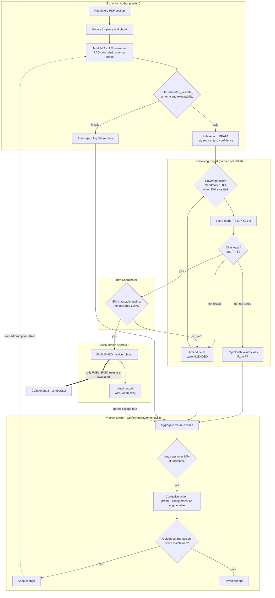

# The Expert Review Process — formal workflow definition

**Status of this document.** This is the formal specification of BIMGuard AI's Expert Review
process, written to close a gap identified at examination: earlier drafts asserted that
"expert review" validated the corrosion engine's risk-band distribution and that a
human-in-the-loop safeguard governed LLM-extracted rules, but never defined *who* reviews,
*against what criteria*, *at what cadence*, or *what happens to the finding afterwards*.
Section 6 states plainly which parts of this workflow are implemented in code today and which
are specified but not yet built.

---

## 1. Why the process exists

Two of BIMGuard's three components produce output that cannot be validated by unit tests alone.

| Component | What a test can prove | What only an expert can judge |
|---|---|---|
| **1 — LLM rule extraction** | The rule is schema-valid and executable | Whether the rule *means what the clause means* |
| **3 — Corrosion risk scoring** | The arithmetic matches the published formula | Whether the resulting risk band is *engineering-credible* for that element |
| **2 — Generic comparator** | Everything (pure functional threshold logic) | — nothing; Component 2 is out of scope for this process |

The process therefore has two review objects and one shared machinery:

* **Review object A — a candidate rule** produced by Component 1 from a regulatory clause.
* **Review object B — a compliance finding** produced by Component 3 (a corrosion issue with a
  composite score and risk band) or by Component 2 (a rule/element failure).

Component 2 is deliberately excluded as a review object: it is deterministic threshold evaluation
whose correctness is fully decidable by unit tests, so subjecting it to expert review would spend
scarce specialist time on the one thing that does not need it.

---

## 2. Roles

Roles are functions, not people; one person may hold several on a small project, but **the
Extraction Author and the Reviewing Expert must never be the same individual**, and the
Accountable Approver must never be the person who authored the amendment they are approving.

| Role | Held by | Responsibility | Authority |
|---|---|---|---|
| **Extraction Author** | The system (LLM converter + `RuleGenerator`) | Produces candidate rules with `confidence`, `source_text` and `ref` populated | May not approve anything |
| **Reviewing Expert** | Domain specialist — fire engineer, MEP/public-health engineer, or corrosion specialist depending on the clause | Scores the candidate against the rubric (section 4), records a decision and a rationale | Approve / Amend / Reject a single item |
| **BIM Coordinator** | Project BIM lead | Confirms the rule is *checkable against the delivered model* — that the IFC class and property actually exist in the federated model at the agreed LOIN | Veto on IFC-mappability only |
| **Accountable Approver** | Lead engineer or Information Manager (ISO 19650 role) | Publishes an approved rule into the active ruleset; owns the audit trail | Publish / Supersede / Withdraw |
| **Process Owner** | Project technical lead | Aggregates rejection reasons into the improvement cycle (section 5); owns the prompt and the engine tables | Change the extraction prompt or an engine threshold |

**Independence rule.** For any rule whose `severity` is `mandatory`, the Reviewing Expert must be
independent of whoever authored the source specification being checked. This mirrors ordinary
design-assurance practice and stops the process from degenerating into self-certification.

---

## 3. States and transitions

Every review object moves through a single state machine. The state is a property of the record,
not of a person's inbox, so the process is auditable after the fact.

| State | Meaning | Who may leave it | Evaluated by Component 2? |
|---|---|---|---|
| `DRAFT` | Extracted, schema-valid, not yet seen by a human | Extraction Author (auto-transition) | **No** |
| `IN_REVIEW` | Assigned to a named Reviewing Expert | Reviewing Expert | **No** |
| `AMENDED` | Expert changed one or more fields; must be re-reviewed by a second expert | Second Reviewing Expert | **No** |
| `REJECTED` | Not a valid rule; retained with its rejection class | — (terminal) | **No** |
| `APPROVED` | Passed the rubric; awaiting publication | Accountable Approver | **No** |
| `PUBLISHED` | In the active ruleset | Accountable Approver | **Yes** |
| `SUPERSEDED` | Replaced by a later version of the same clause | — (terminal) | **No** |

The single most important property of this table is the last column: **only `PUBLISHED` rules are
evaluated.** This is the enforcement gate whose absence is recorded as limitation #4 in the main
report — today `needs_review` is set and displayed, but a saved-but-unreviewed rule is still
evaluated by the comparator.

---

## 4. Acceptance criteria — the review rubric

A Reviewing Expert scores each candidate on five dimensions, 1–5. **A rule is approved only if
every dimension scores at least 4 and Traceability scores 5.** Anything else is Amended or
Rejected; there is no "approved with reservations".

| # | Dimension | Question the expert answers | Score 5 | Score 1 |
|---|---|---|---|---|
| T | **Traceability** | Can I find this requirement in the cited clause? | `ref` and `source_text` match the source document verbatim | No citation, or the citation does not contain the requirement |
| S | **Semantic fidelity** | Does the rule mean what the clause means? | Threshold, operator, unit and scope all match | Inverted operator, wrong unit, or a different requirement entirely |
| M | **IFC mappability** | Can this be checked against a delivered model? | `target`/`property_set`/`property_name` exist in the project's IFC deliverable | Property does not exist in IFC and has no geometric fallback |
| X | **Executability** | Will the comparator produce a decidable result? | Passes `RuleGenerator._validate()` and returns PASS/FAIL on the reference model | Returns `MISSING_DATA` or `NO_ELEMENTS` on a model that should satisfy it |
| C | **Scope correctness** | Are the conditions and exceptions right? | `applies_when` and `exceptions` reflect the clause's qualifications | Unconditional rule extracted from a conditional clause |

For **review object B** (a compliance finding rather than a rule), the rubric changes to four
dimensions with the same threshold: *Input fidelity* (were the material, environment and geometry
read correctly from the model?), *Term plausibility* (is each weighted sub-score defensible?),
*Band credibility* (would a competent engineer place this element in this band?), and *Action
proportionality* (is the mapped BCF priority and mitigation text proportionate?).

**Coverage policy.** 100% of rules with `severity: mandatory` are reviewed. For the remainder, a
stratified random sample of 20% is reviewed, stratified by `rule_type`, because the failure modes
observed in development cluster by rule type rather than by clause. A 20% overlap is
double-reviewed by two independent experts to measure inter-rater agreement (Cohen's kappa); a
kappa below 0.6 on any dimension is treated as a defect in the *rubric*, not in the reviewers, and
triggers a rubric revision before further reviewing continues.

---

## 5. The feedback cycle

Expert Review is not a gate that merely filters; its primary product is a *classified rejection
record* that drives systematic improvement. Every Reject or Amend decision is tagged with one
failure class, and those classes route to different owners.

| Failure class | Typical cause | Routed to | Corrective action |
|---|---|---|---|
| `F1-CITATION` | Clause reference hallucinated or wrong | Prompt (Component 1) | Tighten the `ref`/`source_text` instruction; add a citation-echo check |
| `F2-SEMANTIC` | Operator inverted, threshold or unit wrong | Prompt + few-shot examples | Add the failing clause as a RAG example served by `RuleStore.get_rules_sample()` |
| `F3-MAPPING` | `target`/`property_name` not a real IFC property | `CODE_TO_IFC_MAP` / `IFC_PROPERTY_SET_MAP` | Extend the enrichment maps in `app/modules/config.py` |
| `F4-SCOPE` | Conditions or exceptions dropped | Prompt | Strengthen the `applies_when`/`exceptions` schema guidance |
| `F5-GRANULARITY` | One clause split into too many or too few rules | Chunking (Module 1) | Adjust section chunking and the duplicate-suppression instruction |
| `F6-ENGINE` | Corrosion band judged not credible | Engine tables (Component 3) | Revise the threshold or weight in the ruleset asset, with the standard cited |
| `F7-INPUT` | Model data read incorrectly | Parser (Module 2) | Fix the property/material normalisation path |

**Cadence.** The cycle runs on the project's weekly coordination rhythm, so that review effort and
model-drop day coincide:

1. **Monday — extraction.** New or revised specification sections are processed; candidates enter `DRAFT`.
2. **Tuesday–Wednesday — review.** Candidates are assigned and scored. Target: median review time under 4 minutes per rule, which is what makes 100% coverage of mandatory rules affordable.
3. **Thursday — triage.** The Process Owner aggregates the week's rejection classes. Any class exceeding 10% of that week's decisions becomes a corrective action with a named owner.
4. **Friday — regression.** Corrective actions are applied and the golden set (`eval_harness.py`'s `EVAL_CASES`) is re-run. **A prompt or table change is only kept if the golden-set score does not regress** — this is what stops the loop from over-fitting to last week's rejections.
5. **Publication.** Approved rules are published into the active ruleset ahead of the next model drop.

**Process metrics.** Five numbers are tracked per cycle: first-pass acceptance rate; amendment
rate; rejection rate by class; median review time per item; and Cohen's kappa on the
double-reviewed overlap. A sixth, *defect escape rate* — approved rules later found wrong — is the
lagging indicator that tells you whether the rubric is calibrated at all.

---

## 6. Implementation status — what exists in code today

| Element of the process | Status | Evidence |
|---|---|---|
| `needs_review` flag on every rule | **Implemented** | `RuleGenerator._apply_defaults()`, default `False`; the prompt instructs the model to set it `True` when `confidence < 0.7` |
| Confidence score persisted per rule | **Implemented** | `confidence` field, schema-enforced in `RAG_SYSTEM_PROMPT` |
| Clause traceability (`ref`, `source_text`) | **Implemented** | Required fields in `RAG_SYSTEM_PROMPT` |
| Query for items awaiting review | **Implemented** | `RuleStore.fetch_needs_review()` |
| Reviewer-facing UI | **Partially implemented** | Rules are displayed for human inspection before saving; there is no scoring form |
| Schema/executability pre-check before a human sees it | **Implemented** | `RuleGenerator._validate()`, rule-type-aware via `RULE_TYPE_REQUIRED_FIELDS` |
| **The state machine of section 3** | **Not implemented** | No state column exists; a rule is either saved or not |
| **The enforcement gate (`PUBLISHED` only)** | **Not implemented** | Component 2 evaluates saved rules regardless of `needs_review` |
| **Reviewer identity, decision, rationale, timestamp** | **Not implemented** | No review record table exists |
| **Failure-class tagging and aggregation** | **Not implemented** | The taxonomy in section 5 is specified here for the first time |
| **Review of compliance findings (object B)** | **Not implemented** | Sign-off exists for rules only |
| Golden-set regression on prompt change | **Blocked** | `eval_harness.py` exists but calls a `RuleGenerator.generate_rules()` method that does not exist on the current class |

**Minimum viable implementation**, in the order it should be built: (1) add a `review_state`
column and gate Component 2's rule query on it — this alone converts the human-in-the-loop claim
from partially true to true; (2) add a review record (reviewer, decision, rationale, failure
class, timestamp); (3) build the five-dimension scoring form over the existing review UI; (4) fix
`eval_harness.py` so step 4 of the cadence can run. Items 1 and 2 are small schema changes and are
the highest-leverage work identified anywhere in this document.

---

## 7. Process diagram

*Figure — the Expert Review workflow. Solid arrows are the per-item review path; dashed arrows are
the improvement cycle that feeds corrections back into extraction. The double arrow is the
enforcement gate: it is the one edge in this diagram that does not yet exist in code.*
