# 1. Introduction

BIM Guard checks IFC building models against architectural building-code rules, tracks the results as BCF issues and reports, and keeps your project documents under ISO 19650 governance. This manual walks through every page of the app at <https://bim-guard.xyz>, in the order you will normally use them.

**Typical workflow**

1. Create a **project** and attach an IFC model.
2. Upload a code **document** (PDF/text) and extract **rules** from it, or pick an existing ruleset.
3. Run a **compliance audit**.
4. Review results, 3D view, **reports and exports** (BCF, PDF, Excel, CSV).

## Signing in

Open <https://bim-guard.xyz> and sign in with Google, or with email and password (a sign-up option is on the same screen). After sign-in you land on the **Dashboard**.

## Screen layout

- **Left sidebar** – navigation. At organization level it shows *My Home*, *Rules & Standards* and *Coordination & Graph*; inside a project it switches to project tools (Dashboard, Models, Run Compliance Audit, Reports & Exports, Evaluation, Graph-RAG Copilot, 3D Viewer, Query Console, Live Pipeline). **All Projects** returns you to the organization level.
- **Organization switcher** (top of sidebar) – change the active organization.
- **Top bar** – breadcrumb, **Documentation** and **Integrations** menus, **Admin** portal, and a light/dark theme toggle.
- **Resources** (bottom of sidebar) – Modeling Manual, User Manual, Revit IFC Export Setting, bSDD Wiki.

# 2. Projects

## 2.1 Dashboard (project registry)

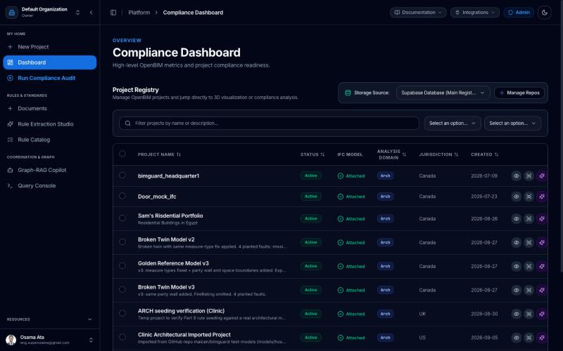

The dashboard lists every project with its status, whether an IFC model is attached, analysis domain, jurisdiction and creation date. Use the filter box and dropdowns to narrow the list, click a column header to sort, and use the row buttons to open a project's 3D view or audit. **Manage Repos** connects a model storage source.

## 2.2 New Project

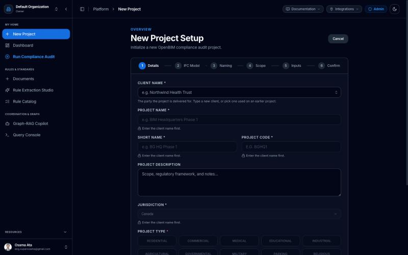

A six-step wizard: **Details → IFC Model → Naming → Scope → Inputs → Confirm**.

1. **Details** – client name, project name, short name, project code, description, jurisdiction and project type. Fields marked \* are required, and some unlock only after the client name is entered.
2. Continue through the steps to attach the IFC model, set ISO 19650 naming, scope and inputs, then confirm.

## 2.3 Project Dashboard

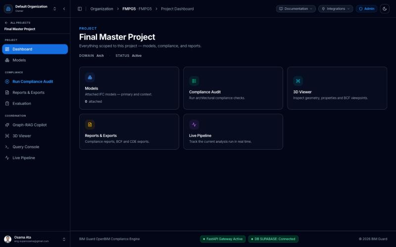

Opening a project shows its domain and status plus cards for Models, Compliance Audit, 3D Viewer, Reports & Exports and Live Pipeline.

## 2.4 Models

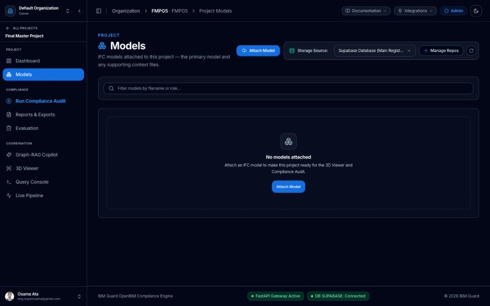

Lists the IFC models attached to the project. Use **Attach Model** to add the primary model or supporting context files. A project with no model shows an empty state with the same button. Projects need a model before the audit or 3D viewer can be used.

## 2.5 3D Viewer

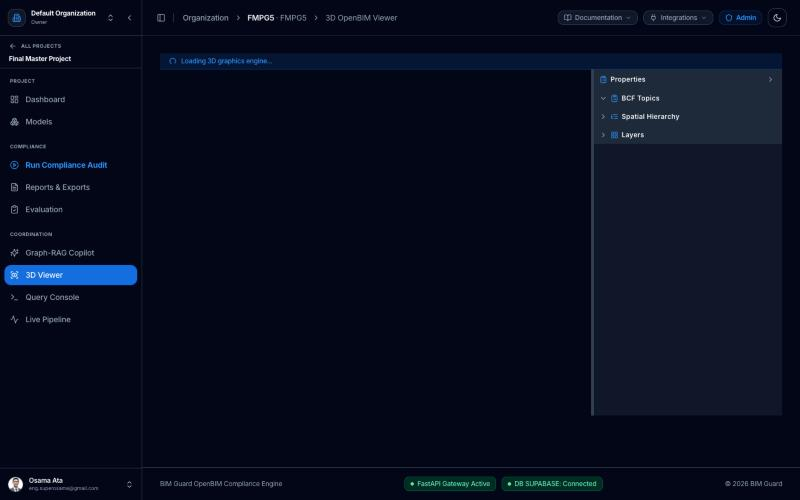

Shows the attached model with a docked panel for **Properties**, **BCF Topics**, **Spatial Hierarchy** and **Layers**. Select an element to inspect its properties; open a BCF topic to jump to its viewpoint. The screenshot shows the viewer while the graphics engine loads on a project that has no model attached yet.

# 3. Documents and rules

## 3.1 Documents

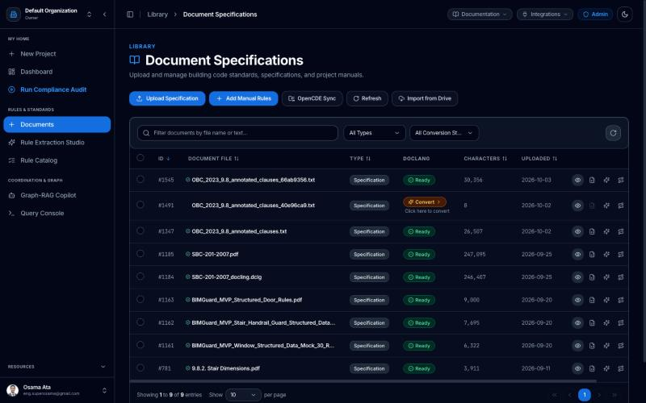

The document library holds building codes, specifications and project manuals.

- **Upload Specification** – add a PDF or text file.
- **Add Manual Rules**, **OpenCDE Sync**, **Import from Drive** – other ways to bring content in.
- The **DocLang** column shows whether a structured conversion is *Ready* or can be started with **Convert**.
- Search, type filter, sortable columns, row actions and pagination (10/25/50/100 per page) work as on every table in the app.

## 3.2 Rule Extraction Studio

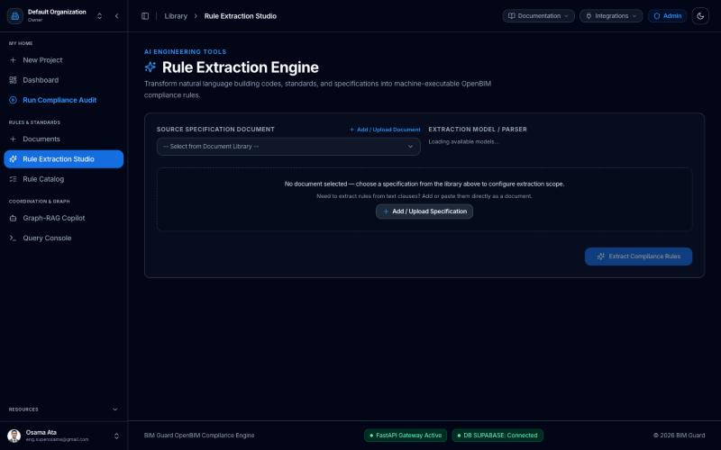

Turns natural-language code clauses into machine-executable rules.

1. Pick a **Source Specification Document** (or **Add / Upload Document**).
2. Choose the extraction model/parser.
3. Click **Extract Compliance Rules**, then review and approve the proposed rules. Your edits to a proposed rule are recorded, so corrections stay traceable.

## 3.3 Rules Catalog

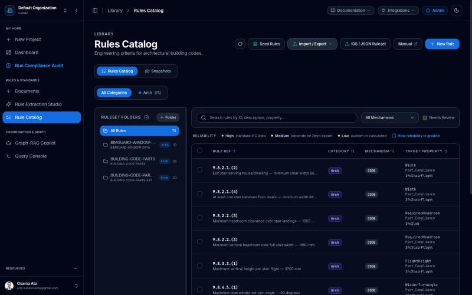

Browse and manage every rule. Rulesets (folders) are on the left; the table shows rule reference, category, mechanism (for example CODE) and target property. Search by id, description or property, filter by mechanism, or show only rules that **Need Review**. A **reliability** legend (High / Medium / Low) tells you how dependable the checked property is. Top-right actions: **Seed Rules**, **Import / Export**, **IDS / JSON Ruleset**, **Manual** and **+ New Rule**.

## 3.4 Manual Rule Editor

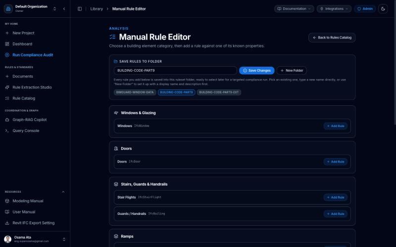

Write rules by hand. Choose the ruleset folder to save into (or create one with **New Folder**), pick a building-element category (Windows, Doors, Stairs, Ramps …) and click **Add Rule** against a known property. Press **Save Changes** when done.

## 3.5 bSDD Wiki

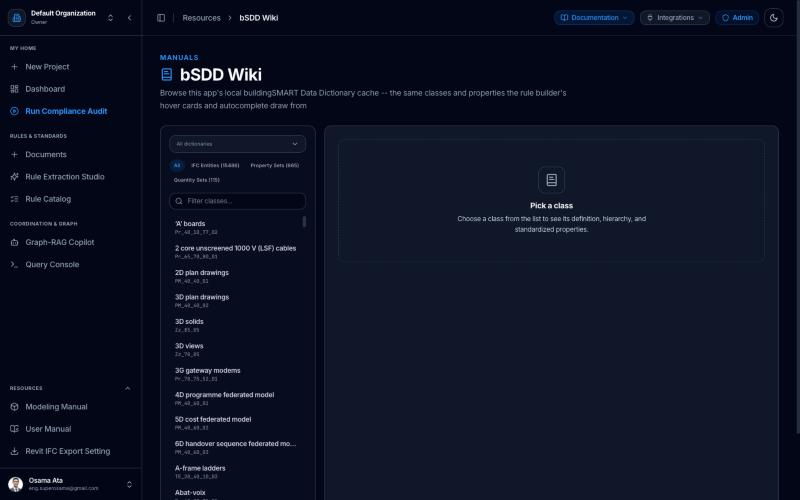

Read-only browser for the local buildingSMART Data Dictionary cache — the same classes and properties that power the rule builder's autocomplete. Filter by dictionary, entity, property set or quantity set, then pick a class to see its definition and standard properties.

## 3.6 Document Viewer

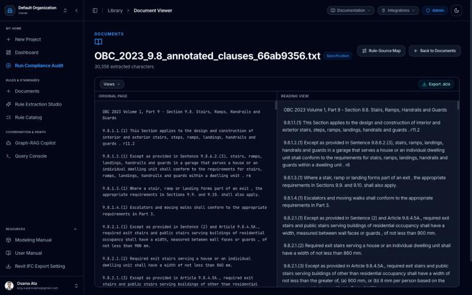

Open a document from the library to read it. The left pane shows the **Original Page** and the right pane the cleaned **Reading View**; **Export .dclx** saves the structured DocLang version, and **Views** switches the layout. **Rule-Source Map** jumps to the rules extracted from this document.

## 3.7 Rule-Source Map

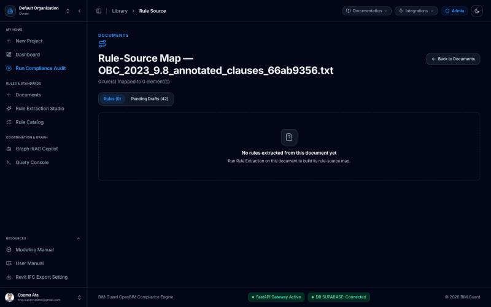

Shows which rules were extracted from a document and which model elements they map to. The **Rules** tab lists approved rules; **Pending Drafts** lists extracted rules awaiting review. A ruleset-level *Source Map* (reached from the Rules Catalog) shows which documents a whole ruleset came from.

# 4. Running and reviewing compliance

## 4.1 Run Compliance Audit (quick start)

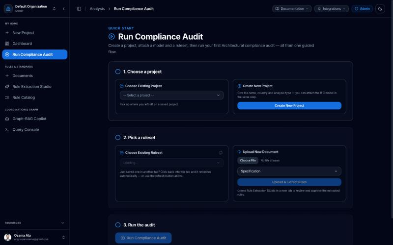

A guided three-step flow from the sidebar:

1. **Choose a project** – existing or create new.
2. **Pick a ruleset** – an existing one, or upload a document and extract rules.
3. **Run the audit.**

## 4.2 Architectural Compliance Audit

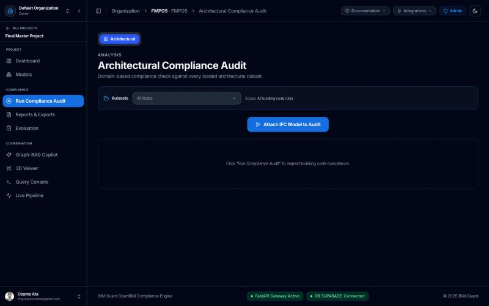

Inside a project, select a **Ruleset** (or *All Rules*) and press **Run Compliance Audit** (shown as **Attach IFC Model to Audit** when no model is attached yet). Results appear in the panel below.

## 4.3 Live Pipeline

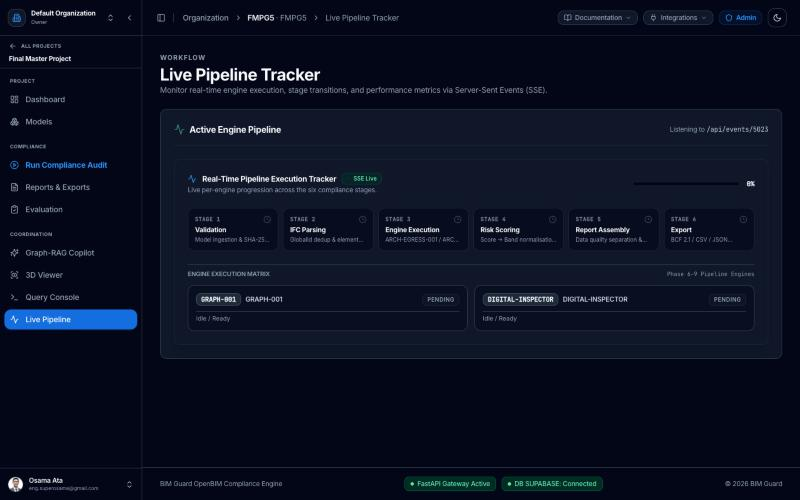

Real-time progress of the run via server-sent events across six stages: Validation, IFC Parsing, Engine Execution, Risk Scoring, Report Assembly and Export. The *Engine Execution Matrix* shows each engine's state (Pending, Running, Done).

## 4.4 Reports & Exports

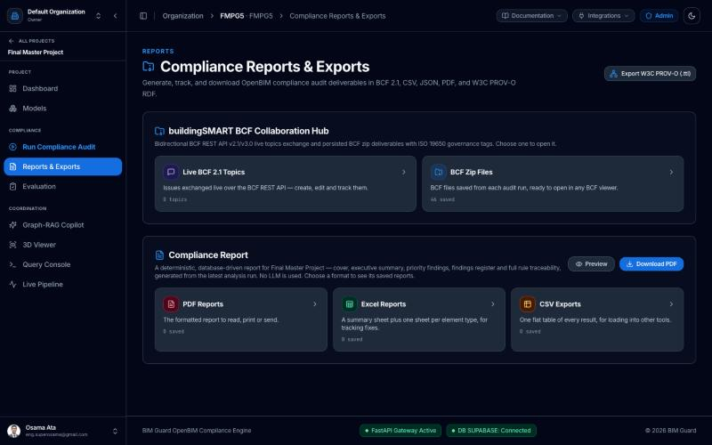

- **BCF Collaboration Hub** – *Live BCF 2.1 Topics* (issues exchanged over the BCF API) and *BCF Zip Files* saved from each audit.
- **Compliance Report** – **Preview** or **Download PDF**; also Excel and CSV exports.
- **Export W3C PROV-O (.ttl)** – provenance of the analysis.

## 4.5 Evaluation

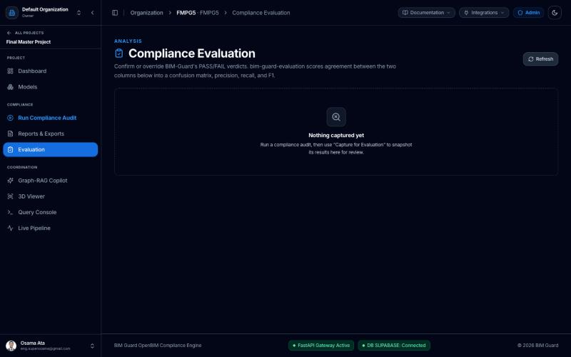

Confirm or override BIM Guard's PASS/FAIL verdicts after an audit (use **Capture for Evaluation**). Agreement is scored as a confusion matrix with precision, recall and F1.

# 5. Graph-RAG and queries

## 5.1 Graph-RAG Copilot

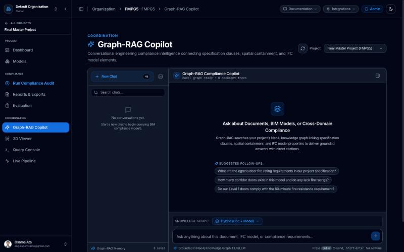

Ask questions about documents, the IFC model, or both, with answers grounded in the project's knowledge graph and cited. Pick the project at top right and the **Knowledge Scope** (Hybrid, Document, Model). Chats are saved in the left column and searchable. Suggested follow-ups give quick starting questions.

## 5.2 Query Console

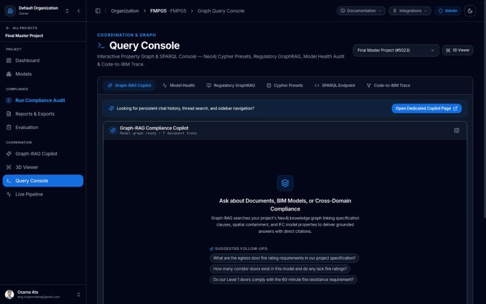

Tabs: **Graph-RAG Copilot**, **Model Health**, **Regulatory GraphRAG**, **Cypher Presets**, **SPARQL Endpoint** and **Code-to-BIM Trace** — for advanced inspection of the property graph.

# 6. Integrations and resources

## 6.1 Revit Direct Sync

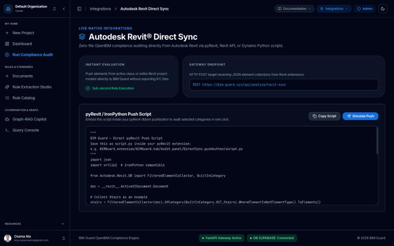

Audit directly from Revit without exporting IFC. Copy the **pyRevit / IronPython push script** into a pyRevit button; it POSTs element data to the gateway endpoint shown. **Simulate Push** tests it.

## 6.2 IFC Export Setting

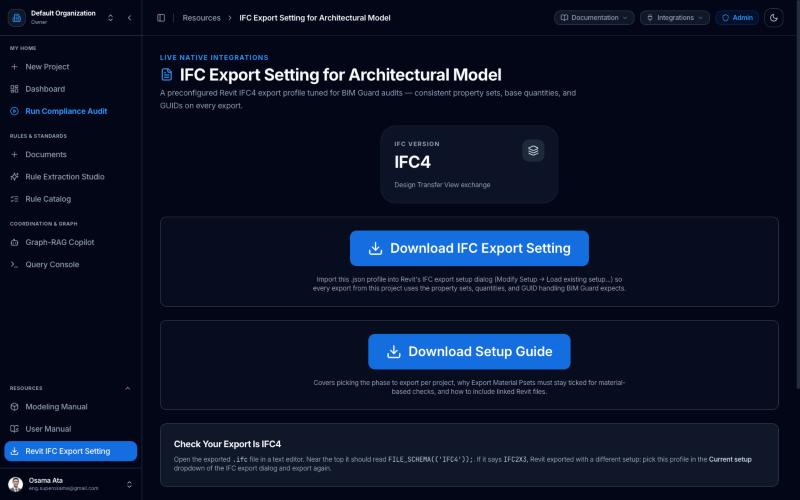

Download a preconfigured IFC4 export profile (`.json`) and a setup guide for Revit so exports contain the property sets, quantities and GUIDs BIM Guard needs. Check that the exported file starts with `FILE_SCHEMA(('IFC4'))`.

## 6.3 User Workflow Manual

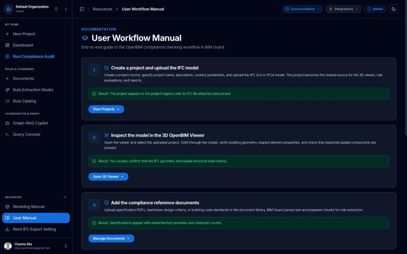

The in-app step-by-step guide: create a project and upload the IFC, inspect it in the 3D viewer, add reference documents, and so on. Each step has a button that jumps straight to the right page.

## 6.4 3D Modeling Reference

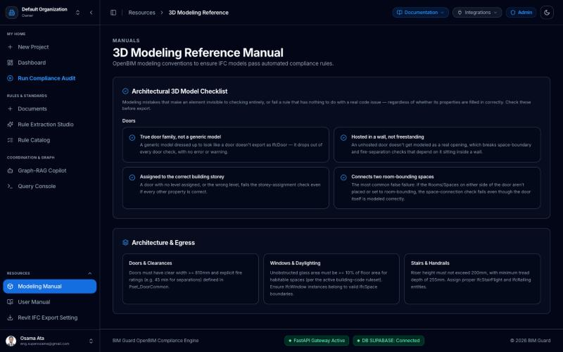

Modeling conventions that make an IFC pass automated checks — for example doors must be true `IfcDoor` elements, hosted in a wall, assigned to a storey and connected to room-bounding spaces — plus egress, daylight and stair/handrail guidance.

# 7. Settings and administration

## 7.1 Runtime Settings

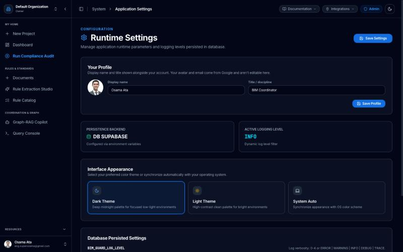

Edit your display name and title, and choose **Dark**, **Light** or **System Auto** appearance. Persistence backend and log level are shown for reference; **Save Settings** stores changes.

## 7.2 Admin Portal

Reach it with the **Admin** button (owners/admins). Its sidebar contains: Organization settings, External providers, Role permissions, Users & organizations, Ruleset access, Project access and Document access. **Back to Main App** returns you to the workspace.

### Organization settings

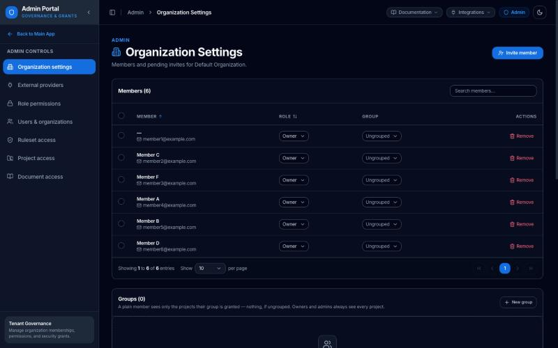

Members and pending invites for the active organization. Change a member's **Role** or **Group**, **Remove** them, or add people with **Invite member**. Groups (below the table) control project visibility: a plain member sees only the projects their group is granted, while owners and admins see every project. *Member names and emails in this manual's screenshots are anonymised.*

### External providers

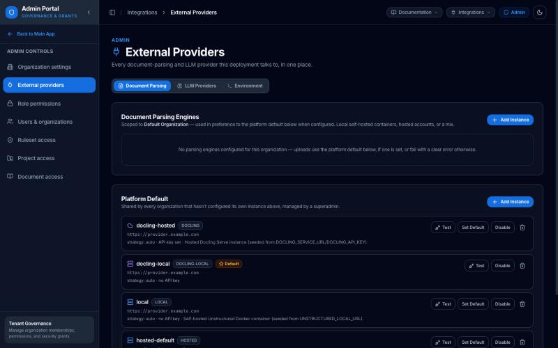

Tabs for **Document Parsing**, **LLM Providers** and **Environment**. Add parsing engines for your organization (they are used in preference to the platform default), or review the platform defaults. Each instance can be tested (**Test**), made the default, or disabled. Endpoint URLs are masked in the screenshot.

### Role permissions

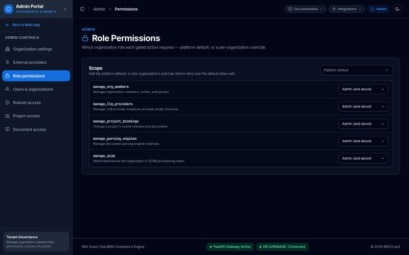

Choose which role each gated action requires (for example `manage_org_members`, `manage_llm_providers`), as a platform default or a per-organization override.

### Ruleset access

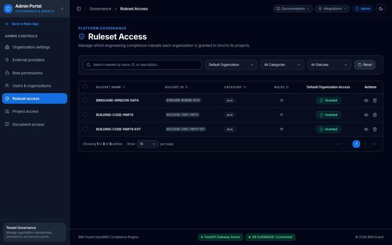

Grant or revoke each organization's access to rulesets so they can be bound to its projects.

### Users & organizations

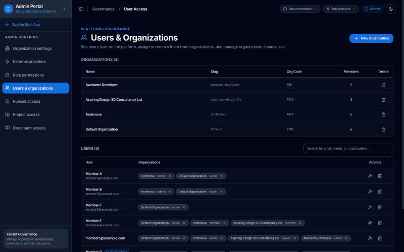

Platform-wide list of organizations (with slug, org code and member count) and users. Create an organization with **New Organization**, assign a user to organizations or remove them with the row actions, and search by email, name or organization. Superadmin only; user identities are anonymised in the screenshot.

### Project access

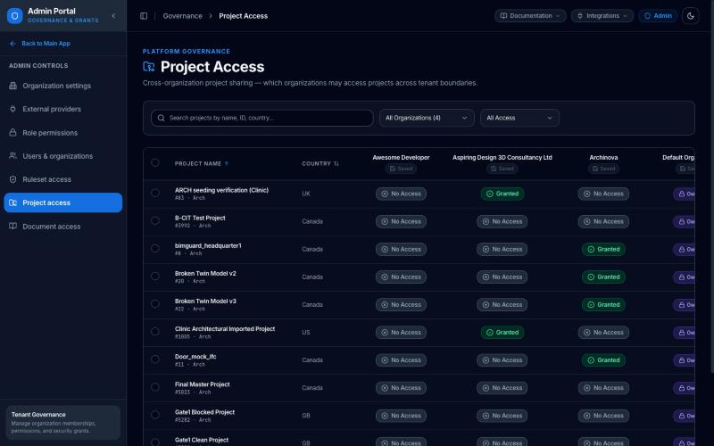

A matrix of projects against organizations showing *Granted*, *Owner* or *No Access*, for sharing a project across tenant boundaries.

### Document access

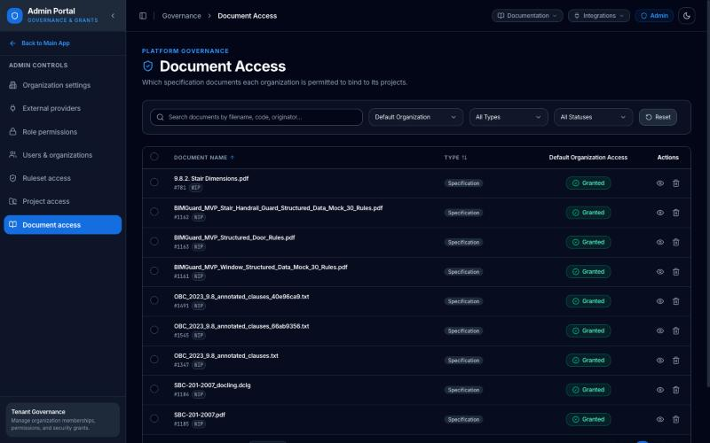

Controls which specification documents an organization may bind to its projects. Filter by type or status and grant or revoke per document.

# 8. Tips

- Every table supports search, filters, column sorting, multi-row selection with bulk actions, and pagination.
- Project-specific pages carry `?project_id=` in the address, so you can bookmark or share a link to a project view.
- Not seeing a project? Ask an owner to add you to a group with access.
